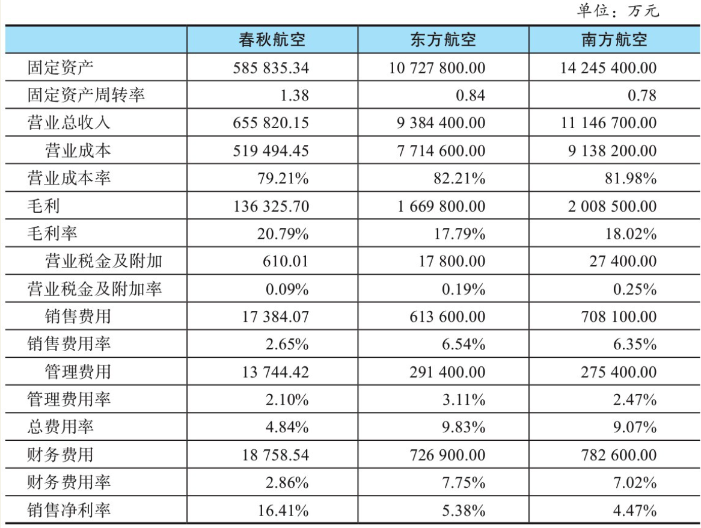
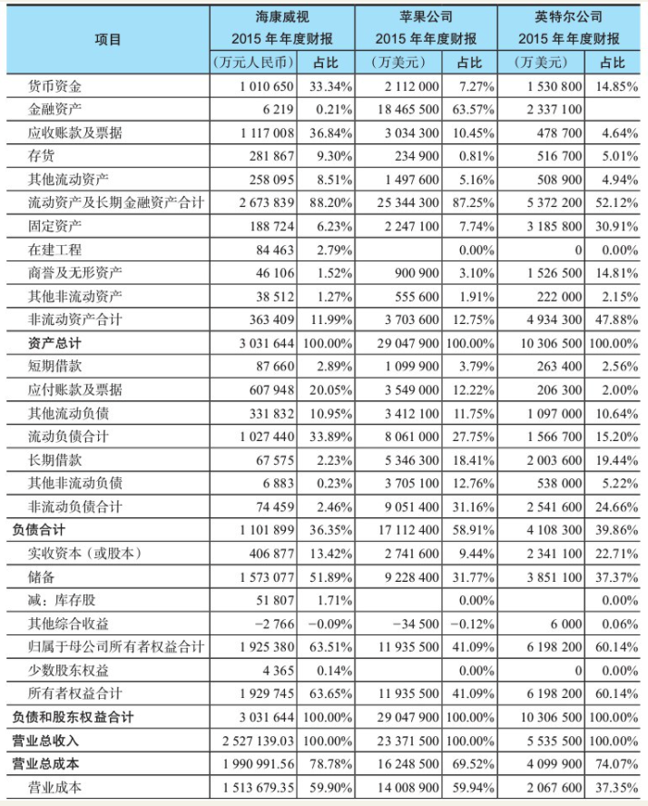
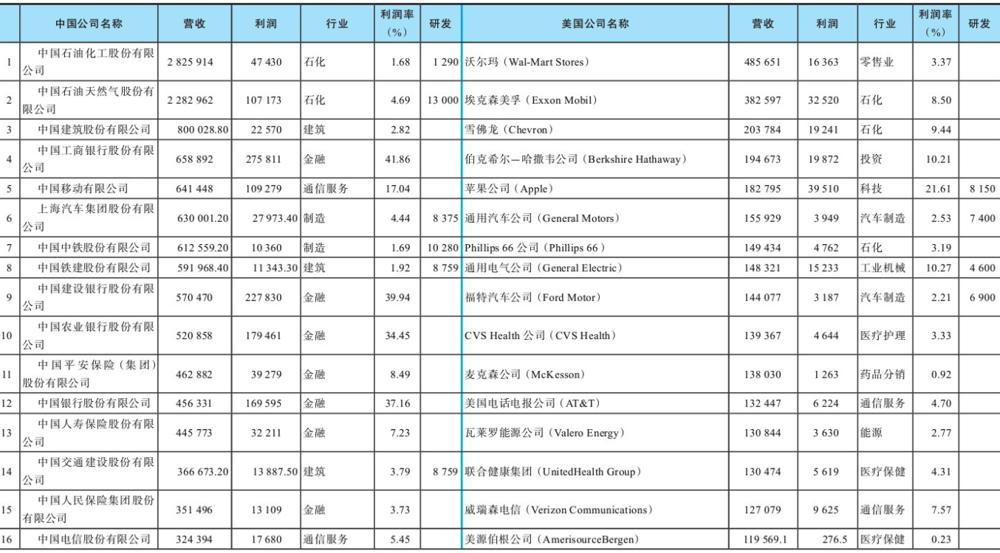
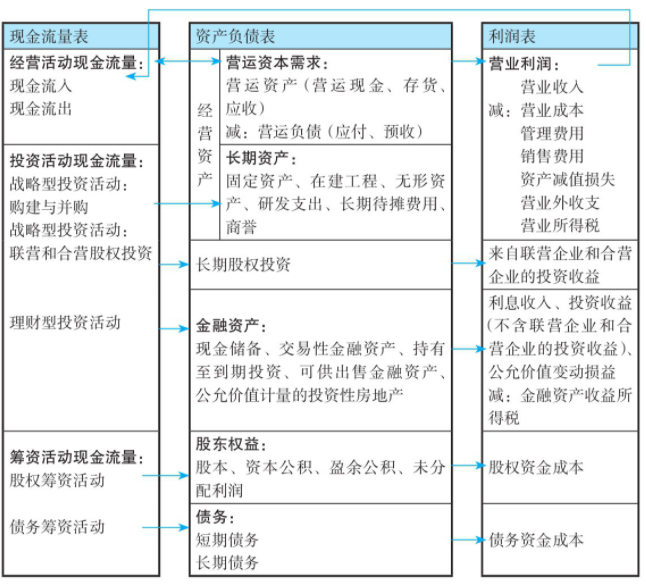

    作者: 郭永清
    出版社: 机械工业出版社
    出版年: 2017-7
    页数: 368
    定价: 69.00元
    装帧: 平装
    ISBN: 9787111572534

[豆瓣链接](https://book.douban.com/subject/27088971/)

- [第1章 财报基础](#第1章-财报基础)
  - [1.1 审计报告](#11-审计报告)
  - [1.2 财务报表](#12-财务报表)
  - [1.3 资产负债表](#13-资产负债表)
  - [1.4 利润表](#14-利润表)
  - [1.5 现金流量表](#15-现金流量表)
  - [1.6 股东权益变动表](#16-股东权益变动表)
- [第2章 财报原理及财报质量](#第2章-财报原理及财报质量)
  - [2.1 财报数字的来龙去脉](#21-财报数字的来龙去脉)
  - [2.2 判断财报质量的六个步骤](#22-判断财报质量的六个步骤)
- [第3章 公司财报分析的框架](#第3章-公司财报分析的框架)
  - [3.1 公司的目标：为价值而生](#31-公司的目标为价值而生)
  - [3.2 以价值为核心的财报分析](#32-以价值为核心的财报分析)
  - [3.3 公司创造价值的过程就是公司财报的生成过程](#33-公司创造价值的过程就是公司财报的生成过程)
- [第4章 公司战略与财务报告之间的关系](#第4章-公司战略与财务报告之间的关系)
  - [4.1 公司战略：行业选择和竞争策略决策](#41-公司战略行业选择和竞争策略决策)
  - [4.2 公司行业与公司财务报表之间的关系](#42-公司行业与公司财务报表之间的关系)
  - [4.3 两种不同的公司竞争策略](#43-两种不同的公司竞争策略)
  - [4.4 总成本领先策略下的财报特征](#44-总成本领先策略下的财报特征)
  - [4.5 差异化策略下的财报特征](#45-差异化策略下的财报特征)
  - [4.6 从财报数字看中国公司发展转型的迫切性](#46-从财报数字看中国公司发展转型的迫切性)
  - [4.7 公司策略转型的财报解释：以苹果公司和莱宝高科为例](#47-公司策略转型的财报解释以苹果公司和莱宝高科为例)
  - [4.8 公司战略和公司财报关系的总结](#48-公司战略和公司财报关系的总结)
- [第5章 财报项目之间的逻辑关系](#第5章-财报项目之间的逻辑关系)
- [第6章 从投资活动现金流量看一家公司的战略和未来](#第6章-从投资活动现金流量看一家公司的战略和未来)
  - [6.1 投资活动现金流量的格式和项目](#61-投资活动现金流量的格式和项目)
  - [6.2 与公司战略关联度不大的投资活动现金流量项目](#62-与公司战略关联度不大的投资活动现金流量项目)
  - [6.3 充分反映公司战略的投资活动现金流量项目](#63-充分反映公司战略的投资活动现金流量项目)
  - [6.4 不涉及投资活动现金流量的购建和并购决策及活动以及其他例外情况](#64-不涉及投资活动现金流量的购建和并购决策及活动以及其他例外情况)
  - [6.5 公司投资活动的决策标准](#65-公司投资活动的决策标准)
- [第7章 从筹资活动现金流量看一家公司的资本管理能力](#第7章-从筹资活动现金流量看一家公司的资本管理能力)

# 第1章 财报基础
内容最完整、最全面的上市公司年度报告包括`审计报告`、`财务报表`和`报表附注`三个组成部分。

## 1.1 审计报告
`审计报告`在整个年度财务报告的第一页，相当于后续财务报表和报表附注的质量鉴定书。一般来说，季度报告和半年度报告都无须审计报告。

审计报告中的审计意见有五种类型：

1. 标准无保留意见:标准无保留意见说明，注册会计师认为上市公司编制的财务报表已按照适用的会计准则的规定编制，并在所有重大方面真实公允地反映了上市公司的财务状况、经营成果和现金流量。
2. 带强调事项段的无保留意见:带强调事项段的无保留意见说明，注册会计师认为上市公司编制的财务报表符合相关会计准则的要求，并在所有重大方面真实公允地反映了上市公司的财务状况、经营成果和现金流量，但是存在需要说明的事项，如对持续经营能力产生重大疑虑及存在重大不确定事项等。
3. 保留意见:保留意见说明，注册会计师认为财务报表整体是真实公允的，但是存在影响重大的错报。
4. 无法表示意见:无法表示意见说明，注册会计师的审计范围受到了限制，且其可能产生的影响是重大而广泛的，注册会计师不能获取充分的审计证据。
5. 否定意见:否定意见说明，注册会计师认为财务报表整体是不公允的，或没有按照适用的会计准则的规定编制。

## 1.2 财务报表
上市公司财务报表从内容来说包括`资产负债表`、`利润表`、`现金流量表`和`所有者权益变动表`，从范围来说包括合并财务报表和母公司财务报表。

`资产负债表`是反映上市公司在某一特定日期财务状况的财务报表。大家可以注意到资产负债表都标明“××年××月××日”，指的就是这张资产负债表反映的是这家公司在该日的情况。资产负债表是时点报表，因此我们把资产负债表比喻为公司的“一张照片”。

`利润表`是反映上市公司在某一期间内的经营成果的财务报表。利润表会注明“××年××月××日~××年××月××日”，指的就是这张利润表反映的是这家公司在这一段时期内的经营成果情况。

`现金流量表`是反映上市公司在某一期间内的现金和现金等价物流入和流出的财务报表，也会与利润表一样注明时间段。

`所有者权益变动表`，也称为股东权益变动表，是反映构成股东权益的各组成部分在某一期间的增减变动情况的财务报表。所有者权益与股东权益是同一个含义，后文中两者通用。

## 1.3 资产负债表
资产负债表遵循“资产=负债+股东权益”这一等式，把上市公司在特定时点所拥有的资产和所承担的负债及属于股东的权益分类反映出来。

`资产`分为`流动资产`和`非流动资产`。

- 流动资产一般预计在一年或者短期内变现、出售或者耗用，一般包括货币资金、交易性金融资产、应收票据、应收账款、预付款项、应收利息、应收股利、其他应收款、存货、一年内到期的非流动资产等。
- 非流动资产则变现、出售或者耗用的周期比较长，一般包括可供出售金融资产、持有至到期投资、长期应收款、长期股权投资、投资性房地产、固定资产、在建工程、工程物资、固定资产清理、生产性生物资产、油气资产、无形资产、开发支出、商誉、长期待摊费用、递延所得税资产等。

`负债`分为`流动负债`和`非流动负债`，其划分标准与资产相同。

- 流动负债包括短期借款、交易性金融负债、应付票据、应付账款、预收款项、应付职工薪酬、应交税费、应付利息、应付股利、其他应付款、一年内到期的非流动负债等。
- 非流动负债包括长期借款、应付债券、长期应付款、专项应付款、预计负债、递延所得税负债等。

`股东权益`是公司资产扣除负债后的剩余权益，归股东所有，一般包括实收资本、资本公积、盈余公积、未分配利润以及作为减项的库存股等。

## 1.4 利润表 
`利润表`反映上市公司经营业绩的主要来源和构成，帮助我们判断利润的连续性和稳定性、利润的质量和风险。上市公司的利润表根据“利润=收入-成本费用”的公式分三步编制，不同步骤下的数据反映利润的不同来源。

1. 以营业收入为基础，减去营业成本、营业税金及附加、销售费用、管理费用、财务费用、资产减值损失，加上公允价值变动收益和投资收益，计算出营业利润。
2. 以营业利润为基础，加上营业外收入，减去营业外支出，计算出利润总额。
3. 以利润总额为基础，减去所得税费用，计算出净利润。

## 1.5 现金流量表 
`现金流量表`反映上市公司现金变动的原因和构成，帮助我们判断现金流入和现金流出的连续性和稳定性、现金来源的质量和风险。现金流量表以现金和现金等价物为基础来编制。现金等价物是指公司持有的期限短、变现能力强，易于转换为已知金额的现金和价值变动风险很小的投资。

`现金流量表`划分为`经营活动现金流量`、`投资活动现金流量`和`筹资活动现金流量`三类，

- 经营活动是指公司投资活动和筹资活动以外的所有交易和事项。各类企业由于行业特点不同，对经营活动的认定存在一定差异。一般工商企业的经营活动主要包括购买商品，接受劳务，销售商品，提供劳务，支付税费等；银行的经营活动主要包括吸收客户存款，发放贷款等。
- 投资活动是指公司长期资产的购建活动、企业的并购活动以及现金等价物外的金融资产的投资活动及上述资产的处置活动。长期资产包括固定资产、无形资产、在建工程、研发支出以及其他持有期限在一年以上的资产。
- 筹资活动是指公司筹集资金及偿还资金或给予资金回报的活动，包括股东投资入股，给股东现金分红，向银行或其他债权人借入款项，偿还债务本金，支付利息等。

## 1.6 股东权益变动表
`股东权益变动表`反映上市公司股东权益变动的原因和构成。

# 第2章 财报原理及财报质量
## 2.1 财报数字的来龙去脉
`借贷记账法`中的“借”和“贷”只是一个符号，没有什么实质含义。前文有两个公式：资产=负债+股东权益，利润=收入-成本费用。利润归股东所有，是股东权益的组成部分。我们可以把两个公式合并为一个：资产=负债+股东权益+收入-成本费用。这个公式是一个恒等式，要永远保持平衡，右边表示公司的资金来源，左边表示公司的资金用途。“借”这个符号表示企业资产和成本费用的增加、负债和股东权益及收入的减少，“贷”这个符号表示企业资产和成本费用的减少、负债和股东权益及收入的增加。

`收付实现制`，是指以现金的实际收付为标志来确定本期收入和支出的会计核算基础。凡在当期实际收到的现金收入和支出，均应作为当期的收入和支出；凡是不属于当期的现金收入和支出，均不应作为当期的收入和支出。一句话，收付实现制就是现钱买卖，一手交钱一手交货。收付实现制以现金为基础，不涉及跨期确认的问题。公司在编制现金流量表时，不需要做任何会计估计和选择，就看公司当期发生的真金白银的现金流。

`权责发生制`，是指以取得收取款项的权利或支付款项的义务为标志来确定本期收入和费用的会计核算基础。凡是当期已经实现的收入和已经发生的或应当负担的费用，不论款项是否收付，都应作为当期的收入和费用；凡是不属于当期的收入和费用，即使款项已在当期收付，也不应作为当期的收入和费用。一句话，权责发生制就是信用买卖，可以预付或赊欠。权责发生制以权利和义务为基础，涉及跨期确认的问题。公司在编制资产负债表和利润表时，需要判断收入和费用所归属的期间，做出较多的会计政策选择和会计估计判断。

## 2.2 判断财报质量的六个步骤
财务报告信息质量分析的主要步骤与方法如下。

_步骤一：确定关键会计政策_

企业的行业特点和自身的竞争策略决定了其关键的成功因素和主要风险。所以，我们应当确定并评价企业用于测定关键因素和风险的会计政策及会计估计。

_步骤二：判断会计处理的灵活性_

会计政策的选择是所有企业都要面对的，如折旧政策（直线法和加速折旧法）、库存会计政策（先进先出法或平均成本法）、商誉减值和关于职工福利的会计政策等，但并非所有的企业在选择各自的主要会计政策时都有同等的灵活性。一些企业的会计政策选择受到会计标准和惯例的严格限制。

_步骤三：评价会计政策和会计估计的合理性_

在分析管理人员如何运用会计灵活性时，下面一些问题是必要的。

- 公司的会计政策与行业标准相比较如果不一样，是否是因为该企业的竞争策略是独一无二的？
- 管理部门是否有利用会计随意性进行收入管理的强烈动机？
- 企业改变任何一项政策或估计了吗？理由是什么？这些变化的影响是什么？
- 公司的政策和估计过去实现过吗？是否为达到一定的会计目的而进行所需的经营业务结构调整？

_步骤四：评价信息披露的详细程度_

会计准则只对财务报告披露的最低限度提出了要求，这就给管理人员提供了很大的选择余地。所以披露质量是体现企业会计质量的一个重要方面。下述问题在评价披露质量时是重要的。

- 公司是否披露了充分的资料，以评估企业的经营策略和经济效果？
- 会计报表附注是否足以解释主要的会计政策和假设以及相关财务数据的变化？
- 企业是否能充分解释其当前的经营状况？如果一段时间的利润率下降了，那么是因为价格竞争，还是因为生产成本上升？若销售和日常管理费用上升，那么是因为企业正在根据追求差别策略进行投资，还是因为非生产性间接费用攀升？
- 如果会计准则制约着企业适当地测定其成功的关键因素，那么企业是否能够透露额外的信息，帮助外部人士了解企业是如何管理这些因素的？
- 报告透露坏消息的及时性如何？处理方法如何？管理人员处理坏消息的方法可以清楚地反映披露的质量。

_步骤五：确定潜在的危险信号_

通过上述分析，分析人员应当对有关的严重影响会计质量的特定事项做出标记——危险信号，常见的危险信号有以下几项。

- 未加解释的会计政策或会计估计的变化。尤其是经营很糟糕的时候，这表明管理人员可能正在利用会计随意性“打扮”其财务报表。
- 引起销售增长的应收账款及库存非正常增长。一般情况下，应收账款的非正常增长意味着公司可能过度放松其信用政策。这使企业在随后的时间里，将面临由于顾客违约而注销应收账款的可能性。如果加速向销售渠道发货，那么企业可能在随后的时间里面临退货或发货量下降的局面。就库存增加而言，若库存增加是由于产成品存货增加，那么这可能是企业产品需求下降的信号，表明企业可能被迫削价或计提存货跌价准备。半成品存货的增加需要结合公司生产能力的变化分析，以判断其合理性。如果公司生产能力没有扩张，则半成品存货的增加意味着公司生产效率降低，或者有可能是本期低转销售成本以提高利润。如果原料增加，那么表明有可能是生产和采购的效率低下，将导致销售货物的成本增加。
- 企业销售收入与营业现金流量及税务收支之间的差距扩大。应该说，权责发生制下会计数据与现金流量和税务收支不一致是正常的。不过，若公司会计政策保持不变，它们之间的关系通常是稳定的。如果它们的关系发生变化，则可能表明企业会计核算中的变化。
- 未预计到的大量资产注销。这表明管理部门对经营环境的变化未能及时并入企业会计核算过程中。
- 年度报告相对于中期报告的大量调整。企业年度报告由审计人员进行审计，但中期报告通常仅是复核一下而已。如果企业的管理人员不愿意在中期报告中做出恰当的会计估算，那么必须在年终做出调整。这种调整往往表明企业中期报告的会计倾向。
- 缺少市场客观判断的关联交易。通俗地说，就是为了一定的会计目的而在集团内的公司间“调账”。
- 高管人员的频繁更换。尤其是关键岗位高管人员的频繁更换，比如财务总监、独立董事、监事人员频繁更换，会计师事务所频繁更换等，都是非常危险的信号。
- 大股东或者高管人员不断减持公司的股票。因为大股东和高管人员往往具有内部信息优势，不断减持公司股票意味着他们不看好公司的前景。
- 频繁的资产重组和剥离、股权转让。除非是投资公司，实业类公司如果频繁地进行上述运作，往往也是危险的信号。

_步骤六：消除会计扭曲_

由于报告数据存在误导，我们需要重新列示报告数据以减少扭曲程度。综合现金流量表和财务报表附注可以帮助分析人员鉴别报告中数据的误导性。

# 第3章 公司财报分析的框架
## 3.1 公司的目标：为价值而生
最常见的与财务管理的“价值”相关的概念就是利润和现值。我们认为，以现金流和自由现金流的现值作为“价值”的核心，可以满足上述特征：

1. 现金流和自由现金流可以明确界定。自由现金流即公司在维持原有营业规模的基础上，通过经营活动所取得的现金净流量。
2. 现金流和自由现金流可以具有很好的包容性，适用于公司的战略规划、投资决策、筹资决策、营运决策等各个领域。
3. 可以计量。
4. 可以标准化。不同企业、不同时点的现金流都可以统一到同一个标准。

利润的缺陷如下：

1. 没有考虑货币的时间价值。
2. 不同的会计政策选择和会计估计会导致不同的利润口径。
3. 利润在权责发生制下存在着会计调整的可能性。

综上所述，公司的终极目标——提升公司价值，也就是提升一个公司“风险和报酬平衡下的公司自由现金流现值”。

公司创造价值的概括性描述就是：投入现金，收回更多的现金！公司价值的定义就是：该公司在其余下的寿命期内可以产生的现金的折现值。记住：世界再大，价值只有上面这一个标准，其他都是伪标准！

## 3.2 以价值为核心的财报分析
财务报告分析的主体包括股东、债权人（金融机构、企业单位）、公司高管、政府经济管理部门、公司工会组织、注册会计师等，其中最重要的主体是股东、债权人和公司高管。

- 股东分析的目的是，判断价值并做出投资决策。股东在进行投资决策时会思考：我的交易价格合理吗？这些股票的内在价值（实际价值）是多少？股东试图找到问题的答案。
- 债权人分析的目的在于判断价值，以保证债权的安全。债权人分析的目的在于保证债权的安全，以及时收回本金和利息。债权的安全取决于公司是否能够创造出足够的价值。大家也许会说：只要给债权提供足够的资产抵押，就可以保证债权的安全。短期内的确如此，但是如果一家公司在未来不能创造出足够的价值，债权到期时债权人拿大把大把的抵债资产在手里，成为抵债资产处置公司，这应该不是债权人所期望的——抵债资产的处置成本是非常高的。公司清算将对债权人和股东造成极大的损害，清算资产的价格会显著低于公允价值。
- 公司高管分析的目的是创造价值，以满足投资者的预期回报。公司在资本市场上募集资金后，公司高管制定战略并通过投资活动和经营活动来创造价值。财报分析有助于对是否进行投资做出决策，而且有助于投资计划的制订和投资活动的实施。公司高管的基本任务之一就是，运用财报分析改进管理来创造价值。

## 3.3 公司创造价值的过程就是公司财报的生成过程
“起于战略，重在执行，止于财报”，即公司战略+执行过程=财报结果。

# 第4章 公司战略与财务报告之间的关系
## 4.1 公司战略：行业选择和竞争策略决策
如何选择公司经营的行业，和如何选择公司在一个行业中的竞争策略。这也正是公司战略要解决的问题。

## 4.2 公司行业与公司财务报表之间的关系
公司所处的行业将在很大程度上决定公司财报的结构特征以及盈利水平。对于不同行业的公司，财报分析的重点往往也存在着差异。比如，重资产行业的公司在分析的时候，需要重点分析公司长期资产周转率，以判断长期资产的使用效率以及成本管理情况；轻资产行业的公司在分析的时候，需要重点分析公司的品牌、技术和研发投入，以及这些资源所带来的溢价能力和高毛利率是否可以持续；金融公司在分析的时候，重点分析公司风险管理的能力和信贷资产的质量。在对一家公司的财报进行分析之前，我们一定要了解公司所处的行业对财报数字的影响，并确定分析的重点。

## 4.3 两种不同的公司竞争策略
我们在前面分析了行业吸引力的问题，接下来分析公司战略的第二个中心问题——竞争策略。`竞争策略`可以概括为采取进攻性或防守性行动。

低成本优势和差异化优势可由行业结构所左右，并且取决于公司是否能够比它的对手更有效地在市场上进行竞争。公司选择竞争策略的时候，要考虑自身是否具备与之相匹配的能力，在此基础上采取与竞争策略相对应的行动，具体如图4-2所示。

从公司竞争策略的角度来说，未来的商业世界只有两类大型企业：

1. 精益管理下的客户需求拉动的低成本生产和服务型企业，比如精益制造的丰田汽车、宝钢股份；
2. 不断创新从而创造和引导客户需求的差异化生产和服务型企业，比如创造智能手机需求的苹果。满足客户需求是公司核心竞争力的源泉。

## 4.4 总成本领先策略下的财报特征
`总成本领先策略`也被称为`低成本策略`，是指公司通过有效途径降低成本，使公司的全部成本低于竞争对手，甚至在同行业中是最低的成本，从而获取竞争优势的一种策略。

达到总成本领先的方式有多种，如规模经济、改进经济、高效生产、产品设计优化、低投入成本以及有效的组织实施等，它贯穿于投融资、产品设计、生产、销售等各个经营层面。一般来说，总成本领先策略执行得好的公司在财务报表中体现出来的毛利率，比差异化策略的公司要低。总成本领先策略的公司在管理中更加关注的是对于成本和费用的控制，将不为客户带来附加价值的产品、服务予以简化。

根据公司获取成本优势的方法不同，我们把成本领先策略概括为如下六种主要类型：

1. 简化产品型成本领先策略，就是使产品简单化，即将产品或服务中添加的花样全部取消，比如春秋航空。
2. 改进设计型成本领先策略。
3. 材料节约型成本领先策略。
4. 人工费用降低型成本领先策略。
5. 生产创新及自动化型成本领先策略。⑥规模经济型成本领先策略，比如格兰仕。

一般来说，成本领先策略适用于具有如下特征的行业：

1. 现有竞争公司之间的价格竞争非常激烈。
2. 公司所处产业的产品基本上是标准化或者同质化的。
3. 实现产品差异化的途径很少。
4. 多数顾客使用产品的方式相同。
5. 消费者的转换成本很低，其购买意愿取决于价格。

公司实施成本领先策略，除具备上述外部条件之外，本身还必须具备如下内部技能或资源：持续的资本投资和获得资本的途径、生产加工工艺技能、熟练而高效的员工、设计容易制造的产品、低成本的分销系统。

采用成本领先策略的收益在于以下一个或者多个方面：

1. 抵挡住现有竞争对手的对抗。
2. 降低了购买商讨价还价的能力。
3. 更灵活地处理供应商的提价行为。
4. 形成进入障碍。
5. 树立相对于替代品的竞争优势。

采用成本领先策略的风险主要包括：

1. 降价过度引起利润率降低。
2. 新加入者可能后来居上。
3. 过于专注于成本的控制而丧失对市场变化的预见能力。
4. 技术变化降低公司资源的效用。
5. 容易受外部环境的影响。

我们以2015年的春秋航空、南方航空、东方航空为例来说明低成本策略对财报的影响，具体数据如表4-2所示。

表4-2 低成本策略对财报的影响

总成本领先策略要求公司必须高效率地使用资产。对于航空公司来说，最主要的资产就是飞机等固定资产。从固定资产周转率来看，春秋航空为1.38次，远高于东方航空的0.84次和南方航空的0.78次。在资产高效使用的同时，公司需要严格的成本费用控制机制。春秋航空的营业成本率要明显低于其他两家公司。春秋航空运用销售渠道优势，故销售费用率为2.65%，也远低于东方航空的6.54%和南方航空的6.35%。春秋航空的管理费用率也略低于东方航空和南方航空。同时，春秋航空很好地通过资本结构的管理，使财务费用率远低于东方航空和南方航空。由于春秋航空比较成功地运用了总成本领先策略，取得了明显的低成本优势，因此春秋航空的销售净利率为16.41%，要远远高于东方航空的5.38%和南方航空的4.47%。

总成本领先策略运用得非常成功的另一个典型是格兰仕集团。在中国市场化的制造业中，也许找不出第二个像微波炉这样品牌高度集中，甚至可以说进入了寡头垄断的行业了：第一军团格兰仕一下占去市场份额的60%左右，第二军团LG占去市场份额的25%左右，而排第三、第四的松下和三星都只有5%左右的市场份额。因为这种特殊性，微波炉行业的“成本壁垒”站到了“技术壁垒”的前面。年生产能力达1 500万台的格兰仕以其总成本领先优势，高筑了行业的门槛。目前格兰仕垄断了国内60%、全球35%的市场份额，成为中国乃至全世界的“微波炉大王”。

格兰仕集团的总成本领先策略可以奉为经典，主要包括：

1. 在总成本不变或降低的前提下，不断开发新产品和专有技术；
2. 利用总成本领先优势，向市场推出质优价廉的产品，扩大市场占有率；
3. 在上述基础之上，格兰仕开始利用自己的技术力量开发关键元器件并投入生产，进一步降低总制造成本。格兰仕的核心竞争力在于价格。集中在少数产品、大批量、低成本，通过价格战迅速占领市场是格兰仕成功的法宝。格兰仕利用从OEM搬来的设备、大批量生产、低劳动成本、大的管理跨度、采购方垄断等，在很长时间内的发展中赢得了成本优势。

格兰仕的核心竞争力归纳起来就四个字：规模制造。格兰仕进入微波炉行业始终坚持了总成本领先战略，而它之所以如此频繁地大幅度降价，就在于其成本比竞争对手低许多，有足够大的利润空间。一方面，迅速扩大生产能力，实现规模经济；另一方面，通过降价和立体促销来扩大市场容量，提高市场占有率，从而在短期内使自己的实力获得迅猛提高。

## 4.5 差异化策略下的财报特征
所谓`差异化策略`，是指为使公司产品与竞争对手产品有明显的区别，形成与众不同的特点而采取的一种策略。在这种策略下，必须让公司产品成为客户眼中的“西施”，让客户心有所属，不会轻易更换为其他公司的产品。

公司要突出自己的产品和服务与竞争对手之间的差异性，主要有五种基本的途径。

1. 产品差异化策略。产品差异化的主要因素有特征、工作性能、一致性、耐用性、可靠性、易修理性、式样和设计，比如OPPO手机以“美照”性能取得竞争优势。
2. 服务差异化策略。服务差异化主要包括送货、安装、顾客培训、咨询服务等因素，比如海底捞以特色服务出名。
3. 技术差异化策略。技术差异化的主要因素是基于创造和发明独一无二的技术，比如苹果手机、英特尔电脑芯片、海康威视的安防产品和服务等。
4. 品牌形象差异化策略。品牌差异化主要包括独一无二的标识、特殊的销售渠道、营销广告投入、无法替代的产品和服务等，比如迪士尼乐园、贵州茅台、耐克运动鞋、张裕葡萄酒、六神花露水、云南白药等。
5. 地域差异化策略。地域差异化主要是由于地理位置和特殊风貌带来的竞争优势，比如张家界、黄山、峨眉山等。

差异化策略主要适用于有如下特征的行业：

1. 可以有很多途径创造公司与竞争对手产品之间的差异，并且这种差异被顾客认为是有价值的。
2. 顾客对产品的需求和使用要求是多种多样的，即顾客需求是有差异的。
3. 采用类似差异化途径的竞争对手很少，即真正能够保证公司是“差异化”的。
4. 技术变革很快，市场上的竞争主要集中在不断推出新的产品特色。

除上述外部行业特征之外，公司实施差异化策略还必须具备如下一个或者多个内部条件：

1. 具有很强的研究开发能力，研究人员要有创造性的眼光。
2. 公司具有以其产品质量或技术领先的声望。
3. 公司在这一行业有悠久的历史，或吸取其他公司的技能并自成一体。
4. 具有很强的市场营销能力。
5. 研究与开发、产品开发以及市场营销等职能部门之间要具有很强的协调性。
6. 公司要具备能吸引高级研究人员、创造性人才和高技能职员的物质设施。
7. 各种销售渠道强有力的合作。

一家公司实施差异化策略的意义在于如下一个或者多个方面：

1. 建立起顾客对公司的忠诚。
2. 形成强有力的产业进入障碍。
3. 增强了公司对供应商讨价还价的能力。这主要是由于差异化策略提高了公司的边际收益。
4. 削弱客户讨价还价的能力。一方面，公司通过差异化策略，使得客户缺乏可与之比较的产品选择，降低了客户对价格的敏感度。另一方面，产品差异化使客户具有较高的转换成本，使其依赖于公司。
5. 由于差异化策略使公司建立起客户对公司的忠诚，所以这使得替代品无法在性能上与之竞争。

我们以海康威视、苹果公司、英特尔公司为例来分析技术差异化公司的财报特征，具体数据见表4-3。一般而言，技术差异化公司依靠技术来获得利润，产品或服务的直接成本占收入的比重不高，因此毛利率往往比较高。同时，技术差异化公司最主要的是技术研发，而不像钢铁行业等进行大规模的固定资产投资，因此在资产结构中固定资产占比往往比较低。如果公司对研发支出进行资本化处理或者通过外部购入技术，抑或通过并购进行技术扩张，则商誉和无形资产占比比较高。由于存在着技术壁垒，能够给股东带来比较理想的回报，净资产收益率往往会比较高。

表4-3 技术差异化公司的财报特征

从表4-3可以看出，海康威视、苹果公司和英特尔公司三者的财报结构为：

- 金融资产和流动资产合计占比依次为88.20%，87.25%，52.12%。
- 固定资产占比依次为6.23%，7.74%，30.91%。
- 商誉及无形资产占比依次为1.52%，3.10%，14.81%。

从资产结构来说，海康威视和苹果公司是典型的轻资产公司。英特尔的固定资产和无形资产合计占比较高，与英特尔的战略有关。英特尔自己从事芯片制造，因此必须有工厂和生产设备投资；同时英特尔通过不断并购进行扩张，因此合并商誉和外购无形资产也比较高，从而导致英特尔的非流动资产在整个资产占比中，明显高于其他两家公司。苹果公司把生产外包给富士康等外部公司，自己只做研发，不做生产制造，因此固定资产占比就比较低。海康威视的商誉及无形资产占比在三者中最低：一是因为海康威视的并购活动很少，二是因为海康威视作为国内上市公司，在研发支出会计上采取了谨慎的做法，即当期费用化。这里需要注意的是，我在分析中对可供出售金融资产、持有至到期投资等金融资产做了调整，放到了金融资产和流动资产合计中。这是因为金融资产与固定资产的性质完全不一样。固定资产通过折旧的方式实现未来利益，而金融资产则通过收回本金和利息或者现金股利实现未来收益，并且金融资产的变现能力往往比应收账款和存货还要好，因此我做了上述调整。

从资本结构来说，三家公司都属于比较稳健的公司，海康威视和英特尔公司的资产负债率都比较低，苹果公司的58.91%为最高。苹果公司和英特尔公司的短期借款、长期借款等占比明显要高于海康威视，而海康威视的有息债务占比非常低。这与美国高信用评级公司的债务融资成本比较低，而国内公司债务的融资成本比较高有关，因此苹果和英特尔运用的财务杠杆比海康威视要高一些。但是海康威视和苹果公司的应付账款和票据占比较高，表明这两家公司很好地运用了经营过程中的无息负债，因此它们的财务费用都是负数：应付账款和票据占用了无须支付利息的供应商资金，却带来了利息收入。英特尔公司则以借款为主，因此财务费用为21 300万美元。

在利润表中，从毛利率角度来说，三家公司的毛利率都超过40%，其中最高的英特尔为62.65%，属于典型的差异化策略公司特征。但三家公司的营业开支占比，尤其是其中的研发支出占比相对总成本领先策略的公司要高。英特尔的营业开支金额高达203.23亿美元，对营业收入的占比更是高达36.71%；苹果公司的营业开支金额高达223.96亿美元，由于营业收入规模高达2 337.15亿元，所以对营业收入的占比为9.58%；海康威视的营业开支金额为45.87亿元人民币，对营业收入的占比为18.51%。在此，需要解释一下营业总成本和营业成本的区别：营业成本包括产品和服务的直接成本，而营业总成本包括经营活动中产品和服务的直接成本以及发生的其他成本费用。比如，贵州茅台销售白酒时，生产白酒的粮食、工人工资、酒瓶及盒子、水电费、固定资产折旧等直接成本就是营业成本，加上销售过程中的广告费、销售人员工资以及企业管理过程中发生的费用等所有营业开支，就是营业总成本。再打个比方，你到酒店摆了一桌宴席请客，生产这桌宴席的鸡鸭鱼肉、水电煤费、师傅和服务员分摊到这桌宴席的工资就是直接成本，酒店经理人员的工资、促销费等就是营业开支。

技术差异化公司的另一典型特征是在营业开支中，研发费用投入绝对金额占营业收入的比重比较高。三家公司2015年在营业开支中的研发费用投入依次为：海康威视17.22亿元人民币占营业收入的比重为6.82%，英特尔公司121亿美元占营业收入的比重为21.86%，苹果公司81.5亿美元占营业收入的比重为3.5%。在国内上市公司中，海康威视的研发支出占收入的比重已经属于比较高的行列。

品牌形象差异化策略公司的财报特征与技术差异化策略公司在资产结构、资本结构以及毛利率方面存在相似之处。明显的不同之处在于营业开支方面，技术差异化策略公司的研发投入比较大，而品牌形象差异化策略公司在广告、销售渠道等方面的销售费用投入比较大，占营业收入的比重比较高。

我们可以简单看一下云南白药、LVMH和耐克这三家公司的利润表结构情况，具体数据如表4-4所示。云南白药的营业成本占比为69.47%，毛利率为30.53%，营业开支占比为15.95%，在营业开支中销售费用27亿元占大头。LVMH的营业成本占比为35.20%，毛利率为64.80%，营业开支占比为46.87%；耐克的营业成本占比为53.76%，毛利率为46.24%，营业开支占比为32.34%。LVMH和耐克在营业开支中销售费用，尤其是广告费占了大头。

表4-4 品牌差异化公司的财报特征

## 4.6 从财报数字看中国公司发展转型的迫切性
2015年中美两国50强公司的名单及部分财报数字情况如表4-5所示（均来自2014年年度报告）。从表4-5中可以看出，两国的50强行业结构存在着非常显著的差异。中国50强企业以银行、保险等金融公司为主，有15家之多，还有4家房地产以及与房地产密切相关的7家建筑和建材行业企业，结构非常集中。美国50强公司中金融为7家，房地产为2家，科技类公司为6家，其余为医疗保健、零售业（包括医药、家居等专业零售）、消费品等行业，结构比较分散。

虽然中国50强公司的利润总额在迎头追赶美国50强公司的利润总额，但是存在着巨大的结构差异。中国50强公司的利润总额为181 938 260万元，其中19家金融和房地产公司合计128 808 820万元（金融公司为124 753 850万元），占比70.80%；其他公司合计53 129 440万元，占比仅29.20%。从整个结构来看，脱实向虚过于严重，因此中央提出要实业兴邦。

表4-5 2015年中美两国50强公司的比较

美国50强公司的利润总额为42 313 260万美元，其中金融和房地产公司合计9 893 280万美元，占比23.38%；其他公司合计32 419 980万美元，占比76.62%。

## 4.7 公司策略转型的财报解释：以苹果公司和莱宝高科为例
莱宝高科公司是国内首家自主掌握STN型ITO导电玻璃生产技术和彩色滤光片核心技术的企业，是国内全面自主掌握平板显示行业关键性通用技术的企业。公司主要致力于液晶显示（LCD）行业上游显示材料的研发和生产，主导产品为ITO导电玻璃和中小尺寸彩色滤光片。

苹果公司是美国的一家高科技公司，设计、生产和销售个人电脑、便携式数字音乐播放器和移动通信工具、各种相关软件、辅助设施、外围设备和网络产品等。销售途径多种多样，包括在线商店、零售店、直销、转售和第三方批发等。此外，苹果还销售第三方产品、iPod和iPhone等兼容产品，包括应用软件、打印机、存储装置、音响、耳机和各种配件以及外围设备。

莱宝高科是苹果公司旗下产品供货体系的A股上市公司，曾被视为A股触摸屏龙头。苹果公司采取了技术差异化竞争策略，而莱宝高科采取了总成本领先竞争策略。我们对两家公司2015年的资产负债表结构和利润表结构做比较分析，具体如表4-6所示。

从表4-6中可见，通过2015年莱宝高科和苹果公司的资产结构比较可以看出，莱宝高科的固定资产占比为35%，远高于苹果公司的7.74%——固定资产占比高是制造生产型公司的典型特征。从利润表结构可以看出，莱宝高科的毛利率仅为3.49%，而苹果公司的毛利率为40.06%；莱宝高科的销售净利率为-25.12%，苹果公司为22.85%。

表4-6 不同策略的报表结构特征：苹果公司和莱宝高科

那么2015年的差别是不是由当年的特殊原因所引起的呢？我们来看这两家公司从2011年到2015年的利润表数据情况。如表4-7所示，在短短的5年内，莱宝高科的毛利率从2011年的50.06%跌到了2015年的3.49%，苹果公司的毛利率则在5年间稳定在40%左右；莱宝高科的销售净利率从2011年的37.13%跌到了2015年的-25.12%，苹果公司的销售净利率稳定在20%以上。

为什么苹果公司的毛利率和销售净利率都非常稳定地保持在较高的水平上，而莱宝高科则如过山车般从原来的高水平在短期内就下降到亏损的地步？深层次的原因即在于，苹果公司通过技术专利构筑了很深的竞争壁垒，即巴菲特所谓的“护城河”，一般的竞争者根本无法跨越这个护城河，从而保证了其竞争优势。莱宝高科的生产制造显然无法建立起竞争壁垒。莱宝高科作为苹果公司的供应商，其主要产品为触摸屏。触摸屏行业的进入门槛不高，没有什么特别核心的技术，对厂家的要求主要集中在工艺上，新进入者追赶甚至替代老公司的难度相对较低。因此，除莱宝高科、长信科技、欧菲光等行业内公司相继扩产外，超声电子、南玻A、华东科技等公司也先后涌进，导致市场竞争日益激烈，毛利率和销售净利率大幅下滑。没有核心竞争力的竞争，最后只能陷入价格战，触摸屏行业的现状很好地说明了，多数中国公司在产业链的生态底端。

表4-7 苹果公司和莱宝高科2011~2015年的利润

公司核心竞争力指的就是公司无法被模仿、无法被超越的能力。分析一家公司的核心能力，对把握该公司是否具有可持续的竞争优势是很直观的，可从下述方面来考察：

1. 竞争优势的持续耐久性。其主要是指其作为利润源泉的持久程度，而不是指物理耐久性。只要公司的创新、多产和高质量等最基本的特点没有明显不利变化，其商誉就不会随时间流逝而受到侵蚀。
2. 无法转移性。核心能力和资源越容易转移，公司竞争优势的可持续性就越差。真正的战略资产和核心能力的一个基本特征是它对公司的专有程度，即扎根于公司组织之中，融入公司的文化和管理模式之中。
3. 无法复制性。其含义是如果某个公司的核心能力或资源虽不能轻易被转移，但竞争者经过适当的投资或者直接购置相同的资产，就可以形成几乎相同的生产能力，那么这个公司就不拥有真正持久的竞争优势。

## 4.8 公司战略和公司财报关系的总结
公司战略要解决的两个核心问题：一是进入什么行业；二是在进入的行业中如何形成竞争优势。

# 第5章 财报项目之间的逻辑关系
绝大多数公司的现金持续循环模式是，“战略——投资活动现金流量（以筹资活动现金流量来满足）——资产（机器设备、存货、应收账款等）——收入（成本费用）——经营活动现金流量——战略——投资活动现金流量……”。我们以上述模式来描述战略执行和公司财报之间的关系如下：

1. 战略决定公司未来的方向。战略决定公司的命。公司要赚钱，首先要命好。
2. 战略与现金流量表中投资活动现金流量的关系：战略决定投资活动现金流量。公司的战略执行首先需要投资活动来实施。
   1. `广义的投资活动`，是指一家公司的资源配置，包括固定资产、无形资产、股权等长期资产和现金、存货、销售渠道和广告投入等营运资产进行的资源平衡配置。
   2. `狭义的投资活动`，是指现金流量表中界定的那些投资活动。投资活动现金流量的项目很多，可以分为两大类：
      1. 一类是`理财型投资活动`现金流量，
      2. 另一类是`战略型投资活动`现金流量。
      3. 理财型金融资产投资对公司的长远发展影响不大。对于多数公司来说，体现长期战略的是购建活动（购建和处置固定资产、无形资产等）和并购活动（取得子公司和处置子公司）以及战略型联营公司与合营公司的股权投资。投资决策的标准是净现值、内含报酬率和投资回收期等。
3. 战略与现金流量表中筹资活动现金流量的关系：战略决定筹资活动现金流量。战略需要投资加以实现，投资活动需要资金，筹资活动是为了满足投资的需求。
   1. `广义的筹资活动`，是指一家公司的资本来源，包括股权筹资、债务筹资以及内源性筹资，其中内源性筹资是指通过公司经济活动获取的超过初始现金投入的增量资金。
   2. `狭义的筹资活动`，是指现金流量表中界定的那些筹资活动。
   3. 筹资活动现金流量的项目很多，可以分为两大类：
      1. 一类是股权筹资活动现金流量，
      2. 另一类是债务筹资活动现金流量。
   4. 筹资活动需要考虑资金成本、资金结构、融资顺序、融资期限、融资时机五大问题。
4. 投资活动与资产的关系：投资活动决定资产结构和资产质量。投资活动会形成不同的资产组合。一般公司的资产结构包括：金融资产（长期存在银行的银行存款、交易性金融资产、持有至到期投资、可供出售金融资产、公允价值计量的投资性房地产等）；联营公司和合营公司的长期股权投资；公司的经营资产，包括长期经营资产（固定资产、在建工程、无形资产、研发支出、商誉、长期待摊费用等）和经营资本需求（周转性经营资产减去周转性经营负债）。营运资本需求包括短期的资金投入和长期的资金投入。传统观念里营运资本都是短期投入，但是在公司运作中这是错误的。绝大多数公司在应收账款和存货等周转性经营资产上，都需要长期投入一笔资金。比如，原来的原材料领用了以后，新的原材料马上补充到仓库里，多数公司的仓库总是长期储存了各种各样的东西，这就导致有一笔资金被长期占用。同理，周转性经营负债对于绝大多数公司来说就是一个长期资金来源。
5. 筹资活动与资本的关系：筹资活动形成债务资金和股权资金，不同的筹资决策和活动会形成不同的资本结构和资本成本；现有的资本结构影响下一步的筹资决策和筹资活动。资本结构包括短期债务、长期债务、股东权益，三者相加被称为投入资本，后两者相加被称为长期资本来源。
6. 资产结构与资本结构之间的关系包括匹配型、激进型、保守型。匹配型即长期资本来源满足资产的长期资金需求，短期资本来源满足资产的短期资金需求；保守型即长期资本来源不仅满足资产的长期资金需求，还满足部分或者全部资产的短期资金需求；激进型即不仅用长期资本来源满足资产的长期资金需求，还用短期资本来源满足资产的长期资金需求，也就是短融长投。激进型的公司比较容易出现危机。
7. 资产负债表和利润表的关系：资产结构和质量决定利润的结构、质量和多寡，资本结构决定资本成本。金融资产带来税后金融收益，包括利息收入、短期投资收益、公允价值变动收益等，一般来说金融资产是低收益资产；长期股权投资带来联营公司和合营公司的投资收益；经营资产带来税后经营利润。经营利润需要结合战略和行业分析，判断其连续性和持续性。利润和资本成本比较，决定一家公司是否创造价值。
8. 利润表和经营活动现金流量的关系：营业收入的质量决定经营活动现金流量、利润。营业收入和需要付现的成本费用（管理费用、销售费用中需要支付现金的部分）对应经营活动现金流量中销售商品、提供劳务收到的现金，和一部分购买商品、接受劳务支付的现金以及为职工支付的现金（还有一部分在营运资本需求环节）。
9. 经营活动现金流量和投资活动现金流量的关系：经营活动现金流量的净额必须大于公司投资活动后资产所产生的折旧摊销和利息支出（相当于初始投资的分期本金），公司才可以持续发展。长期资产投资包括保全性投资和扩张性投资。折旧摊销收回的现金流用于保全性长期资产投资，自由现金流可以用于扩张性长期资产投资。如果没有好的项目可以投资，则给予股东现金分红。由此，进入下一个投资决策和投资活动循环。现金进行投资，投资形成资产，资产转化成成本，成本带来收入，收入转化成更多的现金，持续循环，就是公司发展壮大的过程。

我们把上述关系通过图5-1来表示。

需要注意的是，公司战略执行和财报之间的关系跟公司的商业模式有关。大多数公司适用上述分析，但是银行等金融公司不适用。银行最主要的就是金融资产，其模式是“现金——经营活动（贷款）——更多的现金”，而无须跟一般公司一样购置机器设备等资产。再比如，对于阿里巴巴和腾讯，最主要的不是有多少固定资产，而是人才、客户和大数据资产。

# 第6章 从投资活动现金流量看一家公司的战略和未来
## 6.1 投资活动现金流量的格式和项目
`现金`，是指公司库存现金以及可以随时用于支付的存款。`现金等价物`，是指公司持有的期限短、流动性强、易于转换为已知金额现金、价值变动风险很小的投资。现金等价物虽然不是现金，但其支付能力与现金的差别不大，可被视为现金。

`投资活动现金流量`包括投资活动现金流入和投资活动现金流出。

## 6.2 与公司战略关联度不大的投资活动现金流量项目
1. 公司理财类投资活动现金流入和流出
2. 公司其他投资活动现金流入和流出

## 6.3 充分反映公司战略的投资活动现金流量项目
1. 购建和处置长期资产的投资决策和活动
2. 取得和处置子公司的投资决策和活动
3. 战略投资活动的综合现金需求分析

## 6.4 不涉及投资活动现金流量的购建和并购决策及活动以及其他例外情况
一是公司发行股份购买资产。发行股份购买资产就是公司以股份作为支付对价的方式来购买资产，实践中这是上市公司进行资产重组最常用的一种方式。由于公司以股份支付而非以现金支付，在公司财报中不会体现在公司的投资活动现金流量中，而是直接增加资产负债表中的资产，同时增加资产负债表中的股东权益。

二是公司融资租赁长期资产或以债务购入长期资产。融资租赁是指出租人根据承租人（公司）对租赁物件的特定要求和对供货人的选择，出资向供货人购买租赁物件，并租给承租人（公司）使用，承租人（公司）则分期向出租人支付租金。

最后需要注意的例外情况是，劳动密集型行业或者资本密集型行业的扩张或收缩，可能无法通过投资活动现金流量进行判断。比如劳动密集型的建筑施工企业，工程机械往往是通过经营租赁的方式使用，增加了建筑工人扩张规模，支付给工人和为工人支付的现金只体现在经营活动现金流量中，而不涉及投资活动现金流量；再比如资本密集型的银行业，没有增加实体网点建设，增加了存款总额和贷款总额扩张规模，但是存贷款只体现在经营活动现金流量中，而不涉及投资活动现金流量。

## 6.5 公司投资活动的决策标准
如何判断和分析一家公司的投资决策是否合理呢？在财务管理中，我们根据相关性原则和安全边际原则，对一家公司的投资决策及活动采用`净现值`、`内含报酬率`和`投资回收期`进行分析和判断。

所谓`内含报酬率（也称为内部收益率，IRR）`，是指能够使未来现金流入现值等于未来现金流出现值的贴现率，或者说是使投资项目净现值为零的贴现率。内含报酬率法是根据项目本身的内含报酬率来评价方案优劣的一种方法。内含报酬率大于资金成本率的项目可行，可以为股东创造价值。而且，内含报酬率越高，投资项目越优，为股东创造的价值越多。

`投资回收期`是指从投资项目的投建之日起，用项目的现金流量净额弥补初始投资现金流出金额所需要的年限。投资回收期分为静态投资回收期与动态投资回收期两种。静态投资回收期是在不考虑资金时间价值的条件下，以投资项目的现金流量净额回收其全部初始投资现金流出金额所需要的时间。动态投资回收期是把投资项目各年的现金流量净额按资金成本率折成现值之后，再来推算投资回收期。动态投资回收期就是净现金流量累计现值等于零时的年份。它与静态投资回收期的根本区别是需要考虑货币时间价值。

# 第7章 从筹资活动现金流量看一家公司的资本管理能力

