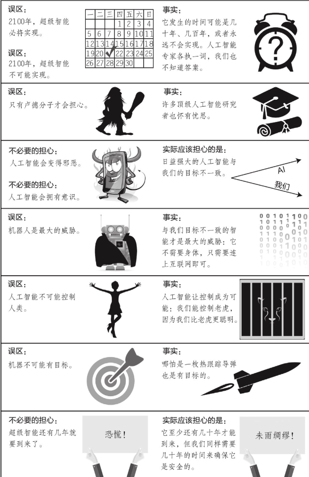

    作者: [美] 迈克斯·泰格马克
    出版社: 浙江教育出版社
    副标题: 人工智能时代，人类的进化与重生
    原作名: Life 3.0: being human in the age of artificial intelligence
    译者: 汪婕舒
    出版年: 2018-6
    页数: 468
    定价: 99.90元
    装帧: 精装
    ISBN: 9787553672786

[豆瓣链接](https://book.douban.com/subject/30262617/)

- [01 欢迎参与我们这个时代最重要的对话](#01-%e6%ac%a2%e8%bf%8e%e5%8f%82%e4%b8%8e%e6%88%91%e4%bb%ac%e8%bf%99%e4%b8%aa%e6%97%b6%e4%bb%a3%e6%9c%80%e9%87%8d%e8%a6%81%e7%9a%84%e5%af%b9%e8%af%9d)
  - [生命的三个阶段：生命1.0、生命2.0和生命3.0](#%e7%94%9f%e5%91%bd%e7%9a%84%e4%b8%89%e4%b8%aa%e9%98%b6%e6%ae%b5%e7%94%9f%e5%91%bd10%e7%94%9f%e5%91%bd20%e5%92%8c%e7%94%9f%e5%91%bd30)
- [02 物质孕育智能](#02-%e7%89%a9%e8%b4%a8%e5%ad%95%e8%82%b2%e6%99%ba%e8%83%bd)

## 01 欢迎参与我们这个时代最重要的对话
- 生命的定义是，一个能保持自身复杂性，并进行复制的过程。生命的发展会经历三个阶段：硬件和软件都来自进化的生物阶段，即`生命1.0`；能够通过学习自己设计软件的文化阶段，即`生命2.0`；自己设计硬件和软件，并主宰自我命运的科技阶段，即`生命3.0`。
- 人工智能或许能让我们在21世纪内进入生命3.0阶段。我们应该朝着什么样的未来前进，以及如何才能实现这个未来？这个问题引发了一场精彩的对话。这场辩论中有三个主要的阵营：技术怀疑主义者、数字乌托邦主义者和人工智能有益运动支持者。
- `技术怀疑主义者`认为，建造超人类水平的通用人工智能相当困难，没有几百年的时间根本无法实现。因此，现在就开始担心这个问题和生命3.0是杞人忧天。
- `数字乌托邦主义者`认为，21世纪就有可能实现生命3.0。并且，他们全心全意地欢迎生命3.0的到来，把它视为宇宙进化自然而然、令人期待的下一步。
- `人工智能有益运动支持者`也认为，生命3.0有可能会在21世纪内实现，不过他们不认为它一定会带来好结果。他们认为，若想保证好的结果，就必须进行艰苦的人工智能安全性研究。
- 除了这些连世界顶级专家都无法达成共识的合理争议，还有一些无聊的“伪争议”，是由误解所导致的。比如，如果你不能保证和自己的辩论对手在谈及“生命”“智能”“意识”这些词时，表达的意思是相同的，那么千万不要浪费时间争论这些话题。本书对这些词的定义参见表1-1。
- 请一定注意图1-5中的误区：超级智能到2100年必将实现或不可能实现。只有“卢德分子”才会担心人工智能；我们应该担忧人工智能变得邪恶或拥有意识，而这一定会在几年内发生；机器人是最大的威胁；人工智能不可能控制人类，也不可能拥有目标。
- 在第2～6章，我们将探索关于智能的故事，从几十亿年前卑微的开端，一直到几十亿年后在宇宙范围内的可能未来。首先，我们将探讨一些短期的挑战，比如就业、人工智能武器和对人类水平的通用人工智能的开发；接着，我们将讨论关于智能机器和人类未来的一系列迷人的可能性。我很想知道你青睐哪一种未来！
- 在第7章和第8章，我们将不再描述冷冰冰的事实，而是转而探索关于目标、意识和意义的话题，并讨论我们现在可以做些什么来实现我们想要的未来。

### 生命的三个阶段：生命1.0、生命2.0和生命3.0
让我们将生命定义得更广阔一些：它是一个能保持自身复杂性并能进行复制的过程。复制的对象并不是由原子组成的物质，而是能阐明原子是如何排列的信息，这种信息由比特组成。

换句话说，我们可以将生命看作一种自我复制的信息处理系统，它的信息软件既决定了它的行为，又决定了其硬件的蓝图。

生命1.0是说：生命的硬件和软件都是靠进化得来的，而不是靠设计。不过，你和我却属于“生命2.0”：生命的硬件是进化而来，但软件在很大程度上却是依靠设计的。在这里，“软件”指的是你用来处理感官信息和决定行动时使用的所有算法和知识，从你识别某人是不是你朋友的能力，到你行走、阅读、写作、计算、歌唱以及讲笑话的能力，这一切都属于软件。

突触存储着我们所有的知识和技能，大约相当于100TB的信息，而我们的DNA却只存储了大约1GB的信息，还不如一部电影的容量大呢。

如果环境发生改变，生命1.0只能通过多代进化来缓慢适应新环境，而生命2.0却可以通过软件升级来立刻适应新环境。

表1-1 名词备忘表
生命（Life） | 能保持自己的复杂性，并进行复制的过程
---------|-------------------
生命1.0（Life 1.0） | 靠进化获得硬件和软件的生命（生物阶段）
生命2.0（Life 2.0） | 靠进化获得硬件，但自己能设计软件的生命（文化阶段）
生命3.0（Life 3.0） | 自己设计硬件和软件的生命（科技阶段）
智能（Intelligence） | 完成复杂目标的能力
人工智能（AI） | 非生物的智能
专用智能（Narrow Intelligence） | 可完成一个较狭义的目标组（例如下棋或开车）的能力
通用智能（General Intelligence） | 可完成几乎所有目标（包括学习）的能力
普遍智能（Universal Intelligence） | 在拥有数据和资源的情况下，可获得通用智能的能力
通用人工智能（GAI） | 可完成任何认知任务，并且完成得至少和人类一样好的能力
人类水平的人工智能（Human-level AI） | 其能力同通用人工智能的能力
强人工智能（Strong AI） | 其能力同通用人工智能的能力
超级智能（Superintelligence） | 远超人类水平的通用智能
文明（Civilization） | 一组互相影响的智能生命形式
意识（Consciousness） | 主观体验
感质（Qualia） | 主观体验的单个实例
伦理（Ethics） | 制约我们应当如何行为的原则
目的论（Teleology） | 用目标或意志而不是原因来解释事物
目标导向行为（Goal-oriented behavior） | 更容易用目标而不是原因来解释的行为
拥有目标（Having a goal） | 展现出目标导向行为
拥有意志（Having purpose） | 服务于自己或其他实体的目标
友好的人工智能（Friendly AI） | 目标与我们一致的超级智能
赛博格（Cyborg） | 人与机器的混合体
智能爆炸（Intelligence Explosion） | 能迅速导致超级智能的迭代式自我改进的过程
奇点（Singularity） | 智能爆炸
宇宙（Universe） | 在自宇宙大爆炸以来的138亿年的时间里，光线足以达到地球的空间区域

图1-5 关于超级智能的常见误区

## 02 物质孕育智能
- 当智能被定义为“完成复杂目标的能力”时，它不能仅用单一的“IQ”指标来衡量，而应该用一个覆盖所有目标的能力谱来衡量。
- 今天的人工智能还是比较“狭义”的，也就是说，只能完成非常特定的目标，而人类智能却相当“广义”。
- 记忆、计算、学习和智能之所以给人一种抽象、虚无缥缈的感觉，是因为它们都是独立于物质层面的。它们仿佛具有自己的生命，而不需要依赖和反映它们所栖息的物质层面的细节。
- 任何一团物质，只要它拥有许多不同的稳定状态，就可以作为记忆的基础。
- 任何物质，只要它包含某种组合起来能运行任何函数的通用基本构件，那它就可以作为计算质，也就是计算的物质基础。
- 神经网络是一个强大的学习基础，因为只要遵守物理定律，它就能对自己进行重新排列组合，执行计算的能力也会随之变得越来越好。
- 由于人类知道的物理定律极其简单，所以在能想象到的所有计算问题中，人类关心的非常少，而神经网络总能游刃有余地解决这些问题。
- 当某项技术的能力翻倍时，它通常又可以被用来设计和建造强大两倍的技术，引发不断的能力翻倍，这正是摩尔定律的精髓。信息技术的成本大约每两年就会减半，这个过程已经持续了约一个世纪，催生了今天的信息时代。
- 如果人工智能方面的进步持续下去，那么，早在人工智能在所有技能上都达到人类水平之前，它会给我们带来迷人的机遇和挑战，涉及其带来的突破和故障，以及法律、武器和就业等领域的变化，我们将在下一章探讨这些问题。

