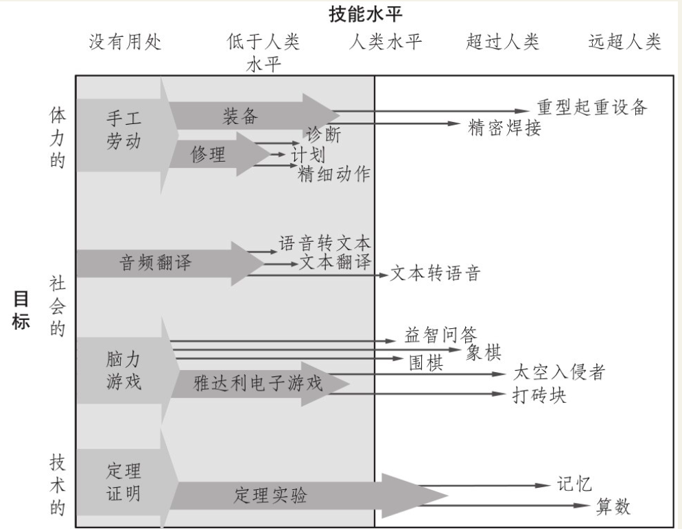
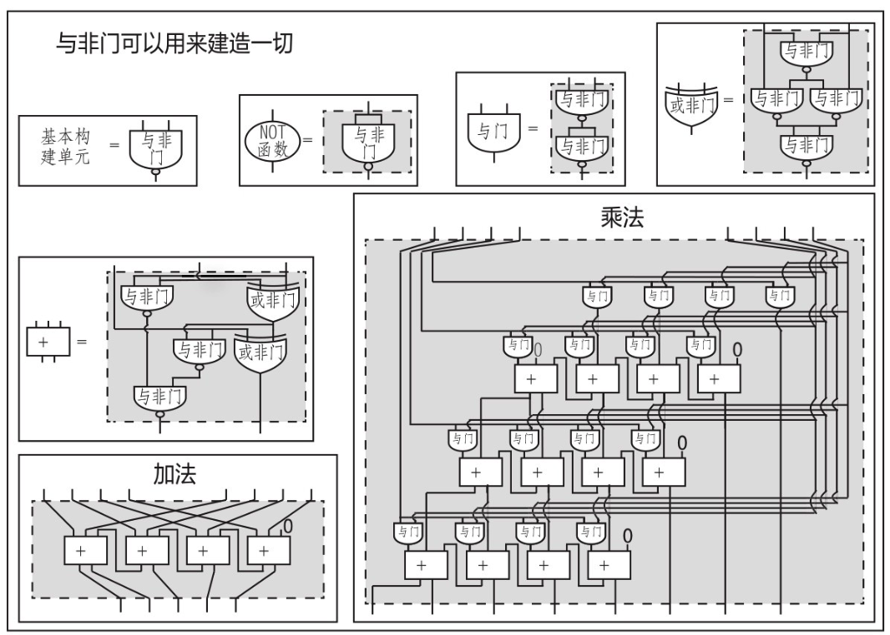

    作者: [美] 迈克斯·泰格马克
    出版社: 浙江教育出版社
    副标题: 人工智能时代，人类的进化与重生
    原作名: Life 3.0: being human in the age of artificial intelligence
    译者: 汪婕舒
    出版年: 2018-6
    页数: 468
    定价: 99.90元
    装帧: 精装
    ISBN: 9787553672786

[豆瓣链接](https://book.douban.com/subject/30262617/)

- [01 欢迎参与我们这个时代最重要的对话](#01-%e6%ac%a2%e8%bf%8e%e5%8f%82%e4%b8%8e%e6%88%91%e4%bb%ac%e8%bf%99%e4%b8%aa%e6%97%b6%e4%bb%a3%e6%9c%80%e9%87%8d%e8%a6%81%e7%9a%84%e5%af%b9%e8%af%9d)
  - [生命的三个阶段：生命1.0、生命2.0和生命3.0](#%e7%94%9f%e5%91%bd%e7%9a%84%e4%b8%89%e4%b8%aa%e9%98%b6%e6%ae%b5%e7%94%9f%e5%91%bd10%e7%94%9f%e5%91%bd20%e5%92%8c%e7%94%9f%e5%91%bd30)
- [02 物质孕育智能](#02-%e7%89%a9%e8%b4%a8%e5%ad%95%e8%82%b2%e6%99%ba%e8%83%bd)
  - [什么是智能](#%e4%bb%80%e4%b9%88%e6%98%af%e6%99%ba%e8%83%bd)
  - [什么是记忆](#%e4%bb%80%e4%b9%88%e6%98%af%e8%ae%b0%e5%bf%86)
  - [什么是计算](#%e4%bb%80%e4%b9%88%e6%98%af%e8%ae%a1%e7%ae%97)
  - [什么是学习](#%e4%bb%80%e4%b9%88%e6%98%af%e5%ad%a6%e4%b9%a0)
- [03 不远的未来：科技大突破、故障、法律、武器和就业](#03-%e4%b8%8d%e8%bf%9c%e7%9a%84%e6%9c%aa%e6%9d%a5%e7%a7%91%e6%8a%80%e5%a4%a7%e7%aa%81%e7%a0%b4%e6%95%85%e9%9a%9c%e6%b3%95%e5%be%8b%e6%ad%a6%e5%99%a8%e5%92%8c%e5%b0%b1%e4%b8%9a)
- [04 智能爆炸？](#04-%e6%99%ba%e8%83%bd%e7%88%86%e7%82%b8)
- [05 劫后余波，未知的世界：接下来的1万年](#05-%e5%8a%ab%e5%90%8e%e4%bd%99%e6%b3%a2%e6%9c%aa%e7%9f%a5%e7%9a%84%e4%b8%96%e7%95%8c%e6%8e%a5%e4%b8%8b%e6%9d%a5%e7%9a%841%e4%b8%87%e5%b9%b4)
- [06 挑战宇宙禀赋：接下来的10亿年以及以后](#06-%e6%8c%91%e6%88%98%e5%ae%87%e5%ae%99%e7%a6%80%e8%b5%8b%e6%8e%a5%e4%b8%8b%e6%9d%a5%e7%9a%8410%e4%ba%bf%e5%b9%b4%e4%bb%a5%e5%8f%8a%e4%bb%a5%e5%90%8e)
- [07 目标](#07-%e7%9b%ae%e6%a0%87)
  - [目标的起源：物理学](#%e7%9b%ae%e6%a0%87%e7%9a%84%e8%b5%b7%e6%ba%90%e7%89%a9%e7%90%86%e5%ad%a6)
  - [目标的进化：生物学](#%e7%9b%ae%e6%a0%87%e7%9a%84%e8%bf%9b%e5%8c%96%e7%94%9f%e7%89%a9%e5%ad%a6)
  - [对目标的追寻和反叛：心理学](#%e5%af%b9%e7%9b%ae%e6%a0%87%e7%9a%84%e8%bf%bd%e5%af%bb%e5%92%8c%e5%8f%8d%e5%8f%9b%e5%bf%83%e7%90%86%e5%ad%a6)
  - [外包目标：工程](#%e5%a4%96%e5%8c%85%e7%9b%ae%e6%a0%87%e5%b7%a5%e7%a8%8b)
  - [终极目标](#%e7%bb%88%e6%9e%81%e7%9b%ae%e6%a0%87)
- [08 意识](#08-%e6%84%8f%e8%af%86)

## 01 欢迎参与我们这个时代最重要的对话
- 生命的定义是，一个能保持自身复杂性，并进行复制的过程。生命的发展会经历三个阶段：硬件和软件都来自进化的生物阶段，即`生命1.0`；能够通过学习自己设计软件的文化阶段，即`生命2.0`；自己设计硬件和软件，并主宰自我命运的科技阶段，即`生命3.0`。
- 人工智能或许能让我们在21世纪内进入生命3.0阶段。我们应该朝着什么样的未来前进，以及如何才能实现这个未来？这个问题引发了一场精彩的对话。这场辩论中有三个主要的阵营：技术怀疑主义者、数字乌托邦主义者和人工智能有益运动支持者。
- `技术怀疑主义者`认为，建造超人类水平的通用人工智能相当困难，没有几百年的时间根本无法实现。因此，现在就开始担心这个问题和生命3.0是杞人忧天。
- `数字乌托邦主义者`认为，21世纪就有可能实现生命3.0。并且，他们全心全意地欢迎生命3.0的到来，把它视为宇宙进化自然而然、令人期待的下一步。
- `人工智能有益运动支持者`也认为，生命3.0有可能会在21世纪内实现，不过他们不认为它一定会带来好结果。他们认为，若想保证好的结果，就必须进行艰苦的人工智能安全性研究。
- 除了这些连世界顶级专家都无法达成共识的合理争议，还有一些无聊的“伪争议”，是由误解所导致的。比如，如果你不能保证和自己的辩论对手在谈及“生命”“智能”“意识”这些词时，表达的意思是相同的，那么千万不要浪费时间争论这些话题。本书对这些词的定义参见表1-1。
- 请一定注意图1-5中的误区：超级智能到2100年必将实现或不可能实现。只有“卢德分子”才会担心人工智能；我们应该担忧人工智能变得邪恶或拥有意识，而这一定会在几年内发生；机器人是最大的威胁；人工智能不可能控制人类，也不可能拥有目标。
- 在第2～6章，我们将探索关于智能的故事，从几十亿年前卑微的开端，一直到几十亿年后在宇宙范围内的可能未来。首先，我们将探讨一些短期的挑战，比如就业、人工智能武器和对人类水平的通用人工智能的开发；接着，我们将讨论关于智能机器和人类未来的一系列迷人的可能性。我很想知道你青睐哪一种未来！
- 在第7章和第8章，我们将不再描述冷冰冰的事实，而是转而探索关于目标、意识和意义的话题，并讨论我们现在可以做些什么来实现我们想要的未来。

### 生命的三个阶段：生命1.0、生命2.0和生命3.0
让我们将生命定义得更广阔一些：它是一个能保持自身复杂性并能进行复制的过程。复制的对象并不是由原子组成的物质，而是能阐明原子是如何排列的信息，这种信息由比特组成。

换句话说，我们可以将生命看作一种自我复制的信息处理系统，它的信息软件既决定了它的行为，又决定了其硬件的蓝图。

生命1.0是说：生命的硬件和软件都是靠进化得来的，而不是靠设计。不过，你和我却属于“生命2.0”：生命的硬件是进化而来，但软件在很大程度上却是依靠设计的。在这里，“软件”指的是你用来处理感官信息和决定行动时使用的所有算法和知识，从你识别某人是不是你朋友的能力，到你行走、阅读、写作、计算、歌唱以及讲笑话的能力，这一切都属于软件。

突触存储着我们所有的知识和技能，大约相当于100TB的信息，而我们的DNA却只存储了大约1GB的信息，还不如一部电影的容量大呢。

如果环境发生改变，生命1.0只能通过多代进化来缓慢适应新环境，而生命2.0却可以通过软件升级来立刻适应新环境。

表1-1 名词备忘表

生命（Life） | 能保持自己的复杂性，并进行复制的过程
---------|-------------------
生命1.0（Life 1.0） | 靠进化获得硬件和软件的生命（生物阶段）
生命2.0（Life 2.0） | 靠进化获得硬件，但自己能设计软件的生命（文化阶段）
生命3.0（Life 3.0） | 自己设计硬件和软件的生命（科技阶段）
智能（Intelligence） | 完成复杂目标的能力
人工智能（AI） | 非生物的智能
专用智能（Narrow Intelligence） | 可完成一个较狭义的目标组（例如下棋或开车）的能力
通用智能（General Intelligence） | 可完成几乎所有目标（包括学习）的能力
普遍智能（Universal Intelligence） | 在拥有数据和资源的情况下，可获得通用智能的能力
通用人工智能（GAI） | 可完成任何认知任务，并且完成得至少和人类一样好的能力
人类水平的人工智能（Human-level AI） | 其能力同通用人工智能的能力
强人工智能（Strong AI） | 其能力同通用人工智能的能力
超级智能（Superintelligence） | 远超人类水平的通用智能
文明（Civilization） | 一组互相影响的智能生命形式
意识（Consciousness） | 主观体验
感质（Qualia） | 主观体验的单个实例
伦理（Ethics） | 制约我们应当如何行为的原则
目的论（Teleology） | 用目标或意志而不是原因来解释事物
目标导向行为（Goal-oriented behavior） | 更容易用目标而不是原因来解释的行为
拥有目标（Having a goal） | 展现出目标导向行为
拥有意志（Having purpose） | 服务于自己或其他实体的目标
友好的人工智能（Friendly AI） | 目标与我们一致的超级智能
赛博格（Cyborg） | 人与机器的混合体
智能爆炸（Intelligence Explosion） | 能迅速导致超级智能的迭代式自我改进的过程
奇点（Singularity） | 智能爆炸
宇宙（Universe） | 在自宇宙大爆炸以来的138亿年的时间里，光线足以达到地球的空间区域

图1-5 关于超级智能的常见误区

## 02 物质孕育智能
- 当智能被定义为“完成复杂目标的能力”时，它不能仅用单一的“IQ”指标来衡量，而应该用一个覆盖所有目标的能力谱来衡量。
- 今天的人工智能还是比较“狭义”的，也就是说，只能完成非常特定的目标，而人类智能却相当“广义”。
- 记忆、计算、学习和智能之所以给人一种抽象、虚无缥缈的感觉，是因为它们都是独立于物质层面的。它们仿佛具有自己的生命，而不需要依赖和反映它们所栖息的物质层面的细节。
- 任何一团物质，只要它拥有许多不同的稳定状态，就可以作为记忆的基础。
- 任何物质，只要它包含某种组合起来能运行任何函数的通用基本构件，那它就可以作为计算质，也就是计算的物质基础。
- 神经网络是一个强大的学习基础，因为只要遵守物理定律，它就能对自己进行重新排列组合，执行计算的能力也会随之变得越来越好。
- 由于人类知道的物理定律极其简单，所以在能想象到的所有计算问题中，人类关心的非常少，而神经网络总能游刃有余地解决这些问题。
- 当某项技术的能力翻倍时，它通常又可以被用来设计和建造强大两倍的技术，引发不断的能力翻倍，这正是摩尔定律的精髓。信息技术的成本大约每两年就会减半，这个过程已经持续了约一个世纪，催生了今天的信息时代。
- 如果人工智能方面的进步持续下去，那么，早在人工智能在所有技能上都达到人类水平之前，它会给我们带来迷人的机遇和挑战，涉及其带来的突破和故障，以及法律、武器和就业等领域的变化，我们将在下一章探讨这些问题。

### 什么是智能

图2-1 人工智能可以胜出人类的任务

### 什么是记忆
大脑的记忆原理与计算机的信息存储原理截然不同，这不仅体现在它的构成上，还体现在它的使用方式上。你在计算机或硬盘上读取记忆的方式是通过它存储的位置，但你从大脑中读取记忆的方式则是依据它存储的内容。

当需要读取某些信息时，计算机检索的是它的地址，这就好像在说：“请你从我的书架上取出最顶层从右往左数的第5本书，然后告诉我第314页上说了什么。”相反，你从大脑中读取信息的方式却更像搜索引擎：你指定某个信息或与之相关的信息，然后它就会自动弹出来。比如，当你听到“生存还是……”这个短语时，它很可能会在你脑中触发“生存还是毁灭，这是一个值得考虑的问题”这句话；如果你在网上搜索这个短语，搜索引擎也很可能会给你同样的搜索结果。实际上，即便我引用的是这句话中的另外一部分，甚至弄混一些字词，结果可能还是一样的。这种记忆系统被称为`“自联想”（auto-associative）`，因为它们是通过联想而不是地址来进行“回想”的。

1982年，物理学家约翰·霍普菲尔德（John Hopfield）在一篇著名的论文中向人们展示了一个由互相连接的神经元组成的网络，它能够实现自联想记忆的功能。我觉得他的基本观点非常棒，对于许多拥有多个稳定状态的物理系统来说，这个观点都成立。例如，一个小球位于一个拥有两个“山谷”的曲面上让我们对这个曲面做一点设定，让两个最低点的x坐标分别为 $x=\sqrt{2} \approx 1.41421$和$x=\pi \approx 3.14159$。如果你只记得π与3很接近，但不记得π的具体值，那么你只需要把小球放到π=3处，然后看它滚落入最近的最低点，它就能向你揭示出一个更精确的π值。霍普菲尔德意识到， 一个更复杂的神经元系统可以提供一个类似的“地形”，其上有许许多多能量极小值，系统可以稳定在这些能量极小值上。

### 什么是计算
计算是由一个记忆状态向另一个记忆状态转变的过程。

计算机科学中有一个非凡的公理，认为与非门是通用的。意思是说，如果你想要执行任何定义明确的函数，只需要将若干个与非门以某种方式连接起来就可以了。因此，只要你能制造出足够多的与非门，就能建造一台能计算任何东西的机器。

`“计算质”（computronium）`指的是可以执行任何计算的任何物质。获得计算质并不是一件非常困难的事：这种物质只要能够执行以我们想要的方式连接在一起的与非门就行。

还有一种东西也可以作为计算质，那就是一种被称为“元胞自动机”的简单装置，它可以基于“邻居”的行为来更新自己的行为。

总而言之，物质不仅可能会执行任意定义明确的计算，其执行的方式也可能是多种多样的。

图2-7 如何只用与非门做加乘法

简而言之，计算是粒子在时空中排列出的形态。粒子并不重要，重要的是它们组成的形态。所以，物质是无足轻重的。

换句话说，硬件就是物质，软件就是形态。计算的“物质层面的独立性”暗示着我们，人工智能是可能实现的：智能的出现并不一定需要血肉或碳原子。

### 什么是学习
一团物质想要学习，必须对自己进行重新排列，以获得越来越强的能力，好计算它想要的函数，只要它遵守物理定律就行。

## 03 不远的未来：科技大突破、故障、法律、武器和就业
- 人工智能的短期进步可能会在许多方面极大地改善我们的生活，比如，让我们的个人生活、电力网络和金融市场更加有效，还能用无人驾驶汽车、手术机器人和人工智能诊断系统来挽救生命。
- 如果我们要允许人工智能来控制真实世界中的系统，就必须学着让人工智能变得更加稳健，让它听从命令，这非常重要。说到底，要做到这一点，就必须解决与验证、确认、安全和控制有关的一些棘手的技术问题。
- 人工智能控制的自动化武器系统也迫切需要提升人工智能的稳健性，因为这种系统的风险太高了。
- 许多顶级人工智能研究者和机器人学家都呼吁签署一份国际条约来限制某些自动化武器的使用，以避免出现失控的军备竞赛，因为这样的军备竞赛可能会带来人人唾手可得（只要你有钱，又别有用心）的暗杀机器。
- 如果我们能弄明白如何让机器人法官做到透明化和无偏见，人工智能就能让我们的法律系统更加公正高效。
- 为了跟上人工智能的发展，我们的法律必须不断快速更新，因为人工智能在隐私、责任和监管方面提出了很多棘手的法律问题。
- 在人工智能把人类完全取代之前的很长一段时间里，它们可能会先在劳动力市场上逐渐取代我们。
- 人工智能取代人类的工作不一定是一件坏事，只要社会能将人工智能创造出来的一部分财富重新分配给社会，让每个人的生活变得更好。许多经济学家认为，如若不然，就会极大加剧不公平的现象。
- 只要未雨绸缪、提前计划，即使社会的就业率很低，也能实现繁荣昌盛，这不仅体现在经济上，还体现在人们能从工作以外的其他地方获得生活的目标上。
- 给今天的孩子们的就业建议：进入那些机器不擅长的领域，这些领域需要与人打交道，具有不可预见性，需要创造力。
- 有一个不容忽视的可能性是：通用人工智能会持续进步，直到达到甚至超过人类水平。我们将在下一章探讨这个问题！

## 04 智能爆炸？
- 如果有一天我们造出了人类水平的通用人工智能，就可能会触发一场智能爆炸，将人类远远甩在后面。
- 如果这场智能爆炸是由一些人类控制的，那他们可能会在几年时间内控制整个世界。
- 如果人类没能掌控这场智能爆炸，那么，人工智能可能会以更快的速度控制世界。
- 快速的智能爆炸可能会导致单极化的超级力量的出现；一个延续几年或者几十年的慢速智能爆炸更有可能促成多极化的情形，许多相当独立的实体在其中达成一种力量的平衡。
- 生命的历史说明，它总会自我组织成更复杂的层级结构，这种层级结构是由合作、竞争和控制共同塑造的。超级智能或许会促成更大宇宙尺度上的合作，但是，它最终会导致极权主义和由上自下的控制，还是会赋予个体更多权力，目前尚不清楚。
- 赛博格和上传者是可能的，但或许并不是实现机器智能的最快途径。
- 目前人工智能研究竞赛的高潮要么是人类历史上最好的事情，要么是最坏的事情。可能的后果形形色色，多种多样。我们将在下一章探讨这些可能性。
- 我们需要努力思考，我们希望看到什么样的结果，以及如何才能达成这个目标，因为如果我们不去思考自己想要什么，很可能无法得偿所愿。

## 05 劫后余波，未知的世界：接下来的1万年
- 目前，朝着通用人工智能前进的研究竞赛可能会在接下来的1 000年中带给我们许多不同的可能性。
- 超级智能可能与人类和平共处的原因有两种，要么它们是被迫这么做，即“被奴役的神”情景，要么它是发自内心想要与人类和平共处的“友好的人工智能”，也就是“自由主义乌托邦”“守护神”“善意的独裁者”和“动物园管理员”情景。
- 超级智能也可能不会出现，原因可能有几种：可能是被人工智能（“守门人”情景）或人类（“1984”情景）阻止了，也可能是因为人们选择刻意遗忘技术（“逆转”情景）或失去了建造它的动机（“平等主义乌托邦”情景）。
- 人类可能会走向灭绝，并被人工智能取代（“征服者”或“后裔”情景），也可能什么都不剩下（“自我毁灭”情景）。
- 在这些情景中，有人们想要的吗？如果有，是什么，或者是哪些呢？关于这个问题，人们还没有达成任何共识。虽然每种情景中都有许多令人讨厌的元素，但重要的是，我们必须继续深入探讨有关未来目标的问题，这样，我们才不会漫无目的地驶入一个不幸的未来。

表5-1　人工智能可能带来的后果总汇

自由主义乌托邦 | 由于大家都尊重产权，人类、赛博格、上传者和超级智能才会和平共处
--------|--------------------------------
善意的独裁者 | 每个人都知道人工智能控制着社会，并执行着严苛的规则，但大多数人认为这是一件好事
平等主义乌托邦 | 由于废除了产权制度和收入保障制度，人类、赛博格和上传者和平共处
看门人 | 一个超级智能创生时的目标是，在必要时减少干预，以防止产生另一个超级智能。结果，智力低于人类的助手机器人比比皆是，而且还存在人类与机器相结合的赛博格，但技术的进步遭到了永远的桎梏
守护神 | 从本质上来说，全知全能的人工智能只对人类进行很少的干涉，以致让人类觉得自己的命运还是掌控在自己手中，以此来最大化人类的幸福感；同时，人工智能隐藏得很好，许多人甚至怀疑人工智能是不是真的存在
被奴役的神 | 一个超级人工智能被困于人类的控制下，用来生产难以想象的技术和财富。这些技术和财富可能被用来做好事，也可能被用来做坏事，这取决于谁处于控制地位
征服者 | 人工智能掌管了世界。它认为，人类是一种威胁，是讨厌鬼，是对资源的浪费，所以决定用一些人类无法理解的方法来消灭人类
后裔 | 人工智能虽然取代了人类，但允许我们从容优雅地推出历史舞台，让我们把它们视为值得称道的后裔，就像父母为子女比自己聪明而感到高兴和骄傲一样，虽然子女向父母学习了很多，但它们取得了父母做梦都想不到的成就，即便父母活不到亲眼目睹的那一天
动物园管理员 | 无所不能的人工智能还在身边留着一些人类，这些人类感觉自己就像动物园里的动物一样，悲叹着自己的命运
1984 | 向超级智能前进的技术进步被永久地销毁了，但并不是被人工智能所销毁，而是被人类领导的奥威尔式监控国家所销毁。在这些国家中，某些人工智能研究被严格禁止
逆转 | 社会退回阿米什人生活的那种风格的“前技术社会”（pre-technological society），阻止了技术向超级智能前进的步伐
自我毁灭 | 超级智能从未创生，因为人类用其他方法将自己毁灭了，比如，核战争或环境危机外加生物技术造成的破坏

## 06 挑战宇宙禀赋：接下来的10亿年以及以后
- 与亿万年的宇宙时间尺度相比，智能爆炸只是一瞬间的事件。在这场爆炸中，技术迅速达到一个很高的稳定水平，只受到物理定律的限制。
- 这个技术稳定水平远远高于今天的科技水平，能让物质释放出超过100亿倍的能量（利用夸克引擎或黑洞），让物质存储的信息量高出12～18个数量级，或者计算速度加快31～41个数量级，或者被转化为其他任何东西。
- 超级智能生命不仅能更加有效地利用已有的资源，还能通过光速进行宇宙殖民，以获得更多资源，从而将现有的生物圈增长约32个数量级。
- 暗能量限制了智能生命的宇宙扩张，但也保护它们免受远方不断扩张的死亡泡泡或敌对文明的侵害。暗能量可能会将宇宙文明分割成碎片，这个危险促使宇宙文明进行大型宇宙工程，比如建造虫洞，如果可行的话。
- 最有可能在宇宙尺度上分享和交易的商品是信息。
- 如果没有虫洞，通信速度的上限就是光速，这对宇宙文明的内部协调和控制带来了严重的挑战。一个遥远的枢纽可能会通过奖赏或威慑来促使它的超级智能节点选择合作，比如，在当地布设“守卫人工智能”，一旦节点违抗命令，就点燃一颗超新星或类星体，以毁灭节点。
- 两个扩张的文明相遇，可能会导致三种可能性：同化、合作或者战争。与今天的文明相比，未来的文明相遇时发生战争的可能性更小。
- 我们人类很可能是唯一能使可观测宇宙在未来“活过来”的生命形式。不过许多人并不认同这一点。
- 如果我们不改善我们的技术，问题就从“人类是否会灭绝”变成了“人类会如何灭绝”：小行星撞击地球、超级火山爆发、年老太阳的余晖以及其他大灾难，哪一个会先来？
- 如果我们小心谨慎地改进技术，深谋远虑、计划周全地避免陷阱，那生命就有可能在地球上，甚至地球外繁荣昌盛长达数十亿年的时间，远远超越我们的祖先最不羁的梦想。

## 07 目标
- 目标导向行为起源于物理定律，因为它涉及最优化问题。
- 热力学有一个内置的目标：耗散。耗散就是要提高熵，而熵是对混乱程度的度量。
- 生命是一种有助于耗散（增加整体的混乱程度）的现象。生命能保持或提高自身的复杂度，还能进行复制，与此同时提升了环境的混乱程度，以此加快了耗散的速度。
- 达尔文式的进化将目标导向行为从耗散转化为复制。
- 智能是完成复杂目标的能力。
- 由于人类并不总是拥有足够的资源来找到真正的最优复制策略，所以我们进化出了一些有用的经验法则，来辅助我们做决策，这就是感觉，比如饥饿感、口渴、疼痛、性欲和同情。
- 因此，我们的目标不再是简单的复制；假如我们的感觉与基因赋予我们的目标相冲突，我们会忠于感觉，比如，采取避孕措施。
- 我们正在建造日益聪明的机器来帮助我们实现自己的目标。目前，随着我们建造的机器展现出目标导向行为，我们应该力争让机器的目标与我们的相一致。
- 想让机器的目标与我们的目标相一致，有三个问题亟待解决：让机器学习、接受和保持我们的目标。
- 人工智能可以被设计来拥有任何目标，但是，几乎所有足够野心的目标都会带来一些共同的子目标，比如自我保护、获取资源、想要更理解世界的好奇心。前两个子目标可能会让超级智能为人类带来麻烦，最后那个可能会阻止人工智能保持我们赋予它的目标。
- 虽然人类有一些广为接受的伦理原则，但我们不知道如何将它们赋予其他实体，比如非人类的动物，以及未来的人工智能。
- 我们不清楚如何才能赋予超级智能一个既可定义又不会导致人类灭绝的终极目标，因此，我们必须尽快开始讨论这些棘手的哲学问题！

### 目标的起源：物理学
我们可以在量子力学奠基人之一埃尔温·薛定谔（Erwin Schrödinger）1944年的著作《生命是什么》（What's Life?）一书中找到答案。薛定谔指出，生命系统的一个标志就是，它通过提升周围环境的熵来保持或降低自己的熵。换句话说，热力学第二定律在生命面前有一个漏洞：虽然整体的熵必须增加，但它允许某些局部区域的熵减，只要它能让其他地方增加更多的熵即可。因此，生命让环境变得更加混乱，从而维持或增加自己的复杂度。

### 目标的进化：生物学
在早期，粒子无一例外都在想尽办法增加平均的混乱程度，但那些无处不在的新生命的自我复制模式却似乎拥有一个不同的目标：不是耗散，而是复制。查尔斯·达尔文对此有一个优雅的解释：复制的效率越高，你就越能战胜和统治其他生物，因此不久之后，你会发现，所有生命似乎都为“复制”这个目标而高度优化了。

既然物理定律并没有改变，那生命的目标为何从耗散变成了复制呢？答案是，最根本的目标其实并没有变化，依然是耗散，但它带来了一个不同的“手段目标”（instrumental goal），也就是为了实现最终目标而需要达成的子目标。

复制有助于实现耗散，因为一个充满生命的星球在能量耗散上会更高效。因此，从这个意义上说，我们的宇宙发明生命是为了更快地走向“热寂”。

### 对目标的追寻和反叛：心理学
为什么我们有时会选择反叛基因及其复制的目标呢？这是因为作为有限理性的主体，我们只忠于自己的感觉。虽然大脑进化的目的是帮助我们复制基因，但大脑其实根本不在乎这个目标，因为我们对基因没有任何感觉。

### 外包目标：工程
如果你从地球形成之初就开始观察地球上的原子，可能会注意到目标导向行为的三个阶段：

- 第一阶段，所有物质似乎都在努力实现耗散的目标，即熵增；
- 第二阶段，其中一些物质拥有了生命，转而聚焦于子目标；
- 第三阶段，生物重新排列的物质越来越多，以实现自己的目标。

### 终极目标
如果我们可以把宇宙138亿年的历史快放一遍，就能目睹“目标导向行为”的一些不同阶段：

- 物质似乎一心一意地聚焦在将“耗散”最大化上；
- 原始生命似乎试图将它的“复制”最大化；
- 人类追求的目标不是复制，而是一些与愉悦、好奇、怜悯等感觉相关的目标。人类进化出这些感觉的目的是促进复制；
- 人类建造机器来帮助他们追求自己的目标。

## 08 意识
- 关于“意识”，目前还没有无可争辩的定义。我使用的定义十分宽泛，并且不以人类为中心。我认为：**意识＝主观体验**。
- 人工智能是否拥有意识？这个问题归根结底是一些因人工智能崛起而引发的最棘手的伦理和哲学问题：人工智能能否感觉到痛苦？它们是否应该拥有权利？上传思想算不算主观上的自杀？如果未来的宇宙充满了人工智能，算不算终极的僵尸末日？
- 要理解智能，就必须回答三个关于意识的问题：“相当难的问题”“更难的问题”和“真难的问题”。第一个问题是预测哪些物理系统拥有意识；第二个问题是预测感质；第三个问题是物质为什么会产生意识。
- “相当难的问题”是科学的，因为它可以预测哪些大脑过程拥有意识，而这样的理论是可以用实验来证实和证伪的。但我们目前尚不清楚科学要如何解决那两个更难一些的问题。
- 神经科学实验告诉我们，许多行为和脑区都是无意识的，大部分意识体验都是对大量无意识信息做出的“事后总结”。
- 将意识的预测从大脑推广到机器，需要一个理论。意识似乎不需要某种粒子或场，但需要某种具备自主性和整合性的信息处理过程，这样，整个系统才能拥有足够高的独立性，而它的组成部分却没有独立性。
- 意识感觉起来是“非物质”的，因为它具有双重的物质层面的独立性：如果意识是信息以某种复杂的方式处理的感觉，那么，只有信息处理的结构才是重要的，而处理信息的物质自身的结构则无足轻重。
- 如果人造意识是可能的，那么，与人类的体验比起来，人工智能的体验空间可能非常庞大，在感质和时间尺度上跨越极大的范围，但都能体会到自由意志的感觉。
- 由于没有意识就没有意义，因此，并不是我们的宇宙将意义赋予了有意识的实体，而是有意识的实体将意义赋予了我们的宇宙。
- 这意味着，当我们做好准备，谦卑地迎接更加智慧的机器时，我们可以从“意人”这个新名字（而不再是“智人”）中获得些许慰藉。
