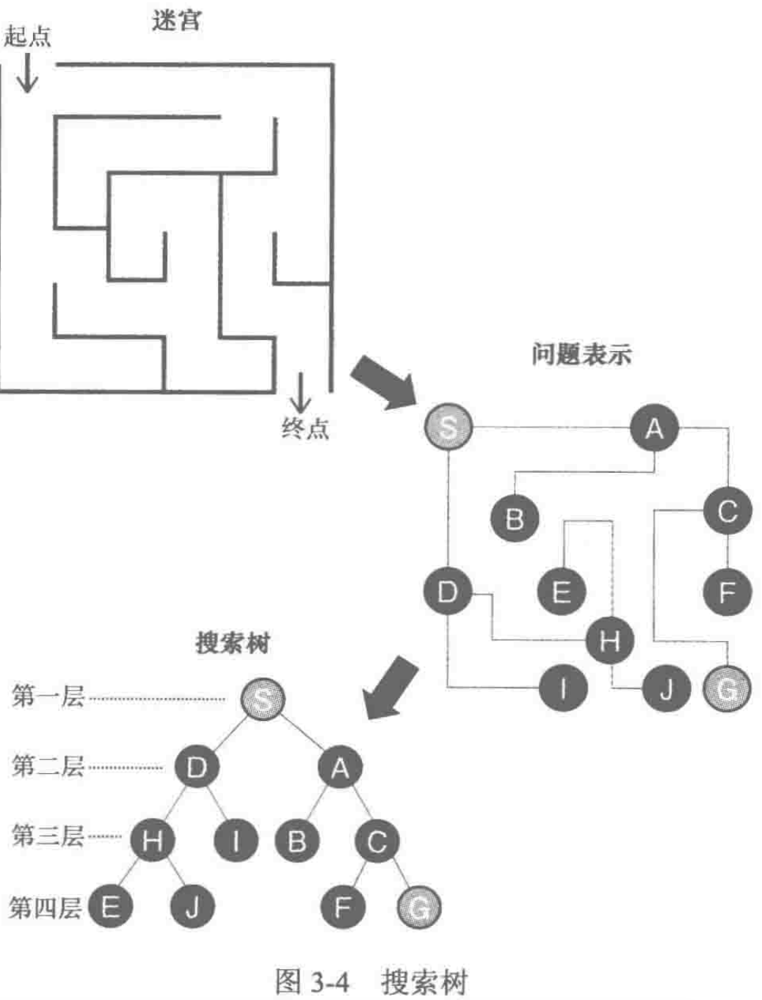
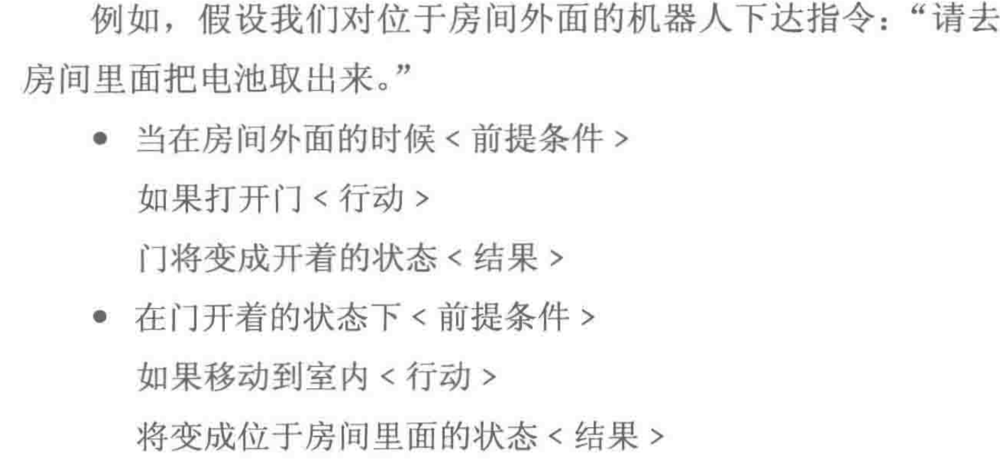
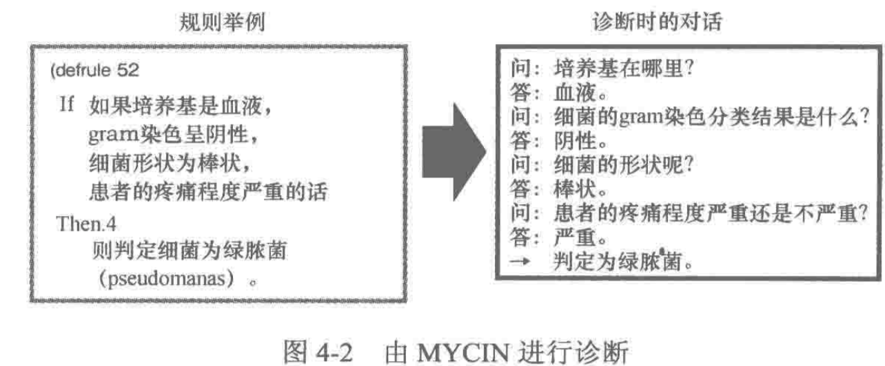
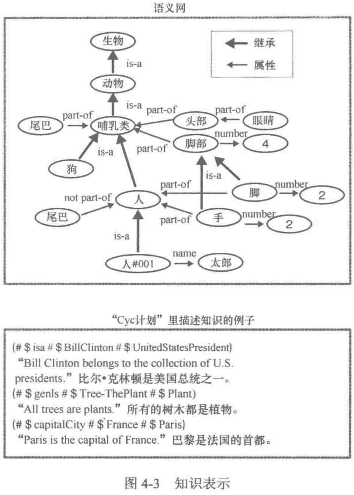
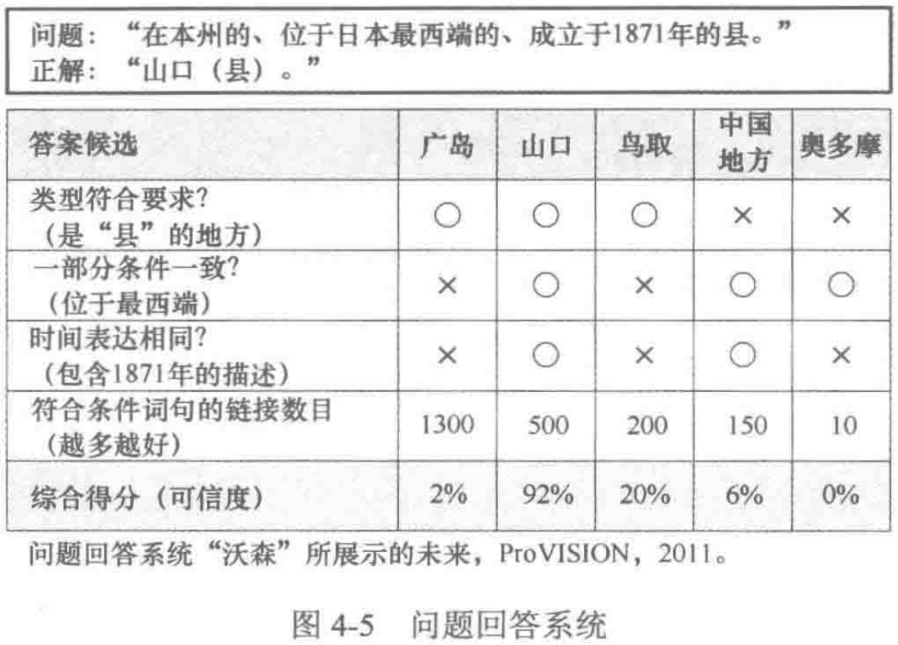

    作者: [日] 松尾丰 
    出版社: 机械工业出版社
    副标题: 机器人会超越人类吗？
    译者: 赵函宏 / 高华彬 
    出版年: 2016-1
    页数: 220
    定价: 39.80元
    ISBN: 9787111521860

[豆瓣链接](https://book.douban.com/subject/26698202/)

- [第二章 什么是人工智能](#%E7%AC%AC%E4%BA%8C%E7%AB%A0-%E4%BB%80%E4%B9%88%E6%98%AF%E4%BA%BA%E5%B7%A5%E6%99%BA%E8%83%BD)
  - [什么是人工智能——专家定义梳理](#%E4%BB%80%E4%B9%88%E6%98%AF%E4%BA%BA%E5%B7%A5%E6%99%BA%E8%83%BD%E4%B8%93%E5%AE%B6%E5%AE%9A%E4%B9%89%E6%A2%B3%E7%90%86)
  - [什么是人工智能——坊间的看法](#%E4%BB%80%E4%B9%88%E6%98%AF%E4%BA%BA%E5%B7%A5%E6%99%BA%E8%83%BD%E5%9D%8A%E9%97%B4%E7%9A%84%E7%9C%8B%E6%B3%95)
- [第三章 “推理”与“搜索”的时代](#%E7%AC%AC%E4%B8%89%E7%AB%A0-%E6%8E%A8%E7%90%86%E4%B8%8E%E6%90%9C%E7%B4%A2%E7%9A%84%E6%97%B6%E4%BB%A3)
  - [热潮与严冬交替出现](#%E7%83%AD%E6%BD%AE%E4%B8%8E%E4%B8%A5%E5%86%AC%E4%BA%A4%E6%9B%BF%E5%87%BA%E7%8E%B0)
  - [用搜索树探寻迷宫](#%E7%94%A8%E6%90%9C%E7%B4%A2%E6%A0%91%E6%8E%A2%E5%AF%BB%E8%BF%B7%E5%AE%AB)
  - [梵塔问题](#%E6%A2%B5%E5%A1%94%E9%97%AE%E9%A2%98)
  - [机器人行动过程规化](#%E6%9C%BA%E5%99%A8%E4%BA%BA%E8%A1%8C%E5%8A%A8%E8%BF%87%E7%A8%8B%E8%A7%84%E5%8C%96)
  - [下棋](#%E4%B8%8B%E6%A3%8B)
- [第四章 知识让计算机更聪明](#%E7%AC%AC%E5%9B%9B%E7%AB%A0-%E7%9F%A5%E8%AF%86%E8%AE%A9%E8%AE%A1%E7%AE%97%E6%9C%BA%E6%9B%B4%E8%81%AA%E6%98%8E)
  - [专家系统](#%E4%B8%93%E5%AE%B6%E7%B3%BB%E7%BB%9F)
  - [知识表示](#%E7%9F%A5%E8%AF%86%E8%A1%A8%E7%A4%BA)
  - [框架问题](#%E6%A1%86%E6%9E%B6%E9%97%AE%E9%A2%98)
- [第五章 机器学习悄然兴起](#%E7%AC%AC%E4%BA%94%E7%AB%A0-%E6%9C%BA%E5%99%A8%E5%AD%A6%E4%B9%A0%E6%82%84%E7%84%B6%E5%85%B4%E8%B5%B7)
- [第六章 深度学习](#%E7%AC%AC%E5%85%AD%E7%AB%A0-%E6%B7%B1%E5%BA%A6%E5%AD%A6%E4%B9%A0)

## 第二章 什么是人工智能
### 什么是人工智能——专家定义梳理
作者定义：人工智能是“用人工方法制作的类人智能”，类人智能指的是具有“发现和觉察功能”的计算机，即能够从数据中生成特征量，并对相关现象进行模型化处理的计算机。

很多人工智能专家希望通过研究对智能做出建构性阐释。“建构性”这个词语指的是“通过制作来进行理解”。与之相对应的词语是“分析性”。

与人工智能专家期望对智能进行建构性理解形成对比的是，专门研究大脑的脑科学家，却希望通过分析性的方法来探明智能。

在研制飞机这个问题上，只要发现了鸟儿飞行所需的“升力”这个概念，然后通过工程学方面的探索找到获得升力的方法（即先由引擎获得推力，再通过机翼将推力变为升力），那么就能获得成功。同理，只要我们能够找到智能的原理并通过计算机将其实现，那么我们就可以研制出人工智能。

### 什么是人工智能——坊间的看法

1. 把单纯的控制程序称作“人工智能”
    - 空调、扫地机、洗衣机等。这类技术属于“控制工程学”或者“系统工程学”领域。
2. 传统人工智能
    - 传统的智力问题求解程序、医疗诊断程序，引入知识库，使用了推理与搜索。
3. 引入机器学习的人工智能
    - 以样本数据为基础、对规则和知识的自学习。
4. 引入深度学习的人工智能
    - 能够对机器学习时的数据表示所用变量（“特征”）本身进行学习的人工智能。

## 第三章 “推理”与“搜索”的时代
### 热潮与严冬交替出现
第一次人工智能浪潮是20世纪50年代后半期-20世纪60年代。在这一时期，计算机在使用“推理和搜索”来解决特定问题方面取得了较大进展。但对于复杂的现实问题束手无策，随后在20世纪70年代，进入寒冬。

第二次浪潮是在20世纪80年代，导入“知识”使计算机变得更聪明，出现了“专家系统”的实用性产品。随着知识描述和知识管理的局限性逐渐显露，在1995年，人工智能再一次进入冬天。

在20世纪90年代后半期搜索引擎诞生之后，互联网得到爆炸性普及，特别是进入2000年以后，伴随着web网页的扩张，运用海量数据的“机器学习”迅速崛起。即迎来人工智能第三次浪潮。

图3-1所示，第三次人工智能浪潮产生了两个重叠的大浪，一个是在大数据时代得到迅速发展的机器学习，另一个是堪称“技术性重大突破”的深度学习（特征表示学习）。

### 用搜索树探寻迷宫

- 宽度优先搜索：可能能找到距离目标最短的路径，但是需要记住全部途中节点，需要很大的存储空间。
- 深度优先搜索：找到一条满足条件路径后即退出，未必能找到距离目标最短的路径。

### 梵塔问题

也可以用搜索树来求解。只要将圆盘可移动的所有情形按顺序去试即可。

最后，等达到目标状态，即圆盘全部移至右边的状态后，再倒推，即可得到作为正确答案的移动顺序。

### 机器人行动过程规化
可以用搜索树来制订机器人的行动规划，这种技术被称作“规划”（planning）。把<前提条件>、<行动>与<结果>三要素作为组合来描述的STRIPS（Stanford Research Institute Problem Solover）

### 下棋

## 第四章 知识让计算机更聪明
### 专家系统
20世纪70年代初期由斯坦福大学开发MYCIN，其功能设计是对传染性血液病患者进行诊断，并开出抗生素处方。在它内部一共备有500条规则。图4-2是判断绿脓菌的例子。MYCIN开出正确处方率为69%。

### 知识表示
1984年启动Cyc计划，试图将人类拥有的一般性知识输入计算机。

Watson本身并非是在理解问题的基础上来进行回答的，只不过是将与问题所含关键词看似相关的答案快速抽取出来而已。

### 框架问题
框架问题，就是在执行某项任务时“仅仅提取出与它相关的知识并对其加以运用”，这对人类来讲是再简单不过的事情，然而对计算机来讲却困难无比。

在洞穴中放着机器人的电池，电池上面装有定时炸弹。如果机器人不把电池取来的话，等它身上电池的电耗尽后，它将变成一堆废铁，于是机器人接到指示：去洞穴中把电池取出来。为此，研究人员特意对机器人进行了相关设计。

1号机器人成功地把电池从洞穴里面取了出来。可是，它把放在电池上面的定时炸弹也一起搬了出来。尽管它知道上面装着定时炸弹，但是它并不知道"如果搬走电池会连定时炸弹也一起搬出"这个道理。这样，等它从洞穴出来后没多久，炸弹就爆炸了。

之后，研究人员通过对1号机器人加以改进制造出了2号机器人。为了让它在搬出电池时能够判断是否应该将炸弹一起搬出，便通过改良使它能够考虑到"自己实施某种行为后、该行为所伴生的次要后果"。于是，2号机器人就在电池前面开始琢磨起来:"如果自己将小推车拉走后墙壁的颜色会发生变化吗？""天花板会不会掉下来呢？"......因为它考虑了所有各种各样的事情是否会发生，所以后来时限一到，定时炸弹发生爆炸，2号机器人也被炸毁了。

接下来，研究人员又对3号机器人实施了进一步的改良。这次，改良的内容是：要让它在完成任务之前，不再考虑与任务无关的事情。于是，3号机器人便埋头于将有关的事情与无关的事情进行区分的作业，持续进行无限的思考，这样还没等进入洞穴它就已经不能动弹了。"墙壁的颜色与这次任务没有关系吧？""天花板是否会掉下来与这次任务无关吧？"......与任务无关的事情也是无限多的，因此它考虑所有的这些事情又会费了无限多的时间。

上述例子说明，**框架问题，就是在执行某项任务时"仅仅提取出它相关的知识并对其加以运用"，对机器来讲无比困难。**

## 第五章 机器学习悄然兴起
机器学习的弱点：特征工程。

到目前为止人工智能之所以还未实现，就是因为人工智能在“从这个世界里面应该关注何种特征并提取信息”这点上，还必须借助人的力量。

## 第六章 深度学习
深度学习为“计算机自动获取特征表示”这一人工智能领域的长期性难题提供了一个解决方案。

深度学习与以前的机器学习相比有两个较大的不同点：

1. 需要一层一层地逐层学习
1. 使用一种被称为“自动编码器”的“信息压缩器”

实际上，深度学习也只不过是将主成分分析进行非线性化，变成多层结构而已。
