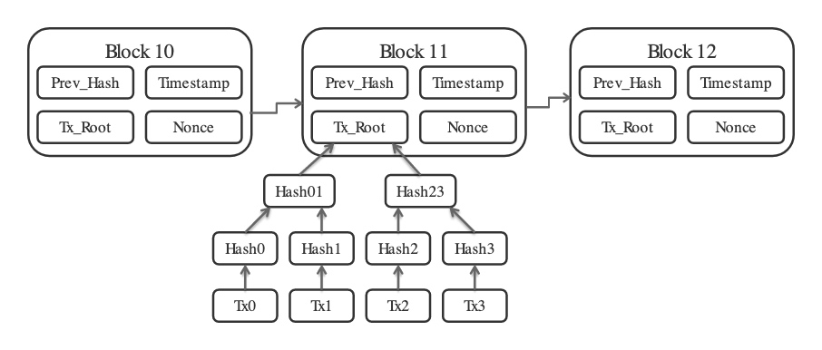
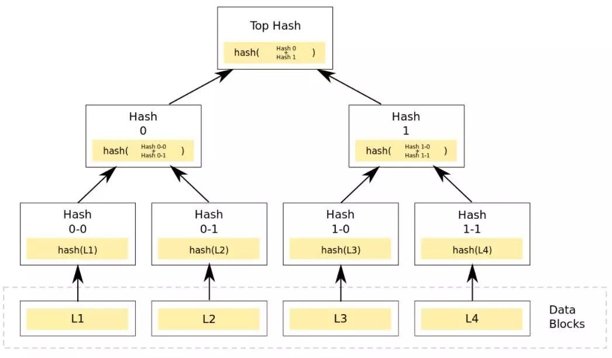
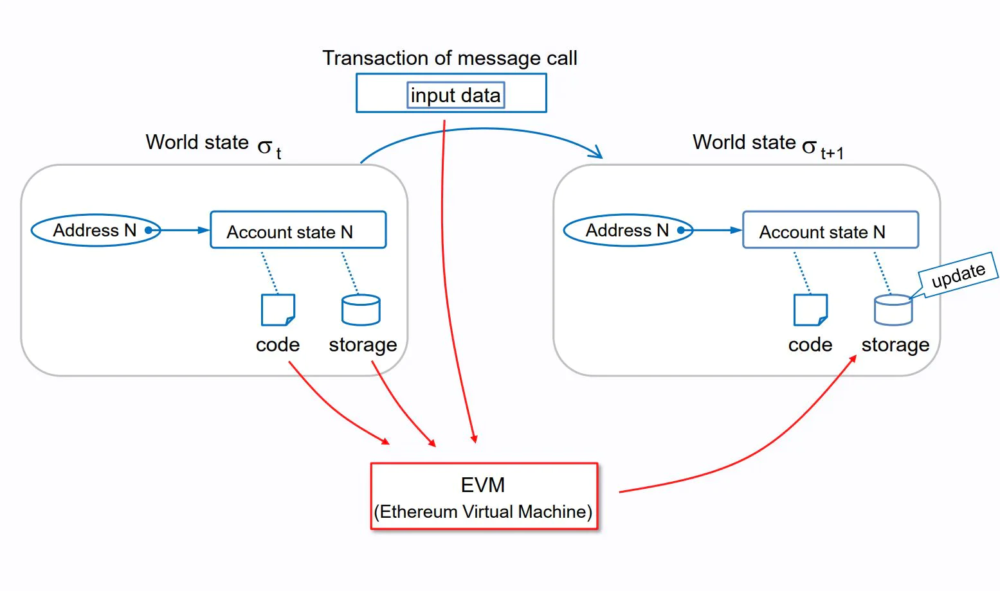
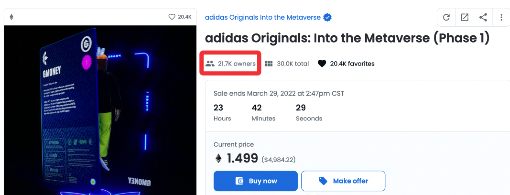
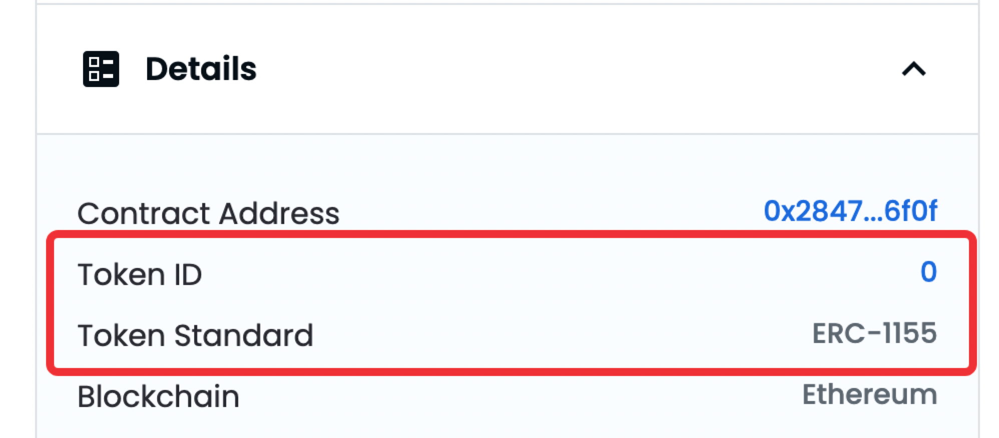
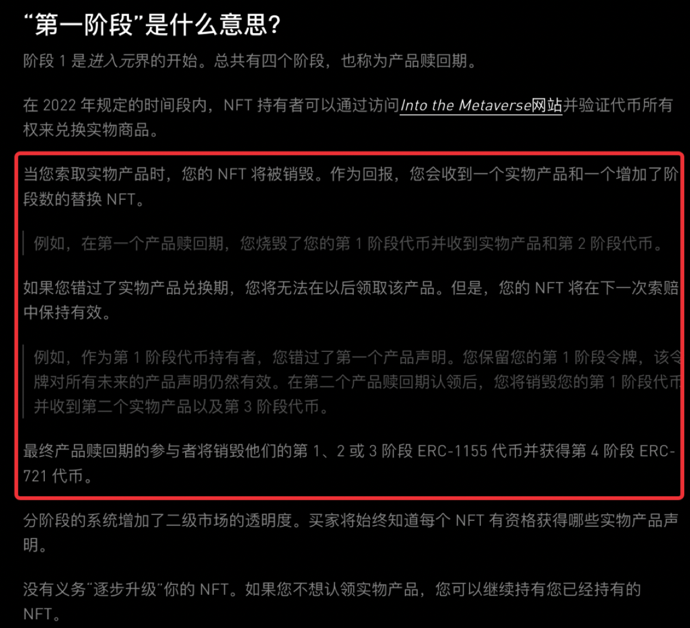
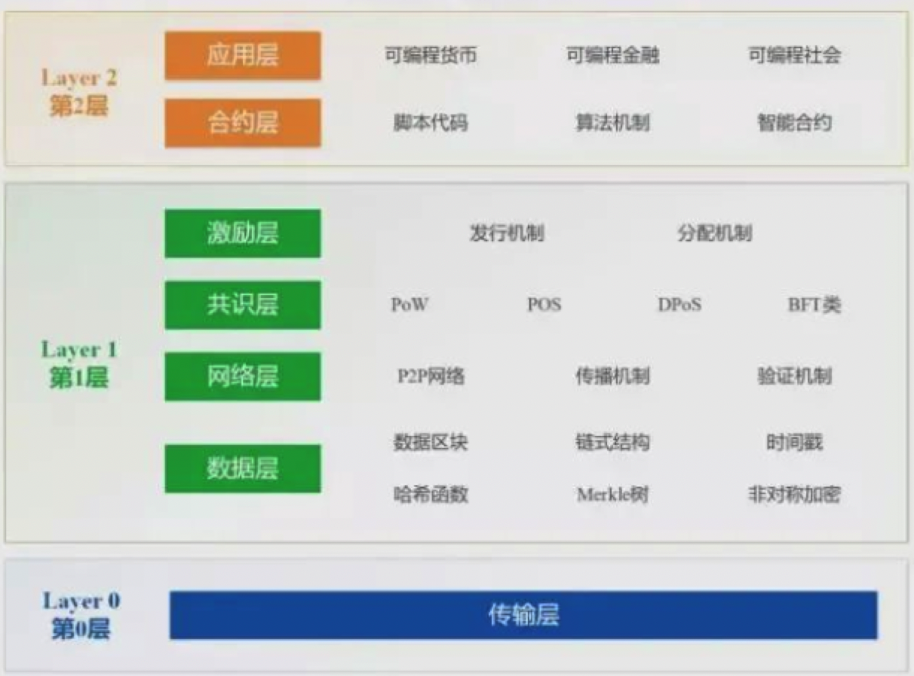
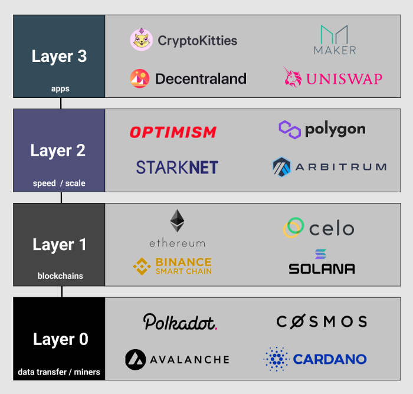

- [Bitcoin-区块链技术的起源](#bitcoin-区块链技术的起源)
  - [非对称加密](#非对称加密)
  - [时间戳服务器](#时间戳服务器)
  - [Merkle Tree](#merkle-tree)
  - [工作量证明(POW)](#工作量证明pow)
    - [拜占庭将军问题](#拜占庭将军问题)
    - [工作量证明谜题](#工作量证明谜题)
    - [矿机](#矿机)
    - [权益证明(POS)](#权益证明pos)
- [Ethereum - 迈入区块链2.0](#ethereum---迈入区块链20)
  - [Gas费用](#gas费用)
  - [ERC标准](#erc标准)
    - [ERC-20 同质化代币标准](#erc-20-同质化代币标准)
    - [ERC-721 非同质化代币标准](#erc-721-非同质化代币标准)
    - [ERC-1155](#erc-1155)
    - [ERC-3525 半同质化代币标准](#erc-3525-半同质化代币标准)
  - [Etherscan](#etherscan)
  - [区块链扩容方案](#区块链扩容方案)
    - [L0、L1、L2](#l0l1l2)
- [Web3.0应用架构](#web30应用架构)


# Bitcoin-区块链技术的起源
2008 年 10 月 31 日，中本聪（Satoshi Nakamoto）发布了[比特币白皮书][1]。

## 非对称加密
使用非对称加密的公私钥体系设计账户，公钥就是账户地址，持有私钥的人可以通过签名交易来支配账户里的资产。签名后的交易被广播到网络中，等待矿工打包。（保证了签名不可伪造也不可抵赖）


## 时间戳服务器
每次打包一些交易（最多 1MB 大小）会形成一个`区块(block)`，根据区块头的内容加上`时间戳(timestamp)`可以算出这个区块的哈希值，同时区块头里有一个指向前一区块的哈希值，从而这些不断增长的区块可以串接起来形成单向有序链表（区块链）。所有历史交易记录都保存在区块链中。

全网所有节点地位相同，都持有这个账本的全量数据，账本内容完全公开可追溯。这样就形成了一个全局账本，确保同一枚比特币不会被`双重支付`。


## Merkle Tree
区块体里存放了这次打包的 N 笔交易，所有交易按规则生成一个Merkle Tree，每个区块头里有个 merkle root 字段记录默克尔树的根，来保证区块体交易不可篡改。



Merkle Tree的特点：任何一个叶子结点被篡改，会被立刻发现



如果一枚硬币最近发生的交易发生在足够多的区块之前，那么，这笔交易之前该硬币的花销交易记录可以被丢弃 —— 目的是为了节省磁盘空间。


## 工作量证明(POW)
有些节点是矿工，负责把网络中的交易打包到账本中，并赚取打包的奖励和交易手续费。矿工打包出的区块除了满足数据的合法性要求（交易内容都是可以通过验证的），还需要给出一个`工作量证明`。

### 拜占庭将军问题
`拜占庭将军问题`是Leslie Lamport（2013年的图灵讲得住）用来为描述分布式系统一致性问题（Distributed Consensus）在[论文][2]中抽象出来一个的例子。

>拜占庭帝国想要进攻一个强大的敌人，为此派出了10支军队去包围这个敌人。这个敌人虽不比拜占庭帝国，但也足以抵御5支常规拜占庭军队的同时袭击。这10支军队在分开的包围状态下同时攻击。他们任一支军队单独进攻都毫无胜算，除非有至少6支军队（一半以上）同时袭击才能攻下敌国。他们分散在敌国的四周，依靠通信兵骑马相互通信来协商进攻意向及进攻时间。困扰这些将军的问题是，他们不确定他们中是否有叛徒，叛徒可能擅自变更进攻意向或者进攻时间。在这种状态下，拜占庭将军们才能保证有多于6支军队在同一时间一起发起进攻，从而赢取战斗？

说明：
1. 拜占庭将军问题中并不去考虑通信兵是否会被截获或无法传达信息等问题，即消息传递的信道绝无问题。Lamport已经证明了在消息可能丢失的不可靠信道上试图通过消息传递的方式达到一致性是不可能的。（计算机网络通讯中TCP协议保障）
2. Lamport提出的Paxos算法或其衍生算法(ZooKeeper/Chubby等系统支持)仅适用于中心化的分布式系统，这样的系统的没有不诚实的节点（不会发送虚假错误消息，但允许出现网络不通或宕机出现的消息延迟）。

中本聪通过引入`工作量证明(POW:Proof of Work)`来解决不诚实节点的问题，使得在P2P网络中可以保证一致性。

### 工作量证明谜题
>找到一个`nonce值`，使得新区块头的哈希值小于某个指定的值，即区块头结构中的“难度目标”。在节点成功找到满足的Hash值 之后，会马上对全网进行广播打包区块，网络的节点收到广播打包区块，会立刻对其进行验证。

如果验证通过，则表明已经有节点成功解迷，自己就不再竞争当前区块打包，而是选择接受这个区块，记录到自己的账本中，然后进行下一个区块的竞争猜谜。

计算过程类似：

```py
for nonce in range(0, 2**32):
    block_header = version + previous_block_hash + merkle_root + timestamp + target_bits + nonce
    if HASH(block_header) < target_bits: 
        break
    else: 
        continue
```

说明：

target_bits，用来控制挖矿难度（比特币期望出块的平均时间是10分钟，每14天整个比特币系统会根据之前出块速度调整全网难度来靠近 10 分钟。）

```
目标值 = 最大目标值 / 难度值
最大目标值=0x00000000FFFFFFFFFFFFFFFFFFFFFFFFFFFFFFFFFFFFFFFFFFFFFFFFFFFFFFFF

新难度值 = 旧难度值 * ( 过去2016个区块花费时长 / 20160 分钟 )
```

实际挖矿的基本步骤：

1. 生成Coinbase交易，并与其他所有准备打包进区块的交易组成交易列表，并生成默克尔哈希;
2. 把默克尔哈希及其他相关字段组装成区块头，将区块头(Block Header)作为工作量证明的输入，区块头中包含了前一区块的哈希，区块头一共80字节数据;
3. 不停地变更区块头中的随机数即nonce的数值，也就是暴力搜索，将结果值与当前网络的目标值做对比，如果小于目标值，则解题成功，工作量证明完成。

在指定时间内，给定一个难度，找到答案的概率唯一地由所有参与者能够迭代哈希的速度决定。掌握51%的算力对系统进行攻击所付出的代价远远大于作为一个系统的维护者和诚实参与者所得到的。

### 矿机
PoW挖矿算法大致分为两个大类，第一类叫计算困难，第二类内存困难。计算机的组成分为计算单元和存储单元，一个计算机的瓶颈往往是IO，如果要制造大量的IO操作，可以通过写程序撑大内存，制造大量的数据处理过程，使工作量证明从计算单元转变为 存储单元。

- 计算困难型：Scrypt、X11、SHA-3
- 内存困难型：ETHASH（Dagger-Hashimoto的修改版本,以太坊的PoW挖矿算法）

矿机演进：CPU-GPU-FPGA-ASIC专业芯片(高性能计算)+矿池（分布式计算）

### 权益证明(POS)
PoS全称是Proof of Stake，⽬的就是为了解决使⽤PoW挖矿出现⼤量资源浪费的问题。

在PoS系统中，这个公式变更为： Hash(block_header) < target_bits * CoinAge。

说明：
- CoinAge(币龄)，字⾯意思就是币数量乘以持有天数。如果你的币龄越⼤，也就意味着你的获得答案越容易。

问题
1. 冷启动问题。
2. 囤积问题，这会造成币流通的不充分（通货紧缩）。
3. Nothing at Stake，翻译过来叫做⽆成本利益问题。⼤体的意思在PoS系统中做任何事⼏乎没有成本，⽐如在PoS系统上挖矿⼏乎没有成本，这也就意味着分叉⾮常⽅便。（反正也没什么成本，反正分叉链和主链都可以同时挖，说不定什么时候就值钱了）
4. 价值观理念

# Ethereum - 迈入区块链2.0
比特币的脚本能力非常有限，大家基本就只用来转账，以太坊创始人Vitalik Buterin（中文用户常称之V神，1994出生）认为可以在区块链上构建出一种叫`智能合约（smart contract）`的东西，提供广泛的可编程能力来满足现实世界里各种各样的需求而不仅仅是转账。

以太坊相对于比特币，做了几个关键的改进：

1. 引入账户系统和`世界状态`。以太坊也有自己的原生代币 ETH，每个地址持有的 ETH 余额直接明确记录下来，转账就是分别增减两个账户的余额。
2. 引入`智能合约`。智能合约在被创建时携带一份代码，以太坊的节点客户端提供了一个叫 `EVM（Ethereum Virtual Machine）`的虚拟机环境，能够执行这个代码，智能合约的代码创建后不可修改(`code is law`)，在链上也有一个公开地址。
3. 账户发起的一笔交易可以是普通转账，也可以是调用某个智能合约的某个函数，这样就有动作可以驱动智能合约代码的执行和状态变更。

以太坊通过引入图灵完备的智能合约编程+智能合约可以持久化自己内部的状态（可以理解为它的全局变量）来向上提供丰富的可操纵性，号称世界计算机。账户的基本情况、智能合约的持久化数据共同组成整条以太坊链的世界状态，用户通过发起交易推动世界状态一次次改变。



说明：
1. 还有其他的一些知名公链比如 Solana, Avalanche, BSC, NEAR。
2. 智能合约不能获取到链外的数据，比如我们写一个合约来赌球，球赛的结果以太坊肯定是不知道的。把这种链外的数据写到链内的工具叫`预言机（oracle）`。预言机是区块链与现实世界进行数据交互的接口，已经有去中心化运行的预言机产品，保障上链信息的可信度。

## Gas费用
在技术上Gas的价格表示为 wei，是 ETH 最小的增量单位。

* 1 wei 等于0.000000000000000001 ETH（$10^{-18}$)
* 1 gwei 等于1,000,000,000 wei

用户已经习惯了以 gwei 为单位来表示 gas 价格，可以使用[Gas.Watch][3]留意实时的gas价格。Gas 会随着打包进区块链的交易需求上下波动。 

在London Upgrade之前（August 2021）

    Total Fee = Gas units (limit) * Gas price per unit

假设 Alice 需要付给 Bob 1 ETH。在这次交易中：
- gas limit = 21,000 units
- gas price = 200 gwei 
- 全部费用 = 21,000 * 200 = 4,200,000 gwei = 0.0042 ETH

账户变化：
- Alice账户：-1.0042 ETH
- Bob账户：+1.0000 ETH
- Miner账户：+0.0042 ETH

在London Upgrade之后

    Total Fee = Gas units(limit) * (Base fee + Tip)

其中：
- `Base fee`:every block has a base fee, the minimum price per unit of gas for inclusion in this block, calculated by the network based on demand for block space.
- `Tip` (priority fee):compensates miners for executing and propagating user transactions in blocks
- `max fee`(maxFeePerGas):refund = max fee - (Base fee + Tip)，refund>=0的前提下才能执行。

假设 Alice 需要付给 Bob 1 ETH。在这次交易中：
- gas limit = 21,000 units
- Base fee = 100 gwei
- Tip = 10 gwei
- 全部费用 = 21,000 * (100+10) = 2,310,000 gwei = 0.00231 ETH

账户变化：
- Alice账户：-1.00231 ETH
- Bob账户：+1.0000 ETH
- Miner账户：+0.00021 ETH
- Base fee of 0.0021 ETH is burned

说明：
- Block size
  - Before the London Upgrade, Ethereum had fixed-sized blocks. In times of high network demand, these blocks operated at total capacity. As a result, users often had to wait for high demand to reduce to get included in a block, which led to a poor user experience.
  - The London Upgrade introduced variable-size blocks to Ethereum. Each block has a target size of 15 million gas, but the size of blocks will increase or decrease in accordance with network demand, up until the block limit of 30 million gas (2x the target block size).
- Base fee
  - The base fee is calculated independently of the current block and is instead determined by the blocks before it - making transaction fees more predictable for users. When the block is mined this base fee is "burned", removing it from circulation.
  - The base fee is calculated by a formula that compares the size of the previous block (the amount of gas used for all the transactions) with the target size. The base fee will increase by a maximum of 12.5% per block if the target block size is exceeded. 

## ERC标准
[Ethereum Improvement Proposals][4] (`EIPs`) describe standards for the Ethereum platform.EIPs are separated into a number of types, and each has its own list of EIPs.

- `Standard Track (497)`:Describes any change that affects most or all Ethereum implementations, such as a change to the network protocol, a change in block or transaction validity rules, proposed application standards/conventions, or any change or addition that affects the interoperability of applications using Ethereum. 
- `Core (189)`:Improvements requiring a consensus fork
- `Interface (42)`:Includes improvements around client API/RPC specifications and standards, and also certain language-level standards like method names (EIP-6) and contract ABIs.
- `ERC (253)`:Application-level standards and conventions, including contract standards such as token standards (ERC-20), name registries (ERC-137), URI schemes (ERC-681), library/package formats (EIP190), and wallet formats (EIP-85).

### ERC-20 同质化代币标准
[ERC-20][5]标准接口主要是在智能合约中实现了Token(代币)的标准api，也就是通过函数来为代币提供基本的功能：例如Token转账、授权等等。

必要函数:

```java
// IERC20.sol
// SPDX-License-Identifier: MIT

pragma solidity ^0.8.0;

interface IERC20 {

    // 返回token总供应量
    function totalSupply() external view returns (uint256);

    // 返回账户的余额
    function balanceOf(address account) external view returns (uint256);

    // 向recipient地址转移value数量的token，函数必须触发事件Transfer
    function transfer(address recipient, uint256 amount) external returns (bool);

    // 查询owner授权给spender的额度
    function allowance(address owner, address spender) external view returns (uint256);

    // 授权spender可以从我们在账户最多转移token的数量value，可以多次转移，但总量不超过value
    function approve(address spender, uint256 amount) external returns (bool);

    // 可以允许第三方代表我们转移代币。 如果 _from 账号没有授权调用帐户转移代币，则该函数需要抛出异常。
    function transferFrom(address sender, address recipient, uint256 amount) external returns (bool);

    // 当有token转移时，触发Transfer事件
    event Transfer(address indexed from, address indexed to, uint256 value);

    // approve函数成功执行时，触发Approval事件
    event Approval(address indexed owner, address indexed spender, uint256 value);
}
```

可选函数：ERC-20标准接口中有三个可选函数，主要是返回代币的基本信息，所以也可以称为元数据。

```java
// IERC20Metadata.sol
// SPDX-License-Identifier: MIT

pragma solidity ^0.8.0;

import "./IERC20.sol";

interface IERC20Metadata is IERC20 {

    // 返回的是代币的名称，例如Binance Coin
    function name() external view returns (string);

    // 返回的是代币的代号，例如BNB
    function symbol() external view returns (string);

    // 返回的是代币的使用的小数位数，例如8（意味着将代币总量除以100000000来获取表现的形式）
    function decimals() external view returns (uint8);
}
```

### ERC-721 非同质化代币标准
非同质化（Non-Fungible Token，以下简称 NFT 或 NFTs）Token(代币)标准
* 智能合约中实现 NFT 的标准API。 标准提供了跟踪和转移NFTs的基本功能。
* NFT可以代表对数字或物理资产的所有权。非同质代表独一无二，NFT是可区分的
* ERC20的Token是可置换的，且可细分为N份（1 = 10 * 0.1）, 而ERC721的Token最小的单位为1，无法再分割。

每个符合ERC-721的合同都必须实现 ERC721 和 ERC165 接口（ERC-165只是一个标准，要求使用一种标准的方法去发布或者检测（supportsInterface）一个智能合约所实现的接口。）。

```java
interface IERC721 is IERC165 {

    // 变更NFT所有权、NFT的创建（from == 0）和销毁时（to == 0）触发。合约创建时除外
    event Transfer(address indexed from, address indexed to, uint256 indexed tokenId);

    // 在NFT的授权地址approved address变更或者重新确认时被触发
    // 发起transfer时，approved address会被重置为none
    event Approval(address indexed owner, address indexed approved, uint256 indexed tokenId);

    // operator被授权或撤权时触发。operator可以管理owner的所有NFT
    event ApprovalForAll(address indexed owner, address indexed operator, bool approved);

    // 返回由owner持有的NFTs的数量。
    function balanceOf(address owner) external view returns (uint256 balance);

    // 返回tokenId代币持有者的地址
    function ownerOf(uint256 tokenId) external view returns (address owner);

    // 将NFT的所有权从一个地址转移到另一个地址
    // 1. 调用者msg.sender应该是当前tokenId的所有者或被授权的地址
    // 2. from不是tokenId的所有者 、to是零地址、tokenId不是有效id均抛出异常。
    // 3. 当转移完成时，函数检查 to是否是合约，如果是，调用onERC721Receiver方法，并检查其返回值是否是0x150b7a02，（即bytes4(keccak256("onERC721Received(address,address,uint256,bytes)")),如果不是则抛出异常
    function safeTransferFrom(
        address from,
        address to,
        uint256 tokenId
    ) external;

    // 授予地址to具有tokenId的控制权，方法成功后需触发Approval 事件。
    function approve(address to, uint256 tokenId) external;

    // 获取单个NFT的授权地址
    function getApproved(uint256 tokenId) external view returns (address operator);

    // 启用或禁用第三方（操作员）管理msg.sender所有资产
    // 触发 ApprovalForAll 事件，合约必须允许每个所有者可以有多个操作员
    // approved True 表示授权, false 表示撤销
    function setApprovalForAll(address operator, bool _approved) external;

    // 查询一个地址是否是另一个地址的授权操作员
    function isApprovedForAll(address owner, address operator) external view returns (bool);

    // 将NFT的所有权从一个地址转移到另一个地址，功能同上，附带data参数，传递给接收者
    function safeTransferFrom(
        address from,
        address to,
        uint256 tokenId,
        bytes calldata data
    ) external;
}
```

### ERC-1155
ERC-1155 是 ERC-20 和 ERC-721 的升级规范，它允许在一个交易中发送多种不同的代币。

标准 | ERC-20 | ERC-721 | ERC-1155
---|--------|---------|---------
代币类型 | 同质化代币 | 非同质化代币 | 同质化代币、非同质化代币、介于同质化和非同质化代币之间可以互相切换的代币
特点 | 代币属性相同、可无损互换、可拆分 | 代币属性互不相同、不可互换、不可拆分 | 前两者的特点都有，且在一定程度上可以在两者中切换
生成处理 | 一次性只能生成一种 ERC-20 代币，一次性只能进行单笔单对象交易，并且交易处理需要多次批准 | 一次性只能生成一种 ERC-721 代币，一次性只能进行单笔单对象交易，并且交易处理需要多次批准 | 一次性可以生成多种 ERC-1155 代币资产类别，一次性可以进行多笔多对象交易，交易处理只需要一次批准

说明：

1. ERC1155相比于ERC721简而言之最大的区别就是它可以一个合约承载多类FT与NFT，可以将其理解为是ERC20和ERC721的融合加强版，想发行同质化和非同质化的代币1155全部搞定，而不用用多个合约承载再进行交互。
2. ERC721是一个合约承载1类NFT，1类NFT承载多个NFT，如无聊猿，它的合约有且仅能发行无聊猿这一套NFT，每个具体的NFT编号均不相同为递增，但是ERC1155一个合约可以发行多类NFT，它最常用的场景在游戏，比如一个游戏中，可能会有很多类装备如“武器”、“坐骑”、“药品”等，这些装备有的是非同质化的，比如屠龙宝刀只有1个，有的是同质化的比如药品都是一样的喝一瓶补10滴血，而传统的721只能发行一类实体，但是1155却可以发行多类。

阿迪达斯NFTopensea网址如下：https://opensea.io/collection/adidasoriginals。





阿迪达斯NFT共分为四个阶段，第1、2、3阶段都涉及到销毁兑换操作，第四个阶段会获得一个ERC721 NFT。



### ERC-3525 半同质化代币标准
SFT 适合于表达内含数量特征、有时需要进行合并或拆分操作的数字物品。典型的例子是金融票据、高级金融合约、土地，以及一切具有内在数量的标准化商品。例如，两张条件完全相同、面值各 500 元的债券，等同于一张相同条件、面值 1000 元的债券。再例如，两块虚拟土地，在一定条件下，可以合并视为一块。在实体经济中，两块同型号、有效面积各 20 平米的太阳能板，在管理核算的时候，可以视为一个 40 平米的太阳能板，两车皮的同型号煤炭，可以按吨位加合统计为同一批次。

## Etherscan
在区块链世界中, 有一个 "快递查询工具" 的应用, 它就是 Etherscan, 网址 https://etherscan.io/

中文网址是 https://etherscan.io/language.aspx

## 区块链扩容方案
### L0、L1、L2
区块链逻辑架构：



- 第 0 层又称数据传输层，主要涉及区块链和传统网络之间的结合问题。有这样几个作用：
  - 允许区块链相互交互。一个很好的例子是 [Cosmos][6]，它创建了一个可互操作的区块链生态系统，这要归功于其“ Tendermint IBC ”（区块链间通信协议）。
  - 更快、更便宜的交易。使用 IBC，PoS 共识可以实现跨多个链进行交易，导致最终确定时间几乎在瞬间发生（最终确定 = 当一个块被批准时，不能回滚，并且被认为是不可逆的）。这使得跨链交易所的交易更快、更便宜。
- 第 1 层是在自己的区块链上处理和完成交易的区块链（例如比特币和以太坊）。这是诸如共识（PoW、PoS）之类的事情以及诸如区块时间和争议解决之类的所有技术细节运作的地方。
  - Layer 1扩容方案又称链上扩容，指在区块链基层协议上实现的扩容解决方案。
- 第 2 层是与第 1 层结合使用的第三方集成，Layer2诞生的主要目的便是为了提高可扩展性和每秒交易数（系统吞吐量）。
  - Layer 2扩容方案又称链下扩容，指不改变区块链底层协议和基础规则，通过状态通道、侧链等方案提高交易处理速度。

各层著名的应用：

  

# Web3.0应用架构


[1]:https://bitcoin.org/bitcoin.pdf "《Bitcoin: A Peer-to-Peer Electronic Cash System》"
[2]:http://lamport.azurewebsites.net/pubs/byz.pdf "The Byzantine Generals Problem"
[3]:https://www.useweb3.xyz/gas?source=ethgas.watch&referrer=ethgas.watch
[4]:https://eips.ethereum.org/
[5]:https://eips.ethereum.org/EIPS/eip-20
[6]:https://cosmos.network/