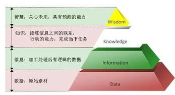

[豆瓣链接](https://book.douban.com/subject/26279954/)

    作者: [美] 戴维·温伯格 
    出版社: 山西人民出版社
    译者: 胡泳 / 高美 
    出版年: 2014-12-1
    页数: 372
    定价: 42.00元
    装帧: 平装
    丛书: 汉唐阳光人文图书
    ISBN: 9787203088356

# 第一章 知识超载
## 知识三角形
`三角形的最下层是数据，往上逐渐收窄的每一层，依次是信息、知识、理解和智慧。`世界上显然有太多的数据，却没有多少智慧。

`数据本身没有价值，但通过处理数据，你得到了信息。从信息中提炼出更有价值的东西，叫“知识”。信息是结构化的数据，而知识则是“可以付诸行动的信息”。`

`研究表明太多的信息能够损害我们思考的能力。`当太多信息进入我们的“湿件”，就会超过我们的“信道容量”。

## 算法机制和社交机制
算法技术利用了计算机强大的记忆能力和处理能力，从浩瀚星云般的数据中寻找出答案。而社交工具则将我们朋友们的选择，作为指南，帮助我们寻找到感兴趣的东西。

# 第二章 深不可测的知识海洋
## 伟大的解放事实行为
“每个人都可以有他自己的观点，但不可以有他自己的事实。”

让大量的事实作为一种研究资源能被任何人获取，但不带有观点或者目的。

在网络上，每个事实都有一个大小相等、方向相反的反作用力。这些反作用力的事实可能错得彻头彻尾。的确如此，当事实真的自相矛盾时，至少有一个事实是错误的。但是，这种持续的、支持多方的、每个事实相互连接的矛盾性，改变了事实的性质以及事实对于我们文化的作用。

# 第三章 知识的实体
## 知识的特点
1. 知识是信条的子集。我们相信很多事物，但是它们中仅有一部分是知识。
2. 知识是由我们有理由去相信的信条而构成的。不管那是因为我们通过实验确信，通过逻辑证明或是上帝揭示给我们的。
3. 知识由大量的真理构成，这些真理结合在一起反映了世界的真实本质。

# 第五章 一个回声的市集
## 审视多样性
1. 并非所有的多样性都是平等的。那种能够让群体智慧胜过最聪明个体的多样性，来自于视角和探索方式的多样性。
2. 拥有恰好足够的共性。
3. 用手搅拌。
4. 分流。

## 网络充满差异性
1. 所有的知识和经历都是一种解读。
2. 解读是社会性的。
3. 解读没有高下之分。
4. 解读发生于话语之中。
5. 在某一种话语中，某些解读是倍受青睐的。

# 第七章 太多科学
## 定义科学知识
知识：基于事实的理论。科学知识已经具有了新媒介的属性，越来越像它所处的网络。科学知识正在变得：

1. 巨大；
2. 层次性弱化；
3. 更加公共；
4. 中心过滤减少；
5. 对差异性更加开放；
6. 具有超链接特点。