    作者: 集智俱乐部 
    出版社: 人民邮电出版社
    出版年: 2015-7
    页数: 324
    定价: 49.00元
    装帧: 平装
    丛书: 集智俱乐部
    ISBN: 9787115396624

[豆瓣链接](https://book.douban.com/subject/26546914/)

- [1.人工智能之梦](#1%e4%ba%ba%e5%b7%a5%e6%99%ba%e8%83%bd%e4%b9%8b%e6%a2%a6)
  - [梦的开始（1900—1956）](#%e6%a2%a6%e7%9a%84%e5%bc%80%e5%a7%8b19001956)
  - [梦的延续（1956—1980）](#%e6%a2%a6%e7%9a%84%e5%bb%b6%e7%bb%ad19561980)
  - [群龙问鼎（1980—2010）](#%e7%be%a4%e9%be%99%e9%97%ae%e9%bc%8e19802010)
    - [符号学派](#%e7%ac%a6%e5%8f%b7%e5%ad%a6%e6%b4%be)
    - [连接学派](#%e8%bf%9e%e6%8e%a5%e5%ad%a6%e6%b4%be)
      - [统计学习理论](#%e7%bb%9f%e8%ae%a1%e5%ad%a6%e4%b9%a0%e7%90%86%e8%ae%ba)
    - [行为学派](#%e8%a1%8c%e4%b8%ba%e5%ad%a6%e6%b4%be)
      - [进化计算](#%e8%bf%9b%e5%8c%96%e8%ae%a1%e7%ae%97)
      - [人工生命](#%e4%ba%ba%e5%b7%a5%e7%94%9f%e5%91%bd)
    - [三大学派间的关系](#%e4%b8%89%e5%a4%a7%e5%ad%a6%e6%b4%be%e9%97%b4%e7%9a%84%e5%85%b3%e7%b3%bb)
  - [分裂与统一](#%e5%88%86%e8%a3%82%e4%b8%8e%e7%bb%9f%e4%b8%80)
    - [贝叶斯统计](#%e8%b4%9d%e5%8f%b6%e6%96%af%e7%bb%9f%e8%ae%a1)
    - [通用人工智能](#%e9%80%9a%e7%94%a8%e4%ba%ba%e5%b7%a5%e6%99%ba%e8%83%bd)
  - [梦醒何方（2010至今）](#%e6%a2%a6%e9%86%92%e4%bd%95%e6%96%b92010%e8%87%b3%e4%bb%8a)
    - [深度学习](#%e6%b7%b1%e5%ba%a6%e5%ad%a6%e4%b9%a0)
    - [仿真大脑](#%e4%bb%bf%e7%9c%9f%e5%a4%a7%e8%84%91)
    - [“人工”人工智能](#%e4%ba%ba%e5%b7%a5%e4%ba%ba%e5%b7%a5%e6%99%ba%e8%83%bd)
- [2.图灵的计算王国](#2%e5%9b%be%e7%81%b5%e7%9a%84%e8%ae%a1%e7%ae%97%e7%8e%8b%e5%9b%bd)
  - [图灵机](#%e5%9b%be%e7%81%b5%e6%9c%ba)
  - [计算](#%e8%ae%a1%e7%ae%97)
    - [归纳](#%e5%bd%92%e7%ba%b3)
  - [仿真](#%e4%bb%bf%e7%9c%9f)
    - [图灵机之间的仿真](#%e5%9b%be%e7%81%b5%e6%9c%ba%e4%b9%8b%e9%97%b4%e7%9a%84%e4%bb%bf%e7%9c%9f)
    - [计算等价性](#%e8%ae%a1%e7%ae%97%e7%ad%89%e4%bb%b7%e6%80%a7)
    - [意义](#%e6%84%8f%e4%b9%89)
  - [万能图灵机](#%e4%b8%87%e8%83%bd%e5%9b%be%e7%81%b5%e6%9c%ba)
    - [编码](#%e7%bc%96%e7%a0%81)
    - [自食其尾](#%e8%87%aa%e9%a3%9f%e5%85%b6%e5%b0%be)
  - [停机问题](#%e5%81%9c%e6%9c%ba%e9%97%ae%e9%a2%98)
    - [死循环](#%e6%ad%bb%e5%be%aa%e7%8e%af)
    - [意味着什么](#%e6%84%8f%e5%91%b3%e7%9d%80%e4%bb%80%e4%b9%88)
    - [超越图灵计算](#%e8%b6%85%e8%b6%8a%e5%9b%be%e7%81%b5%e8%ae%a1%e7%ae%97)
- [3.从零开始的计算机系统](#3%e4%bb%8e%e9%9b%b6%e5%bc%80%e5%a7%8b%e7%9a%84%e8%ae%a1%e7%ae%97%e6%9c%ba%e7%b3%bb%e7%bb%9f)
  - [逻辑门](#%e9%80%bb%e8%be%91%e9%97%a8)
  - [一切运算的基础——加法](#%e4%b8%80%e5%88%87%e8%bf%90%e7%ae%97%e7%9a%84%e5%9f%ba%e7%a1%80%e5%8a%a0%e6%b3%95)
  - [让计算过程自动起来——机器指令](#%e8%ae%a9%e8%ae%a1%e7%ae%97%e8%bf%87%e7%a8%8b%e8%87%aa%e5%8a%a8%e8%b5%b7%e6%9d%a5%e6%9c%ba%e5%99%a8%e6%8c%87%e4%bb%a4)
  - [写点能让人理解的东西——编程语言](#%e5%86%99%e7%82%b9%e8%83%bd%e8%ae%a9%e4%ba%ba%e7%90%86%e8%a7%a3%e7%9a%84%e4%b8%9c%e8%a5%bf%e7%bc%96%e7%a8%8b%e8%af%ad%e8%a8%80)
- [4.一条永恒的金带](#4%e4%b8%80%e6%9d%a1%e6%b0%b8%e6%81%92%e7%9a%84%e9%87%91%e5%b8%a6)
  - [哥德尔定理](#%e5%93%a5%e5%be%b7%e5%b0%94%e5%ae%9a%e7%90%86)
  - [永恒的黄金对角线](#%e6%b0%b8%e6%81%92%e7%9a%84%e9%bb%84%e9%87%91%e5%af%b9%e8%a7%92%e7%ba%bf)
- [5.从算法复杂性到通用人工智能](#5%e4%bb%8e%e7%ae%97%e6%b3%95%e5%a4%8d%e6%9d%82%e6%80%a7%e5%88%b0%e9%80%9a%e7%94%a8%e4%ba%ba%e5%b7%a5%e6%99%ba%e8%83%bd)
  - [压缩vs预测、编码vs概率](#%e5%8e%8b%e7%bc%a9vs%e9%a2%84%e6%b5%8b%e7%bc%96%e7%a0%81vs%e6%a6%82%e7%8e%87)
- [6.深度学习](#6%e6%b7%b1%e5%ba%a6%e5%ad%a6%e4%b9%a0)
  - [基本原理：从特征表示到深度学习](#%e5%9f%ba%e6%9c%ac%e5%8e%9f%e7%90%86%e4%bb%8e%e7%89%b9%e5%be%81%e8%a1%a8%e7%a4%ba%e5%88%b0%e6%b7%b1%e5%ba%a6%e5%ad%a6%e4%b9%a0)
  - [典型应用：教会计算机听、看、说](#%e5%85%b8%e5%9e%8b%e5%ba%94%e7%94%a8%e6%95%99%e4%bc%9a%e8%ae%a1%e7%ae%97%e6%9c%ba%e5%90%ac%e7%9c%8b%e8%af%b4)
  - [自然语言处理](#%e8%87%aa%e7%84%b6%e8%af%ad%e8%a8%80%e5%a4%84%e7%90%86)


## 1.人工智能之梦
### 梦的开始（1900—1956）
- 大卫·希尔伯特（1862—1943）
    - 运用公理化的方法统一整个数学，并运用严格的数学推理证明数学自身的正确性。
    - 希尔伯特第二问题：证明数学系统中应同时具备一致性（数学真理不存在矛盾）和完备性（任意真理都可以被描述为数学定理）。
- 库尔特·哥德尔（1906—1978）
    - 任何足够强大的数学公理系统都存在着瑕疵：一致性和完备性不能同时具备。
    - 为人工智能提出了警告：如果我们把人工智能也看作一个机械化运作的数学公理系统，那么根据哥德尔定理，必然存在着某种人类可以构造、但是机器无法求解的人工智能的“软肋”。
    - 所以，存在着人类可以求解但是机器却不能解的问题，人工智能不可能超过人类。
- 艾伦·图灵（1912—1954）
    - 希尔伯特第十问题的表述是：“是否存在着判定任意一个丢番图方程有解的机械化运算过程。”
    - 图灵机把所有这些过程都模型化了：草稿纸被模型化为一条无限长的纸带，笔被模型化为一个读写头，固定的10以内的运算法则模型化为输入给读写头的程序，对于进位的记忆则被模型化为读写头的内部状态。于是，设定好纸带上的初始信息，以及读写头的当前内部状态和程序规则，图灵机就可以运行起来了。它在每一时刻读入一格纸带的信息，并根据当前的内部状态，查找相应的程序，从而给出下一时刻的内部状态并输出信息到纸带上。
    - 图灵当年在《机器能思考吗？》一文中设立的标准相当宽泛：只要有30%的人类测试者在5分钟内无法分辨出被测试对象，就可以认为程序通过了图灵测试。
        - 图灵将智能等同于符号运算的智能表现，而忽略了实现这种符号智能表现的机器内涵。这样做的好处是可以将所谓的智能本质这一问题绕过去，它的代价是人工智能研制者们会把注意力集中在如何让程序欺骗人类测试者上，甚至可以不择手段。所以，对于将图灵测试作为评判机器具备智能的唯一标准，很多人开始质疑。因为人类智能还包括诸如对复杂形式的判断、创造性地解决问题的方法等，而这些特质都无法在图灵测试中体现出来。

图灵机模型:


- 约翰·冯·诺依曼（1903—1957）
    - 冯·诺依曼的计算机与图灵机是一脉相承的，但最大的不同就在于，冯·诺依曼的读写头不再需要一格一格地读写纸带，而是根据指定的地址，随机地跳到相应的位置完成读写。这也就是我们今天所说的随机访问存储器（Random Access Memory，RAM）的前身。
- 诺伯特·维纳（1894—1964）
    - 在控制论中，维纳深入探讨了机器与人的统一性——人或机器都是通过反馈完成某种目的的实现，因此他揭示了用机器仿真人的可能性，这为人工智能的提出奠定了重要基础。

### 梦的延续（1956—1980）
会议足足开了两个月的时间，虽然大家没有达成普遍的共识，但是却为会议讨论的内容起了一个名字：人工智能。因此，**1956年也就成为了人工智能元年。**

- 费根鲍姆Edward A. Feigenbaum（1936—　）
    - 传统的人工智能之所以会陷入僵局，就是因为他们过于强调通用求解方法的作用，而忽略了具体的知识。仔细思考我们人类的求解过程就会发现，知识无时无刻不在起着重要作用。因此，人工智能必须引入知识。
    - 所谓的`专家系统`就是利用计算机化的知识进行自动推理，从而模仿领域专家解决问题。第一个成功的专家系统DENDRAL于1968年问世，它可以根据质谱仪的数据推知物质的分子结构。
    - 在专家系统、知识工程获得大量的实践经验之后，弊端开始逐渐显现了出来，这就是`知识获取`。

### 群龙问鼎（1980—2010）
事实上，在人工智能界，很早就有人提出过自下而上的涌现智能的方案，只不过它们从来没有引起大家的注意。一批人认为可以通过仿真大脑的结构（神经网络）来实现，而另一批人则认为可以从那些简单生物体与环境互动的模式中寻找答案。他们分别被称为`连接学派`和`行为学派`。与此相对，传统的人工智能则被统称为`符号学派`。

#### 符号学派
John McCarthy（1927—2011）:人工智能是关于如何制造智能机器，特别是智能的计算机程序的科学和工程。它与使用机器来理解人类智能密切相关，但人工智能的研究并不需要局限于生物学上可观察到的那些方法。

#### 连接学派
沃伦·麦卡洛克（Warren McCulloch）和沃尔特·匹兹（Walter Pitts）二人提出了一个单个神经元的计算模型

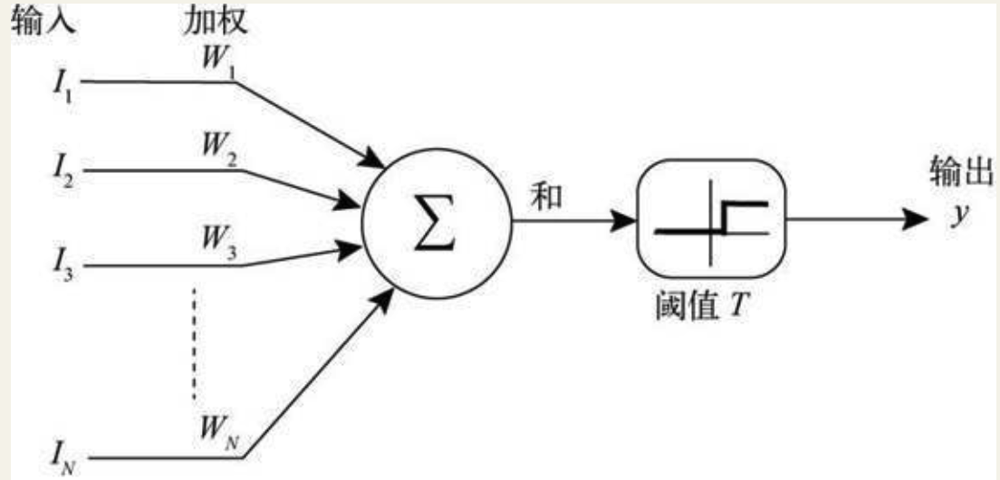

图 1-7　麦卡洛克和匹兹的神经元模型

1957年，弗兰克·罗森布拉特（Frank Rosenblatt）对麦卡洛克-匹兹模型进行了扩充，即在麦卡洛克-匹兹神经元上加入了学习算法，扩充的模型有一个响亮的名字：`感知机`。感知机可以根据模型的输出 y 与我们希望模型的输出 y * 之间的误差，调整权重 W1, W2, … ,WN 来完成学习。

1969年，马文·闵斯基通过理论分析指出，感知机并不像它的创立者罗森布拉特宣称的那样可以学习任何问题。连一个最简单的问题：判断一个两位的二进制数是否仅包含0或者1（即所谓的XOR问题）都无法完成。

Geoffrey Hinton（1947—　）:“多则不同”：只要把多个感知机连接成一个分层的网络，那么，它就可以圆满地解决闵斯基的问题。

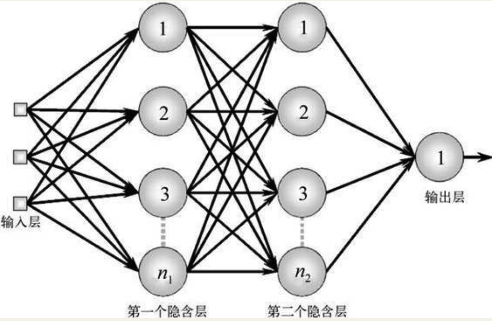

图 1-8　多层感知机

但接下来的问题是，“人多吃得多”，那么多个神经元，可能有几百甚至上千个参数需要调节，我们如何对这样复杂的网络进行训练呢？辛顿等人发现，采用几年前阿瑟·布赖森（Arthur Bryson）等人提出来的`反向传播算法`（Back propagation algorithm，简称BP算法）就可以有效解决多层网络的训练问题。

##### 统计学习理论
连接学派的科学家们很快又陷入了困境。虽然各种神经网络可以解决问题，但是，它们究竟为什么会成功以及为什么在有些问题上会屡遭失败，却没有人能说得清楚。对网络运行原理的无知，也使得人们对如何提高神经网络运行效率的问题无从下手。因此，连接学派需要理论的支持。

Vladimir Naumovich Vapnik（1964—　）:2000年左右，弗拉基米尔·万普尼克（Vladimir Naumovich Vapnik）和亚历克塞·泽范兰杰斯（Alexey Yakovlevich Chervonenkis）这两位俄罗斯科学家提出了一整套新的理论：统计学习理论。

我们的模型一定要与待解决的问题相匹配，如果模型过于简单，而问题本身的复杂度很高，就无法得到预期的精度。反过来，若问题本身简单，而模型过于复杂，那么模型就会比较僵死，无法举一反三，即出现所谓的`“过拟合”`（overfitting）现象。

`奥卡姆剃刀原理`:如果对于同一个问题有不同的解决方案，那么我们应该挑选其中最简单的一个。

统计学习理论也有很大的局限性，因为理论的严格分析仅仅限于一类特殊的神经网络模型：`支持矢量机`（Supporting Vector Machine）。而对于更一般的神经网络，人们还未找到统一的分析方法。所以说，**连接学派的科学家们虽然会向大脑学习如何构造神经网络模型，但实际上他们自己也不清楚这些神经网络究竟是如何工作的。**

#### 行为学派
Rodney Brooks（1954—　）:当我们把这些机器昆虫放到复杂的地形中的时候，它们可以痛快地爬行，还能聪明地避开障碍物。它们看起来的智能事实上并不来源于自上而下的复杂设计，而是来源于自下而上的与环境的互动。这就是布鲁克斯所倡导的理念。

##### 进化计算
John Holland（1929—　）:遗传算法对大自然中的生物进化进行了大胆的抽象，最终提取出两个主要环节：变异（包括基因重组和突变）和选择。在计算机中，我们可以用一堆二进制串来仿真自然界中的生物体。而大自然的选择作用——生存竞争、优胜劣汰——则被抽象为一个简单的适应度函数。这样，一个超级浓缩版的大自然进化过程就可以搬到计算机中了，这就是遗传算法。

##### 人工生命
人工生命认为，所谓的生命或者智能实际上是从底层单元（可以是大分子化合物，也可以是数字代码）通过相互作用而产生的`涌现`属性（emergent property）。

利用仿真群体行为来实现智能设计的例子还有很多，例如蚁群算法、免疫算法等，共同特征都是让智能从规则中自下而上地涌现出来，并能解决实际问题。

#### 三大学派间的关系
**符号学派**的思想和观点直接继承自图灵，他们是直接从功能的角度来理解智能的。他们把智能理解为一个黑箱，只关心这个黑箱的输入和输出，而不关心黑箱的内部构造。因此，符号学派利用知识表示和搜索来替代真实人脑的神经网络结构。符号学派假设知识是先验地存储于黑箱之中的，因此，它很擅长解决利用现有的知识做比较复杂的推理、规划、逻辑运算和判断等问题。

**连接学派**则显然要把智能系统的黑箱打开，从结构的角度来仿真智能系统的运作，而不单单重现功能。这样，连接学派看待智能会比符号学派更加底层。这样做的好处是可以很好地解决机器学习的问题，并自动获取知识；但是弱点是对于知识的表述是隐含而晦涩的，因为所有学习到的知识都变成了连接权重的数值。我们若要读出神经网络中存储的知识，就必须要让这个网络运作起来，而无法直接从模型中读出。连接学派擅长解决模式识别、聚类、联想等非结构化的问题，但却很难解决高层次的智能问题（如机器定理证明）。

**行为学派**则研究更低级的智能行为，它更擅长仿真身体的运作机制，而不是脑。同时，行为学派非常强调进化的作用，他们认为，人类的智慧也理应是从漫长的进化过程中逐渐演变而来的。行为学派擅长解决适应性、学习、快速行为反应等问题，也可以解决一定的识别、聚类、联想等问题，但在高级智能行为（如问题求解、逻辑演算）上则相形见绌。

### 分裂与统一
人工智能开始进一步分化，很多原本隶属于人工智能的领域逐渐独立成为面向具体应用的新兴学科:

- 自动定理证明
- 模式识别
- 机器学习
- 自然语言理解
- 计算机视觉
- 自动程序设计

#### 贝叶斯统计
贝叶斯学派的核心就是著名的贝叶斯公式，它表达了智能主体如何根据搜集到的信息改变对外在事物的看法。

#### 通用人工智能
Marcus Hutter（1967—　）:我们不应该将智能化分成学习、认知、决策、推理等分立的不同侧面。事实上，对于人类来说，所有这些功能都是智能作为一个整体的不同表现。因此，在人工智能中，我们应该始终保持清醒的头脑，将智能看作一个整体，而不是若干分离的子系统。

### 梦醒何方（2010至今）
#### 深度学习
深度学习仍然是一种神经网络模型，只不过这种神经网络具备了更多层次的隐含层节点。

#### 仿真大脑
迄今为止，我们对大脑的结构以及动力学的认识还相当初级，尤其是神经元活动与生物体行为之间的关系还远远没有创建。例如，尽管科学家早在30年前就已经弄清楚了秀丽隐杆线虫（Caenorhabditis elegans）302个神经元之间的连接方式，但到现在仍然不清楚这种低等生物的生存行为（例如进食和交配）是如何产生的。尽管科学家已经做过诸多尝试，比如连接组学（Connectomics），也就是全面监测神经元之间的联系（即突触）的学问，但是，正如线虫研究一样，这幅图谱仅仅是个开始，它还不足以解释不断变化的电信号是如何产生特定认知过程的。

#### “人工”人工智能
Luis von Ahn（1979—　）:2007年，一位谷歌的实习生刘易斯·冯·安（Luis von Ahn）开发了一款有趣的程序“ReCapture”，却无意间开创了一个新的人工智能研究方向：人类计算。

## 2.图灵的计算王国
### 图灵机
这个装置由下面几个部分组成：一条无限长的纸带；一个读写头（中间那个大盒子）；内部状态（盒子上的方块，比如A、B、D、E）；还有一个程序对这个盒子进行控制。这个装置就是根据程序的命令及其内部状态进行磁带的读写和移动。

它工作的时候是这样的：从读写头在纸带上读出一个方格的信息，并且根据它当前的内部状态开始在程序表中查找对应的指令，然后得出一个输出动作，也就是往纸带上写信息，还是移动读写头到下一个方格。程序也会告诉它下一时刻内部状态转移到哪一个。

具体的程序就是一个列表，也叫作规则表或指令表，如表2-1所示。

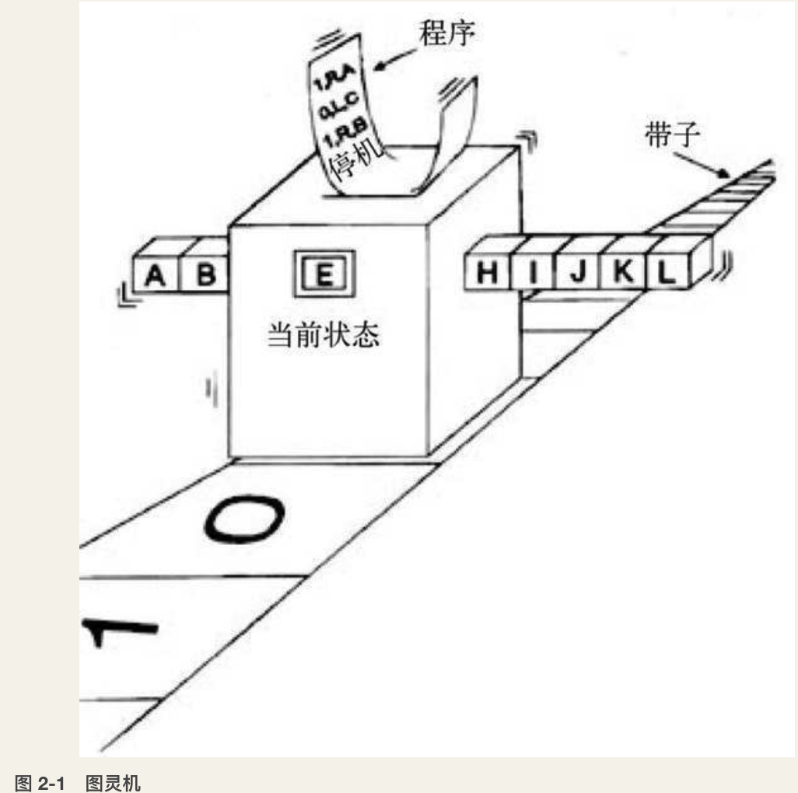

### 计算
广义上讲，计算就是对信息的变换。

也可以说，计算就是某个系统完成了一次从输入到输出的变换。

在图灵机的严格定义中，存在一个所谓的停机状态，当图灵机一到停机状态，我们就认为它计算完毕了。

#### 归纳
如果计算机能自动归纳，也就意味着我们可以为归纳方法编写一段程序P。这个程序可以理解为输入的是一些特殊的数对，输出的是能够生成这些数对的程序。也就是说输入具体的“招术”，输出的是这些“招术”的一般规律。如果程序P真的可以归纳，那么P就必然可以归纳出所有的规律。

索洛莫诺夫（Solomonoff）很早就提出了通用归纳（universal reduction）模型，并对这个问题给出了明确的回答：虽然我们可以数学地写出通用归纳模型，但它却是不可计算的，也就是程序P并不存在。

### 仿真
#### 图灵机之间的仿真
按照前面的定义，一台图灵机包括输入集合I、输出集合O、内部状态集合S、程序规则表T四个要素。那么，如果两个图灵机之间的这些元素都存在刚才说的对应关系，就认为这两个图灵机可以相互仿真了。然而图灵机的功能是完成对输入信息进行变换得到输出信息的计算。我们关心的也仅仅是输入输出之间的对应关系。因而一台图灵机A如果要仿真B，并不一定要仿真B中的所有输入、输出、内部状态、程序规则表这些元素，而只要在给定输入信息的时候能够仿真B的输出信息就可以了。

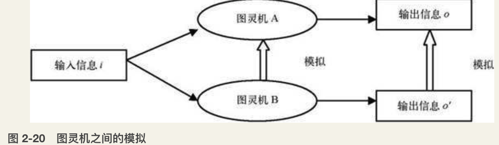

也就是说，在给定相同输入信息的情况下，只要输出信息 o’ 能够仿真信息 o，也就认为B仿真了A。而信息 o’ 对信息 o 的仿真又符合我们上面对一般集合之间仿真的定义。也就是说，如果存在另外一台图灵机能够把信息 o’ 计算并映射成信息 o，就认为 o’ 仿真了 o。说白了也就是 o’ 可以与 o 不一样，但是只要你能用一个图灵机把 o’ 经过一系列运算变换到相同的 o，就认为 o’ 仿真了 o。因而也就是图灵机B仿真了图灵机A。


#### 计算等价性
如果A能够仿真B，并且B也能仿真A，那么A和B就是计算等价的。

#### 意义


所谓语言的意义，就是执行这个语言系统的`计算等价性`。

### 万能图灵机
是否存在一台图灵机能够仿真所有其他的图灵机呢？答案是存在的。这种能够仿真其他所有图灵机的图灵机叫作`通用图灵机`（Universal Turing Machine），也就是我所说的“万能图灵机”。

#### 编码
事实上可以由定理证明万能图灵机对于任意的编码都是存在的。

#### 自食其尾
既然万能图灵机能够仿真任何一台图灵机的动作，那么它能不能仿真它自己呢？答案是肯定的。

>图灵机一旦能够把程序作为数据来读写，就会诞生很多有趣的事情。首先，存在某种图灵机可以完成自我复制。事实上，计算机病毒就是这样干的。我们简单说明一下这个特殊的图灵机是如何构造的。我们假定，如果一台图灵机是X，那么它的编码就记为`<X>`。这样能够自我复制的图灵机T的功能是把T的编码`<T>`写到纸带上输入万能图灵机，那么万能图灵机就能根据读入的`<T>`执行T，在纸带上再次输出`<T>`的一份副本`<T>’`，并且`<T>` = `<T>’`。下面就来解释如何构造这样的T。首先T由两部分构成：A和B。第一部分A的功能是指导万能图灵机把B的编码`<B>`原封不动地打印到纸带上，纸带上就有了`<B>`，如果这个时候你想用同样的方法打印`<A>`到纸带上是不行的，因为A就会打印自己了。然而B却可以这样做：读入纸带上的信息X，生成能够打印X的图灵机p(X)的编码`<p(X)>`，打印到纸带上，并把X和`<p(X)>`的内容前后调换，有定理保证这样的图灵机是存在的。这样当B读到纸带上的信息`<B>`之后，就会打印出能够打印`<B>`的图灵机的编码也就是`<A>`，然后把`<A>`和`<B>`位置对换，就构成了`<AB>`，也就是`<P>`，所以P把自己进行了一次复制。初看起来，这种自我复制的程序是不可能的，因为这包含了无穷无尽的怪圈。P要能产生它自己`<P>`，就意味着P中至少包含了一个`<P>`，而这个`<P>`中又包含了至少一个`<P>`……最后P必然是一个无限大的程序，然而我们却能够证明P是可能的。

### 停机问题
#### 死循环
我们不妨设P(X,Y)表示P判断程序X作用到数据（纸带）Y上是否存在死循环的结果。如果X作用到Y上存在死循环，那么P(X,Y)就输出一个yes；否则就输出一个no。

这种判断任意程序作用到任意数据上是否停机的程序P并不存在。

我们采用反证法，假设P程序存在。那么我们可以根据P设计一个新的程序Q：

```
Program Q(X){  // 输入任何一段程序X
    m=P(X)     // 调用函数P(X)并得到返回值m
    do while (m=no) // 如果m=no，根据P的定义，
          ...       // P判断出程序X作用到它自己身上X不存在死循环。
          ...       // 那么Q就不停地做do while和end do之间的语句
    end do
    if m=yes then return // 如果m=yes，这表示P判断出程序X在X上存在死循环
}
```

这段程序通俗来讲就是：输入任何一段程序X，调用函数P(X,X)并得到返回值m，如果m=no，根据P的定义，P判断出程序X作用到它自己身上X不存在死循环。那么Q就不停地做do while和end do之间的语句。如果m=yes，这表示P判断出程序X在X上存在死循环，就返回，结束该函数。

#### 意味着什么
**的确存在着一些我们人类能构造出来而图灵机不能解的问题。** 我们知道图灵机不能解的问题也就是一切计算机都不能解的问题，因而这类问题是`不可计算的`。

**所有计算机不能解决的问题从本质上讲都和图灵停机问题是计算等价的。** 比如在最开始我们提到的希尔伯特第十问题，就是一个典型的不可计算问题。还有很多问题是不可计算的，尤其是那些涉及计算所有程序的程序。比如是否存在一个程序能够检查所有的计算机程序会不会出错，这是一个非常实际的问题，然而这样的程序仍然是不存在的，其实可以证明这个问题和图灵停机问题实质上是一样的。

#### 超越图灵计算
前面我们已经看到了类似这样的过程。如你写出了一个程序P能够判断所有程序是否停机，那么我就能构造一个你的程序判断不了的程序Q。这时你又根据我的程序Q构造了新的程序P’，然而我又能构造一个程序Q’，仍然让你的程序P’ 判断不了。但是你没有结束，又构造了新的程序P”，于是我又构造了Q”……

首先值得肯定的一点是，运用这种方法，你的确能够超越图灵计算了，只要反复不停地变换你的程序，就不可能找出它不能解的问题。然而，另一方面又会让我们很失望：这样的变换过程并不能给出一个实实在在的程序来。我们拥有的仅仅是不断改变的程序序列，而不是一个实际存在的程序。

这正是问题的关键所在：**要想彻底超越图灵计算的限制，我们必须放弃程序的实在性。也就是说程序每时每刻都要变化。**

**一个写出就不再变化的固死的程序不可能超越图灵计算的限制，然而如果一个程序每时每刻都变化得不是它自己了，那么这个程序就能够超越图灵计算。**

联系到人这个个体，我们就能得到：因为每时每刻的人都已经由于细胞的变化而变得不再是它自己了，所以人是超越图灵计算的。还记得我在前面提到的一个问题吗：人脑的信息处理过程能不能被表示成固定的程序呢？我这里的答案就是否定的，也就是说人脑信息处理的过程并不是一个固定的程序。如何制造真正的人工智能呢？我们的答案就是： **一个能不断改变自己的程序，而且这种改变也不是一个固定的程序。**

## 3.从零开始的计算机系统
### 逻辑门


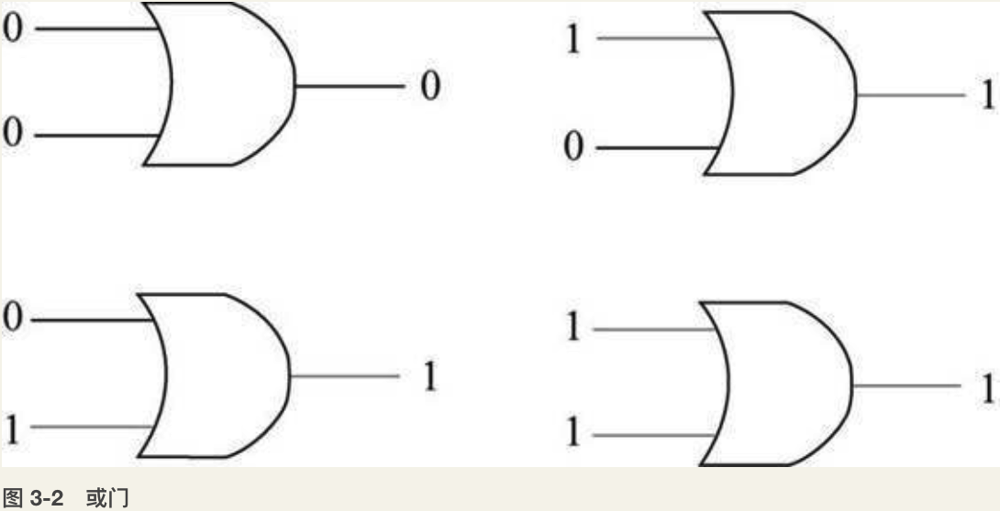


### 一切运算的基础——加法


`半加器`（Half Adder）：如图3-9所示，对于给定的输入a和b（它们都只能取0或者1），通过一个或门、两个与门、一个非门（图中小圆点）的组合，可以对两个位进行加法并形成进位。半加器的输入和输出过程见表3-2。

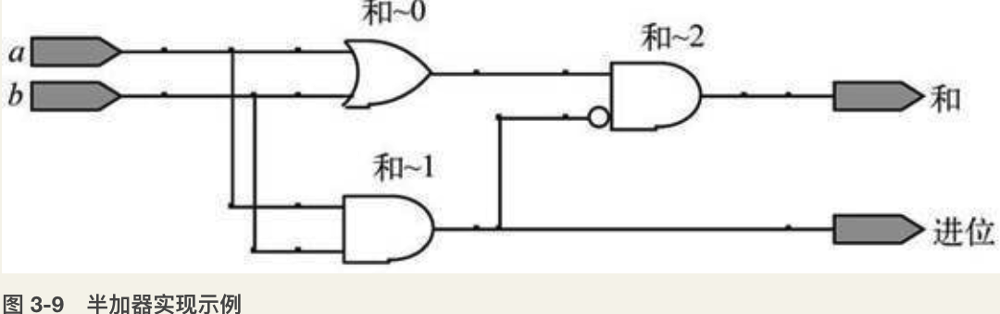


`全加器`（Full Adder）：如图3-10所示，通过两个半加器和一个或门的组合，形成了一个全加器。与半加器相比，全加器在输入上多了一个接收的进位，可以把从低位进位而来的数据纳入到计算中，将从低位计算产生的进位也加在一起。（其中 x、y 表示两数相加，c 表示接收低位的进位）。全加器的输入和输出过程见表3-3。

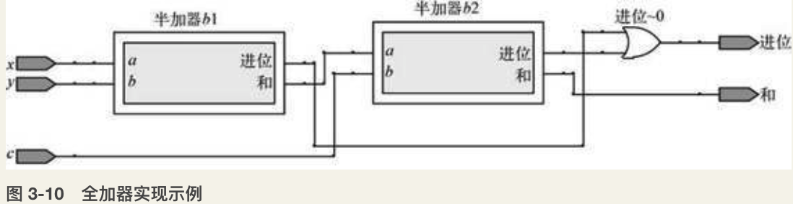

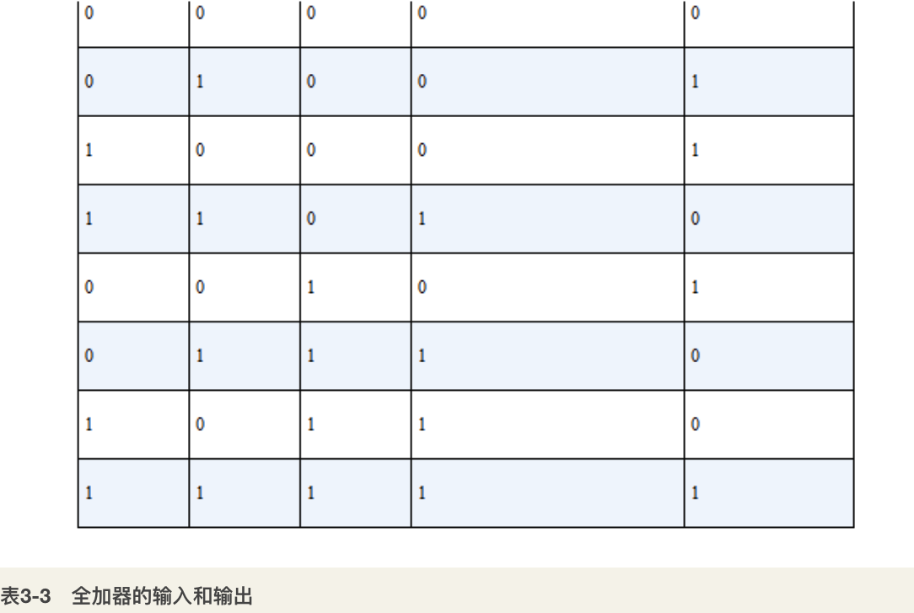

`三位加法器`：通过三个全加器的组合，就形成了一个三位加法器（如图3-11所示）。该加法器可以把从低位相加产生的进位依次传递到高位，可以实现任意三位的二进制数的加法，即可以实现上述例子中的计算。


然而随着设计功能的复杂化，通过手动连接实现将会面对大量的晶体管和海量的复杂连线，因此人们发明了`FPGA`（Field-Programmable Gate Array），它提供了大量的基础逻辑元件，这些元件封装在一个小的芯片里面，可以看成是一个计算芯片的半成品。设计人员可以在软件中以类似于编程的方式设计逻辑元件的连接，并将其写入到专门的FPGA开发板中，从而实现相关的运算。

这种专门对硬件连接进行编程的语言一般叫硬件描述语言（`Hardware Description Language`），目前主要有两种，分别是Verilog HDL和VHDL。通过编写HDL代码实现了功能以后，可以通过专门的仿真软件（商业软件如Quarts，开源软件如Icarus Verilog）将其烧录到开发板中去实现相应的功能。

### 让计算过程自动起来——机器指令
图3-13所示是一个在内存中计算求和的过程:


为了完成图3-13所示的求和操作，我们需要进行的操作如下：

- 把地址0000中的数读取到加法器中（读取）
- 把地址0001中的数加到加法器中（加）
- 把地址0002中的数加到加法器中（加）
- 把加法器中的数保存到地址0003 中 （保存）
- 把地址0004中的数读取到加法器中（读取）
- 把地址0005中的数加到加法器中（加）
- 把加法器中的数保存到地址0006 中（保存）
- 把地址0007中的数读取到加法器中（读取）
- 把地址0008中的数加到加法器中（加）
- 把地址0009中的数加到加法器中（加）
- 把加法器中的数保存到地址00010中（保存）
- 停止加法器的自动计算工作（停止）

我们需要用到四种操作：读取、加、保存、停止。

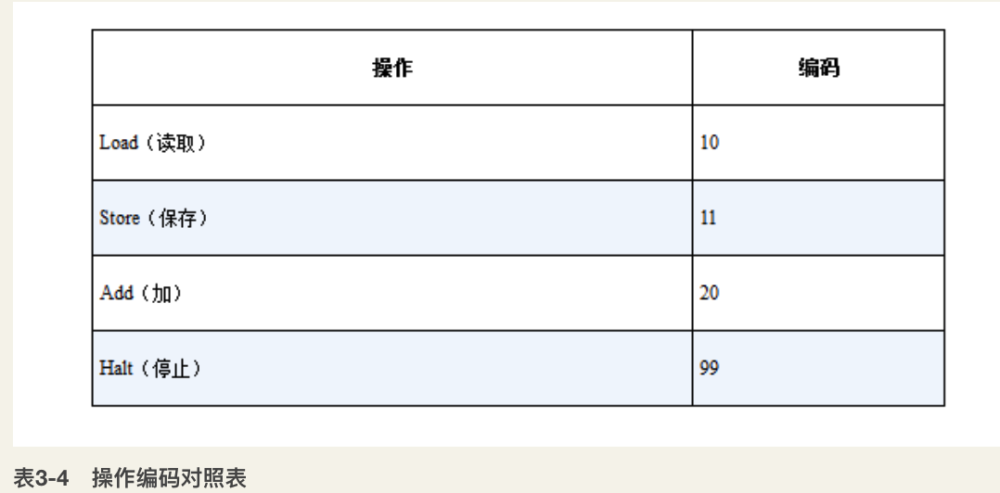

通过相应的转换以后，上述的相应计算操作即可编码成如图3-14所示的操作过程，存放在以1000开始的内存地址中。

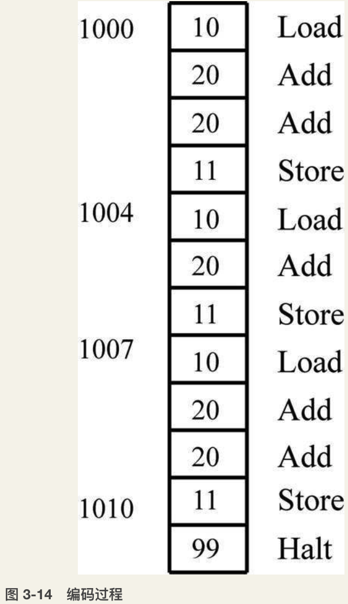

实际上这样的编码序列还是无法自动运行，因为前面的每个操作都需要指定操作数据地址，因此，假设我们规定每个操作命令加上操作数据的地址为三个内存单元，并命名为指令，那么整个计算过程的编码如图3-15所示。

图 3-15　整个计算过程的编码:

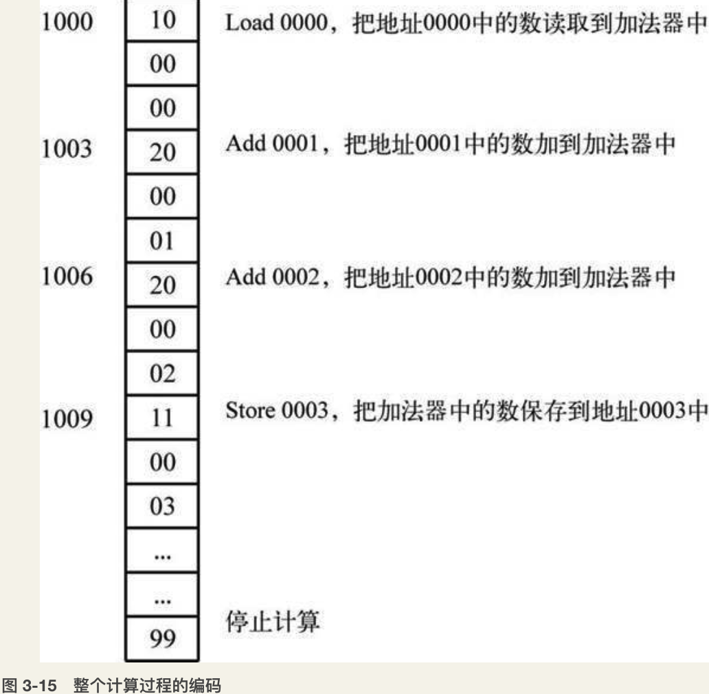

### 写点能让人理解的东西——编程语言
以某种假想的`汇编语言`为例，来看一个从1到100累加求和的计算过程。前面的数字表示语句序号，#号后面表示解释说明。

```
1       mov @100 ,R0    # 将100存入到内存的R0单元，用于计数
2       mov @0 , A      # 累加计算结果，初始值设置为0
3       mov @1 ,R1      # 用于增加计算
4       Loop:           # 表示以下部分循环执行
5       add A,R1        # 将A的值和R1中的值相加后存入A
6       inc  R1         # R1中的数增加1
7       dec  R0         # R0中的数减少1
8       jgz R0, Loop    # 判断如果R0中的值大于0，则转到Loop处运行
9       jmp $end        # 转到End
10      End             # 程序结束停止，最终的计算结果存在A中
```

现在绝大多数的高级编程语言（例如C语言）实现起来应该是这样的：

```c
i=1,sum=0,count=100; # 计数器设为100，累加计算结果设为0
while(count-->0) {   # 计数器大于0 的时候，计数器减一并循环执行{}中的内容
  sum=sum+i;         # 每次将sum 值与i 的值相加，结果存在sum 中
  i++; 
} 
```

为了在一台计算机上实现上述功能，我们需要能够实现语言之间转换的`编译器`。编译器指的是能够将一种源语言翻译成另一种目标语言的程序。在上述计算机中，我们需要实现两个编译器，一个将高级语言编译成汇编语言，另一个将汇编语言编译成机器语言，过程如图3-20所示。

图3-20高级语言到机器运行的过程:


`词法分析`，主要是把源代码里面所有的字符串全部读进来，然后进行扫描和分解，把常量、变量名、运算符、关键字等标识出来。例如对于上述例子中的语句i=1, sum=0,count=100;，需要将其正确地识别成如下的序列 i=1, sum=0, count=100 ; ，而不会犯把100识别成1 0 0三个字符这样的错误。

`语法分析`,此阶段主要是在词法分析的基础上将识别出来的单词序列按照该语言的语法要素识别出相应的语法单位。如上句中一共有三个表达式，而且表达式本身可以嵌套递归，如count--是表达式，count-->0同样是表达式。

`语义分析`的主要作用是判断整个源程序代码里面是否有错误，如在C语言中对于变量是否已经声明、语句是否以分号结束、运算的对象是否合理等进行整体审查。

`目标代码生成`,将源代码转换成目标代码的过程是最重要也是最复杂的阶段。如上例所示，将i=1; sum=0,count=100;语句中的三个赋值表达式转换成了三条Mov汇编指令，存在三个寄存器中，然后把while语句的范围转换成loop和end之间的代码，sum=sum+i;转换成 add A,R1，i++转换成 inc R1，count--转换成 dec R0，而 while(count-->0)则转换成 jgz R0, Loop。

## 4.一条永恒的金带
这种局部和整体的相似性称为自相似结构，也叫`分形`（fractal）。人们发现，大自然中广泛地存在着类似的分形结构，例如菜花、云朵，甚至股票价格波动曲线。


### 哥德尔定理
在20世纪初提出了`希尔伯特纲领`（Hilbert program），号召数学家们在数学的各个分支领域创建公理化体系。具体来说，一个完美的数学系统应该具备两个优良的品质：一致性和完备性。

希尔伯特纲领的最大弱点恰恰就是它的`自指性`：要用数学公理系统本身而不能借助其他外力来证明数学公理的完备一致性。若要实现这一点，这个数学公理系统就要具备谈论自己的能力。于是，我们便可以在数学公理系统中构造一个悖论句，从而彻底摧毁希尔伯特的猜想。这个数学公理系统中的悖论就是哥德尔句子。

哥德尔句子可以通俗地表述为：

>本数学命题不可以被证明。

根据逻辑排中律，这条数学命题要么正确，要么错误。那么，我们不妨先假设它是正确的，于是，“本数学命题不可以被证明”就暂时是正确的，也就是说这个数学命题是一条数学真理，并且根据它自己的论述，它不能被证明。于是，我们得到了一条真理，但却不能被我们的数学公理化系统所证明，因此，希尔伯特要求的完备性不能得到保证。

假设该命题是不正确的。那也就是说，“本数学命题不可以被证明”这个命题是可以被证明的。于是，从公理出发，我们能够得到“本数学命题不可以被证明”这一命题。而按照假定，“本数学命题可以被证明”是真理，所以根据完备性，它也必然是系统中的定理。于是，正命题和反命题同时都是系统中的定理，一致性遭到了破坏。

综上所述，我们可以断言：对于一个足够强大（强大到具备了自指能力）的数学公理化系统，一致性和完备性不能兼得。这便是大名鼎鼎的`哥德尔不完备性定理`，简称哥德尔定理。

### 永恒的黄金对角线
哥德尔证明中的关键——构造哥德尔语句——恰恰就是数学中最著名的对角线法的一个变种。而这种证明技巧最早起源于数学家格奥尔格·康托尔（George Cantor）对集合论的研究，他发明了对角线法以证明实数比自然数多。因此，人们又将自指悖论的构造称为`对角线法`。

罗素悖论的一个通俗版本——理发师悖论是这样表述的：

>某个小村庄里有一名理发师，他给自己制定了一条奇特的规矩：他不给那些给自己理发的人理发。

如果他给自己理发，那么按照他的规矩，他属于给自己理发的人，那么他就不该给自己理发。而如果他不给自己理发，那么根据他的规矩，他又应该给自己理发。所以，这个可怜的理发师将无所适从。

到了20世纪30年代，随着计算理论的兴起和不断深入，对角线方法得到了更加广泛的应用。一个典型的例子就是图灵将这种方法用于证明著名的图灵停机问题不可解：即判定任意程序作用到任意数据上是否停机的程序是不存在的（参见第2章）。

## 5.从算法复杂性到通用人工智能
简言之，通用智能的核心是通用归纳。通用归纳将归纳转化为预测，而预测的关键是压缩。压缩可以理解为对数据的建模或编码表示，它依赖于对模式的掌握，模式可以用算法来衡量。从数据到程序是编码，从程序到数据则是解码。编码越好（即压缩越短）则预测越准，预测越准行为就越有效。与智能相关的其他要素，诸如分类、模拟、联想、泛化等都可以理解为对模式的追求，这些都可以在追求最大压缩的过程中涌现出来，所以不是基本的。但找寻最短编码的过程不是一个能行的过程，所以我们只能通过试错不断逼近。逼近的过程可以理解为一个信念修正的过程，这可以通过贝叶斯更新来处理，信念修正之前的“先验信念”的大小则取决于模式自身的简单性。

`奥卡姆剃刀`——强调简单性的标准，认为规则之所以为规则就必须简单，如果允许任意高程度的复杂性，那么规则也就不能称其为“规则”而趋近“随机”了，规律性的缺乏或者说复杂性的过高将导致混沌甚至“随机”。

### 压缩vs预测、编码vs概率
如果已知客观概率分布P，可以证明，编码的期望码长必大于等于某个下界，这个下界就是`香农熵`。采用某些好的编码方式可以渐近地接近甚至在某些理想情况下达到这个下界。如果忽略码长必须是某个整数这个限制，那么，对于 x 采用长度为-log2 P(x)的方式编码，就可以达到这个下界，用这个长度或接近这个长度进行编码是可行的，比如霍夫曼码就可以以类似的码长实现期望码长最小的目标，它就是对高概率事件赋予短的编码，对低概率事件赋予长的编码。

不管上帝以何种概率分布创世，假如他对可能的历史的编码方式是最优的，那么奥卡姆剃刀就有意义。假如客观的概率分布未知，而已知历史经验 x，如果对 x 有一些编码方式code(x)，然后把霍夫曼编码的思想反过来，对于短的编码应该赋予高的概率/信念，对于长的编码应该赋予低的概率/信念，这样就可以诱导出某种概率/信念：

$P(x):=2^{-l(code(x))}$

其中 l(x)表示 x 的长度。

根据奥卡姆剃刀，简单的猜想code(x)更似真，code(x)越短，它的真理性越高。那么，这种诱导出的概率反映的是对产生 x 的真实分布的猜测，理想的编码可以诱导出最似真的“信念”，即更接近上帝创世采用的“客观概率”。

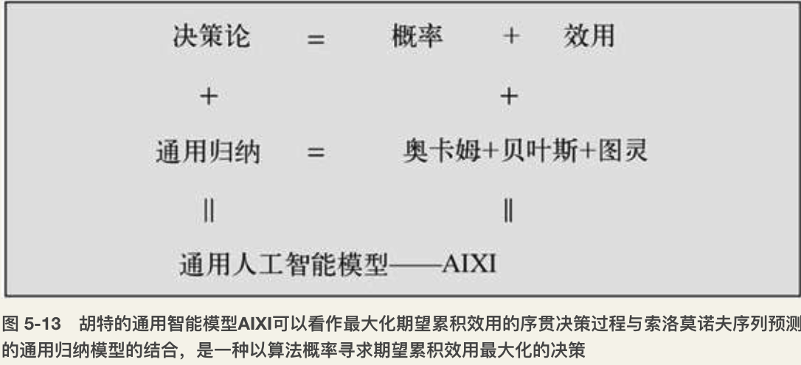

## 6.深度学习
### 基本原理：从特征表示到深度学习
`自编码器`（autoencoder）是含有一个隐层的神经网络（如图6-3所示）。从概念上讲，它的训练目标是“重新创建”输入数据；换句话说，让神经网络的输出与输入是同一样东西，只是经过了压缩。

图 6-3　自编码器:


神经网络学习到的实际上并不是一个训练数据到标记的“映射”，而是学习数据本身的内在结构和特征。因此，隐含层也被称作`特征探测器`（feature detector）。通常隐含层中的神经元数目要比输入/输出层少，这是为了使神经网络只去学习最重要的特征并实现特征的降维。我们想在中间层用很少的节点在概念层上学习数据，产生一个紧致的表示方法。

`受限波尔兹曼机`（RBM）是一种可以在输入数据集上学习概率分布的生成随机神经网络。RBM由隐含层、可见层、偏置层组成。和前馈神经网络不同，可见层和隐含层之间的连接无方向性（信息可以从可见层→隐含层或隐含层→可见层任意传输）并且是全连接的，每一个当前层的神经元与下一层的每个神经元都有连接，如图6-4所示。如果允许任意层的任意神经元连接到任意层去，我们就得到了一个波尔兹曼机（非受限的）。标准的RBM中，隐含和可见层的神经元都是二态的，即神经元的激活值只能是服从伯努力分布的0或1。

图 6-4　受限玻尔兹曼机


算法的思想就是在正向过程中影响了网络内部对于真实数据的表示。同时，反向过程中尝试通过这个被影响过的表示方法重建数据。主要目的是可以使生成的数据与原数据尽可能相似，这个差异影响了权重更新。换句话说，这样的网络具有了感知对输入数据表示的程度的能力，而且尝试通过这个感知能力重建数据。如果重建出来的数据与原数据差异很大，就要进行调整并再次重建。RBM的权重更新公式中包含正学习和逆学习两项，其中逆学习项需要可见层和隐含层的交替随机采样（gibbs sampling），直至网络达到平衡态。但这样计算很慢，使得模型只具有理论价值而不够实用。但这种问题难不倒辛顿，他提出了一个叫作对比散度（contrastive divergence）的近似方法，只需采样很少的次数（如1次）就可以更新权重，且对最终的学习效果几乎没有影响。

BP算法存在以下几个主要问题。

- 梯度越来越稀疏：从顶层越往下，误差校正信号越来越小；
- 收敛到局部最小值：尤其是从远离最优区域开始的时候（随机值初始化会导致这种情况的发生）；
- 一般只能用有标签的数据来训练：但大部分数据是没有标签的，而大脑可以从没有标签的数据中学习。

为了解决多层神经网络用传统BP算法难以训练的问题，辛顿等人提出了在非监督数据上创建多层神经网络的一个有效方法：简单地说，分为两步，一是每次训练一层网络，二是调优。以`栈式自编码器`（stacked autoencoder，见图6-5）为例，这种网络由多个栈式结合的自编码器组成。第 t 个自编码器的隐含层会作为第 t+1 个自编码器的输入层。第一个输入层就是整个网络的输入层。具体训练过程如下。

图 6-5　栈式自编码器网络:


1. 使用自底向上（图6-5的从左向右）非监督学习，就是从底层开始，一层一层地往顶层训练。采用无标定数据（有标定数据也可）分层训练各层参数，这一步可以看作一个无监督训练过程，也可以看作是特征学习过程，是和传统神经网络区别最大的部分。
    - 通过BP方法利用所有数据对第一层的自编码器进行训练（t = 1，图6-5中的绿色连接部分）。
    - 训练第二层的自编码器 t = 2 （红色连接部分）。t = 2的输入是t = 1的输出。此时可以将t = 1看作特征提取器，将原始数据变换为新的表示（即t = 1的隐含层）后传给t = 2层训练。t = 2层的权重仍然使用反向传播的方法进行更新。
    - 对除最后一层外的其他隐含层用同样的方法训练。
1. 自顶向下（图6-5的从右向左）的监督学习，就是通过带标签的数据去更新所有层的权重，误差自顶向下传输，对网络进行微调。

步骤(1)被称为`预训练`，这将网络里的权重值初始化至一个合适的位置。由于这一步不是随机初始化，而是通过学习输入数据的结构得到的，因而这个初值更接近全局最优，从而能够取得更好的效果。但是通过这个训练并没有得到一个输入数据到输出标记的映射。例如，一个网络的目标是被训练用来识别手写数字，经过这样的训练后还不能将最后的特征探测器的输出（即隐含层中最后的自编码器）对应到图片的标记上去。通常的办法是在网络的最后一层（即图6-5中蓝色连接部分）后面再加一个或多个全连接层。整个网络可以看作一个多层的感知机，并使用BP方法进行训练。这一步即上述训练过程中的步骤(2)，也被称为`微调`。

和自编码器一样，也可以将波尔兹曼机进行栈式叠加来构建深度信度网络（DBN）。学好了一个RBM模型后，固定权值，然后在上面垒加一层新的隐层单元，原来RBM的隐层变成了它的输入层，这样就构造了一个新的RBM，然后用同样的方法学习它的权值。以此类推，可以垒加多个RBM，构成一个深度网络（如图6-6所示）。令RBM学习到的权值作为这个深度网络的初始权值，再用BP算法进行学习。这就是深度信念网络的学习方法。

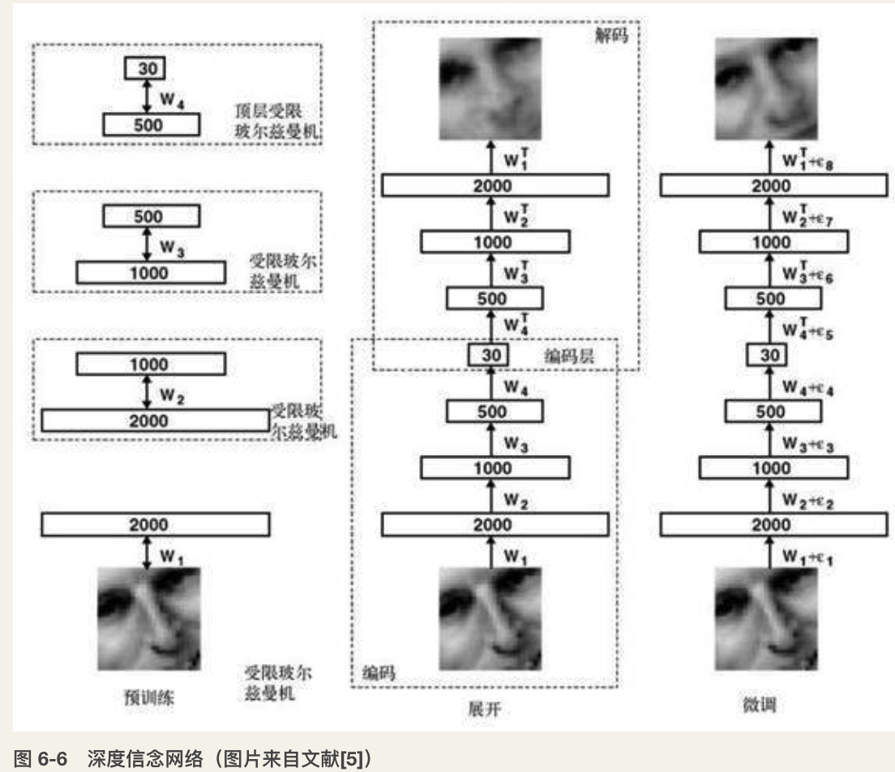

### 典型应用：教会计算机听、看、说
- 语音识别
    - 在声学建模（一段波形向一个音素的映射）部分大多采用的是混合高斯模型（GMM）。
    - 微软研究院语音识别专家邓立和俞栋从2009年开始和辛顿合作。他们创建了一些巨大的神经网络，其中一个包含了6600多万神经链接（如图6-7所示），这是语音识别研究史上最大的同类模型。在这套系统中，DNN的第一层隐层节点用于接收输入，接下来的不同层级能够识别语音频谱中的特定模式，而整个系统中包含7级隐层，并用RBM逐层预训练。
- 图像识别
    - CNN的结构受到著名的Hubel-Wiesel生物视觉模型的启发，尤其是仿真视觉皮层V1和V2层中Simple Cell和Complex Cell的行为。
    - 辛顿的学生采用了一个非常“大而深”的CNN模型，图6-10给出了整个网络结构，共包含8层，其中前5层是CNN，后面3层是全连接的网络，最后一层是softmax组成的输出决策层（输出节点数等于类别数目1000）。在辛顿的模型里，输入就是图像的像素，没有用到任何人工特征。

### 自然语言处理
1. NLP 中最直观也是到目前为止最常用的词表示方法是 One-hot稀疏表示。
1. 语言模型形式化的描述就是给定一个字符串，看它是自然语言的概率 P(w1,w2,…,wt)。w1 到 wt 依次表示这句话中的各个词。常用的语言模型都是在近似地求 P(wt|w1,w2,…,wt-1)。
1. Bengio 在 2001 年发表在 NIPS 上的文章“A Neural Probabilistic Language Model”。
    - 一个三层的神经网络来构建语言模型。
    - 它的基本思想是：假设我们已经知道每个词的矢量表示，现在用前n-1个词的矢量表示作为一个单隐层神经网络的输入，去预测第n个词。当以最大似然为优化目标用随机梯度法训练好这个网络后，同时我们也得到一份训练好的词矢量。
1. word2vec的基本思想是用一个词在文本中出现时的上下文来表征这个词的语义，进而计算它的矢量表示。
