    作者: [美] 威廉·尼克尔斯（William G.Nickels） / 吉姆·麦克修（James M.McHugh） / 苏珊·麦克修（Susan M.McHugh）
    出版社: 世界图书出版公司·后浪出版公司
    出品方: 后浪
    原作名: Understanding business,10e
    译者: 陈智凯 / 黄启瑞 / 黄延峰
    出版年: 2016-1
    页数: 576
    定价: 99.80元
    装帧: 平装
    丛书: 后浪大学堂
    ISBN: 9787510093418

[豆瓣链接](https://book.douban.com/subject/26698020/)

- [动态商业环境：风险和获利](#动态商业环境风险和获利)
  - [企业家精神和财富创造](#企业家精神和财富创造)
  - [企业家与打工者](#企业家与打工者)
  - [企业环境](#企业环境)
  - [美国企业的演进](#美国企业的演进)
    - [农业和制造业的进步](#农业和制造业的进步)
    - [服务业的进步](#服务业的进步)
- [理解经济学及其对商业的影响](#理解经济学及其对商业的影响)
  - [经济形势如何影响企业经营](#经济形势如何影响企业经营)
  - [了解自由市场资本主义](#了解自由市场资本主义)
  - [了解美国的经济体系](#了解美国的经济体系)
- [全球市场上的商业活动](#全球市场上的商业活动)
  - [动态的全球市场](#动态的全球市场)
  - [为何要与他国交易](#为何要与他国交易)
  - [参与全球贸易](#参与全球贸易)
  - [进入全球市场的策略](#进入全球市场的策略)
    - [许可](#许可)
    - [出口](#出口)
    - [特许经营](#特许经营)
    - [合同制造](#合同制造)
    - [国际合资和战略联盟](#国际合资和战略联盟)
    - [外商直接投资](#外商直接投资)
    - [跨国公司](#跨国公司)
    - [主权财富基金](#主权财富基金)
  - [全球市场经营的影响力](#全球市场经营的影响力)
  - [贸易保护主义](#贸易保护主义)
- [道德与对社会负责的行为](#道德与对社会负责的行为)
  - [伦理不只是合法](#伦理不只是合法)
  - [秉持伦理和责任经营企业](#秉持伦理和责任经营企业)
  - [企业的社会责任](#企业的社会责任)
    - [企业的社会责任](#企业的社会责任-1)
    - [对客户的责任](#对客户的责任)
    - [对投资者的责任](#对投资者的责任)
    - [对员工的责任](#对员工的责任)
    - [对社会和环境的责任](#对社会和环境的责任)
    - [社会审计](#社会审计)
- [选择一种企业经营模式](#选择一种企业经营模式)
  - [企业所有权的基本形式](#企业所有权的基本形式)
  - [独资企业](#独资企业)
  - [合伙企业](#合伙企业)
  - [公司](#公司)
    - [传统公司](#传统公司)
    - [个人公司](#个人公司)
    - [S 公司](#s-公司)
    - [有限责任公司](#有限责任公司)
  - [公司扩张：兼并和收购](#公司扩张兼并和收购)
  - [特许经营](#特许经营-1)
  - [合作社](#合作社)
- [企业家精神与创办小企业](#企业家精神与创办小企业)
  - [创业者的时代](#创业者的时代)
  - [人们为何接受创业的挑战](#人们为何接受创业的挑战)
- [管理和领导](#管理和领导)
  - [管理的四种职能](#管理的四种职能)
  - [计划与决策](#计划与决策)
  - [组织：建立统一的体系](#组织建立统一的体系)
  - [领导：不断提供愿景与价值观](#领导不断提供愿景与价值观)
  - [控制：确保工作顺利进行](#控制确保工作顺利进行)
- [调整组织结构，以应对当今的商业挑战](#调整组织结构以应对当今的商业挑战)
  - [变革中的组织](#变革中的组织)
  - [建构组织的决策](#建构组织的决策)
  - [组织类型](#组织类型)
    - [直线组织](#直线组织)
    - [直线参谋式组织](#直线参谋式组织)
    - [矩阵式组织](#矩阵式组织)
    - [跨职能自我管理团队](#跨职能自我管理团队)
    - [超越组织的界限](#超越组织的界限)
  - [管理跨企业互动关系](#管理跨企业互动关系)
    - [标杆学习与核心竞争力](#标杆学习与核心竞争力)
  - [适应变革](#适应变革)
- [生产和运营管理](#生产和运营管理)
  - [从生产管理到运营管理](#从生产管理到运营管理)
  - [生产流程](#生产流程)
  - [运营管理规划](#运营管理规划)
  - [控制程序：计划评审技术和甘特图](#控制程序计划评审技术和甘特图)
- [员工激励](#员工激励)
  - [激励的重要性](#激励的重要性)
    - [科学管理之父：弗雷德里克·泰勒](#科学管理之父弗雷德里克泰勒)
    - [梅奥与霍桑实验](#梅奥与霍桑实验)
  - [激励和马斯洛的需求层次](#激励和马斯洛的需求层次)
  - [赫兹伯格的激励因素](#赫兹伯格的激励因素)
  - [麦格雷戈的 X 理论和 Y 理论](#麦格雷戈的-x-理论和-y-理论)
  - [大内的 Z 理论](#大内的-z-理论)
  - [目标设置理论与目标管理](#目标设置理论与目标管理)
  - [满足员工的期望：期望理论](#满足员工的期望期望理论)
  - [强化员工绩效：强化理论](#强化员工绩效强化理论)
  - [公平对待员工：公平理论](#公平对待员工公平理论)
  - [将理论付诸行动](#将理论付诸行动)
    - [通过工作丰富化激励](#通过工作丰富化激励)
    - [通过开放式沟通激励](#通过开放式沟通激励)
- [人力资源管理：发现并留住最优秀的员工](#人力资源管理发现并留住最优秀的员工)
  - [与人接触只是开始](#与人接触只是开始)
  - [影响人力资源管理的相关法规](#影响人力资源管理的相关法规)
  - [决定企业的人力资源需求](#决定企业的人力资源需求)
  - [雇用多元化员工](#雇用多元化员工)
  - [选拔最具生产率的员工](#选拔最具生产率的员工)
  - [培训和开发员工使其发挥最大潜能](#培训和开发员工使其发挥最大潜能)
  - [实施员工绩效评估以获取最大成效](#实施员工绩效评估以获取最大成效)
  - [支付薪酬：吸引并留住一流人才](#支付薪酬吸引并留住一流人才)
  - [安排工作时间以满足组织和员工的需求](#安排工作时间以满足组织和员工的需求)
- [市场营销：帮助买者购买](#市场营销帮助买者购买)
  - [什么是营销](#什么是营销)
  - [营销组合](#营销组合)
  - [为营销商提供信息](#为营销商提供信息)
  - [营销环境](#营销环境)
  - [两个不同的市场：消费者和企业间](#两个不同的市场消费者和企业间)
  - [消费者市场](#消费者市场)
  - [企业间市场](#企业间市场)
- [商品和服务的开发和定价](#商品和服务的开发和定价)
  - [产品开发和整体产品价值](#产品开发和整体产品价值)
  - [产品差异化](#产品差异化)
  - [包装改变产品](#包装改变产品)
  - [品牌和品牌资产](#品牌和品牌资产)
  - [新产品开发过程](#新产品开发过程)
  - [产品生命周期](#产品生命周期)

# 动态商业环境：风险和获利
## 企业家精神和财富创造
- `企业（business）`是任何通过提供商品和服务来获得利润的实体。
- `商品（goods）`是指有形的产品，例如计算机、食品、衣服、汽车和用具；`服务（service）`则是无形的产品，即无法抓取在手里的产品，比如教育、医疗、保险、娱乐及旅游。
- `企业家（entrepreneur）`就是投入时间与金钱创建与管理企业的人。
- 收入、利润和亏损
  - `收入（revenue）`是指在某段特定时期内，企业销售产品或服务获得的金钱总额；`利润（profit）`是企业获取的、扣除所支付的工资和经营所需的其他费用的总金额数；`亏损（loss）`则发生在企业成本与支出超过收入之时。
- 权衡风险和利润
  - `风险（risk）`是指企业家在商业活动中所承担的，遭受时间与金钱无效益的损失几率。
- 生活水平和生活质量
  - `生活水平（standard of living）`指人们负担得起的商品和服务的数量。
  - `生活质量（quality of life）`指社会上全面的福利情况，包括政治自由、自然环境、教育、医疗保健、安全、休闲娱乐以及其他能够带来满足与喜悦的商品与服务。要保有高品质的生活，企业、非营利组织及政府机构就必须共同商品与服务。
- 回应不同的企业利益相关者
  - `利益相关者（stakeholders）`就是指因企业的政策和活动而获得收益或者遭受损失的人群，企业需要满足其关注点，他们包括了客户、员工、股东、供应商、经销商（零售商）、银行、附近居民、媒体、环保人士及当选的政府领导人。
  - 为了确保竞争力，企业可能需要外包。`外包（outsourcing）`指与其他组织（通常位于其他国家）进行协议以委托该组织执行部分或全部企业职能（例如，生产或会计）。
  - `内包（insourcing）`则是指其他国家的企业将生产和设计留在某国。
- 在非营利组织运用企业原则
  - `非营利组织（nonprofit organization）`指不以为其所有人或组织者创造个人利润为目标的组织。非营利组织也常常致力于获利，但获利的目的是为了达成社会或教育目标，而非替组织所有者牟利。
  - `社会企业家精神（social entrepreneurs）`就是指人们使用企业原则去创立和管理一个组织，但目的并非是自身利益，而是协助国家改善一些社会问题。

## 企业家与打工者
五项能够带来财富的要素，称为`生产要素（factors of production）`：

1. 土地：被用来建屋、制造汽车和其他产品的土地和其他天然资源。
2. 劳动：人力是生产产品和服务的重要资源，不过，目前许多人力已经被科技取代。
3. 资本：资本包括机械、工具、建筑物以及其他生产工具。
4. 企业家精神：如果没有敢于承担风险并开创新事业的企业家，其他资源的价值会被大幅削弱。
5. 知识：信息科技显著地改变了企业经营，使企业得以快速地掌握和满足消费者需求和欲求，并用相应的产品和服务来满足他们。

传统的企业管理书籍往往只强调四项生产要素：土地、劳动、资本及企业家精神，但是现代管理专家学者和管理大师彼得·德鲁克（Peter Drucker）则认为，经济体系中最重要的生产要素是知识。

## 企业环境
`企业环境（business environment）`由协助或干扰企业经营与发展的要素组成，共同组成企业环境的五大要素：

1. 经济和法律环境。
2. 科技环境。
3. 竞争环境。
4. 社会环境。
5. 全球企业环境。

## 美国企业的演进
### 农业和制造业的进步
农业仍然是美国的主要产业之一。其主要变革在于，之前上百万座小农场已经被巨型农场、大型农场、高度专门化的小农场所代替。

19 世纪和 20 世纪，大部分失业的农业人口转而进入工厂工作，而制造业的情况其实也与农业类似，同样使用科技（如工具和机器）来提高生产率，同时这些科技也导致了工作机会的减少。

### 服务业的进步
现在，服务业贡献的价值占美国经济的 70% 以上。

# 理解经济学及其对商业的影响
## 经济形势如何影响企业经营
`经济学（economics）`是研究社会如何选择运用资源制造产品与服务，以及如何在不同的竞争团体及个人消费间进行分配的科学。经济学家通常从两个角度对此进行研究：`宏观经济学（macroeconomics）`把整个国家的经济运作视为一个整体（如整个美国）；`微观经济学（microeconomics）`则主要以特定市场中的个人或组织的行为作为研究对象。

`资源发展（resource development）`就是研究如何增加资源（例如从页岩及焦油砂中提取石油），以及创造环境使资源获得更好地利用（例如循环和保护）。

亚当·斯密表示，当人们努力工作以改善自己的生活时，他们的努力就成了一只`“看不见的手”（invisible hand）`，通过生产的产品、服务与理念促进经济的增长和繁荣。因此，“看不见的手”用来描述这一将以自我为导向的个人利益转化为造福所有人的社会与经济利益的过程。

## 了解自由市场资本主义
在`资本主义（capitalism）`的经济体系下，所有或至少大部分生产、分配要素（例如，土地、工厂、铁路、商店）均属私有，其经营以营利为目的。

在自由市场资本主义下，人民享有四项基本权利：

1. `私有财产权`。这是资本主义制度下最基本的权利，私有制表示个人可以买卖与使用土地、建筑物、机械、发明等各种形态的财产，并且可以将这些财产传给下一代。
1. `企业所有权与企业获利保有权`。第1章指出，利润等于收入减去支出（包括薪资、材料费、税金等）。利润是企业主投入工作的重要动机。
1. `自由竞争权`。在政府设立的框限之内，个人在出售商品和服务并促销等方面享有与其他人或其他企业自由竞争的权利。
1. `自由选择权`。人们可以自由选择工作地点与就业领域，此外还包括选择居住地和买卖的自由。

富兰克林·罗斯福（Franklin Roosevelt）总统相信有四种附加自由是经济成功所不可或缺的，分别是言论自由、宗教信仰自由、免于匮乏的自由以及免于恐惧的自由。

`供给（supply）`指的是在一定时期内，产品制造商或所有者在不同价格下所愿意销售的产品数量。一般而言，供给量会随着价格的增加而增加，因为价格越高，卖方的获利越大。经济学家用图形说明供给量与价格的关系。图 2.1 简单显示了 T 恤的供给曲线。

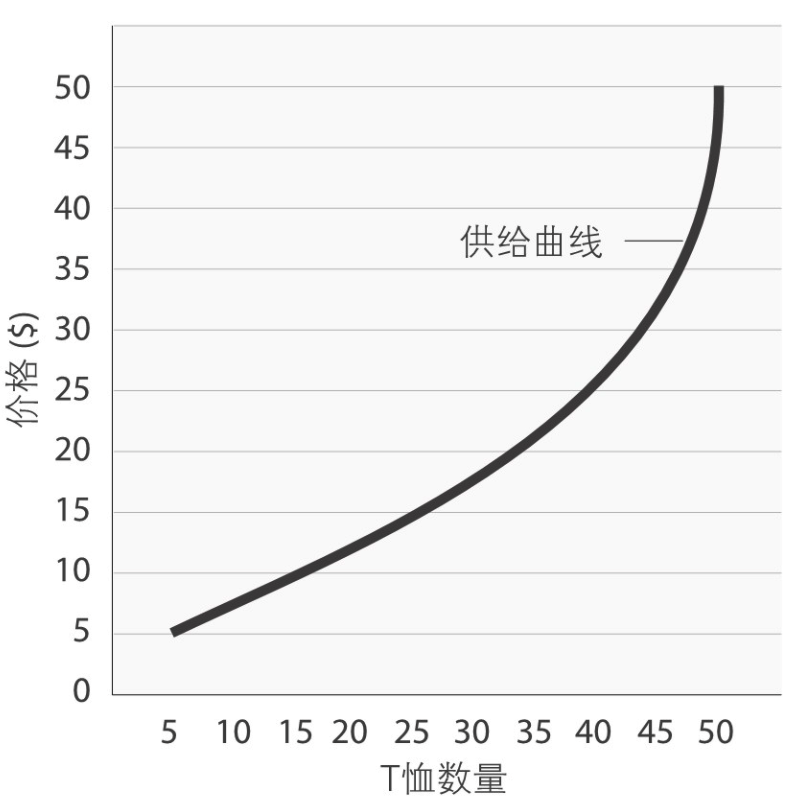

`需求（demand）`指的是在一定时期内，人们在不同价格下所愿意购买的产品数量。一般而言，需求量随着价格的下降而上升。图 2.2 简单地显示了 T 恤的需求曲线。

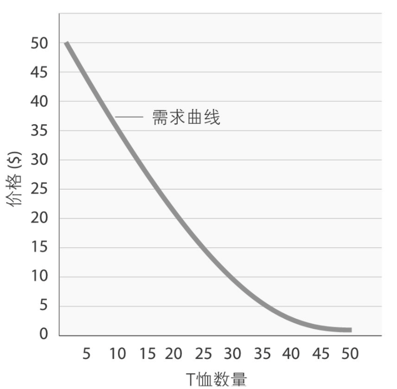

如果你将这两张图表重叠，会发现供给曲线和需求曲线相交。在这个交点上，需求量等于供给量，图 2.3 显示了这个交会点。当价格为 15 美元时，T 恤的需求量与供给量相等（25 件）。这个交会点就是所谓的`均衡点（equilibrium point）`或均衡价格。长期内，这个价格便会成为市场价格。于是，`市场价格（market price）`由供给和需求决定，最终市场将趋向这个价格。

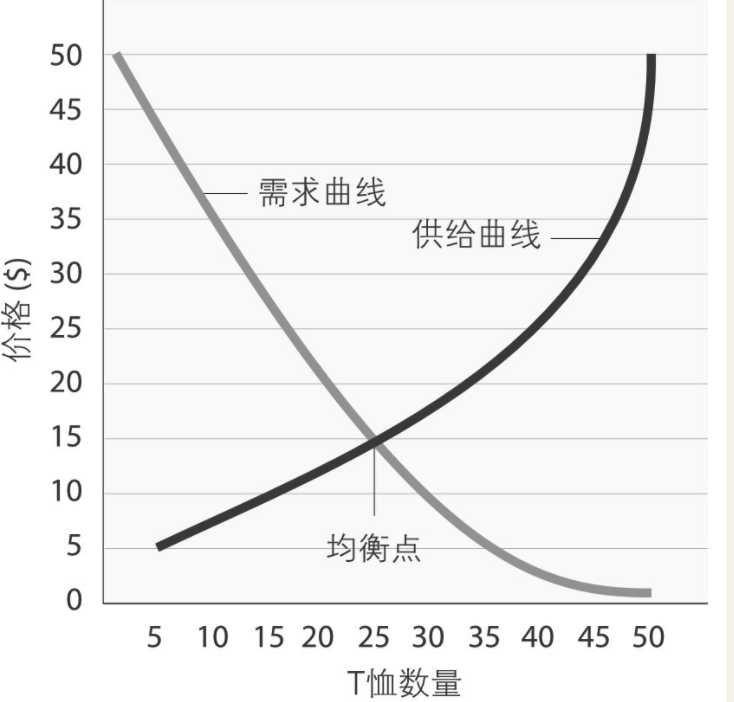

自由市场的支持者认为，供给和需求的相互作用决定价格，因此，不需要政府制定价格。如果供给超过需求，卖方会收到信息降价；如果需求超过供给，卖方会收到信息涨价。最后，如果市场力量未受任何干扰的话，供给与需求会再度平衡。

经济学家一般同意有四种程度的竞争：

1. `完全竞争（perfect competition）`是指卖方数量众多，并且产品几乎相同，其中没有任何卖方实力强大到足以制定产品价格的市场情况。例如，通常认为农产品（苹果、玉米、马铃薯等）是最接近这种情况的产品。
2. `垄断竞争（monopolistic competition）`是指许多卖方生产类似的产品，但买方却认定产品具有差异性的市场情况（例如，热狗、糖果、个人计算机、T 恤）。产品的差异性（试图让买方认为类似产品存在差异）是成功关键，我们应该好好思索差异性的意义。通过各种策略，例如广告、品牌、包装等，卖方试图向买方证明其产品与竞争者的不同。不过事实上，其产品与竞争产品可能是类似的，甚或可以彼此替代。
3. `寡头垄断（oligopoly）`是市场由少数卖方所操控的竞争形态。寡头垄断的市场包括早餐麦片、烟草、汽车、无酒精饮料、铝以及飞机等产业。有些产业由少数卖方所操控，原因之一是进入该产业需要庞大的资本。在寡头垄断之下，来自不同公司的产品价格差异不大。原因很简单，激烈的价格竞争会降低所有竞争者的利润，因为只要其中一名制造商降价，其他厂商就必须跟进。寡头垄断跟垄断竞争一样，市场成功的关键是产品的差异化，而不是价格。多数麦片与无酒精饮料的价格都相差不大。由于广告通常能够在消费者心中营造出可察觉的差异性，因此这数量很少的几家厂商都会选择通过广告来影响消费者对某品牌的印象。
4. `完全垄断（monopoly）`是唯一的卖方操控了产品的总供给及价格的情况。美国法律禁止完全垄断，但允许公共事业完全垄断，例如水电与煤气。这些企业的价格和利润通常要受公共服务委员会的监督与控制，以维护消费者的利益。

## 了解美国的经济体系
`国内生产总值（gross domestic product, GDP）`，它指的是一个国家一年内生产的产品与服务的价值总量。无论是本国公司还是外国公司，只要位于该国境内，那么它们所生产的产品和服务都会被计入国内生产总值。

`失业率（unemployment rate）`是指年满 16 周岁、没有工作并且在过去 4 周里尚在求职的劳动力占总人数的比率。失业类型:

1. `摩擦性失业`。不喜欢原来的工作、老板、工作环境，且尚未找到新工作者，包括首次进入职场者（如应届毕业生），或者长期休息之后重回职场者（如为人父母二度就业者）。此时将会产生摩擦性失业，因为寻找第一份工作或另一份工作需要时间。
2. `结构性失业`。公司重组造成失业，或者求职者技能（或地点）与求才者的资格要求（或地点）不符，例如因当地矿场关闭而失业的矿工。
3. `周期性失业`。来自企业周期（企业的长期成长与衰退）的衰退或不振。这种情况最为严重。
4. `季节性失业`。不同季节所需的劳动力人口不同，例如农作物收割季节。

`价格指数（price indexes）`协助我们通过通货膨胀、通货减缩、通货紧缩以及停滞膨胀等水平，衡量一个经济体系的健康状况。

- `通货膨胀（inflation）`指产品与服务的价格在某个时期普遍上扬。官方对此的定义是：“通货膨胀是消费者价格水平的持续上升，也即货币购买力的持续降低，由可获得的货币和信贷的增长超过商品和服务的增长造成”，因此也被描述为“过多的金钱追逐太少的商品”。
- `通货减缩（disinflation）`指物价上扬缓慢（即通货膨胀率下滑）。
- `通货紧缩（deflation）`是指商品和服务价格随着时间变化呈下跌趋势，一般发生在生产的产品过多，人们没有购买全部产品的能力（即太少货币追逐过多商品）的时候。
- `停滞膨胀（stagflation）`则是指经济增长迟缓，而物价仍持续上扬的情形。

`消费者价格指数（consumer price index, CPI）`是一组衡量通货膨胀和通货紧缩情况的月度统计指标。产品与服务的成本——包括食品、服饰及医疗——均被列入政府对价格涨跌的评估中。消费者价格指数是重要的数据，因为很多薪资、租金、税收等级、政府福利以及银行利率都是以它为根据的。你可能知道`核心通货膨胀（core inflation）`这个概念。它是剔除粮食和能源价格后的消费者价格指数。由于粮食和能源价格快速增长，核心通货膨胀通常远低于实际的消费者价格指数。

`生产者物价指数（producer price index, PPI）`指的是产品的批发价格指数。其他一些反映经济情况的指数包括房价、零售额、个人收入的变化等。

`生产率`指在一段特定时间内产品与服务的总产量除以工时（每工时产出）。生产率增加表示劳工可以在相同时间里生产比从前更多的产品与服务。美国生产率近年来大幅提升，主要是因为计算机与其他科技让劳工工作更有效率。生产率越高，产品和服务的生产成本越低，价格也越低。高生产率也会带来高失业率，这是美国当下正在发生的。

由于现在美国的经济是服务型经济，生产率非常重要，因为服务公司也是劳动密集的。在国外竞争的刺激下，制造业的生产率正在大幅提升。服务业生产率的提升速度比较慢，因为和工厂工作者比较起来，服务业的工作者（例如，教师、职员、律师及理发师）所能利用的新技术比较少。

服务业存在着一项问题，就是大量使用机械可能可以提升服务质量，但却无法提高每位劳工的产出。例如，你可能发觉大学里到处都用计算机来协助工作，它们或许提升了教育质量，但未必能增加教授的生产率。同样地，在医院里更新设备亦复如此，例如计算机 X 射线轴向分层造影（CAT）扫描仪、正电子发射断层扫描（PET）扫描仪和核磁共振成像（MRI）扫描仪虽然有助于医疗质量的提升，却未必能让医生多看几个病人。换言之，**当今服务部门生产率的评估方法无法检视新科技对于质量的改善**。

`商业周期（business cycles）`指发生在所有经济体系的周期性涨跌。经济学家约瑟夫·熊彼得（Joseph Schumpeter）指出四个长期商业周期阶段，分别为繁荣、衰退、萧条与复苏。

1. `繁荣（boom）`顾名思义就是商业正处于蓬勃发展的时期。
2. `衰退（recession）`指国内生产总值连续两个季度（每季度3个月）或更长时间下滑。衰退发生时，价格下跌，消费减少，企业破产增加。衰退对经济会造成许多不良后果：失业率增加、公司倒闭、生活水平全面下降。
3. `萧条（depression）`指通常伴随着通货紧缩的严重衰退。
4. `复苏（recovery）`则是经济处于稳定并开始增长的时候。这个阶段最终会发展到繁荣阶段，并重新开始一个新的周期循环。

`财政政策（fiscal policy）`指政府通过增减赋税或政府支出来维持经济稳定。财政政策的第一项重要工具就是`课税`。理论上，高税率会减缓经济的增长速度。由于高税率能将民间资金移向政府部门，因此，它会抑制小企业发展，因为他们努力所带来的回报减少了，这也就打击了他们的积极性。也就是说，降低税率在理论上可以催化经济繁荣发展。

财政政策的第二项工具就是`政府支出`。政府支出用于高速公路、社会项目、教育以及安全防御等。当政府支出超过课税所得，就会产生政府预算赤字，这种现象在财政年度内就是财政赤字。长期而言，赤字的累积将会增加政府的债务。`国债（national debt）`是政府赤字随着时间积累的总额。

`凯恩斯主义经济理论（Keynesian economic theory）`认为：增加支出和减税的政府政策会刺激衰退中的经济。

`货币政策（monetary policy）`指的是对货币供给和利率的管理。美国的货币政策主要由美联储控制，最主要的作用是提高或降低利率。当经济发展过快时，美联储倾向于提高利率，借此提高借款成本，企业降低融资，减少各项支出，包括劳力与机器投入，进而减缓经济成长。在相反的情况下，美联储降低利率，企业倾向提高融资，进而带动经济发展。因此，利率的升降有助于控制经济的剧烈波动。

美联储同时也会控制货币的供给。简而言之，美联储提供给企业家越多的货币，经济增长就越快。反之，如果想要减缓经济增长的速度（并防止通货膨胀），美联储可以降低货币的供给。

总结起来，控制美国经济有两种策略：财政政策（政府税收与支出）与货币政策（美联储控制的利率和货币供给）。经济的目标主要是保持经济增长，使更多人步入更高的经济生活阶层，达到满意的生活水平，拥有更好的生活质量。

# 全球市场上的商业活动
## 动态的全球市场
`进口（importing）`指从另一个国家购买产品；`出口（exporting）`指将产品销售到另一个国家。

## 为何要与他国交易
`自由贸易（free trade）`是指在没有政治或经济阻挠的情况下，产品和服务在各国之间的流动。

19 世纪初期由英国经济学家大卫·李嘉图（David Ricardo）提出的比较优势理论是支撑自由经济交换的指导性原则。

`比较优势理论（comparative advantage theory）`主张一个国家应该向其他国家出售在本国生产最具效益和效率的产品，并且向其他国家购买自己无法有效益或效率生产的产品。

如果一个国家在生产某项产品上占有垄断地位，或比所有其他国家都更具制造效率，该国就拥有`绝对优势（absolute advantage）`。不过，自然资源方面的绝对优势并不能长久。例如，南非曾经在钻石生产上占有绝对优势，但现在已然失去了这一优势。全球竞争还造成其他类型绝对优势的消失。现在的全球市场上已经很少有绝对优势的例子。

## 参与全球贸易
在评估全球贸易的效用时，各国都遵循两项指标：贸易差额与国际收支。`贸易差额（balance of trade）`是一段时期内一个国家出口和进口的差额。“有利”（favorable）的贸易差额，或`贸易顺差（trade surplus）`，代表着一个国家的出口值超过了进口值；而“不利”（unfavorable）的贸易差额，或`贸易逆差（trade deficit）`，则代表着一个国家的出口值低于进口值。

`国际收支（balance of payments）`指一个国家出口流入现金与进口流出现金之间的差额，再加上通过旅游、国外援助、军事费用和外国投资之类的其他因素导致的现金流入与流出量。通常各国的目标都是确保流入国内的货币多于流出的，换句话说就是“有利”的国际收支。相对地，“不利”的国际收支则代表着流出国内的货币多于流入的。

`倾销（dumping）`指生产国以低于本国市场的价格出口产品。掠夺性定价战术旨在减少国外市场上的过剩产品，或是通过比国内竞争者更低的价格来占领海外市场。某些国家政府为特定产业提供金融奖励，协助它们在全球市场以低于本国市场的价格出口产品。

## 进入全球市场的策略
图 3.2 显示了每种战略的责任、控制、风险及潜在利润的多寡。

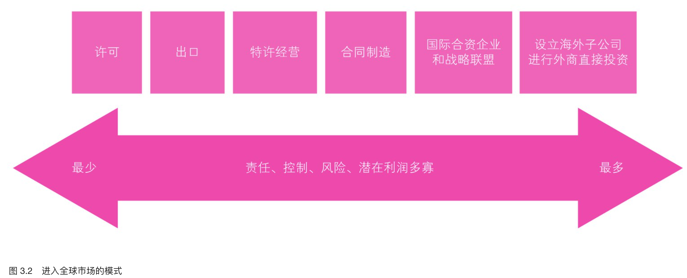

### 许可
一家公司（许可方）可能决定通过`许可（licensing）`并收取费用（权利金）的方式——许可一家外国公司（被许可方）拥有生产其商品或者使用其商标的权利——来进入全球市场。一家有意许可的公司通常需要指派代表到外国生产商处协助建立生产线。许可方也可以协助被许可方或与被许可方合作，处理分销、促销和咨询等方面的事宜。

许可协议对于一家企业存在以下几点益处。

- 企业可以赚到在本国市场无论如何都赚不到的收入。
- 外国被许可方经常必须从许可公司购买创业设备、原料以及顾问服务。
- 许可方几乎不需要额外的花费就可以生产与营销其产品。这些成本通常由被许可方负担，因此，被许可方往往非常努力地让许可产品在市场上获得成功。

不过许可协定也有其缺点。通常公司授予产品专利权的期限必须足够长，也许长达 20 年或更久。如果产品在外国市场成功经营并且逐步成长，其间获取的利润主要归被许可方所有。也许更大的威胁是，许可公司事实上也在销售其专门技术与知识。如果被许可公司学会了该项技术，可能会毁约并开始自行生产类似产品。如果通过法律途径无法解决，许可公司可能因此丧失其贸易优势与技术秘密，更别提先前协议中的特许权使用费。

### 出口
随着全球市场竞争日趋激烈，美国政府成立了出口支持中心（Export Assistance Centers, EACs），为选择直接出口产品与服务的中小企业提供出口实战经营与贸易金融支持。

尚在犹豫不决的美国公司可以通过专业的`外贸公司`（或外贸管理公司）间接地从事出口，它们可以协助谈判并建立贸易关系。外贸公司不仅会将不同国家的买卖双方匹配起来，而且还可以处理海关事务，提供文件，甚至将重量与测量等数据加以转换，使进入国际市场的程序更加便捷。它还可以在仓储、发票和保险方面为出口商提供帮助。

### 特许经营
`特许经营`指的是一种契约协议，某些拥有良好企业经营理念的人将其企业名称的使用权卖给其他人，允许他们在特定的地区以一种特定的方式销售产品或提供服务。诸如赛百味（Subway）、假日酒店（Holiday Inn）以及邓肯的甜甜圈（Dunkin’Donuts）等美国大型连锁店拥有许多外国特许加盟商经营的分店。

特许经销商必须谨慎调整产品或服务以适应所在国家的特殊情况。百胜餐饮集团（Yum Brands）在世界 109 个国家拥有 37 000 家肯德基、塔可钟（Taco Bell）和必胜客快餐店。它们很快就认识到世界各地的人对于比萨饼配料有不同的偏好。例如，日本消费者就很喜欢鱿鱼和甜蛋黄酱口味的比萨。在中国的肯德基快餐店，菜单上则是鸡块沾四川辣酱、米饭、鸡蛋汤和“老北京鸡肉卷”。

### 合同制造
`合同制造（contract manufacturing）`指的是由国外公司生产该产品，然后国内零售商再贴上自有品牌或商标再行销售。例如，合同制造商为戴尔、施乐和 IBM 等公司生产计算机、打印机、手机、医疗产品、飞机和家用电器用的电路板和元件。耐克（Nike）在全球拥有 700 家以上的合同制造商，它们为耐克加工了所有的鞋类产品和服装。

合同制造商经常让一家公司在极低的创业成本之下，得以尝试扩张进入新市场。如果该品牌成功跨入新市场，公司承担的风险相对较低。公司也能在订单量突然大增时，临时使用合同制造解决困境。合同制造也属于外包。

### 国际合资和战略联盟
`合资（joint venture）`是一种由两家或两家以上公司（通常来自不同国家）共同承担一项主要项目的合伙关系。合资经营经常由政府委托经营，比如在中国，政府主导是作为进入该国经商的一个条件。例如，迪士尼和国有企业上海申迪集团共同出资，在上海建设迪士尼主题公园，预期 2015 年开始接待游客。

成立合资公司经营的好处是明显的，包括：
1. 共享科技与分担风险。
2. 共享营销与管理等专业技能或知识。
3. 进入那些除非商品是当地生产，否则外国企业很难进入的市场。

相比之下，缺点则不怎么明显。其中比较重要的一点是，合伙的一方可能学会另一方的技术与实践，然后自行创业而成为竞争对手。

`战略联盟（strategic alliance）`是由两家或更多的公司建立的长期合作关系，旨在帮助各联盟公司建立市场竞争优势。它们通常不涉及分摊成本、风险、管理甚至利润的问题，这一点与合资经营有所不同。此种战略联盟为进入市场、接洽资本以及利用专业技术提供更宽广的途径。由于灵活性很强，所以，战略联盟可以有效地联结不同国家的公司和规模差异极大的企业。惠普（Hewlett-Packard）与日立（Hitachi）和三星（Samsung）拥有战略联盟，早在 1990 年，可口可乐和雀巢就建立了战略联盟，对茶饮料和咖啡市场进行划分。

### 外商直接投资
`外商直接投资（foreign direct investment）`指在国外购买永久性产业或企业。最常使用的外商直接投资方式就是成立海外子公司。`海外子公司（foreign subsidiary）`是指由另一家公司即“母公司”（parent company）所拥有的海外企业。海外子公司在运作上会比较像本地公司，生产、经销、促销、定价及其他企业功能都由海外子公司负责控管。当然，子公司必须同时遵守母公司所在地，也就是母国（home country），和子公司所在地，也就是东道国（host country）的法律规定。

设立子公司的主要优点是母公司可以完全控制它持有的所有技术或专业知识。而主要缺点是母公司需要在外国投入资金与科技。假如与东道国的关系出现了裂隙，该公司的资产所有权可能会被剥夺（被外国政府接收）。

### 跨国公司
`跨国公司（multinational corporation, MNC）`是那种在许多不同的国家生产和营销产品的组织，在不同的国家拥有股票所有权和经营管理权。该公司营运所在的国家越多，就越需要努力避免来自各国政府的限制。跨国公司是典型的超大型企业（像雀巢），但并非所有参与全球事业的大公司都是跨国公司。一个企业可能出口生产的所有商品，收入和利润可能全部来自国外，但它依然不是跨国公司。只有那些在不同国家拥有“制造能力”或是具有其他“实体”的企业，才能真正被称为跨国公司。

### 主权财富基金
外商直接投资增长最快的形式之一就是`主权财富基金（sovereign wealth fund, SWFs）`的利用，它是由在外国公司中持有较大的股份的政府控制的投资基金。来自科威特、新加坡和中国的主权财富基金已经购买了对花旗集团（Citigroup）等美国公司有重大影响的股份。主权财富基金的规模及其政府所有权会使人们担心，害怕它们会被用来达成地缘政治的目标、控制战略性自然资源或者获得敏感技术。主权财富基金也会削弱被投资公司的管理基础。相反，有些专家将借助主权财富基金进行的外国投资看作是对美国经济有信心的投票，以及是为美国创造无数就业岗位的一种方式。

## 全球市场经营的影响力
`文化（culture）`指特定人群所共同拥有的价值观、信仰、规则和制度。文化的主要组成部分包括社会结构、宗教、行为和习惯、价值观和态度、语言和人际沟通等。如果你希望参与全球贸易，那么一定要留意各国之间的文化差异。

`汇率（exchange rate）`指一个国家货币相对于其他国家货币的价值。`美元升值（high value of the dollar）`是表示1美元可以兑换比之前更多的外国货币，所以外国生产者的产品会变得比较便宜，美国人用较少货币就能买到；然而，美国生产的商品价格对于其他国家的买主而言，则会因为美元的高价值而显得昂贵。相对地，`美元贬值（low value of the dollar）`表示1美元可以兑换到比之前少的外国货币，因此外国商品显得昂贵，因为需要用较多货币才能买到，而美国商品对于外国买主而言则变得比较便宜，因为花较少的外国货币就能买到美国商品。

全球金融市场在一个被称为`浮动汇率（floating exchange rates）`的体系下运作，亦即汇率会根据市场上货币的供需有所“浮动”。这种货币供需是由全球货币交易商创造出来的，他们根据一个国家的贸易与投资潜力创造出该国的货币市场。

`贬值（devaluation）`指一个国家的货币相对于他国货币价值降低。

`对销贸易（countertrading）`指一种复杂的易货形态，参与的国家可能很多，每个国家都用商品交换商品，或是服务交换服务。

美国的企业人士在经营全球事业时必须遵守美国的法律规定。美国法令如`《1978 年海外反行贿法案》（Foreign Corrupt Practices Act of 1978）`，就使得美国企业在与外国竞争者竞争时处于劣势。该法律明文禁止为保证企业合同而用“有问题的”（questionable）或“暧昧的”（dubious）方式付款给外国官员。

## 贸易保护主义
`贸易保护主义（trade protectionism）`是指通过政府法规来限制产品与服务的进口。

政府通过征收`关税（tariff）`——课征进口税——使得进口商品更为昂贵。关税分为两种：保护关税和收入关税。`“保护关税”（protective tariffs）`（进口税）旨在提高进口产品零售价，让当地商品更具竞争力。这些关税的目的是确保当地员工的工作，并且让产业（特别是幼稚产业，它由很多刚起步的新创企业构成）不因受外国竞争而整体倒闭。`“收入关税”（revenue tariffs）`旨在为政府筹措资金。发展中国家经常通过采用收入关税来协助新兴产业在全球市场上竞争。

`进口配额（import quota）`指对于可以进口的某类产品进行数量限制。例如，《1979 年美国出口管理法案》（U.S. Export Administration Act of 1979）禁止出口会对美国安全造成危害的商品（如高科技武器）。`禁运（embargo）`意指完全禁止某项产品的进出口，或是禁止与某国有贸易往来。

`“非关税壁垒”（nontariff barriers）`虽然不像关税、进口配额和禁运那么明显或正式，但同样会对自由贸易造成伤害。例如，印度实行一系列的限制标准，比如进口许可、严格的产品检测要求和漫长的海关流程，目的是抑制进口产品的销售。中国政府采购目录规定了大型政府机构可以采购哪些产品，现在，多许美国制造的产品都已从该目录中删除。此外，一些国家还详细规定了产品应如何在该国销售。韩国每年在美国销售差不多 45 万辆汽车，但从美国进口的汽车却少于 6,000 辆，原因是发动机功率上的非关税壁垒。

一项 1948 年通过的建立协商共同降低贸易限制的国际性论坛协议。
1948 年，来自全球 23 个国家的领导人签署了`关税与贸易总协定（General Agreement on Tariffs and Trade, GATT）`，该协议建立了通过协商共同降低贸易限制的国际性论坛，这可以促进产品、服务、理念以及文化交流。1986 年，关贸总协定的乌拉圭回合对原贸易协定中的部分内容进行了重新商定。历经 8 年的会议协商后，终于由 124 个国家投票同意全球关税平均降低 38%，并将协议规范延伸至农业、服务及版权保护等。

乌拉圭回合还建立了总部设于瑞士日内瓦的`世界贸易组织（World Trade Organization, WTO）`，它负责调解各国间贸易纠纷。世界贸易组织由 153 个成员国组成，是一个负责监督重要国际贸易问题与全球性贸易行为的独立实体。

关贸总协定和世界贸易组织尚未解决的一项问题就是共同市场是否会因创造区域性联盟而牺牲了全球的增长。`共同市场（common market）`也称为贸易集团（trading bloc），意即区域内国家拥有共同对外关税但无对内关税，并且通过法律协调来促进会员国间的交易。共同市场有：欧盟（EU）、南方共同市场（Mercosur）、东南亚国家联盟（ASEAN）经济共同体以及东南非共同市场（COMESA）。

20 世纪 90 年代初期一项最具争议的议题就是`北美自由贸易协定（North American Free Trade Agreement, NAFTA）`，它缔造了一个囊括美国、加拿大与墨西哥三国的自由贸易区。反对者宣称，这个条约将会导致工作与资本远离美国；赞成者却预测，北美自由贸易协定能为出口开拓一个广大的新市场，长期而言将会创造工作与机会。北美自由贸易协定的目标包括：

1. 消除贸易壁垒并促进货物和服务的跨国流动；
2. 在自由贸易区内促进公平竞争；
3. 增加投资机会；
4. 有效保护和实施知识产权（专利与著作权等）；
5. 为未来的区域内贸易合作建立框架；
6. 改善北美的工作环境。

# 道德与对社会负责的行为
## 伦理不只是合法
`伦理（ethics）`为符合道德与良心的行为标准，亦即社会所接受的“对”而非“错”的行为。

## 秉持伦理和责任经营企业
`基于服从的道德规范（compliance-based ethics codes）`指通过增强控制和处罚犯错者以制止不法行为的伦理标准。反之，`基于正直的道德规范（integrity-based ethics codes）`则是定义组织的指导性价值观，创造支持伦理行为的环境，强调员工负有的共同责任。

表 4.3 伦理管理策略

基于服从的道德规范 | 基于正直的道德规范
----------|----------
理想：遵守外界标准（法规） | 理想：遵守外界标准（法规）并且选择内部标准
目标：避免犯罪 | 目标：使员工展现负责的行为
领导者：律师 | 领导者：有律师等协助的管理者
方法：教育、减少员工自行决定的权力、控制、惩处 | 方法：教育、领导、责任、决策过程、控制、惩处

`举报者（whistleblowers，表示检举不合法和不道德行为的内部人）`必须免于受到报复的威胁。《萨班斯-奥克斯莱法案》（Sarbanes-Oxley Act）为了保护举报者，要求所有的上市公司允许那些担心会计和审计问题的员工秘密地和匿名地举报。该法案还要求那些给因将欺诈信息透露给官方而受到雇主惩罚的人复职和补偿。

## 企业的社会责任
### 企业的社会责任
`企业的社会责任（corporate social responsibility, CSR）`是企业对于社会整体福利——不只是股东个人福利，还包括所有利益相关者的福利——的关心。换句话说，企业的社会责任不只是道德而已，它是基于一些基本原则——包括正直、公正和尊敬——的一种承诺。

`企业慈善（corporate philanthropy）`包含各种对非营利组织的慈善捐赠。`企业社会行动（corporate social initiatives）`包括企业慈善的各种提升形式。

`企业责任（corporate responsibility）`包括雇用少数族群员工、制造安全产品、将污染减至最低、高效地使用能源以及提供安全的工作环境等，也就是与在社会上负责任地行事相关的一切事情。

`企业政策（corporate policy）`指的是企业在社会与政治议题方面采取哪一种立场的社会责任。例如，巴塔哥尼亚公司（Patagonia）的政策包括如下声明：“我们因爱而努力去挽救野生美丽之地，并帮助减缓地球整体环境的急剧恶化。我们奉献自己的时间，付出服务，至少拿出公司收入的 1%，用于支持全球数以百计致力于扭转环境不良态势的基层环保组织。”施乐（Xerox）设有一个“社会服务假”，允许员工离开长达一年的时间去为非营利组织工作；员工在这段时间里可以留职带薪，并且享有一切福利。

### 对客户的责任
约翰·肯尼迪（John F. Kennedy）总统提出，消费者有 4 项基本权利：（1）安全的权利；（2）被告知的权利；（3）选择的权利；（4）发表意见的权利。

### 对投资者的责任
`内幕交易（insider trading）`指的就是利用不公开的公司信息为自己或亲友谋取利益。

### 对员工的责任
企业可以通过给予员工薪资及协助其达成人生目标来展现上述承诺。

好人为何会做出坏事？公平是最强的动机之一。并非所有员工都会在工作场合采用暴力发泄，但是许多人都会采用不着痕迹的方式表达其不满，例如推卸责任及不接受决策、操纵预算与支出、故意食言与隐匿资源、粉饰太平以及浑水摸鱼等。

### 对社会和环境的责任
企业也负责伸张社会正义。许多公司相信企业有责任建立一个良好的社区；对他们而言，从事慈善还不够。他们的社会贡献包括清洁环境、兴建社区厕所、提供计算机课程，以及资助低收入家庭的老人与孩童等。

### 社会审计
`社会审计（social audit）`对一个组织实施有社会责任和反响的项目的进展情况进行系统评估。是对一个组织实施有社会责任和反响的项目的进展情况进行系统评估。进行社会审计的主要困难之一是如何建立衡量公司活动及其社会影响的方法。应该评估哪些项目？许多社会审计主要聚焦于工作场所、环境、产品安全、社区关系、国防安全、国际经营和人权，以及尊重当地居民的权利等。

# 选择一种企业经营模式
## 企业所有权的基本形式
构建企业的方式与未来的长期成功有极大关联，三种主要的企业所有权形态为：（1）独资企业；（2）合伙企业；（3）公司制企业。

由一个人独有并且通常也由该人管理的企业被称为`独资企业（sole proprietorship）`，这是最常见的企业所有权形态。

当两个或更多的人在法律上同意成为一个企业的共同所有人时，这个组织就被称为`合伙企业（partnership）`。

被授权经营并且债务独立于所有者的法律实体被称为`公司（corporation）`。

## 独资企业
优点：

1. 容易开办或结束营业。
2. 自己当老板。
3. 作为所有者的骄傲。拥有并管理自己的事业的人，理所当然对自己的工作感到骄傲。
4. 遗产的传承。企业主所有的一切可以留给子孙继续经营。
5. 公司利润的保留。所有者不仅保留获得的利润，同时还享有企业成长带来的增加价值。
6. 没有特别税赋。独资企业的所有利润都以所有者个人所得税的形式来征收，企业所有者只需要缴纳普通的所得税。不过，企业主必须（向社会保险和医疗保险）支付自雇税。他们还需要预估税收并且按季度支付给政府，否则会因为不交税而受到惩罚。
缺

缺点：

1. 无限责任——个人损失的风险。当你为别人工作时，企业亏损是他人的事。当你拥有自己的企业后，你与你的事业则合为一体，你将承担`无限责任（unlimited liability）`，也就是说，任何由企业产生的债务或毁损都由你负责偿还，这表示你要卖掉自己的房子、车子，或是拥有的任何物品。
2. 有限财务资源。企业的可用资金受限于个别（独资）所有者的资金能力。
3. 管理困难。所有的企业都需要管理，也就是说，必须有人负责登记存货记录、会计记录及税务记录等工作。擅长销售及提供服务的人在会计上可能不太灵光。独资者往往很难找到好的、优秀的员工，因为其薪资与福利难以与大公司竞争。
4. 长时间投入。虽然独资者可以自己安排工作工时，但若要自行创业、管理经营、训练人员，很难有空闲时间去做其他事。
5. 很少有其他福利。如果自己身为老板，便失去为他人工作所享有的一切福利。没有人会替你支付健康保险和残疾保险，没有病假和带薪休假，以上这些福利合计起来可能会超过一位工作者收入的 30%。
6. 有限成长。扩展的速度经常很慢，因为独资企业完全仰赖所有者自身的创造力、商业知识以及资金。
7. 有限寿命。如果独资企业主过世、失去工作能力或退休，企业就无法继续存在（除非出售或由独资者的继承人接管）。

## 合伙企业
合伙企业是一种由两个或两个以上所有者共同成立的企业法定形态。合伙企业有以下几种类型：（1）普通合伙企业；（2）有限合伙企业；（3）业主有限合伙制企业。`普通合伙企业（general partnership）`指全部所有者共同经营企业并对债务负责的合伙企业。`有限合伙企业（limited partnership）`是由一个或多个普通合伙人以及一个或多个有限合伙人组成的合伙企业。`普通合伙人（general partner）`指承担无限责任并有权管理公司的所有者（合伙人），每个合伙企业必须要有至少一位普通合伙人。`有限合伙人（limited partner）`参与企业投资，但只承担有限责任，不承担管理责任。`有限责任（limited liability）`指有限合伙人不需要对超过其投资额度的企业债务负责——他们的责任是“有限的”，仅限于其投资额；他们的个人资产不需要承担风险。

有一种新形态的合伙企业被称为业主`有限合伙企业（master limited partnership,MLP）`，看上去很像公司（公司的概念将在稍后讨论），像公司一样运作，也像公司一样在股市上交易，但是却像合伙企业一样交税，因此可以避免公司所得税。

另一种伙伴关系的崭新类型弱化了无限责任的缺点。`有限责任合伙企业（limited liability partnership, LLP）`合伙人的失去个人资产的风险仅限于自己及下属的行为和失职所导致的损失。这意味着有限责任合伙企业让合伙人不必担心因为其他合伙人的疏误而使自己的房产、汽车、退休计划等受到影响。

优点：

1. 更多的资金资源。
2. 共同管理以及互补性技能和知识的整合。
3. 存续时间较长。
4. 没有特殊税赋。如同独资企业，合伙企业的全部利润以所有者个人所得税的方式征收。同样地，合伙人必须估计当季税收并且按时支付，否则会受到惩罚。

缺点：

1. 无限责任。每个普通合伙人对公司的债务都负有责任，不论这些债务是由谁造成的，你必须为自己及合伙人的错误负责。
2. 利润的分配。分担风险代表着分享利润，同样也有可能引起冲突。
3. 合伙人之间的意见相左。
4. 难以终止。一旦你投入了合伙关系，将很难全身而退（除非死亡）。当然，你能通过辞职来结束一个合伙企业，然而，如何分配利益及未来如何等问题都很难解决。

## 公司
### 传统公司
`传统公司（conventional corporation ，又称 C 公司）`是有权独立于所有者行动并承担责任的政府许可的法律实体，其责任与所有者（公司股东）分开。所有者不对超过其投资金额的公司债务或其他问题负责，不需要担心因为企业的一些问题而失去房子、车子或是其他个人财产——这是一项极大的利益。公司不只限制了所有者的责任，经常也让更多人得以分享企业的所有权和利润，而不需要在公司里工作或是对企业负有其他责任。

优点：

1. 有限责任。公司的主要优点之一就是所有者的有限责任。有限责任表示企业所有者负责的亏损限额被限制在他们的投资额内。
2. 筹集更多资金的能力。公司可以向任何感兴趣的人出售所有权（股票）。
3. 规模。这个字眼概括了公司的诸多优点。因为有能力筹集大笔的资金，公司可以兴建现代化的工厂，拥有最新的设备软件。它们也可以雇用各经营领域的专家，可以收购其他行业来分散自己的风险。简而言之，资源丰富的大型公司可以利用世界上任何地方的任何机会。
4. 永久的生命。因为公司与所有者是分离的，因此一位或多位所有者死亡并不会使公司终结。
5. 容易变更所有权。变更公司所有者非常容易，只需将股票转售给其他人就可以了。
6. 容易吸引有天赋的员工。公司可以通过提供诸如股票期权（以一个固定的价格购买公司股票的权利）等福利，来吸引有才能的员工。
7. 所有权与管理层分开。公司筹资可以来自许多不同的投资者，并且无须让他们参与管理。图 5.2 中的公司层级表明，所有者／股东及管理层与员工皆是分开的。所有者／股东会选出一个董事会，董事们则聘用公司高层主管，并监督主要政策议题。他们也聘用管理者及员工，因此所有者／股东对于由谁来经营公司有某种程度的参与，但他们对于日常营运却没有控制权。

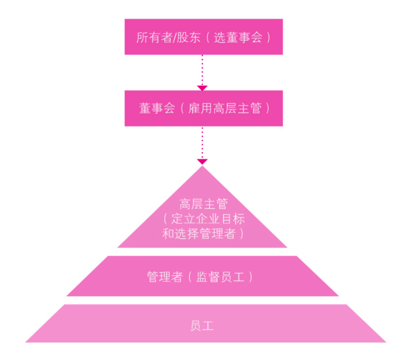

缺点：

1. 初始成本。成立公司可能要花费几千甚至数万美元，还包括昂贵的律师费和会计师费用。
2. 大量文书作业。申请开办公司的文书工作仅仅是一个开始。独资或合伙公司的会计纪录不必如此详尽，而公司则必须具备详尽的财务报表、会议记录等更多的文书。
3. 课税两次。公司收入要被征税两次。首先公司在把收入分配给股东之前，必须先支付所得税；然后，股东必须要为从公司获得的收入（股利）交税。
4. 两份所得税申报表。如果成立公司，就必须提交公司所得税申报表及个人所得税申报表。依照公司规模大小而定，公司所得税申报表可能相当复杂，有时甚至需要注册会计师（certified public accountant, CPA）协助。
5. 规模。规模虽然是公司的优点，但也可能是缺点。大型企业有时会缺乏灵活性，而且受到繁文缛节的限制，无法对市场变革作出快速反应，从而影响获利。
6. 难以终结。一旦成立公司，就很难结束。
7. 可能与股东或董事会有冲突。如果股东选出的董事会与目前的管理层无法达成共识，就会产生冲突。因为公司高主管系由董事会决定，企业主可能面临被自己一手创建的公司逐出的窘境。

### 个人公司
并非所有的公司都是拥有上百位员工或上千位股东的大型组织，个人（例如，卡车司机、医生、律师、水电工、运动员及电影明星）也能组建公司。通常它们不向外人出售股票，因此，小型公司与大型公司的优缺点并不一致（例如较多投资金额与规模这一类）。它们的主要优点是有限责任及可能的税收优惠。

### S 公司
`S 公司（S corporation）`是一种独特的政府产物，看来像是公司，但却像独资企业和合伙企业一般交税（S 公司这个名称来源于《美国国内税收法典》第1章下的第 S 子章，其中规定了管理 S 公司的办法）。S 公司的文书作业及细节与传统（C）公司类似，也有股东、董事、员工及有限责任利益，不过利润作为股东的个人收入交税——因此避免了 C 公司被课税两次的情况。

并非所有企业都能成立 S 公司，公司必须符合以下资格：

1. 股东人数不能超过 100 位（所有的家庭成员只会被列为一位股东）。
2. 股东必须是个人或产权，并且是美国公民或永久居民。
3. 只能有一种已发行的股票（第 18 章将讨论各种股票类型）。
4. 被动性质的收入（例如，租金、专利使用费及利息等）未超过总收入的 25%。

### 有限责任公司
`有限责任公司（limited liability company, LLC）`与 S 公司很像，但不需要专门的资格要求。

优点：

1. 有限责任。个人财产受到保护。有限责任曾经只能为有限合伙人和传统公司的股东享有。
2. 税赋选择。有限责任公司能够选择以合伙企业或公司方式被征税。以前只有合伙人或者 S 公司所有者能够享有作为合伙企业交税的好处。
3. 弹性的所有权。有限责任公司无须遵从如 S 公司一样的所有权限制。所有者可以是自然人、合伙企业或是公司。
4. 弹性的利润与损失分配。利润和亏损不必按每个人的投资比例来分配。有限责任公司的每个成员可以以相同的比例进行分配。
5. 营运弹性。有限责任公司必须服从类似公司的组织条款，但是不用保留备忘录、把书面解决方案归档或者举行年度会议。有限责任公司同样要提交类似于合伙协议的书面营运协议，描述该公司要如何经营。

缺点：

1. 没有股票。有限责任公司的所有权不可转移，公司成员需要其他成员同意才能出售所拥有的股份。反之，一般公司及 S 公司的股东可以依个人意愿出售股份。
2. 有限的存续期间。有限责任公司被要求于组织规章中确认解散日期（某些州甚至不允许其超过 30 年）。成员的死亡可能导致有限责任公司自动解散，但其他成员可以选择在解散之后再重新建立有限责任公司。
3. 较少的激励机制。不像公司制企业，有限责任公司无法为拥有公司 2% 及以上股份的成员扣除其额外福利的成本。因为没有股票，所以也无法通过股票期权激励员工。
4. 税赋。有限责任公司成员必须用利润支付自雇税，这相当于独资企业和合伙企业所支付的社会医疗保障。相比之下，S 公司用薪水而不是整体利润来支付自雇税。
5. 书面作业。有限责任公司对文书工作的要求没有公司制企业那么多，但还是比独资企业要求的多。

表 5.4 企业所有权形态的比较表

企业所有权形态 | 创始企业所需文件 | 终结的难度 | 寿命 | 所有权的转移 | 财务资源 | 损失风险 | 税务 | 管理责任 | 员工福利
--------|----------|-------|----|--------|------|------|----|------|-----
独资 | 无，可能需要许可证或执照 | 容易终结，只要付清债务然后结束即可 | 在所有者过世时告终 | 企业可以被卖给合格买主 | 受限于所有者的资本和贷款 | 无限责任 | 以个人所得来课税 | 所有者管理企业的所有层面 | 通常福利较少，薪资较低
普通合伙 | 合伙协定（口头或书面） | 或许难以终结，取决于合伙拥有权协定 | 合伙人过世或退出时告终 | 必须得到其他合伙人的同意 | 受限于合伙人的资本和贷款 | 无限责任 | 以个人所得来课税 | 合伙人共同管理 | 通常福利较少，薪资较低，承诺员工成为合伙人
有限责任 | 书面协定，必须提交有限合伙证书 | 与普通合伙一样 | 与普通合伙一样 | 与普通合伙一样 | 与普通合伙一样 | 有限责任 | 与普通合伙一样 | 无法参与管理 | 与普通合伙一样
传统公司 | 成立公司条款与细节 | 终结困难而且昂贵 | 永久寿命 | 容易变更所有者，只需出售股票 | 需更多钱创始及运营，可以出售股票和债券 | 有限责任 | 以公司来课税，征税两次 | 管理层与所有者分开 | 通常福利和薪资较好，有升迁机会
S公司 | 成立公司条款与细节，必须符合规定 | 与传统公司一样 | 与传统公司一样 | 可以出售股票，但有限制 | 与传统公司一样 | 有限责任 | 以个人所得来课税 | 与传统公司一样 | 与传统公司一样
有限责任公司 | 组织和运营协定票款，没有资格限制 | 可能很困难，取决于运营协定 | 依据组织解散条款规定之日期 | 无法出售股票 | 与合伙一样 | 有限责任 | 多变 | 多变 | 多变，但无免税优惠

## 公司扩张：兼并和收购
`兼并（merger）`指两家公司组合成一家公司，情况就像是婚姻关系。`收购（acquisition）`是指一家公司买下另一家公司的所有权和债务，它更像是购买一个房子而不是进入婚姻。

公司兼并有三种主要形态：垂直兼并、横向兼并以及混合兼并。

- `垂直兼并（vertical merger）`是相关行业中产品处于不同阶段的两个企业的结合；想想一家自行车公司和一家生产自行车车轮的公司的兼并，不仅能确保自行车制造商所需的车轮供应，也能确保自行车公司产品的质量控制。
- `横向兼并（horizontal merger）`指同一行业中两家相同层次的企业的结合，这可以实现多样化或扩展公司产品类型。横向兼并的一个例子是自行车公司和三轮车公司的合并，以供应各式不同的轮式产品。
- `混合兼并（conglomerate merger）`指完全无关的产业中的公司的结合，主要目的在于将企业营运及投资多样化。软饮料公司与零食公司之间的合并，就是混合兼并的典型。

一些公司选择内部维持控制权，或者在某些情况下重新获得控制权。`“将公司私有化”（taking a firm private）`代表股东或管理层从其他股东手里取得公司的所有股票。

`杠杆收购（leveraged buyout, LBO）`是一项可行策略，是指员工、管理层或者部分投资者主要通过借款来购买一个组织的行为。借来的资金用来买断公司的股份，而这些员工、管理者或投资者就成为公司所有者。

## 特许经营
`特许经营协定（franchise agreement）`是特许经营商（franchisor）对某一事业拥有良好创意，通过在特定区域内把使用企业名称的权利、出售某项产品或服务的权利即`特许经营权（franchise）`出售给`特许加盟商（franchisee）`的协议。一些知名的特许经营案例包括：麦当劳、捷飞络汽车服务公司（Jiffy Lube）、7-11 便利店（7-Eleven）、窈窕者（Weight Watchers）和假日酒店。

优点：

1. 管理与营销协助。特许加盟商在事业上成功的机会较大，因为他们已经拥有了成熟的产品，可以获得选址和促销上的帮助，以及各阶段营运的协助。就像在你自己的店里雇用了可以随时协助你的全职顾问。特许经营商提供密集的训练，例如，麦当劳将所有新的特许加盟商的管理者送到美国伊利诺伊州橡树溪的汉堡包大学培训。
2. 个人所有权。你所运营的特许经营店依然是属于你自己的店铺，享有任何独资者应该享有的激励和利润。你还是自己的老板，虽然比起你自己拥有私人店铺，你必须遵守更多的规则、规章和程序。
3. 品牌全国知名。开一家礼品店或冰淇淋店是一回事，开一家新的霍马克贺卡连锁（Hallmark store）或 31 冰淇淋（Baskin-Robbins）则又是另一回事。知名的特许经营店能让你立即获得产品认同与支持，而且拥有来自全球的客户。
4. 财务建议与援助。小企业主的两个主要困难就是如何融资以及学会记好账目。特许加盟商常常可以从这些领域的专家那里获得宝贵的协助及定期的建议。事实上，一些特许经营商会向他们认为有价值的潜在特许加盟商提供融资。
5. 失败率较低。根据经验，特许经营的失败率比起其他企业模式的几率要低。

缺点：

1. 较高的启动成本。多数特许经营都会对特许经营权收取费用。加盟权费用的高低差别非常大。
2. 分摊利润。通常，特许经营商除了索取加盟费之外，还会要求分享较大比例的利润，或是根据销售额而非利润的百分比抽取佣金。特许经营商要求的比例一般被称为“特许权使用费”（royalty）。
3. 管理规定。管理“协助”很可能会变成管理命令、指挥和限制。受限于公司的规则和章程，特许加盟商可能会失去拥有自己的企业、当自己的老板的热情与激励。特许加盟商常常因为对特许经营商的不满而联合起来要求解决，而不再是单打独斗。
4. 燕尾服效应。如果其他特许加盟商失利，那么你的特许经营店将会如何？即使你的特许加盟商仍有利润，你也有可能被迫歇业，这就是通常所谓的`“燕尾服效应”（coattail effect）`。其他特许加盟商的行为显然会极大地影响你未来的成长及利润。
5. 出售限制。不像私营企业所有者可以开出自己的条件，将所属企业出售给其他想要的人，许多特许加盟商在出售其特许经营店时受到约束。为了控制特许加盟商的品质，特许经营商经常坚持拥有核准所有新进加盟者的权利，而新进加盟者必须符合其标准。
6. 特许经营商的欺骗。一般人可能以为多数特许经营商都是像麦当劳这样的大型企业，其实不然。许多特许经营商都是无名的小公司，而有意加入的特许加盟商可能对它们了解不多。多数特许经营商都很诚实，但是近来美国联邦贸易委员会（Federal Trade Commission）收到的关于特许经营商诈骗的申诉也越来越多。

## 合作社
`合作社（cooperative）`，指由有着相似需求、共享资源、共享收益的使用人（如生产者、消费者或员工）所共有与控制的企业。例如，在美国许多乡村地区，电力由合作社出售。一般来说，政府以比非联邦事业单位低 40% 到 50% 的售价向电力合作社批发电力。电力合作社目前为全美 47 个州 4,200 万人提供电力，覆盖 12% 的人口。

# 企业家精神与创办小企业
## 创业者的时代
`企业家精神（entrepreneurship）`指接受创业与经营企业的风险的精神，请认真学习本章并思索自己将来成为企业家的可能性。

## 人们为何接受创业的挑战
看看自己是否拥有下列企业家素质：

- 自我引导。你必须完全乐在其中，虽然你是自己的老板但仍然要保持高度自律。你必须能够承受成功或失败。
- 自我肯定。当众人都感到怀疑时，你必须坚持自己的想法，并且能够不断补充自己的热忱。
- 勇于行动。仅仅是拥有伟大的商业构想是不够的，更重要的是将强烈的梦想和愿望付诸行动，变成现实。
- 精力旺盛。这是你自己的事业，你必须在感情、精神和体力上长期投入、努力工作。员工拥有周末和假期，企业家则经常一周上 7 天班，长年无法休假。一天工作 18 个小时可能让你厌倦，但大多数企业家认为这总比为别人每天长时间工作要来得好。
- 忍受不确定性。成功企业家只承担那些可以预测的风险（倘若可能）。不管怎么说，摆在企业家面前的风险是必然存在的。记住，企业家精神对于那些容易被吓到或者事事追求稳妥的人，都不适合。

在下述情况下，你会获得一个好商机：

- 它能满足客户需求。
- 你拥有创立企业所需的技能和资源。
- 你能按照一个顾客有意愿并有能力支付的价格来出售产品或服务，并且盈利。
- 在机会溜走（竞争对手用同样的方案在市场上打败你）之前，你能将你的产品或服务带给顾客。
- 你可以将企业运转下去。

`创业团队（entrepreneurial team）`是一群来自不同商业领域的创业者，聚集在一起组成一个管理小组，拥有研发、制造及销售新产品所需的技能和经验。

`联盟营销（affiliate marketing）`是一种基于互联网的营销策略，即企业奖励那些为其网站带来访客的个人或企业（分店）。

`内部创业者（intrapreneurs）`是在公司内部像企业家一样工作、富于创新的人。创新就是利用公司的现有资源——人力、财务及企业实体——推出新产品并赚取更多利润。

`企业特区（enterprise zone）`是政府通过提供比较低的税收和其他政府支持来吸引私有企业投资的特殊地理区域，也常被称作授权区（empowerment zone）或企业社区（enterprise community）。政府可以为企业家精神带来极大的影响力，并提供相关的投资、税额及信用服务。对于创造了工作岗位的企业，政府通过税收减免鼓励企业家的积极性。

`孵化基地（incubator）`是向新企业提供拥有会计、法律咨询及秘书协助等基本企业服务的低成本办公中心。孵化基地在企业发展初期的关键阶段提供支持，帮助企业生存下来。

`商业计划书（business plan）`是描述企业本质、目标市场、竞争优势以及所有者的资源和限制的详尽书面说明。

- 全面商业计划书大纲。好的商业计划书大约介于 25 到 50 页之间且至少需要 6 个月时间撰写。
- 封面函。你需要让潜在资金提供者想要阅读你的企业计划，所以封面函应该重点摘略计划中最吸引人的地方，用字越少越好。确定直接称呼潜在投资者的姓名，“敬启者”或“亲爱的先生”这种称谓并非赢得投资者青睐的最佳办法。
- 第一部分──执行摘要。一份2至3页的简略的新企业管理摘要，包括企业描述并讨论主要目标及目的。
- 第二部分──公司背景。描述公司迄今的营运（若有）、潜在法律考虑以及风险与机会。简述公司财务状况，附上过去及目前的资产负债表、收入与现金流量表，以及其他相关财务记录（你将在第 17 章读到财务报表等相关信息）。此外，最好也附上保险给付描述。投资者会希望了解死亡或其他意外是否会对公司造成过大威胁。
- 第三部分──管理团队。附上一张组织表，描述各项职位权责，以及目前与未来主管的详细简历。创意平凡但经验老练的管理团队通常比创意高明但缺乏经验的团队更容易获得所需资金。管理者应该具备创业初期所需的各种专长；若无，提出将有外来顾问担任这些职务，并且描述他们的资历。
- 第四部分──财务计划。提供对未来五年收入、支出及资金来源的预估；不要假设企业会呈现直线成长；调整你的计划，在公司成长各阶段投入资金；解释预估值的基础理论及假设。假设必须合理，并且以产业／历史趋向为根据。确定所有数据计算正确，并且在整个计划中是一致的。不要对销售估计抱有过大期望；相对地，对于最佳情况、预期情况及最坏情况都做分析。这些不但显示出最终盈亏对销售波动的敏感度，同时也是很好的管理指引。
- 第五部分──所需资本。说明初期或持续营运所需的资金，并且描述这些资金如何被运用，确定总金额与现金流量表一样。潜在投资者会对这个部分详细检视，因此它务必十分清楚简明。
- 第六部分──营销计划。不要低估竞争。检视产业规模、趋向及目标市场。讨论该产品或服务的优劣；投资者最希望了解的是，该产品何以会比现有产品更具吸引力，以及该产品能否申请专利；比较竞争对手的价格，以金额和单位预估销售；列出销售、广告、促销以及公关方案大纲；确定成本和财务报表中所预估的相符。
- 第七部分──地点分析。在零售业及其他产业，企业地点是其中一项最重要因素。提供该商店地区消费者之综合人口统计分析，以及交通模式分析及车辆与行人数。
- 第八部分──制造计划。描述最小工厂规模、所需机械、生产能力、库存，以及仓管方法、质量管理、工厂人员条件等。产品成本的预估应该要以最初研究为根据。
- 第九部分──附录。附上所有对产品或服务的营销研究（现货供应报告、商品再制等），以及其他有关产品概念或市场规模的资料。提供各项参考资料明细。这一部分应该证明，该公司所要进入的产业或市场并未衰退。

# 管理和领导
## 管理的四种职能
`管理（management）`是通过计划、组织、领导及控制人员和其他组织资源来实现组织目的的过程。

- `计划（planning）`包括预测趋势发展并决定最好的战略和对策来实现组织的目的和目标。这些目标之一是使客户满意。
- `组织（organizing）`包括设计组织的结构，创造出让所有人与事物共同工作以实现组织的目的和目标的环境和制度。现在的许多组织都是以客户为中心，其理念是让每个人在获利的情况下为服务客户而工作，所以组织必须保持弹性及适应性。客户的需求会改变，组织应紧跟而上。
- `领导（leading）`是为组织创造愿景，交流、指导、培训、协助和激励他人，以有效地达成组织的目的和目标。领导的趋势是授权，给员工尽可能多的决策自由，让他们能够自我指导和自我激励。
- `控制（controlling）`包括建立清晰的标准以确保组织按照既定目的和目标前进，奖励表现良好的员工，并在员工表现不当时采取纠正措施。基本上，它意味着衡量实际发生的事情是否符合组织的目的。

## 计划与决策
管理的第一个职能是计划，包括设定组织的愿景（含使命陈述）、目的和目标。管理者把计划评为最有价值的工具。`愿景（vision）`不只是目的，它同时是对组织存在的原因以及组织的前进方向的包容性解释。愿景带给组织目的意识及价值观，二者的结合把员工团结在共同的命运下。

高层管理者通常为组织设立远景，并与员工合力为企业设计`使命陈述（mission statement）`，以概括组织的根本目的。它应论述：

- 组织的自我概念。
- 公司的哲学和目的。
- 长期生存。
- 消费者需求。
- 社会责任。
- 公司产品或服务的性质。

使命陈述是设定明确目的、选择并激励员工的基础。`目的（goals）`是组织希望达成的、广泛的、长期的成就，需要获得工作者与管理者的一致认同，因此，设定目的通常是一项团队工作。

`目标（objective）`是关于如何达成组织目的的特定、短期的细节说明。

计划能为企业回答一些基本问题：

1. 当前的情况如何？什么是影响行业参与者成功的因素，我们做得如何？经济形势与其他环境如何？存在哪些人们需要满足的机会？哪些产品与客户会使公司获得最大的利润？公司的主要竞争者是谁？他们带来的威胁是什么？这些问题都属于`SWOT 分析（SWOT analysis）`的一部分。SWOT 是对组织的优势（strengths）、劣势（weaknesses）、机会（opportunities）和威胁（threats）所做的分析方法。
   1. 图 7.1 展示了公司进行 SWOT 分析时，必须考虑的一些潜在议题：哪些外部成功因素影响了行业？我们的企业与其他企业相比如何？我们的社会目标是什么？个人发展目标是什么？遇到经济衰退时，我们如何存活并发展？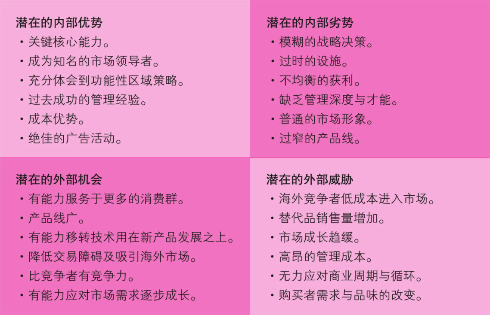
1. 我们要如何从目前状况达成目标？这是计划中最重要的一环。计划具有四种形式：战略、战术、作业计划和应急计划（参阅图 7.2）。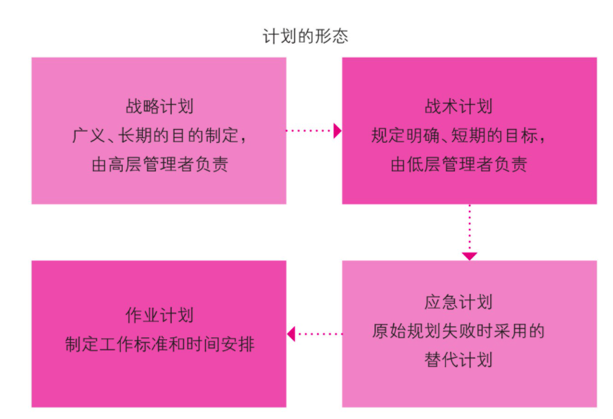
   1. `战略规划（strategic planning）`由高层管理者制定，确定组织的主要目的以及实现这些目的所需要的政策、流程、战略和资源。政策是对组织行为的宽泛指导，而战略则确定了使用资源的最佳方式。在战略规划阶段，公司高层经理决定服务哪些客户、何时提供服务、销售哪些产品或服务以及开展竞争的地理区域等。以塔可钟（Tacobell）为例。考虑到经济衰退，该公司推出了“超值菜单”，如起价为 79 美分的芝士卷和墨西哥豆泥卷。此外，它为追随“四餐”（夜宵）一族，推出了几个低热量、低脂肪的 Fresco 菜单品种。该战略使得销售量增长了 8%。
   2. `战术计划（tactical planning）`是企业决定将要做什么、谁来做以及怎样做的详细的短期计划过程。战术计划通常由基层管理小组或者基层管理者制订，包括订立年度预算，以及决定其他为达成战略目标而进行的活动和细节。假设一个卡车生产厂商的战略规划是更多地在南部销售卡车，那么战术计划的内容就可能是针对南部卡车司机的需要和需求进行更多研究，并且针对这些潜在消费者推出广告。
   3. `作业计划（operational planning）`是为实施工作战术计划而制定工作标准和日程安排的过程。战略规划把组织视为一个整体，而作业计划则专注于特定的监督者、部门管理者和个别员工身上。作业计划是部门管理者日常及每周管理运作的必要工具。例如，作业计划必须包含卡车零件完成装配的准确日期，以及零件必须达到的质量标准。
   4. `应急计划（contingency planning）`在主要计划不能实现组织目标的情况下，制定备选行动方案的过程。经济与竞争环境的变革是如此快速，做好备选行动方案以应对预期变化是明智的。例如，倘若组织在特定日期前无法达成销售目的，应急计划可能要求在特定时期推出更多广告或降价。危机计划（crisis planning）是对环境的突变作出反应的应急计划的一部分。例如，现在许多城市和企业都积极发展各项计划以应对恐怖袭击，你可以想象这些计划对于医院、警察以及其他相关组织有多重要。

`决策（decision making）`是指在两个或更多的选项中作出选择。理智的决策模式是管理者按照一定的步骤，作出符合逻辑的、明智且判断精准的决策。这些步骤可以归纳为决策制定的七个 D ：

1. 定义（Define）情况。
2. 描述（Describe）并收集所需信息。
3. 开发（Develop）多项可供选择的方案。
4. 达成（Develop agreement）参与者认同。
5. 确定（Decide）最佳可选方案。
6. 执行（Do）所选择的方案。
7. 判定（Determine）决策优劣，然后持续进行。

`问题解决（problem solving）`比决策的制定过程更不正式，通常需要更快速地解决每天发生的问题。决策和问题解决都需要大量的判断。

`头脑风暴（brainstorming）`，即在很短暂的时间里想出尽可能多的解决方法而不去审查这些想法正确与否。

## 组织：建立统一的体系
`组织结构图（organization chart）`是表明人员之间关系和分配组织工作的视觉图像，显示谁负责完成某项特定工作，以及谁向谁报告（详见图 7.3）。

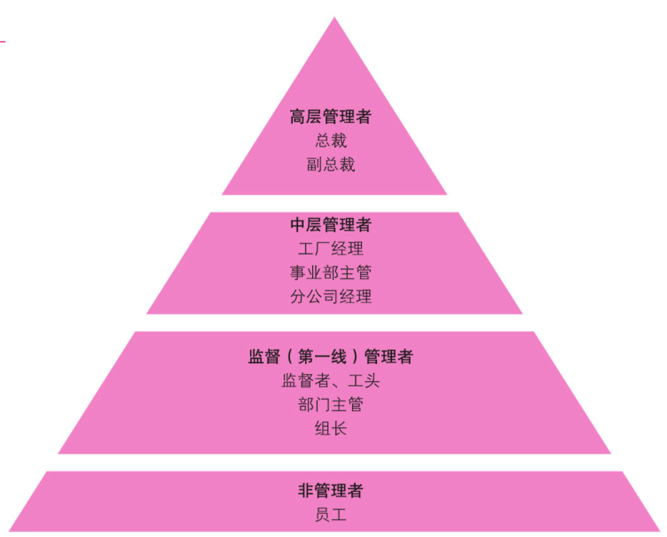

`高层管理（top management）`是管理的最高层，由总经理和发展战略规划的其他主管组成。我们常会见到一些工作职位和简称：首席执行官（CEO）、首席运营官（COO）、首席财务官（CFO）以及首席信息官（CIO）——又被称作首席知识官（CKO）。

CEO 负责企业所有的高层决策，并负责为组织引入变革。COO 则负责将这些变革付诸实施，包括将工作结构化、控制运营以及奖励员工，确保所有人都为实现领导者的愿景而努力工作。CFO 负责掌握资金、规划预算、筹集资金等；CIO 或者说 CKO 则负责把正确信息传递给其他管理者，让他们可以作出正确的决策。

`中层管理（middle management）`包括对战术计划和控制负责的一般管理者、部门经理和分支工厂经理（在大学里面是学院院长和部门主管）。

`监督管理（supervisory management）`包括直接负责监督工作者并评估他们每日表现的管理者；他们常被称为一线管理者（或监督者），因为他们是最贴近工作者的最基层主管。

图 7.4 显示了一位管理者必须拥有的三种技能：

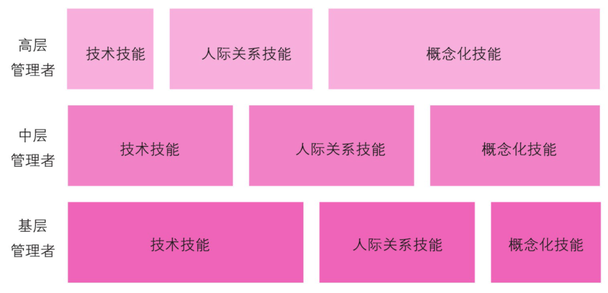

1. `技术技能（technical skills）`指完成某项特定任务（例如销售产品或研发软件）或在某特定部门（例如营销或信息体系）内执行工作的技能。
1. `人际关系技能（human relations skills）`包含沟通和激励，帮助管理者用人以及与人合作。类似技能还包括领导力、指导、建立士气、授权、培训开发，以及帮助和支持。
1. `概念化技能（conceptual skills）`即把组织视为一个整体以及不同部门间关系的能力。计划、组织、控制、系统开发、问题分析、决策制定、协调及授权方面都需要概念化技能。

`人员配置（staffing）`包括招聘、雇用、激励并留住实现公司目的所需的最好的人员。

## 领导：不断提供愿景与价值观
领导者必须做到：

- 传达愿景并且把其他人凝聚在该愿景的周围。领导者应该敏锐地发现追随者所关心的问题，赋予他们责任，并且赢得他们的信任。成功的领导者必须能影响其他人的行动。
- 建立公司价值观。这些价值观包括对员工、客户、环境以及公司产品质量的关切。当公司设定企业的目的时，也就定义了企业的价值观。人们认为领导者最应该具有的品质是诚实，其次则应有远见。
- 倡导公司伦理。伦理包括对诚实的不懈追求，以及坚持公司的每个人都被公平对待（详见“道德抉择”专栏）。
- 热爱变革。一位领导者最重要的工作可能就是改变公司的经营方式以提升其效益（把事情做得更好）和效率（投入较少的资源达到相同的目标）。

`透明（transparency）`就是将公司的实际情况和数据以清晰而透明的方式呈现给所有利益相关者。

几种常见的领导力风格，以及这些领导力风格如何发挥作用：

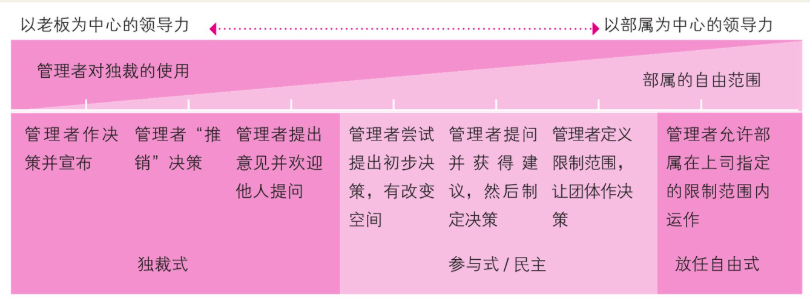

1. `独裁式领导力（autocratic leadership）`是指进行管理决策时不参考他人意见的领导力风格。这种风格在紧急事故及需要绝对服从（例如灭火）时相当有效。独裁领导在需要清晰的指导和在带领不熟练的新工人时也是有效的。
1. `参与式（民主）领导力（participative（democratic）leadership）`是指由管理者与员工合作共同制定决策的领导力风格。研究显示，参与决策的员工不见得一定会提高效率，但通常会增加工作满意度。许多先进的组织都非常成功地运用了诸如重视灵活性、好的听取技巧及移情。成功采用类似领导力风格的组织，包括谷歌、苹果、IBM、思科、AT&T 以及多数小型企业。
1. `放任自由式领导力（free-rein leadership）`指管理者设定目标而员工则可以相对自由地做任何事情来实现目标。在那些管理者同医生、工程师及其他专业人士打交道的组织里，最成功的领导方式通常就是放任自由。这种管理者所需要的特点包括热情、友好和善解人意。

`授权（empowerment）`代表给予一线员工权力（不咨询管理者而作出决定的权利）与责任（负责个人行动的后果的要求），来迅速响应客户的需求。

`使能（enabling）`指给予员工作决定所需的教育和工具。明显地，使能是授权成功与否的关键。没有合适的教育、培训、训练和工具，员工将不能承担起保证授权行得通的责任和决策制定任务。

## 控制：确保工作顺利进行
控制过程（详阅图 7.6）提供的反馈让管理者及工作者能够针对任何偏离计划的行为，以及环境中那些会影响业绩的改变作出调整。

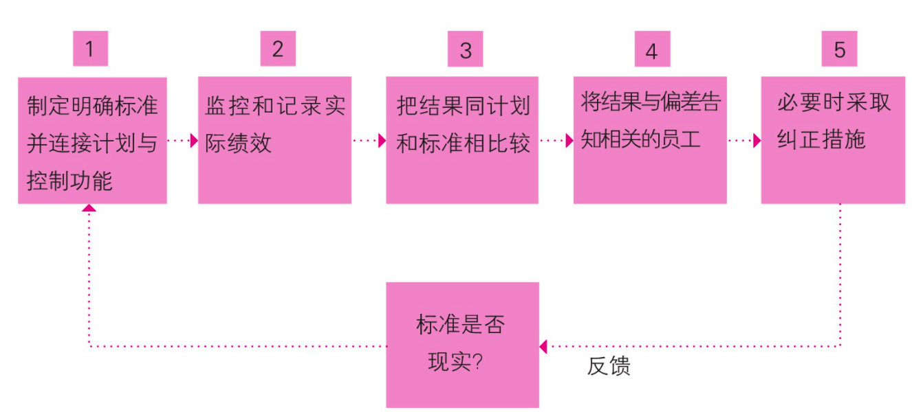

控制包含五个步骤：

1. 制定明确的绩效标准，并联结计划与控制功能。没有明确的标准，控制就无法达成。
2. 监控和记录实际绩效（结果）。
3. 把结果同计划和标准相比较。
4. 将结果与偏差告知相关的员工。
5. 为出色的工作提供正面反馈，并在需要时采取纠正措施。

# 调整组织结构，以应对当今的商业挑战
## 变革中的组织
企业成长导致`规模经济（economies of scale）`，也就是说公司通过大量采购原料，以降低生产成本；随着生产量提高，产品平均成本下降。

`法约尔的组织原则`：1919 年，法国经济学理论家法约尔出版了《工业管理与一般管理》（Administration industrielle et générale）一书。提到的组织原则如下：

- 指挥统一。每位工作者只有一个老板。该原则的优点非常明显，倘若两个不同老板下达两种不同任务，你该如何？你要听命于谁？为了避免这种混淆，每个人应该只对一位管理者负责（我们将会讨论一个似乎违反此原则的组织计划）。
- 职权等级。所有工作者都应了解该向谁报告；管理者应该有权力下命令，并且期望他人遵从。
- 分工。职能应该以专门领域划分，例如生产、营销及财务。
- 个人利益在共同利益之下。工作者应将自己视为一个协调团队，团队目标比个人的目标重要（此观念现在依然适用）。
- 权力。管理者有权下命令及要求服从。职权与责任紧密相关：在执行职权的同时，责任也随之增大（管理者日渐授权给员工，故此原则也被修正）。
- 集权程度。授予高层管理决策权的多寡应视情况而定。在小型组织中，可以将所有决策权集中于高层主管身上；然而在大型组织中，一些主要与次要问题的决策权应该分配到基层管理者与员工身上。
- 明确的沟通渠道。所有工作者在企业内都要能够快速、轻易地与他人联系。
- 秩序。材料与人员都应置于适当地点。
- 公正。管理者应以尊重及公平的态度对待员工与同事。
- 团队精神。企业内部人员之间应该培养荣誉与忠诚的精神。

`马克斯·韦伯与组织理论`：马克斯·韦伯的著作《社会和经济组织理论》（The Theory of Social and Economic Organizations）与法约尔的著作一样于 20 世纪 40 年代末期在美国出版。韦伯的组织原则与法约尔类似，不过韦伯特别强调：

- 工作说明书。
- 明确书面规定、决策方针及详细记录。
- 一致的程序、规则与政策。
- 依据资格条件招聘员工与升职。

韦伯相信大型组织唯有明确制定规范方针，才能精准执行。换言之，他较偏好官僚制。

`等级（hierarchy）`指一个人位居组织的最高层，管理者由上而下依位阶排序，其他人则对该人负责的体系。由于一个人无法监督上千位员工，因此高层管理者需要许多基层管理者的协助。`指挥体系（chain of command）`就是从最高层到最基层的职权线。

马克斯·韦伯便用“官僚”（bureaucrat）一词来形容一位执行高层管理命令的中间管理者的职能。因此，`官僚制（bureaucracy）`指组织有许多等级的管理者制定出规定与规则，并且监督所有决策。

## 建构组织的决策
`集权（centralized authority）`指的是企业高层管理者拥有决策权。

`分权（decentralized authority）`指的是将决策权委托给比总部管理层更熟悉当地情况的低层级管理者和员工。

`管理幅度（span of control）`指的是一位管理者或主管应该监督的最合适下属人数。

20 世纪初期，组织越来越大，层层叠叠增加的管理直至成为`高耸组织结构（tall organization structures）`。

组织近来开始往扁平式发展。`扁平组织结构（flat organization structure）`中管理层较少，而且有较大的管理幅度（亦即每位经理人管理许多部属）。这样的结构通常较能对客户需求产生响应，因为决策权和责任可以交给基层员工，使得管理者可以不必事必躬亲。

`部门化（departmentalization）`指将组织划分至不同单位。传统将组织部门化的方法是依职能（设计、生产、营销、会计等）划分。将工作者根据他们的技能、专业技术或是资源使用的方式分组，使员工能够专业化、更有效率地一同工作，也可以节省成本。其他优点包括：

1. 员工可以深入发展专精技能，同时带动部门的效率与进步。
2. 企业可以将所有资源集中，并在该领域中寻找各种专家，而达到规模经济。
3. 提高职能内部的协调度，高层管理容易引导并控制各部门活动。

部门化的缺点则有：

1. 不同部门间可能缺乏沟通。例如，生产可能与营销分开，使得制造产品者无法从客户端得到适当反馈。
2. 个别员工可能产生部门目标认同，而非组织整体目的。采购部门可能会采购高价值和大量的物品，但其储存成本因此增加。如此使得采购部门看似绩效良好，但会损及公司的整体获利能力。
3. 公司对于外部变革的响应，可能变得缓慢。
4. 由于并未接受不同管理职责的训练，人们因此容易成为眼光短小的专家。
5. 部门内部的同事参与团体思考（想法趋近），可能需要部门外的刺激才能产生创造力。

## 组织类型
现在将深入讨论各种建构组织的方法。首先检视以下四种类型：（1）直线组织；（2）直线参谋式组织；（3）矩阵式组织；（4）跨职能自我管理团队。

### 直线组织
`直线组织（line organization）`指组织内由上而下拥有直接双向的责任、职权与沟通，所有人只向一位主管报告。军队和许多小企业都是这样组成的。例如，当地一家私营比萨店可能有一位总经理和一位排班经理，所有一般员工都向排班经理报告，而他（或她）则向总经理或老板报告。

直线组织没有任何专家提供管理支援，没有法律、会计、人事部门，也没有信息部门。这类的组织依循法约尔的传统管理原则。直线经理人可以发布命令、强化纪律，并且在情势改变时适时调整组织。

### 直线参谋式组织
`直线人员（line personnel）`是指挥系统的一部分，执行直接达成组织主要目的的职能，包括生产、分销及营销人员；`参谋人员（staff personnel）`行使提出建议协助直线人员达成组织目的的职能（例如，营销研究、法律咨询、信息技术及人力资源管理）。

图 8.4 显示直线参谋式组织结构图。直线人员与参谋人员的一项重要差异在于权力。直线人员拥有正式决策职权；参谋人员有权向直线人员提议，虽然这些建议可以影响上述决策，不过他们无法改变决策。直线管理者可以选择求教或忽略参谋人员的建议。

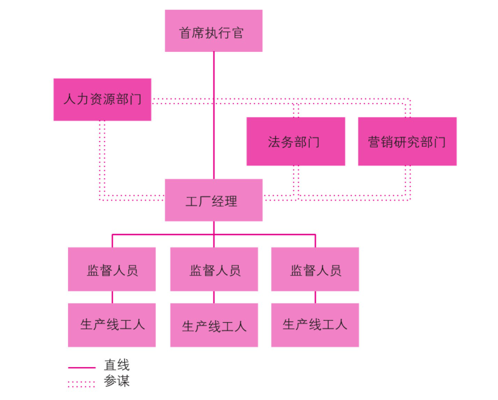

### 矩阵式组织
`矩阵式组织（matrix organization）`指汇集组织内不同部门专家共同负责特殊项目，但是仍然维持部分直线参谋式组织结构的组织。图 8.5 显示了矩阵式组织结构图。换言之，一位项目经理可以向各部门借人来协助自身设计与营销新产品。

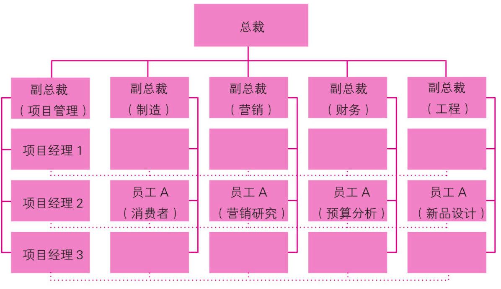

矩阵式组织结构的优点如下所示：

- 管理者在向各项目分派人员上拥有弹性。
- 鼓励跨组织与团队合作。
- 能为与新产品研发有关的问题提供创意解答。
- 更有效率地使用组织资源。

它的缺点如下：

- 昂贵且复杂。
- 可能导致员工对谁忠诚产生混淆——究竟要对项目经理，还是对职能单位负责。
- 需要人际关系技能良好且有合作精神的员工与管理者；可能会产生沟通问题。
- 对于长期问题只有暂时的解决办法。

### 跨职能自我管理团队
`跨职能自我管理团队（cross-functional self-managed teams）`是来自不同部门且长期共事的一群员工（与在矩阵式组织中建立的临时性团队正好相反）。自我管理意味着他们被授权可自行决策，无须得到管理层的同意。当跨部门团队建立之后，设计、工程、营销、分销及其他职能之间的藩篱被打破。有时团队是跨企业的，也就是说，成员来自两个或更多的企业。

>你可以把手术室中的医疗专家小组看成是一个跨职能自我管理的团队。来自医院不同部门的医生、护士、技师和麻醉师会共同努力，成功完成手术。

### 超越组织的界限
跨职能团队在客户的声音传到组织中时发挥最大的功能，客户的反馈对于生产研发团队尤其具有重要价值。供应商与分销商最好也加入团队之中。包含客户、供应商及分销商的跨职能团队，可以超越任何的组织界线。有些公司的供应商与分销商身在海外，因此跨职能团队也可以跨越国界分享市场信息。政府协调者会协助类似的项目，让跨职能团队打破政府与企业的界限。在这种情况下，跨职能团队便会打破政府与企业的藩篱。

## 管理跨企业互动关系
`透明化`指一家企业对其他合作公司持开放态度，过去这些公司之间壁垒分明的藩篱变得“透明可见”，电子信息也共同分享，仿佛是同一家公司。

一家公司可能与一位来自意大利的另一家公司的设计专家合作一年，然后就不再需要此人；另一位来自另一个国家另一个公司的专家可能在下回被雇用，推动另一项计划。这种随需求组合或分开的可替代公司组成的临时性网络组织，被称为`虚拟公司（virtual corporation）`，见图 8.6。

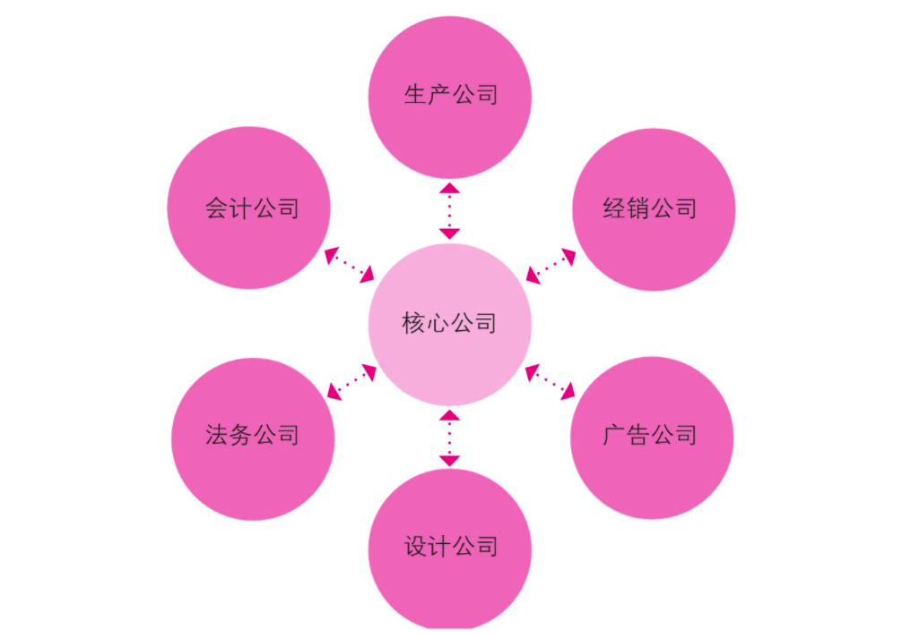

### 标杆学习与核心竞争力
`标杆学习（benchmarking）`指的是将组织实务、流程及产品与世界典范进行比较。

`核心竞争力（core competencies）`指组织具有能够达到与世界上其他组织一样的领先水平，甚至有更好表现的能力。

## 适应变革
`重组（restructuring）`是指重新设计一个组织，使它能更有效益与效率地为客户服务。

`倒金字塔型组织（inverted organization）`将员工摆在高层，而首席执行官则位居下层。管理层级很少，管理者工作旨在协助及支持一线人员，而非指使他们。图 8.7 说明倒金字塔型与传统组织结构间的差异。

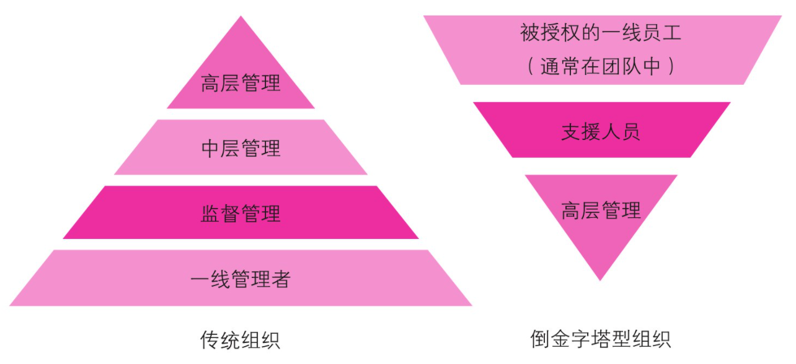

`组织（或企业）文化（organizational or corporate culture）`指的是为达成组织共同目标提供凝聚与合作的普遍价值观。一般而言，组织文化经常被投射于故事、传统与神话之中。

所有的组织都有两套组织体系。其中一套为`正式组织（formal organization`），它详细说明了责任、权力和职位关系的路线结构，并显示于组织结构图中。另一套为`非正式组织（informal organization）`，也就是随着员工交往并自然形成权力核心而同时产生的关系与职权体系；它包括正式组织之外所发展出来的各种派系、关系及职权体系，不会显示于组织结构图中，是组织人性化的一面。

非正式组织的神经中枢是“葡萄藤”（grapervine ；非官方信息在管理者与员工之间流通的体系），葡萄藤中的关键人物通常在组织中有相当的影响力。

在过去“对立”（us-versus-them）的组织体系中，管理者与员工经常处于不一致的状况中，而非正式体系则经常对有效管理造成阻碍。在新的开放组织中，管理者与员工会合作制定目标及设计程序，非正式组织可以是一项极具价值的管理资产，经常可以促进员工之间的和谐，并且建立企业文化。

# 生产和运营管理
## 从生产管理到运营管理
`生产（production）`是指使用生产要素来制造产品和服务，而生产要素包括土地、劳动、资本、企业家精神及知识（参阅第1章）。生产在过去一向与制造（manufacturing）紧密关联，`生产管理（production management）`被用来描述管理者帮助公司创造产品的所有活动。`运营管理（operations management）`指将资源（包括人力资源）转变成产品与服务的一项管理专门领域，它包括库存管理、质量控制、生产调度及售后服务等。

## 生产流程
工业中的制造流程也一样，要使用原物料来生产产品（参阅图 9.1）；生产将价值或效用附加在原料或流程上。

`形态效用（form utility）`指生产者在创造最终产品和服务时所加入的价值，例如用硅原料制造计算机芯片，或结合各种服务来创造旅游套装行程。零售业也可以产生形态效用，例如肉商可以从一整头牛生产出一块特定部位的牛排肉，而面包师也可以从基本材料中生产出各种蛋糕。

计算机芯片制造商英特尔的董事长安德鲁·格鲁夫（Andrew S. Grove）用了一个很好的比喻来解释生产：

>想象你是一位厨师……你现在要做一道早餐，包括一个三分钟的白煮蛋、奶油吐司及咖啡。你必须同时准备送上这三样东西，每一样都要是新鲜且温热的。

格鲁夫继续说道，这项工作包含了生产的三项要素：（1）在与顾客约定的送达时间内依要求完成并递送产品；（2）提供可接受的质量水准；（3）以可能的最低成本提供一切。

`流程制造（process manufacturing）`是以物理或化学方式改变原料，例如煮沸是以物理方式改变鸡蛋；同理，流程制造将沙子转变成为玻璃或计算机芯片。`组装过程（assembly process）`是将组件（鸡蛋、吐司和咖啡）放在一起变成产品（早餐）。汽车亦是通过组装过程将车体、引擎及其他零件组合而成的。生产流程可以是持续或间断的。`连续流程（continuous process）`指的是产品的完成需经过一连串持续不断的时间。举例来说，前例中的厨师可能有一条输送带，会把鸡蛋放进滚水中煮三分钟，然后将它们捞起，所以厨师随时都可以取得煮好的三分钟白煮蛋。化学工厂就是以连续流程运作。

使用`间断流程（intermittent process）`来处理特殊顾客的订单较合适。它生产期短（一或两个蛋）且常需要调整机器以制造不同产品（像是面包店的烤箱或餐厅里的烤面包机）。按顾客需求设计的家具制造商就会使用间断流程。

现在大部分的新制造商都使用间断流程。计算机、机器人及柔性制造流程让公司能够生产客户定制的商品，而且速度几乎就像过去大规模生产的速度一样快。

数项主要发展已经大大改变了美国企业的生产流程，使得美国企业更具竞争力，包括：（1）计算机辅助设计与制造；（2）柔性制造；（3）精益制造；（4）大规模定制。

1. 计算机辅助设计与制造
   1. 计算机所做的第一件事是协助产品的设计，称为`计算机辅助设计（computer-aided design, CAD）`。最新的计算机辅助设计系统能够让设计师从事三维空间的工作。
   2. 下一个步骤是将计算机直接融入生产过程，我们称之为`计算机辅助制造（computer-aided manufacturing, CAM）`。计算机辅助设计／计算机辅助制造使客户定制的产品能够满足小市场需求，而且不需要增加太多成本。
   3. 计算机辅助设计让许多公司的生产率增加一倍。但设计产品是一回事，制定规格让机器运作又是一回事。过去的问题是，计算机辅助设计的机器无法和计算机辅助制造的机器直接沟通对话。然而，最近已设计出可结合两者的软件程序，就是`计算机集成制造（computer-integrated manufacturing, CIM）`。
2. `柔性制造（flexible manufacturing）`属于是指设计能执行多项工作的机器，以生产各种产品。
3. `精益制造（lean manufacturing）`是相比大规模制造使用更少的投入来生产产品：更少的人力付出、更少的制造空间、更少的工具投资以及使用更少的工程时间来研发新产品。
4. “客户定制”表示制造一个独特的产品或提供一项特殊服务给个人。虽然在过去这似乎是不可能的，但现在依大量的个体客户的要求生产定制产品的`大规模定制（mass customization）`却很普遍。

## 运营管理规划
运营管理规划帮助解决服务部门与制造部门的问题，包括设施选址、设施布局、物料需求计划、采购、存货控制及质量控制。

- `设施选址（facility location）`指选择适于公司运营的地理位置的过程。
- `设施布局（facility layout）`指生产过程中对资源（包括人员）进行物理上的安排并有效地生产产品和服务。设施布局主要取决于作业的流程。对“服务”而言，设施布局通常被设计来帮助消费者寻找和购买东西，尤其是在互联网上。对制造厂而言，设施布局可能帮助自己省下大笔成本，所以变得日益重要。
- `物料需求计划（materials requirement planning，MRP）`物料需求计划是利用销售预测在正确的时间地点、特定公司内取得所需零件原料的计算机运作管理系统。`企业资源计划（enterprise resource planning，ERP）`是物料需求计划的新版本，它将财务、人力资源和订单处理等所有部门和分公司计算机化了的功能整合进一个使用单一数据库的集成软件，从而缩短了订单和付款的间隔时间，减少订货和订单处理所需的人数，减少存货并提供更好的客户服务。例如，客户通过客服代表在线下订单，可以立即看到下单时间和货款金额。客服代表可以马上看到客户的信用等级、历史订单，以及公司的存货数量、发货日程。公司其他人也能看到新的订单，因此，当一个部门完成自己那部分作业时，订单会自动通过企业资源计划发送到下一个部门。登录系统后，客户可以确切地看到订单所在的作业节点。
- `采购（purchasing）`是企业为追求最佳产品和服务，而寻找高质量材料资源、最佳供应商，并商议出最合适的价格的功能。
- 生产的主要成本之一就是保存供后来使用的零部件、发动机及其他物品的费用。存货不只会让这些物品老旧过时、失窃及受损，同时也需要建造与维护昂贵的仓库。为了减少这些成本，许多公司推行了`准时制存货控制[just-in-time（JIT）inventory control]`。准时制存货控制系统将最少的存货存放在工厂，而零件、物料及其他所需物品则由供应商及时送到生产线上。
- 保持`质量（quality）`指的是从生产顾客所需物品到运送给顾客，都维持一致的应有水平同时减少误差。
  - 只允许每百万分之三点四的瑕疵率的品质标准。
一些企业已经开始使用现代化的质量管理标准，例如六西格玛。`六西格玛质量（six sigma quality）`（只允许每百万分之三点四的瑕疵率）能侦测出潜在错误，以避免错误产生，这对一天要处理 400 万笔交易的公司（如银行）而言非常重要。
  - `统计质量控制（statistical quality control, SQC）`指经理人用来持续监控所有生产流程，以确保质量从生产开始就已注入产品中的过程。`统计过程控制（statistical process control, SPC）`则是指在每个生产阶段对产品组件进行统计抽样，并将抽样结果制成图表以发现质量有无异常，若偏离设定标准就予以改正。管理者可确保所有流程中的产品均符合标准，以降低在生产线末端对质量控制进行检验的需要，因为错误已在更早的过程中被发现。

## 控制程序：计划评审技术和甘特图
`计划评审技术（program evaluation and review technique, PERT）`。PERT 使用者要先分析完成某项计划所需的工作（task）项目，再估计完成各项工作分别所需时间，最后计算完成该计划的最短期限。

使用 PERT 的正式步骤包括：（1）分析及排列所需工作的顺序；（2）估计完成各项工作的所需时间；（3）画出 PERT 网络，显示步骤（1）和（2）的信息；（4）辨识出关键路径。`关键路径（critical path）`是指需要最长时间完成的工作顺序。“关键”这个字样用在这个名词中，是因为在完成该路径时如有延迟的话，将会导致专案或生产的拖延。图 9.3 是制作一卷音乐录像带的 PERT 图。

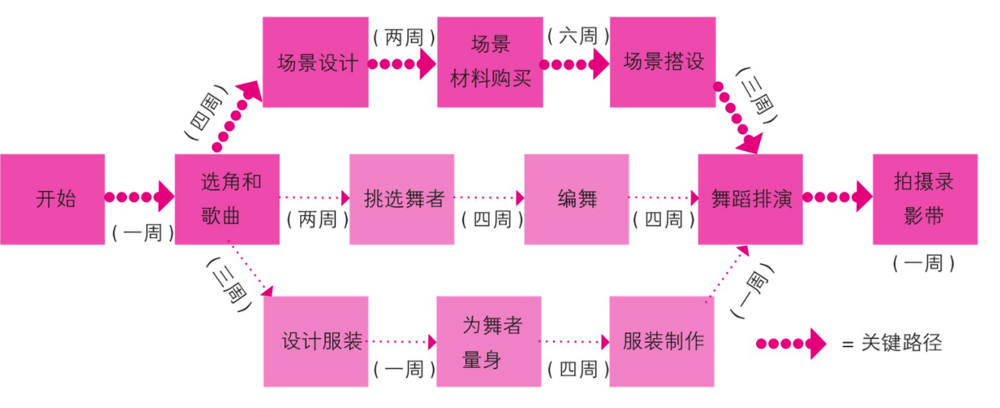

`甘特图（Gantt chart）`是能清楚地显示生产管理者正在进行哪些项目，以及在既定的时间内进展到什么阶段的条形图。图 9.4 显示一家娃娃制造商的甘特图。

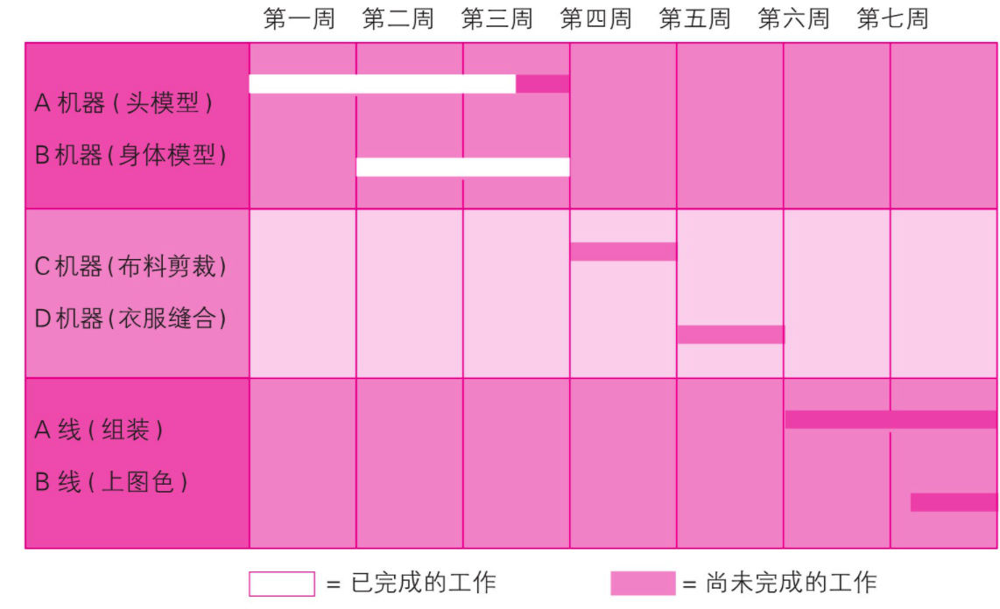

# 员工激励
## 激励的重要性
`内在回报（intrinsic reward）`指当人们表现良好、达成目标时所得到的满足感。人们相信自己的工作对组织或社会有重大的贡献，就是其中一例。`外在回报（extrinsic reward）`则是指表现良好时他人给予的肯定，包括加薪、赞赏与升迁。

### 科学管理之父：弗雷德里克·泰勒
1911 年出版的《科学管理原理》（The Principles of Scientific Management），作者是美国的效率工程师——弗雷德里克·泰勒（Frederick Taylor）。这本书为泰勒赢得“科学管理之父”的头衔。泰勒的目标是提高员工的生产率，使公司和员工双方都获利。泰勒认为要改善生产率，必须对最有效率的做事方法进行“科学化”的研究，找出执行每项任务的“最佳方法”，然后教导人们这些方法。这就是所谓的`科学管理（scientific management）`。泰勒的方式有三大基本要素：时间、方法和工作规则；他最重要的工具是观察和定时器。

泰勒有一个经典故事，他研究用同样的铲子铲稻米、煤、铁矿石。泰勒觉得铲不同的东西需要用不同的铲子，于是他发明了各种大小形状的铲子，然后手拿定时器长期测量产出，这就是所谓的`时间─动作研究（time-motion studies）`——研究完成一项特定工作（job）需要执行哪些任务（task），以及完成每项任务所需的时间。

美国的工程师弗兰克（Frank）和莉莲·吉尔布雷斯（Lillian Gilbreth）运用泰勒的想法，对铺砖工作进行了3年的研究。他们发展出`动作经济原则（principle of motion economy）`，指出每件工作都可以再细分成一连串的基本动作，称为动素（therblig，把 Gilbreth 字母反过来拼，然后调换 t 和 h）。接着，他们会分析每个动作，使其更具效率。

大体而言，科学管理将人视为机器，需要作适当的设定；几乎不考虑员工工作时的心理和人性层面。泰勒认为如果薪资够多，员工的工作效率就会高（换句话说，薪水具有激励效果）。

### 梅奥与霍桑实验
在西屋电气公司（Western Electric）位于伊利诺伊州西塞罗市的霍桑（Hawthorne）工厂进行。该研究始于 1927 年，为期 6 年。

艾尔顿·梅奥（Elton Mayo）和哈佛大学的同学前往霍桑厂测试照明与最优生产率的关系。从这方面来看，它是传统的科学管理研究，主要记录员工在不同照明之下的生产率。结论如下：

- 实验室里的员工认为自己是一个社会团体。工作气氛活泼，可以自由交谈，也固定跟上司与实验者互动。他们觉得自己很特别，所以努力工作想待在这个团体里，因此产生了激励效果。
- 员工能参与实验的规划过程。例如，他们否决了一项计薪方式，而且提出的建议被公司采纳，因此员工觉得自己的想法获得尊重，并且有参与管理决策。这样也产生激励效果。
- 无论外在环境如何，员工喜欢他们特别的工作室，也喜欢提高生产率后能加薪，工作满意度因而大幅提升。

研究者现在用`霍桑效应（Hawthorne effect）`一词，指当人们知道自己是被研究的对象时，表现不一样的倾向。霍桑实验的结果鼓励研究者针对能提高生产率的人员激励与管理风格进行研究。此时，研究的重点从泰勒的科学管理，开始转向梅奥的人性管理。

## 激励和马斯洛的需求层次
`马斯洛的需求层次（Maslow’s hierarchy of needs）`，各需求层次如下：

- 生理需求：基本的生存需求，例如对食物、水、安身之处的需求。
- 安全需求：工作场所和在家安全的需求。
- 社交需求：觉得被爱、被接受、有群体归属感的需求。
- 尊重需求：得到他人肯定和认同的需求，以及自尊、地位或重要感。
- 自我实现需求：完全发挥自我潜能的需求。

当一个需求满足时，另一个更高层级的需求会出现，满足它就可以达到激励的效果，而已经满足的需求不再是激励因素。

## 赫兹伯格的激励因素
心理学家弗雷德里克·赫兹伯格（Frederick Herzberg）在 20 世纪 60 年代中期时所进行的研究。赫兹伯格要员工根据对激励的重要程度，列出各个与工作相关的因素。问卷的题目是：什么会激起员工的工作热情，让他们将潜能发挥到极致？结果显示下列是激励员工的重要因素：

1. 成就感。
2. 获得肯定。
3. 对工作本身有兴趣。
4. 成长的机会。
5. 升迁的机会。
6. 责任的重要性。
7. 同事和组群关系。
8. 工资。
9. 上司的公平性。
10. 公司的政策和规定。
11. 地位。
12. 工作保障。
13. 上司的友善态度。
14. 工作环境。

赫兹伯格的研究结果找到了两种因素。第一种称为`激励因素（motivators）`，能够确实地提高员工的生产率，并为他们带来很大的满足感；这些因素大部分与工作内容有关。赫兹伯格将其他的因素称为`保健因素[hygiene factors，或维持因素（maintenance factors）]`。这些因素大部分与工作环境有关；缺乏保健因素会造成不满，但有这些因素未必能够激励员工。表 10.1 列出了激励因素和保健因素的比较。图 10.2 显示，马斯洛的需求层次和赫兹伯格的双因素理论有很多的相同点。

激励因素 | 保健因素
-----|-----
（这些因素可以用来激励员工。） | （缺乏这些因素可能造成不满，但改变后几乎没有激励效果。）
工作本身 | 公司政策与行政管理
成就 | 监督
肯定 | 工作环境
责任 | 人际关系（同事）
成长与升迁 | 薪水、职衔、工作保障

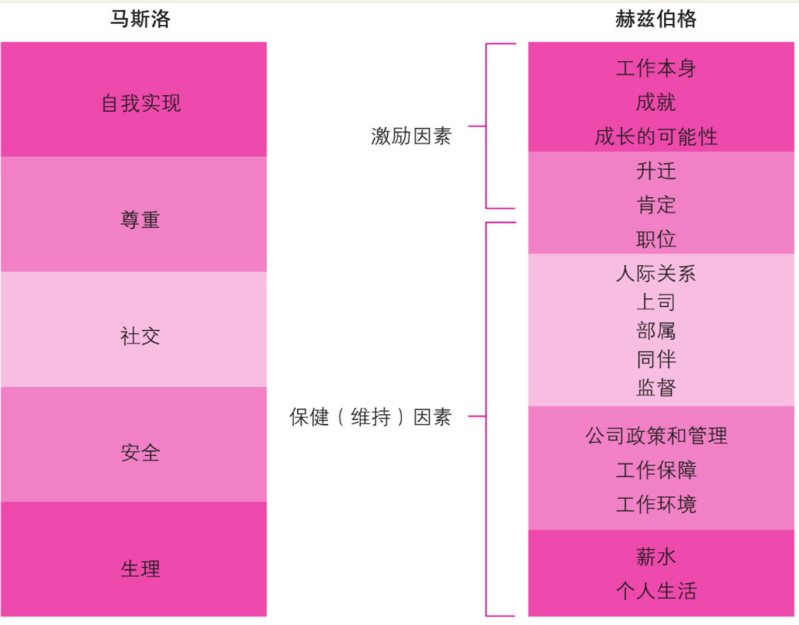

## 麦格雷戈的 X 理论和 Y 理论
管理理论家道格拉斯·麦格雷戈（Douglas McGregor）观察到，管理者的态度一般属于两种截然不同的管理假设中的一个，他称为`X理论`和`Y理论`。

X 理论的管理假设如下：

- 一般人不喜欢工作，会尽可能避免工作。
- 因为人们不喜欢工作，所以必须强迫、控制、指示，或者以处罚威胁员工，才能让他们努力达成组织的目标。
- 一般的员工宁愿听命行事，避免责任，几乎没有抱负，想要有保障。
- 主要的激励因素是恐惧和金钱。

Y 理论对人的假设完全不同：

- 大部分的人喜欢工作，就跟玩乐或休息一样自然。
- 大部分的人都会朝他们所承诺的目标努力。
- 一个人对目标的承诺程度视达成后的报酬而定。
- 在某些情况下，大部分的人不只会被动接受，也会主动负责。
- 人们可以运用高度的想象力、创造力，以及聪明才智解决问题。
- 在职场上，一般人的潜能只发挥了一部分。
- 各种报酬都能发挥激励的效果，每个人在得到奖励（例如休假、金钱、肯定等）时都会被激励。

## 大内的 Z 理论
加州大学洛杉矶分校的管理学教授威廉·大内（William Ouchi）十分好奇日本成功的秘密是否在于管理员工的方式。`日本式管理方式（Japanese management approach；大内称之为 J 型）`包括终身雇用、集体决策、共同负责决策结果、缓慢的评价和升迁制度、隐性的控制机制、非专业化的职业路径，并全方位为员工设想。相反的，`美国式管理方式（American management approach；大内称之为 A 型）`则包括短期雇用、个人决策、个人负责决策结果、快速的评价和升迁制度、明确的控制机制、专业化的职业路径，并且对员工只有部分的关心。

大内推荐一种综合的方法：`Z理论`（参阅图 10.3）。Z 理论混合了 J 型和 A 型的特色，包括长期雇用、集体决策、决策结果由个人负责、缓慢的评价和升迁、适度专业化的生涯，并全面性地为员工设想（含家庭）。这套理论视组织为家庭，培育出合作与组织价值观。

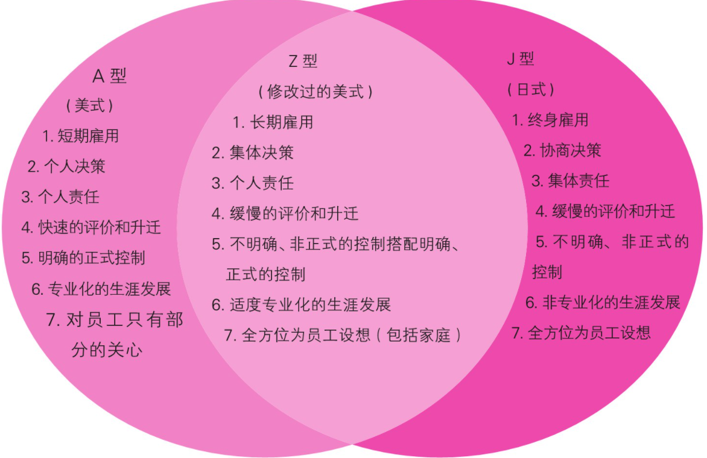

表 10.2 X、Y 与 Z 理论比较

X理论 | Y理论 | Z理论
----|-----|----
员工不喜欢工作，并且会尽量逃避。 | 员工视工作为生活的一部分。 | 员工的参与感是提升生产力的关键。
员工宁愿被控制、被指挥。 | 员工比较愿意接受较少的控制和指挥。 | 对员工的控制不明确、不正式。
员工重视保障，不是责任。 | 在适当的工作条件下，员工愿意主动负责。 | 员工宁愿分享责任和决策。
员工必须敬畏管理者。 | 在不必敬畏管理者的工作环境中，员工会表现较好。 | 员工在充满信任和合作的环境中会表现较好。
以金钱报酬激励员工。 | 对员工的激励，来自各种需求。 | 员工需要有保障的雇用，会接受缓慢的评价和升迁。

## 目标设置理论与目标管理
`目标设置理论（goal-setting theory）`主张制定远大、但可达成的目标，这可以激励员工和改善绩效，前提是这些目标被员工接受，有反馈机制，并且有组织环境配合。

彼得·德鲁克（Peter Drucker）在 20 世纪 60 年代发展出这样的系统。德鲁克认为，“管理者无法激励员工，他们只会阻挠员工，因为人们靠自己激励自己”。他相信管理者只能营造适当的环境让种子成长，因此，他设计出一套系统来帮助员工自我激励。这套系统称为`目标管理（management by objectives, MBO）`，它可经由中高层的管理者、主管与员工反复讨论、检讨和评估目标的制订与执行。目标管理需要管理者与组织内的所有成员共同合作来设定目标，让员工对目标作出承诺，然后监督结果，员工达成目标后予以奖励。

## 满足员工的期望：期望理论
弗鲁姆的`期望理论（expectancy theory）`指出，员工期望可以影响个人激励。因此，员工完成某项任务的努力程度，取决于他们对结果的期望。弗鲁姆认为员工在承诺尽全力完成任务之前会问三个问题：（1）我可以完成任务吗？（2）如果我完成了，有什么报酬？（3）这个报酬值得我努力吗？（请看图 10.4）

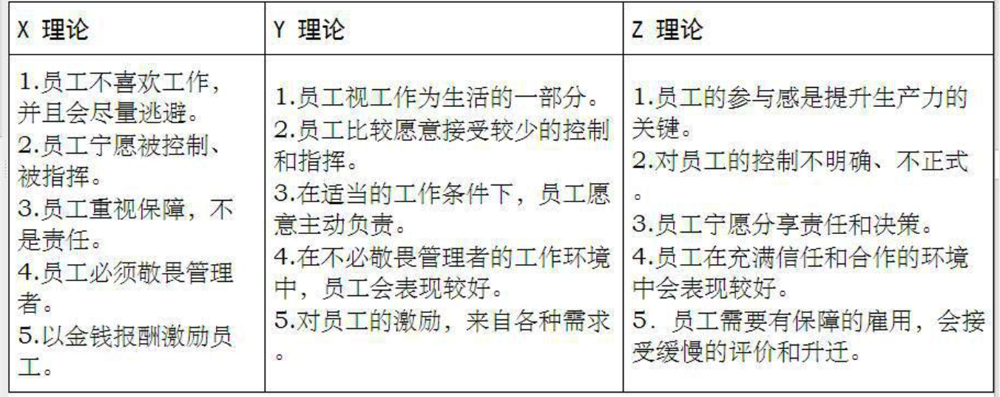

## 强化员工绩效：强化理论
`强化理论（reinforcement theory）`强调正向与负向的强化因素（reinforcers）都能激励人们以特定方式行动。换言之，激励是胡萝卜加大棒的结果。人们会尽量争取被奖励，并且避免被处罚。正向强化是夸奖、肯定与加薪等报酬；负向强化则包括斥责、减薪或解雇、开除。

表 10.3 强化理论

增加/减少 | 增加刺激 | 减少刺激
------|------|-----
增加某行为 | 正向强化：吉尔因按时上交报告（想要增加的目标行为）而受到表扬（加入强化）。 | 负向强化：杰克正处在察看（可被取消的惩罚）阶段直到他能按时上交三篇报告（想要增加的目标行为）。
较少某行为 | 惩罚：杰克因为晚交报告（想要减少的目标行为）被记过了（惩罚）。 | 废止：报告交完了（想要减少的目标行为），无论写得多好，吉尔都不会受到表扬。

## 公平对待员工：公平理论
`公平理论（equity theory）`处理的问题包括：“如果我把工作做得很好，值得吗？”以及“怎样才公平？”这些都在探讨公平的认知，以及这些认知如何影响员工的工作意愿。公平理论的基本原则是：员工在比较职位相当的同事后，会试图保持自己的投入与产出水平和他人相当。

## 将理论付诸行动
### 通过工作丰富化激励
马斯洛和赫兹伯格的理论都可延伸为工作丰富化的理论。`工作丰富化（job enrichment）`是一种强调通过工作本身激励员工的策略。工作指派给个人，让他们有机会从头到尾完成一项明确的任务，为成功完成任务而承担责任。工作丰富化的激励效果主要来自个人成就、挑战和肯定的机会。

提倡工作丰富化的人相信，有五项重要的工作特性会影响个人激励和绩效：

1. 技能多样性：工作所需技能的丰富程度。
2. 任务辨识度：工作成果的可辨识程度。
3. 任务重要性：工作对公司他人的生活和工作所产生的实质影响程度。
4. 自主性：员工在安排工作和决定程序中的自由、独立和自行判断的程度。
5. 反馈：在工作执行上，可获得有关工作绩效的直接、清楚信息的程度。

用来激励员工的另一种工作丰富化方法是`工作扩大化（job enlargement）`，指将一系列的工作整合成更有趣且具挑战性的工作。例如，小家电制造商美太格公司（Maytag）重新设计了洗衣机的生产过程，让员工可以组装整个抽水马达（洗衣机的心脏），而不只是一小部分。`工作轮换（job rotation）`是将员工从某项工作调至其他工作，这也让工作更为有趣、更能激励员工。

### 通过开放式沟通激励
鼓励开放式沟通的程序如下：

- 创造鼓励聆听的组织文化。高层管理者必须创造适于谈话的空间，即使讨论是负面的，也必须让员工知道主管说话算话（可通过提供反馈、采纳员工的建议、奖赏与上级沟通等方式）；必须让员工觉得可以自由表达自己认为适当的观点且建议得到重视。
- 训练主管和管理者聆听。大部分的人都没有接受过这方面的训练，无论是在学校或别的地方，因此组织必须自己进行训练，或者请专家来做。
- 打破妨碍开放式沟通的藩篱。为管理者和员工设立分开的办公室、停车区、洗手间及餐厅等地方，只会在他们之间形成藩篱。其他的藩篱还包括不一样的衣着规定，以及对彼此的称谓（例如，称呼员工时直唤其名，称呼管理者则尊称其姓）。打破这些藩篱可能需要管理者发挥想象力，也需要管理者愿意放弃特权。
- 避免模糊和模棱两可的沟通。被动的表述显得软弱且犹豫不决。像“错误已经铸成”这种陈述会让你想知道谁犯了错。闪烁其词是经理人传递混乱信息的另外一种方式。对于需要更明确指引的员工来说，像“可能”、“或许”这样的词听上去很是空泛。
- 积极促进沟通。摆设大餐桌让组织成员可以一起坐下吃午餐，设置会议室、举办公司远足活动、成立公司球队等作为，都可以让管理者跟员工间彼此融合。
- 询问员工什么对他们是重要的。经理人不能等到离职谈话时再问员工：“我做什么可以留住你？”那就太晚了。相反，你应该经常进行留人面谈，找出对员工重要的事情以及他们能做什么来保全自己的工作。

# 人力资源管理：发现并留住最优秀的员工
## 与人接触只是开始
`人力资源管理（human resource management，HRM）`指确定人力资源需求，然后招聘、筛选、培养、激励、评估、制定薪酬和工作计划，以达成组织目标的过程。

## 影响人力资源管理的相关法规
`平权行动（affirmative action）`是一种通过增加女性及少数族群就业机会以矫正社会现状的设计。平权行动法令的解释导致雇主积极招聘和偏好女性与少数族群成员。法令的解读经常具争议性，导致执法上也面临困难。不过，有关平权行动的合法性和该方案的效果，可能会形成工作场所中某种逆向的歧视。`逆向歧视（reverse discrimination）`被定义为对白人或男性的歧视。

## 决定企业的人力资源需求
人力资源计划的过程有五个步骤：

1. 准备组织中员工的人才库。该人才库应该包括年龄、姓名、教育、能力、培训、特殊技能，以及其他与特定组织相关的数据（例如会说哪些语言）。这些信息能看出员工是否拥有最新技术与受过完整培训等。
2. 准备职位分析。`职位分析（job analysis）`指研究不同职位员工的工作内容。为了招聘和培训具备所需技能的员工，这种职位分析是必要的。职位分析的结果会产生两种书面报告：职位说明书和职位规范。`职位说明书（job description）`旨在描述工作的目标、内容、责任与职务、工作条件，以及与其他职能工作间的关系。`职位规范（job specifications）`指描述从事特定工作的员工所应具备的最低资格条件（教育、技能与经验等）的书面总结。简言之，职位说明书是针对一份“工作”的报告，而职位规范则是对从事这份工作的“人”的报告。
3. 评估未来的人力资源需求。由于科技的快速改变，培训方案必须早在需求出现前就开始进行。有远见的人力资源管理者——也就是在策略规划的过程中，就看出组织未来所需要的人——必须确保未来需要时，会有受过培训的员工可用。
4. 评估未来的供给。人力经常在改变，像是老龄化、更为科技导向、吸引更多女性等等。未来在某些工作上将会有更多的人员短缺（例如，计算机和机器人修理工作者），而其他工作上则会有过剩的情况（例如，生产线的劳工）。
5. 建立战略规划。该规划必须包括人力的招聘、选拔、培训发展、评估、薪酬以及升迁等。由于前四个步骤都是此项的先导，本章会将重点放在这些战略性人力资源计划的要素上。

## 雇用多元化员工
`招聘（recruitment）`指为适时取得足够的适任员工而从事的活动，目的是挑选那些最符合组织需求的人。

## 选拔最具生产率的员工
`选拔（selection）`指在法律规范之下，基于个人与组织的最大利益，搜集信息并决定聘用最合适员工的过程。

## 培训和开发员工使其发挥最大潜能
`导师（mentor）`是一位企业管理者，监督、教导并引导基层的员工，为他们介绍应当认识的人，并且成为他们在组织中的援助者。实际上，在大部分的组织中，较资深的员工经常协助新手员工，这就是一种非正式的导师关系。

## 实施员工绩效评估以获取最大成效
`绩效评估（performance appraisal）`指依据既定标准评估员工绩效的一种评定，借此决定升迁、薪酬、额外培训或解雇。绩效评估包含六个步骤：

1. 建立绩效标准。这是很重要的一个步骤。标准必须是可理解、可以衡量，而且合理的。它们必须能够被管理者和部属双方接受。
2. 传达绩效标准。管理者经常假定员工知道他们应该做些什么，但这样的假定相当危险。员工必须清楚明确地被告知标准和期望是什么，以及该如何达成。
3. 评估绩效。如果前两项步骤都正确做到，绩效评估其实相对简单。其工作就是评估员工的行为，看看是否达到标准。
4. 与员工讨论结果。大部分的人一开始都会犯错，并且无法达到期望。学习一项新工作并把它做好，是需要时间的。讨论员工的成功和需要改进的地方，可以提供管理者表现出善解人意和有帮助等好形象的机会，并且可指引员工做出更佳表现。此外，绩效评估也是员工提出提升工作绩效的良好建议的来源。
5. 采取修正行动。绩效评估的重要步骤之一就是管理者采取修正行动，或提供修正的反馈，帮助员工把工作做得更好。记住，关键词是“绩效”；进行这种考核的主要目的是尽量改善员工的绩效。
6. 使用结果来作决策。有关升职、薪酬、额外培训或是解雇的决策，都是根据绩效评价的结果。有效的绩效评估体系是满足关于这种决策的特定法律条件的方法。

最新的一种绩效评估表称为`360 度考核`。管理者从组织中的各个方面收集反馈，包括那些低于、高于和平级的员工，目的是要精确、全方位地了解员工的能力。

## 支付薪酬：吸引并留住一流人才
许多公司依然使用由爱德华·海（Edward Hay）设计的薪酬制度。这套所谓的海氏系统是一个基于工作层级制定的薪酬计划，每一个层级都有严格的薪资幅度。该系统是根据点基并考虑到三个关键因素而设定的，这三个关键因素是：专门技能、解决问题的能力和责任。

## 安排工作时间以满足组织和员工的需求
`弹性工作时间计划（flextime plan）`是指只要员工的工作时数达到要求，就允许他们自由选择何时工作。最普遍的计划是让员工可以在早上从七点到九点之间来工作，而在下午四点到六点之间下班。一般来说，弹性工作时间计划会结合所谓的核心时间。`核心时间（core time）`指在弹性工作时间计划中，所有员工都必须在工作岗位上的那段时间。

`压缩工作周（compressed workweek）`，大约在 24% 的公司中使用。那表示让员工只要做完每周全部的工时，就可以不必做完标准工作天数。举例来说，一位员工可能一天工作 10 小时，一周工作 4 天，然后享受一个长周末，而非传统的工作 5 天，每天 8 小时并且拥有传统式的周末。

将近 1,000 万名的美国工作者现在至少每个月有几天在家工作。约 12% 的企业依靠`在家办公`。在家办公者可以选择自己的工作时间，中断工作照顾孩子和做其他事，以及出去处理私人事务。不过，在家工作并非适合每个人。一个在家办公者若要成功，必须有纪律，并且能专心于工作，而不轻易分心。

`工作共享（job sharing）`是指两位兼职员工分摊一份全职工作的安排。它适合学生、能够在孩子上学的时候工作的父母和其他想要兼职工作然后完全退休的人。

# 市场营销：帮助买者购买
## 什么是营销
美国营销协会将`营销（marketing）`定义为：为创造、传播、分送和交换对消费者、客户、合伙人和整个社会有价值的商品而进行的活动、制定的一系列制度和流程。我们也可以更简单地考虑营销，将其定义为：买卖双方为了增进彼此的满意而进行的交换活动。

`营销概念（marketing concept）`包括三个部分：

1. 客户导向。找出并满足消费者的需求。（重点在于满足消费者，而非促销。）
2. 服务导向。确定组织内每个人都有相同目标——让客户满意。这必须靠组织群策群力；换言之，无论公司首席执行官或分销人员，都应该以客户为目标。现在这一点是不是很普遍了？
3. 利润导向。聚焦于能为公司赚钱、维持公司生存以及能满足消费者更多的欲望与需要的产品与服务。

`客户关系管理（customer relationship management，CRM）`指尽可能多地了解现有客户，并持续地、尽可能地用产品和服务来满足他们，甚至要超出他们的期望。想法是要加强客户满足度并使其长期忠诚。培养客户关系的最新方式包括社交网站、在线聊天、推特和博客。

## 营销组合
营销人员重要的工作可分为四个要素，为了方便记忆和应用，简称 4P：

1. 产品（product）。
2. 价格（price）。
3. 地点（place）。
4. 促销（promotion）。

它们是完成精心设计的营销规划的四个要素，通常称为`营销组合（marketing mix）`。

`产品（product）`指任何满足欲望或需求的具体商品、服务或构思，外加任何在消费者眼中提升产品的事物，比如品牌名称。

样品可用来测试客户的反应，而针对潜在消费者反应进行产品测试的过程就被称为`试销（test marketing）`。

`品牌名称（brand name）`可以是单词、字母或是单词或字母的组合，以此将某个商家的产品和服务与其他竞争者区分开来。

`促销（promotion）`，亦即告知和刺激人们购买产品或服务的所有技巧，包括广告、人员推销、公共关系、公共报导、口碑（病毒营销），以及各种促销手段（比如优惠券、折扣、样品试用等等）。

## 为营销商提供信息
`营销研究（marketing research）`指分析市场的机会和挑战，找出利于正确决策的信息。

## 营销环境
当营销经理作营销组合决策时，必须了解周遭环境。`环境扫描（environmental scanning）`指发掘可能影响营销成败的关键因素的过程。

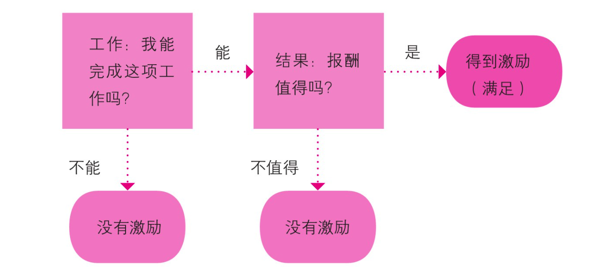

## 两个不同的市场：消费者和企业间
`消费者市场（consumer market）`包括所有以个人消费为目的，想要并有能力购买产品或服务的个人和家庭。`企业间市场［business-to-business（B2B）market］`则包括想要购买产品或服务，然后再加工转卖、出租或供应给其他客户的个人和组织。

## 消费者市场
将一个大市场依群内成员的相同特征分成不同群体的过程，称为`市场细分（market segmentation）`。公司以特殊族群（市场细分）为营销对象来赚取利润，称为`目标营销（target marketing）`。

若是将市场依地理位置来区分（如都市、郊区、州、区域等），则称为`地理细分（geographic segmentation）`。

依年龄、收入、受教育程度区分市场，称为`人口统计细分（demographic segmentation）`，其他人口细分的标准还包括宗教、种族和职业。这是最常使用的细分变量，但并非就是最好的。

你可能希望广告内容可以表现出某一群体的生活方式，那么你可以研究该群体的价值观、态度和兴趣，这种细分策略称为`心理细分（psychographic segmentation）`。

以非常素食餐厅为例，素食主义者希望获得哪种利益？你会强调新鲜、健康、美味，还是其他部分？而决定哪项产品优点较受目标市场欢迎，然后以该项优点进行促销，就是所谓的`利益细分（benefit segmentation）`。

你也可以决定谁是素食的最大消费者。你的餐厅吸引的男性更多还是女性更多？吸引的学生更多还是教职员工更多？你的回头客来自本社区还是上下班的人群？以产品用量来进行市场细分叫`数量或用途细分（volume, or usage segmentation）`。一旦了解了基础客户，你就能设计出更能吸引这些特定人群的促销方案。

`利基营销（niche marketing）`是确定有利可图的小型细分市场，并为它设计或寻找产品的做法。因为可以非常容易地提供没有限制的商品选择，互联网正在将曾经基于热门和畅销的消费文化转变成支持更专业化的利基产品的消费文化。这样的市场细分可以有多小呢？这一点可由 Fridgedoor.com 看出。这家公司在网络上销售冰箱磁贴，它大约有 1,500 种不同类型的磁贴库存，每周能卖出 400 个。

`一对一营销（one-to-one marketing）`是针对个别消费者发展独特的产品和服务组合。旅行社通常会为个别客户开发这样的包装行程，包括机票订位、旅馆预订、租车、餐饮、博物馆入场券，以及其他旅游景点的安排。这在企业间市场相对较为容易，因为客户的需求量很大，但目前在消费者市场，一对一营销也越来越被看好。戴尔计算机就为每一个客户生产独特的计算机系统。

`大众营销（mass marketing）`是发展满足多数人的产品和促销方案，营销人员尽可能将同样的产品卖给众多客人，这表示需要使用电视、广播与报纸等大众传播。

`关系营销（relationship marketing）`倾向于定制化的产品和服务，而不采取大规模生产的方式。关系营销旨在提供确实满足客户需求的产品，以长期留住客户。最新的科技使买卖双方互相合作，辨识出买方的需要并发展他们所需的产品与服务，如手工缝制的衬衫与特别假期。

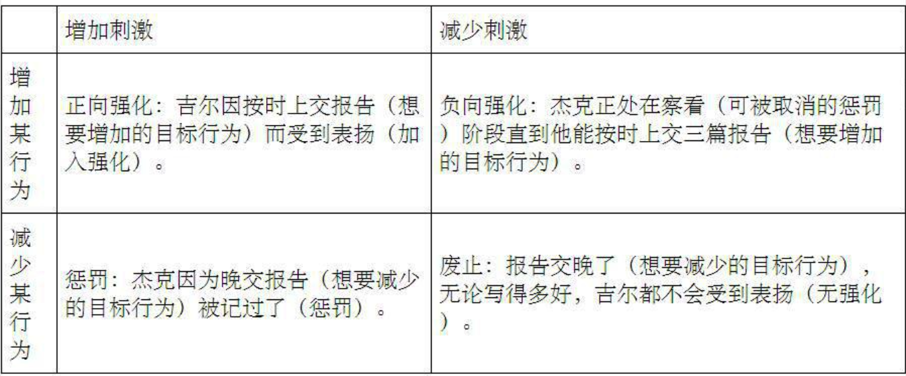

图12.5 消费者决策过程及外在因素

营销研究人员通过研究消费者在购买中的思考过程和行为，来确定帮助消费者购买的最佳营销策略。这个研究领域就是`“消费者行为”（consumer behavior）`。

消费者行为研究员也研究影响消费者行为的不同因素，图 12.5 显示影响消费者购买的几种原因：不同的营销组合变量（4P）；心理因素，如感知和态度；情境因素，如采购形式和周围环境；社会文化因素，如提供参考信息的群体和文化。其他一些因素如下：

- `学习`造成了个人行为的改变，这些改变受先前经验和信息影响。你尝试过某个品牌的洗发精但并不喜欢，你就学会了不再购买。
- `参考群体`作为个人参考的族群特点，包括信仰、态度、价值观与行为。大学生不用后背包而提公文包，可能是因为把商人当作他的参考群体。
- `文化`是社会中一套由上一代传承给下一代的价值观、态度和做事方法。美国文化强调并传承教育、自由和多样性的价值。
- `亚文化`是特定伦理、种族或其他类族群（例如，青少年）共同拥有的一套价值观、态度和做事方法。
- `认知差异`是购买后心理产生的一种冲突。采购重要商品可能怀疑是不是用最优的价格买到最好的产品。因此，营销商必须再次向客户确认他们作了正确的决定。车商可以提供给消费者相关媒体的正面报道，也可以提供品质保证书和一些免费的服务。

## 企业间市场
表 12.3 比较企业间和消费者的购买行为

市场类型 | 市场结构 | 产品 | 购买过程
-----|------|----|-----
企业间市场 | 有限的潜在客户；大量采购；地理集中。 | 科技复杂产品需求较多；客户定制需求较多；通常需要技术指导、配送和售后服务。 | 购买者受过培训；研究讨论价格细节；依循既定标准；正式过程，包含特定员工；营销人员和采购者关系密切；来源多元。
消费者市场 | 很多潜在客户；小量购买；地理分散。 | 科技产品需求较少；客户定制需求一般；偶尔需要技术指导、配送和售后服务。 | 无特殊培训；接受标准模式；使用个人判断力；非正式过程，包含家庭成员；营销人员和采购者非个人关系；来源不多元。

# 商品和服务的开发和定价
## 产品开发和整体产品价值
消费者觉得最有`价值（value）`的产品——质量好且价格公道。

`分布式产品开发（distributed product development）`是指将你创新过程中的不同部分交出去，通常是交给其他国家的公司。

`整体产品价值（total product offer）`是消费者决定是否购买某样东西时要考虑的所有因素。因此，基本的产品或服务可能是洗衣机、保单或啤酒，但整体产品价值还包括图 13.1 中一部分或全部的增值因素。

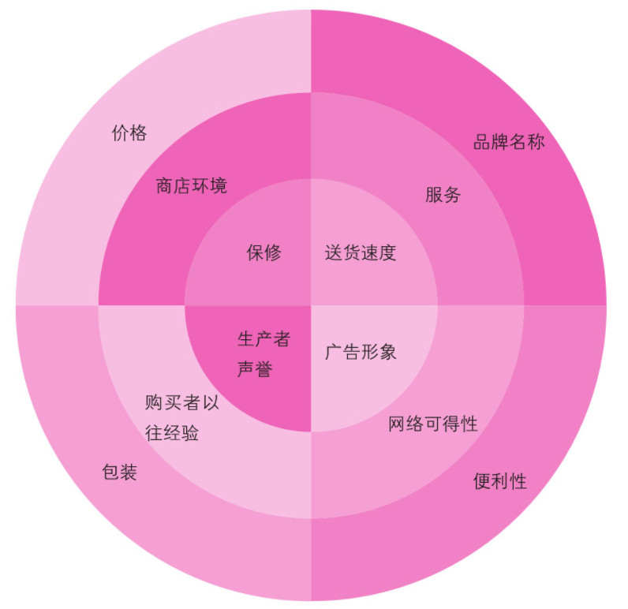

公司通常不会只销售一种产品，`产品线（product line）`指一组物理特征相似，或是拥有相似市场的产品。它们通常会面对相似的竞争。同一条产品线上可能会有几种互相竞争的品牌，例如健怡可乐、代糖健怡可乐、零热量可乐、柠檬健怡可乐、酸橙健怡可乐、香草健怡可乐和樱桃健怡可乐。

宝洁公司在清洁产品线上也有数个品牌，包括汰渍（Tide）、时代（Era）、唐尼（Downy）和波尔德（Bold）。所有的宝洁公司的产品线构成所谓的`产品组合（product mix）`，就是由单一制造商所提供的所有产品线的总和。

## 产品差异化
`产品差异化（product differentiation）`指创造真实或感觉上的产品差异。实际的产品差异有时候相当微小，所以营销商必须使用一些技巧将定价、广告和包装等价值提升因素组合起来，创造一个独特而有吸引力的形象。

一种常用的区分消费品和服务的方法是将其分为四大类：便利、选购、特殊及非渴求。

1. `便利品和服务（convenience goods and services）`指消费者花最少心思选购且经常购买的产品（例如糖果、口香糖、牛奶、零食、汽油、银行服务）。销售最多便利品的商店非 7-11 莫属。地点、品牌知名度和形象对于销售便利品和服务的营销商来说很重要。互联网将这种便利性带到了另一个层次，特别是对银行与其他服务企业而言，企业若是不提供这些服务将会迅速失去市场占有率，除非它们能提供给客户面对面的最佳服务。
1. `选购品和服务（shopping goods and services）`指消费者在比较各卖家在价值、质量、价格和风格的不同之后最终购买的产品。选购品和服务大都会在大型购物中心销售，这样消费者才可以比较成衣、鞋子、家用电器及汽车修护服务等产品。塔基特（Target）销售的大部分是选购品。因为许多消费者会仔细比较产品，营销商便可借机强调价格和质量差异，或是两者在组合方面的优势。
1. `特殊品和服务（specialty goods and services）`指的是有独特的风格特性和品牌识别的产品。由于这些产品被视为无法取代，因此消费者会不计代价购买，例如名贵手表、昂贵的葡萄酒、毛皮大衣、珠宝、进口巧克力或是专业医师和企业咨询顾问提供的服务。
1. `非渴求品和服务（unsought goods and services）`指消费者不会注意、没想过要买的产品，或是可以解决突发问题的产品，例如紧急拖车服务、丧葬服务和保险。

`工业品（industrial goods）`（也称为商业产品或企业间产品）是用来生产其他产品的产品，属于企业间市场。有些产品可以同时被归类为消费品和工业品。

图 13.2 举出一些消费品、工业品及服务的分类。

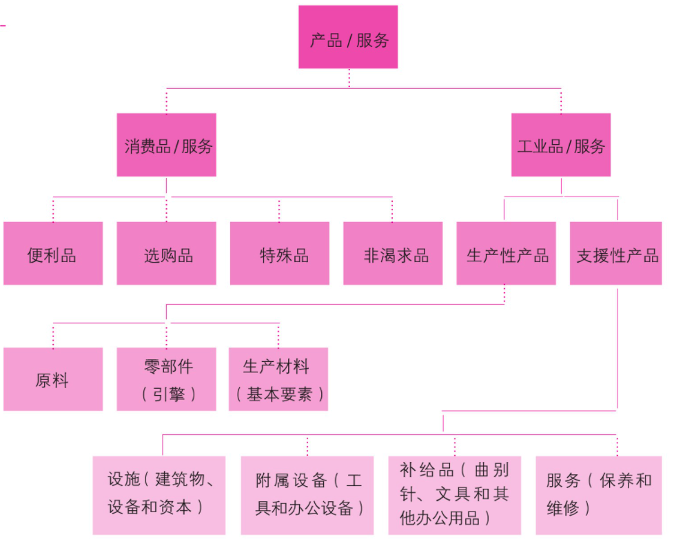

## 包装改变产品
包装必须提供以下的功能：
1. 吸引消费者的注意。
2. 保护里面的产品，在搬运和储藏时要能保持直立，要看起来完好无缺，可以防止偷窃
3. 可轻易打开使用。
4. 描述并提供内容物的信息。
5. 解释产品的好处。
6. 提供产品的保证、警告和其他消费者应该注意的事项。
7. 提供价格、价值及使用方式。

包装可以使用所谓的`捆绑销售（bundling）`的策略，指的是将商品和（或）服务组合起来，并确定一个价格。维珍航空公司（Virgin Airlines）将巴士上门接送服务与飞机上的信息传递捆绑到其整体产品价值中。金融服务机构则提供从理财建议到帮助选购保险、股票、债券、共同基金等服务。

## 品牌和品牌资产
`品牌（brand）`是名称、标志或图案（或上述元素的组合），可用作将某个销售者或一群销售者所提供的产品或服务与其竞争者区别开。

`商标（trademark）`是受法律保护的专有品牌名称或图案设计。

`制造商品牌名称（manufacturers’brand names）`指产品分销全国各地的制造商品牌，像是施乐、柯达、索尼和雪佛兰。

`经销商（私有）品牌［dealer（private-label）brands］`是指产品本身不挂制造商的品牌名称，而是挂批发商或零售商的品牌名称，例如肯摩尔（Kenmore）和蒂哈（Diehard）就是两个由西尔斯（Sears）销售的经销商品牌。这些品牌通常也称为“族品牌”（house brands）或是“分销商品牌”（distributor brands）。

`非品牌产品（generic goods）`是相较于全国性产品或私人品牌，通常采取量贩折扣方式销售的无品牌产品，使用基本的包装而且几乎不用广告。

`仿冒品牌（knockoff brands）`是违法复制全国知名品牌的产品。

营销商未来的一个主要目标就是建立品牌资产的概念。`品牌资产（brand equity）`是品牌名称及其相关形象的价值。品牌资产的核心是品牌忠诚度。`品牌忠诚度（brand loyalty）`指消费者对某一品牌的满意和喜爱程度，以及承诺进一步购买的态度。

`品牌认知（brand awareness）`指当提起某类产品时，某一品牌名称呈现在脑海中的速度或容易程度。广告可以帮助企业建立强有力的品牌认知，像可口可乐和百事可乐这类已确立的品牌通常是品牌认知度最高的。

一个公司所使用的名称、符号和标语，可以大大地增加公司产品的品牌认同度。`品牌联想（brand association）`是将某个品牌和其他适合的形象联结起来，如著名的产品使用者、受欢迎的名人、特定的地方。注意奔驰是如何将汽车和名流的奢华生活联系在一起的。

`品牌经理[brand manager，有些公司称“产品经理”（product manager）]`是直接对一个品牌或一条产品线负责的经理。这些责任包括所有营销组合的要素：产品、价格、地点和促销。

## 新产品开发过程
新产品开发过程包括六个阶段:

1. 构思想法
2. 产品筛选
   1. `产品筛选（product screening）`是剔除不具可行性的新产品创意的过程，这样公司可以聚焦于最有可能的方案。筛选的标准包括新产品和现有产品能否相适应、产品的获利能力、畅销度以及对个人的要求。这些要素都有各自的比重，最后会算出一个总分，根据这个总分来比较候选产品。
3. 产品分析
   1. `产品分析（product analysis）`是产品筛选的下一阶段，主要是进行成本预估与销售预测，以估算新产品创意的获利能力。不符合现有标准的产品不会被考虑。
4. 开发
5. 测试
   1. `概念测试（concept testing）`是将有创意的产品呈现给消费者，借此测试他们的反应。他们看到这个新产品的好处了吗？他们多久会买一次？价格怎么样？哪些特点是他们喜欢或不喜欢的？他们会提出进行哪些改变？企业会测试不同包装、品牌和成份的样品，直到产品同时满足生产和营销的需求。
6. 商品化
   1. `商品化（commercialization）`是指：（1）对批发商和零售商进行促销以获得广泛地分销；（2）通过强势的广告与销售活动，持续引起批发商和消费者的高度兴趣。新的商品现在可以通过互联网和社交媒体商品化，以更快的速度推广到全球市场；网页可以让消费者看到新产品、提出问题，同时让购买变得方便而迅速。

## 产品生命周期
`产品生命周期（product life cycle）`：引入期、成长期、成熟期和衰退期。

表 13.1 产品生命周期内采取的策略范例

