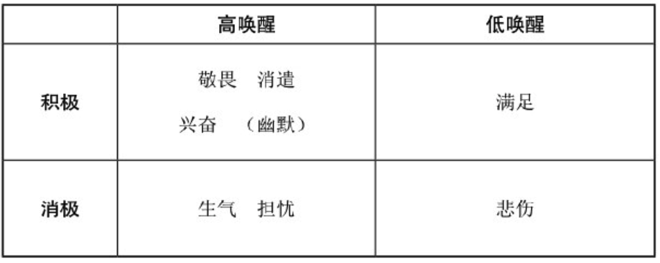
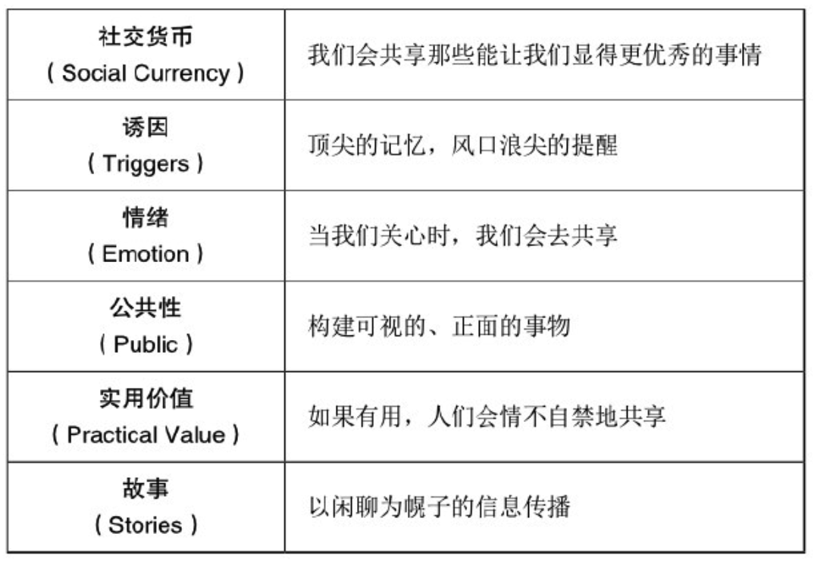
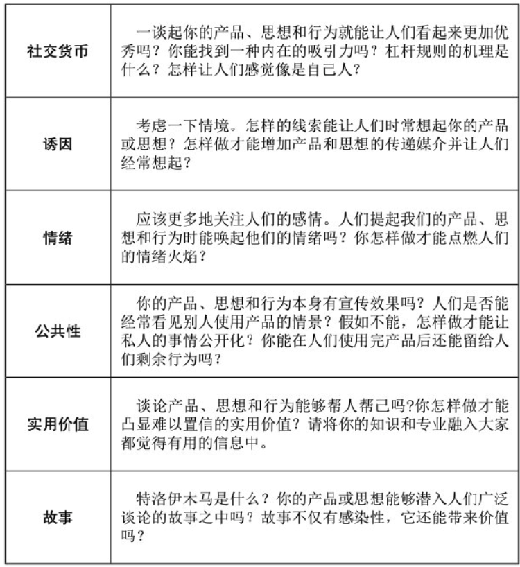

    作者: 乔纳·伯杰 (Jonah Berger) 
    出版社: 电子工业出版社
    副标题: 让你的产品、思想、行为像病毒一样入侵
    原作名: Contagious: Why Things Catch On
    译者: 刘生敏 / 廖建桥 
    出版年: 2014-1-1
    页数: 242
    定价: CNY 48.00
    装帧: 平装
    ISBN: 9787121210204

[豆瓣链接](https://book.douban.com/subject/25804890/)

- [感染力的六个原则](#感染力的六个原则)
- [第一章 社交货币](#第一章-社交货币)
  - [铸造一种新形式的货币](#铸造一种新形式的货币)
  - [内在吸引力](#内在吸引力)
  - [杠杆原理](#杠杆原理)
  - [游戏竞赛](#游戏竞赛)
  - [使人们感觉像自己人](#使人们感觉像自己人)
  - [动机](#动机)
  - [请不要外传？很好，是的。或许你一个人知道，足矣](#请不要外传很好是的或许你一个人知道足矣)
- [第二章 诱因](#第二章-诱因)
  - [代理人的传播声](#代理人的传播声)
  - [为什么人们更加喜欢谈论某些特定的产品](#为什么人们更加喜欢谈论某些特定的产品)
  - [临时口碑传播与持续口碑传播之间的行为差异](#临时口碑传播与持续口碑传播之间的行为差异)
  - [从玛氏巧克力条到选举：如何诱导人们的情感行为](#从玛氏巧克力条到选举如何诱导人们的情感行为)
  - [诱导谈话](#诱导谈话)
  - [奇巧巧克力和咖啡：发展的栖息地](#奇巧巧克力和咖啡发展的栖息地)
  - [有效诱因是怎样炼成的](#有效诱因是怎样炼成的)
  - [考虑口碑传播情境](#考虑口碑传播情境)
- [第三章 情绪](#第三章-情绪)
  - [最热门邮件列表及共享的重要性](#最热门邮件列表及共享的重要性)
  - [对最热门邮件链接的系统分析](#对最热门邮件链接的系统分析)
  - [敬畏的力量](#敬畏的力量)
  - [任何情感都能激发共享行为吗](#任何情感都能激发共享行为吗)
  - [圣火燃剂：生理唤醒的科学](#圣火燃剂生理唤醒的科学)
  - [聚焦于情感](#聚焦于情感)
  - [点燃高唤醒的情绪之火](#点燃高唤醒的情绪之火)
  - [婴儿背带，抵制并抑制不良口碑](#婴儿背带抵制并抑制不良口碑)
- [第四章 公共性](#第四章-公共性)
  - [可视性的能量](#可视性的能量)
- [第五章 实用价值](#第五章-实用价值)
  - [交易心理学](#交易心理学)
  - [增加惊喜的价值](#增加惊喜的价值)
- [第六章 故事](#第六章-故事)
  - [血液里流传的故事](#血液里流传的故事)
  - [故事的作用](#故事的作用)
  - [使传播更有价值](#使传播更有价值)
- [结束语](#结束语)

## 感染力的六个原则
我们将这些促使大众谈论、分享和模仿的原则分解成六个关键阶段，英文缩写为STEPPS。

- 原则一：社交货币（Social Currency）
- 原则二：诱因（Triggers）
- 原则三：情绪（Emotion）
- 原则四：公共性（Public）
- 原则五：实用价值（Practical Value）
- 原则六：故事（Stories）

## 第一章 社交货币
### 铸造一种新形式的货币
研究的确发现，超过40%的人谈论的话题都体现着他们的个人经验和私人关系。类似的，近乎一半的传言是以自我为中心的，这包括人们正在完成的或者正发生在他身边的事情。

我们实际上能够清楚地发现，这种谈论有比较积极的一面。哈佛大学神经科学家简森·米歇尔和戴安娜·塔米尔发现，自由表达和披露信息对自己本身就是一种内在的奖励。

总体来说，人们甚至愿意为分享自己的观点放弃25%以上的实验奖金。相对于什么也不做的被试者来说，**人们更倾向于分享自己的思想和观点，向身边的人表达自己的喜好。**

人们都倾向于选择标志性的身份信号作为判断身份的最直接的依据。

人们喜欢共享一些能使他们非常愉快而不是令他们厌烦的事情，使他们看起来更机智而不是更愚蠢的事情，使他们显得更加精明而不是更加愚钝的事情。

口碑传播主要是为了保持人们对自己的良好印象，正像新轿车和普拉达的包包给人们带来的震撼一样，那些都只是一种普通的社交货币而已。就像人们使用货币能够买到商品或服务一样，使用社交货币能够获得家人、朋友和同事的更多好评和更积极的印象。

公司和组织需要铸造怎样的社交货币才能被人们谈论呢？如果产品和思想能使人们看起来更优秀、更潇洒、更爽朗，那这些产品和思想自然会变成社交货币，被人们大肆谈论，以达到畅销的效果。我们应该通过三种方式来完成社交货币的铸造：
1. 发掘标志性的内心世界；
2. 撬动游戏杠杆；
3. 使人们有自然天成、身临其境的归属感。

### 内在吸引力
非常规之事被认为是一种超乎想象并引人注目的事件。因为事件本身的新奇、惊异与刺激，能发人深省，所以它非凡卓越。不过大部分非凡事件的确具备内在吸引力，因此能够引人注目。

毫无疑问，卓越非凡的事情能够引起人们更频繁的关注。

开发非凡吸引力的关键是，要让事情看起来更加有趣、新奇和生动。

一种令人产生惊讶的方式就是打破常规，提出有悖于人们思维定式的产品、思想或服务。

### 杠杆原理
所以我们可以得出一个结论，人们倾向于关注某些打破人们思维定式的事情。因此，我实际上花了更多的钱去购买相应的航班，就是因为我特别在意航班的特权服务。

游戏是通过人际社会比较来完成对玩家的刺激的。

游戏的本质就是帮我们挣得比别人更优越的社交货币。因为玩游戏让我们看起来比别人更加聪明和睿智。人们喜欢鼓吹自己，过分炫耀自己的才能和已完成的任务，比如他们如何克服打高尔夫的困难或者他们的小孩如何取得托福高分，多少人会传颂他们的英雄事迹或者关于他们小孩的聪慧过人。

设计一个高质量的游戏

杠杆原理要求我们放大绩效。在某些领域，如高尔夫障碍赛和托福考试就是一种标准的杠杆。人们非常容易观察到自己的成绩，不费吹灰之力就可以看到自己比别人多获得的分数和成绩。不过，产品和思想本身不会显示出这样的特性，需要通过游戏才能将其特性清晰地显示出来。我们需要创造一种度量标志，让人们知道并记录自己所达到的成绩。举例而言，图标就是人们用来反映他们为社区委员会做贡献的度量标志。社区委员会根据这个贡献量来制作不同颜色的季卡，回馈给相应的居民。

### 游戏竞赛
给予别人奖励实际上也是遵从相似的原则。奖励性的菜谱给人们提供了一个向朋友炫耀自己超凡厨技的机会。通过宣传厨艺会给他们带来内在的心理奖励。

口碑也可以来源于自身的投票选择过程。在流行趋势投票中获得优胜的诱惑可以促使选手们向朋友大肆宣传，以获得更多支持。不过人们的宣传和拉票行为，从客观上宣传了公司的产品和思想，并自发地支持了相应的品牌。与公司的直接宣传不同，他们可以让宣传者在比赛中有获胜的成就感。

### 使人们感觉像自己人
当费奇曼正努力地想办法解决SmartBargains的销售困境时，他领悟出生意的第一要义，那就是将网站做成产品的最佳交易场所。精明的购物者俱乐部允许人们签约成为相关会员，以减少购物费用，并可进入私人购物区域购物。他们在这个区域所购买的商品是不会被其他人看见的。虽然这是很小的一块区域，但它能让销售额急速增加。

这个案例让我们领会了源于法国的私人销售渠道。每天的在线限时抢购都是畅通的，费奇曼决定利用这样的渠道去建立一个完美的商务营销模式。

那就是鲁拉拉的落地运营，它精巧地改变了一些关键要素，将一些时间要素引入其中。每天都会发生这样的事情，11点的时候会有一波新交易截止。一旦错过这个时间，即使是超出几分钟，也会给顾客带来双倍支付的困扰。所以在如此紧迫的时间里，所有商品一售而空。这样就让顾客深深地明白，如果错过了机会，将付出巨大的代价才能买到商品。

成为网站的会员可以让消费者对网站有一种归属感，感觉自己属于这里，是网站的自己人。人们只要成为网站的会员，就会得到网站令人满意的服务与支持。

稀缺性是由能够提供的物品数量决定的。稀缺的商品很难获得，这是由制造的高要求、有限的产量和消费者在时空上的严格限制等因素决定的。

专用性指的是在不同方式和渠道中的可用性。专用性的商品仅仅提供给某些达到特殊标准的顾客。

因为稀缺性和专用性增加了人们的满足感，所以能促进产品的流行与推广。假如某些商品难以购买，就会引起顾客的注意，人们会相信这个商品值得购买。假如某些服务不能使用，或者销售一空，人们会推测其他人也肯定很喜欢这种服务，所以这些服务是非常好的（我们将在第四章更多地讨论这个问题）。

稀缺性和专用性让人们感觉有归属感，故而激发了人们口口相传的欲望。假如某人得到了别人买不到的产品，他会觉得这个产品格外珍贵、新奇并且具有很高的市场价值。因为顾客不仅喜欢产品或服务本身，而且会将此信息转告给其他人。为什么呢？因为告诉其他人拥有这个产品能增加他的社会价值，让他看起来更加优秀、更加新潮、更加让人羡慕。拥有内部身份是一种社交货币。当人们排着长长的队伍，最终购买到一种新款高科技产品时，却因为你是内部会员，所以能优先购买，并能将此过程展示给他人，让他们看到你是多么尊贵与独特。

### 动机
正像社交货币一样，社交刺激从长期来看是更加有效的传播方式。Foursquare并没有给光临酒吧且消费的顾客支付费用，航空公司也没有给常坐飞机的乘客任何金钱折扣。不过，通过有效地调动人们向他人炫耀的欲望，那些顾客就会愿意为你做任何事情，这当然也包括免费口碑传播，从而让你的产品和思想迅速疯传。

### 请不要外传？很好，是的。或许你一个人知道，足矣
“请不要外传”酒吧实际上制造了一种循环模式，让人们有炫耀自己的动机，并传递给别人，让他人也产生炫耀的动机，并不断传递，形成流传相关信息的广泛延续。这家酒吧的主人是非常精明的，顾客可能明白互相鼓吹社交货币的秘密，但他们非常享受由这种社交货币所带来的满足，所以无法停止自己的口碑传播。在购买了一瓶饮料之后，有一位服务员会赠送给你一张小小的商务卡，然后像巫师的巫术一样，卡片全部变黑。在未变黑的红色印记上简单地显示着“请不要外传”酒吧的名字和电话号码。所以当所有的线索都显示酒吧老板很想保守这个秘密时，从以往经验上看，实际上这样设计卡片从客观上增加了顾客对酒吧名字和电话号码的记忆。用这样的方式能让你更有效地分享“秘密”，当然这种秘密实际上也是你想宣传的。

## 第二章 诱因
### 代理人的传播声
多年以来，公司想宣传一个产品，需要整合至少由80万个口碑经纪公司构成的宣传网络，经过他们的宣传，人们才可能有兴趣去了解这些产品，并努力地去试用。口碑经纪公司的代理人跨度很大，任何年龄、收入和职业的人都可以胜任。大部分代理人一般在18~54岁之间，并且受过良好的教育，有一定的经济收入。教师、家庭主妇、专业工作人员、博士，甚至是首席执行官，都可以是市场代理人。

### 为什么人们更加喜欢谈论某些特定的产品
正如我们在“社交货币”那一章所谈到的那样，当我们对其他人讲话时，我们不仅仅是想传达某种交流信息，而且想传播与自己相关的某些信息。当我们为一部大片感到震撼或者为角落上的泰国餐馆感到失望时，我们正在表达着自己的传统文化、烹调知识和口味偏好。因为我们想让别人觉得自己非常有趣，所以会告诉别人很多有趣的信息。毕竟，当某人经常向朋友谈论肥皂剧和谷物早餐时，有人会邀请他参加鸡尾酒舞会吗？

### 临时口碑传播与持续口碑传播之间的行为差异
我们已经很细致地研究了到底是什么因素会促进口碑传播行为：是否更加有趣、更加新奇或刺激的产品会引起更多的口碑传播。

需要进一步说明的是，某些口碑传播行为只是短暂的、临时的，而另一些口碑传播行为却是持续性的，甚至是永久的。假设你收到了一封关于新型垃圾回收的电子邮件，你会主动与你的朋友分享吗？或者只是在周末的时候仅跟你的爱人提一下此事？假如是这样，你就在进行临时的口碑传播。它只会发生在你刚刚接触到一种新鲜的事物，并且这个事物正在发生的时候，而你只会简单地宣传对此事物的细节体验。

相比之下，持续性的口碑传播行为会在很长一段时间内持续，至少几周，有时甚至几个月或者更长的时间。比如，你会谈论上个月观看的经典电影或者会谈到去年的度假之旅。

正如前文所预料的那样，有趣而新奇的产品会比令人乏味的产品得到更多的临时口碑传播。这更加印证了我们在“社交货币”那一章所提到的观点：如果事情具备一定的娱乐性，谈论它的人就会通过口碑传播这些内容而获得别人的肯定。

不过，有趣的产品并不能维持高水平的持续的口碑传播。换句话说，有趣的产品并不一定比乏味的产品的口碑传播时间更长。

### 从玛氏巧克力条到选举：如何诱导人们的情感行为
周围的环境刺激也能让你的思想引发热议。假如你在公园散步时，突然遇到了一只高飞狗，这也许会燃起你养狗的欲望。假如你经过一家面馆，店内飘出的面香味可能会促使你一尝中国美食，也许你就会临时坐在那家餐馆吃个午餐或晚餐。又或者你随意听到了一则可口可乐的广告，让你想起家里的苏打水在上周就已喝完。视觉、味觉、听觉都会诱导你的思想和想法，让它们变成流行的话题。闷热的天气可能会激起你改变室温的想法。旅行杂志上呈现的海滩可能会激发你喝科罗娜啤酒的渴望。

**产品的使用频率是个非常强大的诱因**。大部分人喝奶多过喝葡萄汁，所以奶是一个更加重要的谈论话题。

回顾一下1997年的夏天，糖果公司玛氏注意到了他们在巧克力条上的销量惊人，这种惊人的业绩是公司始料未及的。因为玛氏公司并没有改变市场定位，也没有进行任何的广告宣传，更没有改变产品的卖价，甚至连一丁点促销活动都没有，所以这样的成绩着实让人大跌眼镜。销售额为何会以如此惊人的速度上升？到底是什么导致了这一局面？

那时恰逢美国宇航局成立，它是专门进行宇航任务的政府部门。他们的任务就是从邻近的行星上收集大气、气候和土壤的相关信息。他们消耗了数年的时间筹备，并花费了数万美元去完成这一任务。当一位宇航员最终登陆在这个外星星球上时，全世界都为之疯狂，所有媒体与新闻头版头条都在报道宇航工作的胜利完成。他们成功到达的目的地就是火星，而玛氏公司的名字与英文里的火星（Mars）正好是同一个词。

当播放法国音乐时，大部分人都购买了法国红酒。当播放德国音乐的时候，大部分人都购买了德国红酒。通过激活消费者对不同国家的联想，音乐影响了销售。因为音乐使得他们的国家思想更易被人们所理解，那些容易理解的思想触发了人们的相应行为。

不同的投票区域当然有不同的诱因。教堂充斥着基督教的图像，提醒着人们基督教的教义和精神。学校布满了很多的储物柜、课桌和黑板，提醒着人们回想起小孩或早年的教育经验。一旦这些思想被激活，他们可能改变原来的投票初衷。在教堂里的选民会把选票转投向反对堕胎和同性恋婚姻的政客吗？在学校里的选民会把票更多地投向支持教育事业的政客吗？

### 诱导谈话
回头看看口碑经纪公司的数据，诱因帮我们回答了为什么某些产品能够得到更多的口碑传播。更频繁地诱导产品能够增加至少15%的口碑传播行为。

在每天空闲时，人们常常会使用润肤露，也经常会在就餐后，用密封塑料袋仔细地包裹厨余垃圾。这些日常行为促进了这些产品的被关注度，并引发人们的讨论，以致流行。

诱因之所以越来越重要，是因为在一定的刺激过后，人们才会产生后续行为。

### 奇巧巧克力和咖啡：发展的栖息地
她仔细地观察了人们吃奇巧巧克力的时机，最后发现了两件事情：其一，消费者吃奇巧巧克力仅仅是为了休息；其二，他们吃奇巧巧克力时，常常会搭配一些热饮。这时，科琳有了新的宣传办法。

科琳要让奇巧巧克力与咖啡一起销售。科琳用了数月时间去宣传这个组合的概念，将其描述为“休闲最佳伴侣”。电台大力鼓吹着这种特色组合，精致的糖果与一杯热咖啡相伴，突然，有人抢走了咖啡，去询问奇巧巧克力的下落。有时，有人抢走了奇巧巧克力，去询问咖啡的下落。总之，不管是通过咖啡找奇巧巧克力，还是通过奇巧巧克力找咖啡，电台广告都在不断地宣传着两者之间的联系。

这种宣传的效果非常火爆。截至当年年底，奇巧的销售额上升了8%。12个月以后，销售额又增加了30%。奇巧巧克力和咖啡组合的概念让奇巧重新回到了市场的版图之上。随后这个市场价值原本停留在3亿美元的品牌，由于这种重新包装而成功复苏，让其市场价值飙升到5亿美元。

我们继续做了个实验，让一些人用六周的时间去接触一个餐厅与晚餐的配对广告。“你想吃晚餐吗？考虑一下波士顿市场吧！”另一部分人接受类似的餐厅广告，但广告的内容要空泛一点，只有吃饭与餐厅的空泛宣传。“你想找地方吃个饭吗？请考虑一下波士顿市场吧！”这样，我们就能够检测出哪一种广告标语更让人记忆深刻，并且能够流传开来。

效果是非常显著的。相对于比较空泛的信息宣传，明确了晚餐与就餐地点的信息让顾客多增加了20%的传播率，因为以前在这里吃饭的顾客只知道波士顿市场这个餐厅品牌跟午餐有关，所以如果再跟晚餐联系起来，那么会直接激发人们对此品牌的注意。因此，开发品牌的栖息环境能够大幅地刺激人们的口碑传播行为。

### 有效诱因是怎样炼成的
诱因能够导致产品和思想被疯狂传播，不过什么样的刺激物会是更好的诱因呢？换句话说，一个有效的诱因的判断标准是什么？据我们的讨论可知，一个关键的判断因素是激活的频率，也就是说，刺激物能够多么频繁地在人们的日常生活中出现。热巧克力也可能和奇巧巧克力一样完美搭配，其他甜品饮料也能够和巧克力条相搭配，但是咖啡是更加有效的诱因，因为人们经常接触它，而且咖啡比其他产品更频繁被见到。大部分人只在冬天喝热巧克力，但咖啡是全年都喝的饮品。

然而，刺激的频繁性要与刺激的强度相配合才会有更好的效果。给顾客的线索越多，连接的强度就会越弱。这特别像在纸杯底部刺孔让水流出一样，刺的孔越少，水流出得就越急。孔越多，水流的压力就会减弱。刺太多的孔只会得到涓涓细流。

诱因之所以发挥作用是因为它依仗了这个原理。举个例子，红色代表着众多事务，玫瑰、爱、可口可乐、跑车等一系列事物都可以与红色相联系。这种泛滥指向的后果是，这种颜色无法激活任何特定的产品或思想。

### 考虑口碑传播情境
口碑传播中首要强调当时的周边环境：试着回想一下人们在回忆某种思想和产品时，在他们的周围都会有不同程度的诱因。不同的环境包含着不同的刺激物。

100美元的芝士牛肉三明治之所以能在街头巷尾被人们广为传播，在很大程度上是因为它的生产地点在牛肉三明治盛行的城市。100美元的牛肉三明治在那个城市的确是非常抢眼的。不过，人们并不是因为产品本身的高质量而被激活，而是因为它的生产地——费城，这个牛肉三明治盛行的城市。一到这个城市，人们就自然地想起了牛肉三明治。而在别的城市，比如芝加哥，就无法起到相同的激活效果。

一项研究表明，诱因会因为所处的时期不同而有所差别。举例而言，而在万圣节前夕，人们喜欢把橙色的东西联想为橙子汽水或里斯巧克力。而在万圣节过后，这种连接效果就变得不再明显。在万圣节前夕，所有橙色的东西，比如南瓜、橙子，都可以作为环境刺激物来诱发人们对橙色产品的向往。不过一旦节日结束，这种激活效果就会消失殆尽。

## 第三章 情绪
说到底，人们关注并传播格雷迪文章的理由是情绪共鸣。因为人们关心它，所以共享它。

### 最热门邮件列表及共享的重要性
人是有社会性的，需要与同伴共享与交流。正如我们在“社交货币”那一章所讨论的那样，人们喜欢与他人共享自己的观点和信息。那么我们的闲聊，无论是正面的还是负面的，都会形成自己与朋友、同事之间的关联。

### 对最热门邮件链接的系统分析
两个理由可以解释人们为什么会共享信息，那就是兴趣和实用性 。正如在“社交货币”那一章所讨论的那样，有趣的事情可以使大众愉悦，并且可以增加人们的共享意愿。类似的，在“实用价值”那一章也可以看到，共享有用的信息可以在帮助他人的同时，让共享者在此过程中显得高尚。

正如我们所预料的那样，两种特征都影响了人们的共享行为；更加有趣的文章比无趣的文章在流行电子邮件链接上的显示次数多25%；相对有用的文章比无用的文章多出了30%的流行点击率。

### 敬畏的力量
根据心理学家达契尔·克特纳和乔纳森·海特的报告，我们可以知道，当某些人领略了伟大的知识、瑰丽的风景、庄严的盛况或者雄壮的力量后，敬畏是一种发自他们内心的惊奇与震撼，这种意识体现为自我超越的伟大体验。

### 任何情感都能激发共享行为吗
答案非常明确：积极的文章比消极的文章更加受到人们的青睐，共享次数也更高。像“纽约城坠入爱河的新人们”这样积极的新闻就比像“明星动物管理员之死”这种消极的新闻更受欢迎，也更多地占据了流行新闻排行榜的前列位置。

最终，我们非常有信心地理解了情绪的传播原理，即成功地探明了情绪与传播间的关系。似乎我们可以初步认为，人们更加偏爱传播积极的信息，而回避共享消极的信息。

令人担忧和生气的文章完全占据了公众新闻点击率的前列，越是让人生气和担忧的话题，越能引起公众的注意。

所以，现在我们的确为此感到困惑了。很明显，文章是否带有积极或者消极情绪并不能完全决定流行趋势。那么，怎样的信息能够被广泛流传，流传过程中还有哪些驱动因素呢？

### 圣火燃剂：生理唤醒的科学
唤醒是被激活并准备随时待命的状态。此时，你的心脏跳动加速，血流加快。生理唤醒可以帮助大脑激活人类的生理功能，调动自己的各个器官，并在遇到危险时及时反应。这种激活唤醒功能仍然在我们的日常生活中起着极其重要的作用。任何事情，只要能激活我们，形成生理唤醒状态，我们的行为就会被触动。比如我们背着双手踱来踱去，或对着空气挥拳，在卧室里跑来跑去。总之，只要我们在生理上被唤醒和激活，行为之火就会被点燃。

像生气与担忧这样的情绪就具备较高的唤醒性。当我们非常生气的时候，会大声地对客户服务代表吼叫，以发泄自己的愤怒情绪。当我们担心自己的付款是否准确时，我们会一遍又一遍地检查自己的账单。当然，积极的情绪也具备唤醒性。比如，兴奋的情绪就有这样的效果。当某件事情让人们感到兴奋时，他们会迫不及待地抢着去完成。敬畏的情绪同样有类似的效果。当我们为苏珊大妈惊人的天籁之音所震撼时，我们会急切地想与任何人共享自己的快乐与惊讶。

然而，并不是所有的情绪都有唤醒效果，有些情绪甚至有抑制行为的反效果。悲伤的情绪就是这么一种反效果情绪。当你正在处理一件让你痛心疾首的生意时，或者正面对挚爱宠物的离别时，忧伤的你如何还有心情和精力去做其他事，哀莫大于心死，悲伤的情绪更多地让你泄气和沮丧，并无法投入精力去工作。当你穿着厚厚的保暖衣，蜷曲着身体，安逸地躺在沙发上，并安心自在地吃着那碗冰淇淋时，这种安逸与满足的确让人丧失斗志。

只要理解了唤醒原理，我们就可以重新整合以前研究过的情绪维度。像敬畏的情绪一样，生气和担忧的情绪会增加人们的共享行为，而这正是因为它们能高度唤醒人们的情绪，它们能点燃并激活人们行为的情绪之火，让人们心甘情愿地传播与之相关的信息。

### 聚焦于情感
不应该喋喋不休地去宣传产品和相关内容，而应该更多地想办法引起消费者的情感投入。我们更需要关心消费者的感觉——一种潜在的、能够影响行为的情感。

某些产品和思想让人感到合适，而不是被别人引发情绪。比如，一则建立新时尚休息厅的消息总比后勤管理的消息更令人兴奋。类似的，宠物和小孩看起来总比政府和银行财务报告更加引人注目，更易产生情感共鸣。

### 点燃高唤醒的情绪之火
简单地把一些有唤醒作用的情绪元素加入到故事或广告中，就能激发人们的共享意愿。在一项实验中，我们将生气的情绪元素融入某个故事中。在另一项实验中，我们将一些娱乐的元素融入一则广告中。两个实验的结果却是相同的。更多的生气元素或更多的幽默元素融入的确能够增加人们的共享次数。将这些高唤醒的情绪融入故事或者广告中，也确实能够激活相关信息的传递过程。

消极的情绪也能够激发人们的谈论和共享行为。

在2001年的市场宣传活动中，宝马就用这样的消极情绪成功地点燃了人们的传播之火。这个德国汽车公司拍摄了众多像“The Hire”（《宝马汽车广告精选》）这样的网络宣传短片。很多汽车公司都积极地宣传着人们驾车行驶在广阔的康庄大道上，宝马公司却另辟蹊径，在宣传短片中加入了绑架的故事情节、联邦调查局的突袭，以及随时面临死亡威胁的体验等高危险因素。然而，这种让人害怕与担忧的场景却为宝马公司带来了更多的关注度，这远胜于任何直接宣传带来的效果。这段宣传视频具备如此高的唤醒性，也是如此鼓舞人心，以至于在短短四个月内被人们点击了1100多万次。宝马的销量也同步增长了12%。

### 婴儿背带，抵制并抑制不良口碑
我们至少可以从生理唤醒原理中得到部分答案。某种具备高唤醒色彩的消极情绪可以激发人们的口碑传播行为，甚至让与这些情绪相关的消息流传于世。由令人愤慨的劣质顾客服务编制而成的长篇故事，或者与公共健康息息相关的揪心谣传，都能从此原理中找到答案。而悲伤或者让人失望的内容表达由于不具备前者的高唤醒性，所以会在口碑传播世界中消失殆尽。

## 第四章 公共性
### 可视性的能量
可视性也刺激了人们的购买决策，并加速了相应的口碑传播行为。正如我们在“诱因”那一章讨论的那样，环境线索不仅激活了口碑传播行为，而且也时常提醒着人们需要买的物品和需要做的事情。你可能已经享受过你朋友推荐的健康食物或者浏览了一下他们推荐的网站。如果没有可视的诱因重新开启你的记忆，你很可能会忘记这些推荐内容。产品或者服务的公共可视性越强，它们对人们行为的激活程度也就越高。

所以我们需要像Hotmail和Intel一样，设计出能够自我宣传的产品。我们需要像露露柠檬和耐克的黄腕带一样，创造行为剩余，即使在人们使用完产品或对我们的思想不再狂热后还能留下有关这些事物的明显遗迹。我们还需要让私人的事物公开化。如果某些事情生来就是为了展示，那么就让它持续地向人们展示吧。

## 第五章 实用价值
你可以把共享实用价值看成提供有用的建议。人们经常会讨论谁提出的退休计划最好，哪位政客的平衡预算能力最强，哪一种药品能够治愈风寒，哪一种蔬菜有最多的维生素B。想想上次你需要搜集和筛选大量的信息才能做决定的场景吧。你可能至少问了一个朋友该怎么办，也许他给你提供了什么实用的建议或给你发来某个网页让你参考。

因此，只要让事物具备某种实用价值，就足以带来传播效应。

### 交易心理学
降价敏感性反映了这样的思想，即相同的价格变化在更大的价格参照上有更小的影响。假如你正坐在办公室里购买福利彩票，你本没有想过会中奖，但即使是10美元的收益也会让你喜出望外，回味无穷。

降低敏感性能够帮助我们解释人们为什么会更加愿意在时钟收音机上那么抠门。因为时钟收音机太便宜了，所以从35美元降到25美元的折扣看起来更有吸引力。不过，即使电视机也有10美元的折扣，但这个折扣相对于如此昂贵的电视机来说就没有什么吸引力了。

### 增加惊喜的价值
正如前景理论所描述的那样，增加惊喜价值的关键因素之一是人们的预期状态。促销者提供的信息在超过人们的预期时，才更有可能被人们共享。这是因为一旦实际的交易超过了预期，比如打了一个难以置信的折扣，或者因为交易的方式看起来有大幅的优惠，就会让人们更愿意共享这些信息。

## 第六章 故事
### 血液里流传的故事
故事能够传递思想，一个教训或者一个寓意，一则信息或者一个结论。

### 故事的作用
故事中栩栩如生的描写和让人着迷的时尚情怀，快速而便捷地向人们提供了大量的商家信息。一个很好的故事甚至不需要做任何的商品促销就可以吸引众多的注意和顾客们年复一年的持续消费。故事既节省了时间，也节省了精力，以人们最容易记住的方式向人们提供了他们最需要的信息。

相对于广告，人们很少会排斥故事。

### 使传播更有价值
因此，宣传者应该建立一个有社交货币的、激活的、富含情绪的、公共的、有实用价值的特洛伊木马，还不要忘记把你最想传播的信息融入其中，确保你要传播的信息牢牢地镶嵌在人们谈论的故事之中，这样才能被人们广泛地传递开来。

## 结束语
为什么人们会疯狂地传递这些产品、思想和行为呢？这要归因于以下几个方面。

假如你想使用这些框架和思路，这里有个清单可以显示产品、思想和行为如何贯彻STEPPS这六条原则。

