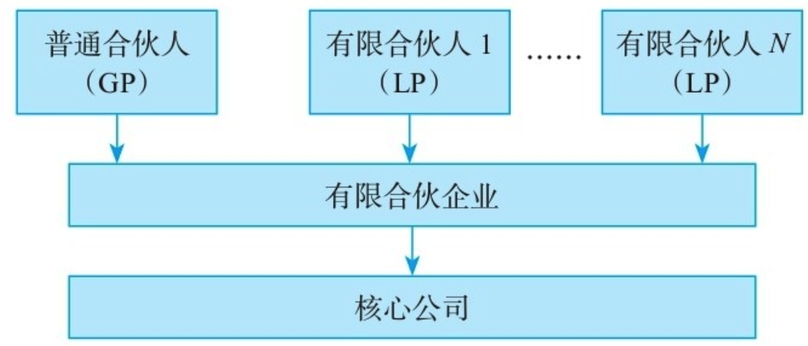
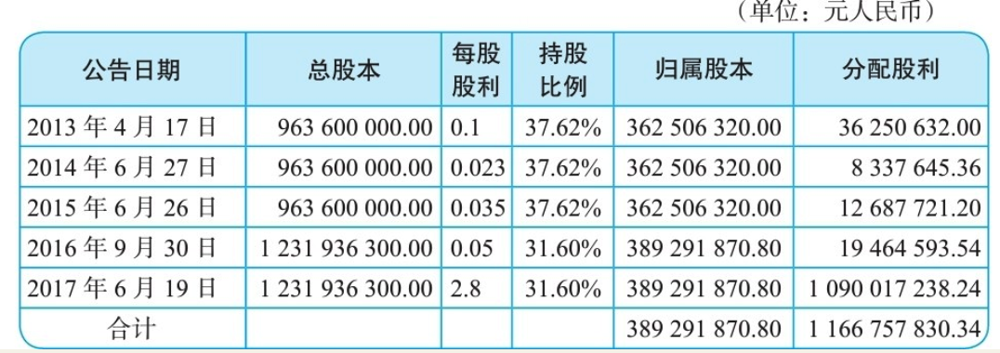
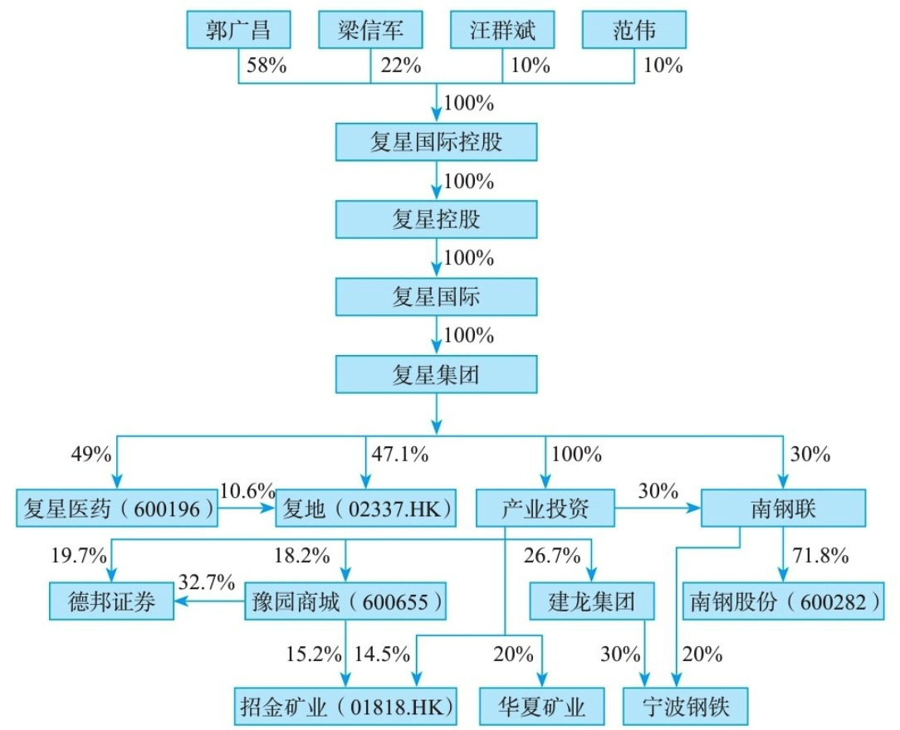

    作者: 李利威
    出版社: 机械工业出版社
    出版年: 2019-5-1
    页数: 396
    定价: 79.00元
    装帧: 平装
    ISBN: 9787111623687

[豆瓣链接](https://book.douban.com/subject/33413106/)

- [第一部分 顶层架构](#%e7%ac%ac%e4%b8%80%e9%83%a8%e5%88%86-%e9%a1%b6%e5%b1%82%e6%9e%b6%e6%9e%84)
  - [第1章 解码24个核心持股比](#%e7%ac%ac1%e7%ab%a0-%e8%a7%a3%e7%a0%8124%e4%b8%aa%e6%a0%b8%e5%bf%83%e6%8c%81%e8%82%a1%e6%af%94)
    - [1.1 有限公司](#11-%e6%9c%89%e9%99%90%e5%85%ac%e5%8f%b8)
    - [1.2 非公众股份公司](#12-%e9%9d%9e%e5%85%ac%e4%bc%97%e8%82%a1%e4%bb%bd%e5%85%ac%e5%8f%b8)
    - [1.3 新三板公司](#13-%e6%96%b0%e4%b8%89%e6%9d%bf%e5%85%ac%e5%8f%b8)
    - [1.4 上市公司](#14-%e4%b8%8a%e5%b8%82%e5%85%ac%e5%8f%b8)
  - [第2章 分股不分权的7种方法](#%e7%ac%ac2%e7%ab%a0-%e5%88%86%e8%82%a1%e4%b8%8d%e5%88%86%e6%9d%83%e7%9a%847%e7%a7%8d%e6%96%b9%e6%b3%95)
    - [2.1 有限合伙企业](#21-%e6%9c%89%e9%99%90%e5%90%88%e4%bc%99%e4%bc%81%e4%b8%9a)
      - [2.1.1 有限合伙企业简介](#211-%e6%9c%89%e9%99%90%e5%90%88%e4%bc%99%e4%bc%81%e4%b8%9a%e7%ae%80%e4%bb%8b)
      - [2.1.2 案例1 海康威视](#212-%e6%a1%88%e4%be%8b1-%e6%b5%b7%e5%ba%b7%e5%a8%81%e8%a7%86)
        - [1.上市前股权架构](#1%e4%b8%8a%e5%b8%82%e5%89%8d%e8%82%a1%e6%9d%83%e6%9e%b6%e6%9e%84)
        - [2.痛不欲生的减持](#2%e7%97%9b%e4%b8%8d%e6%ac%b2%e7%94%9f%e7%9a%84%e5%87%8f%e6%8c%81)
        - [3.最终的解决之道](#3%e6%9c%80%e7%bb%88%e7%9a%84%e8%a7%a3%e5%86%b3%e4%b9%8b%e9%81%93)
      - [2.1.3 有限合伙企业妙用](#213-%e6%9c%89%e9%99%90%e5%90%88%e4%bc%99%e4%bc%81%e4%b8%9a%e5%a6%99%e7%94%a8)
        - [1.纳税上的节税效应](#1%e7%ba%b3%e7%a8%8e%e4%b8%8a%e7%9a%84%e8%8a%82%e7%a8%8e%e6%95%88%e5%ba%94)
        - [2.治理结构钱权分离](#2%e6%b2%bb%e7%90%86%e7%bb%93%e6%9e%84%e9%92%b1%e6%9d%83%e5%88%86%e7%a6%bb)
    - [2.2 金字塔架构](#22-%e9%87%91%e5%ad%97%e5%a1%94%e6%9e%b6%e6%9e%84)
      - [2.2.1 金字塔架构简介](#221-%e9%87%91%e5%ad%97%e5%a1%94%e6%9e%b6%e6%9e%84%e7%ae%80%e4%bb%8b)
      - [2.2.2 金字塔架构启发](#222-%e9%87%91%e5%ad%97%e5%a1%94%e6%9e%b6%e6%9e%84%e5%90%af%e5%8f%91)
        - [1.股权杠杆以小博大](#1%e8%82%a1%e6%9d%83%e6%9d%a0%e6%9d%86%e4%bb%a5%e5%b0%8f%e5%8d%9a%e5%a4%a7)
        - [2.纳税筹划效应](#2%e7%ba%b3%e7%a8%8e%e7%ad%b9%e5%88%92%e6%95%88%e5%ba%94)
        - [3.便利债权融资](#3%e4%be%bf%e5%88%a9%e5%80%ba%e6%9d%83%e8%9e%8d%e8%b5%84)
        - [4.方便人事安排](#4%e6%96%b9%e4%be%bf%e4%ba%ba%e4%ba%8b%e5%ae%89%e6%8e%92)
        - [5.控股公司单独上市](#5%e6%8e%a7%e8%82%a1%e5%85%ac%e5%8f%b8%e5%8d%95%e7%8b%ac%e4%b8%8a%e5%b8%82)
        - [6.上市后的市值管理](#6%e4%b8%8a%e5%b8%82%e5%90%8e%e7%9a%84%e5%b8%82%e5%80%bc%e7%ae%a1%e7%90%86)
      - [2.2.3 两种股权架构比较](#223-%e4%b8%a4%e7%a7%8d%e8%82%a1%e6%9d%83%e6%9e%b6%e6%9e%84%e6%af%94%e8%be%83)

# 第一部分 顶层架构
## 第1章 解码24个核心持股比
将公司分成4类：`有限公司`、`非公众股份公司`、`新三板公司`和`上市公司`。

### 1.1 有限公司
有限公司兼具“人合”和“资合”两种属性。有限公司人合属性体现在：股东是基于股东间的信任而集合在一起，股东间的关系较为紧密；股东人数有上限，不超过50人；《中华人民共和国公司法》（以下简称《公司法》）赋予股东通过公司章程设计治理规则的空间很大；股东对外转让股权有一定的限制。一言蔽之，有限公司的股东结构更具有闭合性的特点。

表1-1　有限公司股东持股比例含义

我们称34%的持股比例为`股东捣蛋线`。如果你作为股东无法达到51%的持股比例，至少应该争取34%的持股比例，因为这个持股比例使股东至少拥有7项捣蛋的权利：修改公司章程、增加注册资本、减少注册资本、公司合并、公司分立、公司解散、变更公司形式。

>《公司法》第四十三条　股东会会议作出修改公司章程、增加或者减少注册资本的决议，以及公司合并、分立、解散或者变更公司形式的决议，必须经代表三分之二以上表决权的股东通过。

即使拥有51%的持股比例，但未达到67%，除非《公司章程》另有约定，有7个事项是无法独立决策的，分别为修改公司章程、增加注册资本、减少注册资本、公司合并、公司分立、公司解散、变更公司形式。

>《公司法》第二百一十六条　本法下列用语的含义：……
>
>（二）控股股东，是指其出资额占有限责任公司资本总额百分之五十以上或者其持有的股份占股份有限公司股本总额百分之五十以上的股东；出资额或者持有股份的比例虽然不足百分之五十，但依其出资额或者持有的股份所享有的表决权已足以对股东会、股东大会的决议产生重大影响的股东。……

### 1.2 非公众股份公司
股份公司的股份转让没有限制。当有限公司改制为股份公司后，标志着公司将由闭合型股权结构迈入开放型股权结构。

表1-2　非公众股份公司股东持股比例含义

### 1.3 新三板公司
新三板，即全国中小企业股份转让系统，是经国务院批准设立的全国性证券交易场所。股份公司在新三板挂牌后，股东可以通过做市转让方式和集合竞价转让方式将股票转让给合格投资者。

表1-3　新三板公司股东持股比例含义表

### 1.4 上市公司
上市公司的股票流动性要远远好于新三板公司。

表1-4　上市公司股东持股比例含义

## 第2章 分股不分权的7种方法
### 2.1 有限合伙企业
#### 2.1.1 有限合伙企业简介
在合伙企业中，普通合伙人（GP）对合伙企业债务承担无限连带责任，有限合伙人（LP）则对合伙企业之债务承担有限责任。在有限合伙企业中，股东不是直接持股拟设立的核心公司，而是先由股东搭建有限合伙企业作为持股平台，再由持股平台间接持有核心公司。典型的有限合伙架构如图2-2所示。

#### 2.1.2 案例1 海康威视
##### 1.上市前股权架构
甲方案为自然人直接持股，即激励对象直接持股海康威视。乙方案为自然人间接持股，即激励对象先注册成立一家持股公司，再以持股公司持股海康威视。

甲方案很快被创始人股东否决。根据《公司法》的规定，一旦有限公司改制为股份公司，每股股本将拥有同样的表决权。自然人持股方案意味着，这51个自然人不仅拥有海康威视股份的财产权，也将拥有海康威视股份的表决权。

为了方便股权集中管理，海康威视选择了乙方案，先后成立了杭州康普投资有限公司（以下简称“康普投资”）和杭州威讯投资管理有限公司（以下简称“威讯投资”）作为51名自然人的持股平台，让自然人通过两家持股公司间接持有海康威视的股份。

2010年海康威视成功登陆中小板。其上市前的股权结构如图2-4所示。

图2-4 海康威视上市前股权架构图

##### 2.痛不欲生的减持
由于当初采取了自然人→持股公司→上市公司的间接架构，未来减持套现的税负为40%，即持股公司出售海康威视股票所得交25%的企业所得税，75%的税后利润分红给员工时还需代扣代缴20%的个人所得税（75%×20%=15%税负）！如此沉重的税负，是海康威视员工无法承受之痛！怎么办？

##### 3.最终的解决之道
翻开海康威视2011年的年报，我们看到“股本变动及股东情况”一章中有如下一段文字：“公司股东杭州威讯投资管理有限公司已于2011年6月迁往新疆乌鲁木齐市，并变更为新疆威讯投资管理有限合伙企业。”“公司股东杭州康普投资有限公司已于2011年6月迁往新疆乌鲁木齐市（以下简称‘乌市’），并变更为新疆康普投资有限合伙企业。”

#### 2.1.3 有限合伙企业妙用
##### 1.纳税上的节税效应
根据《合伙企业法》的规定，合伙企业属于税收透明体，该层面并不征收所得税，经营收益直接穿透合伙企业流入合伙人账户，仅由合伙人缴纳一次所得税。在新疆，自然人合伙人的适用税率为20%。而且自然人合伙人在纳税后，当地政府会给予地方留成部分60%～80%的财政返还。

表2-1　不同持股主体减持税负比较表

1. （2.61+2.79）×25%=1.35（亿元）
2. 非纳税义务人，税负为零。
3. （2.61+2.79）×（1-25%）×20%=0.81（亿元）
4. （2.61+2.79）×20%=1.08（亿元）

以上计算中，我们尚未考虑新疆给予的财政返还，如果以个人所得税地方留成返还60%为例，员工的实际税负可能只有8 208万元。

##### 2.治理结构钱权分离
对于企业家而言，拥有股权中的话语权往往重要于拥有股权中的财产权。有限合伙企业恰好可以实现企业家心中理想的“钱权分离”。与《公司法》相比《合伙企业法》，赋予了合伙人设计机制极大的灵活性，无论是利益分配机制还是合伙人的权力分配机制，都可以在合伙协议中自由约定。合伙企业中的有限合伙，更是依据合伙人对外承担责任的类型，分成普通合伙人和有限合伙人。普通合伙人可以为创始人大股东，承担合伙企业的无限连带责任，享有合伙企业决议的全部表决权，但不分配财产权，即只要“权”，不要“钱”；有限合伙人为高管员工，不享有合伙企业的表决权，但未来可以享受合伙企业对外投资的财产收益权，即只要“钱”，不要“权”。这样的治理结构为在乎“权”者与在意“钱”者之间的合作提供了浑然天成的平台。

### 2.2 金字塔架构
#### 2.2.1 金字塔架构简介
金字塔股权架构是指公司实际控制人通过间接持股形成一个金字塔式的控制链，从而实现对该公司的控制。在这种方式中，公司控制权人控制第一层公司，第一层公司再控制第二层公司，依此类推，通过多个层次的公司控制链条取得对目标公司的最终控制权。金字塔架构是一种形象的说法，就是多层级、多链条的集团控制结构。

【例2-3】

王老板想注册成立一家天狗有限公司，注册资本100万元。如果王老板想拥有天狗公司51%的控制权，王老板需出资多少钱？一般人的回答是出资51万元。但如果采用金字塔架构，王老板仅需6.76万元便可以获得天狗公司的控制权。具体设计如图2-5所示。

图2-5 天狗公司的金字塔架构图

通过金字塔结构设计，王老板的出资只有6.76万元（现金流权），但通过几层纵向间接控股，最终拥有了对天狗公司51%的话语权（控制权）。

#### 2.2.2 金字塔架构启发
在创始人股东和拟上市公司中间搭建控股公司，即自然人→控股公司→拟上市公司，具有以下6个优点。

##### 1.股权杠杆以小博大
【例2-5】

我们来看长江润发（002435），图2-7是该公司上市前的股权架构图。

图2-7 长江润发上市前的股权架构图

公司控股股东为长江润发集团有限公司，实际控制人为郁全和、郁霞秋、邱其琴、黄忠和4位自然人。其中，郁霞秋为郁全和之女，邱其琴为郁全和之堂侄女婿，黄忠和为郁全和之妻侄，以下我们将4位自然人简称为郁氏家族。如果郁氏家族直接持股长江润发，则持股比仅为18.54%（=52.34%×35.42%）。但通过长江润发集团控股平台集中了另外对长江润发16.88%（=47.66%×35.42%）的控制权，从而只用18.54%的现金流权取得了35.42%的控制权。该架构使得郁氏家族获得了股权杠杆，用少量资金撬动了更大的控制权。

##### 2.纳税筹划效应
【例2-6】

让我们来看一个案例，图2-8为桐昆股份（601233）上市前的股权架构图。

图2-8 桐昆集团上市前的股权架构图

该公司实际控制人陈士良通过桐昆控股间接持股桐昆集团。截至2017年年底，桐昆集团上市后分别进行5次分红，桐昆控股取得股息红利超过11亿元（具体计算见表2-2）。

表2-2　桐昆控股取得分配的现金股利计算表

根据《中华人民共和国企业所得税法》（以下简称《企业所得税法》）的规定，桐昆控股取得的股息红利免征企业所得税。桐昆控股在取得上述股息红利后，又进行了新的投资，先后投资了辽宁嘉成石化有限公司、安徽佑顺新材料有限公司、大连汇昆新材料有限公司、浙江佑丰新材料股份有限公司第4家公司。如果陈士良在当初设计股权架构时，采用自然人→拟上市公司的架构，即使陈士良等人取得的分红用于再投资新公司时，也需缴纳2.3亿元的个人所得税。

##### 3.便利债权融资
上市公司（或拟上市公司）上面设立控股公司，一方面，由于控股公司可以合并上市公司报表及其他产业的报表，有些控股公司资金实力强于上市公司，受到银行认可的程度较高。控股公司在上市公司银行借款、发行债券等过程中，提供相应的担保，提高上市公司债项的信用等级，降低融资成本；另一方面，控股公司可以在达到一定资产规模之后，以发行企业债等方式获得资金，开展一些不宜在上市公司（拟上市公司）内部开展的业务。

##### 4.方便人事安排
很多公司在上市时，创业元老长期跟随实际控制人，为将公司做大做强并能够实现上市做出了巨大贡献。但是上市成功之后，有些元老因为持有上市公司股票，拥有了巨额财富，丧失了事业激情，且知识结构老化，学习动力不足，已无法顺应上市公司的进一步发展，出现了躺在功劳簿上睡大觉的现象。实际控制人碍于情面又不能将他们赶走，导致上市后为公司发展做出了巨大牺牲，且一直很有想法、很有干劲的中层骨干的晋升通道被堵死了。如果在上市公司上面设有控股公司，将冲劲不足、愿意躺在功劳簿上的老管理层升至控股公司担任相应的虚职，腾出相应的职位空间给下面的中层干部，这样就既照顾了老管理层的情绪，又保证了新管理层的活力，同时打开了公司整体的晋升通道。这在目前以人治为主的公司管理中非常重要。

##### 5.控股公司单独上市
如果控股公司实力发展到一定程度，也可以单独在港股上市。

【例2-7】

2007年7月6日，旗下已拥有5家A股上市公司的复星国际在香港主板以红筹方式上市成功。复星国际完成在香港上市，不仅为集团的境外融资打通了一个新渠道，还提升了复星在国际上的影响力。郭广昌等股东也具有了境内和境外财富管理及资本运作的双通道。

图2-9 复兴国际上市前的股权架构图

##### 6.上市后的市值管理
公司上市后，会通过减持、并购、定增、分红、资产注入、控股权转让等资本运作进行市值管理。一方面，设立控股公司可以随时准备承接上市公司的非优质资产和暂时在培育期的项目，待时机成熟后单独上市或以定向增发方式注入上市公司。例如，华润集团的“孵化模式”，便是由上市公司或战略业务单元挑选合适的项目，由集团购入项目并进行孵化，再注入上市公司。另一方面，设立控股公司可以为集团公司的现在和未来发展协调各种战略资源，安排不宜在上市公司层面安排的利益。

#### 2.2.3 两种股权架构比较