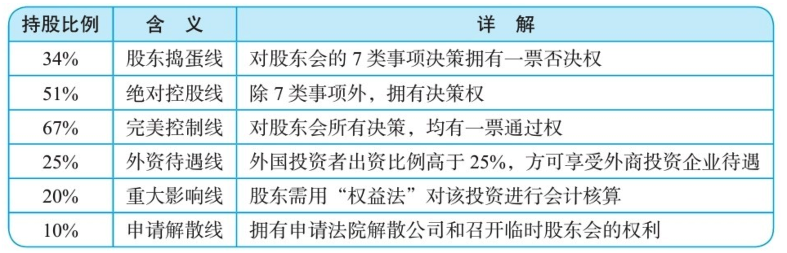
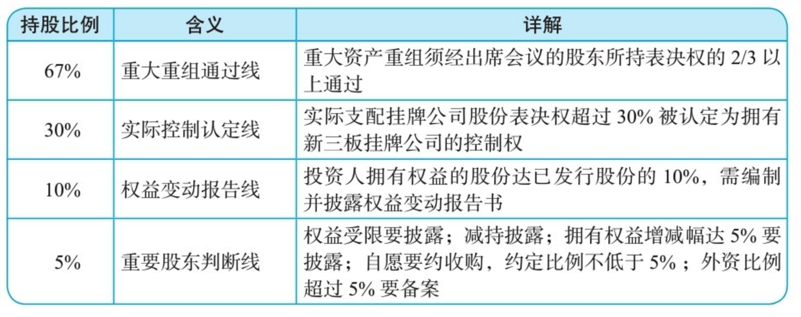

    作者: 李利威
    出版社: 机械工业出版社
    出版年: 2019-5-1
    页数: 396
    定价: 79.00元
    装帧: 平装
    ISBN: 9787111623687

[豆瓣链接](https://book.douban.com/subject/33413106/)

## 第一部分 顶层架构
### 第1章 解码24个核心持股比
将公司分成4类：`有限公司`、`非公众股份公司`、`新三板公司`和`上市公司`。

#### 1.1　有限公司
有限公司兼具“人合”和“资合”两种属性。有限公司人合属性体现在：股东是基于股东间的信任而集合在一起，股东间的关系较为紧密；股东人数有上限，不超过50人；《中华人民共和国公司法》（以下简称《公司法》）赋予股东通过公司章程设计治理规则的空间很大；股东对外转让股权有一定的限制。一言蔽之，有限公司的股东结构更具有闭合性的特点。

表1-1　有限公司股东持股比例含义

我们称34%的持股比例为`股东捣蛋线`。如果你作为股东无法达到51%的持股比例，至少应该争取34%的持股比例，因为这个持股比例使股东至少拥有7项捣蛋的权利：修改公司章程、增加注册资本、减少注册资本、公司合并、公司分立、公司解散、变更公司形式。

>《公司法》第四十三条　股东会会议作出修改公司章程、增加或者减少注册资本的决议，以及公司合并、分立、解散或者变更公司形式的决议，必须经代表三分之二以上表决权的股东通过。

即使拥有51%的持股比例，但未达到67%，除非《公司章程》另有约定，有7个事项是无法独立决策的，分别为修改公司章程、增加注册资本、减少注册资本、公司合并、公司分立、公司解散、变更公司形式。

>《公司法》第二百一十六条　本法下列用语的含义：……
>
>（二）控股股东，是指其出资额占有限责任公司资本总额百分之五十以上或者其持有的股份占股份有限公司股本总额百分之五十以上的股东；出资额或者持有股份的比例虽然不足百分之五十，但依其出资额或者持有的股份所享有的表决权已足以对股东会、股东大会的决议产生重大影响的股东。……

#### 1.2 非公众股份公司
股份公司的股份转让没有限制。当有限公司改制为股份公司后，标志着公司将由闭合型股权结构迈入开放型股权结构。

表1-2　非公众股份公司股东持股比例含义

#### 1.3 新三板公司
新三板，即全国中小企业股份转让系统，是经国务院批准设立的全国性证券交易场所。股份公司在新三板挂牌后，股东可以通过做市转让方式和集合竞价转让方式将股票转让给合格投资者。

表1-3　新三板公司股东持股比例含义表

### 1.4 上市公司
上市公司的股票流动性要远远好于新三板公司。

表1-4　上市公司股东持股比例含义

## 第2章 分股不分权的7种方法

