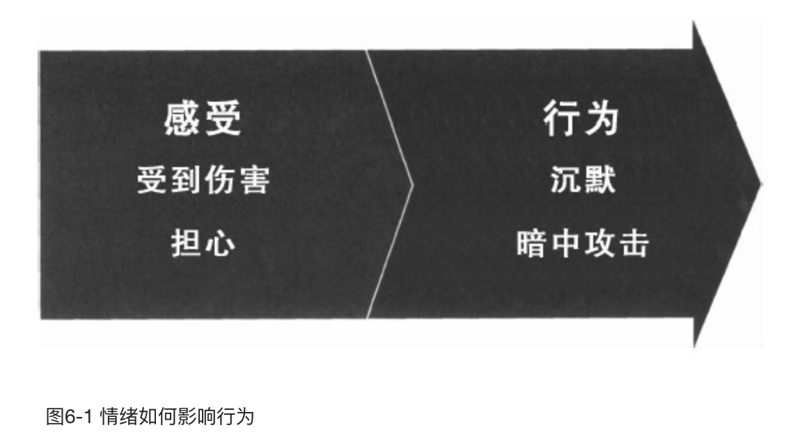
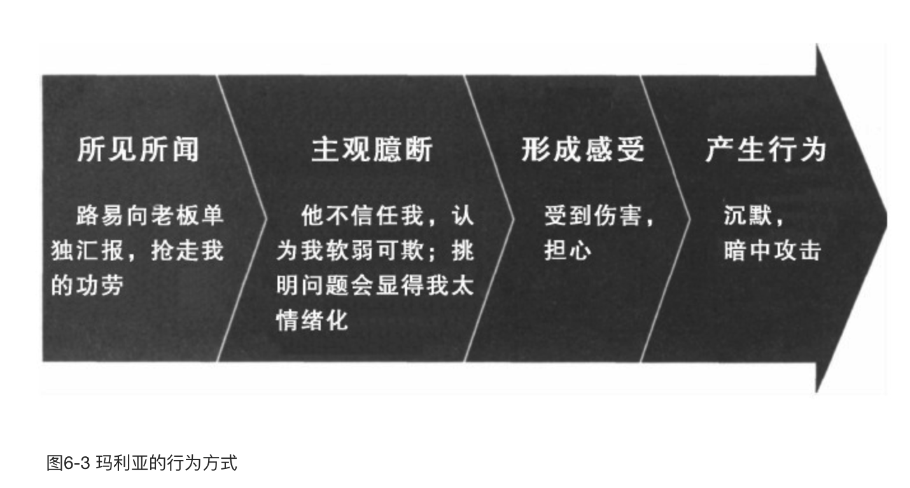

    作者: （美）科里·帕特森（Kerry Patterson） / 约瑟夫·格雷尼（Joseph Grenny） / 罗恩·麦克米兰（Ron McMillan）
    出版社: 机械工业出版社
    副标题: 如何高效能沟通（原书第2版）
    译者: 毕崇毅
    出版年: 2012-4
    页数: 208
    定价: 39.00元
    装帧: 平装
    ISBN: 9787111378457

[豆瓣链接](https://book.douban.com/subject/10586741/)

- [第1章 何谓关键对话](#%e7%ac%ac1%e7%ab%a0-%e4%bd%95%e8%b0%93%e5%85%b3%e9%94%ae%e5%af%b9%e8%af%9d)
  - [常见的关键对话场景](#%e5%b8%b8%e8%a7%81%e7%9a%84%e5%85%b3%e9%94%ae%e5%af%b9%e8%af%9d%e5%9c%ba%e6%99%af)
- [第2章 掌握关键对话](#%e7%ac%ac2%e7%ab%a0-%e6%8e%8c%e6%8f%a1%e5%85%b3%e9%94%ae%e5%af%b9%e8%af%9d)
  - [对话](#%e5%af%b9%e8%af%9d)
  - [营造共享观点库](#%e8%90%a5%e9%80%a0%e5%85%b1%e4%ba%ab%e8%a7%82%e7%82%b9%e5%ba%93)
- [第3章 从“心”开始 如何确定目标](#%e7%ac%ac3%e7%ab%a0-%e4%bb%8e%e5%bf%83%e5%bc%80%e5%a7%8b-%e5%a6%82%e4%bd%95%e7%a1%ae%e5%ae%9a%e7%9b%ae%e6%a0%87)
  - [从我做起](#%e4%bb%8e%e6%88%91%e5%81%9a%e8%b5%b7)
  - [审视自我的意义](#%e5%ae%a1%e8%a7%86%e8%87%aa%e6%88%91%e7%9a%84%e6%84%8f%e4%b9%89)
  - [从“心”开始](#%e4%bb%8e%e5%bf%83%e5%bc%80%e5%a7%8b)
  - [真实案例](#%e7%9c%9f%e5%ae%9e%e6%a1%88%e4%be%8b)
  - [她的细微举动暗示了什么](#%e5%a5%b9%e7%9a%84%e7%bb%86%e5%be%ae%e4%b8%be%e5%8a%a8%e6%9a%97%e7%a4%ba%e4%ba%86%e4%bb%80%e4%b9%88)
  - [关注你的真实目的](#%e5%85%b3%e6%b3%a8%e4%bd%a0%e7%9a%84%e7%9c%9f%e5%ae%9e%e7%9b%ae%e7%9a%84)
  - [小结——从“心”开始](#%e5%b0%8f%e7%bb%93%e4%bb%8e%e5%bf%83%e5%bc%80%e5%a7%8b)
- [第4章 注意观察 如何判断对话氛围是否安全](#%e7%ac%ac4%e7%ab%a0-%e6%b3%a8%e6%84%8f%e8%a7%82%e5%af%9f-%e5%a6%82%e4%bd%95%e5%88%a4%e6%96%ad%e5%af%b9%e8%af%9d%e6%b0%9b%e5%9b%b4%e6%98%af%e5%90%a6%e5%ae%89%e5%85%a8)
  - [留意对话气氛](#%e7%95%99%e6%84%8f%e5%af%b9%e8%af%9d%e6%b0%94%e6%b0%9b)
  - [学会识别关键对话](#%e5%ad%a6%e4%bc%9a%e8%af%86%e5%88%ab%e5%85%b3%e9%94%ae%e5%af%b9%e8%af%9d)
  - [学会关注安全问题的信号](#%e5%ad%a6%e4%bc%9a%e5%85%b3%e6%b3%a8%e5%ae%89%e5%85%a8%e9%97%ae%e9%a2%98%e7%9a%84%e4%bf%a1%e5%8f%b7)
  - [沉默](#%e6%b2%89%e9%bb%98)
  - [言语暴力](#%e8%a8%80%e8%af%ad%e6%9a%b4%e5%8a%9b)
  - [小结——注意观察](#%e5%b0%8f%e7%bb%93%e6%b3%a8%e6%84%8f%e8%a7%82%e5%af%9f)
    - [注意观察](#%e6%b3%a8%e6%84%8f%e8%a7%82%e5%af%9f)
- [第5章 保证安全 如何让对方畅所欲言](#%e7%ac%ac5%e7%ab%a0-%e4%bf%9d%e8%af%81%e5%ae%89%e5%85%a8-%e5%a6%82%e4%bd%95%e8%ae%a9%e5%af%b9%e6%96%b9%e7%95%85%e6%89%80%e6%ac%b2%e8%a8%80)
  - [交流的目的](#%e4%ba%a4%e6%b5%81%e7%9a%84%e7%9b%ae%e7%9a%84)
  - [相互尊重——对话持续因素](#%e7%9b%b8%e4%ba%92%e5%b0%8a%e9%87%8d%e5%af%b9%e8%af%9d%e6%8c%81%e7%bb%ad%e5%9b%a0%e7%b4%a0)
    - [1.对话能成功维持吗](#1%e5%af%b9%e8%af%9d%e8%83%bd%e6%88%90%e5%8a%9f%e7%bb%b4%e6%8c%81%e5%90%97)
    - [2.你能尊重不愿尊重的人吗](#2%e4%bd%a0%e8%83%bd%e5%b0%8a%e9%87%8d%e4%b8%8d%e6%84%bf%e5%b0%8a%e9%87%8d%e7%9a%84%e4%ba%ba%e5%90%97)
  - [暂停对话后该怎么做](#%e6%9a%82%e5%81%9c%e5%af%b9%e8%af%9d%e5%90%8e%e8%af%a5%e6%80%8e%e4%b9%88%e5%81%9a)
    - [在必要的时候向对方道歉](#%e5%9c%a8%e5%bf%85%e8%a6%81%e7%9a%84%e6%97%b6%e5%80%99%e5%90%91%e5%af%b9%e6%96%b9%e9%81%93%e6%ad%89)
    - [利用对比法消除误会](#%e5%88%a9%e7%94%a8%e5%af%b9%e6%af%94%e6%b3%95%e6%b6%88%e9%99%a4%e8%af%af%e4%bc%9a)
    - [创建共同目的](#%e5%88%9b%e5%bb%ba%e5%85%b1%e5%90%8c%e7%9b%ae%e7%9a%84)
      - [1.积极寻找共同目的](#1%e7%a7%af%e6%9e%81%e5%af%bb%e6%89%be%e5%85%b1%e5%90%8c%e7%9b%ae%e7%9a%84)
      - [2.识别策略背后的目的](#2%e8%af%86%e5%88%ab%e7%ad%96%e7%95%a5%e8%83%8c%e5%90%8e%e7%9a%84%e7%9b%ae%e7%9a%84)
      - [3.开发共同目的](#3%e5%bc%80%e5%8f%91%e5%85%b1%e5%90%8c%e7%9b%ae%e7%9a%84)
      - [4.和对方共同构思新策略](#4%e5%92%8c%e5%af%b9%e6%96%b9%e5%85%b1%e5%90%8c%e6%9e%84%e6%80%9d%e6%96%b0%e7%ad%96%e7%95%a5)
  - [继续前面的案例](#%e7%bb%a7%e7%bb%ad%e5%89%8d%e9%9d%a2%e7%9a%84%e6%a1%88%e4%be%8b)
  - [小结——保证安全](#%e5%b0%8f%e7%bb%93%e4%bf%9d%e8%af%81%e5%ae%89%e5%85%a8)
    - [暂停对话](#%e6%9a%82%e5%81%9c%e5%af%b9%e8%af%9d)
    - [判断哪种安全因素出现危机](#%e5%88%a4%e6%96%ad%e5%93%aa%e7%a7%8d%e5%ae%89%e5%85%a8%e5%9b%a0%e7%b4%a0%e5%87%ba%e7%8e%b0%e5%8d%b1%e6%9c%ba)
    - [在必要时向对方道歉](#%e5%9c%a8%e5%bf%85%e8%a6%81%e6%97%b6%e5%90%91%e5%af%b9%e6%96%b9%e9%81%93%e6%ad%89)
    - [利用对比法消除对方的误解](#%e5%88%a9%e7%94%a8%e5%af%b9%e6%af%94%e6%b3%95%e6%b6%88%e9%99%a4%e5%af%b9%e6%96%b9%e7%9a%84%e8%af%af%e8%a7%a3)
    - [提出共同目的](#%e6%8f%90%e5%87%ba%e5%85%b1%e5%90%8c%e7%9b%ae%e7%9a%84)
- [第6章 控制想法 如何在愤怒、恐惧或受伤的情况下展开对话](#%e7%ac%ac6%e7%ab%a0-%e6%8e%a7%e5%88%b6%e6%83%b3%e6%b3%95-%e5%a6%82%e4%bd%95%e5%9c%a8%e6%84%a4%e6%80%92%e6%81%90%e6%83%a7%e6%88%96%e5%8f%97%e4%bc%a4%e7%9a%84%e6%83%85%e5%86%b5%e4%b8%8b%e5%b1%95%e5%bc%80%e5%af%b9%e8%af%9d)
  - [情绪并非无中生有](#%e6%83%85%e7%bb%aa%e5%b9%b6%e9%9d%9e%e6%97%a0%e4%b8%ad%e7%94%9f%e6%9c%89)
  - [玛利亚的经历](#%e7%8e%9b%e5%88%a9%e4%ba%9a%e7%9a%84%e7%bb%8f%e5%8e%86)
  - [玛利亚为什么会抓狂](#%e7%8e%9b%e5%88%a9%e4%ba%9a%e4%b8%ba%e4%bb%80%e4%b9%88%e4%bc%9a%e6%8a%93%e7%8b%82)
  - [感受是由你的想法创造的](#%e6%84%9f%e5%8f%97%e6%98%af%e7%94%b1%e4%bd%a0%e7%9a%84%e6%83%b3%e6%b3%95%e5%88%9b%e9%80%a0%e7%9a%84)
  - [控制想法的技巧](#%e6%8e%a7%e5%88%b6%e6%83%b3%e6%b3%95%e7%9a%84%e6%8a%80%e5%b7%a7)
    - [行为方式回顾](#%e8%a1%8c%e4%b8%ba%e6%96%b9%e5%bc%8f%e5%9b%9e%e9%a1%be)
      - [留意三种常见的“小聪明”](#%e7%95%99%e6%84%8f%e4%b8%89%e7%a7%8d%e5%b8%b8%e8%a7%81%e7%9a%84%e5%b0%8f%e8%81%aa%e6%98%8e)
      - [改变主观臆断](#%e6%94%b9%e5%8f%98%e4%b8%bb%e8%a7%82%e8%87%86%e6%96%ad)
  - [案例回顾](#%e6%a1%88%e4%be%8b%e5%9b%9e%e9%a1%be)
  - [小结——控制想法](#%e5%b0%8f%e7%bb%93%e6%8e%a7%e5%88%b6%e6%83%b3%e6%b3%95)
    - [行为方式回顾](#%e8%a1%8c%e4%b8%ba%e6%96%b9%e5%bc%8f%e5%9b%9e%e9%a1%be-1)
    - [改变主观臆断](#%e6%94%b9%e5%8f%98%e4%b8%bb%e8%a7%82%e8%87%86%e6%96%ad-1)
- [第7章 陈述观点 如何循循善诱而非独断专行](#%e7%ac%ac7%e7%ab%a0-%e9%99%88%e8%bf%b0%e8%a7%82%e7%82%b9-%e5%a6%82%e4%bd%95%e5%be%aa%e5%be%aa%e5%96%84%e8%af%b1%e8%80%8c%e9%9d%9e%e7%8b%ac%e6%96%ad%e4%b8%93%e8%a1%8c)
  - [维持安全感](#%e7%bb%b4%e6%8c%81%e5%ae%89%e5%85%a8%e6%84%9f)
  - [综合陈述法](#%e7%bb%bc%e5%90%88%e9%99%88%e8%bf%b0%e6%b3%95)
  - [“内容”方面的技巧](#%e5%86%85%e5%ae%b9%e6%96%b9%e9%9d%a2%e7%9a%84%e6%8a%80%e5%b7%a7)
    - [分享事实经过](#%e5%88%86%e4%ba%ab%e4%ba%8b%e5%ae%9e%e7%bb%8f%e8%bf%87)
    - [说出你的想法](#%e8%af%b4%e5%87%ba%e4%bd%a0%e7%9a%84%e6%83%b3%e6%b3%95)
    - [征询对方观点](#%e5%be%81%e8%af%a2%e5%af%b9%e6%96%b9%e8%a7%82%e7%82%b9)
  - [“方式”方面的技巧](#%e6%96%b9%e5%bc%8f%e6%96%b9%e9%9d%a2%e7%9a%84%e6%8a%80%e5%b7%a7)
    - [做出试探表述](#%e5%81%9a%e5%87%ba%e8%af%95%e6%8e%a2%e8%a1%a8%e8%bf%b0)
    - [正确表达方式测试](#%e6%ad%a3%e7%a1%ae%e8%a1%a8%e8%be%be%e6%96%b9%e5%bc%8f%e6%b5%8b%e8%af%95)
    - [鼓励做出尝试](#%e9%bc%93%e5%8a%b1%e5%81%9a%e5%87%ba%e5%b0%9d%e8%af%95)
  - [强烈的信念](#%e5%bc%ba%e7%83%88%e7%9a%84%e4%bf%a1%e5%bf%b5)
    - [我们为什么会变成这样](#%e6%88%91%e4%bb%ac%e4%b8%ba%e4%bb%80%e4%b9%88%e4%bc%9a%e5%8f%98%e6%88%90%e8%bf%99%e6%a0%b7)
    - [如何做出改变](#%e5%a6%82%e4%bd%95%e5%81%9a%e5%87%ba%e6%94%b9%e5%8f%98)
  - [小结——陈述观点](#%e5%b0%8f%e7%bb%93%e9%99%88%e8%bf%b0%e8%a7%82%e7%82%b9)
- [第8章 了解动机 如何帮助对方走出沉默或暴力状态](#%e7%ac%ac8%e7%ab%a0-%e4%ba%86%e8%a7%a3%e5%8a%a8%e6%9c%ba-%e5%a6%82%e4%bd%95%e5%b8%ae%e5%8a%a9%e5%af%b9%e6%96%b9%e8%b5%b0%e5%87%ba%e6%b2%89%e9%bb%98%e6%88%96%e6%9a%b4%e5%8a%9b%e7%8a%b6%e6%80%81)
  - [了解对方的动机](#%e4%ba%86%e8%a7%a3%e5%af%b9%e6%96%b9%e7%9a%84%e5%8a%a8%e6%9c%ba)
    - [自我审视——做好倾听的准备](#%e8%87%aa%e6%88%91%e5%ae%a1%e8%a7%86%e5%81%9a%e5%a5%bd%e5%80%be%e5%90%ac%e7%9a%84%e5%87%86%e5%a4%87)
    - [鼓励对方探索行为模式](#%e9%bc%93%e5%8a%b1%e5%af%b9%e6%96%b9%e6%8e%a2%e7%b4%a2%e8%a1%8c%e4%b8%ba%e6%a8%a1%e5%bc%8f)
    - [询问技巧](#%e8%af%a2%e9%97%ae%e6%8a%80%e5%b7%a7)
    - [四种倾听手段](#%e5%9b%9b%e7%a7%8d%e5%80%be%e5%90%ac%e6%89%8b%e6%ae%b5)
      - [1.询问观点](#1%e8%af%a2%e9%97%ae%e8%a7%82%e7%82%b9)
      - [2.确认感受](#2%e7%a1%ae%e8%ae%a4%e6%84%9f%e5%8f%97)
      - [3.重新描述](#3%e9%87%8d%e6%96%b0%e6%8f%8f%e8%bf%b0)
      - [4.主动引导](#4%e4%b8%bb%e5%8a%a8%e5%bc%95%e5%af%bc)
    - [如果对方观点错误怎么办](#%e5%a6%82%e6%9e%9c%e5%af%b9%e6%96%b9%e8%a7%82%e7%82%b9%e9%94%99%e8%af%af%e6%80%8e%e4%b9%88%e5%8a%9e)
  - [你的应对方式](#%e4%bd%a0%e7%9a%84%e5%ba%94%e5%af%b9%e6%96%b9%e5%bc%8f)
    - [赞同](#%e8%b5%9e%e5%90%8c)
    - [补充](#%e8%a1%a5%e5%85%85)
    - [比较](#%e6%af%94%e8%be%83)
  - [小结——了解动机](#%e5%b0%8f%e7%bb%93%e4%ba%86%e8%a7%a3%e5%8a%a8%e6%9c%ba)
- [第9章 开始行动 如何把关键对话转变成行动和结果](#%e7%ac%ac9%e7%ab%a0-%e5%bc%80%e5%a7%8b%e8%a1%8c%e5%8a%a8-%e5%a6%82%e4%bd%95%e6%8a%8a%e5%85%b3%e9%94%ae%e5%af%b9%e8%af%9d%e8%bd%ac%e5%8f%98%e6%88%90%e8%a1%8c%e5%8a%a8%e5%92%8c%e7%bb%93%e6%9e%9c)
  - [对话并非决策](#%e5%af%b9%e8%af%9d%e5%b9%b6%e9%9d%9e%e5%86%b3%e7%ad%96)
    - [决策的四种方式](#%e5%86%b3%e7%ad%96%e7%9a%84%e5%9b%9b%e7%a7%8d%e6%96%b9%e5%bc%8f)
  - [如何选择](#%e5%a6%82%e4%bd%95%e9%80%89%e6%8b%a9)
    - [四个重要问题](#%e5%9b%9b%e4%b8%aa%e9%87%8d%e8%a6%81%e9%97%ae%e9%a2%98)
  - [布置任务——决策执行环节](#%e5%b8%83%e7%bd%ae%e4%bb%bb%e5%8a%a1%e5%86%b3%e7%ad%96%e6%89%a7%e8%a1%8c%e7%8e%af%e8%8a%82)
    - [记录你的工作](#%e8%ae%b0%e5%bd%95%e4%bd%a0%e7%9a%84%e5%b7%a5%e4%bd%9c)
  - [小结——开始行动](#%e5%b0%8f%e7%bb%93%e5%bc%80%e5%a7%8b%e8%a1%8c%e5%8a%a8)
    - [决定如何决策](#%e5%86%b3%e5%ae%9a%e5%a6%82%e4%bd%95%e5%86%b3%e7%ad%96)
    - [明确执行细节](#%e6%98%8e%e7%a1%ae%e6%89%a7%e8%a1%8c%e7%bb%86%e8%8a%82)
- [第10章 案例分析](#%e7%ac%ac10%e7%ab%a0-%e6%a1%88%e4%be%8b%e5%88%86%e6%9e%90)

## 第1章 何谓关键对话
究竟怎样的对话才是关键对话而非普通交谈呢？关键对话有三个特征。

- 首先，对话双方的观点有很大差距。例如，你正在和老板讨论升迁的问题，她认为你还没准备好，而你却觉得自己早该被提拔了。
- 其次，对话存在很高的风险。例如，你正在和几位同事开会，讨论采用新的营销战略。如果你们无法提出新的建议，公司肯定无法实现年销售目标。
- 最后，对话双方的情绪非常激烈。例如，你正在和老公闲谈，对方突然提到昨天发生在街区酒会上的一件“家丑”，指责你不但和某个男人调情，甚至打算“进一步发展关系”。对你来说，老公简直是在颠倒黑白，你并没有跟谁调情，只不过是想表现得彬彬有礼。你的解释让老公愤怒不已，转身离去。

>关键对话指的是两人或多人之间的一种讨论，这种讨论具有三个特点：1）高风险；2）不同观点；3）激烈情绪。

### 常见的关键对话场景
容易导致灾难性后果的关键对话场景包括以下几方面。

- 结束一段感情
- 和总是冒犯你或喜欢提建议的同事交谈
- 让朋友还钱
- 指出老板一些不对的做法
- 向经常言行不一的老板提出建议
- 批评同事的工作表现
- 让室友搬走
- 和前任配偶讨论孩子的监护权或探访权问题
- 应对处于青春期的叛逆儿女
- 指出队友违反承诺的表现
- 探讨关于出轨的问题
- 应对配偶严重的家庭暴力问题
- 和喜欢打听小道消息的同事交谈
- 做出不利的行为表现评价
- 说服配偶的家人不要干涉夫妻问题
- 提醒同事注意个人卫生问题

## 第2章 掌握关键对话
### 对话
在和他人展开充满风险、富有争议和令人情绪激动的对话时，对话高手总是能找到某种方式，公开传达各种相关信息（包括自己和他人的信息）。

这就是秘诀所在，**成功的对话关键在于相关信息的自由交流，即双方愿意公开坦诚地表达自己的看法、分享自己的感受、说出自己的猜测**。即使要表达的观点是充满争议或不受欢迎的，他们仍愿意并且能够积极和对方分享。

这种独特的能力就是我们所说的对话。

>对话指两人或多人之间观点的自由交流。

### 营造共享观点库
在和对方展开对话时，我们每个人都会带有个人观点、感受、猜测以及和对话内容相关的生活体验。这种思想和感受的独特组合会构成完全自我的观点库，它不但能让我们形成对问题的看法，而且能驱使我们的每一个动作。

在这种情况下，对话高手的做法是**努力营建一种安全氛围**，让双方都愿意向共享观点库中添加信息，哪怕这些观点乍一看多么富有争议、多么离谱、多么不符合对话者的想法。

共享观点库的充实可以为对话者带来两方面的帮助。首先，由于双方接触的信息变得更加准确、相关度更高，他们肯定会做出更好的选择。可以说在实际对话中，共享观点库即对话小组智商高低的衡量标准。共享观点库内容越丰富，最终做出的决定就越明智。即使参与对话的人很多，只要大家都能公开自由地交换观点，最终一定会实现高质量的决策结果，为此多投入一些时间是完全值得的。

其次，如果共享观点库内容贫乏，结果必定导致严重的决策危机。当人们有意限制和对方共享看法时，即使非常聪明的人也会在一起做出愚蠢的决定。

观点的自由交流最终带来的是这样的结果——整体思维（最终选择）的力量远远大于个体观点的总和。简而言之就是：

>共享观点库是实现协同效应的前提

共享观点库不但能帮助个人做出更好的选择，更重要的是，观点的共享能让人们团结起来，对决策目标深信不疑，能够从主观上积极地投入决策的实施过程中去。只有当对话者能够开诚布公地共享看法时，他们才会实现观点的自由交流。

如果我们在对话中陷入争吵、敌对、逃避或是表现得漠不关心，那是因为我们不知道该如何和对方共享观点。我们不会展开健康的对话，而是在玩一场愚蠢之极、代价不菲的游戏。

例如，有时候我们会陷入沉默，和对方玩“哑巴”游戏，即不敢面对掌握权力的人。在家庭生活中，我们会和自己的另一半上演“冷战”游戏。这是一种非常残忍的做法，为了吸引对方的注意力，我们总是故作冷淡。

有时候，我们会通过暗示、讽刺、口出不逊、指桑骂槐和流露厌恶神情的方式来表达自己的观点。我们会表现得煞有其事，做出一副准备时刻帮助他人的样子。由于不敢面对某个人，我们往往会把问题推到整个团队身上，希望能用这种方式解决问题。

还有些时候，由于不知道该如何维持对话，我们会错误地向观点库中强加自己的看法。这时，我们便会诉诸暴力手段，其中既包括微妙的操纵又包括粗暴的言语攻击。我们往往会表现得无所不知，希望对方能接受自己的观点。我们极力贬低别人，不希望有人相信他们的看法。为了达到这个目的，我们不惜采用各种压迫手段。我们会狐假虎威地利用上司的权力，将个人看法凌驾于他人之上，肆意诋毁、攻击对话对象。当然，这些做法的目的只有一个——迫使对方接受我们的观点。

## 第3章 从“心”开始 如何确定目标
### 从我做起
让我们先从一个小例子说起。

>一个炎热的下午，父亲带着姐妹俩结束了在迪士尼乐园的游玩，三人急匆匆地回到了宾馆房间。原来，这两个孩子喝了一大桶汽水，现在已经憋不住要上厕所了。
>
>由于房间里只有一个卫生间，姐妹俩很快就为谁先上厕所吵了起来。两人先是大声争执，然后你推我搡，连难听的外号都叫出来了。眼见无法解决问题，她们最后向父亲求助了。
>
>“爸爸，是我先到的！”
>
>“可是我比你还急！”
>
>“你怎么知道我不急？你又不是我的身体。我今天早上出门时都没上厕所！”
>
>“你太自私了！”
>
>父亲提出了一个方案：“姑娘们，这个问题你们要自己去解决。你们就待在卫生间里商量吧，早晚会决定谁先用谁后用。不过我有一条规定，不许打架。”
>
>在两个烦躁的孩子进行关键对话时，父亲在盯着自己的手表，他想知道这个问题要花多长时间才能解决。时间一点一点地过去，卫生间里不时传来几句讽刺挖苦的话。大约过了25分钟之后，父亲终于听到了马桶冲水声，然后从卫生间里走出了一个孩子。一分钟后，冲水声再次响起，她的姐姐也走了出来。这时，父亲笑眯眯地问道：“你们知不知道，在你们争吵不休的这段时间里，你们每个人可以上多少次厕所？”
>
>两个孩子可没心思想这个，父亲接着问道：“为什么你们用了这么久的时间才用上厕所呢？”
>
>“那是因为她总是很自私！”
>
>“瞎说，她本来可以等我先上的，可是偏偏不让我，还对我大呼小叫的，她从来都是这样！”

这就是我们在关键对话中要面对的第一个问题。我们的问题并不是行为本身是错误的，而是我们的动机有问题，即我们常常弄错要面对的目标。

因此，要想解决问题，我们要做的第一步是改变错误的观点，即认为我们的苦恼是由他人导致的。**我们总是简单地认为：“只要能搞定‘麻烦制造者’，一切问题都会好起来。”实际上，正是这种错误的念头在阻止我们利用对话方式解决问题**。

### 审视自我的意义
对话高手们非常明白这一点，并在此基础上形成了审视自我的原则。他们不但认识到实践这条原则能让自己受益，而且深知能够改变的人只有他们自己。正如我们认为别人应该做出改变一样，实际上我们能够成功启发、激励和塑造的人只有一个，就是镜子中的自己。

### 从“心”开始
对话高手总是能做到从“心”开始。换句话说，**在展开高风险对话时，他们总是首先明确目的和动机**，无论出现什么情况这个目的都不会动摇。

他们对目标的关注表现在两个方面。首先，他们非常清楚自己希望通过对话获得什么。在对话过程中，无论出现多少可能转移注意力的情况，他们依然能坚守自己的目标。其次，对话高手从来不做“傻瓜式选择”（即非此即彼、非黑即白式的选择）。和那些错误地认为只能“逃避或对抗”的问题解决者不同，对话高手认为，无论出现多么棘手的情况，对话永远都是一种可行的选择。

### 真实案例
>格瑞塔是一家中等规模企业的首席执行官，她正在和公司的高管进行紧张的会议，会议已经开了两个多小时了。过去6个月以来，格瑞塔一直在推行一项成本缩减计划，但是直到现在还没有看到效果，为此她专门举行了这次会议。由于她一直煞费苦心地在企业内部倡导坦诚交流的作风，大家一定会在会议上向她说明计划未能取得效果的原因。
>
>会议开始后，就在格瑞塔准备提问时，有位经理有些迟疑不定地站起身来，只见他神情有些慌乱，眼睛盯着地板嗫嚅道，能否提一个很棘手的问题。从他的表现来看，这哥们仿佛要揭露格瑞塔的什么惊天秘密。
>
>这位惶惶不安的经理说道：“格瑞塔，过去6个月以来您一直都在想办法让我们缩减成本，如果说大家没有积极行动那可不是实话。不过，如果您不介意的话，我想说说我们在缩减成本方面遇到的一个困难。”
>
>“很好，说吧。”格瑞塔微笑着回应。
>
>“呃……是这样，你又是让我们双面打印，又是放弃设备升级投资。可自己却修建了新的办公楼……”
>
>格瑞塔一脸严肃，气得眼睛直冒火。每个人都不做声，不知道接下来会发生什么事情。
>
>这位经理继续道：“有人说光是新办公楼的家具就花了15万美元，是这样吗？”

### 她的细微举动暗示了什么
在受到攻击时，我们的内心会出现相似的突然而无意识的急转弯。面对沉重压力和强大的反对意见，我们常常会思维短路，忘记鼓励大家向共享观点库添加信息的目标，转而希望战胜对方、惩罚对方或是寻求安全港湾。

会纠正事实，抓住一些细节进行狡辩，指出对方观点中的缺陷。例如：

>“没有这回事，我们从没有花15万美元买家具，这是办公楼重新设计的费用，不是购买家具的费用。”

惩罚对方。有时候，随着愤怒情绪的增长，我们的心态会从希望战胜对方转变为蓄意伤害对方。例如，格瑞塔就是这么想的：“去他的坦诚沟通吧，看我不好好修理你这个目中无人的白痴！”当这种负面情绪达到顶峰时，我们的目标会变得非常邪恶。此时此刻，我们早就把什么共享观点库抛到了九霄云外，一心只想着给对方制造痛苦。例如：

>“你竟然说我在办公楼上乱花钱，还有人对此发表意见吗？没有的话此事到此为止！”
>
>大家吓得大气也不敢出，会议室里一片沉默。

寻求安全港湾。当然，我们并不总是会改正错误，羞辱他人，或是残忍地为对方制造痛苦。有时候，我们也会选择用明哲保身的方式来逃避对话。为避免表达自己的看法，避免在此过程中惹是生非，我们会选择保持沉默。为避免出现令人难堪的对话场景，我们往往会保持面子上的一团和气，不愿因为观点不同而陷入正面冲突，因为这样可能会让我们感到非常不舒服。因此，我们会选择（至少在我们的意识中）明哲保身的方式而不是和对方发生冲突。如果在格瑞塔的案例中出现这种情况，肯定没人会提出新办公楼的问题，格瑞塔永远也不知道问题的所在，各位主管依旧会在成本削减问题上拖拖拉拉。

### 关注你的真实目的
>实际上，格瑞塔并没有失去理智地去为自己辩护。她刚刚举起手便又放了下来，脸上的表情也逐渐放松。一开始她显得有些吃惊、尴尬，甚至有些气恼，但她很快深吸一口气，回应道：“嗯，这个问题提得好，我们必须讨论一下。我很高兴你能提出这个问题，谢谢你这样做，这说明你对我非常信任。”

然后格瑞塔开始开门见山地谈了起来，她承认，一边强调成本缩减，一边兴建新办公楼表面上看很虚伪。她坦言不知道该项目的成本，然后让人马上去核查相关的数据。她解释说修建新办公楼是为了响应营销部的需要，以改善企业形象，提升客户的信任度。尽管格瑞塔也可以使用，但新的办公楼主要是为营销部开发设计的。最后，她补充道：“当然，这并不能成为我的借口，事实是我对该项目的管理不像对诸位要求的那么严格，这一点的确有些虚伪。”这时，有人送来了新办公楼的成本报告，看到里面的数据之后，格瑞塔非常吃惊，向大家承认在批准该项目之前没有认真核查其中的预算。

我们想知道当时她的大脑中在想些什么，是什么因素帮助她忘掉尴尬和愤怒，转而向对方表示感激之情的。

她的回答是：“其实很简单，一开始我确实觉得受到了攻击，很想回敬给对方一些颜色看看。老实说，我真想好好教训他一下。他竟敢当着那么多人的面指责我，这种做法太过分了。”

“但就在这时，另一个念头出现了。尽管有200多双眼睛紧盯着我，可我突然意识到一个更加重要的问题：‘我真正的目的是什么？’”

当她开始关注这个更为重要的问题时，她很快意识到自己真正的目的是，鼓励公司200多位管理者积极投入成本削减计划，让这些管理者进一步影响企业成千上万的员工。

**为了回归理智，继续对话，你必须暂时停止和对方的互动，转而审视自我，像一个局外人一样审视自我。你可以这样问自己：“我在做什么？这样做的目的是什么？”当你坦率诚恳地探索自己的目的时，往往会得出这样的结论：“好吧，我的表现有些咄咄逼人，表达观点的方式太过强势，一心只想战胜对方。我已经偏离了原来的目标**。

你应当停下来问自己几个可以帮助你返回对话的问题，这些问题既可以在意识到对话失控时提出，也可以在准备展开关键对话时提出。这些问题包括：

>我希望为自己实现什么目标？
>
>我希望为对方实现什么目标？
>
>我希望为我们之间的关系实现什么目标？

询问完自己这些目标之后，还有一个重要的问题不要遗漏：

>要想实现这些目标我该怎么做？

寻找意义。询问自己这些问题有两个重要原因。首先，这些问题的答案能帮助我们明确努力的方向。尽管受各种因素的影响：1）人们喜欢争强好胜，2）千万年来基因决定的容易冲动，3）社会习惯导致我们不停地竞争，让我们很容易在对话过程中陷入歧途，但只要方向正确我们就一定能回归到最初的对话目的上来。

控制好你的身体。向自己询问对话目的问题的第二个原因也很重要。当我们提出这些问题时，我们会影响自己的整个生理机能。当我们开动脑筋思考这些复杂而抽象的问题时，大脑中负责处理问题的部分会意识到，我们现在面对的是复杂的社会问题，而不是生理上遇到的威胁。当大脑开始高速运转分析问题时，我们的身体会把血液从四肢抽离，输送到负责思考的大脑。换句话说，我们正慢慢退出“逃避或对抗”模式，开始理智分析问题了。

向自己询问目的问题有两个重要意义。首先，它能提醒我们关注真正重要的目标。其次，它能让我们麻木的大脑重新活跃起来，帮助我们去关注对话的目标。

### 小结——从“心”开始
面对棘手问题时，关键对话高手是这样关注任务目标的：

- 从我做起
  - 记住，你唯一能直接控制的人只有你自己。
  - 发现自己即将陷入沉默或暴力状态时，停止对话，冷静思考你的动机。
  - 问自己这样一个问题：“我现在的行为显示出我的动机是什么？”
  - 明确你的真正目的，问自己：“我想为自己、他人和人际关系做些什么？”
  - 最后，问自己：“如果这是我的真正目的，我该怎么做？”
- 拒绝“傻瓜式选择”
  - 在分析行为目的时，留意在哪些情况下你会说服自己做出“傻瓜式选择”。
  - 留意你是否总是告诉自己必须在说实话和顾面子之间、在成与败之间做出两极化选择。
  - 利用对比说明的方式消除“傻瓜式选择”的影响。
  - 说出你希望的目的之后，明确你不希望实现的目的，然后开动脑筋寻找可以实现对话的健康方式。

## 第4章 注意观察 如何判断对话氛围是否安全
### 留意对话气氛
实际上，我们很多人都不具备“双路处理”能力（即同时关注对话内容和对话气氛两方面），当对话风险很高、双方情绪激动的时候更是如此。我们往往深陷于对话内容无法自拔，几乎不可能腾出精力去观察自己和对方会有哪些细微的变化。

### 学会识别关键对话
首先，当对话从正常讨论变成激烈争执时，你就必须留意了。同样，在和对方展开棘手的对话时，你必须小心翼翼地应对，就好像进入布满地雷的危险地带一样。

为了尽早发现问题，你应当调整自己的思路，注意那些标志关键对话的信号。例如，面对关键对话时，有些人会出现生理信号，如胃部不适、双眼发干等。

### 学会关注安全问题的信号
无论是对抗还是逃避，这些反应全都是由恐惧感催生的。与此相反，只要在对话中营造出足够安全的气氛，你可以随心所欲地讨论任何问题，对方会全神贯注地聆听你的看法。同样，如果不怕受到攻击或羞辱，你可以坦诚接受对方的任何观点而不会产生抵触情绪。

这是一个非常特别的观点，值得大家认真思考。我们想说的是，其实人们不会因为你表达的内容感到气愤，他们表现出抵触情绪是因为在对话中失去了安全感。因此，问题的关键并不在于对话内容本身，而在于对话的方式和气氛。

通过降低对对话内容的关注，强调对安全气氛的观察，你可以重启大脑的思维功能，拓宽自己的视野范围。如前所述，当你命令大脑去思考新的问题时（警惕安全出现危机的信号），你的思维功能便会重新开始运转。当理性思维中心保持活跃状态时，你不会再像白痴一样犯错，而是很有可能顺利完成关键对话。

我们要求你对沉默和暴力表现做出新的理解，把它们视为对方失去安全感的信号。我们要求你必须抵制这种长期形成的错误认识，改正多年养成的错误做法，拒绝内心深处涌出的与生俱来的“对抗或逃避”式错误心理，把对方的表现当成一种刺激因素，学会对自己这样说：“啊，我明白了，那是对方感到缺乏安全感的信号！”做到了这一点，你就能想办法营造安全感气氛了。

### 沉默
沉默包括任何有意拒绝观点交流的行为，这种方式几乎从来都是逃避潜在问题的方式，总是会限制观点在对话中的交流。其表现方式有很多，从玩文字游戏到对对方不理不睬都在此列。最常见的三种沉默形式是掩饰、逃避和退缩。

- **掩饰**是指对问题轻描淡写或有选择性地表达观点。冷嘲热讽、甜言蜜语和字斟句酌是掩饰做法的常见形式。
- **逃避**是指完全避开敏感话题的行为。我们虽然表面上在对话，但总是避重就轻，从不涉及真正重要的问题。
- **退缩**是指彻底退出对话机制。我们不是退出对话就是离开房间。

### 言语暴力
暴力包括任何试图迫使、控制或强迫对方接受自己观点的言语行为。这种做法的特征是人们把自己的信息强行加入信息库中，因此也会破坏对话的安全气氛。表现形式从口出秽言、自顾自说到恫吓威胁，不一而足，其中控制、贴标签和攻击是最常见的三种形式。

- **控制**是指胁迫对方按照你的思路考虑问题，表现方式有两种，要么强迫对方接受你的观点，要么在对话中搞一言堂作风。具体做法包括经常打断对方讲话，过度强调自己的观点，大量使用绝对性字眼，经常改变话题以及使用指令性问题控制对话过程。
- **贴标签**是指把某些人或某些观点加上标签，把它们视为具有某种特征的一类人或物。
- **攻击**就无须解释了，指的就是字面含义。我们往往会希望战胜对方，进而发展到希望为对方制造痛苦。具体行为包括贬低和威胁对方。

### 小结——注意观察
在关键对话过程中，人们很难准确地意识到会发生什么情况，很难了解出现这些情况的原因。当对话变得充满压力时，我们的做法往往会适得其反，下意识地表现出长期形成的不正确的压力应对方式。

#### 注意观察
要想打破这种错误行为的怪圈，你应当学会注意观察以下内容：
- 观察对话内容和对话气氛。
- 观察对话在哪些情况下会变得难以处理。
- 观察安全问题。
- 观察对方是否进入沉默或暴力应对的状态。
- 观察你的错误应对方式会在什么情况下出现。

## 第5章 保证安全 如何让对方畅所欲言
### 交流的目的
关键对话会出错并不是因为对方不喜欢对话的内容，而是因为他们觉得对话内容（哪怕是以温和方式表现）表明你有不轨的意图。当对方感到你想伤害他们时，他们怎么可能有安全感呢？在这种心理作用下，你的每句话都会显得非常可疑，就连一句最平常的“早上好”也会被误解为讽刺或讥笑。

因此，**安全感的第一个条件是共同目的**。`共同目的`是指，你应当让对方感到你们在对话中是朝着同一个方向努力的，感到你关心他们的目标、利益和价值。反之亦然，对方也能让你感到他们关注你的目标、利益和价值。所以，共同目的可以说是对话的启动因素。找到了共同目的，你就有合理的理由和健康的气氛展开对话了。

当共同目的出现危机时，我们往往会和对方发生争执。对方强迫我们接受其观点，通常是因为他们觉得我们想要战胜他们，所以会做出相同的举动。共同目的出现危机的其他信号包括：自我防御、绵里藏针（目的出错的沉默应对方式）、无端指责和老调重弹。要发现这种问题，你可以问自己这样两个问题：

- 对方觉得我在对话中是否关注其目的？
- 对方是否信任我的对话动机？

强调“共同”性。共同目的中的“共同”二字可谓画龙点睛之处。共同目的并非一种技巧，要想顺利完成关键对话，我们必须真正关注对方的利益，不能只考虑自己的利益。因此，这里的目的必须具备高度的共同性。所以，在开始对话之前，一定要检查你的动机是否具有共同性。你可以询问自己“从心开始”的问题：

- 我希望为自己实现什么目标？
- 我希望为对方实现什么目标？
- 我希望为我们之间的关系实现什么目标？

### 相互尊重——对话持续因素
#### 1.对话能成功维持吗
诚然，缺少共同目的无法启动关键对话，但互相尊重也同样重要，没有它我们就无法维持关键对话。因此，**互相尊重可以说是对话的持续因素。当人们感到对方不尊重自己时，安全感马上就会出现危机，对话戛然而止**。

#### 2.你能尊重不愿尊重的人吗
有些人担心，在某些场合或是和某些人进行对话时，永远也没办法营造共同目的和互相尊重感。他们想了解的是，怎样才能和背景完全不同的人或具有不同道德或价值观的人建立相同的目的。

如果我们在开口之前必须和对方分享每一个目标，尊重对方性格中的每一个方面，这样的对话恐怕会以失败告终。如果真的是这样，那我们只能在对话中保持缄默了。**其实，对话还是可以继续的，前提是我们必须想办法尊重对方最基本的人性。实际上，在对话中尊重感的丧失通常是因为我们认为对方和自己不同，是完全不一样的两种人。如果我们能把对方看成和自己差不多的人，这种感受便会自动消失**。我们要做的不是为自己的行为找借口，而是努力理解对方，学会站在对方的角度看问题。

### 暂停对话后该怎么做
发现互相尊重感或共同目的出现危机时，你必须高度关注。你应当找到一种既能确定共同目的又能营造互相尊重感的方式，哪怕对方和你的观点南辕北辙。

下面来介绍三种非常有效的应对技巧。它们分别是：

- 道歉
- 对比说明
- 创建共同目的

#### 在必要的时候向对方道歉
要想做出真诚道歉，你必须改变自己的动机，放弃什么面子、争强好胜以及“只有我是正确的”之类的错误想法，学会关注自己的真正目的。换句话说，你应当牺牲一点自尊心，承认自己的错误。牺牲才能换来回报，当你放弃一些立场时，往往会得到更有价值的回报——健康的对话和理想的结果。

#### 利用对比法消除误会
对比法是一种是非型陈述，其结构包括：

- 打消对方认为你不尊重他们或抱有不轨企图的误解（否定部分）。
- 确认你对他们的尊重，明确你的真实目的（肯定部分）。

例如：

>（否定部分）“我不希望你们认为我不重视你们的工作，认为我不想向公司副总汇报。”
>
>（肯定部分）“正相反，我认为你们的工作表现非常突出。”

注意首先从错误观点谈起：

>“准确地说，我不想让你认为我对你的工作表现不满意。我希望能继续跟你合作，我认为你的表现不错，不过工作准时对我来说很重要，我希望你能在这方面做出一些改进。如果你能在这个方面稍加关注，其他方面就没有问题了。”

当我们意识到某些观点会引发对方的抵触情绪时，可以使用对比法巩固安全感，以免对方陷入沉默或暴力应对的情形。例如：

>“希望你不要认为我对你在财务工作中的表现不满意，我很欣赏你的表现，没有你的帮助我肯定无法完成任务。不过，对于如何使用电子银行系统这个问题，我觉得应该和你讨论一下。”

#### 创建共同目的
对话高手会使用下面介绍的四种方式创建共同目的，即共同目的四步创建法。

##### 1.积极寻找共同目的
要想停止争论，我们必须摒弃下列想法：我们的选择是绝对最好的和唯一正确的，如果达不到这个目的我们永远都不会开心。我们必须开放思想，接受这样一个事实，即或许还有第三种选择，一种能让对话双方都满意的选择。

我们坚信对方表现出沉默或暴力是因为他们在对话过程中感到气氛不够安全，我们假定只要营造出更多安全感（通过承诺寻找共同目的的方式），对方一定会充满信心，对话一定会富有成效。

因此，下次当你陷入思想斗争时，不妨也试试这个简单有效的技巧。暂停讨论充满争议的话题，营造更多安全感。你只要这样说即可：“看起来我们都在向对方强加自己的观点，我保证会继续和你讨论，直到找到咱们都满意的方案。”然后，观察对方的安全感是否有所改善。

##### 2.识别策略背后的目的
我们要解决的问题是：当我们发现对话陷入僵局的原因在于，我们期望实现的是一个目标，而对方希望实现的是另一个目标。我们认为这种矛盾永远无法调和，这是因为我们总是把期望目标和实际目的等同起来。实际上，期望目标是一种策略，策略带来的结果才是实际目的。换句话说，我们总是把愿望或目的和策略混为一谈，这就是问题所在。

例如，下班回家后我说我想去看电影，你说你想待在家里休息，于是我们便开始争论起来：“看电影”，“看电视”，“看电影”，“看书”等。我们认为这个问题无法得到解决，是因为外出和待在家里是完全水火不容的对立选择。

在这种情况下，我们可以这样打破僵局，试着问对方：“你为什么想这样做？”在本案例中，你可以问：

>“你为什么想待在家里？”
>
>“因为我不想到处跑，受不了到处是喧闹的人群。”
>
>“就是说你想保持安静是吗？”
>
>“是的。你为什么想去看电影呢？”
>
>“这样可以暂时放下孩子，和你享受一下二人世界的乐趣。”

在达成共同目的之前，你必须首先了解对方的真正目的是什么。因此，你应当暂停先前的对话内容（因为它关注的是策略），转而探索策略背后隐藏的目的。

当你成功区分策略和目的之后，新的选择自然就会出现。放松对行动策略的关注，强调你的真正目的，这样可以帮助你拓展思维空间，找到对双方都有利的选择方案。例如：

>“好吧，你想享受宁静时光，我想和你躲开孩子们的纠缠。只要找到既能躲开孩子又能让你享受安静时光的选择，我们就皆大欢喜了，是这样吗？”
>
>“那当然，你觉得咱们开车去峡谷看风景怎么样……”

##### 3.开发共同目的
要开发共同目的，你应当拓展自己的视野，关注范围更广阔的目的。你应当寻找的是对双方更有意义或回报更大的目标，而不是那些会让你们产生争执的目标。例如，你和妻子在是否接受升迁的问题上虽然无法取得一致意见，不过你们可以达成协议的是夫妻关系和孩子的需要优先于对职业发展的考虑。通过关注更高层次和更为长期的目标，你可以找到超越短期妥协的新选择。接下过关注更高层次和更为长期的目标，你可以找到超越短期妥协的新选择。接下来你要做的就是创建共同目的，然后重新返回对话。

##### 4.和对方共同构思新策略
通过寻找共同目的营造安全感之后，现在你可以在更安全的气氛中继续和对方讨论对话内容了。返回对话之后，你应当和对方一起开动脑筋，寻找可以满足双方需求的新策略。如果你们能努力寻找这种新策略，说出内心真实目的，就不用浪费精力和对方进行毫无意义的争吵了，而是会积极提出对双方都有利的解决方案。

总而言之，当你感到对方和你的目的不一致时，应当这样做：暂停充满争议的对话内容，关注对方的真正目的是什么，然后努力创建共同目的。

- 积极寻找共同目的——做出单边承诺，表示你愿意继续进行对话，直到找出让双方都满意的解决方案。例如：

>“这样行不通，你的团队主张留在这里工作到完成任务，我的团队想先回家，周末再来加班，我们干吗不想想有没有两全其美的方案？”

- 识别策略背后的目的——询问对方为什么想要实现所说的目的，分清他们的要求和要求背后的真正目的。例如：

>“星期六早上，你们为什么不想来？让我们累个半死，还要担心安全和质量问题。你们为什么那么晚来？”

- 开发共同目的——如果明确双方目的之后仍无法取得一致，那就想办法开发级别更高、更为长远，能够帮助双方避免争执的新目标。例如：

>“我不想跟你争个高下，最好能找到让两个团队都感到满意的解决方案。我们以前靠投票或掷硬币做决定，结果失败的一方总是埋怨并憎恶获胜的一方。我更关注的是两个团队对彼此的看法，因此，以后不管做什么，我们都必须保证不会伤害整个团队的合作关系。”

- 和对方共同构思新策略——明确共同目的之后，你应当和对方一起寻找对双方都有利的解决方案。例如：

>“我们要找到一种方案，这种方案既不会带来安全和质量问题，又能让你的团队成员周六下午参加同事的婚礼。我的团队成员周六上午有一场比赛，你看这样行吗，星期六上午和下午前半段你们工作，比赛完之后我们就过来工作。这样我们就能……”

### 继续前面的案例
伊芳准备继续和约坦展开对话，我们来看看她该怎样做才能在关键对话中营造安全气氛。首先，她使用对比法消除丈夫对其目的的误解。

>伊芳：约坦，我想和你谈谈关于亲热的事情。我不想让你尴尬，也不想指责这是你的问题。我很清楚，在这个问题上我也有责任。我的目的是想和你进行讨论，找到对双方都有利的解决办法。
>
>约坦：有什么好谈的？不就是一个有心一个无意嘛，就这么简单。
>
>伊芳：我觉得没这么简单，有时候你的做法让我对你越来越没好感。
>
>约坦：如果你这么想，那干吗要假装配合我呢？

看，问题出现了。当然，我们在此是从伊芳的角度分析对话的，因为她是发起对话的一方。显然，如果约坦能做出积极响应的话，这场对话会变得顺利很多。但伊芳并不是约坦，这时她该怎么做呢？她应当强调自己内心真正的目的，即找到一种对双方都有利的问题解决方式。因此，她应当忽略对方消极否定的话语，努力关注对话内容背后潜藏的安全问题，即丈夫为什么会在对话过程中退缩不前。显然，这里有两个原因：

- 伊芳表达观点的方式让丈夫感觉不爽，以为她要指责自己。
- 约坦认为妻子在小题大做，借题发挥，表达对自己的不满。

认识到这一点，伊芳开始道歉，然后利用对比法重建对话安全感。

>伊芳：对不起，我说话的方式不对。我没有说我的感受或行为是你造成的，那是我的问题，不是你的问题。但这件事是我们两个人的问题，正是因为我们两个人的做法都有错，所以情况才变得越来越糟糕。至少我觉得我是有责任的。
>
>约坦：你要这么说的话，那我也是有责任的。有时候我生闷气是因为感觉受到了伤害，此外也是想破坏你的感受。对此我也感到很抱歉。

看到其中的变化了吗？当伊芳解决了安全问题，努力关注对话的真正目的时，丈夫便自动回到了对话中。毫无疑问，这种做法要比一味批评指责对方要好得多。

>约坦：我不知道这件事该怎么解决。我总是欲望强烈，好像解决方式只有一个，要么是我忍受现状，要么是让你违心地做出配合。

现在的问题牵扯到共同目的了，约坦认为自己和妻子的目的不一致。在他看来，这个问题根本不可能有让双方都感到满意的解决方案。这时，伊芳既没有妥协让步，也没有固执己见，而是暂停对话，利用四步法创建共同目的。

>伊芳：[积极寻找共同目的]不，这不是我的目的。我不希望看到任何让彼此失望的事，我是想找到一种方式，能让我们都感到亲密、彼此重视和互相关爱。
>
>约坦：我也想这样，可是看起来我们实现这些目标的方法完全不同。
>
>[注意观察约坦是如何退出错误做法，回归健康对话的。显然，是安全感，更准确地说是共同目的的建立帮助他做到了这一点。]
>
>伊芳：[识别策略背后的目的]那也不一定，怎样做才能让你感到关爱和受重视呢？
>
>约坦：当你真正想要的时候和你亲热，这样会让我感到关爱和受重视。你呢？
>
>伊芳：你肯为我着想的时候我会感到关爱和受重视。还有，我更喜欢你抱我的感觉，而不是总想着亲热。
>
>约坦：你是说只要和你依偎在一起，你就能感到爱意了吗？
>
>伊芳：是的。只有感觉到你是因为爱我而想亲热时，我才会有兴趣的。
>
>约坦：[开发共同目的]看来我们得找到一个能让双方都感到关爱和受重视的相处方式才行，你是这么想的吗？
>
>伊芳：是的，这就是我的目的。
>
>约坦：[和对方共同构思新策略]好吧，你看这样行不行……

### 小结——保证安全
#### 暂停对话
当对方出现沉默或暴力应对的情况时，你应当暂停对话，营造安全气氛。安全感一旦恢复，你就可以继续进行对话了。

#### 判断哪种安全因素出现危机
- 共同目的——对方是否觉得你在对话过程中关注他们的目的？是否认同你的对话动机？
- 互相尊重——在对话过程中，对方是否感到你尊重他们？

#### 在必要时向对方道歉
- 当你的做法破坏尊重感时，应当向对方道歉。

#### 利用对比法消除对方的误解
- 当对方误解你的目的或意图时，利用对比法消除误会。先说明你不希望如何，然后说明你想要怎样。

#### 提出共同目的
当和对方目的不一致时，利用四步法营造共同目的：

- 积极寻找共同目的
- 识别策略背后的目的
- 开发共同目的
- 和对方共同构思新策略

## 第6章 控制想法 如何在愤怒、恐惧或受伤的情况下展开对话
### 情绪并非无中生有
我们首先要做出两个大胆和鲜为人知的声明，然后再进一步说明这些声明背后的逻辑。

1. 情绪并不是笼罩在你周身的一层薄雾，它们不是别人强加给你的。不管你多么振振有词地指责别人，实际上其他人是无法让你陷入某种情绪的，是你制造了自己的情绪，是你让自己感到害怕、烦恼或气愤。让你产生情绪的只能而且永远是你自己。
2. 产生负面情绪后你只有两个选择，要么控制它，要么被它控制。也就是说，在出现强烈情绪时，如果你无法驾驭它，就会成为它的俘虏。

### 玛利亚的经历
玛利亚是一位创意文案人员，她现在感到很烦恼。事情的经过是这样的，她和同事路易刚刚和老板开完创意审核会议，在会议上两人应当共同演示一起构思的创意。令人气愤的是，玛利亚会间出来休息了一下，路易趁这个工夫自己完成了演示，把两人共同提出的策划说成是自己的功劳。等老板询问玛利亚的意见时，她已经没什么好说的了。

这件事让玛利亚感到既羞辱又愤怒。首先，路易的做法很龌龊，把她的功劳据为己有。其次，整个会议成了路易一个人的表演秀，自己成了无足轻重的人。玛利亚觉得路易是在故意贬低自己的贡献，因为她是整个创意团队中唯一的女性。

玛利亚简直烦透了这套“男性至上”的逻辑，她该怎么办呢？她不想表现得过度敏感，因此大多数情况下她都沉默不语，埋头做自己的工作。不过，有时候她也会对这种不公平现象冷嘲热讽地唠叨几句，以此表明自己的立场。例如：

“你想要那份打印文件是吧，没问题，要不要再给你来一杯咖啡和一块蛋糕啊？”她翻着白眼扬长而去。

面对玛利亚的风凉话和讥讽，路易感到莫名其妙。他不知道对方为什么气恼，很快对这种自以为是的态度和对自己充满敌意的行为感到讨厌。结果可想而知，两人再次合作时谁都没有好脸色，这样怎么能做好工作呢？

### 玛利亚为什么会抓狂


如图6-1所示，玛利亚的行为源自她自己的感受，她先是产生感受然后做出行为。

### 感受是由你的想法创造的
如果用图形来体现，整个过程如图6-2所示。我们把这个模型称为行为方式模型，因为它解释了情绪、想法和体验是如何导致我们出现特定行为的。


有能力主观臆断的是且仅是我们自己，这就表明，如果能构思不同的情节，我们就可以控制自己的情绪。**如果我们有办法控制内心产生的想法（通过重新思考或重新解读等方式），我们就能管理自己的情绪，进一步掌控整个关键对话的表现**。

```
我们的想法
世事本无好坏，皆因思想使然。
            ——威廉·莎士比亚
```

玛利亚的想法产生的是愤怒和失败的感受，这些感受会推动她做出相应的行为，在沉默不语和偶尔的恶意攻击之间摇摆不定（见图6-3）。



主观臆断过程转瞬之间即可完成。当我们认为情况出现危机时，马上会在大脑中形成想法，速度快得甚至连自己都意识不到发生过这个过程。

### 控制想法的技巧
要想形成不同的想法，最有效的方法是什么？对话高手的做法是，想办法放慢节奏，然后控制自己的行为方式。具体做法如下所示。

#### 行为方式回顾
要想放缓转瞬即逝的主观臆断过程，避免随之出现的激动行为，你应当一级一级地沿着行为方式模型向前反推。这个过程需要费点儿脑力，首先你应当停止当前的做法，然后分析自己为什么这么做。整个反推过程是这样的：

- [**行为**]关注自己的行为表现。询问：我是否表现出沉默或暴力应对的方式？
- [**感受**]确定行为背后的感受，询问：是什么情绪导致我做出这种行为的？
- [**想法**]分析感受背后的想法，询问：产生这种情绪的想法是什么？
- [**见闻**]寻找想法背后的事实，询问：这种想法的形成有何依据？

##### 留意三种常见的“小聪明”
在为错误行为辩护或是面对严重后果为自己摆脱干系时，我们经常使用三种方式进行主观臆断。了解这三种方式可以帮助我们找到应对措施，控制自己的情绪。否则，我们就会成为情绪的俘虏，失去把握关键对话的机会。

1. 受害者想法——“这可不是我的错！”
1. 大反派想法——“这都是你造成的！”
1. 无助者想法——“这事我也没办法！”

##### 改变主观臆断

把受害者变成参与者。如果发现你在对话中把自己描述成无辜的受害者，可以问自己这样一个问题：

```
我是否故意忽略自己在这个问题中的责任？
```

这个问题可以帮助你面对事实，让你意识到或许自己也是造成问题出现的一部分原因。换句话说，你并不是事件的受害者，而是问题的参与者。

把大反派变成正常人。如果发现你在对话中把对方视为险恶小人，对他们肆意诽谤，你应当问自己这样一个问题：

```
一个理智而正常的人为什么会这样做？
```

这个问题可以帮助我们把对方视为充满人性的人。在寻找这个问题的各种答案时，我们的负面情绪会逐渐淡化，以同情感取代苛刻的负面评价。

把无助者变成行动者。如果你发现自己总是在对话中抱怨无力改变事实，可以通过反思初始目的的方式改变错误想法。你可以问自己这样一个问题：

```
我的真实目的是什么？希望为自己、为他人、为我们的关系实现什么目的？
```

明白了这个问题，你就能消除“傻瓜式选择”，正是这种选择让你陷入要么沉默、要么暴力的无助情绪的。你应当进一步问自己：

```
要想实现这些目的，现在我该怎么做？
```

### 案例回顾
她询问自己：

```
我是否故意忽略自己在这个问题中的责任？
```

>“发现路易独自向老板汇报工作时，我觉得应该问他为什么这样做。如果我这么问了，就能和他展开对话，帮助我们更好地合作。但是我没有问，随着愤怒情绪的增长，对这个问题我越来越不关注了。”

```
一个理智而正常的人为什么会像路易这样做？
```

>“他的确很关心如何提出高质量的创意，或许他只是没有注意到，其实我和他一样希望这个项目取得成功。”

```
我的真实目的是什么？
```

>“我希望和路易形成彼此尊重的合作关系，希望我的工作表现能得到承认。”

```
要想实现这些目的现在我该怎么做？
```

>“我要和路易约个时间好好谈谈，探讨一下该怎样合作。”

### 小结——控制想法
如果强烈情绪让你在对话中陷入沉默或暴力，试试下面的方法。

#### 行为方式回顾
关注你的行为表现。如果发现自己正在远离对话，问问自己在做什么。
- 我是否陷入了沉默或暴力应对方式？

确定行为背后的感受。学会准确识别行为背后的情绪。
- 导致这种行为的情绪感受是什么？

分析感受背后的想法。学会质疑你的结论，寻找感受背后其他的可能解释。
- 造成这种情绪出现的想法是什么？

寻找想法背后的事实。回到事实本身，放弃绝对表达，区别客观事实和主观想法的区别。
- 形成这种想法的事实依据是什么？

注意似是而非的“小聪明”式想法。尤其是受害者想法、大反派想法和无助者想法。

#### 改变主观臆断
你应当询问自己以下问题：

- 我是否故意忽略自己在这个问题中的责任？
- 一个理智而正常的人为什么会这样做？
- 我的真实目的是什么？
- 要想实现这些目的现在我该怎么做？

## 第7章 陈述观点 如何循循善诱而非独断专行
### 维持安全感
**自信**。很多人都无法应对内容敏感的对话，至少无法和正确的人展开此类关键对话。例如，你的同事布莱恩晚上回到家里，和妻子谈起上司费南多对其肆意刁难的情形。中午在公司吃饭的时候，他和同事也说了同样的事情。现在，每个人都知道这件事了——当然只有一个人例外，布莱恩的上司费南多。

对话高手肯定不会这样，他们拥有足够的自信，可以和任何需要讨论问题的人谈论任何需要解决的问题。他们很自信能让对方倾听自己的观点，他们很自信能以坦诚的方式沟通，不会让对方受到伤害或冒犯。

**谦逊**。自信并不等于狂傲或自大。对话高手既对自己要表达的观点感到自信，同时又会意识到对方的看法也是有价值的。他们的谦逊之处在于，他们能意识到自己并不是真理的拥有者，意识到无需时刻证明自己的正确。他们的观点只是展开对话的一个起点，而不是无法更改的判决。尽管他们对自己的看法很自信，但并不排斥这样的观点，即了解新的信息有可能帮助他们改变初衷。这就意味着，他们不但会积极陈述自己的看法，同时也会鼓励对方这样做。

**技巧**。最后，只有愿意和对方分享敏感信息的人才能在这方面做好，这也正是他们充满自信的原因。他们不会做出“傻瓜式选择”，是因为他们找到了一种兼顾坦诚相对和保证安全的对话方式。他们能够说出常人不敢直言的敏感问题，而且对方还会为这种诚实感到感激。

### 综合陈述法
说服自己为对话营造正确的条件之后，你就可以利用下面五种技巧和对方讨论各种敏感问题了。我们把这五种技巧总称为“综合式陈述法”，具体包括：

- 分享事实经过
- 说出你的想法
- 征询对方观点
- 做出试探表述
- 鼓励做出尝试

### “内容”方面的技巧
#### 分享事实经过
要想冷静地和对方分享观点，最好的办法是沿着行为方式模型从头到尾按步骤进行，如图6-2所示。不幸的是，在肾上腺素的刺激下我们不会如此理智，而是会做出完全相反的举动。由于高度关注自己的情绪和脑中的想法，我们往往会遗漏第一步，直接从主观臆断和个人感受入手展开对话。


事实是最不会引起争议的内容。从事实谈起可以为你的对话提供安全的出发点。由于具备高度的客观性，事实是最不会引起争议的内容。正因为如此，我们才称其为事实，即事件的实际情况。比如这句话：“昨天上班你迟到了20分钟。”这句话毫无争议，因为它是事实。与此相反，结论是我们思维的主观产物，它是有高度争议性的内容。比如：“你不值得信任。”这只是一个个人判断，并非放之四海而皆准的事实。实际上，这种表达更像是一种人身攻击，很容易引发争执。

事实是最具说服力的内容。除了不具争议性，和主观判断相比，事实还具有说服力更强的特点。事实是构成信念的基础，如果你想说服他人，注意不要一上来就在对话中抛出个人想法，你应当在事实的基础上展开对话。举个例子来说，你觉得下面那句话更有说服力？

>“别再性骚扰我了！”

或

>“我们说话的时候，你的眼睛总是盯着我的身体而不是我的面部，有时候还会把手搭在我的肩膀上，这是怎么回事？”

如果我们错误地以令人震惊的或讨厌的结论为基础展开对话（如“别色迷迷地盯着我！”或“我觉得我们应该宣布破产了！”），这样只会鼓励对方对我们产生大反派式的错误想法。因为我们的结论毫无事实依据，对方便会为我们的做法寻找原因，最后得出的结论很可能是：我们不是愚不可及就是内心邪恶。

学会从事实出发。要想成功说出内心想法而不招致对方的反感，你应当引导对方了解你的行为模式，让他们从头至尾地了解你分析问题的思路，且不是从行为结果出发的。你应当以事实为基础，并告诉他你由此得出的结论，让对方设身处地地为你着想。只有这样做，当你谈起自己的主观结论时，对方才会充分理解。也就是说，你必须先罗列事实，然后提出看法，同时要注意你的陈述方式，表明这只是一种你的看法而不是确定的事实。例如：

>布莱恩：自从我到这儿工作以来，你每天都要见我两次，对别的同事从来没有这样的要求。而且，你还让我必须先通报思路，然后才展开工作。[陈述事实]
费南多：你想说什么？
>
>布莱恩：虽然不确定我的想法是否正确，但我感觉你好像不信任我。也许你觉得我不胜任这个工作，或是会给你造成麻烦，情况是这样吗？[提出可能看法]
>
>费南多：哦，我只是想在你投入大量工作之前提出一些个人建议，没有别的想法。以前跟我合作的那位员工，每次都是快要完成项目时才发现忽略了其中的关键内容，我只想小心谨慎一些。

#### 说出你的想法
首先要问的是，我们为什么要陈述自己的想法？这是因为事实本身往往不值得提及，事实外加个人观点才构成面对面沟通的基础。

你应当表现得自信。的确，对他人的行为做出负面评价是很困难的事（如“我想知道你是不是在偷拿公司的东西。”），你必须有相当的自信才能提出可能令人火冒三丈的观点。但是，如果你事先做了大量准备工作，认真分析了想法背后的事实，就会发现自己得出的是合情合理的正当结论，值得对方认真倾听。也就是说，从事实出发会帮助你奠定牢固的基础，让你有效地提出对敏感问题的看法。以事实为基础并塑造想法，你会获得足够的自信，能够在对话中提出充满争议而又至关重要的看法。

不要堆积问题。有时，我们会缺乏开口的自信，把问题长久地在心中郁积。一旦遇到合适的机会，我们便会把所有令人不快的结论一股脑儿地宣泄出来。

#### 征询对方观点
当你陈述完自己的事实和观点之后，接下来就该鼓励对方做出响应了。如果你的对话目的是自由交流观点而不是证明自己正确，是为了做出最佳决策而不是强迫他人服从于你，那你就能虚心地接受他人的观点。只有虚怀若谷，我们才能做到谦谦如君子。例如，你应当这样问自己：

```
“这件事学校老师会怎么想？”
“上司真的是在刁难我吗？”
“丈夫真的在搞婚外恋吗？”
```

要想了解对方对问题的看法，你应当鼓励他们陈述自己观察到的事实、产生的想法以及感受，然后仔细聆听他们的表达内容。与此同样重要的是，当更多信息流入共享观点库时，你必须在主观上放弃或改变自己的错误想法。

### “方式”方面的技巧
#### 做出试探表述
用一种试探性的、非武断的方式进行说明。例如：“我很好奇为什么……”

试探性地做出表述，目的是说明这只是我们不成熟的想法，绝不是板上钉钉的事实。“可能你没有意识到……”表明你并不确信自己的判断；“我个人认为……”表明这只是你的想法，仅此而已。

在分享看法时，你应当在自信和谦逊之间找到一个平衡点。你的表达方式应当是这样的，既能在结论中表现出适度的自信，又能欢迎对方对你的看法进行质疑。要做到这一点并不难，你可以把“事实是……”改为“我认为……”，把“人人都知道……”改为“有3位供应商和我谈过，他们认为……”，把“很明显……”改为“我有点怀疑是否……”。

为什么我们要软化自己的措辞呢？因为我们的目的是要推动观点的自由交流，而不是强迫对方屈从于我们的意志。如果我们表现得太过强硬，信息的交流就会中断，变成一场独角戏。对话的讽刺之处在于，在和观点不同的人交流时，你表现得越强硬正确，对方就越感觉充满敌意。其实，动不动就用绝对化字眼和夸张表达并不会增加你的影响力，反而会削弱你观点的分量。与此正相反，在对话中你表现得越是谨慎，对方就会越加开放地接受你的看法。

要谨慎，但不要软弱。还有些表现强硬的人会走向另一个极端，表现出“傻瓜式选择”中的退缩型反应。他们错误地认为，沟通棘手问题唯一安全的应对方式是表现得它们好像无足轻重。例如：

```
“我知道这样可能不对……”或“我想我真是疯了，这件事……”
```

当你彻底放弃自己的看法，或是表达方式让人感觉非常不自信时，这种做法对你的观点非常不利。记住，表现得谦逊和开放是一回事，但缺乏自信完全是另外一回事。你的表达方式应当给人坦率开放的印象，而不是让人感觉像个紧张不安的废物。

#### 正确表达方式测试
要想准确陈述你的想法，你必须做到不卑不亢。我们来看看下面的例子：

```
过于软弱：“这样说可能有点傻，不过……”
过于强硬：“嘿！你怎么敢敲我们的竹杠？”
不卑不亢：“看起来你准备把这个软件据为己用，是这样吗？”

过于软弱：“我觉得很不好意思跟你提，可是……”
过于强硬：“你什么时候又开始嗑药了？”
不卑不亢：“我注意到你又开始碰那些毒品了，这一次你有什么要解释的吗？”

过于软弱：“这件事也许是我的错，不过……”
过于强硬：“好啊，你连你妈煮的鸡蛋都信不过！”
不卑不亢：“我感觉到你好像不信任我，是这样吗？如果是，我想知道我做错了什么。”

过于软弱：“或许是我在那方面要求得太多，可是……”
过于强硬：“如果你没办法满足我，就早点说！”
不卑不亢：“我想你也不是故意这样的，不过我真的觉得在夫妻问题上咱们互动得不够。”
```

#### 鼓励做出尝试
在请对方分享观点时，如何措辞也非常关键。你不只是要鼓励他们开口，还要表明这样一种态度，即无论对方的看法和自己的有多不同，你都愿意洗耳恭听。在对话中，对方需要这样的安全感来分享自己对事实的观察以及由此形成的想法，当他们的观点和你不同的情况下更是如此。如果你无法营造这种安全感，他们就不敢坦率地表露心声，你也就无法检验自己的观点是否准确了。

鼓励对方说出不同的看法。因此，如果你认为对方有些迟疑，应当在对话中明确表示希望听到他们的观点，无论这些观点和你的看法有多么不同。如果对方和你看法不同，那也不要紧。如果他们的看法充满争议甚至相当敏感，你应当对他们坦率直言的做法表示尊重。如果他们观察到的事实和形成的看法与你不同，你应当认真听完他们的陈述，确保他们有机会说出内心的想法。你这样鼓励对方开口：“有人和我的看法不同吗？”“有人要对我的看法补充吗？”“我想听听其他的看法。”

不要虚张声势。有时候，我们鼓励对方说出内心想法时，表达方式听起来更像是一种威胁而不是真诚的邀请。例如：“这是我的看法，大家没人反对吧？”注意，不要把鼓励行为变成隐藏的威胁。在鼓励对方时，你的话语和态度都必须真诚，都必须体现出“我很想听听你的意见”的感觉。例如，“我知道大家不愿谈这件事，但我的确很想知道你们是怎么想的。”“我知道大家对这件事有不同看法，能不能互相交流一下呢？这个决定会给我们带来哪些问题？”

抛砖引玉。有时候，你能感觉到对方并不相信你的观察和想法，但他们就是不肯说出自己的看法。你积极地鼓励他们说出不同的意见，但就是没人开口。为了达到目的，你可以做出表率，吸引对方的参与。比如，你可以用自我否定的方式鼓励他们提出不同看法，例如：“或许我的看法不对，万一是相反的情况呢？如果销售下滑的真正原因是……”

### 强烈的信念
如果你讨论的问题结果充满风险，和其他人的观点完全不同（虽然你深知只有自己是正确的），你往往会强迫对方接受你的观点，一心只想战胜他们。

#### 我们为什么会变成这样
当我们感到必须强迫他人接受自己的观点时，通常是因为我们坚信自己是绝对正确的，别人都是错误的。因此，我们不必再搞什么共享观点，不必再搞什么自由交流，因为我们自己就是正确观点。我们还坚信，维护自己的正确观点是我们的责任，为此不惜和他人发生争执。在我们的意识中，这是一种光荣的行为，是性情中人的举动。

殊不知，这样做其实是在自欺欺人，为自己寻找借口。一旦自认为是真理的化身、正义的卫士，我们便摇身一变成为手拿大棒的警察。我们会使出多年来屡试不爽的种种花招自我辩护，其中最常见的方式是“瞒天过海”，只列举支持自我观点的事实，避而不谈或是大肆诋毁不利于自己观点的信息。然后，我们会夸大其词地宣布：“人人都知道这是唯一可行的办法。”如果这一招不奏效，我们会对自己的观点添油加醋：“每个思维正常的人都会同意我的看法。”

接下来，我们会使出更多的花招，比如“狐假虎威式”：“老板也是这么想的！”“个人攻击式”：“你该不会傻到相信他们的话吧？”“以偏概全式”：“既然国外项目出现了这种问题，我们这里肯定也会出现同样的问题！”“无中生有式”：“我们可以按你说的方案做，只要不怕冒犯客户和丢掉生意就行。”

#### 如何做出改变
首先，关注你的行为。你应当关注那些对方抵制你的情况，为应对你的做法，他们可能会提高音量或是强调自己看法背后的事实，当然也有可能以沉默不语的方式表示反抗。这时，你应当把关注点从话题（不管有多重要）转移到你自己身上，留意你的自我表现——你是否身体前倾、怒目而视？你是否提高了嗓门？你是否一心只想战胜对方？你是否不给对方机会，长篇大论地指责对方，使用各种花招为自己辩护？记住：对问题本身越关注，你就越难以做出正确的行为表现。

其次，缓和你的做法。你应当表现出宽容、开放的心态，假定对方的观点也有价值，也能有效地解决问题，然后请他们说出自己的看法。

最后，控制你的表现。那我们该怎么做呢？你应当在发表长篇大论之前及时控制住自己。看看自己是否开始感到义愤填膺，是否弄不明白为什么大家不肯接受你的观点。毫无疑问，这些都是非常明显的信号，它们能帮助你发现自己是否正在以身涉险。

放弃你的强硬立场和绝对化的表达，但是不要放弃你的观点。你当然可以拥有坚定的信念，只要调整好表达策略就好。

### 小结——陈述观点
和对方讨论棘手问题时，或是感觉自己可能会强迫对方接受自己的观点时，你应当采用综合陈述法。

- 分享事实经过。从最少争议、最有说服力的事实谈起。
- 说出你的想法。说明你根据这些事实得出的结论。
- 征询对方观点。鼓励对方说出他们看到的事实和产生的想法。
- 做出试探表述。承认这些结论只是你的想法，不要假装是事实。
- 鼓励做出尝试。创建安全感，鼓励对方说出不同甚至对立的观点。

## 第8章 了解动机 如何帮助对方走出沉默或暴力状态
### 了解对方的动机
#### 自我审视——做好倾听的准备
**真诚**。要想了解对方观察到的事实以及产生的想法，我们应当鼓励他们说出内心的看法。关于这一点我们稍后再谈，现在要关注的是，当你鼓励对方分享观点时，你必须表现得非常真诚。

**好奇**。当你确实想听取对方的观点时（你也必须这样做），了解事实的最好方式是为对方营造安全感，让他们说出为什么会在对话中表现出沉默或暴力。这就意味着，当大部分人怒火中烧的那一刻，我们必须冷静下来，表现出强烈的好奇心。换句话说，我们要做的不是以牙还牙，而是要弄清楚对方暴力表现背后的原因是什么。

**坚持**。当对方开始说出令人不快的想法和感受时，我们有可能编织受害者、大反派或无助者式的想法，以此说明他们为什么会说出这样的话。不幸的是，由于听别人抱怨并不是什么有趣的事情，我们便开始想当然地认为对方这样说是因为怀有邪恶的动机。

要想避免做出过激反应，你应当保持好奇心，让你的关注点聚集在一个问题上。你应当问自己：“为什么一个理智而正常的人会说出这样的话呢？”这个问题会鼓励你去探寻对方的行为模式，直到找到问题的根本原因。大多数情况下，经过如此一番探寻，你会发现对方得出的结论其实并不荒唐。

**耐心**。当对方通过沉默或暴力形式表达自己的感受和看法时，他们毫无疑问是受到了体内肾上腺素的影响。即使我们最大限度地以安全有效的方式响应他们的言语攻击，最后还是要面对无可奈何的事实——对方需要一点儿时间才能摆脱激素的影响。例如，面对朋友扭曲事实的指责，你对对方表示了充分的尊重，希望能继续维持对话。经过你的努力，即使你们的观点很相近，但对方还是表现得有些激动。诚然，人们的看法可以迅速转变，但强烈情绪的影响并不会马上消退。引发激烈情绪的激素一旦爆发，它们会在血液中停留相当一段时间，有时候甚至远远超出人们改变看法所需的时间。

因此，在探寻对方的看法和感受时，你应当保持耐心。鼓励他们分享行为动机，努力营造安全感，等待他们的负面情绪消散。

#### 鼓励对方探索行为模式
一旦决定对对话的另一方保持好奇心之后，接下来你应当帮助他探索其行为模式。不幸的是，我们大多数人都无法做到这一点。这是因为，当对方陷入沉默或暴力时与我们进行对话，我们正处在其行为模式的尾端。他们看到听到一些事实，在大脑中形成主观臆断的想法，在这些想法的基础上产生某种感受（可能是恐惧和愤怒或失望的混合物），然后受情绪的影响做出行动，而我们就是在最后这个不利的阶段试图展开对话的。即使我们能听到对方说的第一句话，但不可否认的是，这次对话实际上发生于对方行为模式的末端的。换句话说，在行为模式路径上，我们此时看到的是对方的行为结果（见图6-2）。


打破恶性循环。接下来会发生什么情况呢？当我们处于对方的惩罚、指责和攻击状态时，我们很少这样思考问题：“嗯，这个人身上肯定发生了很有趣的经历，到底会是什么情况呢？”正相反，我们常常会做出同样不健康的应对行为。隐藏在我们基因中的经过亿万年形成的自我保护意识开始作祟，让我们在失去理智的状态下仓促做出完全错误的举动。

对话高手是这样打破这种恶性循环的，他们会暂时退出人际互动，营造安全感，让对方说出自己的行为动机。他们会鼓励对方远离负面情绪和条件反射式的反应，帮助他们寻找出现错误表现的根本原因。实际上，他们会回顾对方整个行为模式的发展过程。在他们的鼓励下，对方会渐渐退出激烈情绪，转而寻找自己的行为原因和观察到的事实情况。

在帮助对方回顾其行为模式时，我们不但能抑制自己的反应，还可以回到情绪产生的根源去解决问题，即了解情绪背后的事实和想法。

#### 询问技巧
**时间**。我们说道，当对方有想法和事实要分享时，我们的任务是鼓励他们积极做出行动。我们的任务线索很简单：对方即将陷入沉默或暴力状态，我们能够看出他们感到不安、害怕或愤怒。如果找不到这些负面情绪产生的根源，我们势必会受到这些情绪的影响。这些外部反应就是我们展开行动的时间线索，它们的出现意味着我们必须帮助对方回顾其行为模式了。

**方式**。在鼓励对方开口说出行为动机时，我们必须注意方式要诚恳。虽然困难重重，但我们必须做到面对对方的敌意、恐惧或伤害时保持真诚的态度。

**内容**。我们到底应该怎样做呢？怎样才能让对方积极分享自己的行为动机、说出内心的想法和观察到的事实呢？简而言之，实现这些目的都需要良好的倾听技巧。为了帮助对方不再压抑内心感受，坦率说出真实想法和所见所闻，我们的倾听方式必须保证足够的安全感，这样才能让他们毫无顾虑地侃侃而谈。我们必须让他们感觉到，分享内心观点既不会冒犯他人，也不会让他们因为直言不讳而受到惩罚。

#### 四种倾听手段
这四种技巧分别是：询问观点、确认感受、重新描述和主动引导，它们既可以解决沉默应对问题，也可以解决暴力应对问题。

##### 1.询问观点
鼓励对方说出想法，最简单直接的方式就是请他们开口表达。在对话中要想打破僵局，你只需理解对方的观点即可。当我们表现出真正的兴趣时，对方就不会迫于压力而陷入沉默或暴力了。

常见的鼓励性话语包括：

```
“发生什么事了？”
“我想听听你对这件事的看法。”
“如果你有不同的观点，可以直接告诉我。”
“别担心你的想法和我不一致，我很愿意了解你的想法。”
```

##### 2.确认感受
如果直接询问无法让对方开口，你可以通过确认感受的方式营造更多安全感。使用这种方式时，我们会客观描述在对方行为模式中观察到的细节，然后鼓励对方对此进行讨论。由于我们目前能够观察到的只有对方的行为表现以及情绪反应带来的暗示，因此我们必须从这里开始入手。

在确认对方感受时，我们应当扮演“镜子”的角色，描述他们的外在表现或行为。虽然我们不了解对方的想法和观察到的事实，但我们可以观察并模拟他们的行为。

当对方的语气或体态（可暗示出隐藏其中的情绪）和他们的表达内容不一致时，利用这种方法鼓励对方开口特别有效。例如：“没事，我很好。”（但说话人的表情和语气表明他其实在生气，因为他在皱眉头、焦虑地四处张望，脚不耐烦地踢来踢去。）

```
“真的吗？从你说话的方式来看，好像感觉并不好。”
```

也就是说，当对方所说的话和语气与体态的表现格格不入时，我们应当抓住这个细节了解其感受。这样做的好处是，我们可以对对方表现出尊重和关注。

确认感受的例子有：

```
“你嘴上说没事，可听起来不像没事的样子。”
“你好像对我很生气。”
“看起来和他理论让你有点紧张，你确定要这样做吗？”
```

##### 3.重新描述
询问观点和确认感受能帮助你部分了解对方的想法。如果意识到对方为什么会出现特定感受，你可以通过复述对方表达的方式营造更大的安全感。注意，复述指的不是一字不差地把对方的话重说一遍，而是用你自己的语言简略地说明自己了解的内容。例如：

>“好吧，你看看我的理解是否正确。你感到紧张是因为我对你的衣着方式表达了看法，这让你感到我太专制太守旧，是这样吗？”

和确认感受一样，重新描述这个技巧的关键之处在于，你必须在陈述时保持冷静镇定。

##### 4.主动引导
不可否认的是，有些时候尽管对方愿意袒露心声，但你能感觉到他们还是缺乏安全感。或者，他们仍处在暴力状态中，未完全消除肾上腺素的影响，自己也说不清楚为什么会感觉愤怒。遇到这种情况下，你就该使用主动引导技巧了。如果意识到对方没有充分表达内心看法，还需要你做出努力时，你可以主动引导对方实现对话。

需要提醒各位的是，在你尝试其他三种方式之前，不要轻易使用最后这种技巧。只有在非常想了解对方的看法，而且非常清楚他们的想法时你才可以这样做。主动引导是一种展示信念、承担风险、主动示弱和营造安全感的行为，目的是让对方彻底敞开心扉，说出内心想法。

#### 如果对方观点错误怎么办
要想在探寻对方行为动机时消除自己的紧张感，无论他们的看法多么离谱或错误，我们都必须牢记这样一点，即我们的目的是要了解他们的看法，这样做并不表示同意或支持他们的看法。

### 你的应对方式
#### 赞同
如果仔细观察发生激烈争执的家人或同事，我们往往会发现一个很有意思的现象。尽管你观察的各方争得面红耳赤，但实际上他们的观点是一致的。他们其实在重要问题上的看法并无区别，但还是会吵得天翻地覆。换句话说，他们总是把细枝末节的差异渲染成你死我活的争辩。

如果完全同意对方的看法，你应当明确表示出来，然后继续展开对话。认同对方就取得一致，不要把原本相同的观点变成毫无意义的争执。

#### 补充
无论别人提出怎样的观点（基于事实和想法），我们都会情不自禁地去挑错。只要找到任何细微差异，我们都会抓住把柄大做文章。这样做根本无法维持健康的对话，只会让我们和对方陷入激烈的争执。

与此相反，如果观察对话高手的表现，我们会发现他们对这种挑错游戏根本不屑一顾，绝不会像我们那样抓住无足轻重的细节不放，理直气壮地要和对方一争高下。实际上，他们努力寻找的是双方观点中的相同之处。因此，他们在对话中的反应通常是：“我同意你的看法。”然后对这些看法展开讨论。至少，这些相同之处是他们进行对话的出发点。

如果对方在陈述事实和观点时有所遗漏，对话高手的做法是先认同双方的一致之处，然后做出补充。他们不会语气强烈地说：“你错了，没有谈到……”而是这样应对：“你说得没错，此外，我还注意到……”

#### 比较
最后，如果你确实不同意对方的看法，应当把双方的观点进行比较。也就是说，你要做的不是指控对方的观点错误，而是承认你们的看法不同。尽管对方的观点的确有可能是错误的，但在双方共享看法之前你并不能百分之百地确定。现在，你只是知道你们的看法不同而已。因此，你不能简单粗暴地朝他们大喊：“你说得不对！”而是应当以试探但却坦诚的开放态度表明自己的看法，例如：“我觉得我们的看法有些不同，我来说明一下。”

简而言之，**在对对方的观点做出响应时，你只需牢记“赞同—补充—比较”三部曲即可**。

### 小结——了解动机
要想鼓励观点的自由交流，帮助对方摆脱沉默或暴力的错误应对方式，你应当了解他们的行为动机，应当在对话中表现出巨大的好奇心和耐心，只有这样才能恢复安全感。

然后，你可以使用四种有效的倾听技巧，从对方的行为中寻找潜在的动机。
- 询问观点。表明你很有兴趣了解对方的看法。
- 确认感受。通过表示高度理解对方的感受增强安全感。
- 重新描述。当对方说出自己的看法时，你应当重述他们的表达，表明自己不但理解其观点，而且鼓励他们分享内心的想法。
- 主动引导。如果对方还是退缩迟疑，你应当“先发制人”，对他们的想法或感受做出最符合情况的猜测。

在和对方分享观点时，应当注意以下几点：
- 赞同。在分享观点时对他人表示赞同。
- 补充。如果对方的观点有遗漏之处，赞同你们共享的部分，然后做出补充。
- 比较。当你们的观点相差甚远时，不要简单地认为对方是错误的，而应当把你们的看法进行比较。

## 第9章 开始行动 如何把关键对话转变成行动和结果
获得更多信息甚至掌握丰富的观点，并不能保证我们接下来的做法是正确的。例如，当团队或家人对问题形成众多看法时，观点倒是丰富了，但结果往往还是无法把它们转化成行动。我们认为，这种情况有两个原因：

- 他们对如何决策缺乏明确期望。
- 做出决策后实施情况不理想。

### 对话并非决策
#### 决策的四种方式
决定决策方式的好处在于，它能帮助你找到一种方法讨论各种可能的决策选择。通常，我们有四种决策方式，即`命令式`、`顾问式`、`投票式`和`共识式`。从前到后，这四种方式逐级体现了决策者参与程度的提高。当然，参与程度的提高一方面会带来更大限度地实现承诺，但另一方面也会导致决策效率的下降。

### 如何选择
#### 四个重要问题
在对四种决策方式进行选择时，你应当考虑以下几个问题：

- 关注者。确定哪些人想参与决策，哪些人会受到决策影响，这些人通常都是参与决策的候选人。不要让对问题漠不关心的人参与决策。
- 知情者。确定哪些人具备做出最佳决策的能力，鼓励他们参与决策。不要让不了解情况的人参与决策。
- 支持者。确定哪些人在决策中会以管理者或影响者的身份对你表示支持。请他们参加决策的好处是，你不会因为自作主张让决策在最后关头遭到他们的公开抵制。
- 参与者。你的目的应当是让最少的人员参与决策，同时必须获得足够的支持以做出高质量的决策。你可以问自己这样一个问题：“我们是否具备做出正确选择的足够参与人数？其他人要想获得承诺是否需要参加决策？”

### 布置任务——决策执行环节
当你的决策涉及多个参与者时，任务布置不明确肯定会造成一定的行动混乱。为避免出现这些问题，你应当考虑以下四个因素：

- 行动人
- 行动目标
- 行动时间
- 检查方法

#### 记录你的工作
正所谓写下的东西不会忘，千万不要想当然地认为自己能记住所有的重要安排。经历过了关键对话的千辛万苦，不要因为对你的记忆力过度自信而使前面的努力功亏一篑。你应当把各种结论、决定和安排的细节详细记录下来，注意说明每项任务的行动人、行动目标和截止时间。在任务实施过程中，你应当在关键时间点（通常是例会时间）核对自己的记录，然后对任务实施情况进行审核。

### 小结——开始行动
要想把成功的关键对话转变成优秀的决策和一致的行动，你应当努力避免错误期望和不作为两种陷阱。

#### 决定如何决策
- 命令式。无须参与的决策方式。
- 顾问式。广泛征集意见，由少数人决定的决策方式。
- 投票式。以支持率为基础的决策方式。
- 共识式。人人都必须对最终结果表示同意的决策方式。

#### 明确执行细节
在决策执行环节，你必须明确说明行动人、行动目标和截止时间等要素。明确行为目标，设定检查时间，记录任务细节并按时进行检查。最后，你应当督促人们对其做出的承诺负责。

## 第10章 案例分析


