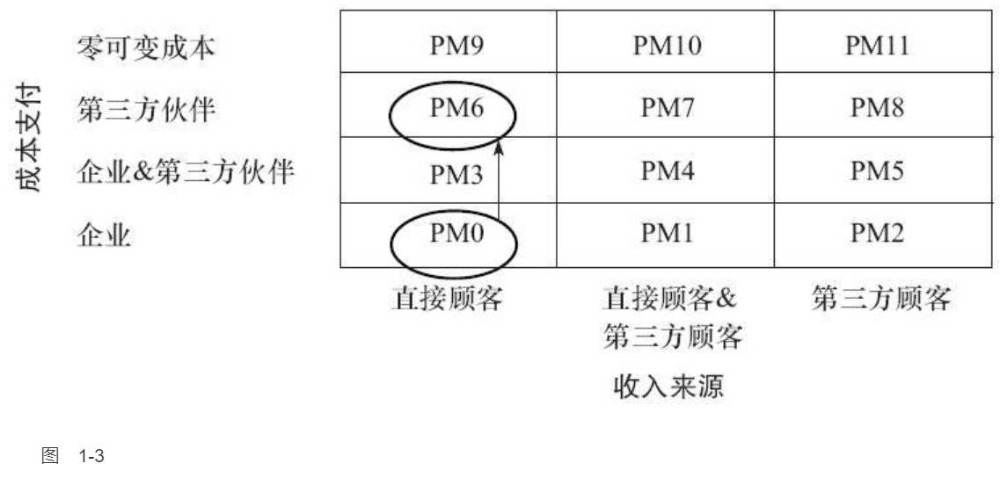

    作者: 林桂平 / 魏炜 / 朱武祥
    出版社: 机械工业出版社
    副标题: 魏朱商业模式理论延伸
    出版年: 2014-5
    页数: 236
    定价: 39.00
    装帧: 平装
    ISBN: 9787111465690

[豆瓣链接](https://book.douban.com/subject/25894780/)

- [第1章 收支来源之利益相关者](#第1章-收支来源之利益相关者)
  - [盈利模式寻宝图：从PM0到PM11](#盈利模式寻宝图从pm0到pm11)
    - [公案：销售牙膏、纸巾，从PM0到PM2](#公案销售牙膏纸巾从pm0到pm2)
    - [公案：让顾客变成你的销售员，Medifast年均增长率超过40%](#公案让顾客变成你的销售员medifast年均增长率超过40)

# 第1章 收支来源之利益相关者
## 盈利模式寻宝图：从PM0到PM11

- PM0：由企业支付成本并从直接顾客获取收入。这是最普遍的盈利模式，很多“产销一条龙”的传统制造型企业都是如此：支付购买原材料、生产制造和渠道销售的成本，通过直接销售给顾客得到收入，收入减成本，就是盈利。对企业而言，交易结构很简单，除了原材料，基本只涉及两个利益相关者：企业本身和直接顾客。
- PM1：企业投入成本生产产品或者服务，从直接顾客和第三方顾客均获取收入。比如，杂志向读者收取订阅费用，同时向在其上发布广告的商家收取广告费，在这个盈利模式中，广告商的目标受众是杂志的读者，因此是杂志的第三方顾客，而读者无疑是直接顾客。同样的，腾讯的互联网增值服务就采取这样的方式，虚拟的衣服、道具、宠物等都向直接顾客收费，而这些产品的边际成本几乎为零，同时腾讯也向嵌入其网络游戏或其他应用的广告商即第三方顾客收取服务费。
- PM2：企业投入成本生产产品或者服务，直接顾客免费消费，第三方顾客支付费用。这正是本章开头提到的谷歌搜索业务采用的模式，另外，电视台、免费报刊都在此列。与PM1相比，PM2虽然减少了直接顾客的收入贡献，但完全有可能通过免费扩大了客户规模和品牌效应，从而向第三方顾客收取更高的费用。PM1和PM2的交易结构极为类似，在很多场合下可以转换，差别仅仅在于是否对直接顾客收费。
- PM5：企业和第三方伙伴承担生产成本，第三方顾客支付价格，直接顾客免费。在这里，第三方伙伴和第三方顾客可以作为同一主体出现。例如，在2012年最火的电视娱乐节目“中国好声音”中，浙江卫视和节目制作方作为企业和第三方伙伴共同投入、共担风险、共享利润，加多宝提供赞助和宣传，中国移动同时作为第三方伙伴和顾客提供彩铃下载服务，与浙江卫视和制作方利润分成，全国手机用户作为第三方顾客通过下载彩铃为企业贡献收入，电视观众则免费观看节目。
- PM6：企业零投入，第三方伙伴投入提供产品和服务的成本，直接顾客可以得到较低价格的产品和服务。例如，很多商业论坛中，主办方一般只负责召集参会人，具体的会场运作、服务提供都由企业赞助，而参会人可能分层付费，VIP座位高价，一般座位免费或者低价。
- PM11：企业零边际成本生产，第三方顾客支付价格，直接顾客零价格。PM9、PM10、PM11分别从PM0、PM1、PM2衍生而来，关键只在于边际成本为零，因此大多来自实体经济的“互联网化”或“移动互联网化”。例如，脱胎本为零，因此大多来自实体经济的“互联网化”或“移动互联网化”。例如，脱胎于PM2的PM11可见于游戏软件厂商在游戏里提供广告，与在传统媒体打广告相比，互联网或移动互联网使边际成本成为零。

### 公案：销售牙膏、纸巾，从PM0到PM2
日常用品的消费比较稳定，可预测，而且规模较大。但这些日用品又零散，如果到超市大卖场购买，大包小包的，绝对会让一般消费者望而却步。

爱丽丝网（Alice.com）建立了一个日常用品网站，只要你向它注册，告诉它家里有几口人，分别为男、女、大人、儿童等，它就会计算出你的日常用品需求有多大，然后给你定期邮寄，而且包邮哦，亲！

关键在于这些产品，爱丽丝网直接向生产厂家购买，绕过中间商，价格只有同等网站的一半多。它是怎么做到的？

原来，爱丽丝网赚取的并非产品差价，而是广告费。这些厂商很多都为沃尔玛等大型连锁百货卖场代工供货，当销售额达到一定规模后，很有意愿推出自己品牌的产品。如果网购流量合适的话，他们甚至考虑可以不给沃尔玛供货。爱丽丝正是帮这样的厂商扩大消费群体，为他们打广告，收取广告费。别忘了，日常用品的箱子也很大，这本身也是打广告的完美载体。

如果采取靠销售差价获得利润，采取的是PM0，企业承担成本，直接顾客贡献收入。而爱丽丝网则是PM2，企业承担成本，第三方顾客（生产日常用品的厂商）贡献收入（见图1-2）。

从传统的PM0升级到创新的PM2，爱丽丝网发展很迅猛，从起步到谈成6000样商品，只花了不到一年的时间。

### 公案：让顾客变成你的销售员，Medifast年均增长率超过40%
Medifast是一家销售减肥产品的公司。这种减肥餐每天吃六顿，间隔两三个小时吃一顿，都是高蛋白和碳水化合物水平低的食物。Medifast宣称，它的产品安全性和有效性均经过医学认证，绝对健康、安全。但即使这样，创立的前20年，Medifast的业绩也没有特别大的惊喜，总是不温不火。直到2005年前后，它改变了自己的盈利模式，重构了收支来源，才取得了长足的发展。2005年当年的收入仅有400万美元，但之后一路高歌，2009年，竟然翻了几倍，达到1.7亿美元，年均增长率超过40%，净资产收益率为17%。

它如何做到的呢？很简单，让顾客变成销售员，由减肥成功的“前”胖子忽悠还没减肥的“现”胖子。

我们都知道，减肥是一件痛苦的事情，一旦减肥成功，这种成就感是难以言喻的，恨不得到处找人显摆；而对于胖子而言，减肥注定是一条艰难、孤独的路，有人现身说法并监督、陪伴自己减肥是很有必要的。而“物以类聚，人以群分”，胖子和胖子经常是聚集在一起的。Medifast就为他们建构了可以相互影响的盈利模式。

已经减肥成功的“前”胖子可以注册成为公司的“健康教练”，只要通过考试，就会拥有一个ID号和个人专用网页，公开显摆你的减肥故事。只要有“现”胖子相信，从你这上面购买Medifast的产品，你就可以获得提成。公司收款，健康教练不需要垫付资金，直接获得佣金。健康教练不需要到公司打卡，公司也因此省了很多费用，效果还更好。

如果“健康教练”业绩不错，可以继续升级为“商业教练”“商业总监”等，从培训下一级中获得收益。公司为这些教练提供“虚拟办公室”，供其完成订单处理、聊天交流等事务，同时成立一个由专业医生和护士组成的“健康研究所”，为教练提供每周的培训及电话咨询。

显然，Medifast的盈利模式一开始是PM0，由企业培养销售员，承担销售业绩，支出成本，并从直接顾客获得收入；后来进化到PM6，销售业绩由第三方伙伴（已经减肥成功的“前”胖子）承担，大大降低了办公费用，而且效果卓著（见图1-3）。

自从转变盈利模式后，Medifast的发展就进入快车道，据《福布斯》报道，盈利模式转变5年后，截至2010年9月，Medifast的健康教练已达到8000人，人均销售额达到1.5万美元。

