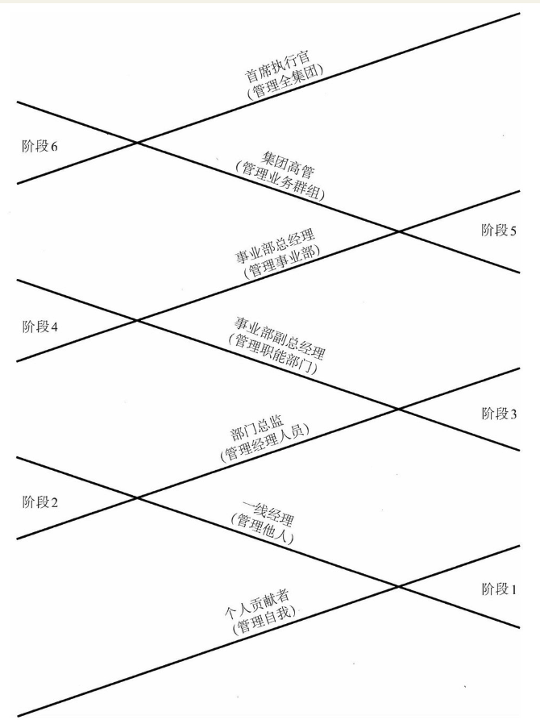
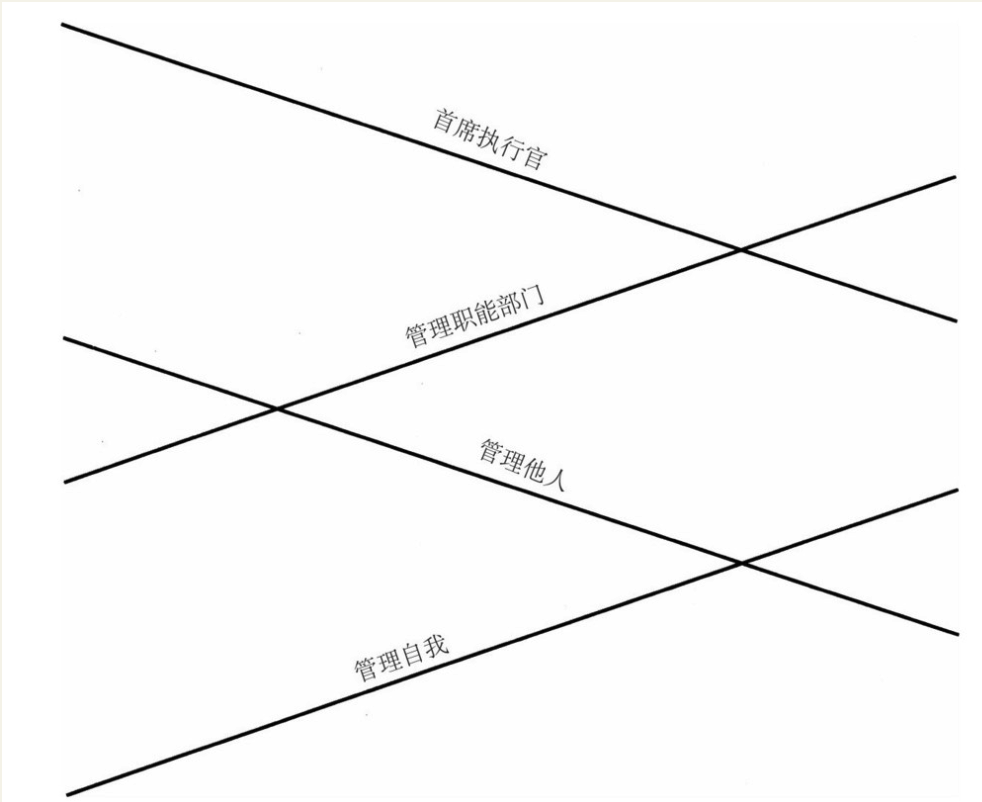
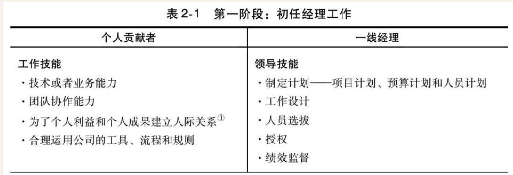
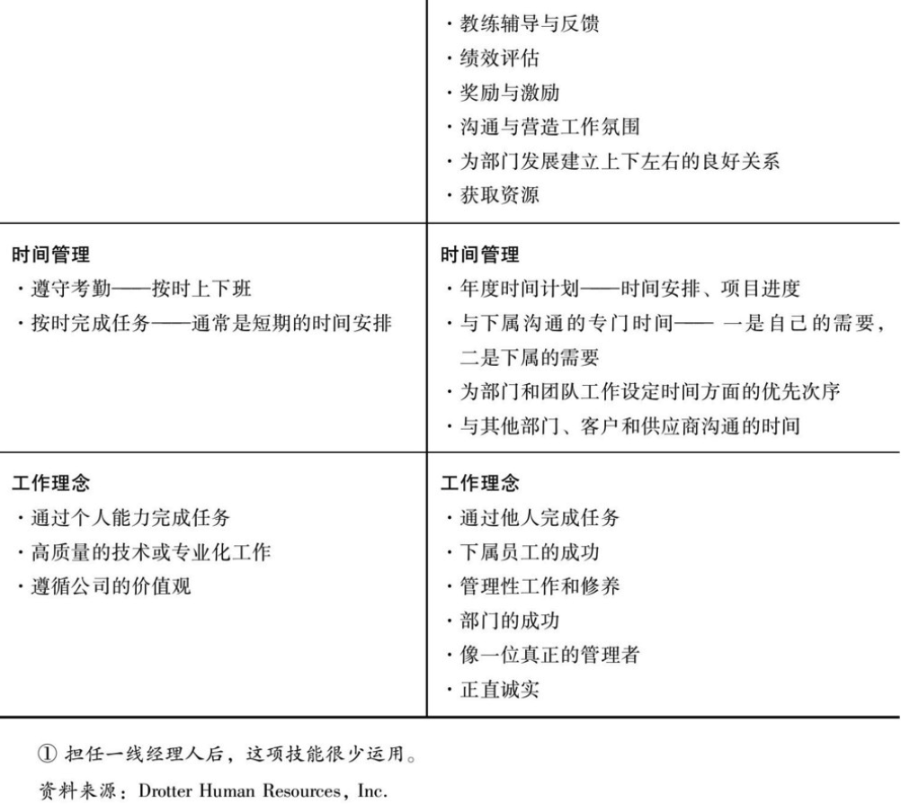
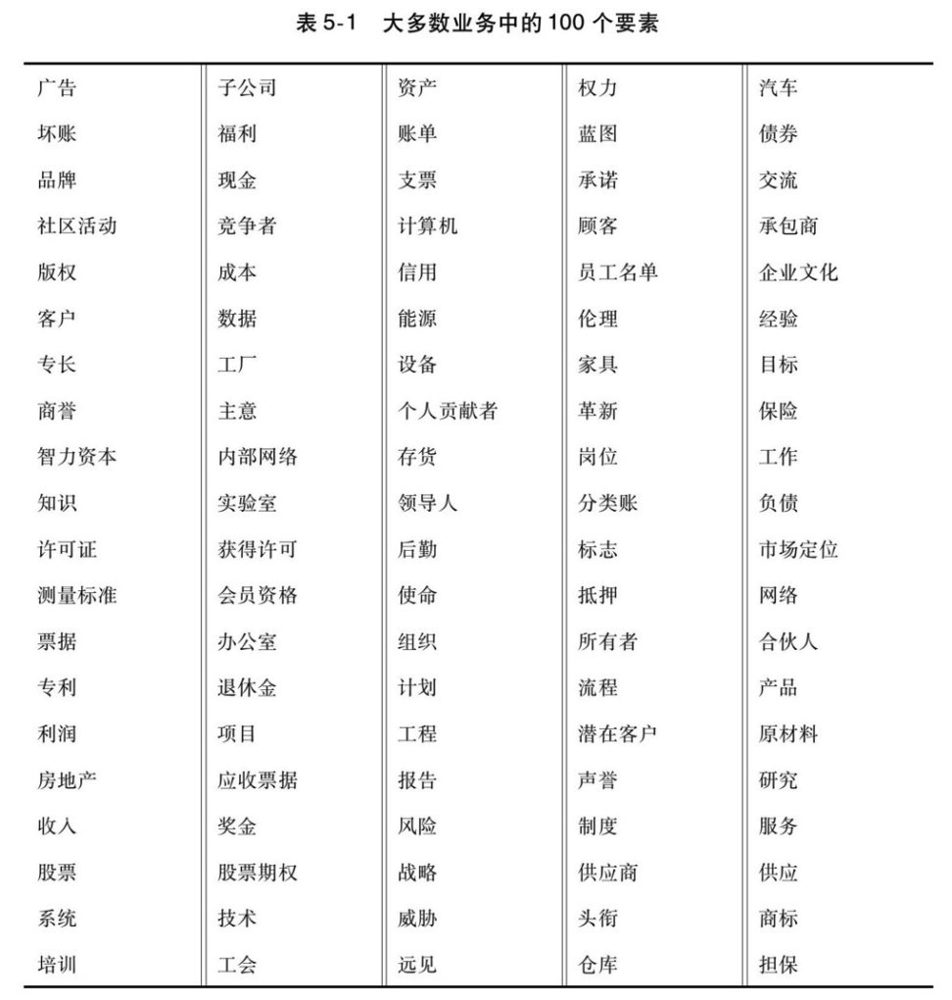
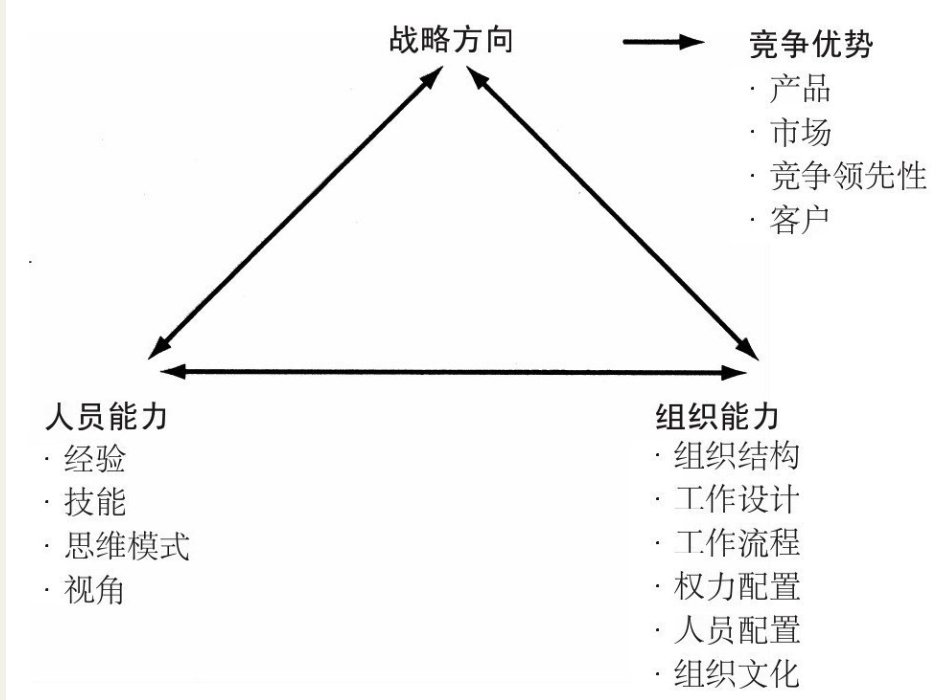
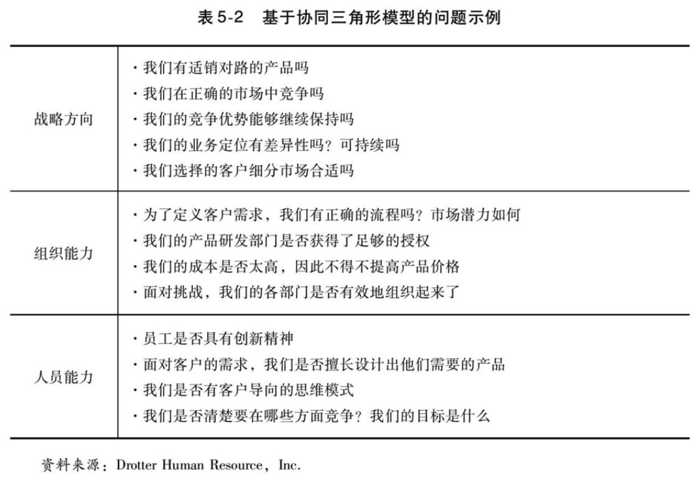
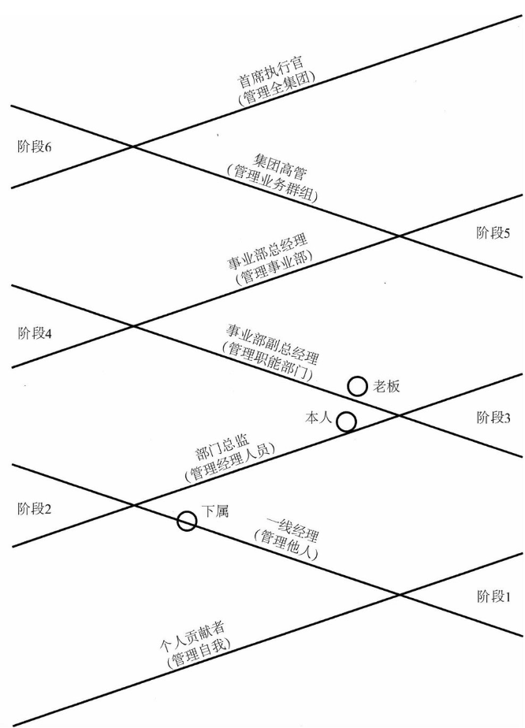

    作者: 拉姆•查兰 (Ram Charan) / 斯蒂芬•德罗特 (Stephen Drotter) / 詹姆斯•诺埃尔 (James Noel)
    出版社: 机械工业出版社
    副标题: 全面打造领导力驱动型公司(原书第2版)
    原作名: The Leadership Pipeline: How to Build the Leadership Powered Company
    译者: 徐中 / 林嵩 / 雷静
    出版年: 2011-7
    页数: 280
    定价: 42.00元
    装帧: 平装
    ISBN: 9787111349341

[豆瓣链接](https://book.douban.com/subject/6536593/)

- [导论](#%e5%af%bc%e8%ae%ba)
  - [领导梯队的各个阶段](#%e9%a2%86%e5%af%bc%e6%a2%af%e9%98%9f%e7%9a%84%e5%90%84%e4%b8%aa%e9%98%b6%e6%ae%b5)
- [第1章 概述：领导力发展的六个阶段](#%e7%ac%ac1%e7%ab%a0-%e6%a6%82%e8%bf%b0%e9%a2%86%e5%af%bc%e5%8a%9b%e5%8f%91%e5%b1%95%e7%9a%84%e5%85%ad%e4%b8%aa%e9%98%b6%e6%ae%b5)
  - [第一阶段：从管理自我到管理他人](#%e7%ac%ac%e4%b8%80%e9%98%b6%e6%ae%b5%e4%bb%8e%e7%ae%a1%e7%90%86%e8%87%aa%e6%88%91%e5%88%b0%e7%ae%a1%e7%90%86%e4%bb%96%e4%ba%ba)
  - [第二阶段：从管理他人到管理经理人员](#%e7%ac%ac%e4%ba%8c%e9%98%b6%e6%ae%b5%e4%bb%8e%e7%ae%a1%e7%90%86%e4%bb%96%e4%ba%ba%e5%88%b0%e7%ae%a1%e7%90%86%e7%bb%8f%e7%90%86%e4%ba%ba%e5%91%98)
  - [第三阶段：从管理经理人员到管理职能部门](#%e7%ac%ac%e4%b8%89%e9%98%b6%e6%ae%b5%e4%bb%8e%e7%ae%a1%e7%90%86%e7%bb%8f%e7%90%86%e4%ba%ba%e5%91%98%e5%88%b0%e7%ae%a1%e7%90%86%e8%81%8c%e8%83%bd%e9%83%a8%e9%97%a8)
  - [第四阶段：从管理职能部门到事业部总经理](#%e7%ac%ac%e5%9b%9b%e9%98%b6%e6%ae%b5%e4%bb%8e%e7%ae%a1%e7%90%86%e8%81%8c%e8%83%bd%e9%83%a8%e9%97%a8%e5%88%b0%e4%ba%8b%e4%b8%9a%e9%83%a8%e6%80%bb%e7%bb%8f%e7%90%86)
  - [第五阶段：从事业部总经理到集团高管](#%e7%ac%ac%e4%ba%94%e9%98%b6%e6%ae%b5%e4%bb%8e%e4%ba%8b%e4%b8%9a%e9%83%a8%e6%80%bb%e7%bb%8f%e7%90%86%e5%88%b0%e9%9b%86%e5%9b%a2%e9%ab%98%e7%ae%a1)
  - [第六阶段：从集团高管到首席执行官](#%e7%ac%ac%e5%85%ad%e9%98%b6%e6%ae%b5%e4%bb%8e%e9%9b%86%e5%9b%a2%e9%ab%98%e7%ae%a1%e5%88%b0%e9%a6%96%e5%b8%ad%e6%89%a7%e8%a1%8c%e5%ae%98)
  - [领导梯队模型在小公司的应用](#%e9%a2%86%e5%af%bc%e6%a2%af%e9%98%9f%e6%a8%a1%e5%9e%8b%e5%9c%a8%e5%b0%8f%e5%85%ac%e5%8f%b8%e7%9a%84%e5%ba%94%e7%94%a8)
- [第2章 从管理自我到管理他人](#%e7%ac%ac2%e7%ab%a0-%e4%bb%8e%e7%ae%a1%e7%90%86%e8%87%aa%e6%88%91%e5%88%b0%e7%ae%a1%e7%90%86%e4%bb%96%e4%ba%ba)
  - [初任经理的三项重要工作](#%e5%88%9d%e4%bb%bb%e7%bb%8f%e7%90%86%e7%9a%84%e4%b8%89%e9%a1%b9%e9%87%8d%e8%a6%81%e5%b7%a5%e4%bd%9c)
  - [界定和布置工作](#%e7%95%8c%e5%ae%9a%e5%92%8c%e5%b8%83%e7%bd%ae%e5%b7%a5%e4%bd%9c)
  - [提高下属的胜任能力](#%e6%8f%90%e9%ab%98%e4%b8%8b%e5%b1%9e%e7%9a%84%e8%83%9c%e4%bb%bb%e8%83%bd%e5%8a%9b)
- [第3章 从管理他人到管理经理人员](#%e7%ac%ac3%e7%ab%a0-%e4%bb%8e%e7%ae%a1%e7%90%86%e4%bb%96%e4%ba%ba%e5%88%b0%e7%ae%a1%e7%90%86%e7%bb%8f%e7%90%86%e4%ba%ba%e5%91%98)
  - [部门总监错位的五种现象](#%e9%83%a8%e9%97%a8%e6%80%bb%e7%9b%91%e9%94%99%e4%bd%8d%e7%9a%84%e4%ba%94%e7%a7%8d%e7%8e%b0%e8%b1%a1)
  - [部门总监该做什么](#%e9%83%a8%e9%97%a8%e6%80%bb%e7%9b%91%e8%af%a5%e5%81%9a%e4%bb%80%e4%b9%88)
  - [让一线经理对管理工作负责](#%e8%ae%a9%e4%b8%80%e7%ba%bf%e7%bb%8f%e7%90%86%e5%af%b9%e7%ae%a1%e7%90%86%e5%b7%a5%e4%bd%9c%e8%b4%9f%e8%b4%a3)
  - [在各部门配置各种资源](#%e5%9c%a8%e5%90%84%e9%83%a8%e9%97%a8%e9%85%8d%e7%bd%ae%e5%90%84%e7%a7%8d%e8%b5%84%e6%ba%90)
  - [有效协调部门工作](#%e6%9c%89%e6%95%88%e5%8d%8f%e8%b0%83%e9%83%a8%e9%97%a8%e5%b7%a5%e4%bd%9c)
  - [如何帮助部门总监实现领导力转型](#%e5%a6%82%e4%bd%95%e5%b8%ae%e5%8a%a9%e9%83%a8%e9%97%a8%e6%80%bb%e7%9b%91%e5%ae%9e%e7%8e%b0%e9%a2%86%e5%af%bc%e5%8a%9b%e8%bd%ac%e5%9e%8b)
- [第4章 从管理经理人员到管理职能部门](#%e7%ac%ac4%e7%ab%a0-%e4%bb%8e%e7%ae%a1%e7%90%86%e7%bb%8f%e7%90%86%e4%ba%ba%e5%91%98%e5%88%b0%e7%ae%a1%e7%90%86%e8%81%8c%e8%83%bd%e9%83%a8%e9%97%a8)
  - [战略思维：胸怀全局](#%e6%88%98%e7%95%a5%e6%80%9d%e7%bb%b4%e8%83%b8%e6%80%80%e5%85%a8%e5%b1%80)
  - [职能战略](#%e8%81%8c%e8%83%bd%e6%88%98%e7%95%a5)
  - [管理整个职能部门](#%e7%ae%a1%e7%90%86%e6%95%b4%e4%b8%aa%e8%81%8c%e8%83%bd%e9%83%a8%e9%97%a8)
  - [识别职能紊乱的信号](#%e8%af%86%e5%88%ab%e8%81%8c%e8%83%bd%e7%b4%8a%e4%b9%b1%e7%9a%84%e4%bf%a1%e5%8f%b7)
  - [培养成熟的、有战略思维的、全面的职能部门主管](#%e5%9f%b9%e5%85%bb%e6%88%90%e7%86%9f%e7%9a%84%e6%9c%89%e6%88%98%e7%95%a5%e6%80%9d%e7%bb%b4%e7%9a%84%e5%85%a8%e9%9d%a2%e7%9a%84%e8%81%8c%e8%83%bd%e9%83%a8%e9%97%a8%e4%b8%bb%e7%ae%a1)
- [第5章 从管理职能部门到事业部总经理](#%e7%ac%ac5%e7%ab%a0-%e4%bb%8e%e7%ae%a1%e7%90%86%e8%81%8c%e8%83%bd%e9%83%a8%e9%97%a8%e5%88%b0%e4%ba%8b%e4%b8%9a%e9%83%a8%e6%80%bb%e7%bb%8f%e7%90%86)
  - [转变思维方式](#%e8%bd%ac%e5%8f%98%e6%80%9d%e7%bb%b4%e6%96%b9%e5%bc%8f)
  - [管理好错综复杂的问题](#%e7%ae%a1%e7%90%86%e5%a5%bd%e9%94%99%e7%bb%bc%e5%a4%8d%e6%9d%82%e7%9a%84%e9%97%ae%e9%a2%98)
  - [高度透明](#%e9%ab%98%e5%ba%a6%e9%80%8f%e6%98%8e)
  - [领导力转型困难的信号](#%e9%a2%86%e5%af%bc%e5%8a%9b%e8%bd%ac%e5%9e%8b%e5%9b%b0%e9%9a%be%e7%9a%84%e4%bf%a1%e5%8f%b7)
  - [自我提升的方法：自学、历练、反省](#%e8%87%aa%e6%88%91%e6%8f%90%e5%8d%87%e7%9a%84%e6%96%b9%e6%b3%95%e8%87%aa%e5%ad%a6%e5%8e%86%e7%bb%83%e5%8f%8d%e7%9c%81)
- [第6章 从事业部总经理到集团高管](#%e7%ac%ac6%e7%ab%a0-%e4%bb%8e%e4%ba%8b%e4%b8%9a%e9%83%a8%e6%80%bb%e7%bb%8f%e7%90%86%e5%88%b0%e9%9b%86%e5%9b%a2%e9%ab%98%e7%ae%a1)
  - [间接成功](#%e9%97%b4%e6%8e%a5%e6%88%90%e5%8a%9f)
  - [管理和培养事业部总经理](#%e7%ae%a1%e7%90%86%e5%92%8c%e5%9f%b9%e5%85%bb%e4%ba%8b%e4%b8%9a%e9%83%a8%e6%80%bb%e7%bb%8f%e7%90%86)
  - [把业务部门与整个公司联系起来](#%e6%8a%8a%e4%b8%9a%e5%8a%a1%e9%83%a8%e9%97%a8%e4%b8%8e%e6%95%b4%e4%b8%aa%e5%85%ac%e5%8f%b8%e8%81%94%e7%b3%bb%e8%b5%b7%e6%9d%a5)
  - [警示信号](#%e8%ad%a6%e7%a4%ba%e4%bf%a1%e5%8f%b7)
- [第7章 从集团高管到首席执行官](#%e7%ac%ac7%e7%ab%a0-%e4%bb%8e%e9%9b%86%e5%9b%a2%e9%ab%98%e7%ae%a1%e5%88%b0%e9%a6%96%e5%b8%ad%e6%89%a7%e8%a1%8c%e5%ae%98)
  - [挑战一：善于平衡短期和长期利益，实现可持续发展](#%e6%8c%91%e6%88%98%e4%b8%80%e5%96%84%e4%ba%8e%e5%b9%b3%e8%a1%a1%e7%9f%ad%e6%9c%9f%e5%92%8c%e9%95%bf%e6%9c%9f%e5%88%a9%e7%9b%8a%e5%ae%9e%e7%8e%b0%e5%8f%af%e6%8c%81%e7%bb%ad%e5%8f%91%e5%b1%95)
  - [挑战二：设定公司发展的方向](#%e6%8c%91%e6%88%98%e4%ba%8c%e8%ae%be%e5%ae%9a%e5%85%ac%e5%8f%b8%e5%8f%91%e5%b1%95%e7%9a%84%e6%96%b9%e5%90%91)
  - [挑战三：培育公司的软实力](#%e6%8c%91%e6%88%98%e4%b8%89%e5%9f%b9%e8%82%b2%e5%85%ac%e5%8f%b8%e7%9a%84%e8%bd%af%e5%ae%9e%e5%8a%9b)
  - [挑战四：执行到位](#%e6%8c%91%e6%88%98%e5%9b%9b%e6%89%a7%e8%a1%8c%e5%88%b0%e4%bd%8d)
  - [挑战五：管理全球化背景下的公司](#%e6%8c%91%e6%88%98%e4%ba%94%e7%ae%a1%e7%90%86%e5%85%a8%e7%90%83%e5%8c%96%e8%83%8c%e6%99%af%e4%b8%8b%e7%9a%84%e5%85%ac%e5%8f%b8)
  - [工作理念的重大转变](#%e5%b7%a5%e4%bd%9c%e7%90%86%e5%bf%b5%e7%9a%84%e9%87%8d%e5%a4%a7%e8%bd%ac%e5%8f%98)
  - [首席执行官遭遇困境的信号](#%e9%a6%96%e5%b8%ad%e6%89%a7%e8%a1%8c%e5%ae%98%e9%81%ad%e9%81%87%e5%9b%b0%e5%a2%83%e7%9a%84%e4%bf%a1%e5%8f%b7)
  - [培养首席执行官不可越级](#%e5%9f%b9%e5%85%bb%e9%a6%96%e5%b8%ad%e6%89%a7%e8%a1%8c%e5%ae%98%e4%b8%8d%e5%8f%af%e8%b6%8a%e7%ba%a7)
  - [确保首席执行官获得成功](#%e7%a1%ae%e4%bf%9d%e9%a6%96%e5%b8%ad%e6%89%a7%e8%a1%8c%e5%ae%98%e8%8e%b7%e5%be%97%e6%88%90%e5%8a%9f)
- [第8章 问题诊断：识别领导梯队模型中的问题和潜力](#%e7%ac%ac8%e7%ab%a0-%e9%97%ae%e9%a2%98%e8%af%8a%e6%96%ad%e8%af%86%e5%88%ab%e9%a2%86%e5%af%bc%e6%a2%af%e9%98%9f%e6%a8%a1%e5%9e%8b%e4%b8%ad%e7%9a%84%e9%97%ae%e9%a2%98%e5%92%8c%e6%bd%9c%e5%8a%9b)
  - [尽早且时常进行领导梯队诊断的三个理由](#%e5%b0%bd%e6%97%a9%e4%b8%94%e6%97%b6%e5%b8%b8%e8%bf%9b%e8%a1%8c%e9%a2%86%e5%af%bc%e6%a2%af%e9%98%9f%e8%af%8a%e6%96%ad%e7%9a%84%e4%b8%89%e4%b8%aa%e7%90%86%e7%94%b1)
  - [帮助我们超越现有工作业绩的工具](#%e5%b8%ae%e5%8a%a9%e6%88%91%e4%bb%ac%e8%b6%85%e8%b6%8a%e7%8e%b0%e6%9c%89%e5%b7%a5%e4%bd%9c%e4%b8%9a%e7%bb%a9%e7%9a%84%e5%b7%a5%e5%85%b7)
  - [个体视角](#%e4%b8%aa%e4%bd%93%e8%a7%86%e8%a7%92)
  - [团队视角](#%e5%9b%a2%e9%98%9f%e8%a7%86%e8%a7%92)
- [第9章 业绩改善：明确岗位职责，设立绩效标准](#%e7%ac%ac9%e7%ab%a0-%e4%b8%9a%e7%bb%a9%e6%94%b9%e5%96%84%e6%98%8e%e7%a1%ae%e5%b2%97%e4%bd%8d%e8%81%8c%e8%b4%a3%e8%ae%be%e7%ab%8b%e7%bb%a9%e6%95%88%e6%a0%87%e5%87%86)
  - [明确职责的相关讨论](#%e6%98%8e%e7%a1%ae%e8%81%8c%e8%b4%a3%e7%9a%84%e7%9b%b8%e5%85%b3%e8%ae%a8%e8%ae%ba)
  - [界定绩效标准](#%e7%95%8c%e5%ae%9a%e7%bb%a9%e6%95%88%e6%a0%87%e5%87%86)
  - [通过绩效标准培养领导者](#%e9%80%9a%e8%bf%87%e7%bb%a9%e6%95%88%e6%a0%87%e5%87%86%e5%9f%b9%e5%85%bb%e9%a2%86%e5%af%bc%e8%80%85)

## 导论
### 领导梯队的各个阶段
图0-1说明了领导者职业发展所经历的六个主要发展阶段。

每个阶段都要求领导者习得一种新的管理和领导方法，同时抛弃原有的方法。这主要表现在以下三个方面：

- 领导技能——胜任新职务所需要的新能力。
- 时间管理——新的时间分配结构，决定如何工作。
- 工作理念——信念和价值观非常重要，让工作聚焦。

## 第1章 概述：领导力发展的六个阶段
### 第一阶段：从管理自我到管理他人
对他们能力的要求主要是专业化和职业化。他们通过在计划时间内完成任务来做出贡献，通过不断拓展和提升个人技能，在岗位上做出更大贡献，从而获得组织的提升。随着工作年限的增加，他们学习的内容包括工作计划、进度管理、工作内容、工作质量和工作的可靠性，需要提高的工作价值观包括公司文化和职业标准。

在领导力发展的第一阶段，应该学习的技能包括工作计划、知人善任、分配工作、激励员工、教练辅导和绩效评估。

### 第二阶段：从管理他人到管理经理人员
在第二阶段，经理人员如果只重视个人贡献和部门工作，而忽视对其他部门和公司整体的贡献，那么他们的角色转变将非常困难。

### 第三阶段：从管理经理人员到管理职能部门
事业部副总经理需要向事业部总经理汇报工作，因此，他们必须有全局意识，能够兼顾多个部门的需求和利益。他们需要具备两项新的技能：一方面是与其他部门团结协作，另一方面是基于工作的需要与其他部门争夺资源。与此同时，他们还必须擅长制定战略，不仅为自己的部门，而且统筹整个业务部门的战略规划。

领导力发展的第三阶段要求管理者更加成熟。一方面，成熟意味着他们的思考和行动像事业部副总经理，而不是部门总监。另一方面，也要求他们有开阔的、长期的战略眼光，对于他们所主管的部门有前瞻性的、准确的长远考虑，这常常给他们带来巨大的挑战。

### 第四阶段：从管理职能部门到事业部总经理
事业部总经理不仅要学会管理不同的部门，而且需要熟练地与各方面的人员协同工作，敏锐地意识到各部门的利益点，并清楚、有效地与各方面人员沟通。更具挑战性的是，如何兼顾长远目标与近期目标，取得恰当的平衡。事业部总经理必须完成季度利润、市场目标、产品计划和人员管理目标，同时兼顾未来3～5年目标的实现。

### 第五阶段：从事业部总经理到集团高管
这个阶段要求领导者在四项关键技能方面进一步提升。

1. 集团高管必须擅长评估资金调拨和人员配置的战略规划。这是一项复杂的商业技能，包括学会正确的提问，有效地分析数据，以及从公司的角度去理解哪些战略规划最有可能成功，最应该得到支持。
2. 培养事业部总经理。他需要清楚哪些事业部副总经理的能力最适合担任事业部总经理，并提升自己的教练辅导能力。
3. 评估业务的投资组合策略。这与事业部的战略有很大不同。他第一次需要问以下几个问题：我们有合适的业务群吗？为确保当前和未来的赢利，需要增加什么业务？削减哪项业务？调整哪项业务？
4. 集团高管必须精于评估自己的核心能力，采取冷静客观的态度，评估手中的资源，基于分析和经验做出判断，而不是盲目乐观。

### 第六阶段：从集团高管到首席执行官
领导力发展的第六阶段，其转变更多地集中在经营理念而不是管理技能方面。首席执行官必须确认自己的角色和职责。作为一位组织的最高领导，他必须是一位有着远大抱负的思想者，同时善于建立公司的运行机制，推动公司实现每个季度的业绩目标，并确保公司长期战略目标的实现。权衡取舍是首席执行官日常的功课，他们必须学会适应和掌握这门艺术。此外，敏锐地觉察并熟练地处理外部利益相关者关系、重大的外部变化以及积极主动地加以应对，变得越来越重要。首席执行官必须具备重视外部关系的视角。

### 领导梯队模型在小公司的应用
小公司领导力发展模型：

在小公司，首席执行官与大公司的事业部总经理类似（对短期目标和长期目标负责，并协调政府关系、客户关系等方方面面），部门总监常常被归类到公司团队成员。

## 第2章 从管理自我到管理他人
第一次担任经理要想获得成功需要一个重大的转变，即他们的工作成果不再是通过自己亲自做去获得，而是通过下属和团队的努力去获得。

### 初任经理的三项重要工作
表2-1概述了这一层级必须经过的转型。

转型可以概括为以下三个方面：
- 界定和布置工作，包括与上司、员工沟通，需要他们做什么，以及工作计划、组织结构、人员选拔和工作授权。
- 通过监督、指导、反馈、获取资源、解决问题和交流沟通，提高下属的胜任能力，从而高效开展工作。
- 建立与下属、上司和相关部门坦率交流与相互信任的合作关系。

### 界定和布置工作
许多一线经理由于没有与关键人员有效地沟通，结果在工作设计和安排时跌了跟头。只有通过有效沟通，一线经理才能很好地理解部门的工作要求，合理布置工作，使得人岗匹配，任务得以及时、高效地完成。

对一线经理来说，听取直接上级的意见当然重要，但与同级、客户、供应商、业务伙伴和其他有关部门的沟通也变得越来越重要。

授权对新任经理是另一个挑战。经理首先需要清楚做哪些工作，谁最合适去做。但放手让他人去做你非常擅长并且为你带来成功的业务，新任经理在心理上难以接受。通常只有当他们意识到授权并不意味着放弃时，他们才会迈出这一步。

新任经理人还必须学会知人善任，选拔合适的人做合适的事。

### 提高下属的胜任能力
经理既需要定期与员工沟通，也需要密切关注工作流程的执行情况。他们要询问是什么阻碍了工作完成，什么促进了工作完成。监督是一项主动而非被动的工作，仅仅动笔记录是不够的，当结果与期望一致时，就应当给予员工适时的鼓励，比如，在员工肩头轻轻一拍表示肯定，同时给予积极的反馈意见；当结果令人失望时，应通过监督获得的信息进行计划调整、方法调整、加强培训，以及要求增加更多资源支持等措施，让工作回到良性发展的轨道。

亲和力不是指让办公室大门敞开，被动回应员工提出的问题，而是一种积极的态度，从言语到行动，都显示他是一位平易近人的领导，让员工喜欢与之亲近，并随时可以找到他。这与其说是一种技能，不如说是一种价值观和工作方法。

## 第3章 从管理他人到管理经理人员
### 部门总监错位的五种现象
1. 授权问题。一线经理常常存在这类问题，但有时可以敷衍过去。但随着领导层级的提升，授权不足的负面影响越来越大。授权问题也不仅仅是授权不足，有可能是授权方式不当，他们缺乏授权后的问责系统。
2. 绩效管理问题。这个问题在于，部门总监很少或者不善于向下属经理提供反馈，没有给出正确的努力方向，下属不确定真正的目标是什么。换句话说，部门总监不能有效地与下属经理沟通。
3. 团队建设问题。总监仅仅把下属经理当成个人，而不是把他们组织成高效的团队，无意之中助长了个人主义，影响了团队的信息共享和协同支持。
4. 仅仅囿于完成任务的思维模式。总监们没有充分考虑新岗位的领导力转型，他仍然像一线经理一样开展工作，而没有意识到自己是一个经理人员发展的教练和导师，也很少对战略和文化层面的问题表现出兴趣。
5. 选拔“自己人”总监经常有机会选拔下属经理。遗憾的是，他们缺乏这方面的训练，经常选择和他们相似的下属。这不仅导致了人员结构不够多元化，而且由于他们缺乏领导才能，从而阻碍了领导梯队的畅通。

### 部门总监该做什么
以下四种领导技能至关重要：

- 选拔和培养有能力的一线经理。
- 让一线经理对管理工作负责。
- 在各部门配置各种资源。
- 有效协调自己的直接下属部门和其他相关部门的工作。

### 让一线经理对管理工作负责
部门总监工作的一部分，是调整那些不称职的一线经理。

### 在各部门配置各种资源
以下是部门总监需要回答的有关资源是否有效利用的问题。

- 每个部门是否能够按时完成任务，并在质量管理和成本控制方面达到要求？如果没有，还需要其他什么资源？
- 我们是否拥有最佳的内外部资源组合？这种组合应该如何进行调整？
- 哪些部门在浪费资源？应该采取什么措施？
- 考虑到整体的产出要求，现有的部门结构是否合理？哪些资源需要重新配置？
- 哪些人不适合在这里工作？如何尽快让合格的人员替换他们？

考虑到个人和部门的具体资源要求，还需要做出其他判断。

- 哪个部门工作最有效，并应该给予新的挑战性项目（风险最大的项目）？
- 哪些部门应该获得更多的资源（因为它们能够更有效地利用资源）？
- 谁应该得到最大幅度的加薪？
- 谁最需要教练辅导？谁需要我投入更多的时间？

### 有效协调部门工作
部门总监需要监督自己的部门和其他部门之间的协作状况，提出问题和改进意见。同时，他们要有一种更敏捷的管理技巧：理解、传达职能部门战略、业务战略和公司使命，通过传达和检查这些工作与公司战略的匹配程度，帮助本部门与其他团队的有效协同，实现组织的业务目标。

### 如何帮助部门总监实现领导力转型
必须有合适的目标和标准，帮助新任部门总监实现领导力转型。这些标准包括以下方面：

- 工作效率提高的程度；
- 工作质量提高的幅度；
- 教练辅导的频率和效果；
- 提升或者为其他部门输送一线经理的人数；
- 新任一线经理的成功率；
- 工作中的团队合作；
- 在新领域的团队合作。

## 第4章 从管理经理人员到管理职能部门
### 战略思维：胸怀全局
最优秀的事业部副总经理是那些具有战略思维，并在具体管理时胸怀全局的人。

### 职能战略
在晋升到这个领导层级之前，领导者已经在自己的职能范围内为职能战略实施制定出支持性的经营计划。现在他们必须提升为制定职能战略。以下是该层级战略的五项要求。

长期思维（3～5年）事业部总经理必须制定出长期战略，而副总经理要制定出与长期战略相吻合的计划。

- **觉察最新发展动态**。职能部门主管需要利用网络和其他工具了解那些能让他们的部门保持或达到优势地位的新进展。
- **全面了解商业模式的细节、长期的战略方向和目标**。成熟的领导者能够意识到他们必须把握整体而不是那个让他们觉得惬意的细节。如果职能部门主管能回答以下问题，就证明他对商业模式和长期战略的理解很深入。
  - 该业务要实现的目标是什么？
  - 在市场中想要如何给自己定位？
  - 战略在最近是否发生改变或是否将要发生改变？
  - 我的部门是否能为公司的竞争优势做出贡献？
  - 每个职能部门必须为该战略贡献什么？
  - 我的部门做出的努力如何影响该战略？
  - 我的部门如何影响其他部门所做出的贡献？
  - 在该业务领域，如何实现赢利？

将职能部门的所有方面纳入战略思考　在此，职能部门主管要转变他们之前的时间管理方式。过去，他们可能只花很少时间来了解那些他们不负责的职能领域。但现在，了解其他职能领域是必需的，并且他们要花很多时间。

在支持业务战略、赢利和竞争优势（而不仅仅是支持职能领域的成功）的职能领域进行权衡的能力　这要求职能部门主管识别不同职能部门之间的联系。有时这些复杂的联系必须通过持续的对话才能发现。因此，职能部门主管需要花时间与他们的直接下属交谈，了解他们的每个团队如何与其他团队很好地合作。职能部门主管还要了解战略和系统思维，这样才能将他们正在负责的事情与更大的业务问题和目标联系起来。

### 管理整个职能部门
在公司内部，必须给予每位员工平等的倾听机会。在职能部门各个层级安排与员工的例行倾听会议是绝对必要的，这是建立“纳谏能力”和在危险与机会出现前觉察它们的唯一方法。举办这些倾听会议时，经理们应该积极倾听并且开放思想，这样才能回答以下问题：

- 员工们都在做什么工作？
- 他们是否得到合理的管理、发展、奖励和指导？
- 他们是否对业务战略、赢利模式、职能战略、商业挑战、竞争形势和短期重点工作有足够的了解，以便正确地开展工作？
- 他们面临什么问题？
- 阻碍是什么？
- 在改进他们自身、所在职能部门以及公司绩效方面，他们有哪些想法？
- 正在发生什么创新？
- 决策周期的速度是否足够快？

### 识别职能紊乱的信号
要识别在这一阶段出现问题的经理，请看以下三个方面的症状。

1. 无法从项目运作导向转变到战略导向。
   1. 缺乏经营业务的整体思维。
   2. 缺乏长期考虑（更多关注短期）。
   3. 缺乏将职能活动与业务目标相联系的职能战略。
   4. 忽视公司的职能部门标准、需求、政策和规划。
2. 不能重视和应对不熟悉或兴趣不大的工作。
   1. 花很少时间抑或不花时间与不熟悉部门的人员交流或处理相关问题，把大量时间花在熟悉领域的人员和事情上。
   2. 在薪资、奖金和预算方面表现出对熟悉部门的偏爱。
   3. 其职能部门内的人员流失率高于正常比率（虽然这也可能归咎于必要的人员清理）。
3. 作为领导者的表现不成熟。
   1. 不是很愿意承担领导者的职责，更乐于扮演事必躬亲的管理者和执行者。
   2. 不相信他人，尤其不相信不熟悉的职能部门的下属。
   3. 不能授权，必须掌控所有事情。
   4. 倾听和表达方面的沟通能力很差，除了与亲信下属打交道外，不与他人接触。
   5. 授权过多，缺乏有效的控制系统（或者相反）。

### 培养成熟的、有战略思维的、全面的职能部门主管
一位成熟的领导者并不需要精通每个职能领域（事实上也不可能），但他愿意承认别人比他知道得多，愿意向他人学习。同样，成熟的领导者意识到如果他们要成功，就必须同他人合作。要做到这一点，他们应学会授权、沟通，并确保信息顺畅、快速地流动。

## 第5章 从管理职能部门到事业部总经理
### 转变思维方式
此前，作为事业部副总经理，他们都热衷于提高生产力水平。现在，他们必须按一套新的衡量标准来调整工作重心，必须在全球背景下，从赢利能力和可持续竞争优势的角度来思考问题。由于多年习惯于从战术层面思考短期的部门业务目标，要实现思维方式的转变并不容易。

部门策略思维与业务战略思维大相径庭。显然，后者要求具备更广泛的视野。事业部总经理必须考虑到无数的外部因素，包括客户、竞争者、人口数据、经济趋势和其他外部利益相关方，例如政府和社区。业务战略必须同时考虑本行业和全球相关事务。

### 管理好错综复杂的问题
表5-1说明了当今的事业部总经理有可能遇到的复杂问题。

### 高度透明
事业部副总经理的透明度存在于部门内部。虽然下属也琢磨事业部副总经理的每一句话，观察他的每一个举动，但是，因为有共同的业务目标和共同语言，大家容易相互理解。当然，可能有的事业部副总经理和事业部总经理也受到关注。但总的来说，事业部总经理受到的关注更加强烈。

### 领导力转型困难的信号
下面是一些常见的在该转变过程中遇到麻烦的征兆。

- **缺乏激励的沟通**。似乎新职务带来的困难让领导者变得“词不达意”了。担任职能经理时，说起话来慷慨激昂，头头是道，现在却难以激发团队成员。
- **没有能力组建强大的团队**。因为工作的复杂性、不熟悉和工作量很大等因素，事业部总经理建立起有效的团队至关重要。然而，有的事业部总经理会坚持做“独行侠”，这种心态的普遍现象是，直接下属太无能，他们经常表现出对某个部门的偏爱（他曾经工作过的部门），对其他部门的疏远。也有可能是由于事业部总经理不能理解和激励事业部副总经理，和他们一起努力工作，当他们在一起工作时互不信任。
- **没有掌握业务赚钱的技巧**。作为事业部总经理，他们的职责是通过业务来赚钱，并且提高投资收益。然而，很多事业部总经理不明白改善赢利状况的要求是什么，虽然他们在一定程度上理解赢利的要求，但是他们不能把这种要求转化为正确的行动。不能认清赢利的来源，主要是缺乏对业务核心流程的理解。要理解，就需要下工夫，也就是要承认自己在这方面的无知，找到值得信赖的相关专家，主动询问更多的问题。从熟悉一个部门的领导者，转变为管理不熟悉的跨部门业务，是一个巨大的挑战。
- **时间管理问题**。如果事业部总经理一味走马观花地从一个部门到另外一个部门，根本没有时间与核心人员讨论问题，那么他肯定会遇到麻烦。事业部总经理经常遇到时间管理问题，他们难以在上级外部活动和拜访客户等工作中找到平衡点，原因在于他们还受到先前工作岗位带来的思维影响，总是希望做更多的事情。他们热衷于事必躬亲，而不是打造高效的团队，并把具体工作授权给他们。

### 自我提升的方法：自学、历练、反省
图5-1所示的三角形分析工具，对于理解复杂性非常有效。

上司要为事业部总经理安排一系列的会谈来明确以下问题（见表5-2）。

## 第6章 从事业部总经理到集团高管
### 间接成功
下面三个问题有助于判断集团高管的工作理念是否实现了有效的转变。

1. 集团高管能否做出正确的决策，区分不同业务可能产生的不同结果？
2. 集团高管能否在与直接下属共事中把他们培养成真正的事业部总经理？
3. 集团高管能否让公司总体战略优先于部门战略？

### 管理和培养事业部总经理
集团高管领导事业部总经理，批准他们的业务规划，但他们并不亲自管理具体业务。

为了帮助事业部总经理的发展，集团高管需要学会评估他们的战略规划，而不是亲自去制定战略规划。他们必须控制把一个有效的战略交给下属执行的冲动，代之以询问和教练指导，让下属自主设计部门的战略规划。最好的集团高管能够敏锐地识别下属的战略规划，通过询问和观察，可以确定下属是否胜任其领导岗位，他们的思维是否仅限于事业部副总经理层面。战略评价能力就是在长期的反复实践中练就的，这也是成功的关键因素。

集团高管必须学会超越财务结果来评价事业部总经理。可以想见，除了财务指标，找出别的衡量标准是一件困难的事情。

要让下属明白，各方面工作都很重要，他们不仅仅对财务指标负责。

在时间管理方面，集团高管必须投入大量时间与事业部班子成员交流。

### 把业务部门与整个公司联系起来
集团高管必须确保各个业务部门在追逐利润时遵守法律和公司政策，维护和提升公司的品牌形象。

另一项工作涉及资金调拨。集团高管对各业务部门的赢利负有责任，也掌握着资金在各业务之间的调拨，这要求他们有一个重大的思维转变。事业部总经理的视野相对狭隘，专注于特定的产品和市场，而集团高管不得不保持一个更加宽广和客观的视角。在决定资金调拨之前，他们需要对每一项业务成功的风险进行评估，他们必须判断哪些产品增长潜力巨大，学会进行准确的财务分析。

第三项相关技能是区分业务优先次序，包括判断哪个业务部门的战略最佳，哪些业务战略最符合公司的总体战略，因此，哪项业务最应该获得充分的资金支持，领导者第一次必须在对公司最有利的事情和支持自己的主管部门之间进行合理的平衡。集团高管的工作很微妙，因为对公司最有利的事情也许对某个业务部门并不一定有利，所以集团高管必须有知识、有分析能力、有个人信用，从而与直接下属和公司高层都保持良好的关系。凭借自己的公正无私和精明的商业头脑，获得各方面尊重的集团高管才有可能顺利完成这项高空表演。

### 警示信号
最严重的有以下四种行为。

- **像事业部总经理一样工作**。最常见的情况是，为下属部门制定战略，直接指导事业部总经理的工作，改变产品和服务。这些行为都表明，他在领导力转型中遇到了困难。另一种情况是，事业部总经理感到自己像事业部副总经理一样工作，他们抱怨自己无权做出相应的决策。最明显、最令人不安的现象是，每个层级的领导都越俎代庖，做着下一级领导的工作：事业部副总经理像部门总监，部门总监像一线经理。
- **维持一种与集团公司对立的关系**。他们对公司总部形成负面的看法，使用像“象牙塔”、“瞎指挥”这样的词来表达他们的不满情绪。如果一位集团高管说，“这不是业务型高管工作的地方”，那么我们就知道他在领导力转型中遇到了困难。
- **忽视新机会**。不要轻易判定一位集团高管没有马上对主管业务的新机会做出反应，因为他获得新领域的必要知识需要时间。熟悉一个行业，需要几个月的探索、研究和分析，然后集团高管必须识别新的问题和机会，发展新业务，或拓展现有业务以把握新的机会。
- **放弃培养事业部总经理的机会**。培养事业部总经理，是集团高管的一项重要职责。如果他们不花时间与直接下属经常沟通，或者不重视对他们的培养，这就表明集团高管没有履行好自己的职责。

## 第7章 从集团高管到首席执行官
### 挑战一：善于平衡短期和长期利益，实现可持续发展
在上市公司，大多数首席执行官都受到投资人和证券分析师的评价。他们的成绩每时每刻都反映在股票交易所的电子显示器上。每个季度，华尔街公布对公司业绩预期的上限和下限，任何偏离预期的业绩都会影响首席执行官的信誉。而信誉是首席执行官最重要的资产。霍尼韦尔、波音和亚马逊的首席执行官在进入21世纪时都遭遇了信任危机。为了生存，首席执行官必须学会重视短期目标和长期目标，平衡两者之间的关系，并投入大量时间实现两者之间的平衡。

### 挑战二：设定公司发展的方向
首席执行官面临的真正挑战，是为公司发展设定一个明确而具体的定义，这要求首席执行官展现出他们真正的勇气。

### 挑战三：培育公司的软实力
每个公司都是一个社会性组织。两三个人一起工作，就会形成积极的或消极的关系。管理好这种社会关系与工作环境，是首席执行官最重要的职责之一。同时关注这些软性问题，并努力实现硬性的业绩。

首席执行官则必须发起、保持和管理全部流程。他必须不断地问自己这些问题：

- 我们在选拔优秀人才方面做得有多好？
- 我们在给予正确意见反馈时有多么坦率？
- 我们在及时消除人岗错配的问题方面，愿望有多么强烈？
- 我们在保留业绩出色人员、快速提升他们、正确奖励他们和给予前所未有的机会考验他们方面，有多么重视和擅长？

### 挑战四：执行到位
不同于普遍的看法，成功的首席执行官并不一定是精明的战略家或者卓有远见。但是他们必须让公司的战略执行到位。

坚持执行到位的首席执行官，总是问自己下列问题：

- 我的表现如何　要得到一个肯定的答案，首席执行官需要预测今后8个季度的业绩（不是通常的4个季度）。越早开始，他们就可以建立起以业绩目标完成为中心的管理体系。
- 我了解公司正在发生的事情吗　执行力要求从最重要的事情获得最新的进展信息。首席执行官应该与顾客和一线员工保持联系，并对公司和市场情况了如指掌。例如，沃尔玛创始人山姆·沃尔顿，养成了每天到商场里转悠的习惯，确保哪里有事情发生，他就在哪里。万豪酒店的老板比尔·马里奥特，每年有300多天走访各个酒店，并将其作为日常工作，他能够很快地发现情况良好还是糟糕。首席执行官也应该知道，直接下属是否尽职尽责。最重要的是，他们应该密切关注公司的总体运行状况，并据此采取行动。
- 有人把坏消息告诉我吗　在有些公司，员工们害怕告诉首席执行官坏消息，也有一些公司的首席执行官不愿意听到坏消息，他们总是为坏消息辩解。如果坏消息不能得到及时处理，累积到一个危机的临界点，首席执行官就不可能完成业绩目标。等到他们醒悟过来，为时已晚。
- 董事会履行自己的授权吗　如果董事会只是一个橡皮图章，这将影响首席执行官能力的发挥。如果董事会对首席执行官及其下属负起责任，关注领导梯队建设状况和公司的市场状况，这将增强首席执行官的执行力。
- 我的团队高效而充满活力吗　如果高管团队四分五裂、诸侯割据，这表明首席执行官遇到了大麻烦。当高管团队不能建立共识，实现相对容易的目标时，首席执行官将不可能创造出让人接受的业绩。

### 挑战五：管理全球化背景下的公司
不关注商业环境，没有公司能够生存下来。每个公司都是取之于社会，回报于社会。公司必须了解并积极地参与解决公司所面临的全球性问题，必须关注环境问题、安全问题、健康问题等，并承担相应的社会责任。

### 工作理念的重大转变
首席执行官只有在经历较长的时间后才能获得有限的几个目标实现满足。例如，改变公司形象，需要花费数年。实际上，工作理念是从快速实现短期目标，转变为长期的可持续发展。

首席执行官面临的另一个理念转变是如何听取董事会的意见。与业务内行相比，董事会成员的意见可能比较肤浅，缺乏根据。作为个人的董事，也可能提出自相矛盾的建议，有些首席执行官因此低估了这些建议。然而我们发现，如果首席执行官对董事是开放的，愿意听取他们的意见，向他们学习，这最终将有利于他们的决策。

最后，优秀的首席执行官要善于向各种各样的人提出问题，并听取他们的意见。这简直是一种与直觉相对立的做法。

### 首席执行官遭遇困境的信号
下面四种行为和态度表明首席执行官在转型中遭遇了困境。

- **忽略公司是如何实现目标的**。这又回到了挑战四：执行到位。有时候，新任首席执行官并不知道如何执行公司战略。他们的一言一行表明，他们并不重视把合适的人放到合适的岗位，或者把一项工作落到实处。他们不清楚如何运用自己的影响力，巧妙地克服组织惰性和其他障碍，实现公司目标。他们也没有兴趣学习如何让企业的战略得以实施，只是沉醉于自己的幻想。
- **首席执行官的大部分时间花在外部交往方面**。首席执行官应该合理分配内外部事物的时间，如果过分倾向于一边，那么另一方面就会出问题。
- **首席执行官没有在公司软实力建设方面投入足够时间**。这是挑战三谈到的问题：培育公司的软实力。从首席执行官角度来看，人事问题十分复杂。例如，首席执行官负责领导梯队建设，如果他们对选拔和培养各级领导人才缺乏兴趣，这将明确无误地表明公司的软实力没有得到足够重视。
- **董事会成员反复追问同一个问题**。当结果低于预期时，股民们就会仔细审查公司的各项工作，董事会将被迫向首席执行官提出严峻的问题。如果首席执行官不能提供满意的答复，这个问题将在董事会上被反复追问，这就表明首席执行官遇到了麻烦。与董事会关系不够融洽，表明首席执行官缺乏一项关键的领导技能，或者工作理念与首席执行官职务不匹配。

### 培养首席执行官不可越级
理想的首席执行官成长路径是，在其职业生涯的早期就具备了在公司核心业务部门的多个职位工作的经历。

另一个培养方法是，让他们主管公司的人力资源。仔细研究、深入分析、长期计划和测量评估，都是担任首席执行官的基本功。主管人力资源可以培养他们这方面的能力，这也将加深他们对人力资源部门工作的了解和认可，一旦成为首席执行官，他们就能够更好地重视和开发公司的人力资源。

### 确保首席执行官获得成功
领导公司需要智慧，向董事会做陈述报告并不是首席执行官工作的全部内容。实际上，管理公司必须确保战略得以执行，选拔合适的人才，评估公司的业绩，建立良好的内外部关系。

代表性的情况是，咨询顾问跨越了某些领导力阶段，他们缺乏对中基层员工工作的了解，难以激励一线员工，团结各个部门，教练辅导下属，提出正确问题，以及从支持性部门获得有益的建议。

为了保证首席执行官的成功，公司必须要确保他成功经历过大多数主要的领导力发展阶段的历练。

## 第8章 问题诊断：识别领导梯队模型中的问题和潜力
### 尽早且时常进行领导梯队诊断的三个理由
我们发现，几乎所有组织都存在把人员配置在错误领导层级的问题。这个问题发生在六个层级中的每一层级，特别在以下三个层级最为普遍：

- 一线经理，他们大多数时间都在做员工的工作。
- 事业部总经理，他们在做副总经理应该做的职能性管理工作。
- 集团高管，他们专注于事业部总经理应该做的业务工作。

为什么有些领导在错误的层级上工作却仍能完成业绩，公司也仍能照常发展？这里有三个较有说服力的原因。

1. 即使有大量的工作产出也不意味着完成了重要的工作。
   1. 比如，一位销售经理把他所有的时间都花在了销售工作上，但是他并没有对销售人员进行有效管理。不管销售人员工作如何努力，也不管销售经理的业绩如何骄人，重要的是，一些必要的工作并没有完成。销售人员也许并没有将工作重心放在增加新的客户方面，他们也可能对那些比较难销售的产品束手无策。虽然短期业绩看起来很不错，但是，对于可持续发展却没有任何帮助。
1. 每一笔业务交易的成本都在增加。
   1. 还是回到前面的例子，销售经理的工作职责是管理，但是他实际上却干着单打独斗的活。问题还不止于此，这位销售经理的上司——部门总监，十有八九也正在做着这位销售经理的工作。因此，部门总监也在做着低于他薪水级别的工作。一般来说，在这种情况下，上一级的领导者都会被拉下来填补这一职能上的空缺。这种工作和薪水上的错位对公司来说可能很难摆脱，而且这种错位已经成为“在这种文化中完成任务的方式”。
1. 员工没有得到正常的职业发展。
   1. 如果你的上司在做你的工作，你所要面对的就是剩下的“边角料”。一般来说，人们会去完成下面一个领导层级中最重要的工作，侵占他们直接下属的最重要职责。

### 帮助我们超越现有工作业绩的工具
玛丽和查理的故事

>玛丽是一位专业的招聘人员，她被一家大型的国防承包商擢升为技术和专业人员招聘经理。作为一名非常优秀的招聘人员，她现在管理着其他九名员工。在新岗位工作的第一周，玛丽的上司查理要她完成一份关于未完成招聘的几个职位的现状报告，这一状况已经使得公司一项非常重要的任务陷入停顿。玛丽与每一名下属就候选人状态、工作机会和雇佣状态进行了交流，然后汇报给查理。与此同时，查理正承受来自管理层的巨大压力。他告诉玛丽，工作空缺太多，候选人又太少，因此，他要求玛丽“亲自参与”工作，招募更多更好的候选人。因为玛丽要忙于招聘，查理就要制定一项重新调配资源的计划来解决其他需要，而这个工作一直是玛丽的职责。

>在这种情况下，玛丽和查理完成了任务，并且招聘到了关键职位的员工。他们因此得到了额外的业绩奖金。实际上，查理告诉自己的上司，玛丽最有可能是自己的继任者，因为她在这次危机中表现非常优秀。

>表面上看，玛丽和查理完成了他们自己的领导角色，但是实际上，他们都未能恰当地履行其应有的职责。查理开启了一个先例，那就是一旦危机出现，查理会做大部分管理性工作，而玛丽则会回到自己原先招聘人员的角色。最后，玛丽学会了关注错误的工作方向，而没有学会如何重新调配资源（假如出现其他情况）。查理仅仅在名义上是部门总监，虽然他的确获得的是这一职位的薪水。他没有协助公司的项目经理在不能很快招募到关键员工时寻求替代方案以解决问题，反而去做低于自己领导层级的工作，本应属于自己的重要工作却并未完成。在查理指明玛丽做自己的继任者时，可怜的玛丽实际上根本没有为更高的领导层级做好准备。

首先关注查理所在领导层级（部门总监）的领导技能，可以询问以下问题以确定他是否在危机出现的时候展现出这些能力。

领导技能
- 查理是否要求玛丽完成与她所处领导层级相称的工作？
- 查理是否清楚如何培养一位一线经理？他有能力去培养吗？
- 查理是否知道如何建立公司内部项目组之间的正确关系，从而使自己能够及早地得知问题预警或者有关关键需求的信息？

在玛丽和查理的案例中，你有可能关注这些关于时间管理和工作理念的问题。

时间管理

- 查理在帮助玛丽了解一线经理的职能方面付出了多少时间？
- 查理在指导玛丽成为一线经理方面付出了多少时间？
- 查理在与重要的内部客户交流人员的招募和员工服务情况方面付出了多少时间？
- 查理对未来多长时间的工作进行了规划？他是否拥有关于员工需求的高峰期和低谷期的年度计划？

工作理念
- 查理认为什么工作最重要，正如在本次危机中他以行动向玛丽及他人所表明的？
- 在此次危机中，当查理开始工作后，首先做的是什么事情？在早晨上岗后，他马上和谁进行了有意义的谈话？

### 个体视角
以下步骤将有助于你更快、更准确地评价一个人。

1. 通过对个体的观察和谈话识别个体的行为和工作成效。看看他的日程表以判定他如何使用时间。找到他正在执行的工作以及他的努力重点。了解这个人每天做的第一件事是什么。他会见的一个人和他着手的第一件工作通常反映了他所优先考虑的事务。
1. 了解他对其他人的影响——过去和现在的直线下属，以及其他部门的人。他是否针对直线下属所处的领导层级进行了有效的开发？他是否频繁、融洽地与其他部门的人员进行交流？
1. 把这些信息与领导梯队模型相对应。分析个体行为和态度与某个既定层级所要求的领导技能、时间管理能力和工作理念的一致或不一致程度。
1. 判定某人实际所处的领导层级是否与他应该达到的层级相匹配。虽然有人可能对任何领导层级都无法完美适应，但他可能只是缺少了所处层级所需的某些技能，或者他的时间管理能力可能仅仅部分符合其领导层级的要求。通常你可以按照某种合理的标准把他安排到六个领导层级之一。当你这么做时，要确定他目前的领导力与他将要进入的领导层级所要求的能力之间的差距。
1. 建立一个以理念为中心的培训计划。尽管我们要在以后几章才讨论它，但是要记住如果人们树立了正确的工作理念，他们自然就会有正确的时间管理能力和领导技能。

### 团队视角
以下步骤可以帮助不同团队有效地利用领导梯队的诊断方针。

1. 对被评估的团队中的领导者进行个人评价。
2. 持续关注其个体评价，并检测领导技能、时间管理能力及工作理念是否符合所处领导层级的要求。
3. 若它们不符合，那么具体的差距是什么？找出这些不符合情况的具体构成（例如，这个层级上的大多数领导者更关注技术工作而不是培训他人）。
4. 假如你在查看整个领导梯队，则要分析每个层级的强项和弱项。例如，是否事业部总经理层级情况较好（领导技能、时间管理能力和工作理念之间形成了良好的组合状态），而业务经理层级较差呢？换句话说，领导梯队在哪里发生阻滞了？你能够正确指出实际领导能力与要求不相称的领导层吗？

## 第9章 业绩改善：明确岗位职责，设立绩效标准
### 明确职责的相关讨论
明确职责的相关讨论
大多数领导者依据目标和任务来思考他们的工作。与目标和任务同样重要的是，他们没有从整体上掌握领导的职责。例如，以下对中层领导者的要求经常被忽视：

- 能够帮助他人获得成功。
- 依据客观条件、智力情况和感情要素激发团队，充分发掘他们的潜能。
- 依照特定标准来提供专门的指导。
- 加强横向联系（这一点在电子商务时代特别重要）以保证工作顺利推进。

请注意以下这些普遍存在的职责断裂和重叠现象。

- 职责断裂
  - 缺乏上级对下级绩效的反馈，造成问题反复发生。
  - 由于缺乏资源，计划无力执行；该计划由上级制定，并且要求下属执行，但他们都觉得评估计划所需资源以及获取这一资源不属于自己的职责范围。
- 职责重叠
  - 事业部副总经理和部门总监都对同一个一线经理下指示。
  - 事业部总经理和销售经理都认为产品开发计划是自己的首要职责。

因此，可以采用以下步骤以明确职责：

1. 使用领导梯队模型来确定特定工作所处的领导层级。
2. 与其他经理沟通，确定他们的领导层级以及该层级所要求的领导技能、时间管理能力和工作理念。
3. 让领导梯队上的领导者都了解相邻层级之间可能存在的职责断裂和重叠，并采取行动纠正上述问题。

### 界定绩效标准
企业必须建立绩效标准以实现以下三个目标。

1. 涵盖一整套绩效要求的标准。
   1. 运营绩效（总收入、成本、利润）。
   2. 客户绩效（赢得和维持客户、加强客户联系并且使客户满意）。
   3. 领导绩效（确定方向、加强沟通、培训员工、建立标准）。
   4. 管理绩效（控制力、质量、及时性）。
   5. 关系拓展（工作联系、团队关系、内外关系、企业和政府关系）。
   6. 社会责任（工作有益于社区、政府和环境）。
   7. 个人专业能力（仅仅与你应该做的工作相关的部分）。
1. 包含长期和短期发展需要的标准。
   1. 卓越绩效（注意：这些业绩必须在一定时期内保持，通常是3年）
      1. 持续超越运作、技术和专业方面的绩效标准
      2. 持续超越管理任务的要求，例如，工作的计划、组织和控制、与同事及其他人交流、员工培训
      3. 显示出卓越的领导力，其中包括建立和传达战略方向，使员工依据最高标准工作
      4. 总是通过与包括下属在内的许多利益相关方建立和保持建设性的工作关系来完成任务
      5. 持续积极参与社区活动并且提升企业声誉
      6. 经常接手最棘手的工作，老板会竭力保留此人
   2. 优良绩效（这个类型的人员短期内也会做出卓越绩效，但从长期来看，他的业绩水平仍属于优良水平）
      1. 持续达到或超出所有运作、技术和专业方面的绩效要求
      2. 持续达到或超出管理任务方面的要求
      3. 显示出一定的领导力
      4. 经常通过建立和维系建设性的工作关系完成任务
      5. 偶尔积极参与社区活动，并推进企业声誉提升
      6. 偶尔被安排从事额外的工作
      7. 被认为是一个好的执行者，但是如果需要的话，也能找到同等能力的人才
   3. 较差绩效
      1. 低于大多数运作、技术和专业的绩效要求
      2. 偶尔显示出必要的领导力，但更多的时候缺乏这一点
      3. 很少通过建立和维系建设性的工作关系完成任务
      4. 较少参与社区活动
      5. 需要老板花很多时间来指导
1. 根据领导层级的不同所指定的差异化标准。下面是三个层级的领导者如何有效应用战略工具开发全面的绩效标准：
   1. **集团高管**。确立一个愿景，并以此制定企业的长期战略框架，构建战略的附属条件，分配资源以支持长期和短期的绩效。
   2. **事业部总经理**。在业务部门的战略框架内设计长期业务战略，这一战略需要得到上级的批准，构建战略的附属条件。
   3. **事业部副总经理**。了解和支持企业战略和业务战略，如有必要，修改职能计划来支持战略的变化。

### 通过绩效标准培养领导者

