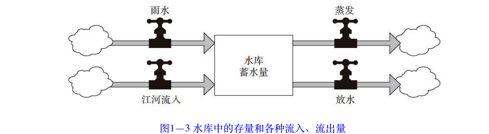
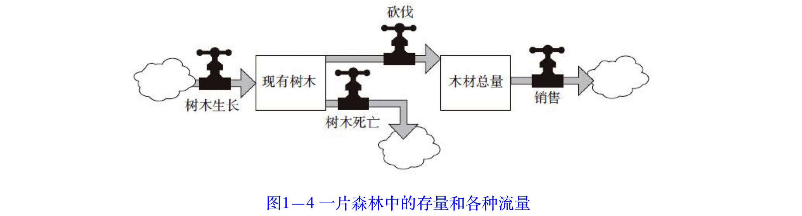
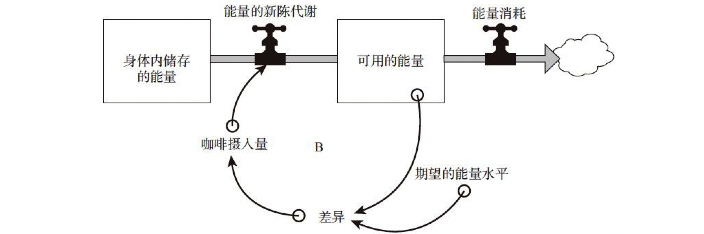
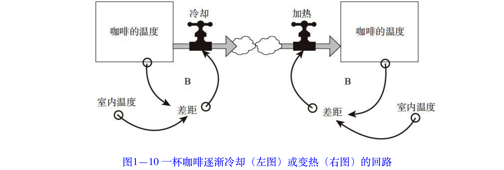
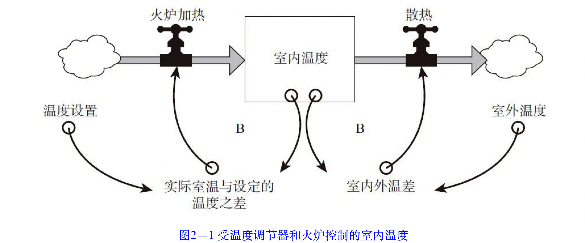
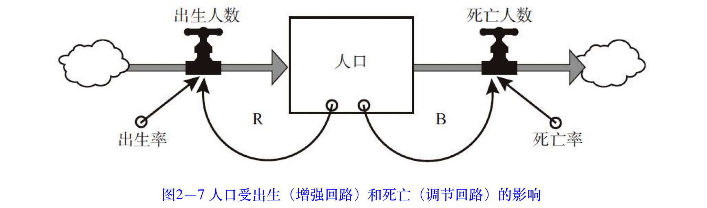
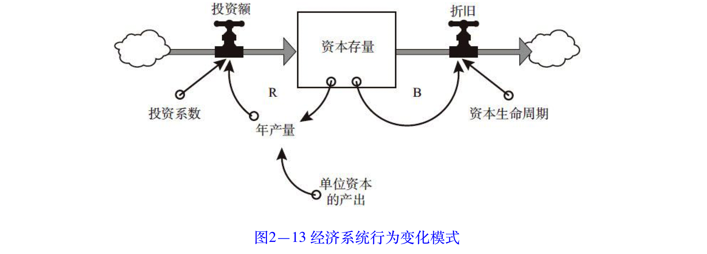
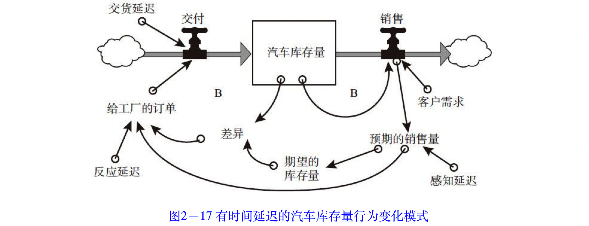

    作者:  [美] 德内拉·梅多斯
    出版社: 浙江人民出版社
    出品方: 湛庐文化
    副标题: 决策者的系统思考
    原作名: Thinking in Systems: a Primer
    译者: 邱昭良
    出版年: 2012-8
    页数: 290
    定价: 56.90元
    装帧: 平装
    ISBN: 9787213050114

[豆瓣链接](https://book.douban.com/subject/11528220/)

- [引言 系统多棱镜](#引言-系统多棱镜)
  - [无处不在的系统](#无处不在的系统)
  - [重塑系统，发现更大的世界](#重塑系统发现更大的世界)
- [第一部分 系统的结构和行为](#第一部分-系统的结构和行为)
  - [第1章 系统之基础](#第1章-系统之基础)
    - [总体大于部分之和](#总体大于部分之和)
    - [从关注要素到透视游戏规则](#从关注要素到透视游戏规则)
    - [理解系统行为的动态性](#理解系统行为的动态性)
    - [反馈：系统是如何运作的](#反馈系统是如何运作的)
    - [自动洄游的鱼：调节回路](#自动洄游的鱼调节回路)
    - [脱缰的野马：增强回路](#脱缰的野马增强回路)
  - [第2章 系统大观园](#第2章-系统大观园)
    - [单存量系统](#单存量系统)
      - [系统1.1：一个存量、两个相互制衡的调节回路的系统](#系统11一个存量两个相互制衡的调节回路的系统)
      - [系统1.2：一个存量、一个增强回路以及一个调节回路的系统](#系统12一个存量一个增强回路以及一个调节回路的系统)
      - [系统1.3：含有时间延迟的系统](#系统13含有时间延迟的系统)
    - [双存量系统](#双存量系统)
      - [统2.1：一个可再生性存量受到另外一个不可再生性存量约束的系统](#统21一个可再生性存量受到另外一个不可再生性存量约束的系统)
      - [系统2.2：有两个可再生性存量的系统](#系统22有两个可再生性存量的系统)
- [第二部分 系统思考与我们](#第二部分-系统思考与我们)
  - [第3章 系统之美：系统的3大特征](#第3章-系统之美系统的3大特征)
    - [适应力](#适应力)
    - [自组织](#自组织)
    - [层次性](#层次性)
  - [第4章 系统之奇：系统的6大障碍](#第4章-系统之奇系统的6大障碍)
    - [别被表象所迷惑](#别被表象所迷惑)
    - [在非线性的世界里，不要用线性的思维模式](#在非线性的世界里不要用线性的思维模式)
    - [恰当地划定边界](#恰当地划定边界)
    - [看清各种限制因素](#看清各种限制因素)
    - [无所不在的时间延迟](#无所不在的时间延迟)
    - [有限理性](#有限理性)
  - [第5章 系统之危与机：系统的8大陷阱与对策](#第5章-系统之危与机系统的8大陷阱与对策)
    - [政策阻力：治标不治本](#政策阻力治标不治本)
    - [公地悲剧](#公地悲剧)
    - [目标侵蚀](#目标侵蚀)
    - [竞争升级](#竞争升级)
    - [富者愈富：竞争排斥](#富者愈富竞争排斥)
    - [转嫁负担：上瘾](#转嫁负担上瘾)
    - [规避规则](#规避规则)
    - [目标错位](#目标错位)
- [第三部分 改变系统](#第三部分-改变系统)
  - [第6章 系统之杠杆点：系统的12大变革方式](#第6章-系统之杠杆点系统的12大变革方式)
    - [12.数字：包括各种常数和参数](#12数字包括各种常数和参数)
    - [11.缓冲器：比流量力量更大、更稳定的存量](#11缓冲器比流量力量更大更稳定的存量)
    - [10.存量—流量结构：实体系统及其交叉节点](#10存量流量结构实体系统及其交叉节点)
    - [9.时间延迟：系统对变化做出反应的速度](#9时间延迟系统对变化做出反应的速度)
    - [8.调节回路：试图修正外界影响的反馈力量](#8调节回路试图修正外界影响的反馈力量)
    - [7.增强回路：驱动收益增长的反馈力量](#7增强回路驱动收益增长的反馈力量)

# 引言 系统多棱镜
## 无处不在的系统
一旦我们看清了结构和行为之间的关系，我们便能开始了解系统如何运作，为什么会出现一些问题，以及如何让系统转向符合人们预期的行为模式。

什么是`系统`呢？系统是一组相互连接的事物，在一定时间内，以特定的行为模式相互影响，例如人、细胞、分子等。系统可能受外力触发、驱动、冲击或限制，而系统对外力影响的反馈方式就是系统的特征。在真实的世界中，这些反馈往往是非常复杂的。

## 重塑系统，发现更大的世界
系统思考研究者有时将这些常见的、会引发特定行为的系统结构称为`“系统基模”`（archetypes）；这些基本模型既是一些顽固、棘手和潜在危害性极大的问题的根源，也是实现有效行为改变的`“杠杆点”`。

# 第一部分 系统的结构和行为
## 第1章 系统之基础
### 总体大于部分之和
对于一个系统来说，整体大于部分之和。任何一个系统都包括三种构成要件：要素、连接、功能或目标。它具有适应性、动态性、目的性，并可以自组织、自我保护与演进。

### 从关注要素到透视游戏规则
_苏菲教育故事_

>因为“一加一等于二”，所以你自认为只要知道“一”，就能知道“二”，但是你忘了，你还必须理解两个“一”之间的关系。

_系统多棱镜_

>请思考以下问题：如何才能知道你观察的是一个系统，而不是一堆材料的集合？
>
>1. 你能够识别出各个部分吗？
>2. 这些部分相互之间有联系吗？
>3. 这些部分单独作用时产生的影响和它们整合在一起时产生的影响有所不同吗？
>4. 这些影响和长期的行为在各种环境中都是固定不变的吗？

_系统之思_

>系统中的很多连接是通过信息流进行运作的。信息使系统整合在一起，并对系统的运作产生重要影响。

_系统之思_

>总的来说，“功能”一词常用于非人类系统，而“目标”一词则用于人类系统。但它们之间的区分并不是绝对的，因为很多系统兼具人类和非人类要素。

- 有些人想要尽快摆脱心灵上的伤痛；
- 农民、商人和银行家都想要赚钱；
- 贩毒人员对法律的约束无所畏惧，但是又害怕警察的打击；
- 政府颁布禁毒法令，并借助警力维护法律，打击毒品贩卖；
- 富人们居住在离穷人很近的地方；
- 吸毒者更关心如何保护自己，而非戒除毒瘾。

在社会系统中，上述这些要素各自的目标看起来都是正当的，但它们组合成为一个系统，相互影响，就造成了吸毒和犯罪日益蔓延并很难被根除的恶果。由于系统中嵌套着系统，所以目标中还会有其他目标。

**一个成功的系统，应该能够实现个体目标和系统总目标的一致性**。

如果系统中的个体是一个接一个地发生变化，那么，我们就能够识别出系统中有哪些要素、它们之间的内在联系、系统的目标以及各种要素的相对重要性。但事实并非如此。虽然系统中的某些要素是很重要的，但一般说来，**改变要素对系统的影响是最小的**。

_系统之思_

>系统中最不明显的部分是它的功能或目标，而这常常是系统行为最关键的决定因素。

功能或目标的改变也会对系统产生重大影响。如果仍旧保留那些球员和规则，但改变比赛的目标——看谁输而不是谁赢；如果树木的生存目标不是为了繁衍后代，而是为了获取土壤中所有的营养成分，以无限成长；如果大学的目标不仅是传播知识，还要实现赚钱、教导民众、赢取球赛等目的，情况会怎么样？显然，**目标的变化会极大地改变一个系统，即使其中的要素和内在连接都保持不变**。

_系统提示_
>系统三要件的关系
>
>对一个系统来说，`要素`、`内在连接`和`目标`，所有这些都是必不可少的，它们之间相互联系，各司其职。一般来说，系统中最不明显的部分，即功能或目标，才是系统行为最关键的决定因素；内在连接也是至关重要的，因为改变了要素之间的连接，通常会改变系统的行为；尽管要素是我们最容易注意到的系统部分，但它对于定义系统的特点通常是最不重要的——除非是某个要素的改变也能导致连接或目标的改变。

### 理解系统行为的动态性
`“存量”`是所有系统的基础。所谓存量，是指在任何时刻都能观察、感知、计数和测量的系统要素。如其名称所示，在系统中，存量是储存量、数量或物料、信息在一段时间内的积累量。它有可能是浴缸中的水、人口数量、书店中的书、树木的体积、银行里的钱，等等。但是，存量不一定非得是物质的，你的自信、在朋友圈中的良好口碑，或者对世界的美好希冀等，都可以是存量。

_系统之思_

>存量是对系统中变化量的一种历史记录。

存量会随着时间的变化而不断改变，使其发生变化的就是“流量”。所谓`流量`，是一段时间内改变的状况。例如浴缸中注入或流出的水量、出生或死亡的人数、买入或卖出的数量、成长或衰退、存入或取出、成功或失败等（如图1—1所示）。

_系统提示_

>如何阅读存量—流量图
>
>在本书中，存量用方框来表示，流量则用流入或流出存量的、带箭头的水管来表示。在每个流量上标有一个T型图案，代表“水龙头”，表示流量可以被调高或调低、打开或关闭；在流量的前端或后端，有时会画一个“云朵”图案，表示该流量的资源和消耗，也就是该流量从哪里来、到哪里去。虽然我们可以进一步明确这些来源和去处，但这样会把我们对当前系统的分析变得过于庞杂。因此，出于简化当前讨论的需要，我们可以把这些因素用“云”来概略地表示。

地下的矿藏是一个存量，随着该矿藏被人们发现和开采，会产生一个矿藏开采的流量。由于矿藏的形成（流入量）可能是数百万年前各种复杂地质变化的综合作用，很难全面表述，因此这里用一个简单的存量-流量图进行描述（如图1—2所示，图中没有画出流入量）。

大坝后面水库中的水也是一个存量，流入量有雨水和江河的来水，流出量包括水的蒸发和堤坝放水（如图1—3所示）。

一片森林中所有树木的蓄积量也是一个存量，流入量是树木的生长，流出量包括树木的自然死亡和伐木工的砍伐。被砍伐的木材累积起来，会形成另外一个存量，即伐木工厂里木材的存货量；而当木材出售给客户时，就会产生一个流出量，减少库存（如图1—4所示）。

现在，让我们以大家都多少有些体验的“浴缸”为例，来理解存量和流量的动态特性（如图1—5所示）。

上述的浴缸就是一个非常简单的系统，只有一个存量、一个流入量和一个流出量。由此，你可以推断出几项重要的原则，它们同样适用于其他更为复杂的动态系统：

- 只要所有流入量的总和超过了流出量的总和，存量的水平就会上升。
- 只要所有流出量的总和超过了流入量的总和，存量的水平就会下降。
- 如果所有流出量的总和与流入量的总和相等，存量的水平将保持不变；事实上，无论在任何情况下，当系统的流入量和流出量相同时，系统就处于动态平衡的状态。

人类的大脑似乎更加容易关注存量，而不是流量。更进一步地说，当我们关注流量时，我们更容易倾向于关注流入量，而不是流出量。因此，我们有时候会忽视这样一个事实：如果要灌满浴缸，不能只是提高流入速率，还需要降低流出速率。

_系统之思_

>要想使存量增加，既可以通过提高流入速率来实现，也可以通过降低流出速率来实现。请注意，要灌满一个浴缸，不是只有一种方式。

人们经常低估存量的内在动量。

_系统之思_

>存量的变化一般比较缓慢，即使在流入量或流出量突然改变的情况下，也是如此。因此，存量可以在系统中起到延迟、缓存或减震器的作用。

因此，可以说，存量的改变设定了系统动态变化的速度。

在系统中，由于存量变化缓慢而产生的时间滞后可能会导致一些问题，与此同时，它们也是系统稳定性的根源所在。存量变化缓慢所产生的时间滞后，让人们有了一定的余地去调整、尝试一些做法，并根据反馈来修订那些不奏效的政策。

**如果你对存量的变化速度有正确的认知，你就不会“拔苗助长”，期待事物变化的速度超出其特定规律；同时，你也不会过早地放弃，因为你知道一项措施要想见到成效，也需要时间；此外，你也可以更好地把握系统动量所展现的机会，“顺势而为”，就像一个高超的柔道选手善于利用对手的力量那样，聪明地实现自己的目标**。

对于存量在系统中所起的作用，还有一个更为重要的原则，那就是：由于存量的存在，流入量和流出量可以相互独立，并在一定时期内不必保持平衡或一致。这一原则可以引导我们直接了解反馈的概念。

_系统之思_

>由于存量的存在，流入量和流出量可以被分离开来，相互独立，并可以暂时地失衡。

事实上，人类发明了成千上万种存量维持机制，以确保流入和流出量相互独立和稳定。

由于大量存量维持机制的存在，大多数个人和组织的决策也会受到存量水平的影响：如果库存过高，就会降低价格，或者增加广告或促销方面的预算，以增加销售量，削减库存。

人们不断地监控存量的变化，根据其状况和特定规则，制定决策并采取相应行动，以增加或降低存量水平，使其保持在可接受的范围内。这些决策累加起来，会对各种相关的系统造成复杂的影响，带来不同程度的起伏、涨落，也造成了各种问题或取得了成功。因此，从系统思考的角度来看，我们这个世界可以被视为各种各样存量的组合，围绕着这些存量，存在着各种不同的存量调节机制，而后者主要表现为各种各样的流量。

### 反馈：系统是如何运作的
_系统之思_

>一个反馈回路就是一条闭合的因果关系链，从某一个存量出发，并根据存量当时的状况，经过一系列决策、规则、物理法则或者行动，影响到与存量相关的流量，继而又反过来改变了存量。

### 自动洄游的鱼：调节回路
如果你习惯喝咖啡（或茶），当你感觉有些倦怠时，你可能会煮上一杯浓浓的黑咖啡，让自己重新振作起来。你，作为喝咖啡的人，在头脑中有一个期望的精神状态；当你察觉到实际精神状态与期望状态之间存在差异时，你会通过喝咖啡这一系统，摄入咖啡中的咖啡因，从而调整自身能量的新陈代谢，使自己的实际精神状态（存量）接近或达到期望的水平。

图1—9 喝咖啡的人的能量系统

这一类反馈回路具有保持存量稳定、趋向一个目标进行调节或校正的作用，我们称之为`“调节回路”`。在图中，我在该回路的内部标了一个字母“B”，以示区别。当系统中存在调节回路时，面对各种变化，它都会采取措施，消除这些变化对系统的影响，使存量保持在某一个目标值或可接受的范围之内，系统行为会因此表现出“寻的”或“动态平衡”的特征。无论你是想让存量水平升高或降低，调节回路都会想方设法，将其拉回到预期状态或设定的范围之内。

大家都知道，煮完咖啡以后，如果你没有及时把它喝掉，咖啡会逐渐冷却到室温状态，而它冷却的速度取决于咖啡的温度和室温之间的差距：二者的差距越大，咖啡凉得就越快。与上面的案例类似，这一回路的作用方向也有两种——另外一种情况是，如果你在夏天做了一杯冰咖啡，它将逐渐变热，直到达到室内温度为止。该系统的功能是缩小咖啡的温度和室温之间的差距，直至差距为零，不管二者的差距是正还是负（如图1—10所示）。

_系统之思_

>在系统中，调节回路是保持平衡或达到特定目标的结构，也是稳定性和抵制变革的根源。

### 脱缰的野马：增强回路
第二类反馈回路的作用是不断放大、增强原有的发展态势，自我复制，像“滚雪球”一样。它们是一个良性循环或恶性循环，既可能导致系统不断成长，越来越好；也可能像脱缰的野马，导致局势越来越差，造成巨大的破坏甚至毁灭。我们将这一类回路称为`“增强回路”`。为了表示区别，我在这类回路内部标注了一个字母“R”。在这类回路的作用下，系统的存量越大，存量的流入量也就越多，导致存量进一步变得更大；反之亦然。总之，增强回路会强化系统原有的变化态势。

银行账户的余额越大，你所能获得的利息就越多，这使你的存款金额更大，你下一期获得的利息更多（如图1—12所示）。

_系统之思_

>增强回路是自我强化的。随着时间的变化，增强回路会导致指数级增长或者加速崩溃。当系统中的存量具有自我强化或复制的能力时，你就能找到推动其增长的增强回路。

_系统提示_

>对增强回路和时间翻倍的提示
>
>因为我们经常会遇到增强回路，所以很容易知道这一速算诀窍：对于指数级增长来说，存量翻倍所花费的时间，约等于70除以增长率（以百分数来表示）。
>
>举例来说，如果你把100美元存入银行，年利率是7%，那么10年后，你的钱会翻一倍（70/7=10）；如果利率只有5%，那么这笔钱要翻倍就需要花14年时间。

## 第2章 系统大观园
### 单存量系统
#### 系统1.1：一个存量、两个相互制衡的调节回路的系统
典型代表：温度调节器，图2—1中的温度调节器是一个简化了的家用制热系统的工作原理。

从这里，我们可以得出一条很重要的系统基本原则：由反馈回路所传递的信息只能影响未来的行为，不能立即改变系统当前的行为。**因为信息经由反馈回路的传递需要时间**，如果你根据当前反馈做出了一项决策，它不能足够快地发送一个信号，去修正由当前反馈所驱动的系统行为，这期间必然有一定的延迟。所以，**你的决策只能影响未来的行为，不能改变当前的系统行为**。

_系统之思_

>在一个由存量维持的调节回路中，设定目标时，必须适当考虑补偿对存量有重要影响的流入和流出过程。否则，反馈过程将超出或低于存量的目标值。

为什么说这条原则很重要呢？因为它意味着，在行为与结果响应之间经常会有时间延迟。也就是说，一个流量不能立即对其自身做出调整，它只能对存量的变化做出反应，而这必然是在一段时间的延迟之后，等待信息反馈达到一定程度。至于时间延迟的长短，取决于具体的系统情境。例如，对于一个浴缸，你可能只需要花很少时间，就可以估计出水的深度，从而决定调整水的流量。但对于一个复杂的经济系统，一个决策可能需要很长时间才能见到效果，而信息的反馈通常非常缓慢、微妙、杂乱，难以把握。因此，很多人在对经济学相关问题进行建模时，经常假设消费或生产会快速地对诸如价格等要素的变化做出反应，这肯定是错的。真实的经济系统肯定不是这样运作的。

#### 系统1.2：一个存量、一个增强回路以及一个调节回路的系统
典型代表：人口和工业经济，与我们每个人都息息相关的人口和工业经济体系就是这样的系统（如图2—7所示）。

人口受到一个增强回路和一个调节回路的影响：增强回路决定新出生的人数，受出生率的影响，导致人口数量增长；调节回路影响当期死亡的人数，受死亡率的影响，导致人口数量减少。

_系统之思_

>当不同调节回路的相对优势发生改变时，系统常会出现一些复杂的行为，由一个回路主导的某种行为模式会变为另外一种。

在经济系统的核心，也存在一个“增强回路+调节回路”的系统，其结构与人口系统类似，因此这两个子系统也具有类似的行为模式（如图2—13所示）。

#### 系统1.3：含有时间延迟的系统
典型代表：库存。假设要维持足够10天销售的库存量（如图2—15所示）。汽车经销商需要保持一定的库存，因为每天到货交付的数量和销售量不可能完美地匹配，而且每天客户的购买量也很难预测。此外，经销商还需要多保持一些额外的库存作为缓冲，以防供应商偶尔出现交货延迟或其他意外情况。

在图2—17中，我们对这个简单的模型进行了一些微调，加入了三个时间延迟（感知延迟、反应延迟和交货延迟），这些都是我们在现实中经常会遇到的情况。

_系统之思_

>调节回路上的时间延迟很可能导致系统的振荡。

### 双存量系统
#### 统2.1：一个可再生性存量受到另外一个不可再生性存量约束的系统
到现在为止，我们所讨论的系统都没有考虑外部因素的约束。例如，在工业经济系统中，资本存量未考虑原材料和产出的限制；人口系统中，未考虑食物的限制；在温度调节器系统中，也未考虑火炉可能缺油的限制。

任何物理的、成长的系统，或早或晚都会受到某种形式的制约。这些限制因素通常以调节回路的形式存在，在某些条件下，这些调节回路会取代驱动成长的增强回路成为主导性回路，要么是提高流出量，要么是减少流入量，从而阻碍系统的进一步成长。

在现实环境中，受限制的成长是非常普遍的，以至于系统思考专家将其当成一种`“基本模型”`，命名为`“成长上限”（limits-to-growth）`。所谓`“系统基模”`，指的是一些常见的系统结构，可以导致人们熟悉的一些行为模式。

_系统之思_

>在呈指数级成长的实体系统中，必然存在至少一个增强回路，正是它（或它们）驱动着系统的成长；同时，也必然存在至少一个调节回路，限制系统的成长，因为在有限的环境中，没有任何一个物理系统可以永远地增长下去。

典型代表：石油经济。假如有一家公司，通过提炼一种不可再生性资源（比如石油）来赚钱。它们刚刚发现了一个巨大的新油田，如图2—23所示。

#### 系统2.2：有两个可再生性存量的系统
典型代表：渔业经济。在这里，可再生性资源是鱼，资本存量是渔船。其实，类似这样的系统还有很多，例如树木与伐木场、牧场与奶牛等。

图2—28 经济资本受一个增强回路推动而成长，并受一个可再生性资源约束的情况

_系统之思_

>可再生性资源主要受限于流量。只要开发（流出量）的速度等于资源再生（流入量）的速度，它们就可以被无限地开采或捕捞；如果开发的速度快于再生的速度，资源存量最终可能低于某个关键转折点，从而转变为“不可再生性资源”，逐渐耗尽。

# 第二部分 系统思考与我们
## 第3章 系统之美：系统的3大特征
### 适应力
_系统之思_

>系统之所以会有适应力，是因为系统内部结构存在很多相互影响的反馈回路，正是这些回路相互支撑，即使在系统遭受巨大的扰动时，仍然能够以多种不同的方式使系统恢复至原有状态。

_系统之思_

>不能只是关注系统的生产率或稳定性，也要重视其适应力，即自我修复或复位的能力，战胜干扰、恢复机能的能力。

### 自组织
系统所具备的这种使其自身结构更为复杂化的能力，被称为`“自组织”`（self-organization）。

### 层次性
人们一般会认为，一个大的系统中包含很多子系统，一些子系统又可以分解成更多、更小的子系统。系统和子系统的这种包含和生成关系，被称为`层次性`。

_系统之思_

>层次性是系统的伟大发明，不只是因为它们使系统更加稳定和有适应力，而且因为它们减少了信息量，使得系统各部分更容易记录和跟进。

_系统之思_

>系统的层次性表明系统是自下而上进化的，上一层级的目的是服务于较低层级的目的的。

## 第4章 系统之奇：系统的6大障碍
### 别被表象所迷惑
_系统之思_

>系统结构是行为的根源，而系统行为体现为随时间而发生的一系列事件。

### 在非线性的世界里，不要用线性的思维模式
_系统之思_

>系统中的很多关系是非线性的，它们的相对优势变化与存量的变化是不成比例的。反馈系统中的非线性关系导致不同回路之间主导地位的转换，也相应地引起系统行为的复杂变化。

### 恰当地划定边界
_系统之思_

>世界是普遍联系的，不存在孤立的系统。如何划定系统的边界，取决于你的分析目的，也就是我们想问的问题。

### 看清各种限制因素
_系统之思_

>任何成长都存在限制，有些限制是自发的；而有些则是系统施加的。从根本上讲，关键不是追求持续成长，而是选择在哪些因素的限制之下维持生存。

### 无所不在的时间延迟
_系统之思_

>当在反馈回路中存在较长的时间延迟时，具备一定的预见性是必不可少的。如果缺乏预见性，等到一个问题已经很明显了才采取行动，将会错过解决问题的重要时机。

### 有限理性
_系统之思_

>`有限理性`意味着，人们会基于其掌握的信息制定理性的决策，但是由于人们掌握的信息通常是有限的、不完整的，尤其是对于系统中相隔较远或不熟悉的部分，由此导致他们的决策往往并非整体最优。
>
>例如，渔夫并不知道哪里有多少鱼，也不了解同一天里其他渔夫多捕或少捕了多少鱼。同样，一位商人也无法确切地知道其他商人正在计划哪些方面的投资，有哪些顾客愿意购买，或者各种产品之间如何相互竞争。他们不知道市场的规模，也不知道自己当前所占的市场份额。他们有关这些方面的信息都是不完整的，存在时间延迟，而且他们自身的反馈也存在延迟。因此，经常出现系统性地投资过度或者产能不足。

一些行为科学家认为，我们甚至不能很好地解读自己所掌握的那些有限的信息。

- 我们会对风险做出错误的估计，将其中一些事情的危害程度估计得过高，或者轻视其他一些事情的危险性。
- 我们也容易过度夸大当下状况的重要性，对眼前的经验非常重视，而未对过去给予足够的重视。
- 我们会更加关注当前的事件，而对一些长期的行为不那么关心。对于未来的价值，我们会按照自己的价值判断，打一些折扣，这些价值判断会受到经济或生态等方面的影响。
- 对于所有输入的信号，我们不能正确地评估它们的重要性。我们不会全盘接受自己不喜欢的，或者不符合我们心智模式的所有信息。

发源于亚当·斯密的经济学理论首先假设，每个市场主体都是基于完备的信息、完全理性地做出行动的“经济人”（homo economicus）；其次，当各个行为主体按照这些规则行动时，他们的行动累加起来，就会产生对每个人来说都是最优的结果。从长期证据来看，这两个假设都无法成立。

_系统之思_

>要想改变行为，首先要跳出你所在系统中固有的位置，抛弃当时观察到的有限的信息，力求看到系统整体的状况。从一个更广阔的视角来看，可以重构信息流、目标、激励或限制因素，从而使分割的、有限的、理性的行动累加起来，产生每个人都期盼的结果。

受到信息、动机、抑制因素、目标、压力以及对其他角色的限制等因素影响，系统中的每一个角色都存在有限理性，这可能会产生促进系统整体福利的决策。如果不能，即使在同一个系统中放进新的角色，也不会改善系统的表现。要想有所变化，就必须对系统的结构进行重新设计，改进信息、动机、抑制因素、目标、压力以及对某些特定角色的限制等。

## 第5章 系统之危与机：系统的8大陷阱与对策
### 政策阻力：治标不治本
调节回路结构的主要表现就是会消除外部力量对系统的影响，使系统特定的行为模式保持相对稳定，没有太多变化。对于我们每个人来说，这是一个伟大的结构，因为它可以使我们的体温保持在摄氏37℃（或华氏98.6℉）。但是，其他一些长期持续的行为模式，可能并不符合人们的预期，往往被视为一个问题。尽管人们发明了各种技术、采取了多项政策措施，试图去“修复”它们，但系统好像很顽固，每年都产生相同的行为。这是一种常见的系统陷阱，人们习惯称之为`“治标不治本”`或`“政策阻力”`。

在我们的日常工作与生活中，`“治标不治本”`的例子比比皆是：

- 对于农产品，人们年复一年地采取各种措施，试图减轻供大于求的情况，但产品过剩的问题仍然存在；
- 对于毒品泛滥，社会采取了各种禁止、打击措施，但毒品泛滥依旧；
- 当市场不景气、从本质上看并不利于投资时，政府依然会出台投资税收贷款或其他刺激投资的政策，但事实上几乎没有什么效果；
- 在美国，不要指望任何一项单一的政策可以降低医疗成本；
- 在几十年时间里，美国政府一直在“创造就业”，但失业率长期居高不下。

`“政策阻力”`来自于系统中各个参与者的有限理性，每一个参与者都有自己的目标，都会对系统进行监控，观察一些重要变量的变化态势，如收入、价格、房屋供给、毒品交易或投资等，并将其与自己的预期或目标进行对比。如果存在差异，每一个参与者都会采取某些措施，试图扭转当前的局势，使其符合自己的预期或目标。一般来说，目标与实际状况之间的差异越大，行动的压力或强度就越大。

当各个子系统的目标不同或不一致时，就会产生变革的阻力。

在一个具有“政策阻力”的系统中，多个参与者有不同的目标。如果任何一方的态度有所让步或放松，其他各方就会把系统往更靠近自己目标的方向拉，导致系统更加远离让步一方的目标。因此，每一方都不得不付出巨大的努力，以使系统保持在谁也不希望看到的状态。事实上，这一类系统结构以类似“棘轮”的模式在运作：任何一方增强的努力，将导致其他所有人的努力也得到加强。

_系统多棱镜_

>陷阱1：政策阻力
>
>当系统中多个参与者有不同的目标，从而将系统存量往不同方向拉时，结果就是“政策阻力”。任何新政策，尤其是当它恰好管用时，都会让存量远离其他参与者的目标，因而会产生额外的抵抗，其结果是大家都不愿意看到的，但每个人都要付出相当的努力去维持它。
>
>对策
>
>放弃压制或实现单方面的目标。化阻力为动力，将所有参与者召集起来，用先前用于维持“政策阻力”的精力，去寻找如何实现所有人的目标，实现“皆大欢喜”，或者重新定义一个更大、更重要的总体目标，让大家愿意齐心协力去实现它。

### 公地悲剧
对于人们共同分享的、有限的资源，很容易出现开发（或消耗）逐步升级或增长的态势。这时，就容易陷入`“公地悲剧”`陷阱。

这样的状况在历史上比比皆是，以下只是几个很常见的范例：

- 对某个景色秀丽的国家公园来说，如果对游客数量不加限制，将很快人满为患，自然的美景被破坏殆尽；
- 使用不可再生的化石燃料对每个人来说都有直接的好处，尽管由此会增加二氧化碳排放，产生“温室效应”，引发全球气候变化，但人们仍一如既往；
- 如果每个家庭想要几个孩子就要几个，却由整个社会负担所有儿童的教育、医疗保健和环境保护费用，那么新生儿的数量将很快超过社会能够负担的水平（正是这个例子使哈丁写了那篇著名的论文）。

_系统之思_

>“公地悲剧”之所以产生，一个重要原因是资源的消耗与资源的使用者数量增长之间的反馈缺失了，或者时间延迟太长。

防止“公地悲剧”有以下三种方式：

1. 教育、劝诫。帮助人们看到无节制地使用公共资源的后果，号召并激发人们的美德品行。劝说人们有所节制，以社会舆论谴责或严厉惩罚来威慑违规者。
2. 将公共资源私有化。将公共资源分割给个人，每个人都要对自己行为的结果负责。如果某些人缺乏自控力，对资源的使用超出了其所拥有的资源的承载能力，他们也只能自食其果，伤害不到其他人。
3. 对公共资源进行管制。哈丁将这种选择称为“达成共识，强制执行”。管制可以采取很多种形式，从对某些行为的严格禁止，到配额制、许可制、税收调控以及鼓励措施等。要想奏效，管制必须有强制性的监管和惩罚措施。

_系统多棱镜_

>陷阱2：公地悲剧
>
>当存在一种公共资源时，每个使用者都可以从这种资源的使用中直接获利，用得越多，收益也越大，但是过度使用的成本却需由所有人来分担。因此，资源的整体状况和单个参与者对资源的使用之间的反馈关联非常弱，结果导致资源的过度使用及耗竭，最终每个人都没有资源可用。
>
>对策
>
>对使用者进行教育和劝诫，让他们理解滥用资源的后果。同时，也可以恢复或增强资源的状况及其使用之间的弱反馈连接，有两类做法：一是将资源私有化，让每个使用者都可以直接感受到对自己那一份资源滥用的后果；二是对于那些无法分割和私有化的资源，则要对所有使用者进行监管。

### 目标侵蚀
一些系统不只是对试图改变它的政策措施具有阻力，竭力维持在一个大家谁都不愿意看到的不良状态，更为糟糕的是，它们还在持续恶化。这是一种被称为`“目标侵蚀”`的基模。这类例子包括企业的市场份额逐渐下滑，医院的服务品质不断下降，河水或空气质量持续恶化，虽然定期节食但体重依然在增长，美国公立学校的状况日渐衰落，包括我自己一度坚持的慢跑也越来越懈怠了。

但是，在这些系统中，主体感知到的系统状态与系统的实际状态并不相同。一般而言，主体对坏消息更加敏感，倾向于更加关注并相信坏消息，而非好消息。当实际绩效有变化时，最好的结果会被当做偏差忽略掉，而最坏的结果却被记住了。这样，主体感知到的状况会比实际状况更为糟糕一些。

在这个系统基模中，还有一个重要特点：期望的系统状态会受到感知到的状态的影响。也就是说，标准也不是绝对的。当感知到的绩效水平下滑了，目标也可以相应地下调。

按照调节回路的作用，应该使系统状态维持在一个可接受的水平上，但是它却被一个具有向下趋势的增强回路所掩盖。也就是说，感知到的系统状态越差，期望就越低；期望越低，与现状的差距就越小，从而采取更少的修正行为；而修正行为越少，系统的状态也就越差。如果任由这一回路运转下去，将导致系统的绩效不断降低。

这一系统性陷阱也被称为“温水煮青蛙效应”。

_系统多棱镜_

>陷阱3：目标侵蚀
>
>绩效标准受过去绩效的影响，尤其是当人们对过去的绩效评价偏负面，也就是过于关注坏消息时，将启动一个恶性循环，使得目标和系统的绩效水平不断下滑。
>
>对策
>
>保持一个绝对的绩效标准。更好的状况是，将绩效标准设定为过去的最佳水平，从而不断提高自己的目标，并以此激励自己，追求更高的绩效。系统结构没有变化，但由于运转方向不同，便能成为一个良性循环，做得越来越好。

### 竞争升级
“以眼还眼，以牙还牙”是导致竞争升级局面出现的决策规则。竞争升级源自于一个增强回路，相互竞争的参与者都试图超越对方，占据上风。系统中参与各方的目标都不是绝对的（把室内的温度设定为18℃）而是相对的，取决于系统中其他参与者的状况。也就是说，不管室内温度是多少，我都要比另外一个房间的温度高一度。

_系统多棱镜_

>陷阱4：竞争升级
>
>当系统中一个存量的状态是取决于另外一个存量的状态，并试图超过对方时，就构成了一个增强回路，使得系统陷入竞争升级的陷阱，表现为军备竞赛、财富攀比、口水仗、声音或暴力升级等现象。由于竞争升级以指数级形式变化，它能以非常令人惊异的速度导致竞争激化。如果什么也不做，这一循环也不可能一直发展下去，最后的结果将是一方被击倒或两败俱伤。
>
>对策
>
>应对这一陷阱的最佳方式是避免陷入这一结构之中。如果已经深陷其中，一方可以选择单方面让步，从而切断增强回路的运作；或者双方进行协商，引入一些调节回路，对竞争进行一些限制。

### 富者愈富：竞争排斥
利用积累起来的财富、权力、特殊渠道或内部信息，可以创造出更多的财富、权力、渠道以及信息。这些都是另外一个被称为“富者愈富”的基模的例子。俗话说：“成王败寇。”在现实世界中，这一系统陷阱也比比皆是，竞争的赢家获得了有利条件，从而可以在未来获得更大的发展。从结构上看，这是一个增强回路，系统中的参与者会迅速被分化为两类：赢家和输家。前者的发展越来越好；后者则越来越差。

_系统多棱镜_

>陷阱5：富者愈富
>
>如果在系统中，竞争中的赢家会持续地强化其进一步获胜的手段，这就形成了一个增强回路。如果这一回路不受限制地运转下去，赢家最终会通吃，输家则被消灭。
>
>对策
>
>多元化，即允许在竞争中落败的一方可以退出，开启另外一场新的博弈；反垄断法，即严格限制赢家所占有的最大份额比例；修正竞赛规则，限制最强的一些参与者的优势，或对处于劣势的参与者给予一些特别关照，增强他们的竞争力（例如施舍、馈赠、税赋调节、转移支付等）；对获胜者给予多样化的奖励，避免他们在下一轮竞争中争夺同一有限的资源，或产生偏差。

### 转嫁负担：上瘾
这一陷阱有很多名称，包括上瘾、依赖性、将负担转嫁给干预者等。该系统的结构包括一个存量以及相关的流入量和流出量。这一存量可能是物理存在的，如农作物产量，也有可能是形而上的，如幸福的感觉、自信等。同时，这一存量由一个参与者进行调节。该参与者有一个预设的目标，通过将其感知到的该存量的实际状态与预设目标相对照，决定要采取的行动。这本质上是一个调节回路，要么改变流入量，要么调节流出量。

我们周围类似上瘾、依赖性或转嫁负担的范例还包括：

- 以前养老是由家庭来承担的，对于一些家庭来说，负担很重。于是，人们开始建设社会保障体系、老人社区和养老院。现在，大多数家庭不再有时间、空间、技巧或意愿去赡养老人。
- 过去，长途运输主要通过铁路，短途通勤依靠地铁和公共汽车；后来，政府通过建设高速公路，改变了这一状况。
- 以前，小孩子们都能进行心算或借助纸和笔进行计算，但随着计算器的普及，孩子们的计算能力大大下降。
- 人体能够通过自身的免疫系统，对一些疾病（如天花、肺结核和疟疾等）产生抗体，但是随着预防接种和抗生素等药物的使用，人体自身的免疫能力不断下降。
- 由于现代医疗技术和药物的发展，基本上改变了人们的主动保健意识和对健康生活方式的重视，而是把这种责任转嫁给医生和药物。

将负担转嫁给干预者有可能是一件好事情。有时候，人们也会有意而为之，因为会提高系统保持在期望状态的能力。例如，通过接种天花疫苗，可以完全实现对天花病毒的免疫；如果不这样做，很可能造成天花病毒的感染和流行。虽然这样做，部分人也能凭借自身免疫能力而存活，但毫无疑问，前者好于后者。因此，有些系统可能真的需要一个干预者。

但是，干预也可能变成一个系统陷阱。如果系统内部的自我修正反馈机制不足以维持系统的状态，此时，一个善意的、有能力的外部人员，看到系统中的纠结，挺身而出，承担了部分工作量。很快地，他就能帮助系统恢复到大家都希望的状态。

紧接着，原来的问题又出现了，因为干预者只是承担了部分工作，而并未采取任何措施去消除问题的产生根源。于是，当干预者再次采用类似方案去掩饰问题时，期望的系统表象再次出现了，但这只是一个假象。在表象之下，问题的根源仍未被触及。这使得干预者需要更多地应用最初“介入”的方案。

如果这种干预削弱了系统原本维持其自身状态的能力，不论干预者是由于主动破坏造成的，还是无意忽略，陷阱就形成了。一旦系统的自我调节能力萎缩了，就需要更多的外部干预措施，才能达到期望的效果。这进一步削弱了系统自身的能力，如此循环……

_系统多棱镜_

>陷阱6：转嫁负担
>
>当面对一个系统性问题时，如果采用的解决方案根本无助于解决潜在的根本问题，只是缓解（或掩饰）了问题的症状时，就会产生转嫁负担、依赖性和上瘾的状况。不管是麻痹个人感官的物质，还是把潜在麻烦隐藏起来的政策，人们选择的干预行动都不能解决真正的问题。
>
>如果选择并实施的干预措施，导致系统原本的自我调适能力萎缩或受到侵蚀，就会引发一个破坏性的增强回路。系统自我调适能力越差，就需要越多的干预措施；而这会使得系统的自我调适变得更差，不得不更多地依赖外部干预者。
>
>对策
>
>应对这一陷阱最好的办法是提前预防，防止跌入陷阱。一定要意识到只是缓解症状或掩饰信号的政策或做法，都不能真正地解决问题。因此，要将关注点从短期的救济转移到长期的结构性重建上来。

### 规避规则
只要哪里存在规则，哪里就存在“规避规则”（rule beating）的可能。规避规则意味着，采取一些迂回或变通措施，虽然在名义上遵守或不违反规则的条文要求，但在本质上规避了系统规则的原本意图。如果规避规则的行为导致系统产生严重的扭曲或不自然的行为，就是一个需要警惕的问题：一旦失去控制，系统将会具有强大的破坏性。

- 一些政府部门、大学和公司经常在财政年度末突击消费，产生一些无意义的支出。这是因为，如果它们今年不把预算内的钱花完，明年就有可能会被砍掉一些预算；
- 在20世纪70年代，美国佛蒙特州出台了一项土地利用法案，被称为《250法案》（Act 250）。该法案对面积为10英亩（约4万平方米）及以下的住宅开发设置了复杂的审批流程。现在，佛蒙特州有非常多仅比10英亩大一点儿的住宅项目；
- 为了减少粮食进口、扶持本地种粮农民，一些欧洲国家在20世纪60年代对饲料进口设置了限制。在制定进口限制措施的过程中，没有人想到木薯——一种富含淀粉的根状作物，也是一种很好的动物饲料。因此，木薯并未被列入限制目录。所以，进口商以前是从美国进口玉米，而自那之后变成了从亚洲进口木薯。
- 按照《美国濒危物种法案》（The U.S.Endangered Species Act）规定，禁止对濒危物种栖息地进行商业开发。于是，一些土地拥有者在发现自己的土地上出现了濒危物种时，就有意地对其进行猎杀或投毒，以便自己的土地可以被开发。

对于规避规则的行动，人们一般有两种应对方式：

1. 通过强化规则及其实施力度，试图扑灭、镇压规避规则的行动。但是，这通常会激起系统更大的变形。以这种方式应对，将使人们在陷阱中越陷越深。
2. 把规避规则看做有用的反馈，对规则进行修订、改善、废除，或给予更好的解释。这将是系统的机会之所在。更好地设计规则，意味着要尽可能预见到规则对各个子系统的影响，包括可能出现的各种规避规则行为，并调整系统结构，充分发挥系统自组织的能力，将其引导到符合系统整体福利的方向上来。

_系统多棱镜_

>陷阱7：规避规则
>
>“上有政策，下有对策”。任何规则都可能会有漏洞或例外情况，因而也存在规避规则的机会。也就是说，虽然一些行为在表面上遵守或未违背规则，但实质上却不符合规则的本意，甚至扭曲了系统。
>
>对策
>
>设计或重新设计规则，从规避规则的行为中获得创造性反馈，使其发挥积极的作用，实现规则的本来目的。

### 目标错位
_系统多棱镜_

>陷阱8：目标错位
>
>系统行为对于反馈回路的目标特别敏感。如果目标定义不准确或不完整，即使系统忠实地执行了所有运作规则，其产出的结果却不一定是人们真正想要的。
>
>对策
>
>恰当地设定目标及指标，以反映系统真正的福利。一定要特别小心，不要将努力与结果混淆，否则系统将只产出特定的努力，而不是你期望的结果。

# 第三部分 改变系统
## 第6章 系统之杠杆点：系统的12大变革方式
麻省理工学院的福瑞斯特教授基于多年来对企业中系统性问题的深入研究告诉我们：一般管理者都能很准确地定义当前的问题，识别这些问题产生的系统结构，并基本能够猜中到哪里去寻找`“杠杆点”`——也就是说，在系统中的某处施加一个小的变化，就能导致系统行为发生显著的转变。

### 12.数字：包括各种常数和参数
在我看来，通过数值（尤其是流量的大小）来调节系统是效力最低的一种方式，无法改变系统基本的结构。只是调整一些细枝末节，就像对泰坦尼克号甲板上的座椅进行重新布置一样。

这并不是说参数不重要。在短期内，或者对于那些与流量直接相关的个体而言，它们可能是很重要的。例如，对于受税收和最低工资等政策变量直接影响的人群，或者直接从事与此相关的工作的人，都是如此。但是，改变这些变量极少能改变国家经济系统的行为。如果系统是慢性滞涨，参数变化了几乎也不可能一下子暴涨；如果系统是剧烈波动的，参数变化一般也不会使其稳定下来；如果是增长失控，参数也无法使其减缓。

由于下面我将会展示一些数字作为杠杆点的案例，在这里我想先提出一个郑重声明：只有当我们实在找不到其他11个因素时，才能把参数当做杠杆点。例如，通过利率或出生率，来控制增强回路的增长。如果参数是系统目标，那就另当别论了。

### 11.缓冲器：比流量力量更大、更稳定的存量
缓冲器具有保持稳定的力量。因此，你会把钱存入银行，而不是把它放到自己钱包中（流量是日常生活费用开支）；同理，商家会保持一定的库存量，而不是等顾客买走了存货之后马上订购新的货；

通过提高缓冲器的容量，我们通常可以使系统稳定下来。但是，如果缓冲器过大，系统也将变得缺乏弹性，它对于变化的反应速度将过于缓慢。同时，要建立、扩大或维护某些缓冲器的容量，也需花费巨大的时间和资金，例如建设水库或仓库等。为此，一些企业发明了“零库存”的“及时生产”模式。在这些企业看来，与耗费巨资维持固定的库存相比，偶尔的波动或缺货造成的损失并不是很大。

所以，有时候很神奇，改变缓冲器的大小会成为杠杆点。但是，缓冲器通常是物理实体，不太容易改变。例如，美国东部土壤对酸性物质的吸收能力就不是缓解酸雨危害的杠杆点；水库大坝的蓄水能力也是固定不变的。因此，在这个清单中，我并没有把缓冲器排得太靠前。

### 10.存量—流量结构：实体系统及其交叉节点
具有若干个存量和流量，并物理地连接起来的系统，其结构对于系统如何运作具有巨大的影响。以前，匈牙利的道路系统是以首都布达佩斯为中心，从该国一端到另一端的所有车辆都必须穿过布达佩斯市中心，这导致了严重的空气污染和交通拥堵。该国曾经采取过多项控制污染和治理拥堵的措施，包括安装并改造了大量的交通信号灯、出台限速政策等，但都没有什么效果。

造成上述系统行为的根本原因在于道路系统结构设计不良，因此，修正该系统的唯一方式就是重建道路系统。

但是，实体系统的重建通常是最慢、也是最昂贵的改变系统的办法，有的存量—流量结构甚至可能是不可改变的。

物理结构对系统是至关重要的，但它们很少是杠杆点，因为改变物理结构通常不太容易而且见效慢。恰当的杠杆点，需要从一开始就被设计好。一旦实体的结构建立起来了，要想找到杠杆点，就需要理解系统的限制和瓶颈，在尽可能发挥它们的最大效率的同时，避免出现较大的波动或扩张，超出其承受能力。

### 9.时间延迟：系统对变化做出反应的速度
在居于主导地位的反馈回路中，若反馈过程中存在时间延迟，将对存量变化的速度产生重要影响。如果延迟时间太短，容易导致反应过度，风声鹤唳，草木皆兵，并因过分敏感而导致振荡被放大；相反，如果延迟时间太长，将导致反应迟钝，使振荡得以衰减或突然爆发，这取决于延迟的时间到底有多长。对于存在某个临界值或危险水平的系统来说，一旦超过了一定限度，过长的延迟将造成不可逆转的伤害，从而导致矫枉过正并崩溃。

_系统之思_

>既然时间延迟无法消除，那么，放慢系统的增长速度，使得技术和价格可以与增长保持一致，将具有更大的杠杆作用。

我将时间延迟的长度列为一个高杠杆点，但事实上，时间延迟通常不是很容易改变的。很多事物的发展有其内在规律，该花多长时间就得花多少时间。你不可能一夜之间积累起一大笔资本，孩子也不可能在一夜之间长大，拔苗助长也无法加快庄稼的生长。但是，减缓变化的速度一般并不难做到，这样的话，虽然反馈中的延迟不可避免，也不至于造成很大的麻烦。这就是在我排列的杠杆点清单中，成长速度位于时间延迟之前的原因。

同样，这也可以解释为什么在福瑞斯特的世界模型中，放缓经济的增长速度与加速技术开发或放开市场价格相比，是一个更大的杠杆点。它们都是试图加快调整速度的措施，但是，现实世界的实体资本存量（例如工厂及设备、应用技术等）变化不会那么快，即使面对新的价格或创意也是如此——其实，价格和创意本身也不会马上变化，更不要说全球文化。

### 8.调节回路：试图修正外界影响的反馈力量
一个复杂的系统内部通常都有不计其数的调节回路，因此具有较强的自我纠正能力，可以适应不同的状况和影响。在某一段时间里，其中一些调节回路可能是不起作用的，例如核电厂的应急冷却系统，或者人体通过流汗、打寒战来维持体温的机制等，但这些回路的存在对于系统的长期价值而言是至关重要的。

调节回路具有将相关联的存量保持在预定目标值附近的能力。这主要取决于该回路上所有参数和连接的组合状况，它们决定了调节回路监测的准确性与速度、反应的灵敏度和力度、校正流量的直接性以及规模。有时候，这些地方就存在着杠杆点。

_系统之思_

>调节回路的力量需要与其预定要校正的影响大小相对应，这一点至关重要。可能的影响力量越大，调节回路的实力也需越强，否则就有可能无法发挥校正的作用。
>
>在寒冷的冬日，人们通常都会紧闭门窗。只有这样，温度调节器系统才能正常运作。如果你把所有门窗都打开，与这种突如其来的变化相比，该系统的调节能力就不匹配了，室温会迅速下降，温度调节器系统就不起作用了。
>
>再如，以前人们依靠传统的捕鱼设备，海洋渔业生态具有良好的调节能力，但是后来，人们发明了声呐定位、大功率拖船以及其他一些先进的设备，使得捕捞能力迅速增加。与这种变化相比，海洋系统的调节能力难以应对，海洋渔业资源迅速退化。
>
>类似地，随着一些大企业的崛起，主导产业的控制力越来越强，需要政府加大检查和控制的力度；经济全球化也使得跨国监管和全球治理显得越来越重要。

### 7.增强回路：驱动收益增长的反馈力量

