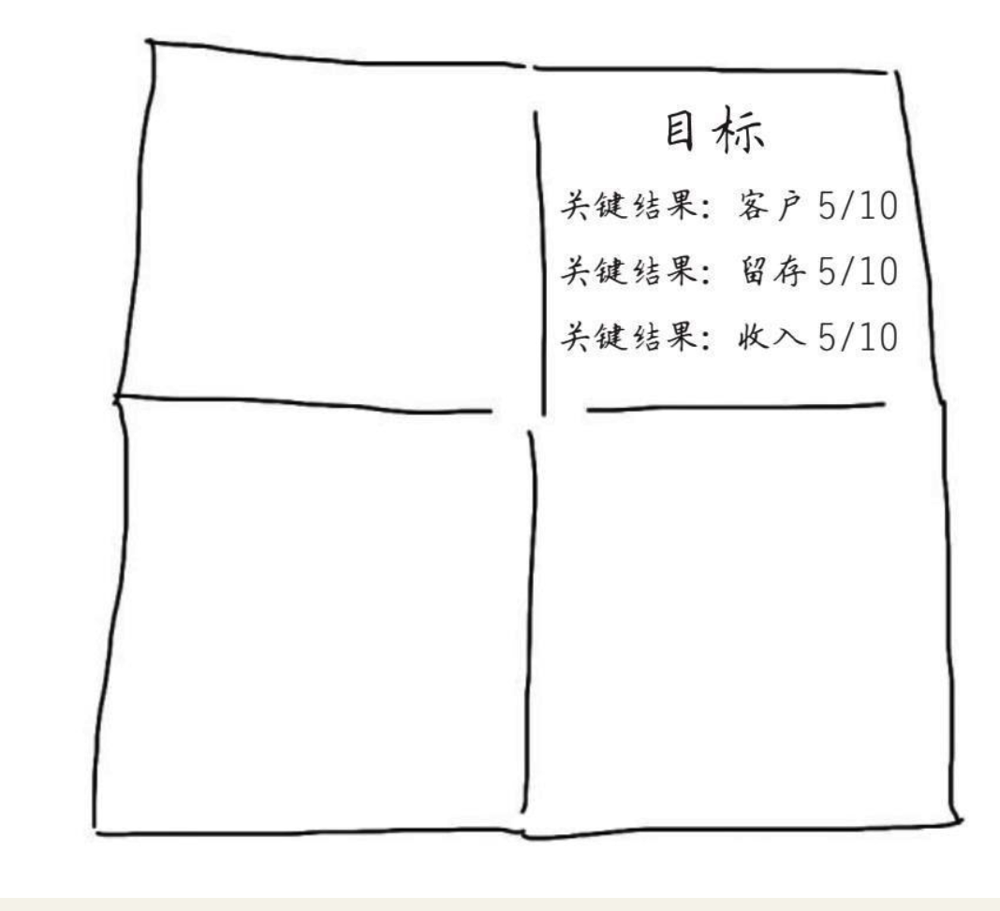
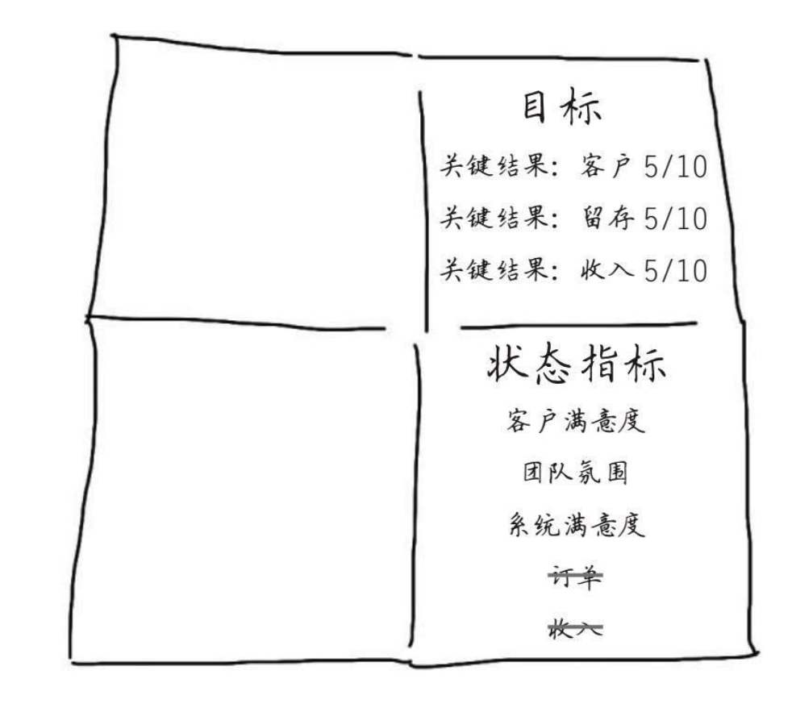
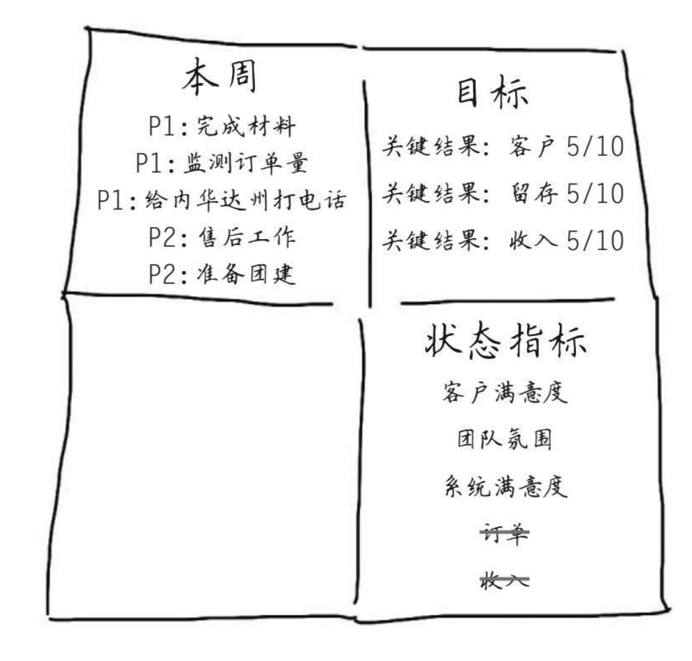
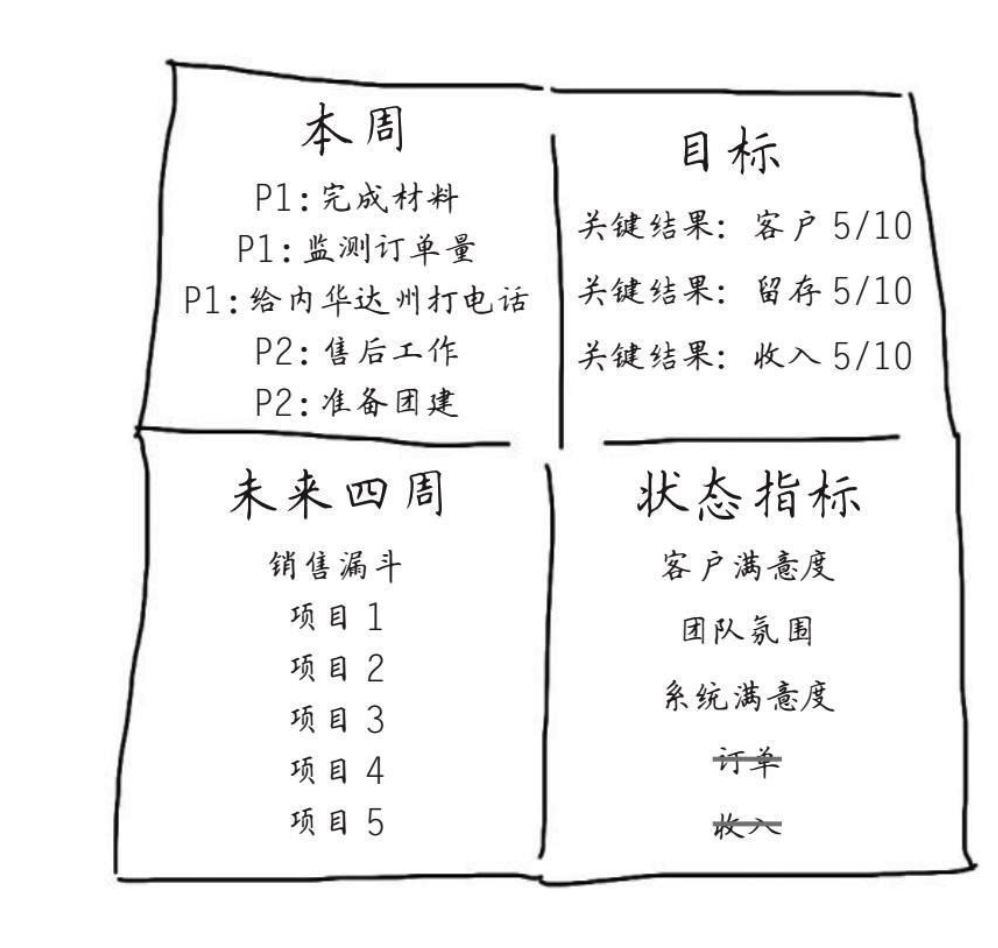
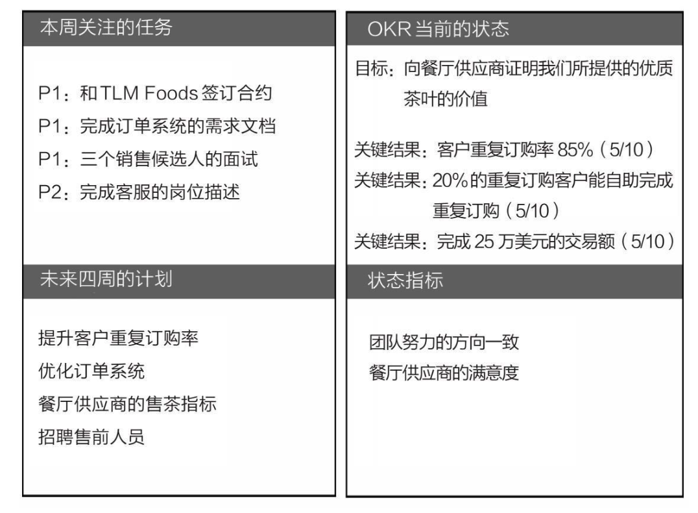
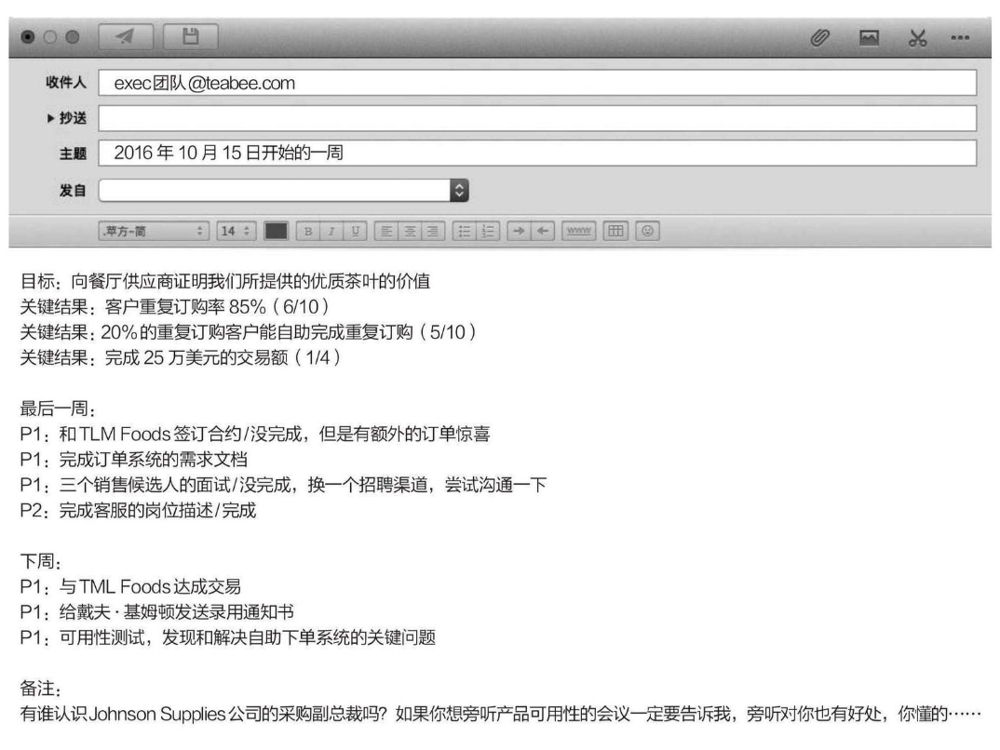

    作者: 克里斯蒂娜•沃特克 (Christina Wodtke) 
    出版社: 中信出版社
    副标题: 谷歌、领英等公司的高绩效秘籍
    出版年: 2017-9-1
    页数: 216
    定价: CNY 42.00
    装帧: 精装
    ISBN: 9787508679099

[豆瓣链接](https://book.douban.com/subject/27132072/)

- [序言 用关键结果衡量工作绩效](#%e5%ba%8f%e8%a8%80-%e7%94%a8%e5%85%b3%e9%94%ae%e7%bb%93%e6%9e%9c%e8%a1%a1%e9%87%8f%e5%b7%a5%e4%bd%9c%e7%bb%a9%e6%95%88)
- [前言](#%e5%89%8d%e8%a8%80)
  - [有挑战、可衡量的目标](#%e6%9c%89%e6%8c%91%e6%88%98%e5%8f%af%e8%a1%a1%e9%87%8f%e7%9a%84%e7%9b%ae%e6%a0%87)
- [第一章 确定目标，确保团队聚焦到重要目标上](#%e7%ac%ac%e4%b8%80%e7%ab%a0-%e7%a1%ae%e5%ae%9a%e7%9b%ae%e6%a0%87%e7%a1%ae%e4%bf%9d%e5%9b%a2%e9%98%9f%e8%81%9a%e7%84%a6%e5%88%b0%e9%87%8d%e8%a6%81%e7%9b%ae%e6%a0%87%e4%b8%8a)
- [第二章 讨论关键结果，复盘OKR实施过程中的问题](#%e7%ac%ac%e4%ba%8c%e7%ab%a0-%e8%ae%a8%e8%ae%ba%e5%85%b3%e9%94%ae%e7%bb%93%e6%9e%9c%e5%a4%8d%e7%9b%98okr%e5%ae%9e%e6%96%bd%e8%bf%87%e7%a8%8b%e4%b8%ad%e7%9a%84%e9%97%ae%e9%a2%98)
  - [和团队成员讨论关键结果](#%e5%92%8c%e5%9b%a2%e9%98%9f%e6%88%90%e5%91%98%e8%ae%a8%e8%ae%ba%e5%85%b3%e9%94%ae%e7%bb%93%e6%9e%9c)
  - [一次说太多，就和什么都没说一样](#%e4%b8%80%e6%ac%a1%e8%af%b4%e5%a4%aa%e5%a4%9a%e5%b0%b1%e5%92%8c%e4%bb%80%e4%b9%88%e9%83%bd%e6%b2%a1%e8%af%b4%e4%b8%80%e6%a0%b7)
- [第四章 影响目标达成的关键因素](#%e7%ac%ac%e5%9b%9b%e7%ab%a0-%e5%bd%b1%e5%93%8d%e7%9b%ae%e6%a0%87%e8%be%be%e6%88%90%e7%9a%84%e5%85%b3%e9%94%ae%e5%9b%a0%e7%b4%a0)
  - [OKR的基本原理](#okr%e7%9a%84%e5%9f%ba%e6%9c%ac%e5%8e%9f%e7%90%86)
  - [关键结果](#%e5%85%b3%e9%94%ae%e7%bb%93%e6%9e%9c)
  - [实现关键结果应该比较困难，但并非不可能](#%e5%ae%9e%e7%8e%b0%e5%85%b3%e9%94%ae%e7%bb%93%e6%9e%9c%e5%ba%94%e8%af%a5%e6%af%94%e8%be%83%e5%9b%b0%e9%9a%be%e4%bd%86%e5%b9%b6%e9%9d%9e%e4%b8%8d%e5%8f%af%e8%83%bd)
  - [什么使OKR起作用](#%e4%bb%80%e4%b9%88%e4%bd%bfokr%e8%b5%b7%e4%bd%9c%e7%94%a8)
  - [OKR是常规节奏的一部分](#okr%e6%98%af%e5%b8%b8%e8%a7%84%e8%8a%82%e5%a5%8f%e7%9a%84%e4%b8%80%e9%83%a8%e5%88%86)
  - [OKR提供了一个不变且明确的目标](#okr%e6%8f%90%e4%be%9b%e4%ba%86%e4%b8%80%e4%b8%aa%e4%b8%8d%e5%8f%98%e4%b8%94%e6%98%8e%e7%a1%ae%e7%9a%84%e7%9b%ae%e6%a0%87)
  - [准备好失败，这很重要](#%e5%87%86%e5%a4%87%e5%a5%bd%e5%a4%b1%e8%b4%a5%e8%bf%99%e5%be%88%e9%87%8d%e8%a6%81)
  - [控制好“承担责任—庆祝成果”的节奏](#%e6%8e%a7%e5%88%b6%e5%a5%bd%e6%89%bf%e6%8b%85%e8%b4%a3%e4%bb%bb%e5%ba%86%e7%a5%9d%e6%88%90%e6%9e%9c%e7%9a%84%e8%8a%82%e5%a5%8f)
    - [周一确定每个人的职责](#%e5%91%a8%e4%b8%80%e7%a1%ae%e5%ae%9a%e6%af%8f%e4%b8%aa%e4%ba%ba%e7%9a%84%e8%81%8c%e8%b4%a3)
    - [周五属于胜利者](#%e5%91%a8%e4%ba%94%e5%b1%9e%e4%ba%8e%e8%83%9c%e5%88%a9%e8%80%85)
- [第五章 OKR使用的六大场景](#%e7%ac%ac%e4%ba%94%e7%ab%a0-okr%e4%bd%bf%e7%94%a8%e7%9a%84%e5%85%ad%e5%a4%a7%e5%9c%ba%e6%99%af)
  - [场景1：如何开季度OKR会议](#%e5%9c%ba%e6%99%af1%e5%a6%82%e4%bd%95%e5%bc%80%e5%ad%a3%e5%ba%a6okr%e4%bc%9a%e8%ae%ae)
  - [场景5：使用OKR改进周报](#%e5%9c%ba%e6%99%af5%e4%bd%bf%e7%94%a8okr%e6%94%b9%e8%bf%9b%e5%91%a8%e6%8a%a5)

## 序言 用关键结果衡量工作绩效
目标管理法的原理很简单，它基于两个基本原则：

- 第一个原则可以用乔治·巴顿的名言概括，“不要告诉下属具体怎么做，只要告诉他们你要什么，他们就会给你满意的结果”；
- 第二个原则可以用那个时代一句惠普内部的宣传语概括，“用关键结果衡量工作绩效”，即如果基础的商业问题没有解决，不论实现多少产品功能，团队整体的绩效一定会大打折扣。

第一个原则是在说如何调动团队的积极性，第二个原则是在讲怎样评估工作绩效。

## 前言
我使用的管理方法由三个步骤组成：

- 首先，设置有挑战、可衡量的阶段性目标。
- 其次，确保你和你的团队一直朝着这个目标前进，不要被其他事情干扰。
- 最后，把握节奏，所有成员一直明确需要努力达成的目标，并相互支持、相互鼓励。

### 有挑战、可衡量的目标
O表示目标（Objective），KR表示关键结果（Key Results）。目标就是你想做什么事情（比如，上线一款游戏），关键结果就是如何确认你做到了这件事（比如，一天2.5万下载量或一天5万美元收入）。按照年度、季度设置OKR都可以，但一定要关联上公司的愿景使命。

## 第一章 确定目标，确保团队聚焦到重要目标上
“以前，在英特尔遇到一些不好定夺的决策，很多人都会提起这个故事。20世纪80年代，日本抢夺了整个存储器的市场，英特尔因此损失了很多钱，内部的争论不计其数，但对于英特尔到底应该怎么办一直没有定论，这可是直面生死的争论啊。有一天安迪·格鲁夫和戈登·摩尔商议此事，格鲁夫问摩尔：‘如果我们被解雇了，董事会会重新找一个首席执行官，你觉得他会怎么做？’摩尔毫不犹豫地回答：‘他会让我们放弃存储器。’格鲁夫对这个简短而明确的答案还是有些吃惊，于是继续问：‘那我们俩何不一起先走出这个门，然后再进来，就按照你说的那样做？’”

“后面的故事你们都知道了，”吉姆继续说，“这个决定让英特尔取得了巨大的成功。从那以后，英特尔内部遇到不好做的决策，都会用‘换个首席执行官’的思路去想办法。

## 第二章 讨论关键结果，复盘OKR实施过程中的问题
### 和团队成员讨论关键结果
汉娜在白板上写下OKR的两个内容，然后和团队成员继续讨论具体他们计划做到什么程度。

- 目标：向餐厅供应商证明我们所提供的优质茶叶的价值。
- 关键结果1：客户重复订购率达到70%。
- 关键结果2：50%的重复订购客户能自助完成重复订购。
- 关键结果3：完成25万美元的交易额。
- 目标：为餐厅供应商优化在线订单管理系统。
- 关键结果1：80%的重复订购订单在线完成。
- 关键结果2：系统满意度达到8分（满分10分）。
- 关键结果3：电话订购减少50%。

### 一次说太多，就和什么都没说一样
“你们把OKR用错了。我前两份工作都在实践OKR，很受用。但是，你们居然设定了5个目标，连自己都记不全，你的团队怎么可能完全记住？当年帮助克林顿赢得总统竞选，让詹姆斯·卡维尔最头疼的事情就是避免克林顿的政策演讲变得死板。每次克林顿上台的时候都想大谈教育、外交、能源等，恨不得把所有事情都说一遍。卡维尔说：‘一次说太多，就和什么都没说一样。’你也知道最后克林顿把重点只放在经济政策上的效果，OKR也应该这样。何况你们设定了那么多目标，每周的盘点会议都会无休无止！”

团队要齐心协力地不断往前推进。这就需要盘点，就像我们在敏捷开发上做的每日例会和周计划一样。如果你们有一个框架来指导每周的会议，那么这个会议才能发挥实际意义。”他拿起一张餐巾纸，摊开放在桌上，纸上的折痕将它分成了四部分。

他从电脑包里拿出了一支记号笔，在纸巾的右上角写上“目标”，紧跟着写上三个“关键结果”，然后他又在每个关键结果后面写上了“5/10”。

“50%的信心？一半一半的概率去完成它？”汉娜问道。

“没错，目标哪里有什么一般目标和可挑战目标，它们都是可挑战目标，一定要有挑战才行。不是不可能完成，而是要有点难度。不可能完成的目标会令人沮丧，有难度的目标才是振奋人心的。”拉斐尔环顾了一下大家，汉娜身子前倾，杰克则退回去了，和一开始正好相反。拉斐尔继续说道：“因此，每周我们都要开会，问问自己到底是进步了还是倒退了？如果从8/10降到了2/10，你得知道是为什么，是什么发生了变化，这会有助于我们及时跟进和反思调整。”

他指着OKR说：“你们看，在右下方这里，我们放上一些状态指标，我们推进OKR的时候也要关注这些事情，它们是完成OKR的保障。”

他将笔又移到纸巾的左上角，并写下三个“P1”（P即plan）和两个“P2”。

“这里，写上这周要做的3~5件重要的事情，这些事情能有效推进实现OKR。因为这些都要和团队共享，所以要认真思考我们是否把时间花费在对OKR有用的事情上。”拉斐尔边说边对汉娜点头示意。

“我称之为‘推进计划’，这里罗列出后面4周计划推进的重要事情。

她写道：

- 目标：向餐厅供应商证明我们所提供的优质茶叶的价值。
- 关键结果1：客户重复订购率达到85%。（5/10）
- 关键结果2：20%的重复订购客户能自助完成重复订购。（5/10）
- 关键结果3：完成25万美元的交易额。（5/10）

汉娜继续说道：“请大家注意，我们起初的信心指数都是50%，因为我希望每个关键结果足够有挑战，但的确有希望实现它。如果我们能完成2/3，说明我们努力过了，这个指数我每周都会更新。

“这个信心指数每周都会变化，我希望大家能踊跃参与讨论每周发生了什么，我们就按照这张表上的内容展开会议讨论。”

这时杰克上前站在了白板的左侧，“在矩形的左上方，我们要列出为了完成本周目标要做的最重要的几件事，最多4件，顺便标上优先级，P1是必须做的，P2是应该做的，不需要做的不列。”

他写道：

- P1：和TLM Foods公司签订合约。
- P1：完成订单系统的需求文档。
- P1：三个销售候选人的面试。
- P2：完成客服的岗位描述。

杰克说：“也许你们偶尔想添加一些你们希望被关注的事情作为P2，但是大家要知道，我们的目的不是事无巨细地安排事情，而是让大家知道目前公司关注哪些重要的事情，至少应该是值得关注的事情。我们知道大家都在努力工作，我们要确保重要的事情执行到位。”

然后杰克继续填写矩形的左下方。

“在左下方列出我们后续计划要做的重要工作，这个模块是为了保证我们都在同一个频道上，方便后续的跨部门协作，比如说提前买好服务器或者准备好市场开发。”

最后，汉娜指向右下方：“这里将填上我们的状态指标。接下来我们将会遇到很多挑战和问题，所以我们要确保所有人一直有良好的状态，不要精疲力竭或者哪个环节掉链子。所以，大家觉得我们第二条状态指标应该是什么？”

“我们将把它们标记成红色、黄色或绿色。我知道这样有些不精确，但我们想让大家知道我们做得如何以及如何做得更好。举个例子，就客户满意度而言，红色代表我们正在失去客户，黄色代表我们觉得和客户的关系很危险了。”

## 第四章 影响目标达成的关键因素
- 因素1：没有给目标设置优先级
- 因素2：缺乏充分沟通，导致没能准确理解目标
- 因素3：没有做好计划
- 因素4：没有把时间花在重要的事情上
- 因素5：轻易放弃

### OKR的基本原理
设定目标要遵循以下3个原则。

- 原则1：目标要明确方向并且鼓舞人心
- 原则2：目标要有时间期限
- 原则3：由独立的团队来执行目标

以下是几个好的目标：

- 拿下南湾地区的咖啡直销零售市场！
- 推出一个很棒的最小化可行产品（MVP）。
- 改变帕洛阿尔托地区的优惠券使用习惯！
- 完成一轮融资。

下面则是几个不太好的目标：

- 销售额提升30%。
- 用户增加一倍。
- B系列产品收入增加到500万美元。

为什么这些是不太好的目标？因为它们实质上是关键结果。

### 关键结果
关键结果要使用那些振奋人心的语言并且需要量化。你可以通过问一个简单的问题来确立它们，即“如何确定目标是否达成”，这也会让你定义出“真棒”“干掉它”“拿下它”的真正含义。通常有三个关键结果，它们基于可以量化的任何条件，包括：

- 用户增长
- 用户激活
- 收入增长
- 产品性能
- 产品质量

最后一个可能有点儿含糊，因为产品质量看起来很难被衡量。其实你可以使用类似NPS的工具做到。

如果明智地选择出关键结果，可以使增长与性能、收入与质量这样的结果得到平衡。

- 目标：推出一个很棒的MVP。
- 关键结果1：40%的用户在一周以内访问量增加两倍。
- 关键结果2：净推荐值达到8分。
- 关键结果3：15%的转化率。

### 实现关键结果应该比较困难，但并非不可能
OKR设定的目标都是有难度的。我们起初可以给OKR设定一个5/10的信心指数，这表示“我有50%的把握达成目标”；1/10表示“一点儿戏都没有”；10/10表示“这个能搞定”，但同时也意味着这个目标设定得太低了，很有可能是设定目标时故意隐藏了实力。

### 什么使OKR起作用
OKR是自上而下关联的。

公司应该设定公司的OKR，然后每个部门都要思考如何设定自己的OKR，这样公司的OKR才会实现。一个团队可以将自己的OKR集中在单个关键结果上，也可以支持整个OKR。举例来说，工程师可能认为客户满意度与网站加载速度紧密相关（事实的确如此），所以他们可以这样设定OKR：

- 目标：产品性能达到知名公司的标准。
- 关键结果1：99.8%的产品正常运行率。
- 关键结果2：小于1秒的响应时间。
- 关键结果3：在用户看来，产品加载都是瞬间完成的（由调查来决定，90%的用户表示页面加载为“立即”）。

### OKR是常规节奏的一部分
团队不能实现目标的时候，通常是因为他们在季度初设定了OKR，然后就忘记了。在这三个月里，你被同事的各种要求牵绊，首席执行官发给你各种需求和报表，你收到客户的各种投诉……总是有若干干扰事项让你的时间花费在了无关成功的事情上面。我强烈建议将OKR在每周的团队会议（如果有）和每周的电子邮件中分享，每周调整信心指数，讨论它们上升或者下降的原因。

### OKR提供了一个不变且明确的目标
不要在季度的中途更改OKR。如果你觉得OKR设定得很糟糕，振作起来，要么成功，要么失败，吸取经验，下次就会设定得更好。没有哪个团队第一次就能很完美地设定OKR，不要让它们分散注意力，保持团队能聚焦到很少的事情上，才是OKR的关键点。

### 准备好失败，这很重要
老实说，我们都不想失败，硅谷的每一个人都把失败挂在嘴边，即使我们真的不喜欢它。OKR的意义不仅在于完成目标，更重要的是它能挖掘团队真正的能力。对于有挑战的目标，失败其实也有积极的一面，OKR旨在推动我们去做那些你有能力做到的事情。

### 控制好“承担责任—庆祝成果”的节奏
#### 周一确定每个人的职责
每周一，团队一起开会盘点OKR的执行过程，明确本周具体负责完成哪些任务才会让团队的目标更进一步。我推荐一种四象限的OKR展示形式：

本周关注的任务：列出3~4件最重要的事情，只有本周完成了这几件事情，团队的目标才能向前推进；明确这些事情的优先级。
未来四周的计划：有哪些事情需要其他团队成员做好准备或支持，都列在这个象限里。

OKR当前的状态：如果你设定的信心指数是5/10，那目前完成的概率是更高了还是更低了，团队一起讨论一下原因。

状态指标：挑出两个影响目标达成的其他因素，团队需要额外关注，比如客户关系、团队状态、系统状况等。当这些地方发生意外时，马上讨论找出应对方案，确保OKR不受影响。

这个文档会成为OKR执行过程中的会议工具，你应该学会这样讨论问题：

- 这个优先级列表能确保我们的OKR完成吗？
- 团队的能力可以完成OKR吗？谁能帮助我们？
- 我们准备好新一轮的发力了吗？市场部知道产品部马上要做什么吗？
- 我们的团队已经筋疲力尽了吗？我们的产品是否存在什么隐患？

#### 周五属于胜利者
团队有远大目标是好事，但也很容易因此产生挫败感，所以周五的庆祝环节就很有必要。

周五的会议就是胜利的会议。每个团队都可以展示本周的成果，工程师展示他们做好的项目代码，设计师展示原型。除此之外，每个团队还应该分享自己的成果，比如销售部分享一下最近签约的订单，客服部谈一下他们如何帮助客户解决了问题，业务部分享一下他们谈的生意。这样做有很多好处，首先，每个人会觉得自己是成功团队的一分子；其次，如果团队渴望成功，所有人都会努力做一些值得分享的事情；最后，公司开始欣赏每个部门的努力，理解他们每天在做什么事情。

## 第五章 OKR使用的六大场景
### 场景1：如何开季度OKR会议
设定OKR很难，因为团队需要用这个过程认真审视公司，还会对公司战略方向进行艰难的争论与选择。会议的每个环节都需要仔细设计好，才能得到最好的结果，毕竟讨论出来的内容会在接下来的季度时刻伴随着团队。

参与会议的人数不宜过多，十多个人就够了。会议由首席执行官发起，高层管理人员都应该参与。会议过程禁止携带手机和电脑，这会让大家快速进入状态并集中注意力。

### 场景5：使用OKR改进周报
1. 把团队的OKR作为开始，并标注完成目标的信心指数。

列出OKR来提醒每个人（有时也是提醒自己）为什么要做现在做的这些事情。

你的信心指数就是去估计有多大的可能性实现关键结果，范围从1到10。1是永远不会成功，10是已经稳操胜券。当你的信心下降到3时，把它标记成红色；当它超过7时，就标记成绿色。不同的颜色使它更容易被识别，方便让你的老板和队友们振奋。列出信心指数可以帮助团队跟踪进度，如果出现问题也能及时更正。

2. 列出上周的优先任务，并标注完成情况。

如果没有完成，简短解释一下原因，目的是让团队清楚是什么阻止了团队前进。

3. 列出下周的优先事项。

只需要列出三个重要的事项，描述得要全面，围绕着具体可执行的步骤。“确定Xeno项目的开发文档”是一个很好的事项，它涵盖了写材料以及多部门的审查和表决。它也会使其他团队和老板信任你，相信你的确会完成事项。

“和律师沟通”是一个糟糕的事项。这件事情看起来半个小时就可以完成，并且没有明确的结果，感觉更像某件事情的一个环节。不仅如此，甚至没有说明要去沟通什么事情！

你还可以添加几个不那么重要的事项，它们同样应该是全面的，并且值得成为下周的事项。

总之，这里列出的事项不需要太多，计划好一周能完成的大事项就够了。

4. 列出风险或阻碍。

就像一次坦诚面对的会议，可以列出无法独自解决但可以寻求帮助的事情。不需要像小孩一样相互推诿，你的上级不想扮演你的父母，去听你和另一个负责人相互指责。

另外，列出所有你知道的可能阻止你完成任务的事情，比如，一个客户可能总是找各种借口拖着你，或者一个棘手的技术问题需要比原计划更长的时间去解决。老板们不喜欢惊喜，不要试图给他们这样的“惊喜”，提前预警也许有更多、更好的解决办法。

5. 备注。

最后，如果还有未包含在上述类别中的内容，但是又的确希望添加上去，那么就增加一个备注。“终于把吉姆介绍的那个小伙子从亚马逊挖过来了，感谢吉姆！”就是一个不错的备注。再比如，“团队周五要去外地玩Giant游戏。”备注要尽量简短、及时和有效，不要把备注当作任何借口或寻求安慰，甚至变成练习写小说的地方。

