    作者: 包政
    出版社: 机械工业出版社
    出版年: 2015-7-6
    页数: 195
    定价: CNY 49.00
    装帧: 平装
    丛书: 包子堂系列丛书
    ISBN: 9787111500322

[豆瓣链接](https://book.douban.com/subject/26579684/)

- [总序](#总序)
  - [深度分销走到尽头](#深度分销走到尽头)
  - [生产企业面临的挑战](#生产企业面临的挑战)
  - [商业企业面临的麻烦](#商业企业面临的麻烦)
- [营销是一项商务职能](#营销是一项商务职能)
  - [营销与企业命脉相联系](#营销与企业命脉相联系)
  - [营销在企业组织中的位置](#营销在企业组织中的位置)
    - [营销是一项商务职能](#营销是一项商务职能-1)
    - [商务领域的三项职能](#商务领域的三项职能)
    - [商务领域的内在职能结构](#商务领域的内在职能结构)
    - [商务领域的外在表现方式](#商务领域的外在表现方式)
    - [商务活动方式的演变](#商务活动方式的演变)
- [营销的两种协调方式](#营销的两种协调方式)
  - [供求一体化的两种手段](#供求一体化的两种手段)
- [福特的大量销售方式](#福特的大量销售方式)
  - [大量生产方式的问世](#大量生产方式的问世)
  - [大量销售方式的必要](#大量销售方式的必要)
    - [大量生产方式的缺陷](#大量生产方式的缺陷)
    - [规模报酬递减的威胁](#规模报酬递减的威胁)
    - [大量销售方式的特征](#大量销售方式的特征)
    - [大量销售方式的有效性](#大量销售方式的有效性)
  - [福特大量销售方式的实践](#福特大量销售方式的实践)
    - [福特的销售职能](#福特的销售职能)
    - [福特的市场职能](#福特的市场职能)
    - [福特的直销职能](#福特的直销职能)
- [通用的深度分销方式](#通用的深度分销方式)
  - [深度分销方式的特征](#深度分销方式的特征)
    - [深度分销方式的实质](#深度分销方式的实质)
    - [商务活动方式的竞争优势](#商务活动方式的竞争优势)
    - [深度分销方式的职能结构](#深度分销方式的职能结构)
  - [通用深度分销方式的实践](#通用深度分销方式的实践)
    - [斯隆在经销商关系上的努力](#斯隆在经销商关系上的努力)
- [丰田的社区商务方式](#丰田的社区商务方式)
  - [丰田生产方式的作用](#丰田生产方式的作用)
    - [丰田崛起的原因](#丰田崛起的原因)
    - [精益生产方式的作用](#精益生产方式的作用)
    - [社区商务方式的实质](#社区商务方式的实质)
    - [社区商务方式的职能结构](#社区商务方式的职能结构)
  - [丰田生产方式的要点](#丰田生产方式的要点)
    - [准时制](#准时制)
    - [短周期](#短周期)
    - [均衡化](#均衡化)
  - [丰田商务领域的实践](#丰田商务领域的实践)
    - [产销分离](#产销分离)
    - [厂商结盟](#厂商结盟)
    - [扎根市场](#扎根市场)
- [长虹与TCL商务方式之争](#长虹与tcl商务方式之争)
  - [长虹的大量销售方式](#长虹的大量销售方式)
    - [长虹争夺市场的战略](#长虹争夺市场的战略)
  - [TCL的深度分销方式](#tcl的深度分销方式)
    - [TCL的历史起点](#tcl的历史起点)
    - [TCL的深度分销方式](#tcl的深度分销方式-1)
    - [TCL争夺市场的策略](#tcl争夺市场的策略)
    - [构建深度分销网络体系](#构建深度分销网络体系)
    - [构建深度分销管理体系](#构建深度分销管理体系)
    - [深度分销方式的有效性](#深度分销方式的有效性)
- [社区商务活动方式的兴起](#社区商务活动方式的兴起)
  - [深度分销方式的局限](#深度分销方式的局限)
    - [深度分销方式的局限性](#深度分销方式的局限性)
  - [ZARA的成就](#zara的成就)

# 总序
## 深度分销走到尽头
波特有很多思想，集中体现在两本书中：一本叫《竞争战略》，一本叫《竞争优势》。其中谈到一体化战略，前向一体化，或后向一体化。前向一体化就是向下游走，后向一体化就是往上游走。

德鲁克有一个观点，企业必须集中配置资源在两个领域：或`技术领域`，或`市场领域`。据此可以推断，前向一体化的目的，是为了谋求市场扎根，后向一体化的目的，是为了谋求技术扎根。

像华为这样的公司，是`后向一体化`的典型代表，全力以赴向上游走，不惜一切代价，持续抢占关键资源，尤其是人才资源。就是不把钱放在银行，而是去获取具有影响力和支配力的关键资源。日本的三井财团，通过下属旗舰公司三井物产，实施资源的抢占，从能源矿产资源到人才资源，一切能够整合进价值链的关键资源它都要抓在手里，以形成企业的影响力，最后成为产业价值链的组织者。

除此以外，大部分生产制造企业，几乎都是`前向一体化`的。先是采用大量销售方式，后来转向深度分销方式。即不断整合渠道以及渠道终端门店的力量，展开市场的争夺战。

前向一体化的企业必须继续往前走，从供应链走向需求链，走进消费者的生活方式，谋求市场的最终扎根。

`深度分销`不是最终的商务活动方式，它的有效性在于资金利润率，这是厂商之间对立统一的基础。一旦边际利润趋向于零乃至负值的时候，深度分销方式也就走到了尽头，必须转向社区商务方式。

换言之，生产制造企业如果通过持续地提高产销量，就能获取规模经济上的好处，厂商之间就可以达到对立统一，携起手来，与对手展开竞争，用一条价值链打败另一条价值链。在我国台湾地区把深度分销方式称为`策略联盟`，或称`厂商合谋`。当所有企业都降低重心，唱着网络为王、决胜终端的歌谣，走上深度分销方式的时候，渠道网络的优势将丧失殆尽。接下来，就是降价促销，在释放产能、消化库存的过程中，成为现金流量依赖型企业。所有企业都深陷在竞争的旋涡之中，听天由命，难以自拔。

## 生产企业面临的挑战
第一个挑战是，产销矛盾加剧厂商矛盾。矛盾的主要方面是生产方式能不能改变，不能像丰田公司那样，从备货式生产方式，转向订单式生产方式。换言之，生产制造系统不能有效地控制存货以及存货偏差。相反，在现金流量压力下，持续地扩大产能和产量，迫使销售系统加大降价促销的力度，把过量生产的产品推销出去，甚至把工业库存转移到商业库存。

第二个挑战是，供求关系逆转，商家倒逼供应链。降价促销的结果，一定是供求关系逆转。生产的原则是效率，消费的原则是效用。生产企业不能改变生产方式，进而不能依靠性能来提高产品的性价比，那么最终的结果一定是产品效用递减，供求关系逆转，消费者主导市场以及主权意识强化。

所有的企业都做一个梦：其他企业能够在现金流量上倒下，倒下以后市场份额就归我了。所有企业都这样思考问题，最后导致的结果就是所有的企业都不挣钱，只要现金流量。

有了现金流，生产企业就可以通过别的方式挣到钱，比如，进入股市和房市，导致两市虚高。

## 商业企业面临的麻烦
**消费者主导市场的实质**是什么？

1. 是要求供应者提供信用，以便实现“产品—货币”的转换。一般而言，在上述销售的图式中，货币的信用是由国家提供的，而产品的信用必须由供应者提供。
1. 要求供应者跟进消费者在生活上的追求，以便在生活方式、生活品质、生活理念乃至生活态度上，持续获得良好的体验，获得美满的感觉。这两点，对处在产业价值链下游的商家来说，是满足不了的，即便借助于互联网或移动互联网手段，也是满足不了的。必须借助于产业价值链的力量，这意味着必须重构新型的厂商关系，使整条产业价值链或供应链协同起来去为消费者做贡献。

# 营销是一项商务职能
## 营销与企业命脉相联系
所谓`“销售”（Sales）`，简单说，就是实现“产品”向“货币”的转换。用学术一些的话说，“销售”是企业的一项专业职能，以实现“产品—货币”的转换。

所谓`“营销”（Marketing）`，就是构建“企业—客户”的关系，用学术一些的话说，“营销”是企业商务活动领域中的一项专业职能，也是企业维持再生产循环的一项核心职能，以构建“企业—客户”之间的关系。

## 营销在企业组织中的位置
### 营销是一项商务职能
生产企业一开始就有两个基本活动领域，一是`生产活动领域（Production）`，二是`商务活动领域（Business）`。生产活动领域覆盖`“生产过程”`，商务活动领域覆盖`“交换过程”`（见图1-1）。

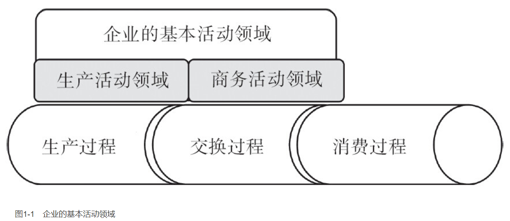

营销则是商务活动领域的一项商务职能，并在商务活动领域发挥作用。

生产活动领域的性质是，实现“原辅料—产品”的转换，经济学把这称为“产品价值的创造”，企业界把这称为`“生产”`。商务活动领域的性质是，实现“产品—货币”的转换，经济学把这称为“产品价值的转换”，企业界把这称为`“销售”`。

与此相对应，生产企业的组织结构，最初也分为两个部门，一个是生产部门，另一个是商务部门（见图1-2）。大约在1900年以后，商务部门的称谓逐渐统一为销售部门。后来，有了研发部门，生产企业的基本部门结构有三个部门，即研发部门、生产部门和销售部门，简称“研产销”。现如今，规模大一些的企业，并床叠屋，架起来三大中心，即`研发中心`、`生产中心`和`销售中心`。

随着工业化历史的进程，尤其是企业规模的扩张，以及货币的媒介作用，有了“流通过程”，企业再生产过程循环不再是“生产过程—交换过程—消费过程”，而是“生产过程—流通过程—交换过程—消费过程”。与此对应，企业商务活动领域必然进一步延伸，把商务活动的触角延伸到流通过程、交换过程，乃至消费过程，确保产品顺利进入消费过程，确保企业再生产过程循环（见图1-3）。

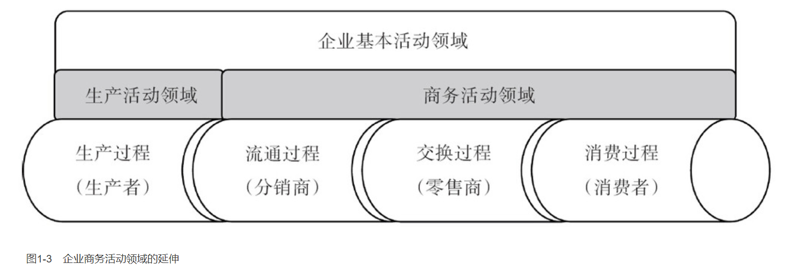

在中国，分销与零售，被称作流通渠道以及渠道终端；分销商有各种派生的称谓，诸如代理商、经销商、贸易商、批发商及其一级商、二级商和零批兼营商，等等。零售商也有很多称谓，从大卖场到士多店，不胜枚举。

### 商务领域的三项职能
在企业商务活动领域中，最初只有“营销与销售”两项职能。营销职能从事的活动是，构建“企业—客户”关系，构建供求一体化关系；销售职能从事的活动是，实现“产品—货币”的转换。

随着产销规模的扩大，以及商业流通体系的形成，企业商务活动领域的触角开始延伸，销售职能开始分化，有了“市场”（Market）的职能。从此，企业商务活动领域有了三项职能，即营销（Marketing）、销售（Sales）与市场（Market）。

只有通过影响消费者产生需求（有的买），才能激发分销商及其零售商的销售热情（有的卖）（见图1-4）。

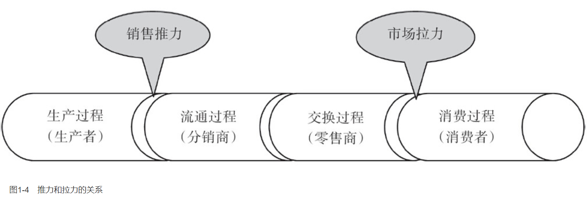

营销职能就是“开路”，开通从分销商、零售商到消费者的道路。销售和市场职能就是“开车”，推动产品顺利通过各个路段进入消费过程（见图1-5）。

### 商务领域的内在职能结构
商务职能部门做贡献的对象，一定是分销商、零售商和消费者。销售职能部门与市场职能部门，应该明确分工。前者对分销商及其零售商负责，努力为分销商及其零售商做贡献；后者对消费者负责，努力为消费者做贡献。两个职能部门应该在专业化分工的基础上，齐心协力形成一个整体，在实现“产品—货币”转换的层面上，共同为分销商、零售商以及消费者做贡献。营销职能部门则在另一个层面上，在构建“企业—客户”关系层面上，为分销商、零售商乃至消费者做贡献。由此形成商务职能部门的基本组织结构（见图1-6）。

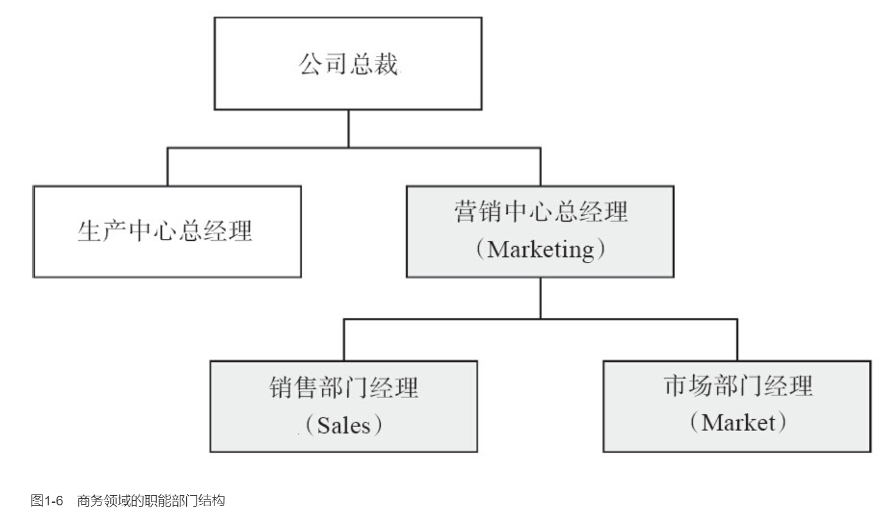

### 商务领域的外在表现方式
商务活动领域的内在职能结构，称为“商务职能结构”，商务活动领域的外在表现形态，称为“商务活动方式”。在大量生产方式问世之后，商务活动领域大体呈现出三种基本活动方式，即`大量销售方`式、`深度分销方式`和`社区商务方式`。迄今为止，公认的生产活动方式是两种，一种是`福特生产方式`（又称“大量生产方式”），另一种是`丰田生产方式`（又称“精益生产方式”）。

### 商务活动方式的演变

第一，大量销售方式的产生。大量生产方式是在“供求分离”情况下发生的，企业并没有建立“供求一体化”的关系体系，或者说，并没有建立自己的目标消费群以及足够大的市场容量，反之，消费者也没有准备好要接纳某个企业滚滚而来的标准化商品。因此，对大量生产方式的企业而言，没有别的选择，只能依靠规模化生产的优势，展开规模化销售；依靠规模化销售，释放规模化生产的潜力。如此循环往复，形成产销联动，所谓“更大的规模、更低的成本、更低的售价，以及更强的促销”。依靠产销联动，量产量销，打击对手，夺取市场，刺激消费，扩大容量，维持企业再生产的循环。

**在大量销售方式下，销售职能处于主导地位，市场职能处于辅助地位；而营销职能基本上被销售职能取代**。

第二，深度分销方式的兴起。深度分销方式的实践很早，可以追溯到100多年前。1903年，美孚依靠自己的商务实践，创造了深度分销方式。在中国，最早的深度分销方式，出现在1989年的花果山与三得利的合资企业。大体的做法就是“降低销售重心”，把商务活动的触角延伸出去，通过经销商延伸到零售门店，以此来提高销售效率，扩大销售数量。1998年，随着TCL的迅速崛起，才有了`“深度分销方式”`的称谓。宝洁公司把这称为`“分销一体化系统”`（Integrated Distribution System，IDS），台湾人称之为“厂商策略联盟”，可口可乐公司称之为“独特的业务发展模式”，其中包括“储运101（RSC101）项目”。

深度分销方式的特点，就是把分销商和零售商组织起来，形成一体化关系体系，包括利益关系和分工关系。进而，在“争夺市场”的整体策略引导下，共同推动企业的产品进入消费领域，包括依靠零售门店的主动性和创造性，强化对消费者的推介、导购和展示，等等。说白了，就是厂家和商家联手，做大产销规模，共享规模经济的好处。生产企业就可以借助于分销商的合作意愿，把商务活动的触角延伸到零售门店乃至最终消费者，打通分销到零售的全过程，是谓“深度分销”。可以说，**企业之争，不只是“产品”，更重要的是“关系”。谁拥有网络化的厂商一体化关系，谁就能够提高产销效率和产销规模，并能阻断竞争对手的产品顺利进入消费领域**。

第三，社区商务方式的趋势。当一个行当所有企业都纷纷转向深度分销方式的时候，谁都无竞争优势可言。维持再生产循环，主要靠降价、促销、拼资源。要想摆脱困境，摆脱恶性竞争的漩涡，就必须顺应供求关系逆转的趋势，进一步把商务活动的触角延伸到消费领域。在那里，与消费者或用户结成一体化关系，谋求“市场扎根”或“扎根于市场”。打通企业再生产的全过程，即“生产—流通—交换—消费”。

**对B2B的企业来说，就是走进用户的价值链；对B2C的企业来说，就是走进消费过程，走进消费者的生活方式**。

# 营销的两种协调方式
## 供求一体化的两种手段
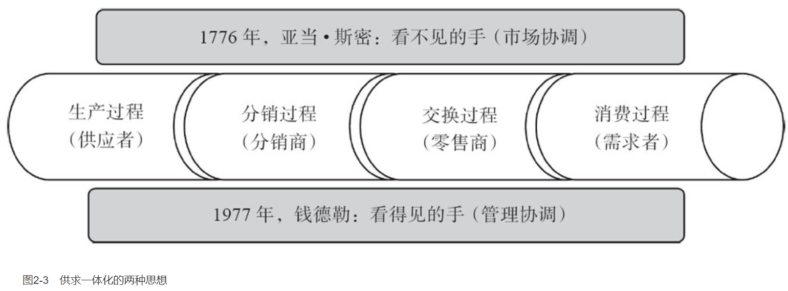

应该指出，斯密讨论的是社会再生产的组织问题；钱德勒讨论的是企业再生产的组织问题。斯密强调用看不见的手，把社会再生产过程组织起来，形成供求一体化状态，钱德勒强调用看得见的手，把企业再生产过程组织起来。

# 福特的大量销售方式
## 大量生产方式的问世
规模化竞争的直接后果，就是增强了企业对资本投入量的依赖，强化了资本及其资本所有者的地位和作用。资本也就成为稀缺资源，谁能获取资本、获取资本所有者的支持，谁就能够打开挣钱的通道。反之，投资规模不足，达不到关键规模，就无法建立低成本优势，甚至会丧失参与竞争的资格。

## 大量销售方式的必要
### 大量生产方式的缺陷
大量生产方式一旦问世，其内在的缺陷就会显现出来，即不断再生产出过量的或过剩的标准化产品，同时引发企业之间规模化扩张的恶性竞争，不断地破坏供求之间的平衡，甚至威胁到一个社会的正常运行。

### 规模报酬递减的威胁
从企业自身的角度说，采用大量生产方式后，一旦失去降价能力或者失去市场控制能力和地位，就会即刻陷入困境，出现规模不经济的现象。换言之，产品销售会变得更为困难或受阻，为了维持再生产的循环以及减免存货风险，不得不“降价促销”。

### 大量销售方式的特征
大量生产企业的生存法则及其内在逻辑是，持续扩大规模、降低成本、降低售价、提高产品性价比。由此决定了大量销售方式的本质特征，这就是依靠持续降价促销，刺激消费，打击对手，扩大市场份额，使市场需求持续发生在本企业产品上，使规模经济的效应发挥出来，使规模化连续生产的效能发挥出来。

这不同于传统的生产活动方式，强调坚守本行，精于一道，依靠专业化的能力，提高产品差异化程度，提高产品的性价比。也不同于小生产条件下的商务活动方式，强调以营销为基础，努力构建与深化“企业—顾客”的联系，努力建立信誉或商誉，为自己的产品提供信誉，为销售奠定基础。

### 大量销售方式的有效性
在大量销售方式下，老板以及销售总部总经理，主要负责大客户的开拓与维护；同时，制定政策和策略，以年度购销协议的方式，构建分销以及零售网络体系（见图3-3）。

销售总部下设两个职能部门，销售职能部与市场职能部。在理想的状态下，销售职能部的主要职责是，提高对分销商及其零售商的影响力与支配力，主要手段是提供服务与帮助。同样，市场职能部的主要职责是，依据“成就他人、成就自己”的理念，提高最终消费者的影响力和支配力（见图3-4）。

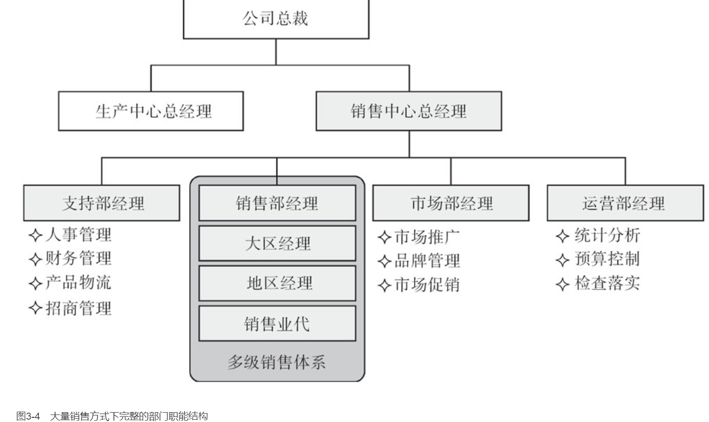

## 福特大量销售方式的实践
### 福特的销售职能
可以说，从福特到卡曾斯，都是销售能手，而不是营销专家。他们关注的只是产品供求一体化，而不是供求者之间的一体化；换言之，他们关注的是，如何促进产品转化为货币，而不是如何构建与维持供求者之间相互依存、相互作用的关系。

### 福特的市场职能
早在1901年，福特还生产不了什么供人消费的时候，就懂站在众望所归的地方，把自己推销出去。冒险亲自驾车参赛，挑战当时的冠军人物亚历山大·温顿。之前他没有上过赛道，也没有接受过专业训练。1902年，福特研发出999型，由著名赛车手欧菲尔德（Berna Eli Oldfield）驾车参赛夺冠，并驾车周游美国，使福特汽车及其高性能名闻天下。1903年，福特设计并组装了A型汽车，一辆真正实用的汽车。

B型汽车推出后，福特再度亲自驾车参赛，创造时速91英里，吸引媒体的注意。

1908年，T型汽车问世后，福特和卡曾斯共同策划T型汽车的问世计划，他们要集中资源引爆市场需求。3月，先邮寄一批商品目录给主要经销商，试探一下他们的反应。不打招呼，也不做宣传，就像往常传递新品目录清单一样，并注明必须把R型和S型汽车的库存清空，才能经销T型汽车。果不其然，经销商反应很热烈，纷纷表示尽快清光库存，主推T型汽车。由此坚定了福特和卡曾斯的信心，决定10月1日（星期五）新车揭幕，在全美展开声势浩大、史无前例的宣传活动。10月2日（星期六）清晨，也就是第二天，回来1000多封邮寄的汽车订单；10月4日（星期一），订单像雪片一样飞来。以后发生的事情就是，连篇累牍地在刊物上刊登大幅宣传，一刻不停地邮寄广告图片，动用一大批人发电报、打电话一对一传播消息或推销，外加门店展示。结果使迫不及待的经销商乃至消费者乘坐火车蜂拥而来，导致公司销售部忙不过来，紧接着是生产部招架不住。

福特会利用社会热点话题，结合汽车的宣传与教育，阐述自己的生活理念、价值主张乃至社会观念，使自己成为大众的代言人。

福特的营销职能与市场职能是不分的，这也是大量销售方式的基本特征，即关注产品的销售业绩，而不是供求者之间的一体化关系。换言之，福特关心的是，如何塑造产品的需求概念以及公司的诚信形象，使自己的产品以及公司成为社会大众追捧的对象，使有限的需求发生在自己的产品身上。说白了，就是烘托市场氛围，把公众吸引过来，使更多的人一旦产生购买动机之后就会首先想到你。尤其是吸引经销商的注意力，使之产生一种将要热销的心理预期，乐意经销企业的产品。

在促销方面，福特主要采取示范手段，一是利用名人效应进行示范。1918年，随着企业产能的进一步扩大，迫使福特加大对市场的刺激力度，促使更多的人产生消费兴趣和购买欲望，别出心裁地策划了一项活动。邀请三位著名人士托马斯·爱迪生、哈维·费尔斯通、约翰·伯勒斯，加上他自己组成一个小团体，自嘲四个“流浪汉”，乘坐T型汽车去乡村旅行，找半荒野的地区放松。实际上是一次豪华旅行，带着一帮随从和服务人员，摆上豪华的餐桌和美味佳肴，邀请各地更多的名人出席宴请。据说这些豪华餐桌曾经招待过柯立芝和胡佛两位总统。这一举动引来大批记者追踪，他们竖起耳朵聆听长者们的每一句话，并用热情洋溢的文章加以大肆追捧。诸如“身价百万的经营队伍踏上旅程”、“露宿星辰的天才们”、“工业国王团访问由发明家资助的城市”。结果引来无数当地人看热闹，把四位名人围得水泄不通。

二是借助于《福特时代》杂志以及其他宣传手册，用普通人的现身说法，传递驾驶T型汽车那种令人陶醉的感觉，还有不胜枚举的趣闻轶事。

### 福特的直销职能
霍金斯自称是福特聘用的第一位销售总监，从1907年到1919年，先后主持世界范围内的销售工作达12年之久，汽车的销量从每年6000多辆增加到了8万多辆，年销量增加了132倍。

霍金斯这件事情是真正具有营销价值的，即通过直销员结成“企业—顾客”的关系体系，并教导他们成为一名真正的服务人员，客观而公允地向顾客提供资讯服务，帮助顾客做出正确的决策。按照霍金斯的说法，直销员要想成就自己，必须赢得顾客的信赖、尊敬与友谊，一种基于商业服务的友谊而不是私交，将自己同客户在心灵上联系在一起。让客户感受到你的坦率、真诚、友好和平等，从而在他们的记忆中给你留下一席之地。直销员需要的不是顾客的一次订单，而是顾客的全部订单；公司将依靠越来越多的优秀直销员取得普遍的荣耀和信任，不断深化“企业—顾客”的联系。

# 通用的深度分销方式
## 深度分销方式的特征
### 深度分销方式的实质
1918年斯隆（Alfred P.Sloan Jr.1875—1966）加盟通用，1923年成为COO，任职10年；1933年成为CEO，任职23年。前后任职33年，1956年退休。美国《商业周刊》认为斯隆是75年来最伟大的创新者之一。

退休前，斯隆发表了《我在通用汽车的岁月》（1964年），该书的初衷是为了驳斥德鲁克《公司的概念》（1946年）。后来的结果出人意料，《公司的概念》成为斯隆的掌上明珠，两人也成为朋友，经历了20年的友谊。

福特的破绽或薄弱环节是很明显的，一是在企业管理上独断专行，抑制内部的主动性和创造性。二是依靠低成本，降低售价，提高产品性价比。三是忽略与经销商乃至消费者之间的联系。斯隆的反其道而行之，一是实行事业部制改造，依靠集中政策下的分散管理，激活企业内部经理人的主动性和创造性。二是加大新技术开发与应用的力度，提高产品的性能，提高产品的性价比，强化汽车的精英路线，阻断福特与市场消费者之间的联系。三是与经销商利益与共，不断深化与经销商之间的联系，不断壮大经销网络体系，蚕食福特产品通往市场的通路。

### 商务活动方式的竞争优势
有人把可口可乐的深度分销方式，称为“独特的业务发展模式”。按照《可口可乐2007年可持续发展报告》的说法，可口可乐公司的业务模式就是，“我们将浓缩液和糖浆销售给装瓶公司，即我们的装瓶合作伙伴，并授权他们使用这些原料生产我们的系列饮料。我们的装瓶合作伙伴独立发展当地市场，将这些饮料供应给我们的客户，包括食品店、零售商、超市、餐厅以及其他企业。与此同时，我们的客户又帮助我们将饮料提供给我们遍布中国的消费者”。

在这个业务发展模式中，可口可乐公司始终是一个产业价值链的组织者，依靠核心资源要素，包括可口可乐的品牌与可口可乐的饮料，形成对价值链相关利益者的支配力和影响力；进而依靠整体的策略和规范的管理，使相关利益者成为可口可乐的合作伙伴、可口可乐的分销商、可口可乐的零售商，乃至可口可乐的消费者，有效地实现对传统分销商及其零售门店的管理乃至控制。

1925年，T型汽车的销售急剧下降，市场份额下降为25%。1926年，被迫宣布T型车大削价，结果无效，无法阻止市场份额急剧下降的势头。不得已，1927年，底特律红河工厂被迫全线停工，表明福特颓势已成定局。尤其让福特倍感痛苦的是，曾经红极一时、被人追捧的T型汽车，几乎一夜之间，被人唾弃，被讥讽为“泥水塘里的蹦蹦车”、“咖啡磨碎机”。其后的19年，1927年至1946年，福特公司一落千丈、连续亏损，累积亏损10亿美元，把过去挣的钱全部赔光。

### 深度分销方式的职能结构
在深度分销方式下，原来的销售中心就被营销中心取代，下设两个部门依然不变，两个部门负责的对象不变。但是两个部门的称谓改变了，一个是销售管理部，负责对分销商及其零售商的管理；另一个是市场管理部，负责对消费者的管理（见图4-2）。

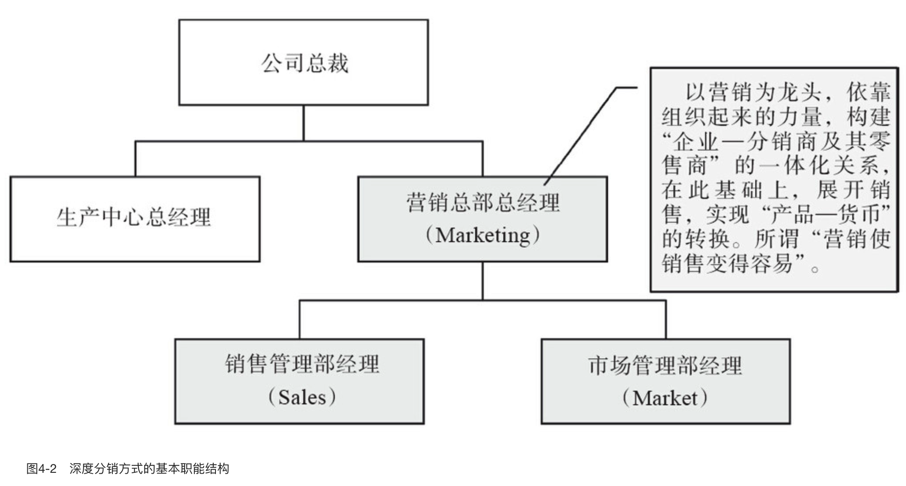

在深度分销方式下，营销中心要完成职能转变，要集聚起一批专业人士乃至专家级的营销人士，研究制定策略地图及其管理规范，然后通过营销中心总经理及其领导班子，约束和激励销售管理部门转变职能，努力按照策略和管理规范，构建与分销商及其零售商的一体化运营体系，同时促进下属业务经理和业务人员，向客户顾问转变，转变为经销网络的管理者，而不是销售代表或业务代表。换言之，原来的销售业务部门，不再是一级经销商，不再从事产品的买卖；而要转变为销售管理部门，从事渠道及其终端的管理，以维护供求者之间的一体化关系体系（见图4-3）。

## 通用深度分销方式的实践
### 斯隆在经销商关系上的努力
为了确保经销商的利益，斯隆采取一系列有效的举措。诸如：①提高经销商的折扣，拉拢经销商，弱化福特与经销商的联系。②把雪佛兰汽车经销商的回扣比率，从21%提高到24%。当时福特汽车的回扣只有17%。③设立汽车控股公司，资助经销商进货。④建立通用汽车经销商理事会和通用经销商关系委员会，认真接受和处理经销商的投诉。⑤建立产销平衡系统以及产销协调政策小组，统计分析、预测、跟踪和调整每一款车的产量与批次，使“生产期量”和“销售期量”保持平衡。所谓“期量”，就是各个周期的数量，包括生产周期的产量和销售周期的销量。

# 丰田的社区商务方式
## 丰田生产方式的作用
### 丰田崛起的原因
《改变世界的机器》作者，是麻省理工学院的一帮学者，他们关注到了丰田汽车公司在1973年的石油危机中保持高额利润，于是花了500万美元，前往丰田实地考察和研究，最后得出一个结论，认为丰田的成功与成就，在于独特的生产方式，并正式命名为“精益生产方式”（Lean Production）。认为丰田超越了福特的“批量生产方式”（Mass Production）。所谓`“精益”`，就是“去除浪费，留下精髓”。

### 精益生产方式的作用
丰田生产方式能够有效地控制或调解存货偏差，使存货的偏差控制在生产活动领域，避免强力促销和推销。从而确保商务活动领域能够按照市场的实际需求提供产品，真正做到`“按需生产”`。

营销部门与研发部门之间的关系，或称`“营研关系”`。丰田商务活动领域及其营销职能，可以扮演研发与需求之间连接的桥梁，把市场消费者的需求，转变成产品的概念，所谓“产品概念开发”，把需求导入到企业内部，成为研发部门开发产品的依据和前提。由此围绕着市场消费者的需求，确立起企业内部清晰的两条价值链，一条是产品供应管理链，另一条是产品生命周期管理链（见图5-1）。

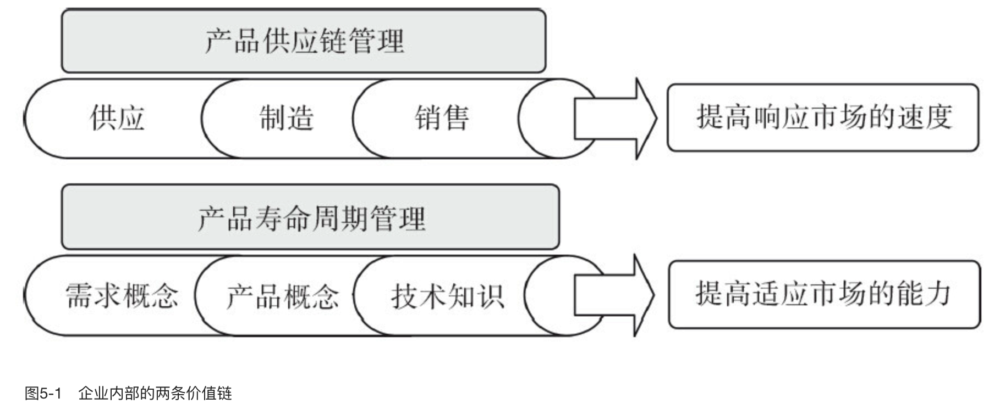

产品供应管理链的目标是，“提高响应市场的速度”。通过提高质量，提高一次通过率，所谓“一次做对、次次做对”，来降低成本，简称“品质成本”；同时，通过缩短交货周期，降低存货风险，减少机会损失，来降低成本，简称“时间成本”。

产品生命周期管理的目标是，“提高适应市场的能力”，通过深入消费者生活方式，提高产品概念开发的能力，不断提高企业适应市场变化的能力。所谓“产品概念”，包括产品功能、产品价格、产品价值、面市日期、外观特征、可能的客户或首用者、可能的经销渠道、市场定位、推广方案、推广区域定点或布局、市场推广周期、市场推广费用、可能的销售速度等。产品概念又称“新产品包”。

### 社区商务方式的实质
社区商务方式的本质特征，是构建“企业—消费者或用户”的一体化关系。通过“企业—消费者或用户”的一体化关系，反过来，进一步整合内部和外部的价值链，包括内部的生产活动领域，外部的分销商及其零售商，使整条价值链协同起来，共同为最终的消费者或用户做贡献。

### 社区商务方式的职能结构
在社区商务方式下，`“市场职能”（Market）`也开始从“关注产品”转向“关注人”。这一回，关注的不是分销商及其零售商，而是最终消费者，或者关注“企业—消费者”之间的联系。并且走进消费者的生活方式，从“供应链”出发，走进“需求链”（见图5-2）。

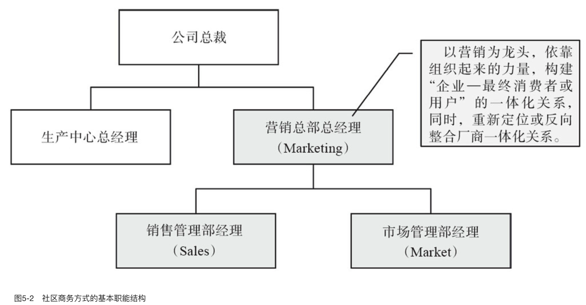

在社区商务方式下，营销中心的职能依然如故，依靠一批专业人士乃至专家级的营销人士，研究制定策略地图及其管理规范。销售管理部门的职能依然如故，努力按照营销中心的策略和管理规范，构建与维护“企业—分销商及其零售商”的一体化运营体系。而市场管理部门，一方面需要转变职能，从促销宣传活动的策划与组织，转向消费者或社区的策划与组织；另一方面需要强化职能，主要是增加人手和资源，强化团队的力量，以及支配资源的权利。同时，改变市场职能部门与销售职能部门的关系，从原来市场配合销售，俗称“助攻”或“助销”角色，转向销售配合市场。市场职能的主要职责是组建社区，组建消费者的社区，并在市场职能部门与消费者的互动中发现商机，构建起“商务关系”，开发产品与服务概念。进而，引导企业内部各个部门做出响应，帮助企业打通内部两条价值链，所谓“营销使销售变得容易”（见图5-3）。

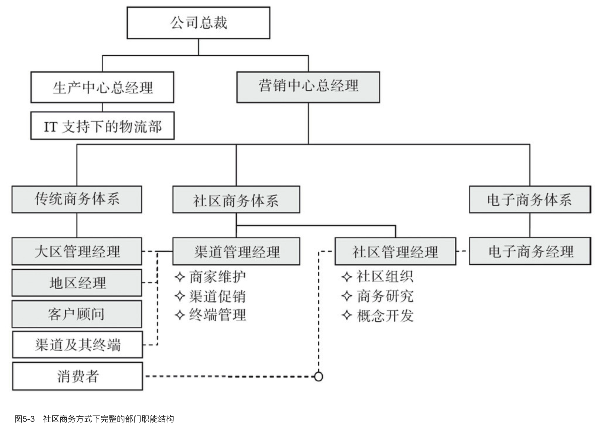

现在的电子商务，存在着致命的缺陷，在于无法有效地确立企业及其产品和服务的信用，迫切需要转向社区商务方式，构建社区商务活动领域的组织及其职能结构。

## 丰田生产方式的要点
### 准时制
所以`丰田生产方式（TPS）`又称`“准时制生产方式”（JIT）`。在超市中，只要顾客拿走一些商品，货架上就会显示缺少多少什么样的商品，后台人员就会自动予以补全。这就是“下道工序就是顾客”理念的由来。大野耐一由此想到，只要用“看板”显示下道工序的需求，上道工序就能做到及时补货，从而实现“准时制”。丰田生产方式的管理方法，也被称作“看板管理”（Kanban Management）。

这种“准时制”，意味着生产活动领域具有自我调节存货、纠正存货偏差的能力；从而使供求关系建立在“响应”的基础上，包括响应销售订单或响应市场需求。而不是建立在“预测”乃至“降价促销”的基础上。从这个意义上说，按需生产的必要前提，就是改变生产方式，确立准时制生产方式（见图5-4）。

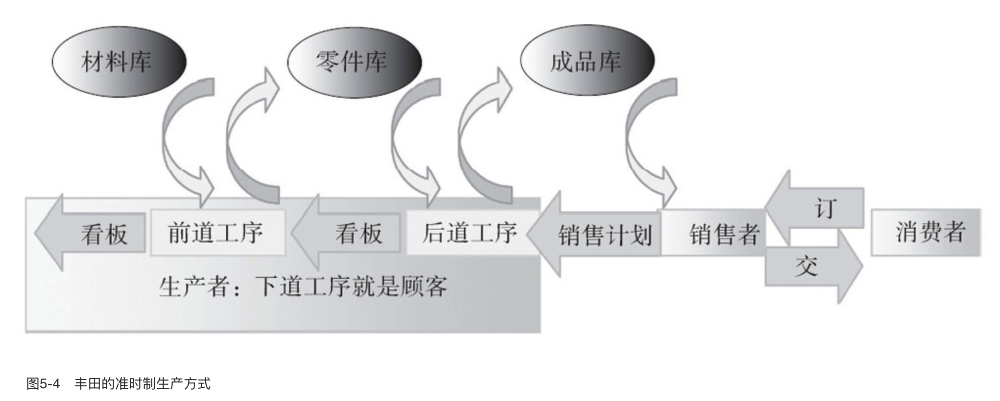

### 短周期
做到“准时制”以及降低各环节存货是不够的，必须缩小生产批量，缩短生产周期，提高产品响应市场需求及其变化的能力。其中的要害和难点是，缩短品种转换时间。一般而言，增加“品种转换”次数，会减少生产作业时间，以及增加设备调试成本。可以说，品种转换的时间和成本，导致生产批量的增加，生产周期的延长。因此，只有把品种转换的时间和成本降低到最低限度乃至为零，才能按照市场的需求“变品种”和“变批量”，真正做到“订单式生产”，即等到订单发生之后再投料生产。

从理论上说，如果品种转换时间和成本为零，那么就可以做到一件一批次，所谓`“单件流程作业”`。丰田公司的实际情况是，所有大中型设备的装换调整操作都能在10分钟之内完成。

### 均衡化
无论是“准时制”还是“短周期”，最后的落脚点是“均衡化”，包括生产活动领域各环节的“均衡化”，以及产销之间的“均衡化”。从速度经济的角度说，均衡化就是整体通过能力，就是使“生产—销售”各环节的通过速度保持一致。只要一个环节不能有效通过，就会产生壅塞，即通过速度趋向于零，其他各个环节就会停顿下来，包括最终环节或总装配线就停顿下来，不能继续产出成品。解决问题的办法，就是依靠“节拍”，依靠各环节同样的“节拍”，保持“原辅料—产成品”各个环节的同步作业。

为了保持生产过程的均衡化以及产销之间的均衡化，必须提高生产作业过程的柔性。大野耐一的做法是，按照产品或零部件加工过程，把机器设备排列起来，形成专用的生产线。同时，提高专用设备的通用化程度，以及提高零部件的标准化、系列化和通用化程度。使专用生产线，能够加工不同系列的产品。所谓“专用设备的通用化程度”，就是专用设备附加的工夹具数量。只要转换工夹具，就可以加工不同的产品或零部件。

在此基础上，培训工人操作多种机器设备的能力，也称“多机床管理”。当市场需求量大了或销售订单多了，就增加操作工人；同时，减少工人的操作工序，以及机器设备的数量，提高各环节或工序的通过能力，或提高工序单位时间的产出量。反之，当销售订单少了，就减少操作工人，增加工人的操作工序，以及机器设备的数量，降低各环节或工序的通过能力，或降低工序单位时间的产出量。

## 丰田商务领域的实践
### 产销分离
三井财团制定了《重建法案》，对丰田公司提供帮助。具言之，由三井银行牵头，聚集20家名古屋地区银行组成银团，给丰田公司放贷2亿日元。以此为条件，由三井财团主导，对丰田公司进行重建与重组。所谓“重建”就是“产销分离”，要求丰田公司把销售职能从生产活动领域中独立出来，单独成立“丰田汽车销售公司”；而原先的公司更名为“丰田汽车工业公司”。

产销分离之后，神谷正太郎开始强势运作，强调“用户第一、特约经销商第二、生产厂第三”，即后人所称的“神谷原则”。正太郎的意图是，确立丰田汽车销售公司的龙头地位，明确产销之间的“价值排序关系”。说白了，就是销售听市场的，生产听销售的。借用正太郎的话说，“有需要者，才有销售者；有销售者，才有生产者”。很快石田退三就明白，所谓`“神谷原则”`，就是“市场第一、销售第二、生产第三”。

### 厂商结盟
产销分离之后，正太郎构建并强化了“厂商一体化”运作的体系。他很清楚，丰田公司的致命弱点在于此。

1. 利用地域之缘，策反和拉拢一批美国汽车的日本经销商及其零售门店。
1. 鼓动各地的知名人士经销汽车，并帮助他们开设下家零售门店，使之转变为“网络经销商”。

### 扎根市场
从产销分离到厂商结盟，神谷正太郎实际上在不断倒逼生产活动领域，按照喜一郎设想的“准时制”实现新的生产方式，不要再给销售公司添麻烦了。

从那个时候起，神谷正太郎着手把商务活动的触角延伸到消费者，从供应链渗透到需求链。其中的最关键的一步，就是遵循斯隆提出的销售四原则，即“分期付款、旧车折价、年年换代、密封车身”，进一步拓展市场需求容量，拓展经销商的利益空间，维持经销商的资金利润率。具言之，要想维持汽车经销门店的资金利润率，必须确保三方面的收入来源，一是新车交易，二是车辆维修，三是二手车交易。否则，经销商就会因资金利润率递减而转换门庭，悄悄地在开一家门店，经销别的竞争品牌。

对神谷正太郎而言，实现销售四原则的关键是，守住二手车的市场价格，所谓“旧车折价”。通过守住二手车价格，促进一手车的车主更换新车；同时，吸引银行提供资金，实现所谓的“分期付款”，或称“按揭”，刺激更多的消费者进入市场，并使需求发生在丰田车上。从而进一步强化对经销商的支配力和影响力，所谓“成就他人、成就自己”。

要想守住二手车价格，必须把每一年的车型车款区隔开来，所谓“年年换代”，反过来，年年换代又可以进一步刺激车主更换新车。

对最终消费者而言，自己不是丰田汽车的所有者，而是丰田汽车的使用者；真正的车主或车辆的所有权，是银行及其背后的丰田汽车公司。对丰田公司而言，自己不仅仅是产品的生产者，而且更是分销活动领域、零售活动领域和消费活动领域的组织者，是围绕着消费者需求运作的创造者。

在这个过程中，传统意义上的二手车市场的性质也改变了，成为丰田汽车使用权以及按揭债务转移的场所。这意味着，交易或转移的对象，不仅仅是二手车，还有三手、四手、五手……N手车，直至退役或报废。至今为止，丰田汽车公司依然用“更高的汽车残值”概念吸引消费者。

很快消费者就会意识到，不必在乎汽车的全价，也不必关心汽车的新旧或配置的高低。只需要考虑自己的月供能力，根据自己的寿命周期选用汽车。由此反向刺激和约束丰田公司，按照“消费者的寿命周期”而不是“产品的寿命周期”更新换代汽车。

所谓`“消费者的寿命周期”`，是指每一个人的生命历程。每个人都会自然而然地经历生命的各个阶段，从快乐的单身汉，到卿卿我我的恋爱、婚姻、家庭，再到寂寞难耐的孤寡老人。每个人在不同的生命阶段，都会产生独特的生活追求和生活方式。

所谓`“按消费者寿命周期开发产品”`，就是应用各种要素或手段，开发一辆合乎不同年龄段人需求的汽车，或帮助热恋中的男孩，显示出独特的气质以及生活理念和生活方式；或帮助热恋中的女孩，显示出诱人的温柔、体贴和阳光的一面。从寿命周期的角度说，消费者并不需要“价廉物美”的汽车，也不在乎汽车的“安全、可靠、舒适、美观”，更不在乎汽车的“型号、油耗、扭矩、车速”。对不同寿命周期或年龄段的人来说，汽车只是自己生活方式的一个组成部分，汽车的功能、外观、色彩和造型等，只是实现自己生活方式的一种手段。

神谷正太郎确实也这么做了，他明确向消费者承诺，每辆汽车的保修期为2年或5万公里；并要求丰田汽车工业公司承担保修期内发生的全部修理费用，把市场竞争的压力直接传递到生产活动领域。在保修期内，汽车一旦出现故障需要停驶检修，由丰田汽车销售公司免费出借汽车给用户使用。

另外，明确要求零售门店，每售出一辆车，都要建立“用户档案”；在三个月内找用户征求意见，之后，要记录该车出现的一切抱怨、建议、故障、维修和保养方面的情况。要把“用户档案”的信息定期反馈到丰田公司，由丰田公司定期研究制定策略举措，以及组织力量加以改进。

# 长虹与TCL商务方式之争
## 长虹的大量销售方式
### 长虹争夺市场的战略
就像福特所说，“对于汽车，没有市场需求；对于新兴事物，本来就没有需求这一说”，“在保证质量的前提下，每一次降价都意味着扩大了潜在的客户群”。而是考虑价格有没有吸引力，能不能吸引贸易公司。

长虹相信，只要贸易公司，比如郑百文和武汉长江工贸，愿意经销或主推长虹的产品，就能够获得一个支点，可望撬动整个市场。充分利用贸易公司的下家渠道，实现规模化销售。另外，长虹选择贸易公司还有一个理由，这就是贸易公司不关注单台彩电的毛利，只关心现金流量和资金滚动速度，只要现金流量大且滚动速度快，资金利润率就高，挣的钱就多。相比之下，一般的经销商，经营规模很小，追求单台彩电的毛利，出货速度慢。

其次，依靠大宗交易合同，以彩电作为抵押，拉进银行提供承兑。这样，贸易公司不需要出钱购货，只需要凭借签署大宗交易合同就行，由银行向长虹支付货款。贸易公司只需脱手货物之后，把钱还给银行，外加贷款利息。可以说，长虹借助到了贸易公司和银行的力量，顺利打通分销领域，产销量迅速飙升，一夜走红。

有一点连长虹自己都不清楚，以往的成功是建立在厂商之间“产品买卖关系”上的，而不是建立在厂商之间相互依存的关系体系上的。可以说，长虹与郑百文之间的关系非常脆弱，很像当年美孚与叶澄衷商号之间的关系。长虹只是依靠交易条件及其购销协议，实现了与郑百文及其分销渠道的对接。而郑百文只是一个大进大出的投机商号。长虹并没有建立相应的分销管理体系，并对分销网络进行有意识的组织与协调随着产销量以指数方式放大，分销过程的风险也会以指数方式放大。

长虹没有在企业与商家之间的共同利益上下功夫，而是依靠销售政策及其价格杠杆，去调拨郑百文以及大大小小的独立分销商的行为，实现长虹持续做大的销量目标。主要策略就是“从量计价”和“持续降价”。所谓“从量计价”就是分销量越大、折扣越大；所谓“持续降价”就是不断地调低结算价。并配合产品的流通，大做广告以及大规模宣传促销，刺激消费者，吸引分销商。这种连环策略，可以有效地抑制分销商和零售商囤积居奇的行为。事实也是这样，当一些大的分销商开始利用折扣上的优势放量冲货的时候，另外一些分销商就按捺不住焦虑的心情。于是乎，就引发了分销商之间的相互倾轧，争夺销售机会，抛售长虹产品。推动长虹产品源源不断地进入市场，到达消费者手中。从而成就了长虹，使长虹得以维持规模化扩张的势头（见图6-1）。

长虹的做法实际上伤害了郑百文和大大小小分销商的利益，使之看上去很像长虹产品的“搬运工”，把长虹彩电从流通渠道的高端搬至零售终端，赚取一点点辛苦钱。最终分销商动摇了对长虹的信赖基础，1997年年底，济南7家商场扬言拒售长虹彩电。这实际上就是一个信号，预示着长虹大量销售方式的瓦解。

## TCL的深度分销方式
### TCL的历史起点
第一，敢于利用政府首开的且无人问津的“拨改贷”政策，获取必要的足够多的资金。第二，把一些地区的分销商变成TCL的销售分公司，并依靠分公司平台连接更多的零售门店，构建起一个初具规模的分销与零售网络。第三，先是租用厂房和生产线加工TCL彩电，后来与长城集团合作扩大产能；1996年兼并香港陆氏集团的彩电项目，1997年与美乐集团合资组建“TCL美乐电子有限公司”，建立TCL的生产基地。第四，从彩虹集团获取准入市场的资格，等等。一句话，按照整体战略意图，以合作共享的姿态整合资源，迅速构建一条以我为主的产业价值链。从1992年到1996年，TCL产销量持续增长，市场份额名列第三，成为彩电业的一匹黑马。

### TCL的深度分销方式
所谓“深度分销”，区别于一般意义上的“分销”，强调的是把企业商务活动领域的触角通过分销环节，延伸到零售环节，与分销商及其零售商建立合作伙伴关系。一般而言，生产企业只与分销商打交道，不插手分销商与零售商之间的关系，主要通过分销商把产品推进到零售环节，是谓“分销”。TCL采取的方式，不仅与分销商打交道，而且渗透到分销商的下属零售门店，在那里帮助零售门店主推销TCL的产品；是谓“深度分销”。

所谓“深度分销方式”，就是按照争夺市场的整体策略，与分销商及其零售门店结成一体化的关系体系，通过主推企业的产品，谋求共同利益的最大化。其中涉及三个基本概念，一是确立争夺市场的整体策略，二是构建深度分销网络体系，三是建立深度分销的管理体系。三者的关系是，通过深度分销的管理体系，构建和维护分销与零售网络体系；并在整体策略的引导下，依托企业的整体力量，攻击竞争对手的薄弱环节，促使企业与竞争对手之间的优劣势转换，创造更大的销售业绩。换言之，如果没有一个明确而统一的策略，就无法确定未来的胜负及其预期的利益，从而无法吸引更多的分销商，形成长期而稳定的“策略联盟”。

### TCL争夺市场的策略
具体的策略要点就是甩掉一级商，按照一县一户的政策，收编和笼络县级分销商或区域二级分销商，用一年的时间与3000个二级分销商结成策略联盟，并通过二级分销商控制10000个零售门店，要求每个分销商平均控制或创办3家零售门店。由此构成一个庞大的“垂直分销与零售网络体系”。同时，从销售公司总部到大区、销售分公司和经营部，转变为“深度分销管理体系”，对分销商及其零售门店进行组织与管理协调，包括指导、帮助、约束和激励。当时TCL销售公司总部乃至于集团领导，采取了强硬的行政性手段，要求7个销售大区按整体策略方针采取统一的行动。并明确告诉各大区总监，“不换脑子换位子”，不允许大区以任何的名义炒大户，不允许像长虹那样与经销大户或一级分销商做倒手买卖，确保整体策略的落实到位（见图6-2）。

争夺市场的最有效手段，就是打断长虹与分销商、零售商乃至最终消费者的联系，阻止长虹产品顺利通过分销与零售环节进入消费领域，使之滞留在流通领域乃至生产领域。TCL的策略意图就是“把长虹的库存打死”，“使长虹产品无法实现有效销售”。具体而言，长虹在流通渠道的高端上利用郑百文这样的大户降价、放货、冲量。TCL则反其道而行之，在市场的终端上构建深度分销网络。这样不仅可以避其锋芒，避开与长虹直接竞价；而且可以跨过一级商或大户，缩短产品的流通周期，加快产品抵达市场终端的速度；同时充分利用深度分销体系主推TCL的产品，加快产品进入消费领域的速度。TCL进入消费领域的产品越多，长虹的产品就越难进入消费领域，形成此长彼消的战略态势。另外，在终端市场上，TCL并不与长虹正面冲突，可以用整合起来的分销与零售网络体系，去打击各路分销商，包括长虹的分销商。包括迅速获取销售一线的信息，迅速对市场及其竞争状况做出响应；通常只需要一纸电传，就可以把某一款机的价格放下来，阻止竞争品牌的有效销量。

### 构建深度分销网络体系
那时的“流通渠道”，通常是由“一级分销商（省级批发商也称批发大户）、二级分销商（县级批发商）、零批兼营商、单一零售门店”构成。

构成流通渠道中的各个商家或商号有两个特点，第一，彼此都是独立经营的，处在高度离散的状态。所谓“横向专业化”，与现代流通体系的“纵向专业化”及其大型零售商体系很不一样。资本量小，抗风险能力低。大都是机会导向，而不是战略导向，依据各自预期的商业利差，从事着商品的买卖。按照生产企业的评价，商家的忠诚度低，唯利是图，难以结成合作伙伴。第二，在称谓上五花八门，诸如贸易商、批发商、经销商、代理商、零售商，还有士多店和街边摊位。所谓“贸易商”，是指那些具有海外贸易业务的公司。后来一些贸易公司的主营业务转向国内市场，大都从事分销领域中的“分销业务”。“贸易商”与“批发商”、“经销商”、“代理商”一样，都是“分销商”，从事分销业务又称批发业务。“经销商”拥有产品所有权，即采购生产企业的产品进行分销；“代理商”不拥有产品的所有权，只是代理企业产品进行分销。在实践中，究竟是经销还是代理很难区分，有时候生产企业要求商家支付定金甚至买断或付现；有时候则向商家提供账期乃至信贷。“分销商”之外的就是“零售商”，包括超市、大卖场、连锁商店、士多店、小摊小贩。概言之，处在分销领域中的商家就是“分销商”，处在交换领域中的商家就是“零售商”。

面对诸多零散而机会导向的商家，TCL构建了城市与乡村两种渠道，城市渠道通向一二级市场的城市居民，乡村渠道通向地市县的城镇居民以及广大农村消费人群。在农村市场上，TCL的渠道只辐射到地市县，没有力量进一步辐射到更广阔的三、四、五级市场。当时人们习惯于按照城乡消费水平的级差，把全国市场区分为6个等级，即一级市场（中心城市、省会城市或一类城市）、二级市场（二类城市）、三级市场（地市县）、四级市场（乡）、五级市场（镇）和六级市场（村）。

TCL构筑的两种渠道都是扁平化的。在大型或特大型的中心城市，由TCL当地分公司直接招聘业务员和导购员，在各家商场设立专柜，所谓“店中店”，直接面对消费者进行销售，包括陈列、导购和促销。据说，早在20世纪90年代中期，TCL的合作经销商就已经在北京和上海等城市，派导购人员进入大商场。那时的导购人员称为“厂家信息员”。在省会以下城市的二级市场上，TCL主要依靠当地的分销商，进入各商店销售。有的分销商也像TCL那样租一个柜台进行销售。TCL则派业务员对分销商及其专柜进行管理。

在地市县，TCL按照“一县一户”的政策确定销售责任区域，按照统一的管理规范与标准，网罗和选拔区域二级分销商（即地市县分销商），并且帮助他们建立下家零售门店或店中店，使之成为一个个“小型的网络零售商”，拥有自己掌控的零售门店网络。TCL选拔分销商的基本要求是认同TCL价值文化与经营方式；有头脑，有教养，人品好；对员工负责，办事认真；对周边关系讲客观，讲信誉；有一定的管理能力；有一定的经营理念与经营实力；不投机，有做大事业的冲动；循规蹈矩，无不良记录等。

相比之下，长虹的销售重心较高，主要是高端放货，在区域市场的终端上得不到地市县分销商及其门店的支持，缺少必要的售后服务与维修体系，加上窜流货和市场价格混乱，导致商家怨声载道，无利可图且消费者退货纠纷不断。

### 构建深度分销管理体系
值得一提的是，TCL的销售管理规范的原创思想和方法，来自日本企业管理专家矢野新一的ARS战略（Area Roller Sales）。这是一种建立分销与零售网络优势、持续冲击区域市场第一的有效方法。该方法在丰田汽车、日本生命保险、日本烟草、福武书店、黑田办公用纸等数百家企业得到成功验证。矢野新一认为，成为区域市场第一就能获得6个方面好处，包括可以压制竞争对手，提高顾客的忠诚度和安全感，留住优秀的人才，获得更多和更好的情报，大幅度提高利润率，确立销售网络优势。因此，任何企业都不应该迷恋于现在的市场地位，必须向绝对的领先地位冲击。必须遵循5大原则，即集中原则，集中力量于重要区域、客户与商品上；以强击弱原则，在攻击市场地位较弱者的同时，攻击强者的致命弱点；巩固原则，巩固地盘或根据地；控制大客户原则，按照二八法则，20%的大客户往往能够带来80%的销售收入；以及遍访客户原则，使未访问客户为零。要想成为区域市场第一，必须避免在广阔的市场区域内分散力量，集中力量在局部区域市场展开连续的攻势直至成为第一，最终在整个区域市场中成为第一（见图6-4）。

### 深度分销方式的有效性
商务职能活动的重心，从关注“产品—货币”转换层面，转向“企业—客户”关系层面；或者说，从关注产品的销售，转向关注对分销商关系的管理。与此相联系，从大量销售方式向深度分销方式的转变，要害是完成两种转变，第一，把“销售分公司”转变为“销售管理分公司”，转变为“分销与零售网络的管理平台”。换言之，就是把销售分公司从“分销价值链”的主线上剥离出来，从事区域分销价值链的组织与管理协调工作，维护分销与零售网络的关系体系。销售分公司不是区域市场上的分销商，不能从事商品的买卖或市场的交易。

第二，把“销售业务人员”转变为“客户顾问”，转变为分销及其零售门店网络的“管理者”。在“销售业务人员”转变为“客户顾问”方面，TCL的做法是，依靠管理规范及其管理举措，促进销售业务员向客户顾问转变，要求他们按照三大操作规范和八大操作要点，指导和帮助分销商争夺市场，冲击区域市场第一。约束和激励分销商规范管理，包括维护“进销存”数据系统，控制存货，减免呆货、死货，调整库存结构，维护价格体系，预防窜流货，建立消费者档案，维护顾客关系，做好售后服务，以及强化抱怨或投诉管理，等等。必要时，派出导购人员或督导人员，帮助零售门店做好推广、导购、促销和陈列活动，以及收集、整理、应用和传递市场一手信息，等等（见图6-5）。

各地分公司经理以及经营部经理就可以从单纯的销售业务，转向区域市场经营与管理工作。具体而言：第一，从区域目标消费群的特性入手，包括消费水平、方式和习惯，按照销售公司总部的销售策略和产品资源状况，制定具体的争夺市场的策略，包括渠道争夺策略和终端覆盖策略，以及相应的产品策略、价格策略和促销策略。第二，在更大的空间范围内和更长的时间跨度内积极寻求与分销商深度合作的机会；不断强化厂商之间的共同利益基础以及利益结合点，不断深化与分销商及其零售门店网络的联系。第三，引导销售业务人员向客户顾问转变，督促他们提高访问客户的数量和质量。第四，总结提炼行之有效的争夺市场策略和深度分销管理经验，以“定期销售情况报告”的方式上报销售公司总部，为销售策略中心的提升及其系统创新提供咨询（见图6-6）。

# 社区商务活动方式的兴起
## 深度分销方式的局限
### 深度分销方式的局限性
深度分销方式作为大量销售方式的一种替代，本质上是与大量生产方式相联系，维护大量生产方式的正常循环。在深度分销方式条件下，厂商之间的共同利益基础是，把大量生产方式的效能充分发挥出来，共同分享规模化外延扩张的利益或好处。换言之，厂商之间的关系体系及其共同利益，是建立在更大生产规模、更低产品售价、更多市场份额基础上的。这种关系体系及其共同利益基础很容易导致供求关系的恶化，或生产企业与消费者之间的利益冲突很容易导致竞争升级乃至恶化。反过来，使规模经济的好处化为乌有，动摇乃至瓦解厂商之间的利益关系及其分工一体化的关系体系。

在这种特定的共同利益基础上，分销商及其下家零售商往往会跟进生产企业规模化扩张的步伐，主推具有市场竞争地位的产品，搭上生产企业的便车，获取规模化分销与网络化零售的好处。分销商和零售商只是中间商，不是产品的最终消费者。在通常情况下，他们只关心产品的销路及其商业利差。不关心产品的有用性或使用价值，不关心产品对消费者的意义或价值。

## ZARA的成就
ZARA在进入服装业之初并不顺利，一度遭遇零售商及其门店大量退货，几近倒闭；转而建设自己的零售门店网络以及物流供应体系，起死回生。很快ZARA意识到必须打通并控制“产品设计—生产加工—门店销售”的全过程，或称企业内部“价值链”的全过程。确立了“控制价值链所有的环节和可能发生的变数，直到产品被顾客买走”的核心理念，依靠这一核心理念，统一价值链全过程及其各个环节。ZARA只有20%的最基本款式，也就是常年都能销售的款式，放在亚洲等低成本地区的“协作工厂”生产。其他都安排在“自有工厂”生产（见图7-3）。

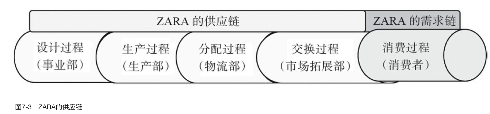

要想构建“企业—消费者”之间的联系，必须赋予“ZARA自有供应链”以独特的范式，或称“供应链范式”，这就是以“更多的品种、更短的周期、更小的批量、更低的成本”响应市场需求及其变化。其实，ZARA是丰田公司经验在服装业的一个成功翻版。

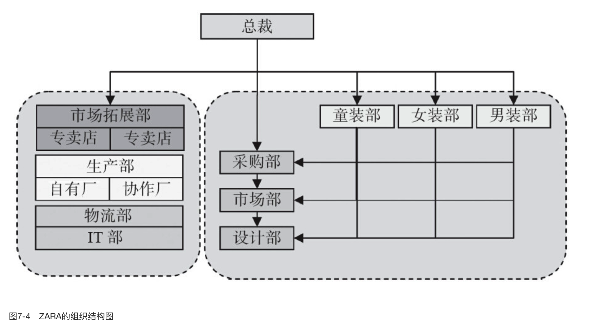

