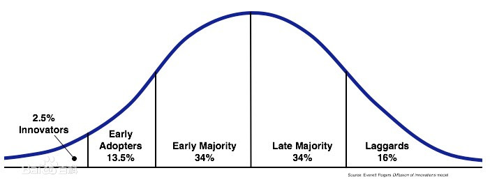
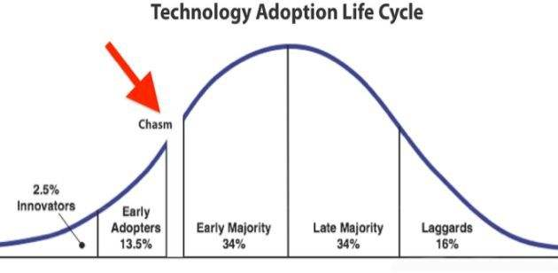
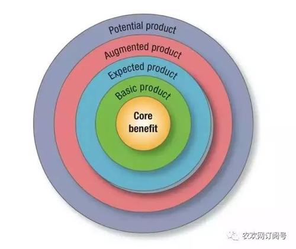
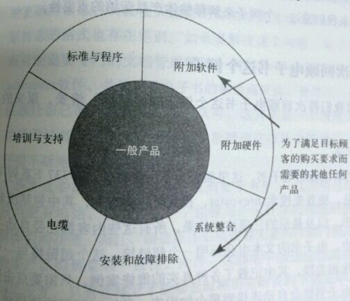

    作者:  [美] 杰弗里·摩尔
    出版社: 机械工业出版社
    副标题: 颠覆性产品营销圣经
    原作名: Crossing the chasm
    译者: 赵娅
    出版年: 2009-1
    页数: 251
    定价: 36.00元
    装帧: 平装
    ISBN: 9787111246350

[豆瓣链接](https://book.douban.com/subject/3320425/)

- [第1章 高科技营销的幻象](#第1章-高科技营销的幻象)
  - [1.1 技术采用生命周期](#11-技术采用生命周期)
  - [1.2 高科技营销模型](#12-高科技营销模型)
  - [1.4 幻象与醒悟：钟形曲线中的裂缝](#14-幻象与醒悟钟形曲线中的裂缝)
    - [1.4.1 第一个裂缝](#141-第一个裂缝)
    - [1.4.2 另外一个裂缝](#142-另外一个裂缝)
  - [1.5 发现鸿沟](#15-发现鸿沟)
  - [1.6 鸿沟中的牺牲者](#16-鸿沟中的牺牲者)
- [第2章 高科技营销的启示](#第2章-高科技营销的启示)
  - [2.1 基本原则](#21-基本原则)
  - [2.2 早期市场](#22-早期市场)
    - [2.2.1 创新者：技术的狂热追随者](#221-创新者技术的狂热追随者)
    - [2.2.2 早期采用者：有远见卓识的人](#222-早期采用者有远见卓识的人)
  - [2.3 早期市场中的动力学](#23-早期市场中的动力学)
  - [2.4 主流市场](#24-主流市场)
    - [2.4.1 早期大众：实用主义者](#241-早期大众实用主义者)
    - [2.4.2 后期大众：保守主义者](#242-后期大众保守主义者)
  - [2.5 主流市场中的动力学](#25-主流市场中的动力学)
  - [2.6 落后者：怀疑主义者](#26-落后者怀疑主义者)
  - [2.7 回到鸿沟](#27-回到鸿沟)
- [第3章 准备行动](#第3章-准备行动)
  - [3.1 鸿沟中的危机](#31-鸿沟中的危机)
  - [3.2 如何生火](#32-如何生火)
  - [3.3 微软的命运](#33-微软的命运)
  - [3.4 市场空白之外](#34-市场空白之外)
  - [3.5 成功跨越鸿沟](#35-成功跨越鸿沟)
  - [3.6 Clarify:一家顾客服务型应用软件企业成功跨越鸿沟](#36-clarify一家顾客服务型应用软件企业成功跨越鸿沟)
  - [3.7 Documentum:一家文档管理应用软件公司成功跨越鸿沟](#37-documentum一家文档管理应用软件公司成功跨越鸿沟)
  - [3.8 3ComPalm Pilot:一家独立操作平台公司成功跨越鸿沟](#38-3compalm-pilot一家独立操作平台公司成功跨越鸿沟)
  - [3.9 SmartCards:一家分布式操作平台企业成功跨越鸿沟](#39-smartcards一家分布式操作平台企业成功跨越鸿沟)
- [第4章 瞄准目标](#第4章-瞄准目标)
  - [4.1 风险大、数据少的决策](#41-风险大数据少的决策)
  - [4.2 基于一定信息的直觉](#42-基于一定信息的直觉)
  - [4.3 目标顾客形象刻画：情景刻画的用途](#43-目标顾客形象刻画情景刻画的用途)
  - [4.4 电子书：一个很有解释力的例子](#44-电子书一个很有解释力的例子)
  - [4.5 情景加工：市场开发策略的清单](#45-情景加工市场开发策略的清单)
  - [4.6 牢牢抓住出击点](#46-牢牢抓住出击点)
  - [4.7 市场规模确实很重要](#47-市场规模确实很重要)
  - [4.8 小结：目标市场的选择过程](#48-小结目标市场的选择过程)
- [第5章 集中军力](#第5章-集中军力)
  - [5.1 整体产品的概念](#51-整体产品的概念)
    - [1.一般产品(generic product)](#1一般产品generic-product)
    - [2.期望产品(expected product)](#2期望产品expected-product)
    - [3.延伸产品(augmented product)](#3延伸产品augmented-product)
    - [4.潜在产品(potential product)](#4潜在产品potential-product)
  - [5.2 整体产品与技术采用生命周期](#52-整体产品与技术采用生命周期)
  - [5.3 整体产品规划](#53-整体产品规划)
  - [5.4 再次回顾电子书这个例子](#54-再次回顾电子书这个例子)
  - [5.5 现实世界中的一些例子](#55-现实世界中的一些例子)
  - [5.6 罗盛软件公司与客户机/服务器业务应用](#56-罗盛软件公司与客户机服务器业务应用)
  - [5.7 萨维公司与实时存货跟踪市场](#57-萨维公司与实时存货跟踪市场)
    - [5.7.1 萨维公司的产品](#571-萨维公司的产品)
    - [5.7.2 萨维公司的服务](#572-萨维公司的服务)
    - [5.7.3 非萨维公司的产品和服务](#573-非萨维公司的产品和服务)
  - [5.8 合作者和同盟](#58-合作者和同盟)
  - [5.9 小结：在整体产品的管理过程中应当注意的一些地方](#59-小结在整体产品的管理过程中应当注意的一些地方)
- [第6章 制定战略](#第6章-制定战略)
  - [6.1 创造竞争](#61-创造竞争)
  - [6.2 竞争性定位罗盘](#62-竞争性定位罗盘)
  - [6.3 引发竞争：硅谷图形公司的例子](#63-引发竞争硅谷图形公司的例子)
  - [6.4 第二个例子：Quicken](#64-第二个例子quicken)
  - [6.5 创造竞争：目前的一些机遇](#65-创造竞争目前的一些机遇)
  - [6.6 Channelpoint:重组保险分销链](#66-channelpoint重组保险分销链)
  - [6.7 Diffusion:用来留住顾客的交流工具](#67-diffusion用来留住顾客的交流工具)
  - [6.8 VerticalNet:用于微观细分市场的网络站点](#68-verticalnet用于微观细分市场的网络站点)
  - [6.9 定位](#69-定位)
    - [1.命名并归类](#1命名并归类)
    - [2.用户和用途](#2用户和用途)
    - [3.竞争和差异化](#3竞争和差异化)
    - [4.财务状况与发展前景](#4财务状况与发展前景)
  - [6.10 定位的过程](#610-定位的过程)
  - [6.11 声明：顺利通过电梯测试](#611-声明顺利通过电梯测试)
  - [6.12 转移证明的责任](#612-转移证明的责任)
  - [6.13 整体产品发布](#613-整体产品发布)
  - [6.14 小结：竞争性定位清单](#614-小结竞争性定位清单)
- [第7章 发起入侵](#第7章-发起入侵)

# 第1章 高科技营销的幻象
## 1.1 技术采用生命周期
事实证明，从营销学的角度来看，只要我们面对的新产品需要我们改变自己一贯的行为模式，或者需要对我们目前依赖的产品或服务进行改进时，我们对于技术采用的态度就会变得越来越重要。在学术上，这种对改变非常敏感的产品被称为`“不连续性创新”(discontinuous innovations)`。而与之相反的另一个术语，`“连续性创新”(continuous innovations)`,则指的是产品的正常升级，这种创新并不需要我们改变当前的行为。

例如，当佳洁士承诺能使你的牙齿更洁白，这就是一个连续性创新。因为你每天还在使用同样的牙刷，以同样的方式刷你的牙齿。当福特公司生产的新款Taurus汽车向你承诺更远的里程，当戴尔公司的最新型电脑向你承诺更快的运行速度和更大的存储空间，或者当索尼公司的电视机向你承诺更清晰更明亮的电视画面时，这些也都属于连续性创新。因为作为一名消费者，你并不需要为了采用这些改进的技术而改变自己的行为。

如果索尼公司生产的电视机是一台髙清电视，它将与当今的广播标准不兼容，这就需要你想办法寻找特定的编码资源。这就是一种不连续性创新，因为你必须改变自己以往收看电视的习惯。同样，如果新型的戴尔计算机中安装的是Be操作系统，那么它与如今的数据库也不兼容。这时你也需要找到一系列全新的软件来配合这台计算机的使用，因此这种技术改进就属于不连续性创新。或者，如果我们刚才提到的新款福特汽车使用的燃料是电力而不是汽油，又或者新研制的牙膏是一种漱口水，你在使用的时候并不需要牙刷，那么这些新产品与你当前的支持性设施也无法相容。在所有的这些例子中，无论是消费者的行为方式还是已有的基础设施，都需要发生一些显著的变化才能与这些技术创新相配合。这就是这种类型的创新被称做不连续的原因所在。

虽然其他的行业偶尔才会小心翼翼地引进不连续性创新技术，但是高科技行业的公司却会定期引进不连续性创新技术，并且对自己的决定充满了信心。因此，自高科技公司的创始之日起，它们就需要一个正确的营销模式，以便与这种类型的产品引进方式有效契合。正是因为这个原因，技术采用生命周期这个模型就成为整个高科技行业所采用的营销方式的中心所在

我们看一下图1-1中的这条钟形曲线(正态分布曲线）。该曲线的各个部分大致与其标准差所在的位置相一致。也就是说，早期大众和后期大众位于均值周围一个标准差之内的区域，早期采用者和落后者位于两个标准差之内的区域，而在一项新技术的发起之时(曲线的最左边），也就是均值周围三个标准差之内的区域，就是所谓的创新者所在的位置。

图1-1技术采用生命周期

`创新者`会非常积极地追随于各种新技术产品之后。有时，他们甚至会在正式的营销计划尚未出炉之前就已经下手购买新产品。这是因为科技是他们生活中的最大乐趣，而并不在意这些技术能够在他们的生活中提供什么样的功能。从本质上来讲，他们会着迷于任何根本性的技术改进，并且仅仅会为了探索新型产品的性能就决定购买。

`早期采用者`会在新产品生命周期的早期接受并购买产品，但与创新者不同的是，早期采用者并不是技术专家。他们只是一个善于想象、了解并欣赏新技术所具备的优势，并且能够将这些潜在的优势与自己关心的其他方面相连系的群体。只要发现了某种新技术产品能够有效地满足他们的需要，早期采用者就会考虑是否做出购买决策。正是因为早期购买者在做出购买决策时并不会禁锢于公认的看法，而是更愿意尊重自己的直觉和想象，因此他们对于任何高科技市场的拓展发挥着至关重要的作用。

`早期大众`与早期采用者在接受新技术的态度方面存在一些相同之处，然而，他们的购买决策最终是由一种强烈的实用性想法而推动的。他们知道这些最新奇的发明中有很多最终都将不再流行，并且会成为过眼云烟，所以他们宁愿继续等待，并在自己购买之前，细心观察周围的人对新产品作何评价。换句话说，在拿出大把金钱进行购买之前，他们希望得到一些公众给出的参考意见。由于这一群体中的消费者数量是非常多的——几乎占据整个技术采用生命周期的1/3,所以说，赢得他们的认同，对于企业获得巨额利润和飞速发展是非常重要的。

`后期大众`除具有早期大众的所有特点之外，二者之间还存在一个非常明显的不同之处：早期大众群体中的消费者满足于他们对待新技术产品，以及最终决定是否进行购买的能力，而后期大众群体中的消费者却并非如此。他们只会等到某些既定标准形成之后才会考虑购买，并且即使等到那个时候，他们仍希望得到很多的支持，所以他们更有可能从一些知名的大型公司手中购买产品。与早期大众相同，对任何市场来说，后期大众这个群体也占据了总体购买人数的1/3。因此，如果一项新产品能够得到他们的喜爱，公司确实能够获得巨大的利润，因为随着产品的逐步成熟，边际利润率将呈现递减规律，但间时公司的销售成本也将逐渐降低，这样一来，公司的研发成本在最后将被全部摊销。

`落后者`无论基于哪些原因，是个人方面还是经济方面，这些消费者对新技术没有任何兴趣。只有当一项技术产品已被深深埋藏于各种其他产品之中时，落后者才会进行购买。

## 1.2 高科技营销模型
技术采用生命周期正是高科技营销模型的基础。它向我们揭示了一种市场开发的方式，也就是依次从图1-1中钟形曲线的左边到右边，首先关注创新者并形成专门的市场，然后就是早期采用者以及他们的市场，接下来依次是早期大众、后期大众，最后则是落后者。在这个市场开发过程中，企业必须将每个阶段针对的消费者群体作为参考的基础，进一步开发下一个消费者群体所支配的市场。

关键就是要保证这个过程平稳、顺利地运行下去，就像在接力赛中一位运动员适时地将接力棒传给下一位运动员，或者像人猿泰山一样灵活地从一棵树藤跃到另一棵树藤。在这个过程中，始终保持一种前进的势头是非常重要的，因为这样可以创造出一种从众效应，这种效应能够令下一个消费者群体很自然地愿意购买产品。

除此之外，还有另外一个原因促使企业保持一种前进的势头，那就是尽力赶超下一项即将兴起的新技术。例如，便携式电子打字机已经被便携式电脑所代替，而在将来的某一天，便携式手提电脑或许也会被另外一种因特网终端所代替。如果明天你的产品将不再流行，那么今天你一定要充分利用自己的优势。正是这样一种观点铸就了`“机会之窗”(window of opportunity)`这个想法。

从本质上来说，这就是所谓的**高科技营销模型——在技术采用生命周期的各个阶段中平稳展开的一种营销方式**。

## 1.4 幻象与醒悟：钟形曲线中的裂缝

### 1.4.1 第一个裂缝
**第一个裂缝存在于创新者和早期采用者之间**。当一项非常热门的技术产品不能马上寻找到更多的新客户时，这个裂缝就产生了。一个典型的例子就是世界语(Esperanto)软件，虽然有少数狂热的追寻者非常欣赏这款软件的结构界面，但是很多人都根本不知道如何进行操作。

正如我们在下一章将要看到的，赢得这一步的关键之处就在于，相关的新技术必须能够实现一些跨越式的发展，拥有某一些以前不可能实现的功能，具有某种内在价值并能够贏得非技术人员的青睐。这种优势往往表现为一种非常独特而且能够吸引人的产品应用，只有它才能真正体现新产品的力量和价值所在。如果营销团体无法找到一种有吸引力的产品应用，企业的市场开发战略就只能停滞在创新者阶段，新产品的未来也只能跌入谷底，很难再有翻身之日。

### 1.4.2 另外一个裂缝
钟形曲线中还存在**另外一条裂缝，它位于早期大众和后期大众这两个消费者群体之间，其宽度与第一条裂缝相差无几**。

简单地说，早期大众是指那些愿意并且能够在必要的时候通过学习而使自己通晓技术操作的顾客。然而大部分后期大众却并非如此。当一项产品到达这样一个市场开发阶段时，它必须要更方便用户的使用和操作，只有这样它才能够一直受到消费者的欢迎，从而保证企业获得持续的成功。但一旦新产品不能实现这一点，它由早期大众向后期大众的过渡就很可能停滞下来甚至永远都不会发生。

## 1.5 发现鸿沟
**真正可怕的是将早期采用者和早期大众分离开来的那条深不可测的鸿沟**。很显然，这是技术采用生命周期中最可怕最无情的一个过渡，并且由于这条鸿沟一般非常隐蔽，很难被企业发现，所以它也是最危险的。

这条鸿沟难以被发现的原因就是，高科技企业分别在早期采用者和早期大众这两个消费者群体中拥有的顾客名单和订单规模非常相似。一般情况下，在《财富》杂志评出的全球企业排行榜上前500~2000家企业中，这两个消费者群体订购产品的数量相对来说比较庞大，大部分都达到了六位数甚至更高。但事实上，分别针对这两个消费者群体的销售基础——企业曾隐含地或直接地向顾客承诺过的事情，以及必须提供的一些产品和服务——却存在着根本性的差别。

早期采用者想要买到的是一种“变革推动者”(changeagent)。凭借率先在行业中推行这种变革，早期采用者往往希望自己能够优先于其他竞争者获得一些利益，无论是更低廉的产品成本、更快速的产品营销、更完整的顾客服务，还是其他一些类似的业务优势，早期采用者都希望自己是第一个得到的人。他们希望这种变革能够使新产品根本地脱离已有的产品，而且，他们也已经准备好向顽固的保守分子宣战，将这种变革作为一项伟大的事业来维护。与此同时，作为第一个吃螃蟹的人，早期采用者往往也要做好准备去包容新产品中出现的一些小故障，毕竟对于任何一项刚刚推向市场的技术创新型产品来说，出现一些小缺点是难以避免的。

相比较来说，早期大众想要买到的是对产品现有操作的一种“效率改进”(productivity improvement)。他们寻求的是新产品与已有产品最小程度的分离。他们希望看到技术的进步，而不是根本性的变革。

上面介绍的这种对比仅仅从表面上刻画了早期采用者和早期大众之间的不同与不相容之处。接下来我就要提出两个非常重要的观点。首先，正是由于这些不相容之处，我们才可以得出：早期采用者并不适合作为早期大众的参考群体。其次，正是由于早期大众并不想打破他们现有工作的条理性，我们才更加需要一个适当的参考群体来研究他们的购买决策。这样一来，我们就陷入了一个自相矛盾的困境。

## 1.6 鸿沟中的牺牲者
当得到有远见的早期采用者大力支持的高科技产品销售商试图进行转变，向下一个技术采用群体——由实用主义者主宰的早期大众群体渗透时，他们只能在没有任何参考基础和支持力置的市场中摸索前进，但不幸的是.这个市场却非常需要适当的参考基础和有效的支持力董。

这确实是一条难以逾越的鸿沟，并且曾经有无数刚起步的企业一不留心就成为这条鸿沟中的牺牲者。尽管鸿沟效应的例子一次又一次地出现，但高科技企业的营销队伍仍然没有对这个问题给予适当的关注。这恰恰就是本书的写作目的。因此，作为跨越鸿沟的最后准备工作，我还要介绍下面这个故事，它汇集了很多不正确的创业经历，我希望这个故事能够帮助你更好地认识并理解鸿沟效应的可怕之处。

# 第2章 高科技营销的启示
## 2.1 基本原则
首先我们要做的应该是定义市场。从高科技行业的角度出发，市场应当满足以下条件：

- 拥有一组实际存在或者潜在的顾客，
- 拥有一系列特定的产品或服务，
- 市场中的顾客普遍都具有某些需求，
- 在决定是否购买的时候，市场中的顾客需要相互参考。

除了最后一条，我相信读者们对这个定义的其他部分都能有一个直观的理解。但不幸的是，只有最后这一条才是高科技企业成功进行营销活动的关键所在。具体地说，最后一条指的是市场中的每一个成员在决定是否购买的时候都需要参考其他成员的意见。

具体地说，如果两个人因为同样的原因购买了同样一件产品，但是他们却无法相互参考对方的意见，那么这两个人就不处于同一个市场中。这也就是说，如果我向波士顿的一名医生销售了一台示波器，这名医生要用这台机器监测病人的心跳，然后我又向扎伊尔的一名医生销售了一台同样的示波器，而且这台示波器也要用来监测病人的心跳，但是非常重要的一点是：这两位医生之间并不具有任何可行的交流手段，那么在这种情况下，我面对的就是两个不同的市场。同样，如果我将示波器卖给波士顿的医生之后，又将同样的示波器卖给住在这名医生隔壁的一名研究声纳装置的工程师，这时我面对的也是两个不同的市场。**在这两个例子中，我面临的市场之所以不同是因为顾客之间无法相互参考对方的意见**。

对于营销领域的很多专业人士来说，解决这个问题的办法就是将“市场”分成几个独立的`“市场细分”`。在这里，市场细分还包括自我参考这一方面，这个概念与我们对市场的定义恰好相符。

营销专家一直非常坚持市场细分这个观点，因为他们知道，营销人员很难在相互之间无法交换意见的顾客群体中实行任何有意义的营销计划。这其中的原因非常简单，就是一种所谓的杠杆力量。毕竟，没有任何一家公司能够一次性支付所有营销活动的开支。事实上，企业的每一项营销计划都必须依赖一些持续发生的连锁反应——也就是通常所说的**口碑营销**。市场的自我参考程度越高、沟通渠道所受的限制越严密，出现这种连锁反应的可能性就越大。

## 2.2 早期市场
### 2.2.1 创新者：技术的狂热追随者
一般地说，率先采用任何新技术的人一定是那些出于自身原因而对新产品爱不释手的人。

正是这些人率先对你的产品架构产生兴趣，而且他们还善于发现相对于那些已在市场中站稳脚跟的大量产品来说，你的产品具有哪些独特的竞争优势。他们愿意花上几个钟头的时间来研究面前这件产品的操作和功能，当然，刚刚推向市场的产品根本不可能完全具备顾客需要的所有功能。但他们愿意容忍异常复杂的产品说明书和极其缓慢的运行速度。甚至更可笑的情况是，很多时候这些新产品会遗漏一些常见的功能，而且在引入一些必要功能的时候用户还需要采取一系列非常繁琐的步骤，但即使是这样他们也毫不在意。按照这些技术专家的话来说，他们这样是在推动技术的进步。他们之所以愿意对产品做出认真的检测和评价，仅仅是因为他们真正关心科学技术的进步。

### 2.2.2 早期采用者：有远见卓识的人
有远见者通常是非常少见的，他们拥有非凡的洞察力，能够成功地将一项新兴的技术与战略性的机遇结合起来，他们也能够将这种洞察力转变为一个具有髙可见度和髙风险的项目，而且他们的号召力还能够激励群体中的其他成员参与到这个项目中来。他们就是高科技产品的早期采用者。通常情况下他们手中的预算可以高达几百万美元，对于高科技企业来说，这确实是一个非常重要的潜在风险资本来源。

有远见者之所以对高科技企业具有强有力的驱动作用，原因就是他们能够发现一些具有巨大潜力的投资项目，这些项目能够为他们自己带来“重量级”的可观回报，而且他们也愿意承担非常高的风险来推行这些项目。

## 2.3 早期市场中的动力学
当然还有很多不幸的时候，早期市场的开发并没有找到一个正确的开始。下面就是一些例子：

- 第一个问题：高科技企业中缺乏必要的专业人员将新产品推向市场。可能的原因包括支持营销计划的资本不够充足，企业雇用的营销人员经验不足，通过不恰当的分销渠道销售产品，在错误的地方以错误的方式进行产品促销，等等，这些错误一般都会将事情搞砸。
- 第二个问题：高科技企业的主要任务就是生产并销售产品，所以有远见者就自然而然地成为了企业的销售目标。这就是著名的`“雾件问题”`的其中一种。所谓雾件问题是指某种产品在被预先宣传和预先销售的时候尚没有真正完成，也就是说企业在真正推出产品之前还需要克服大量的研发障碍。在最好的情况下，高科技企业能够确定一些试验性的项目，但是随着项目进度的不断发展，有远见者在公司中的地位将被逐步削弱。最终，尽管很多为顾客定制的产品还没有得到可用的参考意见，企业也同样会收回对这些项目的支持。
- 第三个问题：高科技企业的营销计划之所以会跌入那个存在于技术狂热者和有远见者之间的沟壑，原因就是它们没能够及时发现，至少是没有清楚地表明自己的产品具备哪些强大的应用功能可以对顾客的利益带来明显的改善。很多公司购买某一项产品的目的只是要对它进行测试，但是这些公司却从未打算将它作为主打产品推向市场，因为这样做能够获得的收益远远不能弥补这其中潜藏的风险。看不到收入，企业必然会中止自己的营销活动，因此在这种情况下，企业可能会完全停止整个营销计划，也可能会将产品当做“废弃材料”出售给其他的企业。

## 2.4 主流市场
### 2.4.1 早期大众：实用主义者
为了更准确更深刻地了解他们的价值观，你就要明白这样一个事实：如果有远见者的目标是取得显著的突破，那么实用主义者的目的就是看到些微的改善——逐步的、可衡量的、而且可预见的进步。如果实用主义者想要安装一款新产品，他们会想要知道其他人对这款产品的评价如何。在实用主义者的字典里面，风险这个词是很可怕的——在他们看来，风险并不代表难得的机遇和雀跃的内心，而是有可能让他们浪费很多时间和金钱的重大危机。

对于《财富》排行榜上前2000家管理信息系统企业所组成的群体来说，他们的领导者在选择产品定位时就可以被视为名副其实的实用主义者。企业对生产效率改进的要求将他们推向了技术采用生命周期的前端，但是与此同时，谨慎的本能和严格的预算限制也迫使他们必须事事小心。作为个体来说，实用主义者只有在3.0版推出之后才会购买Windows操作系统，也只有在得到大众软件、甲骨文和SAP三大公司的认可之后才会购买客户机/服务器应用软件，并且直到今天，他们仍然在不停地思索着何时才能将因特网接入自己的公司。

总的来说，在向实用主义者销售产品的时候你必须要有足够的耐心。你必须透彻地了解他们所从事的具体业务中一些主要的问题。他们参加的一些专门的行业会议或贸易博览会，你也必须出席。你需要经常出现在他们时常会阅读的一些知名杂志的文章里。你需要进入他们所在行业中的其他一些公司。你需要拥有一些专门针对他们所在行业的产品，而且这些产品的应用功能应当已经非常成熟。你需要与其他一些为他们所在行业提供服务的销售商成为合作伙伴或结成共同的联盟。最后，你还需要为自己贏得一个产品质量高、服务优良的好名声。总之，你必须让自己成为他们可供选择的供应商中最耀眼的一个。

当然你要明白，这是一个长期的计划，你需要认真地进行规划，不断地进行投资，你还需要组建一个成熟的管理团队。但是从另一方面来看,这样做能够为你带来的最大冋报就是令你不仅能够成功获得技术采用生命周期中实用主义者群体的支持，而且还为你对保守主义者的出击奠定了基础。

### 2.4.2 后期大众：保守主义者
保守主义者对于不连续性创新有一种本能的抗拒。与新的进步来说，他们往往对传统更加信任。并且，一旦发现了一些非常适合自己的东西，他们就会一直坚持下去。

对于高科技行业来说，保守主义者具有极大的价值，因为他们可以大幅度地扩展那些不再位于最前沿的高科技技术的市场。如今，美国几乎已经将大部分的这种市场拱手让给了远东国家，这个事实就是一个很好的证明，美国之所以在这个方面敌不过远东国家，并不是因为这些国外的制造业具有明显的成本优势，而是因为美国的企业没有很好地进行产品规划和营销想象。目前远东国家中仍然有大量的企业仅仅重视一件事情，那就是尽可能低的运营成本。这也就意味着他们距离“开发整体产品”这个目标还远得很。因此，**他们往往需要利用增值转销商这一渠道将自己的产品升级为一种完整的产品系统才能够吸引保守主义者的注意**。这种营销策略的困难之处就在于很少有大规模的增值转销商能够实现足够大的销售量，并以此对保守主义者的市场形成较为明显的影响。如果美国的一流生产商和销售商能够更多地注意一下这个市场，充分利用他们自己的大规模销售渠道和海量的购买资源，那么他们完全可以从这一部分市场中挖掘出更多的财富。

所以说，高科技企业确实应当改变过去的观点，在将来的营销活动中对保守市场给予更多的关注。诚然，现在已经有一些企业表明了自己的观点。例如，尽管施乐公司以及复印机行业中的其他企业在表面上一直强调“数字化”，但它们依旧在利用强有力的营销渠道服务时刻与保守主义顾客保持密切的关系，并且它们还主动承担了顾客不宜亲自处理的那些产品的操作过程。如今，手机的实用主义者市场已经达到了有效的饱和，而且还正在通过一些非常流行的服务继续渗透到保守主义者市场，例如AAA电话就专门设计了一个特殊的按键，帮助用户及时向附近的道路救援服务寻求帮助，这种功能可以阻止某个保守主义者群体将自己对高科技的忧虑传递到另一个感到恐惧的保守主义者群体中。除此之外，家用个人电脑市场中的供应商也付出了巨大的努力为顾客精心准备了一种称为“开箱即用”(outofbox)的美好体验，仅仅需要20分钟，对高科技不甚了解的顾客就能够迅速掌握并使用某项电脑技术，而且与此同时还可以获得一种完美的产品体验。

## 2.5 主流市场中的动力学
Novell和Autodesk都陷入了一个非常危险的营销误区，从而危及到了它们在主流市场中的领导地位。为什么会这样呢？其中一个原因就是它们应用了一个错误的营销模型。这两家公司的决策表明他们过于关注早期市场中的情况，但同时却忽视了主流市场中一些尚未被完全开发的因素。更为重要的是，它们从来没有想过要凭借着吸引更多的保守主义顾客而进一步扩大自己的市场份额。

这是成熟的市场研发部门必须关注的一项任务——这并不是产品功能的扩展，也不是从根本上对产品设计做出大量的修改，而是将通常由顾客自己提出的所有微不足道的改进逐步融入到产品中，以此帮助顾客们应对产品中存在的各种不足。这确实是高科技企业必须提供的一项服务，因为无论是从顾客对便利性的要求来看，还是从销售商对低成本的要求来看，最优质的服务就是顾客根本不需要你提供任何额外的服务。

如果不沿着这条路走下去，我们很容易就会跌入钟形曲线中位于实用主义者和保守主义者之间的沟壑。保守主义者并不急于向实用主义者坦白，告诉他们说自己并不愿意或者无法像他们那样实现技术方面的自我支持，但事实上这就是区分保守主义者和实用主义者的一个重要因素。迄今为止，大部分高科技企业并没有认识到这个沟壑的存在，结果就是整个高科技行业都不得不面对一个非常短的产品生命周期，并且与其他的行业相比，这个行业的收入来源更加依赖于新产品的成功，因此企业的收入也就更加起伏不定。

## 2.6 落后者：怀疑主义者
怀疑主义者一直试图指出的是，在大部分情况下，他们在购买产品时销售商信誓旦旦的保证最后几乎都不可能实现，也就是说新的产品系统并不能提供销售商保证过的那些功能。当然这并不是说他们买到的产品不具有任何价值，而是说这些产品的真正性能往往无法达到他们购买时的预期。

## 2.7 回到鸿沟
这个模型的根本错误在于，它用一个平滑并且连续的过程描述产品生命周期中的各个部分，但以往的经验告诉我们，真正的事实却恰恰与此相反。在任何两个相邻的技术采用群体中进行营销和沟通的转变确实是一件非常困难的事情，因为当你刚刚适应了现在的顾客群体时，你就要丝毫不能停顿地去寻找新的策略应对下一个顾客群体。

在这个过渡期中最大的一个问题就在于，高科技企业缺少一个坚实的顾客基础作为自己向下一个顾客群体转变时所需要的参考信息。回顾技术采用生命周期这个模型的时候，我们会发现：相邻的两个顾客群体之间存在的空隙表明了一种信用差距，当高科技企业试图利用左边的群体作为参考基础进入右边的群体时，这种信用差距就产生了。

# 第3章 准备行动
## 3.1 鸿沟中的危机
进入主流市场确实是一种进攻性的行动。因为主流市场中有很多企业早已经与你的目标顾客建立起了良好的合作关系，而你的入侵必然会引起它们的憎恨，于是它们必定会想方设法将你拦在门外。况且，作为一家刚刚进入市场、尚没有经过任何考验的企业，顾客本身对你也没有太多的了解，他们对你的怀疑之心也是不可避免的。这样看来，市场中根本没有人希望你出现。在他们的眼中，你就是一个名副其实的入侵者。

我们就来回顾一下20世纪上半期发生的一个重大事件，1944年6月6日第二次世界大战中的盟军在法国北部的诺曼底登陆，从此人们称这一天为`D-Day`。

## 3.2 如何生火
成卷的报纸就代表着你的营销预算，而木柴就代表一个非常难得的市场机遇。然而，如果你没有任何的`目标市场细分`可以作为引火物，那么不管你在木柴下面放了多少报纸，它们都迟早会被烧得一干二净，但木柴却永远不可能燃烧起来。

整体产品的杠杆影响力，口碑营销的威力，以及掌握市场的领导地位，所以在跨越鴻沟的时候，你必须要将全部的注意力集中在一两个规模较小的市场细分中，努力获得这一两个市场的支配地位，这一点是非常关键的。如果你不能为这个目标竭尽全力，那么你成功进入主流市场的可能性就会非常渺茫。

## 3.3 微软的命运
据我所知，微软公司从未遵循过我在本书中强烈建议的重点集中策略。它从未实施过我们在前面介绍过的D-Day战略。

独有的天时地利使得微软公司能够从别人那里获得新技术，它并不需要凭借自己的力量进行技术研发。换句话说，微软公司的成功应当主要依赖于它对其他人率先发明的技术的迅速继承。无论是对Macintosh直接进行扩展得到的Windows软件，还是对网景公司的浏览器Navigator直接进行扩展得到的InternetExplorer浏览器，你都可以从中清楚地看到微软公司的发展战略。

我们这样说并不是要嘲讽微软公司的技术能力，我们的目的是要赞扬它的市场开发策略。正是因为微软公司拥有客户机/服务器领域中的所有用户，所以它才能够在鸿沟前方的实用主义者领域中拥有一片永久的领地。可以说，微软公司控制着主流市场的大门。当野蛮的竞争者试图带着自己的不连续性创新闯入主流市场的时候，微软公司就会将大门紧密。但当它自己带着与竞争者类似的产品出现在门外时，主流市场的大门却永远都是向它敞开着的。

但是微软公司并不能作为其他高科技企业的先导。虽然它能够在鸿沟两边游刃有余，但其他大部分的高科技企业在跨越鸿沟的时候都得不到任何的帮助。更严重的是，它们在跨越鸿沟的时候往往还需要躲过微软公司的利齿。

## 3.4 市场空白之外
对于高科技企业来说，如果它们想要超越其最初瞄准的空白市场，一个关键的做法就是，把选择一个策略性的目标市场细分作为行动的第一步。也就是说，企业要盯准一个市场细分，并凭借这个市场细分与其他市场之间的联系，顺利进入下一个规模更大的市场细分。

## 3.5 成功跨越鸿沟
应用软件企业自然应当采取纵向营销的方式，因为应用软件是与终端用户直接接触的，而终端用户又根据不同的地理位置、行业和职业而划分为不同的群体。这样，应用软件企业的不同产品就能够适用于鸿沟另一端前沿阵地中的不同市场空白。事实上，在技术采用生命周期的后期阶段，随着市场的逐步统一，消费者需要的产品也将逐渐趋于一致，因此企业就需要推出适用于各种消费者群体的整体产品，这种产品的大规模销售能够为企业带来更可观的收入和利润。不过对于应用软件型产品来说，与终端用户的密切关系就导致了产品的大规模销售很难得到足够的支持。

相反，平台销售商发展的驱动力却与应用软件企业恰恰相反。从表面上看，平台企业似乎应当采取横向营销模式，因为它们的产品直接接触到的不是终端用户，而是各种机器和其他类型的程序，从某种程度上来说，这一类产品的价值就在于它们能够提供一种稳定而且标准化的用户界面。平台销售商并不适合采取纵向营销模式，因为它们的产品并不会针对不同的市场空白进行频繁的改变。但不幸的是，任何一项新技术都只能争取到为数不多的一些实用主义者顾客。平台销售商通常只会在某一个市场空白内率先推行相关的技术创新，这个首选市场空白中的消费者遇到了一些令人印象深刻的问题，以至于它能够优先于其他的市场空白吸引到销售商的注意。但是其他市场空白中的消费者最终也会欣喜地体验到新产品所具有的优势，因为他们不需要支付任何成本就能够有机会对新技术的表现进行仔细的考察(他们可以观察首选市场空白中的顾客对产品的反应），而且还不需要承担任何即时的风险。

## 3.6 Clarify:一家顾客服务型应用软件企业成功跨越鸿沟
20世纪90年代早期，当客户机/服务器架构正努力实现自己跨越鸿沟的梦想时，Clarify公司成功开发出它的旗舰产品ClearSupport,这款软件系统的目的是改进通过电话工作的客户服务代表的工作效率。这项产品的不寻常之处在于它针对顾客打来的每一个电话，围绕着三个方面设计了一种处理程序，这三个方面分别是：打电话的顾客、致使顾客打来电话的产品，以及解决顾客的问题所需要的各方面知识。这种设计使企业能够利用自己的产品来跟踪它们与顾客之间的关系，确定出有问题的产品，并将解决以往问题所得到的经验积累起来供将来使用。除此之外，这项产品还为每位顾客的产品设置了故障单或“病历”，企业可以利用这种设置对顾客的问题进行持续的记录和跟踪，直到问题解决为止，这样就可以保证顾客时刻观察到整个过程的进展。不管是在当时还是从现在来看，这款产品的创意确实是非常巧妙的，但不足之处也是存在的：它不仅需要新的软件和大型系统对公司的业务流程进行重新组合，而且公司还需要设置新的工作流和工作描述，这样一来，实用主义者对这款软件产品的警惕性就大大提高了。

然而，市场中的有远见者却从这款软件系统中发现了新的机会，那就是更快速更灵敏的客户服务处理程序所带来的竞争性优势，以及与重要的顾客建立长期良好关系的机会。最早的技术采用者在系统的整合期总会面临很多巨大的挑战。另一个早期采用者群体就是医疗器械经销商，因为医疗器械的安装过程极其复杂，因此经销商就要面对大批涌现的客户服务要求，这些要求的数量远远超出了正常的客户服务处理程序所能够应对的规模。除此之外，需要金融服务的企业还可以通过这款软件系统为其髙资产净值客户提供客服电话中心，电信领域的企业则需要利用这项产品帮助自己处理顾客投诉并分遣各个地域的服务代表，还有其他一些高科技企业也需要利用这款软件为顾客和转销商解释它们的新产品在操作方面的复杂问题，并消除新产品中存在的一些故障。

在这款软件的众多顾客中，我们最后要介绍的就是思科系统公司，当时这家公司被视为网络硬件市场中的知名经销商。思科系统公司对这项产品的采用同时吸引了顾客和竞争者的注意。

我们从这个例子就可以看到一个拥有突破性关键任务的纵向市场应当如何占据一个颇有吸引力的前沿阵地。市场不再需要分别向每一位顾客展示自己的优势——如今它会为高科技企业带来一个机会，帮助它们追寻一个完整的市场细分。不过，得到这种机会必然是要付出代价的。这个市场细分中的消费者可能有一些特殊的需求没有得到企业的重视，而且这些需求至少也会与其他市场中顾客的要求无法相容，有时这两个不同市场中消费者的需求甚至是直接冲突的。那么这时高科技企业应该采取什么样的策略呢？

对于正试图跨越鸿沟的企业来说，答案是很明显的：集中全部力量盯准市场空白，然后竭尽全力利用你手中掌握的全部资源满足其他人的需要。

在Clarify公司的例子中，它就将全部精力投入到网络硬件行业中，并迅速战胜了其他关键的市场领导者，例如Wellfleet、3Com和Synoptics。Clarify因此在网络硬件行业名气大增，继而征服了其他一些不是很知名的小公司。Clarify公司推出的产品最早具有的并且也是最重要的一项功能就是为一些具有特殊要求的顾客提供帮助，具体地说，这些顾客希望凭借与自己企业内部研发部门的障碍报告应用程序实现交互操作的案例传送服务，确保自己能够及时发现产品的故障并做出标记，然后进行全程跟踪直到故障被完全消除为止。他们还需要掌握一定的技术基础，以保证自己能够非常方便地重复使用大量极其复杂的技术知识。当然，在顺利占据市场空白的过程中，Clarify公司还需要面对很多其他的需求来帮助顾客成功地应用自己的产品，但是它却将这两个关键的需求列为所有需求中最为重要的两个，我们不得不承认这确实是一个明智之举。

在网络硬件市场空白中取得的成功使得Clarify公司能够顺势将自己巨大的影响力延伸到另一个相关市场，那就是计算机软件和系统市场，在这个市场中Clarify将有机会与微软公司这样的大客户进行合作。不过你要注意，这时企业面对的顾客问题不再是系统的复杂性，而往往是比以往任何时候更多的顾客致电次数。Clarify在计算机领域中的成功又将自己的影响力扩张到电信行业，在这个行业公司又需要面对一个全新的顾客需求，那就是努力将每一次客服电话的接通转变成一次难得的销售机会。这就促使Clarify公司迅速开发出一套辅助产品线，也就是所谓的ClearCallCenter。随后这项产品又在金融服务行业中得到了广泛的应用。

## 3.7 Documentum:一家文档管理应用软件公司成功跨越鸿沟
1993年，当Documentum公司由杰夫·米勒(Jeff Miller)接手的时候，尽管它在与施乐公司分道扬镳之后“免费”承袭了前者大量先进的文件管理技术，但这家公司的收入在随后的三年之中却没有任何起色，一直维持在200万美元的水平。这是一家企业跌入鸿沟之时的典型表现。在杰夫·米勒上任之后短短一年的时间里，Documentum公司的收入额就开始不断地增长，从800万美元增长到2500万美元，再到4500万美元(并首次公开发行股票），一直到最终的7500万美元。这可是一个全世界闻名的跨越鸿沟行动。

他们知道自己的公司正处于可怕的鸿沟之中，他们也知道要想尽快脱离鸿沟的困扰，最为关键的一步就是寻找一个适当的市场细分作为前沿阵地，于是杰夫带领公司的管理团队对他们手中掌握的截至当前的顾客体验进行深入的调査，然后他们发现并决定瞄准一个非常小的市场空白：《财富》世界制药公司500强中的药政事务部门。如今整个世界上只有大约40多个这样的部门，而即使是最大的部门也才有十几名工作人员，所以你可能觉得难以理解：为什么一家公司要放弃“所有大型企业中需要处理复杂文档工作的一切人员”，而将自己的市场范围缩小到一个全球可能仅有一千人的规模呢？

这个问题的答案就是，当你在选择跨越鸿沟的目标时，重要的不是市场中的消费者数量，而是这些消费者的痛苦经历所引起的重大影响。对于制药行业的药政事务人员来说，他们在工作中经历的痛苦与遭受酷刑折磨并没有差别。不要以为他们的工作很轻松，事实上这些工作人员需要将新药批准申请递交给全世界大约100多家不同的监管机构。一直要等到新药品的专利得到批准之后，制药公司才能够投入生产。通常新技术专利的有效期是17年，而一项成功申请专利的新药品平均每年带来的收入可以达到4亿美元。但是一旦药品的专利权失效，它所能带来的经济回报就会急转直下。我们由此知道，申请过程耗费的每一天都是对新药品专利周期的浪费。通常来说，制药公司需要花上一年的时间来递交申请文件——注意，不是花上一年的时候获得批准，而只是用一年的时间递交申请！

递交申请的过程之所以如此漫长，原因就是新药品申请文件的长度一般达到250~500页，而且其中的内容非常繁杂，来源广泛——临床的试验研究、信件、药品生产数据库、专利局资料、实验宰原始研究和记录以及其他很多类似的东西。所有的这些材料都要作为原始资料暂时被冻结，此后这些相关内容的所有变动都要被公布于众并进行跟踪记录。对于药政部门的工作人员来说，这些复杂的工作实在是一个噩梦，而且制药公司也因此耗费了大量的成本。

通过解决这个问题，Documentum公司为自己争取到了一个非常忠诚而且信守承诺的顾客群体。但是这种承诺并不是来自于IT企业，因为从实用性的角度出发，企业的要求仅仅是能够与自己认定的经销商合作愉快，并希望经销商对现有的文档管理系统设施进行不断地改进。事实上，这种承诺来自于IT企业中的髙级管理人员，他们从Documentum公司的产品中发现了一个难得的机遇，那就是将企业的整个流程进行重组并以此提供一个完全不同的用户终端。他们竭力否决公司中一些内部人员的反对意见并进一步要求他们全力支持这个新的业务流程。对于高科技企业来说，这是跨越鸿沟的一个标准模式。正常情况下，起主导作用的是企业中某个部门的工作人员(他们在工作中遇到了问题），重视这些问题的是企业的管理人员(因为这些问题会令企业中所有的人都痛苦不堪），接下来解决问题的就是技术人员(他们需要在维持已有产品的同时保证新产品的顺利运行）。

在短短一年的时间里，Documentum公司就证明了自己确实能够解决这个问题，前40家制药公司中有30多家都对Documentum公司的产品非常满意。这就是令Documentum的销售收入由800万美元迅速上升至2500万美元的内在驱动力。但是从那以后，Documentum公司的销售收入就开始受到市场空白营销方式中`保龄球瓶效应`的影响。在制药公司中，Documentum公司的产品已经成为所有文档处理任务的标准处理工具，因此它能够从药政事务领域迅速流传到生产车间的研究员手中。产品进入生产车间之后，工厂的建造和维修承包商马上利用它对工厂中所有系统和操作流程的文档记录进行集中管理和保存，而且他们还意识到相关加工行业中的一些工厂也在文档管理方面有着同样的需求，所以他们又将产品推荐到管制化学品制造厂、非管制化学品制造厂以及炼油厂等。炼油厂通常被石油行业中的人视为下游合作者，当产品进入炼油厂的时候，炼油厂的技术人员发现这种产品还可以帮助他们的上游合作者解决石油开采和生产过程中存在的某一个重大问题。对于石油开采和生产行业来说，这个非常重要的问题就是对可出租产权的管理，诸如哪些产权可以出租，出租合同中的注意事项，以及出租行为中还要涉及哪些人等类似的一些问题。这类顾客面对的问题就像是游戏中的鼠巢一样，四周布满了各种各样的机关和埋伏，如果没有一种有效的文档管理系统，这些复杂的信息很有可能需要人们在口头上或者通过纸笔进行管理。于是Documentum公司的产品又一次在石油行业获得了巨大的成功。这个成功随后引起了华尔街很多股票投资人和分析师的注意，他们发现这款软件同样可以帮助自己更好地控制手中大量的互换和金融衍生品业务。

这样看来，Documentum公司销售收入超过1亿美元的成就在很大程度上应当归功于这种连锁反应。这就是**市场空白营销模式的杠杆影响力得到充分发挥的一个例子**。在这整个的连锁序列中有两个非常关键的问题，第一个问题就是击倒第一个保龄球瓶，成功占据前沿阵地，顺利地跨越鸿沟。在这个阶段，最重要的并不是第一个前沿阵地中市场空白的规模大小，而是企业为这个市场空白解决的问题能够带来多少经济价值。这个问题越严重，这个市场空白的力量就越能够推动你更迅速地跨出鸿沟。一旦你顺利地越过了鸿沟，你向其他市场空白扩张的机会就会大大增加，因为如今你已经拥有一组忠实的顾客在背后支持你，因此这时对你来说，前功尽弃并重新变为一个不知名销售商的可能性将会大大降低。

在占领前沿阵地之后，你需要将你的市场空白产品继续推向其他的市场。所以，**第二个关键问题就是确定其他的一些合适的市场细分，进一步扩大产品的影响力**。这一步可以帮助你重新认识到成功跨越鸿沟将为你带来的巨大财务收益。这时你要考虑的并不是你从第一个市场空白中赚到了多少钱，因为除了这些钱之外，你还能够从随后所有的市场空白中获得非常可观的收入。更准确地说，推动企业的销售收入不断增加的应当是所有保龄球的连锁反应，而不仅仅是第一个保龄球。对于那些在大型集团中工作的企业家来说，这第二个问题是尤其关键的，因为他们为了获得足够的收入，就需要与市场中其他规模更大、地位更稳固的企业展开竞争。如果企业的管理团队没有发现更广阔的市场，如果他们仅仅看到了第一个市场空白，他们获得的收入就不可能达到预期的水平。但是如果你恰恰相反，只是向他们展示了一个更广阔、更具盈利空间的大规模市场，而没有发现第一个市场空白，最终企业将会沿横向发展并进入一个高速增长的过程，当然这时企业虽然也能够获得高额的销售收入，但是他们仍然会炒你的鱿鱼，因为你没能早一点为他们带来这些巨额收入。这个保龄球瓶模型既能够帮助你将全部力量集中到当前的市场中，将资源的耗费速度保持到最低水平，并使企业的市场开发活动始终盯准目标，而且还可以帮助你从大局出发，把握住更大的盈利机会。

## 3.8 3ComPalm Pilot:一家独立操作平台公司成功跨越鸿沟
很多高科技企业在跨越鸿沟的时候都会遭遇一个非常艰难的处境，这往往是由于它们无法成功吸引某一个目标顾客的注意力并且竭尽全力地为顾客服务。毕竟此时企业的销售量是非常有限的，如果我们还要求它进一步限制市场的范围，这看起来必然是违背常理的。但是在有些时候，即使企业已经确定了自己的目标顾客，但仍有可能挣扎着陷入危险的境地。一个很恰当的例子就是PDA(个人数字处理，即掌上电脑）市场，在PalmComputing公司(后来，这家公司先后被美国机器人(U.S.Robotics)公司和3Com公司收购）成功开发出Palm Pilot系列产品并将其顺利推向主流市场之前，PDA市场一直在可怕的鸿沟中艰难地挣扎着。PalmComputing公司一举成功的诀窍是什么呢？其他的公司为什么又会如此失败呢？

个人掌上电脑行业的前沿目标阵地就是高科技企业的管理团队，他们每天不是坐在会议室里开会，就是走在路上准备会见下一个客户。但无论是哪一种情况，这些髙层管理人员都需要有一种工具用来通讯(电话和电子邮件），并组织更多的会议(日程表）。纸笔记录当然具备很多的优点，但是这种系统最大的两个不足之处就在于，一旦信息被记录下来就很难更新，而且也不容易在其他人员之间进行协调。即使软件系统在解决第二个问题上会遇到困难，但是至少它能够轻而易举地解决第一个不足。况且，考虑到这些目标顾客同属于高科技行业，他们本身就倾向于高科技的产品，因此他们绝对有理由购买这一类产品。

第一批进入这个市场的产品来自于消费性电子产品行业——例如夏普公司的SharpWizard和卡西欧公司的CasioBoss。这些产品虽然价格适中，但是功能却十分有限。它们不仅不具备日程表功能，就连最初的电话号码簿也只能人工输入，并且没有退格键。这些产品的使用是如此不便，以至于消费者只要发现一个小小的不足就会完全放弃。因此，整个市场都在期盼着一种更具个人电脑性质的产品。当时市场中的消费者已经发现Psion集团和Poquet公司推出的掌上型计算机，但是这两项产品并没有引起多少人的兴趣。接下来进入市场的产品来自于两家实力雄厚的个人计算机公司——惠普LX级别的掌上计算机和苹果公司的Newton掌上电脑。惠普和苹果公司在推出这两款产品之前都已经瞄准了自己的目标，但它们最终却都没有成功。

惠普公司从来都不会放弃自己在个人计算机领域的优势。95LX型号掌上计算机拥有的电话簿和日程表功能几乎已经完全达到了市场标准。不仅如此，这款产品一个更大的“优势”就是它还能够运行DOS系统、Lotus1-2-3电子表格软件以及文字处理程序。全键盘设计也是其一大特色，但如果你想使用这种键盘，你的手指必须要像铅笔一样细，因为这些按键实在是太小了。另外，这款掌上计算机还配备了个人存储器插槽、随机存储器，以及其他很多吸引人的配置。但是695美元的髙价格也同样令人惊叹。总之，这款机器看上去不伦不类，除了惠普公司的员工之外，市场中的消费者根本不会接受这样一种产品。

Newton则根本称不上是一台个人计算机。苹果公司的问题就是他们从不能放弃自己的独特构想。约翰·斯卡利(JohnSculley)在一卷非常吸引人的录像带中提出了“知识导航者”的构想，这卷录像带后来引起了所有人的狂热追棒，而Newton掌上电脑就成为了这卷录像带进入市场的砝码。但是“知识导航者”这个构想并不能代替Newton掌上电脑的角色，而且最重要的是，没有谁愿意出钱购买这样一个虚无缥缈的构想。作为掌上电脑，Newton也具备电话号码簿和电子日历功能，这至少满足了行业内的最低标准。但是它的外形因素还远远不能达到标准(它看起来更像是一块砖头，但掌上电脑应该是一种轻薄的卡片机才对）。而且，这款产品也不能利用微软的WORD软件制定日程表。不过最重要的一点是，手写识别软件在现实中表现确实不佳，但苹果公司却将这项功能加入到Newton中，还对此大肆宣传，说得天花乱坠，结果与惠普的95LX同样悲惨：Newton不幸地成为了美国著名连环漫画《杜恩斯比利》的讽剌对象。

Palm Pilot公司的管理团队拥有两位杰出的领导人，技术领域由杰夫·霍金斯(JeffHawkins)领导，商业领域则由唐娜·杜宾斯基(DonnaDublinsky)领导。这个管理团队的一大优势就是能够及时发现很多根本没有太大用途的设置。但是更令这些人感到自豪的是他们非常有魄力，他们可以将全部力量集中到一个目标上，然后坚持不懈地努力直到目标实现。所以他们总能生产出一些非常畅销的消费类电子产品。Palm Pilot掌上电脑就是一个例子，它的外观非常小巧，用户可以很方便地把它放在衣服的里袋中(同时这款电脑还取代了里袋保护套的位置，因为它已经抢占了保护套的空间并且兼具保护套的功能）。而且，对于任何曾经使用过Mac或Windows计算机的用户(这些用户就组成了Palm Pilot公司的整个目标市场）来说，这款掌上电脑的应用软件界面非常符合他们的直觉要求，它配备的坞站不仅令用户能够非常方便地通过上传或下载方式对电话号码簿中的号码进行管理，而且还可以遵照承诺帮助用户更好地制定他们的日程表(技术开发人员首先需要确定他们将对什么样的日程表系统进行标准化，然后开发出相关的处理步骤和程序来支持用户的使用——直到现在这项工作仍然在不断地发展）。这款产品也可以利用笔式输入，但是其功能却仅限于日常的使用。最后，这款产品不到400美元的价格也非常符合消费者的心理价位。以上就是Palm Pilot掌上电脑所具有的全部优势。

消费者们非常喜欢这款掌上电脑。虽然Palm Pilot公司的最初目标只是高科技行业的管理人员，但是它的这款产品也很快受到了其他消费者的欢迎，并且直到现在人们对这款产品的热情都没有减退。这是继Mac之后少数几个能够受到大量用户热情支持的优秀产品之一。为什么Palm Pilot能够做得如此成功呢？原因很简单，它只是克服了其他同类产品中存在的问题。我们从这个例子中可以学到一个非常重要的教训：**合理有效的精简能够为我们带来成功**。当然，适当并且有效的精简需要企业同时在设计审美和目标营销两个方面具有极大的信心。然而与此恰恰相反，那些失败的公司往往并会不考虑目标市场的要求，它们只会对产品实行过于复杂或花哨的设计，原因是它们的注意力太分散了，不能像成功的公司那样心无旁骛。其实，它们这样做的本意是为了降低市场风险，但令人觉得讽刺的是，它们这种行动却通常事与愿违，使自己面对的市场风险大大增加。

**在跨越鸿沟时，不能将全部的资源和精力投入到某一个目标市场中的企业几乎都无一例外地为自己的这个失误付出了惨重的代价**。对于应用软件公司来说，做到这一点是非常困难的，但是对于生产平台型产品的公司来说，这可能是一项更难以完成的任务。平台型产品本身的性质就决定了一个事实：只有当平台型产品得到了所有消费者的认可时，企业才能够从它身上获得回报，否则企业是根本不可能盈利的。因此，平台型企业的投资者很少对重点集中战略感兴趣。而且，企业的研发人员在产品完全占据市场之前，也早就已经着手开发一系列完整的支持性设施，不断丰富他们的控件容量。另外，企业的销售人员也开始仔细调査早期市场中存在的机会，而且他们非常喜欢自作主张，总试图沿着不同的方向突破新的市场。对干平台型企业的管理者来说，处理这些棘手的工作确实是一个巨大的挑战。

## 3.9 SmartCards:一家分布式操作平台企业成功跨越鸿沟
有一些最简单的智能卡中嵌入的是存储芯片，可以用来记录现金价值和一些身份信息。当然也有一些复杂的智能卡，比如说技术人员会在智能卡中加入某种微处理器，这样用户就可以凭借它作为终端用户对客户机/服务器应用软件进行操作。所有的智能卡在使用的时候都需要有一个用来激活卡片的读卡器。大部分智能卡都是接触式读取的(你可以考虑银行里的自动取款机，尽管美国的银行卡都是磁卡而不是智能卡），但是有些也是非接触式的，就像新加坡实行的公路电子收费系统。

对于有远见者来说，智能卡是一个非常有趣的平台系统。有远见的销售商从智能卡中看到了难得的机遇并借此开发出各种各样的顾客忠诚计划(例如累计飞行里程、累计购物卡等）。大学将智能卡作为学生的身份证件和借记卡。网络行业将智能卡视为通用的PKI(公共密钥基础结构）安全系统。当然，智能卡所有的这些应用都需要读卡器，并且如果读卡器无处不在的话，智能卡的应用将永远不会终止。然而，如果读卡器非常少见(分布密度很小），而用户也因此不得不依赖于某一种后备系统的话，那么智能卡所具备的大部分价值主张就会受到损害。因此，令支持性产品达到一定的密度或数量就成了所有平台型企业跨越技术采用鸿沟的关键所在。

20世纪末期，智能卡市场的主导者无疑是Gemplus，它占据了全世界的智能卡市场中大约80%的份额。但有趣的是，它几乎所有的市场份额并不来自于美国。原因是什么呢？接下来我们就来看一下这些庞大的市场份额究竟来自哪里，以及我们是否能够洞察其中的规律所在。智能卡的最大市场在欧洲，因为那里的人们通常要使用智能卡拨打公用电话。对于来自其他国家的游客来说，智能卡也帮助他们解决了一个非常令人讨厌的问题：漫游费，而且它还简化了公用电话的维护工作，但是智能卡真正有价值的地方在于它为欧洲所有国家的公用电话电报署(Public Telephoneand Telegraph,PTT)提供了后备资金，就像个人支票昧户存款为银行提供后备资金一样。由于公用电话电报署采取的是一种封闭式的系统，它只能单边决定推出哪些产品，而消费者则必须接受这些产品，尽管这些产品事实上并不会侵犯他们的利益。

随后，智能卡又迅速从通信行业进入下一个市场空白。它们在卫星分布式付费电视的视频解码器中又派上了用场。除此之外，智能卡还被应用在停车场智能收费系统、公路收费系统、军事基地身份系统，以及载有病人信息的医疗卡等很多领域。你发现这其中的规律了吗？智能卡的每一种应用都是一个封闭式的系统，只允许一个中心机构单边地对系统的结构进行设置。这样就能够保证智能卡的某一个应用市场可以迅速达到饱和，从而证实了新的产品设施在经济方面的优势。

如今，美国是全世界封闭程度最低的一个群体，因此我们并不难理解为什么美国对智能卡的使用程度仍大大落后干其他的国家。并且，将来还有可能是美国率先开发出一种创新性的技术产品，将智能卡推向一个全新的应用领域——因特网，因为它的确需要一个世界范围内通用的安全系统。但是这种创新性产品或许只能得到少数一些消费者的认可，在你竭尽全力跨越鸿沟的时候，这或许是令你最深恶痛绝的事情了。

这样看来，这确实是一个进退两难的困境。你如何才能以最快的速度令你的产品得到所有人的认可呢？鸿沟理论告诉你：“**从局部出手，然后逐渐扩散，占领整个市场**。”这里的局部就是指封闭式群体中的一些拥有髙安全性的网络应用领域，例如公司、金融交易、民用和军用智能、医疗信息共享以及其他一些类似的应用领域。除了所有还没有使用个人计算机的读者之外——其他所有的人都会走在这些应用领域的前列。我们不妨考虑一种非常吸引人的外观应用，那就是嵌入个人计算机存储卡中的读卡器，这种产品能够使个人存储卡插槽得到更广泛的应用。凭借着如今这么多基于万维网的应用程序，我们可以将内联网转变为外联网，最后再转变为正在逐渐兴起的因特网形式。也就是说，我们首先应当从一组内部员工开始，然后逐渐吸纳值得信赖的合作伙伴，凭借新产品吸引顾客的注意，最后再将我们的产品推向更广阔的市场。你要注意，千万不要直接进入大规模的市场：因为如果你决定这样做，你将根本无法顺利跨越面前的这条鸿沟，你也不可能获得丰厚的回报。

# 第4章 瞄准目标
对于高科技企业来说，成功跨越鸿沟的基本原则就是确定一个具体的空白市场作为出击点，然后集中全部资源，竭尽全力获得这个市场细分的绝对领导扠。从这个意义上说，这其实就是一个直截了当的市场进入问题，解决这样一个问题的途径我想大家都已经非常熟悉了。首先你要将所有潜在的顾客划分为几个不同的市场细分，然后对每个市场细分具有的吸引力和内在价值进行评价，当你把目标限定在一个很小的市场范围内并得到一个空白市场的“最终名单”之后，你还需要想办法对一些重要的因素进行评估，例如各个空白市场的规模、它们的产品销售能力，以及其他竞争者对这些市场的防御程度。最后你要做的就是根据你所得到的信息选择一个合适的空白市场，并集中全部力量征服这个市场中的所有消费者。

## 4.1 风险大、数据少的决策
高科技企业如何才能在缺少足够的信息或者没有任何有用信息的时候，制定在公司发展历程中最为关键的营销决策。因为我们要想办法选择一个合适的目标市场细分，但是我们在此之前从未接触过这些市场细分，所以在这个战场上，我们缺少的不仅仅是果断和自信，还有丰富的经验。并且，因为我们要将一种不连续性创新引入目标市场细分，没有人能够预测这种不连续性创新会对市场带来什么样的影响。我们将要进入的目标市场细分也从未经历过这样的创新型技术产品。虽然早期市场中的有远见者已经体验过我们的产品，但是他们的心理特征与我们当前的目标顾客——实用主义者——存在着根本的差别，因此在根据迄今为止取得的营销成果推断下一步的行动时，我们一定要十分小心。换一句话说，我们现在就恰好处于一种风险大、数据少的状况。

只要在某些简单的图表或者更详细一点的坐标图中发现了一些可用的数字，他们马上就会觉得自己得到了某种保证，即使这些数字的真实性尚有待证实。这样一来，这些人就成了这种风险大、数据少的情况的主导者，因为他们是如此迫不及待地想要得到一些数据信息。这也就是你为什么总是听到他们这样说：“1995年市场总额将达到10亿美元，如果我们能够得到5%的市场份额……”当你听到这种话的时候，一定要礼貌地转身而出，但同时也要悄悄按住你的钱包。这种企业是不值得你投资的。

大部分来到鸿沟集团进行咨询的人都比以前更加老练了。他们知道单纯的数字并不能帮助他们解决问题。但是这并不意味着他们在制定这样一种风险大、数据少的决策时能够更有信心——实际上这反而意味着他们正处于一种非常尴尬的困境。

一旦遇到了这种状况，唯一正确的反应就是坦率地承认实用数据的缺乏，并将此作为行动的前提条件。诚然，你也可以凭借自己的力量搜集到一些有价值的数据，以此对抗这个可能对你不利的前提条件。但是你绝对不能以为自己可以将目前这种低信息量的状况迅速转变为一种髙信息量的状况。并且，由于你必须迅速展开行动，因此你需要从另一个不同的有利位置出发，这样才能保证你更快速更有效地制定正确的营销决策。你要明白这一点：**在你制定营销决策时，基于一定信息的直觉才应当是你最值得信赖的工具，而不是对不可靠数据进行分析而得到的原因**。

## 4.2 基于一定信息的直觉
这个问题的关键就是理解人们的直觉——更具体地说，应当是基于一定信息的直觉究竟是如何起作用的。与数据分析不同，直觉并不依赖于对某一个在统计上显著的样本数据进行统计处理，并根据处理的结果得到一个具体的置信区间。相反，直觉仅仅需要你对一些清晰的图像——实际上就是一些简单的数据片段进行分离，并以此为基础得到自己的结论，然后将这个结论作为一个简单的模型对范围更广、更复杂的现实世界进行模拟。我们的头脑中总会不停地出现一些好似野马脱缰般的思绪，而我们在上面提到的图像则是从这些“思想材料”中提取出来的。除此之外，这些形象还应当是我们一直难以忘记的一些想法。所以，对头脑中的图像进行加工的第一个原则就是：如果你记不清楚某个想法，那就不要继续了，因为这个想法并不值得你进行思考。或者我们也可以用一种更积极的方式来表达：只选择那些容易记住的想法。

我们知道，某些文学作品就是用一些难以忘记的角色来代表某一个更广阔的人类群体，例如哈姆雷特、希斯克利夫、甚至是警探哈里。同样的道理，在营销计划中我们也可以将整个目标顾客群体用一些直观的图像来代替，比如追求时尚的青少年、雅皮士(年轻有为的专业人士），又或者是穿灰色法兰绒西装的人。所有这些仅仅是一些直觉的图像——他们是某些更复杂的现实群体的代表，人们只是从一些范围更大的图像集合中将这些特别的图像挑选了出来，因为他们恰好与挑选人的某些经历或特征相一致。用一句简单的话说就是，他们是一些容易记住的形象。

我们**可以将这些图像称为一种具体的“形象”(characterizations)。可以说，这些角色代表的是一些特别的市场行为**。我们可以举个例子来说明，追求时尚的青少年可以被理解为那些经常出入购物中心的孩子，他们喜欢模仿某个摇滚歌星的打扮，在寻求同龄人认可的同时也会抵抗父母的管教——所有这些特点都表明：如果你想要賺这些人的钱，采用某些特定的营销策略将会收到更好的效果。现在，有远见者、实用主义者和保守主义者就代表了这样一组形象，他们与追求时尚的青少年、雅皮人士等等并没有太大的差别，唯一的不同就是前者代表了一种更高程度的抽象。由于这些形象还代表了某些特别的市场行为——具体地说，这些形象与他们对不连续性创新的采用态度有关，因此我们就可以根据这些市场行为预测我们实行的营销策略最终将会成功还是失败。但问题是这些形象的抽象程度太髙了。我们需要最大限度地充实这些形象，让他们变得更加具体，更适合作为我们的目标市场。这就是`“目标顾客形象刻画”(target-customercharacterization)`的作用。

## 4.3 目标顾客形象刻画：情景刻画的用途
高科技企业在跨越鸿沟时制定的市场细分营销战略最容易出现问题的地方就是在一开始的时候，它们应当将全部力量集中在某一个目标市场或者目标细分上，而不是集中在某一个目标顾客身上。

市场是一种客观、抽象的事物，例如个人计算机市场、兆字节存储器市场、办公自动化市场等。市场的名称和描述都不会形成任何令人难以忘记的形象，因为它们并不会引起人们各种直觉官能之间的协作。我们要寻找的是一些能够带给我们更多线索的东西，只有通过这些线索我们才可以确定下一步的行动。但是，由于我们现在还没有吸引到现实世界中的顾客，所以我们唯一能做的就是凭借自己的想象刻画出这些人的形象。一旦我们脑海中有了这些顾客的形象，我们就可以根据这些形象制定出真正有效的营销策略，并通过这些策略满足现实世界中顾客的需要。

所谓的目标顾客形象刻画就是指你要正式地开始刻画这些人的形象，将他们从你的头脑中拿出来，放在整个营销决策团队的面前。这里的中心思想就是针对每一种不同类型的顾客和不同的产品应用进行刻画，尽可能创造出更多的顾客形象。(事实证明，随着你刻画出的顾客形象越来越多，大约在20-50个的时候，你会发现这些形象之间也开始变得越来越相似，也就是说，你现在只是在不停地重复着相同的刻画方案，最多也只是有一些微小的不同，因此你其实只创造出了8-10个完全不同的顾客形象。）**一旦构造出了一系列基本的目标顾客形象，我们就可以应用各种技巧将这些“数据”进行缩减，整理出一份最重要的单子，详细列出你理想中的目标市场细分能够为你带来的销售机遇**。

## 4.4 电子书：一个很有解释力的例子
率先问世的两款电子书产品——Softbook和RocketeBook(火箭电子书）一-是在1998年秋季进入市场的。电子书之所以能够久负盛名，原因就是你能够将所有你喜欢看的书统统放在电子书装置中，你也可以随时随地从网络下载最新的书籍，你也可以通过计算机寻找你感兴趣的任何书籍，最重要的是，你还可以成为你居住的街区中第一个拥有电子书的人。

现在，让我们假设电子书这种产品大约用了一年的时间征服了早期市场中的技术狂热者(“嘿，想看看我新买的电子书吗，这东西真是太酷了！”）和有远见者(“有了电子书，我们完全可以颠覆人类接受高等教育的方式！”）。亚马逊网站早已发表声明，宣称它将支持电子书的下载功能。有些非常具有知名度的作家(比如像汤姆·克兰西(Tom Clancy)那样知名的小说家）也宣称他们的下一步作品将仅仅以电子书的形式进入市场。美国五角大楼订购了10000部电子书，但是并没有说明这些电子书将作何用途。汤姆·克鲁斯(Tom Cruise)也打算在他的下一部新电影中用电子书作为道具。毫无疑问，现在是时候对主流市场发起进攻了，我们要毫不留情地将传统的纸质书籍占据的市场份额全部掠夺过来。那么接下来你打算从何处入手呢？

1.头信息

在开始刻画顾客形象之前，你首先需要在画纸的上端注明一些简略的信息，其中包括这项产品的`终端用户`、`技术性购买者`以及`财务性购买者`。对于企业市场来说，这些关键的数据应当主要包括：行业、地理位置、所属部门以及工作主题。对于消费者市场来说，你注明的信息要和他们的心理描述有关，例如年龄、性别、经济状况以及所属的社会群体。

现在我们要考虑的这样一种简单情形是有关一种应用于航空航天领域的维护软件。因此在这个例子中我们需要注明的头信息主要包括以下几个方面：

- 用户：美国的航天航空领域，维修部门，消防系统专员，
- 技术性购买者：IT部门，文档管理应用软件的主管，
- 财务性购买者：维护部门，主管。

2.某一天(之前）

现在的任务就是描述用户正在处于的一种状况，这种状况会对经济性购买者造成严重的后果。你需要刻画的因素主要包括以下五个方面：

- 情景或状况：关注用户感到失望的原因。到底发生了什么事情？用户打算做什么呢？
- 想要的结果：用户希望完成一件什么样的事情？为什么这个事情如此重要？
- 尝试的方法：如果没有我们的新产品，用户会如何完成这样一项任务？
- 干扰因素：出了什么错？如何及为何出错？
- 经济后果：结果如何呢？如果用户没能够有效率地完成他想做的事情，最后会造成哪些经济后果呢？

以航空飞机的维护为例，我们可能会得到以下的信息：

- 情景或状况：厄尼接到命令，他要去弄清楚飞机控制板上的shrevostat红灯为什么—直闪个不停。乘客们已经登机，要是没有出现这个毛病，飞机早就应该起飞了。但是当厄尼看到飞机控制板上各种各样的灯泡和按钮时，他忽然间意识到自己从未真正遇到过这样的问题。
- 想要的结果：每个人都希望自己能够迅速判断出到底是哪里出了毛病。在最理想的情况下，厄尼将马上解决这个问题，飞机也就能够马上起飞了。
- 尝试的方法：厄尼让自己的同事沃利检査一下shrevostat的手册。但不幸的是，最后三项校正结果并没有写明，所以沃利只能再去检査一次。当沃利检査到问题所在之后，他试图通过电话向厄尼描述shrevostat的图形，但厄尼根本听不明白沃利在说什么。无奈之下，沃利只能跳上卡车重新回到了厄尼这里。
- 干扰因素：手册一次只能放在一个地方。人们很难及时地对纸质的手册进行及时的更新。而且你根本不可能随身带着这么多的材料四处行走。
- 经济后果：最终航班还是被取消了。管理人员叫来飞机的维修人员解决这个故障，结果他们不得不集体加班，很多事情也因此耽误了。

3.某一天(之后）

现在假设我们面对的是同样一种状况和同样一种想要的结果，但是我们在当前的情景中加入了新技术这一道具。这样一来你就只需要刻画三个因素：

- 新方法：有了新产品之后，终端用户会如何完成他想做的事情呢？
- 促成因素：这个新方法中到底有哪些因素可以帮助用户脱离困境，完成他自己想做的事情呢？
- 经济回报：新产品帮助用户节省了哪些成本，或者说为用户带来了多少回报呢？

仍然考虑飞机这个例子，我们可能会得到下面一些信息：

- 新方法：厄尼拿出他的电子书，这里面包含了所有有关波音737E系列飞机的文档信息，他首先搜索shrevostat，找到对应的章节，其中包括沃利说的那幅图形，以及最后的三项校正结果，所有这些内容都已经自动下载到电子书中。电子书的文本中会标明一个超链接，这个超链接与一个完整的知识库相关联，其中记载了各种真实的维修案例。只需要点击这个超链接，电子书就会自动连接到那个知识库。最终，厄尼迅速找到并解决了问题，飞机也及时起飞了。(好吧，事实上飞机还是晚点了，但是我最终也坐上了飞机，当然这就是另外一个故事了。）
- 促成因素：实际上，电子书能够容纳无数的信息和资料。它们能够通过因特网自动地对其中容纳的信息进行更新。除此之外，用户还能够在电子书中操作一些软件工具，完成一些对文档或者主题进行捜索之类的任务。
- 经济回报：我们先不说飞机最终是否能够起飞。但这项新产品避免的成本主要是维修工人的劳动力。不过电子书本身带来的回报就是节省了所有的印刷费用和信息更新成本。

## 4.5 情景加工：市场开发策略的清单
`目标顾客形象刻画`是高科技企业运用市场细分策略解决鸿沟问题的核心所在，因为它能够为企业提供宝贵的“数据”。假设某一家电子书公司为了采取这种策略，特意派出一支大约由十名员工组成的团队，这些人都对目标顾客形象刻画有着一定的理解。我们花了一整天的时间与这些人一起创造出了一组情景，比如说大约有五十个。我们为当前的每一类顾客刻画出了很多种不同的情景，其中包括我们感兴趣的所有情景(无论它们最终是成功、失败，还是要继续等待结果），以及我们从过去的经验和案例中得到的一些很有意思的情景。

但是你要注意，这些工作根本称不上是正式的市场细分调査，它们耗费的时间太久了，而得到的结果又是如此枯燥无味。事实上，这一步仅仅是将我们的文化中那些能够真正反映商业含义的轶事汇集起来。之所以将这些情景称为`轶事`，原因就是我们对这些情景的刻画可能加入了虚构的想象、不真实的观点或者偏见，以及其他一些类似的元素。然而，它们显然是我们在这个阶段中能够得到的最准确最实用的数据形式了。

市场开发策略清单是由一系列有关市场进入计划的问题组成的，其中每一个方面的问题都引入了一个与跨越鸿沟有关的因素，这些问题主要包括以下几个方面：

- 目标顾客
- 强有力的购买理由
- 整体产品
- 合作伙伴与联盟
- 产品销售
- 定价
- 竞争
- 定位
- 下一个目标顾客群体

所谓的`情景加工`就是分别根据这几个方面对每一个情景进行评价。真正的情景加工过程通常分为两个阶段。在第一个阶段，我们需要根据四个至关重要的问题对所有的情景进行评价。如果某个情景在这四个中的任何一个问题上表现不佳，我们就会把这个情景剔除，不再继续将其作为前沿阵地细分的一种。也就是说，某一个空白市场可能非常适合成功跨越鸿沟之后的企业，但是对于跨越鸿沟这个行为来说，这个空白市场可能并不是一个合适的目标。

在第二个阶段，顺利通过第一关的所有情景还需要经过剰下五个因素的考验。事实上，在这两个阶段中，我们会针对每一个因素对所有的情景进行评分，并按照分数的高低对这些情景进行排序。在整个情景加工过程完成之后，排在第一位的情景就会被企业视为最重要的跨越鸿沟目标。当整个目标客户刻画团队确定了一个而且是唯一的一个前沿阵地目标之后，这些被选中的情景才会被重新提上议程。

现在我们继续考虑市场开发策略清单，高科技企业在跨越鸿沟时首先需要考虑的四个最主要的因素如下。

- `目标顾客`：市场中是否存在一个明确的经济性购买者？我们能够通过我们正打算利用的那个销售渠道与这个经济性购买者建立联系吗？这个经济性购买者的预算是否足够支付我们整体产品的价格？
  - 如果市场中不存在这样的购买者，那么企业的销售团队只不过是在浪费宝贵的时间争取那些并不感兴趣的人对我们产品的关注。这种无用功会使得企业的销售周期无休止地拖延下去，而企业的营销项目也随时会被终止。
- `强有力的购买理由`：我们的产品所带来的经济收益能够促使所有理性的经济性购买者决定购买我们的产品，然后凭借这些产品解决他们遇到的问题吗？(当然是我们在情景刻画中假设他们可能遇到的问题。）
  - 如果实用主义者还能够继续忍受他们遇到的问题，那他们就一定会继续忍受下去。不过他们也会开始关注一些新的产品，希望能够从周围的人那里得到更多有关新产品的信息。所以你的销售人员只会一次又一次地无功而返——他们根本无法说服实用主义者购买产品。他们可能会向你汇报说，那些实用主义者总是会说：“这件产品真的不错！”但事实上这些人要说的是：“我又见识了新玩意儿了，但是我并不一定要买你的产品啊！”
- `整体产品`：我们的公司能够在合作伙伴和同盟者的帮助下设计出一种完整的产品组合吗？只有推出一种整体产品，我们才能说服目标顾客，让他们在未来三个月内构买我们的产品，并且也只有这样我们才能在下个季度末成功进入这个市场，并在一年之内顺利占据市场内最庞大的份额。
  - 最后期限越来越近。我们现在就要马上采取行动跨越鸿沟了，也就是说我们现在必须找到一个我们能够帮助顾客解决的问题。任何一个千钩一发的紧急情况都可能成为我们绝地反弹的机会。
- `竞争`：看看那些已经领先于我们成功地跨越鸿沟，并且已经在我们瞄准的空白市场中占据一席之地的竞争者们，我们现在打算解决的这个问题是否已经被他们捷足先登了？

当你用五分制对每一个情景按照这4个因素进行打分的时候，最高的分数就是20分，最低的分数是4分，分数越髙表明这个情景越符合你的营销目标。但是这里我还要提醒你注意一点：如果相对于其他所有的情景来说，某一个情景在这四个之中的任何一个因素里只得到了一个非常低的分数，那我们几乎可以确定这个因素就反映了一个非常突出的问题。所以说总分并不是我们唯一要考虑的东西。当你陷入这种疑问的时候，—定要选择那些评分高的情景，因为只有它们才有可能为顾客提供一个强有力的购买理由。如果这些情景已经吸引了其他竞争者的注意，你就要试着放弃这些情景。与此同时你还要做好准备，得分最高的情景总是会“缺乏最优秀的整体产品”一-不然，如果解决这个情景中的顾客问题是一件很容易的事情，那肯定早就已经有其他人推出有效的整体产品了。确实，正是因为这样的问题很难处理，一旦你着手解决这个难题之后，其他的企业也不会再和你竞争了，这对你来说反而是一个有利的条件。

下面几个因素都属于企业“愿意拥有”的类别。也就是说，只要企业愿意投入一定的资金和时间，较低的分数通常都是可以克服的。但是，由于资金和时间恰恰都是你最缺少的两种资源，所以“更廉价、更迅速”就成为企业最希望自己的目标市场情景能够具备的两个重要性质。我们接下来就详细讨论这两个性质的具体作用。

- `合作伙伴与联盟`：很多时候我们需要与其他的企业一同开发整体产品，那么我们是否已经与这些企业建立合作关系了呢？
  - 如果答案是肯定的，那么你通常是在某一个早期市场项目中与这些合作者建立关系的，但也有可能是你很幸运。对于负责整体产品的管理人员来说，建立并保持这种合作关系将是一个非常大的挑战。
- `产品销售`：我们现在是否拥有专业的销售渠道帮助我们与目标顾客建立联系呢？这些销售渠道能够满足整体产品在销售方面的具体要求吗？
  - 如果想要将自己的全线业务顺利地推向市场，企业不仅需要采取有效的目标空白市场策略，而且还需要与个体消费者建立稳固的关系，这样就能够帮助企业迅速推动产品的销售过程。如果企业无法建立这种关系，它通常会在目标行业中雇用一位人脉极广的人，委托他带领自己的销售团队进入目标市场。
- `定价`：整体产品的价格是否与目标顾客的预算相一致，是否与它将要带来的经济回报(帮助顾客解决那些出问题的业务流程）相一致？包括销售渠道在内的所有合作伙伴是否得到了足够的酬劳以保证他们继续对企业保持关注和忠诚？
  - 你要注意，会对企业造成重大影响的是整体产品的价格，而不是产品自身的价格。配套的服务通常也具有与产品相当、甚至更高的价值。
- `定位`：作为产品供应商，我们的企业是否已经获得了目标市场空白中所有顾客的信任呢？
  - 在一开始的时候，顾客通常不能完全信任我们的企业。但是，空白市场营销的优势之一就是：只要我们的企业能够专注于某一项能够有效解决顾客问题的整体产品，顾客对我们的怀疑和抗拒就会很快被克服。
- `下一个目标顾客`：如果我们成功地占领了这个市场空白，那么我们的成功是否具有明显的“保龄球瓶”潜力呢？换句话说，现在已经被我们完全征服的这些顾客和合作伙伴会帮助我们尽快地进入下一个相关的空白市场吗？
  - 这是一个非常重要的策略问题。顺利跨越鸿沟并不是我们的最终目的，这只是我们开发主流市场的第一步而已。为了抓住时机继续下一步的行动，我们一定要确定另外一些有利可图的市场空白目标，这一点是非常关键的。否则的话，空白市场营销策略的经济优势将不复存在。

综上所述，我们初步创造出的所有情景首先要经过第一轮的“重要问题考验”，然后我们要针对第二组中的各个因素对第一轮筛选出的情景进行评分，最后再按照分数的高低对这些情景进行排序，这样我们就将这个目标顾客情景刻画过程能够为我们提供的所有“数据”全部提取出来了。下一步的工作就是根据这些数据，制定并全力推行这样一个风险大、数据少的营销决策。

## 4.6 牢牢抓住出击点
当人们面临这种难以抉择的问题时，最好的办法往往是快刀斩乱麻，迅速做出决定，勇敢地迎接新的状况，不断地更改行程路线，一路向前。这就是所谓的`白手漂流策略`，在某个分岔口一瞬间的迟疑就足以导致整只船的颠覆。当你需要做抉择的时候，一定要做到决然。也就是说，不管你心中藏了多少疑虑，果断地选择方向总是最正确的做法。

但在跨越鸿沟的时候，可能会令你感到欣慰的一个好消息就是，你并不一定非要选择一个最佳的前沿阵地才能保证自己获得成功。你必须完成的任务是：一旦你选择了某一个前沿阵地，你就一定要集中全部的力量尽快地攻占它。如果你选择的前沿阵地真的存在问题，你也不必担忧，你的目标顾客会帮助你，因为他们也一样深受其害。如果这个困扰前沿阵地的问题真的很难解决，而你选择的前沿阵地规模又很小，你也同样不必担忧，这反而是件好事，因为这个前沿阵地中不会有其他的竞争者让你分神。这就意味着你能够将全部的注意力集中在整体产品的开发上，而这正是你最应当做的事情。只要能牢牢抓住这个出击点，你就一定能贏。

到底是什么原因会令你改变行程路线呢？在大部分情况下，真正的原因是那些基于错误的假设而建立起来的情景刻画，错误的情景刻画又会进一步误导企业制定的营销策略。

## 4.7 市场规模确实很重要
最后，当你打算集中全部力量向目标市场细分发起进攻的时候，你迟早会考虑这样一个问题：这个目标市场细分究竟能够为你带来多少收入？对于这个问题，人们通常都会认为市场规模越大，企业就能够获得越多的收入。但事实上大部分情况都不是这样的。

为了长久地维持自己在市场中的地位，你需要拥有一个忠诚的顾客市场，其中的所有顾客都认为你提供的产品能够有效地帮助他们解决某些关键的业务流程中出现的问题，他们会将你的产品视为业界内的事实标准。但如果你想成为业界内的标准，你在将来一年的时间里从目标市场细分中争取到的新订单应当达到你接到的所有新订单的一半，而且是越多越好。

假设你在将来一年中争取到的新订单有一半来自于目标市场细分——真的很难想象，就在几天之前你甚至根本没有考虑过这个问题。假如说你的收入目标一共是1000万美元，这就意味着你希望从目标市场细分中获得500万美元的收入。同时这也说明，如果你希望成为目标市场细分中的领导者，你获得的这500万美元收入应当代表目标市场细分中新订单总额的一半。我们还可以换句话来说，如果你希望在明年获得1000万美元的销售收入，那么你就不应当选择一个新订单总额会超过1000万美元的市场细分作为自己的目标。与此同时，这个市场细分的规模还应该足够大，因为你仍然希望从中获得500万美元的销售收入。所以说，成功跨越鸿沟的经验法则其实很简单：**根据你自己的收入目标选择适当的市场规模**。

如果你发现目标市场细分的规模过大，那就对它实行进一步的划分。但是这时你千万要谨慎行事。你必须时刻鳘惕，不要跨越口碑营销的边界。无可否认，我们的目标是成为小池塘里的大鱼，但我们也不想被困在一两个小水洼里艰难地游行。在这种情况下，最明智的一个方法应当是根据属于某个大群体的几个特殊的利益集团进行划分。这些集团之间通常会保持紧密的联系，而且每个集团内部的组织也非常有秩序，因为它们都共同面对着同一个特殊的问题。如果你的目标市场细分中不存在这些特殊的利益集团，你也可以选择另外一种比较安全的划分基础，那就是地理区域，但前提是不同的地理区域会影响各个消费者群体的组织方式。

## 4.8 小结：目标市场的选择过程
作为高科技企业跨越鸿沟并顺利进入主流市场的第一步准备工作，目标市场的选择主要包括以下一系列行动。

1. 创造出一组目标顾客的情景刻画。企业中任何对这项工作感兴趣的人都可以提交自己的情景刻画，而且除此之外，有些人从事的工作本身就需要与顾客面对面进行交流，所以你也能够寻求这些人的帮助。你需要一直不断地添加新内容，直到新的情景刻画与现有的作品仅仅存在一些微小的差别为止。
1. 指定一个小组委员会，由他们来承担目标市场选择这项任务。这个委员会的规模要尽可能地小，但是它也要嚢括所有对最后结果有决定权的人员。
1. 对所有的情景刻画进行编号，然后将每个情景刻画用一张纸打印出来。除了这一摞纸之外，你还要提供一份清单，将各种评价因素按列写明，然后将所有的情景刻画分行排列好。注意，你还要将这些评价因素分成两个部分，第一部分由四个至关重要的因素组成，第二部分则是企业“愿意拥有”的那些因素。
1. 让小组委员会中的每一个成员根据第一部分中四个至关重要的因素各自对每一个情景刻画进行评分。然后将每个人的评分进行综合，得到一个总体的评价。在这个过程中，如果出现了任何与评分有关的意见分歧，你和所有的委员会成员一定要对这些分歧进行认真的讨论。对于同一个情景刻画而言，这些讨论通常还会引发一些不同的观点。而且，这些讨论是非常重要的，因为它们不仅可以帮助你选择正确的目标，而且还能够为你的企业在将来达成必要的共识奠定一个坚实的基础。
1. 对评分结果进行排序，然后把没有通过第一轮考验的情景刻画剔除掉。通常情况下，在第一轮评价之后你手中剩下的情景刻画仅仅是原来的1/3。
1. 根据第二部分中的选择因素，对剩下的情景刻画重复前面介绍的个人评价和公开排序过程。到此为止，你就将最初的那一组情景刻画精简为现在你最满意的少数几个。
1. 根据不同的结果，你下一步的行动主要包括：
   1. 委员会的所有成员对最后确定的前沿阵地目标达成了一致意见。在此基础上继续前进。
   2. 委员会的所有成员针对最终得到的几个情景刻画出现了意见分歧。此时你要指定小组中的一个成员，让他建立一个市场开发的保龄球瓶模型，合理地在模型中加入尽可能多的情景刻画，最后选出第一个保龄球瓶。然后你要做的就是瞄准这一个保龄球瓶，全力发起攻击。
   3. 所有的情景刻画都被最终剔除。这种情况确实发生过。这时你千万不要贸然出击，强行跨越鸿沟，而且你也不应当试图扩大企业的规模。在这种情况下，你应当继续推行早期市场中的各个项目，将成本的耗费率控制在最低水平，然后继续寻找下一个可行的前沿阵地目标。

# 第5章 集中军力
我们可以考虑下面这样一种情形。当我还是一名销售员的时候，我曾经做过一个梦。这个梦其实很简单：有一个大项目正在招标——项目总资金量至少要达到500万美元以上——我也已经递交了提案请求(RFP)。用世界各地所有赌徒的话来说，我相信这一局我百分之百能贏。客户跟我面谈了很久，在整个咨询过程中，他接受了所有对我的产品有利的销售计划。然后他自己起草了一份提案请求，写明只有我的产品得到了最髙的评价。于是这个项目就是我的了。

我们可以称之为`市场捆绑(wiring the marketplace)`。事实上这个槪念也非常简单。对于一名给定的目标顾客和某一项产品应用来说，你要努力创造这样一个市场，使得你的产品是这个市场中唯一合理的购买对象。正如我们在第4章看到的一样，要实现这个目标，首先你需要选择一个正确的目标市场，这个市场中的消费者必须有一个强有力的理由来购买你的产品。然后你就要确保整个行业中只有你的企业能够满足这些消费者的购买理由。

为了获得并维持这样一种垄断权，你需要明白以下两个问题：

1. 整体产品应当由哪些配套的产品和服务组成？
1. 如何组织一个市场，令它提供一种能够将你的产品包括在内的整体产品？

## 5.1 整体产品的概念
在过去几年中，被引入高科技市场营销学中的一个最适用的营销思想就是`整体产品`这个槪念。现代营销学奠基人之一西奥多·莱维特(TheodoreLevitt)在他的《营销想象力》。

事实上这个概念是非常直接的：企业的营销人员对顾客的许诺(充满诱惑的价值主张）与交付给顾客的产品真正具备的性能之间往往存在着差距。为了消除这个令顾客不满意的差距，企业必须利用各种各样的配套服务和辅助性产品提高原有产品的价值，令它成为一款非常出色的整体产品。

图5-1 整体产品模型

这个模型从以下四个角度对产品进行了界定。

### 1.一般产品(generic product)
这是真正交付到顾客手中的产品，也是购买合约中涉及的产品。

### 2.期望产品(expected product)
当消费者购买一般产品的时候，他往往认为自己买到的是这样一种期望产品。也就是说，企业的产品和服务至少要满足这些构造或外观方面的因素，才有可能实现消费者的昀买目标。

例如，第一次购买个人计算机的消费者都期望自己买到的机器中装有安全检测软件——他们认为没有这种软件的话，计算机是根本没办法使用的。但实际上，大部分一般性的个人计算机产品中都不会安装安全检测软件。

### 3.延伸产品(augmented product)
这种产品往往配备了很多附加的产品和服务，它能够尽最大的可能实现消费者的购买目标。仍以个人计算机为例，此时的延伸产品可能附加了各种各样的辅助性产品，比如各种实用软件、硬件驱动、打印机，以及一系列的配套服务，例如顾客热线、高级培训课程和方便快捷的客户服务中心等。

### 4.潜在产品(potential product)
它代表了产品的可扩展空间，因为随着技术的发展，越来越多的辅助性产品和针对具体顾客的系统性改进会逐渐进入市场。

我们还可以举一个例子，比如网络浏览器这一类产品。我们不妨看看市场中的产品方面，网络浏览器领域中的一般产品或许应当是先后由Mosaic和网景的Navigator掀起第一波潮流的一系列产品功能。期望产品则可能包括与一些流行的用户操作平台之间的兼容性，例如Unix和Macintosh。延伸产品可能是通过引入第三方插件为浏览器提供一些附加功能。而潜在产品则可能是对用户的重新定义，具体地说，用户有可能在使用浏览器的时候看不到操作系统的存在。(正是最后这个方面引起了微软公司的注意。）在服务方面，一般性的网络浏览器产品至少应当包括互联网服务提供商，期望产品至少应当提供某个确定的搜索引擎的主页，延伸产品则至少应当根据以往的顾客产品体验预先在工具栏上配备一些功能按键或者其他类似的设置，最后，潜在产品则至少应当包括消费者购买选择的重构。

如今，在任何一种新产品初次进入市场的时候，各个企业之间的营销大战主要是围绕着一般产品发起的——激烈竞争的中心就是产品本身。谁能够在最初的营销大战中获胜，谁就能够成为早期市场中的英雄。但是随着市场的逐步发展，随着我们向主流市场的迈进，整体产品中的中心产品开始变得越来越相似，各企业营销大战的重心也就逐渐转向了整体产品的外围产品和服务。归根结底，我们只关心一个问题：如何才能在主流市场中占据主导地位呢？为了回答这个问题，我们需要仔细探讨保罗·哈维(PaulHarvey)所指出的`“整体产品外围”`的重要性。

## 5.2 整体产品与技术采用生命周期
首先，我们来思考整体产品这个槪念与高科技企业跨越鸿沟的行为究竟有何联系。如果我们从整体上观察技术采用生命周期这个模型，我们可以归纳出这样一个现象：沿着生命周期曲线从左到右，整体产品外围的重要性将逐步增加。也就是说，最不需要获得整体产品支持的顾客群体就是`技术狂热者`。他们特别擅长将各种各样的系统零件按照自己的方式组合在一起，他们也凭借自己的力量创造出了令自己感到满意的整体产品。事实上，**他们的满意大部分来自于自己创造的技术产品，他们总是绞尽脑汁地将某一项有趣的新功能融入到一些本已经能够顺利使用的产品中**。这些技术狂热者有一句座右铭：真正的技术专家根本不需要整体产品。

但是对于`有远见者`来说，自己想办法拼凑出的整体产品根本不具有任何吸引力，不过有时候他们也会赞成自行创造整体产品：如果他们成为自己所在的行业中第一个使用新型产品系统的人，并从而领先于其他竞争者赢得了一种策略性的优势，那么他们就需要承担起一个重大的责任：凭借自己的力量开发整体产品。**有远见者对系统整合产生的兴趣直接反映了他们越来越愿意将信息系统视为一种策略性竞争优势的来源**。系统整合者也可以被简单地称为整体产品提供者，这个名称体现了他们对顾客的承诺。

我们对于鸿沟左边的市场(也就是早期市场）对整体产品的态度就介绍到此。为了顺利到达鸿沟的右边——也就是成功进入主流市场，你首先需要满足`实用主义者`顾客的要求。这些顾客通常希望你能够在刚刚进入主流市场的时候就可以向他们提供出色的整体产品。他们之所以非常信赖像微软系列软件这样的知名产品，原因就是**他们不仅仅可以在随便一家书店中找到教他们如何操作这些软件的书籍，而且这些产品还提供了很多类似于培训班、Office软件热线支持以及由临时的Office工作人员组成的核心团队等配套的顾客服务**。如果我们假设实用主义者还可以选择另外一种“非常划算”的产品——例如Corel公司或者莲花公司提供的Office软件包——他们一定不愿意改变自己的购买决策，因为他们拥有的整体产品外围(我们在上面提到的所有配套的书籍和顾客服务等）与Corel和莲花公司的产品并不相配。

我们还可以考虑类似的例子，为什么实用主义者对英特尔微处理器的喜爱要胜过Digital公司的阿尔法(Alpha)微处理器？为什么他们更偏爱WindowsNT操作系统而不是Linux?为什么他们更倾向于选择甲骨文公司开发的数据库，而不是Sybase?为什么他们对LotusNote的评价要胜过Novell公司的Gmupwise?为什么他们更愿意购买惠普打印机而对利盟的产品不屑一顾？为什么他们一定要选择太阳公司开发的工作站而不是硅谷图形公司？这些问题与我们在前面介绍的微软系列软件的例子其实是一样的道理。从上面介绍的所有例子中，我们可以发现这样一个现象：如果仅仅从一般产品来考虑的话，**实用主义者偏爱的产品都算不上出色，但是如果从整体产品的角度来考虑，他们偏爱的确实是更加优秀的产品**。

综上所述，我们可以得到以下结论：**实用主义者会对整体产品进行综合的评价，然后决定是否购买。你交付到顾客手中的一般产品是整体产品中的核心部分，所以千万不能在这个部分上出现差错.不过一旦市场中出现了更多类似的产品，你就不要继续在一般产品的水平上增加研发投资了，因为这样的投资为你带来的回报率必定会逐渐减少。其实在这种情况下，你应当针对期望产品、延伸产品或者潜在产品进行投资，这些产品将为你带来更高的利润**。

## 5.3 整体产品规划
早期市场和主流市场之间最根本的不同就在于，前者愿意凭借自己的力量组合出他们理想中的整体产品(目的是大大提升自己的竞争能力），但后者并不会这样做。很多高科技企业不幸跌入鸿沟的原因就是没有认识到这个差别的存在。有很多企业仅仅是把自己的产品毫不费力地扔到市场中，就像把一捆捆的干草随意堆进卡车的后车厢中，再也不管不问。他们从未考虑过整体产品的规划，他们只是异想天开地以为自己的产品那么出色，肯定会吸引大批的消费者排队购买，那些开发外围产品和服务的第三方也会自动找上门来。

然而，对于那些愿意谨慎行事的人来说，整体产品规划却是他们在制定市场开发策略时必须要考虑的一个核心因素。只有实用主义者认为你的实力足够雄厚，以至于你能够轻而易举地成为市场领导者的时候，他们才会完全打消疑虑，竭尽全力地支持你，帮助你将其他的竞争者挤出市场，然后在整个市场中形成一种必要的标准化环境，这样就可以保证你能够为他们带来一些优秀的整体产品开发计划。

在这场战争中，出色的一般产品绝对是一项不可忽视的资产，但是单纯依靠一般产品是不能保证自己打贏这场仗的，因为它并不是成功的充要条件。**当市场按照甲骨文公司的产品进行标准化的时候，它提供的一般产品并不是市场中最优秀的。但事实上，甲骨文公司提供的却是一款最优秀的、而且切实可行的整体产品——SQL的标准化加上各硬件平台之间的广泛兼容性，再加上一支富有进取精神的销售团队将产品迅速推向市场。这就是信息管理系统领域的实用主义者最终得到的产品**。

现在，我们应当针对整体产品对顾客做出最少的承诺，只要能够保证我们成功跨过鸿沟就可以了。也就是说，我们只要求自己做出的承诺能够确保目标顾客仍然有理由购买我们的产品。为了找到这样一种有效的轅体产品，你需要的仅仅是一个简化版的整体产品模型，如图5-2所示。

在这个简化的整体产品模型中，我们仅仅把产品分成了两类：①我们交付给顾客的产品，②为了实现顾客的购买要求而需要的其他任何产品。第二类产品就是所谓的`“营销承诺”(marketingpromise)`,企业通常会为了促使顾客购买产品而做出这些承诺。虽然购买合同上并没有要求企业按照自己的营销承诺提供产品，但是如果企业想要建立并维持一个良好的顾客关系，它就应当时刻牢记自己向顾客做出的营销承诺。如果在企业对企业的营销过程中，高科技企业没有实现自己做出的那些承诺，后果将有可能是非常严重的。因为在这样一个市场中，大部分的购买行为都要在很大程度上受到别人意见的影响，所以这种失败仅仅会带来负面的口碑效应，从而导致你的销售效率大大降低。

图5-2 简化的整体产品模型

通常情况下，高科技企业仅仅向大部分潜在的目标顾客提供80%~90%的整体产品，很少有顾客能够获得100%的整体产品。然而不幸的是，只要高科技企业向目标顾客提供的整体产品出现了任何的不完整，最后的结果都小外乎两种：要么顾客自己补充缺少的产品和服务，要么顾客觉得自己被欺骗了。更糟糕的是，如果企业向顾客提供的产品与它承诺的整体产品相差太大，企业的目标市场幵发行动将不可能像原来计划的那样顺利，即使顾客收到的一般产品是同类产品中最优秀的，企业也无法弥补自己在整体产品方面的失误对顾客带来的不利影响。

## 5.4 再次回顾电子书这个例子
下面我们再次回顾电子书这个例子的“之后”情景。原来的内容如下：

>厄尼拿出他的电子书，这里面包含了所有有关波音737E系列飞机的文档信息，他首先捜索shrevostat，找到对应的章节，其中包括沃利说的那幅图形，以及最后的三项校正结果，所有这些内容都已经自动下载到电子书中。电子书的文本中会标明一个超链接，这个超链接与一个完整的知识库相关联，其中记载了各种真实的维修案例。只需要点击这个超链接，电子书就会自动连接到那个知识库。最终，厄尼迅速找到并解决了问题，飞机也及时起飞了。(好吧，事实上飞机还是晚点了，但是我最终也坐上了飞机，当然这是另外一个故事了。）

现在，我们可以对这个情景隐含的整体产品承诺进行分析。具体地说，这项产品带给顾客的承诺主要有以下几点：

- “拿出他的电子书。”
  - 我承认这确实是一个微不足道的细节，但是这个细节来自于哪一项承诺呢？还记得吗，这款电子书的重量达到3磅，而且一不小心就会被摔坏。厄尼怎么能随身带着它四处走呢？我们至少需要一个有系带的包用来装这部电子书，而且我们可能还希望电子书本身就带有手柄之类的东西以方便我们携带。除此之外，我们或许还需要一个强有力的支架，但整机的重量最好不要增加。
- “包含了所有有关波音737E系列飞机的文档信息。”
  - 真的能全部包括吗？这些文档信息又来自哪里呢？我们当然希望上面所有的信息资源都是来自于同一个电子公司，但事实却并非如此，其实这些文档信息来自于很多不同的分包商，他们一直在不停地递交各种更新的信息，而且他们提交的文档格式又各不相同，甚至与原版信息的格式也存在差別。如果要解决这个问题，电子书的制造商可能需要专门的文档管理软件，例如Documentum公司开发的addresses软件。并且对于电子书的制造商来说，要想在一开始的时候就让自己的产品得到广泛的认可，这其实是一个很庞大也很难实现的计划，而且为了维持这个数据库在市场中的流行，制造商还要不断地投入各种资源。
- “所有这些内容都已经自动下载到电子书中。”
  - 这说明这部电子书应当配有坞站，或者通过一个能够与个人计算机相连的接口来提供类似的功能。而且，制造商还必须依靠大量的IT部门程序来持续确保产品的质量和一致性。此外，这部电子书还应当具有足够的网络带宽，只有这样它才能够及时将所有的资料下载完毕。最后，制造商还应当为这款产品配备一种连通性接口来支持容量的扩展(有可能不是标准的电子书产品中配备的USB接口，而是1394火线接口）。
- “电子书的文本中会标明一个超链接。”
  - 总要由某些专家或者通过某种工具将超链接嵌入到电子书的文本中，这款产品才能具备这个功能。这就表明制造商要凭借人工方式或者通过某种形式的人工智能机器为这些超链接编制索引。
- “这个超链接与一个完整的知识库相连，其中记载了各种真实的维修案例。”
  - 这说明这款电子书产品应当配有一种顾客支持系统，例如Clarify、Vantive、Seibd以及其他一些公司提供的类似产品。另外，这个功能还需要制造商在顾客支持系统和电子书之间安装一种可供编程的界面。
- “点击这个超链接。”
  - 要想使这个点击发挥作用，制造商就需要在电子书中加入某种无线调制解调器，此外还要安装很多相关的软件来支持各个硬件之间的连通性，最后还要配备一种用户界面来帮助厄尼完成整个使用过程。

除了上面列举的这些，当然还有很多其他的方面。重点是：**仅仅一个目标顾客的经历都会引发一连串的问题，如果是一个顾客群体的话,结果将是难以想象的**。而且任何一名负责市场开发的产品经理都必须针对所有的这些问题给出一个令顾客满意的答复。

在电子书这个例子中，你可能已经想象出一长列的潜在顾客和目标应用。除了像厄尼这样的维修工人，你可能还会想到：

- 负责病情诊断或者写处方的医生(在这种情况下，电子书的体积应该更小，需要支持布尔逻辑运算搜索功能，而且还要能够显示一些特殊的化学符号）。
- 律师、医生、房地产代理人，以及其他需要通过认证考试的人(在这种情况下，适当的电子书还应当提供一些简单的测试功能）。
- 需要完成大量阅读任务的大学生(在这种情况下，这款电子书产品应当努力争取到很多知名出版社的支持，而且可以通过56KB的调制解调器下载电子文档，除此之外，这款产品还应当引入一种知识产权管理系统，更好地帮助用户解决有关文档信息的节录和版权方面的问题）。
- 某些偏远地带的普通读者，例如调杳人员或者野外科学家(在这种情况下，除了网络连通性之外，这款产品还应当支持电子商务系统，方便用户在线浏览并构买书籍）。
- 户外读者(在这种情况下，这款电子书应当配有特殊的灯光或屏幕功能对户外的光线进行补偿）。

虽然上面这份名单过于简单，但是它同样能够表明：每一位新加入的目标顾客都会对整体产品的功能带来新的要求。也就是说，**任何时候，只要你改变了产品的价值主张，你为了企业的利益而向顾客提供的所有产品和服务的组合也应当随之改变**。这样一来，即使是最乐观的产品营销经理也会清楚地认识到这样一个事实：他们不能同时瞄准所有的市场，他们只能将所有的市场机会按照先后顺序进行排列，而且每一个市场机会都确确实实地需要他们支付相关的成本。

现在，考虑到企业为了实现顾客的购买决定而对整体产品开发的需要，手写平板电脑硬件销售商，尤其是平板电脑产品的营销经理，需要承担哪些责任，才能够真正为顾客提供名副其实的整体产品呢？答案就是：**这个问题与责任没有任何关系，它只和营销活动的成功与否有关系。如果你无视顾客的利益，你就无法控制自己的成功。相反，如果你能够站在顾客的角度为他们考虑问题，并想办法提供有效的产品帮助他们解决问题，你就能够确定有效的整体产品组合，并通过专业的营销活动确保顾客能够获得你开发的整体产品**。

在跨越鸿沟之前，企业会寄希望于有远见者，盼望这些顾客能够利用他们自己的系统整合能力为企业创造出一款整体产品。一旦企业的产品在主流市场中占据了稳固的地位，企业就会将这个希望寄托在某一个第三方身上，它期望着这个第三方能够从整体产品的开发中发现賺钱的机会。**但是在企业跨越鸿沟的过程中它不能将希望寄托在任何外部的支持性力置上(所谓的`“外部支持性力置"`是指企业没有因为整体产品开发这个目的而特别要求一些个人或集体加入到自己的团队中来）**。

## 5.5 现实世界中的一些例子
我们能够加以利用的情景主要可以分为两种类型，第一种类型的情景是企业已经需要面对一些竞争者，另外一种类型就是市场中并不存在其他的竞争对手。在第一种情景下，企业对主流市场的进攻就好像是从英国入侵法国的诺曼底，而已有的市场领导者扮演的角色就相当于德国的纳粹党。在第二种情景下，企业面对的情况就好像是一个人登上了某一个新大陆，并决定在那里创立一家商店向当地居民销售商品。

## 5.6 罗盛软件公司与客户机/服务器业务应用
首先我们介绍一个很有竞争力的例子，想象时间重新又回到了1993年，你拥有一家资产达4000万美元的业务应用软件公司罗盛软件公司(LawsonSoftware)，它位于美国明尼苏达州的明尼阿波利斯市，很早就开始在客户机/服务器架构领域有所作为，因此这家公司如今已经占据了市场领导者的地位。但是，客户机/服务器架构这个市场目前还没有成功地跨越鸿沟。相反，媒体现在正在大规模地宣传市场中的技术狂热者对客户机/服务器应用的第一波迷恋之情。与你一同受到媒体热烈关注的还有大众软件公司和甲骨文公司，但是它们在市场中的地位已经远远领先于你。尤其是甲骨文公司，它每年接受的订单量都远远超过了你的公司，大众软件公司也是媒体界的宠儿。你甚至根本没有听说过SAP，对这项产品自然也是一无所知，但是它却最终成了这个市场中名副其实的领导者。

罗盛公司认为自己具有别人难以企及的优势(看来只有那些曾在美国中西部生活过的人才能拥有这样一种乐观的生活态度——这种态度很可能和那里风雪肆虐的冬天有关）。罗盛公司知道，要想保证自己不断地前进，它必须成为某个产品领域中的市场领导者。罗盛的优势就在于它明确地知道自己不可能成为所有产品领域的市场领导者，要想在激烈的市场竞争中生存下去，它就一定要将自己全部的力量集中起来，看准一个目标，然后发起猛烈的进攻。我们已经知道，重点集中战略是高科技企业成功跨越鸿沟的一个关键因素，对于一些规模更大的企业来说，这个关键因素往往会被忽视，因为这些实力更强的企业通常会追求更可观的市场回报，但它们并没有发现自己正处于危险的鸿沟期，这些更可观的市场回报实际上已经超出了它们的能力范围。罗盛公司确信，只要选择了正确的进攻目标，它就能够在目标市场空白中连续多年保持遥遥领先的地位，而后来的事实也恰恰证明了罗盛公司的这一信念确实是正确的。

在当时的情况下，罗盛公司在好几个领域中都发展得非常不错，这些领域都有可能帮助它成为空白市场中的领导者，但其中最有发展空间的两个领域就是医疗和零售。最后，罗盛公司还是选择了医疗领域作为自己的目标，原因主要有两个。首先，随着20世纪90年代按人数付费的健康保险的问世，医疗机构财务部门的工作陷入了一团糟，为了准确地统计并提供大量关键的成本信息，现存所有的计算机系统都要进行大幅度的调整。其次，医疗市场细分能够依赖的大客户数量是非常少的。对于罗盛公司来说这一点是非常有吸引力的，因为这意味着医疗市场细分的规模并不大，作为一家规模尚小的公司，攻占这样一个市场细分往往并不需要太长的时间。当市场细分的规模过大或者过于分散的时候，只有规模庞大、资源丰富的企业才能利用空白市场的机会迅速进入主流市场，打败原来的市场领导者并取而代之。

但是当罗盛公司正式展开行动时，它仍然需要对这样一个已经比较集中的目标再次进行精炼，最终它将自己的目标限定为一个被称做综合分发网络(IDN)的前沿阵地细分，这是一种由很多门诊、医院和医师诊疗组织合并而成的一个机构。在当时这还只是一个新兴的市场细分，所以它并没有得到传统营销队伍的注意——这就使罗盛公司轻易地抢在其他规模更强大的竞争者之前先发制人。在这个目标市场中，罗盛公司的目标顾客大多为首席财务官以及其他负责财务工作的人员，这些顾客的购买理由就是他们迫切地需要一种新的业务模型控制产品的定价，及时了解由不同的病人、医疗程序、固定资产、医疗计划以及其他一些类似的因素而引发的各种收入和成本——因为这些因素是医疗结构维持运营的主要驱动力。

我们已经知道，整体产品的定义就是企业为了满足目标顾客的购买理由而必须提供的一种最低限度的产品和服务组合。根据这个思想，罗盛公司准备提供以下产品和服务：

- 一些核心应用软件，主要在Unix硬件设备上运行，用来满足任何财务组织的标准需要，包括统计总账、应收账款、应付账款、固定资产以及其他类似的会计事务。这是进入目标市场必备的产品。(你要注意：当时的顾客对于WindowsNT操作系统和因特网并没有什么兴趣——这些功能是以后逐渐被添加进去的，而因特网则更是对产品带来了非常大的影响。）
- 一个综合的基于活动的成本核算模块，允许财务组织在分析并计算由不同的病人和医疗程序或者业务组合中的其他任何变量而引起的成本和收入方面具有最大的灵活性。这个设计真是令顾客心花怒放，因为用户能够在核心财务系统的外部终端上操作这个模?一个综合的基于活动的成本核算模块，允许财务组织在分析并计算由不同的病人和医疗程序或者业务组合中的其他任何变量而引起的成本和收入方面具有最大的灵活性。这个设计真是令顾客心花怒放，因为用户能够在核心财务系统的外部终端上操作这个模块，这样一来用户就能够非常自由地运行假设比较情景分析功能。
- 资料管理软件，将所有由低成本物品(静脉注射剂、针剂等）的大量存货和高成本物品(人造髋关节、眼部镜片以及其他一些类似的产品）的少量存货引起的浪费减少到最低的程度，并尽可能地提高这些存货为医疗结构带来的收益。这就需要一批专门针对医疗机构开发出的产品，包括支持一单元存货管理的PAR推车，这种产品与普通的运输货车类似，它的用途就是穿梭运行在医院的各处，为各个科室补充医疗物品。当时所有的客户机/服务器财务产品销售商都不支持PAR推车的使用，所以罗盛公司就能够利用这一款特色产品代表自己可以为这个市场细分提供的特殊服务承诺。
- 网络集成使得综合分发网络能够在一个普遍并且一致的基础之上迅速推行新的业务流程。这种“数字神经系统”成了一个关键的先决条件，用来统计由综合分发网络实现的规模经济为医疗机构带来的回报。
- 工作流软件，当综合分发网络对医疗结构的业务进行重组，希望借此改善它们的成本有效性时，工作流软件就能够确保新的业务流程可以与现有的财务和资料管理系统可以相互融合，在合作中不至于出现太大的分歧。另外，针对这款产品的培训不仅可以教会用户如何使用工作流软件，而且还能够帮助用户了解如何进行工作流分析，以及如何创建新的业务流程。
- 遗产申请系统接口，尤其是病人管理系统中的接口。这个领域中的两大市场主导者就是SMS公司和HBOC公司，但是这两家公司都不愿意选择罗盛公司作为自己的战略合作者(它们认为罗盛公司的规模太小了）。因此罗盛公司只能多付出一点努力，凭借自己的力量来保证这些接口能够有效地运作。(随后罗盛公司的不懈努力终于令它赢得了市场领导者的地位，SMS公司也因为罗盛在综合分发网络市场上取得的进步而结束了与大众软件公司的合作，转而选择罗盛公司作为自己的战略合作者。）
- 最后，医疗机构的财务部门需要的是支持，这种支持与医疗领域的治疗方法颇为相似。以前所有的供应商都会提供标准的培训和安装软件包，但是罗盛公司却更进一步，它组织了一系列专业的咨询专家，对使用基于活动的成本核算会计方法的用户给予综合性的建议和培训，建立并调试系统帮助医疗机构的CEO们解决难题，并且在有些情况下，罗盛公司还要抢在系统出现危机之前帮助用户解决问题。我们要承认，这些关系是所有的顾客关系中最有价值的，而且作为最值得信赖的建议者和咨询顾问，罗盛公司将用户感兴趣的所有产品和服务融合在一起，这确实进一步体现了它对空白市场中的消费者所做出的承诺。

## 5.7 萨维公司与实时存货跟踪市场
现在我们介绍跨越鸿沟的另一种情景，高科技企业准备进攻的主流市场中并没有竞争者的防守(好消息），原因是没有人认为这个市场有利可图(这就是一个坏消息了）。

我们来考虑一个具体的例子。1992年，位于美国硅谷山景城刚成立的萨维公司与美国五角大厦谈成了一笔大生意，交易的产品是一种存货跟踪系统。这款产品的基础就是一种附加在存货容器上的射频标签，这种标签与一种射频査询装置相连接，它能够根据某个标签的内容査询贴有这张标签的存货容器具体位于哪个位置，以及容器内的存货种类有哪些。回想电影《沙漠风暴》中的情节，尽管军队能够将运送到战场上的存货数量清楚地记录下来，但是一旦存货到达指定地点，士兵们还是没有办法找到他们需要的某一种物品。这样一来，他们就不得不把装有存货的容器一个一个地打开，看看里面是不是他们想要的东西——在圣诞节的晚上这个游戏可能还很有趣，但是在硝烟弥漫的战场上，这真的不是一件好玩的事情。在这种情况下，萨维公司的存货跟踪系统可真算得上是一根救命稻草，军队的后勤人员能够凭借这种装置自动地进行物品捜索。不久之后，波斯尼亚大剧院也对这款存货跟踪系统的出色功能大加赞赏，萨维公司再次大获全胜。这可真是好戏连台，但是接下来我们要看看萨维公司的现状如何。

萨维公司在跨越面前这条鸿沟的时候真的需要面对很多的困难，它只能以这一款应用于军事领域的产品为基础向新的目标市场进攻，但无论是作为一种不太可能带来丰厚回报的采购系统，还是作为一种完全与商品市场相分离的营销系统，萨维公司都无法看到辉煌的前景，员工们也在一次次冗长而又无趣的公司会议中慢慢地丧失了信心。如果萨维公司对自己的黯淡前景无动于衷，那么它几乎不可能在硅谷这样的地方留住一个出色的产品研发团队。因此，萨维公司的管理者决定向某一个商业前沿阵地发起进攻，迅速跨越面前这条阻碍自己发展的鸿沟。幸运的是，萨维公司终于决定出手了，而且它选择的商品市场也是非常正确的，那就是全世界各地的船厂，因为这些工作场所与电影《沙漠风暴》中需要这种产品系统的战场是非常相似的。

船厂面对的问题与电影中的战场是一样的。看着面前堆积如山的存货，你知道你想要的物品就在这一堆存货里，但是你要去哪里找呢？如果你要找的物品很容易腐坏，你可能很想在它们变味之前确定它们的位置。如果你要找的物品不容易腐坏，你可能想尽快找到它们，然后把它们送到车间中的生产流水线上，否则因为缺少原材料存货而导致的停工可能会给你带来巨大的损失。由于实时存货管理方式已经在当今的世界中占据了主导地位，所以萨维公司的这款存货跟踪系统将会迅速地从企业“愿意拥有”的一种产品变成一种对其至关重要的产品。因此，萨维公司与丰田集团曾合作制定了一项早期计划，当时丰田集团向萨维公司传授了很多实时存货管理方面的宝贵经验，最后，萨维公司决定将这个计划进行扩展，并将其作为进攻前沿阵地的基础。

在这个市场中，目标顾客就是船厂的管理者，顾客的购买理由就是维持一种实时存货物流，这对于船厂的运作来说是非常重要的。我们已经知道，整体产品是企业为了实现目标顾客的购买理由而必须提供的一组最低程度的产品和服务组合。萨维公司就是根据上述信息，制定了下面这个整体产品规划。

### 5.7.1 萨维公司的产品
- 看门人：一种牵引挂车式探测和识别系统，能够帮助用户探测、收集并监测安装某些拖车和挂车上的标签(这些运输车辆正在排队进入场内某个专门的区域），然后报告标签上的信息。
- 调车长：调车人员(在场内工作的人员）互相连系时使用的一种无线交流系统，它可以被用来分配各项具体任务，从而令挂车能够自动移动，这样就能够极大地改善工人的工作效率。
- 码头主管：一种实时系统，能够使拖车迅速到达码头，听从另一种负责船运和接收操作的应用软件的安排。
- 被动射频标签：每一辆拖车和挂车上都应当装有这样的标签，这种标签上会注明具体的识别信息和存货信息。
- 无线数据通信手持终端：车辆与工作人员都能够利用这个终端进行标签识别，并将信息上传到其他的系统。
- 资产管理者：一种中间软件架构，能够将通过场内和码头系统上传的信息提取出来，然后输人到现有的后台管理系统。

### 5.7.2 萨维公司的服务
- 地点调查和系统整合。由于安装过程的复杂性，用户往往需要某种程度的系统整合。但是萨维公司打算经过一段时间的努力，想办法将这种功能转变为一种“工具集”，用户可以凭借这种工具集，并通过第三方的帮助，只需在自己的工作地点即可实现大部分的系统整合任务。
- 警报和定制用户界面软件。在当前情况下，用户在安装产品的时候可以根据自己的特殊要求对系统的使用进行特別的功能定制，以此来添加一些具体的警报功能，以及其他与用户界面有关的产品扩展。同样，萨维公司也打算在可行的基础上投入一定的时间，想办法以更低的成本将这些功能安装到更多的产品中。

### 5.7.3 非萨维公司的产品和服务
在任何整体产品中，往往都会有企业无法或者不应该提供的一些元素。这就到了合作者和联盟企业发挥作用的时候了。在萨维公司的例子中，由其合作者和联盟企业提供的产品和服务主要包括以下几种：

- 基于个人计算的Wimel服务器，以降低萨维公司的经营成本，并时刻与市场标准保持一致。
- 存货管理系统，负责存货的运输和接收、制造流程、供给链规划或者其他一些类似的任务，目前市场中的很多供应商都可以提供这种产品。
- 业务流程重组咨询，帮助萨维公司的管理团队重新设计公司的业务流程、商业关系、沟通的程序和指标等，以保证这些因素能够满足实时操作的各项要求。
- 培训，尤其是对于新的业务流程和操作行为。在刚刚进入市场的初期，萨维公司要自行提供培训，但是一段时期之后，它将会寻找第三方代替自己向顾客提供必要的培训。
- 销售和服务，一旦市场开发过程正式进入了轨道，萨维公司就可以将这项任务交给增值转销商来完成。

## 5.8 合作者和同盟
帮助产品管理者制胜的关键因素确实就是强大的战略同盟关系。战略同盟的达成只有一个目的：推进某一个具体目标市场细分中的整体产品基本架构的形成。作为一个战略同盟，最根本的承诺就是共同开发出一个有效的整体产品组合，并联合起来将其顺利地推向市场。

## 5.9 小结：在整体产品的管理过程中应当注意的一些地方
以下就是我们在整体产品的管理过程中应当注意的八个方面。

1. 利用圆环图(见图5-2)来定义整体产品，然后与其他员工进行交流。图中的阴影区域代表的是整体产品的核心：一般产品，这也是你的企业应当全力关注的领域。图5-2其他领域代表的产品和服务则应当由你的合作伙伴或者联盟企业来提供。
1. 认真回顾整体产品，确保你已经对这个组合进行了最大限度的精简。这就是所谓的KISS哲学(越简单越好）。如果你的产品组合中充斥着很多不必要的产品和服务，你就很难对它进行有效的管理。
1. 从企业中每个参与者的角度对整体产品进行仔细的检査。你要确保每个经销商都能从中获得同样的利益，没有谁会受到不公平的待遇。在这种情况下，不公正往往会令你的整体产品规划功亏一篑，尤其当其他人对你抱有很大期望的时候。不管在什么时候，企业之间总是会不停地相互猜测，如果你不能公平地对待每一个销售商，他们就会把你的整个计划看成是一种卑劣的敲竹杠行为。
1. 逐步形成整体产品开发的合作关系，努力将现有的合作协议转变成一种更加正式更加具体的合作项目。在你确定每个人(不仅仅是你的顾客）都能够从中受益之前，不要急着正式建立你与合作者之间的关系。
1. 与大规模的合作者一起工作时，要从最基本的任务开始做起，与小规模的合作者一起工作时，则应当从最重要的工作开始。无论在哪一种情况下，你的目标都是竭尽全力与合作者建立最紧密的关系，成功制定出能够真正影响消费者的营销决策。
1. 正式的合作关系一旦形成，你就要马上利用它作为你与合作者之间进行沟通的手段。但是不要依赖这种关系推动你们之间的合作。只有当来自联盟内各个公司的合作者之间都能够相互信任的时候，你们的合作伙伴关系才能够真正地发挥作用。
1. 如果与你合作的公司规模都非常大，你就要集中精力与这些公司的地区级办公室内的工作人员建立稳固的合作关系，千万不要浪费时间和精力与这些公司中更高层的职员打交道。相反，如果你的合作公司规模并不大，你就需要时刻注意它们有限的资源，并且要竭尽全力利用这些小公司的优势为你的公司服务。
1. 最后，当你发现最难管理的合作者就是你自己的公司时，不要觉得奇怪。如果你们之间的合作关系是真正平等的，你很可能会指派你公司中的某个参与人设法从你们的合作关系中获得更大的利益。如果你因此受到合作者的回击，你就只能向你的顾客求助，希望他们能够成为你最强大、最值得信任的同盟者。

# 第6章 制定战略
## 6.1 创造竞争
迄今为止，根据我们开发早期市场的经验，高科技企业面对的竞争更多的来自于可替代的经营模式，而不是竞争性的产品。安于现状、惧怕风险或者缺少强有力的购买理由，这些都会令高科技企业产生懈怠之心，而这种懈怠就是它们需要克服的一个最大障碍。在早期市场中，我们的目标就是争取有远见者的支持，帮助我们克服这个障碍。对于这些有远见者来说，他们的竞争者就是与自己在同一家公司中的实用主义者，因为有远见者和实用主义者都需要庞大的资金来支持各自的项目。通常情况下，实用主义者对抗竞争的方法是一次解决一个小问题。实用主义者往往会极尽所能地让自己的公司看到潜在的风险和成本，而富有号召力的有远见者则会大胆地采取一些有决断力的行动。可见，这两者之间的竞争围绕的是公司内具体的行动安排，而不是某一种具体的产品。

在高科技营销领域，自私或许并不是最令人难以容忍的罪恶，但它却是一个最普遍的现象。有些企业在宣称自己的产品能够主导整个市场的时候，往往会利用“百分之百用Java语言实现的交易处理服务器”，“适用于公共对象请求代理体系结构(CORBA)的、面向对象的短信息服务”，以及“可容错网络接口”这样的产品类别对自己的产品进行定位。在早期市场，这些“产品类别”确实能够代表这些具体的产品，并且也可以体现这些产品的真正价值，因为每一种产品吸引的有远见者都会将这种产品采用的技术视为一个难得的机遇，而且他们会利用这些机遇获得战略上的突破。然而对于实用主义者来说，这些“产品类别”根本不具有任何意义，因为这些类别不仅与他们的利益毫无关系，而且也不是在他们主宰的主流市场中出现的。更重要的是，这些产品类别的设计还极其专断，根本无法与实用主义者最有可能购买的产品一同形成一种竞争性的格局。所以说，**作为企业在跨越鸿沟时需要使用的一种营销手段，这些“产品类别”根本起不到任何作用**。

既然这样，你应当如何避免一种自利的或者与顾客利益不相关的竞争格局呢？答案的关键就是关注实用主义者的价值观念以及他们考虑的所有事情，现在你的注意力不应当再放在有远见者的身上，这一点能够帮助你从正确的槪念性模型入手。在我们现在的情况下，这个槪念性模型就是`竞争性定位罗盘(competitive-positioning compass)`。这个模型的设计意图就是刻画技术采用生命周期各个阶段中不同目标顾客的价值观念，确定他们眼中最合理的竞争性格局，并根据这个竞争性格局中包括的所有企业为他们带来的价值特性对这些企业进行比较性的评级，然后再围绕着这些排名制定我们自己的产品定位策略。

## 6.2 竞争性定位罗盘
高科技营销中一共包括四个价值领域：技术、产品、市场和企业。当产品沿着技术采用生命周期移动的时候，它能够为顾客带来最大价值的领域也会随之发生改变。在早期市场中，几乎所有的购买决策都由技术狂热者和有远见者决定，最主要的价值领域就是技术和产品。但是在主流市场中，实用主义者和保守主义者主宰着市场中所有的购买决策，核心的价值领域也由技术和产品变为市场和企业。从这个意义上说，跨越鸿沟就意味着企业从以产品为基础的价值领域过渡到以市场为基础的价值领域。

如图6-1所示，竞争性定位罗盘主要包括以下几种内在的驱动力量:

图6-1竞争性定位罗盘

- 图中的两条坐标轴指示了这个罗盘的方向。水平轴代表了购买者感兴趣的一系列高科技问题，以及他们对这些问题的理解。一般说来，早期市场是由技术专家主宰的，之所以称之为技术专家，是因为与市场的地位和企业的名望相比，他们更感兴趣的是技术和产品方面的特殊优势。相反，主流市场的主宰者则是一些一般的用户，他们更关注的是市场领导者的地位和企业的长期稳定性，而不是存储器的容量，或者产品的运行速度和原材料的类别。
- 竖直轴代表的是另一种衡量指标，即购买者对某项产品所提供的价值主张持有的态度，主要可以分为怀疑态度和支持态度。一般情况下，购买者对市场的态度是从怀疑慢慢演变为支持的。在早期市场，技术狂热者就是对新产品抱有怀疑态度的守门人，在主流市场，实用主义者则扮演着与技术狂热者同样的角色。一旦他们确定了某项产品的价值主张，他们的同伴一-分别是有远见者和保守主义者——就可以自由地购买产品。
- 这个模型还指出了这样一个事实：那些对你的价值主张持支持态度的人会对你的产品和企业非常感兴趣，但是对你的价值主张持怀疑态度的人则不会这样做。这也就意味着，在市场开发的初期，当顾客普遍对你的产品持怀疑态度的时候，以产品或企业的优势为基础与他们进行交流是一个错误的做法。这时你并没有资格去夸耀手中的这些资本，因为市场中的顾客并不相信刚刚进入市场的你会与市场中的其他企业有什么不同。
- 然而，你总有办法征服这些怀疑主义者。在技术专家这个群体中，即使是最坚决的怀疑主义者也一直期望着新技术突破的出现。因此，每管在最初的时候你并不能争取到他们对你的产品的支持，但你仍然可以让他们对你的技术有一定的了解，并且你还可以凭借这些了解获得他们对产品本身的欣赏。他们对你的技术越感兴趣，你就越容易贏得他们的支持。
- 同样，持怀疑态度的一般顾客或许并不相信没有什么名气的新公司，但是他们却一直对新的市场开发计划很感兴趣。如果你能够让一般顾客看到市场中正在逐渐形成佴尚未得到满足的一些需求，而你的产品定位又恰恰是满足这些市场需求，并且这也是你的营销团队非常关注的事情，于是出于他们对这些市场机会的浓厚兴趣，他们也会试着去了解你的公司。
- 高科技领域中两个非常“自然”的营销“节奏”分別是早期市场的开发和主流市场的开发。你在开发早期市场的时候应当表现出强大的技术优势，并且凭借这种优势获得顾客对你的产品的信任。但是在开发主流市场的时候，你就应当表现出强大的市场领导者优势，然后凭借这种优势令顾客信任你的企业。
- 相反，“鸿沟转变”代表的却是一种不自然的节奏。高科技企业在跨越鸿沟的时候，需要从一个能够得到有远见者支持的环境转变到另一个只能被实用主义者怀疑的环境中。这就意味着企业需要从一个熟悉的领域(在这个领域中，企业只需要考虑产品方面的问题）走到另一个陌生的领域(但这时企业需要考虑市场方面的问题），企业面对的顾客也要由一个熟悉的群体(志同道合的技术专家）转变为另一个陌生的群体(对你的产品和公司丝毫不感兴趣的一般顾客）。

## 6.3 引发竞争：硅谷图形公司的例子
如果想要引发一场竞争，你就需要选择两个竞争者作为参照物，然后运用市场的力量对你独特的价值主张进行定位。我们称这两个竞争者中的第一个为`“市场替代选择”(market alternative)`。具体地说，它是指市场中的另一家企业，这家企业已经连续很多年为你的目标顾客提供产品和服务了。他们为顾客解决的问题就是我们也将要帮助顾客解决的问题，顾客为购买这家公司的产品而投入的预算则正是我们这个新进入者将要领先夺得的财富。为了获得这笔预算的所有权，我们将要利用不连续性创新产品来弥补传统产品中存在的一些不利限制。

对于另外一个作为参照物的竞争者，我们称之为`“产品替代选择”(product alternative)`。具体地说，它也是目标市场中的一家企业，它利用的同样也是不连续性技术创新——或许与我们的技术创新相同，但也不一定——而且它也和我们一样，将自己定位为市场中的技术领导者。正是这个竞争者的存在，我们才能够确信当前的市场已经准备接受这种不连续性创新了。在这种情况下，我们的计划是承认这个竞争者采用的技术，但与此同时，我们还要利用我们自己选择的市场空白形成一种差别优势。

硅谷图形公司就是一个典型的例子。他们瞄准的目标市场是好莱坞，具体地说就是电影编辑过程中的后期生产任务。准确地说，传统的电影编辑方法就是剪切和接片，因此才有“电影剪接室”这样的说法。但是除了会令工作场地一团糟之外，这种方法还存在着另外一个很大的不足，也就是说，即使你想要的电影片段在编辑过程中被不慎漏掉了，没有出现在剪接好的电影中，你也只能接受这个事实，除非你能够再投入巨大的成本重新拍摄。

正是因为这样一个问题的存在，硅谷图形公司才得以将一项根本的不连续性创新引入市场：如果你想要的电影片段没有出现在剪接好的电影中，没问题，你还可以把这些片断放进去！这就是数码编辑的魔力，也是硅谷图形公司的产品胜过传统方法的王牌。这也是传统的电影编辑工具销售商绝对无法完成的一项任务。因此，这些传统销售商就完全可以被视为一些市场替代选择。通过对这些市场替代选择的参考，硅谷图形公司确定了自己的目标顾客，以及这些目标顾客的购买理由。除此之外，它还确定了自己的整体产品应当包括哪些产品和服务，它应当参加一些什么样的贸易展览会，以及它应当选择什么样的企业作为自己的合作伙伴和同盟。

与此同时，如果要让电影界的艺术家接受计算机，然后要求电影制造商为这些计算机付账，这似乎会形成一种诚信危机。毕竟，电影制造商只知道硅谷图形公司这个名字，以及数码工作站到底是一种什么样的技术。为了支持自己的诚信，硅谷图形公司还需要一个产品替代选择作为自己的参照物。而此时太阳公司和惠普公司的产品则恰好符合硅谷图形公司的要求，而且当时这两家公司都没有对电影行业的需求做出一些特别的承诺。对于潜在的顾客来说，这一点是很容易发现的，只要将这三种工作站(太阳公司的产品、惠普公司的产品以及硅谷图形公司自己的产品）放在一起，然后观察工作站后部的接口。这时你会发现，太阳公司和惠普公司研发的工作站都配有标准的接口，用户能够利用这些接口将工作站连接到一些计算机外围设备上，当然还可以接入网络。但是硅谷图形公司的工作站除了这些标准接口之外，还备有六个其他的接口，这些接口是专门应用于电影编辑工作的。很明显，硅谷图形公司就是凭借这六个额外的借口占领了电影编辑这个空白市场。

总之，你的市场替代选择可以帮助你确定自己的目标顾客(你与这些替代企业都能够提供的产品或服务）和这些顾客的购买理由(你与这些替代企业提供的产品或服务之间存在的不同）。同样，你的产品替代选择可以帮助人们接受你的技术影响力(你的产品与这些替代产品共同具有的特性）和你的目标市场(你的产品与其他替代产品之间存在的不同）。这样一来，你就找到了两个参照物，这两个参照物与你一起构成了一个稳定的三角形，市场就会凭借这个三角形对你的产品和企业进行定位。

## 6.4 第二个例子：Quicken
在硅谷图形公司的例子中，现实中早已存在一个电影编辑者的市场，市场中的他们正被一个有问题的关键业务流程所困扰。对于正试图攻占前沿阵地的高科技企业来说，这是一个非常理想的市场条件。

当Quicken软件首次进入市场的时候，市场中最畅销的理财软件程序就是安德鲁.托拜厄斯(Andrew Tobias)的“管好你的钱”(Managing Your Money)。从以产品为中心的角度来看，这款软件的功能非常丰富，甚至远远胜过了Quicken，除了为用户提供投资组合分析之外，它还能够提供很多其他的财务建模功能。个人财务管理应用软件的早期市场是由大量“财务狂热者”所支配的，对于他们来说，“管好你的钱”无疑是更好的选择，并且，如果Intuit公司仍然非要瞄准这个市场的话，它的前途将一片黯淡。

在寻找其他选择的过程中，Intuit公司针对家庭计算机用户提出了一个非常简单的价值主张：让他们的账单支付过程变得更加简单易行。很明显，这是一种针对实用主义者的价值主张——我们要寻求的并不是策略上的突破，而是对现有操作过程的逐步完善。换句话说，这是一个瞄准主流市场的营销机遇，早期市场并不是它的主要目标。

但对于Intuit公司来说不幸的是，当前的主流市场中并不存在所谓的“计算机辅助账单支付系统”产品。实用主义者更习惯使用支票，而且他们也对这种支付工具感到很满意。那么在这样的情况下，Intuit公司应当如何突破这个市场呢？

首先，他们需要找到一个便于管理的市场细分。在这个例子中，Intuit公司面对的市场已经受到了非常大的限制——它的顾客只能是在家里使用计算机的成年人。这样一来，最为关键的问题就是支票——如果我们希望Quicken比手写支付系统更简单，那么它就应当能够轻而易举地取得支票。Intuit公司决定为自己的终端用户处理这个过程。(因此，如今通过为顾客提供支票而获得的收入已经成为公司业务策略中一个非常重要的组成部分，这种业务方式的销售成本几乎为零，但边际利润率却令人十分满意。）然而这时第三个问题又出现了——如何将支票正确地放置在打印机中，以便所有信息都能够被打印在正确的位置上呢？事实上这是一个比较困难的技术问题，最终，Intuit公司不得不发明一种有效的打印方法来解决这个问题，而且它还为这种新方法申请了专利。当所有的这些问题都得到了妥善的解决之后，一款真正的整体产品就产生了。

接下来我们的任务就是创造竞争。你知道Intuit公司应当如何完成这项任务吗？在这个例子中，市场替代选择就是用纸笔签署的支票。想必任何消费者对这个替代选择都不会觉得陌生。但是，我们将要提供的产品会比纸笔签署支票更方便更快捷，而且我们的产品还可以记录用户的资金动向，便于他们更好地管理个人财务；最后，我们的产品还配备了一组更有条理的软件工具，用户可以利用这些工具更有效地处理个人税款问题。请你注意，这些业务流程与我们在前面提到的一些真正困难的业务流程并不相同，因为这些业务流程并不存在真正的问题，这就意味着Quicken在试图脱离鸿沟的过程中需要付出更多的努力(因为斜坡越光滑，Quicken往上爬的时候就越困难）。但是不可否认的是Quicken具有的这些功能确实非常吸引人，尤其是对于那些希望在家中更多地利用电脑技术解决问题的个人计算机用户。因此，如果你是一名家用计算机用户，而且你还需要支付各种账单的话，你就成为了Intuit公司的目标顾客。

另外，Intuit公司面对的产品替代选择就是市场中的畅销产品“管好你的钱”。但是Intuit公司并不打算与这个竞争者发起一场产品特色大战，恰恰相反，Intuit公司要将这款产品作为自己的参照物。Intuit公司可以宣称：“管好你的钱”适用于那些理财狂热者，因为它能够为这些用户提供强大的投资组合分析功能，但是Quicken则适用于那些普通的家庭用户，他们只是需要一款方便快捷的产品帮助他们支付各种账单。作为一名消费者，你将如何在这两种产品之间做出选择呢？其实，你只需要看看我们能够让你的账单支付变得如此简单，看看我们为你准备的支票簿界面是如此的生动形象，看看我们是如何让如此多的支票自行运作的，你就会明白哪一款产品更适合自己。

## 6.5 创造竞争：目前的一些机遇
三个值得考虑的例子分别是Channelpoint公司、Diffusion公司和VerticalNet公司。在本书的写作之际，这三家企业正与自己的早期采用者顾客一起位于“鸿沟”之前，而且都在思考着自己的“跨越鸿沟”策略。主流市场的消费者们也很少听说过这三家企业的名字。这就意味着它们在定位时会遭遇很大的挑战。现在我们知道，“空白市场”是不知名的企业在定位时最偏爱的一个选择，因为“空白市场”中一定存在着一些尚未被满足的顾客需要，而这些需要恰恰又会被不知名的企业视为自己的主要目标。但问题是顾客根本不愿意花时间去了解一个自己从未听说过的企业。这就是不知名的企业需要利用两个顾客熟知的参照物作为市场替代选择和产品替代选择的原因所在。

## 6.6 Channelpoint:重组保险分销链
位于美国科罗拉多州斯普林斯市的Channelpoim公司是由一群曾在太阳公司工作过的精通网络的工程师和一个有远见的管理团队所组成的完美结合，他们发现传统的保险分销系统中有一组业务流程迫切地需要重组。举个例子，如今的健康保险领域中存在着一条从供给终端开始的分销链，其中包括①承保的保险公司，它们的任务就是开发各种保险产品然后交付给②一般保险代理机构；一般保险代理机构会将很多家保险公司的产品集中在一起，然后交给③独立保险代理机构，独立保险代理机构会从一般保险代理机构收集的产品组合中选择出一部分适当的产品，再交给④潜在客户，在独立保险代理机构的帮助下，这些潜在客户会从中选择最适合自己的保险产品，然后整个流程又回到③独立保险代理机构手中，而独立保险代理机构会为客户填写保险申请表(每一家保险公司的申请表都会有所不同），然后交给②一般保险代理机构，请他们澄清申请表中可能出现的不当之处，如果没有发现什么不对的地方，他们就会将申请表上交给①承保的保险公司，希望得到它们‘的回应。就像我们对早期的软件产品持有的普遍态度一样，这个保险分销系统也同样很难使用，至少速度是非常缓慢的。

Chamielpoint公司打算利用因特网对这个业务流程进行重组。首先，它要吸收或者聘请一些一般保险代理机构，因为他们手中掌握着非常全面的保险产品资料，这些一般保险代理机构需要将这些资料输入到因特网中。同时，Channelpoim公司还要将一部分通过电话进行的客户服务工作转变为因特网形式，最初的沟通渠道可以是电子邮件，如果有必要的话，随后可以将服务方式逐渐过渡到聊天室和IP电话。除此之外，Charmelpoint公司还要与一些独立保险代理机构建立合作关系，让他们通过网络为客户提供服务——只要他们同意，整个工作过程只需要一个浏览器就能够实现。随后，Channelpoint公司还需要将网络延伸到保险公司主宰的领域中，以便提髙它们处理客户申请表的工作效率，但事实上，仅仅在一般保险代理机构和独立保险代理机构的工作领域之间建立联系就能够节省大量的成本，也可以极大地提高整个系统的运转速度。最后，我们可以想象终端用户也会参与到这个网络系统中来，首先他们会在网络上査询有关保险条款和保费等各方面的信息，最终他们则会通过网络提交保险申请或者(和）支付保费。

总之，这是一个非常有意思的商业创意，Channelpoint公司应当如何定位呢？很明显，在这个例子中，市场替代选择就是传统的一般保险代理机构。如果能够在宣传过程中提到这一行业，并且引起了这个行业中两三家最知名公司的注意，Channelpoint就能够立刻吸引到目标市场的目光，而且与此同时它还可以避免市场中的其他消费者对此感兴趣。最后这个结果不仅对于市场中的其他消费者来说是一件好事，事实上，对于Channelpoint公司自己来说也是同样如此，因为这样它就不会因为网络系统中一些不相关的査询行为而受到不利的影响，比如销售速度的减缓和营销渠道的堵塞。

现在，既然我们已经吸引到一般保险代理行业中最强大的公司的注意，那么作为一家毫不知名的新企业来说，Channelpoint应当如何在与这些对手展开竞争的过程中贏得市场的信任呢？这时我们就应当引入产品替代选择了。其实，作为一种以髙端技术为基础的产品，Channelpoint开发的分销系统应当被视为这类产品中的一个非常著名的例子，因为它成功地将一个成熟行业创建价值链关系的方式进行了重新规划。在众多的产品替代选择中，最引人注目的一个就是在线订购系统SABRE，它将航空公司飞机票的销售方式进行了重新组合。换句话说，Channelpoint就将自己定位为以下两个群体的组合：①专营财产险和意外险的一般保险代理机构，②专用于团体交互操作的SABRE系统。具体地说，Channelpoint就是凭借这一项与SABRE系统类似的技术才将自己与传统的一般保险代理机构区别开来，与此同时，它还凭借保险行业这个空白市场将自己与其他使用SABRE技术的网络竞争者区别开来，例如雅虎公司。现在我在酒吧里消遣的时候，如果有人问我Channelpoint公司到底是做什么的，

我会回答说：“哦，这是一家使用SABRE系统为保险行业工作的公司。”

## 6.7 Diffusion:用来留住顾客的交流工具
在本书的写作之际，位于美国硅谷的Diffusion公司还是一家刚刚起步的高科技企业，当时它关注的是利用各种电信渠道(例如因特网、传真、电子邮件、办公电话、传呼机、手机和掌上电脑）的飞速发展，帮助一些像银行或经纪公司这样的企业向它们最有价值的客户提供更加令人满意的交互操作系统。从根本上说，Diffusion公司提供的产品主要包括以下三个方面。

1. 对于其顾客(即类似于银行或经纪公司这样的企业）的客户来说，Diffusion公司承诺为他们提供任何的通信工具，只要他们喜欢，Diffusion就可以满足他们的要求。例如，我可能会要求用电子邮件方式传送大部分的信息，但是对于一些非常紧急的事情，我可能会选择传呼机，玛丽或许更喜欢使用打印机和电话，而迈克尔则可能希望通过传真机交流信息。
1. 对于其顾客本身来说，Diffusion公司的产品需要通过顾客联络系统中所有接触点的交叉连接对其顾客管理系统的效率进行改进。因此，如今我的银行可以通过好几种方式联系到我本人——直接邮寄、访问个人网页、或者让账户经理直接打电话给我——所有的这些联系方式都是通过独立的通信系统运行的。Diffusion公司的技术就是将这些机制紧密地融合在一个系统中，有效地对顾客关系进行管理。
1. 除了我们上面提到的这些交流媒介的外向扩张，与此并行的还有内容资源的内向发展。从这个角度来说，Diffusion公司提供的产品包括：用来接受并确认订单，或者提供顾客服务或支持的顾客信息系统；像产品目录或者直接邮寄这样的营销系统，既可以通过内部站点也可以通过前台数据库动态提取的发布管理系统等。因此，如果某一种产品系统的规模可以随意变化，那么当高科技企业的营销团队在想方设法为重要客户提供一种有差别的关系时，他们可能需要面对一系列让人忧虑的繁重任务。同样，Diffusion公司也能够提供相关的技术将所有的“gozintas”表示为“gozoutas”。

像Diffusion这样刚刚创立的公司需要面对的一个挑战就是，他们的目标顾客手中可能并没有足够的预算来购买新产品，因为这些顾客或许根本不知道这类产品的存在，更不用说这家公司或者它的产品了。在这种情况下，解决问题的关键同样也是选择恰当的市场替代选择。从根本上说，你选择的是足够庞大的购买预算，只有凭借这些预算的支持你才能够在这个领域内施展拳脚。

对于Diffusion公司来说，可行的方法之一就是选择“黄金俱乐部”(GoldClub)账户管理预算作为自己的市场替代选择。这些预算都是由Diffusion公司的目标客户所控制的，并且，它们具有的一个关键优势，即客户保留，又是Diffusion—直想要改进的一项工作。但目前的问题是，除了银行或者经纪公司最重视的一些客户之外，对于其他所有的人来说，“黄金俱乐部”程序是非常昂贵的。然而，通过对这个问题的关注，Diffusion公司能够向潜在的顾客提供一种心理定位体验，“这么说，你的产品能够以更低廉的成本对我们的顾客关系管理系统进行拓展？”从购买预算和制定购买决策的权威性这两个角度来说，这种心理定位体验就为顾客提供了一个接受Diffusion公司的理由。

Diffusion的下一步任务就是寻找正确的产品替代选择。在这个问题上，这家公司需要面对一个非常特殊的挑战。因为目前的市场并不存在任何直接的产品替代选择能够与Diffusion公司的产品紧密配合。不过幸运的是，项目替代选择，也就是早期市场中的有远见者提供的远景项目也能够帮助Diffusion实现同样的目标，与知名的技术提供商(例如美国宏道公司）或者企业系统合作者(例如IBM)共同建立专业的顾客系统。但是对于高科技企业来说，选择早期市场项目作为自己的竞争者其实也存在着很大的问题，那就是在购买产品之前，实用主义者顾客希望看到市场中已经有类似的公司成功地跨越了鸿沟。这时Diffusion应该怎么做呢？

在这种情况下，高科技企业可以采取的一个方法就是选择“类似产品”(analogousproduct)作为自己的产品替代选择。注意，类似产品并不是代表一种购买选择，它只是被当做一种参照物，便于企业的目标顾客了解新产品的多种用途和实用性能。在Diffusion公司的例子中，它可以选择的一个类似产品就是航空公司和旅行社提供的顾客槪况系统。虽然这种系统不能对信息流进行具体的刻画，但是它的确能够为企业用户的经常性顾客创建一个基本的信息槪况，例如，它可以凭借以往的交易信息总结出这些顾客的旅行偏好，并根据这些偏好信息自动地为顾客提供更优质的服务。通过类比我们可以得知Diffusion公司的定位可能是，“哦，这么说你的产品也是一种顾客槪况系统，不同的是它能够帮助我们对黄金俱乐部客户的账户关系进行更有效的管理。”

## 6.8 VerticalNet:用于微观细分市场的网络站点
VerticalNet还是一家刚刚创立的公司，它的中心业务就是为高度专业化的纵向市场创建目标站点，而大部分的纵向市场都与工程领域有着很密切的联系。对于VerticalNet来说，选择这个目标市场的一个优势就是不需要面对非常激烈的竞争。想想看，在全世界，除了这家公司创建的网络站点之外，你还能在哪里找到名为www.solidwaste.com(固体废物）的网站？但是如果你是一名环境工程师，你希望寻找一些专业化的行业信息，那么你一定会觉得这个站点就是一座金矿，只要不停地挖掘，你总会发现惊喜。轻轻地点击“买者指南”，你会发现面前有一系列名副其实的宝藏在等待着你。假设你对有关污泥收集的信息感兴趣。你只需要点击“污泥收集”这个选项，几秒钟之后，一座更加丰富的宝藏就会展现在你面前——大约15个子条目出现在屏幕上。你的精神备受鼓舞，继续点击“清除(废水污泥)”，令你感到奇怪的是，屏幕上列出的企业数目不是寥寥的一两家，而是整整20家，这20家公司不仅都可以提供废水污泥清除服务，而且还都位于你所在位置的附近！

但是我们假设这是非常漫长的一天。你不必在厚厚的黄页中辛苦査询，你只需要浏览一些行业新闻，加入一个围绕着你最感兴趣的固体废物话题而建立的聊天群体，或者坐下来采访固体废物领域的一名权威专家(这听起来似乎是一种矛盾修饰法）。呆伯特肯定会觉得再开心不过了！诚实地说，这就是网络的作用，而正是VerticalNet将这句话说了出来。

但问题是，VerticalNet的产品主要提供给哪些人呢？到底谁将成为这家公司的顾客呢？事实表明，如果你是一家媒体机构，你的顾客就有可能是一些要求通过你的网站进行宣传的广告商，或者是在你的网站上销售产品的经销商。你并不需要为呆伯特这样的技术狂热者定位，事实上，你需要定位的是那些向呆伯特推销产品的企业。除此之外，由于目前尚不存在任何的市场压力促使固体但问题是，VerticalNet的产品主要提供给哪些人呢？到底谁将成为这家公司的顾客呢？事实表明，如果你是一家媒体机构，你的顾客就有可能是一些要求通过你的网站进行宣传的广告商，或者是在你的网站上销售产品的经销商。你并不需要为呆伯特这样的技术狂热者定位，事实上，你需要定位的是那些向呆伯特推销产品的企业。除此之外，由于目前尚不存在任何的市场压力促使固体废物领域自发地进行重组，所以你可以预料到这个领域中的消费者更多的是一些保守主义者而不是有远见者，并且，任何用于网络宣传的开支或网络转销商的佣金方案也并不在这些保守主义者的预算范围之内，那么接下来VerticalNet应该怎么办呢？

在这样的情况下，创造竞争就是解决问题的关键所在，而VerticalNet公司也采取了明智的举措。首先，它选择了一流的贸易杂志作为自己的市场替代选择，但前提是这些贸易杂志必须为VerticalNet公司确定的目标市场提供服务。这并不是一个简单的工作，在有些时候，VerticalNet确实要付出很大的努力才能说服这些杂志的编辑加入到自己的团队中来。但是令人欣慰的是，通过这些努力，VerticalNet终于使自己的网站变成了一种交互式的论坛，网站中登出的新闻、话题和广告几乎同这些贸易杂志中的内容一模一样。事实上，VerticalNet的网站已经成为了一种名副其实的在线杂志。这样一来，市场中的保守主义者就会非常愿意花钱体验这种全新的媒介方式。

对于产品替代选择，VerticalNet则选择了网络社区站点，例如美国在线。想必即使是保守主义者也一定听说过这家大名鼎鼎的企业，而且它在虚拟社区的创建行动中所取得的重大成功则与VerticalNet公司在自己的产品定位中想要强调的一点不谋而合。“哦，原来你的产品是要为专业化的纵向市场空白提供在线增值网络服务啊！”答对了！

在本节即将结束之际，我还要给你一个警告。如果你在选择竞争者的时候，发现自己很难找到一个非常合适的市场替代选择，你就要提高瞥惕了：这是一个不祥的征兆。它意味着你还没有完全做好跨越鸿沟的准备。通常情况下，如果高科技企业希望成功地跨越鸿沟，它们就需要确定一个唯一的前沿阵地细分作为自己的目标，并且它们还必须要确保这个市场细分存在着足够的资金预算可以用来购买它们的产品。

你需要向市场中的每个人明确地表示：你这里正孕育着一项重大的技术突破，传统的旧方法即将被淘汰。即使是最优秀的贸易杂志也无法与读者之间产生互动。即使是最出色的直接邮寄计划也很难找到我本人，如果当时我正在参加一项髙尔夫球的培训课程的话。即使是最有效率的一般保险代理机构也无法不分昼夜地回答独立保险代理机构提出的问题，即使可以的话也要耗费大量的成本。你的本意并不是要贬低那些根深蒂固的传统产品的表现。事实上，你应该尊重这些守旧派产品，因为你的目标顾客已经与这些传统产品的销售商建立了长久的交易关系。其实你最应当采取的做法就是告诉你的目标顾客，新一轮的技术大潮就要到来了，你会像他们一直信赖的那些销售商一样，凭借更尖端的技术为他们提供同样甚至更加优秀的产品和服务。

因此总的来说，**市场替代选择会帮助你确定资金预算和市场类别，产品替代选择则会为你带来不同于其他竞争者的差别件优势**。

## 6.9 定位
如果你可以记住下面这几条简单的原则，你在进行定位时就能够避免大部分的失误：

1. 第一点并且也是最重要的一点，定位是个名词，不是动词。也就是说，定位应当被理解为企业或者产品具有的一种属性，而不是企业应当完成的一项任务，这是高科技营销领域的一个误区。
1. 定位会对顾客的购买决策迭成最大的影响。对顾客来说，定位就相当于一种速记法，它不仅会影响到顾客的最终选择，而且还会改变他们评价其他选择的方式，并最终促使他们做出这个最终的选择。换句话说，这些评价通常会使企业预先决定的定位方式变得更加合理。
1. 定位存在于人们的头脑之中，而不是存在于你的言词之中。在谈论定位的时候，如果你想让人们觉得你的观点很有道理，你就必须在自己的言词之中表达出一种正确的定位方式，而且这种方式需要与他们头脑中真正存在的定位方式保持一致，而不是随便从某一个热播广告中抄袭而来的版本。
1. 人们对定位方面的变化会持有一个非常保守的态度。这也就意味着人们不希望你对他们头脑中存在的定位方式横加干涉。一般来说，最有效的定位策略只需要对人们预想的定位方式做出最小程度的改变。

### 1.命名并归类
对于高科技企业的潜在顾客来说，.如果他们叫不出某些产品的名字，或者不知道这些产品属于哪种类型，他们通常是不会购买的。如果企业希望自己的产品能够更容易地被技术狂热者所接受.它们的产品定位中至少应当包括有关产品名称和类别的信息。

通常情况下，企业很难为不连续性创新命名，也很难为其设定一个具体的产品类別。举个例子来说，“中间件”(middleware)就是这样的一种产品类别，人们试图用这个名字来定义一种新的软件系统，具体地说，这种系统介于那些被广泛认可的适用于使能技术(enablingtechnology)的操作平台(例如操作系统、数据库和网络操作系统等）和那些被广泛使用的应用软件(例如财务管理软件、人力资源软件或者销售自动化软件等）之间。事实证明，高科技企业一直都希望自己能够帮助所有的这些应用软件实现交互操作功能，然而这个目标的实现还需要通信软件、交易软件、对象代理软件以及其他很多类似软件的支持。从技术方面来看，这些软件都是非常复杂的，而且还会引起技术狂热者的疯狂迷恋，这可是谁都不愿意看到的景象，因此作为一个行业，我们一致同意将这些软件全部放到一只被称为中间件的大桶中，并且我们还希望在这只桶上加一个盖子。不过，这里的问题是我们根本无法将这些软件全部放到这只桶中，因为总会有某种软件应用在不停地召唤着它们。但是一旦把这些软件从桶里拿出来，由于我们不能正确地为它们命名并归类，因此所有提供这些软件的企业都将面对一个非常棘手的营销难题。最终的情况与这个领域中发生过的一切战争所造成的后果一样，顾客衡量和评价产品的周期被延长，消费者之间的派别斗争开始爆发，企业的销售任务也被搁浅。

### 2.用户和用途
除非顾客了解某项产品针对的用户是什么样的人，以及这项产品真正具有哪些用途，他们才可能会决订购买产品。如果企业希望自己的产品能够更容易地被有远见者所接受，它们的定位至少需要包括这些额外的信息。

这就是电子书产品需要面对的挑战。虽然这款产品的名称和分类方式都比较恰当，但是电子书经销商却并没有说明这款产品针对的具体用户，以及这些用户购买这款产品的原因。除了电子书之外，智能卡在美国也遇到了同样的挑战。如果销售商能够确定谁将从这些高端技术中获益最多，他们就能够占据一种强大的战略性优势，然后就可以凭借必要的定位方式成功地开发自己的早期市场。

### 3.竞争和差异化
只有将具体的产品与其他可比的产品进行全面比较的时候，顾客才能知道应该对这件产品抱有哪些期望，以及应当支付多么高的价格。如果企业希望自己的产品能够更容易地被实用主义者所接受.它们的定位至少需要包括这些额外的信息。

本章前面已经介绍了很多类似的例子。我们在这里仍要重申一遍：向实用主义者销售产品的关键就是要提供一种竞争性的格局，以及一个能够主导市场的购买选择，并以此打消实用主义者的疑虑。

### 4.财务状况与发展前景
只有当顾客知道某项产品来自于一个有持久力的、能够持续对这类产品进行投资的经销商，他们才会完全放下心来购买这项产品。如果企业希望自己的产品能够更容易地被保守主义者接受，那么企业的财务状况和产品的发展前景就应当是企业在最后至少应当提供的额外信息。

## 6.10 定位的过程
当我们将“定位”视为一种行动的时候，它指的就是一个营销传播过程，并且主要由以下四个关键的部分组成：

1. 声明
   1. 这里的关键是将最基本的定位陈述——即宣称自己在某个特定的市场细分中占据着一种毋庸置疑的领导者地位，精简为简单的两句话，我们稍候会告诉你如何进行精简。
2. 证据
   1. 如果对领导者地位的宣称受到了周遭的质疑，那么这种声明其实是不具有任何意义的。这个部分的关键是创造足够多的证据用来反驳任何不合理的质疑。
3. 传播
   1. 有了声明和证据的帮助，企业在这一步的目标就是按照正确的顺序确定目标顾客，并凭借恰当的营销理念来征服不同的目标顾客群体。
4. 反馈和调整
   1. 我们知道，在足球比赛的中场休息时，教联会召集球员对下半场的作战策略进行调整。同样，当企业的定位遇到激烈竞争的时候，经销商也要对自己的营销策略进行调整。最初的营销活动中存在的一些缺陷很可能会被狡猾的竞争者发现，因此企业必须尽快消除这些缺陷，否则它就会遭到竞争者的猛烈攻击。
   2. 最后的反馈和调整部分使定位变成了一个动态的过程，而不仅仅是一次完成的任务。严格地说，这意味着在产品的整个生命周期中，企业需要不断地征求同一类目标顾客的意见。因此对于高科技企业来说，与顾客之间建立一种相互信任的长期关系才是持续获得成功的关键所在，而不仅仅是让目标顾客感到一时的开心。

## 6.11 声明：顺利通过电梯测试
这时我们其实需要面对一种电梯测试：你能够在电梯从一楼运行到顶楼的这段时间内清楚地解释你的产品吗？风险资本家一直用这个测试来衡量企业的投资潜力。如果你做不到，他们就不会投资你的企业。原因如下。

1. 无论你的定位声明是什么，它都不能借着人们的口耳相传进行传播。通过这种媒介方式传播的信息通常最多只能达到一两句话，因为人们的头脑在瞬间容不下太大的信息量。我们早就已经说明，口碑传播对于高科技营销的成功发挥着关键的作用，所以如果你做不到这一点，失败就是必然的事情。
2. 你的营铕传播信息是随意拼凑而成的。每当各种媒体上出现一些不知名的人编写的宣传手册、产品介绍或者广告的时候，你都会从这些五花八门的信息中选取只言片语，然后拼凑成另一个版本的定位声明。但事实上，不管这个新版本多么完美，它都无法为原来的版本带来任何改进，而且市场中的顾客也不会接受这个新版本。毕竟，如果一项产品连定位都难以确定的话，企业是很难说服顾客购买这项产品的。
3. 你的研发成果也是随意拼凑的。同样，由于你的产品定位有这么多的版本，企业中的工程师和产品营销人员可以从任何一种定位对新产品进行开发和销售，但是他们选择的定位并不一定会为你的企业带来真正的市场优势。这样一来，你手中这么多的产品定位版本很可能将最终失败，你也将很难拥有任何可靠的产品价值主张帮助你获得成功。
4. 你将无法争取到任何合作者和同盟的支持，因为他们根本无法确定你的目标，也无法确定你是否真正能够为目标顾客做出一些有意义的承诺。事实上，你的合作者和同盟之间可能会相互说道：“这确实是一项伟大的技术，但是这家企业(你的企业）的营销方式也存在着很大的问题。”同样，他们也会将这个信息透露给行业中的其他企业。
5. 你将无法从任何有经验的投资者那里获得资金支持。就像我们刚刚提到的一样，大部分经验丰富的投资者都知道：暂不考虑其他的因素，如果你不能通过电梯测试的话，这就意味着你还没有一个明显的——对于他们来说就是值得投资的营销策略。

我们如何才能保证自己顺利通过电梯测试呢？关键就是以你要占领的目标市场细分，以及你占领这个市场细分需要凭借的价值主张为基础，确定你的产品定位。

接下来我们会介绍一个久经考验的好办法，将复杂的定位声明精简为两句非常简单的话。你可以选择你自己的公司提供的某一款核心产品，然后用这个办法让围绕这款产品的定位声明变得更加精炼。首先，你要填好以下几个空格：

- 这款产品是为(目标顾客——并且仅仅是前沿阵地市场细分中的顾客）而提供的,
- 他们对(目前的市场替代选择）感到不满意，
- 我们的产品是一种(新的产品类别）,
- 它具有(解决现有问题的强大能力）；
- 我们的产品与(产品替代选择）不同，
- 我们已经(针对顾客的具体应用）在这款新产品中配备了(关键的整体产品特征）。

下面我们举几个例子告诉你应该怎么样利用这个办法，首先就从我们在本章中已经介绍过的一些例子开始。

瞄准好莱坞电影编辑市场的硅谷图形公司：

- 这款产品是为负责后期制作的电影编辑人员而提供的：
- 他们对传统电影编辑工具存在的不足感到不满；
- 我们的工作站是一种数字电影编辑工具，
- 它可以帮助你以任何方式对电影片断进行编辑；
- 我们的工作站与太阳公司、惠普公司或者IBM公司的产品不同，
- 我们在这款产品中配备了后期电影编辑工作需要的所有接口。

Intuit公司:

- 这款产品是为使用家用计算机的家庭成员支付账单而提供的，
- 他们对每个月都要填写那些相同的传统支票感到非常厌倦，
- Quicken是一套适用于个人计算机的家庭个人理财程序，
- 它能够自动地创建并记录你需要签署的所有支票，
- 与当前市场中畅销的财务分析软件包“管好你的钱”不同，
- 我们的这一款软件系统是专门为家庭账单支付而设计的最佳产品。

在撰写类似这样的定位声明时，重要的并不是你写出来的东西，而是你要舍弃的一些内容。在硅谷图形公司的例子中，除了电影编辑之外，它的工作站当然还能够应用于其他各种各样的程序——电影编辑者可以利用它来运行项目管理软件、上网、发送电子邮件、管理顾客联络数据库，以及其他一些类似的应用。在Intuit公司的例子中，Quicken也可以帮助你更有效地制定预算，而且它还可以将你在报税季节的缴纳记录保存下来，然后将这些记录直接传送到Intuit推出的另一款TurboTax家用报税软件中。但是，如果它们在定位时再把这些额外的应用功能加上去，收到的效果会不会更明显呢？

答案绝对是“不会”！事实上，这正是大部分的定位声明之所以会失败的原因。你要记住，定位的目的是在目标顾客的头脑中创造一个空间，然后用你的产品填满这个空间。我们在前面已经提到过，人们对别人将要对他们头脑中的信息所做出的改变是非常谨慎的。他们非常不乐意的一件事情就是你在他们的头脑中占据了太大的空间。这也就意味着他们更愿意听到一些槪括的表述，例如梅塞德斯(Mercedes,“顶级车型，保守主义者”）、宝马(BMW,“高级豪华型轿车，雅皮人士”）、凯迪拉克(Cadillac，“美国顶级车型，疲惫的人们”），雷克萨斯(Lexus,“街头顽童，眼前的最佳选择”）。这就是你的根本差别性声明能够占据的空间。或者说，它们和只有一条线路的电报非常相像。如果你不能选择一种合适的产品属性来填充这个空间，市场就会代替你做出选择。但是市场中有那么多竞争者希望看到你定位失畋，所以不要期望它们会对你手下留情。

Channelpoint公司：

- 这款产品是为通过独立保险代理机构分销产品的保险提供商而准备的；
- 他们再也无法承受支付给一般保险代理机构的髙额费用；
- Channelpoint是一种基于因特网的保险分销系统，
- 它可以利用计算机向销售代理机构提供全天候的服务，
- 与雅虎公司或者其他任何的通用网络服务站点不同，
- 我们能够为你的现场销售人员提供全套的信息。

注意市场替代选择和产品替代选择这两个作为参照物的竞争者，将如何帮助那些听到这种声明的顾客在脑海中为你的产品寻找到一个新的定位。要知道，定位与天花乱坠的宣传并没有任何关系，清晰而且准确的定位方向才是最重要的。

## 6.12 转移证明的责任
如图6-1中的箭头方向所示，从图的左下方向上移动，然后转到右下方，最后再向上移动，你会发现市场从技术狂热者逐步发展到有远见者、实用主义者，以及最后的保守主义者，你可以在这个过程中持续跟踪你想得到的某些证据的产生过程(见图6-2)。这里你需要注意的一个关键点就是由产品向市场的转变，其实这个转变也就相当于高科技企业从鸿沟的这一边跨越到另外一边。我们一直提到的一个观点就是：实用主义者更感兴趣的是市场对产品做出的反应，而不是产品本身，而这个转变就恰恰证明了这个观点。

图6-2 定位：证据

## 6.13 整体产品发布
营销传播将如何帮助你更容易地取得成功呢？首先，销售商需要选择正确的传播地点。一般来说，市场中存在两个地点适合整体产品的营销传播。第一个就是`商业媒体`。针对整体产品的营销宣传是这些商业媒体的谋生之道，尤其是有些企业凭借与合作者和同盟企业的共同努力而推出的整体产品，因为这种整体产品通常具备更出色的性能和表现。也就是说，商业媒体更感兴趣的一种情况是：很多优秀的企业自发组织起来为了整体产品的开发不断努力，并最终占据了某个市场细分中的领导地位。如果对象只是一家刚刚成立的新公司，还没有多少知名度，这时的商业媒体可能会更加谨慎一些。在这样一种情况下，企业应当首先从`财务分析专家群体`中获得一些参考证据，注意，这些参考证据并不是基于企业本身，而是以企业发现的市场机遇为基础而创建的，这一点是非常重要的。通常情况下，财务分析专家会很乐意为人们介绍目前新兴的一些市场机遇，因此从这个方面来看，他们或许会对刚刚创立的企业感兴趣。一旦这些财务分析专家参与到市场中来，新闻媒体就会利用他们的评价作为参考点为那些新企业进行宣传。

## 6.14 小结：竞争性定位清单
为了有效地制定战略，以便成功地贏得实用主义购买者的信任，你必须要做到：

1. 你的产品必须具备的价值主张会帮助你确定自己的目标市场细分，而你就要密切地关注这个市场细分中存在的竞争，也就是说，正是这个由目标顾客、产品和强有力的购买理由这三者构成的集合才是你存在于这个目标市场细分中的唯一原因。
1. 为了市场中的实用主义购买者，你需要在市场中创造有利于你的竞争，而且你要合理并且全面地选择一组同样可以实现这种价值主张的竞争者。不要檀自改动这个竞争者的组合，例如排除某一个合理的竞争者，这是最有可能破坏你和实用主义者顾客之间关系的一个做法。
1. 通过将最基本的竞争性定位声明精简为简单的两句话，你可以将全部的力量集中在营销传播上，然后对每一部分的营销传播信息进行管理，确保你的营销活动不会超越定位声明的范围。你尤其应当注意的一点是，一定要仔细斟酌定位声明中的第二句话，因为这句话将确定你的主要竞争者，以及与他们的产品相比，你的产品应当具有哪些竞争性优势。
1. 凭借你开发的整体产品的质量，以及你选择的合作者和同盟企业的声望，你就可以向市场中的实用主义者宣称你的竞争性声明是非常有效的，这样他们就会毫不怀疑地认为你已经当之无愧地成为，或者是很快就将成为这个竞争性格局中的领导者。

# 第7章 发起入侵

