    作者: [美]史蒂文·西尔比格
    出版社: 中信出版社
    译者: 郑伏虎 / 曹建海 / 杨兰伏
    出版年: 2015-5
    页数: 410
    定价: 62.00元
    装帧: 平装
    ISBN: 9787508651255

[豆瓣链接](https://book.douban.com/subject/26426008/)

- [前言](#前言)
- [第1天营销](#第1天营销)
  - [营销战略过程](#营销战略过程)
    - [1.消费者分析](#1消费者分析)
      - [需求类别是什么?谁需要?为何需要?](#需求类别是什么谁需要为何需要)
      - [什么人购买和什么人使用该产品?](#什么人购买和什么人使用该产品)
      - [购买程序是什么?](#购买程序是什么)
      - [产品的复杂程度是高还是低？](#产品的复杂程度是高还是低)
      - [我打算细分市场吗?为什么?怎样划分？](#我打算细分市场吗为什么怎样划分)
    - [2.市场分析](#2市场分析)
      - [相关市场是什么?](#相关市场是什么)
      - [产品处于生命周期哪一阶段?](#产品处于生命周期哪一阶段)
      - [行业的主要竞争因素是什么?](#行业的主要竞争因素是什么)
    - [3.本公司与竞争对手的对比分析](#3本公司与竞争对手的对比分析)
      - [公司的强项和竞争对手的强项是什么？](#公司的强项和竞争对手的强项是什么)
      - [我们在市场上的地位是什么？](#我们在市场上的地位是什么)
      - [我们的资源和竞争对手的资源是什么?](#我们的资源和竞争对手的资源是什么)
      - [行业巨头的市场份额有多少?](#行业巨头的市场份额有多少)
      - [我的产品如何从感性上策划以抗衡竞争?](#我的产品如何从感性上策划以抗衡竞争)
      - [针对竞争对手如何定位自己的产品？](#针对竞争对手如何定位自己的产品)
    - [4.分销渠道分析](#4分销渠道分析)
      - [我的产品如何能够到达消费者手中?](#我的产品如何能够到达消费者手中)
      - [每个分销渠道中的参与者各获利多少?](#每个分销渠道中的参与者各获利多少)
      - [现有分销渠道中各分销渠道的决策权掌握在谁的手里?](#现有分销渠道中各分销渠道的决策权掌握在谁的手里)
      - [互联网在分销渠道中所起的作用是什么?](#互联网在分销渠道中所起的作用是什么)
    - [5.制定营销组合](#5制定营销组合)
      - [我的产品与我现有其他产品的关系如何?](#我的产品与我现有其他产品的关系如何)
      - [我怎样让自己的产品更出众?](#我怎样让自己的产品更出众)
      - [产品生命周期对我的计划有什么影响?](#产品生命周期对我的计划有什么影响)
      - [我应采用哪种分销战略?](#我应采用哪种分销战略)
      - [选择哪些分销渠道?](#选择哪些分销渠道)
      - [推式战略抑或拉式战略?](#推式战略抑或拉式战略)
      - [价格决策：我应当如何定价?](#价格决策我应当如何定价)
    - [6.我的计划的效益情况如何?](#6我的计划的效益情况如何)
      - [成本是多少?是固定的还是变动的?](#成本是多少是固定的还是变动的)
      - [盈亏平衡点是多少?是否合理?](#盈亏平衡点是多少是否合理)
      - [我的盈亏平衡点相对于我的相关市场是否合理?](#我的盈亏平衡点相对于我的相关市场是否合理)
      - [投资回收期有多长?](#投资回收期有多长)
    - [7.回过头去，修正计划](#7回过头去修正计划)
- [第2天商业道德](#第2天商业道德)
  - [企业的社会责任](#企业的社会责任)
    - [相对性](#相对性)
    - [其他道德概念](#其他道德概念)
  - [2002年《萨班斯-奥克斯利法案》](#2002年萨班斯-奥克斯利法案)
- [第3天会计](#第3天会计)
  - [美国公认会计原则](#美国公认会计原则)
  - [会计的基本概念](#会计的基本概念)
    - [实体](#实体)
    - [收付实现制和权责发生制](#收付实现制和权责发生制)
    - [交易的定义和客观性](#交易的定义和客观性)
    - [会计制度上的稳健原则和历史成本原则](#会计制度上的稳健原则和历史成本原则)
    - [持续经营](#持续经营)
    - [一致性](#一致性)
  - [财务报表](#财务报表)
    - [基本概念](#基本概念)
    - [会计恒等式](#会计恒等式)
    - [“平衡”法则举例](#平衡法则举例)
    - [会计程序：复式记账](#会计程序复式记账)
    - [资产负债表举例](#资产负债表举例)
    - [流动性：流动和长期的划分](#流动性流动和长期的划分)
    - [营运资本](#营运资本)
    - [所有者权益是怎么回事？](#所有者权益是怎么回事)
    - [收入-成本=利润](#收入-成本利润)
    - [利润表术语](#利润表术语)
    - [利润表日记账的记账方法](#利润表日记账的记账方法)
    - [现金流量表和资产负债表的联系](#现金流量表和资产负债表的联系)
    - [现金流量表用途](#现金流量表用途)
  - [财务报表的比率分析](#财务报表的比率分析)
    - [流动比率](#流动比率)
    - [资本结构比率](#资本结构比率)
    - [经营比率](#经营比率)
    - [获利能力比率](#获利能力比率)
    - [杜邦图表](#杜邦图表)
  - [管理会计](#管理会计)
    - [价格差异](#价格差异)
    - [数量差异](#数量差异)
  - [成本会计和作业成本法](#成本会计和作业成本法)
  - [挑剔的会计信息使用者](#挑剔的会计信息使用者)
- [第4天组织行动](#第4天组织行动)
  - [解决组织行为问题的模式](#解决组织行为问题的模式)
    - [问题识别](#问题识别)
      - [事与愿违的距离](#事与愿违的距离)
      - [问题的层次](#问题的层次)
      - [问题的根源和因果链](#问题的根源和因果链)
    - [分析](#分析)
    - [制订行动计划](#制订行动计划)
  - [个人和组织层次的组织行为课题](#个人和组织层次的组织行为课题)
    - [MBA心理学课程：APCFB模式](#mba心理学课程apcfb模式)
      - [激励的期望理论](#激励的期望理论)
      - [工作岗位的设置](#工作岗位的设置)
    - [领导才能](#领导才能)
      - [领导才能的VCM模式](#领导才能的vcm模式)
      - [领导风格](#领导风格)
    - [企业家精神（entrepreneurship）](#企业家精神entrepreneurship)
    - [A型和B型行为(type A and B behaviors)](#a型和b型行为type-a-and-b-behaviors)
    - [积极倾听](#积极倾听)

# 前言
按美国MBA课程的基本内容，可将之归纳为9门课。

- 营销(Marketing)
- 商业道德（Ethics)
- 会计(Accounting)
- 组织行为(Organizational Behavior)
- 数量分析(Quantitative Analysis)
- 金融(Finance)
- 经营(Operations)
- 经济学(Economics)
- 战略(Strategy) 

# 第1天营销
## 营销战略过程
制定营销战略有以下7个步骤：

1. 消费者分析
2. 市场分析
3. 竞争对手调查和自身优势分析
4. 分销渠道分析
5. 制定“初步”营销组合
6. 经济评估
7. 修正前6个步骤，直至产生一个协调的方案

营销的7个步骤具有综合性，MBA们在沟通中也通常会选择其中几个组合在一起的缩略词，如`STP（市场细分、目标确定、准确定位）`，或者用`4C`指代营销，即`消费者行为、公司分析、竞争对手分析、背景（context）`。

### 1.消费者分析
所有营销计划，首先都需要分析至关重要的“消费者”以及他们的需求。必须先问自己如下重要的问题，以找到将会产生无穷无尽的营销财富的市场：

- 需求类别(need category)是什么?
- 什么人购买和什么人使用该产品?
- 购买程序(buying process)是什么?
- 我所销售的产品的复杂程度是高还是低?
- 市场如何细分?

#### 需求类别是什么?谁需要?为何需要?
你的产品针对什么需求或用途?问这个问题看起来似乎没有必要，但是在找到答案后，你可能会发现过去忽略了的潜在的产品市场。这也是为什么必须首先涉及这个问题，以免传统的思维方式影响你。生产苏打的艾禾美公司（Arm & Hammer）就在这方面做了大量的分析。它们把生产的苏打粉用于自己品牌的牙膏、空气清新剂和地毯清洁剂中。此外，它们广泛推荐自己的苏打粉用于数百种产品，结果获利丰厚。

#### 什么人购买和什么人使用该产品?
在很多情况下，购买人并非使用者。例如，男人的内衣和袜子大多是由女性购买的。如果开展一场以男袜购买者为目标的广告战，那么购买《体育画报》(Sports Illustrated)版面做广告可能就不合适了。确定购买人和使用人是谁，为营销计划的制订提供了基本的思路。

#### 购买程序是什么?
懂得购买程序至关重要，因为它能让你了解直接到达购买者的渠道。购买程序包含导致一个人最终购买产品的所有步骤。有些学者亦称其为选定程序或问题解决程序，有些研究人员称其为得知—感觉—行动过程，还有人称其为`注意—兴趣—欲望—行动(Attention-Interest-Desire-Action，简称AIDA)`。

任何一个特定产品，其购买程序可能包括以下一个或所有步骤：

    意识→信息搜寻→评估替代品→购买→评估

以买香皂为例，其购买程序如下：

身体有味→我该用什么→香皂→问一下妻子的意见→去商店看看→看标签→买一块雕牌香皂→洗澡→闻闻身上的味道→下次还买这种香皂购买程序各步骤说明：

- `意识（兴趣，承认问题存在）`。“我可能需要些什么。”在某一个时刻，人意识到一种需求，正如对使用香皂的需求。广告能促使这种需求产生。著名产品，例如品牌服装设计师的服装和香水，导致了这种需求。它们满足了人们情感上希望被人们喜爱和接受的需求。海飞丝公司倒是希望人们产生失去爱和不被大家接受的恐惧，这样一来，大家就会买它们的产品了。你需要自问一下，“怎样才能让消费者知道我的产品的存在?客户在哪里会看到我的产品的信息?”
- `信息搜寻`。“听上去不错，我再了解一下。”涉及购买决策的人们从各个渠道获得信息——消费报告、销售人员、微博、专业杂志、家人、朋友、当地专家。作为一名营销经理，应尽力在购买人做出购买决策的时间和地点，把自己产品好的信息传递给他们。例如，商店里布置的购物陈列点（Point Of Purchase，简称POP)就起这个作用；封面女郎化妆品（Cover Girl Cosmetics）在各大药店设专柜，帮助顾客挑选彩妆颜色；雅诗兰黛（Estée Lauder）则树立美容顾问的销售形象，在百货店进行产品介绍。
- `评估替代品`。哪种产品最适合我?这不仅包括某一种产品，也包含其替代品。面对价格昂贵的汽车，一个大学生可能最后买的是摩托车、电动车或自行车。根据产品的重要性，消费者可能会寻求更多的信息和建议。买汽车的人常常会跑一趟当地的汽车修理站，或征求邻居车迷的看法。在你的购买人可能会去的地方留下良好的信息，是营销成功的关键因素之一。

购买程序到了这个阶段，营销经理就要确定是哪些人对他的目标人购买行为产生影响。在高尔夫球这个领域里，对客户购买球杆起决定作用的是俱乐部的职业教练。如果你能把球杆卖给他，就能卖给俱乐部会员。

在购买程序的评估阶段，研究分销渠道也是至关重要的。如果产品一时无货，人们可能出于方便或急用而选择某个有可比性的替代品。可口可乐和百事可乐的巨大分销网络，使得任何新的可乐竞争对手都难有立足之地。就算你喜爱布朗博士的饮料，可当你在沙滩上口干舌燥无比想喝些什么时，你可能还是会接受可口可乐或百事可乐。

- `购买`这是重头。在有些情况下，消费者尽管做出了购买决策，第一次购买也可能仅仅是尝试性的。要将“新近推出、质量更高”的邦迪纸巾选定为你的常用品牌，只有在用它成功地擦拭难除的污渍之后才有可能。对一些价值昂贵的商品，例如海上度假和家用电器，尝试是不可能的。在这种情况下，由于风险大，决策程序就变得更耗时间，决心更难下。对于一个营销家来说，了解什么是风险是十分重要的。通过运用多种营销手段，例如广告、经验丰富的销售人员、保修以及宣传资料，并向购买者提供信息，说明他可以得到的性能，同时提供一些与竞争产品比较的信息，便可降低购买风险。
- `评估`（售后行为）我是否犯了个错误?这可能是在测试了产品效能之后得出的实际结论，也可能是征求他人认可的心理性结论。购买人的懊悔和售后心理波动，就是描写这种购买后惶惑阶段的术语。例如，汽车广告的对象不仅仅是潜在的买主，还包括最近买了车的人，这如同向他们保证，他们购买道奇车而没买本田车这个决策没有错。

#### 产品的复杂程度是高还是低？
不同的产品会由于其内在的对购买人和使用者的重要性而导致不同的购买行为。如果消费者感觉购买某种产品有较大的“风险”，这种产品就被认为是复杂程度高。决定购买复杂程度高的产品有以下几个原因：

- 价格昂贵
- 对产品优势的需求（例如，起搏器的可靠性）
- 对产品的心理满足需求（例如，地位、喜爱）

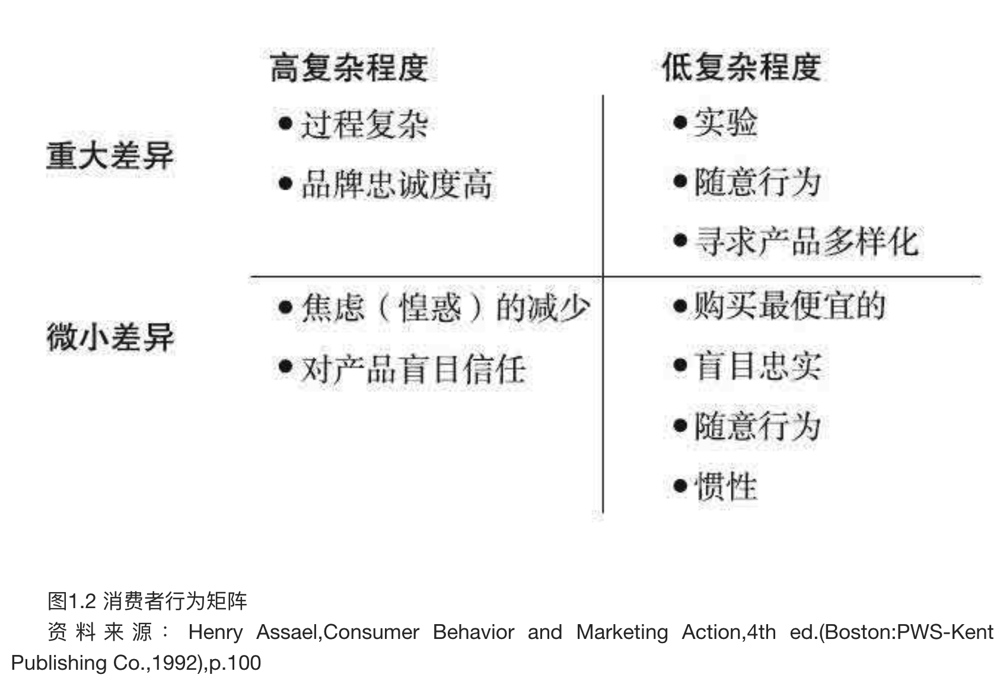

低复杂程度产品向高复杂程度产品转换，可以使一种简单的商品从一个未被区分的竞争领域里脱颖而出。通过以下4种常见的方法可以实现这一点：

- `将产品与高复杂程度的问题连接起来`典型的一例广告就是宝洁公司将不含胆固醇的烹调油与妻子害怕丈夫心脏病发作联系起来。
- `运用复杂广告`如果广告建立起一种表现产品或服务价值的信息，那么该产品就变得重要起来。这种信息将价值（诸如社会地位、爱）联系了起来，而不是仅仅着眼于产品本身的特性以及与竞争对手产品的差异。百事可乐努力在商业广告中经常使用明星，将青春、朝气、时尚与自己的产品联系起来，以利销售。
- `改变产品优势的重要性`产品和服务都能给使用者带来某种益处。如果通过营销活动将某种益处的重要性提高一个层次，更多的购买人则会有兴趣。20世纪80年代的啤酒大战使卡路里成为一个重要的竞争话题（21世纪是碳水化合物）。长期被忽略的特性——卡路里，使得对健康问题很敏感的饮酒者们在购买时更加注意了。结果，米勒清啤被说得与土匪一样一无是处。21世纪的头10年，消费者喜爱碳酸饮料。到了2012年，厂家热衷给烘烤食品贴上不会引起过敏、无谷蛋白的标签以吸引消费者。市场反响不错，这一宣传把消费者中对谷蛋白过敏的人也吸引过来了。
- `介绍产品的重要特点`营销家还可以在产品本身的某些性能上大做文章，使之与众不同。当家用吸尘器推出儿童防护帽时，家长们的购买决策介入程度大为提高。在商店的货架上，配有首批防护帽的产品占据显要位置。然而，一旦竞争对手们都仿制了这种防护帽，就需要新的差异，同时购买热又回归到低复杂程度状态。

真正低复杂程度产品，主要是因为人们对其可接受的性能标准要求较低。例如，一枚图钉的使用功能简单，无论是什么牌子的，都差不到哪儿去。如果尝试的成本很低，例如，一包口香糖，其介入程度很难被刺激起来。

与复杂程度相关的是购买计划的层次。购买的目的是`计划购买`还是`即兴购买`?高复杂程度产品总是经过计划才购买的，而即兴产品是一时高兴就买的。如果是计划购买，买主很可能要搜寻信息。反之，产品与需求的联系紧密程度就十分重要了。小吃食品就是即兴购买的一个例子，饥饿的人就会选择最近的快餐店。

#### 我打算细分市场吗?为什么?怎样划分？
**营销任务的中心问题是：“谁是我的消费者?”** 如果你觉得自己的东西是为大众提供的，那就适合做出大众市场策略。如果你的产品为大众所接受，那就把产品更多地供应给他们。否则，你就必须选定一个或数个`细分市场`作为`目标市场`。细分市场是指同类的消费者群体，他们具有相似的需求和欲望。

市场细分可以起以下作用：

- 确定足够大的细分市场，为之服务并能有利可图
- 确定通过营销努力能够迅速达到的细分市场
- 帮助制订营销方案

脑子里牢记一个确定的细分市场，你就能有效而迅速地开展有的放矢的营销活动，以赢取最大的销售额和最丰厚的利润。没有目标，你就有把营销资金浪费在对你的产品没有兴趣的人身上的危险。细分消费市场有4个主要的可变因素，即：

- `地理因素`。地理划分按国家、州、地区、城市划分市场。美国联邦政府的人口普查列出了310个标准都市统计区(Standard Metropolitan Statistical Areas,简称SMSA)，确定了美国主要人口中心。A·C·尼尔森(A.C.Nielsen)也有个类似的测量方法，称为指定市场区域(Designated Market Areas，简称DMA)。
- `人口统计因素`。按照以下可测因素划分人口，以获得同类人群体：
  - 年龄——不同年代人的不同需要和需求
  - 性别——不同性别的使用和购买形式
  - 收入——购买力
  - 婚姻状况——家庭需求
  - 家庭生命周期——成家、空巢等
  - 教育/职业——消费者文化程度的体现
  - 民族、宗教、种族——特殊喜好
- `心理因素`。按照心理差别因素划分市场：
  - 生活方式——活动、兴趣、观点
  - 性格——保守型、冒险型、追求地位型、冲动型、野心勃勃型、独裁型、热爱交际型（人们具有不同的敏感点，可运用广告努力去触动）
- `行为因素`。行为划分按照显著的购买行为划分市场：
  - 产品使用——使用数量、使用方法、对产品益处的追求
  - 购买时机——赠品、假期、季节性等
  - 品牌忠诚度——对某一产品的忠诚可以表明对其他产品的接受程度
  - 对价格和促销活动的反应程度——有些人群对特别的营销活动反应较为灵敏，如家庭妇女比单身的职业女性更多地使用优惠券

评估可能的细分市场应当运用以下条件：

- 可定量性——你能否确定这个细分市场?能否量化其规模?
- 可接近性——能否通过广告、销售队伍或分销商、运输商或仓储而抵达细分市场?
- 持久性——该细分市场是否大得值得花费气力?该目标市场是正在萎缩还是正在成熟或增长?
- 营利性——是否有足够的潜在利润值得以它为目标?
- 与竞争对手的可比性——竞争对手是否对该细分市场有兴趣?竞争对手目前是在对其进行调查，还是觉得不值得投入精力?
- 有效性——你的公司是否有能力为这一细分市场提供有保障的服务?
- 自卫能力——在竞争对手进攻时你能否保护自己?

### 2.市场分析
MBA们通常研究以下3个重要问题来评估市场：

- 相关市场是什么?
- 产品处于生命周期哪一阶段?
- 行业的主要竞争因素是什么?

#### 相关市场是什么?
大家最容易犯的错误是，**把同类产品市场都当成自己的相关市场**。在我攻读MBA的头两年，我在一家外贸公司工作。我调查了在美国杂品店里销售墨西哥研磨式咖啡的可能性。如果我认为所有咖啡销售都是我的相关市场，那就错了。1990年美国的咖啡销售额约110亿美元。然而，其中60％是在商店里出售的，其余的40％是集团购买，包括餐馆和自动咖啡售货机。这样，我的零售市场就剩下66亿美元。

但是，在这个咖啡大市场中，还需进行市场细分以找到我的最终相关市场。研磨式咖啡销售额约达7.5亿美元，即零售市场销售额的11％。在研磨式咖啡市场中，出售的咖啡只有60％不含人工香料。我的墨西哥咖啡没有添加剂，生产厂商拒绝使用人工香料。这样，我的相关市场就进一步减少至4.5亿美元。而这一块市场中，只有55％是在超级市场里销售的。这时，我就剩下2.48亿美元的市场。这才是我的`相关市场`。

细分市场选择完成之后，你就得自问该目标细分市场的大小和可接近性是否值得付出营销努力。如果答案是否定的，那么你拥有的仅是被称为`“可生产”的产品`，而不是`“可售出”的产品`。只有可售出的产品才能赚钱。

#### 产品处于生命周期哪一阶段?
产品市场因`产品生命周期(Product Life Cycle，简称PLC)`的不同阶段而不同。产品生命周期不仅仅是个时间因素，它还指随着新的细分市场的出现，消费者的购买力的增加如何推进销量的增长。

常见的产品生命周期的4个阶段（见图1.3）及其对行动的指导意义如下：

1. `引入期`，“这是什么?”让人们知道、了解产品，是必不可少的。如果可能的话，应选试用的方式。为了把信息传播出去，你可能要花费高额广告费用。有些厂家开始时选择几家商店独家分销自己的产品。各家公司起先随着对客户需求的了解，而频繁地改进产品。首批购买人被称为创新者，随后的叫作早期使用者，因为他们的个性或是因为兜里的钱包允许他们这么做，所以乐于承担购买风险。
1. `成长期`，“哪儿能买到?”此时宣传仍然很重要，但在这个阶段，竞争加剧了。那些早期大众开始产生了兴趣。随着更多的消费者了解了产品，他们就会研究新型号以决定买哪个，而不是应不应该买。买主们到了商店，开始比较产品性能。为使产品更具可接近性，营销人员常常采用选择性分销，以挑选更多的商店出售产品。在这个阶段很重要的一点是，扩大销售额，超过竞争对手，以便通过高生产效率和更有效的广告来降低成本。这将有助于公司在产品（如3D彩电、平板电脑、电子书等）生命周期的下一个阶段取得竞争优势。
1. `成熟期`，“为什么买它?”在这个阶段，大众市场的众多新客户开始购买产品。由于人们已习惯购买某种产品，而同类产品间的差异又不大，此时品牌的忠诚度便起了主要作用。在一个稳定的市场上，价格竞争往往变得十分激烈，因为额外的市场份额直接来自竞争对手。在成长期至关重要的产品特性，此时已标准化。由于产品性能上的差异更少了，此时广告就用来区分各种产品。营销经理们努力把细分市场划分得更细，以满足尚未满足的消费需求。在成熟的市场上，竞争对手们搜寻着所有可能的目标市场。一切可能的分销渠道，也都通过面向大众市场的分销战略予以考虑（如GPS导航、便携电脑、节能灯等）。
1. `衰退期`，“多少钱?”随着产品的生命周期到达衰退期，竞争对手们可能都提供相似产品。就连最胆小的消费者，即晚期大众，在此时期也觉得买这个产品是安全的。如果产品有致癌引患，美国食品药品监督管理局（FDA）也该注意到了。消费者对广告不予理会，因为他们知道在此阶段所有的竞争产品都一样。在这个阶段，如果竞争仍然存在，许多公司则注重于降低价格。如果这一领域竞争减少，厂家则慢慢地加价。此时，与商家保持良好的贸易关系，是你的产品能否留在零售货架上的关键因素。因为如果没有新鲜刺激，分销商和零售商们宁可把货位分配给更新的、潜在利润更大的产品。这种侧重贸易关系上的努力，通常被称为`关系营销（relationship marketing)`，如音响、单反相机等产品。

#### 行业的主要竞争因素是什么?
大多数行业的市场竞争是由以下5个主要竞争因素组成的：

- 质量
- 价格
- 广告
- 研发
- 服务

### 3.本公司与竞争对手的对比分析
`SWOT分析`时所要考虑的主要问题：

#### 公司的强项和竞争对手的强项是什么？
- 分销（菲多利食品公司）
- 新产品开发和引入（苹果公司）
- 广告［政府雇员保险公司（Geico）］

#### 我们在市场上的地位是什么？
- 市场大小和相对市场份额
- 财务状况
- 历史绩效和声誉

#### 我们的资源和竞争对手的资源是什么?
- 人员
- 技术、研发能力
- 销售力量
- 现金
- 贸易关系
- 生产

新竞争对手进入市场的壁垒，对于评价各竞争对手起着重要作用。壁垒是指新竞争对手要进入市场必须解决的问题或障碍。

#### 行业巨头的市场份额有多少?
`市场份额杠杆率`，是在研究一个行业的市场份额情况时应当考虑的一个重要概念。市场份额较大的公司，相对于竞争对手来说，一般利润要高。大竞争对手的产品单位成本比较低，因为它们可以把费用分摊到较多的产品数量上。一个实力相对较弱的竞争对手，则无力在研发上或添置高效率机器方面投入更大力量，因为它们的销售量较小，背不起这个包袱。

#### 我的产品如何从感性上策划以抗衡竞争?
`感知图`技术是一种图表方法，用以审视和比较你和竞争对手的产品。常用的坐标是价格和质量，但也可用其他内容。制作图表是MBA课程中的又一个技术，用以引出营销你的产品的创意，感知图则能通过展现消费者如何看待竞争中的产品来突出没有服务到的细分市场。感知是营销的首要因素，正如其在政治上的作用一样。例如，在纸巾行业，纸巾的强度和外观吸引力的取悦程度非常重要。作为举例说明，我根据自己的判断，编制了如图1.4所示的假设图。

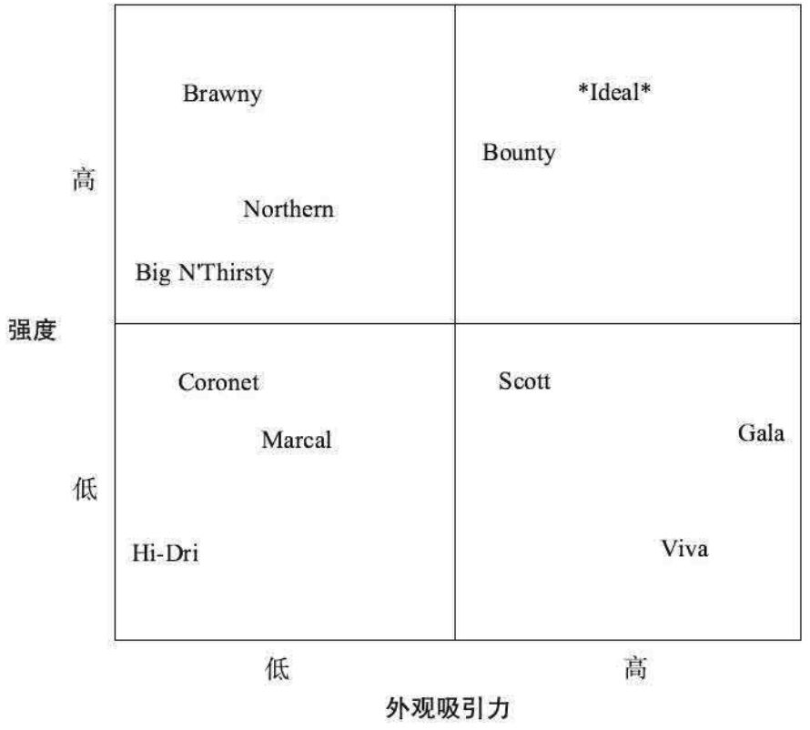

如果你的公司在某一产品领域中拥有多个品种，那么我们说你拥有了`深度(depth)`。在纸巾市场，没有哪一个厂商能够独占这一领域。但在狗类食品货架上，雀巢公司旗下的罗尔斯顿公司(Ralston)产品的深度却使货架上塞满了至少6种其品牌的狗粮。

如果你的公司拥有多种产品领域的许多种品种，那么你就拥有了产品的`广度(breadth)`。金佰利公司(Kimberly-Clark)在数个产品系列中拥有多种纸制品：Hi-Dri纸巾、舒洁（Kleenex）餐巾纸、Kotex卫生巾以及Huggies和Pull-Ups婴儿尿布。产品的深度和广度可以用作`阻挡策略(blocking strategy)`，以防止竞争对手进入分销渠道。

#### 针对竞争对手如何定位自己的产品？
20世纪50年代，营销更多的关注度集中在，如何利用好产品的特性，创建独特的产品“销售主张”（USP）并使用户获益。60年代到70年代，产品“形象”变得更为重要。1972年，艾·里斯（Al Ries）和杰克·特劳特（Jack Trout）提出市场“定位”概念，并广受欢迎。他们认为，让消费者心目中对自己产品有感知力，比产品外在的特性更为重要。消费者只相信真正的地道货。他们两位提出了能令自身产品和服务超越竞争对手的10条定位方法：

1. 让消费者脑海中有代表你公司产品的一个关键词。如果这一关键词能让消费者在某一方面满意，那么消费者也就会自然而然将其他优势联想到你的产品和服务上来。联邦快递意味着“一天内送达”。观念一旦形成，消费者就很难改变。
2. 产品的名称是定位的首选。选取的名称应该有描述性，让消费者明确能获得哪方面的利处。导通（Draino）产品宣传的是“下水道堵了，一用就通”。
3. 如果你的产品独特，就取个新名。如苹果未采用苹果微机(apple mini mac)，而是给新推出的音乐播放器取名iPod。
4. 让消费者记住产品名最好的方法是发明新词。消费者对作用立竿见影的产品，记忆更深刻。如，用了舒洁，你就不流鼻涕了。
5. 别偏离产品命名或口号的内涵。应该通过营销手段不断强化最初定位的产品理念。如，经典可口可乐就是好。
6. 对新近竞争挑战的最好应对方式是推出新品牌，但同时不干扰老品牌的形象。当大众开始欢迎瓶装水时，可口可乐公司没有把新推出的瓶装水叫成可乐水，而是起了个新名称：达萨尼（Dasani）。
7. 对非行业老大厂家而言，应对竞争的首选方法是开辟新产品领域。既然难以撼动已经在市场上站稳脚跟的品牌产品，就应该迎合消费者“乐于尝试新产品”的特点，避实就虚。嘉信理财(Charles Schwab)证券经纪商，就新设立了新低折扣股票买卖业务。
8. 对非行业老大厂家的第二种选择是，找到消费者观念中空白的新领域。如星巴克就成了迅速提供咖啡服务的佼佼者。
9. 对非行业老大厂家的第三种选择是，重新定位竞争对手，颠覆人们对“市场领导者”有关产品、代言人的具有概念。泰诺（Tylenol）推荐的是：如果你感觉胃部不适，吃阿司匹林前请找医生帮着检查一下。
10. 无论选择了哪种定位模式，都要坚持执行中的一致性。

### 4.分销渠道分析
营销人员把产品送抵消费者的通道称为`分销渠道(channel ofdistribution)`。作为选择分销渠道的基础，你必须考虑以下3个问题：

1. 我的产品如何能够到达消费者手中?
2. 每个分销渠道中的参与者各获利多少?
3. 现有分销渠道中各渠道的决策权掌握在谁的手里?

#### 我的产品如何能够到达消费者手中?
例如，粮食必须经过批发商和零售商才能到消费者手里。这些中间商被称为`渠道中间商(channel intermediaries)`。常见的渠道中间商有：

- 批发商
- 分销商
- 销售代表
- 销售团队
- 零售商

#### 每个分销渠道中的参与者各获利多少?
渠道中所有沾产品边的人都要砍一刀，这就是俗称的`毛利(margin)`。参加分销环节的人被喻为从厂家“获取毛利”。大多数行业的分销环节参与者，无不计算它们各自的`售价毛利(markup on selling price)`。`零售价`，才是消费者支付的价格。

    售价毛利率 = 毛利 / 售价 x 100%

这就是我如何把价值1美元的咖啡豆变成到达消费者手中时6美元的例子。在每一环节，分销渠道参与者通过烘烤、研磨、包装、品牌促销、分销、上架等，来增加价值或支出更多的费用。图1.5就是我估算的1989年麦氏香精咖啡发行渠道计价关系图。

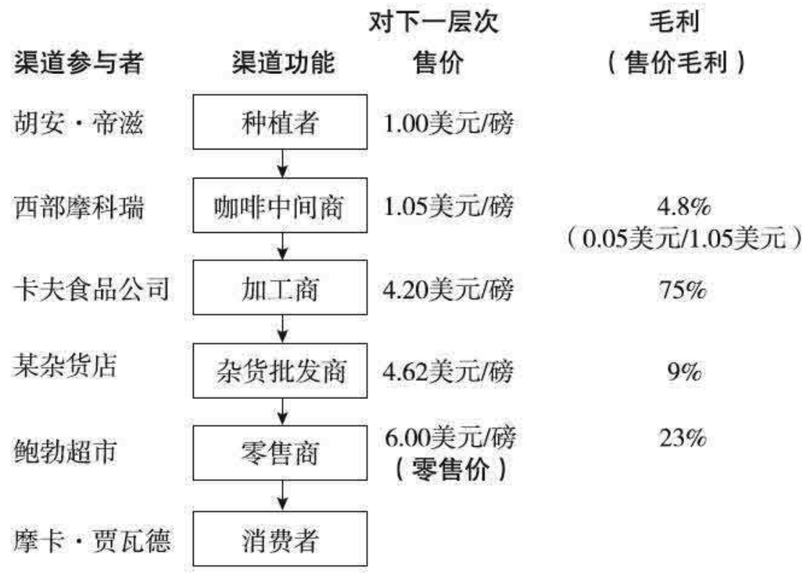

#### 现有分销渠道中各分销渠道的决策权掌握在谁的手里?
如果你的产品独特且有需求，那么产品生产厂商一般有权确定彼此的关系；反之，发行渠道的中间商便会左右这种关系，以获取尽可能多的毛利。

在杂货行业，分销渠道的权力从生产厂商那里转移到了连锁超级市场。由于较小的杂货连锁店在20世纪80年代合并成较大的超级市场连锁店，大型超级市场连锁店的管理层意识到，他们拥有值钱的不动产——`货架面积(shelf space)`。货架上每个`储货单元(StockKeeping Unit，简称SKU)`都占有面积。每件产品都必须入库、上架，并保持库存。如当Mazola食用油包装有3种尺寸时，便会占用3个储货单元。由于库房和仓储空间有限，货架不动产便变得值钱了，零售商们要在每一个储货单元上收钱。营销人员甚至像设计师画图一般，画出被称为`平面图(planogram)`的货架图例，并争夺最好的货架位置。

包装食品公司无论大小，都必须为该环节支付`货位费(slotting fee)`，以便在货架上为新老产品预留“货位”。

#### 互联网在分销渠道中所起的作用是什么?
互联网已经成为产品销售的主要渠道。互联网作为和客户沟通的一种渠道起着四方面的作用，也被称为4C模式。

### 5.制定营销组合
综合性的营销方案即营销4P。

- 产品决策(Product)
- 分销渠道(Place)
- 促销决策(Promotion)
- 价格决策(Price)

#### 我的产品与我现有其他产品的关系如何?
这个问题旨在确定你的产品之间的协作区域，或发现在哪些方面对各项商业活动有约束。例如，如果美泰克公司（Maytag）在其衣服干洗机、烘干机产品线里增加洗碗机，那么，该产品以及消费者和洗碗机零售商就分享了它们现有的分销渠道。这一延伸产品(line extension)是适宜现有的各个环节的。但如果美泰克想销售个人用吹风机，这种适宜性就令人怀疑了。

#### 我怎样让自己的产品更出众?
`差异化(differentiation)`是个大题目，指营销人员如何使自己的产品在众多的同类产品中脱颖而出。要做到这一点，方法有很多：

- 特点——性能
- 适宜性——量体裁衣
- 格调——功能、外观形象
- 可靠性——保修、退货制度
- 包装——颜色、尺寸、形状、保护
- 尺寸——服装、电器、电脑、行李箱尺寸
- 服务——及时、礼貌、精确
- 品牌命名——标签

一种产品的所谓`商标资产(brand equity，品牌资本）`，可以通过运用商标（品牌）或`延伸产品战略(brand or lineextension strategy)`转移给新产品，使之有别于其他产品。卡夫食品公司选用Jell-O为其新布丁和冰激凌的牌子，这样就赋予了新产品在它过去几十年赢得的公众好感（品牌资本）。

感知图和定位，能有助于找到使产品更出众的方法。

#### 产品生命周期对我的计划有什么影响?
根据产品在产品生命周期的不同阶段，其各部分在竞争中起的作用越来越大。前面讨论产品生命周期时提到，成长期对区分产品至关重要的是产品的特征，而在成熟期，品牌的重要性越来越大。

#### 我应采用哪种分销战略?
- 独占性——每个市场只在一个商店销售
- 选择性——每个市场只在几个商店销售
- 批量或加强性——在尽可能多的商店销售

运用选择性策略时，生产厂商可能有“义务”提供高质量、优质服务以及合作式付款方式，以支持促销活动。当生产厂商与零售商共同承担广告费用时，这种广告被称为`联合广告（cooperative advertising）`。

零售商可能有“义务”特别注意给予产品以优惠的位置、特殊的促销、布置安排以及销售上的努力。

#### 选择哪些分销渠道?
`产品细节(product specific)`另一个需要考虑的因素是，销售所需要的注意程度，这是与产品的复杂程度、新旧程度和价格相关的。有些产品，可能需要你自己配备销售队伍，无论花费多少费用都在所不惜。另一方面，有些产品如糖果和软饮料，是通过一系列批发商和分销商以后摆上商店货架的，这些产品比较简单，不要求生产厂商直接控制产品的展示和销售。

`必要的控制(need for control)`激励分销渠道有效而适宜地对待你的产品，也是选择分销渠道时应该考虑的问题。生产厂商因被分销商、批发商和运输工人隔开，距离消费者越远，厂家对产品如何销售的控制就越小。药品公司一般都有自己的销售队伍，称为受控销售队伍，销售人员都经过严格的培训，可向医生提供可靠信息。如果默克（Merck）或辉瑞（Pfizer）公司不得不依赖某个独立的销售队伍，那么它们就不能绝对控制销售人员的培训或其在外的行为。

`期望的毛利(margin desired)`通过对分销渠道的分析，便能够确定潜在的利润有多少。每一环节的毛利是从哪里收取的?你的公司能否以具有竞争力的价格将产品输送给分销渠道，同时为自己保留足够的毛利?分销渠道的选择决策，便是以能产生多少毛利为基础的。博士公司（Bose）的高溢价定位耳机和音响，就是通过精心挑选改造大型商场店面、设计印制宣传册以及各种直销方法来保持品牌形象，维持高利润。

购买程序 | 促销任务
-----|-----
意识 | 介绍产品，激励需求信息
兴趣 | 提供令人相信的信息，满足需求的信息
尝试 | 刺激行动
再次购买 | 吸引客户购买，增加使用
忠诚度 | 加强品牌或形象，特别的促销活动

在不同的产品生命周期阶段，不同的复杂程度，要求促销工作执行不同的任务。为你的产品选定的促销方案，必须与你在消费者分析中列出的购买程序相一致。

#### 推式战略抑或拉式战略?
促销工作与分销一样，也应当有战略指导。`拉式战略(pull strategies)`是把买主拉到出售你的产品的地方去。电视广告通过“请您到当地食品店指明要买主拉到出售你的产品的地方去。电视广告通过“请您到当地食品店指明要Perdue鸡”，把消费者拉到卖鸡肉的商店。促销工作的另一重要任务是，鼓励分销渠道储存和销售产品，这种努力叫作`推式战略(push strategy)`。例如，啤酒分销商要花费大量时间说服酒吧老板储存它们的啤酒并出售鲜啤。

为把买主拉到商店或推动分销渠道储存、销售，一般可采取以下5种类型的促销手段：

- 广告(advertising)
  - 要记住两点：一是你的任务是什么，二是量化为完成任务广告需要出现的频率和周期。
  - `覆盖面（reach)`和`频率(frequency)`，是媒体目标的主要量化计算方法。覆盖面是指目标市场百分之几的人看见和听到你的促销广告，频率是指他们看见或听到的次数。营销家们把一个人接触到某信息的次数称为`总印象数(impression)`。由于不同的产品导致不同的购买行为，刺激购买需要不同的覆盖面和频率的结合。二者相乘的积，即覆盖面×频率=一种被称为`毛额定点数(Gross Rating Point，简称GRP)`的衡量单位。将所有的毛额定点数相加，得出的就是`总额定点数(TotalRating Point，简称TRP)`。毛额定点数和总额定点数，用来量化电台、电视和户外广告的销售和购买情况。
  - 发布信息的内容，也是一个重要的决定因素。广告人员将广告的信息、措辞或排版，称为`创意(creative)`。出主意的广告代理，被叫作`创意人员(creatives)`。
  - 杂志和报纸广告，是按照版面和报刊发行的细分市场因素来购买的。杂志的寿命期长些，但报纸的传送直接得多，也更集中，对促销更为有利。这两种印刷品的读者，是按照`每千名读者费用（Cost PerThousand，简称CPT）`为计算基础的。`标准额定和数据服务(Standard Rate& Data Service，简称SRDS)`，则以在线方式或以一系列厚如电话号码簿的册子提供全面媒体清单和邮寄名单价格。
- 人员销售(personal selling）
  - 销售人员可以使产品信息个人化，以适合买主的需要和具体情况，并在这个相互影响的过程中发现和解决各种问题。这种方法往往是所有营销组合里费用最大的一部分，因为人工费用和佣金都很高。
  - 人员销售是`解决问题（problem-solving）`和`咨询(consultation）`的过程。
- 销售促销(sales promotion)
  - 促销有两种：针对消费者的促销和针对分销渠道的促销。
  - `消费者销售促销(consumer sales promotion)`的手法有：
    - 购物券(coupon)
    - 退货承诺(refund)
    - 样品(sample)，对消费者不敢贸然尝试的新产品，或是一些在使用后很可能`建立口碑(Word Of Mouth，简称WOM）`的产品，这种方式很有效。
    - 有奖销售(premium)是指免费或低价为产品购买者提供奖品。`自偿(self-liquidating)`奖品，指只收取成本费的物品。
    - 销售竞赛(contest)和抽彩(sweepstake)
      - `旨在增加销售额的促销(trade-directed sales promotion)`方法有：销售竞赛、购物陈列点、经销商激励政策、行业展览会和店内演示。
      - `经销商和雇员激励政策(dealer and employee incentive)`，厂家对经销商提供经销支持而支付的费用，称为`推销佣金(spiff)`，其形式有货架费、小额酬金、个别产品单打折扣、现金付款、免费商品或奖品。
      - `行业展览会(trade show)`是用来向批发商、经销商、零售商和分销商，推销某种新产品或现有产品的方法。这种促销活动旨在鼓励分销渠道参与者持有你的产品。
      - `店内演示(in-store demonstration)`是生产厂商广泛采用的方法：用其训练有素的专家来促销那些非此举不能激发消费者兴趣或为行业所接受的产品。
- 公共关系(Public Relations，简称PR)
  - 公共关系的目的是，为你的产品创造一种有利的氛围，而并非直接销售。
  - 赞助著名活动或为慈善事业捐款，常被用来建立`光环效应(halo effect)`，以增加公众对公司和公司产品的好感。
  - 公关促销也包括扩散营销（viral marketing，也有人译成病毒式营销）。如在互联网聊天室、微博、各类电商、YouTolbe视频网站、脸书、推特、机构新闻专刊、大学校园，自然地讨论公司的产品话题，推出新产品、促销。
- 宣传（publicity)是公共关系的一种形式，指大众媒体关于某一公司或产品的任何形式的免费传播，其形式包括新闻故事，或是产品出现在媒体里。
- 直销(direct sale)包括互联网邮寄宣传品、产品目录、购物网络和冗长的电视商务信息(TV infomercial)。

#### 价格决策：我应当如何定价?
主要的定价方法和战略：

- 成本加价
  - 这是一种简单的方法，在成本基础上加上期望的利润。公路建设承包商经常使用这种方法，但这种方法并不太好。
- 消费者认同价值
  - 你可以按照向消费者提供的价值收费，而不必考虑成本高低。例如，更换部件，螺母、螺栓虽然不值钱，但因其为重要部件，且是定制的，收费就非常高。
- 剥离式
  - 早在产品生命周期的引入期，公司就可以为其新颖的产品或服务选择收取高价、获得剥离式(skimming)高额利润的定价方法。所获得的利润可以用来进行进一步的产品研发，正如高科技领域那样，或者直接作为产品所有人的回报。
- 渗透式
  - 这种定价方式可以在产品生命周期的引入期或之后运用。渗透式(penetration)战略是以低价格来获取市场份额，其目的首先是用大量生产来降低单位成本，期望最终能作为廉价生产商控制市场。
- 价格／质量关系
  - 由于消费者的认同不一定仅仅以产品的外在特点为基础，那么所“认同”的质量常常为价格所影响。服饰、香水和珠宝，就是价格本身影响产品特性认同的例子。消费者常常由于所定的高价而将某一产品视为具有某种风格特征和工艺质量。
- 针对竞争对手
  - 战略家们时常决定采用与竞争对手的价格相当或低于竞争对手价格的方法，以获取或保持竞争市场上的市场份额。在汽油、钢材和飞机票等方面，这种情况很常见。
- 根据市场规模达到利润目标
  - 如果市场规模有限，那么所定的价格必须保证有足够的利润来补偿营销和生产成本。如果产品定价不能有利可图，那么为了降低成本，要么调查其他用户市场，要么研究改进生产。
- 按照买主的价格弹性定价
  - 价格弹性描述的是，价格变化时买主行为是如何变化的。有弹性需求的买主，并不情愿接受价格飞涨，他们的需求多少取决于价格。没有弹性需求行为的买主，不在乎价格上涨，他们的购买数量和频率不会由于价格因素而下降。例如，烟草消费者已经消化了多次价格上涨因素的影响而继续购买，这是因为他们的烟瘾使其需求在接受价格上涨方面没有了弹性。有弹性的买主不会支付多于给定价格点(price point)的价格，他们视其渴望程度、个人可支配收入，或心理上的价格线，停止购买或大幅度减少购买。当机票价格便宜时，旅游人数也相应增多；当机票价格上涨时，人们更倾向于开车出游，或干脆待在家里。

### 6.我的计划的效益情况如何?
要确定你是否制订了一个既能盈利又合理的方案，你必须研究以下几个问题：

- 成本是多少?
- 盈亏平衡点是多少?
- 投资回收期有多长?

#### 成本是多少?是固定的还是变动的?
`变动成本(variable cost)`是随着所售出或生产的产品数量而变化的成本。材料和人工成本是变动成本。随着销售或生产数量的增加，材料和人工成本也增加了。`固定成本(fixed cost)`则是即使在没有销售的情况下也不随数量的变化而变化的成本。在产品数量上下浮动的同时，无论是租金还是一名主管的工资，在一个相对范围内是不变的。我的意思是说，如果销售增长了3倍，可能需要租赁一个新工厂，那么固定成本就上升了。促销费用，例如广告，也被认为是营销组合中的固定成本，因为如果产品彻底失败，广告的钱已经花掉了，这些钱被认为是`沉没成本（sunk cost）`——电视广告播出后，钱就在电视的海洋里漂走了。总成本是变动成本和固定成本之和。

    总成本=［单位变动成本(VC)×销售数量］+固定成本(FC)

#### 盈亏平衡点是多少?是否合理?
`盈亏平衡点(break even)`是指从产品销售中收回固定成本，但并没有产生利润的产品生产数量。

    盈亏平衡点单位数量 = 固定成本 / 单位边际贡献
    （单位边际贡献 = 售价 - 变动成本）

用咖啡行业的数据，提供了一个实际例子。在所拟的墨西哥上等咖啡营销方案里，我确定的价格和成本为：

名目 | 成本 | 成本类型
---|----|-----
零售价 | 6.00美元/磅
批发价 | 4.20美元/磅
咖啡豆成本 | 1.00美元/磅 | 可变
烤制和加工成本 | 0.44美元/磅 | 可变
包装成本 | 0.55美元/磅 | 可变
运输成本 | 0.25美元/磅 | 可变
销售奖励金等 | 50000美元 | 固定
生产设备租金 | 12000美元 | 固定
促销工作 | 150000美元 | 固定

相应的盈亏平衡点单位数量计算如下：

    50000美元+12000美元+150000美元
    ——————————————————————————————————————
    4.20美元/磅-(1.00+0.44+0.55+0.25)美元/磅

    = 108 163磅（盈亏平衡点）

而盈亏平衡点销售额为：

    108 163磅×6.00美元／磅=648 978美元（盈亏平衡点销售额）

该公式还可用于计算获取预期利润的目标数量：

    目标数量= (固定成本+利润) / 单位边际贡献

要达到30 000美元的利润回收目标，你只需把利润与固定成本相加作为分子。

    (212 000美元+30 000美元) / 4.20美元/磅-2.24美元/磅 = 123 469磅（目标销量）

    123 469磅 x 6.00 美元/磅 = 740 814美元（目标销售额）

以上分析中非常值得注意的是，已经花费了的产品开发或广告费用，即“沉没”成本，并没有包括在内。

墨西哥咖啡营销计划的经济分析如图1.8所示。

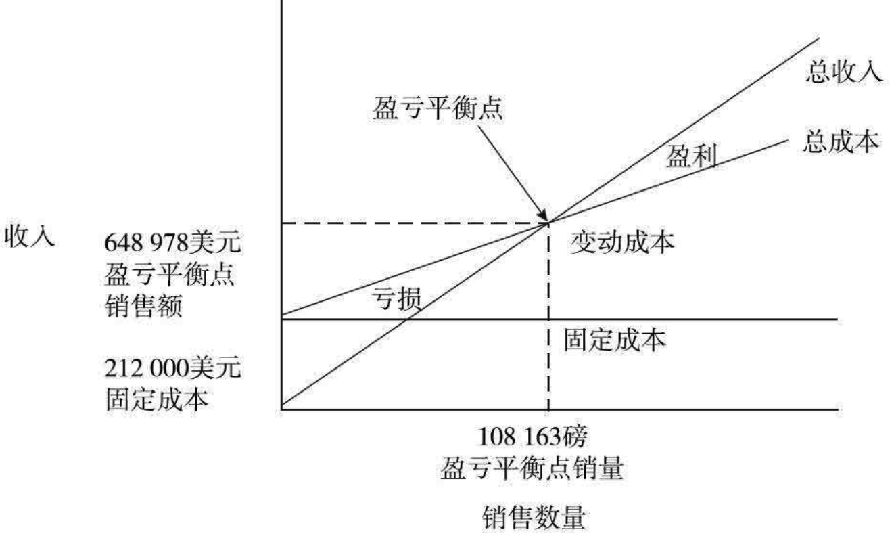

#### 我的盈亏平衡点相对于我的相关市场是否合理?
这是你下一步必须回答的问题。在咖啡这个例子里，本章前文说明通过超级市场渠道销售的上等及研磨式咖啡市场为24 800万美元，而648 978美元的平衡点零售额占该市场的0.26％。740 814美元的目标零售额，只是相关市场的0.3％的份额。以这个水平线，如果我相信150 000美元的促销费用以及给经销商50 000美元的奖励金，就足以产生740 814美元的销售额，那么计划看起来是合理的。设想一下——我只需要0.3％的市场份额，就能达到我的目标！

#### 投资回收期有多长?
计算投资回收期的公式是：

    投资回收期 = 期初投资 / 年均利润

在所举的咖啡例子里，投资回收期计算结果为：

    212 000美元 / 30 000美元 = 7年

### 7.回过头去，修正计划
在咖啡项目中，我为解决好以下问题绞尽了脑汁：

- 我是否应该选择另一个细分市场为目标？
- 邮购这个发行渠道是否是一种选择？
- 是否应当不做广告而依靠一种低价位的方法推动我的产品的销售？

# 第2天商业道德
## 企业的社会责任
提到商业道德，我们必须首先假设企业在做出商业决策时是以对社会负责的态度为前提的，也就是通常所说的具有`社会责任感（social responsibility)`。赞同这一观点的人士认为，公司应尽的社会义务远比最大限度地赚取利润重要得多。商学院也都鼓励学生们遵循这一“合乎政治常理”的哲学。大多数人认为，由于公司具有很强的实力，它们也都有义务担负起社会责任。公司也应在对所有`利益相关者(stakeholder）`，包括公司的客户、供应商、雇员、所在社区以及股东，有利的情况下运作。公司领导层要对所有利益相关者负责。

学校讲授此课程时，主要的内容集中在两个方面：`相对性（relativism)`和`利益相关者分析(stakeholder analysis)`。相对性研究的是，为什么我们在做决策时通常忽略了道德方面的问题；而利益相关者分析则提供了在面临道德方面的问题时应如何处理。

### 相对性
相对性的支持者们认为，我们无法将所有事务简单地判定为非对即错、非恶即善，世界上的很多事并非都是黑白分明，还有许多中间灰色地带。坚持相对性理论的人认为，评判职业道德的标准因个人、社会和文化环境的不同而有相对性。相对性论者即使遇到了某种窘境，也不认为痛心疾首就能找到真正的答案。了解相对性，你需要认清它的4种基本形式，即：

- `幼稚相对性(naive relativism)`认为，任何人都有自己取舍事务的标准。没有人可以对他人的行为做道义上的评判。对个人行为有影响的可变因素很多，局外人是不可能了解当事人做决定时所考虑的有关因素的。因此，当雅培公司（Similac）的高层管理人员得知雀巢公司可能正在向发展中国家推销有害婴儿健康的食品时，他并没有资格对雀巢公司的总经理进行道义上的评判。
- `角色相对性(role relativism)`，将个人的自我角色和在公众中的角色区分开来。公众中的角色要求具有特殊的“道德观”，这与个人从自身角度做决定时有所不同。例如，某渔业公司的老板个人并不希望看到该公司的渔网意外捕杀海豚，但是为了公司的利益，他身为总裁就不应让个人情感影响公司的整体利益。
- `社会相对性(social relativism)`和幼稚相对性类似，人们通常以社会标准来做道德上的评判。“行业通常做法”、“俱乐部规则”、“职业行为规范”以及“约定俗成的做法”，是社会相对性论者的常用托词。在制造业，正是“行业通常做法”使童工法形同虚设，工厂照样雇用童工，孩子们失去了上学的机会。
- `文化相对性(cultural relativism)`认为，世上不存在通用的道德准则，不能用本国的道德水准作为评判别国道德的依据。如果一个民族有自己特殊的信仰，局外人又怎能指手画脚妄加评判呢?还记得“入乡随俗”这一说法吧。随着全球国际化商业竞争的加剧，文化相对性概念变得越来越重要了。跨国公司遵循当地的风俗习惯和法规，而这样做在国内可能就触犯了本国的道德标准。关于种族隔离问题的讨论，是围绕着文化相对性展开的。跨国公司依据文化相对性理论，为自身雇用苦力参与南非金矿、钻石矿开发寻找借口。

### 其他道德概念
其他的概念还有

- `自然法(natural law)`。信奉自然法的人们认为，指导人们采取正确行为的标准，在我们周围的自然环境中和《圣经》中都有反映。
- `功利主义(utilitarianism)`。功利主义者认为，只要一种行为能给大多数人带来最大利益，那它就是合理的。
- `普遍性(universalism)`。普遍性理论支持者提出，由于问题发展的结果往往无法受个人的控制，所以只要做决定时出于良好的动机，那么任何行为都是可以原谅的。

## 2002年《萨班斯-奥克斯利法案》
2005年生效的《萨班斯-奥克斯利法案》和相关的对代理人约束的新规定主要包括四大方面：

- 财务会计准则
  - 审计委员会必须完全由独立的董事担任，并且至少有一人是金融专家。
  - 总经理和财务总监必须书面签字，认同公司的财务报表真实客观地反映了公司的财务状况和经营结果。
  - 美国证监会有权成立新的公众公司会计监管委员会，取代行业自有约束不力的机制。
- 内部控制
  - 公司总经理和财务总监必须亲自负责并确认公司财务报告内部管控机制。
  - 外部审计师必须证实、报告公司管理层评估自身财务监控制度的意见之真实性。
  - 404条款要求安排对大型公司进行年度审计。
- 公司高管道德行为准则
  - 公众公司的最高管理层和财务总监必须遵循道德行为规范准则。
  - 公众公司不能给高管和董事发放贷款。
  - 如果公司财务报告出现严重不符会计要求的情况，需要重新编制澄清问题时，公司总经理和财务总监必须返还全部的薪酬和奖励。
  - 严禁公司官员和其他内部人士在退休金禁售期内，交易自身公司股票。
  - 对披露公司不法行为的人提供进一步免于处罚的保护措施。
- 关联方道德行为准则
  - 对律师提出新的职业责任要求。
  - 对金融分析师提出避免利益冲突约束。

# 第3天会计
## 美国公认会计原则
所谓会计原则，是指为使公司的财务报告之间具有公平的可比性而确定的标准。会计中的最重要原则是`美国公认会计原则(Generally Accepted Accounting Principles，简称GAAP)`。

## 会计的基本概念
下面介绍的7个概念和名词虽不是法律条文，却是指导所有会计原则和会计报告的适用规定：

- 实体(the entity)
- 收付实现制和权责发生制(cash and accrual accounting)
- 客观性(objectivity)
- 稳健原则(conservatism）
- 持续经营(going concern)
- 一致性(consistency)
- 重要性(materiality)

### 实体
某一特定实体的经营活动，是通过会计报表反映出来的。会计师们在报表中采用的衡量标准和尺度必须清楚。出具报表的实体，可以是一家杂货店、一个生产厂家、一家公司或一个跨国性集团。例如，达登餐饮公司(Darden)是一个公司实体，红龙虾（Red Lobster）和橄榄花园(Olive Garden)连锁店则是其下属公司实体。

### 收付实现制和权责发生制
怎样“数豆子”是非常重要的。采用收付实现制，亦称`现金收付制(cash basis)`会计原则，业务往来只在现金易手时才被记录下来。从公司的记账簿上，可以查寻到需要了解的小企业的全部会计信息。某家商店于2014年付了两年的租金，此时就把支付的全部租金费用记为2014年发生的成本，而不是将之分摊在两年。当一家小型机械加工点购买电动工具时，其成本也就随买随记，而不再考虑工具的使用年限。明白了吗?收付实现制会计原则能十分明确地告诉你现金何时易手、交易量是多少，但是，它并未把销售额同相应的经营成本挂钩。

许多具备一定规模的公司都采用`权责发生制(accrual)`会计方法记账。权责发生制是把由于发生业务造成的财务状况的变化记录下来，而并不考虑现金是否发生了变动。目标公司（Tareget）由于租用了场地，租金费用是每月都记录在案的；波音公司工人在工厂使用的铆钉枪的成本，是以其使用年限记在公司账上的，因为波音公司在采购上花费的款项巨大，所以用现金收付制就会歪曲财务报表的内容。由于通常情况下发生的业务与现金的流动并不是同时进行的，所以就引出了与权责发生制有关的两个问题：`分摊（allocation)`和`配比（matching)`。

### 交易的定义和客观性
在对一些问题持怀疑态度时，会计师要恪守`客观原则`。一笔交易必须要有足够的可以查证的证据说明，否则就不应记录在案。

### 会计制度上的稳健原则和历史成本原则
会计上要求公司在编制财务报表时必须遵循`稳健(conservatism)`的原则。凡遇到概念含混不清时，就该保守一些。会计单据只包括那些可测量的有据可查的不动产、负债、销售和成本等。

稳健原则要求按业务发生时的原始数据记录其`历史成本(historical cost)`。国际纸制品公司在纽约总部的地价在20世纪80年代房地产业繁荣时候升值，然而，这种地价升值上的收益是不能记入账目中的，即使这块地是公司于17世纪只花几个没什么价值的小珠子从印第安人手中买下的，财务上其账面价值仍以当时购买该块土地所用小珠子的价值。

如果资产的现值低于记录的成本，那就是另外一回事了。稳健原则要求现在即把发生的亏损记录在案。否则，会误导阅读公司财务报表的读者。

库存货物的价值是按原始成本统计记录的。即使价格发生变化，库存货物的客观价值仍是公司以前购买时支付的费用。公司必须有能证明其成本真实性的有据可查的购货单据。例如，史泰博（Staples）办公用品公司账上显示曾购买过国际纸制品公司生产的办公用纸，其价值就是购买时的成本。如果新近购买同类型办公用纸的成本增加了，史泰博公司现有库存的价值仍按原来购买时的成本计算。

### 持续经营
财务报表把企业形容成`经营性(operating)`实体。会计记录中各科目项下确定的价值是以`持续经营(going concern)`中的企业为前提的。会计师假定公司在可预见的将来仍能持续经营，所以，财务报表中的价值不是“抛售”时的那种价格。他们用的是你已经知道的原始成本，例如，购买轧钢设备的成本非常昂贵，对一家正在生产的美国钢厂来说，具有很高的价值。而该设备在公司破产拍卖时，几乎值不了几个钱。

### 一致性
对阅读财务报表的人来说，`一致性(consistency)`概念是非常重要的。会计原则要求某一实体年复一年地采用同一种会计制度。只有这样，分析人员才能将公司现在的数据和以往做比较。

## 财务报表
要想了解一家公司的经营情况，你必须能够读懂3个主要的财务报表：

- 资产负债表(balance sheet)
- 利润表(income statement)
- 现金流量表(statement of cash flows)

### 基本概念
`资产`是指公司拥有的能对公司将来业务发展起作用的资源。

- 现金（cash）
- 库存(inventory)
- 应收账款(accounts receivable)
- 设备(equipment)
- 厂房(buildings)

`负债`是需要偿还的借款、负债和为他人提供产品和服务的明确的资金责任。

- 银行债务(bank debt)
- 应付账款(accounts payable)
- 客户购买产品预付款和服务垫付款(prepaid accounts or advances from customers to deliver goods and services)
- 应交税金(taxes owed)
- 应付工资(wages owed to employees)

`所有者权益`是所有者投资在公司中的累计资金金额。所有者投资的形式可以是现金、其他财产或公司收益部分的再投资。

- 普通股(common stock)——由所有者投资
- 追加股本金(additional paid-in capital)——由所有者投资
- 留存收益(retained earnings)——所有者收益的再投资

### 会计恒等式
    资产（A）= 负债（L） + 所有者权益（OE）

### “平衡”法则举例
具体介绍“平衡”法则是如何起作用的3个例子：

1. 为准备开业，鲍勃买了一台收银机。图3.1的天秤中左边的资产增加，同时右边需偿还的银行借款（即负债）也就相应地增加。这时增加的资产也因负债的增加平衡了。
2. 为使杂货店开业，鲍勃将自己的一部分资金加上他父亲的资金投到项目中来，这时天秤中右边的所有者权益增加，左边的现金（即资产）也相应增加，使两边平衡。
3. 杂货店经营成功后，希望能够还清公司购买收银机所用的银行贷款（右边的负债减少），天秤左边的现金（即资产）也就会减少，使得两边平衡。

所有的业务往来，都遵循这一平衡概念。

### 会计程序：复式记账
会计师们通过`日记账(journal entries)`记录下公司每一笔业务交易。会计师把记账用的簿记称为`总分类账(general ledger)`。用`会计科目表（chart of accounts）`列出各种科目下的详细内容。用`会计恒等式(fundamental equation)`中的同一种平衡的概念，将资产增加记在左边，称作`借(debit)`；将负债和所有者权益的增加记在右边，称作`贷(credit)`。无论是哪一种情况，日记账都要有两组数据：**有“借”必有“贷”**。当发生的业务往来属于资产减少时，记在右边的“贷”项下，负债和所有者权益的减少记在左边“借”项下。由于这种右边／左边的记账方法，手工记账操作时每一笔业务记录的格式像“T”形状，因而这类账也叫作“T”字形账，见图3.2。

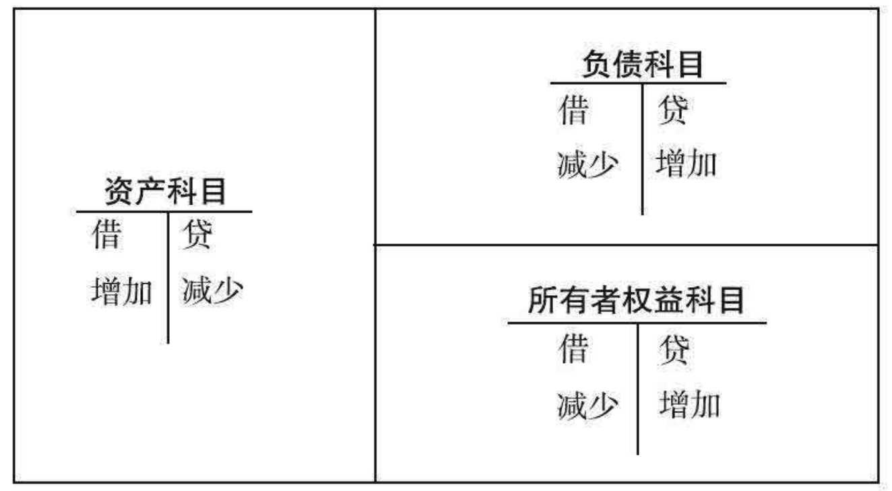

表3.1 资产负债表日记账#1

科目名称 | （类型） | 借 | 贷 | 效果
-----|------|---|---|---
现金 | （资产） | 15 000 | - | 增加
普通股 | （所有者权益） | - | 15 000 | 增加

表3.2 资产负债表日记账#2

科目名称 | （类型） | 借 | 贷 | 效果
-----|------|---|---|---
银行债务 | （负债） | 15 000 | - | 减少
现金 | （资产） | - | 15 000 | 减少

### 资产负债表举例
表3.3 鲍勃杂货店资产负债表（截至2014年12月31日）

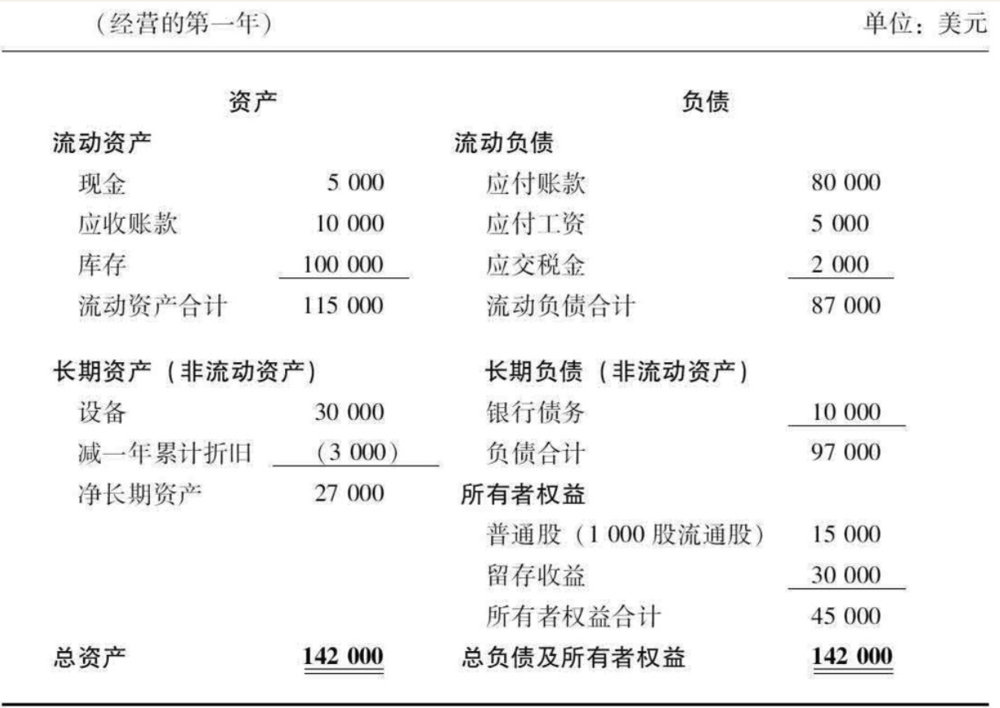

### 流动性：流动和长期的划分
资产负债表的一个重要特征是：资产和负债均按各自`流动性(liquidity)`程度的不同而按顺序列出，即从最具有流动性的开始。流动性是指资产变现（现金）的能力。现金、应收账款、库存属于`流动资产（current)`，因其在下一经营期内（通常指一年）易于变现（即有流动性），所以先列出。由于设备不易卖掉，因此就归为固定的、长期的，也称为`非流动资产(Noncurrent Asset，简称NCA)`，在资产负债表中列在流动项之后（参阅表3.3)。

就负债类而言，欠供应商的应付账款、欠雇员的工资以及应交税金，均属流动负债。这些是短期负债，需在一年内付清。银行贷款是长期的或`非流动负债(Noncurrent Liability，简称NCL)`，有数年的还款期限。

### 营运资本
`营运资本(working capital)`是指公司在日常业务中必须接触到的资产和负债。营运资本是最具有流动性的资产，能为阅读公司财务报表的人提供了解公司清偿债务能力的线索。因此，营运资本是指公司的流动资产和流动负债。衡量公司偿债能力的`净营运资本(net working capital)`，是用总流动资产减总流动负债得出的。

    总流动资产-总流动负债=净营运资本

在鲍勃杂货店的举例中，其净营运资本总额为28 000美元（115 000美元-87 000美元），也就是说，鲍勃杂货店有足够的流动资产偿还流动负债。从银行家的角度看，拥有大量净营运资本的杂货店的信贷风险较低，还得起债。反过来，收购公司的人或分析家们也许会认为，店主的库存管理不完善，也许手里压货太多，也许收银机里存的现金也太多。

### 所有者权益是怎么回事？
将会计学中最重要的等式移项，即把A=L+OE，变成OE=A-L，你就可以看出所有者权益(OE)是公司资产减负债后的`残值(residual)`。所有者权益(OE)也叫`净值(net worth)`，是偿还其他所有债务责任后的“净值”。

资产负债表中所有者权益科目可有两种办法改变：或者投资者更多地投资，或者要求公司“留存”收益。在资产负债表中之所以列出`“留存收益”(retained earning)`一项，也就是为这个目的。如果所有者希望将收益划出来，就可以要求公司`分红(dividend)`。分红降低了累计的留存收益。

### 收入-成本=利润
产品销售后有销售收入(revenue)以及与收入有关的相应的支出(expense)。当用权责发生制把收入和支出合理地匹配后，两者之间的差别就是利润(income)，即：

    收入-成本=利润

### 利润表术语
利润表开头部分计算的是`毛利（gross margin)`。

    毛利=销售收入-销售产品和服务的“直接成本”

表3.4 鲍勃杂货店利润表（截至2014年12月31日）单位：美元

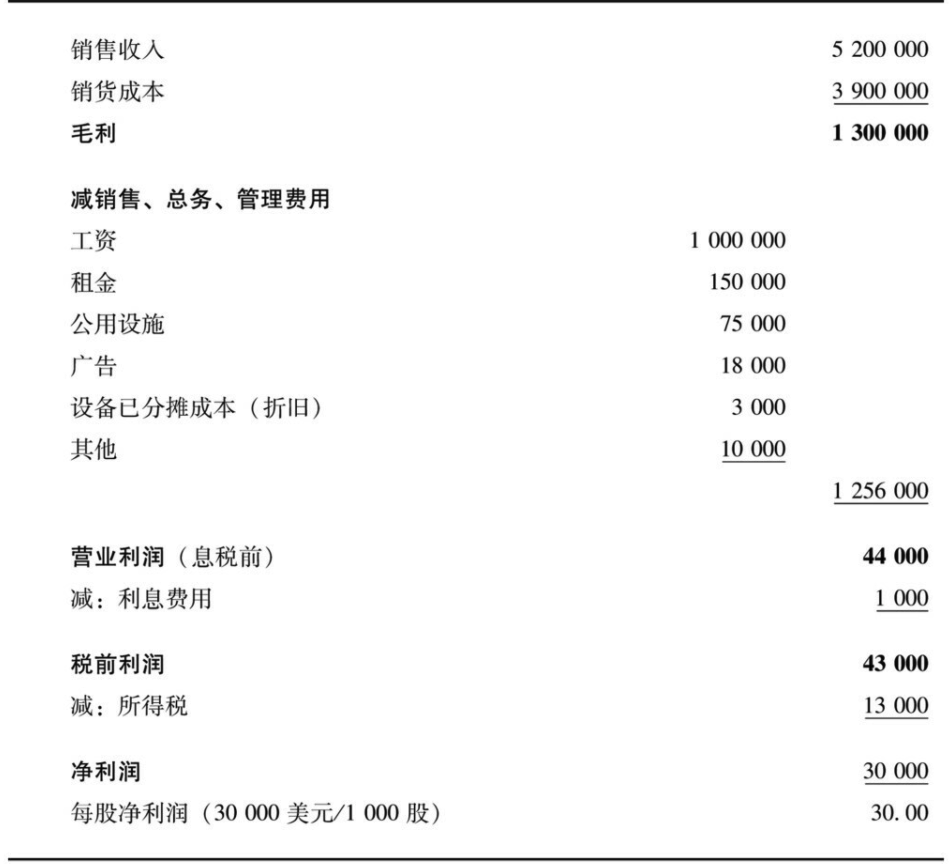

营业利润利润表中接下来列出的是公司的`营业利润(operating profit)`，即缴纳利息和税金之前的利润，称为`息税前利润(Earnings Before Interest andTaxes，简称EBIT)`。利润表中越往下走，扣减掉的成本也就越多。在衡量公司的营业利润时，公司所有的其他直接与收益有关的成本费用已全部被扣减掉。

权责发生制要求将固定资产的`已分摊成本(allocated cost of fixedassets)`，亦称为`折旧`或`摊销`，从收益中扣减掉。根据配比原则，公司生产产品的有关费用和这一阶段相应的收入匹配。会计师们将设备、工具、厂房和其他固定资产的成本除以各自的使用年限，以估计出公司在创造利润过程中使用这些资产的成本。

很多分析师计算公司盈利时，都用`息税折旧摊销前利润（EBITDA）`计算收入未扣减利息、税金、折旧和摊销成本前的金额。

`“其他费用”(other expenses)`是利润表中因项目过小，不足以单独列出的各项的总称。

得出营业利润之后，下面要扣减的是和生产无直接关系的各项成本，以计算利润。首先是本期内利息费用。所有者的红利是从利润表最下部分的`净利润(net income)`中扣除的。

将利息费用单独划出，营业利润就能充分反映出“经营”公司的成本，而不是“融资”的成本。

### 利润表日记账的记账方法
日记账的记账形式，和资产负债表中的记账形式是一样的。为了跟踪利润表，收入记在贷方（右边），支出记在借方（左边）。

利润表的日记账和资产负债表的日记账是相互关联的。销售收入意味着公司收到了某种有价值的东西，一种资产；换回了付出的其他价值，即费用（支出）。

表3.5 利润表日记账#1

科目名称 | （类型） | 借 | 贷 | 效果
-----|------|---|---|---
现金 | （资产）| 100 000 | - | 增加 
销售收入 | （利润表） | - | 100 000 | 增加

表3.6 利润表日记账#2

科目名称 | （类型） | 借 | 贷 | 效果
-----|------|---|---|---
销货成本 | （利润表） | 95 000 | - | 减少
库存 | （资产） | - | 95 000 | 减少

表3.7 利润表年终结账记录

科目名称 | （类型） | 借 | 贷 | 效果
-----|------|---|---|---
销售收入 | （利润表） | 100 000 | - | 调整
销货成本 | （利润表） | - | 95 000 | 调整
留存收益 | （资产负债表中所有者权益） | - |5 000 | 增加

### 现金流量表和资产负债表的联系
根据会计恒等式：

    A（资产）=L（负债）+OE（所有者权益）

资产和负债又都分别含有流动（短期）和非流动（长期）等项，等式可以扩展为：

    CA（流动资产）+NCA（非流动资产）=CL（流动负债）+NCL（非流动负债）+OE（所有者权益）

将流动资产项进一步细分，可得到如下的单个构成成分：

    现金+应收账款(AR)+库存(INV)+NCA=CL+NCL+OE

将现金单独列在等式的左边，则：

    现金=CL+NCL+OE-AR-INV-NCA

从此等式中可以看出，等式右边流动负债（CL）的增加，意味着左边现金的增加。

### 现金流量表用途
通过使用现金流量表，管理者可以通过下述3种业务活动来规划并管理现金来源和需求：

- 经营活动
- 投资活动
- 融资活动

找到现金在哪里发生变化是至关重要的。

- 公司看似盈利，但是否必须靠大量举债借款方能维持?
- 公司的业务是否大量占用现金，而在利润表上显示的利润却很少?

这是资产负债表和利润表都回答不出来，但又都是非常重要的问题，也是现金流量表之所以存在的必要的原因。

公司经营情况良好，公司的经营活动能带来现金收益。这在调整运营资本变化的净利润中反映出来，这是经营活动部分要表明的内容。

公司是否需要将大量的资金，投在诸如新设备或新技术之类的固定资产上?公司是否由于经营不断需求现金而被迫出售公司资产?这类问题在投资活动部分中能被反映出来。

## 财务报表的比率分析
比率主要有四大类：

- 衡量偿债能力：手里有多少东西可以变现用来偿债。
- 衡量资本结构：公司是否负债很重，公司筹措的资金来自投资者吗?公司如何筹措资金?
- 衡量经营活动：公司的资产安排、使用合理吗?(MBA们不仅会使用资产，还会安排它的使用。）
- 衡量获利能力：公司在资产、销售基础上的获利能力有多大?

### 流动比率

    流动比率=流动资产/流动负债

公司能轻松地还账吗?如果比率大于l，说明公司有偿债能力，有余力从流动资产中安排支付流动负债。

### 资本结构比率

    财务杠杆=(总负债+所有者权益)/所有者权益

当公司负担的债务高出所有者的投资时，我们就称其为`杠杆作用(leveraged)`。对获利的公司来说，较高的负债，因公式中分母较小，所以比率很大。同样的收益被较小的股本来除，大于2的比率说明公司负债较高。

    长期负债对资产比率=长期负债/(负债+所有者权益)

因为偿还债务是公司在给投资者分红之前必须完成的责任，所以公司债务的多少是衡量其风险程度的一个重要标准。该比率大于50％时，说明公司的负债高。取决于公司现金流的稳定情况和时间的不同，50％的比率被认为风险是相当高的。

### 经营比率

    资产利用率（也称资产周转率）=销售收入/总资产

该比率说明的是公司运用资产效率的高低。一个通过利用给定的资产挣出更多销售收入的公司，被认为是对资产的管理十分有效。不同行业有不同的适用比率。

    库存周转次数=销货成本/每期平均库存量
    库存销售天数=期末库存/(销售成本/365)

以上两个经营比率能说明公司库存安排使用的合理与否。

### 获利能力比率

    销售利润率（ROS）=净利润/销售收入

用它来计算资产负债表和利润表中每一部分的回报率。另一个常用到的比率是`资产报酬率(Return On Assets，简称ROA)`。

    净资产收益率（ROE）=净利润/所有者权益

负债和股本金之间不同比率的搭配，对比率的影响较大。如果公司的负债高，股本金少，那么净资产收益率就会受到很大的影响，人们称之为`财务杠杆(financial leverage)`。

净资产收益率是人们公认的用来衡量企业成功与否的标准。倘若公司管理层的目标是通过杠杆举债以获得更高的盈利，这就会伴随着风险成本。负债越高，公司需支付的利息负担也就越重，公司如果经营不好，就还不起债。

### 杜邦图表
`杜邦图表（Du Pont chart)`是通过展示各个比率的构成要素，说明财务报表中最重要的比率之间的相互关系，详见表3.9。

表3.9 杜邦图表

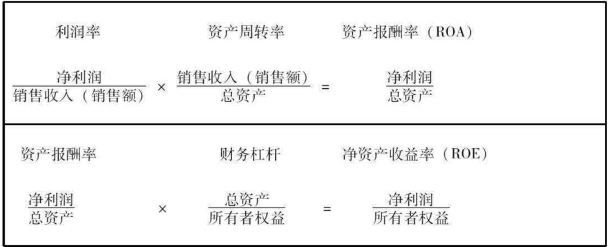

## 管理会计
`管理会计(managerial accounting)`和比率分析一样，是用会计数据分析和管理公司的经营状况。管理会计使用的工具并不是比率，而是通过制定`标准(standard)`、`预算(budget)`和`分析差异（variance)`的方法，经营管理公司，解释经营结果。

有两种基本的差异，即`价格差异(price variances)`和`数量差异(volume variances)`。

### 价格差异
价格差异有助于管理者了解预计销售收入与实际销售收入之间的差异，究竟有多少是由于销售价格的变化引起的。

    （实际销售价格-标准销售价格）×实际销售量=销售价格差异

### 数量差异
数量差异是假设产品在价格不变时，不同销售数量对总销售收入的影响。

    标准销售价格×（实际销售数量-标准销售数量）=销售数量差异

销售价格差异和销售数量差异，公司生产部门也用这种方法计算差异，以便于控制和管理。

采购和使用生产原料也有`采购价格差异(purchase pricevariance)`。

    采购价格差异=（标准价格-实际价格）×实际采购或使用量

生产产品所用的原材料和人力同标准数会有不同。和销售数量差异一样，这些差异被称为`有效性差异(efficiency variance)`。

    原材料或人工有效性差异=（标准使用量-实际使用量）×原材料或人工标准成本

## 成本会计和作业成本法
管理费用必须如实地和实际发生的出处挂钩，因此被称为`作业成本法(ABC)`。也就是说，管理费用要如实反映生产产品并将产品运送到用户手中所发生的管理方面的成本支出。

## 挑剔的会计信息使用者
会计师们瞒报收益的10种通常做法：
1. 将费用划拨为资产。世通公司将日常的成本采购当地电话接入服务篡改为网络建设投资。
2. 低估销售提成费用、折扣、减价额。低估这些费用，提高利润表象。
3. 低估赊账销售，造成坏账拨备。这种做法增加了利润表象。
4. 增加资产负债表外的债务责任。安然的特殊目的公司是资产负债表外的实体，公司2002年破产时，给公司带来几十亿的债务负担。
5. 录入不实收入。奎斯特（Qwest）通讯公司把未实现的、只有在采购其他通讯公司后才能出售的光线网络，高达11亿美元的虚假收入，记在公司利润项下。两笔业务根本未发生，但是两家公司均记做收入统计利润。
6. 过分拖延公司财产的折旧年限。维斯特废物处理公司（Waste Management）在1998年东窗事发，垃圾填埋场低报年折旧年限价值达35亿美元。
7. 篡改库存。公司低估需要注销的库存资产。低估这一部分可以提高利润表象。
8. 故意调整公司异常收入和损失。低估重组的费用成本、高估出售资产的收入，会计师们吹高利润。在某些特定情况下，这些内容划入会计科目的利润表项下，不影响经营利润。
9. 通过高估未来成本和利润，并通过今后的调整，新建特殊的留存收益。利润高时，高估成本少缴税。这种“饼干桶”式的自留地，有助于公司操纵并减少公司盈利的波动。公司一旦需要额外的利润，会计师们就会调低以前高估的成本，挤出利润来。
10. 根据高管业绩挂钩奖励机制要求，故意操纵业绩。取决于奖励的计算方法，高管可以和会计师勾结，操纵与个人收入有关的财务数据，掩盖自己的实际收入。

# 第4天组织行动
## 解决组织行为问题的模式
组织行为学提供了以下分3步解决组织机构方面问题的方法。

- 问题识别
- 分析
- 制订行动计划

### 问题识别
#### 事与愿违的距离
当管理人员所认为“应当”发生的情况与“实际”发生的情况之间存在着距离或“偏离”时，就出现了问题。要确定是什么问题，就必须从所有参与者的角度来分析形势，列出他们的`事与愿违的距离(want got gap)`。

#### 问题的层次
一旦你知道了存在着什么距离后，这时重要的是了解这些问题是如何影响组织的。问题对公司的影响有以下3个方面：

- 某些人之内或之间
- 某些群体之内或之间
- 整个组织内

#### 问题的根源和因果链
找到问题的根源图表方法是画一条因果链。用因果链来表示公司部门间的问题，如下所示：

    起因的问题→问题根源→经营问题
    缺乏相互影响：个性区别→缺乏对技术人员的尊重→项目失败

### 分析
除了画出因果链之外，在此分析阶段，你应努力去理解起因。

### 制订行动计划
这个行动计划包含6个重要步骤：

1. 制定具体目标。
2. 确定行动内容、所需资源和责任。
3. 制定一个行动时刻表。
4. 预测结果，制订应变方案。
5. 按照时间顺序(time sequence)制订详细的行动计划。
6. 以第一步制定的具体目标为基础，实施、监督执行并做出评估。

## 个人和组织层次的组织行为课题
### MBA心理学课程：APCFB模式
图4.1所示的APCFB模式的一些形式。该模式旨在解释连接外部事件和员工行为的认识过程。`假设(assumption)`影响人们的`知觉(perception)`，知觉影响人们的`结论(conclusion)`，结论又激起`情感(feeling)`，最后，情感驱动了经理们观察到的`行为(behavior)`。

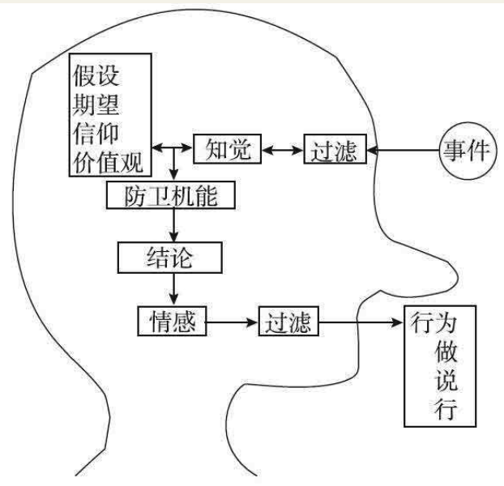

有机会影响人们的假设，即人们对客观世界的主观认识。这些假设构成了我们的价值体系。假设包含的内容按其可接近程度的顺序罗列如下：

- 期望(expectation)
- 信仰(belief)
- 价值观(value)

#### 激励的期望理论
`期望理论(expectancyvtheory)`列出了产生个人积极性的因素。

    激励=对工作绩效的期望×对工作绩效将获得奖励的期望×奖励的价值

三位学术大师，赫兹伯格(Hertzberg)、马斯洛(Maslow)和麦克莱兰(McClelland)认为，行为是由满足需求的欲望所激发的。

- 弗莱德·赫兹伯格断定，激励的强化，可以通过工作中激励因素或满意因素的最大化以及不满或维持因素的最小化来实现。升职或奖励可以是一种满意因素。维持因素不一定带来欢悦却是期望中的事。一个安全的工作地点和维持生计的工资就是典型的维持因素。
- 在阿伯拉翰·马斯洛眼里，激励员工的作用在于满足个人`不同层次的需求(hierarchy of need)`。这种需求层次呈金字塔形状，吃喝的需求在金字塔的底部，往上是安全感需求、归属感需求和地位需求，而实现`自我价值的需求(self-actualization need)`被认为是需求等级的尖顶。当一名员工在实现一个具有挑战性的目标后体验到个人成长和自我满足的感受时，他的需求便得到了满足。
- 大卫·麦克莱兰提出，人有三种基本需求：成就需求、权力需求和归属需求。

#### 工作岗位的设置
理解和影响雇员积极性的另一个方法，是研究工作岗位是如何设置的。每一项工作都有某些说明职责的核心工作内容，这些职责导致雇员重要的心理状态造成不同结果。结果是工作绩效的明显现象，而心理状态则隐藏在人们的心中。如果忽略了人的因素，那么质量和效率便会受影响。

MBA中描述这种员工欢悦的术语是`职业工作生活质量(Quality of Work Life，简称QWL)`。当雇员得到机会尽展才华时，MBA们称之为`授权(empowerment)`。

工作岗位设置的模式如图4.2所示。

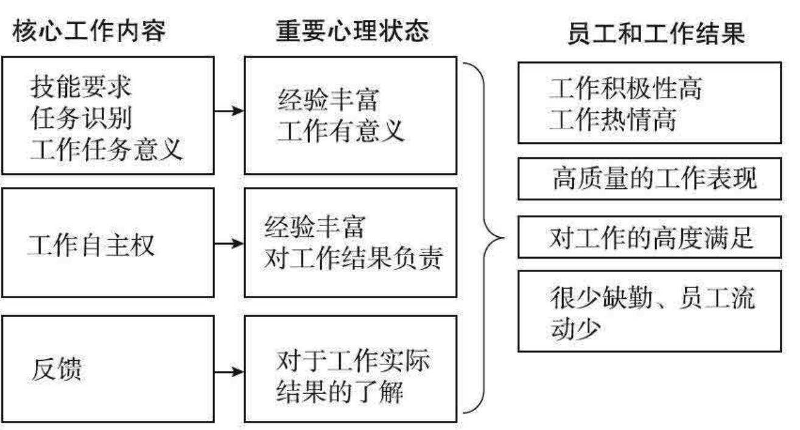

### 领导才能
#### 领导才能的VCM模式
领导者的个人形象有以下3个特征：

- 远见(vision)
- 承诺(commitment)
- 管理技能(management skill)

领导者表现出的这些素质的比例各不相同（见图4.3）

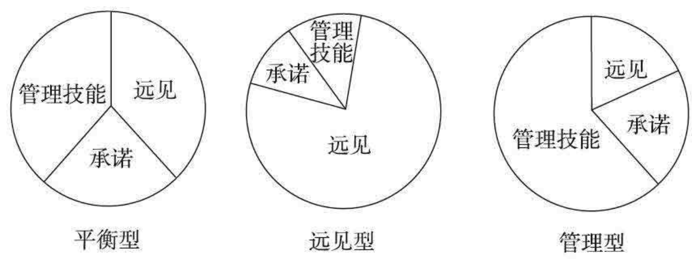

#### 领导风格
`领导风格(leadership patterns)`存在于`以老板为中心（boss-centered)`和`以下属为中心(subordinate-centered)`的范围里。

领导者采用哪种领导方法，是由以下3个基本力量决定的：

- 领导者的内在力量
- 下属的内在力量
- 形势的力量

### 企业家精神（entrepreneurship）
研究结果显示，企业家们具备下列几种特质：

- 沉着面对不确定性和处理混乱局面
- 相信命运掌握在自己手中
- 不屈不挠、意志顽强
- 不惧失败
- 善于抓住机遇

### A型和B型行为(type A and B behaviors)
`A型行为`最初是由两位心脏病专家梅尔·弗德曼（Meyer Friedman）和雷·罗斯曼（Ray Roseman）于1959年发现的。他们发现，患有严重冠心病的病人经常有以下特征：

- 获取成就的竞争需求
- 时间紧迫感
- 咄咄逼人
- 对他人和世界怀有不满

近利和缺乏耐心。A型人总是试图同时做好几件事情。每日时间安排效率手册，正是为这类人设计的。A型人对生活经常不满意，表现出一种毫无目的的敌意。他们以外在的成就来评价自我价值。

类型行为范畴的另一端是`B型人`。B型人享受生活，过得比较轻松。

### 积极倾听

