    作者: 仇勇 
    出版社: 电子工业出版社
    副标题: 算法时代的媒介、公关与传播
    出版年: 2018-2-1
    页数: 296
    定价: 65.00元
    装帧: 精装
    ISBN: 9787121333415

[豆瓣链接](https://book.douban.com/subject/30120980/)

## 第一章 别了，古典媒体
### 古典的，古典媒体
在我看来，主要是以下三个假设前提发生了根本性变化，导致原来的生产方式已不能适应——

**第一，受众的阅读行为：从慢读模式到速读模式。** 现在，受众的时间是碎片化的，状态是移动的，阅读行为也从Read到Look，慢读变成速读。

**第二，从“受众是一无所知的”到“受众是无所不知的”。** 前提就是，假设读者对世界一无所知。但今天已完全不同，读者已能从微博、APP、网站等渠道了解世界发生了什么，他（她）更需要知道的是为什么。

**第三个假设前提的变化：从“消息来源”是重要的，到“在哪里最方便读到”是重要的。**

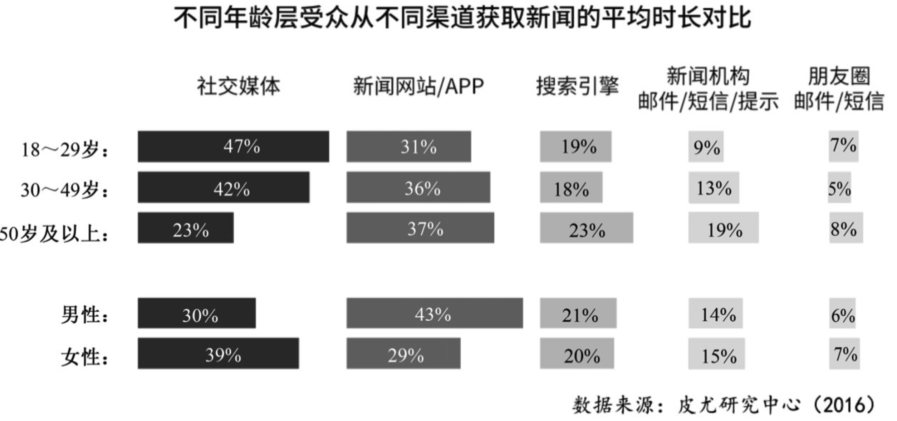

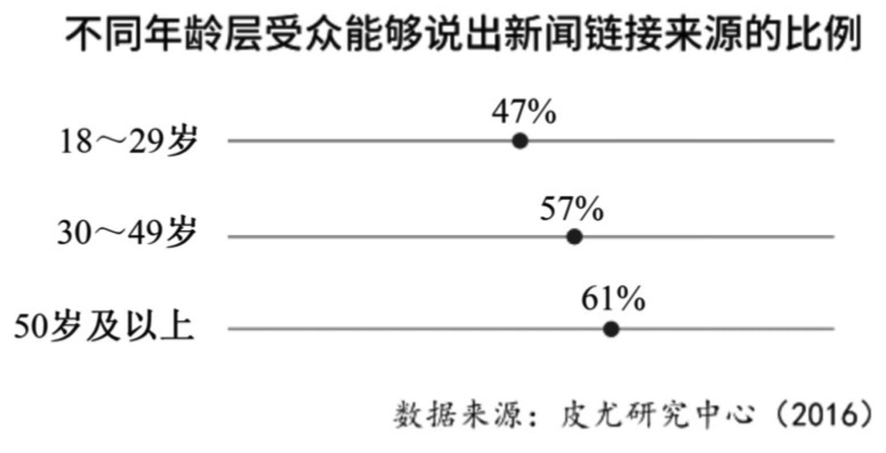

### 虚假的生产链
**1.记者假装给主编写稿，主编假装给记者发稿费**

通常在选题会上，记者就需要用一两句非常简短直中要害的话，推销自己所提报的选题，那也往往是要给读者的最关键的信息。选题通过后，记者会花很长时间去采访、整理录音、写作，编辑进行修改，排版，付印……最终印到平面媒体上时，其实最想告诉读者的，仍然是最初在选题会上记者所提报的那一两句话。但是，在古典媒体时代，是要按印刷在纸上的实际字数给记者付稿酬，假装这一切都对读者有价值。

实际上呢？记者是在哄主编，主编是在为记者为此稿付出的辛苦定稿酬，实际写出来的报道是不是“垃圾”，是读者根本不关心的内容。因为，我们根本不知道读者是谁，我们在假想他们的身份，他们的口味，他们的阅读偏好，然后把自以为重要的内容制作出来，硬塞给他们。而在此中，我们根本不把自己当成读者。

古典媒体，是典型的以生产者为中心的操作模式，而市场的惩戒通常又来得太晚。

**2.从B2C到B2B2C**

古典媒体之所以有注意力经济的价值，因为它是将信息送达读者的渠道之一，这对广告商来说是重要的。但在互联网兴起后，先是新闻聚合类网站（如新浪网）在原来的B2C之间硬插进了一个新的B，而后是移动互联网上的种种新传播媒介也开始横插一脚，传统媒体一旦被Inside进别的终端，**其与读者的联系和粘性就被切断了**，广告商当然会把预算投向直接跟C打交道的B。

**3.影响力的转换：“空心化现象”**

古典媒体形成影响力的方式就是两点：内容+包装。但信息载体的改变，让原来的包装手段失效，需要重新学习了。如果不能把影响力从古典媒体时代转化到移动互联网时代，那就会出现“空心化现象”，简言之，就是所谓的主流媒体不再影响主流人群。

### 在线时代，新闻的新定义
只有当新闻找到你，新闻才是“新闻”。

在此，我想大胆给出一个“唯心主义”的新闻的定义——**在线时代，新闻是你看到的、与你相关的被传播的事实的呈现。**

在信息之上，新闻又是什么？

如波兹曼所说：“真理不能，也从来没有毫无修饰地存在。它必须穿着某种合适的外衣出现，否则就可能得不到承认，这也正说明了‘真理’是一种文化偏见。”新闻更不能。**它不仅反映了撰述者的一种主观认知，更要考虑到接收者对此的主观理解——两个人的数据组合方式就像世界上的两片叶子，没有相同的。**

我们怎样认识世界，我们就怎样得到新闻。

一条信息是不是新闻，也不应该由撰述者所决定，而应该由接收者所认定。

所以，第二个关键定语是“与你相关”。

新闻是从什么时候开始变得不那么“与你相关”的呢？尼尔·波兹曼认为是电报的发明。S.F.B.莫尔斯于1844年成功发出了第一份电报。自此之后，信息超越了地理的限制，实现远距离通信，波兹曼认为电报摧毁了新闻原有的含义，“把信息变成了一种商品，一种可以置用处或意义于不顾而进行买卖的东西”。它降低了**信息—行动比**，也就是根据获得的多少信息以决定采取何种行动的比例。电报技术迅速被新闻业嗅上并使用，报纸上开如逐渐塞满与本地居民无关的来自遥远世界的所谓新闻。

波兹曼认为，电报带给受众的是支离破碎的时间和被割裂的注意力，其主要力量来自它传播信息的能力，而不是收集信息、解释信息或分析信息——如果把这句话中的“电报”一词换成“网络”，大家感受一下……

这一认识的重要性在于，我认为，互联网可以重新让新闻变得与每个人相关——回到那个口口相传的村庄时代。这就是下一代新闻：**匹配比供给重要**。

第三个关键定语是“被传播的”。

事实能成为新闻，一定是包含了传播主体、传播媒介和接收客体的共同参与，并由接收客体按与己相关性所定义。

由此，传统新闻的定义标准中所指的时效性、重要性、显著性、接近性和趣味性已变质。现在，构成在线时代新闻的五要素则是：

- 即视性——超越和替代了“时效性”。在线时代，1 分钟前都是过去。界定所谓“新近发生”已无意义，一个月前发生的事情，如果你在这一秒看到，对你来说，就是新闻。
- 连接度——重要性、显著性这些古典媒体时代奉为圭臬的新闻要素已不适用。在线时代的新闻，不仅意味着地理上的“接近性”，而且还要求兴趣上的接近性，要比“接近性”更“接近”才行。也就是，与受众的连接强度如何，由受众根据与己相关的程度来判断是否是新闻，否则只是信息。
- 不完整性——在线时代，所有的信息都因为超链接而存在于一个信息网络中，标题、文章、图像都不再是孤立的，哪怕是再长的一篇文章都不会是理论上的完整的，对吗？它需要链接，汇入信息的流动中。
- 戏剧性——它比“趣味性”更能浓缩当下这个数字世界里对新闻的欲望。娱乐八卦新闻之所以能够抢夺注意力，是因为明星出轨、吸毒、在红毯上摔倒的消息有了故事的戏剧化成分。
- 真实性——这一古典媒体时代对新闻的要求，仍然在在线时代适用。

### 古典媒体的破产
媒体行业有着高昂的固定生产成本和低廉的边际发行成本，生产第一份拷贝是相当昂贵的，需要大量员工和基础设施；而生产第二份拷贝则只需花费一点零碎小钱。就此而言，媒体和自来水、电话、电力这些“自然垄断”的公用事业一样，有着相似的成本结构。

而每一份拷贝之所以有价值并能够获得市场定价，是因为其能够发行到一个信息不对称的相对密闭空间里。空间的分割和阻隔使得媒体能够保持多样性并建立生意模式。

### 第一章思维导图
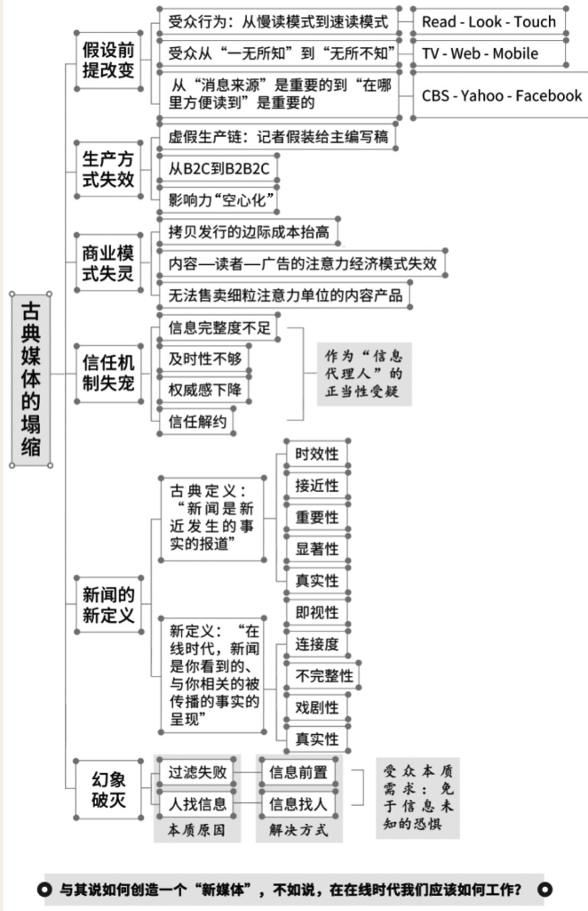

## 第二章 重塑内容
### 无用之用与有用之用
无用之用并非是说这些内容一定是垃圾，而是对受众而言，它们并不具有当下的必读性。

与之相对的是有用之用的信息，它能够免除受众对某一类未知信息的恐慌，因为它会影响决策，影响商业收益，甚至关乎健康生死。比如，股票涨跌之于股市投资者，金融信息之于金融从业者，交通流量管制的信息之于出行者，医疗资讯之于患者。

就新闻这一信息类型而言，我们来详细对比一下无用之用和有用之用的不同：

- 写法——“有用之用”最好采用的是第一人称讲述方式，即“我”在现场，“我”看到、听或“我”体验试用的一切；“无用之用”则通常是第三人称的报道方式，其间经过了采访、编辑和加工，信息不可避免地出现衰减和扭曲。
- 送达方式——“有用之用”是分享，自然地加入到受众阅读的信息流中。“无用之用”是推送，讲究定时发布，采用的是广播模式。
- 观点——“有用之用”基本没有主编意识，并非一定要通过描述事实推销一个观点；“无用之用”则有强烈的媒体立场和观点，希望影响受众的判断。
- 时间性——“有用之用”提供的是及时的深度。一个事件发生后的传播热度类似于珠穆朗玛峰，一开始是短促的陡峭的北坡，经历最顶峰后，则是舒缓的南坡。“有用之用”要提供在一定时间内热度上升直到顶峰阶段的深度文章，进入南坡后，价值将衰减。而“无用之用”的文章则与时间线弱相关，什么时候阅读都可以。
- 素材——“有用之用”新闻的写作者因为是亲历者，所以提供的是基于自身经验的故事和观点；“无用之用”的写作者则是旁观者，潜意识地选择利于佐证自己观点的事实进行报道，提供的是一己的主观判断。
- 影响力——由于写作者讲述的是“我”的故事，所以“有用之用”的新闻易于引发共鸣，唤醒互动；而古典媒体所制造的“无用之用”新闻几乎只能投射给沉默的读者，通常只有同行、被采访对象本人和其利益相关者感兴趣。

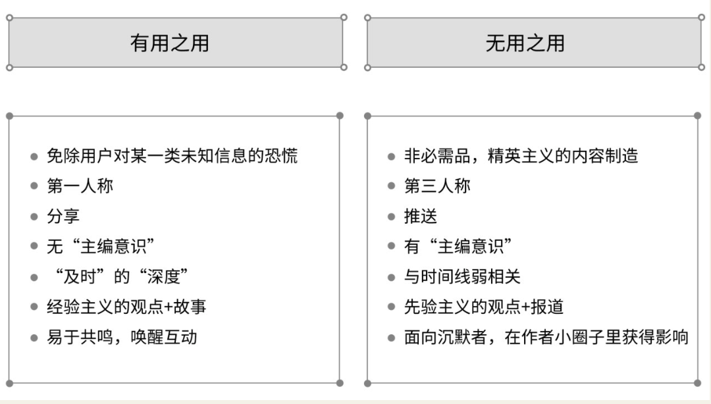

一句话，是否能够帮助我们做出当下更好的各种人生选择，是区分“有用之用”和“无用之用”信息的主要判断标准。

大部分的书籍其实都是“无用之用”。不好意思，本书也是。

### 新文体，新叙事
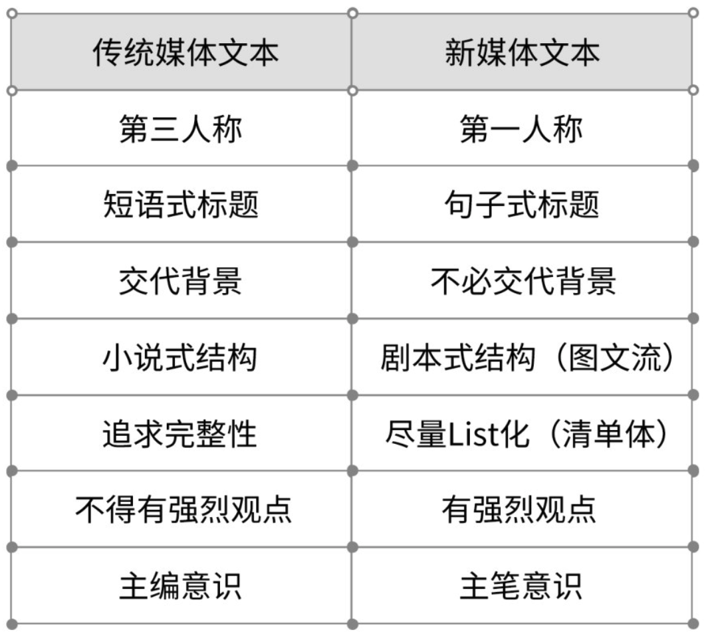

### 购买体验，而不仅是内容
>用户不会为你讲了一个好故事而付费；

>用户却会为你讲好了一个故事而付费。

这其中的关键原因就是，受众购买的其实是体验，而不仅是内容。

### 数字内容消费的四个因素
尼克·比尔顿（Nick Bilton）在其《翻转世界》一书中认为，价格、质量、及时性和体验，将影响消费者购买数字内容——文字、音乐、视频、互动游戏等的行为：

1. 人们将为与信息内容有关的某些体验付费，但不会只为了信息内容付费。但人们会付费。
1. 人们将为品质付费，无论是高级的图案、美观的设计还是优美的语言。
1. 人们将为及时性付费，如果它们是值得率先体验的东西——而且它们可以立刻买得到。
1. 人们将支付与体验感受相称的价钱。当价格上涨到某个价位时，销售额会下降。人们对付出多少是有限制的，虽然这个数目可能低于卖家的预期。不过，愿意支付的价格底线确实存在。

凯文·凯利（Kevin Kelly）在其《必然》一书中，把比免费更好的愿意付钱的特性称为原生性（Generative）。原生价值必须是在交易时产生的特性或品质。他列举了8个特征：

1. 即时性：消费者将愿意为率先得到的即使过后不久就免费的东西付费。这包括使用测试版本的权限。
1. 个性化：要求的是创造者与消费者、艺术家与粉丝、生产者与用户之间的不断对话。它是一种典型的原生性，因为它可以交互，是一种对时间的消费。
1. 解释性：你可以免费得到一样东西，但如何使用它或者更好地使用它，则需要付费。比如旅游和医疗保健产业都适用于此。
1. 可靠性：艺术家可以通过在复制品上留下自己的印记，比方说签名来提升复制品的价格。数字水印等签名技术并不能用作对副本的保护，但可以用来创造原生性，向那些在乎的人提供可靠感。
1. 获取权：你花钱购买的不是这些东西，而是简单获取的便利，以及不用再去维护的义务。
1. 实体化：音乐是免费的，但演唱会的门票是昂贵的；书籍是免费的，但与作者亲身交谈是不可多得的特权。
1. 可赞助：通过类似“众筹”或“打赏”的方式，支持喜爱的作者和作品。
1. 可寻性：千万事物似乎唾手可得，但有人为你提供的推荐、清单服务则值得付费。

### 第二章思维导图
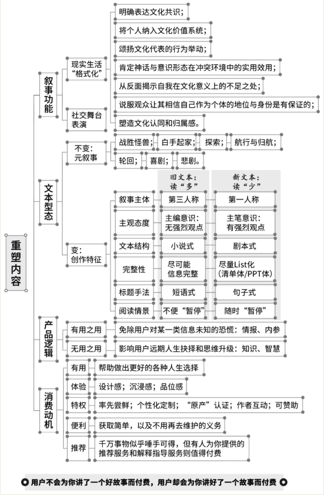

## 第三章 你好，自媒体
### 你们全家都是自媒体
“自媒体”（We media）这一概念源于硅谷著名的IT专栏作家丹·吉尔莫（Dan Gillnor）。吉尔莫于2001年9月28日在其博客上提出“新闻媒介3.0”（Journalism 3.0）的想法：新闻媒介1.0为传统媒体或旧媒体（Old media），新闻媒介2.0为新媒体或者叫跨媒体（New media），新闻媒介3.0就是以博客为趋势的“自媒体”。2002年3月，吉尔莫将他的“新闻媒介3.0”进一步称为“新闻业的下一波”（Journalism's Next Wave）。

### 意见领袖幻象和内容创业热潮
从商业化方向来看，基本呈现以下四种模式。

**第一个模式是高级软文（Advertorial）**。在古典媒体时代，软文是广告和新闻煮出来的夹生饭——披着新闻的外衣以传递企业的商业信息。之所以它不受待见，是因为大部分软文的内容制作质量低下，只是通过购买媒体版面和时段来获得曝光。

在新媒体时代，它有了一个新名字叫原生广告。而且有趣的是，在社交媒体平台上，读者正在掀起一股热爱读软文、热爱看广告的新趣味风潮。比如微信公众号“假装在纽约”“胡辛束”“六神磊磊读金庸”“王左中右”等，“软文”构思巧妙，很多文章读到最后才发现其实是一个长篇广告——俗称“神转折”，但仍有很多读者会在文末留言表达喜爱之意，甚至有时发现今天推送的文章不是广告，还会有很多人表示“失望”。

好的广告仍然是这个时代的最高审美体现之一，我几乎没有听到有人抱怨过苹果的广告有多么讨厌。对广告商来说，这是如何在新媒体上机智地做广告的一种方式，聪明的金主明白，它购买的并不只是渠道，订阅人数、阅读数只是合作的附加价值，而是优秀自媒体的高级软文制作能力。因为他们的文章赋予了品牌一种新的调性，一种新的可以被粉丝们所能够接纳、热爱、找到连接的一种方式，并让品牌故事产生一种趣味感。

这为一部分自媒体人创业带来了商业机会。纯以流量吸引硬广告是古典媒体的老套路，它带来的恶果就是让流量成为毒品，你将一次次屈服于阅读量压力，并导致在2016年9月29日微信号刷量丑闻曝光风波中，成为市场上的裸泳者。

只要你能够成为一个极细分领域的意见领袖，并且拥有所谓的高级软文制作能力，聪明的广告商一定会找到你，并希望通过你连接到它的潜在用户。该方向的案例有“胡辛束”“王左中右”“新世相”，等等。

**第二个模式是故事化电商**。仍是从高级的内容制作能力入手，获得较高的电商转化率。就像“开始众筹”和“一条”已经初具规模的那样。不仅如此，未来的电商新物种想卖东西，也必须是从一个好故事开始。

**第三个模式是情报/励志/情感+社群**。从内容角度来说，一般性的公共新闻、消息型快讯将来一定会走向机器化写作以及免费供给。如“付费阅读”或者“打赏”这样的变现方式一定不可持续。

要让优质内容成为获取用户的相对低成本的入口，从而建立从社群再到交易的正循环，并有利于探索培训、咨询、电商等方向的变现可能。“餐饮老板内参”是“情报+社群”的代表，“十点读书”“灵魂有香气”“樊登读书会”是励志/情感类内容+社群的例子。

**第四个模式是IP化**。比如非虚构故事类，把高质量内容和大文娱产业挂钩，让好故事能够改编为电影、电视剧、游戏等，由此获得高回报收益。在这方面，在虚构内容领域已经诞生了数个百万稿酬的写作者了，如南派三叔、猫腻等。

试图从内容入手来创业，简单来说需要三种能力：

第一，是否有优质的制作能力。

第二，是否有获取精准用户的能力。

第三，能否走到交易环节，要看你是否具有品鉴事物的审美能力。

但就以上模式而言，基本上仍是古典媒体时代种种旧商业模式的翻版。

### 你们都不是好的自媒体平台
那么，到底如何搭建一个良性的自媒体内容生产和分发平台？

我们从如下几个基本点判断出发来讨论：

1. 是否能激发出更多新的内容创作者的涌现？（用户）
1. 是否能让优秀的真正高质量的内容冒出？（分发）
1. 是否能让自媒体人有尊严地获得创作回报？（机制）
1. 是否能让自媒体人将之作为创业的最低成本的起点？（孵化）

我们来想象一下，一个最酷的自媒体平台，应该是什么样子的。

1. 其用户机制，应该能让更多新的内容创作者涌现。
1. 依赖流量分配想让高质量内容冒出并不合理。这需要依据新的算法，以人群推荐的信息前置法而非页面头条式的编辑推荐。
1. 补贴和广告分成并不能让内容创作者获得有尊严的回报，那只是传统媒体都熟悉的稿费和流量广告模式。真正的有尊严是创作完全与金钱无关，即读者回报创作者的方式一定不是打赏那么直接。
1. 因为当下的自媒体平台只掠夺内容，提供的回报方式只是补贴和广告，所以，所谓自媒体创业和古典媒体时期创办一本自任主编的杂志无异，仍然是连接不到读者，形成不了社群，很难探索其他商业变现方式。补贴和打赏养活不了自己，一旦创作更新枯竭，迅即被平台和读者忘却。

好的平台，一定是能够让有志于内容创业的人在此进行最小成本的实验，并找到第一批种子用户。

也因为，当下的自媒体人还没有跳出下列意识陷阱：

1. 垃圾流量没意义。不久我们就会意识到，阅读数、点赞数都是浮云。
1. 广告模式一定不能持久。包括企业公关赞助费。
1. 纯口水的快评只是逞口舌之快，还是浮云。
1. 内容不是生意本身，而只是过滤人群的入口罢了。
其实核心观点就是下面这一句话，就像微信公众平台做到的那样：

工具越傻瓜，内容越聪明。

### 李普曼和杜威的争论
李普曼认为，事实真相本身的复杂性和渠道的复杂性影响了公众对其的认知；其次，公众不仅依赖成见对信息进行取舍，他们也依赖成见对信息进行解读。“多数情况下我们并不是先理解后定义，而是先定义后理解。”李普曼的分析是围绕这样一个核心来展开的：因为个人无法获知外部世界的真相，因此不可能做出理性的判断和理性地参与政治行动，公共舆论的形成过程是一个非常复杂的过程，在这个过程中，外部世界变得面目全非，到那时，公众的判断就不是那么可信了。

李普曼进一步推论，新闻业的运作体制和新闻本身的性质决定了新闻界在改善公众对外部环境的认知上能够起的作用是微弱的。从新闻业的运作体制看，为了生存，新闻业更需要迎合读者，而迎合读者在某种程度上就是迎合读者的成见并强化这些成见。从新闻本身的性质来说，新闻并非是真相，在新闻在新闻的采集和发布中存在着各种标准和程序，这些标准和程序决定了新闻不可能成为社会的监视器。

杜威希望媒体的作用在于想尽办法让公众成为新闻的参与者，成为议题发起和交流的平台，告诉记者应该报道什么。

### 第三章思维导图
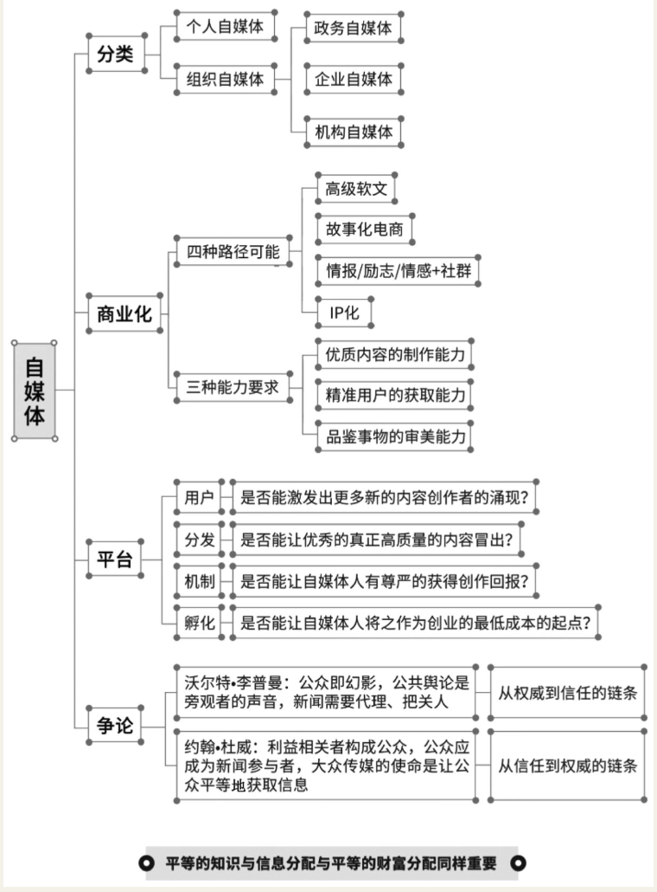

## 第四章 真正的新媒体
### 重新理解媒介
意识到内容与载体的可分离，其意义将是革命性的。

首先，将转变媒体的核心任务意识：古典媒体也好，新兴在线媒体也好，不再是为单一媒体端口生产内容，而是为媒体品牌生产魅力。

其次，所谓编辑部可一分为二，实现升级版的“采编分离”。内容生产汇聚为云，编辑转型为各媒体端口的产品经理，负责将初加工的内容改造为适合于该端口的内容形态——可能是一条微博，可能是一条视频，可能是一段声音，可能是一个互动图表，然后发布。由此，实现从内容到新闻产品的转化。

再次，内容将更容易与新载体进行融合。每种新载体将有不同的质量控制和效果测评方式，以更真实、直观地反映内容的价值。在媒体机构内部，所有的新端口是平等的。

### 一云多媒≠中央厨房
一个例子是“澎湃新闻”。在正式的新闻客户端推出之前，其团队已经分子化，推出不同的微信公众号，直接测试其内容影响力并锻炼团队。最终，受读者欢迎的微信公众号汇集成新闻客户端的各个栏目。“澎湃新闻”所属的微信公众号达50个之多，媒体作为“出品方”隐身其后。

### 区分新旧媒体的三个标准
区分媒体新与旧的三个判断标准是：

- 是否存在主编意志；
- 是否信奉内容视角；
- 是否依赖广告模式。

它反映了古典媒体和新媒体真正的不同：古典媒体侍奉的主人是内容——从生产、分发到回报，所以高喊“内容为王”；新媒体切换的是用户视角，以用户的需求来供给和匹配内容。

### 第四章思维导图
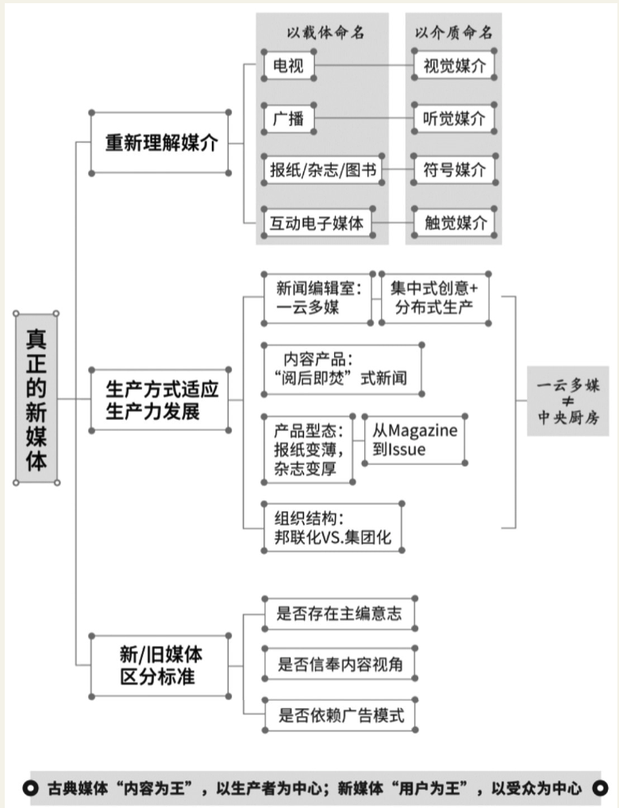

## 第五章 （传统）公关之死
### 危机公关管理罗盘
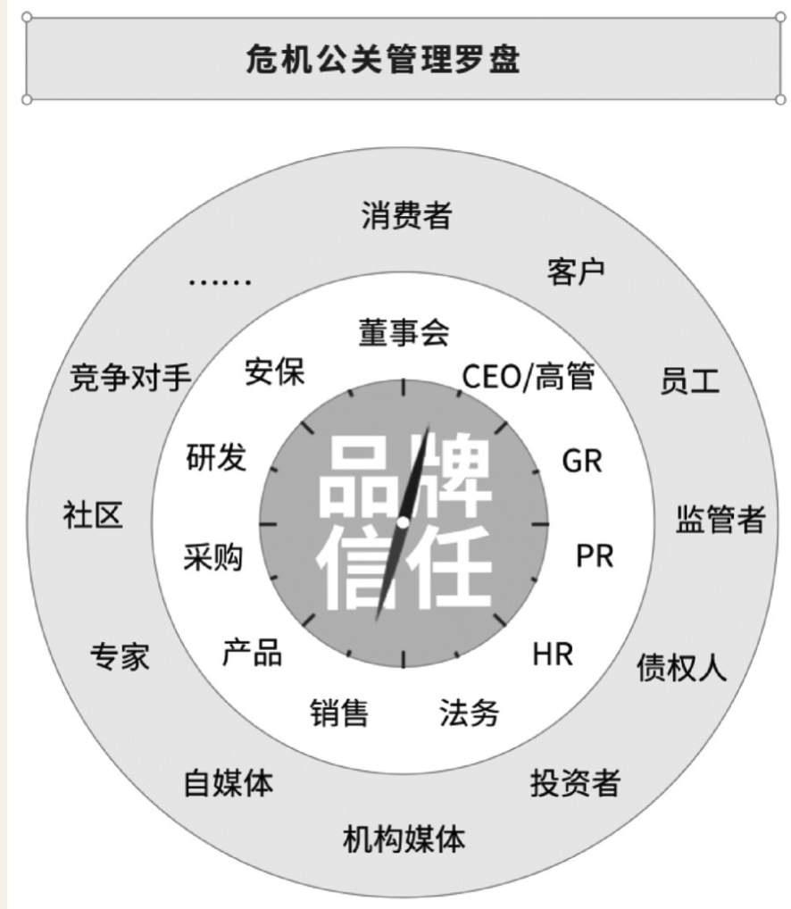

在此，我提供一个“危机公关管理罗盘”，以供企业公关人员在危机发生时使用。

1. 双螺旋工作结构：损害控制+寻找同盟。危机爆发时，一方面要忙于查证“火源”和“火情”，掌握所有事实，评估损失和做损害控制；另一方面，别忘了要尽可能多地寻找同盟，建立谅解、支持的统一阵线，让“朋友圈”在此紧要关头为你发声。
1. 危机不仅会来自外部，也会产生于内圈；同样地，同盟不仅意味着内部多部门联动协作，也要积极寻找外部支持者。
1. 寻找同盟意味着，即使是那些尚未对危机事件表态的攸关方，也要主动沟通，说明情况、寻求谅解和支持，使之从中立群体转化为顺意群体，或者至少保持中立而不会转为逆意群体。比如某自媒体发出负面评论，应积极与机构媒体保持顺畅沟通，使之不跟进报道或者帮助企业发声。
1. 先处理次要关系，后解决主要矛盾。对于危机来源的主要群体，短时间的沟通难以找到和解之道，应先争取次要群体的理解，扩大同盟，并保证公司经营的其他方面不受影响。比如财报出现亏损，受影响最大的是投资者，可先制定预案对用户、经销商、供应商等进行沟通，以稳定市场。

### 第五章思维导图

**传统公关强调"控制"，社交传播更看重能否"失控"。**

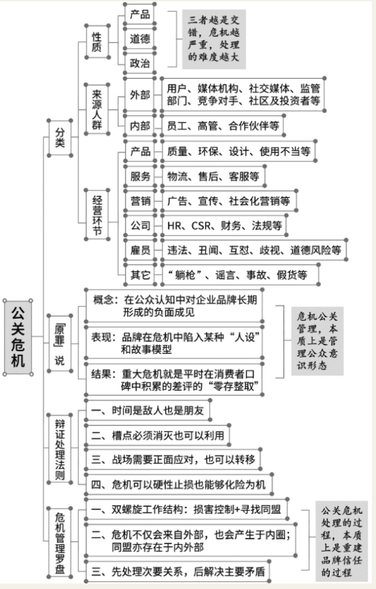

## 第六章 企业自媒体
### 企业自媒体运营效果评价模拟表
（以微信公众号为例）

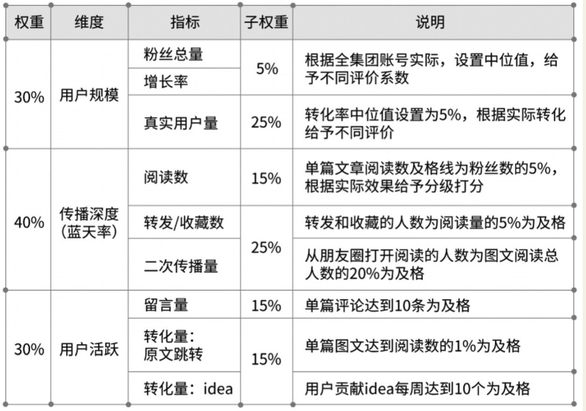

### 第六章思维导图
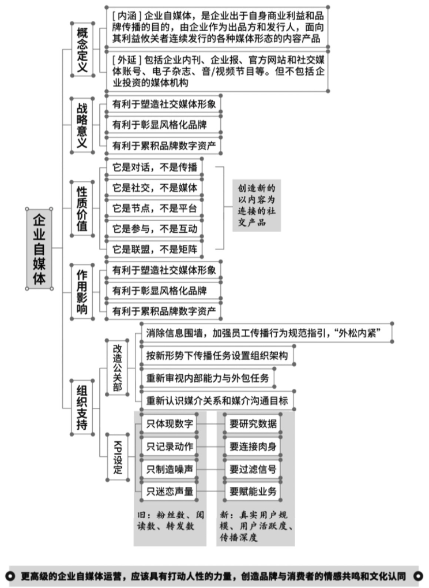

## 第七章 社交传播
### 数字化测量与数字品牌价值
在此，我提出计算品牌在社交媒体时代数字价值的三大维度。

- 传播度（Activeness）——衡量信息扩散效率的指标，子指标项包括阅读数、转发数、评论数等，设为A；
- 参与度（Engagement）——衡量受众卷入程度的指标，设为E，子指标项包括人次、身份特征以及参与行为深度等；
- 好感度（Favorability）——衡量受众情感倾向的指标，设为F，如推荐、好感、中性、差评、反感等。

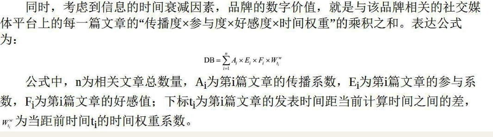

我们设置一个新的计量单位来衡量数字品牌价值的大小，这就是DB（Digital Brand）。

有了DB值的计算公式，终于可以让一个企业传播和营销人员都能把熟悉的概念落到实处了，这就是心智占有率（Mindshare）。它与市场占有率（Marketshare）相对应，用以比喻品牌在消费者头脑中所形成的知名度和美誉度大小。

### 第七章思维导图
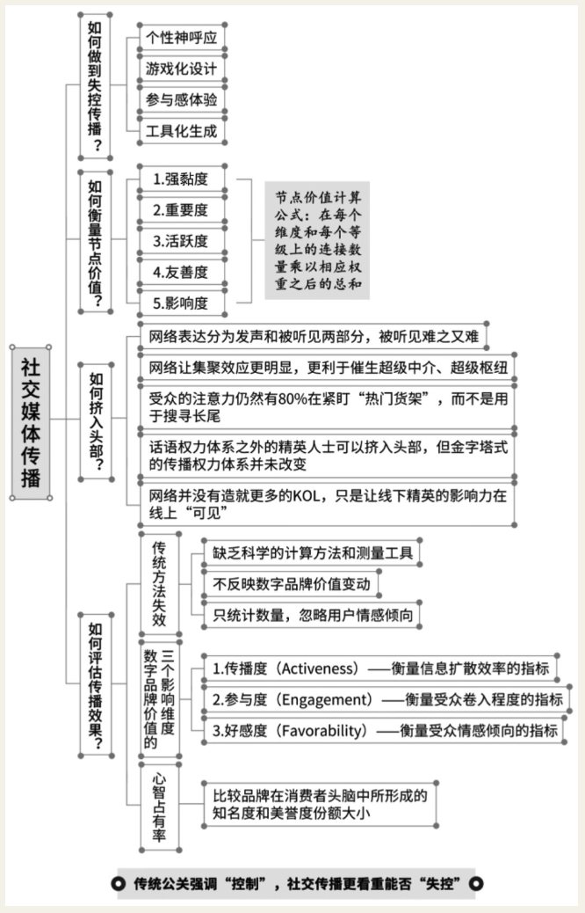

## 第八章 公众与族群
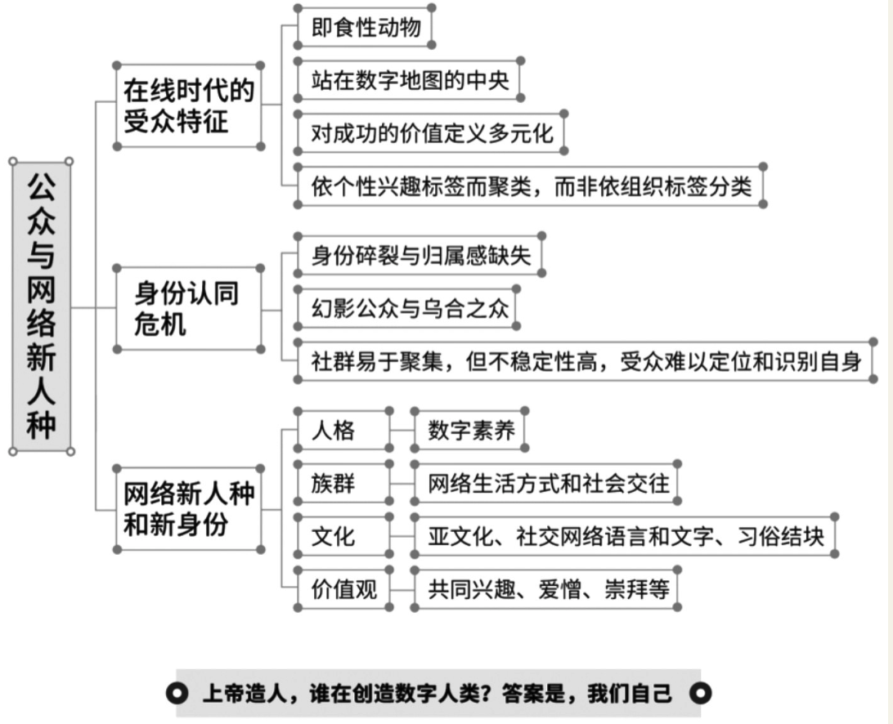

## 第九章 社群经济真伪
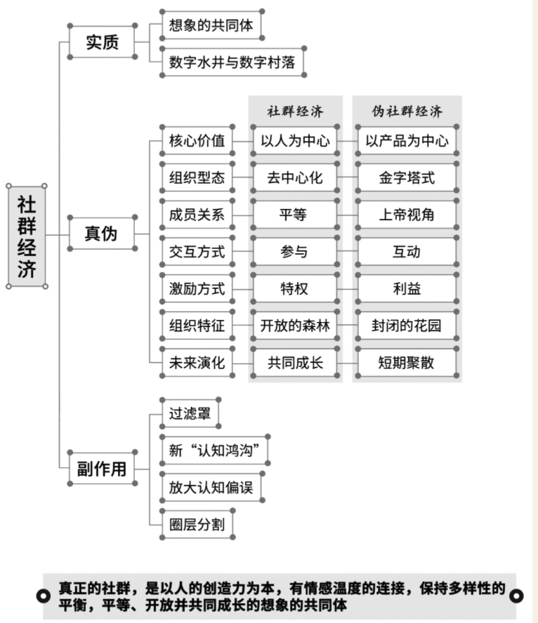

## 第十章 大数据、AI与内容产业的未来
Narrative Science就邀请各个专业记者根据各自领域的报道逻辑为其量身定做各种叙事模板（这些记者又称 **“元作者”**），如一项体育赛事的报道角度可能是“拉锯战”、“英雄式个人表演”、“强大的团队合作”或者“咸鱼翻身”等。算法还会按照重要性对各种可能的角度进行排序，并由此形成文章的整体结构。

Narrative Science 联合创始人、西北大学计算机科学家克里斯蒂安·哈蒙德（Kristian Hammond）相信，到2030年，90%的新闻都可以由机器人撰写。

### 新媒体革命的三个代际
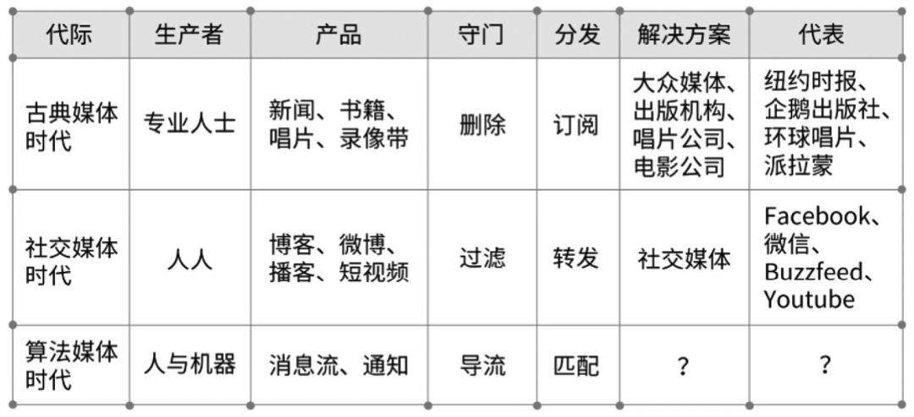

只有可检索，信息才能被重新组织，而组织的方式，就是指数型增长的丰富链接。

这就是我对于算法时代媒体型态一种想象：下一代媒体，是匹配。

**它所基于的第一项基本原则是，信息不分贵贱，信息是生而平等的**。不存在绝对的高价值信息和垃圾信息，只有相对于信息接收者而言，所谓的有用信息或无用噪声。你之所谓蜜糖，是他人之砒霜。匹配，是关于时间、地点、接收者等一系列限制性条件的匹配，最终让所有信息都能够产生价值。

**第二项基本原则是，信息匹配的最终目的仍是服务于人，是以人的尺度而非机器的尺度来重建新秩序。**

**第三项基本原则是，信息若想匹配得精准，需要向最终服务对象也就是人索取信息。**

互联网对古典媒体时期最重要的颠覆性影响是对守门人角色的排除。守门（Gatekeeping）这一概念由社会学家库尔特·勒温（Kurt Lewin）在1947年提出：社会的表达渠道通常拥有许多关键点，守门人在那里滤除一些事项而同时允许另外一些事项通过。这一理论最初运用于食品供应，勒温指出它在解释信息流程方面也特别有用。

作为守门人的主编、记者失业了，但门并没有被拆除，它换上了新装，有了别的名字，比如搜索引擎、门户网站、社交网络枢纽以及人工智能算法。

古典媒体时代的守门是删除，由媒体精英决定受众能看到什么、应该看到什么；

社交媒体时代的守门是过滤，不管是通过社交关系还是兴趣推荐，都是通过某种排序机制决定了某些信息更具有优先性；

算法媒体时代的守门是导流，更像是交通警察，让每条信息都到达它该去的地方，更快速、无障碍地流淌。

### 鉴赏力永在
内容意见领袖未来的更准确身份是：策展人。

不管今天我们是用自媒体人、达人、KOL、Influencer 称呼他们，未来，这些擅长创作、活跃于社群中、在某一领域中精明作出选择推荐的人，都有一个共同的更准确称谓：策展人（Curator）。一般的大众热门商品依靠民主投票即可实现（比如豆瓣、大众点评机制），而策展人拥有的是在潮流之前发现好东西的能力，这就是推荐的价值。他们是注意力的分发枢纽、数字世界的导购员。算法能够告诉你的是你应该感兴趣的东西，但策展人告诉你的是你不知道自己会感兴趣的东西。

内容意见领袖的第二个身份标签是，手工艺匠人。

当有关结构化、规训后的信息、知识越来越多地交由机器去生产、储存和传播，人将做人更擅长做的事：创意。也就是难以用规律、逻辑去归纳总结的创作之道。未来的内容生产者越来越像是“复古”为传统的手工艺匠人。

而其间最大的不同是，“匠人们”不再是孤立的或者是闭塞的、区域性的，借助网络的力量，他们将第一次真正实现自由人的自由联合。

媒体的未来最大价值，就是能够清楚地说出，你所代表的受众到底是什么样的一群人，并认识他们每一个人。

### 第十章思维导图
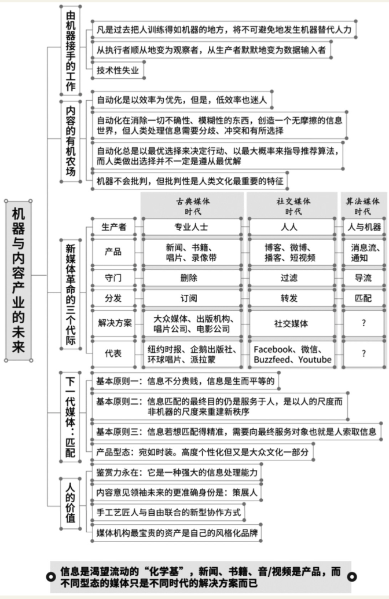
