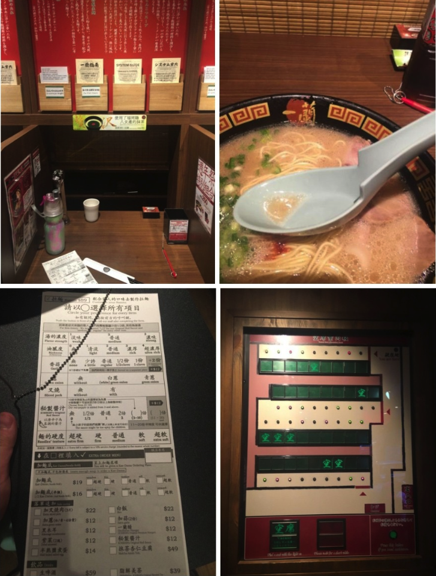
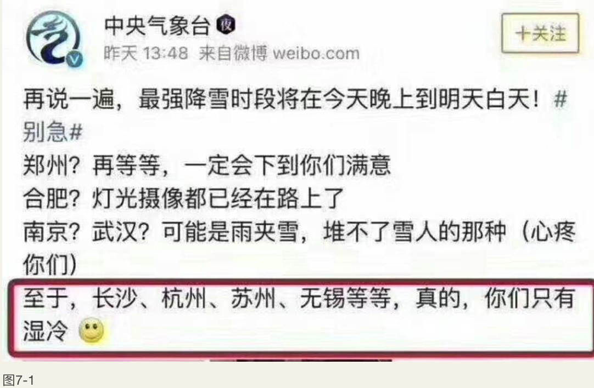

    作者: 沈帅波 
    出版社: 电子工业出版社
    副标题: 新商业、新媒体与逆袭之路
    出版年: 2018-6-5
    页数: 300
    定价: 59
    装帧: 平装
    ISBN: 9787121341311

[豆瓣链接](https://book.douban.com/subject/30242400/)

## 第2章　生意逻辑在迭代
>内容产业的消费升级，归根结底就是更个性化：产品要个性化，内容要人格化，二者不可缺一。

### 后电子商务时代的新趋势、新格局
从大格局来看：

1. 未来大平台仅把卖货当作“发生关系”的入口。
1. 准确抓住消费升级和移动端，或将诞生第三极（除“阿里系”和“京东系”外的第三个处于第一梯队的电商公司）。
1. 未来真正的电商王者，将来自率先完成生产供应链改造的企业。
1. 过去关于电商的定论全部会被推翻。
1. 大平台在短期内不可被撼动，但无力抑制被无数小平台分流，终将走向收购、兼并道路。

从品牌商和零售商的角度来看：

1. 电商的新机会非常多。觉得没有机会的人，99%的是悲观主义者。
1. “流量-转化率”公式（营业额等于流量乘以转化率乘以客单价）逐渐被“用户-复购率”公式代替。
1. 深度改变公司运营体系、提高电商事业部的话语权，才有未来。
1. 过去的品牌是垂直品类的，未来会出现更多垂直人群、跨品类的品牌。
1. 别老说红利没有了。每一个阶段的红利都用不同的形式出现，只要人类还喜新厌旧。

### 做品牌的逻辑彻底被改变了
路径各有不同，但必有几个相似点：

1. 品牌是从一群真正的、有黏性的爱好者开始引爆的，再也不是通过广告了。
1. 品牌不再是神的存在，而是朋友的存在。
1. 可以横跨品类，但始终垂直于人群。
1. “分众”时代来到了，“大众”时代结束了。
1. 运用一切新技术，与消费者在尽可能多的场景下产生沟通。

## 第3章　消费习惯在迭代
### 比起纯实物的消费升级，体验经济更值得关注
所谓的内容电商，做得好玩，就不会有太大的规模，要做得有规模，就会很普通。比如一直被吹捧的“一条”“罗辑思维”所推出的电商产品，其货源并不是独家且稀缺的。如今，很多大号都有同样的货源，货品的差异性其实并不存在。如果商家只有一些小批量产品，扣去渠道成本，忙乎大半天其实赚不到什么钱。对内容生产者而言，写了半天文章，把东西介绍给几十万个粉丝，然后粉丝大多会去京东、天猫购买，因为京东、天猫更便宜。如果内容电商和他们一个价格，那么就只能赚一点点。

唯有体验不可被替代，唯有给人带来的美好感觉不可被替代。此时此刻的幸福感受，是可以让消费者愿意立刻掏钱的。无论是一个帅气的店员、漂亮的老板娘，还是那种舒适、奢华、特别、宾至如归的感觉，这些才是未来真正让消费者掏腰包的力量。

1　“一兰”拉面

“一兰”拉面是一家非常火的日式拉面店。首先要强调的有两点：

1. 在日本，拉面是一个极其同质化的产品，和我国的路边面馆、盒饭没有什么本质区别，所以竞争是异常激烈的。
1. 从口感上来说，并不是所有人都觉得“一兰”拉面好吃，但这并不影响其长期的火爆。

究其火爆的原因，有如下几点：

“一兰”的取胜更多靠的是专注与差异化服务。

图3-2所示的图片全部是我拍摄于“一兰”拉面的香港店，目前在大陆还没有开店。

“一兰”拉面的菜单中只提供非常少的面条种类，但是在面条硬度，酱汁的油腻度、浓度、底料等方面可以自主选择，做得非常细。菜单就像一款APP的设置界面。

其门店采取的是隔板式座位，每个座位之间都装有隔板。据说这样可以让客户在吃面的时候不要说话，提高吃面速度，从而最大可能地提高翻台率。

客户面前的隔板上放有《首次来店顾客指南》和意见留言纸。

座位的设计如图3-2中的第1幅图片：左侧有一个水龙头，可以直接倒水；右侧有一个按钮，可以呼叫服务员；正前方下半部分可以打开，连通的是送餐工作台。

其实，“一兰”拉面并没有好吃到与众不同；消费也不低，单人消费大于100港元，胃口大点儿的需要200港元，也就是80～160元人民币。这个客单价可以傲视大多数面馆了。

在门店排队的人在20人以上，而其门店所在位置并不能算是最黄金的位置。

在一个不差一碗面的时代，差异化的服务和进餐方式，是这家只有一款面的面店的竞争法宝。客户会为体验付出几倍的溢价。
如果算一下“一兰”拉面单店的营业额，会发现它超过很多互联网公司。

2　茶酒生意

再来看看茶、酒行业。拿茶、酒两个行业来说，是因为两者有很多共性：

1. 大多数人不懂茶、酒的品鉴，没有基本常识。
1. 价格水分区间巨大，在过去是暴利的来源。
1. 没有品鉴能力就无法形成长期消费。
1. 在国内礼品市场中占半壁江山，一旦送礼行为被打击，则其销量将下滑很大。

在电商渠道的茶叶销售中，基本都是价位在100元/500g以内的茶，价格高就卖不出规模。红酒也是，基本都是一瓶在百元以内才能有销量。如果价格是一瓶几百元，则大家宁可到线下购买。

前面介绍了茶酒生意的难点，但并不是说所有人都不赚钱。我的朋友圈里有从事高档茶业茶具酒类销售的人，有的依然做得很好。他们几乎全部走的是“重体验”模式。看起来很“重成本”，很耗费成本，但客单价突破数千元，远超过同类电商十几倍。而茶酒生意一旦抓住一个长期消费的客户，则其一年的消费就是数万元。

我的一个好友是做红酒在线平台的，这几年贴了很多钱，其新媒体虽然阅读量很多，但是转化率很低，都不能与人力投入成本持平，但是其线下酒会、俱乐部的业务却蒸蒸日上。

这里并没有贬低在线销售模式的意思，但我们不禁要思考的是纯粹的轻模式真的对吗？如果不能给客户带来沉浸体验，只是泛泛地接触百万读者，就真的比得过有一千个重度回头客吗？线上与线下销售必须相辅相成。

在邮轮上，我们纷纷报名品酒会，在一个毫无信号的环境下，大家非常愿意参加各类这样的活动。无论是品酒会还是主厨晚餐，更容易带来后期的消费，而活动本身也是收费的。我用普遍的电商转化率算了一下，这种方式的投入产出比高于电商。虽然看起来这是一个很耗费人力的线下活动。

切不可被所谓的“轻模式”冲昏头。“轻”则意味着：不重度、体验不够极致。

3　茶叶生意

“小茶婆婆”兴起于微信红利期，很早就开始在微信上卖普洱了，但其真正的根基在于线下。其在全国建立联盟，与线下茶室联合举办品茶活动。和过去信息不对称的时代相比，如今高档茶叶的销售成单建立在信任上，而不是忽悠上。

对一个没有普洱茶饮茶基本知识和兴趣的人而言，即使线上的营销打动了他，让其购买了一盒，也基本不会再次购买。无体验则无沉浸，无体验则无兴趣，无体验则无法脱离比价。

武夷山地区盛产岩茶及红茶，其中以“大红袍”尤为知名。但大多数人并不懂得大红袍的起源及历史。而一部“印象大红袍”的山水舞台剧，则让人沉浸在山、水、茶、历史、人文之间，几乎和我同行的朋友，看完之后都购买了茶叶。这就是“体验”的力量。

中国台湾有一种袋泡茶，袋子上面的挂耳是政坛人物，很多朋友去台湾时都会买，但是在大陆的商店里并没有人购买，包括在电商上。这就是因为没有场景和代入感。所以，单纯的实物消费升级缺乏有力的支撑。

无论是上海的大悦城二期，还是苏州新开业的诚品书店，都引入了互动体验式消费，比如顾客可以亲手制作小皮包、小布袋、画画，或制作一本书等。这些都是更好地让顾客沉浸在体验中，滞留更长时间，而不仅仅是买完拎包即走。商品经济的时代已经过去，商品过剩的时代已经到来，但只有体验不可被替代，这些是溢价的理由。

比起纯实物的消费升级，体验经济更值得关注。在提高客户体验上的投资，非常值得。

## 第4章　媒体的迭代之路
### 媒体市场永远没有饱和，只有再分配
下面向我们迎面走来的是“分众”、“分分众方阵”。

寻找到一个一群人的兴趣点，然后去深挖再深挖，寻找到普罗大众都爱的点，然后去细分，细分，再细分。包是女性都爱的，但每个人爱的包不一样。有一个电商品牌就是只做紫色系的各种包，活得也很好，这就是一种思路。

比如制作视频节目，在罗振宇之后，出现了很多模仿他的知识类节目，这就是掉进别人的阵地里了。后来出了“一条”，走精致文艺路线，又让一批模仿者深陷泥沼。模仿“咪蒙”的，基本也不温不火。其实还有很多有趣的方向，千万别谁火就跟谁。有一个做饮料制作指南的节目，短短两个月就有了50万粉丝，这就是美食大市场里的细分小市场，但是受众不一定少。

所以，务必放空、清除所有行业标杆给你带来的框框，定义你自己的媒体风格，才有可能突围。

### 后自媒体时代的逻辑
#### 1　上下波动，但不可能偏离过多
世间没有一成不变的趋势。微博时代让文字越来越短，缩到了140个字，甚至40个字。后来出现了微信公众号，让沉浸式长文得以爆发。再后来，快餐式的标题党横行。但是当我们再次看到包括腾讯的《大家》《GQ杂志》《人物》等深加工的几万字的长文章不断刷屏时，你就知道，价值是会回归的。

这似乎就像股市的经典理论：股价永远围绕着价值上下波动，但不可能偏离过多。

#### 2　不可投机，平均值更有价值
任何现象级的热点，与其说是有人创造了它，不如说是上帝选中了它。或许你可以去总结它的1、2、3、4点。但是对不起，你不可能去复制它。终究是时代造就了英雄，而非英雄创造了时代。

给一个自媒体从业者的专业打分绝不是看他的最高纪录，而是看他的平均值。就像优秀的公募基金经理是每年稳定创造10%～15%的回报率，而不是突然100%回报。又突然亏损。如果能把这个数字做到平均每年22%，那么他就是“巴菲特”。

#### 3　本质在于认知和资源变现
个人自媒体赚钱模式的本质是老天爷赏饭吃。无论你是文笔飞扬、观点深刻，还是美貌如花，抑或是对一个行业有着超过常人的敏锐，都是老天爷给的饭碗，虽然个人努力也是一部分因素。而正因为此，这或许是个好生意，但绝不是被投资的好模式。公司自媒体赚钱的模式在于一个好的伯乐，发现商机于青萍之末，辅佐提携一批千里马成为摇钱树，无论是现在流行的MCN还是“网红”电商模式均是如此。

>自媒体盈利模式的本质在于认知和资源变现。

#### 4　新媒体内容电商重在内容，而不是电商
新媒体做电商在于创造增量价值。譬如：“一条”通过精致的视频告诉你一种生活方式、一个故事，然后让你掏钱买一个之前都没有意识到要买的东西。这就是它存在的价值。几乎我看到的做得好的新媒体电商都在于发掘用户的增量价值。如果你用传统电商的打法去做，那么要么累死，要么穷死。

- 传统电商是存量战争，比如想让消费者团购牙膏，但是一个人一年消耗的牙膏总量是不变的；
- 传统电商亦是供应链的战争，是后端的战争；
- 新媒体内容电商重在内容，而不是电商，电商只是一种变现的方式而已。

所以，值得赞赏的成功之路就在于创造了一个分销平台：厂商可以在上面展示自己的商品，给出提成比例，让媒体来选择推广，最后由厂商发货。也就是说：新媒体不要去触碰自己不擅长的，做好传播就好了。

#### 5　爆文的三大要点
“爆文”有三大要点，符合其中一点，都有可能成为“爆文”，但是不绝对。

1. 你替我说出了我的苦楚。
2. 你替我说出了我的优秀。
3. 你替我说出了他们都很傻。

以上三点皆为共鸣。

很多“爆文”是不经意间符合了以上的任何一点而成的，一开始他们自己都没有仔细去想这事。

#### 6　对少数人的强连接更重要
除非你证明自己拥有非常强的吸流量的能力，不然就得换个思路做新媒体了。在一些细分领域，对少数人的强连接的价值远高于泛泛得连接不多不少的人。譬如细分领域：房产、风水、股票、医疗美容，这些都有巨大的发展空间，只要你将微博、微信等新媒体看成连接工具，那么就会海阔天空。

#### 7　改变内容的产出模式
>你在哪一瞬间感受到了命运的不公？──我也叫王思聪。

>我问师傅爱情是什么？──师傅说“吐车上多付两百元”。

上面这些答案来自粉丝互动，而不是企业聘请的高薪编辑。有越来越多的真正优质的段子和内容全部来自网友的评论，而不是来自职业编辑，一个好的新媒体和传统媒体的区别就在于——内容产出模式发生了改变，从单一的PGC变成了UGC混合PGC。

只有与自己的用户形成强互动，才能够真正降低内容的生产成本和边际成本。但是我从来不看好专业领域的UGC（User Generated Content，用户生产内容），如果这个用户真的很专业，那么其实他就是专家。

#### 8　要想尽一切办法成为IP
后自媒体时代，只有三个出路：一，成为IP；二，成为IP；三，成为IP。

王思聪投资的“熊猫TV”早期的5000万用户中，大部分是依靠王思聪的粉丝影响力换来的，没有出任何的费用。张召忠退休后全面运作视频节目、音频节目、微博、微信、直播、图书出版，成了军事领域的重量级IP，将其在央视的积累最大限度变现。

只有成为IP，才能脱离平台的限制，才能成为各大平台争相邀请的嘉宾。

#### 9　不要高估主流的审美
绝大多数的新媒体从业者都在追逐整个中国高学历阶层有限的存量，而忘记了中国的中流砥柱是那些没怎么读过书的人。这就是为什么《知音》《故事会》的发行量是《第一财经》几十倍的原因。

我最近看到非常多的奇怪微信号，动辄百万粉丝，但是在江湖上从未耳闻。你能否想象，一个针对中老年人的微信公众号发送的一篇“节日祝福专用100句文案”的文章，能够在十分钟内达到10万多阅读。

什么是中国的主流审美，请到火车站的书报亭看一下。

绝不要在CBD（Central Business District，中央商务区）的书报亭猜测这个国家。

#### 10　移动互联网涉及的人更多
第10条来探讨下为什么第9条这么多年没有人注意到？
很有可能是：移动互联网的普及门槛远低于PC（个人电脑）互联网，原本起码得买个电脑、付宽带费，现在最便宜500元就能买个还行的安卓手机。使得原本无法触达的老年人，四五六七八线城市的人全部成为移动互联网的用户了，这个庞大的、没有被PC互联网洗礼过的人群，就是这一拨巨大的红利。

#### 11　自媒体还有机会
“自媒体已经进入后时代了”这句话其实是有误区的，因为大多数人解读成没有机会了。但是我认为：只是那个草根奋斗大概率能成功的年代过去了，而小概率上依然是有很多机会的。机会有多大？起码比你一个穷小子去做实业强，这还不吸引人吗？

#### 12　连接最有价值
台面上，大家只会说：内容驱动一切。而我想说：微信从未说过其是一个内容平台，微信官方一直说的是——连接。

把“如何连接到你想要的人”这件事情琢磨清楚，就水到渠成了。无论是通过技术手段，还是通过线下“人肉”。2018年小程序会以风卷残云之势袭来，所有不懂连接的团队都会死去。

#### 13　融入到时代中的方法
如果你实在看好腾讯系的内容布局，进而看好这个公司，但是又苦于真的不擅长内容。那么你可以通过购买腾讯的股票来赌一把，可能“投入产出比”比你自己投资做内容还要高。

这个时代最大的变化是：我们并不一定非得让自己成为那个亲自干活的人，才能融入这个时代。如果想参与，方法有很多，思路决定一切。自微信大风起兮，腾讯股价已经从80港币涨到高峰时的419港币，而我个人认为还有空间（不构成投资建议，股市有风险，投资须谨慎）。

#### 14　算法分发上值得琢磨
今日头条的崛起，代表着自媒体的另一极出现，也代表着除了粉丝之外的另一个巨大的市场：算法分发。我们已经不能忽略这个市场了。另外，百度和腾讯系也在算法分发上下重金。“刷”就是移动时代的搜索。在微信、微博时代“失意”的人，或许能在算法分发上多琢磨琢磨找到自己的所属。腾讯系将所有平台整合在一起，通过QQ号这个总池子筛选内容分发到自己旗下十几个数以亿计的平台上。这里藏着机会。

#### 15　尽可能参与到这一轮变革的大潮
尽快把思维模式变成“全媒体思考”模式，尽快进入投资者的思考模式，尽可能参与到这一轮变革的大潮中，无论是以什么姿势。成为任何一个未来内容领域成功企业的员工，都是会获得远超平均值回报的，这些都比你干等着或者抱怨强无数倍。

#### 16　优质的流量越发值钱
分享一个对比数据：

1. 我所孵化的内容矩阵中，同量级粉丝数下，原创号的广告价格是非原创号的三倍。
2. 我的纯个人公众号“进击波（jinbubo）”最开始是根本不指望能卖得出去广告的，结果广告主蜂拥而至，以至于为了维持质量，只能不停拒绝订单。

优质的流量越发值钱。如果你无法做大，那么就思考如何做精准。

#### 17　要算投入产出比
有一个行业年度笑话：4个海归大学生，月薪3万元。用了两年时间，终于做到阅读量100多了。

任何的生意，归根结底要算的是投入产出比。这一轮的内容创业，最终崭露头角的都是草根，或骨子里带有泥土气息的人，只有他们才能抓住网友真正的诉求，才能用最低的成本把事情做起来。对于生意来言，省下来的每一分钱都是利润。

#### 18　看到想消磨时光的人
抖音、快手、西瓜、火山这4个短视频类APP的火爆，让另一个巨大的群体出现在主流社会的面前：那是一群话语权不高的人，但是人口规模巨大，同时并没有家国天下的情怀，也没有那些焦虑，他们想看的东西无非就是消磨时光的内容。

#### 19　为你的才华找对平台
“雪球”这款APP的前身是“i美股”社区。在“雪球”这个平台上，诞生了非常多的投资圈的KOL（关键意见领袖），其中不乏非常年轻的人，尤其是金融行业的。

“雪球”的朋友告诉我：一个“90后”小哥，通过连续4年在雪球上发表自己的投资观点，已经成立了自己的私募基金。通过非广告业务，每个月就能从“雪球”拿到10万元的佣金。而他之前的本职工作只是一个银行的小职员。

所以，这个自媒体时代最重要的事情是：为你的才华找对平台，这样你就不会被埋没。

#### 20　自媒体的极致案例
有一个草根叫作“欧神”，是中国房地产圈的一个异类。他十年如一日地看房地产信息，并且身体力行用尽一切办法买房子，买更多的房子。他创办的“水库论坛”汇集了众多拥趸。他的粉丝团聚集在一起，组团买房，互相借贷。他的“粉丝”花数万元加入他的私密群，还沾沾自喜。他的书位列各大平台经管类图书销量排行榜前列。我们抛开房地产本身，自媒体的极致也不过如此了。

其实，当我们讨论内容的时候，它是一个很杂的东西。它不像互联网三大应用场景的另两种：电商和通信社交，相对来说界限分明。视频算内容，但视频里还分短视频、TVC、网剧、大电影等；文章算内容，教育培训、知识类音频、娱乐类音频段子都算内容。每个人思考的出发点和能力圈都是不同的，并没有哪家是绝对对的，哪家是绝对错的。百花齐放，百家争鸣，各显神通吧。

## 第7章　新媒体人实操干货
### 1　选对领域是炼成大号的第一步
人生很多的结果，回溯到最初，无非就是一开始的选择方向。新媒体领域亦是如此。如果你选择去做一个灵魂音乐、蓝调这一类的账号，那么你是基本没有可能达到百万粉丝或千万粉丝的。但是如果去做一个人类共情的、刚需的、高频的品类，那么这件事就会轻松很多。

我对新媒体从内容的维度做了一些分析，发现新媒体“大号”的维度其实是在不断多元化的。

荷尔蒙、猎奇好玩、消磨时间、励志、娱乐、情感、炫耀、干货、道理，这九种内容维度构成了“大号”版图的半壁江山及以上。

### 2　顶层思考及切入的路径很重要
其实，早期很多“大号”的养成是“无心插柳”，更多是因为兴趣爱好，但是随着资本的介入，这种“无心插柳”几乎绝迹，而更多的是“有心栽花”。所有受资本喜爱的，或是自身能够盈利的新媒体项目，在一开始的顶层思考上就与众不同。

下面来看一个案例：“餐饮老板内参”。

全国餐饮行业的年度规模应该在8万亿元左右。而在中国境内的餐饮公司中最大的百盛集团，旗下有肯德基、必胜客这样的知名顶尖快餐品牌，也没有占到整体份额的1%。这个行业，起码有1000万的私营老板。所以“餐饮老板内参”这个号，从一开始就选择从一个有大量基础人群的品类切入。

其次，餐饮行业作为一个最古老的行业，又是一个民生的刚需，所以非常稳定，而这又导致了餐饮行业总是比科技和互联网的发展慢一拍。这个行业的老板需要获取全新的讯息和知识，但懂得的人又很少。所以对于他们来说，一个定位给餐饮老板提供尖端资讯的新媒体是“刚需”。

对于他们来说，关注的目的是为了“赚钱”和“提高”，所以这就离收费更近了。无论是咨询服务还是培训服务，都可以非常好地切入。

通过这个案例能发现，一个好的顶层设计和切入点是成功的一半。

#### （1）大号之间的本质差异
大号在一种维度上可以分为两种，跑量型和有效认知型。跑量型的代表有“环球××”“××攻略”之类，你会长期关注，但是这类大号的读者根本不关心背后是谁，喜欢的是不是你，主要是看内容。另一种是有效认知型，那是最值钱的，那才是真正的网红，比如“@张大奕eve，”张大奕的淘宝店一年的流水就有好几亿元，抵得过一个中型服装公司的数百人。又比如“@黎贝卡的异想世界”，她以一己之力就能卖出几十台MIMI Cooper轿车，她的商店上线两小时，销售额达到三百万元。当然，跑量型也有自己的生存之道，这里强调的是要有意识地往IP化的方向进行转移。

#### （2）无个人认知的内容转化是非常差的
怎样向IP化的方向转移？这个转化流程大概是：喜欢你的文章→喜欢你→喜欢你卖的东西。这个转化流程接近于：一个人喜欢你的文章，不一定喜欢你，更不一定喜欢你卖的商品。所以你必须认清楚一个事实，就是纵然你有很多流量，也要搞清楚他们为什么而来？另一方面，你从布局的一开始，就要有意识地打造人格。

#### （3）如何有意识地打造人格化的新媒体
首先要强调下，刻意的模仿并不能让你塑造成自己，只能成为一个拙劣的模仿者，不可能被记住。另外，所有的自媒体归根结底都靠老天爷赏饭吃，这和演员是一样的，你的努力固然重要，但是你的容貌、声线、身材都是天赐的。所以，如果你在任何一个方面都不具有出彩的条件，那么这条路不是很适合你。这是个残酷的事实，我不希望像成功学那样告诉你，只要坚持就会成功。

下面从亲身案例来说一下我是怎么塑造人格化的？

“我爱PPT”是中国排名第一的PPT领域大号。

其实从一开始的时候，“我爱PPT”并没有一个100%完善的策划案，它只是一直抓住了两条线：一是提供优质的刚需内容（对于职场人，PPT就是刚需）；二是不断塑造“P君”的人格。

塑造真实的人格是一个长期的事情，不要指望某一篇“爆文”就能够一局定胜负。

另一方面，P君的性格属性其实就是我的性格属性。一个白天欢乐，晚上深沉，始终保持积极向上的男生。我在线上会对很多事情发表自己的看法，涉及人生观、价值观、世界观，有时天马行空。我无须去说那些我不认同的话来“吸粉”，甚至还会故意说出我自己独特的看法来洗掉并不认同我的“粉丝”。

因为我是巨蟹座的，所以有时候也会发一些星座相关的帖子。例如，充满巨蟹座性格的文字：我不出门，我不下床，床以外的地方都是远方。非常多的人留言说“啊，是我！”也有人说“我也是巨蟹座！虽然我是双子座，但也是这样的。”

注意：这样的内容从转发量、阅读量来说，并不可能是传说中的“爆文”，也不能完成巨大的数据指标，但是却能够让你的存量粉丝真实感受到你的存在，潜移默化中提升了用户黏性。

#### （4）研究清楚用户的在线时间
“我爱PPT”用户中的大量职场人在下午2：00左右都是比较空闲的。因为这个时候是午休后比较犯困的时间，但同时又是任务紧迫感还没有降临的时刻，所以这个时间段便成了我们彼此互动的黄金时间之一；当然还有每天的11：00～13：00。这个时间段，也比较适合进行情感类的互动。

#### （5）将行业中日常的事情写成小故事、小段子，并且重视用户的“神”评论。

>有个很久不联系的朋友找我，说能不能帮他修改一份PPT。我说：很忙啊，不好意思。然后他发来了一篇文章，标题是《你瞎忙的样子看起来很失败》。

虽然我知道这已经是一条比较幽默的内容了，但是后来网友的评论显得更加精彩，比如：你可以发给他一篇名叫《我为什么要帮你》的文章。

比如我说：我打算写一本书：《PPT高手成长手册：从入门到放弃》。就有粉丝回复说：随书赠送《颈椎病的康复与治疗》。

于是，我发现了衍生的需求，“我爱PPT”的粉丝，有非常多都是需要大量伏案工作的，所以颈椎有点问题是常态吧。

于是我们录制了颈椎病的治疗短视频。

如果再衍生下，我们可以推出这个品类的内容电商，我相信一定是有巨大需求的。

### 3　塑造人格化
P君作为一个A角，并不能完全解决所有的塑造工作；因此，在很多时候，需要一个B角来说另外的话。于是，我让助理开了一个名叫：“小P妹”的微博账号。而“小P妹”的职责就是负责在网上和我抬杠、抹黑我，并和粉丝套近乎。

宣布“小P妹”这个账号出场的帖子其实非常的“无意”。

“明天P君的新助理就入职了，紧张。”这是半夜发的，结果大半夜里就有很多人互动。

“小P妹”第一天的第一条微博：“刚才P君说我无论如何都集不齐100个赞，我表示不服！”于是，这条微博获得了161个赞。

这就是人格化的力量。

#### （1）生动地探讨行业信息和“槽点”
比如，客户来问我：网上的报价那么便宜，怎么你给我报价比别人贵。我只问他：飘柔广告好，你真的见过梳子从头上滑下来过吗？康师傅方便面广告好，牛肉真的有那么大块吗？

我们再来看“中央气象台”的官微。一个天气预报的微博，是怎样做到人格化的？

>2018年新年刚至，全国很多地区都开始下大雪。中央气象台的天气预报使用了非常幽默和诙谐的语言，而不是枯燥的陈述，比如：郑州？再等等，一定会下到你们满意；合肥？灯光摄影已经在路上了；南京？武汉？可能是雨夹雪，堆不了雪人的那种（心疼你们）；至于，长沙、杭州、苏州、无锡等，真的，你们只有湿冷（见图7-1）。

#### （2）表达真实的看法
唯有真实的看法，才能获得关注。自媒体的本质是人格媒体，只有有态度的人、有观点的人才能被人记住。自媒体也是如此。很多时候，不一样的声音往往代表着一大群沉默者的心声。当然如果面对某些话题，你的真实看法可能会产生负面影响，则可以选择不说话。但是我认为这比迎合大众说一些话更好。

#### （3）学会克制，不要露怯
每个人都有自己的能力圈。在你的能力圈外，你就是一个普通人。而很多网红形象的崩塌就是因为不懂得克制，最终漏了怯。

所以，首先要清楚自己的知识盲点，并学会克制，不要对什么都指指点点、发表评论。塑造一个形象需要很久很久，但是毁灭一个形象只需要一瞬间。

尤其是在公众号平台上，不必每天为了发文章而发，不必什么热点都追。虽然追热点真的很有效，但是有些热点是需要较深的行业积累才可以评论的。

我见过很多网红，尤其是知识类网红，很多是因为染指自己不懂的领域，然后致使“人设”崩塌的。

#### （4）坚持输入
如果你不是美貌型选手，那么要保持你的KOL（关键意见领袖）身份，就需要不停地坚持输入，关于“输入”在本书的后续部分有很多详尽的内容。不过一切方法皆为术，最重要的是：你得保持对世界的好奇心与平常心，保持对全新世界的渴望和求知欲。输入大致分为：历人、历事、学习，三者循环往复。

### 4　格局与认知很重要：开放、外部协作与激励
除了技法上的要点，我认为之所以一个事情能做成，还有核心的道，那才是真正让你保持与众不同的地方。

任何一个人、团队或公司机构，内部的资源即使再丰富，和这么大的世界相比都是匮乏的。所以，开放协作是异常重要的，不要老是觉得自己是最强的。

我们公司旗下的自媒体矩阵都渴望与各个领域的专家去合作。比如“营销之美”，我们和众多营销领域的专家合作专栏，开放投稿渠道，凡是采纳的优秀稿件都将获得曝光、推荐导流和稿费。没有一个内容团队可以自己完美地解决所有的内容生成问题，团队不可能无限扩大，而且扩大带来的管理难度和损耗，会使得效率变得越来越低，最后变成一个非常传统的媒体。只有懂得和外部协作，才可以保持长期的活力。

在PPT领域，我们则是与大量PPT行业老师专家合作，帮助他们销售PPT模板、课程等知识付费内容，即便我们自己也在开发相关的课程。这就是为什么我在公司内部讨论时说：假如我们帮助了10个行业内专业最靠前但是没有流量的达人，一人一年多赚10万元，那么我们自己也不会穷。

截至目前，我们最好的PPT老师一年在我们平台的分成可达到30万元。

