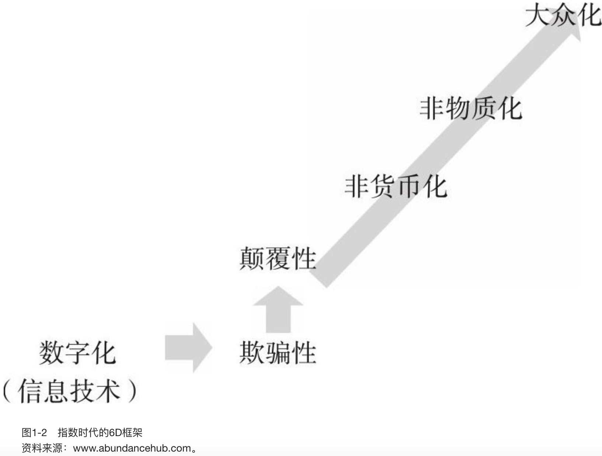
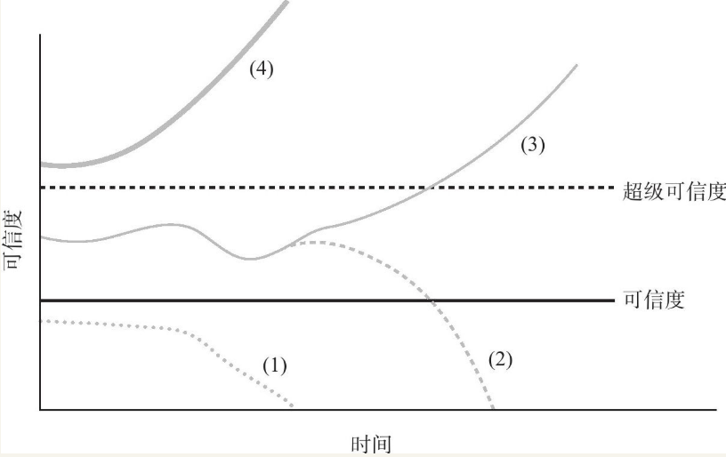

    作者: 彼得· 戴曼迪斯 / 史蒂芬· 科特勒
    出版社: 浙江人民出版社
    副标题: 指数级成长路线图
    原作名: BOLD
    译者: 贾拥民
    出版年: 2015-8
    页数: 350
    定价: 69.90元
    装帧: 平装
    ISBN: 9787213067808

[豆瓣链接](https://book.douban.com/subject/26586799/)

- [第一部分 指数型技术，指数型企业家的最爱](#第一部分-指数型技术指数型企业家的最爱)
  - [01 从数字化到大众化的巨变](#01-从数字化到大众化的巨变)
    - [数码相机，诞生于柯达也毁了柯达](#数码相机诞生于柯达也毁了柯达)
    - [指数级增长的6D框架](#指数级增长的6d框架)
      - [数字化](#数字化)
      - [欺骗性](#欺骗性)
      - [颠覆性](#颠覆性)
      - [非货币化](#非货币化)
      - [非物质化](#非物质化)
      - [大众化](#大众化)
    - [指数型公司Instagram，13名员工的10亿美元公司](#指数型公司instagram13名员工的10亿美元公司)
  - [02 找到用户界面，大众化才能破土而出](#02-找到用户界面大众化才能破土而出)
    - [良好的用户界面，让技术变成“赚钱机器”](#良好的用户界面让技术变成赚钱机器)
  - [03 3D打印，颠覆世界的制造技术](#03-3d打印颠覆世界的制造技术)
    - [3D打印，10万亿美元的商业机会](#3d打印10万亿美元的商业机会)
  - [04 改变世界的5种关键技术](#04-改变世界的5种关键技术)
    - [网络和传感器，创造海量数据](#网络和传感器创造海量数据)
    - [无限计算，“蛮力”之美](#无限计算蛮力之美)
    - [人工智能，按需可得的专业知识](#人工智能按需可得的专业知识)
    - [基因组学和合成生物学，5倍于摩尔定律速度的增长](#基因组学和合成生物学5倍于摩尔定律速度的增长)
- [第二部分 无所畏惧的心灵骇客，指数型企业家的心态](#第二部分-无所畏惧的心灵骇客指数型企业家的心态)
  - [05 一个初创企业就是一个“臭鼬工厂”](#05-一个初创企业就是一个臭鼬工厂)
    - [“臭鼬工厂”的启示](#臭鼬工厂的启示)
  - [06 17个心流触发器让你全心投入](#06-17个心流触发器让你全心投入)
  - [07 飞翔在“超级可信度”之线的上方](#07-飞翔在超级可信度之线的上方)
    - [讲个“超级可信”的好故事](#讲个超级可信的好故事)
  - [08 彼得定律，困难和机遇时的首选行事规则](#08-彼得定律困难和机遇时的首选行事规则)
    - [彼得定律TM-永恒的信念和时刻充满激情](#彼得定律tm-永恒的信念和时刻充满激情)
  - [09 规模思维，成就亿万富翁的智慧](#09-规模思维成就亿万富翁的智慧)
    - [规模思维](#规模思维)
- [第三部分 指数级成长，指数型企业家的目标](#第三部分-指数级成长指数型企业家的目标)
  - [10 极大地提高业务扩张的速度](#10-极大地提高业务扩张的速度)

# 第一部分 指数型技术，指数型企业家的最爱
## 01 从数字化到大众化的巨变
### 数码相机，诞生于柯达也毁了柯达
到了1996年（那次会议举行20年之后），柯达公司已经拥有了14万名员工，它的市值也达到了280亿美元。它事实上垄断了整个行业。在美国，他们控制了90%的胶卷市场，并占据了85%的相机市场份额。但是，柯达的高管们已经忘记了这个公司的商业模式。柯达是以化学产品和纸张产品业务起家的，但是毫无疑问，到后来，它的宗旨就变成了“让人们的生活更加便利”了。

我们还要追问，柯达到底使人们在什么方面“更加便利”了？它使人们更便于摄影吗？远远没有这么简单。摄影仅仅只是一种表达形式，而关键则在于表达的内容是什么。当然，这就是`柯达时刻（Kodak Moment）`。是的，我们想记录我们自己的人生经历，我们想捕捉某些转瞬即逝的瞬间，我们想让某些短暂的时光留下永久的印记。柯达的业务就是留住人们的记忆。那么还有什么东西能比数码相机更加便于留下人们的记忆呢？

但是，在20世纪末，柯达的高管们却没有看到这一点。他们认为数码相机将会削弱他们的化学产品业务和胶卷业务，认为推出数码相机实际上意味着迫使公司卷入自己与自己的竞争当中。因此，他们雪藏了这项技术。

### 指数级增长的6D框架
我构建了一个“6D框架”（Six Ds）：数字化（digitalization）、欺骗性（deception）、颠覆性（disruption）、非货币化（demonetization）、非物质化（dematerialization）和大众化（democratization）。这6D其实是指数型技术发展的连锁反应，也是导致巨大动荡并带来难得机遇的快速发展路线图（见图1-2）。

#### 数字化
一旦某个技术或产品完成了从物理过程向数字过程的转变，那么它便会呈指数级增长。

#### 欺骗性
紧接着数字化的是欺骗性，这是指数级增长过程中最容易被忽视的。原因在于，小数目的翻倍通常也是很小的，它们往往被误认为是线性增长式的缓慢进步。

#### 颠覆性
颠覆性技术（disruptive technol-ogy）是指任何一个能够创造新的市场并且颠覆已有市场的创新技术。

_|颠覆性技术|disruptive technology_

>指任何一个能够创造新的市场并且颠覆已有市场的创新技术。

#### 非货币化
再来想一下柯达的情况吧。当人们不再购买胶卷时，该公司的传统业务就完全消失了。当数码相机拥有了数百万像素之后，谁还需要胶卷呢？胶卷曾经是柯达公司稳如泰山的收入来源，但如今，使用数码相机的人根本用不着胶卷了。原来的收入来源一夜之间“免费”了，怎么办？

Skype使长途电话非货币化了；Craigslist使分类广告非货币化了；Napster使音乐产业非货币化了……

#### 非物质化
非货币化是指过去需要付出货币来购买的商品和服务现在都免费了；而非物质化则更进一步，它指的是，甚至连商品和服务本身也消失了。在柯达这个例子中，他们的困境并没有随着胶卷的消失而结束。紧随数码相机的发明而来的是智能手机的发明，而且很快地，智能手机也包含高质量的、百万像素的照相和摄像机了。

#### 大众化
柯达并不只是通过销售相机和胶卷来赚钱的，它们还出售摄影流程的所有产品：他们自主研发胶卷，生产冲洗照片所用的相纸，并且研制生产胶卷所要用到的化学产品。为什么这是一个“好生意”呢？首先，当你用整卷整卷的胶卷拍了一些照片后，你根本不知道这些照片中哪些是符合心意的，所以你必须把它们全部冲洗出来。请记住，即使这整卷整卷的胶卷中没有一张照片是对准焦距的，你也必须为了冲洗照片付钱。其次，拍照只是摄影全部乐趣的一部分，把你特别满意的照片冲洗出很多张来，然后把它们与他人分享，那才是真正的乐趣所在。

回到20年前，如果要冲洗出数千张照片来，所需的相纸费、冲洗费和人工费将是一笔相当大的开支，因此只有那些足够富裕的人，才有可能随心所欲地大量拍照并与众多朋友分享自己的照片。但是，数码相机诞生之后，你事先就可以搞清楚哪些照片是值得冲洗的；而且，随着像Flickr这种能够帮助你在互联网上分享照片的网站的创建，你甚至连冲洗费也可以省了。共享照片已变得免费、快速，并且完全大众化了。

**大众化是指数级连锁反应的终端，是非货币化和非物质化的必然结果**。

### 指数型公司Instagram，13名员工的10亿美元公司
_|指数型组织|exponential organization_

>指拥有与自己的员工人数完全不成比例的、极其巨大的影响力（或产出）的公司。

## 02 找到用户界面，大众化才能破土而出
### 良好的用户界面，让技术变成“赚钱机器”
_|用户界面|user interface_

>指一条容易操作的交互通道，简洁友好的用户界面可以成为“赚钱工具”。

## 03 3D打印，颠覆世界的制造技术
### 3D打印，10万亿美元的商业机会
_|增材制造|additive manufacturing_

>指采用材料逐渐累加的方法制造实体零件的技术，相对于传统的材料去除—切削加工技术，它是一种“自下而上”的制造方法。

## 04 改变世界的5种关键技术
### 网络和传感器，创造海量数据
根据2013年斯坦福大学举行的万亿传感器峰会（T Sensors Summit）所发布的一个报告，到2023年，全世界传感器的数量有望增长到“一万亿”的级别。

### 无限计算，“蛮力”之美
_|无限计算|infinite computing_

>指计算能力从一种稀缺而昂贵的资源，发展成了一种富足而免费的资源。

### 人工智能，按需可得的专业知识
今天，在美国80%的工作都围绕着服务行业而展开，而且任何服务性工作实际上都可以分解为4种基本技能——看、读、写和整合知识。

所有这4种技能都出现在人工智能的一个被称为“机器学习”的分支当中。

**第一个技能，看**。在1995年，”奇点大学机器学习部负责人杰里米·霍华德（Jeremy Howard）解释道，“那一年，一种被称为LeNet 5的算法赢得了美国邮政管理总局组织的竞赛，它能够识别手写的邮政编码，还能帮助分拣邮件。”

到了2011年，终于出现了一系列重大的突破，它们使人工智能的这个领域受到了高度关注。在德国，每年都会举行一次对交通标志的理解、识别和分类的竞赛，比赛是在人类与机器学习算法之间展开的。在比赛中会用到5万个不同的交通标志——这些标志都进行了模糊处理，要么距离很远，要么被树木遮住，要么被刺眼的阳光直射。2011年，机器学习算法第一次打败它的制造者（人类）：它的错误率只有0.5%；相比较而言，人类的错误率却高达1.2%。

在2012年举行的ImageNet竞赛。在这个竞赛中，人类和计算机算法分别“观察”100万张不同的图像——从鸟类到厨具，再到骑着小型摩托车的人——并且将这些图像分成1000个不同的类别。再一次，机器学习算法在竞赛中胜过了人类。

**第二个技能，读**。约翰·马尔可夫（John Markoff）在2011年为《纽约时报》撰写的一篇文章中所描述的：“多亏了人工智能的发展，‘电子发现’（e-discovery）软件在分析文件时能够按时间进行收费……有些程序不仅仅能够以‘计算机的速度’从文件中查找到相关的词汇；它们还能将相关概念提取出来（比如从与中东的社会抗议有关的文件中），甚至在没有明确的术语引导的情况下也能做到这一点。它们还能够推导出行为模式，从而让律师免去了到数以百万计的文件中苦苦搜寻的繁重负担。”

**第三个技能，写**。在‘写’这种能力上，瑞士信贷（Credit Suisse）已经在利用叙事科学软件（Narrative Science）去分析来自于成千上万个公司的数百万个数据点，并且用它自动‘写出’评估公司预期、优势和风险的英文研究报告。这种报告能够帮助分析师、银行家和投资者做出长期投资决策。与让分析师以人工方式撰写报告相比，这种报告不但在数量上增加了3倍，而且在质量上和连续性上也有所提高。”

**第四个技能，整合知识**。2011年2月IBM公司的超级计算机沃森在参加《危险边缘》（Jeopardy）知识问答比赛时胜过了人类选手。

在2011年，现代化医学公司就已经发展成了一个基于iPad的、有鲜明专业特色的电子病历平台，而且是一个非常出色的众包枢纽。例如，每一个在现代化医学公司网站注册过的皮肤科医生都可以把与他们的治疗结果有关的数据（即，每个病人的病情如何，以及他们针对每个病人采取的治疗方案），在消除了个人身份信息之后（这意味着病人的名字等可以用来识别身份的信息都已经被删去了）上传到这个网站，累积起来。每一个皮肤科医生都能在网上访问这些信息，因此能够显著地提高诊疗水平。（在这个网站上注册的美国皮肤科医生大约有3000人，这个数字已经占到了美国皮肤科医生总数的25%）

### 基因组学和合成生物学，5倍于摩尔定律速度的增长
合成生物学是建立在这样一种思想上的：从本质上讲，DNA是一种软件，或者更具体地说，DNA是由按特定的顺序排列的4个字母所组成的一个代码而已。与计算机一样，代码驱动着机器。在生物学上，代码的顺序控制着细胞的制造过程，指导细胞制造出特定的蛋白质以及其他东西。但是，与所有软件一样，DNA也能够进行“重新编程”。

>“合成生物学本质上是基因工程的数字化，”合成生物学家、欧特克公司的杰出研究人员、奇点大学教授安德鲁·赫塞尔（Andrew Hessel）这样解释道，“过去所有这些步骤都是在实验室里由人工完成，这要付出高昂的费用，错误率也很高，但是今天我们可以利用计算机操作DNA，我们所使用的程序操作起来就像使用文字处理软件一样。组合和匹配的基因代码，拼写和错误检查，调整附近的位点——做这些事情的时候，就像在文字处理软件中进行‘拖放’一样简单。”

# 第二部分 无所畏惧的心灵骇客，指数型企业家的心态
## 05 一个初创企业就是一个“臭鼬工厂”
### “臭鼬工厂”的启示
创办“臭鼬工厂”的目的是为了处理特别艰巨的任务，它们始终是围绕着心理学家所说的“宏伟远大、极其艰难的目标”的。这些目标的“极其艰难”的本质其实就是“臭鼬工厂”成功的第一条秘诀。

在他的全部14条规则中，其中有4条是单独针对军事项目的，因此在这里我们将不予讨论。在余下的10条规则中，有3条是加强快速迭代的方法（我们将在下文中回过头来详细讨论这个主题），剩下的7条规则则全都是强化隔离的方法。例如，规则3：“与项目有任何关联的人的数量应该受到严格限制。”规则13：“必须通过采取适当的安全措施，严格控制外人接触项目和项目研究人员。”根据约翰逊的说法，在“臭鼬工厂”里，隔离是取得成功的关键。

_|组织惰性|organizational inertia_

>指任何一个公司，一旦获得了一些成功，它们对开发新技术、创造新方向的渴望就会减弱的情况。

_|快速迭代|rapid iteration_

>快失败，早失败，在失败中前行。

## 06 17个心流触发器让你全心投入
_|心流|flow_

>指当我们的感觉和行动都处于最佳状态时的意识状态。

## 07 飞翔在“超级可信度”之线的上方
### 讲个“超级可信”的好故事
_|超级可信度之线|a line of super-credibility_

>当一个新想法诞生于“超级可信度之线”的上方时，你会立即接受它，并且说：“哇，太棒了！我该如何去实施这个想法呢？”

（见图7-1）：在我们每个人的大脑里，都存在着一条“可信度之线”（a line of credibility）。当你第一次听到某个新想法时，你会把它放到这条线的上方或下方。如果你把它放到这条线的下方，那么你就会立即抛弃这个想法，因为你认定这个想法是荒谬绝伦的。如果你把它放到这条线的上方，那么就意味着，你愿意认真对待这个想法。随着时间的推移，你还会继续做出一连串的判断。不过我们还有一条“超级可信度之线”（a line of super-credibility）。当一个新想法诞生于这条“超级可信度之线”的上方时，你会立即接受它，并且说：“哇，太棒了！我该如何去实施这个想法呢？”这个想法是如此令人信服，以至于你的大脑会立即把它当作一个事实去接受，或者说，你的注意力会马上从“这个想法能够实现的概率”转移到“这个想法的意义”上来。

注：（1）不可信的“登场亮相”；（2）可信的“登场亮相”，不可信的绩效；（3）可信的“登场亮相”，超级可信的绩效；（4）超级可信的“登场亮相”。

图7-1绘制“超级可信度之线” 资料来源：彼得·戴曼迪斯的网站。

## 08 彼得定律，困难和机遇时的首选行事规则
### 彼得定律TM-永恒的信念和时刻充满激情
- 彼得定律1：如果某个事物有可能出错，那么请立即修复它！（让墨菲定律见鬼去吧！）
- 彼得定律2：当让你两者选其一时，你要两个都选！
- 彼得定律3：多一个项目便会多一次成功。
- 彼得定律4：从高起点启动，然后一步一个脚印向上攀登。
- 彼得定律5：你可以按书上说的去做……但前提是，你自己要成为作者！
- 彼得定律6：当你被迫妥协时，请要求更多。
- 彼得定律7：如果你无法获胜，那么想办法改变规则。
- 彼得定律8：如果你不能改变规则，那么请忽略它们。
- 彼得定律9：完美不是一个可选项。
- 彼得定律10：当没有挑战时，就创造一个挑战！
- 彼得定律11：“不行”，就意味着你应该更上一层楼！
- 彼得定律12：能跑就不要走。
- 彼得定律13：当有疑问时，请思考！
- 彼得定律14：耐心是一种美德，但是只有在成功前一直保持耐心，你才能成功。
- 彼得定律15：吱吱作响的轮子会最先被换掉。
- 彼得定律16：动得越快，时间流逝得越慢，寿命也就越长。
- 彼得定律17：预测未来最好的方法是你自己创造一个未来！
- 彼得定律18：“有”与“无”之间的比值是无穷大。
- 彼得定律19：非常想得到才可能得到。
- 彼得定律20：如果你认为这是不可能的，那么只是对你来说是这样。
- 彼得定律21：所谓专家，就是那个只能告诉你什么事情不能做的人。
- 彼得定律22：在事情获得突破性进展的前一天，它仍然只是一个疯狂的想法。
- 彼得定律23：如果事情很容易，那么它早已经完成了。
- 彼得定律24：如果没有目标，你每次都会错过。
- 彼得定律25：早失败，常失败，在失败中前行！
- 彼得定律26：如果你无法测量它，那么请你改进它。
- 彼得定律27：世界上最宝贵的资源是坚持不懈的努力和充满激情的人类思想。
- 彼得定律28：要克服官僚主义，需要坚持不懈的努力和无比强大的信心，必要时甚至要用推土机。

## 09 规模思维，成就亿万富翁的智慧
### 规模思维
1. 承担风险和降低风险
2. 快速迭代和不断地实验
3. 激情和目的
4. 长远思考
5. 以客户为中心的思想
6. 概率思维
7. 理性乐观的思考方式
8. 依赖第一原则，即基本的真理

_|牙刷测试|toothbrush test_

>确定一个事物的使用是否会像使用牙刷一样频繁——至少一天两次。

# 第三部分 指数级成长，指数型企业家的目标
## 10 极大地提高业务扩张的速度
_|众包|crowdsourcing_

>指一个公司或机构把过去由员工执行的工作任务，以自由自愿的形式外包给非特定的（而且通常是大型的）大众网络的做法。

_|指数型大众工具|exponential crowd tool_

>指让我们每个人都能利用大众力量的工具。

