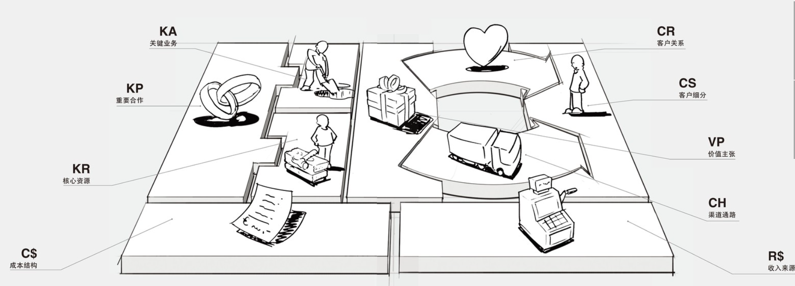
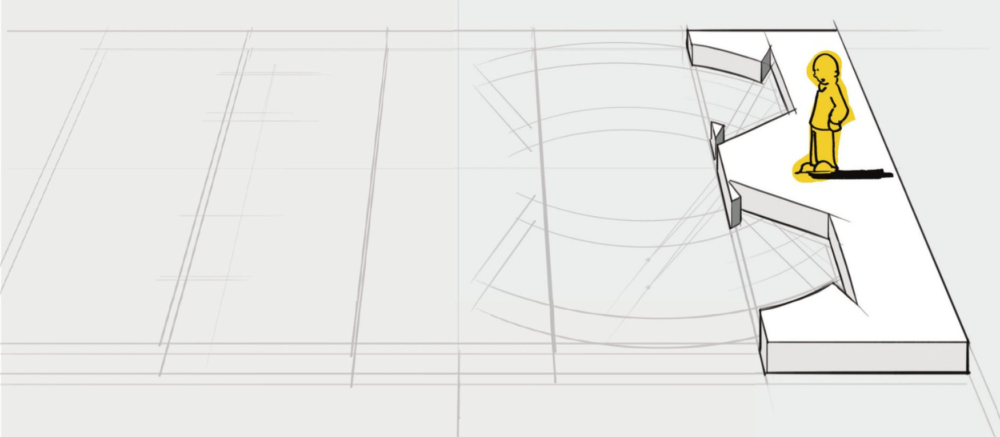
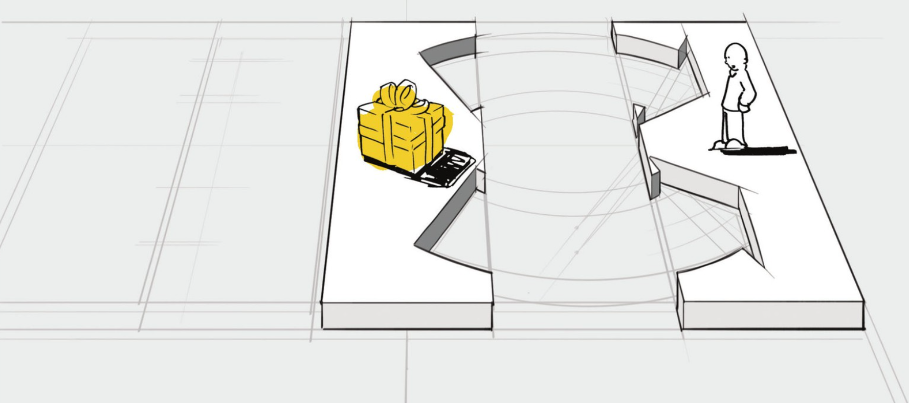
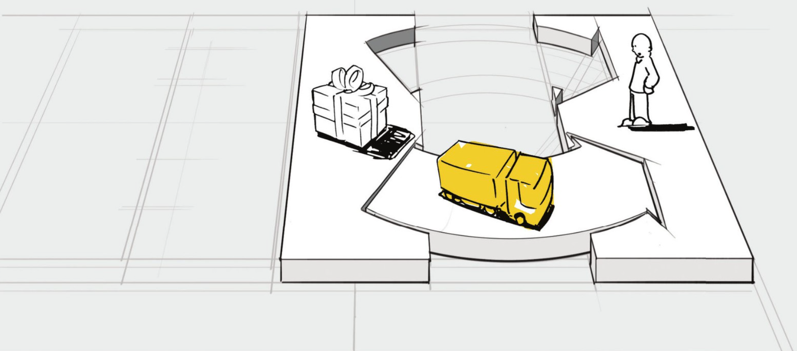
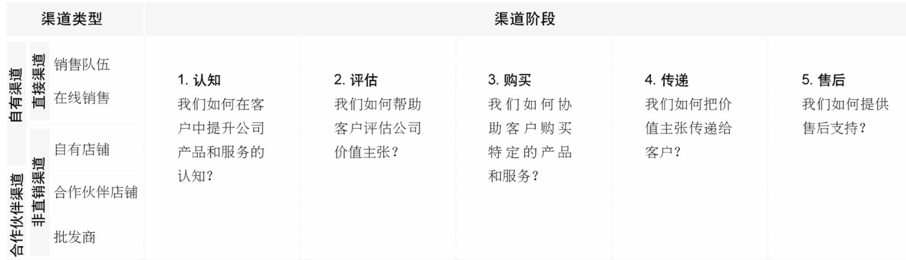
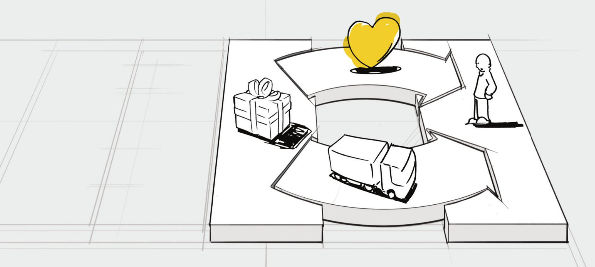
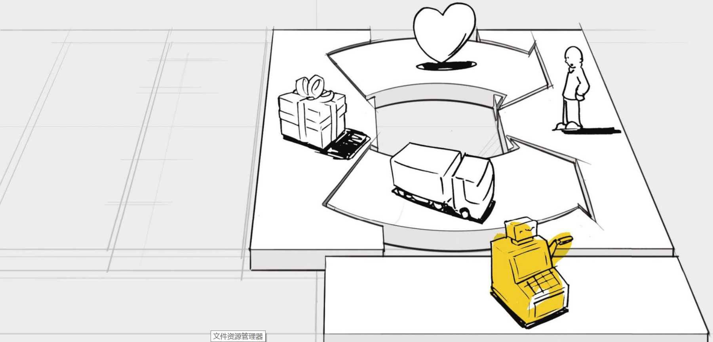

    作者: 亚历山大•奥斯特瓦德 (Alexander Osterwalder) / 伊夫•皮尼厄 (Yves Pigneur)
    出版社: 机械工业出版社
    原作名: Business Model Generation
    译者: 王帅 / 毛心宇 / 严威
    出版年: 2011-8-15
    页数: 284
    定价: 88.00元
    装帧: 平装
    ISBN: 9787111352211

[豆瓣链接](https://book.douban.com/subject/6718487/)

- [画布](#画布)
  - [商业模式的定义](#商业模式的定义)
  - [9个构造块（Building Blocks）](#9个构造块building-blocks)
    - [CS客户细分（Customer Segments）](#cs客户细分customer-segments)
    - [VP价值主张（Value Propositions）](#vp价值主张value-propositions)
    - [CH渠道通路（Channels）](#ch渠道通路channels)
    - [CR客户关系（Customer Relationships）](#cr客户关系customer-relationships)
    - [R$收入来源（Revenue Streams）](#r收入来源revenue-streams)

# 画布
`商业模式画布The Business Model Canvas`：一种用来描述商业模式、可视化商业模式、评估商业模式以及改变商业模式的通用语言。

## 商业模式的定义
`商业模式`描述了企业如何创造价值、传递价值和获取价值的基本原理

## 9个构造块（Building Blocks）
1. `客户细分Customer Segments`：企业或机构所服务的一个或多个客户分类群体。
2. `价值主张Value Propositions`：通过价值主张来解决客户难题和满足客户需求。
3. `渠道通路Channels`：通过沟通、分销和销售渠道向客户传递价值主张。
4. `客户关系Customer Relationships`：在每一个客户细分市场建立和维系客户关系。
5. `收入来源Revenue Streams`：收入来源产生于成功提供给客户的价值主张。
6. `核心资源Key Resources`：核心资源是提供和交付先前描述要素所必备的重要资产……
7. `关键业务Key Activities`：……通过执行一些关键业务活动，运转商业模式。
8. `重要合作Key Partnerships`：有些业务要外包，而另外一些资源需要从企业外部获得。
9. `成本结构Cost Structure`：商业模式上述要素所引发的成本构成。

### CS客户细分（Customer Segments）
>客户细分构造块用来描绘一个企业想要接触和服务的不同人群或组织

客户群体现为独立的客户细分群体，如果：

- 需要和提供明显不同的提供物（产品/服务）来满足客户群体的需求；
- 客户群体需要通过不同的分销渠道来接触；
- 客户群体需要不同类型的关系；
- 客户群体的盈利能力（收益性）有本质区别；
- 客户群体愿意为提供物（产品/服务）的不同方面付费。

我们正在为谁创造价值？谁是我们最重要的客户？客户细分群体存在不同的类型。这里给出了一些例子：

- `大众市场（Mass market）`：聚焦于大众市场的商业模式在不同客户细分之间没有多大区别。价值主张、渠道通路和客户关系全都聚焦于一个大范围的客户群组，在这个群组中，客户具有大致相同的需求和问题，这类商业模式经常能在消费类电子行业中找到。
- `利基市场（Niche market）`：以利基市场为目标的商业模式迎合特定的客户细分群体。价值主张、渠道通路和客户关系都针对某一利基市场的特定需求定制。这样的商业模式常常可以在供应商—采购商（supplier-buyer）的关系中找到。例如，很多汽车零部件厂商严重依赖来自主要汽车生产工厂的采购。
- `区隔化市场（Segmented）`：有些商业模式在略有不同的客户需求及困扰（needs and problems）的市场细分群体间会有所区别。例如，瑞士信贷的银行零售业务，在拥有超过10万美元资产的大客户群体与拥有超过50万美元资产的更为富有的群体之间的市场区隔就有所不同。这些客户细分有很多相似之处，但又有不同的需求和困扰。这样的客户细分群体影响了瑞士信贷商业模式的其他构造块，诸如价值主张、渠道通路、客户关系和收入来源。思考一下瑞士微型精密系统公司（Micro Precision Systems），其专门提供外包微型机械设计和生产解决方案业务，服务于3个不同的客户细分群体—钟表行业、医疗行业和工业自动化行业，而为这些行业所提供的价值主张略有不同。
- `多元化市场（Diversified）`：具有多元化客户商业模式的企业可以服务于两个具有不同需求和困扰的客户细分群体。例如，2006年亚马逊（Amazon.com）决定通过销售云计算服务而使其零售业务多样化，即在线存储空间业务与按需服务器使用业务。因此亚马逊开始以完全不同的价值主张迎合完全不同的客户细分群体—网站公司。这个策略（可以实施）的根本原因是亚马逊强大的IT基础设施经营的多样化，其基础设施能被零售业务运营和新的云计算服务所共享。
- `多边平台或多边市场（Multi-sided platforms/multi-sided markets）`：有些企业服务于两个或更多的相互依存的客户细分群体。例如，信用卡公司需要大范围的信用卡持有者，同时也需要大范围可以受理那些信用卡的商家。同样，企业提供的免费报纸需要大范围的读者以便吸引广告。另一方面，它还需要广告商为其产品及分销提供资金。这需要双边细分群体才能让这个商业模式运转起来（参见更多关于多边平台式商业模式的内容）。

### VP价值主张（Value Propositions）
>价值主张构造块用来描绘为特定客户细分创造价值的系列产品和服务

价值主张是客户转向一个公司而非另一个公司的原因，它解决了客户困扰（customer problem）或者满足了客户需求。每个价值主张都包含可选系列产品或服务，以迎合特定客户细分群体的需求。在这个意义上，价值主张是公司提供给客户的受益集合或受益系列。

我们该向客户传递什么样的价值？ 我们正在帮助我们的客户解决哪一类难题？ 我们正在满足哪些客户需求？ 我们正在提供给客户细分群体哪些系列的产品和服务？

价值主张通过迎合细分群体需求的独特组合来创造价值。价值可以是定量的（如价格、服务速度）或定性的（如设计、客户体验）。下面一些简要要素列表有助于为客户创造价值。

- `新颖（Newness）`。有些价值主张满足客户从未感受和体验过的全新需求，因为以前从来没有类似的产品或服务。这通常但不总是与技术有关，举例来说，移动电话围绕移动通信开创了一个全新的行业。另外，诸如伦理投资基金（ethical investment funds）的产品与新技术关系甚微。
- `性能（Performance）`。改善产品和服务性能是一个传统意义上创造价值的普遍方法。个人计算机（PC）行业有依赖于这个因素的传统，向市场推出更强劲的机型，但性能的改善似乎也有它的局限。例如，近几年更快速的PC、更大的磁盘存储空间和更好的图形显示都未能在用户需求方面促成对应的增长。
- `定制化（Customization）`。定制产品和服务以满足个别客户或客户细分群体的特定需求来创造价值。近几年来，大规模定制和客户参与制作的概念显得尤为重要。这个方法允许定制化产品和服务，同时还可以利用规模经济优势。
- `“把事情做好”（Getting the job done）`。可以通过帮客户把某些事情做好而简单地创造价值。罗尔斯-罗伊斯公司（Rolls-Royce）很清楚这一点：罗尔斯-罗伊斯航空公司的客户完全依赖它所制造和服务的引擎发动机。这样可以使客户把业务焦点放在他们的航线运营上。作为回报，航空公司按引擎用时向罗尔斯-罗伊斯公司支付费用。
- `设计（Design）`。设计是一个重要但又很难衡量的要素。产品可以因为优秀的设计脱颖而出，在时尚和消费电子产品工业，设计是价值主张中一个特别重要的部分。
- `品牌/身份地位（Brand/status）`。客户可以通过使用和显示某一特定品牌而发现价值。例如，佩戴一块劳力士手表象征着财富。此外，滑板者可能穿戴最新的“undergroununderground”品牌来显示他们很“潮”。
- `价格（Price）`。以更低的价格提供同质化的价值是满足价格敏感客户细分群体的通常做法，但是低价价值主张对于商业模式的其余部分有更重要的含义。经济航空公司，诸如西南航空公司（Southwest）、易捷航空公司（EasyJet）和瑞安航空公司（Ryanair）都设计了全新的商业模式，以便使低价航空旅行成为可能。另一个基于价格的价值主张例子可以在印度塔塔集团（Tata Group）设计和制造的Nano新型汽车中找到。它以令人惊叹的低价使印度全民都买得起汽车。免费产品和服务正开始越来越多地渗透到各行各业。免费提供产品和服务的范围很广，从免费报纸到免费电子邮件、免费移动电话服务无所不包（参见本书之后更多的关于免费式商业模式的内容）。
- `成本削减（Cost reduction）`。帮助客户削减成本是创造价值的重要方法。例如，Salesforce.com公司销售在线的客户关系管理系统（CRM）的应用，这项服务减少了购买者的开销并免除了用户自行购买、安装和管理CRM软件的麻烦。
- `风险抑制（Risk reduction）`。当客户购买产品和服务的时候，帮助客户抑制风险也可以创造客户价值。对于二手汽车买家来说，为期一年的服务担保规避了在购买后发生故障和修理的风险。而服务品质级别担保书（service-level guarantee）部分抑制了由买方承担外包IT服务所要承担的风险。
- `可达性（Accessibility）`。把产品和服务提供给以前接触不到的客户是另一个创造价值的方法。这既可能是商业模式创新的结果，也可能是新技术的结果，或者兼而有之。例如，奈特捷航空公司（NetJets）以普及私人飞机拥有权（fractional private jet ownership）概念而著称。通过应用创新的商业模式，奈特捷航空提供私人及企业拥有私人飞机的权限，在此之前这项服务对于绝大部分客户来说都很难支付得起。同样，共同基金（mutual funds）是通过提升可达性来创造价值的另一个例子。这种创新的金融产品使那些小康微富的人建立多元化的投资组合成为可能。
- `便利性/可用性（Convenience / usability）`。使事情更方便或易于使用可以创造可观的价值。苹果公司的iPod和iTunes为用户提供了在搜索、购买、下载和收听数字音乐方面前所未有的便捷体验。现在，苹果已经主导了市场。

### CH渠道通路（Channels）
>渠道通路构造块用来描绘公司是如何沟通、接触其客户细分而传递其价值主张

渠道通路包含以下功能：

- 提升公司产品和服务在客户中的认知；
- 帮助客户评估公司价值主张；
- 协助客户购买特定产品和服务；
- 向客户传递价值主张；
- 提供售后客户支持。

通过哪些渠道可以接触我们的客户细分群体？ 我们现在如何接触他们？我们的渠道如何整合？ 哪些渠道最有效？哪些渠道成本效益最好？ 如何把我们的渠道与客户的例行程序进行整合？

渠道具有5个不同的阶段，每个渠道都能经历部分或全部阶段。我们可以区分直销渠道与非直销渠道，也可以区分自有渠道和合作伙伴渠道。

### CR客户关系（Customer Relationships）
>客户关系构造块用来描绘公司与特定客户细分群体建立的关系类型

客户关系可以被以下几个动机所驱动：

- 客户获取
- 客户维系
- 提升销售额（追加销售）

我们每个客户细分群体希望我们与之建立和保持何种关系？哪些关系我们已经建立了？这些关系成本如何？如何把它们与商业模式的其余部分进行整合？

我们可以把客户关系分成几种类型，这些客户关系可能共存于企业与特定客户细分群体之间。

- `个人助理（Personal assistance）`.这种关系类型基于人与人之间的互动。在销售过程中或者售后阶段，客户可以与客户代表交流并获取帮助。在销售地点，可以通过呼叫中心、电子邮件或其他销售方式等个人助理手段来进行。
- `专用个人助理（Dedicated personal assistance）`。这种关系类型包含了为单一客户安排的专门的客户代表。它是层次最深、最亲密的关系类型，通常需要较长时间来建立。例如，私人银行服务会指派银行经理向高净值个人客户提供服务。在其他商业领域也能看到类似的关系类型，关键客户经理与重要客户保持着私人联系。
- `自助服务（Self-service）`。在这种关系类型中，一家公司与客户之间不存在直接的关系，而是为客户提供自助服务所需要的所有条件。
- `自动化服务（Automated services）`。这种关系类型整合了更加精细的自动化过程，用于实现客户的自助服务。例如，客户可以通过在线档案来定制个性化服务。自动化服务可以识别不同客户及其特点，并提供与客户订单或交易相关的信息。最佳情况下，良好的自动化服务可以模拟个人助理服务的体验（例如提供图书或电影推荐）。
- `社区（Communities）`。目前各公司正越来越多地利用用户社区与客户/潜在客户建立更为深入的联系，并促进社区成员之间的互动。许多公司都建立了在线社区，让其用户交流知识和经验，解决彼此的问题。
- `共同创作（Co-creation）`。许多公司超越了与客户之间传统的客户—供应商关系，而倾向于和客户共同创造价值。亚马逊书店就邀请顾客来撰写书评，从而为其他图书爱好者提供价值。有的公司还鼓励客户参与到全新和创新产品的设计过程中来。还有一些公司，例如YouTube，请用户来创作视频供其他用户观看。

### R$收入来源（Revenue Streams）
>收入来源构造块用来描绘公司从每个客户群体中获取的现金收入（需要从创收中扣除成本）

一个商业模式可以包含两种不同类型的收入来源：
1. 通过客户一次性支付获得的交易收入。
2. 经常性收入来自客户为获得价值主张与售后服务而持续支付的费用。

什么样的价值能让客户愿意付费？他们现在付费买什么？他们是如何支付费用的？他们更愿意如何支付费用？每个收入来源占总收入的比例是多少？

以下是一些可以获取收入的方式：

- `资产销售（Asset sale）`：最为人熟知的收入来源方式是销售实体产品的所有权。亚马逊在线销售图书、音乐、消费类电子产品和其他产品。菲亚特销售汽车，客户购买之后可以任意驾驶、转售甚至破坏。
- `使用收费（Usage fee）`：这种收入来源于通过特定的服务收费。客户使用的服务越多，付费越多。电信运营商可以按照客户通话时长来计费。旅馆可以按照客户入住天数来计费。快递公司可以按照运送地点的距离来计费。
- `订阅收费（Subscription fees）`：这种收入来自销售重复使用的服务。一家健身房可以按月或按年以会员制订阅方式来销售健身设备的使用权。在线魔兽世界—一款大型多人在线角色扮演游戏，允许用户使用按月订阅的付费方式。诺基亚的音乐服务也可以让用户通过按月订阅付费的方式来收听音乐。
- `租赁收费（Lending/Renting/Leasing）`：这种收入来源于针对某个特定资产在固定时间内的暂时性排他使用权的授权。对于出借方而言，租赁收费可以带来经常性收入的优势。另一方面，租用方或承租方可以仅支付限时租期内的费用，而无须承担购买所有权的全部费用。Zipcar.com提供了一个很好的例证。该公司可以让客户在北美各大城市按小时租车。Zipcar.com的服务导致许多消费者决定租赁汽车而不再购买汽车。
- `授权收费（Licensing）`：这种收入来自将受保护的知识产权授权给客户使用，并换取授权费用。授权方式可以让版权持有者不必将产品制造出来或者将服务商业化，仅靠知识产权本身即可产生收入。授权方式在媒体行业非常普遍，内容所有者保留版权，但是可以将使用权销售给第三方。同样，在技术行业，专利持有人授权其他公司使用专利技术，并收取授权费作为回报。
- `经纪收费（Brokerage fees）`：这种收入来自为了双方或多方之间的利益所提供的中介服务而收取的佣金。例如，信用卡提供商作为信用卡商户和顾客的中间人，从每笔销售交易中抽取一定比例的金额作为佣金。同样，股票经纪人和房地产经纪人通过成功匹配卖家和买家来赚取佣金。
- `广告收费（Advertising）`：这种收入来源于为特定的产品、服务或品牌提供广告宣传服务。传统上，媒体行业和会展行业均以此作为主要收入来源。近几年，在其他行业包括软件和服务，也开始逐渐向广告收入倾斜。

定价机制有两种主要的形式：固定定价（根据静态变量）和动态定价。

