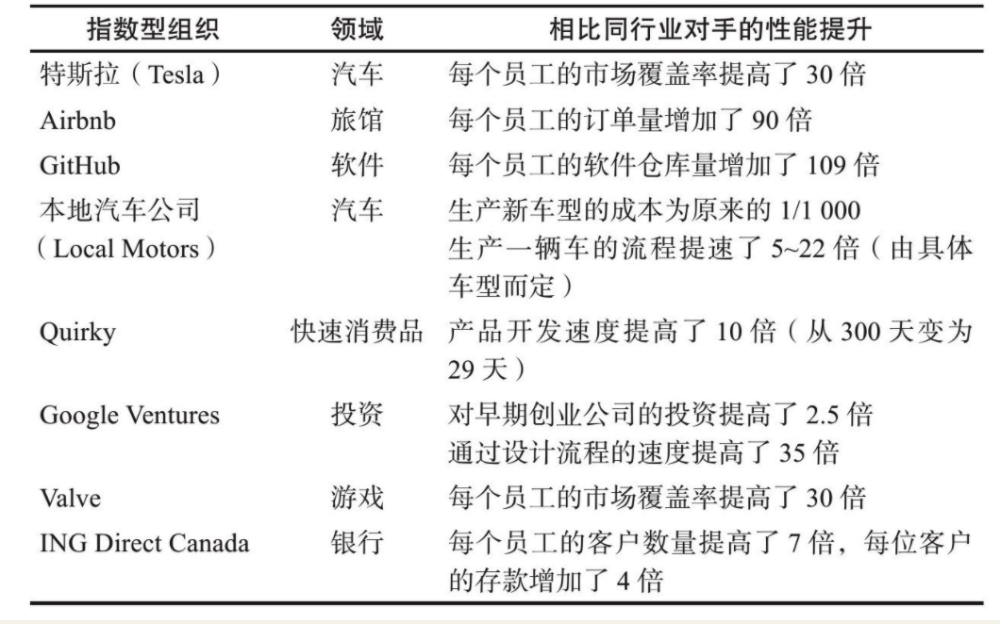

    作者: 萨利姆•伊斯梅尔 (Salim Ismail) / 迈克尔•马隆 (Michael S. Malone) / 尤里•范吉斯特 (Yuri van Geest)
    出版社: 浙江人民出版社
    副标题: 打造独角兽公司的11个最强属性
    原作名: Exponential Organizations: Why new organizations are ten times better, faster, and cheaper than yours
    译者: 苏健
    出版年: 2015-8-1
    页数: 290
    定价: CNY 69.90
    装帧: 平装
    ISBN: 9787213069215

[豆瓣链接](https://book.douban.com/subject/26646553/)

- [引言 指数型组织，撬动世界的新杠杆](#引言-指数型组织撬动世界的新杠杆)
  - [铱星悲剧，线性思维的苦果](#铱星悲剧线性思维的苦果)
  - [新发现：组织扩张的“摩尔定律”](#新发现组织扩张的摩尔定律)
  - [指数型组织，撬动世界的新杠杆](#指数型组织撬动世界的新杠杆)
  - [MTP](#mtp)
  - [独角兽公司](#独角兽公司)
- [第一部分 指数型组织的前世今生](#第一部分-指数型组织的前世今生)
  - [01 颠覆一切的信息技术](#01-颠覆一切的信息技术)
  - [02 为什么诺基亚收购Navteq而谷歌收购Waze](#02-为什么诺基亚收购navteq而谷歌收购waze)
    - [指数型组织是最有希望的组织](#指数型组织是最有希望的组织)

# 引言 指数型组织，撬动世界的新杠杆
## 铱星悲剧，线性思维的苦果
摩托罗拉通过计算发现，手机信号塔的高昂成本（每座大约为10万美元，且不包含频段利用率的限制和生产砖头般大小的手持设备的不菲开销）。

一个由77颗卫星（铱是元素周期表中的第77个元素）组成的近地轨道系统将覆盖整个地球，一劳永逸地提供移动电话通信服务。从此，位置不再是什么局限。摩托罗拉还得出结论：在各个发达国家里，只要有100万人肯花3000美元买一部卫星电话，再加上每分钟5美元的使用费，那么这个卫星网络就能很快转为盈利。

铱星最终在耗费了投资人50亿美元的成本之后就宣告彻底失败。

手机信号塔的建设成本在逐步降低，而网络速度也发生了数量级上的提升，手持设备更是变得越来越小、越来越便宜。

这次惨败的一个原因就是该公司不愿意调整商业期望。“铱星的商业计划在该系统开始运营的12年前就已定死了。”他回忆道。这时间跨度太大了，大到你根本不可能预测当卫星系统终于部署完毕时数字通信世界会发生什么样的变化。因此，我们将其称为“铱星悲剧”（Iridium Moment），即使用线性的工具和过时的趋势来预测加速变化的未来。

柯达公司（Eastman Kodak）发明了数码相机，又拒绝了数码相机的公司在2012年宣布了破产。就在柯达关门大吉的这段时间里，营业仅3年，员工仅13人的创业公司Instagram被Facebook以10亿美元收购了。

## 新发现：组织扩张的“摩尔定律”
社会生产力在大多数情况下都是其人力资源的函数：成年男性和女性负责狩猎、采集和建造，而儿童则负责帮忙。如果为收获谷物或者狩猎的任务增加一倍的人手，那么社会的产出就能提高一倍。

人类开始驯养牲畜，例如牛和马，从而进一步提高了产出。但是，这个等式依然保持着线性。双倍的牲畜就意味着双倍的产出。

工业时代的黎明到来时，产出完成了一次巨大的跳跃。现在，单个个体就能操作拥有10匹马或100个劳工的劳动力的机器。运输乃至分配的速度在增长了一倍之后，发生了人类历史上第一次三倍的跃升。

在人类生产力增长的这一最新阶段，限制增长的因素已从人类或动物的数量转变成了机器的数量和投入的资本。将工厂的数量扩大一倍就意味着产出将提高一倍。

但是，这样的增长需要耗费大量时间，一般来说，也必须有极其庞大的资本投入。这一切都是代价高昂的，而且大规模招聘所带来的麻烦和设计、制造和分销新设备所遇到的困难也让公司的战线一拖就是好几年。

## 指数型组织，撬动世界的新杠杆
`指数型组织`（Exponential Organization, ExO）是指在运用了高速发展的技术的新型组织方法的帮助下，让影响力（或产出）相比同行发生不成比例的大幅增长的组织（至少10倍）。不同于使用人海战术或大型实体工厂的传统组织，指数型组织的建立根基是信息技术，将原本的实体去物质化，转变成需求最大的数字世界中的东西。

## MTP
指数型组织都有一个“崇高而热切的目标”，这个目标就是`“宏大变革目标”`（Massive Transformative Purpose, MTP）。Quirky的MTP是“让发明触手可及”，奇点大学的MTP是“为10亿人带来积极的影响”。

## 独角兽公司
`“独角兽公司”`是艾琳·李2013年11月在TechCrunch国际创新峰会上提出的一个概念，代指那些估值超过10亿美元的创业公司。

# 第一部分 指数型组织的前世今生
## 01 颠覆一切的信息技术
- 在指数级改变正成为主旋律的时代，很多领域的专家仍会固守线性思维。
- 从胶卷摄影向数字摄影的革命性转变，正发生在一些加速增长的技术领域。
- 我们正在“信息化”一切。
- 信息化环境为人们提供了根本性颠覆的机遇。
- 即便是传统产业也面临被颠覆的危险。

## 02 为什么诺基亚收购Navteq而谷歌收购Waze
- 我们的组织结构进化至今是为了能管理稀缺资源。“拥有”的概念适用于稀缺资源，但使用或共享的概念更适合富足的、以信息为基础的世界。
- 尽管以信息为基础的世界正以指数级速度发展，但我们的组织结构却依然是线性的（尤其是大型组织）。
- 我们已经学会了如何实现技术的成倍增长；现在该学习如何让组织成倍增长了。

### 指数型组织是最有希望的组织
我们甚至发现了一个简单的计算标准，能够识别和分辨新生的指数型组织：在4～5年内产出至少增长10倍。

表2-1　一些指数型组织业绩至少提高10倍的表现

让Waze大获成功的关键性因素有二，而这两个因素也同样适用于所有新一代的指数型公司：

- 借用非你所有的资源。在Waze的案例中，公司利用了本就安装在用户智能手机上的GPS。
- 信息是你最重要的资产。信息比其他任何资产都更为可靠，并且有持续成倍增长的潜力。成功的关键并不是单纯地聚集资产，而是从现有信息中获取有价值的精华。

