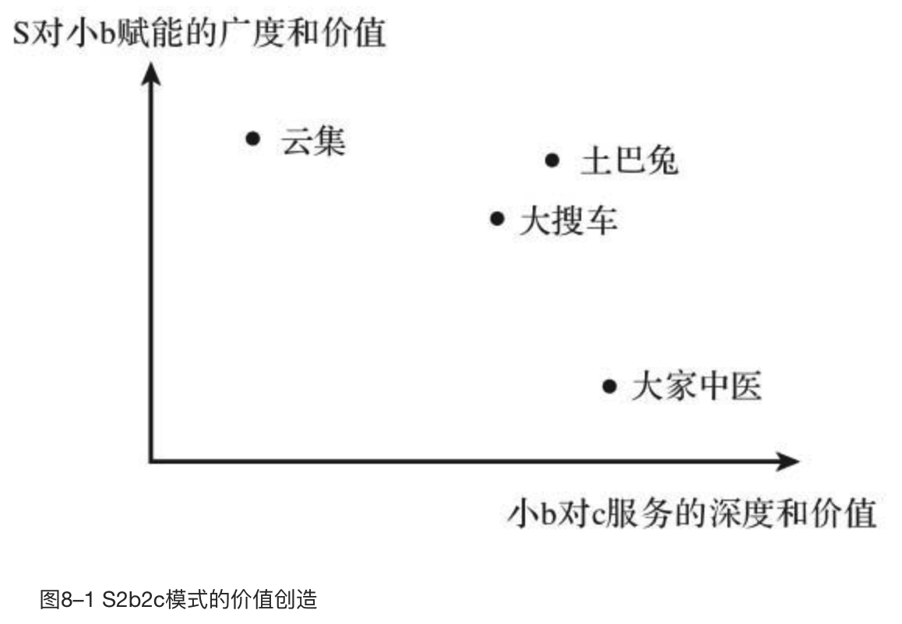
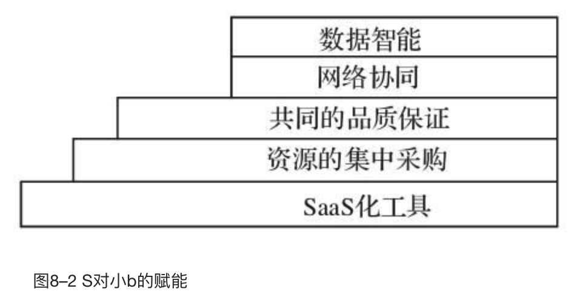
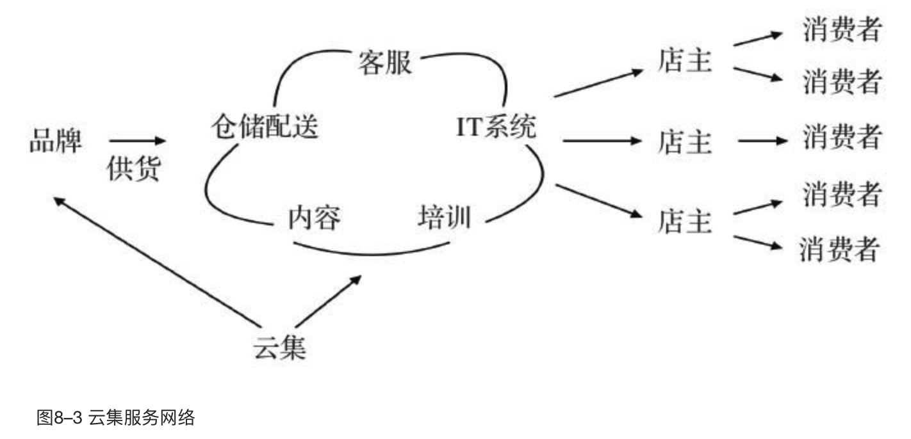
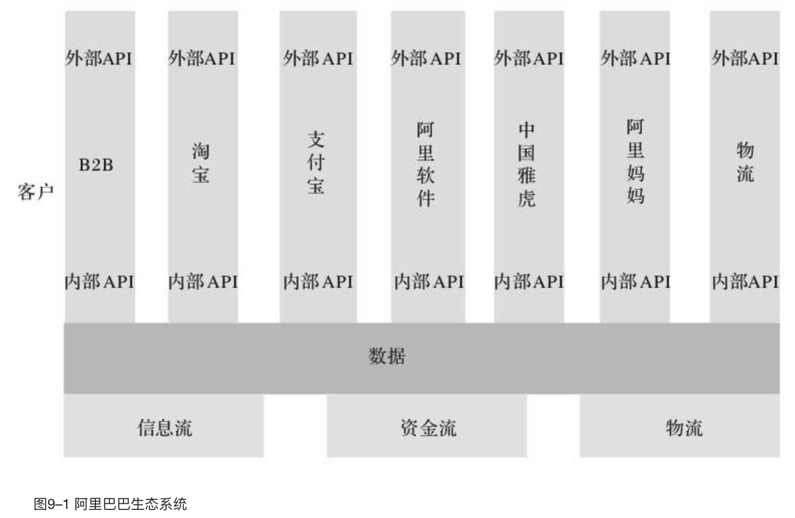

    作者: 曾鸣
    出版社: 中信出版集团
    出版年: 2018-11
    页数: 284
    定价: 68.00
    装帧: 精装
    丛书: 智能商业 书系
    ISBN: 9787508695761
  
  [豆瓣链接](https://book.douban.com/subject/30357931/)

- [第一部分 智能商业](#第一部分-智能商业)
  - [01 智能商业大变革](#01-智能商业大变革)
    - [智能商业：网络和数据时代的必然选择](#智能商业网络和数据时代的必然选择)
    - [双螺旋构成：网络协同+数据智能](#双螺旋构成网络协同数据智能)
    - [未来已来，智能商业将走向何方](#未来已来智能商业将走向何方)
      - [在线化](#在线化)
      - [智能化](#智能化)
      - [协同网络的扩张](#协同网络的扩张)
  - [02 互联网的本质](#02-互联网的本质)
    - [联：改变物理世界的底层技术革命](#联改变物理世界的底层技术革命)
    - [互：让交流沟通具备无限可能](#互让交流沟通具备无限可能)
    - [网：互联网给商业社会带来的颠覆性改变](#网互联网给商业社会带来的颠覆性改变)
  - [03 智能商业双螺旋之一：网络协同](#03-智能商业双螺旋之一网络协同)
    - [网络协同：新经济范式革命](#网络协同新经济范式革命)
    - [淘宝与优步：网络协同效应的胜利](#淘宝与优步网络协同效应的胜利)
  - [04 智能商业双螺旋之二：数据智能](#04-智能商业双螺旋之二数据智能)
    - [数据化：商业创新的基础](#数据化商业创新的基础)
    - [算法化：智能商业的“引擎”，而非“工具”](#算法化智能商业的引擎而非工具)
    - [产品化：数据智能和商业场景的最终载体](#产品化数据智能和商业场景的最终载体)
    - [产品设计直接影响用户体验](#产品设计直接影响用户体验)
    - [活数据：让反馈成为闭环](#活数据让反馈成为闭环)
    - [“活数据”的三大重要特征](#活数据的三大重要特征)
  - [05 智能商业的特征：向精准升维](#05-智能商业的特征向精准升维)
    - [“精+准”是未来商业的核心要求](#精准是未来商业的核心要求)
  - [06 黑洞效应：智能商业胜出的秘密](#06-黑洞效应智能商业胜出的秘密)
    - [黑洞效应：智能商业的优势源泉](#黑洞效应智能商业的优势源泉)
      - [网络效应](#网络效应)
      - [学习效应](#学习效应)
      - [数据压强会推动数据智能发展](#数据压强会推动数据智能发展)
    - [数据智能拥有网络张力](#数据智能拥有网络张力)
- [第二部分 商业模式变革](#第二部分-商业模式变革)
  - [07 C2B：未来的核心商业模式](#07-c2b未来的核心商业模式)
    - [B2B代表企业：阿里巴巴、中化网](#b2b代表企业阿里巴巴中化网)
      - [水平B2B](#水平b2b)
      - [垂直B2B](#垂直b2b)
    - [B2C代表企业：亚马逊、天猫和京东](#b2c代表企业亚马逊天猫和京东)
    - [C2C代表企业：易贝、淘宝](#c2c代表企业易贝淘宝)
    - [C2B：对传统工业时代的颠覆](#c2b对传统工业时代的颠覆)
  - [08 S2B：通往C2B模式的自然演化路径](#08-s2b通往c2b模式的自然演化路径)
    - [S2b2c的模式创新](#s2b2c的模式创新)
    - [S和小b的新型合作](#s和小b的新型合作)
    - [赋能的五个方面](#赋能的五个方面)
      - [SaaS化工具](#saas化工具)
      - [资源的集中采购](#资源的集中采购)
      - [共同的品质保证](#共同的品质保证)
      - [网络协同](#网络协同)
      - [数据智能](#数据智能)
- [第三部分 战略变革](#第三部分-战略变革)
  - [09 新战略：高效反馈闭环](#09-新战略高效反馈闭环)
    - [看十年，做一年](#看十年做一年)
    - [阿里巴巴历史上最重要的一次战略会](#阿里巴巴历史上最重要的一次战略会)
    - [战略实验](#战略实验)
  - [10 新定位：点—线—面—体](#10-新定位点线面体)
    - [“点—线—面—体”的定位逻辑](#点线面体的定位逻辑)
      - [面](#面)
      - [点](#点)
      - [线](#线)
      - [体](#体)
    - [淘宝的动态演化](#淘宝的动态演化)
      - [“点”“线”“面”交织成“体”](#点线面交织成体)
      - [开放，连接，扩大网络](#开放连接扩大网络)
      - [协同演化](#协同演化)
    - [生态系统对供应链的升维打击](#生态系统对供应链的升维打击)
    - [企业未来的发展方向](#企业未来的发展方向)
- [第四部分 组织变革](#第四部分-组织变革)
  - [11 第四次组织创新：创造力革命](#11-第四次组织创新创造力革命)
    - [历史演变：组织创新的三次革命](#历史演变组织创新的三次革命)
    - [工业革命](#工业革命)
    - [生产力革命](#生产力革命)
    - [管理革命](#管理革命)
    - [创造力革命](#创造力革命)
  - [12 新组织原则：从管理到赋能](#12-新组织原则从管理到赋能)
    - [忘掉管理，拥抱赋能](#忘掉管理拥抱赋能)
      - [领导者的目的不是管理，而是支持](#领导者的目的不是管理而是支持)
      - [团队成员的驱动力不是传统的劳动报酬，而是成就感和社会价值](#团队成员的驱动力不是传统的劳动报酬而是成就感和社会价值)
    - [打造全新的赋能型组织](#打造全新的赋能型组织)
      - [匹配创造者的兴趣、动力与合适的挑战](#匹配创造者的兴趣动力与合适的挑战)
      - [打造环境和氛围，方便员工共同创造](#打造环境和氛围方便员工共同创造)
      - [通过组织设计，刺激人和人之间的有效互动](#通过组织设计刺激人和人之间的有效互动)
  - [13 自组织协同网](#13-自组织协同网)

# 第一部分 智能商业
## 01 智能商业大变革
### 智能商业：网络和数据时代的必然选择
我总结出三个重要方向上的创新。这些企业在这三个方向上，最少把握住了两个，并且在这些方向上都有了巨大的突破（见图1–1）。

- 第一，**在线化**。身处互联网时代，你有没有联网，有没有在线，是最重要的一步。
- 第二，**智能化**。谷歌首席执行官埃里克·施密特最近说：“现在是数据的时代，算法的时代。”数据和算法，构成了智能的基本要素。谷歌的成功，最重要的是推动了整个商业的智能化进程。`搜索`是第一款大规模商业应用的智能服务。除了搜索之外，智能服务的第二个核心产品是`推荐`。
- 第三，**网络化**。实际上谷歌的广告系统非常赚钱的就是一个由千万级的小广告主和千万级的网站所组成的高效生态。同样，脸书这几年的成功也是因为它在广告技术方面的突破。阿里巴巴，特别是淘宝，则是将网络协同和智能化这两个方面做成了一个紧密结合又互相促进的生态。

### 双螺旋构成：网络协同+数据智能
简单来说，智能商业最重要的两个组成部分分别是网络协同与数据智能（见图1–2）。

所谓的`人类文明`，最关键的并不是每一个个体，而是整个社会日益增强的协同能力，这才是我们这个时代最大的优势。

所谓`网络协同`，指的是通过大规模、多角色的实时互动来解决特定问题。以前我们解决一个问题，通常需要通过命令、科层制或者在简单市场中通过价格信号进行调整，但今天更多的是通过大规模、并发、多角色的实时互动加以实现。

淘宝不是零售商，我们不拥有任何一件商品，它是一个零售的生态圈，是一个赋能卖家的平台。淘宝之所以能够创造这么多奇迹，很重要的一个原因是淘宝演化成了一个社会化协同的大平台。在今天，即使是非常小的一个淘宝新卖家，也可以在线同时和几百个服务商合作，只需要有一个API（应用程序编程接口）的链接，就能调动相关的数据和相关的服务。

`算法`其实就是将人对特定事情的理解转换成机器可以理解和执行的模型与代码。

对于绝大多数企业来说，今后10年，最难的其实是创造一种产品和服务方式，把原来离线的用户在线化，产生一个持续的互动，这样才能实时记录用户的反馈，也才能优化算法、优化服务。

### 未来已来，智能商业将走向何方
在未来10年里，智能商业的发展依然要靠三条主线的突破。

#### 在线化
`IoT`的本质是一种新的人机交互方式。在PC互联网时代，人是被键盘锁定的；移动互联网时代，人是被手机锁定的；到IoT时代，人的五官得到极大延伸。

#### 智能化
未来，对大部分的企业来说，不用担心算法有多难，也不用担心招不到算法工程师，因为算法会像云计算一样成为一项基础设施；算法对大部分应用企业不会是一个壁垒，反而是一个有力的工具。

#### 协同网络的扩张
谷歌把广告在线化了，淘宝把零售在线化了。

几乎每个行业都会经历一个从传统的、封闭的、线性的供应链，走向开放的、价值协同网的完整过程，这中间有巨大的商机。

## 02 互联网的本质
### 联：改变物理世界的底层技术革命
- 连接1.0时代：PC互联网
- 连接2.0时代：移动互联网
- 连接3.0时代：万物互联网

### 互：让交流沟通具备无限可能
- 互动1.0时代：一对多的门户广播模式(门户网站新浪、搜狐、网易是典型代表)
- 互动2.0时代：以关注为典型代表的创新型互动(以分享、社区为核心的创新型互动产品，比如微博、推特和Instagram)
- 互动3.0时代：社交网络服务(两个SNS的大产品——美国的脸书与中国的微信)

### 网：互联网给商业社会带来的颠覆性改变
其实商业最重要的就是结网，未来互联网将给人类商业社会带来的颠覆性改变，就在于商业的大规模结网。当海量的人已经可以同时在线互动的时候，如何让他们通过在线协作的方式去完成某一件事情，便成为一种新的商业组织方式。

要想实现智能商业的第一步，就是让你的产品和服务核心流程`在线化`。在线化之后，真正的考验是你能否通过各种方式完成与客户的互动。

## 03 智能商业双螺旋之一：网络协同
### 网络协同：新经济范式革命
如果说农业时代自给自足、村社范围简单交换的经济范式可以用“点”来描述，那么“线”或许就是工业时代经济范式的典型意向——流水线、供应链、科层制。到了万物互联的时代，新经济范式最根本的特质就是“网”——开放的网络结构、自由的多元协同、分布式的自组织体系。

我将这种新的经济范式称为`“网络协同”`。在商业世界里，网络协同正在取代工业时代相对封闭的体系（例如传统的供应链体系），成为互联网时代的基本合作范式。

淘宝打败美国易贝的一个重要原因是，淘宝鼓励商家和消费者**直接、充分地连接、互动**，而易贝则在这方面无动于衷。例如，旺旺使卖家和买家连接互动，评价让买家之间连接互动，帮派论坛则让卖家之间连接互动。直连互动使卖家和买家的积极性与创造力被极大激发，网络扩张带来的效益被成倍放大。

支付宝的出现，本质上也是在促使直连互动更好地发生。在中国的商业环境下，买卖双方互动必然面临信任缺失的问题，而支付宝解决了这个市场的信任问题，使这个双边市场变得更加繁荣。

**“边界开放+直连互动”** 带来的创造力激发，首先体现在淘宝的网络扩张上。各种新商品被卖家上线销售，各种新店也纷纷开张。为了对更多的细分市场形成覆盖，淘宝不断拆分类目，甚至由各种奇特到无法归类的商品所形成的“其他”类目到今天都还是商品数最多的类目之一。

如果说`“双边市场的扩张”`是淘宝早期的核心特征，那么，当这些新角色不断产生后，淘宝在第二个阶段的核心特征，就是**从一个简单的双边市场演化成了一个复杂的多边市场**，多元角色在其中相互协同表现得越来越充分，淘宝也越来越立体。这个立体的淘宝还在继续演化，协同从商品买卖这个环节向广告、物流、供应链等众多环节进一步延展，更多的场景被网罗进来，更多元的协同在这一网络中发生。

比如，网络协同进一步扩展到了物流，菜鸟网络就是阿里巴巴在这个领域最主要的存在，其全名是全国智能物流骨干网。它连接所有物流公司、快递人员以及仓库，同样，它也是一个利用互联网分布式信息可以同步共享的结构，让所有人的商业信息在参与方之间可以适时、多方、多角度的互动沟通，而不需要中间人来计划和安排。

在中国有一个颇具特色的团体叫作“字幕组”，近年来活跃在各大中文视频网站。该团队中绝大部分成员是定居在全球各地的华人，由于全球优秀的影视剧作品往往没有官方中文字幕，所以他们自由组队，利用业余时间，发挥外语特长，为数以千计的电影、电视剧制作准确、精致的中文字幕。他们的总人数无法估算，因为他们本就是招之即来，“事了拂衣去，深藏身与名”。他们不会得到金钱回报，但在中文观众中获得了信誉、声望和自我满足。他们甚至完成过一项非常棘手的任务——史上最佳华语电影之一、台湾大导演杨德昌的作品《牯岭街少年杀人事件》。这部电影当时因为重新完成了数码版修复，未能及时制作字幕，并且电影中出现了中国各地方言、普通话、日语、英语等十几种语言。结果，字幕组的团队瞬间又扩大了，精通中国各地方言的各地人你翻译一句，我录入一句，他修正一句，在一个叫作“B站”的视频分享网站上，仅仅用了一夜的时间就做好了字幕。

无论是淘宝还是“字幕组”等团队，都是开放、协同、共享、共建的网状结构，它们已经开始取代封闭、线性、管理、控制的工业时代线性结构。这就是新经济范式的革命。

### 淘宝与优步：网络协同效应的胜利
如果我们认真思考优步的核心优势就会发现，从经济学的角度来说，优步其实并没有享受到多大的网络协同效应，它更大的价值还是源于传统的规模经济。快速扩张供给端，吸引众多的司机到这个平台上，形成规模优势。原来那些被挡在准入门槛之外没有牌照的服务者得以加入市场并提供服务，大大提高了服务质量，也降低了交易价格。

说到这里，有一个重要的推论不可不提——没有网络协同效应，单靠规模经济无法形成垄断。如果在需求端没有网络协同效应，即使供给端的规模效应再强大，用户的转移成本也依然很低。就像很多人手机上曾经装过好几个打车App，无论是滴滴、优步、神州，还是易到，使用时可以随意切换。这么重要的高频应用是为了使用方便，并获得确定性服务。对于用户来说，多下载一个App的成本并不算太高。同时，由于在高峰时期，几乎没有任何一个网络能够提供足够好的体验，这给跟随者留下了生存空间。司机更是如此，同时安装几个App，同时接单几乎成为常态。

也就是说，规模经济的壁垒比网络协同效应的壁垒要低得多，可以用海量资本进行密集轰炸以便攻克。

这个横向积累很厚实，使得纵向方面平台也有了强大的拓展能力，逐步从零售走到广告、营销、物流、金融等新的创新领域。淘宝能有这样的广度和深度，很大程度上是由于网络自己有很大的扩张动力，不同类型的卖家聚集在一起，不仅可以分摊各种基础服务的成本，也能分摊获取客户的成本。淘宝的核心是商品的丰富性，不是简单的商品和用户规模。

在优步平台上，不管司机还是乘客，都是相当简单和同质化的角色，这样的网络显然缺乏自主生长动力。优步在打车之外一度被寄予厚望的快递服务、送餐服务的业务扩张也并不顺利，根本原因在于这些都不是原有网络的自然延伸，而是需要靠管理者去复制在原有领域的成功。在这个时代，靠管理者去复制原有模式，很难比得上在另一个领域里有更深积累的创业者的爆发力。

## 04 智能商业双螺旋之二：数据智能
### 数据化：商业创新的基础
如果我们更全面地检视蚂蚁小贷的业务，就会发现它做了三件关键的事：特定商业场景的数据化、忠实于商业逻辑的算法及其迭代优化，以及将数据智能与商业场景无缝融合的产品。

“数据化”本质上是将一种现象转变为可量化形式的过程。

### 算法化：智能商业的“引擎”，而非“工具”
算法是什么？算法是按照设定程序运行以获得理想结果的一套指令。

### 产品化：数据智能和商业场景的最终载体
产品和数据、算法的互补作用可以形象地比喻成“端+云”。“端”就是产品，是与用户完成个性化、实时、海量、低成本互动的端口，它不仅直接完成用户体验，同时使数据记录和用户反馈闭环得以发生，和“云”互动；而“云”则是数据聚合、算法计算的平台，它通过算法优化，更好地揣摩用户需求、提升用户体验。作为“端”的产品，具备以下三大关键作用。

### 产品设计直接影响用户体验
- 上传：将“端”的行为数据向“云”反馈
- 下达：将“云”的数据智能传递到“端”

上传下达，双“管”齐下，数据闭环靠产品互动实现，而产品体验依赖于数据智能，数据和产品合二为一。

因此，智能商业的成功，最关键的一步往往是一个极富想象力的创新产品：针对某个用户问题，定义了全新的用户体验方式，同时启动了数据智能的引擎，持续提升用户体验。

数据化、算法化加上产品化构成了智能商业的三大基石。

一言以蔽之，数据化、算法化和产品化就是在反馈闭环中完成了智能商业的“三位一体”的。

### 活数据：让反馈成为闭环
1. 数据是“活”的
   1. “活数据”一定是始终在线且不断更新的，可以随时被使用。
2. 数据需要被灵活使用
   1. “活数据”在不断地被消化、处理，产生增值服务，同时又能产生更多的数据，形成数据回流。

### “活数据”的三大重要特征
1. 全本记录，而非样本抽查
2. 先有数据，后有洞察
3. 数据就是决策

## 05 智能商业的特征：向精准升维
### “精+准”是未来商业的核心要求
对于传统企业来说，利用规模优势进入主要通路，并且尽量抢占头部位置，才是商业的核心所在。在此基础上，传统商业中所谓的“精准”，只是降低成本、提升利润的手段之一，而且只能在很粗的层面实现。

精准商业要建立在和用户的持续性互动关系之上，在这种持续性互动中，对产品（服务）进行迭代和优化，从而更加精准。在这个模式下诞生的产品是一种“活”的产品。而要创造一个“活”的产品，就必须以数据智能作为产品的核心。因为，一方面产品的价值很大一部分来源于数据智能在其中的应用，另一方面产品本身又是收集数据的渠道，形成反馈闭环、学习优化的基础。

## 06 黑洞效应：智能商业胜出的秘密
### 黑洞效应：智能商业的优势源泉
#### 网络效应
智能商业双螺旋之一是网络协同，而网络协同的驱动力就是网络效应。既然是互联网企业，天生就带有“网络效应”，具备指数型扩张等大众已经非常熟悉的互联网天然优势。所以，“黑洞”型企业的第一个优势当然就是网络效应。

#### 学习效应
这是7（一周7天）×24（一天24小时）永不停歇的自我运转，所以这种学习效应是乘法叠加的。“黑洞”型企业越学越聪明，学得越来越好、越来越快，这就是学习效应。

#### 数据压强会推动数据智能发展
一个网络在不断扩张时，数据天然会被记录下来，随着时间的推移，积累的数据会越来越多。当网络越来越复杂以后，靠人力根本无法完成如此繁重的工作。就像我们提到的快手，人流量快速过亿。如此庞大的人群，每天都会产生极为庞大的数据量，我称之为“数据压强”。在这种巨大的原生性压力面前，人力束手无策，数据智能是唯一且必然的选择。

### 数据智能拥有网络张力
1. 物质资源有形，数据资源无形
1. 物质资源传播成本高，数据资源传播成本低
1. 物质资源的使用是损耗过程，数据资源的使用是价值创造过程
1. 二者的经济学原理不同
   1. 在给传统的物质资源定价时，成本因素起到了很大作用。但是对于数据资源而言，编辑复制它的成本基本趋近于零。另外，同样的数据资源在不同人眼中，价值也完全不同。从市场有效性的角度来看，某个特定信息总是有着极大的意愿去触达不同的人群，总是希望能够在网络上“走”得更远一些。唯有如此，它才会有更大的概率遇到某个愿意为这个信息付出高额溢价的人。

在智能商业的时代，想要让自己的企业获得成功，首先要问自己4个问题：

- 第一个问题，我的企业能否最大限度地实现网络化？
- 第二个问题，我的企业能否尽可能地引入机器的学习效应？
- 第三个问题，我的企业能不能在网络扩张的过程中，尽可能地用机器决策取代人工决策？
- 最后一个问题，我的企业能否让自己收集的数据与更多不同类型的数据产生交换？

# 第二部分 商业模式变革
## 07 C2B：未来的核心商业模式
### B2B代表企业：阿里巴巴、中化网
#### 水平B2B
阿里巴巴如何帮助客户成功？我将其分为以下4类。

1. 帮助企业完成交易
1. 帮助企业宣传
1. 帮助企业“交友”
1. 帮助企业寻找商机

#### 垂直B2B
中化网全名为中国化工网，是中国第一家专业的化工网站。垂直B2B其实就是为企业寻找上游与下游伙伴，为零售商寻找供应商，为生产商寻找经销商，大大提高了企业之间的合作效率。

### B2C代表企业：亚马逊、天猫和京东
B2C商业模式是指商家直接将产品或服务销售给消费者。

### C2C代表企业：易贝、淘宝
C2C即个人对个人，网站作为平台存在，连接着买卖双方。

### C2B：对传统工业时代的颠覆
只有当C2B模式开始大规模兴起的时候，商务的整个链条才会被互联网彻底重构，我们才真正进入了所谓的电子商务阶段。

阿里包下了美的、九阳、苏泊尔等10个品牌的12条生产线，专为天猫提供小家电定制服务。其前提是，通过天猫自己所掌握的数据，做出分析结果，去指导这些生产线的研发、设计、生产和定价。

此外，天猫还启动了数据共享计划，将收集到的行业数据，例如价格分布、关键属性、流量、成交量、消费者评价等分享给厂商，通过大数据指导厂商研发、设计和生产，更多的厂商将受益于大数据的应用。

## 08 S2B：通往C2B模式的自然演化路径
### S2b2c的模式创新
2017年，我观察到一个新的商业模式正在快速兴起，我把它称为S2b2c，其实也可以称为c2b2S，S指供应平台。虽然这个模式在精神上和C2B一致，但它有一个重要的差别，即c不是通过一个大B直接服务的，而是通过很多个小b，小b再利用S的供应平台完成服务的。

### S和小b的新型合作
S2b2c模式最大的创新，是S和小b共同服务c。所以，S2b2c的模式要成立，前提条件是它创造的价值必须比单独的小b或大B直接服务c的价值要大得多。当然，在互联网时代，这个“共同服务”有两层含义。

1. 当小b服务c时，必须调用S提供的某种服务：S不能仅仅提供某种SaaS（软件即服务）化工具，它必须基于对上游供应链的整合，提供某些增值服务，才能帮助b更好地服务c。典型的小b，例如小电商网红，由于规模和品牌的限制基本上都得不到好的供应链支持，所以如果有整合了前端供应链的S，它就能对小b形成很大的支持，这个支持的核心其实就是供应链管理能力的输出。还有，大部分的数据智能产品对小b很有价值，但基本上只有S才能提供，因为目前专业的门槛和投入都还很高。
1. 于S来说，小b服务c的过程对它必须是透明的，也就是S能参与并且能给予实时反馈，来提升S对小b的服务。要实现这一点，首先，小b服务c的过程要实现在线化；其次，S和小b要通过在线化、软件化，实现自动协同，更好地服务c。举个例子，如果S给微商供货，但完全没有参与微商服务c的过程，那么S就不能提供更大的价值，这就谈不上S2b2c。

同时，和传统的互联网模式不一样，这些做S的大平台很可能不再是流量入口，因为它不承诺给小b提供流量，保证小b的生存。小b要自己去找流量。实际上，任何小b都有自己的圈子，可以影响一批人。怎样让这些小b充分利用自带的流量，充分发挥自主能力，是未来一个很大的创新领域。

S2b2c的模式要成立，前提当然是要比传统的B2C模式提供高得多的价值，核心是小b能否提供足够差异化的产品和服务。

赋能小b的核心除了在中后台的云上形成强大的能力之外，可能也要帮助小b在实时互动客户方面提供一些场景化的支持，以此降低它们的成本，其中最有可能的是某种智能硬件。物流行业正在推广自提柜，下一步自动贩卖机会不会变成一个100米范围内触达的迷你超市，送货的会不会是无人驾驶的小车？如果把IoT跟智能硬件的优势用到场景化互动方面，完成一次“云+端”的重构，有点儿像“苹果手机+App”的大爆炸，这是一个非常让人期待的未来。

S和小b的关系不是传统的加盟店关系。首先，从根本上来说，加盟提供的是一致体验，由标准化的产品和服务、统一的供应链系统保证一致体验，核心价值由品牌承载，加盟店不拥有品牌，它们的个性化和创意被加盟合同严格地限制在极狭小的范围，比如星巴克。之所以严格限制个性化，原因非常简单：监管的成本太高，总店只能让加盟商标准化行事。所以，加盟商不是独立行事的小b，而是附庸。其次，c是因品牌而来，而不是因加盟商的个性化特质而来。而S2b2c中的小b是有独立意志和行事自由的个体，提供的是差异化的产品和服务，c因它们的个体特质而来，即流量属于小b，而非S。S只能赋能小b，而不能控制它，所以，两者关系的核心是协同，而不是管理。

### 赋能的五个方面

#### SaaS化工具
对于小b来说，因为成本的考虑以及人才的匮乏，绝大部分的小b，其SaaS化的升级都是通过第三方服务商来实现的。所以SaaS化的工具服务，是这些S平台提供的第一个基本服务。

#### 资源的集中采购
因为小b缺乏对上游供应商的谈判能力，往往不能获得很好的资源支持，但是由于S完成了小b的在线化支持，所以它们可以实时准确地获取小b对某些公共服务的需求，帮助它们向上游供应商集成采购，获得更好的价格和服务。

#### 共同的品质保证
有一个基本原则，就是在某种意义上，S和小b是共创的合作关系，所以很有可能，S最终要对c有一定的品牌露出，很有可能是一个双品牌战略，既有S的品牌，也有小b的品牌。

#### 网络协同
赋能的第四个方向是S平台实现的网络协同的丰富度，也就是S协同了多少上游的服务商。因为S2b2c的模式本质上是网络协同，通过互联网的方式让更多元的角色可以参与，共同服务海量的c。所以S的价值来源是看自身实现了多大程度、多少个不同平台的协同。它协同的服务越多，网络效应就越大，自身价值就越高。“云集”在这一点上的创新比较突出（见图8–3）。S是“云集”整合的一张大服务网络，包含“六朵云”，进行精选式采购（面向升级消费需求，买手精选3000多种品牌商品，对品质做到更为严苛的掌控）和平台化支持（平台集成多种零售服务资源，如仓储配送、客服、内容、培训、IT系统等，提供全方位的商业支持，降低店主参与网上零售的门槛）。通过这六朵云的支持，赋能小b（个人店主），个人店主利用社交工具（如微信群）传播商品信息并进行售前和售后服务。

这种模式大大降低了参与零售的门槛，把传统由专职人员进行的商品推介工作社会化、兼职化。

到目前为止，这个平台上大部分小b对c提供的服务本身还是非常浅的。小b很依赖S平台提供的产品和服务的巨大优势来完成销售。所以在图8–1中，“云集”S赋能的价值（纵轴）比较高，但小b直接服务的深度相对较低（横轴）。这是一个比较典型的S2b2c案例，“云集”平台上的店主已经多达200万人。“云集”微店每月的销售额从刚起步的几十万元达到了七八亿元。

#### 数据智能
S2b2c作为一个新物种，作为一个重大的商业模式创新，肯定要充分运用好数据智能。在这一点上，S有相当大的天然优势，因为起步就是一个在线的服务模式，小b服务于c，它的数据是可以沉淀并积累下来的。通过这个过程，S利用自身的资源优势、人才优势、投入优势，有可能给小b提供数据智能的决策支持。

# 第三部分 战略变革
## 09 新战略：高效反馈闭环
### 看十年，做一年
>“因为相信，所以看见”。 ——马云

为什么快速行动在这个时代变得很重要？因为你的确看不清楚未来到底是什么样的，唯一确认预判正确与否的方法就是去做。在做的过程中得到第一手反馈，这个反馈要完成两个目标：第一，帮助修正你的产业终局判断；第二，帮助修正你下一步的行动。这就是远见和行动形成的快速反馈闭环。

### 阿里巴巴历史上最重要的一次战略会
跟大家分享图9–1，这是2007年战略会第二天晚上，我们折腾到半夜十一二点画出来的。在阿里巴巴的历史上，我们第一次觉得，如果实现了这个目标，我们有可能成为一家千亿美元的公司。

### 战略实验
2011年，阿里巴巴做了一件很夸张的事，商业史上都很少有这样的例子。那时，淘宝如日中天，2012年就到了1万亿元的规模。那年，我们把淘宝拆成三家独立的子公司——淘宝、天猫和一淘，找了三个最厉害的领导者去带这三个团队。当时集团跟这三家公司讲得很清楚，让它们就照自己对未来的理解拼命地往前闯，即便相互竞争也没关系，目标就是把对手干掉。

2009—2011年，我们公司争论了三年，大家对于未来的产业终局无法形成一个统一判断：未来到底是B2C，还是淘宝这样的C2C，抑或是一个搜索引擎指向无数小的B2C。小的独立B2C其实是美国的格局，即电商的流量都是在谷歌上，谷歌把流量导给无数的小B2C网站。比如，亚马逊的流量其实并不太高，它只是一个买东西的地方，大家不会在上面进行购物搜索等。

我们在2011年的时候，其实无法确定中国会不会往美国的方向发展，由于无法就未来的判断达成共识，内部资源的分配就很困难，导致大家天天打架。这个问题怎么解决呢？最后马云下定决心，说我们也别争了，大家到市场上去试，看未来的趋势到底怎么样，游泳的过程中得到的真实感受才代表未来。所以我们就把这三家公司“扔”下去干。干了一年很快就清楚了，所谓的购物搜索这条路不存在，因为那个时候淘宝、天猫的基础设施已经非常强大，大部分人发现独立的B2C成本太高。在淘宝、天猫这个“面”上做生意，其实是把绝大部分的成本都分摊了，所以它们才能够快速、低成本的运营。由于没有独立B2C的存在，搜索的流量入口也就失去了价值。一年后，一淘就变成了一个部门，重新回到阿里巴巴。

## 10 新定位：点—线—面—体
### “点—线—面—体”的定位逻辑
战略最核心的是定位，定位最传统的理论框架由迈克尔·波特最先提出——成本领先、差异化和利基市场的竞争战略。

#### 面
在这个体系中，“面”指的是平台或者生态型企业。“面”的核心是要有创造新模式的可能性，它要广泛地连接不同的玩家。换句话说，想要成为“面”，起码得是一个市场。

“网络时代最有价值的是网络效应”，“面”的核心要素也是如此。要想创造网络效应，就要建造一张协同网络。如果没有协同网络，网络效应便无从谈起，进而无法催生众多的新角色，也就无法成为一个成长性良好的“面”。

#### 点
“点”是指在“面”上存在的各种各样的新角色。比如，在淘宝上就有很多丰富的角色，从卖家到给卖家提供物流服务、模特服务、软件服务甚至代运营服务的商家，这些角色都是淘宝这个“面”上的不同的“点”。

“点”和“面”是共生共荣的关系。“面”要发展，就要为其上的“点”创造生存和发展的机会。淘宝能够有如今的庞大体量，很重要的一个原因是有众多的“点”在淘宝上获利颇丰。一浪接一浪的人在淘宝上赚到了钱，就会反过来推动淘宝这个“面”的发展。

永远不要低估“点”的价值，在准确的时间节点找到合适的“面”，并与之共同发展，也可以让“点”实现爆发式成长。

例如，从2009年开始，国内的带宽越来越大，图片的下载和浏览速度越来越快，大家也养成了看图购物的习惯。精美图片对销售的贡献度日趋提高，这使图片的价值暴涨，直接带来的就是“点”的一系列机会——各种各样的模特、摄影师和摄影棚。

直到今天，我依然清晰地记得，那些年想要在杭州找一个摄影棚是一件极为困难的事，一个优秀的摄影师一年能挣几百万元。同样赚钱的还有淘宝模特这个新生的“点”。在我的印象中最为夸张的事情是2011—2012年，淘宝排名前十几位的模特都能有几百万元的年收入，其中一个模特的年收入甚至超过几千万元。这位模特并不隶属于知名杂志，但不知何故，海宁所有卖服装和卖皮草的商家都会请她。好景不长，2013年，模特市场明显衰落，原因是越来越多的人知道在杭州做模特能赚钱，纷纷涌入杭州的模特圈，这便意味着淘宝模特这个“点”的机会不复存在。

#### 线
仅有“点”和“面”无法构建完整的生态，因为“点”和“面”无法直接为消费者或者客户提供服务。还有一个角色不可或缺，我将之称为“线”，因为它连接了“点”、“面”和最终的客户。对于“线”来说，“面”的选择至关重要。你可以选择做淘宝卖家，也可以选择做微商，抑或选择做微博大V，选择的自由完全在于“线”。

淘宝卖家就是典型的“线”。依托于淘宝这个“面”，淘宝卖家能够直接为消费者提供产品和服务。这条“线”之所以能够较轻资产地快速发展，很大一部分原因是它全面享受了淘宝这个“面”提供的各种基础服务，例如支付和物流，也包括后来的金融服务和云计算服务。与此同时，淘宝卖家又充分利用了淘宝上多元的“点”所提供的种种价值，快速地整合了传统供应链上的各种资源，更高效地提供经过整合的一站式服务。

如今爆发式成长的“线”所依赖的整套运营体系与传统B2C模式完全不同，它们的运营最接近C2B模式——基于客户持续的互动，提供新型的品牌、社区、产品，甚至是越来越创新的整套供应链管理体系，让效能达到一个前所未有的高度，向客户提供真正精准的服务。

#### 体
淘品牌的崛起给淘宝带来了更多的流量，这些流量养活了更多的服务商，而服务商的壮大又带来了下一批的网红崛起，整个“点—线—面—体”的扩张过程一浪接一浪。四者中最核心的是“面”，因为“面”一方面有可能逐步演化成“体”，另一方面也支撑了“点”的繁荣，并给“点”赋能。“线”又凭借这些“点”和“面”提供的能力和支持，对传统供应链管理体系进行降维打击。

现在，如果有人再来找我讨论企业下一步发展的战略问题，我会反问一句：“点、线、面、体，你的定位到底是什么？”先要明确这个问题，后面的一系列问题才能展开讨论。“点、线、面、体”每一个定位的背后都有着不同的逻辑，需要不同的运营原则、资源调配方法，甚至竞争壁垒和最后可能的发展路径都大为不同。所以，明确自己在未来网络化世界的定位，是决定企业发展方向的第一步。

### 淘宝的动态演化
#### “点”“线”“面”交织成“体”
“点”，提供确定的商品或服务承诺。它可以是淘宝上的一个卖家，可以是一名快递员（或一家快递公司），也可以是一位靠脸吃饭的淘女郎，甚至可以是微信或豆瓣上的一个ID。

“点”与“点”相连，构成了“线”。例如，快递公司这条线，连接了仓库运营、干线运输、转运中心、快递点等多个“点”。互联网上的线，最直观的价值就是去中介化，减少中间环节。淘宝直接连接了卖家和买家，让二者跨越物理、时间的限制也能完成互动与成交。

与“点”和“点”互动成“线”相似，“线”与“线”相交、互助、协同，“面”也就呼之欲出了。“线”与“线”交织在一起，互相影响的“线”越多，则“面”越宽广。到“面”这一级，平台的形态才真正确立。

淘宝的起点就是由互联网上的零售线开始的，催生多点发育，刺激异质的连线出现，并互动交织，逐渐蔓延形成“面”。淘宝上的任何两个“点”之间都会构成一条“线”，相互做如下互动：报价，需求传达，交易，修改产品……在互动中，异质的“点”和“点”连成“线”，异质的“线”与“线”交织成“面”。

当用户打开淘宝的手机App或者PC端的淘宝页面时，任何一次点击都是从C端开始发起的一次连线。紧接着，这条交易线会在搜索引擎、客服、快递等“点”的参与、互动下完成。这些“线”都是动态的，无时无刻不随着卖家和买家的互动增加，在淘宝中发育壮大，淘宝本身也就从一条购物线膨胀成为“面”。

演化并没有就此结束。试问，即使是在购物之外，又有几个消费者没有使用过余额宝呢？蚂蚁金服的微贷客户已达百万之众，基于支付这条“线”逐步延伸出来的新的“线”（贷款、货币基金、理财产品），已经交织成一个新的“面”（金融平台），并反过来演化出各种新“线”。它们同样交错互动，帮助第三方支付这个“面”向外扩张。类似的情况也发生在快递、广告等多个行业，这些只是最直观的，淘宝上类似由“线”演化的“面”还有很多。

现在我们谈“淘宝”往往会有定义上的困难，那就是我们究竟谈的是淘宝、天猫、“聚划算”等“线”组合成的购物“面”，还是在谈购物、支付、快递、云计算等多个“面”叠加而成的淘宝生态“体”。

如果上述推理可以成立，我们大可畅想，“面”与“面”交错或叠加，正在培育下一阶段——“体”。到目前为止，我们对于“体”还所知甚少。可以确定的是，“体”能够迸发的能量必然是“面”的能量的数个量级，整个社会的资源分配方式也将随之发生变化。

#### 开放，连接，扩大网络
回顾淘宝的历史，它的神奇之处就在于，一条零售线能催生如此多的“点”发育，延伸出这么多的“线”，并逐渐蔓延形成“面”，向“体”的方向发展。其实，答案也很简单：开放，帮助“点”与“点”连接、互动，扩大网络广度，加强网络密度。

#### 协同演化
淘宝发育壮大的每一步，基本都暗合了开放、连接、扩大网络的逻辑。之前我们提到过，支付宝和快递公司出现的本意就是帮助身处异地的卖家和买家连线。当卖家数以万计、商品库数以十万计时，淘宝开始划分类目，引入搜索功能，并出现天猫、“聚划算”等区隔市场。

此类服务的客观效果都是在帮助卖家和买家在海量信息中不至于迷失对方，让卖家和买家的交易线得以发生，并在互联网上高效互动，从而提高网络密度。在主观上，淘宝是促进而不是抑制“点”的活力，并顺应了“点”的要求提供更完善的服务。至此，淘宝作为“面”已经开始下沉。类似的机制还有反作弊、售后纠纷等，都是在“点”日益活跃后，对“面”提出的新要求。淘宝必须建立这些规则，才能避免平台走入“竞次”的柠檬市场（即信息不对称市场）。这类机制，就是对顺畅连线、良性创新的最大帮助，均为平台的基础设施。

### 生态系统对供应链的升维打击
传统的供应链不需要“面”和“体”这样繁复的网络，因为其目的是效率，如销量最大和成本最低。因此，传统商家会在整个价值链中尽其所能垂直整合上下游，以统一的标准、规格、质量，将“点”纳入其控制的价值链。互联网因其开放性，拥有高阶生态的丰富资源，无数“点”与“点”互动，迸发出的能量之大让传统、封闭的“线”望尘莫及。这样的胜利，才是真正意义上的升维攻击。

以新闻业为例，我们就能够看到数次清晰的升维攻击。通过分析传统媒体的行业特征，我们发现其实它身兼“点”和“线”两种属性：“点”就是生产新闻内容，“线”则是建立发行、传播渠道。因此，在“前互联网时代”，新闻业是典型的“线”。

大约在10年前，国内的媒体人发现，自己的报道需要被新闻门户网站转载才能产生社会影响力。那时就已经有不少人发出这样的感慨：第一媒体其实不是中央电视台或新华社，而是新浪、网易和腾讯的新闻主页。类似的情况，在新闻业发达的国家几乎同时上演。以雅虎、新浪为首，门户网站的另一记狠手是肢解了传统媒体的版面、栏目、频道，只以单篇报道、单张照片、单段视频内容示人。行文至此，读者可自问：自己上一次手捧报纸，沿着编辑思路从头版开始，一路慢慢读完厚厚一叠报纸是什么时候吗？

在门户网站的升维攻击下，传统媒体作为“线”的价值几乎可以忽略不计，而作为“点”也远比过去零散。

第二轮升维攻击的开始，就是微博带来的第二轮媒体革命。微博作为一个新的“面”出现，其传播能力不仅远大于门户，还打破了创造内容的专业壁垒。于是，在新闻内容领域，涌现了一批微博大V，影响力绝不输于传统媒体。动辄千言的调查报道，依然有其价值，但140个字为限的微博，激发了原来不能参与新闻创作、内容生产的“点”（网民），极大地提高了供给，众志成城，聚沙成塔，彻底将传统媒体打下神坛。

第三轮升维攻击就已经开始。微信的移动、社交属性，比微博更符合一般人的阅读习惯。任何一个用户，唾手可得的一张照片就可以在朋友圈中获得点赞。内容生产的门槛进一步下降，封闭结构进一步被打开。此时，微博自身虽然还是一个“面”，但对比其黄金时代无疑太稀薄了。对于生态更为繁荣、活跃度更高的微信而言，微博只是一条“线”罢了。从微博输出到微信朋友圈内容的快速下降就是很好的体现。在微信这一“面”上，内部生长出来的“线”——公众号，卖家和买家的互动与连接远比微博更加便捷。

此时，传统媒体何在？其“线”的价值已是明日黄花。在一轮轮升维攻击下，老牌新闻机构的唯一选择就是彻底放弃“线”的功能，只保留“点”的作用，并纳入新媒体平台（“面”）。老牌新闻机构如BBC（英国广播公司），早已放弃原来的广播、纸质报纸等渠道，而是依赖互联网技术传播其内容。当下传统媒体的痛苦源于原来由“线”（发行、广告）补贴“点”（内容生产）的商业模式被颠覆后，新的商业模式尚未确立。

综上所述，所谓`升维攻击`，就是在互联网技术的帮助下，新平台将不断打开过去的封闭结构，纳入越来越多的“点”，共同参与互动。在升维的“面”上，由于供应、需求以指数级别增加，“面”促进而非抑制“点”的活力，“点”连成“线”的活力也远大于传统的“线”。

### 企业未来的发展方向
淘宝上数以百万计的店主、苹果应用商店中一个个独立游戏的开发公司，或者当下被O2O（线上到线下）浪潮裹挟而来的大小服务提供者，都是“点”，它们提供了确定的商品与服务。只有在淘宝、安卓应用商店和苹果应用商店这些生态圈中，它们才能以传统商业无法想象的低成本找到自己的客户。所以，它们无法离开这些生态圈（“面”）。因为在生态圈之外，它们很难将企业和客户连线，获得其他“点”的协助，以及创新并得到客户的响应、反馈等优势。

即使依赖互联网技术而成的“线”，也会由于其他“面”的兴起，被升维攻击一举击溃，进而萎缩。比如，联众游戏将线下的棋牌游戏搬到网上，让玩家不再受限于地理范围，在任何时间都能找到同好。这条“线”一度欣欣向荣，但它仍是一条孤独的“线”，“点”的活力并未延展，因此未能发育成为一个“面”。当腾讯作为一个“面”的威力逐渐显现时，借助平台力量孵化出的棋牌“线”就远比联众游戏更茁壮强大。可见，QQ游戏对联众游戏的胜利，是互联网生态优势的体现。“点”与“点”在原有的互动、连线（社交）的基础上，又进行了新的连接（游戏）。这条新“线”还会和其他“线”相连，如微信支付这条“线”带来虚拟商品的购买、充值的进一步便利。功能各异的“线”越是交错缠绕，“面”就越坚实，“线”本身就越强大，“点”（用户）的活力就越大，整个生态的竞争力也就越强。

因此，对于追求中短期稳定收益的“线”而言，与前述的“点”一样，找准对其最有帮助的“面”，借其生态系统发展壮大，并与“面”共同演化，方为上策。

另有一些创业公司，从“线”开始入手，实际期待的是“线”壮大之后就能蔓延成“面”。从不同角度切入，八仙过海、各显神通的众多O2O企业就是典型。其中有志者，如河狸家，虽然一开始从上门美甲这条“线”切入（据说，这个切入点本身就是从20多条“线”的比较中选出来的），但第一天就不掩饰自己要做手工艺人平台这一理想。围绕小区这条“线”展开的众多公司更是希望自己成为本地服务的最终平台。

这一生长逻辑，与淘宝的历史颇有相似之处。“线”涵盖的“点”足够多，完成交易需要的互动足够丰富，就会产生更大的吸附力，将越来越多的“点”或服务、产品的流程纳入这条“线”。随着异质的连线越来越多，这条“线”本身也在向“面”（平台）的方向推进。

在传统的产业环境中，公司存在的价值在很大程度上就是衔接工序、协调工种、管理流程、确定产品的统一质量和售后服务等。在互联网时代，上述职能均可依赖IT工具完成。随着传统封闭结构的打开，提供服务的专业限制呈几何级数降低，创新与服务小众需求的可能性却呈几何级数提升。

由此可见，大部分线性结构的传统产业，都会在互联网技术下解构，成为“面”（平台）生态分布的一个个“散点”。“点”自由分布、按需聚成的“线”，将远比过去封闭的“线”更有活力。因此，主导这次重构的“面”其实接受了划时代的挑战——异质的“点”与“线”发生互动，随机分工，并能有效合作，制造产品，完成创新，都需要平台提供轨道和规则。

# 第四部分 组织变革
## 11 第四次组织创新：创造力革命
### 历史演变：组织创新的三次革命
工业时代最深刻的观察者和思考者，被誉为现代管理学之父的彼得·德鲁克将工业革命及其之后的社会发展划分为三个历史阶段：工业革命（Industrial Revolution）、生产力革命（Productivity Revolution）和管理革命（Managerial Revolution）。

### 工业革命
工业革命发生于18世纪60年代到19世纪中期，起源于英国，这是技术发展史上一次里程碑式的革命。

工业革命最重要的颠覆，是实现了技术和科学对于传统经验的超越。在工业革命之前，人类社会所有的传统制造都基于手工和经验，在经历工业革命之后，出现了科学和技术的概念，并且在这个基础上产生了近代工程，这场革命成功开创了以机器代替手工工具的时代。

仔细剖析工业革命的发展历程，我们不难发现，支持工业革命的基础是知识革命。牛顿经典力学的三个定理，让科学的概念深入人心，使人类可以理解整个宇宙，可以根据知识创造一个全新的世界。工业革命所有机器的改良和设计，都是基于科学原理，进而在技术上实现了突破。

### 生产力革命
生产力革命大致自19世纪70年代为开端，直至第二次世界大战。这一革命开始的标志是1866年德国科学家西门子发明了第一台大功率发电机。随后，电气产品开始取得突破性发展，电灯、电车、电钻、电焊机等产品相继诞生，电力开始逐步取代蒸汽，作为新的动力能源被迅速应用到工业生产之中，人类社会由此进入了电气时代。

生产力革命的核心是通过管理来提高人的生产效率，相应的组织创新就是出现了公司和最早的职能管理。从职能管理到M型的组织管理，再到今天大家熟悉的矩阵管理，归根结底都是提高人在生产线上和公司内的效率。

### 管理革命
到20世纪四五十年代，人类在原子能、电子计算机以及航天技术等多个领域均取得了突破性发展，实现了科技领域里的又一次重大飞跃，一大批新型产业由此应运而生。特别是电子计算机的迅速发展和广泛运用，使得人类社会进入信息时代。

这时，出现了大家熟悉的微软、甲骨文等一大批知名企业，ERP理论开始风行全球。ERP的本质是把知识体系化、流程化、软件化、自动化，进而提升整个公司的管理效率，这与管理革命的根本目的不谋而合——不断提升信息与知识的管理效率，也是管理革命最重要的价值创造来源。

### 创造力革命
研究表明，人工智能可能取代今天被称为“知识工作者”的50%的工作机会。

在人工智能不断发展、结构化知识不断被机器学习取代的今天，价值创造的源泉是什么？答案就是创造力。这中间的很多环节甚至机器智能本身，都依赖人的创造力。比如数据智能的起点是场景化，谁能够创造性地想出一个新的场景如何被在线化、数据化，谁就能赢得未来。

## 12 新组织原则：从管理到赋能
### 忘掉管理，拥抱赋能
#### 领导者的目的不是管理，而是支持
在谷歌，领导者为团队全体成员提供的是创新上的支持和各种资源整合，以此帮助自己的下属取得更大的成绩。领导者的目的不是管理，而是支持。

#### 团队成员的驱动力不是传统的劳动报酬，而是成就感和社会价值
在创造力革命的时代，谷歌员工最主要的驱动力来自创造带来的成就感和社会价值。自我激励是他们的典型特征，他们最需要的不是来自外部的物质和精神激励，而是赋能，也就是为他们提供能更高效创造的环境和工具。

### 打造全新的赋能型组织
提炼了三个基本原则供大家参考。

#### 匹配创造者的兴趣、动力与合适的挑战
典型的激励机制，例如期权奖励，偏向的是工作结束之后的利益分享，是假定如果没有足够的长期激励，员工不会积极主动地按公司希望的方向努力，所以要用事后的物质奖励让员工和公司的长期利益倾向一致。但在创造力时代，员工往往是自我激励的，所以赋能要强调的是给他们合适的挑战，从而激发创造者的兴趣和动力。

#### 打造环境和氛围，方便员工共同创造
在人才高度流通、竞争异常激烈的今天，创造型人才不会仅仅满足于物质激励，他们更关心什么样的组织能够帮助他们更好地实现自己的梦想和价值。对于价值观驱动并追寻自我实现的创造者来说，只有秉承同样使命和愿景的组织才能吸引他们，让他们心甘情愿地拥护和付出，并激发出源源不断的创新动力。

#### 通过组织设计，刺激人和人之间的有效互动
激励聚焦在个人，而赋能特别强调组织本身的设计，以及人和人之间的互动。随着互联网技术的不断发展，组织内部人和人之间的联系也更加紧密。研究指出，人和人之间互动机制的设计，对于组织的有效作用可能远远大于对个体的激励。

## 13 自组织协同网

