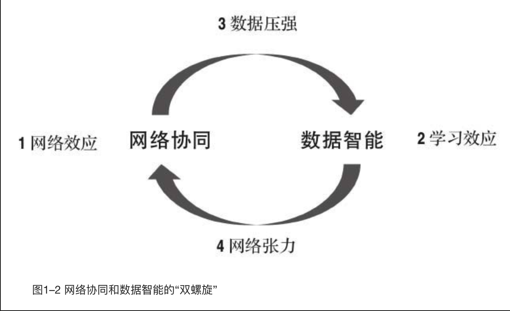

    作者: 曾鸣
    出版社: 中信出版集团
    出版年: 2018-11
    页数: 284
    定价: 68.00
    装帧: 精装
    丛书: 智能商业 书系
    ISBN: 9787508695761

- [第一部分 智能商业](#第一部分-智能商业)
  - [01 智能商业大变革](#01-智能商业大变革)
    - [智能商业：网络和数据时代的必然选择](#智能商业网络和数据时代的必然选择)
    - [双螺旋构成：网络协同+数据智能](#双螺旋构成网络协同数据智能)
    - [未来已来，智能商业将走向何方](#未来已来智能商业将走向何方)
      - [在线化](#在线化)
      - [智能化](#智能化)
      - [协同网络的扩张](#协同网络的扩张)
  - [02 互联网的本质](#02-互联网的本质)
    - [联：改变物理世界的底层技术革命](#联改变物理世界的底层技术革命)
    - [互：让交流沟通具备无限可能](#互让交流沟通具备无限可能)
    - [网：互联网给商业社会带来的颠覆性改变](#网互联网给商业社会带来的颠覆性改变)
  - [03 智能商业双螺旋之一：网络协同](#03-智能商业双螺旋之一网络协同)
    - [网络协同：新经济范式革命](#网络协同新经济范式革命)
    - [淘宝与优步：网络协同效应的胜利](#淘宝与优步网络协同效应的胜利)
  - [04 智能商业双螺旋之二：数据智能](#04-智能商业双螺旋之二数据智能)

# 第一部分 智能商业
## 01 智能商业大变革
### 智能商业：网络和数据时代的必然选择
我总结出三个重要方向上的创新。这些企业在这三个方向上，最少把握住了两个，并且在这些方向上都有了巨大的突破（见图1–1）。

- 第一，**在线化**。身处互联网时代，你有没有联网，有没有在线，是最重要的一步。
- 第二，**智能化**。谷歌首席执行官埃里克·施密特最近说：“现在是数据的时代，算法的时代。”数据和算法，构成了智能的基本要素。谷歌的成功，最重要的是推动了整个商业的智能化进程。`搜索`是第一款大规模商业应用的智能服务。除了搜索之外，智能服务的第二个核心产品是`推荐`。
- 第三，**网络化**。实际上谷歌的广告系统非常赚钱的就是一个由千万级的小广告主和千万级的网站所组成的高效生态。同样，脸书这几年的成功也是因为它在广告技术方面的突破。阿里巴巴，特别是淘宝，则是将网络协同和智能化这两个方面做成了一个紧密结合又互相促进的生态。

### 双螺旋构成：网络协同+数据智能
简单来说，智能商业最重要的两个组成部分分别是网络协同与数据智能（见图1–2）。

所谓的`人类文明`，最关键的并不是每一个个体，而是整个社会日益增强的协同能力，这才是我们这个时代最大的优势。

所谓`网络协同`，指的是通过大规模、多角色的实时互动来解决特定问题。以前我们解决一个问题，通常需要通过命令、科层制或者在简单市场中通过价格信号进行调整，但今天更多的是通过大规模、并发、多角色的实时互动加以实现。

淘宝不是零售商，我们不拥有任何一件商品，它是一个零售的生态圈，是一个赋能卖家的平台。淘宝之所以能够创造这么多奇迹，很重要的一个原因是淘宝演化成了一个社会化协同的大平台。在今天，即使是非常小的一个淘宝新卖家，也可以在线同时和几百个服务商合作，只需要有一个API（应用程序编程接口）的链接，就能调动相关的数据和相关的服务。

`算法`其实就是将人对特定事情的理解转换成机器可以理解和执行的模型与代码。

对于绝大多数企业来说，今后10年，最难的其实是创造一种产品和服务方式，把原来离线的用户在线化，产生一个持续的互动，这样才能实时记录用户的反馈，也才能优化算法、优化服务。

### 未来已来，智能商业将走向何方
在未来10年里，智能商业的发展依然要靠三条主线的突破。

#### 在线化
`IoT`的本质是一种新的人机交互方式。在PC互联网时代，人是被键盘锁定的；移动互联网时代，人是被手机锁定的；到IoT时代，人的五官得到极大延伸。

#### 智能化
未来，对大部分的企业来说，不用担心算法有多难，也不用担心招不到算法工程师，因为算法会像云计算一样成为一项基础设施；算法对大部分应用企业不会是一个壁垒，反而是一个有力的工具。

#### 协同网络的扩张
谷歌把广告在线化了，淘宝把零售在线化了。

几乎每个行业都会经历一个从传统的、封闭的、线性的供应链，走向开放的、价值协同网的完整过程，这中间有巨大的商机。

## 02 互联网的本质
### 联：改变物理世界的底层技术革命
- 连接1.0时代：PC互联网
- 连接2.0时代：移动互联网
- 连接3.0时代：万物互联网

### 互：让交流沟通具备无限可能
- 互动1.0时代：一对多的门户广播模式(门户网站新浪、搜狐、网易是典型代表)
- 互动2.0时代：以关注为典型代表的创新型互动(以分享、社区为核心的创新型互动产品，比如微博、推特和Instagram)
- 互动3.0时代：社交网络服务(两个SNS的大产品——美国的脸书与中国的微信)

### 网：互联网给商业社会带来的颠覆性改变
其实商业最重要的就是结网，未来互联网将给人类商业社会带来的颠覆性改变，就在于商业的大规模结网。当海量的人已经可以同时在线互动的时候，如何让他们通过在线协作的方式去完成某一件事情，便成为一种新的商业组织方式。

要想实现智能商业的第一步，就是让你的产品和服务核心流程`在线化`。在线化之后，真正的考验是你能否通过各种方式完成与客户的互动。

## 03 智能商业双螺旋之一：网络协同
### 网络协同：新经济范式革命
如果说农业时代自给自足、村社范围简单交换的经济范式可以用“点”来描述，那么“线”或许就是工业时代经济范式的典型意向——流水线、供应链、科层制。到了万物互联的时代，新经济范式最根本的特质就是“网”——开放的网络结构、自由的多元协同、分布式的自组织体系。

我将这种新的经济范式称为`“网络协同”`。在商业世界里，网络协同正在取代工业时代相对封闭的体系（例如传统的供应链体系），成为互联网时代的基本合作范式。

淘宝打败美国易贝的一个重要原因是，淘宝鼓励商家和消费者**直接、充分地连接、互动**，而易贝则在这方面无动于衷。例如，旺旺使卖家和买家连接互动，评价让买家之间连接互动，帮派论坛则让卖家之间连接互动。直连互动使卖家和买家的积极性与创造力被极大激发，网络扩张带来的效益被成倍放大。

支付宝的出现，本质上也是在促使直连互动更好地发生。在中国的商业环境下，买卖双方互动必然面临信任缺失的问题，而支付宝解决了这个市场的信任问题，使这个双边市场变得更加繁荣。

**“边界开放+直连互动”** 带来的创造力激发，首先体现在淘宝的网络扩张上。各种新商品被卖家上线销售，各种新店也纷纷开张。为了对更多的细分市场形成覆盖，淘宝不断拆分类目，甚至由各种奇特到无法归类的商品所形成的“其他”类目到今天都还是商品数最多的类目之一。

如果说`“双边市场的扩张”`是淘宝早期的核心特征，那么，当这些新角色不断产生后，淘宝在第二个阶段的核心特征，就是**从一个简单的双边市场演化成了一个复杂的多边市场**，多元角色在其中相互协同表现得越来越充分，淘宝也越来越立体。这个立体的淘宝还在继续演化，协同从商品买卖这个环节向广告、物流、供应链等众多环节进一步延展，更多的场景被网罗进来，更多元的协同在这一网络中发生。

比如，网络协同进一步扩展到了物流，菜鸟网络就是阿里巴巴在这个领域最主要的存在，其全名是全国智能物流骨干网。它连接所有物流公司、快递人员以及仓库，同样，它也是一个利用互联网分布式信息可以同步共享的结构，让所有人的商业信息在参与方之间可以适时、多方、多角度的互动沟通，而不需要中间人来计划和安排。

在中国有一个颇具特色的团体叫作“字幕组”，近年来活跃在各大中文视频网站。该团队中绝大部分成员是定居在全球各地的华人，由于全球优秀的影视剧作品往往没有官方中文字幕，所以他们自由组队，利用业余时间，发挥外语特长，为数以千计的电影、电视剧制作准确、精致的中文字幕。他们的总人数无法估算，因为他们本就是招之即来，“事了拂衣去，深藏身与名”。他们不会得到金钱回报，但在中文观众中获得了信誉、声望和自我满足。他们甚至完成过一项非常棘手的任务——史上最佳华语电影之一、台湾大导演杨德昌的作品《牯岭街少年杀人事件》。这部电影当时因为重新完成了数码版修复，未能及时制作字幕，并且电影中出现了中国各地方言、普通话、日语、英语等十几种语言。结果，字幕组的团队瞬间又扩大了，精通中国各地方言的各地人你翻译一句，我录入一句，他修正一句，在一个叫作“B站”的视频分享网站上，仅仅用了一夜的时间就做好了字幕。

无论是淘宝还是“字幕组”等团队，都是开放、协同、共享、共建的网状结构，它们已经开始取代封闭、线性、管理、控制的工业时代线性结构。这就是新经济范式的革命。

### 淘宝与优步：网络协同效应的胜利
如果我们认真思考优步的核心优势就会发现，从经济学的角度来说，优步其实并没有享受到多大的网络协同效应，它更大的价值还是源于传统的规模经济。快速扩张供给端，吸引众多的司机到这个平台上，形成规模优势。原来那些被挡在准入门槛之外没有牌照的服务者得以加入市场并提供服务，大大提高了服务质量，也降低了交易价格。

说到这里，有一个重要的推论不可不提——没有网络协同效应，单靠规模经济无法形成垄断。如果在需求端没有网络协同效应，即使供给端的规模效应再强大，用户的转移成本也依然很低。就像很多人手机上曾经装过好几个打车App，无论是滴滴、优步、神州，还是易到，使用时可以随意切换。这么重要的高频应用是为了使用方便，并获得确定性服务。对于用户来说，多下载一个App的成本并不算太高。同时，由于在高峰时期，几乎没有任何一个网络能够提供足够好的体验，这给跟随者留下了生存空间。司机更是如此，同时安装几个App，同时接单几乎成为常态。

也就是说，规模经济的壁垒比网络协同效应的壁垒要低得多，可以用海量资本进行密集轰炸以便攻克。

这个横向积累很厚实，使得纵向方面平台也有了强大的拓展能力，逐步从零售走到广告、营销、物流、金融等新的创新领域。淘宝能有这样的广度和深度，很大程度上是由于网络自己有很大的扩张动力，不同类型的卖家聚集在一起，不仅可以分摊各种基础服务的成本，也能分摊获取客户的成本。淘宝的核心是商品的丰富性，不是简单的商品和用户规模。

在优步平台上，不管司机还是乘客，都是相当简单和同质化的角色，这样的网络显然缺乏自主生长动力。优步在打车之外一度被寄予厚望的快递服务、送餐服务的业务扩张也并不顺利，根本原因在于这些都不是原有网络的自然延伸，而是需要靠管理者去复制在原有领域的成功。在这个时代，靠管理者去复制原有模式，很难比得上在另一个领域里有更深积累的创业者的爆发力。

## 04 智能商业双螺旋之二：数据智能

