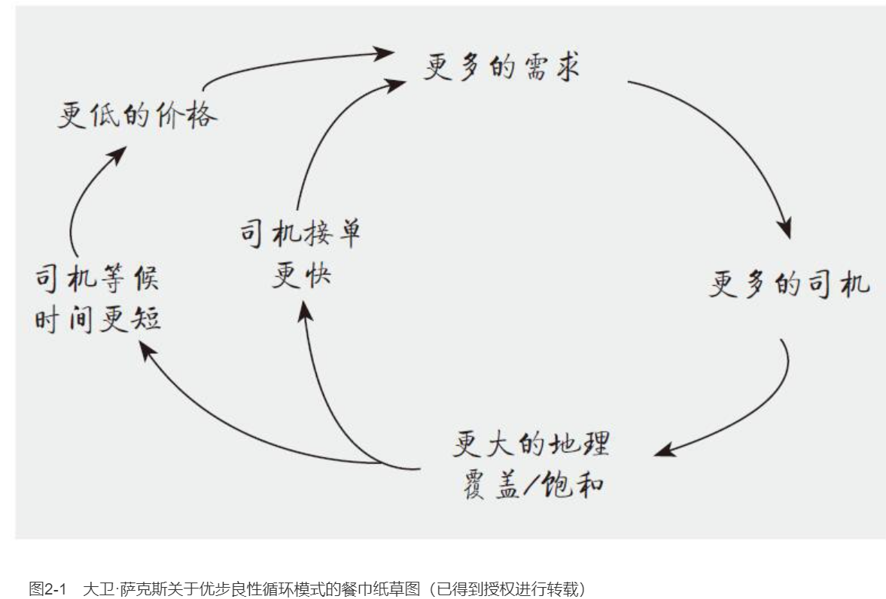
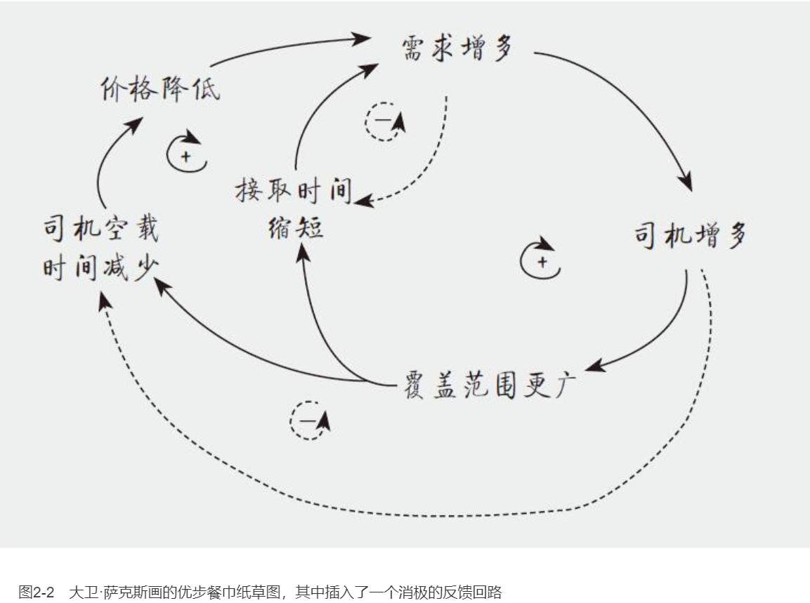
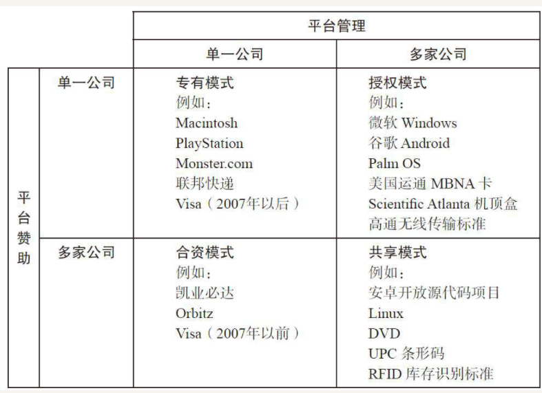

    作者: [美]杰奥夫雷G.帕克（Geoffrey G. Parker） 等
    出版社: 机械工业出版社
    出品方: 华章经管
    副标题: 改变世界的商业模式
    译者: 志鹏
    出版年: 2017-10
    页数: 336
    定价: 65.00
    ISBN: 9787111579069

[豆瓣链接](https://book.douban.com/subject/27171481/)

- [第1章 今天：欢迎来到平台革命](#第1章-今天欢迎来到平台革命)
  - [平台革命和变革的趋势](#平台革命和变革的趋势)
- [第2章 网络效应：平台的力量](#第2章-网络效应平台的力量)
  - [需求规模经济](#需求规模经济)
  - [双边网络效应](#双边网络效应)
  - [网络效应VS.其他促进增长的工具](#网络效应vs其他促进增长的工具)
  - [扩大网络效应：无缝进入及其扩展工具](#扩大网络效应无缝进入及其扩展工具)
  - [消极的网络效应：原因及解决方法](#消极的网络效应原因及解决方法)
  - [四种类型的网络效应](#四种类型的网络效应)
- [第3章 体系结构：设计成功平台的原则](#第3章-体系结构设计成功平台的原则)
  - [核心交互：平台设计的根本原因](#核心交互平台设计的根本原因)
  - [吸引、促进、匹配：平台设计的方式](#吸引促进匹配平台设计的方式)
  - [核心交互之外的其他交互](#核心交互之外的其他交互)
  - [在平台设计上使用端到端原则](#在平台设计上使用端到端原则)
  - [模块化的力量](#模块化的力量)
- [第4章 颠覆市场：平台如何征服、改变传统行业](#第4章-颠覆市场平台如何征服改变传统行业)
  - [数字化颠覆简史](#数字化颠覆简史)
  - [平台如何吞食传统管道](#平台如何吞食传统管道)
  - [平台带来的颠覆对价值创造、价值消费以及质量控制三大环节的影响](#平台带来的颠覆对价值创造价值消费以及质量控制三大环节的影响)
  - [平台颠覆的结构性影响](#平台颠覆的结构性影响)
  - [现有企业的反击：管道变为平台](#现有企业的反击管道变为平台)
- [第5章 平台上线：先有鸡还是先有蛋？平台成功上线的八种方式](#第5章-平台上线先有鸡还是先有蛋平台成功上线的八种方式)
  - [平台营销的核心：寻求病毒式增长的设计](#平台营销的核心寻求病毒式增长的设计)
  - [八种策略破除“鸡与蛋”式的困境](#八种策略破除鸡与蛋式的困境)
    - [“追踪兔子”策略](#追踪兔子策略)
    - [背负式策略](#背负式策略)
    - [播种策略](#播种策略)
    - [精英策略](#精英策略)
    - [单边策略](#单边策略)
    - [生产商传播策略](#生产商传播策略)
    - [采用“大爆炸”策略](#采用大爆炸策略)
    - [微型市场策略](#微型市场策略)
  - [病毒式增长：用户对用户的推介机制](#病毒式增长用户对用户的推介机制)
    - [发送者](#发送者)
    - [价值单元](#价值单元)
    - [外部网络](#外部网络)
    - [接受者](#接受者)
- [第6章 盈利化：获取由网络效应所创造的价值](#第6章-盈利化获取由网络效应所创造的价值)
  - [价值创造以及将网络效应盈利化所带来的挑战](#价值创造以及将网络效应盈利化所带来的挑战)
  - [盈利化方式一：收取交易费](#盈利化方式一收取交易费)
  - [盈利化方式二：收取准入费](#盈利化方式二收取准入费)
  - [盈利化方式三：收取增强型接入费用](#盈利化方式三收取增强型接入费用)
  - [盈利化方式四：收取增强型内容管理服务费用](#盈利化方式四收取增强型内容管理服务费用)
  - [应该向谁收取费用](#应该向谁收取费用)
  - [从免费到收费：设计方案是如何影响盈利化转变的](#从免费到收费设计方案是如何影响盈利化转变的)
- [第7章 开放性：界定平台用户和合作伙伴能做什么、不能做什么](#第7章-开放性界定平台用户和合作伙伴能做什么不能做什么)
  - [开放到什么程度？封闭到什么程度？在钢丝上行走](#开放到什么程度封闭到什么程度在钢丝上行走)
  - [平台生态系统和开放的多种形式](#平台生态系统和开放的多种形式)
  - [管理者和赞助商的参与](#管理者和赞助商的参与)
  - [开发者参与](#开发者参与)
- [第8章 治理：提升价值和促进增长的策略](#第8章-治理提升价值和促进增长的策略)
- [第9章 衡量指标：平台管理者如何衡量真正重要的事项](#第9章-衡量指标平台管理者如何衡量真正重要的事项)
- [第10章 战略：平台如何改变竞争](#第10章-战略平台如何改变竞争)

# 第1章 今天：欢迎来到平台革命
- 平台的首要目标是：匹配用户。通过商品、服务或社会货币的交换为所有参与者创造价值。
- 因为平台商业利用不直接拥有或控制的资源创造价值，因此它们能够比传统业务增长得更迅速。
- 平台绝大部分的价值是从它们服务的社群获取的。
- 平台颠覆了企业，模糊了业务界限，并且促使企业从传统的向内聚焦到向外聚焦转变。
- 平台的崛起已经改变了许多主要行业——更有甚者，同样显著的变革就要到来了。

## 平台革命和变革的趋势
大多数企业采用的传统系统是一种被我们描述成`“管道”（pipeline）`的东西。与平台不同的是，管道是一步一步创造和传递价值的过程，供应商在一端，而顾客在另一端。公司首先设计产品或服务，制造产品，然后投入市场进行销售或交付服务。最终，用户出现并购买产品或服务。由于它简单、单向的特性，我们也把管道业务称作`线性价值链（liner value chain）`。

平台之所以能打败管道，是因为平台借助规模化消除了`守门人（gate keeper）`，从而使得其规模化更加有效。

一个原因在于管道是由低效率的守门人管理着从供应商到顾客的价值传递。在传统的出版行业，编辑在上千本书里选择几本投放市场，希望其能够成为畅销书。但这非常浪费时间，是一项靠直觉和猜测的劳动密集型工作。相反，亚马逊的Kindle平台允许任何人出版书，依靠实时的顾客反馈判断哪些书会成功，哪些书将会失败。由于传统的守门人——编辑被全社会的读者作为市场信号自动取代，平台系统成长得更加迅速和高效。

平台之所以能打败管道是因为平台开发了价值创造的新来源。

在某种程度上，新生代的爱彼迎的业务与希尔顿和万豪相同。就像其他酒店巨头一样，爱彼迎利用定价预订系统让顾客能查看、预订并支付需要的房间。但是爱彼迎将平台模式运用到了酒店业务：爱彼迎不拥有任何房间。相反，爱彼迎创造运营了一个允许每个人直接向顾客提供房间的平台。作为回报，爱彼迎对平台上的每一次租房交易收取9%～15%的佣金（平均值为11%）。

这意味着爱彼迎的增长会远比一家传统酒店迅速，因为它的增长不再受限于资金使用和固定资产管理。一家连锁酒店可能要花费几年的时间选择购买地块，设计建造新酒店，然后雇用，培训员工。相比之下，爱彼迎能迅速增加资产“存量”，只要它能让有空置房间的房东注册房源。结果是在短短几年里，爱彼迎达到了传统酒店经营者要冒着风险辛辛苦苦经营数十年才能达到的规模和市值。

在平台市场里，供应方的特性已经改变了。供应方现在解封了闲置的产能，使得社群住房成为供应侧的贡献者。尽管传统商业能达到最精益的`实时库存管理（Just-in-time inventory）`，但是新生代平台商业里`从来没有自己的库存（not-even-mine inventory）`。

平台通过开发新的供应产品投放市场，颠覆传统的竞争局面。那些必须承担固定成本的酒店发现要和没有固定成本的公司竞争。这对新兴公司来说是可行的，因为平台中介能够帮助它们利用闲置产能。`共享经济（sharing economy）`分享的前提是许多物品在大多数时间是闲置的，如汽车、船，甚至剪草机等。

查证信用和诚信是一笔很高的交易成本，通常对交易有阻碍作用。而平台通过提供默认的保险合同和信用系统鼓励诚信行为，显著降低了交易成本，并为首次供应产品的新供应商创造了市场。

平台之所以能打败管道，原因在于借助基于数据的工具创造了`社群反馈回路（community feedback loops）`。

相反，传统管道公司依赖控制的机制：靠编辑、经理、监管者来保证质量和市场互动的形成。这些控制机制成本高，且会影响发展规模。

# 第2章 网络效应：平台的力量
- 鉴于供应规模经济促成了工业时代大公司的产生，今天的大公司则得益于需求规模经济，且以网络效应的形式表现出来。
- 网络效应与价格效应、品牌效应或者其他众所周知的工具不一样。
- 无缝进入以及延展性的其他特质最大限度地扩大了网络效应在创造价值这方面的影响力。
- 双边市场（既有生产商也有顾客）产生了四种类型的网络效应：单边效应（积极的和消极的），以及交叉效应（积极的和消极的）。一个发展中的平台必须妥善应对这四种效应。
- 让消极网络效应降到最低点的关键在于质量策展。它提高了生产商和顾客之间愉快配对的概率。

优步以一种经典的平台形式为消费者提供了匹配服务。在格利的文章中，他引用了另一个投资人的图来阐释这一良性循环的工作原理，那张图是大卫·萨克斯（David Sacks），亚美（Yammer）的联合创始人、PayPal的前任COO在餐巾纸上所画的草图（见图2-1）。

萨克斯的餐巾纸草图引用了`网络效应（network effects）`的一个经典案例。它表明了在越来越多人使用优步的情况下，优步对每一位用户的价值是如何提升的。这样一来也吸引了更多的用户，从而提升了服务的价值。

网络效应指的是一个平台的用户的数量对用户所能创造的价值的影响。`积极的网络效应（positive network effects）`指的是一个巨大的、管理完善的平台社区所有的，为每一个平台用户创造重要价值的能力。`消极的网络效应`指的是管理不善的平台社区的增加，能够减小为每一个用户所创造的价值的可能性。

## 需求规模经济
`梅特卡夫定律（Metcalf’s law）`能够有效地概述网络效应如何为该网络参与者、拥有者和管理者创造价值。以太网的发明人之一，也是3Com公司的缔造者罗伯特·梅特卡夫（Robert Metcalfe）指出随着订户数量的增加，电话网络的价值呈现非线性增长，使得订户之间可以有更多的连接。

## 双边网络效应
大卫·萨克斯的草图表明了第二个驱动力在优步的增长中发挥作用，我们称其为`双边网络效应（two-sided network effect）`。在梅特卡夫的电话例子中，电话用户吸引更多电话用户。但在优步的例子中则包含了双边网络：乘客吸引司机，司机吸引乘客。这一相似的驱动力存在于很多其他平台公司中。在谷歌的安卓一例中，应用程序开发者吸引消费者，消费者也吸引应用程序开发者。在Upwork（原名Elance-oDesk）上，工作列表吸引自由职业者，自由职业者也吸引工作列表。在PayPal上，商家吸引顾客，顾客吸引商家。在爱彼迎上，房东吸引房客，房客吸引房东所有这些商业以正面反馈引起双边网络效应。

## 网络效应VS.其他促进增长的工具
`价格效应`是会逐渐消失的。它会在打折结束或者其他公司给予更优价格的时候消失。

`品牌效应`更是棘手。它会在人们将质量与特定的品牌联系时产生。但品牌效应，像价格效应一样，通常很难维持。它也很可能极其昂贵。

价格效应和品牌效应在一家创业公司成长的战略中拥有一席之地。但只有前面提到的网络效应才能创造良性循环，这一良性循环会建立一个长久的用户网络，我们将这一现象称作`锁定（lock-in）`。

`病毒式传播`从短语“像病毒式增长”而来，是一种理念或品牌在互联网用户中快速广泛传播的趋势。病毒式传播是吸引不在平台上的人群加入平台，而网络效应则是通过平台上的人群增加价值。

## 扩大网络效应：无缝进入及其扩展工具
谷歌的案例表明，允许`无缝进入（frictionless entry）`的网络能够有机地、无限制地增长。无缝进入指的是用户能够快速且轻易地加入一个平台，开始利用该平台创造价值。

扩展一个网络需要双边市场成比例地增长。例如，一位优步司机一小时内平均能为三位乘客提供服务，所以对优步来说拥有一名乘客和1000名司机或1000名乘客和一名司机是完全没有意义的。爱彼迎面临一个扩展房东和房客的平行问题。如果一方变得不成比例，依靠优惠券或者打折来为另一方吸引更多参与者才能成就好买卖。

在某些情况下，平台的增长可以被用户`角色转换（side switching）`促进。这一效应发生在平台一方的用户加入另一方，例如当那些商品或服务的消费者开始为其他消费者生产商品和服务。在有些平台上，用户可以轻易且不间断地参与转换。

例如，优步从其乘客群中招募新的司机，就像爱彼迎从其房客群中招募新的房东。一个可扩展性的商业模式、无缝进入和用户角色转换同时促进了网络效应。

## 消极的网络效应：原因及解决方法
人数增加让生产商和消费者之间有更多匹配的可能性，这同时也大大增加了两方找到最适合伙伴的难度，这时候一个消极网络效应出现了。

婚恋网站丘比特发现，如果管理不谨慎，规模（匹配）可能导致网络崩溃。根据丘比特的CEO克里斯蒂安·鲁德尔（Christian Rudder）所说，当婚恋网站上有很多用户时，平台上的男性往往会接近最漂亮的女性。给男生定标的行为导致了一个问题，那就是接近特别有吸引力的女性的那些男性大部分会变得没什么吸引力——就像老话说的，她和他们“不是一个世界的人”。当这些B等的男性（这是我们的定义，不是鲁德尔说的！）向想要约会的A等女性套近乎时，没有人会觉得开心。漂亮的女性不高兴，而且很有可能因为所有这些未经筛选的关注放弃这个网站；与此同时，B等男性不高兴，因为他们感兴趣的女性从来不回应他们。而少数非常有吸引力的男性原本有机会和最有魅力的女性在一起，但是现在这些女性要离开这个平台了，所以他们也不高兴。

一旦这一切发生了，各种魅力级别的男性全部涌向第二魅力级别的女性，同样的过程又会再发生一遍。网络效应逆转，这种商业模式随之垮台。

为了解决这个问题，丘比特实行了一种策略，即多级别的网络配对。第一级别解决了最突出的问题，即兴趣爱好的匹配。两个人都抽烟吗？都喜欢文身个过程中的参与者人数。

第二个配对级别解决了魅力值匹配的问题——也就是说两个人是“同一个世界的人”。根据其他用户的反应，如果丘比特的算法认定乔显然没有玛丽有魅力（打个比方），那么乔平时搜索配对时，就不会看到玛丽的照片。（她可能在出现有高度针对性的搜索里，而不会出现在其他地方。）相反，乔会看到那些被认为和他魅力值相当的女性。这种结果是双赢的。玛丽会更开心，因为这个平台帮她找到了她一直在寻找的人，同时保护她免受太多人的猛攻。乔也会很开心，因为以前他被冷眼以待，而现在那些女性会回复他的信息。

像丘比特采用的那样有技巧的策展极大地减少了消极网络效应。与此同时，它增加并利用了积极网络效应的益处。随着网络参与者越来越多，有关他们的信息量也在增加。

## 四种类型的网络效应
在双边市场中，`单边效应（same-side effects）`是指由市场一边的用户影响这边其他用户而产生的网络效应——顾客对其他顾客的效应，以及生产商对其他生产商的效应。相比之下，`交叉效应（cross-side effects）`是指市场中一边的用户影响另一边的用户而产生的网络效应——消费者对生产商的效应以及生产商对消费者的效应。单边效应和交叉效应都有利有弊，取决于如何设计系统以及实施的规则。

第一种类型，`积极的单边效应（positive same-side effects）`，包括当同类用户数量上升时产生的积极效益——比如说，这种效应在贝尔电话用户数量增加时产生了。你有越多的朋友和邻居使用贝尔电话，你就能获得作为贝尔会员应获得的越多的好处。今天，消费者对消费者这种相当积极的效应可以被看作一个像是微软大型多人在线游戏机（Xbox MMOG）一样的游戏平台：你在这个平台上遇到越多的同伴玩家，你在使用这个平台的时候就能获得越多的乐趣。

有时候平台的一边也会有不利于数量增长的一面，这被称作`消极的单边效应（negative same-side effects）`。比如信息技术平台Covisint，它与服务提供商联合开发基于云的网络工具。随着Covisint平台上互相竞争的供应商数量不断增长，源源不断的客户被吸引到这个平台上，这也让供应商非常高兴。但是当供应商数量过多，合适的供应商和顾客找到彼此的难度也会变大。

当顾客或供应商的得失基于平台另一方的用户数量时，交叉效应就产生了。当用户从市场另一边的参与者数量增长中获益时，出现的是`积极交叉效应（positive cross-side effects）`。想想看一个像Visa卡一样的支付机制：当更多的商家（生产商）同意接受时，消费者（顾客）在消费中能体验到灵活性和便利，这就创造了积极交叉效应。同样的效应反过来当然也是成立的。越多人持有Visa卡，商家也就拥有越多的潜在客户。

交叉效应不一定都是对称的。在婚恋网站丘比特上，女人对男人的吸引力大于男人对女人的。在优步上，司机比乘客对市场发展更重要。在安卓系统中，开发者的App对用户的吸引力大于用户对开发者App的吸引力。在推特上，绝大部分人读，少部分人发。在问答网站Quora上，绝大部分人提出问题，少部分人回答问题。

`消极交叉效应（negative cross-side effects）`产生了。想想看一个促进数字媒体分享的平台——音乐、短信、图像、视频等。在大多数情况下，生产商（比如音乐公司）数量的增加会给顾客带来积极的好处，但是也可能会导致复杂性和费用的加大。比如说，太多不同的数字版权管理格式需要阅读和受理。这时候，交叉效应从积极转变为消极，导致顾客放弃或者至少减少使用这个平台。同样地，当一个平台上相互竞争的商家发布大量信息带来乱七八糟的广告时，增加生产商多样性的积极影响可能会转变为消极的交叉效应，从而让顾客反感，也破坏了平台原本的价值。

图2-2对优步的生长螺线的描述更加完整，强调了一个事实，那就是一家在双边市场上的公司必须处理这四种网络效应。好的平台管理会努力加强积极的网络效应，创造并强化尽可能多的积极的循环结果。

# 第3章 体系结构：设计成功平台的原则
- 平台的设计应该从它的核心互动机制开始——这种互动是平台价值创造使命的核心。
- 三个定义核心互动的要素：参与者、价值单元和过滤器。其中，价值单元是最重要而且通常是最难掌控的因素。
- 为了使核心互动容易产生甚至必然发生，一个平台必须执行三个关键的作用：吸引、促进和匹配。这三个功能是必不可少的，各有其特殊的挑战。
- 在平台发展的过程中，它常会扩展，超出核心互动机制。新类型的互动可能在核心互动的上面分层堆积，这个过程中经常会吸引新的参与者。
- 精心设计平台，让大部分用户都能便利、满意地互动是很重要的。但是在平台上为偶然与意外留下空间也很重要，因为用户自己会在平台上找到创造价值的新方法。

平台的目标是将生产者和消费者聚合在一起，使他们能够进行信息、商品或服务，以及货币的交换。平台会提供给那些参与者一个加入即用的基础设置，包括软件工具和规则等，来让交换变得方便，且能够使他们互惠互利。

## 核心交互：平台设计的根本原因
每个平台在开始设计时应先设计生产者与消费者之间的`核心交互（core interaction）`。核心交互是平台内部活动的最重要的形式——它就是价值的交换，能够在第一时间将多数用户吸引至平台上。核心交互有三个关键要素：`参与者（participants）`、`价值单元（valce unit）`、`过滤器（filter）`。

例如，领英就拥有很多种交互方式：专家交换职场与企业战略的专业意见；猎头或招聘人员与潜在应聘者交换就业信息；人力资源主管交换劳动力市场信息；意见领袖发表自己对全球趋势的见解。这些交互方式都被植入了平台内部，它们在设计时都是为了去迎合平台特定的目标，并帮助用户创造全新形式的价值。领英目前的多元化设计初期却是围绕一个核心交互进行的：职业者联系其他的职业者。

来详细看看核心交互的三要素:

`参与者`。通常，核心交互的根本参与者就是两种人：创造价值的生产者和使用价值的消费者。要定义核心交互，我们需要明确地描述和理解这两种角色。

平台设计的其中一个差别是：同样的用户在不同的交互中扮演着不同的角色。在爱彼迎上，同一个人既可能是房东，也可能是旅行者，尽管他们通常在一段固定的交互中只会扮演其中一种角色。YouTube用户既可以上传视频，又可以观看视频。设计得当的平台有利于用户的角色转换。

`价值单元`。我们说过，每个交互都是以那些对用户有利的信息的交换开始的。因此，几乎每个核心交互的开端都是生产者对于价值单元的创造。

`过滤器`。价值单元是经过过滤器处理后传递给特定消费者的。过滤器是有着严格算法、以软件为基础的工具，平台会用它来完成用户间适当价值单元的交换。设计得当的过滤器会保证平台用户只会接收到与他们相关并对他们有价值的价值单元，而设计不得当的（或没有）过滤器所造成的结果则恰恰相反，甚至使用户放弃平台。

不管怎样，每个平台都会利用过滤器来进行信息交换。优步的司机会通过分享其位置、可载人数等信息来显示目前的可利用状态，这些都是可以帮助他们寻找适当消费者的价值单元。当消费者拿出手机呼叫车辆时，她就会基于其位置与时间设定过滤器，之后，与其相关的司机信息就会被交换。

一旦信息交换完成，其他活动便会立刻开始。出租车到达乘客设定的起点，乘客上车直至出租车将乘客送达目的地，乘客支付车款，司机收到钱。核心交互就此完成，价值也因此被创造和交换。

    参与者+价值单元+过滤器→核心交互

在设计平台时，你的首要任务就是确定你的核心交互，然后去定义参与者、价值单元以及过滤器来完成核心交互。

一个有价值的、可以简单安心参与的核心交互会吸引更多的参与者，并会产生积极的网络效应。

价值单元的关键作用。正如我们对核心交互所介绍的，价值单元在任何一个平台里都会起到关键作用。但是在多数情况下，平台不会创造价值单元，创造价值单元的是平台内的参与者。因此，平台是“信息工厂”，但它无法控制其库存。它提供“作业场地”（也就是说，他们创造的平台基础设置是用来生产价值单元的）。平台可以培育一种质量控制的文化（采取各种措施鼓励生产者创造精确、有用、有关联且让消费者感兴趣的价值单元）。它也会创造出过滤器来传递价值单元，并屏蔽不需要传递的单位。但是它并不直接控制生产过程，这是它与传统的管道商业之间最明显的区别。

## 吸引、促进、匹配：平台设计的方式
核心交互就是平台设计的理由，平台的整个目标就是要使核心交互成为可能。

为了拥有更多有价值的核心交互，平台必须发挥三个关键功能：`吸引（pull）`、`促进（faciliate）`、`匹配（match）`。平台必须要将生产者和消费者吸引至平台，以便使核心交互在他们之间发生。平台要通过提供方便且易于联系和交换的工具与规则来促进交互的完成。另外，平台还要通过利用相互之间的信息，进而有效地匹配生产者和消费者，让他们互惠互利。

`吸引`。吸引参与者是管道商业不会遇到的难题。

刚开始的时候，平台需要解决管道商业模式不会有的“先有鸡还是先有蛋”的问题：平台没有价值就不会有用户，而用户不去使用平台也不会具有价值。

关于吸引的第二个问题是如何保持已注册平台用户的黏性。

其中一种能够让用户反复使用平台的工具是`反馈回路（feedback loop）`。平台的反馈回路有很多种形式，这些形式都有助于平台持续不断地自我补充。在典型的反馈回路中，价值单元会促使用户回应。如果价值单元与用户相关，且能引起用户的兴趣，用户就会不断地被吸引至平台中，进而产生其他价值单元并促进更多交互。有效的反馈回路可以扩大网络，提升价值，强化网络效应。

其中一种反馈回路是`单用户反馈回路（single-user feedback loop）`，这是一种嵌入平台的算法，它能分析用户活动，最终得出用户的兴趣、喜好、需求，并向用户推荐其他对于他们可能存在价值的价值单元和关联。如果单用户反馈回路设计得当，可以有效地增加用户活动，因为用户使用平台的次数越多，反馈回路就对用户“了解”得越多，它的推荐也就越准确。

而在`多用户反馈回路（multi-user feedback loop）`中，生产者的活动会递交给相关消费者，而消费者的活动也会给予生产者很多反馈。如果它能够有效运行，就可以创造良性循环，增加双方的活动，最终加强网络效应。

其他因素也会影响平台吸引用户的能力，其中一个就是平台内现有货币的价值。正如我们所讨论的，一些平台的交换基于的是无形的货币，如关注度、人气、影响力等。因此，网络效应的一种形式就是随着网络平台规模不断增加而与日俱增的吸引力形式货币。因为推特有了很大的用户基础，与在其他平台传播相比，一条成功的推文在推特上会吸引更多的关注度形式货币。所以，推特巨大的规模增加了它的吸引力，鼓励人们进行更多的活动，从而使其他平台无法与其竞争。

促进一方面是要让生产者更加方便地创造和交换商品与服务。这需要提供具有创造性的工具用来共享，就像加拿大图片网站500px做的那样：照片上传者在平台上管理自己的整个作品集；或者像创意平台Quirky做的那样：提供工具来让用户分享创意并集体创造新的产品和服务。

促进过程还需要减少使用障碍。不久前，Facebook用户若想要与朋友分享照片，就需要将相机里的照片传到电脑里，再用PS软件修改图片，最终才上传到Facebook上。而Instagram允许用户在一个设备上只经过三个点击操作就可以完成对图片的拍摄、修改和分享。减少使用障碍能够有助于互动的进行，并扩大参与者数量。

在有些情况下，使用门槛变高也会有一些积极作用。Sittercity是一个帮助父母寻找保姆的平台。为了提高用户（父母）的信任度，该软件设计了一套严格的规定来限制注册的生产者（保姆）。其他时候，平台需要制定严格的规则来组织管理价值单元及其他生产者创造的内容，实现用户需要的交互，去除用户不需要的内容。另外的少数情况是，不法分子也会在网上有一些违法行为，比如社交新闻网站Reddit的“喷子们”的种族和性别歧视言论，克雷格网站（Craigslist）上也会出现雇凶杀人，糟蹋爱彼迎上订的公寓都能说明有害的交互会破坏网络效应。

`匹配`。成功的平台能够精确匹配用户，保证相关的商品与服务能够被交换。它会利用生产者、消费者、价值单元和要交换的商品与服务的信息来完成这个目标。平台获得的信息越多，收集、组织、分类、解析数据的算法设计得越好，过滤器越精准，用来交换的信息就会越有用，生产者与消费者正确匹配得到的回报就越高。

## 核心交互之外的其他交互
优步、来福车和领英展现了多种将新的交互机制嵌入核心交互机制的方法：
- 改变现有用户对价值单元的交换（就像领英将基本信息交换从用户资料改为讨论帖子）
- 加入新的生产性和消费性用户群体（就像领英邀请猎头和广告商以生产性用户加入平台）
- 容许用户交换新类型的价值单元（就像优步和来福车使乘客可以选择拼车）
- 鼓励现有用户去吸引新类型的用户（就像领英将一些用户指定为“思想领导者”，并且请求他们成为高信息量帖子的生产者）

## 在平台设计上使用端到端原则
`膨胀软件（Bloatware）`这个嘲弄术语就是描述一些软件系统因为不断增加的功能变得过于复杂、缓慢和低效。

对于平台公司，这个概念等同于一个早已存在的电脑网络概念，被称为`端到端原则（end-to-end principle）`，最初被萨特泽（J.H.Saltzer）、里德（D.P.Reed）和克拉克（D.D.Clark）于1981年提出。端到端原则是指对于通用网络，专用功能应该存于末端主机而非中间节点。^{6}换句话说，对整个网络没用，但是对某些用户有用的功能应该被放在网络的边缘区域，远离核心区域。这样，补助性功能就不会干扰或者负面影响网络核心的运作，也不会使得整个网络的维护和升级变得更复杂。慢慢地，端到端原则从网络设计延伸到多种复杂运算环境的设计。

端到端原则也可以被应用到平台的设计上。对于平台来说，这个原则认为专业型应用功能应该放在平台的边缘或者上层，而不是放在平台根部的最底层。只有流量最大、价值最高、应用最广的功能才应该成为平台核心的一部分。

有两个理由支撑这个规则。第一，当某一特定的专业功能被加入平台核心当中，而不是外挂在平台上时，不使用这些功能的应用程序会运行得缓慢和低效。反过来，当某一特定的专业功能是通过应用运行的而不是在核心平台上运行时，用户体验会非常简洁。

第二，只要其平台核心是一个简洁、简单的系统，而不是一个多种功能互相纠缠的系统，这个平台的生态系统就可以发展得更快。

现在设计最优秀的平台融入了这个结构原则。比如，亚马逊云服务（Amazon Web Services，AWS），是提供云端存储和管理服务中最成功的平台，只注重优化少数基础的运营服务，包括数据存储、运算和消息传递。那些只被一小部分用户使用的其他服务则被限制在平台外围，并且需要使用专门创建的应用。

## 模块化的力量
从长期来看，一个成功的平台必须有更模块化的开发方法。鲍德温和克拉克（1996）提出的模块化定义写下来：

>`模块化（modularity）`是一种用来有效组织复杂产品和进程的战略。模块化系统是由那些独立设计，但仍有整体功能的单位（或模块）组成。设计师通过将信息分割为可视化的设计规则和隐性的设计参数实现模块化。只有当这些分区是精确、明确且完整的时候，模块化才是有利的。可见设计规则（也被称为可视化信息）是影响后续设计决策的决定。在理想情况下，可见设计规则在设计过程的早期建立，并广泛地传达给参与对象。

# 第4章 颠覆市场：平台如何征服、改变传统行业
- 平台能在竞争中打败管道企业，是因为它们优越的边际经济效益以及由积极的网络效应所产生的价值。因此，平台比管道企业发展得更快并在曾经以管道企业为主导的行业中占据领先的位置。
- 平台的崛起也在其他方面颠覆着商业。它正对价值进行重构以开发新的供应源；通过赋予新的消费行为来重构价值消费；通过社区驱动的内容管理来重构质量管控。
- 平台的崛起同时也带来很多产业中的结构性改变，尤其是通过以下三个方面进行：中介重构、分享使用权与管控以及市场集合。
- 现有企业可以反抗由平台驱动的颠覆，其方式是用平台的思维方式思考自身的产业，正如耐克与美国通用电气所做的一样，企业可以建立它们自己的价值创造的生态系统。

## 数字化颠覆简史
**“软件正在吞食整个世界。”** 这句标语最初被网景（Netscape）创始人马克·安德里森（Marc Andreessen）用在了2011年《华尔街日报》（Wallstreet Daily）的一篇专栏文章的标题中，而这篇文章的主要内容简要概述了技术，尤其是互联网是如何转变商业世界的。

在第一阶段中，**“高效的管道淘汰了那些效率低下的管道”**。20世纪90年代，大部分互联网应用都涉及创造高效管道，比如用来分销商品和服务的在线系统在当时许多的行业中脱颖而出。与传统线下管道不同的是，在线管道的利润源于商品分销低廉的边际成本，有时候这些成本可以忽略不计。

面对这种威胁，首当其冲的是传统的媒体公司。互联网能够在不计印刷、运输、零售和投递等传统分销成本的情况下将新闻直接传播给全球读者，这使得新闻报纸行业的模式完全被颠覆了。这是一种有效的管道吞食掉一种效率低下的管道。将分类广告和其他广告形式与报纸内容解绑，让报纸模式少了一种至关重要的盈利机制，这是因为这种更加有效且投放针对性广告的在线方式相比于传统的纸墨印刷模式要更胜一筹。再一次，又是一种有效的管道吞食掉一种效率低下的管道。

百视达（Blockbuster）分销光碟的实体体系不敌网飞（Netflix）的分销经济模式，网飞公司的这种模式起初是以客户在网上选购光碟然后再邮递给客户的方式为主，后来发展为在线提供流量化的视频。唱片的销量大幅下降，取而代之的是速度更快、价格更加低廉的音频文件下载，而且人们还非法盗版并共享了许多音乐内容，这让唱片公司的盈利低至谷底。久而久之，相比于传统途径，许多互联网分销商找到了各种方式，利用与消费者选择相关的精细数据去更好地服务消费者。

**“平台正在吞食整个世界”**。我们已经进入这一颠覆传奇的第二个阶段，在这一阶段中，是`平台吞食传统管道（platforms eat pipelines）`。

## 平台如何吞食传统管道
在平台界，互联网不再只扮演销售管道（途径）的角色。它同时还扮演了创新基础设施以及协调机制的角色。各个平台正在利用这一新的功能去创造全新的商业模式。此外，实体事物与数字化事物也正在迅速交融，使互联网能够连接并协调现实世界中的事物。

在这一数字化颠覆的新阶段，相比于传统管道，平台享有两大重要的经济优势。

其中之一就是生产和销售方面无与伦比的边际经济效益。正如我们所提到过的，当像希尔顿和喜来登这样的连锁酒店想要扩展业务时，它们需要建造更多的客房，雇用成千上万的员工。但与之相反的是，爱彼迎在扩展业务时，花费的边际成本几乎可以忽略不计，因为爱彼迎在其网络列表上多添加一间房的成本微乎其微。

网络效应进一步提升了平台迅速扩大规模的能力。一旦网络效应产生积极影响，更高的产能就会带来更高的消费，反之亦然。

## 平台带来的颠覆对价值创造、价值消费以及质量控制三大环节的影响
平台世界的崛起正在重构我们熟悉的三大业务过程：`价值创造`、`价值消费`、以及`质量控制`。

重构价值创造以开发新的供应源。平台作为自助式的系统，每当它们为用户将使用的门槛降至最低时，它们便能增长并征服市场。尤其是每当平台移除阻碍生产者参与进来的门槛时，价值创造就会得到重构，并且会打开新的供应源。

平台的早期生存阶段可能很艰难。然而，一段时间以后，随着内容管理机制开始生效，平台便会提升自身的能力，将消费者与相关的高质量内容、产品及服务相匹配起来。强大的内容管理能激励可取的行为，同时打击并最终剔除掉不可取的行为。随着平台对于质量的滋养，它会发展出用以吸引广大顾客的信赖度。

## 平台颠覆的结构性影响
我们将这三种由平台驱动的颠覆称作`资产与价值的脱钩`、`中介重构`以及`市场集合`。

`资产与价值的脱钩`。最让人熟知的平台爱彼迎、优步、亚马逊都属于企业对消费者的电子商务模式（B2C）的竞争市场。在企业对企业的电子商务模式（B2B）中，怎样将一个产品转化为平台呢？很多企业拥有大量的固定资产，比如发电站、磁共振成像仪器，或者是大片的农场。怎样才能围绕着这些来建立平台呢？

答案是你只要将实体资产的所有权与其创造的价值脱钩即可。这能让资产的使用进行单独交易并得以充分利用，即采用能创造最大经济价值的资产使用方式，而不是局限于只针对拥有者的使用方式。如此一来，效率和价值会大幅提升。

`中介重构`。在互联网驱动颠覆的早期阶段，很多商业评论员都预测，新型信息与交流技术带来的最大冲击将会是非中介化现象的蔓延。从各行业剔除中间人或是中间环节，建立生产者与消费者的直接联系。专家指出，随着消费者学会绕过中间人购买机票以及保险单，像旅游代理以及保险经纪人这样的传统公司会走向衰落。随着时间的流逝，可以期待的是，同样的非中介化过程也将席卷许多其他产业。

然而事实证明，现实情况与评论员的预测稍有出入。平台已经在众多行业中不断地重构了市场中介，引入了新型中间人，而不是简单地消灭市场参与者的环节。典型的中介重构，包括替换掉不可扩展的低效率中间代理人，补以线上的，通常为自动化的工具，以及可以为平台双方参与者提供新的优质产品与服务的系统。

互联网上的平台由于其拥有调整规模的市场调解能力，正起着愈加高效的中间人的作用。传统的中间人依赖手动工作，而平台中间人依赖算法与社区反馈，这两者升级起来既快速又高效。另外，它们不断收集数据，并以此令系统更为智能的能力，令平台得以在市场上扩大它们的调解能力。这种方式是传统中间人无法做到的。

`市场集合`。通过将无序的市场集合起来，平台正在创造出新效率。市场集合（market aggregation）是一个过程，凭此过程，平台提供集中化的市场以服务广泛分散的个体和组织。市场集合为平台用户提供信息与力量，而他们此前都是以偶然的方式参与到交互中，往往无法接触到可靠的或最新的市场数据。

很多成功的平台起着近似的市场集合作用。亚马逊集市（Amazon Marketplace）、阿里巴巴以及Etsy都提供线上网址，在这里来自全世界千万种产品的销售商能够向消费者提供他们的商品。

## 现有企业的反击：管道变为平台
它们需要提出如下问题：

- 无论是供应商还是消费者环节，我们有哪些内部管理的环节可以委托给外部合作者？
- 我们怎样才可以令外部合作者有能力创造出能够为现有客户产生新价值形式的产品及服务呢？
- 我们有无办法与现有竞争者联合起来，为客户生产优质的新服务呢？
- 怎样才能通过新的数据网络、人际关系与内容管理工具来升值我们已经提供的产品与服务呢？

耐克业已证明，它是平台世界中，寻求新手段以生存并繁荣的最有智慧的现有企业之一。

像耐克这样的管道企业过去已经以两种方法中的一种进行了规模升级。有些是通过并购及整合更多价值创造及配送的管道，比如通过购买上游供应商或下游分销商，这被称作`垂直整合（vertical integration）`。其他则是能过扩宽管道来推升价值，这是`横向整合（horizontal integration）`。如果消费产品公司通过创造新产品与品牌来获得成长，那么这就是一例横向的整合。

2012年1月，耐克生产出了一款可穿戴技术的设备充能手环（FuelBand），用它来追踪用户的健身活动，包括已行走的步数以及消耗掉的热量。耐克也像很多其他公司一样，一直在开发应用程序。此例中则为与体育与健身相关的小程序。这些似乎表面上看起来是传统产品线的扩展，意在进行横向整合。但事实上，耐克正在测试一种新的方法，如若成功，便能引领新的发展方式。该方式由类似苹果这样的平台公司所开创。

在过去的十年里，苹果的部分成长是通过将其产品与服务在云端相互连接实现的。人们能够在iTunes与iCloud上对内容与数据进行同步，这让拥有多件苹果产品变得很有价值，并且相比索尼、东芝或其他电子厂商的多件产品，拥有多件苹果产品更加有用。数据担当着黏合剂的整合作用，将所有这些产品以及服务和谐地统一起来。

这引发了新的发展形式。当多个产品与服务利用数据进行连接与互动时，管道便可以像平台那样开始运作，产生新的价值形式并鼓励用户参与到更多的交互中来。

# 第5章 平台上线：先有鸡还是先有蛋？平台成功上线的八种方式
- 平台公司与传统的管道型业务的区别之一在于：在平台的世界里，旨在实现病毒式增长的前拉策略比传统营销使用的推动策略（比如广告和公关）更加重要。
- 成功的平台使用8种久经考验的策略之一解决“鸡与蛋”的问题：“追踪兔子”策略、背负式策略、播种策略、精英策略、单边策略、生产商传播策略、采用“大爆炸”策略以及微型市场策略。
- 可以通过病毒式增长加快平台扩张速度，这取决于四个关键要素：发送者、价值单元、外部网络以及接受者。

在新的支付机制里，“鸡与蛋”的问题显得格外明显和尖锐。如果没有卖家愿意接受新的支付方式，买家也不会采用。但是如果买家不愿意采用新的支付方式，卖家也不会投资时间、精力和资金接受它。因此，当卖家和买家都找不到理由先于对方加入这一平台，用户基础为零时，怎样才能在这种情况下推介新的支付平台？

PayPal通过一系列巧妙的策略解决了这一问题。

首先，PayPal减少了与接受在线支付相关的摩擦。用户只需要提供一个电子邮件地址和一张信用卡。这种简单的方式与之前的网上支付机制形成了鲜明的反差：之前的网上支付机制要求在账户建立前必须进行多轮认证，其烦琐性让很多早期用户望而却步。PayPal从客户角度出发，几乎无缝的系统吸引了一批重要的初期用户群，尽管人数还不够多，不足以吸引众多的网络卖家。

后来，在斯坦福大学的一次演讲中，彼得·蒂尔解释接下来所发生的事情：

>PayPal所面临的巨大挑战在于获得新客户。他们尝试着做广告，搞宣传，然而成本高昂。他们试着与大型银行进行企业发展（BD）交易。后来官僚主义随之猖獗。PayPal团队得出了一个重要的结论：BD并不起作用。他们需要有机的、病毒式的增长。他们需要给人们钱。
>
>他们就这么做了。新用户注册会得到10美元，而已注册的用户成功推荐新用户再得10美元。PayPal迎来了迅速增长，而对每一个新用户进行20美元奖励也使得PayPal受伤惨重。他们感觉努力有了成效，但同时又感觉没有成效；7%～10%的日增长率以及1亿用户，收效不错。然而，零收入以及成倍增长的成本结构则令人沮丧。事态变得有些不稳定。PayPal需要造势，以筹集更多资金，并继续经营下去。（最终，这奏效了，但这并不意味着这是经营公司的最佳方式。实际上，这很可能不是。）

PayPal的爆炸性增长引发了一系列积极的反馈回路。一旦用户体验过PayPal的便捷，他们在网上购物时常常会坚持以这种方式付款，因此也促使卖家纷纷注册PayPal。新用户进一步宣传PayPal，将它推荐给朋友。反过来，卖家开始在他们的产品页上展示PayPal的标志，告知消费者，他们已做好准备支持这种在线支付方式。看见这些标志，更多的买家得知PayPal的存在，然后受到鼓励开始注册。PayPal也为卖家提供奖励，鼓励他们推广，然后带来更多的买家和卖家。通过这些反馈回路，PayPal网络持续朝对自己有利的方向发展，在寻求自身迅猛增长的同时，也服务用户（卖家和买家）的需求。

## 平台营销的核心：寻求病毒式增长的设计
工业领域的管道严重依赖推销。企业只有通过自己拥有或购买的专门的营销和沟通管道才能获得消费者。在供应商稀缺的世界里，选择受到限制，只要能被听到，就足以能让营销人员和他们所传递的信息出现在消费者面前。在这种环境下，传统的广告和公关产业只能集中于意识创造，这是一种经典技巧，将产品或服务“推”入潜在客户的意识中。

在网络世界里，这一营销模式不灵了。在网络世界里，获取营销和沟通管道越来越大众化。在物质丰富的世界——产品和产品的信息都是无限的，人们更容易分散注意力，因为只需轻轻点击或者刷新，就会出现无数选择。因此，只创造意识并不能提升接受和使用率，而将产品和服务“推”向客户不再是成功的关键。实际上，这些产品和服务必须本身就极具吸引力，能够自然而然地将客户拉入轨道。

此外，对于平台公司来说，用户承诺和频繁地使用（而非是注册或下载），才是用户采用率的真正指标。这就是为什么平台必须通过构建激励机制鼓励用户参与，特别是那些与平台互动有着系统相关性的激励机制来吸引用户。一直以来，营销功能与产品是相分离的。而在网络业务中，营销需要与平台紧密结合。

PayPal的管理层为了让平台走向成功所采用的策略反映了这一新的营销思维方式。PayPal没有通过诸如电视广告、印刷品广告或电子邮件群发这样的方式将PayPal“推”入用户的意识之中，而是创造了新的激励，使得平台本身就具有“拉”的引力。这些方式既包括“PayPal”服务的极致便捷，也包括给推荐新用户的人的现金奖励。

在网络平台的世界里，传统的`“推”`的策略仍有着一定的意义。例如，Instagram因为在苹果软件商店（Apple’s iTunes store）的首页Banner推荐，在发行当天就获得了几万次的下载量。这一种用来推广公司的推式策略已经被用了几十年。

但是在网络平台的世界里，通常用“拉”来实现快速、大规模和持续增长。

## 八种策略破除“鸡与蛋”式的困境
在实际中，所有平台创办者不时遇到我们称之为“先有鸡还是先有蛋”的困境。当双边市场中任何一方的存在都取决于另一方优先存在时，如何为双边市场打造用户群呢？

平台解决这个难题的一个方法是，通过打造一项基于现有的管道或产品业务的平台业务，以此彻底避免“鸡与蛋”问题的出现。这个方法所提供的一些人们熟知的八种策略：

### “追踪兔子”策略
采用非平台的示范项目来塑造成功的典范，从而把用户和生产商都吸引到依据这个项目中已被证实的基础架构所建立的新平台上。

比如亚马逊，它从来没有出现过“鸡与蛋”的问题，原因是作为一个成功的线上零售商，它经营着一个通过线上商品列表吸引消费者的有效的管道业务。由于拥有惊人的客户体量，亚马逊只是将系统开放给外部生产者，就转型成为了一个平台业务，结果成就了亚马逊市场。

为克服“鸡与蛋”的问题，人们已经研发并采用了多种具体有效的策略。一般而言，这些策略包含以下三大技巧：

1. 上演价值创造。平台管理者安排价值创造单元以吸引一组或多组用户群并向其展示参与平台可以获得的潜在利益。^{5}首批用户创造更多的价值单元，吸引其他用户，然后建立正面的反馈回路使用户群持续增长。^{6}《赫芬顿邮报》（The Huffington Post）采用这种策略，聘请作家在其网站上发表高水平的博客，以此吸引读者。有些读者开始在网站上发表自己的博客，因此更多人成为创作者并不断吸引更多的读者。
1. 设计吸引某一类用户的平台。该平台旨在提供工具、产品、服务或其他利益吸引一组用户——可以是消费者或生产者。市场一方存在大量重要的用户将会吸引市场另一方的用户，最终迎来正面的反馈回路。下面我们将会详细讲述，订餐平台——OpenTable利用这种策略，为餐厅创造有用的电子工具。一旦大量餐厅上线，消费者发现了这一网站，然后使用它制订订餐计划。
1. 同时上线。最初，尽管网络总规模很小，但平台依然要创造条件以便打造与用户相关的价值单元，然后努力刺激活性闪现，同时吸引大量消费者和制造商创造更大的价值单元，使价值产生相互作用，以便发挥网络效应。随后，本章将会展现Facebook是如何利用这一策略，将最初潜在成员还只是一所大学中屈指可数的学生社会网络发展壮大，吸引众多用户的。

### 背负式策略
与另一个平台的现有用户群连接，示范价值单元的创造以吸引这些用户参与你的平台。

许多成功的平台推介都采用了这一经典策略。我们已经看到，PayPal采用这种策略，将其捆绑在eBay的网上拍卖平台之上。

### 播种策略
创造至少与一组潜在用户相关的价值单元。当这些用户被平台吸引后，其他类型想要与他们互动的用户也将随之加入。

谷歌开发安卓智能手机运行系统与苹果竞争时，便对开发者设立了500万美元的奖项，只要开发人员在10种应用类型中的任何一个类型中——包括游戏、生产力、社交网络和娱乐中设计出最佳应用程序，便可获奖，以此扩大市场。获奖者不仅可以得到奖金，同时成为这一应用领域的市场领头人，而且最后可以吸引大量的客户。

Adobe开发出现在已经普及世界的PDF文件阅读工具，一部分原因就是它可以让用户在网上下载所有类型的联邦政府纳税申报表。这个唾手可得的市场规模十分庞大，包括任何可能需要向政府缴税的个人和企业。Adobe向美国国税局提出建议说，这样可以节省数百万美元的印刷和邮资成本，从而使得美国国税局与其合作。而纳税人可以快速便捷地获取每人需要的文件，至少每年需要一次。由于对Adobe提供的服务印象深刻，所以许多人就选择它作为文件平台。

还有一些情况是，通过模仿（伪造）价值单元实现播种策略。

Reddit是一个广受欢迎的链接共享社区，大量互联网内容在此传播。首次推出该平台时，网站用虚假用户配置文件进行传播，并贴出创办者想要在网站上看到的内容的链接，这种策略奏效了。最初的内容吸引了对相似内容感兴趣的人群，并营造文化氛围，让他们对社群做出高质量的贡献。渐渐地，Reddit成员学会了依赖彼此，指导对方哪些内容值得浏览，哪些不值得一看。

同样地，Quora平台刚刚起步时，网站编辑自问自答，制造平台活动的假象。用户开始提问之后，编辑继续回答问题，以此向人们展示平台将如何运作。最后，用户自己开始实践这一过程，Quora的工作人员就可以停止“自我推动”的做法。

### 精英策略
提供奖励以吸引成员中的重要用户加入你的平台。

在许多情况下，有一批用户成员举足轻重，他们的加入与否将决定平台的成败。因此，这就可能解释平台管理者为何给予现金奖励或者其他特别福利激励他们加入。

这种策略也可以稍有变化，即平台公司可以选择购买一位至关重要的参与者获取独家访问权。

有时候，对平台成败起关键作用的“精英”是消费者而非生产商。好比PayPal，这就是为什么该公司给予现金奖励吸引购物者采用其在线支付机制。

### 单边策略
围绕产品或服务，打造只让单一用户群体受益的业务，随后将该业务转变为平台公司，吸引想要与第一类用户互动的第二类用户。

如果要推广像OpenTable这样的服务订购平台，餐厅的预订系统就会带来传统的“鸡与蛋”的问题。在没有大量餐厅加入的基础上，为什么客户会访问OpenTable网站呢？但是如果没有大量的客户基础，餐厅为何会选择加入平台呢？OpenTable首先向餐厅分发预订管理软件，餐厅可以用来管理座位剩余清单。OpenTable线上有足够的餐厅之后，开始着手建立客户联系，允许他们预订席位，然后从餐厅收取客户引导费用。

### 生产商传播策略
设计平台吸引生产商，以使他们引导其客户成为平台用户。

平台为企业提供的客户关系管理这一工具通常也能解决这种“鸡与蛋”的问题，仅仅只需要吸引一方用户——生产商，然后他们就承担吸引另一方用户的责任，从自己的客户群带来消费者。平台帮助生产商迎合现消费者的需求，慢慢地，当网络上的其他消费者对他们的产品和服务感兴趣时，生产商就能从数据交换中获益。

诸如Indiegogo和Kickstarter这样的云募资平台锁定需要资金的创办者，为他们提供基础设施，以便于他们主持并管理资金筹集活动，与客户群高效联系，从而推动平台繁荣发展。Skillshare和Udemy这类教育平台也是通过生产商传播而获得成长。它们签下有影响力的教师，为它们主持在线课程提供便利，并鼓励它们发展在线学生。

在类似的潮流下，专家市场通过生产商成员提供的客户列表，建立自己的客户群。比如Clarity作为在线市场，宣称能够为企业家提供专业的建议，允许博主或其他专家使用Clarity小程序让读者拨打预订电话支付金额，从而赚取利益。每打一次电话，生产商就帮助Clarity获得新的签约用户，之后这些用户又被引荐给其他生产商。

### 采用“大爆炸”策略
利用一种或多种传统推动式营销策略，引发人们对平台的兴趣，吸引注意力。这种做法同时可以引发在线效应，事实上可以立刻让网络获得近乎全面的发展。

推特的爆发时刻发生在2007年西南偏南音乐大会（SXSW）上。而推特发布9个月以来，没有获得较高的采用率。杰克·多西（Jack Dorsey）和推特的其他创始人需要寻找方法获得平台用户的群聚效应。考虑到推特平台活动的实时性，他们意识到需要建立时间和空间的集中性。

推特投资11000美元在西南偏南音乐大会主厅里安装了巨大平板屏幕。用户可以输入“加入sxsw”，然后发送至推特的短讯服务代码（40404），就会发现他的推文立刻就显示在屏幕上。实时观看大屏幕上的反馈，成千上万名用户纷纷加入推特营造出的兴奋感，使之成为网络中最热门的网址。因为年度最佳网络创意，推特收到影视音乐会颁发的网络奖，截至此次音乐大会结束，推特的使用率增加了3倍，每天推文由20000条增至60000条。

### 微型市场策略
起初，锁定有成员正准备参与互动的小市场。这样，平台即便在最初发展时，也能为大市场提供有效的匹配特征。

因为社交网络的价值很大程度上建立在网络效应之上，达到群聚效尤为重要。如果Facebook在世界范围内发布，很快获得几百位甚至几千位注册用户，它就不会成功，因为广泛分布的随机用户注册之后不会有互动。

所以，Facebook决定在哈佛大学封闭的社区内发布绝不仅仅是因为便利的问题。此举乃神来之笔巧妙地使Facebook解决了“鸡与蛋”的问题。在哈佛大学社群最集中的地方吸引了500名用户，确保发布时创造一个活跃的社群。Facebook把哈佛大学当作现有的微型市场，通过提升成员之间互动的质量获得吸引力。专注小型市场，降低临界量需要开启互动，使得市场匹配更加便利。

## 病毒式增长：用户对用户的推介机制
平台公司开启病毒式发展的过程前，也必须具备四要素：`发送者`、`价值单元`、`外部网络`以及`接受者`。让我们思考一下Instagram的病毒式增长：

- 发送者。一名Instagram用户分享他刚刚制作的图片，然后开始循环此操作，最终带来新的用户。
- 价值单元。在Instagram平台上，价值单元就是用户同朋友分享的图片。
- 外部网络。对于Instagram而言，Facebook便是非常有效的外部网络，允许价值单元（图片）传播，并展示给潜在的用户。
- 接受者。最后，一名来自Facebook的用户对图片产生兴趣，然后访问Instagram平台。这名用户可能制作她自己的照片，然后开始循环上述过程。现在，接受者成了发送者。

Instagram在实现快速增长的过程中从未聘用一个传统的营销经理。

Instagram不仅仅允许用户保存、拼接以及过滤图片，还鼓励用户在Facebook这样的外部网络共享图片，把单一的用户活动转变成为社会的、多用户的活动。每次用户使用该应用程序时，都会共享他们的作品。每次应用程序的使用都成为一次应用营销的实例。从根本上来讲，Instagram将用户转变成为营销者。

让我们更进一步分析这四个设计要素。

### 发送者
要让发送者传播价值单元并不是只有口碑传播，那是传统营销惯用的伎俩。只有用户十分喜欢你的平台时才会进行口碑传播，因为他们不禁想要谈论它。当用户变成发送者传播价值单元时，他们并不是在谈论你的平台——他们只在传播自己的创作，并间接意识到你的平台，并对之产生兴趣。

一般而言，用户传播自己创造的价值单元以获得社会反馈，另外，这又为他们带来了乐趣、名誉、成就、财富或者其他各类形式的奖励。YouTube上的频道拥有者可以在多个网络向世界传播他们的视频以获得观众，SurveyMonkey的调研开发人员可以通过邮件、博客和社交网络传播调查以获得回答，然后为调研开发人员想要回答的问题提供见解；Kickstarter网上想要寻求资金的创业者可以在社交网络传播项目页面上筹集资金用于完成工作，同时也吸引那些欣赏他们最终作品的观众。

### 价值单元
这是病毒活性的基本单元，平台使用价值的一个个载体，可以向外部网络传播，展现平台价值，但并不是平台上的每一个价值单元都具有可传播性。比如，企业平台的用户想要在公司合作伙伴间交换专利文件时，并不愿意像Instagram用户分享照片一样传播这些机密信息。因此，可传播价值单元的设计对迈向病毒式增长至关重要。

一个可传播的价值单元可以在外部网站上开启一个互动。比如，Instagram照片展现在Facebook上，Facebook用户看到图片后产生兴趣，然后就开始交流；或者创造机会完成未完成的互动，比如在我问你答上没有回答的问题需要以回答形式实现社会反馈，或者像SurveyMonkey那样进行新的调查，邀请回应。方便用户创造或传播可传播的价值单元不仅可以实现平台高增长率，同时还能带来高参与率。

### 外部网络
许多平台的发展依靠其他网络。Instagram、推特、Zynga、Slide以及其他平台实现病毒式增长都是利用Facebook作为基础网络。爱彼迎在克雷格网站上传播，OpenTable依靠邮件传播。

但是，利用外部网络传播不仅仅是点击“分享至Facebook”按钮，然后等待数百万名用户涌现这么简单。通常，当越来越多的应用程序利用它们实现增长时，外部网络就会施加限制，比如Facebook已经限制外部公司向其用户提供游戏应用。在其他情况下，外界生产商发出源源不断的邀请劝说用户展示其产品和服务，用户淹没在这些邀请之中，逐渐感到厌倦，然后就停止回应。为避免这种结果，新晋平台的管理者需要制定策略寻找可以用来实现增长的外部网络，并找到创造性和增值的办法连接其用户。

### 接受者
当一个平台的用户向朋友或熟人传递价值单元时，如果接受者发现价值单元中肯、有趣、有用、令人愉快或者具备其他价值，那么他将做出回应。当价值单元足以激发接受者的兴趣，他们将会进一步对其传播，有时候会在其他社交网络引发新的互动。Upworthy和BuzzFeed这样的广告公司，几乎完全依靠消费者发起来的病毒式传播而实现发展。

# 第6章 盈利化：获取由网络效应所创造的价值
- 一家管理良好的平台能够从以下四个方面创造附加值：提供价值创造、提供市场、提供工具以及内容管理。盈利化指的是从创造出的附加值中获取一部分收益。
- 将一个平台进行盈利化的技巧包括收取交易费、收取用户增强型接入费用、向第三方供应商收取社区准入费以及收取增强型内容管理的订阅费。
- 盈利化最关键的选择就是决定该向谁收费，因为五花八门的平台用户所扮演的角色具有差异性，这意味着向这些用户收费会产生迥异的网络效应。
- 考虑到盈利化挑战的复杂性，平台经理人在做有关平台设计的每一个决定时要将可能的盈利策略考虑进去。

## 价值创造以及将网络效应盈利化所带来的挑战
想要实现盈利化就必须先对在平台上所创造的价值进行分析。在传统的非平台企业中，管道是以提供产品或服务的形式将价值递送给它们的顾客的。它们会向产品的所有权进行收费，就像惠尔普（Whirlpool）这家公司会在出售一台洗碗机时进行收费；或者它们会向一件产品的使用权进行收费，正如通用航空（GE Aviation）会向那些安装了自家生产的飞机引擎的客户收取安装费和定期服务费。

与将技术售卖给顾客以换取费用不同的是，这些平台公司是邀请用户加入到它们的平台，然后再通过平台技术为用户创造价值以此来收取费用，从而将平台盈利化。这一价值可以归为以下四大类。

1. 对于消费者来说：能够获得在平台上所创造的价值。视频观看者发现YouTube上的视频是有价值的；各种应用程序使得各式各样的活动变得可能，所以安卓用户就在这些活动中发现了其价值所在；学生通过Skillshare这一网站能够获取各种课程，他们在这些课程中也发现了其价值所在。
1. 对于供应商或者是第三方供应商来说：能够加入到一个社区或市场当中。爱彼迎对于房东有价值是因为它能够为他们提供全球市场的旅客客源。企业的招聘人员觉得领英这一职业社交网络有价值，是因为这一网站能够让他们与潜在的求职者取得联系。商家觉得阿里巴巴有价值，是因为它能够让他们将商品销售给世界各地的顾客。
1. 对于消费者和供应商来说：能够获得促进交互的各项工具和服务。平台通过减少阻碍供应商和消费者进行交互的障碍与壁垒来创造价值。众筹网帮助有创造力的企业家筹集资金资助新项目。eBay与PayPal互相结合允许任何人在网上开店以服务世界各地的顾客。YouTube能够让音乐家在不需要录制实体作品（唱片或光碟），并且不需要通过中间零售商进行出售的前提下，向他们的粉丝提供其演出的记录视频。
1. 对于消费者和顾客来说：能够获取提高交互质量的内容管理机制。消费者看重的是能够获取解决他们个人所需，并满足他们兴趣爱好的高质量的商品和服务，而供应商所看重的则是能够获得对他们提供的商品或服务感兴趣，并愿意以公道的价格购买这些商品或服务的客源。运营良好的平台所搭建并维持的管理系统，能够迅速快捷地将合适的消费者与匹配的供应商联系在一起。

## 盈利化方式一：收取交易费
在不减弱网络效应的前提下，收取交易费是将平台所创造的价值进行盈利化的一种有效方式。因为买家和卖家只有在交易确实进行的情况下才需要交纳费用，而在加入到平台并成为网络中的一员这方面上他们并不会受到阻碍。当然，如果交易费用收取得过多，也会阻碍交易进行。

那些发现彼此都是平台用户的买家和卖家会很自然地想要在线下进行交互，以避免交纳交易费用。

在那些将服务供给商与服务消费者联系在一起的平台中，这一问题尤其严重。随着自由职业者经济的崛起，以及线上共享经济的流行，从爱彼迎和优步平台企业，再到跑腿兔（Taskrabbit）和Upwork平台企业，都纷纷涌现促进交互服务。然而，它们中的大多数都面临着追踪平台线上交互的挑战。在大多数情况下，只有当供应商（在这里指的是服务供给商）和消费者（这里指的是服务购买者）在服务条款上达成一致时，交互才能发生，通常这需要双方进行直接交互。此外，金钱的实际交易是在服务被提供之后才发生的，这也需要双方进行直接交互。由于平台为交易双方提供一个线下交易的机会，这些直接性的交互弱化了平台获取这一服务价值的能力。躲避交纳交易费的后果就是，消费者可以在获得服务时减少费用，而服务供给商则能够得到更多的总服务费。唯一的输家是平台公司自己。

像Fiverr网站、高朋团购（Groupon）和爱彼迎等平台是通过暂时阻隔平台用户之间的联系来解决这一问题的。这些平台在不让顾客与供应商进行直接联系的前提下，给顾客提供一切所需的信息来帮助他们做出交互决定。高朋团购是将其提供的服务进行高度规范化，而爱彼迎和Fiverr网站这样规范性不那么强的平台，则是通过提供评价机制以及其他社会言论评价指标来显示一家服务供给商的可信度，使交易双方的直接交互变得不那么必要。

## 盈利化方式二：收取准入费
在某些情况下，平台也可以通过向那些想获取已加入平台的用户群的生产商收取费用。

追波网作为面向设计人员的高质量平台迅速在设计圈占领头筹，艺术家、插图画家、商标设计者、平面设计师、排版设计师等设计人员通过展示他们的作品获取曝光率，提升信誉，并与同行交流获得有价值的反馈。

追波网平台的经理人十分迫切地想要保护这一专业化社区的长远价值。基于这一点，他们并没有向会员收取平台准入费，因为这样做会削弱网络效应。他们还选择不接纳那些为社区提供增强型接入的赞助图片（例如，在未经允许的情况下就在用户的主页上出现），因为这会降低网站在用户心中的威望以及感知价值。所以，为了使网站盈利化，追波网平台就向第三方收取准入费。在这种情况下，那些想要招聘设计师的公司如果在这一网站的求职板块上刊登招聘信息，就需要交纳一定的费用。

以类似的方式，领英允许招聘者向这一平台的会员展示工作机会，并且能够让各个公司根据平台会员的简历和其专业技能进行比较和筛选。领英作为一家招聘平台，鼓励用户经常更新他们的个人简历，因此能够使平台积极、健康地发展。

## 盈利化方式三：收取增强型接入费用
这类平台则可以反过来向供应商收取消费者增强型接入费用。这是指平台能够提供工具，让一位供应商即便在众多同行的激烈竞争中也可以在双边平台上脱颖而出，从而吸引顾客的关注。通过提供目标更准确的信息、更具吸引力的展示，或者是与有价值用户的交互来向供应商收取费用，因此平台将增强型接入作为一种盈利技巧。

增强型接入这一盈利体系，从总体上讲并不会损害网络效应，因为所有的供应商和消费者都被允许在一种公开的、非增强型接入的基础上加入平台。但是对有些供应商来说，增强型接入带来的附加值非常大，他们愿意为这种额外的价值掏钱——这就允许平台企业将这一价值中的一部分作为盈利收为己有。

谷歌搜索引擎也走过类似的发展之路。每一家网站发布商都可以通过搜索引擎最优化的方式将自己放在更加显眼的位置。而这种搜索引擎最优化的方式指的是一种自我管理的网站设计和编码进程，这一进程是不会给谷歌提供盈利的。但是，一些出版商选择通过“谷歌关键字广告”购买优质的信息刊登位置。采取类似方式的，还有微博平台Tumlr。

另一种将增强型接入进行盈利化的方式，是通过向用户收取门槛降低费用，否则这些门槛是会存在于普通用户之间的。例如，交友网站通常在不透露身份信息的前提下允许男性用户去查看女性用户的简历。但那些交纳了订阅费用的用户就能够获取进一步的信息，这样他们就可以直接与那些他们感兴趣的用户进行交流了。

## 盈利化方式四：收取增强型内容管理服务费用
当一个平台上的内容数量太过于庞大时，消费者会发现要找到他们想要的高质量内容越来越困难，因此这一平台对于他们的价值就会减少。当发生这种情况时，消费者可能会愿意选择付费获取那些有质量担保的内容，换句话说，他们可能会愿意付费获取增强型的内容管理服务。

Sittercity这一平台，这一平台主要是向父母收取平台准入费。为了保证保姆的质量和选择，该平台有一套严格的内容管理机制，对加入到这一平台上的保姆会进行层层筛选，从而向那些关心自己孩子安危的父母提供重要的额外价值。这一额外价值能够让Sittercity平台向父母收取订阅费用，而不是像服务供应商一样去收取交易费用。

## 应该向谁收取费用
- 向所有用户收费。正如我们所提到过的，平台企业很少采取像管道企业那样向所有用户收取费用的方式。在大多数情况下，向所有用户收取费用会降低用户的参与积极性，因此会削弱或破坏网络效应。但是，在有些情况下，向所有用户收费能够加强网络效应。例如，在现实世界中，诸如乡村俱乐部（Country Club）这样声名在外的会员组织都是面向所有用户收费的。高昂的会费（同时还有现任会员的推荐的审查程序）能够作为一种管理策略以确保会员的质量。一些网上平台也采用了这一模式——例如向纽约千万富翁提供服务的Carbon NYC平台也采用了这一模式。但是，在许多社交与商业背景下，“愿意付费”与“质量”是大相径庭的两个概念，所以对于这种定价体系一定要有选择地谨慎使用。
- 向一方进行收费而向另一方提供优惠。一些平台能够向一种类别的用户会员（我们称之A类会员）进行收费，但允许另一组用户会员（B类会员）免费加入，或者甚至向B类会员提供优惠。这种模式只有在A类会员高度重视能够与B类会员进行交流的情况下才能生效，但是双方并不是感同身受的。正如我们所提到的，现实世界中的酒吧等场所早已采用这种策略，即在“女士之夜”向女性朋友提供免费或者打折的酒水服务。许多在线交友网站也采取了类似的策略，通过提供优惠吸引女性会员加入平台，借此再去吸引那些男性会员并让他们交纳全额的会员费用。
- 向大多数会员收取全额费用而向明星会员提供优惠。某些平台选择向那些明星用户提供优惠以吸引他们加入平台——而这些超级用户的存在能够吸引大量的其他用户。在线下企业中，一些商场向诸如塔吉特百货这样的大型零售商提供诱人的租赁条约，因为有了这类零售商坐镇，就能确保客流量，这样其他的商家就会愿意为此多付额外费用。类似地，像Skillshare平台和Indiegogo这样的众筹创意平台都不遗余力地想要将那些名人教师和选战活动发起人收归到自己门下，因为这些人的名人效应能够吸引其他的供应商，以及大量感兴趣的消费者加入他们的平台。微软在创立Xbox游戏平台时也学到了这一教训。微软一开始的盈利策略是先向开发商（供应商）一次性付清费用，然后再不断向用户收取费用。但是艺电这家巨星级别的游戏开发商拒绝接受这种条约工作，并威胁微软，他们可以为索尼开发游戏。尽管具体细节没有公布于众，但微软最终还是做出了让步并同意了艺电开出的特殊条约。
- 向一些用户收取全额费用的同时对价格敏感的用户提供优惠。那种对于价格极其敏感的用户类别一旦要缴费，就可能弃平台而去，从而削弱网络效应。所以，向那些对价格敏感的用户提供优惠的同时向其他用户收取全额费用从总体上看是讲得通的。现实世界的经验表明：很难去判断一个平台市场上哪一方可能对价格更加敏感。20世纪90年代期间，美国丹佛房地产市场供过于求，使得许多业主都急切地将其名下的物业出租出去。房地产代理商则向业主收取中介费，而租户则不需要付任何费用。与之相反的是，在同一时期，波士顿的房地产资源紧缺，想要租房的人急于找到地方居住，于是房地产代理商向那些想要租房的人收取费用，而允许那些业主免费刊登他们的物业广告。

## 从免费到收费：设计方案是如何影响盈利化转变的
- 尽可能地避免对曾经免费的服务收费。如果被告知他们需要为那些他们曾经能够免费获取的商品或服务付费，用户自然而然地就会产生抵触情绪。正如我们在Meetup平台的案例中看到的一样，而且也不是所有的平台企业都能够像Meetup平台一样成功地完成这样的转变。一些像Z活动这样的平台不是难以为继，就是被迫戏剧性地改变它们的服务本质。
- 此外，对于用户已经习惯获取的价值，要避免减少这些价值的获取量。正如我们提到过的，Facebook平台曾一度免费向用户提供大量的价值，但当它决定向付费供应商提供优质内容时，平台就需要减少其原先所免费提供的价值数量。这就引起了供应商和消费者的不满。Facebook平台巨大的网络效应，让它能够幸免于这次方向调整所带来的负面影响，但对于许多网络效应比不上它的平台来说，这会是致命的错误。
- 当从免费转向收费时，要创造新的、额外的价值，证明收费的合理性。当然，你必须保证如果你要从提高的品质上收费，你就得控制品质并保证品质。批评人士就批评优步以支付核查驾驶员背景，以及其他安全措施上的开支为由，收取安全出行费用，同时又明显地在这些步骤上敷衍了事。
- 在平台设计之初，就要考虑其潜在的盈利策略。从平台上线时，其设计就要能够驾驭各种具有可能性的盈利方式。这直接影响该平台是如何开放的或者封闭的。例如，如果一个平台的经理人希望通过收取交易费来盈利，他们就需要确保平台的设计方案能够使他们掌握平台交易的控制权。如果平台经理人想要通过收取用户群获取权限费用，那么这个平台就必须设计成既能够控制用户获取内容的传输管道，还能够控制有关用户的数据流。

# 第7章 开放性：界定平台用户和合作伙伴能做什么、不能做什么
- 平台管理者需要面对的开放决策有三种：管理者/赞助人参与的决策、开发人员参与的决策、用户参与的决策。
- 平台的管理和赞助有三种控制形式：由某一家公司控制，由不同的公司控制、由公司集团控制。四种可能的组合形式会造成不同模式的开放与控制，各种模式都具有各自的优势和缺陷。
- 开放/封闭二分法不是简单的非黑即白、非此即彼。这之间有灰色地带，开放／封闭光谱上的每个点都有各自的优势和缺陷。有时候，相似的平台可以通过选择不同的开放政策展开竞争。
- 随着平台日益成熟，它也会越发开放。这就要求平台不断地重新评估和调整策展过程，以保证高品质的平台内容和服务价值。

## 开放到什么程度？封闭到什么程度？在钢丝上行走
本书的两位作者——杰奥夫雷G.帕克和马歇尔W.范·埃尔斯泰恩，与托马斯·艾森曼（Thomas Eisenmann）合作，就提出了开放的基本定义：

>如果满足这两个条件，平台可以被称为“开放”的：①在参与其开发、商业化或使用中没有任何限制；②任何限制都是合理和非歧视性的，例如，要求参与者遵循技术标准，或要求参与者支付许可费。也就是说，限制对于所有潜在的平台参与者都是统一的。

## 平台生态系统和开放的多种形式
平台设计师和经理需要应付的开放性决策有三种，分别是：

- 关于管理者和赞助商参与的决策
- 关于开发者参与的决策
- 关于用户参与的决策

## 管理者和赞助商的参与
任何平台的结构和运作的背后都有两个实体：管理平台并直接与用户接触的公司、赞助平台并保留对技术的法律控制的公司。在许多情况下，这两个实体是同一个。像Facebook、优步、eBay、爱彼迎、阿里巴巴和许多其他平台都是身兼管理者和赞助商的双重身份。在这种情况下，控制平台，包括关于“开放”的决定都完全取决于管理/赞助公司。

在其他情况下，平台管理者和平台赞助商并不是同一家公司。一般而言，平台管理者负责组织和控制生产者/消费者的互动，而平台赞助商控制平台的整体构架和知识产权（如软件代码控制其操作）及其他权利的分配。当管理者和赞助商是独立的时，管理者与客户/制作人和可能对平台有贡献的外部开发人员关系最为紧密。这将使管理者在平台的日常运作中具有相当的影响力。但是，在一般情况下，赞助商对平台有更大的法律控制和经济控制。因此，在长期战略上，赞助商拥有更大的权力。

图7-3说明了用于管理和赞助平台的四种模式。在某些情况下，单个公司管理和赞助平台，我们称之为专有（proprietary）模式。例如，硬件、软件、Macintosh操作系统和手机的iOS底层技术标准均由苹果公司控制。

第二类的案例是一家集团企业管理平台，一个公司赞助平台。这是授权（licensing）模式。例如谷歌赞助“标准”的安卓操作系统，但它鼓励多个硬件公司供应能够让消费者与平台连接的设备。这些设备的制造商，包括三星、索尼、LG、摩托罗拉、华为和亚马逊，由谷歌授权其对生产者和消费者之间的接口进行管理。

第三类案例是一家单一的公司管理平台，而多个公司对平台进行赞助，这种模式称为合资（Joint Venture）模式。于2001年成立的Orbitz旅游预订平台就是由多家主流航空公司赞助的合资企业，目的是为了与Travelocity创业公司展开竞争。同样，凯业必达（CareerBuilder）招聘网于1995年由三家报业集团合资创建（原名为NetStart），该平台提供求职招聘广告。

第四类案例是多个企业对平台进行管理而另外多家企业赞助，这种模式称为共享（shared）模式。例如，Linux操作系统有多家赞助商和多家开源管理者，像Mac和iOS系统一样，连接应用程序开发人员、其他生产者和数以百万计的消费者。Linux的企业赞助商包括IBM、英特尔、惠普、富士通、NEC、Oracle、三星和很多其他公司，而管理公司包括几十个设备制造商：TiVo、Roomba、Ubuntu、高通和许多其他公司。

有时，特定平台可能因为业务需求和市场结构演变而从一种模式迁移到另一种模式。例如，Visa信用卡运营系统是一个允许商家和消费者进行支付交易的平台。采取专有模式的平台始建于1958年，当时被命名为BankAmericard，由美国银行赞助并管理。20世纪70年代，它更名为Visa，转型为一家合资企业，由多家银行赞助但同时保持独立管理运行。2007年，Visa成为一个独立的企业实体，又恢复到专有的模式。现在Visa是一家自赞助的机构，没有外部赞助商。

## 开发者参与
`核心开发人员（core developers）`创建核心的平台功能，为平台参与者提供价值。这些开发人员通常受雇于平台管理公司本身。他们的主要工作是将平台送到用户手中，并利用工具和规则使互动简单易行，创造出让双方都满意的价值。

`扩展开发者（extension developers）`为平台添加功能和价值，并增强其功能。这些开发者通常为外部人士，不受雇于该平台的管理公司，他们从自己创造的价值中提取一部分并从中受益。比较为人熟知的扩展开发者是通过iTunes商店出售自己设计的应用程序的个人或公司——游戏、信息和生产力工具、活动增强应用程序等。平台经理必须做出重要的决定——而且经常需要随着市场的发展重新考虑的决定——是该平台对扩展开发者开放的程度。

# 第8章 治理：提升价值和促进增长的策略
- 治理是必要的，因为绝对自由市场很容易失灵。
- 市场失灵一般是由信息不对称、外部效应、垄断性权力和风险造成的。良好的治理有助于防止和减轻市场失灵。
- 平台治理的基本工具包括法律、规范、体系结构和市场。为了鼓励平台参与者积极参与，产生良好的互动，抑制不良的互动，每个工具必须小心设计和应用。
- 自我治理也是有效平台管理的关键。良好的平台管理遵循透明度和参与度的原则，运行良好的平台会治理自身的行为活动。

# 第9章 衡量指标：平台管理者如何衡量真正重要的事项
- 由于平台的价值主要来自网络效应，因此平台最终应争取衡量交互成功率及其促进因素。交互成功可以吸引活跃用户，从而促进积极网络效应的不断发展。
- 在初创阶段，平台企业应该关注一些跟踪促进平台上核心交互的特性强度的指标，包括流动性、匹配质量和信任度。这些特性可以通过各种特定的方式衡量，具体取决于平台的性质。
- 在增长阶段，平台企业应该关注可能会影响其增长和增强价值创造的一些指标，例如用户群各个部分的相对规模、生产者和消费者的生命周期价值，以及销售转化率。
- 在成熟阶段，平台企业应关注通过识别可以为用户创造价值的新功能推动创新的一些衡量指标，以及可以识别竞争对手对平台构成的，需要应对的战略威胁的一些衡量指标。

# 第10章 战略：平台如何改变竞争