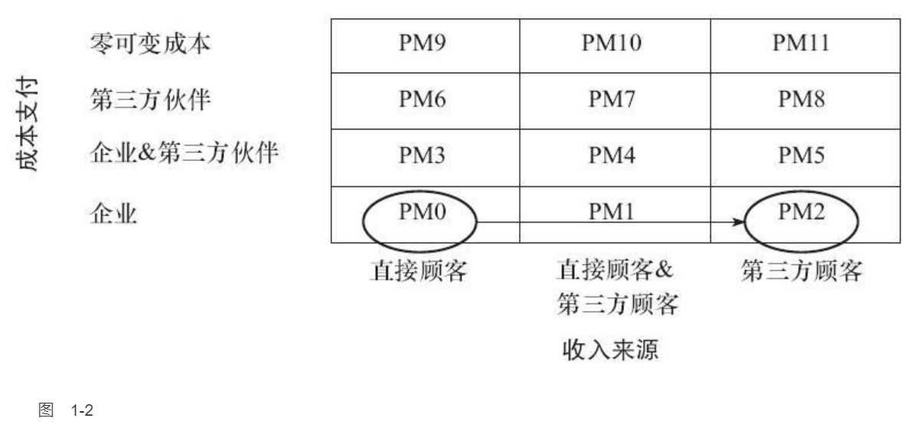

    作者: 林桂平 / 魏炜 / 朱武祥
    出版社: 机械工业出版社
    副标题: 魏朱商业模式理论延伸
    出版年: 2014-5
    页数: 236
    定价: 39.00
    装帧: 平装
    ISBN: 9787111465690

[豆瓣链接](https://book.douban.com/subject/25894780/)

- [第1章 收支来源之利益相关者](#第1章-收支来源之利益相关者)
  - [盈利模式寻宝图：从PM0到PM11](#盈利模式寻宝图从pm0到pm11)
    - [公案：销售牙膏、纸巾，从PM0到PM2](#公案销售牙膏纸巾从pm0到pm2)
    - [公案：让顾客变成你的销售员，Medifast年均增长率超过40%](#公案让顾客变成你的销售员medifast年均增长率超过40)
  - [互利共生：寻找利益相关者之间的关联](#互利共生寻找利益相关者之间的关联)
    - [公案：四川航空的“双循环”盈利模式](#公案四川航空的双循环盈利模式)
  - [免费不是问题，收费才是](#免费不是问题收费才是)
    - [公案：免费记录病历，从哪里赚钱](#公案免费记录病历从哪里赚钱)
    - [公案：降低医疗灰色收入，ESI从保险公司获利](#公案降低医疗灰色收入esi从保险公司获利)
  - [获得高价值的利益相关者](#获得高价值的利益相关者)

# 第1章 收支来源之利益相关者
## 盈利模式寻宝图：从PM0到PM11

- PM0：由企业支付成本并从直接顾客获取收入。这是最普遍的盈利模式，很多“产销一条龙”的传统制造型企业都是如此：支付购买原材料、生产制造和渠道销售的成本，通过直接销售给顾客得到收入，收入减成本，就是盈利。对企业而言，交易结构很简单，除了原材料，基本只涉及两个利益相关者：企业本身和直接顾客。
- PM1：企业投入成本生产产品或者服务，从直接顾客和第三方顾客均获取收入。比如，杂志向读者收取订阅费用，同时向在其上发布广告的商家收取广告费，在这个盈利模式中，广告商的目标受众是杂志的读者，因此是杂志的第三方顾客，而读者无疑是直接顾客。同样的，腾讯的互联网增值服务就采取这样的方式，虚拟的衣服、道具、宠物等都向直接顾客收费，而这些产品的边际成本几乎为零，同时腾讯也向嵌入其网络游戏或其他应用的广告商即第三方顾客收取服务费。
- PM2：企业投入成本生产产品或者服务，直接顾客免费消费，第三方顾客支付费用。这正是本章开头提到的谷歌搜索业务采用的模式，另外，电视台、免费报刊都在此列。与PM1相比，PM2虽然减少了直接顾客的收入贡献，但完全有可能通过免费扩大了客户规模和品牌效应，从而向第三方顾客收取更高的费用。PM1和PM2的交易结构极为类似，在很多场合下可以转换，差别仅仅在于是否对直接顾客收费。
- PM5：企业和第三方伙伴承担生产成本，第三方顾客支付价格，直接顾客免费。在这里，第三方伙伴和第三方顾客可以作为同一主体出现。例如，在2012年最火的电视娱乐节目“中国好声音”中，浙江卫视和节目制作方作为企业和第三方伙伴共同投入、共担风险、共享利润，加多宝提供赞助和宣传，中国移动同时作为第三方伙伴和顾客提供彩铃下载服务，与浙江卫视和制作方利润分成，全国手机用户作为第三方顾客通过下载彩铃为企业贡献收入，电视观众则免费观看节目。
- PM6：企业零投入，第三方伙伴投入提供产品和服务的成本，直接顾客可以得到较低价格的产品和服务。例如，很多商业论坛中，主办方一般只负责召集参会人，具体的会场运作、服务提供都由企业赞助，而参会人可能分层付费，VIP座位高价，一般座位免费或者低价。
- PM11：企业零边际成本生产，第三方顾客支付价格，直接顾客零价格。PM9、PM10、PM11分别从PM0、PM1、PM2衍生而来，关键只在于边际成本为零，因此大多来自实体经济的“互联网化”或“移动互联网化”。例如，脱胎本为零，因此大多来自实体经济的“互联网化”或“移动互联网化”。例如，脱胎于PM2的PM11可见于游戏软件厂商在游戏里提供广告，与在传统媒体打广告相比，互联网或移动互联网使边际成本成为零。

### 公案：销售牙膏、纸巾，从PM0到PM2
日常用品的消费比较稳定，可预测，而且规模较大。但这些日用品又零散，如果到超市大卖场购买，大包小包的，绝对会让一般消费者望而却步。

爱丽丝网（Alice.com）建立了一个日常用品网站，只要你向它注册，告诉它家里有几口人，分别为男、女、大人、儿童等，它就会计算出你的日常用品需求有多大，然后给你定期邮寄，而且包邮哦，亲！

关键在于这些产品，爱丽丝网直接向生产厂家购买，绕过中间商，价格只有同等网站的一半多。它是怎么做到的？

原来，爱丽丝网赚取的并非产品差价，而是广告费。这些厂商很多都为沃尔玛等大型连锁百货卖场代工供货，当销售额达到一定规模后，很有意愿推出自己品牌的产品。如果网购流量合适的话，他们甚至考虑可以不给沃尔玛供货。爱丽丝正是帮这样的厂商扩大消费群体，为他们打广告，收取广告费。别忘了，日常用品的箱子也很大，这本身也是打广告的完美载体。

如果采取靠销售差价获得利润，采取的是PM0，企业承担成本，直接顾客贡献收入。而爱丽丝网则是PM2，企业承担成本，第三方顾客（生产日常用品的厂商）贡献收入（见图1-2）。

从传统的PM0升级到创新的PM2，爱丽丝网发展很迅猛，从起步到谈成6000样商品，只花了不到一年的时间。

### 公案：让顾客变成你的销售员，Medifast年均增长率超过40%
Medifast是一家销售减肥产品的公司。这种减肥餐每天吃六顿，间隔两三个小时吃一顿，都是高蛋白和碳水化合物水平低的食物。Medifast宣称，它的产品安全性和有效性均经过医学认证，绝对健康、安全。但即使这样，创立的前20年，Medifast的业绩也没有特别大的惊喜，总是不温不火。直到2005年前后，它改变了自己的盈利模式，重构了收支来源，才取得了长足的发展。2005年当年的收入仅有400万美元，但之后一路高歌，2009年，竟然翻了几倍，达到1.7亿美元，年均增长率超过40%，净资产收益率为17%。

它如何做到的呢？很简单，让顾客变成销售员，由减肥成功的“前”胖子忽悠还没减肥的“现”胖子。

我们都知道，减肥是一件痛苦的事情，一旦减肥成功，这种成就感是难以言喻的，恨不得到处找人显摆；而对于胖子而言，减肥注定是一条艰难、孤独的路，有人现身说法并监督、陪伴自己减肥是很有必要的。而“物以类聚，人以群分”，胖子和胖子经常是聚集在一起的。Medifast就为他们建构了可以相互影响的盈利模式。

已经减肥成功的“前”胖子可以注册成为公司的“健康教练”，只要通过考试，就会拥有一个ID号和个人专用网页，公开显摆你的减肥故事。只要有“现”胖子相信，从你这上面购买Medifast的产品，你就可以获得提成。公司收款，健康教练不需要垫付资金，直接获得佣金。健康教练不需要到公司打卡，公司也因此省了很多费用，效果还更好。

如果“健康教练”业绩不错，可以继续升级为“商业教练”“商业总监”等，从培训下一级中获得收益。公司为这些教练提供“虚拟办公室”，供其完成订单处理、聊天交流等事务，同时成立一个由专业医生和护士组成的“健康研究所”，为教练提供每周的培训及电话咨询。

显然，Medifast的盈利模式一开始是PM0，由企业培养销售员，承担销售业绩，支出成本，并从直接顾客获得收入；后来进化到PM6，销售业绩由第三方伙伴（已经减肥成功的“前”胖子）承担，大大降低了办公费用，而且效果卓著（见图1-3）。

自从转变盈利模式后，Medifast的发展就进入快车道，据《福布斯》报道，盈利模式转变5年后，截至2010年9月，Medifast的健康教练已达到8000人，人均销售额达到1.5万美元。

## 互利共生：寻找利益相关者之间的关联
从利益相关者的角度思考盈利模式，关键在于寻找利益相关者之间的关联性，思考以下问题：他的利益诉求是什么？谁能够影响他？在什么条件下他愿意参与这个商业模式？等等。只要在众多利益相关者之间形成价值闭环，他的需求有人提供，他的成本能够承担，他的收益可以保证，他的优势可以发挥，这就是一个完整的盈利模式循环。

### 公案：四川航空的“双循环”盈利模式
如果你乘坐了四川航空的飞机，飞机降落前，广播会通知：“各位乘客请注意，如果您购买的是四川航空五折以上机票，降落后我们会为您提供专车免费接送服务。”在专车上，你一定会看到至少三种信息：订车热线、售票热线和免费接送广告。这些车并不是四川航空的，而是旅行社的，开车的司机也是独立的经营者。

他们之间如何定价呢？这正是此盈利模式的精髓之处。卖车行本来价值14.8万元的车，旅行社只用了9万元就买下来，却转手以17.8万元的价格卖给了开车的司机。这里面的玄机就在于旅行社为所有的利益相关者编织了一张相互依存、彼此增值的生态价值网（见图1-4）。

这里面包含两个价值循环，一个是搭载乘客的循环，一个是购销车辆的循环。
在搭载乘客的循环中，乘客免费坐车，对每一个乘客，四川航空付给旅行社30元，旅行社付给司机25元，司机每趟载满7个人，收入175元。

这个过程中，乘客可以节省150元的出租车车费，并获得免费车辆接送的服务便利。航空公司付给旅行社30元，但从五折以上机票中赚取更多利润，并且建立了优质服务的品牌效应，获得了一批中高端客户群体。旅行社从航空公司拿到30元，付给司机25元，每位乘客净赚5元。司机一趟载满7人，每人25元，一共175元，比出租车150元多赚25元，且客流稳定。

再看购销车辆的循环。原价14.8万元的汽车，卖车行以9万元卖给旅行社，旅行社转手以17.8万元卖给司机，司机获得这条线路的5年经营权。

对卖车行来说，貌似吃亏其实不然。旅行社每年向卖车行收取1万元宣传费，5年一共5万。然后司机会充当推销员将卖车行的广告资料发给客户，并主动介绍这款车的性能很好，要知道坐车的大部分都是中高端商务客户，有足够的买车需求。此外，车身广告和热线电话一个月收100元，5年一共6000元，加上宣传费一共是5.6万元，这便是14.8万折价为9万元的差额。而事实上，司机介绍和车身广告的贡献要远远超过5.8万元。

对司机来说，好处也很显然。花17.8万元买到一辆车外加五年的线路运营权和稳定的客流，比起购买出租车牌照或者直接向卖车行买车要合算多了。
对旅行社而言，利益不言而喻。每辆车的买卖价差可以净赚8.8万元，120辆车就可以进账1000万元，同时，车身热线广告的低成本更是带来可观的收益。有数据表明，2008年震灾期间，某家旅行社平均每天就卖出5000～10000张机票。

依照我们介绍的收支矩阵来看，这个盈利模式网中的大部分利益相关者采取的都不是传统的PM0（四川航空除外），也就是收入来自直接顾客，成本由企业承担。司机的收入来自第三方顾客（旅行社），成本自担，属于PM2。卖车行的收入来自直接顾客（直接买车的旅行社）和第三方顾客（司机介绍和广告带来的隐性收入），成本自担，属于PM1。旅行社的收入来自第三方顾客（四川航空和司机），成本（购买的车款）和第三方伙伴（卖车行提供部分车款）共同承担，属于PM5（见图1-5）。

## 免费不是问题，收费才是
### 公案：免费记录病历，从哪里赚钱
PatientsLikeMe（像我一样的患者）是一个面向患者的社交网站，采取会员制。只要注册为网站的会员，就可以简单填写自己的病历：病史、诊断结果、服用药物、治疗办法等，这些信息可以详细到自我感觉、服药的起止时间、剂量、频率、手术等，在网站的引导下，填写过程十分简单。会员还可以看到患有同样疾病的病友，彼此交流病历。

这些数据每天只可以更新一次，网站会按照时间排列自动生成图表，方便会员查阅。

通过这些病历，会员可以查阅同样疾病不同医生的诊疗过程，就一些有疑问的地方和医生交流。例如，有个会员经过医生推荐需要服用一种药物，但是他担心副作用太大。在PatientsLikeMe上，他查阅患过同样疾病的会员病历，确认这种药物的副作用的确较大，从而可以和医生沟通采取另外一种诊疗方式或者采取另一种药物。

显然，对医生而言，登录PatientsLikeMe查阅病历也是一种更为方便的方式。

会员通过网站注册、登记病历并不需要付费，那么网站怎么挣钱呢？并不是通常的广告。PatientsLikeMe的主要收入来源有两个：第一，将沉淀下来的大量病例数据，以匿名方式出售给医药公司等合作伙伴；第二，帮助制药公司招募患者进行新药的临床试验，应征的患者也有一定的回报。

### 公案：降低医疗灰色收入，ESI从保险公司获利
ESI成立仅二十几年，在美国《财富》500强中，过去10年投资总回报排名第五，更让人印象深刻的是，前20名中，它是唯一一个提供“服务”而非高科技、石油或者新能源领域的企业。

ESI的商业模式中，包括三类利益相关者：会员、保险公司和加盟零售店。ESI的会员拿到医生处方后，可以直接到ESI最近的加盟零售药店刷卡取药。会员在药店成功刷卡后，处方信息会自动上传到ESI云端接受全方位审核（用药史、保险资格、选药、价格、报销比例等）。

审核是ESI的核心流程，ESI有权修改医生处方。在会员刷卡后的极短时间里，ESI就可以计算出一个新方案，既保证药效和安全，又能为会员和保险公司节约药费。这就杜绝了医生过度用药、浪费开药等灰色收入。这部分费用节约就是ESI为会员、医疗保险公司所带来的价值。

审核通过后，根据保险合同支付自付部分后，会员即可获得药品。在会员付款的同时，ESI先向加盟药店支付剩余药款，再向保险公司收取药费。由于ESI为保险公司节约了赔付开支，其中的一部分就成为医药保险公司向它支付的服务费。至于药费差价，则直接补贴给会员，ESI并不收取任何服务费。

通过ESI的体系，会员获得更便捷的保险理赔，医药保险公司得到赔付开支的节约，加盟药店获得了巨大的人流量，多方共赢。损失的只是医生的灰色收入，而这个，本来也是医生所不该赚取的。

因此，ESI得到很多零售药店和患者会员的欢迎。目前，ESI拥有5000万患者会员，占美国总人口的1/6，同时与超过6万家的零售药店建立了紧密的加盟合作关系。

ESI的介入，实际上首先是基于患者会员和医生的关系，但是在盈利模式的设计上，却从第三方医疗保险公司收钱，不但是因为保险公司获得开支节约的利益，更重要的是，保险公司是个可规模化的利益相关者，服务费的支出也是节约中的一部分，属于增量分割。而且，保险公司是机构，其法律责任更容易管理，交易成本和交易风险更低。

## 获得高价值的利益相关者
高价值的利益相关者至少具备以下三个特点的其中一个或几个。

1. 总数量大。目标群体的总数量非常大，是主流人群。如沃尔玛，针对的是主流人口特征的消费群体。
1. 高毛利。每位消费者可以贡献高额利润，如奢侈品、豪华赌场等。
1. 可规模化接触。消费者根据特征可能聚集在某些场合、某些情境，这就可以把碎片化的消费者聚合接触。如QQ的即时通信软件就是通过网络聊天，聚合年轻网民的。

