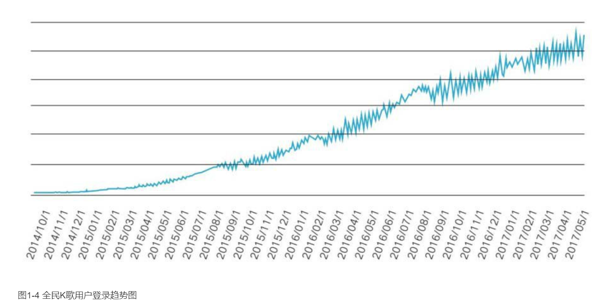

    作者: 徐志斌
    出版社: 中信出版集团
    副标题: 席卷海量用户的隐性力量
    出版年: 2017-11
    页数: 350
    定价: 58.00元
    装帧: 精装
    丛书: 社交红利
    ISBN: 9787508681467

[豆瓣链接](https://book.douban.com/subject/27168595/)

- [01 小群效应](#01-小群效应)
  - [用户更愿意分享给强关系好友和小圈子](#用户更愿意分享给强关系好友和小圈子)
  - [现在开始关注小群效应](#现在开始关注小群效应)

# 01 小群效应
## 用户更愿意分享给强关系好友和小圈子
微信读书的产品负责人NicoYang和我分享了一些数据：

>在“赠一得一”活动完整进行的一天时间（第三天）里，共有2.1万名用户送出4.6万本书，平均每人送出2.2本。1.8万名领取新书的用户共领走了3.1万本书，平均每人领取1.72本。

NicoYang在追踪书籍的赠送路径时发现，用户向小圈子书友推荐图书的意愿和数量，要远远超过向泛朋友圈的推荐：

>- 如果有一名用户将图书分享到朋友圈，就会有两名用户将其分享给“好友”和“群”。
>- 平均每人会将图书分享给“好友”和“群”2～3次，比分享到朋友圈的频次（平均每人分享1.6～1.8次）高出不少。

微信读书“赠一得一”活动的初衷和一个构想有关：志趣相投的人会一起阅读和讨论。NicoYang观察到，愿意分享和被信任的用户群体非常固定。微信读书将用户分为三个等级（见表1-1），虽然用户平均阅读时间超过30分钟，但大部分书籍的阅读进度停留在前半部分。相比其他娱乐方式，阅读所耗费的时间、精力较多，这样一来，骨灰用户和铁杆用户群就显得非常突出，分享人群多集中在他们之中，用户也乐于接纳爱书人的推荐。

表1-0 用微信读书三种用户月登录天数及占比

用户类型 | 月登录天数 | 占比
-----|-------|---
骨灰用户 | 20天 | 18%
铁杆用户 | 10～20天 | 20%
浅度用户 | 不超过10天 | 62%

仅在活动第三天，向好友赠送书籍的2.1万名用户就为微信读书带来了5 000多名新增用户。同时，当天登录的活跃用户数相比活动前增长了30%。

2016年1月下旬，微信读书将“赠一得一”运营活动升级为一项功能（同时上线的还有另一个类似功能：“买一赠一”，即用户在成功购买一本新书后，可以赠送给好友一本书），顺便做了一个小调整：用户可以无限制送书，但每人只能领取两本，至于哪些书籍参与“买一赠一”则由出版社自行确定。

我们获取了微信读书一段时间内的运营数据，并对其进行观察。表1-1选取了新功能上线早期连续8天的各项指标。其中，2月8日为2016年春节（农历正月初一）。

表1-1 微信读书新功能上线早期的各项表现

时间/次数（人数） | 点击“赠一得一”用户 | 分享微信群和好友 | 分享微信朋友圈 | 领取页
----------|--------|-------------|---------|----
2.15 | 9156(5063) | 5833(2785) | 842(492) | 7874(6727)
2.14 | 8621(4757) | 5843(2556) | 824(476) | 8305(6868)
2.13 | 9509(4928) | 6082(2604) | 1033(535) | 9960(8067)
2.12 | 8155(4426) | 5330(2432) | 695(413) | 6569(5532)
2.11 | 8523(4590) | 5272(2433) | 858(464) | 7833(6591)
2.10 | 6728(3586) | 4184(1942) | 545(308) | 4944(4131)

在社交网络中，“分享”是一个关键动作，代表着用户想和哪些人群分享什么样的信息。数据显示：

>用户倾向于分享至“微信群和好友，在当天分享人数和次数中，其占比均超过85%。

“领取页”是微信读书的观察指标之一，用户可以点击“好友赠送”信息进入页面领取新书。这就是我们常说的另一个基本概念“回流”，从中可知用户的分享帮助企业从社交网络中获得了多少新用户。

由于产品经理预先限制每人领取两本，且进入领取页的多为新用户，新功能被明确限制在拓展新用户这一途径上。截至2月11日（农历正月初四），每天进入领取页的新用户稳定在6 000人左右。截至目前，该功能每天可为微信读书带来新增注册用户5 000～7 000名。

全民K歌在这款用户超过4.7亿的产品中，有七成用户会选择收听好友的歌曲，但这些播放量仅占全平台的40%～50%，其余50%～60%的播放量来自用户关注的那些唱歌好听的人。换句话说：我们身边很少有歌霸。

全民K歌的用户关系链由强关系和弱关系构成，其中兴趣驱动的弱关系占了很大比重。音乐本身是一件“萝卜青菜各有所爱”的事，不同类型的音乐都有很多拥趸，且彼此影响的人群差异非常明显。例如，喜欢二次元歌曲的用户不会和广场舞爱好者产生共鸣，喜欢民谣的用户很难欣赏重金属音乐。因此用户会通过歌曲类型实现互相关注，会关注那些唱歌非常好听的达人。

这些由兴趣驱动的弱关系催生了一个有意思的功能：“家族”。产品经理注意到，许多用户会通过更换自己的昵称、相册封面和歌曲封面等方式，对某个唱歌特别好听的达人给予支持，或者通过邀请其他人加入QQ群、微信群等方式组建“家族”。因此产品经理展开了小范围内测，截至2017年3月正式开放时，这个功能才只具备家族等级、家族排行、成员列表、作品等基础要素，但仍在3个月内吸引了超过200万用户进入。

“家族”渐渐成为运营中一支重要的润滑剂，“家族”成员的活跃度显然更高。为了让“家族”的排位更靠前，成员们会一起帮助选歌、分享、扩散、评论、互动等，甚至会产生角色分工，如分成主唱、女神、土豪等不同角色。

成员们对家族达人的打赏、围绕同一首歌的讨论，都显示出了更强的互动欲望，甚至连QQ群都可以体现出这些热度。这预示着基于相同兴趣的产品功能具有很大的开发潜力，社交元素成为全民K歌未来的产品重心。

抽取全民K歌任意一天的分享数据（见表1-2）进行分析，

表1-2 全民K歌单日分享数据表

分享去向 | 人数占比（%） | 次数占比（%） | 人均分享次数（次）
-----|---------|---------|----------
微信好友和群 | 49 | 54 | 2.13
微信朋友圈 | 23 | 20 | 1.67
QQ好友和群 | 20 | 20 | 1.91
QQ空间 | 7 | 5 | 1.34
新浪微博 | 1 | 1 | 1.38

全民K歌每天分享的用户数超过1 000万。从以上图表中可以看出，分享到“微信好友和群”占全部分享次数的54%，如果再加上分享到“QQ好友和群”，这一比例则会上升到74%。同样，分享至“微信好友和群”的次数都远远大于分享到微信朋友圈、新浪微博和QQ空间的次数。

与此同时，60%～80%的用户会和强关系好友进行互动。例如，许多子女居然是通过全民K歌和父母进行沟通，父母会默默播放孩子唱的歌并送花点赞等。

分享给强关系好友和小圈子、小群，已成为目前用户下意识的动作。

这些分享每天为全民K歌从微信带来超过10万新增下载用户。我们可以这样理解，在已有的3亿用户中，每天分享的1 000万用户帮助产品建立了广阔的外部用户池子，并持续稳定地带来新增用户。

在各种基础功能产品体验优秀的前提下，全民K歌充分运用了这些强关系、小群之间的比较心态，以及和家族、兴趣人群之间的团队比拼、打赏等功能。

全民K歌用户登录趋势见图1-4。

截至目前（2017年6月），全民K歌日活跃用户超过5 000万，月留存率为75%。其中，最活跃的1 000万用户保持了几乎每天登录的节奏（月登录30天）。分享到小群这件事情，让用户得以留存并活跃起来。

## 现在开始关注小群效应

