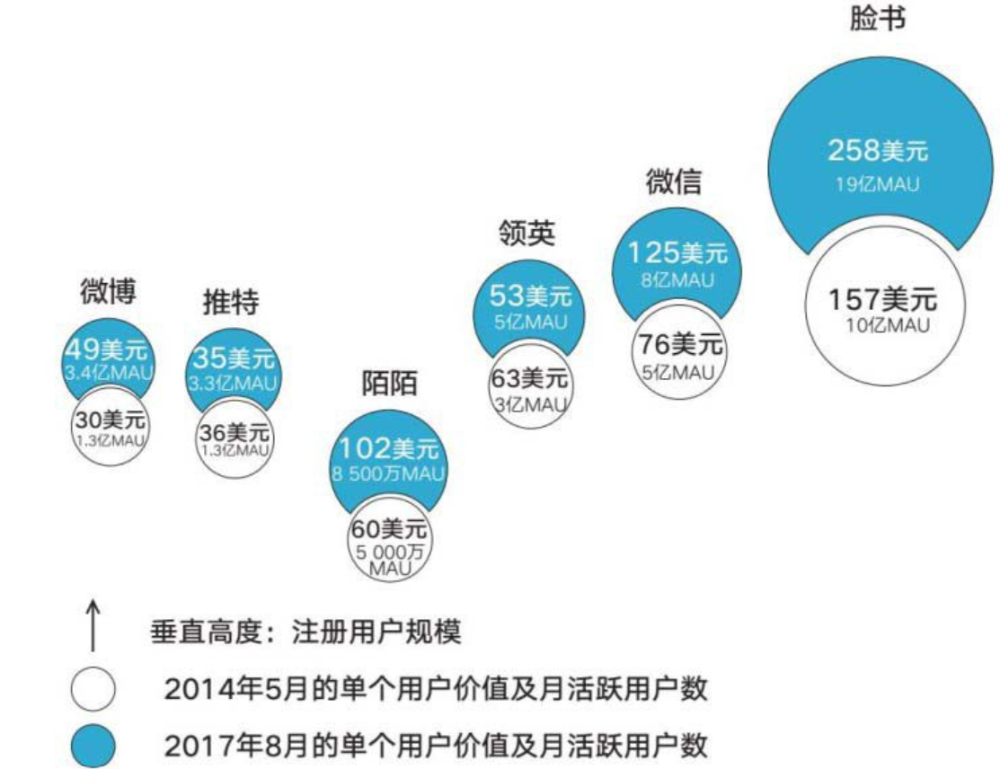
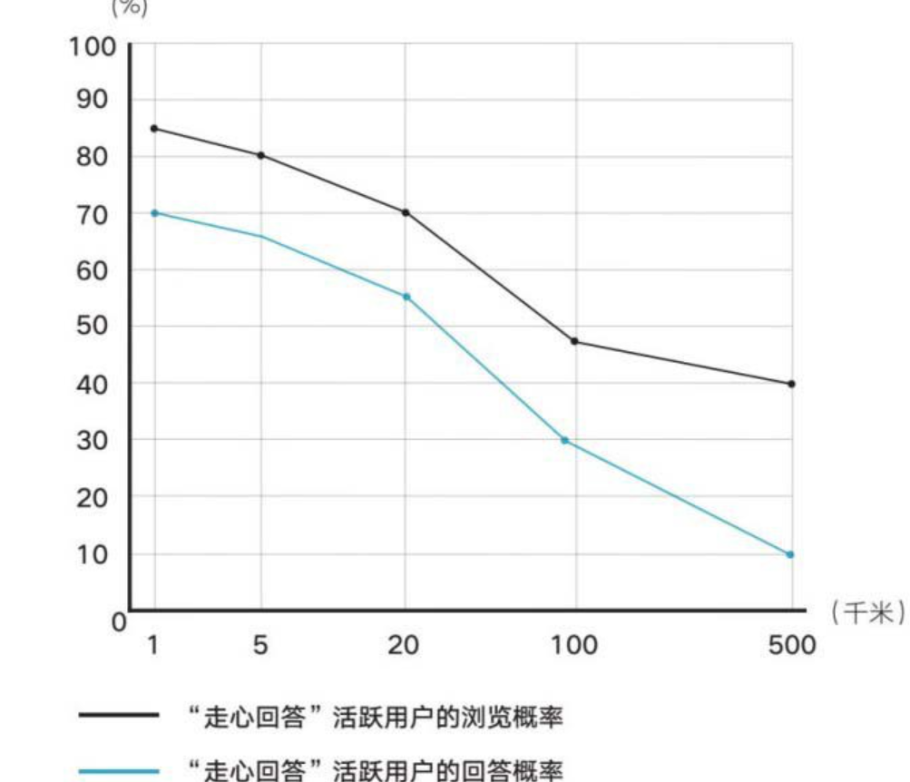
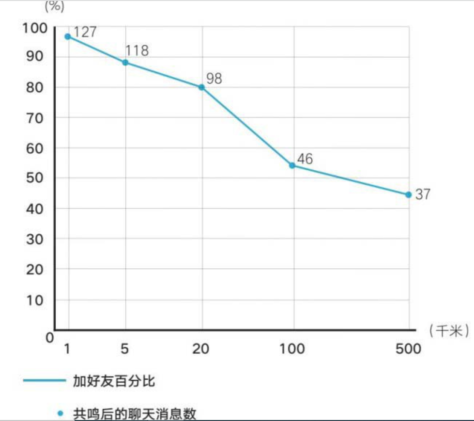

    作者: 徐志斌
    出版社: 中信出版集团
    副标题: 席卷海量用户的隐性力量
    出版年: 2017-11
    页数: 350
    定价: 58.00元
    装帧: 精装
    丛书: 社交红利
    ISBN: 9787508681467

[豆瓣链接](https://book.douban.com/subject/27168595/)

- [01 小群效应](#01-小群效应)
  - [用户更愿意分享给强关系好友和小圈子](#用户更愿意分享给强关系好友和小圈子)
  - [现在开始关注小群效应](#现在开始关注小群效应)
  - [被发觉的大城市聚集效应](#被发觉的大城市聚集效应)
  - [AdMaster的社群细分图谱](#admaster的社群细分图谱)
  - [优秀社群的三个标准](#优秀社群的三个标准)
- [02 三近一反](#02-三近一反)
  - [粉丝越来越贵了！](#粉丝越来越贵了)
  - [相近地域：用户对1000米内的信息最敏感](#相近地域用户对1000米内的信息最敏感)
  - [相近兴趣：用户只关注和自己相关的问题](#相近兴趣用户只关注和自己相关的问题)
  - [相近年龄：占比87%以上的年轻人，帮助快手一飞冲天](#相近年龄占比87以上的年轻人帮助快手一飞冲天)
  - [大部分社群都忽略了“反”](#大部分社群都忽略了反)
- [03 连接者](#03-连接者)

# 01 小群效应
## 用户更愿意分享给强关系好友和小圈子
微信读书的产品负责人NicoYang和我分享了一些数据：

>在“赠一得一”活动完整进行的一天时间（第三天）里，共有2.1万名用户送出4.6万本书，平均每人送出2.2本。1.8万名领取新书的用户共领走了3.1万本书，平均每人领取1.72本。

NicoYang在追踪书籍的赠送路径时发现，用户向小圈子书友推荐图书的意愿和数量，要远远超过向泛朋友圈的推荐：

>- 如果有一名用户将图书分享到朋友圈，就会有两名用户将其分享给“好友”和“群”。
>- 平均每人会将图书分享给“好友”和“群”2～3次，比分享到朋友圈的频次（平均每人分享1.6～1.8次）高出不少。

微信读书“赠一得一”活动的初衷和一个构想有关：志趣相投的人会一起阅读和讨论。NicoYang观察到，愿意分享和被信任的用户群体非常固定。微信读书将用户分为三个等级（见表1-1），虽然用户平均阅读时间超过30分钟，但大部分书籍的阅读进度停留在前半部分。相比其他娱乐方式，阅读所耗费的时间、精力较多，这样一来，骨灰用户和铁杆用户群就显得非常突出，分享人群多集中在他们之中，用户也乐于接纳爱书人的推荐。

表1-0 用微信读书三种用户月登录天数及占比

用户类型 | 月登录天数 | 占比
-----|-------|---
骨灰用户 | 20天 | 18%
铁杆用户 | 10～20天 | 20%
浅度用户 | 不超过10天 | 62%

仅在活动第三天，向好友赠送书籍的2.1万名用户就为微信读书带来了5 000多名新增用户。同时，当天登录的活跃用户数相比活动前增长了30%。

2016年1月下旬，微信读书将“赠一得一”运营活动升级为一项功能（同时上线的还有另一个类似功能：“买一赠一”，即用户在成功购买一本新书后，可以赠送给好友一本书），顺便做了一个小调整：用户可以无限制送书，但每人只能领取两本，至于哪些书籍参与“买一赠一”则由出版社自行确定。

我们获取了微信读书一段时间内的运营数据，并对其进行观察。表1-1选取了新功能上线早期连续8天的各项指标。其中，2月8日为2016年春节（农历正月初一）。

表1-1 微信读书新功能上线早期的各项表现

时间/次数（人数） | 点击“赠一得一”用户 | 分享微信群和好友 | 分享微信朋友圈 | 领取页
----------|--------|-------------|---------|----
2.15 | 9156(5063) | 5833(2785) | 842(492) | 7874(6727)
2.14 | 8621(4757) | 5843(2556) | 824(476) | 8305(6868)
2.13 | 9509(4928) | 6082(2604) | 1033(535) | 9960(8067)
2.12 | 8155(4426) | 5330(2432) | 695(413) | 6569(5532)
2.11 | 8523(4590) | 5272(2433) | 858(464) | 7833(6591)
2.10 | 6728(3586) | 4184(1942) | 545(308) | 4944(4131)

在社交网络中，“分享”是一个关键动作，代表着用户想和哪些人群分享什么样的信息。数据显示：

>用户倾向于分享至“微信群和好友，在当天分享人数和次数中，其占比均超过85%。

“领取页”是微信读书的观察指标之一，用户可以点击“好友赠送”信息进入页面领取新书。这就是我们常说的另一个基本概念“回流”，从中可知用户的分享帮助企业从社交网络中获得了多少新用户。

由于产品经理预先限制每人领取两本，且进入领取页的多为新用户，新功能被明确限制在拓展新用户这一途径上。截至2月11日（农历正月初四），每天进入领取页的新用户稳定在6 000人左右。截至目前，该功能每天可为微信读书带来新增注册用户5 000～7 000名。

全民K歌在这款用户超过4.7亿的产品中，有七成用户会选择收听好友的歌曲，但这些播放量仅占全平台的40%～50%，其余50%～60%的播放量来自用户关注的那些唱歌好听的人。换句话说：我们身边很少有歌霸。

全民K歌的用户关系链由强关系和弱关系构成，其中兴趣驱动的弱关系占了很大比重。音乐本身是一件“萝卜青菜各有所爱”的事，不同类型的音乐都有很多拥趸，且彼此影响的人群差异非常明显。例如，喜欢二次元歌曲的用户不会和广场舞爱好者产生共鸣，喜欢民谣的用户很难欣赏重金属音乐。因此用户会通过歌曲类型实现互相关注，会关注那些唱歌非常好听的达人。

这些由兴趣驱动的弱关系催生了一个有意思的功能：“家族”。产品经理注意到，许多用户会通过更换自己的昵称、相册封面和歌曲封面等方式，对某个唱歌特别好听的达人给予支持，或者通过邀请其他人加入QQ群、微信群等方式组建“家族”。因此产品经理展开了小范围内测，截至2017年3月正式开放时，这个功能才只具备家族等级、家族排行、成员列表、作品等基础要素，但仍在3个月内吸引了超过200万用户进入。

“家族”渐渐成为运营中一支重要的润滑剂，“家族”成员的活跃度显然更高。为了让“家族”的排位更靠前，成员们会一起帮助选歌、分享、扩散、评论、互动等，甚至会产生角色分工，如分成主唱、女神、土豪等不同角色。

成员们对家族达人的打赏、围绕同一首歌的讨论，都显示出了更强的互动欲望，甚至连QQ群都可以体现出这些热度。这预示着基于相同兴趣的产品功能具有很大的开发潜力，社交元素成为全民K歌未来的产品重心。

抽取全民K歌任意一天的分享数据（见表1-2）进行分析，

表1-2 全民K歌单日分享数据表

分享去向 | 人数占比（%） | 次数占比（%） | 人均分享次数（次）
-----|---------|---------|----------
微信好友和群 | 49 | 54 | 2.13
微信朋友圈 | 23 | 20 | 1.67
QQ好友和群 | 20 | 20 | 1.91
QQ空间 | 7 | 5 | 1.34
新浪微博 | 1 | 1 | 1.38

全民K歌每天分享的用户数超过1 000万。从以上图表中可以看出，分享到“微信好友和群”占全部分享次数的54%，如果再加上分享到“QQ好友和群”，这一比例则会上升到74%。同样，分享至“微信好友和群”的次数都远远大于分享到微信朋友圈、新浪微博和QQ空间的次数。

与此同时，60%～80%的用户会和强关系好友进行互动。例如，许多子女居然是通过全民K歌和父母进行沟通，父母会默默播放孩子唱的歌并送花点赞等。

分享给强关系好友和小圈子、小群，已成为目前用户下意识的动作。

这些分享每天为全民K歌从微信带来超过10万新增下载用户。我们可以这样理解，在已有的3亿用户中，每天分享的1 000万用户帮助产品建立了广阔的外部用户池子，并持续稳定地带来新增用户。

在各种基础功能产品体验优秀的前提下，全民K歌充分运用了这些强关系、小群之间的比较心态，以及和家族、兴趣人群之间的团队比拼、打赏等功能。

全民K歌用户登录趋势见图1-4。

截至目前（2017年6月），全民K歌日活跃用户超过5 000万，月留存率为75%。其中，最活跃的1 000万用户保持了几乎每天登录的节奏（月登录30天）。分享到小群这件事情，让用户得以留存并活跃起来。

## 现在开始关注小群效应
人们已经由大广场、大社交圈分享的状态，迅速进入了小群沟通和分享的状态。

>业界通常将`社群`定义为基于兴趣或需求的某一人群的集合。在过去的数年中，社群形态经历了线下社区到线上社区的变化，时至今日，垂直社交、QQ群、微信群，乃至大型社交网络中的某些人群，也被纳入社群的范畴。

## 被发觉的大城市聚集效应
2013年，秦海龙博士启动了一项研究工作，希望能摸清用户在社交圈中的行为特点。秦博士选择利用新浪微博API，分析了95 489 041名新浪微博用户的互粉关系。

在微博上，互粉的好友之间会形成一个个不同的社交圈。在对调查样本进行分析后，秦博士得出了以下结论（见表1-4）。

表1-4 新浪微博用户社交圈类型

社交圈类型 | 社交圈数量（个）
------|---------
学校相关 | 282
行业兴趣相关 | 128
地理位置相关 | 34

亲友、同学、同事、同好不仅构成了互粉好友的基础，还会再度形成一个个紧密的小圈子。其中，以同学、行业、兴趣、老乡为基础，构成了最常见的社交圈。紧随其后的数据显示，互粉数量增加会提升用户发表微博的数量。

秦海龙博士还在新浪微博上提交了一个名为“围脖集体照”的小应用，邀请用户在上面标示出自己实际活跃的社交圈，最终搜集到了322位用户的标示信息，涵盖了兴趣、地域、行业等多种分类。通过研究发现，用户会大量加入社交圈，不同圈子的成员数从多（200人以上）到少（0～30人）都有，能被用户认可、长期活跃、易被影响的仍然是强关系所在的小圈子，如成员数在30人以下的社交圈总数为121个，而大圈子（如200人以上）多被自动忽略（见表1-5）。

表1-5 新浪微博用户社交圈统计

社交圈成员数量（人） | 社交圈数量（个）
-----------|---------
0-30 | 121
31-50 | 52
51-100 | 30
101-200 | 18
200以上 | 2

## AdMaster的社群细分图谱
>一个社群会分化成多个小社群，本社群内一定有成员协助将更多社群连接起来。这个连接起更多小社群的人（连接者）非常重要，他不一定是粉丝很多的大账号，却一定是社群内很重要的`大节点`。

大节点的概念引自《社交红利》，是指社交网络中具有较大影响力的用户和账号。在社群运营中，寻找和确定这些关键节点，会给扩散传播、社群转化等诉求带来巨大帮助。

大型社群及其高价值效果是由无数小社群构成的。用户活跃在小群之中，更易受到小群的影响。

人们一直生活在小群之中，而分享集中流向小群，最终促使这个基础行为带来雪崩般的变化，激发出新一轮庞大的社交红利。因此，我们将人们活跃在“小群”中进行分享，引发巨大社交传播结果和转化结果的现象，称为`“小群效应”`。

## 优秀社群的三个标准
不论是微信群还是社交圈，都显现出“大群松散沉默，小群紧密活跃”的特征。这三个特点甚至可以用作衡量一个社群是否优秀的三个核心标准：

1. **人们相互认识**。成员在社群之中能结识多少好友？这个指标代表了紧密度。一个成员在社交圈内部的好友越多，说明成员在社交圈中的地位越重要，质量也越高。在一个社群中，好友数量越多，人们在这个社群中留存、黏着，或者活跃的时间就越长。在现实中，许多社群安排线下活动时会布置相当长时间的“破冰”，就是这个原则的实际运用。
2. **人们互相信赖**。成员是否信任其他人？这代表信任度。信任成本最低是促成社群高转化的基础。
3. **成员之间频繁互动**。互动次数和互动频次代表着时间货币。衡量一个社群是否具备价值的一个核心指标是看社群消耗用户的时长有多少。通常，用户停留时间越长，表明社群对用户的影响越大。其中最主要的消耗发生在成员之间的频繁互动中。频繁互动可以催生大家一致认同的社群变化，带来信息大扩散，是用户快速增长的基础。

用户体验（信息骚扰程度）和小群形态又为社群建置了新的门槛。当企业或品牌将用户、粉丝通过社群的方式维系、组织在一起时，信息骚扰会限制人群规模和转化效果。要形成大群效应，必然要解除这些束缚。因此，大型社群面临两个关键考验：

1. **社群的组织方式**。在当今移动状态和社交网络带来的人人平等、人人都可发声的架构下，噪声和骚扰非常大，遴选有价值信息的成本也十分巨大，用户逃离或沉默的比例急剧上升。因此，将一大群人直接围拢在一起的方式必然变得不可行。但如果自己去管理和运营一个个小群，也注定无法成行，成本会成为最大的阻碍。组织方式考验的是，用户已经活跃在一个个小型社交圈中，大型社群要通过什么方式，才能将无数小圈子、小群牢牢凝聚在自己周围？
2. **信息的传播扩散方式**。在用户活跃的小群中，关系链就像是一道天然防火墙，将企业阻挡在外。因此，信息的传递方式也是一种考验：如何才能穿透并触及无数小群，影响和覆盖应有的目标人群？

而“微信读书”和“全民K歌”两款应用都不约而同地运用到了利益驱动（微信读书的“买一赠一”“赠一得一”两个功能和全民K歌的虚拟赠品功能），及荣誉驱动（微信读书的好友排名和全民K歌的好友擂台），这是社交六大驱动力中最常见的两个，社交也从这个角度给出了自己的解决方案。

>观察社群成长的常用工具之一：`小群效应`
>
>衡量社群质量的三个标准分别为：成员之间互相结识人数、互动频次及相互之间信任程度（通常可用是否有“三近”来替代，还可用是否曾有过互相帮助的时间来取代）。

# 02 三近一反
## 粉丝越来越贵了！
微播易调出历年自媒体广告收入数据进行分析，看到一个简单且乐观的结果：粉丝帮助自媒体挣的钱越来越多了（见图2-1）。2009—2013年，自媒体的主要阵地是微博，平均每100名粉丝一年可以为微博账号带来12元的广告收入。从2015年开始，微信公众账号成为主流，平均每名粉丝一年可为自媒体带来广告收入36.5元。如果自媒体尝试电商，每名粉丝会在一年内再度贡献80元以上的收入。从2016年开始，社交进入直播时代，打赏变成部分账号的收入来源之一。在和多个直播平台交流数据后，我估算用户人均每年打赏金额在30元左右。

这些广告收入、电商收入、内容／打赏收入，都处在持续上升的态势中。以部分行业广告举例，企业吸引单个微信用户阅读一次广告信息的成本，已经由1元上升到了2元，甚至更多。2016年，电商和打赏仍处在起步期，带来的收入也处在上升通道中。

到2016年年底，来自社群的会员收入又开始迅速上扬（最常见的是人均299元的会员费），成为许多投资人关注和决定投资自媒体的新动力。

图2-1 单个粉丝带来的收入，单位（元/年）

    - 微博广告  0.12
    - 打赏      30
    - 微信广告  36.5
    - 电商      80 
    - 会员      299

0.12+36.5+80+30+299=445.62元。这组数据意味着：粉丝变得越来越“贵”，帮自媒体挣的钱越来越多。

腾讯前战略总监钟甄最近创办了“大眼通讯”，一个供熟人之间视频聊天的工具。作为社交领域的连续创业者和深度研究者，她在社交网络平台的比较研究中使用了一个非常有意思的指标——`“单个用户价值”`，这个指标是用“社交网络市值”（market cap）除以“月活跃用户数”（monthly active users，MAU）得出。

从宏观来说，这个指标意味着每个“月活跃用户”对社交网络市值的贡献；从微观来看，则体现出用户在不同社交平台所感知到的社交网络价值。钟甄认为，社交网络中的用户和平台之间存在一种对等的价值交换。对用户越有价值的社交平台，用户活跃度越高，越愿意沉淀内容与关系，从而该社交网络的盈利能力和商业价值也更大。这与我所说的“粉丝帮自媒体带来收入”这个现象非常类似。

根据不同社交网络的“单个用户价值”，钟甄绘制出一个球状对比图谱，其中，圆球大小代表该社交网络“单个用户价值”的大小，球的纵向排序的高低代表该社交网络的用户规模（见图2-2）。

图2-2 不同社交网络的“单个用户价值”对比图

这张图向我们展示了一些有趣的现象，例如：

1. 并不是社交网络规模越大，单个用户价值就越高。用户在该社交网络的关系强度、活跃性，也会对社交网络价值产生重要影响。
2. 并不是市盈率越高的社交网络，单个用户价值就越高。网聚效应会帮助平台获得更大的收入空间。

从图中我们可以看到，与2014年5月相比，2017年8月微博的“月活跃用户数”增长了近3倍，但“单个用户价值”仅增长了63%；领英、推特的“单个用户价值”甚至下降了；陌陌“月活跃用户数”增长了70%，“单个用户价值”也增长了70%，达到102美元，成为全球第三个最有价值的社交网络；脸书和微信的“单个用户价值”都获得了64%的增长，成为全球前两个最有价值的社交平台。过去三年，虽然六大平台的“月活跃用户数”都在上涨，但“单个用户价值”增加最快的平台，无一例外都是用户好友数、使用强度和活跃度增长最快的社交网络平台。

钟甄意识到，当社交网络大平台逐步成熟并扩张到一个饱和规模时，社群（尤其是小群）所带来的价值会更加凸显。只有具备良好社群关系的社交网络，才能拥有更高的用户黏性和平台价值，社交网络本身也就具有了更大价值潜力和增长空间。微信和“陌陌”就是其中的典型案例。这也恰恰解释了脸书为何在2017年开发者大会上，把“建造社区/社群”（building community）作为其下一步的战略目标。

## 相近地域：用户对1000米内的信息最敏感
如果调出三年前最热门的引爆应用和朋友印象所使用的七天应用，将用户分享数据做一个对比，会看到和“小群效应”章节中类似的小群趋势（见表2-1）。

表2-1 引爆应用分享去向数据对比（单位：%)

时间与应用名称 | 分享至微博 | 分享至微信朋友圈 | 分享至微信群和好友
--------|-------|----------|----------
2013年“足记” | 29.22 | 64.62 | 5.62
2017年“朋友印象” | 5.5 | 45.8 | 23

分享去向的变化反映出社交网络正在努力修正的问题，**即应用在即时引爆后，通常也会迅速衰退，但小群可以帮助企业实现更好的用户留存和黏着**。只有让爆发性力量持续而稳定，企业基于社交网络所构建或优化的商业模式和收入模型才能更加巩固。

对于陌生人而言，**距离是一种重要的关系，决定了社群的发展或更强关系的构建**。在走心回答中，距离成了产品和运营的重点考虑因素。距离对用户浏览概率和回答概率的影响如图2-3所示。

图2-3 距离对用户浏览概率和回答概率的影响

距离对加好友和聊天消息数的影响如图2-4所示。

图2-4 距离对加好友和聊天消息数的影响

透过数据，产品团队看到距离1 000米以内的用户聊天互动欲望最强，互相加好友的比例为98%，几乎可以说是距离1 000米以内的用户必加好友。

发现距离对用户行为的影响后，朋友印象产品团队做了一些测试，将问答次数和聊天概率分别按照距离、时间等组合做出对比分析（见表2-2），发现用户查看答案的次数和回答问题的次数都相应变化较大。

表2-2 按距离和时间排序的问答次数及聊天概率对比分析

-- | 按回答时间（调整前） | 按距离排序 | 距离+时间排序
---|------------|-------|--------
用户查看答案的次数 | 53 | 114 | 99
用户回答问题的次数 | 1.2 | 2.7 | 2.3
匹配后加好友聊天的概率（%） | 81 | 63 | 74

在图表数据之外，长尾也开始发挥巨大的作用。社交网络中的信息流通常以时间为唯一标准，最近发布的信息会出现在最前，越早发布的信息越靠后，所以业内多以英文词Timeline来称呼信息流。在这个标准下，信息的生命周期多以“分钟”计算。当把朋友印象的信息流和距离因素结合后，产品经理们惊讶地发现，产品内68%的评论都在24小时后发生。其中，发布信息30天后，用户评论率达到了27%，并贡献了60%的点赞和69%的浏览。

用户对距离（地域）的敏感程度，远远超过了对时效的要求。距离也让信息的生命周期得到极大延长。

陌陌曾对用户的标签进行分析，发现90%的用户都使用了“音乐”“摄影”“旅游”这三个标签。陌生人之间为了建立新关系，互相打招呼发送的消息量仅占总消息量的5%左右，关系的建立仍然依赖通信录、腾讯微博、新浪微博、人人网等已有关系链，这表明**用户不会经常花时间持续建立关系，广泛的兴趣很难成为用户沟通的主要理由**，且即使用户为自己标注了这些标签，他们的实际行为也和这些标签没有太大联系。而在建立好友关系的用户中，“附近的人”占总体好友比例的30%～40%。

2012年4月，陌陌开始讨论并测试不同版本的群功能。陌陌群最早采用的是多人对话的模式，最终发展出了基于地理位置的群功能，允许用户在“小区”“学校”“写字楼”三个地点创建自己的群。这三个地点能够表明用户的社会地位（或者说，用户具有相似的社会地位），而其他地点（如公园、地铁站等）则不具备社交筛选这一功能。

实际运营中陌陌发现，用户只是需要找一个理由聚在一起，不管主题是“某某小区狼人杀”还是“宝马群”，用户基本不会只围绕设立的主题进行沟通，而是围绕地点本身以聊天和聚会的形式交流。在由社会地位相当的基础成员构成的用户群中，陌陌每月活跃的100多万个群中至少有1%会发起线下聚会。数据也显示出，在线下发起过聚会的群会维持非常高的活跃度（70%～80%）。

基于地理位置的群功能支撑了陌陌。2013年年底，其日活跃用户数从300万～500万的规模跃升到1 000万以上。同时，用户长期留存率从推出这一功能前的20%上涨到30%以上，增幅达到50%左右。

## 相近兴趣：用户只关注和自己相关的问题
“走心回答”是“朋友印象”上的诸多功能之一，类似于我们私下常玩的“真心话大冒险”。朋友印象基于个人的全方位信息，来与陌生人做交友匹配。

实际运营中，朋友印象产品团队将相关问题分为四种类型（如图2-6所示），分别为公共问题、私人问题、客观问题和主观问题。举例来说，“情人节怎么过”“养狗的好处和坏处”“旅游对生活有什么帮助”是公共问题，“如何看待互联网的快速发展”等是客观问题，“你养狗时有什么有趣的经历”“你旅游时曾有过什么难忘的故事”等就是私人问题、主观问题。

图2-6 四种问题的浏览概率和回答概率

问题类型 | 浏览概率（%） | 回答概率（%）
-----|---------|--------
公共问题 | 53 | 39
私人问题 | 82 | 62
客观问题 | 30 | 24
主观问题 | 79 | 57

私人问题的浏览概率和回答概率最高，分别是82%和62%。团队意识到，主观问题容易吸引用户参与，私人问题则容易在小圈子内引发讨论。面对公共问题，用户更愿意以旁观者的身份参与，客观问题则基本不受欢迎。

换句话说，同样是兴趣，人们还是愿意关注和自己相关的问题。这和陌陌的“广泛的兴趣很难成为用户沟通的主要理由”结论一致。

我们发现，回答私人问题后相互加好友的比例也是最高，为89%（见表2-3）。

表2-3 参与四种问题的用户匹配概率和转化为好友的概率

问题类型 | 参与问题后的匹配概率（%）| 匹配后转化为好友概率（%）
-----|---------|--------
公共问题 | 62 | 43
私人问题 | 87 | 89
客观问题 | 41 | 18
主观问题 | 77 | 85

## 相近年龄：占比87%以上的年轻人，帮助快手一飞冲天
许多人下意识地认为，三线、四线城市使用快手的用户居多。其实不然，和其他移动产品一样，“北上广深”等大型城市的用户仍然占据着主流地位，而三线、四线城市的用户由于创造力同样被激发了出来，因此显得比较特别。但从用户画像看，快手更像是一个年轻人聚集的大型社交类产品，“90后”用户占比超过87%。

2017年4月，快手CEO（首席执行官）宿华受邀在腾讯内部做闭门分享时，提及了一段转型历史。2013年，快手从GIF（图像文件格式）工具转型为短视频分享社区。随后，原名为“GIF快手”的这款产品去掉了名字中的GIF，改为“快手”。这次转型让活跃用户流失了90%以上，迅速跌至1万左右。直到2014年7月，日活跃用户数才再次超过百万。到2015年1月，日活跃用户数超过千万。

宿华在腾讯分享时提到，用户能在短时间内迅速增长，一方面得益于产品算法。算法提升了用户体验及分发效率，简单来说，就是分别理解内容和人群，在两者之间做更合适的推荐。实际上，产品经理们对未来社群的关注点就部分集中在算法和相似人群的自动划分上。预计未来对社交网络成长变化的关注和分析会继续从这一角度展开。

用户的增长另一方面也得益于年轻人群。快手刚转型时，原有的成熟用户不太习惯，反而是一些年轻、爱分享的用户更愿意尝鲜，愿意拍摄和发表视频。现在，快手也将自己的目标人群定义为年轻、热爱分享的普通人。这个人群为快手贡献了人均日消费60分钟、每5位活跃用户中就有1人上传原创视频的数据。从2015年6月到2016年2月，快手用户从1亿上涨到3亿。目前快手注册用户超过5亿。

## 大部分社群都忽略了“反”
在社交网络中，产品经理们将能够促成用户活跃、降低互相认识的门槛，以及加为好友（结网）的基础归纳为“三近一反”。其中，“三近”指的是相近的地域、相近的年龄、相近的兴趣爱好等，“一反”最早是指性别相反。

很快大家便发现，拥有相似的个人资料，发布相似的消息，拥有相近的财富、相同的社会地位、相似的履历，在某一游戏中拥有相似的等级和战斗力，乃至某个时刻都在减肥，都喜欢某个明星，都喜欢看某部电视剧，都想辞职去某地旅游，都在为家里的小朋友挑选幼儿园等相似的背景和需求，都被纳入“三近”的范畴中来。

“一反”则指相互帮助却又存在冲突和协作的两方，除去我们最熟悉的两性关系外，典型的还有商业环境中的甲乙双方、供需双方等。

“三近”协助无数用户聚合成各种社群，或在社群中因此扩散、停留、活跃。如“微信读书”通过书籍在读书群自然扩散，吸引来更多新用户；“一反”将社群成员强有力地黏合在一起，协助打开商业化的大门。

>观察社群成长的常用工具之二：`三近一反`
>
>形成社群的人群有相同的需求基础，并且相互之间存在提供服务、贡献活跃和付费的动力。

“三近一反”几乎是小群提出的“社群优秀的三个标准”（相互认识、相互信赖、频繁互动）的最直接呈现。

# 03 连接者

