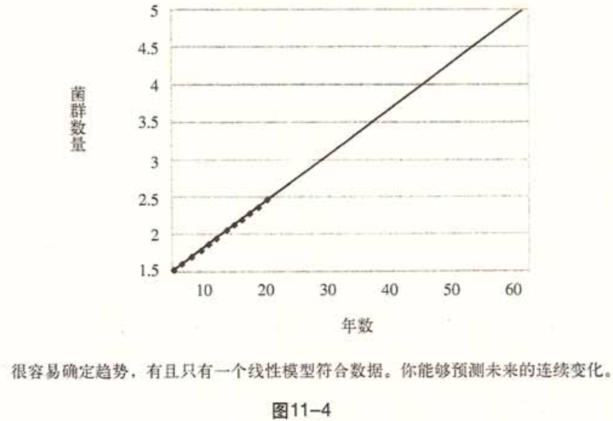
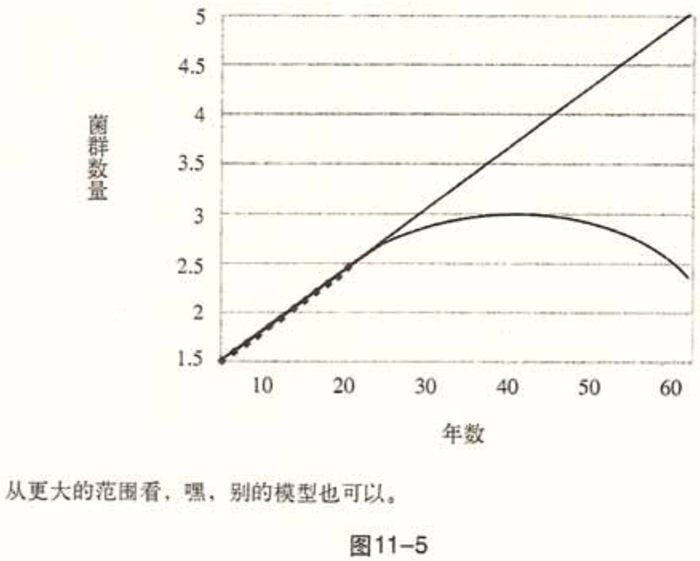
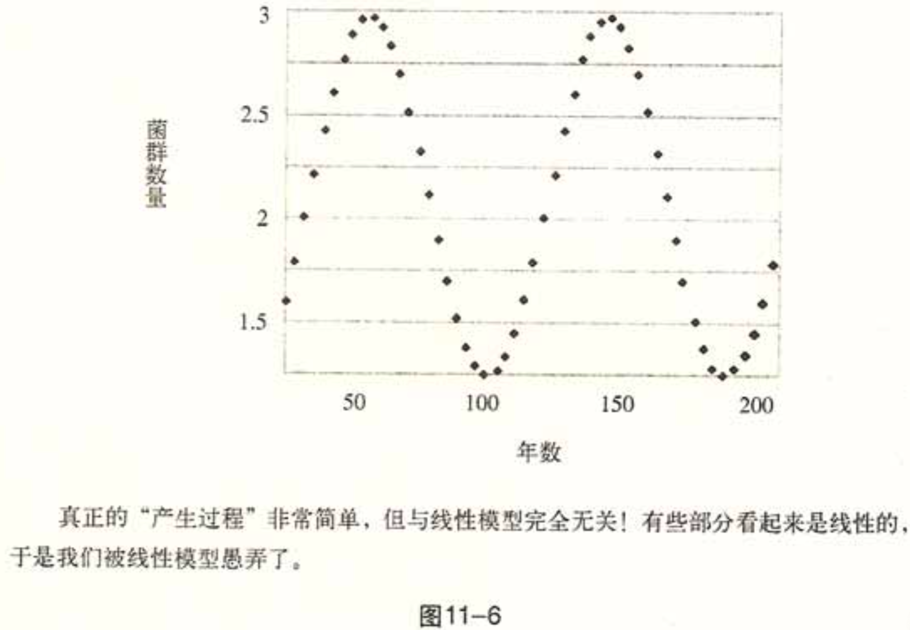

    作者:  [美] 纳西姆·尼古拉斯·塔勒布 
    出版社: 中信出版社
    副标题: 如何应对不可预知的未来
    译者: 万丹 
    出版年: 2009-8
    页数: 306
    定价: 39.00元
    装帧: 16开
    ISBN: 9787508616018

[豆瓣链接](https://book.douban.com/subject/3837280/)

- [序言](#%e5%ba%8f%e8%a8%80)
- [第一部分 极端斯坦与黑天鹅现象](#%e7%ac%ac%e4%b8%80%e9%83%a8%e5%88%86-%e6%9e%81%e7%ab%af%e6%96%af%e5%9d%a6%e4%b8%8e%e9%bb%91%e5%a4%a9%e9%b9%85%e7%8e%b0%e8%b1%a1)
  - [第三章 极端斯坦与平均斯坦](#%e7%ac%ac%e4%b8%89%e7%ab%a0-%e6%9e%81%e7%ab%af%e6%96%af%e5%9d%a6%e4%b8%8e%e5%b9%b3%e5%9d%87%e6%96%af%e5%9d%a6)
  - [第四章 1001天——如何避免成为失败者](#%e7%ac%ac%e5%9b%9b%e7%ab%a0-1001%e5%a4%a9%e5%a6%82%e4%bd%95%e9%81%bf%e5%85%8d%e6%88%90%e4%b8%ba%e5%a4%b1%e8%b4%a5%e8%80%85)
  - [第五章 不能只靠过去的经验判断](#%e7%ac%ac%e4%ba%94%e7%ab%a0-%e4%b8%8d%e8%83%bd%e5%8f%aa%e9%9d%a0%e8%bf%87%e5%8e%bb%e7%9a%84%e7%bb%8f%e9%aa%8c%e5%88%a4%e6%96%ad)
  - [第六章 叙述谬误](#%e7%ac%ac%e5%85%ad%e7%ab%a0-%e5%8f%99%e8%bf%b0%e8%b0%ac%e8%af%af)
  - [第七章 活在希望的小屋里](#%e7%ac%ac%e4%b8%83%e7%ab%a0-%e6%b4%bb%e5%9c%a8%e5%b8%8c%e6%9c%9b%e7%9a%84%e5%b0%8f%e5%b1%8b%e9%87%8c)
  - [第八章 永不消失的运气—沉默的证据问题](#%e7%ac%ac%e5%85%ab%e7%ab%a0-%e6%b0%b8%e4%b8%8d%e6%b6%88%e5%a4%b1%e7%9a%84%e8%bf%90%e6%b0%94%e6%b2%89%e9%bb%98%e7%9a%84%e8%af%81%e6%8d%ae%e9%97%ae%e9%a2%98)
  - [第九章 游戏谬误—愚人的不确定性](#%e7%ac%ac%e4%b9%9d%e7%ab%a0-%e6%b8%b8%e6%88%8f%e8%b0%ac%e8%af%af%e6%84%9a%e4%ba%ba%e7%9a%84%e4%b8%8d%e7%a1%ae%e5%ae%9a%e6%80%a7)
- [第二部分 我们就是无法预测](#%e7%ac%ac%e4%ba%8c%e9%83%a8%e5%88%86-%e6%88%91%e4%bb%ac%e5%b0%b1%e6%98%af%e6%97%a0%e6%b3%95%e9%a2%84%e6%b5%8b)
  - [第十章 无赖预测](#%e7%ac%ac%e5%8d%81%e7%ab%a0-%e6%97%a0%e8%b5%96%e9%a2%84%e6%b5%8b)
  - [第十一章 怎样寻找鸟粪](#%e7%ac%ac%e5%8d%81%e4%b8%80%e7%ab%a0-%e6%80%8e%e6%a0%b7%e5%af%bb%e6%89%be%e9%b8%9f%e7%b2%aa)
  - [第十三章 假如你不会预测怎么办](#%e7%ac%ac%e5%8d%81%e4%b8%89%e7%ab%a0-%e5%81%87%e5%a6%82%e4%bd%a0%e4%b8%8d%e4%bc%9a%e9%a2%84%e6%b5%8b%e6%80%8e%e4%b9%88%e5%8a%9e)
- [第三部分 极端斯坦的灰天鹅](#%e7%ac%ac%e4%b8%89%e9%83%a8%e5%88%86-%e6%9e%81%e7%ab%af%e6%96%af%e5%9d%a6%e7%9a%84%e7%81%b0%e5%a4%a9%e9%b9%85)
  - [第十四章 从平均斯坦到极端斯坦，再回到平均斯坦](#%e7%ac%ac%e5%8d%81%e5%9b%9b%e7%ab%a0-%e4%bb%8e%e5%b9%b3%e5%9d%87%e6%96%af%e5%9d%a6%e5%88%b0%e6%9e%81%e7%ab%af%e6%96%af%e5%9d%a6%e5%86%8d%e5%9b%9e%e5%88%b0%e5%b9%b3%e5%9d%87%e6%96%af%e5%9d%a6)
  - [第十五章 钟形曲线——智力大骗局](#%e7%ac%ac%e5%8d%81%e4%ba%94%e7%ab%a0-%e9%92%9f%e5%bd%a2%e6%9b%b2%e7%ba%bf%e6%99%ba%e5%8a%9b%e5%a4%a7%e9%aa%97%e5%b1%80)
  - [第十六章 随机审美](#%e7%ac%ac%e5%8d%81%e5%85%ad%e7%ab%a0-%e9%9a%8f%e6%9c%ba%e5%ae%a1%e7%be%8e)

## 序言
“黑天鹅”是指满足以下三个特点的事件：

1. 它具有意外性，即它在通常的预期之外，也就是在过去没有任何能够确定它发生的可能性的证据。
2. 它会产生极端影响。
3. 虽然它具有意外性，但人的本性促使我们在事后为它的发生编织理由，并且或多或少认为它是可解释和可预测的。

这三点概括起来就是：**稀有性、冲击性和事后(而不是事前)可预测性。**

黑天鹅的逻辑是，你不知道的事比你知道的事更有意义，因为许多黑天鹅事件正是由于它们不被预期而发生和加剧的。

**你可以通过最大限度地置身于正面的黑天鹅事件的影响下，来享受黑天鹅现象的好处。** 实际上，在某些领域，比如科学发现和风险投资领域，未知事件能够为你带来大的不成比例的回报，因为通常你没什么可损失的，却可以从一桩稀有事件中获得巨大回报。

除了过度专注于已知的知识外，人性还有另一个弱点：习惯于学习精确的东西，而不是总体的东西。我们不学习规律，而是学习事实，而且只学习事实。我们似乎不太善于认识到我们的超规律(即我们倾向于不学习规律的规律)。我们蔑视抽象的东西，疯狂地蔑视。

所有人都知道预防比治疗更重要，但预防只得到很少的奖赏。我们只赞美那些在历史书中留下名字的人，而忽略那些我们的书本没有提到的贡献者。我们人类不但肤浅(这一点可能没有救)还非常不公平。

几乎社会生活中的一切都是由极少发生但是影响重大的震动和飞跃产生的，而同时几乎一切关于社会生活的研究都聚焦于“正常”，尤其是采用“钟形曲线”的推论方法，你会什么真相也看不到。为什么？因为钟形曲线忽略大的离差，无法解释它们，但还要让我们相信不确定性是可以控制的，我在本书中戏称它为“智力大骗局”。

我把由于只关注那些纯粹而有明确定义的“形式”而导致的错误称为柏拉图化，这些形式包括物体(如三角形)、社会概念(如乌托邦，即根据某种“理性”蓝图建立的社会)，还包括国家。这些美好的形式有一个侧面影响，就是当它们占据你的思想时，你会把它们具体化，并开始忽视其他那些不那么美好的事物，那些更为混乱和不可捉摸的事物。

柏拉图边界是柏拉图式思维与混乱的现实交锋的爆炸性边界，在这里，你所知道的与你以为你知道的远远不是一回事。黑天鹅现象正是在这里产生的。

今天，生活在这个星球上需要超乎寻常的想象力。我们缺乏想象力，而且压制他人的想象力。

**我们的世界是由极端、未知和非常不可能发生的(以我们现有的知识而言非常不可能发生的)事物主导的，而我们却一直把时间花在讨论琐碎的事情上，只关注已知和重复发生的事物。**

## 第一部分 极端斯坦与黑天鹅现象
### 第三章 极端斯坦与平均斯坦
在理想的平均斯坦，特定事件的单独影响很小，只有群体影响才大。可以这样陈述平均斯坦的最高法则：当你的样本量足够大，任何个例都不会对整体产生重大影响。最大的观察值虽然令人吃惊，但对整体而言最终微不足道。

在极端斯坦，不平均即是指个体能够对整体产生不成比例的影响。虽然体重，身高和卡路里摄入量来自平均斯坦，但财富不是。几乎所有社会问题都来自极端斯坦。在极端斯坦，个体能够轻易地以不成比例的方式影响整体。

属于平均斯坦的问题举例(受我们所说的第一类随机性影响)：高度，重量，卡路里摄入量，面包师、小餐馆老板和牙医的收入，赌博收入(这是一个特例，假设某人去赌场只赌固定的大小)，车祸，死亡率，“智商”(测来的)。

属于极端斯坦的问题举例(受我们所说的第二类随机影响)：财富，收入，单个作者图书销量，“名人”知名度，google搜索量，城市人口，词汇表中某个单词的使用量每种语言的使用人数，地震造成的损失，战争死亡人数，恐怖事件死亡人数，行星大小，公司规模，股票持有量，物种之间的高度差异(比如大象和老鼠)，金融市场(但你的投资经理是不知道这一点的)，商品价格，通货膨胀率，经济数据。

极端斯坦的清单比平均斯坦的长得多。

平均斯坦与极端斯坦之间的差别还有另一种说法：在平均斯坦，我们收到集体事件、常规事件、已知事件和已预测到的事件的统治；在极端斯坦，我们受到单个事件、意外事件、未知事件和未预测到的事件的统治。

平均斯坦 | 极端斯坦
-----|-----
不具突破性 | 具有突破性
温和的第一类随机现象 | 疯狂的(甚至超级疯狂的)第二类随机现象
最典型的成员为中庸成员 | 最“典型”的成员要么是巨人，要么是侏儒，没有典型成员
赢者获得整块蛋糕的一小部分 | 赢家通吃
举例：留声机发明之前某个歌剧演员的观众数量 | 今天某位艺术家的观众数量
更可能存在于古代环境 | 更可能存在于现代环境
不受黑天鹅现象的影响 | 受黑天鹅现象的影响
数量有限制 | 数量上没有物理限制
(主要)与物理量有关，比如高度 | 与数字相关，比如财富
达到现实所能提供的乌托邦式公平 | 受赢家通吃的极端不公平统治
整体不取决于个例或单个观察结果 | 整体取决于少数极端事件
观察一段时间就能够了解情况 | 需要花很长时间了解情况
整体事件占统治地位 | 意外事件占统治地位
容易通过观察到的东西做出预测并推广至没有观察到的部分 | 很难从过去的信息中做出预测
历史缓慢发展 | 历史跳跃发展
事件分布服从高斯“钟形曲线”(智力大骗局)或其骗局 | 事件分布要么是曼德尔布罗特式的“灰”天鹅(尚可用科学方法解释)，要么是完全不可解释的黑天鹅

### 第四章 1001天——如何避免成为失败者
想象一只每天有人喂食的火鸡。每次喂食都使它更加相信生命的一般法则就是每天得到“为它的最大利益着想”的友善人类的喂食。感恩节前的星期三下午，一件意料之外的事情将发生在它的身上。它将导致一次信念的转变。

A turkey before and after Thanksgiving. The history of a process over a thousand days tells you nothing about what is to happen next. This naïve projection of the future from the past can be applied to anything.

**错误地把对过去的一次天真观察当成某种确定的东西或者代表未来的东西，是我们无法把握黑天鹅现象的唯一原因。**

从火鸡的角度，第1001天没有喂食是黑天鹅事件，从屠宰者的角度却不是，因为这不是意料之外的。由此你可以看到，黑天鹅现象是笨人的问题。换句话说，它与你的预期无关。你认识到，你可以通过科学或者通过开放思想消除黑天鹅现象(如果可以的话)。

正面的黑天鹅事件需要时间来显现它们的影响，而负面的黑天鹅事件发生得非常迅速——毁灭比缔造要容易和迅速得多。

现在我们对黑天鹅事件的无知中又产生了其他问题：
1. 我们只关注从已观察到的事件中预先挑选出来的一部分，从它推及未观察到的部分：证实谬误。
2. 我们应那些符合我们对明显模式的偏好的故事欺骗自己：叙述谬误。
3. 我们假装黑天鹅现象不存在：人类的本性不习惯黑天鹅现象。
4. 我们所看到的并不一定是全部。历史把黑天鹅现象隐藏起来，使我们对这些事件发生的概率产生错误的观念：沉默的证据造成的认知扭曲。
5. 我们“犯过滤性错误”：我们只关注一些有明确定义的不确定性现象，一些特定的黑天鹅现象(而不关注那些不太容易想到的)。

### 第五章 不能只靠过去的经验判断
再看一下第四章的图。某人观察了火鸡前1000天的生活(但没有看到第1001天令人震惊的事件)，他会对你说，而且说的是对的，没有证据表明会发生大事，即黑天鹅事件。但是，你会把这一说法理解为证据表明黑天鹅事件不会发生，尤其在你不仔细考虑的时候。这两种说法之间的逻辑差距实际上是非常大的，但在你的思维里显得很小，所以二者可以互相替代。从现在起10天后，即使你还记得第一种说法，你的印象中也很有可能是第二种说法，不确切地说，即证据表明没有黑天鹅现象。我把这种混淆称为 **回路错误(round-trip fallacy)** ，因为两种说法是不可互换的。

无法自动把知识从一种情况转化为另一种情况，或者从理论转化为实际的状态，是人类本性中令人困扰的特性。让我们称它为 **行为反应的“领域特殊性”** 。领域特殊性的意思是，我们的行为反应，思维模式和直觉取决于事物的背景，进化心理学家称之为事物或事件的“领域”。教室是一种领域，生活也是。我们对一则信息的反应不是根据它的逻辑特性，而是根据它的环境，以及它在我们的社会情绪系统中的位置。在教室中以某种角度理解的逻辑问题在日常生活中可能受到不同的对待。实际上，它们在日常生活中确实和受到了不同对待。

我们在推断和行为反应上的领域特殊性表现是双向的：有些问题我们能够在实际应用中理解，却不能在课本中理解；有些问题我们更容易从课本中理解，却不能在实际应用中理解。人们能够不费力地在社会环境下解决一个问题，但在它以抽象的逻辑问题形式出现时不知所措。我们习惯在不同的情况下使用不同的思维机制，或者模块：我们的大脑缺少一台全能中央计算机，对所有可能的情况制定和应用同样的逻辑规则。

**我们可以通过负面例子而不是正面证据接近真相！** 对观察到的事实制定通用法则是具有误导性的。与传统智慧相反，我们的知识并不能通过一系列证实性的观察结果得到增加，就像火鸡的例子一样。但是一些事情我持怀疑态度，另一些事情我却可以肯定。这使得观察结果具有不对称性。实际情况并不比这更复杂。

这种不对称性具有很强的实际性。它告诉我们不必成为彻底的怀疑主义者，只需要成为半怀疑主义者。实际生活的微妙之处在于，在决策时，你只需要对事情的一个方面感兴趣：如果你需要确定病人是否有癌症，而不是他是否健康，你可以满足于否定性推理，因为它能够向你提供你所需要的确定信息。所以，我们能够从数据获得许多信息，但不像我们期望的那样多。有时大量信息会变得毫无意义，而少量信息却具有非凡的意义。

提出这种单边怀疑主义观点的是卡尔.波普尔(Karl Popper)。他针对这种不确定性提出了一项重大理论，其基础是一种叫做 **“证伪”的方法**(证明某事为错误)，旨在区分科学与伪科学。

你知道某事是错的比你知道某事是正确的有更大的信心。并非所有信息都有相同的重要性。

投机家乔治.索罗斯在进行金融赌博时，会不断寻找证明他最初看法错误的事例。这大概才是真正的自信：冷观世界而不需要找理由满足自我膨胀的欲望。

### 第六章 叙述谬误
**叙述谬误**指的是我们无法在不编造理由或者强加一种逻辑关系的情况下观察一系列事实。 对事实的解释会与事实混在一起，使事实变得更容易被记住，更符合道理。这种倾向的坏处在于它是我们以为对事物有了更好的理解。

在前一章讨论归纳问题时，我们研究了从已知信息中推测出的未观察到的事物，即在我们的信息集以外的事物。现在，我们讨论已观察到的事物，即在我们的信息集以内的事物，并探讨信息处理过程中的扭曲。

你的大脑不可能在不进行解释行为的情况下观察任何原始形态的东西。左脑更有可能是掌管模式辨认的区域。右脑掌管新奇感。它倾向于看到系列事实(具体事实，或者说看到树)，而左脑看到模式，看到格式塔(一般事物，或者说看到森林)。

随着化学物质多巴胺在大脑中聚集，大脑的模式辨认能力似乎增强了。多巴胺还能平复情绪，在大脑中提供一种内部补偿机制。更高的多巴胺聚集量似乎能够降低人的怀疑态度，是他更容易出现模式辨认行为；注射左旋多巴，一种用于治疗帕金森氏病的药物，似乎能够增强模式辨认行为，降低人们对信念的怀疑。接受注射的人变得易于接受各种各样的风潮，比如占星术、迷信、经济学和塔罗纸牌。

我们的叙述谬误还有一个更为深刻的原因，而且它不是心理学上的。它与信息在系统中的存储和提取的顺序有关，
* 第一个问题是信息的获得是有代价的。
* 第二个问题是信息的存储也是有代价的。

人有许多脑细胞——1000亿，阁楼很大，因此困难大概不在于存储空间受到限制，而在于索引。你的意识，或者说被调动的记忆，你用来阅读这些文字并弄明白其含义的那一部分大脑比整个阁楼小得多。想一想，你的被调动的记忆甚至难以记住一个多于7位数的电话号码。换一种比喻，想想你的意识是国会图书馆里的一张桌子，不论图书馆里有多少你可以调阅的书，桌子的大小都限制了调阅的能力。压缩对意识的正常工作至关重要。

假设一堆文字构成了一部500页的书。如果这些文字完全是随机的，是以一种完全难以预料的方式从字典里挑选的，你就不可能在不损失这本书的某些重要部分的情况下总结或提炼这本书的内容。要想传递一则由随机的10万字组成的信息，你还是需要10万字。现在假设相反的情况，有一本完全由下面这个句子每页重复10遍构成的500页的书：“某公司董事会主席是一个幸运的家伙，他恰好在正确的时间处于正确的位置，声称对公司的成功做出了贡献，却绝口不提运气。”我们可以精确地把整本书（从10万字）压缩为上述这句话，从而完全不失真地提炼这本书。由于找到了模式，找到一系列事物的逻辑，你再也不需要记住所有事情。你只需要保存这一模式。而且我们可以看到，模式明显比原始信息简洁得多。你读这本书，就可以发现一条规律。根据这一逻辑，伟大的概率论大师安德烈.尼古拉耶维奇.柯尔莫哥洛夫（Andrey Nikolayevich Kolmogorov）定义了随机性的程度，它被称为“柯尔莫哥洛夫复杂性”。

作为灵长类中的人类，我们十分渴求规律，因为我们需要把事物简化，好让它们进入我们的头脑，或者说好把它们挤进我们的头脑。信息越具有随机性，事物就越复杂，因而越难以概括。你越概括，让事物越有条理，随机性就越低。因此，**正是我们的简化行为使我们以为世界的随机性比实际上小。**

而黑天鹅现象是我们不去简化的事物。

**我们试图强制性地理解事物的习惯—叙述和寻找因果关系是同一种疾病的征候—谋求降低复杂性。** 而且，与寻找因果关系一样，叙述是时间性的，导致人们对时间流逝产生认知。因果关系使时间单向流逝，叙述也是一样。

但记忆与时间的方向可能被混淆。叙述可能对记忆造成如下不利影响：我们会更容易记住那些符合某种叙述的过去事实，而忽略那些看上去在该叙述中不扮演因果关系角色的部分。想一想，我们在记忆中回忆事件的同时，还知道接下来发生了什么。在解决一个问题的时候，人们不可能忽视后出现的信息。这种无法记住事件的真正顺序，却记住被重组的事件的情况，**使历史事后看上去比实际上更可解释** —现在也是如此。

记忆更多是一台自动进行动态更新的机器：你记住的是你最后一次回忆的事件，并且在毫无意识的情况下，每次重新回忆时就改写故事一次。

所以我们让记忆也符合因果关系，在不自觉和无意识的情况下改写它们。**我们不断根据事件发生之后我们觉得有道理的逻辑重新叙述过去的事件。**

关于对黑天鹅现象的认识矛盾，第一个问题是：为什么我们的大脑过度担心某些黑天鹅现象，而本书的主题却是我们通常忽视黑天鹅现象？答案是有两种稀有事件：
1. 叙述中的黑天鹅现象，即那些现在被人们谈到，你也很可能从电视上听到的黑天鹅现象；
2. 无人提及的黑天鹅现象，因为它们不符合任何模式，在公共场合谈论它们会让你觉得羞愧，因为它们看上去不合理。我可以非常肯定地说，第一种黑天鹅现象的发生概率被高估，第二种被严重低估，这是完全符合人性的。

在一项初步研究中，心理学家丹.戈尔茨坦（DanGoldstein）和我向伦敦商学院的学生提供了分别来自平均斯坦和极端斯坦的例子。我们选择了高度、重量和每个网站的网络点击量。受试者很容易猜出平均斯坦环境下稀有事件的影响。但对于平均斯坦以外的变量，他们的直觉失灵了，**这表明我们实际上不擅长用直觉判断低概率事件的影响**，比如一鸣惊人的作者的图书销量。在一次实验中，他们把一个稀有事件的影响低估了33倍。

抽象的统计信息对我们的影响还不如奇闻逸事，不论提供信息的人是怎样的资深人士。我并不反对通过叙述获得别人的注意。实际上，我们的意识中可能有编造关于我们自己的故事的能力。但是编造性叙述用在错误的场合时会导致致命的结果。

有一个叫做判断与决策学会的学派，它提出了一项具有影响力的研究成果，对推理行为的不足进行了分类和研究。鉴于实验的性质，这种做法是钟形曲线在社会科学中少有的一种成功应用。这些研究者把我们的推理行为（大致）分为两种思维模式，分别称为“系统1”和“系统2”，或者“经验模式”和“认知模式”。二者的差别是显而易见的。

**系统1，经验模式**，是不费力的、自动的、快速的、模糊的（我们不知道我们在使用它）、平行的、易出错的。它就是所谓的“直觉”，以很快的速度发挥着强大的作用。系统1是高度情绪化的，因为它反应迅速。它制造捷径，人们称之为“启发学”，它使我们能够快速有效地采取行动。丹.戈尔茨坦称这些启发性方案“快速而朴素”，其他人更喜欢称它们“快而粗糙”。毫无疑问，这些捷径是有效的，因为它们快，但有时，它们会导致我们犯严重错误。这一主要观点产生了一个完整的研究学派，叫做启发和偏差法(heuristics and biases approach)。启发学对应对捷径的研究，偏差则代表错误。

**系统2，认知模式**，就是我们通常所称的思考。你经常在教室里使用它，因为它是费力的、有条理的、缓慢的、有逻辑的、连续的、渐进的、有自我意识的（你可以觉察推理的推进）。它犯的错误比经验模式少，因为你知道结果是如何得来的，你能够返回你的思考步骤，对它们进行适应性修正。

最后，我要说 **我们对黑天鹅现象的误解大部分归因于我们对系统1（叙述）以及情感（包括情绪）的运用，这使我们对事件发生的可能性产生了错误的判断。** 就每天而言，我们反省得不够，无法认识到我们对事态的理解没有达到客观观察所能达到的程度。我们还习惯于在一个黑天鹅现象发生之后立即忘记所有黑天鹅现象的存在，因为它们太抽象了，相反，我们只注意到容易进入我们思维的精确而生动的具体事件。我们确实担心黑天鹅现象，但弄错了担心的对象。

**避免叙述谬误的办法就是强调实验而非讲故事，强调体验而非历史，强调客观知识而非理论。另一个方法是预测并记录预测的结果。最后，我们还可能利用叙述，但要用于好的方面。** 只有钻石能够切割钻石。我们可以在一个传递正确信息的故事上运用我们的说服能力，那些讲故事的人似乎正是这么做的。

### 第七章 活在希望的小屋里
实际上，你的幸福感更多取决于正面情绪出现的次数，心理学家称之为“积极影响”，而不是某次正面情绪的强度。也就是说，好消息首先是好消息，究竟有多好并不重要。因此，要过快乐的生活，你应该尽可能平均分配这些小的“积极影响”。**大量一般的好消息比一个非常好的消息更令人感到幸福。**

努力获得一次超级成功是没什么好处的。造物主让我们从一系列稳定的、小而频繁的奖励中获得快乐。我们的不幸感则符合相反的情形。在一个短暂的时期里经历全部痛苦胜过在很长的时间里分散这些痛苦。但有人能够超越痛苦与快乐的不对称，摆脱幸福感不足的状态，将自己置身事外，而靠希望活着。

黑天鹅现象的一个特点是影响的不对称性，结果要么好，要么坏。

出于许多原因，我们需要别人，但我们对他们的需要远远超过我们的认识，尤其是对尊严和尊重的需要。如果你从事一项依赖于黑天鹅事件的职业，加入一群人是更好的选择。

有的人就像火鸡，面临巨大的灾难却不知情；有的人正好相反，他们等待着让别人大吃一惊的黑天鹅事件发生。

### 第八章 永不消失的运气—沉默的证据问题
两千多年前，罗马雄辩家、纯文学作家、思想家、禁欲主义者、阴谋政治家及高贵绅士西塞罗讲了下面这个故事。有人把一幅画给一个无神论者看，画上画着一群正在祈祷的拜神者，他们在随后的沉船事故中幸存了下来。其寓意在于说明祈祷能保护人们不被淹死。无神论者问：“那些祈祷后被淹死的人的画像在哪儿？”
    
淹死的拜神者已经死了，所以很难从海底爬出来到处宣传他们的经历。这能够欺骗那些粗心大意的人相信奇迹。
    
我们把这种情况叫做 **沉默的证据问题。** 其道理很简单，但影响巨大而且普遍存在。沉默的证据掩藏了事件的随机性，尤其是黑天鹅类型的随机性。

在我们进行天分比较时，经常忽略沉默的证据，尤其在那些受赢家通吃效应影响的行业。我们也许很喜欢那些成功故事，但太把它们当回事是不应该的，因为我们并没有看到全部事实。

我们能看到明显而可见的结果，而看不到不可见的和不那么明显的结果。但 **那些我们没有看到的结果可能，不，是通常更有意义。**

我们冒险通常不是出于自信，而是出于无知和对不确定性的无视！

我们的认知系统对于不出现在我们眼前或不引起我们情感注意的事物可能没有反应。我们天生肤浅，只注意我们看到的东西，不注意没给我们留下生动印象的东西。我们向沉默的证据发动了双重战争。潜意识的推理机制（确实存在这样的机制）忽视沉默的证据，即使我们知道需要考虑它。不进入视线则不进入大脑：我们对抽象的东西怀有天性上的甚至行动上的蔑视。

### 第九章 游戏谬误—愚人的不确定性
如果你想一步跨入更高级的生命形态，与动物的距离越远越好，那么你最好远离叙述谬误的来源，关掉电视机，尽可能少读报纸，不看博客，训练推理能力以控制决策，对重要决策注意避免使用系统1（即启发性或实验性系统），训练自己辨别情感与经验事实之间的区别。这种对毒害来源的避免还有一个好处：它会改善你的身心状况。同样，请记住在概率（一切抽象概念之母）方面我们是多么肤浅。你不需要再做什么旨在对周围事物有更深理解的事。首要的是，要学会避免“过滤性错误”。

## 第二部分 我们就是无法预测
### 第十章 无赖预测
首先，**我们在自以为拥有的知识方面非常自大。** 我们当然知道不少，但我们有一种内在的倾向，以为我们比实际上知道得多一点．正是这一点会不时招致严重的麻烦。我们会看到如何在你自己身上找出甚至衡量这种自大。
    
其次，**我们会讨论这种自大对所有行为，包括预测的影响。** 我们究竟为什么如此喜欢预测?更糟糕也更有趣的是：为什么我们不提我们在预测方面的记录?为什么我们看不到我们在(几乎)所有大事件上的预测失败?我把这称为无赖预测。

**认知自大有双重影响：我们高估自己的知识，低估不确定性(也就是低估未知事物的范围)。**

把一张模糊的消火检图片给两组人看，模糊到使他们无法认出图片上是什么。对其中一组，分10次逐步提高图片的清晰度，对另一组分5次提高清晰度。在某个使两组人看到相同清晰度图片的时候停下来，请他们说出看到的是什么。经过较少中间步骤的那一组可能更快地辨认出消火栓。这意味着什么? **你提供的信息越多，他们就会形成越多假设，他们的结论就越糟糕。他们看到了更多的随机噪点并将其当成了信息。**

**我们的思维是有惯性的：一旦形成一个观点，我们就很难改变，所以那些推迟形成观点的人更有利。** 当你以糟禚的证据为基础形成观点时，你会很难解释与这些观点矛盾的后续信息．即使这些新信息更明显、更准确。有两个机制在起作用：我们在第五章讨论的证实偏差．以及信念坚持偏差，即坚持不改变已有观点。

是专家的专家：牲畜检验员、宇航员、飞机试驾员、土壤检验员、国际象棋大师、物理学家、数学家(研究数学问题而非经验问题)、会计师，谷物检验员、图像分析员、保险分析师(研究钟形曲线统计问题的)。

不是专家的专家：证券经纪商、临床心理医生、精神病医生、大学招生官员、法官、顾问、人事官员、情报分析师(虽然花了那么多钱，但美国中央情报局的历史表现很令人遗憾)。我还要加上我自己分析文献的结果：经济学家、金融预测者、金融学教授、政治科学家、“风险专家”、国际清算银行员工、国际金融工程师协会的傲慢成员以及个人金融咨询师。

很简单，因变化而需要知识的事物，通常是没有专家的，而不变的事物似乎会有专家。也就是说，与未来有关，并且其研究是基于不可重复的过去的行业通常没有专家(天气预测以及从事短期物理活动，而非社会经济活动的行业除外)。

认识这一点的另一个角度，就是看到变化的事物通常易于受黑天鹅事件的影响。

### 第十一章 怎样寻找鸟粪
发现的经典模式是这样的：你寻找你知道的东西(比如到达印度的新方法)，结果发现了一个你不知道的东西(美洲)。

波普尔的核心论点是，为了预测历史事件，你需要预测技术创新，而它从根本上是不可预测的。

实际上，在统计学中有一个法则，叫做迭代预期法则，我在这里概括它的较强形式：如果我预期将在未来某时点预见到某件事，那么我现在就已经预见到了那件事。这一迭代认知法则还有一个较弱的形式：为了理解未来并预测它，你需要考虑这段未来本身包含的因素。如果你知道将在未来有什么发现，那么你已经发现了。

只需要知道某样东西被发明出来。就会促使我们做出一系列类似发明，即使这一发明的任何细节都没有被透露出来——不需要揪出间谍把他们当众绞死。在数学上，一旦有人宣布证明了某个神秘定理，我们就会经常看到突然凭空出现许多类似证明，偶尔也会有人指责别人泄密或剽窃。可能并没有剽窃存在：证明方法存在这一信息本身就是证明方法的一部分。

按照同样的逻辑，我们无法轻易想到未来的发明(如果可以，我们早就已经发明了)。在我们能够预见未来发明的那一天，我们就已经生活在能够想到的东西已经被发明的状态中了。

我的观点是：预测要求我们知道未来将发现哪些技术。但这一认识几乎会自动地让我们立即开始发展这些技术。因此，我们不知道我们将知道什么。

彭加莱的理论很简单：**在预测未来的过程中，所模型化的过程需要越来越精确，因为你的错误率会迅速上升。而仅仅达到近似的精确是不行的，因为你的预测会突然失效，最终需要对过去进行无穷精确的解释。** 彭加莱以一个非常简单的例子演示了这一点，即著名的 **“三体问题”** 。如果在一个类似太阳系的系统中只有两颗行星，并且没有其他因素影响它们的运行，你将能够毫不费力地预测它们的运行。但在两颗行星之间再加入第三个天体，比如一颗小小的彗星。最初第三个天体不会导致行星运行偏离轨道，对它没有影响；然后，随着时间的推移．它对另两个天体的影响可能是爆炸性的。这个微小天体的位置将最终决定这两个庞大行星的命运。

这种放大效应要求假设条件越来越精确，这一点能够通过如下预测弹子球在球桌上运动轨迹的简单试验来演示。我以数学家迈克尔.贝里(MichaelBerry)的计算为例。如果你知道关于弹子球的基本参数，就能够计算桌面的阻力(这是非常基础的)，能够测量撞击力量的大小，那么你也能很容易地预测第一次撞击带来的结果。第二次撞击更为复杂一些，但也是可能预测的。这要求更高的精确性，你必须更为小心地确定球的初始状态。问题是，为了正确计算第九次撞击的结果，你需要考虑某个站在桌子旁边的人的引力(贝里的计算就谨慎地考虑了一个体重150磅的人的引力)。为了计算第56次撞击的结果，宇宙中的每一个基本粒子都必须被考虑进来!一个离我们100亿光年、位于宇宙边缘的电子必须进入计算，因为它对计算结果有重要影响。下面再加上另一项艰巨任务，那就是预测这些变量在未来的状况。预测一枚弹子球在球桌上的运动需要关于整个宇宙运行的知识，小到每一个原子!我们能轻易预测像行星这样的庞大物体的运动轨迹(尽管是在不远的将来的运动)，但微观世界是很难预料的，而宇宙中微观粒子的数量不计其数。

在动态系统中你不是只考虑一枚孤立的弹子球，还要考虑各枚球之间的相互影响，面对这样的复杂局面，人们预测未来的能力不是降低了，而是存在根本的局限性。彭加莱指出，我们只能处理定性的事物，能够讨论系统的某些特点，而无法计算。你能够严谨地思考，但不能使用数字。彭加莱甚至为此创造了一个领域——原位分析，现在属于拓扑学。

20世纪60年代，麻省理工学院的气象学家爱德华.洛伦茨独立地再次发现了彭加莱的理论，同样是出于偶然。他正在建立一个天气变化模型，并对一个天气系统几天后的情况进行了模拟预测。后来他试图使用同一个模型进行重复模拟，而且他认为自己输入的是相同的参数，但得到的结果大相径庭。他起初以为差异来自计算机漏洞或计算错误。当时的计算机较为笨重和迟缓，与我们今天的计算机完全不一样，所以使用者受到时间的严重约束。洛伦茨后来意识到，计算结果的巨大差异不是来自错误，而是来自输入参数的小小的四舍五入。这就是著名的 **蝴蝶效应**，一只在印度震动翅膀的蝴蝶能够引起两年之后纽约的飓风。洛伦茨的发现引起了人们对混沌理论的兴趣。

哈耶克认为，真正的预测是由一个系统有机地完成的，而不是通过指令完成的。一个单独的机构，比如中央计划者，不可能集合全部知识，许多重要信息会被漏掉。但社会作为一个整体，能够把这些信息都包含在运行中，能够在框架以外思维。随着科学知识的增加，我们高估了自己理解构成世界的微妙变化，以及对每种变化赋予重要性的能力。他把这贴切地称为 **“科学主义”**。

如果我能预测你在特定情况下的所有行为，那么你就不像你所想的那样自由。你只是对环境刺激做出反应的机器，你是命运的奴隶。假想中的自由意志能够被简化为一个描述分子间相互影响结果的方程。就像研究时钟的运行：一个充分了解初始状态以及因果关系链的天才将能够运用他的知识预测你的未来行为。是不是很可怕?

然而，假如你相信自由意志，你就不可能真正相信社会科学和经济预测。你不可能预测人们会怎样行动。当然，除非有阴谋，而这一阴谋正是新古典经济学依赖的东西。你只需要假设个人在未来是理性的，因此他们的行为是可预测的。这种理性、可预测性与数学上的可处理性之间的联系是很强的。一个理性的人在特定情况下会采取一系列独特的行为。对于“理性的人"如何追求利益最大化的回答有且只有一个。理性的人必须保持行为一致性：他们不能喜欢苹果胜于喜欢橘子，喜欢橘子胜于梨，然后喜欢梨胜于苹果。如果这样做了，那么人们就很难概括他们的行为，最终导致很难预测他们的行为。

启发和偏差法学派(heuristics and biases sch001)的许多经验心理学家已经指出，不确定条件下的理性行为模型不仅是不准确的，而且是对现实的错误描述。如果人们做出前后不一致的选择和决策，经济最优化的核心就崩塌了。你不可能制造出“一般理论”，而没有一般理论你就不可能预测。

不但过去是有误导性的，而且我们对过去事件的解释存在很大的自由度。为了从技术层面证实这一点．在纸上画出一系列代表时间序列的点，就像第四章中显示前1000天情况的图4-I。假设你的高中老师让你延长这些点的序列。用线性模型，也就是用直尺，你只能画出一条直线，从过去到未来的一条单一直线。线性模型是唯一的，从一系列点中有且只有一条直线穿过。但情况可能更徽妙。如果你不将自己限制在直线中，你会发现许多曲线都能把这些点连起来。如果你用线性方式解释过去，你只能朝一个趋势继续。但未来对过去的偏离有无数种可能。

 
这就是哲学家纳尔逊·古德曼(Nelson Goodman)所说的 **归纳之谜** ：我们画出一条直线，只是因为我们手边有一把直尺；一个数字在过去1000天都在增长，使你更相信它会继续增长。但如果你头脑中有非线性模型，它可能意味着数字会在第1001天下降。

归纳之谜是叙述谬误的另一个版本——对于你所看到的东西存在无穷种“解释”。戈德曼的归纳之谜的重要之处在于：如果不存在对所看到事物的唯一“一般化"解释，无法对未知进行唯一的推断，那么你该怎么做?显然，回答是你应该使用“正常思维”，但你的正常思维对于某些极端斯坦的变量来说可能发展得不太好。

为什么我们还要计划呢? 哲学家丹尼尔?丹尼特(Daniel Dennett)提出的观点如下：大脑最强大的功能是什么?正是提出对未来的猜想并进行反事实思考的功能，比如，“假如我一拳打在他的鼻子上，他就会立即还击我一拳，或者打电话给他的纽约律师”。这样做的一个好处是能够让我们的猜想替我们去死。正确使用，并且仅停留在大脑内部时，这种预测能力使我们不必马上做出第一顺序的自然选择，而不像那些原始的生物一样在死亡面前非常脆弱，只能等待基因库得到最佳自然选择，从而提高自身的生存能力。从某种意义上讲，**预测使我们能够欺骗进化** ：进化现在作为一系列预测和反事实的情景在我们的头脑中发生。

### 第十三章 假如你不会预测怎么办
1．首先．区分正面意外和负面意外。学会区分从事哪些事在不具可预测性时会(或一直)对我们极为有利，从事哪些事在我们无法预测未来时有害。既有正面黑天鹅现象，又有负面黑天鹅现象。

在负面黑天鹅行业，意外事件能造成极大的冲击和严重的后果。如果你从事军事、巨灾保险或国家安全工作，你总是面临不利影响。同样，如我们在第七章看到的，如果你在银行从事贷款业，意外事件很可能对你不利。你把钱借出去，最好的情况是你能收回贷款，但如果借款人违约，你可能损失所有的钱。即使借款人获得巨大的财务成功，他也不太可能付给你额外的利息。

除电影业之外，正面黑天鹅行业还有：出版业、科学研究和风险投资。在这些行业，你可以用小的损失换取大的收益。你每出一本书可能的损失很小，而出于某些完全没有预料到的原因，任何一本书都有可能一鸣惊人。不利面很小，而且很容易控制。当然，出版商的风险在于为书出价过高。从而使有利面非常有限，而不利面非常庞大。(假如你为一本书支付1000万美元版税，那么它成不了畅销书才是黑天鹅)。同样，虽然技术蕴涵着巨大的收益，但花钱买泡沫故事，就像人们在网络泡沫中那样，也会缩小有利面，扩大不利面。是风险资本家，而不是那些“人云亦云”的投资者通过投资于某家投机性公司，再将股份卖给缺乏想象力的投资者成为黑天鹅事件的受益者。

在这些行业，假如你什么也不知道，那么你是幸运的，尤其在别人同样什么都不知道，也不知道这一点的时候。假如你知道自己对哪些东西无知，假如你是唯一注意到那些没有被读过的书的人．你会是最棒的。这与“杠铃”策略是吻合的，**在将正面黑天鹅事件的影响最大化的同时，保持对负面黑天鹅事件的警惕。** 要从正面黑天鹅事件中获益，你不需要对不确定性有任何精确的理解。有一点我很难解释，**那就是在你只有非常有限的损失的时候，你必须尽可能主动出击，大胆投机，甚至“失去理智”。**

平庸的思想家有时把这种策略类比为买“彩票"?这完全不对。首先，彩票没有突破性收入；它们能带来的收入有确定的上限。这里存在游戏谬误，相对于彩票收入，真实生活中的收入具有突破性，也就是说没有上限，或者说没有可知的上限。其次，彩票有既定的规则以及实验室式的可计算的概率，而真实生活中我们不知道规则，并能从这种额外的不确定性中获益，因为它无法伤害你，而只能为你带来好处。

2．不要寻找精确和局部的东西。简而言之，不要狭隘?提出“机会青睐有准备的人的伟大微生物学家巴斯德懂得，不要在每天早上寻找某种特定的东西，而 **要努力工作，并让意外进入你的生活。** 正如另一位伟大的思想家优吉?贝拉所说：“假如你不知道往何处去，请一定小心，因为你可能到不了那里。

同样，不要试图准确地预测黑天鹅事件，这很可能使你更容易受到那些你没有预测到的结果的影响。我的朋友、美国国防部的安迪?马歇尔和安德鲁?梅斯面临同样的问题。军方有一种冲动，就是投入资源预测接下来的问题。这些思想家建议相反的做法：**把精力放在做准备而不是预测上。**

3．抓住一切机会．或者任何像机会的东西。机会很少，比你想象的少得多。请记住，正面黑天鹅现象有一个前提：你必须把自己置于它的影响之下。许多人在好运降临时并没有意识到它的降临。如果一个大出版商(大艺术品经纪商、电影制片人、走运的银行家或大思想家)向你发出邀请，你一定要取消自己原来的全部计划：这扇门可能永远不会再为你开启。我有时震惊于很少有人认识到这些机会不是长在树上的。**尽可能多地收集免费的非彩票(那些收入无上限的)，一旦它们开始赚钱，不要扔掉它们。努力工作，不是做无聊的工作．而是搜寻这些机会，并尽可能扩大它们对你的影响。这使城市生活变得无价，因为你增加了美妙偶遇的可能性，奇缘有可能降临在你身上。** 以“在互联网时代”人们可以无限交流为理由，在郊区定居的人会失去这种正面不确定性的来源。外交家非常明白这一点：鸡尾酒会上的随意聊天通常能够导致大的突破，而不是枯燥的通信或电话谈话。去参加聚会吧!如果你是科学家，你可能会听到启发新研究的谈论。如果你是孤独症患者，让你的同事去参加聚会。

4．当心政府的精确计划。第十章讨论过，我们可以让政府预测(这让政府官员们自我感觉更良好，并使他们有存在的理由)，但不要把他们的话太当回事。请记住，这些公仆的利益在于生存和自保，而不是接近真理。这并不意味着政府是无用的，只是你需要对它们的副作用保持警惕。

5．“有些人，假如他们本来不知道某件事．你是不可能告诉他们的。”伟大的不确定性哲学家优吉?贝拉曾说。不要浪费时间与预测者、证券分析师，经济学家和社会学家争论。除非是拿他们取笑。

所有这些建议有一个共同点：不对称性。请把你自己放入一个好结果比坏结果大得多的条件下。实际上，不对称结果是本书的核心思想：**我永远不可能知道未知，因为从定义上讲，它是未知的。但是，我总是可以猜测它会怎样影响我，并且我应该基于这一点做出自己的决策。**

这一观点通常被错误地称为“帕斯卡的赌注"，取自哲学家及(思想)数学家布莱斯?帕斯卡。他的观点如下：我不知道上帝是否存在，但我知道，如果他不存在，我做无神论者就得不到好处，但假如他存在，做无神论者就会损失很大，所以我应该相信上帝。

帕斯卡的论断在神学上有严重缺陷：只有相当天真的人才会相信上帝不会因假信仰惩罚我们。

但帕斯卡的赌注背后的思想在神学之外有十分重要的用途。它颠覆了整个知识的概念。它消除了理解稀有事件的可能性的必要(我们对于这一问题的知识有根本上的局限性)。相反，我们可以只关注某个事件发生带给我们的好处。**稀有事件的概率是不可计算的；确定一个事件对我们的影响却容易得多(事件越稀有，可能性越模糊)。** 我们能清楚地知道某个事件的影响，即使我们不知道它发生的可能性。我不知道地震的可能性，但我能想象地震对旧金山会造成怎样的影响。**做决策时，你只需要了解事件的影响(这是你能知道的)，不需要了解事件的可能性(这是你不可能知道的)，** 这一思想就是不确定性的核心思想。我生活的大部分都以它为基础。

## 第三部分 极端斯坦的灰天鹅
### 第十四章 从平均斯坦到极端斯坦，再回到平均斯坦
社会学家罗伯特稫.默顿比罗森早十多年提出关于`马太效应`的观点，也就是“劫贫济富效应”  。【下面这段《圣经》中的文字中已经体现了突破性法则：“凡有的，还要加给他，叫他多余；没有的，连他所有的也要夺过来。”(《(圣经.马太福音》詹姆斯一世钦定版)】

 一切都是暂时的。运气缔造和毁灭了迦太基；运气缔造和毁灭了罗马。我已说过，随机性是不好的，但并非总是如此。运气甚至比智慧更公平。如果人们严格根据能力获得报酬，有可能仍然不公平，因为人们无法选择自己的能力。随机性能够对社会进行重新洗牌，把那些大人物拉下马。

许多人找我讨论`长尾理论`，它看上去恰好与突破性导致的集中相反。长尾意味着小人物加在一起能够控制文化和商业的一个不小的部分，而这得益于在互联网环境下得以存在的小环境和附属专业。但奇怪的是，它也可能意味着大量不公平：大量小人物和极少数超级巨人一起代表世界文化的一部分，一些小人物偶尔崛起打败胜者。(这就是“双尾：小人物构成的大尾和大人物构成的小尾。)

长尾在改变人们的成功模式上具有根本性的作用，它使胜者无法安坐，促成另一个胜者的诞生。在人们的第一印象中，它将永远属于极端斯坦，总是被第二类随机性导致的集中所统治；但它将是一个不断变化的极端斯坦。

简而言之，长尾是极端斯坦的副产品。它在某种程度上减少了不公平：世界对小人物而言没有变得更不公平。但对大人物而言变得极为不公平。没有谁的地位是牢固不破的。小人物非常具有颠覆性。

### 第十五章 钟形曲线——智力大骗局
高斯的主要理论是，大部分观察结果集中在中等水平附近，也就是平均值附近；随着对平均值的远离，偏离平均值的可能性下降得越来越快(呈指数下降)。假如你必须只拥有一条信息，就是这一条：随着对中心，也就是平均值的偏离，可能性的下降速度便急剧增长。

极不公平的财富分形分布

    净资产高于100万欧元：63分之一
    高于200万欧元：125分之一
    高于400万欧元：250分之一
    高于800万欧元：500分之一
    高于1600万欧元：1000分之一
    高于3200万欧元：2000分之一
    高于32000万欧元：20000分之一
    高于64000万欧元：40000分之一

高斯分布的财富分配

    净资产高于100万欧元：63分之一
    高于200万欧元：127 000分之一
    高于300万欧元：14 000 000 000分之一
    高于400万欧元：886 000 000 000 000 000分之一
    高于800万欧元：16 000 000 000 000 000 000 000 000 000 000 000分之一
    高于1600万欧元：……我的任何一台电脑都无法进行这项计算

第二种是具有突破性的，它的变化不受阻力。请注意，突破性的另一个叫法是`幂律`。 记住：高斯钟形曲线家族都受到一种阻力，使偏离平均值的概率下降得越来越快，突破性分布或者曼德尔布罗特分布家族则不受这种限制。

`80／20法则`,它是一种标志性的幂律，实际上幂律的发现正是从它开始的。当时维尔弗雷多.帕累托观察到意大利80％的土地被20％的人占有。有人运用这一法则指出，80％的工作由20％的人完成；或者80％的工作只产生20％的结果，反之亦然。

对于最大值不会与平均值相差太大的变量,高斯方法对我们很有用。如果数量受到向下的拉力，或者如果存在物理上限，使得非常大的数值不会出现，那么我们在平均斯坦。如果存在强大的均衡力量，使得当情况偏离均衡时会被迅速拉回来，你也可以使用高斯方法。否则，请忘记它。

咖啡杯会跳起来吗?从物理上讲，我的咖啡杯是可能跳跃的，这是非常低的可能性，但仍是可能的。粒子一直在跳跃。但为什么由跳跃的粒子组成的咖啡杯本身不跳呢?原因很简单。要让杯子跳起来，必须所有粒子向同一个方向跳跃，并且连续这样同步跳几次(同时导致桌子向相反方向移动)。我的咖啡杯中的数万亿粒子不可能同时向一个方向跳；在宇宙的整个历史中这种情况也不会发生一次。所以我可以安全地把咖啡杯放在写字台的边缘，去操心更严重的不确定性来源。

安全的咖啡杯演示了高斯变量的随机性是可以通过平均来消除的。如果我的咖啡杯是一个大粒子，或者能够表现为一个大粒子，那么它的跳跃就是一个问题。但我的杯子是由数万亿非常小的粒子组成的整体。

赌场经营者非常明白这一点，这就是他们从不亏本的原因(如果经营得当的话)。他们不让赌徒下大注，而是喜欢让许多赌徒下许多受限制的小注。赌徒的总注可能有2000万美元，但你不需要为赌场担心：每注平均可能只有20美元，赌场对最大赌注设了上限，所以赌场老板晚上可以安心睡觉。所以赌场收入的变化会小到可笑的地步，不管总赌注有多大，你永远不会看到谁带着10亿美元离开赌场，在宇宙的整个历史中都看不到。

请注意我们在为我们带来原始高斯分布或温和随机性的抛硬币游戏中的核心假设。

**第一核心假设：每次抛硬币是独立的。** 硬币没有记忆。前一次得到正面或反面不会影响下一次得到正面或反面的概率。你不会随着时间的推移变成“更好”的抛硬币手。如果考虑记忆，或者抛硬币的技巧，整个高斯世界都会动摇。

回忆我们在第十四章中谈到的偏好依附和累积优势。两种理论都假设今天的成功会增加你在未来成功的可能性。因此，概率取决干历史，高斯钟形曲线的第一核心假设在现实中不成立。当然，在游戏中，过去的胜利不会意味着未来胜率的提高，但现实生活中不是这样，这就是我对从游戏中学习概率感到担忧的原因。但当胜利带来更多胜利时，与原始高斯曲线的情况相比，你更有可能看到连赢40次的结果。

**第二核心假设：没有“疯狂”的跳跃。** 比如，我们随机步行的步长总是已知的，步长不存在不确定性。我们不会遇到步长剧烈变化的情况。

**请记住，假如这两条核心假设中有任何一条不满足，你的步骤(比如抛硬币)的累积结果就不会得到钟形曲线。视实际情况，它们可能导致曼德尔布罗特式的幅度不变的疯狂随机性。**

### 第十六章 随机审美
“分形”(fractal)一词是曼德尔布罗特造的，用来描述不规则和支离破碎的几何图形．它来自拉丁语的fractus一词。分形是几何图形在不同尺度上的重复，显示出越来越小的自相似图形。小的局部在某种程度上与整体具有相似性。我会努力在本章展示分形如何应用于应该以曼德尔布罗特的名字命名的一类不确定性：`曼德尔布罗特随机性`。

树叶的脉络看上去像枝条，枝条看上去像树，岩石看上去像缩小的山峰。当一个物体改变大小时，没有发生质的变化。曼德尔布罗特设计了一种叫做曼德尔布罗特集的数学图形，是数学史上最著名的图形。它在混沌理论的追随者中流行起来，因为它通过使用一种巧妙的微型递归法则产生越来越复杂的图形。**“递归”的意思是对某一事物自身无限使用某种法则** 。你可以把图形分解为越来越小的图形，永无止境，你会不断看到能够辨认的图形。图形永不重复，但它们互相具有相似性，一种强大的家族相似性。

分形几何学与财富分配、城市规模、金融市场收益，战争死亡率或行星大小有什么关系呢? 这里的关键是分形的数字或统计方法(在某种程度上)对不同的尺度都适用，比率是不变的，与高斯分布不同。图16—3演示了另一种自相似关系。我们在第十五章看到，巨富与一般富人是相似的，前者只是更富而已。财富是独立于尺度的，或者更精确地说．财富对尺度的依赖性是未知的。

图16-3 纯粹的分形统计

我将解释为什么我能用曼德尔布罗特分形理论描述大量的随机性，却不必承认它的精确应用的原因。分形能够充当默认环境、近似和框架。它不能解决黑天鹅问题，也不能把所有的黑天鹅现象变为可预测事件，但它极大地淡化了黑天鹅问题，因为它使这些大事件更易于理解。

如果财富从100万翻倍变为200万，至少拥有这一财富的人数被除以4，是2的指数倍。如果指数是1，那么至少拥有这一财富的人数会被除以2。指数被称为“幂”(所以有“幂律”这一术语)。我们把某事件高于某一水平的发生次数称为“超过数”，200万的超过数是财富超过200万的人数。分形分布的一个特点(另一个特点是突破性)是两个超过数的比率等于两个相应水平的比率的负幂指数次方。我们来演示这一点。假设你“认为”每年只有96种书能够卖出超过25万册(去年的实际情况就是如此)，并且你“认为”指数大约为1.5。你可以推测大约34种书能够卖出超过50万册，只要用96乘以 (500 000／250 000)^-1.5。我们可以继续计算，大约8种书能够卖出超过100万册，也就是96乘以(1 000 000／250 000)^-1.5

我们先来看看指数的实际影响。

表16-2 指数的意义

指数 | 最高的1%观测值对总体的贡献 | 最高的20%观测值对总体的贡献
---|----------------|----------------
1 | 99.99% | 99.99%
1.1 | 66% | 86%
1.2 | 47% | 76%
1.3 | 34% | 69%
1.4 | 27% | 63%
1.5 | 22% | 58%
2 | 10% | 45%
2.5 | 6% | 38%
3 | 4.6% | 34%

表16-2显示了发生概率极低的事件的影响。它列出了样本中最高的1％和20％的观测值对整体的贡献。指数越小，它们的贡献越大。但看看这个过程有多么敏感：在1.1～1.3之间，贡献率能够从66％下降到34％。指数变化0.2能使结果产生巨大的变化，而一个简单的计算错误就能产生这样的差异。这个差异绝不是微不足道：想一想，我们根本不知道精确的指数是什么，因为我们无法直接计算它。我们能做的只是从历史数据中估计它，或者依赖能让我们有点概念的模型理论，但这些模型可能有潜在缺陷，使我们无法盲目地将它们应用于现实。

更重要的是，指数从某个“临界值”开始起作用，对大干这个临界值的数产生影响。它可能从20万册书开始，也可能从40万册开始。同样，财富在比如6亿美元以上时开始出现不均衡的加剧，而在低于这个数字时呈现不同的特征。你怎么知道临界值在哪里?这是一个问题。我跟我的同事分析了大约2000万条金融数据。我们都有同样的数据集，但我们从来没能在指数上达成一致。我们知道这些数据符合分形幂律，但明白不可能得出精确的数字。不过知道分布是具有突破性的而且是分形的，这已足够我们做决策。

我从经验中总结了一些诀窍：不论我想计算什么指数，最终都可能高估它(请注意较高的指数意味着大离差的影响更小)，也就是说，你看到的比你没有看到的较不具有黑天鹅的特征。我称之为化装舞会问题。

下面探讨统计循环问题(或称统计回归问题)。假设你需要用历史数据发现某个概率分布是高斯的、分形的还是什么别的。你需要确定你是否有足够的数据支持你的论断。我们如何知道数据是否充分呢?根据概率分布来判断，概率分布确实能够告诉你是否有足够的数据对你的推论提出“置信”。如果是高斯钟形曲线，只需要几个数据点就够了(大数定理再次起作用)。而你如何知道相关分布是不是高斯分布呢?好吧，通过数据知道。于是，我们需要数据告诉我们概率分布是什么，又需要概率分布告诉我们需要多少数据。这是一个突出的循环问题。

**当我能够受到正面黑天鹅事件影响时，我会非常冒险，这时失败只是很小的影响；当我有可能受到负面黑天鹅事件的袭击时，我会非常保守。当每个模型中的错误对我有好处时，我会非常冒险；当错误对我有害时，我会非常多疑。**
