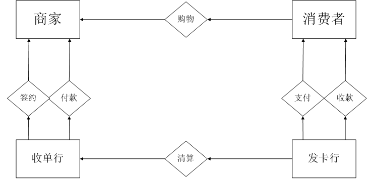
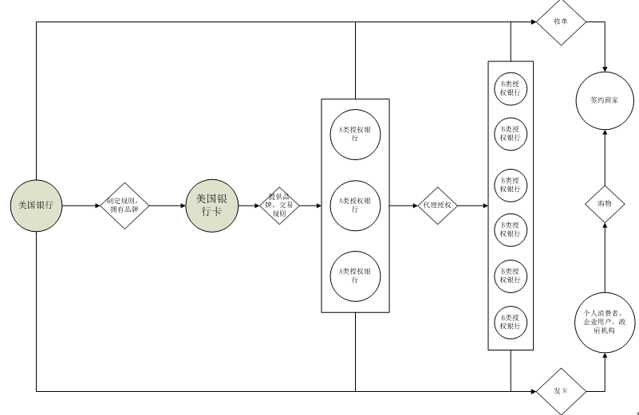
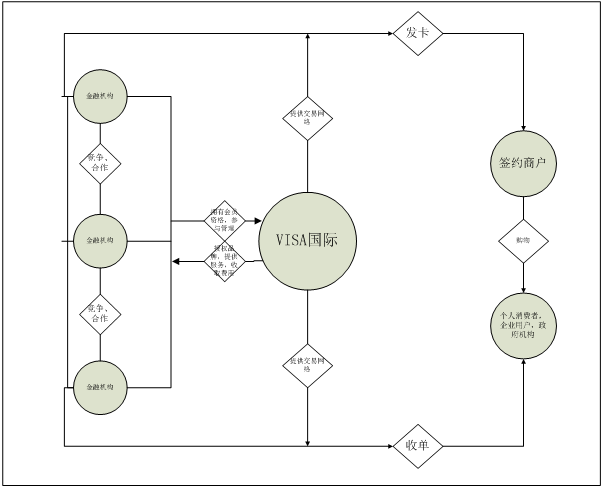

# 隐形VISA

    作者: 迪伊·霍克 
    出版社: 上海远东
    出版年: 2011-2
    页数: 290
    定价: 35.00元
    ISBN: 9787547603628

[豆瓣链接](https://book.douban.com/subject/6509953/)

1. 社群的本质是价值的非货币性交换，缺少这三者的任何一个——非物质性价值、价值的非货币性交换和亲密性——就不会有真正社群的存在
1. 信用卡第一项主要功能就是让卖者认同买者，也让买者认同卖者，第二项主要功能是作为价值数据的保证者，第三项主要功能是价值数据的创造和转移，其实，我们真正从事的是货币价值交换的业务
1. 任何组织只要能在一天24小时、一个星期7天遍及全球的任何地点保证、传输及处理以有规律的电子形式出现的交易，就可取得一个超出想象的大市场——世界上所有的价值交换在其中进行
1. 没有银行能做到，也没有大型的股份公司能做到甚至连国家也做不到。这就需要一个超凡的组织，以全新的方式将这些极端复杂多样的机构和个人联系起来。

# VISA国际的商业模式重构
## 信用卡的典型业务模式
让我们先来了解一个信用卡的典型业务模式：

图一 信用卡业务模式

在信用卡系统中，存在两类银行——发卡行和收单行。发卡行向消费者发放信用卡，收单行吸引签约商家；消费者使用信用卡在收单行签约商家处进行购物活动；签约商家向收单行收取货款,并扣除一定比例作为银行承担信用风险的收入；发卡行向收单行付款清算；消费者向发卡行付息还款；收单行和发卡行之间按协议比例分享收入。

这种交易模式有吸引力的前提是要有足够多的持卡人和签约商家，双方才能有足够的意愿使用和接受信用卡。在发展初期一个明显的问题是，缺乏大型的交易网络。如果发卡行和收单行不是同一家银行，就会有银行之间清算的问题。只有一个大型的银行间组织，使得发卡行和收单行之间能方便的清算，不同发卡机构的持卡人和收单机构的签约商户之间才能方便的交易，信用卡系统才有实用性。

## 美国银行卡
1966年，当时美国最大的商业银行——美国银行在解决这个问题上率先迈出了一步,它使用了一种特许经营的商业模式：向全国发放其信用卡品牌BankAmericard的营业执照，使得有意发展信用卡业务的银行在其授权下可以使用其品牌发行信用卡。同时使得各授约银行的持卡人和签约商户互相承认。这种模式形成了第一个银行信用卡网络体系——美国银行卡（BankAmericard）。

美国银行卡的商业模式，是按照特许经营的模式构造自己的业务系统。在这个模式中。美国银行是系统的支配者，拥有BankAmericard信用卡系统的品牌和授权系统的所有权，同时制定关于卡片发行、商户服务以及其它各种信用卡业务运营的规则。授权银行分为A类和B类，其中A类银行可以代表美洲银行授约新的B类银行。其它被授权的银行使用美国银行卡(BankAmericard)品牌来发行自己的信用卡，同时吸纳商家购买其交易业务，使他们加入信用卡系统中。

图2 VISA国际组织的前身美国银行卡的商业模式

这种特许经营的商业模式在当时及时的解决了全国性网络缺乏的问题。很快，美国银行卡系统拥有了200家获得完整授权的A类银行和近2500家接受授权的B类银行。

## 很快问题随之出现
1. 当时的大银行，如同在加州的富国银行和纽约的大通曼哈顿银行等，并不愿用美洲银行的品牌发行信用卡，但像美国运通一样发展“封闭式卡系统”要从头开始签约商户和发卡，太消耗资源。
2. 美国银行既是品牌授权者又是市场竞争者，制定的规则难免从自身出发，其它银行不愿意遵从或制定的规则无法遵从。被授权银行没有制定规则的权利，不能适应当地市场需求。且不同银行间的信用卡同质化严重，缺乏创新产品。
3. 交易网络原始，尚无电子数据记录，也没有电子清算系统。发卡行和收单行之间以手工和邮政系统方式清算。美国银行无力独力建立大型的电子交易网络。
4. 由于美洲银行信用卡部门人力不足，没有能很好的解决安全问题，伪卡，盗刷卡流行。

20世纪60年代，当时最大的两个信用卡联盟——美国银行卡和MasterCharge总共贷出了26亿美元的贷款，而由于操作失误，信用，伪冒等所带来的损失就高达几亿美元。60年代中后期，美国信用卡行业几乎走到了崩溃的边缘。

## VISA
1968年，在一次美国银行和其被授权银行的会议上，来自国家商业银行的副总裁迪•豪克认为了支配——控制式的业务系统是问题和混乱产生的根源。它提出对美国银行卡的业务系统进行重构，使用分布式，自组织的业务系统取代旧有的模式。并努力推行了这个提议。最终说服了美国银行，按一个全新的商业模式，重构了原来的美国银行卡系统。

1970年6月成立的National BankAmericard Inc.（NBI）取代了原来的美国银行卡系统。美国银行将美国银行卡的商标转让给了它。后来在1976年，“维萨”（VISA）代替了NBI，成为整个系统的品牌名称。原签约银行以会员制的方式加入VISA国际组织。

新成立的VISA国际，是一个非股份制，非盈利，由会员银行共同拥有的会员制私有公司，公司的所有权不能买卖，转让或被剥夺。这是一个竞争——合作式的组织。VISA国际内部没有控制中心，设有多重董事会，董事会由来自不同区域的VISA组织的董事组成，而区域VISA组织又由国家或团体的董事组成。分别负责不同地区或不同事务，不同的董事会之间没有等级高低之分。经选举产生的董事大多为主要成员银行的领导人。会员按承揽业务分为发卡行和收单行，大多数会员银行兼具两种身份。

VISA国际并不直接涉足发卡或收单领域，这些业务完全由会员银行从事，因此它和会员组织之间没有竞争关系。VISA国际定位于全球的电子交易结算网络，它用一个精简的团队，仅仅从事会员银行同意合作的那部分有限业务，如负责运营银行卡授权和清算系统，以及品牌推广，研究和开发等事项。它不以盈利为目的，因此也不向会员发放股利，而将盈余全部投入网络的建设，扩展和维护。

VISA国际将权利和功能进行最大限度的分配，实行分布式管理，作用是推进会员的合作。在这个业务系统中，各个区域性的公司都具有高度的自主权。VISA国际允许会员银行开发新的产品和服务，并自行定价和促销。在这个业务系统中，各会员银行既是要争夺客户的竞争者，同时为了使系统正常运作并具有规模效应，成员之间又必须合作，商家必须要接受任何一家银行或发卡商的卡。这种业务系统和谐了统一了竞争与合作，使得各会员银行以一种自组织的方式共存于VISA系统之中，同时，VISA国际组织又能够高速的发展。

图三 重构后的VISA国际组织商业模式

## VISA模式
在这种新的商业模式下，VISA国际组织得以全力构建这种模式需要的关键资源能力：参与者，交易网络和品牌。
1. 参与者，庞大的持卡人和签约商户数量是VISA最大的吸引力所在， VISA国际在全球发行了12亿张VISA卡，拥有3000多万签约商户，使得新加入的成员马上就能分享这些资源。任何一个想要发行信用卡的金融机构都无法忽视VISA遍布全球的持卡人、签约商户和ATM机。
1. 交易网络：VISA国际组织拥有的VISANet，经过20年的维护，已经形成了上接人造卫星，下通海底光缆的全球最大的电子支付网络。这套系统能做到全天24小时全天候实时联网服务，每秒能处理2000笔交易，且每笔交易仅需2秒钟的时间。且由于各银行间共用一个专用的电子交易系统，VISA国际可集中资源建设该平台，使得VISANet的安全性大大提高。
1. 品牌：为了打造VISA的品牌，VISA国际投入了巨大的资源进行品牌塑造。通过赞助奥运会，FIFA等国际体育赛事，VISA成功的打造了世界驰名支付通行证的品牌形象，在全球品牌中，VISA国际排在第14位，消费者知道，拥有了VISA，就拥有了消费便利最可靠的保证。

## VISA盈利模式
同时，维萨通过以下的盈利模式来获得收入，主要有：

1. 会员入会费：一个拥有8万个帐户，45亿美元资产的中等规模发卡机构，在加入VISA国际后，前5年内需要支付约150万美元的会员费。
1. 交易的分成，在每笔成功的交易中，整个信用卡系统将收取3%——5%的交易费用，而VISA国际一般按10%的比例分享收入。

经过这次商业模式重构以后，VISA国际进入了高速发展阶段，每年以20%——50%的年增长率迅速发展。目前的年全球交易总额已超过4万亿美元，占全球所有支付卡总额品牌的60%。

在这次商业模式重构后，有意从事信用业务的金融机构只要加入VISA国际的网络，就能够立即分享全球数量巨大的ATM柜员机，签约商户和持卡人，可以迅速开展自己的信用卡业务。消费者持有一张信用卡，就可以全球通行无阻的消费，且可以方便的贷款，还款，而且消费者拥有更多的信用卡产品可以选择。商家和VISA国际授权的金融结构签约，就能够接受全球12亿张VISA信用卡的支付。原来的品牌授权者——美国银行，从这个远远扩大的市场所占的份额中获得的收益，也远远超过从之前市场获得的授权费用的收入。而VISA国际也成为了2008年《金融时报》全球500强排名中排名第343位的公司。显然，这次商业模式重构为各个利益相关者带来了多方共赢的结果。
