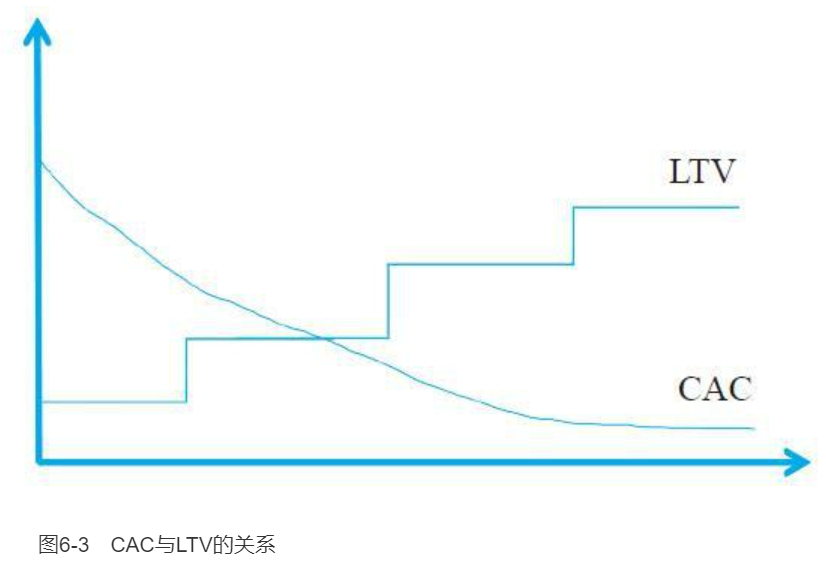
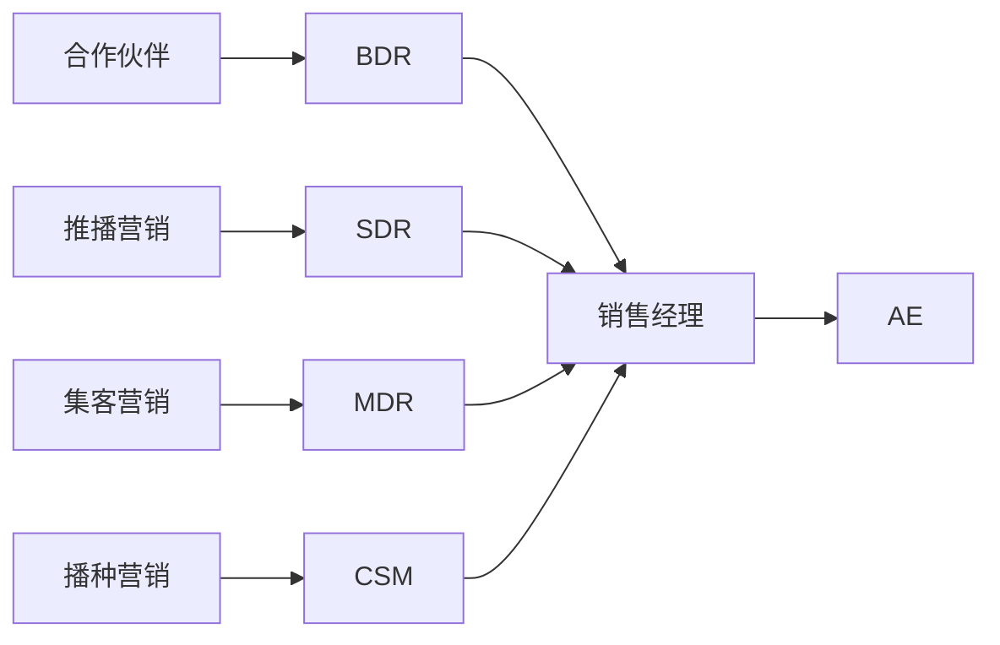
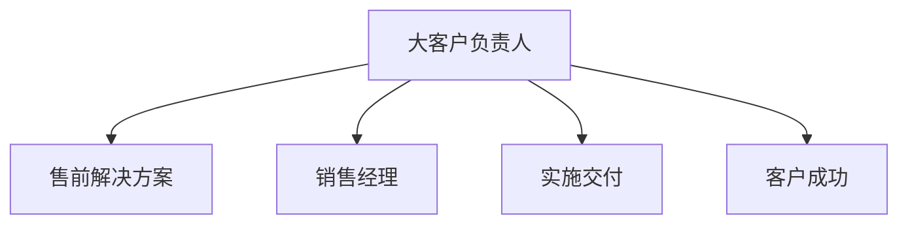
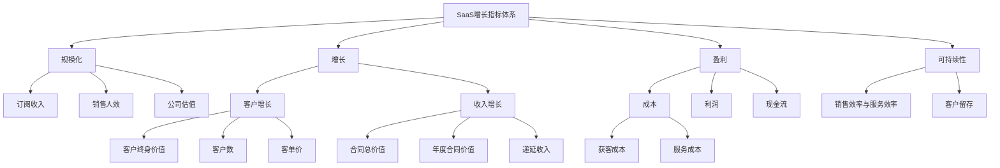

    作者: 代珂
    出版社: 机械工业出版社
    副标题: 好模式如何变成好生意
    原作名: 代珂
    出版年: 2021-5-1
    页数: 255
    定价: 89.00元
    装帧: 精装
    ISBN: 9787111679585

[豆瓣链接](https://book.douban.com/subject/35488676/)

- [SaaS概述](#saas概述)
- [国内SaaS的现状与发展机遇](#国内saas的现状与发展机遇)
- [SaaS的商业模式](#saas的商业模式)
  - [SaaS商业模式概述](#saas商业模式概述)
  - [SaaS的客户价值主张](#saas的客户价值主张)
    - [什么是客户价值主张](#什么是客户价值主张)
    - [客户价值主张为什么重要](#客户价值主张为什么重要)
  - [SaaS的盈利模式](#saas的盈利模式)
    - [SaaS的收益模式](#saas的收益模式)
    - [SaaS的成本结构](#saas的成本结构)
    - [SaaS的利润模式](#saas的利润模式)
    - [SaaS的几种收入模型](#saas的几种收入模型)
  - [SaaS的关键资源](#saas的关键资源)
  - [SaaS的关键流程](#saas的关键流程)
- [SaaS价值论](#saas价值论)
  - [SaaS价值模型](#saas价值模型)
  - [SaaS价值模型的应用](#saas价值模型的应用)
- [成功的SaaS是怎样炼成的](#成功的saas是怎样炼成的)
  - [SaaS创业的难点](#saas创业的难点)
  - [选择利基市场与切入点](#选择利基市场与切入点)
  - [目标客户画像](#目标客户画像)
  - [为SaaS赋予价值](#为saas赋予价值)
  - [改进的MVP](#改进的mvp)
  - [找到早期客户](#找到早期客户)
  - [定义核心竞争力](#定义核心竞争力)
  - [SaaS的定价策略](#saas的定价策略)
- [SaaS获客概述](#saas获客概述)
  - [价值型获客](#价值型获客)
  - [SaaS的获客](#saas的获客)
  - [获客的目的](#获客的目的)
  - [获客的成本](#获客的成本)
  - [客户留存成本](#客户留存成本)
  - [获客成本与收益](#获客成本与收益)
  - [SaaS的获客流程](#saas的获客流程)
  - [渠道获客](#渠道获客)
  - [获客的质量管理](#获客的质量管理)
  - [SaaS的销售组织](#saas的销售组织)
- [SaaS线索拓展](#saas线索拓展)
  - [什么是SaaS的线索](#什么是saas的线索)
  - [线索获取路径](#线索获取路径)
  - [线索匹配](#线索匹配)
    - [客户定位](#客户定位)
    - [画像匹配](#画像匹配)
    - [判断状态](#判断状态)
  - [打造高绩效的线索拓展团队](#打造高绩效的线索拓展团队)
- [SaaS的销售过程](#saas的销售过程)
  - [SaaS销售的困境](#saas销售的困境)
  - [SaaS销售需要方法论](#saas销售需要方法论)
  - [SaaS销售的几种方式](#saas销售的几种方式)
  - [让SaaS销售系统化](#让saas销售系统化)
  - [构建SaaS销售系统](#构建saas销售系统)
  - [发挥销售系统的作用](#发挥销售系统的作用)
- [SaaS实施与交付](#saas实施与交付)
  - [SaaS的实施交付概述](#saas的实施交付概述)
  - [国内的SaaS更需要实施](#国内的saas更需要实施)
  - [实施团队如何考核](#实施团队如何考核)
- [客户成功](#客户成功)
  - [什么是客户成功](#什么是客户成功)
  - [对客户成功的误解](#对客户成功的误解)
  - [国内SaaS其实更需要客户成功](#国内saas其实更需要客户成功)
  - [CSM的工作要点](#csm的工作要点)
- [规模化与增长](#规模化与增长)
  - [增长的四个阶段](#增长的四个阶段)
  - [增长的指标](#增长的指标)
  - [阶段与指标的对应关系](#阶段与指标的对应关系)
  - [增长的驱动要素](#增长的驱动要素)

# SaaS概述
Salesforce的创始人兼CEO马克·贝尼奥夫是SaaS商业模式最早的实践者。马克坚信：一定有一种方式，让购买软件更加方便和便宜。企业不再需要动辄数十万、上百万美元的投入，也不需要经历漫长的安装和实施周期，只要注册和付费，用户通过自行配置就可以使用软件，对软件进行维护和升级也不需要用户亲自动手。

对于客户而言，SaaS相当于把IT设备、软件和运维服务，全部外包给了SaaS服务商。

# 国内SaaS的现状与发展机遇
中国拥有全球最大的企业服务市场，即超过4000万家企业构成的巨大潜在用户市场，这也是SaaS创业公司可以看到的宏观趋势和重大机会。

在大部分情况下，企业的规范化程度越高，对信息化服务的需求就越强，销售成交的可能性就越大。虽然企业规范化也没有严格的标准，但销售员在第一次拜访时就能大致判断出来。销售员可以从这几个方面观察企业的规范化水平：企业对自己的业务有无明确的定义、有无业务流程、业务组织是否完整。

# SaaS的商业模式
## SaaS商业模式概述
通俗来讲，`商业模式`可以简单地概括为：为谁提供什么产品或服务；创造何种价值；最后以何种方式换取收益。克莱顿·克里斯·滕森对商业模式的阐述。他认为商业模式由四个要素构成，依靠这四个要素之间的相互作用，就能创造并传递价值。商业模式的构成框架如图3-1所示：

    商业模式：
        价值主张（创造客户价值）
        关键流程（实现公司价值）
        盈利模式（创造公司价值）
        关键资源（实现客户价值）

1. **价值主张定义了客户价值**。所有成功的公司都是因为找到了某种为客户创造价值的方式，也就是帮助客户达成某项重要目标的方法，价值主张通过解决方案实现客户价值。
2. **盈利模式定义了公司价值**。所谓盈利模式就是创造价值的一份详细计划，而盈利模式本身还包括四个构成要素。
    - 收益模式：收益的构成和计算。
    - 成本结构：关键资源的成本构成。
    - 利润模式：为实现预期利润所要求每笔交易贡献的收益。
    - 资源利用效率：为实现预期营业收入和利润，需要多高的资源使用效率。
3. **依靠关键资源实现客户价值**。一家公司可能会拥有很多资源，而只有那些能创造差异化竞争优势的资源才是关键资源。要实现公司定义的客户价值，就必须依靠关键资源，比如技术、品牌、产品等。
4. **依靠关键流程实现公司价值**。一家公司通常都有很多流程，比如销售流程、运营流程和管理流程等。但是，只有那些能使价值传递方式具备可重复性和扩展性的流程，才是关键流程。实现公司的价值，只能依靠关键流程。

总结SaaS商业模式，在SaaS创业前必须弄清楚四个问题：

1. 你的SaaS产品要为客户提供什么具体的和可量化的价值；
2. 必须以财务上可计算的方式，说明如何从SaaS服务中实现盈利；
3. 实现客户价值需要哪些关键的资源；
4. 以怎样的业务方式实现盈利。

## SaaS的客户价值主张
### 什么是客户价值主张
`客户价值主张（Customer Value Proposition，CVP）`是商业模式中一个重要的构成要素，客户价值主张表明了客户价值，描述了产品提供的价值与客户需求之间的联系，同时也说明了客户为什么要购买你的产品。

按照价值主张的定义，SaaS的客户价值主张需要说明以下三个方面的内容。

- 方法论：价值主张首先表达为一种方法论，利用该方法论能够帮助客户达成重要的业务目标。
- 解决方案：方法论并不能直接发挥作用，还需要基于这个方法论，设计出帮助客户达成目标的解决方案。
- 卓越性：客户业务的重要性越高，客户对达成目标的其他方案的满意度越低，你的价值主张就越卓越。

“痛点说”的问题在于，它又太过于具体，因为SaaS能解决的企业痛点其实非常少，或者你认为的痛点，并不一定是客户最痛的痛点，如果直接提出解决客户的痛点，很容易把自己逼入一条死胡同。所以，无论是满足客户需求，还是解决客户痛点，都不是最明确的客户价值主张。

如果用另一个词“障碍”来代替“痛点”，眼界就会放宽不少。因为障碍所代表的是某一类问题，而痛点通常是指某一个问题，所以SaaS的价值主张就可以表述为：如果客户在达成重要业务目标的过程中，存在着亟待克服的障碍，而借助SaaS有可能解决这些障碍，则价值主张就得以彰显。

在SaaS客户价值主张的描述中，首次将抽象的“价值”与“用户目标达成”建立联系。企业可以对SaaS没有直接需求，也可能没有SaaS能解决的痛点，但所有企业都有业务目标需要达成，比如：完成一个亿的销售任务、将库存降低50%。目标越大、障碍也越大，这就为SaaS提供了解决问题的机会。

### 客户价值主张为什么重要
在为SaaS公司做咨询时，我都会问他们这样一个问题：你的SaaS客户价值主张是什么？令人不解的是，竟然有半数以上的SaaS从业者不知道什么是客户价值主张。他们认为产品差异化、产品话术、市场策略、品牌效应、产品优势、FAB、PMF等，都可以被当作价值主张。还有人把客户价值主张与企业的愿景混为一谈。

任何一个成功的商业模式，都离不开一个坚实的价值主张作支撑。如果一个SaaS的价值主张不对，或者没有价值主张，这种SaaS不但难以营销，也不会给客户带来真正的价值。说得再严重一点，就是做了一个没用的SaaS，没有可交换的价值，当然也谈不上商业价值。

一个好的客户价值主张，会成为企业内部一种创造价值的共同语言。一个连价值认知都不一致的团队，无论有什么样的文化、核心能力，都不可能取得商业成功。

## SaaS的盈利模式
`盈利模式`的一般定义是，通过为客户提供价值，从而为公司创造价值的一个详细的计划。这个定义中包含3项内容：

1. 只有在正确的客户价值主张的前提下，才能谈到为自己创造价值；
2. 盈利模式的本质，是说明公司的价值来源和获得方法；
3. 盈利模式是一个计划，它需要指标量化和计算，也就是说，盈利最后要落实到一套计算公式上。

盈利模式可以进一步细分为四个要素：收益模式、成本结构、利润模式和经营效率。

### SaaS的收益模式
下面我们先介绍常用指标的含义，然后再给出收益的计算方法。

1. SaaS收益指标
   1. `合同额`。因为SaaS是订阅收入模式，即客户是按周期（通常为年）付费的，所以统计合同额要用两个计算口径。
      1. `总合同额（Total Contract Value，TCV）`，也就是全部签约合同金额，包括多年期合同总金额。
      2. `年合同额（Annual Contract Value，ACV）`，即一年的签约合同金额。
   2. `经常性收入（Recurring Revenue，RR）`指能够持续产生的合同收入，对于SaaS来说主要是订阅的费用，国内SaaS的经常性收入一般以年度计算。
   3. `非经常性收入（Non-recurring Revenue，NRR）`包括单次费用，比如实施、培训、二次开发、咨询等专业服务；也包括多次的可变费用，比如电商SaaS的交易抽成、按用量计费的充值消耗（如视频会议的分钟数、电子签约的合同数等）。
      1. `总合同额（TCV）＝经常性收入（RR）×服务周期+非经常性收入（NRR）`
   4. `年经常性收入（Annual Recurring Revenue，ARR）`即年化的经常性收入，是按合同计算每年带来的经常性收入。
   5. `月经常性收入（Monthly Recurring Revenue，MRR）`即月化经常性收入，是按合同计算每月带来的经常性收入。对于一些非整年订阅的SaaS业务，就需要用到MRR。
2. SaaS的营收计算
   1. 使用以下公式可计算年经常性收入（ARR），即：`ARR＝上一年末ARR+新增ARR+增值ARR-流失ARR-减值ARR`
      1. `新增ARR（New ARR）`：新客户带来的收入。
      2. `增值ARR（Expansion ARR）`：因增加了客户数或使用量而带来的收入。
      3. `流失ARR（Churned ARR）`：因客户取消订阅导致流失的收入。
      4. `减值ARR（Contraction ARR）`：虽然客户没有取消订阅，但减少了客户数或者使用量导致流失的收入。
3. 留存指标
   1. SaaS用净收入留存（Net Dollar Retention，NDR）来衡量收入的留存，NDR的计算公式如下。
      1. `NDR＝（期初收入+增加收入-减少收入-流失收入）/期初收入`

图3-2所示是一个计算NDR的示例。

客户 | 第N年 | 第N+1年 | 变动 | 变动状态
---|-----|------|----|-----
客户1 | 150 | 200 | 50 | 增加
客户2 | 100 | 50 | -50 | 减少
客户3 | 200 | 0 | -200 | 流失
客户4 | 0 | 100 | 100 | 新客户
合计 | 450 | 350 | -100

    NDR =（450+50-50-200）/450×100%
        = 55.6%（新增客户100万收入不计入）

4. `客户终身价值（Life Time Value，LTV）`是指从客户那里获取的全部收入总额。LTV由经常性收入、非经常性收入、客户留存、各项收入的毛利水平和客户生命周期等要素决定。LTV真正聚焦的是利润，而不是收入。LTV的大小并不能说明业务是否盈利，实际上，一个SaaS是否盈利，是由LTV、客户获取成本（CAC）和单位经济等因素共同决定的。
   1. LTV必须远高于CAC，SaaS企业才可能盈利（通常LTV/CAC>3）。
   2. 在计算LTV时还应考虑其他成本，如为维护LTV所增加的客户服务成本（CTS）。
   3. 增加的成本会对整个客户生命周期内的盈利都产生影响，如果用很高的服务成本来维持LTV，将会吃掉很大一部分利润。
5. SaaS业务收益模式特点
   1. SaaS业务收益模式的优势在于其收入的可预测性，即体现在经常性收入（RR）上，这也是SaaS模式被广泛看好的原因。经常性收入在总收入中的占比反映了SaaS的收入质量，即订阅收入的占比越大，收入的稳定性越高，可预测性也就越强。
   2. ARR降低的主要因素是流失ARR。相比于国外SaaS的低流失，ARR高流失是国内SaaS的头号杀手，国内很多SaaS公司的收益不佳，其中很重要的一点是没有解决好ARR流失的问题。

### SaaS的成本结构
对于SaaS业务来说，需要重点关注两个重要的成本指标：客户获取成本和服务成本。

1. `客户获取成本（Customer Acquisition Cost，CAC）`用来衡量营销和销售成本的质量，是每获取一个新客户，需要付出的一次性成本。CAC的计算方法为：`CAC＝（营销&销售费用）/新增客户数`
   1. 营销&销售费用包括：市场部、销售部人员和渠道管理人员的所有薪酬成本（工资、福利、五险一金、提成、年终奖等）；所有与获取客户直接相关的费用，如用于营销&销售的CRM工具费用、网站建设/SEO/SEM/AB测试费用、办会和参会的费用等所有为了拉新而产生的费用。
   2. 新增客户数是指同周期内新增的客户数。虽然免费试用客户不记入客户数，但获取免费用户的所有营销&销售费用却要记入成本。
2. `服务成本（Cost To Serve，CTS）`用来衡量服务成本的质量，是指服务于客户所付出的所有成本。一般业务的服务成本不单独统计，但SaaS模式是高度依赖服务的，且SaaS对客户服务的投资都比较大，所以需要有单独的成本KPI。CTS的计算方法为：`CTS＝各种服务成本/客户数`
   1. 服务成本计算与客户数量的时间段需要对齐，比如今年全年的服务成本除以今年内的客户数。
   2. 服务成本包括但不限于：实施服务人员、客户成功人员、培训人员的所有薪酬成本和差旅成本，还包括服务工具的成本。通常CTS与产品的复杂度有关，如果产品属于通用工具，则CTS比较低，可以计入CAC中；反之，对于复杂的解决方案，CTS会比较高，需要单独计算。

根据SaaS业务的特点，通过调整各项成本，可以获得更高的毛利率。为了统一成本的计算口径，SaaS业务通过各项费用与收入的占比来衡量各项成本投入。

- 营销&销售成本占比：只有获得足够多的客户，才能使业务运转起来，所以SaaS业务前期需要投入较高的营销费用，参考区间＜40%。
- 客户服务成本占比：初始阶段比较高，随着客户数的增加、服务规模化效应和引入自动化服务，客户服务成本会逐渐降低，参考区间15%～20%。
- 研发成本占比：前期需要投入很大的研发成本，特别是平台型和需要二次开发的SaaS。后期研发费用会平稳下降，并维持在一定水平，参考区间15%～20%。
- 行政管理成本占比：必要的行政管理成本，参考区间＜10%。

结合前面讲到的客户终身价值，营销&销售成本和服务成本分别对应了获客成本和服务成本，一个SaaS要想盈利，LTV必须远大于CAC与CTS之和。

### SaaS的利润模式
    运营利润＝毛利润－（营销&销售成本＋研发成本＋行政管理成本＋客户服务成本）

提高运营利润率主要有两条途径：降低成本占比和提高毛利率。

### SaaS的几种收入模型
SaaS的收入模型至少可以分为以下四种。
1. `纯自动化的订阅收入模型`。所谓纯自动化的订阅收入模式，即SaaS交付之后的运行不再需要人工介入，而是由软件自动化提供，即“SaaS收入=软件产生的收入”。这是一种理想的收入模式，由于CTS大大降低，所以这种收入模式的盈利能力强，不受服务水平的影响。订阅模式的优势是有更好的收入可预测性，就是说未来ARR是可预测的。但是这也有一个重要的前提，为了使订阅模式成立，需要保证订阅用户持续付费，也就是尽可能保证客户不流失。
2. `自动化+人工服务的订阅收入模式`。这种收入模式仍然属于订阅模式，只是收入的结构中由两部分组成，即“SaaS收入=软件产生的收入+人工服务产生的收入”。显然，与纯自动化的订阅模式相比，这种模式的一部分收入受到人工服务能力的限制。除了增加CTS外，效率也会受到人工因素的影响。如果收入结构中的人工服务收入占比过高，所产生的效率问题会使复制能力受到限制，导致盈利能力的降低。
3. `混合收入模式`。与完全订阅模式不同，在混合收入模式下：SaaS收入=订阅收入+其他收入。比如电商SaaS除了固定的店铺服务费（订阅）之外，还包括流量费、交易费、交易提成等非订阅收入。如果订阅收入占比太小，收入的可预测性就会变差。
4. `类SaaS收入模式`。是指除了服务平台架构是SaaS技术模式外，订阅收入的占比为0。也就是说，所有收入都是“其他收入”。类SaaS收入模式的形式很像订阅收入模式，商业模式是通过业务拓展（Bussiness Development，BD）开发客户，之后依靠客户持续复购取得收入。

虽然达不到订阅收入那么准确的预测，但收入曲线与订阅模式相似；虽然没有CTS，但为了维持客户的复购，BD的服务也是有成本的。

## SaaS的关键资源
`SaaS关键资源`是指为了向目标客户群体传递价值主张，需要的关键岗位、核心技术、产品、专业服务和品牌等资源。

## SaaS的关键流程
一家SaaS公司可能存在很多的流程，比如招聘、培训、产品研发、市场营销、销售、服务和客户成功等，但是这些流程中只有部分属于关键流程。所谓`关键流程`，就是能够产生核心竞争力、实现公司价值的那些流程，比如销售流程、服务流程等。

对于SaaS业务来说，因为整个商业模式都是透明的，所以从理论上讲，SaaS领域根本就是无城可护。如果一定要找出能够起到护城河作用的因素，那只能是流程。更确切地说，是与公司融为一体的关键业务流程，这是对手很难复制的。纵观成功的SaaS企业，其实并没有什么绝招，它们有的只是长期磨合优化的业务流程。

# SaaS价值论
## SaaS价值模型
在SaaS的销售过程中可以发现：企业用户购买的其实并不是产品或服务，而是为了让自己能够达成业务目标，也就是通过绩效目标的考核。无论做什么工作和业务，达成目标都是刚需。用户正是为了达成业务目标，才使用了SaaS产品或服务。理解这个概念以后，解决问题的目标就变成了“发掘用户业务目标”。沿着这个思路，我们就可以建立SaaS的价值模型，这个价值逻辑与客户价值主张的理念是高度吻合的。

在构建SaaS价值模型的路径上，可以提炼和解析出四个核心要素。

1. 业务目标
   1. 企业中所有的业务、任务和工作，都是有目标和绩效要求的，比如销售业务有销售目标和业绩考核；生产业务有产量目标、库存目标、质量要求等，这些目标和绩效都是在经营战略中定义好的。业务目标的价值意义在于，它建立了价值提供与用户需求之间的联系，即管理者和员工只愿意为能实现重要的和关键的目标的服务买单。
   2. 用业务目标而不是需求作为价值模型核心要素，是因为二者并不在同一个业务层级上。首先，业务目标的达成是一个持续、经常发生的过程，而不是个别情况下的某种需求。比如，某些SaaS也能帮助用户达成目标，但是其市场需求规模并不大，这说明从需求的角度看，目标只是一个偶发事件，这种SaaS的价值就不大。把用户目标与用户需求混为一谈，是对业务目标的一个误解，目标不是需求，需求也不是SaaS价值模型的核心要素。
2. 业务背景
   1. 所谓业务可以理解为某种工作或任务，它是达成目标的执行手段。背景即业务的范围和业务发生的情境，任何业务目标都是基于业务背景的。企业有多种业务，SaaS也能提供各种对应的服务。但原则上，业务切入点应选择那些重要、权重高和频发的业务。
3. 目标达成的障碍
   1. 越是高权重业务和关键的目标绩效，达成的难度就越大。这些挑战来自达成业务目标过程中的各种障碍。因为这些障碍可能会影响达成业务目标的进度，甚至导致失败；所以企业不会吝惜克服业务障碍方面的投资。从这个意义上说，企业面临的障碍就是SaaS的商机。
4. 竞争
   1. 即使SaaS服务商成功定位了高权重的客户业务，也确认了关键目标绩效，SaaS还必须是扫除障碍的首选方案，也就是具有强竞争力。因为客户价值主张中还有一个条件：“客户对现有达成目标的解决方案或方法的满意度低。”这实际上表明了一种竞争关系，但不一定是SaaS服务商之间的竞争。此时的竞争是SaaS与其他解决方案（包括软件、信息工具，甚至电子表格）之间的竞争。如果客户勉强接受了不完美的方案，对于软件来说，客户一般会勉强使用下去而不考虑更换产品。但是对于SaaS来说，客户完全没有必要忍受不合适的SaaS服务，换就是了。

把上述四个要素关联起来，就形成了SaaS价值模型。SaaS价值模型如图4-1所示。

## SaaS价值模型的应用
都说SaaS创业有很多致命的坑，但如果回头看就会发现，其实这些坑都是连环坑，也就是由第一个坑导致第二个坑，依次引发到第N个坑，所以避开第一个坑就很关键。所谓第一个坑，就是SaaS产品的定位问题，表现为要么定位不精准、要么定位跑偏，其实这两种情况的结果都是一样的。在所有SaaS创业失败的原因中，排在首位的是“no market need”，说白了就是做的产品没人需要。如果不加思考地直接埋头做产品，极有可能会掉入SaaS的第一个坑。不要以为定位问题影响的只是定位，实际上，产品的设计、营销、销售、服务、续费都会受到定位的影响。

**SaaS产品定位的本质是价值定位**，一个产品的定位过程就是将价值与解决方案结合在一起的过程。如果结合得不好，价值与解决方案就变成了两张皮，影响价值的传递。比如，目前很多SaaS产品的营销都在大谈价值，销售员也是一上来就讲自己产品的价值。我们经常能听到诸如“助力企业数字化转型”“赋能企业提升管理效率”这样的说辞。因为价值与产品解决方案是分离的，所以这种说辞很难与用户产生共鸣，更不用说触发客户的购买动机了。

**SaaS产品定位的目的是向潜在客户传递价值**，而最有效的传递并不取决于一套漂亮的说辞，而取决于客户的共鸣。SaaS价值模型有业务、目标、障碍和竞争四个要素，虽然通常我们以障碍为切入点，但是在定位问题上，我们还是应该选择目标这个要素作为价值沟通的基准。因为在目标绩效这个共同点上，更容易与企业客户的战略目标对齐。也就是说，一个有价值的SaaS产品不但能够解决用户目前的障碍，还能帮助用户达成更好的绩效，这个理念就是后面要讲到的价值型营销的基础。

# 成功的SaaS是怎样炼成的
## SaaS创业的难点
衡量SaaS成功的第一个标准，就是有企业愿意为你的SaaS付费。如果有第二个标准的话，那就是持续地付费。

## 选择利基市场与切入点
选择一个目标市场，对市场进行不断细分，直到找到一个能够迅速控制的细分领域，这个聚焦过程能够保证SaaS创业起跑成功。

无论你自己认为对所选目标市场是多么的了解，都必须对目标市场做一个全方位的商业评估和验证。而对一个目标市场的判断必须是客观的，不能先入为主。对目标市场的验证主要围绕以下四个方面。

1. **目标客户是否有充足的理由购买你的SaaS**？潜在目标客户是否愿意为了你的产品放弃其他的选择，他们这样做的理由是什么？有些SaaS创业者的答复是“我们技术更先进”“我们在××方面有特点”，甚至是“我们在这个行业有很好的客户资源”等。这些都不是客户选择你的理由，这种自圆其说的问题在于你没有站在客户角度，而是站在自己的角度进行主观判断。
2. **目标客户的资金是否宽裕**？如果这个市场的客户没有钱，或者在信息服务方面的投资意愿不强，即使你很容易进入这个市场，后续的发展也是难以持续的。
3. **这个市场的毗邻市场是否也有机会**？如果所选利基市场的容量不够大，就需要向毗邻的相似市场扩展。如果能在赢得当前细分市场后，对目前产品或销售策略进行微调，就能进军毗邻市场，这是最好的结果。如果必须对产品或销售策略进行重大修改才能进入毗邻市场，就说明细分市场的可扩展性不佳，可能会限制业务规模的发展。
4. **市场中有没有阻碍你发展的强有力的竞争者**？实际上，无论选择什么领域，很少存在无竞争的市场。那么，你需要提出疑问：在客户眼中（而不是你的眼中），你的竞争对手的实力如何？竞争对手对你和客户建立的业务关系是否存在强大的阻碍？作为客户的新选择，你在竞争中胜出的策略是什么？

怎样知道我们找到的是不是一个切入点市场呢？根据《龙卷风暴》的作者杰弗里·摩尔的理论，定义一个正确的切入点市场有三个条件。

- 市场中的客户都购买类似的产品。
- 市场中的客户期望产品以相似的方式提供价值，且对于客户有相似的销售流程。
- 市场中的客户容易形成口碑效应，他们可以高效、可靠地推荐好友购买你的产品。

有些SaaS创业者采取与市场细分相反的过程，即把找到的所有可能切入点市场汇总在一起，合并成一个更加通用的市场。即所谓的通用型或一站式SaaS。这类SaaS都很难成功推销出去，客户的付费意愿不高，背后的原因是违背了定义细分目标市场的三个条件，也就是说没有选对切入点市场。

## 目标客户画像
所谓`目标客户`，是指一群拥有共同特征，出于相同目的，愿意购买特定产品的潜在客户。把目标客户的属性描述出来，就是我们平时所说的客户画像。

在ToB领域，SaaS提供的服务是面向企业的，普通的一维画像就很难进行准确的商业化描述。对于SaaS来说，客户画像不再是单一维度，而是多维度主题的刻画，比如价值、绩效、功能、决策、采购等，每个主题下面包含多个属性。

按照SaaS价值模型，对于ToB的客户画像，最重要的是达成目标的障碍和绩效维度。障碍可以理解为平时所说的“痛点”，而绩效维度常常被忽视，遗漏了问题解决后的效果。知道客户问题所在，不代表你能解决；解决了客户问题，也不代表解决得好，所以客户画像必须体现障碍和绩效这两个重要维度。图5-1是目标客户画像结构示例。

画像主题 | 内容
-----|---
基本属性 | 运输物流行业，集团下属200家公司，规模30000人，年产值15亿元
业务背景 | 区域性物流竞争激烈
目标障碍 | ①发件积压严重②差错率高经常被投诉③员工季度考核不达标，影响收入和晋升
绩效改进 | ①发件无积压②差错率投诉减少到2件/月③季度绩效达标
购买标准 | ①可靠性②总成本<10万元/年③达到绩效要求
决策层成员 | 生产副总、CIO、采购经理
最终用户 | 车间主任、工人
核心需求 | ①发货速度提升30%②差错率降到0.1%③不增加人手

## 为SaaS赋予价值
关于SaaS价值的表达，始终存在两个难点：一是价值定位；二是价值量化。

对于价值定位要回答的问题是：你的SaaS究竟能为客户提供哪些价值、如何提供。而价值量化的问题是：如何衡量SaaS所提供价值的大小以及客户的价值认知问题。价值定位和价值量化共同决定实际的客户价值，即

    客户价值=实际价值×客户认知

我们先说SaaS的价值定位。在SaaS价值模型中，我们利用“业务目标”这个要素，可以找到客户目标，并确定目标一致性。客户购买SaaS服务，一定是为了解决目标绩效的障碍，由此可以发现客户的购买目的。而一致性是说，SaaS服务商的价值主张必须与客户画像中的主要购买期望保持一致，比如：客户购买SaaS的目的是加快发货速度和降低差错率，而你的价值主张是降低运营成本，这显然是不匹配的。

接下来再说价值量化问题。以发货速度和差错率为例，发货速度和差错率都是可以衡量的。当然，在有些情况下，价值是不能精确衡量的，我们只能以客户达成目标绩效的程度，也就是用SaaS的效用来量化价值。价值定位和量化是依存关系，即一定是在价值定位正确的基础上，价值量化才有意义。

## 改进的MVP
要验证的问题有两个：①产品是否解决了客户要解决的问题？②客户真的愿意为此买单吗？验证这两个问题，需要用到`MVP（Minimum Viable Product，最小化可行产品）`的概念和方法。

但我们在SaaS的产品实践中很快会发现：将MVP方法运用于SaaS创业的初期，存在着很大的限制或者缺陷。核心问题总结如下。

- MVP定义的最简可用产品，适合消费领域的产品创意表达。客户很可能因为对主要功能的喜爱，就愿意为此创意付费；但是在SaaS领域，MVP方法受到了很大限制，主要问题是SaaS产品模型大多是多维度的，MVP并不能系统和全视角地描述复杂的企业业务。
- 策划一个SaaS产品会预先假定很多条件，这一点在前面各个环节都有涉及。在用MVP与客户交互的过程中，如果没有在MVP中集成进这些假设条件，MVP的效果不会让人满意。
- 我们知道，ToB领域的最终用户与付费客户通常不是同一个角色。MVP的交互对象是最终用户，但是MVP方法不能直接从最终用户那里得到客户是否愿意付费的验证。

MVP仍是一种简洁和方便的方法，但是需要对其进行改良才能用于SaaS产品，即将MVP变成MVBP（Minimum Viable Business Product，最小化可用业务产品），通过集成所有假设条件，重新定义MVBP，使其兼具简单性和业务完整性，准确地验证最终用户和付费客户的付费意愿并形成有效反馈。按照这样的目标，MVBP要达到以下三个验证目的。

- 客户使用产品是否能获得价值。
- 通过MVBP获得足够的反馈。
- 找出客户愿意付费的驱动因素。

MVBP的设计必须围绕上面三个要素，区分参与的两类客户的作用：最终用户针对的是前两项；付费客户针对的是第三项。列出所有业务场景假设，根据反馈删除其中不太重要的，最后利用关键假设修改MVBP，便能得出客户是否愿意购买这类产品的结论。

## 找到早期客户
对于要找什么样的验证客户和找多少，是有严格要求的，基本条件是，要找的潜在客户至少需要满足以下四个要求。

1. **必须是非关联客户**。所谓`非关联客户`，不能是投资人的关系网，也不能是那些之前的客户、合伙人、同事，或者社交网络上的人。一句话，这些客户与你毫不相干。
2. **符合目标客户画像**。必须确保找到的潜在客户，与你之前所做的目标客户画像完全吻合。保证所有客户的同质性非常重要，只有这样验证才有实际意义。如果找到的客户不符合要求，不但无法提供可靠的验证信息，而且会把发展方向带入歧途。
3. **至少需要10个以上**。根据客户画像的模型特征，至少需要找到10个符合最终用户特征的潜在客户，验证结果才具有统计上的可靠性。实际上，你不可能等到验证阶段再去现找客户，而是应该在创业之初，就开始搜集和建立用于验证的潜在客户名单。要确保找到至少10个客户，可能要准备数十个甚至上百个客户才行。这10个客户的重要性在于，它们可以保证未来公司的第1000个客户都与这10个客户是同一类型，因为他们有相似的问题和诉求。如果前10个客户的问题解决了，公司的核心问题也就解决了。
4. **真实性测试问题**。表面上的喜欢或者不喜欢并不重要，重要的是愿意为此类服务付费。所以，意愿性测试必须以是否付费为验证标准。“如果市面上有这样的产品，你是否愿意付费使用？”对于这个问题的回答，在很大程度上能够确认客户的真实想法。

找到了符合标准的验证客户，验证结果有以下三种可能，对于每一种反馈都需要有对应的措施。

1. **大部分客户的反馈都是“不错”“挺好的”**
   1. 首先，这未必是一个好现象，实际上，这很可能是无效反馈。特别是如果找到的都是关联客户，他们并没有深入探究切入点市场和产品要解决的问题，只能是敷衍了事。
   2. 不过，这种情况也可能是验证方法有问题导致的，比如把MVBP丢给客户“测试”，或者是付费意愿的调查询问方法不对，让客户误以为是在推销产品。这样的结果不能算是完成了验证过程，需要找出失败原因，重新做一遍。
2. **有很多负面的反馈**。俗话说得好，有褒贬才是买主。如果客户表示愿意付费使用这类产品，但是从目前的MVBP看，还有很多问题，这其实是一个很好的结果。首先，客户的付费意愿说明市场定位和价值定位是对的，这个结论非常重要。其次，负面反馈说明MVBP中的某些假设存在问题，这也是一个宝贵的信号，说明这些假设原本很重要，但是被忽视了。
3. **全盘否定**。令人沮丧的是，如果所有客户对MVBP的所有假设都给予了否定，这种情况下就需要回到原点，重新考虑切入点市场是不是存在偏差。

## 定义核心竞争力
先明确什么不是核心竞争力。

1. **先发优势**。将先发优势当作核心竞争力，是企业服务领域一个很常见的误区。企业服务领域的先发优势是指最先进入这一领域的SaaS公司。因为当时竞争者不多，创业资本相对充裕，容易获得大量的客户，成为所谓的头部公司。但是，大多数SaaS先行者的结局是因盈利困难或资金消耗殆尽，被后来居上的SaaS公司所取代。在企业服务领域，先发优势甚至被视为劣势。
2. **技术和产品**。一些技术创业者常常把专利、专有技术、平台等当作核心竞争力，也有一些产品经理把自己的产品差异当作核心竞争力。其实这是很大的误区，相当于拿着一项技术去找解决方案，这显然是违背常理的。这些技术如果不能转化为方案优势，单靠技术和产品很难产生有意义的差异化，即使有暂时优势，也难以长久维持领先的状态。

什么可能会成为核心竞争力。

1. **价值定位能力**。目前在国内SaaS领域，SaaS产品要么是复制国外的赛道，要么是做通用型SaaS，真正自己发现和定位用户价值的SaaS并不多。从供需关系看，一边是数量庞大的客户市场，另一边是缺少适其所用的SaaS服务。所以，拥有精准价值定位能力，避开红海竞争，可以成为核心竞争力。
2. **客户服务能力**。SaaS商业模式高度依赖客户留存，而留存又依赖于客户服务，甚至SaaS领域产生了一个被称为客户成功的专有服务模式。建立客户服务能力是一种组织承诺和企业文化主张，需要做到竞争对手难以做到的程度，甚至是制定苛刻的维护客户利益的规定，比如我原来服务的公司，曾经就有“30天无条件退款”的服务。持之以恒地强化客户服务，终究会变成一种核心竞争力。
3. **成本控制能力**。前面讲SaaS盈利模式时，我们介绍了不同的SaaS模式，其成本构成也不同。通过业务设计获得的最佳收入模式是纯粹的、服务自动化的订阅模式，其成本最低、规模化收入更高。此外，经营过程中的获客成本和服务成本，是制约盈利水平的关键因素。国内企业服务领域很多企业是通过价格战抢占市场的，但是低价的基础不是降价，而是低成本。虽然低价不是核心竞争力，但是如果在综合成本方面战胜竞争对手，成本控制能力就能成为公司的核心竞争力。
4. **强化商业模式**。前面我们说到SaaS的商业模式包括四个维度，即客户价值主张、盈利模式、关键流程和关键资源。因为四个维度之间存在紧密的关联，所以单个维度上的增强，对于加强核心竞争力的作用是有限的。只有在商业模式四个维度上不断磨合和优化，才能从根本上建立核心竞争力，客观上也起到了护城河的作用。

## SaaS的定价策略
1. **定价逻辑**。收益与客户数的平衡是SaaS定价的基本逻辑。
    - SaaS盈利模式的独特性，决定了其定价的合理性和特殊性。其实所谓合理性，并没有什么道理可讲，但也不是拍脑袋定价，实现SaaS的合理定价取决于买卖双方的价值平衡。
    - 从SaaS服务商的角度看，SaaS兼具了企业的公共服务属性和互联网产品形态属性。这个特点决定了SaaS不是一个靠高定价获取高收益的行业，而客户的数量是一个衡量企业价值的重要指标。所以SaaS的定价，是在实现更多收入和吸引更多客户之间建立平衡。
    - 再从客户的角度看，对于大部分国内企业来说，依靠信息服务和数字化技术带来的实际收益并不显著。如果SaaS定价过高，就会增加企业的经营成本，因而导致SaaS的客户数量减少。
2. **定价依据和影响因素**。
    - 传统的成本定价方式不适用于SaaS定价，成本不是SaaS定价的关键因素。SaaS服务的定价应当基于为客户创造的价值，而不是产品本身。
    - 我们知道，决定价格或交换价值的三要素是有效用、认知和稀缺性。这个规律是通用的，也适合SaaS。一个SaaS服务只有有效用或有价值，才会有客户购买。但仅有价值和有效用还不够，还要看买方对产品价值的认知。最后是稀缺性，在企业服务领域的市场竞争中，价格主要由供需稀缺性决定，如果同类SaaS很多，质量水平相差不大，就没有稀缺性。而选定的利基市场独特，就会增加稀缺性，SaaS价格就可以定得较高。
    - 目前困扰SaaS定价的主要因素是认知，因为价值的认知有非常大的主观性，甚至是客户认知决定了价值的高低。本书用很大篇幅讨论价值，目的就在于告诉大家如何提高SaaS客户的认知。我们重点要解决两个问题：一个是价值量化问题；另一个是价值认知问题。前者是关于效用显性化的问题，后者是向目标用户传递价值的问题。这两个问题是有因果关系的，如果价值不能量化，也就没办法被传递。
3. **考虑具体国情**。
    - 国内SaaS的定价需要考虑两个方面的问题：一个是客户对SaaS的价值认知；另一个是客户的付费意愿和能力。
    - 国内企业客户对机器设备等有形产品的价值认知，与实际产品价值比较相符；而软件虽然也属于无形产品，但作为企业的资产，其价值也能被企业认可和接受。但是SaaS作为非资产化的信息服务，企业客户对其价值的认知偏差非常大。
    - 这就给SaaS的定价带来很大障碍，客户不愿意花费较高的代价，去尝试一种效果未知的服务。

# SaaS获客概述
## 价值型获客
ToB销售主要有三种类型：`产品型销售`、`解决方案型销售`和`价值型销售`。相应地，获客也有三种模式：`产品获客`、`解决方案获客`和`价值获客`。实际上，无论SaaS服务商采取何种获客模式，最后都会归结为价值获客。所谓`客户感知价值`，是指客户认为的价值，而不是SaaS公司标榜的价值。

    客户感知价值＝SaaS提供的实际价值×客户认知

我们可以进一步把决定成功获客的客户感知价值展开，就能发现成功获客的关键要素：

    SaaS提供的实际价值＝产品价值+市场人员贡献的价值+销售人员贡献的价值+实施人员的交付价值

所以：

    客户感知价值＝（产品价值+市场人员贡献的价值+销售人员贡献的价值+实施人员贡献的交付价值）×客户认知

三组客户价值公式。

1.对于产品型销售

    SaaS提供的实际价值＝产品价值
    客户感知价值＝产品价值×客户认知

2.对于解决方案型销售

    SaaS提供的实际价值＝产品价值+市场人员贡献的价值+销售人员贡献的价值
    客户感知价值＝（产品价值+市场人员贡献的价值+销售人员贡献的价值）×客户认知

3.对于价值型销售

    SaaS提供的实际价值＝产品价值+市场人员贡献的价值+销售人员贡献的价值+绩效价值
    客户感知价值＝（产品价值+市场人员贡献的价值+销售人员贡献的价值+绩效价值）×客户认知

## SaaS的获客
不达标的获客对于SaaS来说很可能是一笔亏损的交易，即`CAC>LTV`。

SaaS的本质是续费。其实更确切的说法应该是，SaaS生意经营的本质是经营客户终身价值。

## 获客的目的
因为考虑研发、获客、服务等综合成本，在销售达成时并不能产生利润，而实际利润是在未来客户生命周期中实现的。所以SaaS获客的目的是为了创造更大的LTV，也可以说**LTV才是SaaS公司的未来**。

我们把SaaS业务的LTV拆分为五个构成要素

1. 一次性收入。包括签约服务后的所有一次性收入，主要是客户第一年的订阅费、实施费、集成费以及合同中约定的其他一次性费用。
2. 经常性收入。主要是订阅费，也可以包括使用量费用，比如短信。
3. 增量收入。可以理解为追加销售，主要包括增加用户数、升级到高级版本、购买其他服务等收入。
4. 客户净留存。为了简化起见，很多SaaS公司使用客户数量留存率的概念，其计算公式为：

        客户留存率＝1-（期初客户数-期末客户数）/期初客户数

按客户数留存的计算方式，虽然可以分析留存率的大致趋势，但对于精细化运营来说，还是比较粗糙的。行业内通常以金额衡量留存率，即净收入留存率（NDR），NDR的计算公式：

    NDR＝（beginning revenue+upgrades-downgrades-churn）/beginning revenue

5. 客户生命周期。分析LTV数据不是目的，找出提升LTV的方法才是研究获客的重点。从客户全生命周期看，一个客户的LTV主要由获客质量和服务质量决定，而获客方式又会影响获客的质量，比如产品与客户需求不匹配、客户对价值不认可、草率或勉强地签约，都将降低获客质量，进而影响客户生命周期。

LTV真正聚焦的是利润而不是收入，只有LTV远大于CAC时，公司才可能盈利。

## 获客的成本
SaaS获客成本的计算公式：

    CAC=市场和销售费用/同期新增客户数

## 客户留存成本
维护LTV也需要投入`客户留存成本（Customer Retention Cost，CRC）`。

客户留存成本的计算公式：

    CRC=总服务成本/活跃客户数

为了衡量客户服务带来的收益，需要计算LTV/CRC，以评估客户服务对增加LTV所起的作用。

## 获客成本与收益
从SaaS的整个获客过程可以看出：在SaaS业务的初期，CAC要远大于LTV，随着业务趋于成熟和稳定，CAC会逐渐降低，直到大大低于LTV，二者正常的发展过程如图6-3所示。

在提升LTV的同时，降低CAC，才是SaaS获客和持续经营的目的。而提升LTV和降低CAC的最重要方法，就是改善SaaS的获客流程。

## SaaS的获客流程
所谓SaaS的销售流程，就是以客户价值为基础，不断优化的获客最佳实践；其对于SaaS所起的作用，就是提高客户终身价值和有效降低获客成本。

我们先看SaaS产品的客户采购旅程。

1. 发现问题。根据前面讲过的SaaS价值模型，客户在达成某个业务目标的过程中，遇到了难以解决的障碍或者问题。这个问题严重到足以影响绩效目标的达成，到了不得不解决的程度。这是客户采购的内部动因和旅程的开始。
2. 寻找解决方法。客户这时候开始思考：这个问题有没有什么好的解决方法？其他人有类似的问题吗？他们是怎么解决的？
3. 研究解决方案。客户通过网络等各种渠道，搜集多种解决方案，并开始研究每种解决方案，这是最可能发现你的SaaS解决方案的机会。
4. 寻求帮助和咨询。客户向多家SaaS服务商发送咨询邀请。
5. 效果评估。通过方案交流分析，客户评估每家SaaS服务商的解决方案，形成心理排名。
6. 选择合作。客户与SaaS服务商形成合作意向。
7. 预算范围。SaaS服务商报出的预算在客户可接受的范围内。
8. 问题解决。双方签约并实施解决方案，评价实施效果。
9. 达成目标绩效。影响目标达成的障碍解决了吗？这是采购正确性的唯一评判标准，也决定了客户是否会续约。

需要注意的是，实际的客户采购旅程不一定严格按照上述步骤开展，可能跳过中间的步骤，或者在某几个步骤之间来回往复，但这并不影响销售流程的设计。

一个SaaS销售流程要想做到既对销售员有所帮助，又有益于公司，需要做到以下几点。

- 了解销售周期有多长。SaaS是一个讲求效率的业务，销售周期的长短决定了获取新客户需要付出多少成本。只有尽快完成从初次接触到完成付费的过程，才能满足对销售效率的要求。
- 为计算客户获取成本奠定基础，确保从当前客户身上赚到的钱，多于用于吸引新客户投入的成本。
- 发现那些限制销售的隐形障碍。如果某些因素会影响销售，必须马上确定问题，等到公司投入资金、人力和物力之后再去解决就已经迟了。
- 预计销售流程每个环节需要花费的时间，按顺序排列各环节，确定哪些环节可以并行。
- 明确销售流程有哪些投入和产出。这一步可以确保及时发现销售流程中潜在的陷阱，避免消耗过多的获客成本。

让销售流程产生效益：

1. 降低CAC。降低CAC的大部分要素都包含在销售流程之中。运用数据分析的方法，拆解销售流程每一个环节，就能看清哪些步骤是必要的，哪些是产生成本的多余动作。
2. 提高销售效率。传统的IT销售流程是被动响应式，即完全随客户的采购旅程而动。被动式销售流程没有效率可言，销售员的大部分时间都耗费在迎合客户的慢节奏上。根据客户采购旅程开发的SaaS销售流程可以起到引领的作用，让客户的采购节奏按照卖方流程走，从而极大地提高销售效率。
3. 提高获客的质量。客户的终身价值其实在获客签约时就已经确定了，获客的质量决定了客户的质量，而高质量的客户将会产生更大的LTV。一个好的SaaS销售流程不但能帮助销售达成更多交易，还能通过有效的客户质量评估机制，识别获客的质量。
4. 营销工具的作用。目前市面上的销售工具多如牛毛，如果只是就工具谈工具，也就丧失了工具的意义。只有通过分解销售流程各环节的动作，才能确定哪些地方需要使用相应的工具。合理使用工具，能够产生销售组织决策所需的数据。
5. 培训、优化和复制。在没有建立或者没有稳定的销售流程之前，不应大量招聘销售人员。如果没有一个规范有效的流程作为保障，销售很容易陷入混乱，人员更替的隐性成本也非常高，除了降低销售效率以外，还会迅速推高CAC。只有在销售流程经过优化达到稳定之后，SaaS获客的成功方法才可以复制。

## 渠道获客
SaaS直销有两个缺陷：

1. 在几种销售模式中，直销的CAC最高，因为销售员的所有成本都由公司承担；
2. 直销的覆盖范围非常有限，限制了业务的扩张。

## 获客的质量管理
评估的方法必须简单有效。比如，将所获客户的质量分为A、B、C三级：A代表优质客户，即使不用关照也能留存；B代表质量一般的客户，需要适当的引导和关照；而C代表劣质客户，这类客户需要提供特殊的关照和更多的服务才可能留住，它们在维持LTV的同时，也在消耗较高的服务成本，甚至会消耗研发成本。

## SaaS的销售组织
所谓按销售流程组建销售团队，就是先设计、后招聘。先聘用少量的必要岗位人员，保证最简销售流程能够运行起来。有了销售流程，照方抓药式的招聘营销和销售人员就容易多了，通过“流程+人员”的不断磨合，使销售团队后续的调整和招聘模式变得可复制。

国内有些SaaS公司采取与上述流程相反的做法：为了冲销售额招聘大量的营销和销售人员，当然其中也不乏优秀的专业销售。但是，每一家公司的产品、销售流程和销售方法都不一样，不同的销售人才的销售技能体现在不同领域。

在没有建立好销售流程之前，就将这些人员放在一个组织里，各自向着不同的方向发力，结果往往是销售额上去了，同时上去的还有CAC和CRC，公司资金很快就会耗尽。

照线索的生成方式，基本方式就那么几样。

1. `集客营销`。集客营销是一种一对多的营销方式，其营销思路是打造客户关心的专业内容，吸引客户购买。集客营销成功的关键是内容营销，这是一种充分利用互联网传播优势的低成本方法，自然所有SaaS公司都不会忽视。
2. `推播营销`。推播营销是一种有针对性的一对一行动，先制作目标清单，然后通过打电话、发邮件等方式，与潜在客户获得预约并保持联络。尤其当目标客户是大公司时，集客营销的作用不大，而推播营销的效果就非常好。推播营销因为具有很高的投入产出比，所以也被称为小团队、大作为。
3. `播种营销`。播种营销是一种多对多、基于口碑与关系的营销活动。对服务满意的客户会向其他客户做推荐，可以影响其他潜在客户，产生购买意向。
4. `内容营销`。从本质上说，所有SaaS的营销都是内容营销，所以它不能算作一种单独的营销方式。只是对于不同时间、不同场景需要不同的内容，比如小到一封邮件，大到一个网站，都需要从内容出发开展营销。

涉及SaaS整个获客过程中的主要角色有以下五个。

1. `MDR（Marketing Development Representative）`：负责集客客户开发的市场人员，对应的是集客营销方式。
1. `SDR（Sales Development Representative）`：负责外呼的客户开发人员，对应的是推播营销方式。
1. `CSM（Customer Success Manager）`：客户成功经理，本不属于营销序列，但是没有他们，播种营销方式就无法实现，所以这里把他们也归为营销序列。
1. `BDR（Business Development Representative）`：渠道伙伴开发人员，他们接触的客户并非终端客户，而是渠道和伙伴计划。前面说到，当SaaS标准产品到达成熟阶段，为了降低CAC就需要有渠道的加入。
1. `AE（Account Executive）`：负责执行销售过程，他们的工作以客户为中心，提供咨询、价值分析、专业建议、解决方案、服务协议、报价和移交等服务。

销售组织的获客分工：

公司的`灯塔客户`几乎全部来自全能型销售团队。`全能型销售团队`的组成如图6-5所示，其中售前解决方案和销售经理两个角色最好是合二为一，这样一方面可以提高效率，另一方面是为了尝试在SaaS销售组织中，不专设售前人员，毕竟SaaS的销售过程要比软件销售过程简单得多。

全能型销售团队成功的核心在于强化了售前解决方案和实施交付，使用了快速销售流程和深度价值表达工具。一个全能型销售团队并不需要很多成员，实际上三四个人就足够了。因为并不需要专门的MDR（但需要为MDR制作内容）和SDR，CSM也只是表明一个态度，并不需要在客户整个生命周期内真的投入一个高水平的CSM一直参与其中。

# SaaS线索拓展
## 什么是SaaS的线索
- `潜在客户`：即具备采购可能性的客户，也称为潜在购买者，也就是有能力购买你的SaaS产品的客户。
- `线索`：在SaaS价值模型中我们提到过，潜在客户在达成业务目标绩效方面可能存在障碍，而你的SaaS产品恰好能解决这些障碍，这就产生了一条线索。
- `商机`：潜在客户的某一个角色，意识到目标达成障碍可能会对其绩效产生较大影响，也意识到你的SaaS产品可以帮助他解决存在的障碍，但目前还没有下定决心解决，这就是一条商机。

这三者之间的关系是，从潜在客户到线索的转换，是营销或销售人员能决定和促成的。而从线索到商机的转换，一定是客户决定的，而不是由销售人员决定的。

线索和商机有时确实容易混淆，导致销售产生错误的动作。客户有问题，未必一定要解决，也未必是现在就要解决。只有客户想解决问题了，而且是对你的方案有兴趣了，这才算是一个商机，否则就还是一个线索。客户都有达成目标绩效的障碍，但是如果你不能解决这些障碍，那就连线索都不是。SaaS公司对于线索和商机的判断，需要有清晰和可操作的标准。误判不但会影响线索团队与销售团队之间的信任，还会消耗获客资源。

只有找到了有质量的线索，才是销售流程的起点，表示一个销售过程真正开始了。在这个过程中，“找线索”不是重点，“匹配线索”才是。在互联网时代找到线索很容易，而获取有质量的线索，必须通过专业的匹配过程才能筛选出来。一旦匹配错误，会导致销售员白忙一场，即线索的生产出现了废品。

## 线索获取路径
所谓`线索获取路径`，就是获取线索信息的途径，也就是能接触到潜在客户的方法。建议SaaS公司根据自己目标客户群的特点，尽可能使用多路径方法的组合，而不是执着于自己最擅长的方法。

1. 集客营销。集客营销相当于先在一个选定池塘投放诱饵，然后把别处的鱼吸引或者赶到池塘里，最后下网捕鱼。对应到现实中，就是我们日常开展的那些活动，比如现场会议、在线活动、网络广告、博客和公众号等，都属于集客营销。
   1. 集客营销的优点是，通常能生成大量的线索；缺点是生成线索的质量低、转化率差。但只要抓住集客营销的核心，结果将大不一样。
   2. 集客营销高度依赖线索拓展团队的内容开发能力，也就是“鱼饵”的质量。一些公司，特别是大公司很容易高估其产品对受众的吸收力，认为它们的任何营销动作都能吸引众多潜在客户。然而事实并非如此，我们经常看到，一些SaaS公司无论是网络广告、发布会，甚至是官网内容都是各种高调和时髦的概念。这些内容其实是做给自己看的，而不是写给客户的。
   3. 没有内容开发能力就做集客营销，除了浪费钱，收获的也只能是大量高噪声的线索。如果放弃，觉得可惜，而筛选又是另一个巨大的投入。
2. 推播营销。我们还是拿捕鱼类比，推播营销相当于用鱼叉捕鱼，这是一个对技术要求更高的捕鱼方式。用什么样的鱼叉？向哪里投掷？要用多少投掷人员？这些都是开展推播营销需要考虑的问题。
   1. 如果操作得当，推播营销的作用也是巨大的：
      1. SaaS的线索开发不能都是集客营销那样守株待兔的方式。尽管有客户主动打电话给你这件事很美妙，但在同一时间，他们也会打给你的竞争对手。明白了这一点，你就必须主动出击，也就是采取推播营销方式；
      2. 集客营销对于大企业客户基本没用，而公司又需要有大业务作支撑，这时你就必须使用指向大客户的推播营销；
      3. 推播营销可以实现很高的性价比，即小团队、大作为——使用少量训练有素的SDR，配合有针对性的高质量内容，就可能获得大量优质线索。
   2. 总结一下SaaS公司在做推播营销时容易犯的错误：
      1. 没有选择目标潜在客户，相当于见着水就投掷鱼叉，比如漫无目的地打电话、发邮件、发微信；
      2. 招聘一些电话销售员甚至是实习生做推播营销，相当于雇佣了捕鱼新手。这不但不能降低人工成本，投资回报比也更低，甚至还可能影响公司的声誉；
      3. 推播营销也需要高质量的内容，但是不用像集客营销那样做很多种内容，只要突出你的价值主张就有效，就是对某种鱼，需要准备专门的诱饵。很多SaaS公司的价值主张模糊不清，潜在客户也看不明白你是做什么的，有的推播营销直接就说自己的产品功能，就像好不容易找到的大鱼，却投放错误的鱼饵，反而会把鱼吓跑。
3. 播种营销。
   1. 实际上，宽泛地讲，为了帮助他人取得成功所做的一切努力，都是在“播种”，包括员工、合作伙伴、投资人和客户。播种营销在ToB领域的成功机会，要比ToC领域大得多，因为ToC消费领域的信任推荐关系已经被消耗殆尽，而ToB领域的这种关系还没有被充分开发和利用。
   2. 播种营销的一个成功应用示例是与灯塔客户的合作，所谓灯塔客户就是行业内有影响力的企业。利用灯塔客户做播种营销，获得优质客户并不需要花费太大力气。这就是我建议在SaaS公司发展初期，就选定行业典型大企业为目标客户的原因。我们自己的经验也表明，前20～30家行业典型客户，基本都是来自最初的3～5家灯塔客户。
4. 销售自拓展。通常线索拓展团队运作初期的效率不高，无法满足销售团队的需求，此时有效线索的供给与需求存在较大的矛盾。在这种情况下，销售员就会自行开发线索。因为在传统的销售培训中，包含了如何寻找线索，所以销售员自拓展线索，也算是学有所用。但这并不是长久之计，除了不符合SaaS的获客流程外，销售员既要找线索，又要做销售，对销售效率会产生很大的影响。

## 线索匹配
### 客户定位
实际上，大部分SaaS产品都存在有效市场边界，即每个SaaS产品都有自己适用的行业、业务和需求特性。超越有效市场边界的客户合作，对于传统软件业务没有问题，但对于SaaS产品来说，基本上就是赔本的生意。

我们可以分别从三个维度对定位做进一步的细分。

1. 行业，也就是覆盖面的契合。虽然同行业客户的业务、问题、需求、流程基本相似，但是行业仍需要进一步细分，直到与SaaS业务边界契合为止。
2. 业务，也就是业务线上的契合。制约客户达成目标绩效的障碍，一定是存在于具体业务中，比如你的SaaS是电子签章，那么只能是与交易有关的业务，你需要定位到与这个业务相关的潜在客户群体。
3. 关键需求，也就是关键点上的契合。关键需求对应客户那些难以忍受的障碍、非解决不可的问题。

### 画像匹配
合理的做法是根据目标客户的画像模型，按照线索与客户画像模型的符合程度进行量化，从而筛选出符合画像的线索，筛选的效率取决于科学地断、舍、离。

### 判断状态
1. 客户问题隐性阶段。对于SaaS的线索拓展来说，能不能让客户意识到他看不到的问题至关重要，这既关系到买不买，也关系到买谁的问题。
2. 客户问题显性阶段。所谓显性问题，就是客户已经觉察到存在的问题，切身感到完成业绩目标遇到了障碍。现在的问题变成了：潜在客户虽然感受到了问题的存在，但是并不急于解决，或者根本没有打算解决，就是还能将就下去。潜在客户要什么时候解决问题呢？答案是到了忍不下去的程度，或者问题直接爆发造成损失的时候。
3. 线索成型阶段。成型线索的背景比较复杂，潜在客户可能刚开始选型，如果你是领域中知名的服务商，就会收到邀约。但如果你的公司不知名，这个线索的发现就不是现在，而是在之前的某次机会产生的。还有一种可能是采购已经开始了一段时间，客户需要货比三家，你只是作为潜在服务商之一被邀约的。无论是哪一种情况，线索拓展团队要做的都不是直接把这个线索给到销售，让销售去拼价格或者陪标。市场营销部门还有一个重要的工作没有完成：证明自己是最合适的服务商，而最有力的证明方式就是灯塔客户的成功案例。可能线索开发团队认为，这个线索已经匹配成功了，就应该直接进入商机阶段。这是线索拓展的一个误区，只要潜在客户对你的公司没兴趣，哪怕到了签约前的阶段，对于你来说，就还是属于线索阶段。

## 打造高绩效的线索拓展团队
在很多SaaS公司，这些内容工具是市场部负责的，所以很多SaaS公司的网站要么过于花哨，要么就是满眼时髦的IT名词，而成功客户案例也是干巴巴的那么几个常年不换的客户。这些形式化的工具对线索拓展的帮助不大，但这并不是市场部的责任，因为当初内容工具的设计目标本来就不是获客。

现在需要换一个思路，即所有内容工具的开发和使用都归属于线索拓展团队，或者由线索拓展团队主导。线索拓展变成一个业务部门，而市场部不再负责实际的获客活动，变成一个品牌部门。这样能避免很多问题，如果输出的线索质量不高，就只能在线索拓展团队内部找问题，而不能再说是市场部内容工具的问题了。分清责任就能设定绩效目标和考核标准，而一个明确的目标和考核标准就是生产高质量线索的重要保障。

虽然客户要采购SaaS产品，但是只要客户对你的SaaS产品没有兴趣，那么这个线索对于公司的价值就接近于0，转化为商机只能徒增销售的工作量和成本，还没有多大的成交可能。出现这种情况，只能说明提升价值的动作要么还没有做，要么是做了没效果，即线索拓展团队的任务并没有全部完成。如果线索拓展绩效考核只是给线索打个分，这个团队就没有存在的价值。

将线索拓展团队独立出来之后，唯一的绩效考核标准就是该线索转入商机之后，最终有没有成交，除此之外没有其他条件。可能有人会质疑，如果单子丢掉是销售的问题呢？这种可能性当然有，但是对于一个流程来说，问题可能出在任何一个环节，而最终结果决定了所有流程环节的绩效。事实已经证明，也只有这样考核，才能使线索拓展团队与销售团队形成真正的合作。

# SaaS的销售过程
## SaaS销售的困境
SaaS销售人员的收入基本上是“底薪+提成”，而提成取决于销售业绩。我们知道，SaaS的收入模式与软件不同，即按年订阅收入模式，而不是按合同收入模式。当SaaS销售交易达成时，所获收入只是第一年的用户订阅费，而不是像软件销售那样为全部合同额。显然SaaS的年订阅费要比软件合同额少得多，统计下来大约相当软件合同额的1/3左右。若以此为销售提成基数，在提成比例不变的条件下，销售提成就低了很多。

为了达到软件销售收入水平，就需要提高销售提成的比例，但这又会增加公司的获客成本和降低利润，所以提高提成比例，也不是解决销售问题的根本办法。也有的公司会默许销售签订多年订阅服务合同，并要求客户支付全部合同额。这虽然可以在一定程度上增加销售的提成收入，但是公司却为此承担预支的财务风险。因为未来的服务还没有发生，甚至客户可能退货，所以客户预付的订阅费只能算作递延收入，不适合算入销售人员的提成。

从公司角度看SaaS销售，成交不再是销售人员的终极目标，获取有持续贡献能力的高质量客户才是销售业务的重心。如果增加这一销售要求，SaaS的成交就更加困难了，这将更加影响销售人员的收入。

## SaaS销售需要方法论
SaaS销售方法论所包含的内容和结构框架如图8-1所示

    销售技巧 | 销售工具
        方法和策略
       SaaS获客流程
      SaaS价值获客逻辑

1. SaaS价值获客逻辑。这一层是SaaS销售方法论最底层的商业逻辑，它清楚地表明了SaaS销售目的与其他业务的不同之处，即不只是为了签约，而是为了获取高质量的客户。如果不确立这个销售逻辑，整个SaaS商业模式就不成立，销售也将失去意义。
2. SaaS获客流程。基于价值获客逻辑设计的获客流程，必然与一般销售流程不同。一个不同的策略就是把线索的获取过程从销售过程中分离出来，既要保证目标客户的质量，又要确保销售的效率。获客流程由两个部分组成：获取线索的线索拓展流程和负责成交的销售流程。
3. 方法和策略。获客流程是根据策略设计的，策略是获客流程的指导方针，获客流程是策略的落地结果。研究销售不是研究流程，而是要从策略入手，这一点非常容易被忽视。比如我们经常研究的销售“打法”，既包含策略成分，又有流程成分，所以很难在销售组织中起效。
4. 技巧和工具。任何销售都是面向人的，销售技巧就是销售人员与客户之间的交互界面。不同行业需要的销售技巧也不一样，但销售技巧不能任意发挥，需要在整体方法论框架下运用才有效。

## SaaS销售的几种方式
1. 关系型销售
   1. 一些来自其他行业的销售人员，因为不熟悉SaaS行业的销售方法，所以仍旧使用B2B销售常用的关系型销售方法。关系型销售本来就是一种成本极高的销售方式，它依靠给客户好处达成交易目的。关系型销售跑不出“羊毛出在羊身上”的逻辑，但问题在于SaaS销售的价格（即订阅费）本身就不高，产品又不可能随意涨价，所以能给客户的好处非常有限，很少有客户为了一点儿蝇头小利而影响自己的前程。
   2. 关系型销售最大的问题是，在大多数情况下会增加销售周期，相应地降低了销售效率。可以预见，SaaS行业的关系型销售很快就会彻底退出销售舞台。
2. 产品型销售
   1. 这类公司的入职上岗流程非常简单，只要培训完产品介绍，销售员就算出徒了。直到现在，产品型销售仍然是大多数SaaS公司主要的销售形式。老销售还能讲出一些FAB（Feature，Advantage，Benefit）等话术，而大部分新销售就是直接亮产品。我们做过一个统计，首面就掏产品的销售，90%以上没有进入第二轮的机会。
   2. SaaS的产品型销售越来越难做了，这主要是SaaS产品同质化所致。而同质化的结果使客户的选择余地变大，销售方像菜场里的菜，被挑来挑去。因为同质化，所有产品的功能看着都差不多，所以客户无须比较就能轻易做出选择。同质化的结果只能是价格战，销售唯一能做的就是向公司不断申请低价。这也没办法，因为你不降价，别人也会降，“质同价优”永远是采购方最好用的杀手锏。所谓质同价优的意思就是：都一样的东西，为什么不买便宜的呢？
   3. 实际上，对于产品型销售人员最大的打击，还不是签不了单，而是工作机会很容易被替代。不可否认，产品价值也是价值，但只要通过产品介绍或说明书就能卖出去的产品，销售人员的价值就不大。一方面，这种工作的可替代性很强；另一方面，如果客户从网上就能了解清楚，没有销售人员的打扰，客户的购买流程可能更顺畅。如果销售人员在这个过程中不能为客户增加价值，销售人员自身也就变成了公司的成本。所以，我们看到产品型销售人员的流动率是最高的。
3. 顾问式销售。事实也证明，SaaS的顾问式销售方式确实比产品型销售更有效，特别是面向大客户的销售，销售人员对学习顾问式销售也有了热情。慢慢地，SaaS公司也就有了销售方法论的雏形。顾问式销售具有以下显著特点。
   1. 顾问式销售强调的不是“卖”，而是和客户一起“买”。因为要解决的业务问题越来越复杂，客户也不知道应该怎么买，这就需要一个有经验的专业参谋帮助决策。
   2. 对于复杂型采购，客户的注意力不在产品本身，也就是客户并不关心产品有什么功能，客户更关注产品以外的价值。这时客户不会再拿几个产品比来比去，功能和价格不再是采购的决策要素。所选方案既能解决问题，又没有选型风险，是客户最为关注的，此时顾问的建议客户有可能会听进去。
   3. 顾问式销售利用了客户的采购旅程，将其作为销售流程的设计基础，这就比硬卖产品容易一些。客户怎么买，顾问就怎么卖，顺势而为，减小阻力。
4. 价值型销售
   1. 价值型销售的核心是价值的创造与传递。从SaaS价值模型可以看出，客户购买SaaS产品是为了解决达成目标绩效过程中的障碍。对于客户来说，能实现绩效目标就是最大的价值。
   2. 如果说顾问式销售的价值由问题而产生，那么价值型销售的价值就是由绩效产生的。所以，从客户的绩效入手就能解决SaaS价值的产生、落地和被客户认知问题。

从价值层面考虑，SaaS的价值可以表现在三个层面上：

1. 产品价值，这个最容易理解，但是也是最难差异化的；
2. 解决方案价值，也就是顾问式销售的交付物，它面向客户业务障碍，也是客户关注的重要内容；
3. 绩效价值，在SaaS价值模型中有说明，它是面向绩效目标的。

## 让SaaS销售系统化
SaaS销售系统的结构如图8-2所示。

    销售矩阵/工具与方法
    实现路径/销售策略 
    效率保障/销售流程
    价值驱动/价值获客逻辑

1. 价值驱动
   1. 价值获客逻辑是整个销售系统的理论基础，即客户是因为价值而购买服务的。从线索拓展流程到销售流程的每一个步骤，都是围绕价值获客逻辑设计的。所有销售策略和销售工具的设计，也是以实现价值传递最大化为目标。
   2. 要达到价值获客的目的，必须找到和量化价值。在第4章中，我们将SaaS的价值量化为“帮助客户达成绩效目标”，即客户在达成其绩效目标过程中存在障碍，如果SaaS能够帮助客户克服障碍、实现绩效目标，价值就得以实现，合作就有可能达成，而且为价值合作的客户，其持续合作和续费的可能性更大。反之，如果在SaaS销售过程中，找不到客户的绩效目标或者找错了绩效目标，合作就会失败。
2. 效率保障。大部分SaaS公司的销售流程，采用的都是经典的阶段模型。虽然有的五阶段，有的八阶段，但本质上它们只是一般的销售过程描述，对于SaaS销售来说，并不是一个有效的销售流程。所谓有效的销售流程，必须同时解决两个关键问题：对于客户来说，销售流程实现价值的有效传递；对于销售组织来说，在价值驱动下的销售流程能帮助销售人员提高成单率和销售效率。
3. 实现路径。我们把SaaS的销售过程拆分为四个关键阶段，即按照阶段目标，通过定义每个阶段的小目标、客户角色以及对应的销售活动，使用不同的阶段工具，就能按照阶段目标逐个向前推进。
4. 复制成功。在早期的SaaS销售培训中，我们发现一个现象：虽然在培训时销售员都能系统掌握所学内容，但是在实战时经常漏掉某些步骤或发生误操作。为了解决这个问题，我们以一个销售矩阵为核心，将所有销售工具集成为一个系统化的工具包，包括销售矩阵、工具模板以及销售文件。

## 构建SaaS销售系统
我们将整个SaaS销售系统落地为一张销售矩阵图，并以此为核心实现系统化的工具集，如图8-3所示。

/ | 第一阶段 | 第二阶段 | 第三阶段 | 第四阶段
--|------|------|------|-----
阶段目标(0) | 01 | 02 | 03 | 04
客户角色(R) | R1 | R2 | R2 | R3
关键活动(A) | A1 | A2 | A3 | A4
关键交流(M) | - | M1 | M2
正式陈述(P) | - | P1 | P2
方案演示(S) | - | S1 | S2
正式提案(D) | - | - | D
工具表(T) | T1 | T2 | T3 | T4

阶段1：与真正负责决策的人交流

从拿到一个销售线索开始，销售人员就开启了销售之旅。即使你是一名新销售，也不需要像以前那样多次尝试邀约客户见面，担心客户会爱答不理，也不敢向客户提更多问题。现在的情况完全不同了，因为线索拓展团队已经替你处理好销售线索的前期工作。所以，你心里必须清楚：因为客户有需求，所以他们才会邀请你来，而不是你要去推销产品。实际上你已经处于一种较为主动的心理地位了，这种心态对于后面要展开的销售过程非常重要。

首次拜访客户的目的是什么呢？每次陪访我都会问销售人员这个问题。多数回答是：与客户建立关系、挖掘客户需求、找出决策链等等。这些回答都没错，但这些都不是此次拜访的目标，而是应该做的事情。请始终牢记我们的阶段目标，此次拜访的目标只有一个：争取到进入下一次交流的机会，与真正负责决策的人直接交流。

本阶段需要了解的问题涉及如下几个方面。

    ·客户的主要采购动机是什么？
    ·本次采购的次要目标是什么？
    ·你的竞争对手是谁？
    ·客户的采购决策进程到哪里了？
    ·客户希望什么时候上线？

不要忘了我们此次拜访的目标：争取进入第一次正式交流，与真正负责决策的人沟通。不过，这个要求并不容易实现，因为存在着所谓的“销售墙”。真正负责决策的人在墙的里面，外面是我们和对接人。

销售人员在这个阶段最容易犯以下三个错误。

1. 没提出与决策层成员交流的要求就回来了，结果往往是没了下文，或者过了好久才有进一步交流的机会。
2. 认为对接人就能做决策，此后就一直与对接人纠缠，浪费了大量时间和精力。有些对接人为了显示自己的重要性，会表现出决策者的样子，尤其一些职位较高的对接人。
3. 走向另一个极端，直接跨过对接人约见一把手。其实这样做非常容易把事搞砸，不到万不得已不要出此下策。我们必须明白，虽然对接人没有权利说Yes，但有权利说No。

最后提示一个概念：客户心中的实力排名，相当于“印象分”。很多销售认为一单的胜负，取决于销售过程最后的临门一脚。其实，大部分单子的胜负都是在与客户第一次接触时就基本定型了。因为在客户心中，已经开始建立一个所有厂商实力的排名，如果不出意外，这个排名基本不会变，会一直持续到签约。对接人最先产生自己的心理排序，并把这个印象传递给上级。

阶段2：展示差异化的解决方案

通过第一个阶段目标的达成，我们获得了与客户第一次正式交流的机会，即与决策层成员直接交流。但如果只是与决策层成员见个面、聊聊天，并不会传递什么价值，也不会提升在客户心中的实力排名。

销售矩阵中第二阶段的目标就是展示差异化的解决方案。所谓差异化在这里有两个含义：一个是与竞争对手方案的差异化；另一个是与客户心理预期的差异化，即超越客户期望。如果我们在这两个方面的差异化都能够胜出，就能提升在客户心中的排名，奠定赢单基础。

我们既不知道竞争对手的方案，也不知道客户的心理预期，仅靠客户给出的基本需求，如何能确保在方案上胜出呢？这就用到了一项基本的方案开发技术，即依靠挖掘“隐性需求”做出差异化的解决方案。

基本需求来自客户给出的信息，而信息又分为公开信息和非公开信息。所谓公开信息，就是客户公开发布的需求信息，即所有参与方共有的信息。所谓非公开信息就是客户因为各种原因没有给出，但确实存在的需求。比如，客户对达成业务目标的障碍的认识不全面，给出的需求不是最终需求，或者客户不知道还有更好的解决方案。这种情况即使在大型项目招标中也非常常见。这些非公开信息后面的隐性需求才是解决方案胜出的机会。也就是说，基于非公开信息建立的价值差异，对于赢单具有非常关键的意义。

如何找到客户的隐性需求呢？在SaaS销售系统的发现价值层面，找出客户的绩效目标，就可能发现客户重要的隐性需求。此外，对于长期服务于某个行业或业务领域的SaaS服务商，对该领域的关键客户需求会有一定的积累和深刻的认知。用客户公开需求与这些积累进行对比，很容易就能找出客户的隐性需求。

隐性需求所产生的差异，无论是对于解决方案，还是客户的心理预期，影响都是巨大的。按照一般销售经验，销售者只要挖掘出五个以上重要的隐性需求，解决方案的差异就非常明显了，客户心理排名也会得到大幅提升。

有了差异化的解决方案，并不意味着决策层成员就能够认识和理解差异化价值。一个经过设计的交流方案和一个高水平的陈述，就显得非常重要了。所以在销售矩阵第二阶段中，定义了一个正式交流和陈述的内容结构。因为时间限制，一次正式交流需要设计一个方案，将要表达的内容和要传递的信息，按照重要性排出顺序，而不是想到哪里就讲到哪里。同样，陈述是SaaS销售人员必须掌握的一门技术，不只是讲PPT或者介绍过于宏观和花哨的内容。陈述所传递信息的目的是为了传递价值，此外没有其他目的。在第一次正式陈述中，需要把公开需求和非公开需求分别陈述，同时向决策层成员求证挖掘到的隐性需求。

销售人员在这个阶段最容易犯以下四个错误。

1. 没有准备向决策层成员做正式陈述，所有工作都为了满足对接人的各种需求，比如报价、演示、提案等。这并不是说对接人不重要，而是他不能决定任何事情，不能提升客户心理排名。
2. 直接向决策层成员进行销售、促单，这就完全偏离了阶段目标，浪费了第一次交流的宝贵机会。
3. 没有发掘客户的隐性需求，只是向决策层成员讲产品和介绍公司背景。
4. 没有设计交流方案和陈述的结构，交流思路混乱、陈述没有重点，被客户提的问题带偏。

阶段3：成为首选供应商

原来，从采购旅程的第一天起，客户就已经开始淘汰心理排名靠后的厂商了。也就是说，SaaS的客户采购过程是个双向过程：SaaS服务商在向签约方向推进，而客户却从相反的方向，淘汰一些公司，而淘汰的标准就是低端同质化的方案，没有明显价值差异化的厂商很容易被淘汰。所以，销售竞争的输赢看似是最后筛选的结果，其实胜负早已分出，只是客户没有宣布，所有厂商还在比拼。

如果严格按照销售矩阵定义的阶段推进，完成前两个ORA的闭环，此时你的客户心理排名应该是靠前的。现在你的方案不但差异化明显，而且更加成熟和完备，因为经过第二阶段的验证和补充，隐性需求对客户来说更有价值。现在，你只需要在全体决策层参加的第二次正式交流中继续展现即可。

在一次销售中会有很多次客户交流，但是与管理层全体成员的交流机会通常只有一次。这次正式交流要达到三个目的：

1. 向全体决策层展示你的差异化解决方案；
2. 巩固你的客户心理排名，为决策层最终决定做好铺垫；
3. 给客户制造“双方案”的印象，为下一步价格谈判并避免价格战埋下伏笔。

第1点和第2点很容易理解，现在解释一下“双方案”策略。根据客户给的公开信息所做的解决方案，是一个所有厂商都能满足的共同方案。而你除了公开需求，还挖掘了隐性需求，这样你的方案就是基于“公开需求+隐性需求”设计的。在客户看来，这是一个更高级的解决方案。

因为你并不是真的提供两套解决方案，所以方案陈述的结构就非常重要。在陈述的结构上，应将公开需求和隐性需求分成两个部分，并对应两组演示。所要产生的效果是，在大家基本相同的解决方案之外，还有一个超越客户期望的解决方案。如果你不幸一开始在客户心理排名上没有占据首位，甚至是比较靠后，这次成功的“双方案”演示可能会让决策层重新考虑排名，至少是一个翻盘的机会。

陈述过程最容易落入价格陷阱，也就是一上来就有客户询问价格。在讨价还价的过程中把所有人的关注点都吸引到价格上，而忽略了你的解决方案，最后价值并没有传递给决策层，所有的努力都前功尽弃。肯定会有人说，不是还有纸质的方案建议书吗？多数情况下，不会有人仔细看的，特别是决策层定调后，靠纸质方案翻盘的案例极为罕见。所以，我们还是回到设计好的交流方案上，无论客户怎样要求，都要坚持演示完方案，把价格问题放在最后讨论。

阶段4：签订高价值的合同

本阶段的目标不只是签订合同，而是要签订高价值的合同。所谓高价值合同有两层含义：客单价高和客户生命周期长。

如果我们第三阶段目标达成，此时客户的问题就不再是选择我们还是选择竞争对手了，而是选择高价值方案，还是普通方案。客户心里也清楚，高价值方案不可能比普通方案便宜，这就相当于设置了价格底线。

但不管怎样，采购负责人或者对接人因为职责所在，肯定要砍价的。因为他们的绩效考核是降低采购成本，所以只会为低价格买单，只有决策层和最终用户才会为价值买单。但是这个阶段的客户角色，只有采购负责人和对接人，对于客户方的砍价，必须坚持优质优价的立场。因为存在价值差异，所以不会出现价格战那样的恶性竞争，也就没必要马上同意降价。每到这个环节，还是有销售会担心因价格问题丢单，要知道，决策层和最终用户已经认可你的方案了，采购负责人一般不会轻易推翻集体做出的决定，除非各家的方案没有差别。

## 发挥销售系统的作用
目前SaaS销售基本都采用软件的销售流程，一个复杂的软件采购流程：

    需求分析
    需求审批
    采购申请
    供应商咨询
    确定供应商
    确定报价
    签订合同
    过程跟进
    交验测试
    开发跟进
    安装培训
    验收付款

之所以采用这么复杂的销售流程，是因为客户的软件采购流程就是如此。因为一个软件在被正式推广使用之前，很难通过使用体验看出它是否完全符合需求，所以如果不按照这样严格的验证流程来评估，采购的软件可能达不到目标要求，甚至会彻底失败。据统计，全球范围内有半数以上的软件或IT系统，都没有达到预期目标，所以，对于一个软件系统的选型来说，花再大的工夫也是值得的。

因为依靠订阅收入模式的SaaS产品，其销售效率必须比软件高数倍才可能实现盈利。虽然SaaS产品与软件同属IT行业，但是前者在本质上属于服务业，它关注的不是开发生产过程，而是服务的效果，所以采用软件复杂的验证过程是没有必要的。

通过对比SaaS产品与软件的销售过程，可以找到那些对于SaaS来说不必要的成本。

- SaaS通常是一个焦点业务，它的业务目标和业务范围都是明确的；而软件一般面对的是一个业务系统，大部分情况下客户需求和目标在交付之前并不是完全明确的，所以需求调研、开发测试、业务功能验证等时间周期成本，对于软件来说是不能省的。
- 消除软件采购风险的唯一办法就是验证，包括从需求到实现，再到上线后检验使用效果。无论是搭建原型、业务模拟，还是用其他验证方法，都是费时费力的工作；而对于SaaS产品来说，从POC到业务数据逻辑验证，都能通过快速配置，很快完成。
- 传统软件的开发和实施会耗费厂商和客户大量的时间，是影响效率的主要因素。SaaS产品则只须通过业务配置即可交付，相比软件可以节省50%～80%的时间。

# SaaS实施与交付
## SaaS的实施交付概述
以传统IT系统的实施为例，如果以“售出”为界限，则实施被归为售后阶段，进入实施阶段即标志着销售任务的完成。而对于SaaS来说，从价值获客的角度看，即使完成销售工作，实施也不能算作“售后”。因为只有实施并按销售方案成功交付，才算真正完成了获客的过程，即实现了价值交付。

强调实施与销售一体化，是因为我们看到太多的案例，由于实施不成功，导致上线不久就被客户弃用了，辛苦的获客前功尽弃。

实施的难度与销售方式紧密相关，价值型销售所获客户的实施难度最低，因为销售过程自始至终围绕着帮助客户“达成绩效目标”这一根本需求。但如果是采用非价值型销售方式而勉强签约，实施的过程就难以控制了，效果也不易保证。这相当于在销售过程中没有完成价值传递，而把所有问题都压到实施阶段。

## 国内的SaaS更需要实施
由于国内企业服务领域基础环境不成熟，国内的SaaS更需要实施，这一结论基于以下几个理由。

- 国外SaaS业务比较标准，SaaS的交付与销售方案可以做到完全吻合，所以实施确实没有那么重要。而国内的业务规范性不佳，业务边界比较模糊。销售方案与交付效果相差甚远，甚至还有销售时没有方案的情况。
- 国内企业客户无论规模大小、信息化程度高低，无不有自己的想法。这就需要SaaS服务商投入较大实施力量，制定个性化的配置方案，才能满足客户的要求。
- 国内一些SaaS销售人员水平不高，要么呈现的只是SaaS产品功能，要么被客户的个性化需求带偏，改变了SaaS原有的价值。这就给实施埋下了一个不确定因素，在销售方案与客户的期望之间存在一个很大落差。要想填平这道鸿沟，需要通过实施重构解决方案。极端情况下，实施相当于又重新销售了一遍，增加了获客的成本。
- 虽然国外的SaaS也需要集成，但集成的实施过程相对简单。一个根本原因是在SaaS生态环境下，SaaS的集成对象也是SaaS，通过简单地配置即可实现业务数据的连通。但国内情况与之不同，SaaS的集成对象主要是软件系统，实施集成的复杂性和专业度要求更高，也就是需要熟悉周边业务系统的业务流程。特别是对于大客户，没有实施集成经验的团队很难胜任这项复杂的工作。

## 实施团队如何考核
1. 实施周期。每个SaaS公司都有自己的统计数据作为标准，随着产品和平台能力的增强，实施周期也会不断缩短。
2. 成本管理。虽然我们把实施交付归于获客过程，但是实施交付不能再增加额外的获客成本了。通常合同中包含了实施费用，所以对实施的财务考量原则上是独立核算，除了明确为标杆项目外，均不能产生亏损。实施成本包括实施人员的所有成本，如工资、福利待遇、奖金、差旅费用、调派支持人员的成本等。
3. 盈利不是实施交付的目的。一些销售导向性强的SaaS公司，把盈利设为实施交付的目的。虽然符合经营的原则，但违背了设立实施业务的初衷，忘记了实施交付的目的是提升客户终身价值，落入舍本求末的误区。

# 客户成功
## 什么是客户成功
客户成功要达到的三个目的。

1. 降低客户流失。留住现有客户是SaaS公司获得收益最简单的方式。
2. 增加收入。获客以后增加收入主要通过两种方式：①通过成功客户的推荐，获得更多新客户，也就是常说的客户转介绍，这种方式可以认为是零成本获客；②续费、增购等项目增加的收入。
3. 客户挽留。大部分客户因对产品或服务不满而离开之前，是不会打任何招呼的。但是，客户准备离开一定有先兆，有一个其他行业的数据可以参考：在客户刚有离开的念头时，如果厂商能及时挽留，至少可以留住其中50%的客户。

按照SaaS行业的指标，比如客户流失率，如果定的高于行业平均标准，说明CSM的工作一定存在问题。所以，用流失率、增购率和挽留率这种直接的指标进行考核更合理。

## 对客户成功的误解
通过客户成功，有助于弄清楚以下五个关键问题。

1. 客户为什么会买你的SaaS产品，他们的真实需求是什么？
2. 客户如何把你的SaaS产品用于他们的业务中？
3. 交付之后客户为什么继续使用你的SaaS产品，或者客户为什么离你而去？
去？
4. 客户为什么会增购，或者购买升级版？
5. 你要做哪些产品改进，才能使客户一直使用下去？

## 国内SaaS其实更需要客户成功
假定一家SaaS公司每个月能留住上月95%的用户，这在国内SaaS行业内已属不易了。但是仔细一算又不是这么回事，看起来相当于每个月仅流失5%的用户，但换算成年的话，就相当于每年流失了约60%的用户。换句话说，这家公司必须每年再创造60%的收入，才能补回亏损。

国外经营状况最好的SaaS企业每月流失率约2%。既然流失了2%的客户，那么为什么他们的收入净留存率不降反升呢？答案是，那些忠实客户会增购，这笔收入要远大于公司因为部分客户流失导致的损失。

## CSM的工作要点
在上线的第一个月，用户数由实施初期的几位关键用户推广到整个业务部门或者公司全员。这是一个难度很大的业务方式转换过程，如果未被转换的员工比例过高，上线可能会失败。加载实际业务、结合业务培训和辅导，是这个阶段CSM的重要工作。对于用户分散的情况，需要集中分批完成，上线成功是CSM的服务基础。

在上线后的三个月内，是用户的稳定期。稳定期内CSM的主要工作是激发用户的使用兴趣，也就是告诉用户最佳的业务方法和使用效果。

# 规模化与增长
## 增长的四个阶段
SaaS的增长过程要经过四个阶段：

1. 启动阶段。SaaS公司在运营初期，因为需要巨额的投资开拓新客户和占领市场，所以不可避免地会产生财务损失。这也是SaaS模式独有的投资特点，如果此时为了减少亏损而限制投入，可能会失去未来的增长机遇。
2. 规模化阶段。随着SaaS公司规模的扩张，获客成本快速消耗。因为SaaS的递延收入模式，此时的收入规模相对较小，而获客成本逐渐增加，所以会导致现金流短缺和亏损扩大。此时，公司亏损的速度与增长速度成正比。
3. 业务优化阶段。因为扩张导致了亏损和现金流问题，必须立即进入业务优化阶段才有可能尽快达到盈亏平衡和正向现金流状态。随着规模效应初步形成，迫使SaaS公司开始优化业务和流程。通过降低获客成本和形成规模化的订阅收入，最终达到盈亏平衡。
4. 经营常态阶段。通过业务优化阶段，随着销售效率和客户留存率的提升，SaaS公司的经营最终进入规模化上升的经营常态。

## 增长的指标

## 阶段与指标的对应关系
在不同的增长阶段，我们关注的指标是不同的：

## 增长的驱动要素
对于初创SaaS公司来说，解决招聘问题最简单的方法是先招聘一位熟悉SaaS行业的HR，而不是有丰富人力资源经验的HR；也就是在同行公司中挖，而不是在有大公司经验的人群中找。

除了招聘销售人员之外，建设销售团队还有一件重要的事情，就是销售团队负责人或销售副总裁的聘任。这件事之所以重要，主要有两个原因：首先，一个销售团队能否自律，主要取决于领导人；其次，公司能不能实现增长，很大程度上取决于销售领导人，这一点从岗位职责要求就能看出来。

- 主持招聘：聘用销售副总裁的目的并不是让他做销售，而是要让他招聘、培训并指导其他销售人员开展工作。
- 亲自出马，帮助销售团队：指导和帮助销售人员完成签约，而不是代替他们完成。在有大客户时，销售副总裁必须亲自出马，帮助拿下大单。
- 制定各项计划：包括制定销售薪酬计划、业绩指标、培训计划、入职培训等。
- 制定销售策略：包括应当进入哪些细分行业市场、要解决的主要障碍、监控哪几个核心指标。
- 与公司战略保持一致：销售负责人的大局观表现为认可SaaS的销售模式，而非把公司带入完全的销售驱动模式。

关于发展渠道伙伴，需要关注以下四个关键问题。

1. 所有的SaaS都适合代理模式吗？
   1. 从SaaS产品形态来看，大部分SaaS都是业务级的，而非系统级。也就是说，大部分SaaS都类似“开箱即用”的软件，比如协作工具、项目管理等。因为不需要代理商再附加什么内容，所以大部分SaaS都适合代理方式。
   2. 如果SaaS不涉及客户的具体业务，如OA，只需要代理商做一些流程设计和配置工作，这种情况虽然比前一种麻烦，但也是可以代理的。
   3. 如果SaaS是涉及客户核心业务的解决方案，比如供应链管理（SCM）、CRM等，这种情况就类似软件的业务系统。因为需要给出解决方案并提供实施交付，所以要求代理商要达到与原厂商同样的水平。这需要有跟随原厂商数年的服务经验才能达成，而实际上，SaaS原厂商的经营时间也才短短数年。所以，这种情况下的SaaS就不适合普通代理方式，因为可能会影响规模化复制。
2. 责任区分
   1. 在渠道代理模式中，代理商只是完成了SaaS的销售工作，为了获得更高的客户终身价值，还需要有实施和客户成功团队为客户提供服务支持。如果是代理商提供实施和CSM，只要采用与原厂相同的流程就没有问题。这相当于复制了原厂商包括销售、实施和服务的全业务团队，也就是全责型的代理商。
   2. 然而，现实中这种理想的代理商既难找也难谈。因为代理商要养活这么大的团队，其销售效率应该比原厂商更高才行，这显然不太现实。实际上，较早发展的代理商，是把SaaS当作电脑或开箱即用软件产品来销售的，甚至可以简单理解为卖账号。如果代理商只负责销售，其他工作均由原厂商解决，看起来只是把一部分获客成本甩给代理商了，其实带来的客户质量问题要比成本问题严重得多。
3. 收益分配关系。代理商与厂商分配的收益主要包括两个部分：首年订阅收入（也包含一次性收入）和续费。如果需要实施，实施费归实施提供方所有。

渠道管理工作的重点如下。

- 渠道经理负责选择区域内的代理商，帮助其建立符合厂商标准的组织体系。
- 渠道经理与区域代理商一起估算目标市场规模，约定目标销售额，根据分解目标对其进行督促。
- 为代理商所有岗位提供符合标准的培训，向其输出行业最佳实践和解决方案。
- 帮助代理商签约和交付战略级客户。
- 为代理商提供市场和品牌支持。
