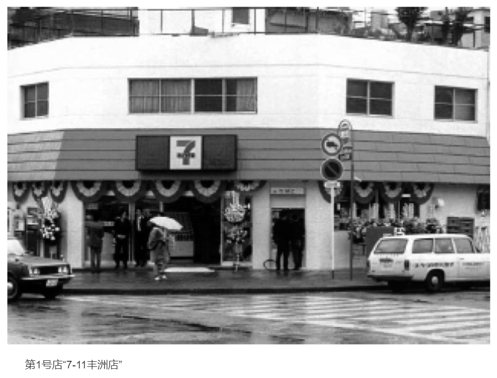

    作者: [日] 铃木敏文
    出版社: 江苏文艺出版社
    出品方: 读客文化
    副标题: 7-Eleven便利店创始人自述
    原作名: 変わる力 セブンーイレブン的思考法
    译者: 顾晓琳
    出版年: 2014-12-1
    页数: 220
    定价: 36
    装帧: 平装
    丛书: 读客商业思想文库
    ISBN: 9787539977645

[豆瓣读书](https://book.douban.com/subject/26270679/)

- [一切从“打破常识”开始](#一切从打破常识开始)
  - [奇妙的际遇](#奇妙的际遇)
  - [轻松的背后是停滞不前](#轻松的背后是停滞不前)
  - [艰难而漫长的谈判之路](#艰难而漫长的谈判之路)
  - [日本首家便利店的诞生](#日本首家便利店的诞生)
  - [密集型选址战略](#密集型选址战略)
  - [“有 7-Eleven 真好！”“全年无休真方便！”](#有-7-eleven-真好全年无休真方便)
  - [物流体制改革：推进商品的共同配送](#物流体制改革推进商品的共同配送)
- [不要受历史经验的牵制](#不要受历史经验的牵制)
  - [7-Eleven 的日均营业额为什么能领先其他连锁便利店？](#7-eleven-的日均营业额为什么能领先其他连锁便利店)
  - [我们要盯住“客户”而不是竞争对手](#我们要盯住客户而不是竞争对手)
  - [各种会议的存在理由](#各种会议的存在理由)
  - [无数次地改变切入口](#无数次地改变切入口)
  - [为了成长，必须积极应对变化](#为了成长必须积极应对变化)
- [大多数人反对的事业往往能够获得成功](#大多数人反对的事业往往能够获得成功)
  - [我的经营思考法则](#我的经营思考法则)
  - [外行即使开了银行也注定失败？](#外行即使开了银行也注定失败)
  - [领导者的必备素质](#领导者的必备素质)
  - [实现“三年内盈利”的目标](#实现三年内盈利的目标)
- [消费者所追求的是品质](#消费者所追求的是品质)
  - [比起“价廉”，“物美”更重要](#比起价廉物美更重要)
  - [自有品牌的诞生](#自有品牌的诞生)
  - [在“必须执行”的喝令下开始的项目](#在必须执行的喝令下开始的项目)
  - [“以团队形式研发产品”的方法](#以团队形式研发产品的方法)
- [消费即是心理战](#消费即是心理战)
  - [产品滞销的原因只有一个](#产品滞销的原因只有一个)
  - [走向“单品管理”](#走向单品管理)
- [经营理应“朝令夕改”](#经营理应朝令夕改)
  - [各种各样的“送货”结构](#各种各样的送货结构)
  - [掌控网络＝掌控现实](#掌控网络掌控现实)
  - [作为“生活基础设施”的新角色](#作为生活基础设施的新角色)
- [“应对变化”是基本原则](#应对变化是基本原则)
  - [理解“现在应该做的事”](#理解现在应该做的事)
  - [超市和百货商场的改革](#超市和百货商场的改革)
- [打破“常识”](#打破常识)

# 一切从“打破常识”开始
## 奇妙的际遇
虽然起初我并不准备加入伊藤洋华堂，但在提到独立项目的时候，总部的人说：“就在我们这里完成这一项目怎么样？”想到可以一边为公司编辑刊物，一边推进项目，我立刻充满了干劲，欣然前往。然而，在我一进入公司后，项目的事情变成了“将来再说”，与当初谈好的条件截然不同。原来，那时公司正处于大型商场的发展期，他们只是想设法招人罢了。而我的流通业人生就在普通职员常挂在嘴边的“本应该不是这样的”状况下展开了。这次跳槽遭到了家人的反对和东贩同事的挽留，但是既然已经做了决定，就算心里多么不甘愿也无法回头。

无论发生什么都要认真对待，这就是工作的真谛。我坚信人生没有无法完成的事，如果一直踏踏实实地做好本职工作，眼前的道路必定会打开。就这样，我立刻调整好了心态，向流通行业迈出了自己的第一步。

## 轻松的背后是停滞不前
我注意到中小零售店经营不善的缘由并不在于大型超市的崛起，而是经营方式已经落后于时代，被顾客所淘汰。

任何行业都是如此。人们总是习惯性地以为市场上的竞争对手越少越对自己有利，但是，一旦没有了竞争对手，事业往往会止步不前。以零售行业为例，如果一家店铺的周围没有任何同业竞争者，那么顾客可能只是由于受到交通上的限制，无奈地进店消费，久而久之，店铺经营者将变得得过且过，产生麻痹懈怠的情绪，失去对产品和服务进行变革创新的动力。

另一方面，当事业发展受阻时，怨天尤人是最轻松便捷的方法，但是轻松的背后即是停滞不前。只有正视自身的弱点，努力做出改善，并不断地向新目标发起挑战，才能脚踏实地地前进，得到稳步的成长。

## 艰难而漫长的谈判之路
美国南方公司提出，首先我方主导便利店事业的公司必须与南方公司合并。其次，店铺的开设位置只能限定在东日本区域，并且8年内要达成2000家连锁店的开发指标。最后，特许权使用费必须占总销售额的1%。

谈判陷入了激烈的争论，但在我方的不懈努力下，对方勉强批准伊藤洋华堂可以以独立子公司的形式运营便利店，开设店面的地理位置放宽至全日本，指标也从原先的8年2000家降为1200家连锁店。但是，就特许权使用费这一问题，双方直到最后仍然僵持不下。南方公司坚持要收取占销售额1%的费用，而我方最多只愿给出0.5%。考虑到日美两地的市场环境和基础建设成本有一定的差距，我坚决不肯做出让步。

结果，对方做出了巨大妥协，同意把费率降至0.6%。

## 日本首家便利店的诞生
11月20日，即签订协议的前十天，15名员工齐聚伊藤洋华堂，成立了专门经营便利店的新公司York Seven（后更名为 7-Eleven  Japan 有限公司）。

经过一番考量，我决定将第1号店直接设定为使用 7-Eleven 招牌的独立经营加盟店。虽然有员工提出，如果最初的几家门店选择以直营的形式运营，显然更有助于我们积累实际操作经验，但是为了表明创建 7-Eleven 的目的在于“实现小型店和大型店的共存共荣”和“激活既有的小型零售店”，我始终坚持了加盟店的意见。

这时，一位家住东京江东区，名叫山本宪司的23岁青年从报纸上阅读到了关于 7-Eleven 的报道，写信告诉我们他有意向加盟，开设日本的第一家便利店。

这位山本宪司先生因为不久前不幸丧父，不得不中断大学学业继承父亲留下的酒坊。虽然经营酒类的店铺受到许可证制度的保护能够确保盈利，但另一方面由于酒类采用法定定价，未来的成长空间非常狭窄。山本本身作为家庭的顶梁柱，既要照顾新婚燕尔的妻子，又要养育年幼的弟妹，正在考虑是否应该继续经营酒坊。在他犹豫不决的时候，恰好从报纸上读到了有关 7-Eleven 这种新型店铺的新闻，便想要抓住机会，放手一搏。

1974年5月15日，日本首家真正意义上的便利店——“7-Eleven 丰洲店”正式开业。在此之前的准备时间只有短短3个月，我们既完成了店铺的改装，又培训山本掌握了便利店运营的知识和技能，在共同度过了匆忙的90多天后，终于迎来了开张的日子。

我至今仍然清晰地记得， 7-Eleven 的第一位消费者是名男性，他买了副标价800日元的墨镜。

## 密集型选址战略
我之所以坚持把 7-Eleven 引入日本，是为了改变中小型零售店因为大型卖场的繁荣而陷入衰退期的现状，创造让两者共存共荣的新型商业模式。因此，我们采取了和传统私人商店截然不同的做法，以全力提高生产效率和产品价值为目标，建立了独一无二的经营结构。

其中之一就是减少采购量的`“小额配送”`。

1号店开业之初，最令人苦恼的问题是怎么也无法减少的大量库存。当时的订货惯例是从批发商处大批量进货，直到货源不够时再进行下一轮采购。这样很容易导致店铺的不良库存越积越多，有碍于营业额的进一步提升。而想要解决这一问题，当务之急就是在每次采购时减少进货量。但是，任何一家批发商都不愿改变固有的做法，甚至指责我们的提议违背常识。然而时代瞬息万变，世事也有各种不同的思考角度，常识并非永远都正确。面对顽固的批发商，我们这些门外汉不屈不挠，一家又一家，一次又一次地反复上门游说着。

而且，由于便利店采取年中无休的经营方式，为了在新年也能为顾客提供新鲜的食品，我们向供应商提出了正月发货的请求，但同样遭到了拒绝。过年期间，生产制造商都会放假，在他们眼里，这或是 7-Eleven 又一个“违背常识”的馊主意。然而，想要一年365天为顾客提供美味食品的理想是我们的原动力，面对挫折我们并没有放弃，而是持之以恒地拜访供应商阐述我们的愿景。终于功夫不负有心人，在创业两年后，山崎面包接受了我们的请求，包括那年的正月假期在内， 7-Eleven 每天都能在货柜上陈列新鲜的面包。此后，米饭和配菜的生产商也逐渐配合我们在正月假期里供货了。由此，山崎面包开启了正月生产的新历史，对零售行业具有划时代的意义。

密集型选址的开店优势有如下三点：

1. 在一定区域内，提高“7-Eleven”的品牌效应，加深消费者对其的认知度。而认知度又与消费者的信任度挂钩，能促进消费的意愿。
2. 当店铺集中在一定范围时，店与店之间的较短的距离能提升物流和配送的效率。不仅是送货的货车，负责向各加盟店传达总部方针并予以指导的店铺经营顾问在各店铺之间的移动时间也随之缩短，他们有更充裕的时间与店主探讨。关于这一点，在下一章将有详细说明。
3. 广告和促销宣传更见成效。店铺如果集中在同一区域，不仅能有效节约物流、人工成本，投放一次促销活动的影响力和覆盖率也变得事半功倍。

## “有 7-Eleven 真好！”“全年无休真方便！”
总门店数破百后，“有 7-Eleven 真好”“全年无休真方便”的广告词大获好评，另外，顾客把当时还有些拗口的“便利店”改称为“深夜超市”，这一风潮也成为了社会的热门话题。有意加盟的私人商店越来越多，其中有许多和山本同为经营酒坊的私人店主，还专程去他店里咨询情况。在日均营业额上， 7-Eleven 比个体店表现出更良好的成长趋势，因此吸引了众多想要仿效山本店长的私人店主。但是在我看来，驱使店主们经营店铺的最大原动力，正如宣传语所说的那样，来自于“有 7-Eleven 真好”这一顾客发自肺腑的心声。

## 物流体制改革：推进商品的共同配送
`共同配送`颠覆了过去以大批量进货为主的业界惯例，与缩减采购单位的“小额配送”同为 7-Eleven 全力推行的物流改革。

简而言之，共同配送是指生产厂家、供应商和 7-Eleven 总部三方通过互相合作，集中原本相对分散的配送路径，从而形成的合理化物流体系。

创业之初，由于生产厂商和一系列的批发商各自为营，每天来1号店送货的货车高达70辆。

牛奶就是一个经典的例子。当时的牛奶有全农、森永、明治等品牌，虽然对消费者而言都属于同类产品，但却必须由不同公司分别发送货品。我发现这种配送方式非常没有效率，因此建议把同一地区同类厂家的产品混装在一起实行共同配送。

然而，零售业门外汉的想法再次遭到了强烈反对。

厂家出于对品牌的自尊心，不愿运送其他竞争对手的产品，并斥责我们的做法不懂得其为建立品牌所付出的心血。这种说辞表明他们依然停留在`卖方市场`时代的思维模式，以为只要把产品放上货架，自然不愁销路。

但我并没有放弃，为了让他们了解市场的真实情况，我做了一个实验。以前，供应商来店里送货时，都会把冰柜里其他竞争对手的产品挪到后面，单独把自家品牌陈列在最显眼的位置，只想让顾客看到自己的产品。

为此，我改变了陈列方式，将各个品牌的产品排成一排，让顾客面对丰富的选项，自主选择。结果这一方式吸引了更多顾客购买，所有产品的销售额都得到了显著提高。这一实验有力证明了卖方市场的做法已经过时，这个时代已经进入了`买方市场`。

最终，各厂商接受了混合送货的提议。1980年，日本流通史上首次实现了牛奶的共同配送。

此后， 7-Eleven 的共同配送体系又获得了飞跃式的成长，主要对产品进行了细分。我们在各个区域设立了共同配送中心，根据产品的不同特性，分成冷冻型（零下20摄氏度），如冰淇淋；微冷型（5摄氏度），如牛奶、生菜等；恒温型，如罐头、饮料等；暖温型（20摄氏度），如面包、饭食等四个温度段进行集约化管理。而这一方式也沿用至今。

“根据温度管理”的想法来自 7-Eleven 注重食品鲜度、崇尚产品品质的经营理念。现在，每家店铺的送货车辆从原先的日均70辆减少至9辆。

# 不要受历史经验的牵制
零售の哲学

1. 做不了基础工作的人也无力发起革新。
2. 只要有发现问题的意识，有效的信息自然就会出现。
3. 不要随口说出数值目标。

## 7-Eleven 的日均营业额为什么能领先其他连锁便利店？
明明各个便利店品牌的店铺位置和规模程度都大同小异，为何还会在营业额上出现明显的差别呢？如果要分析 7-Eleven 独占鳌头的原因，可以用以下三点概括：

1. 始终贯彻密集型选址战略；
2. 具备产品研发与供应的基础体系；
3. 注重与员工的直接沟通。

本章的重点内容是第三点：与员工的直接沟通。

## 我们要盯住“客户”而不是竞争对手
在我们眼中，真正的竞争对手并不是其他品牌的便利店，而是不断变化的“客户需求”。

另外，如果负责制定公司经营路线的管理高层具备坚定信念，就会给公司员工的工作热情带来正面的影响。

特许经营的商业模式，需要加盟店和总部相辅相成，缺一不可。在加盟店独立运营的同时，总部也必须做好后援工作，确保每家门店成功取得盈利。事业开拓的过程中，比起运用出奇制胜的招式，更应优先以稳固企业的基础为重。

管理层的经营思路不仅应及时与总部员工分享，也要保证每个加盟店的店长与店员都能快速而正确地理解，这样企业整体才能稳步向目标迈进。

## 各种会议的存在理由
在东京·四谷的 7-Eleven 总部召开的“区域顾问会议”有别于其他类型，当天会有约2300名负责指导加盟店经营的顾问齐聚一堂。会议目的是直接向店铺经营顾问全员传达总部的经营方针，引导他们更好地成为总部与加盟店之间的沟通桥梁。每次召开区域顾问会议时，我都会出席并发表自己对经营的想法。

行业中，通常会把指导连锁加盟店经营的负责人统称为督导，而并非店铺经营顾问。虽然常有人把两者等同，认为两者同样都由一人负责多个门店，主要工作是和各个加盟店分享总部的信息并支持门店运营。但我却认为店铺经营顾问与督导存在本质上的差别，并且也不在 7-Eleven 设立督导这一职位。

连锁便利店的督导起源于美国，职能是监察各加盟店是否遵循总部的规则运作。然而我们店铺经营顾问的核心职能则是帮助加盟店提升业绩，是加盟店的重要经营顾问。作为 7-Eleven 的独特职位，店铺经营顾问是便利店事业发展道路的重要支柱。

如果协助加盟店经营的第一线人员对公司的理念理解得不够透彻，就不能向各个店长准确地传递总部的方针。因此，我坚持定期召集店铺经营顾问全员，在东京总部举行面对面的交流例会。

诚然，如果只是横向业务的信息共享，那么运用最新的IT技术也未尝不可。但是，在由上至下地传递企业方针时，直接沟通远胜于其他任何方法。以众所周知的“传话游戏”为例，人们在游戏过程中总会无意识地回避负面信息，报喜不报忧。面对讨厌的、负面的内容，人们通常会产生逃避心理，不自觉地曲解信息。如果把我的想法以负责人→经理→店铺经营顾问的路径层层传递下去，最终店铺经营顾问往往不能接收到我真正想要表达的信息。

相反，采用面对面的直接沟通形式，则能在谈话过程中有效掌握听众对信息的理解程度。比如通过对方表情上的犹疑，或是歪头等细微的举止，推测他们是否能够完全理解我所表达的内容，抑或是目前的话题比较枯燥引不起听众的兴趣等等。继而可以根据现场反应随机应变地转换话题，让沟通更加清晰明了。

## 无数次地改变切入口
1. 必须掌控每种产品的销售动向，建立假设并以真实的数据验证，从而提高订货的精准度，贯彻`“单品管理”`；
2. 门店和员工自身都要根据顾客不断变化的需求做出改变。

上述两点是 7-Eleven 成长道路上不可或缺的基石，几乎每次会议，我都会从不同角度切入，不厌其烦地向店铺经营顾问反复强调它们的重要性。

通常情况下，如果重复诉说同一话题，容易引起听众的厌烦情绪，觉得又是老生常谈。当我第三、第四次重复时，也许已有员工产生了类似的想法。即便如此，这几十年来，我仍然坚持以严肃的口吻向公司员工反复强调着同样的主题。看到管理层执著的态度，员工们自然会认识到其中的重要性，将这两点谨记于心。

所谓经营，就是不忘根本，踏实地向前迈进。只有凭借坚忍不拔的实干精神，才能在紧急关头迎接挑战，做出具有独创性的变革。相反，如果连最基础的工作都完成不了，那么对待改革创新更加无从下手。所以，我希望员工不仅要听从上级的指示，更要培养自己的独立思考能力。

## 为了成长，必须积极应对变化
我在公司内部如此重视直接沟通的另一个重要理由，就是希望通过面对面的讨论让公司全员共享“理念”，也可以称作是`“理念的渗透”`。

在我40年间反复强调着同一经营理念的过程中，管理干部的观点自然变得与我一致，并以此为基准指导部下工作。换言之， 7-Eleven 的全体员工都和我持有相同的经营理念，秉承了共同的行为准则和价值观念。

最近，我时常在会长室召集管理干部开会，仔细向他们确认各种细节问题、共享营业的最新信息。类似的问题有：下一季度要推出什么产品？为什么要生产这类产品？这种研发对便利店有什么帮助？

站在他们的立场，或许很不情愿被我逐一盘问，但是如果不能应对上司的提问，就证明其在工作上有所疏漏。如果业务内容属于自己的管辖范围，不论别人提出任何疑问都应该具备迅速作答的能力。我也能借此判断对方是不是一个“用心工作、大有前途的人”。

# 大多数人反对的事业往往能够获得成功
零售の哲学

1. 越看似赚钱的事业越容易饱和。
2. 只要信念坚定，就不会做出错误的判断。
3. 理性上的认识和情感上的接受同等重要。

## 我的经营思考法则
我认为“多数人反对的事业往往能够获得成功”。反之，如果一项事业谁都表示赞同，势必会陷入全面的竞争状态，最后通常以失败或平庸收尾。

在大型超市正处于上升阶段的20世纪60年代后期至70年代，保龄球运动曾经在日本掀起了一番热潮。当时日本的人均可支配收入大幅上升，全民大娱乐的时代背景下，保龄球顺应潮流，发展得如日中天。

虽然众人高举双手赞成，我却坚决地投出了反对票。因为在所有人看来都“能赚钱”“一定能行”的项目，真正参与进去反而不会一帆风顺。

保龄球事业只要有场地和设备就能即刻展开，几乎没有进入壁垒，久而久之，顾客的兴趣度必然大不如前。此外，随着竞争对手的急速膨胀，各个公司将挖空心思地寻求差异化，企图出奇招夺人眼球。然而毫无实质内容的战略并不能长久地吸引顾客。更何况人的内心变化无常，一旦需求被过分满足转眼就会失去兴趣，达到饱和状态。

企业必须依靠自身的智慧建立可持续性发展的事业。

“开拓这项事业太过艰辛”“这种项目肯定没钱赚”等类似的反对理由，全是从自身角度考虑得出的结论。然而，判断一项事业是否具有可行性，更应该从消费者的立场出发，以消费者的视点，深入考察是否“符合需求”。最后，一旦决定开拓某项事业，就一定要坚持到底——这，就是我的经营思考法则。

## 外行即使开了银行也注定失败？
我们所设想的银行和普通银行有两项明显的区别。

1. 顾客使用 7-Eleven 店内的 ATM 、从特定的金融机构账户取款时所缴纳的手续费是主要的收益来源。
2. 是一家不设立融资业务的狭义银行（即专业结算银行）。

日本的银行每个工作日只营业到下午三点，作为金融机构，其给人的印象是衣冠不整的人不可随意进出的地方。不过，银行要是在附近的24小时便利店—— 7-Eleven 中，无论顾客穿戴得如何休闲或居家，都能毫无顾虑地踏入。

然而，外界的批判声却愈演愈烈，像狂风暴雨般朝我们袭来。当时的社会正处于金融恐慌之中，有人毫不留情地说：“银行都快要破产了，零售业在这个时候蹚浑水实在不合理”或是“各大银行的 ATM 数量早已处于饱和状态，通过 ATM 盈利的计划根本是妄想”等等。

而在其中，人们发出的最多质疑声就是“外行即使开了银行也注定失败”。

## 领导者的必备素质
>“ 7-Eleven 有成立银行的决定性原因吗？”

便利店中陈列的产品全是我们经过精心挑选的生活必需品，除了食物和饮料之外，也提供了品种繁多的日用杂货。在货架最下方甚至还摆有红白事专用的纸袋。如果顾客需要参加庆祝仪式可能家里就有事先买的祝仪袋，而参加丧事却不一定会事先有准备了，届时一定会匆忙赶到附近的商店购买白事奠仪袋。我们预计到了这种生活场景，所以选择在店内提供这一产品。

但是，紧急关头光备有纸袋还远远不够，更需要折入其中的现金。十万火急的时候，应该有不少顾客觉得“如果能在店里取到现金，一解燃眉之急就好了”。 7-Eleven 既然是一家为顾客提供生活必需品的便利店，自然也会把现金看成一种“产品”。如此想来，在店内安装 ATM 的决定是必然的趋势。

大多数成员也注意到了这一点。因为存在需求， 7-Eleven 就没有不成立银行的道理。反而只有成立银行才能解决顾客的燃眉之急，真正体现“便利”二字，从而使我们事业前行的航线更加精确。

在引导各种项目推进的时候，每个成员对“项目实现价值”的认知程度是决定成败的关键因素。而作为领导者，重要的一环就是制造“认知”的契机。

## 实现“三年内盈利”的目标
不过在店内安装 ATM 后，额外出现了一个超出我们预期的派生功能——大多数利用 ATM 取钱的顾客，都会顺便在店内消费。而另一个颇有趣味的现象是，即使店内的 ATM 前排起了长龙，也鲜有人投诉。反观银行，当使用者众多，必须排队取款时，很容易让客户陷入烦躁的状态。与之相比， 7-Eleven中琳琅满目的商品转移了顾客的单一关注点，等待的人可以通过购物或阅读杂志消磨无所事事的时间，这也是便利店相较银行的一大优势。再者，银行规定周一至周五的工作时间可免费使用 ATM ，而深夜、周末及节假日则需收取一定的手续费，因而经常会遭到客户“为什么不能一直免费”的质疑声。与此相反，顾客在 7-Eleven 便利店中使用 ATM 时，即使缴纳了相应手续费也从未发起过任何投诉。

这正是因为便利店内设有银行的“新价值”得到了顾客们充分认可的缘故。

之后，我们顺利实现了金融厅规定的“三年内盈利”的目标，成为了网络银行等同期新银行中的一枝独秀，在令外界大跌眼镜的同时，也证明我最初的预想是正确的。

# 消费者所追求的是品质
零售の哲学

1. 不能沉迷于过往的成功经验。
2. 改变卖方市场的思维方式。
3. 主动开拓新市场。

## 比起“价廉”，“物美”更重要
产品种类及服务内容理应随时代而变化，但我们顺应时代创造并持续提供“价值”的根本理念，自创业初始未曾有过动摇。

我从不考虑以价格取胜。这40年间， 7-Eleven 推出了品目繁多的独创产品，在研发产品之际，我也不曾提过降价的要求。

我反复告诉公司员工， 7-Eleven 追求的永远都是“品质”二字。不能给消费者带来价值感的产品无法在市场占有一席之地。虽然让顾客形成冲动性消费的契机数不胜数，例如令人瞠目结舌的低价、突出产品新奇感或打造热门话题等等，但倘若这一切没有建立在“品质”这一重要根基上，则必将失去顾客“二次消费”的机会，让顾客对产品的兴趣消失殆尽。如此一来，事业只会是昙花一现，毫无成长性可言。

## 自有品牌的诞生
“滞销”并不是时代的过错，只说明消费者正在追求新的产品价值。

## 在“必须执行”的喝令下开始的项目
正如我的预期，消费者们一直在等待“高品质的产品”。

7-Premium 一经推出，第一年就实现了800亿日元的销售额，到了2012年业绩更是增长至4900亿日元。而我们也顺势在2010年，研发推出了更高端的系列产品“7-Gold”。

“只要产品的品质精湛，无论在哪里都可以畅销”——这一经营本质终于得到了集团各公司的认可。

## “以团队形式研发产品”的方法
一款新产品的问世，不仅需要得到产品研发负责人的同意，还必须通过包括我在内的所有高层董事试吃，只有所有人都对味道感到满意，才能正式允许对外发售。反之，如果有人觉得口味平平，我们就会扣下新产品回炉重造。

就算每天要生产成千上万个产品，在这一点上我也决不妥协。既然要让顾客掏钱消费，那么生产商就必须在食品的口味上追求极致。如果只是敷衍了事，极有可能丧失“回头客”。

要是发现我们的产品不如广受好评的专门店美味，则必须彻底调查两者的差异之处。虽然有些生产商会借口说味觉是非常主观的感受，每个人的喜好不尽相同，但是，如果把口感独到的食品素材、原料、调料的浓淡等要素数值化，逐一进行分析，那么“美味”也能得到具象。像这样用尽所有方法，经过反复的研究也不能让食品变得可口的话，考虑到企业的口碑倒不如叫停发售计划更为明智。产品研发的理念是最能体现企业经营态度的环节，因此必须严格要求，力争完美。

为了始终如一地贯彻研发标准， 7-Eleven 采用了团队形式进行产品研发。

产品研发成员以 7-Eleven 产品总部的产品研发负责人为核心，加入了各个原料、器材、制造厂商或供应商的负责人，整个团队需要把控从制定产品企划方案到方案具体化的所有环节。因为食品分为米饭、面食、色拉、面包、甜品、饮料等多个品种，所以产品的研发也根据食品类别分门别类地组建了项目团队，每天努力研发新产品。

# 消费即是心理战
零售の哲学

1. 坚持“假设－执行－验证”的流程，一定会有所收获。
2. 明确当前的消费模式并非“多样化”的趋势，而是“统一化”的趋势。
3. 不是“为了顾客”，而是要站在顾客的立场考虑。

## 产品滞销的原因只有一个
造成产品滞销、生意萧条的原因只有一个，**即是现在的工作方法已经无法满足时代和消费者需求的变化**。

为了捕捉变化，我数年来不厌其烦地向员工和加盟店成员强调：工作上应该遵循`“假设→执行→验证”`的步骤。

## 走向“单品管理”
我在引进 POS 系统前，通过店铺经营顾问向所有加盟店的员工彻底灌输了“单品管理”的意识。无论如何灵活地运用 POS 系统，也只有反复实行上文提到的“假设→执行→验证”过程，才有办法提高备货的精确度。

“假设”并不是凭空想象，而是以销售数据为出发点，结合第二天的天气、气温、街市的活动等前瞻性信息，进行客观的分析和思考，提前预判顾客的消费心理，并以此为基础订货。最后再通过当天收银结算的 POS 系统，精确地掌握产品销售的数量和时间，印证和调整自己的假设。然后再继续下一轮的“假设→执行→验证”步骤——“单品管理”即是日复一日地执行上述步骤。

“单品管理”的核心在于主动思考、建立假设，再以实际的经营数据验证假设的流程。

要补充的一点是，在进行单品管理时，也必须关注其他关联产品，这一应用能力非常重要。假设在旅游旺季，门店大量采购了可以随时在户外食用的三明治和面包。这时如果没有同步增加顾客可能会搭配购买的咖啡等饮品的订货数量，那么届时饮料类产品将会很快断货。如此只关注了主食的销售动态，却忽视与之有极大关联的饮料，显然会导致巨大的机会损失。总之，必须时刻铭记“单品管理”是用来应对“消费者未来需求”的方法。

# 经营理应“朝令夕改”
零售の哲学

1. 从“等待型经营”转为“进攻型经营”。
2. 成为有创新能力的推销员。
3. 尝试网络与实体店铺的相互融合。

## 各种各样的“送货”结构
我过去从“上门推销”的方式中获取了灵感，在2000年推出了“Seven Meal”的送餐业务。而在最近，为了消除“购物弱势群体”的不便（“购物弱势群体”是日本特有的社会现象，指的是由于自身原因不能或者不便外出购物的人群。比如，行动不便的老人、新生儿的妈妈等）， 7-Eleven 还发起了属于移动零售方式的“Seven安心送货服务”和使用传统快递方式的“Seven轻松送货服务”。这三种类型的送货方式都是在思考“顾客是否需要这样的服务”“推出这样的服务是否会让顾客满足”的过程中诞生的提案。

没有谁能阻止社会老龄化的进程，不便出门购物或独居的老年人一定会越来越多，所以送餐服务有着巨大的潜在市场。最后，我力排众议，坚持开发了 Seven Meal 的项目。

之所以能做出这一预判，是因为我发现社会中出现了下述三点变化的征兆。

1. 由于社会老龄化和低生育率，老年人的数目正在持续增长；
2. 由两三个人组成的小规模家庭数量呈现出逐年增加的趋势；
3. 个人经营的商店不断减少。

## 掌控网络＝掌控现实
我们曾做过一个实验：选取“Seven 网络购物”上热销的产品陈列于伊藤洋华堂的几间实体店铺，观察会发生怎样的情况。

结果发现，目标货柜上的销售效率竟然比其他货柜高出30%。我们选择的产品是在网络热销的农家调味料和各种加工食品，因为并不是消费者熟悉的主力产品，所以过去从没有尝试在实体店内销售。也就是说，实体店铺无法掌握的顾客需求，却可以通过分析“网络热议话题”和“网络热销情况”这些新型数据入手。

## 作为“生活基础设施”的新角色
2010年， 7-Eleven 各家门店开始运用多功能复印机发行“身份证明复印件”和“印鉴登记证明”。有了地方政府的合作，顾客能在全国任何一家 7-Eleven 打印证明件，是一项十分方便与快捷的服务。在未来我们将与更多的地方政府合作，为顾客带来更多便利。

而在日常的服务项目中，不仅有公共事业费用的代收服务、税金的缴纳服务，根据区域不同，有些门店甚至还设有休息区，顾客可以灵活地利用这块区域，或是买杯 7-Eleven 的现磨咖啡稍事小憩；或是买些小吃便当直接坐在店内用餐——也许未来人们会希望便利店可以提供更大的空间，让更多人聚在一块儿。

不仅是购物， 7-Eleven 的服务项目可谓应有尽有：例如通过 ATM 取款、使用免费的无线网络、复印住民票等。作为居民的生活支援基地，我们在今后也将继续拓展各项便民的服务。

# “应对变化”是基本原则
零售の哲学

1. 经营的本质无论在哪个国家都大同小异。
2. 改革要从全盘否定开始。
3. 妥协即是终结。

## 理解“现在应该做的事”
经营陷入低谷的企业基本具有两个明显的特征。

1. 沉迷于过往一帆风顺的成功经验，永远都不愿做出改变。
2. 一味想要出奇制胜，却目光短浅，只顾眼前利益。

## 超市和百货商场的改革
从2012年起，我们开始致力改变伊藤洋华堂的经营管理体制。“因为被同属一个集团的便利店分走了客源”“因为经济不景气顾客不愿消费”“因为业态不同”等等，这些借口都不能构成业绩不良的理由，经营不善与超市或者百货商场的业态并无任何关联。现在， 7-Eleven 独占集团整体营业利润的70%以上。 7-Eleven 能做到的事，其他的业态为什么不能实现？这才是业绩不良的根源所在。

这里我又要再次强调， 7-Eleven 之所以能保持稳步的成长势头，是因为它能积极应对各种变化的缘故。针对社会和消费者需求的变化，主动挖掘潜在市场，推出相契合的产品和服务，并经过长年累月的坚持才会有今天的成就。

改革的重点在于“增加临时和专职员工”。举例而言，现代社会家庭的平均规模较小，过着单身生活或二人世界的顾客们在想买鱼的时候，点名要了1或2人份的生鱼片拼盘。这时，有剔骨切片技能的专职员工就会当场满足顾客的要求。像这样，伊藤洋华堂凭借店内员工不同的专业能力，不断提高了待客的质量。此外，为了促进员工的工作动力，我们还根据个人技能的水平高低制定薪水制度。各种措施多管齐下，让改革的成效一点点地显露了出来。

总之，我们的目标是把经营方式**从过去的“以产品为本”转变为“以人为本”**。

# 打破“常识”

