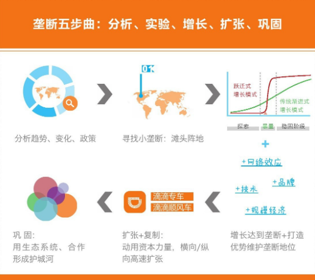

    作者: 李开复 / 汪华 / 傅盛
    出版社: 文化发展出版社
    副标题: 互联网创业下半场机会路线图
    出版年: 2017-5-1
    页数: 176
    定价: CNY 45.00
    装帧: 平装
    ISBN: 9787514216240

[豆瓣链接](https://book.douban.com/subject/27043167/)

- [第一章 互联网创业基本法则：成为细分市场垄断者](#第一章-互联网创业基本法则成为细分市场垄断者)
  - [垄断才是互联网创业的核心](#垄断才是互联网创业的核心)

# 第一章 互联网创业基本法则：成为细分市场垄断者
## 垄断才是互联网创业的核心
互联网领域要垄断怎么做呢？第一，先要找到一个非常细分的领域，成为这个领域的垄断者。亚马逊刚成立的时候，它会研究什么东西最能够卖得出去，因为书能够保存、不容易坏掉，所以它最开始卖书。书卖了一年，第二年它有没有卖别的东西呢？没有。第三年也没有，第四年还没有。为什么呢？因为它还没有拿到垄断地位。创业者在创业时一定要把某样东西真的垄断了，再做下一件事。因为创业的时候，专注是非常重要的。一开始什么都做，最后什么都做不好。

我们从商业史中能学到这几点：第一，如果你的公司成为一个垄断性的公司，它的价值会比其他所有竞争对手加起来都要大无数倍：第二，一定要从非常小的专注点做起，其他的事情不要做；第三，成功者一般会经历图1-8中的五个步骤。

图1-8

