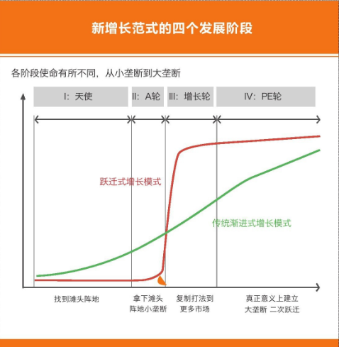
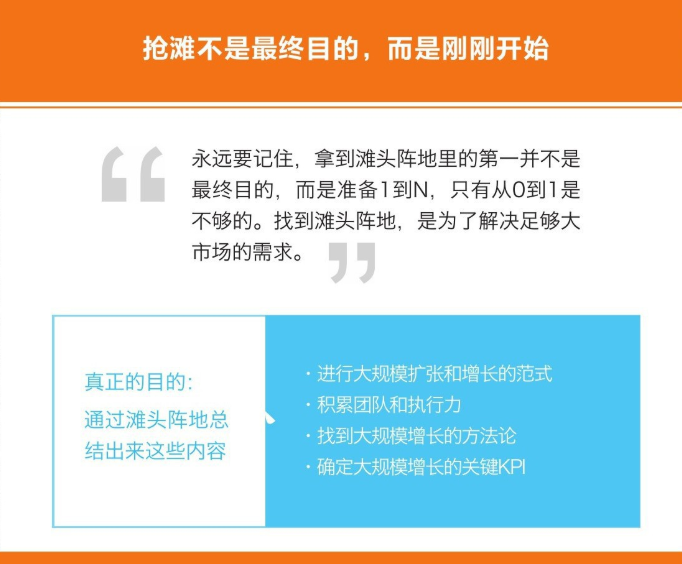
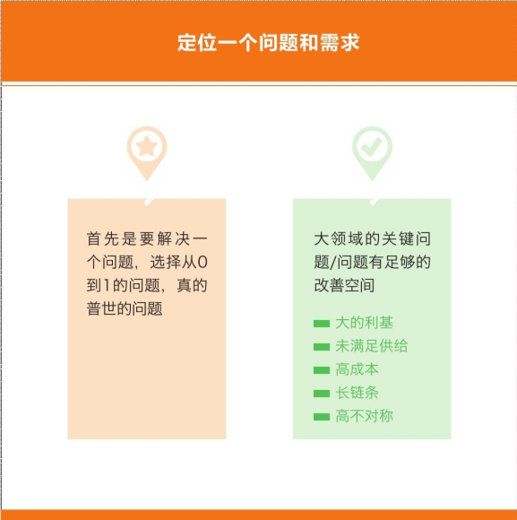

    作者: 李开复 / 汪华 / 傅盛
    出版社: 文化发展出版社
    副标题: 互联网创业下半场机会路线图
    出版年: 2017-5-1
    页数: 176
    定价: CNY 45.00
    装帧: 平装
    ISBN: 9787514216240

[豆瓣链接](https://book.douban.com/subject/27043167/)

- [第一章 互联网创业基本法则：成为细分市场垄断者](#第一章-互联网创业基本法则成为细分市场垄断者)
  - [垄断才是互联网创业的核心](#垄断才是互联网创业的核心)
  - [顶尖人才决定企业成败](#顶尖人才决定企业成败)
- [第二章 创业就是奔着垄断去的](#第二章-创业就是奔着垄断去的)
  - [互联网创业的本质](#互联网创业的本质)
    - [互联网抹平了交易壁垒](#互联网抹平了交易壁垒)
    - [创业要抓住新垄断产生的一瞬间](#创业要抓住新垄断产生的一瞬间)
  - [垄断是获得高市值的唯一方式](#垄断是获得高市值的唯一方式)
    - [持续的高增长就是垄断](#持续的高增长就是垄断)
    - [垄断的六要素](#垄断的六要素)
  - [如何做到“小垄断”](#如何做到小垄断)
    - [颠覆式创新是创业公司的唯一玩法](#颠覆式创新是创业公司的唯一玩法)
    - [选择一个变化足够大的市场进入](#选择一个变化足够大的市场进入)
    - [用小杠杆撬动大资源](#用小杠杆撬动大资源)
    - [垄断细分市场是为了立足更大的市场](#垄断细分市场是为了立足更大的市场)
- [第三章 创业公司到底做什么](#第三章-创业公司到底做什么)
  - [“小垄断”怎样建壁垒](#小垄断怎样建壁垒)
    - [抹平别人制造的壁垒，让别人的子市场没有意义](#抹平别人制造的壁垒让别人的子市场没有意义)
    - [创业公司增长范式的四阶段](#创业公司增长范式的四阶段)
    - [找到能打赢的创业切入点](#找到能打赢的创业切入点)
    - [为什么是你、你的团队能赢](#为什么是你你的团队能赢)
    - [解决大领域里的关键问题，才会有大成就](#解决大领域里的关键问题才会有大成就)
    - [垄断的最大武器是高性价比](#垄断的最大武器是高性价比)
    - [建立应对竞争的复制壁垒](#建立应对竞争的复制壁垒)
  - [作为一个创始人，我们到底该忙什么](#作为一个创始人我们到底该忙什么)
    - [从创业公司本质而言，必须打必胜仗](#从创业公司本质而言必须打必胜仗)
- [第四章 与众不同是最好的经济回报](#第四章-与众不同是最好的经济回报)
  - [与众不同的战略是从0到1的基石](#与众不同的战略是从0到1的基石)
    - [找到更高的维度，降维打击](#找到更高的维度降维打击)
  - [火车头战略三步曲](#火车头战略三步曲)

# 第一章 互联网创业基本法则：成为细分市场垄断者
## 垄断才是互联网创业的核心
互联网领域要垄断怎么做呢？第一，先要找到一个非常细分的领域，成为这个领域的垄断者。亚马逊刚成立的时候，它会研究什么东西最能够卖得出去，因为书能够保存、不容易坏掉，所以它最开始卖书。书卖了一年，第二年它有没有卖别的东西呢？没有。第三年也没有，第四年还没有。为什么呢？因为它还没有拿到垄断地位。创业者在创业时一定要把某样东西真的垄断了，再做下一件事。因为创业的时候，专注是非常重要的。一开始什么都做，最后什么都做不好。

我们从商业史中能学到这几点：第一，如果你的公司成为一个垄断性的公司，它的价值会比其他所有竞争对手加起来都要大无数倍：第二，一定要从非常小的专注点做起，其他的事情不要做；第三，成功者一般会经历图1-8中的五个步骤。

图1-8

## 顶尖人才决定企业成败
>在工业社会中，一个最好的、最有效率的工人或许比一个一般的工人能多生产20%～30%的产品。但是，在信息社会中，一个最好的软件研发人员，能够比一个一般的人员多做出500%甚至1000%的工作。
>
>李开复《我的人才观》

公司长大一点之后，创始人一定要知道10%的核心员工是谁，这些人一个也不能流失。

创始人至少要对核心团队——工程师团队、产品团队等负责，抱着只招一流人才的信念。如果有员工离职了，一定要善待他们，一是他们有一天可能再回来，二是影响到你的公司的外部形象。

我自己做了很多年管理，用一句话总结就是：“你想怎样被管理，就怎样去管理人。”对于人才，幂定律非常重要，但还有一个定律更重要，那就是你要爱你的员工。

# 第二章 创业就是奔着垄断去的
## 互联网创业的本质
### 互联网抹平了交易壁垒
我在美国的一些同学经常对我说：“我要改造传统行业，它们太传统了，那些人没我聪明。”还有的人说：“我非常勤奋，执行力非常好，每天工作12甚至16个小时，而大公司朝九晚五才8个小时，我要从执行时间上干掉它们。”

实话实说，这些执行力和努力是必需的，如果不拼命你肯定不能赢，聪明也是必需的。但是，这些不是必要的手段，没这些精神不能赢，但只有这些，十有八九也赢不了。

在我看来，大部分创业公司能获得成功，能在短期内干掉原有的行业或者干掉原有的大公司，**本质上是因为市场产生巨大变化**。即使赢了，凭的也不是你的真实能力。打败巨人的是市场环境，是巨人在世界变化趋势下自己衰落而败。

**互联网的本质就是连接和信息交换。连接和信息交换就是把各种各样的市场或者交易变平，原来是一个分散的市场，可能被地域或被其他因素分割，有了互联网，这些分散的市场就被连接成一个大一统的市场。有了互联网之后，信息对称了，交易壁垒降低，交易成本降低，广义的产品信息更容易到达用户，产品更容易被发现，交易的匹配速度自然变快了**。

有了互联网之后，还有一个好处，就是可以统一市场和消费者的思想，减少消费者对市场的选择。这个有点反直觉，因为我们总觉得互联网是给每个人更多的选择，而不是更少的选择，但实际上不是这样。比如有了互联网，信息充分沟通之后，全世界人民用的手机就只剩下苹果、三星等少数几种了。再比如，每个地方可能都有当地类似快餐的食物，全世界加起来可能有几十万种，但是以前每个人被自己的地域所限制，能看到的只有十几种。互联网连接之后，每个人能看到的快餐食品有几百种，但全世界也就只剩下这几百种食品了。

互联网让交易摩擦消失了，能快速放大我的各种优势。当互联网把一个市场变成了完全无摩擦的交易市场后，你只要想办法建立一个相对来说比较强的优势，就有可能在极短的时间内把市面上同类的竞争对手全部扫空。这一点在以前是不可能实现的。

### 创业要抓住新垄断产生的一瞬间
本质上来说，所谓的“互联网+”或者利用互联网创业，其实就是抓住新的垄断产生的那一瞬间的机会。

诺基亚以前建立的壁垒与其说是品质，不如说是它建立的垂直供应链，还有就是它的生态系统“塞班”。诺基亚失败的最根本原因是用户需求迁移，因为在诺基亚时代用户的需求真的是打电话，而到了今天，整个平台和技术或者用户需求已经迁移到为了上网而使用手机，这是根本性的变化。

诺基亚所有的优势都被陆续消减，比如诺基亚花那么多年才打造出品牌，而通过社交网络，小米在一年之内建立了巨大的知名度和品牌；诺基亚的销售渠道直接被电子商务给消减了；诺基亚的垂直供应链早就被类似于富士康这样的代工产业链消解了；此外，谷歌的安卓直接给小米铺了最好的路。如果旧堤坝没有被抹平，雷军再强，他能把小米做出来吗？我认为这是互联网创业的本质。

## 垄断是获得高市值的唯一方式
### 持续的高增长就是垄断
互联网的交易无摩擦性使市场规模可以做到极大的增长，互联网还能把分散的小市场统一成一个大市场，把市场变平、变大可以造成更大的垄断。

其实说到根子上，互联网唯一的商业模式本质上就是增长和垄断。在互联网时代，一家公司虽然现在在挣钱，但只要不是通向垄断之路，现在挣的钱可以随时被别人抹平。而一家公司只要走在通向垄断的必经之路上，哪怕现在不挣钱，将来却一定可以挣到钱。

### 垄断的六要素

市场份额大有时候并不能真正确定你的垄断地位。判断你是不是真的垄断了，还有一个要素，就是你是不是可以为所欲为，是不是能狠狠地收钱。如果你占了很大的市场份额，但是你不敢为所欲为，不敢收钱，因为你一为所欲为、一收钱，你的份额就没了，或者你害怕你的份额没了，这不叫垄断，这只是看起来大的市场份额而已。

## 如何做到“小垄断”
### 颠覆式创新是创业公司的唯一玩法
电子邮箱不能垄断最大的原因是，它的产品形态有问题。电子邮箱产生于互联网早期，所以它的产品形态和协议是任何人都可以建立自己的电子邮箱服务器，并且任何人建立的电子邮箱服务器都可以相互通信。这个产品形态和产品机制本身导致电子邮箱是没法被垄断的。但是这不代表电子邮箱对应的通信及潜在分享需求不可以被垄断。其实现在电子邮箱已经衰落了，以前电子邮箱承载的功能都被微信、Facebook等接管了，只剩下注册账号和接收垃圾邮件的功能。

如果在一个领域你发现做不到垄断，千万不要因此放弃这个市场，或者认为这个市场的垄断是不可能的。因为垄断本身是针对需求，而不是产品形态。这对你来说反而是一个机会：在一个巨大的市场里，现有的产品没法垄断，就看你能不能把需求切割，创造一个能垄断市场的产品出来。

### 选择一个变化足够大的市场进入
我觉得早期的创业首先要选择大市场，但是光选择大市场是没用的，因为天下有很多大的市场，很多大市场已经存在了上百年，或者广义来说大的领域、大的需求都已经存在上百年。别认为所有人都是傻的，一个东西存在几十年或者几百年，你不可能在一天之内突然发现把所有竞争者都打败的方法。

创业者能成功的唯一原因就是“变化”，这个变化是最近才发生的，将来会变得很大。你虽然不是唯一一个，但你是第一批去参与这个变化的人。不是以前的人没想到，而是这个事儿刚发生没多久。所以你要选择一个大市场，更重要的是你要选择变化，一个有足够大变化的市场。

其实市场可以有很多种变化，国家出了一个新政策是变化，突然出了一个行业并购也是变化，什么样的变化才是够格的？我们需要的是什么样的变化？我们实际需要的是，潜在能把市场变平的变化，潜在能抹掉原来市场交易壁垒的变化，本质上我们是在等这种变化。

### 用小杠杆撬动大资源
还有一点特别重要，你必须要有杠杆。即使一个大的市场发生了变化，你还可以去泼水、去漫延。但就算你拿到了A轮、B轮、C轮的融资，依然只有那么点儿钱。前文我提到，在暴涨阶段要达到周对周有50%的增长，怎么才能真正做到？本质上来说，必须要有杠杆。社交网络是小米做品牌的杠杆，富士康是小米在供应商领域的杠杆。你相当于是用自己一点点的钱和资源撬动别人很多倍的流量、用户、钱和资源投入。

所以，每个时代都有每个时代的杠杆，你抓到一些变化和机会之后，还必须要在当前所在的行业中，发现有什么样的杠杆可以借用、放大。

比如微信时代成就了很多公司，像最早期的微电商、微信电影票等。其实，这种公司如果不是利用新的渠道、新的平台，很难在较短时间内发展得这么快，达到这么大的规模。当年搜索引擎的流量则成就了最早的汽车之家这样的公司，包括58同城，都是依托搜索引擎流量作为杠杆的。

在硬件方面，贝斯耳机除了构造品牌以外，本质是赶上了苹果附件市场疯狂增长的人口红利。而今日头条等开发安卓应用的公司，实际上是借助了安卓市场在发展早期，也就是用户应用稀缺时期应用下载增长的人口红利。

2000年年初曾经兴起一大波的消费品牌，它们当时利用的杠杆其实是电视媒体和商超渠道。当时，中国的传统零售行业正逢蓬勃发展的时机，比如连锁型超市、大型的卖场；电视媒体也刚刚获得影响力。当时有特别多竞拍央视标王的公司，虽然看起来很愚蠢，但实际上它们是最聪明的，它们利用了当时时代最大的“媒体杠杆”。

### 垄断细分市场是为了立足更大的市场

做细分市场不是根本目的，只是为了将来做更大市场采取的手段。创业者一定要仔细考虑：你的细分市场连接的更大市场是什么，你的细分市场将来有没有可能变化，连接的大市场将来有没有可能变平。

# 第三章 创业公司到底做什么
## “小垄断”怎样建壁垒
### 抹平别人制造的壁垒，让别人的子市场没有意义
要定义一个小市场，就用比较低的壁垒。就像往都是小坑的沙地里面灌水，如果水位灌得比较低，会形成很多的小水坑，每个小水坑就是一个子市场，这是由这个市场的天然壁垒形成的。水位再高一点的话，水坑的数目就会减少。

水位的高低，或者水坑的数量，会跟着世界的变迁随时变化。比如易到用车最初是做高端商务出行的，或者说是做机场接送用车这个子市场的，它可以做得很好，自成一体。但是到了某个阶段，它的小壁垒轻易地就被做出租车的滴滴、快的给抹平了，这个子市场的定义就没有意义了。而抹平别人制造的壁垒，让别人的子市场没有意义，也正是我们自己的机会。

### 创业公司增长范式的四阶段
在天使轮、A轮包括小A轮的时候，创业者做事的本质就是寻找滩头阵地，不是做增长，不是做数据，而是找到自己的第一个范式。你要想明白要做的第一个大市场是什么，这个大市场有什么子市场，有什么垂直市场切分，你能用什么样的打法来切入，这个打法比现有的竞争对手和已有的方略是不是好五倍。第一阶段就用来干这个事，甚至从理论上来讲，第一阶段的具体数字和其他东西都不重要，找到那个切入点最重要。如果找不到那个切入点，所有事情推倒重做都没关系。

找到早期的滩头阵地和第一个要打的子市场之后，A轮的公司要拿下第一个市场，比如滴滴拿下北京市场。拿下第一个市场本身不是目的，而是在A轮阶段磨合出一套打法，准备好接下来的战斗资源，调整好公司的节奏，然后准备复制找到的范式。

增长轮是你的公司已经调整好了增长范式，找到了明确的KPI，接下来只要投钱去做就可以把已有成果按照指数级别——至少也是线性级别扩张出去。此时你就开始融大量的钱，把增长范式复制出去。

在增长轮，你的公司必须在最短的时间内调动资源，把这个范式能占到的市场空间全部占满，不给后来者和竞争对手留下任何空间。这是你能够暴涨而且必须暴涨的阶段。

PE轮开始考虑建立壁垒，掌握建立垄断的要素——我在前文介绍过的垄断的六大要素。

### 找到能打赢的创业切入点
抢滩登陆本质上是为了找到用户真正的需求，并且去印证我们找到的打法能不能满足这个需求，同时累积团队的执行力，找到可以大规模复制的方法论，确定我们将来要进行大规模复制和增长的时候，核心的KPI是什么。所以找到切入点本身不是目的，只是手段。

找到切入点，还有一个最基本的原则：找我们能赢的点。说白了就是在一个巨大的市场或者领域里找到一块暂时的蓝海，一个我们用手头资源、手头团队能够打赢的地盘，千万不要找一个自己打不赢的滩头阵地。

所以本质上来说，我们抢滩头阵地的第一个目的是找那个切入点，第二个目的是在这个切入点上磨炼、磨合，为将来打真正的硬仗和竞争做准备。

### 为什么是你、你的团队能赢
广义地说，找滩头阵地时考虑的要素只有几个：首先，定位一个市场需求或者一个问题；其次，找到一个与以前解决这个问题的方法完全不同的新打法，有优势的新打法；再次，选择一个子市场、子云层，或者子客户群；最后做起来。

我们要思考两点。第一，你要能够成为第一批发现这个事情的人。如果你对这个领域，或者某个打法并不是特别熟悉，凭什么你比别人早发现变化或需求？第二，如果你或你的团队并不是很擅长某个打法，或者很熟悉某个用户群、某个市场，凭什么你在后面的执行中能赢？考虑到这些框架条件，你最终要从团队的特点出发。

### 解决大领域里的关键问题，才会有大成就

一般情况下，你想去解决的需求最好是大领域里面的关键问题。在一个大的领域里肯定有非常多的需求需要被解决，但有的需求重要，有的需求不重要。比如我想帮仓库物流行业减少仓库管理员，从而降低成本，但仓库管理员在整个仓库管理总成本里占比还不到5%，那我解决的就不是关键性问题。

你要解决的需求最好是这样的：一、它原本就有非常大的问题、非常大的劣迹；二、这个需求有非常大的供给没有被满足；三、它本来有非常高的成本，有非常高的链条，或者有非常高的不对称性。

举个例子，现在的团购还是能够解决市场需求的问题，但它解决的问题是利益链条比较薄弱的环节，价值就比较小。团购本质上只是解决了部分新开张企业早期揽客的问题，而且在大部分情况下，它只是提高了一些用户的复购率，甚至还把已有用户的原价订单替换成了折价订单。所以，在美国团购市场脱颖而出的Groupon就只值40亿美元。

在中国，团购烧了那么多钱，基本上全军覆没。美团虽然是一家非常有价值的公司，但它现在的成就跟起家时的原始团队没有太大的关系，它的成就一是来自于酒店零售，二是来自电影票、外卖。

Uber有那么高的市值，它在欧美的分公司一年已经有上亿美元的利润，因为它向这个市场提供了大量全新的供给。Uber解决问题的核心程度远比团购大很多。

什么叫解决普适性的问题？就是当你在垂直市场里把需求问题解决得很好之后，可以去辐射更大的人群。火星文输入法根本性的问题是，它把当下的需求解决完了之后，突然发现再往外走，别的市场没有这个需求。但美图秀秀就没有这个问题，因为它是图片，所有的人都有图片需求，虽然一开始美图秀秀是从服务爱自拍的女生起家的。

或者换一个角度，麦当劳最早是从服务蓝领起家的，它本质上解决的问题是提供便宜、卫生、快速的食物。如果牵扯到更大的层面，辐射到白领或者其他人群，“便宜、卫生、快速”这三点一样有价值。但如果麦当劳在一开始堆叠很多其他的东西，比如为了更好地吸引蓝领，招几个漂亮、身材好的服务员，放几台老虎机，蓝领会更开心，但是扩大用户群体就没希望了。所以我们一开始要致力于解决普适性需求，哪怕是从小市场做起。

解决普适性的问题是个重要标准，此外，我们要试图解决“从0到1”的问题，而不是“从1到1.2”的问题。

很多创业者容易犯一个错误，就是乔布斯陷阱。创业者总觉得自己要做一个特别完美的产品，并且不断堆叠技术，让它变得越来越好。但是，改善性需求的市场爆发力不大。雅虎曾经在一段时期里搜索质量比谷歌还要好20%，但是却对谷歌的市场份额没有那么大的影响。如果你想翻牌，只是比别人好一点是没有用的。要么这个事原来是0，我做出了1；要么我比原来好五倍、十倍，百分之二三十的改进型需求不足以颠覆一个市场。

比如在代驾领域，上海有一家安师傅，最早实现了类似出租车计表的规范服务，最早实现了变化。可是，对一个从来没用过代驾服务的用户来说，能用上代驾服务就很爽了，安师傅或者e代驾的那点儿区别对他影响不大。但是e代驾很快就可以扩张完，扩张完之后，安师傅做到的标准它也做到了。中国有一句俗话，叫“先圈地再优化”，就是这个道理。

要范式简单、避免多边市场、避免跳板思维，总结下来就是一句话，避免变数和复杂性。创业公司要解决的问题，不要有太多的因素掌握在别人手里，以致不能通过自己的运营和努力改变。即使是一个双边市场，比如做美甲用户，我哪怕先雇美甲师，把提供服务的这一边搞定，再去解决用户问题。但是多边市场，就完全没法做。

很多创业者喜欢用生态系统的思维做事。可是，一个创业公司为什么要去推二维码呢？你又不是腾讯，腾讯有微信，可以把二维码推起来。创业公司想做一个局，让所有人都进来，这是绝对不可能的。

从A到B的思维方式也一样不可取，但这样做事的创业者就更多了。从A到B的思维方式就是，我真正想做的事情是B, B的事情才有价值；但是为了把B做起来，我先做A, A做到一定的程度就可以给B导流量之类的。就好像要做社区，我先做工具，把工具做完了再给社区导流量，流量导完了之后再有电商，而我真正想做的是电商。每个创业者都仔细想想自己的运营，或多或少都存在这个问题，太绕了。

举一个例子，前几年有很多人做餐饮CRM软件，或者后方管理软件，他们的美好想法是先把几万个餐厅铺开，然后再把餐厅的客户挖上来，然后可以做外卖送餐。可是那几万个餐厅还没铺下来，饿了么就已经把他们想做的事情做完了。

所以，你如果有跳板思维，就要把跳板去掉。你如果想先做A再做B，要么把B忘掉，想想只把A做强了是不是已经保证这是一个好公司；要么想想有没有直接做成B的方法。你想先做CRM再做餐厅外卖，是因为你没有找到直接做餐厅外卖的好方法，就算你做了A，也不大可能转换到B，因为你根本没有找到好的办法。

比如，你做了租房中介企业的CRM软件，但是如果你没有找到激励经纪人、让经纪人进行交易的有效方法，你根本不能把CRM软件的优势转化成二手房交易。当你真正找到那个方法之后，你也不需要之前的铺垫，直接开干就可以了。

### 垄断的最大武器是高性价比
判断是不是找到了一个新的、有效的打法，可以直接从结果来看。

第一个判断标准是，跟原来的打法比，你的新打法是不是有绝对的破坏性。最大的破坏性体现在成本极大降低，就是所谓的性价比，它是最有威力的一点。

有两点需要注意。首先，这个成本是广义的，如果是一个具体的商品，用户花钱减少是提高了性价比；也有可能是原来获得服务的代价高，现在代价极大地降低。

其次，成本极大降低不代表绝对的低价。在我看来，苹果的产品很便宜。你可以去市面上找到和MacBook Air在设计、薄厚、重量、配置、硬盘速度上一样的Windows电脑，但任何一款都比MacBook Air贵很多，甚至某项地方还不如MacBook Air。

低性价比有可能是把价格压得绝对低，也有可能是把原来奢侈的东西拉到正常的价格，或者用其他的方式实现。

低性价比或者说便宜，必须是你的新方法和商业模式自带的。苹果的便宜来自它的规模效应，它是唯一以千万台的销量在卖的奢侈品。Uber的便宜来自它直接省了牌照费，在旧金山，一台出租车可是要100万美元的牌照费。最早在二三线城市甩货的平台唯品会，现在已经不是这个原理了，但最早它的确是在卖尾货。Airbnb更不用说了，它直接的成本结构跟连锁酒店都不一样。所以，你降低成本的方式必须来自新方法，或者是从提高效率、从资产配置、从资金等其他方面实现的，而不是由补贴带来的。

第二个判断新打法是否成立的标准是，能不能扩大惠及范围。以前因为市场的区隔、壁垒等原因，有些服务并不能到达很多的用户，你的新打法可不可以惠及更多用户。

第三个标准是，极大地提升供给。尤其是在O2O领域，非常有利的事情就两件，第一件是从原理上极大地降低价格，第二件是破坏性地提供供给。最有代表性的是Airbnb和Uber这两家公司，它们取胜的根本原因并不是因为降低了价格，就算Uber和Airbnb没有降低价格，它们也会因为大幅度提升供给而很厉害。

杭州整个城市总共才有3万辆出租车，但Uber专车现在已经有6万辆了。而且这个供给是波动的，并不是24小时，只需要在高峰期出现，随时可以消失，这样就能够以非常低的成本维持极大的供给。出租车的价格问题只是一方面，更多的情况下都是供给问题。

而Airbnb极大地提升了城市旅游景点和核心范围内的旅馆供给量，由于各种各样的原因，那些区域很难修建新的旅馆，就算价格成本能承担，但各种各样的实际限制也导致无法实现这个供给。但Airbnb用新的方式创造了一批全新的供给。

### 建立应对竞争的复制壁垒
微创新这个方法是靠谱的，但这是大公司可以干的事儿，是360、腾讯可以干的事儿。别人已经做出来的东西，我比它好一点，然后通过压倒性的资源优势把它给干掉。如果是创业公司做了微创新，反而要被原来那家公司给干掉。

这种例子太多了，微信在早期还没有丰富的表情，有创业者想去做一个有更丰富表情和更多贴图的聊天软件，但是细想一下，这是微信分分钟就可以干掉的事儿。

微博特别热门的时候，有很多创业者想去做一个垂直领域的微博。如果你想要做垂直领域XXX的时候，仔细想一下，这是真的能建立区隔，还是只是被别人轻轻松松干掉的一件事？

还有一个创业早期的误区，即所谓的快速迭代。小步快跑和快速迭代绝对是正确的一件事，但这是有前提限制条件的。快鱼吃慢鱼，快的真正含义是什么？不是说别人工作8个小时，你工作12个小时，所以你比别人快50%。快鱼吃慢鱼真正的含义是，你选择的打法从根子里就比别人快五倍。Airbnb新开一个旅馆，只要几天的时间，七天连锁酒店新开一个旅馆可能要半年，七天连锁酒店的员工就算一天工作85个小时，也赶不上Airbnb的速度。

还有很多的陷阱，包括所谓的用户创新、数据驱动陷阱。拼命地去市场上收集信息，拼命地去了解市场反馈，然后根据所谓的用户反馈来确定方向，这也是一个巨大的陷阱。这个做法在你找到正确的方向之后，在快速改进的时候是有用的。但是在你还没有确定方向的时候，这个做法是没有意义的。确定一个方向要靠你对整个市场和用户的理解，去找出真正的点。

还有很多的错误，比如说沉迷于低质量的增长，以及沉迷于堆叠式的增长。什么叫堆叠式的增长？这也来自精益创业的方法。我开一个餐馆，将来想做成麦当劳，为了让这个餐馆日营业额上升很多，只提供中餐已经不够了，我还提供早餐，然后发现还不够，就再增加菜品，川菜、粤菜甚至增加儿童乐园。确实，你的每一步迭代都能让你的销售额获得一定的增长，但是这些增长本质上说没有任何意义。

创业还特别容易陷入另外一个误区，就是给自己定没有意义的指标。我们经常听到某某做到了日活10万，然后融到了A轮。于是在潜意识里也给自己定了个1万日活的目标，觉得达到这个目标就可以融A轮。但是，在基数很小的早期，增长很容易获得。随便做做推广，就很容易达到早期看上去很亮眼的数据。这些数字是不是具有可持续性？不一定。比如你在早期利用搜索引擎获得了500个用户，看上去增长很快，但是搜索引擎最多只能导入1000个流量，拿到这1000个就没有新用户了，根本没有找到正确的方法或者那个点。

## 作为一个创始人，我们到底该忙什么
### 从创业公司本质而言，必须打必胜仗
1. 战略
   1. 应该定期反思：大环境里的市场空间如何？自己到底如何走？创业本质是一个独立思考的过程，而且是绝对独立。
2. 资源整合
   1. 人、财务、业务，创业者要知道自己需要什么，到哪里去找这些资源，打法从哪里收集。比如雷军做小米找盟友、找合作资源，他非常清楚去哪里找，并且知道怎么找回来。
3. 执行
   1. 身为创业者应该和团队同甘共苦，从精神的角度而言，这是很有必要的。但千万不要缺哪里自己补哪里，没有快递员自己就当快递员。同甘共苦不是让创业者自己去打杂，而是要找到自己的方法论。

# 第四章 与众不同是最好的经济回报
## 与众不同的战略是从0到1的基石
### 找到更高的维度，降维打击
小米手机怎么会赢，或者说基本上会赢呢？雷军在做小米手机之前就想清楚了。对传统手机厂商来说，渠道销量占总销量的80%、90%，手机厂商不可能把自己的渠道摧毁掉。即使传统手机厂商的渠道必须加价50%才卖你的产品，手机商城也得答应。如果不加这50%渠道就崩盘了，一年几十亿的销售额，你会让渠道崩盘吗？不可能，唯一能摧毁渠道的只有互联网公司。可当时互联网巨头BAT没法做手机，它们不能拿出几百人投入到这个项目里。传统手机厂商不可能毁掉渠道、BAT不可能做手机，而传统渠道手机的毛利达到50%，为什么手机不能像PC一样毛利只占百分之几呢？这几件事一想通，再加上小米的团队很强，就成就了小米手机。

## 火车头战略三步曲
定战略第一步是寻找方向，也叫预测，第二步是找到关键的破局点，第三步就是all in，把资源围绕着它展开。