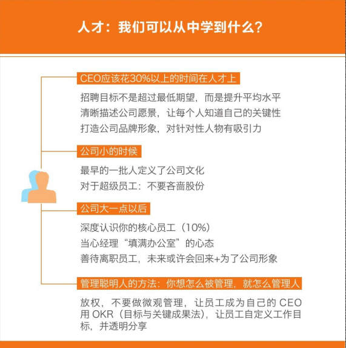
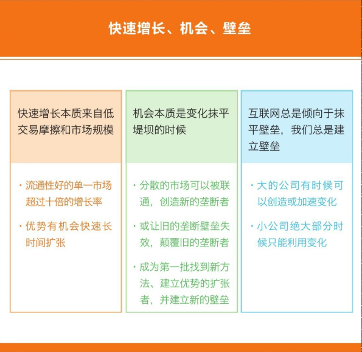
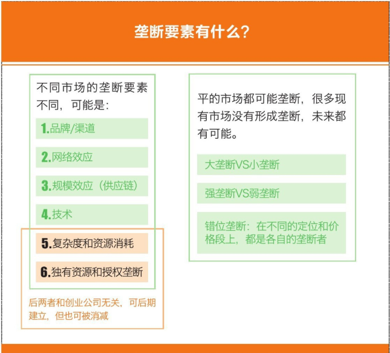
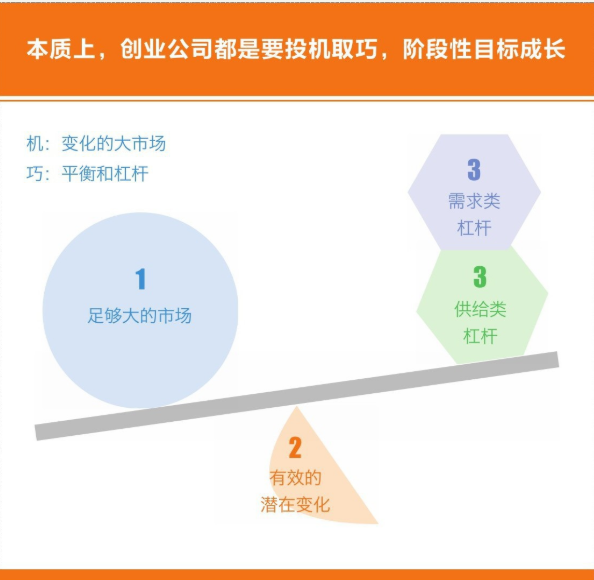

    作者: 李开复 / 汪华 / 傅盛
    出版社: 文化发展出版社
    副标题: 互联网创业下半场机会路线图
    出版年: 2017-5-1
    页数: 176
    定价: CNY 45.00
    装帧: 平装
    ISBN: 9787514216240

[豆瓣链接](https://book.douban.com/subject/27043167/)

- [第一章 互联网创业基本法则：成为细分市场垄断者](#第一章-互联网创业基本法则成为细分市场垄断者)
  - [垄断才是互联网创业的核心](#垄断才是互联网创业的核心)
  - [顶尖人才决定企业成败](#顶尖人才决定企业成败)
- [第二章 创业就是奔着垄断去的](#第二章-创业就是奔着垄断去的)
  - [互联网创业的本质](#互联网创业的本质)
    - [互联网抹平了交易壁垒](#互联网抹平了交易壁垒)
    - [创业要抓住新垄断产生的一瞬间](#创业要抓住新垄断产生的一瞬间)
  - [垄断是获得高市值的唯一方式](#垄断是获得高市值的唯一方式)
    - [持续的高增长就是垄断](#持续的高增长就是垄断)
    - [垄断的六要素](#垄断的六要素)
  - [如何做到“小垄断”](#如何做到小垄断)
    - [颠覆式创新是创业公司的唯一玩法](#颠覆式创新是创业公司的唯一玩法)
    - [选择一个变化足够大的市场进入](#选择一个变化足够大的市场进入)
    - [用小杠杆撬动大资源](#用小杠杆撬动大资源)

# 第一章 互联网创业基本法则：成为细分市场垄断者
## 垄断才是互联网创业的核心
互联网领域要垄断怎么做呢？第一，先要找到一个非常细分的领域，成为这个领域的垄断者。亚马逊刚成立的时候，它会研究什么东西最能够卖得出去，因为书能够保存、不容易坏掉，所以它最开始卖书。书卖了一年，第二年它有没有卖别的东西呢？没有。第三年也没有，第四年还没有。为什么呢？因为它还没有拿到垄断地位。创业者在创业时一定要把某样东西真的垄断了，再做下一件事。因为创业的时候，专注是非常重要的。一开始什么都做，最后什么都做不好。

我们从商业史中能学到这几点：第一，如果你的公司成为一个垄断性的公司，它的价值会比其他所有竞争对手加起来都要大无数倍：第二，一定要从非常小的专注点做起，其他的事情不要做；第三，成功者一般会经历图1-8中的五个步骤。

图1-8

## 顶尖人才决定企业成败
>在工业社会中，一个最好的、最有效率的工人或许比一个一般的工人能多生产20%～30%的产品。但是，在信息社会中，一个最好的软件研发人员，能够比一个一般的人员多做出500%甚至1000%的工作。
>
>李开复《我的人才观》

公司长大一点之后，创始人一定要知道10%的核心员工是谁，这些人一个也不能流失。

创始人至少要对核心团队——工程师团队、产品团队等负责，抱着只招一流人才的信念。如果有员工离职了，一定要善待他们，一是他们有一天可能再回来，二是影响到你的公司的外部形象。

我自己做了很多年管理，用一句话总结就是：“你想怎样被管理，就怎样去管理人。”对于人才，幂定律非常重要，但还有一个定律更重要，那就是你要爱你的员工。

# 第二章 创业就是奔着垄断去的
## 互联网创业的本质
### 互联网抹平了交易壁垒
我在美国的一些同学经常对我说：“我要改造传统行业，它们太传统了，那些人没我聪明。”还有的人说：“我非常勤奋，执行力非常好，每天工作12甚至16个小时，而大公司朝九晚五才8个小时，我要从执行时间上干掉它们。”

实话实说，这些执行力和努力是必需的，如果不拼命你肯定不能赢，聪明也是必需的。但是，这些不是必要的手段，没这些精神不能赢，但只有这些，十有八九也赢不了。

在我看来，大部分创业公司能获得成功，能在短期内干掉原有的行业或者干掉原有的大公司，本质上是因为市场产生巨大变化。即使赢了，凭的也不是你的真实能力。打败巨人的是市场环境，是巨人在世界变化趋势下自己衰落而败。

互联网的本质就是连接和信息交换。连接和信息交换就是把各种各样的市场或者交易变平，原来是一个分散的市场，可能被地域或被其他因素分割，有了互联网，这些分散的市场就被连接成一个大一统的市场。有了互联网之后，信息对称了，交易壁垒降低，交易成本降低，广义的产品信息更容易到达用户，产品更容易被发现，交易的匹配速度自然变快了。

有了互联网之后，还有一个好处，就是可以统一市场和消费者的思想，减少消费者对市场的选择。这个有点反直觉，因为我们总觉得互联网是给每个人更多的选择，而不是更少的选择，但实际上不是这样。比如有了互联网，信息充分沟通之后，全世界人民用的手机就只剩下苹果、三星等少数几种了。再比如，每个地方可能都有当地类似快餐的食物，全世界加起来可能有几十万种，但是以前每个人被自己的地域所限制，能看到的只有十几种。互联网连接之后，每个人能看到的快餐食品有几百种，但全世界也就只剩下这几百种食品了。

互联网让交易摩擦消失了，能快速放大我的各种优势。当互联网把一个市场变成了完全无摩擦的交易市场后，你只要想办法建立一个相对来说比较强的优势，就有可能在极短的时间内把市面上同类的竞争对手全部扫空。这一点在以前是不可能实现的。

### 创业要抓住新垄断产生的一瞬间
本质上来说，所谓的“互联网+”或者利用互联网创业，其实就是抓住新的垄断产生的那一瞬间的机会。

诺基亚以前建立的壁垒与其说是品质，不如说是它建立的垂直供应链，还有就是它的生态系统“塞班”。诺基亚失败的最根本原因是用户需求迁移，因为在诺基亚时代用户的需求真的是打电话，而到了今天，整个平台和技术或者用户需求已经迁移到为了上网而使用手机，这是根本性的变化。

诺基亚所有的优势都被陆续消减，比如诺基亚花那么多年才打造出品牌，而通过社交网络，小米在一年之内建立了巨大的知名度和品牌；诺基亚的销售渠道直接被电子商务给消减了；诺基亚的垂直供应链早就被类似于富士康这样的代工产业链消解了；此外，谷歌的安卓直接给小米铺了最好的路。如果旧堤坝没有被抹平，雷军再强，他能把小米做出来吗？我认为这是互联网创业的本质。

## 垄断是获得高市值的唯一方式
### 持续的高增长就是垄断
互联网的交易无摩擦性使市场规模可以做到极大的增长，互联网还能把分散的小市场统一成一个大市场，把市场变平、变大可以造成更大的垄断。

其实说到根子上，互联网唯一的商业模式本质上就是增长和垄断。在互联网时代，一家公司虽然现在在挣钱，但只要不是通向垄断之路，现在挣的钱可以随时被别人抹平。而一家公司只要走在通向垄断的必经之路上，哪怕现在不挣钱，将来却一定可以挣到钱。

### 垄断的六要素

市场份额大有时候并不能真正确定你的垄断地位。判断你是不是真的垄断了，还有一个要素，就是你是不是可以为所欲为，是不是能狠狠地收钱。如果你占了很大的市场份额，但是你不敢为所欲为，不敢收钱，因为你一为所欲为、一收钱，你的份额就没了，或者你害怕你的份额没了，这不叫垄断，这只是看起来大的市场份额而已。

## 如何做到“小垄断”
### 颠覆式创新是创业公司的唯一玩法
电子邮箱不能垄断最大的原因是，它的产品形态有问题。电子邮箱产生于互联网早期，所以它的产品形态和协议是任何人都可以建立自己的电子邮箱服务器，并且任何人建立的电子邮箱服务器都可以相互通信。这个产品形态和产品机制本身导致电子邮箱是没法被垄断的。但是这不代表电子邮箱对应的通信及潜在分享需求不可以被垄断。其实现在电子邮箱已经衰落了，以前电子邮箱承载的功能都被微信、Facebook等接管了，只剩下注册账号和接收垃圾邮件的功能。

如果在一个领域你发现做不到垄断，千万不要因此放弃这个市场，或者认为这个市场的垄断是不可能的。因为垄断本身是针对需求，而不是产品形态。这对你来说反而是一个机会：在一个巨大的市场里，现有的产品没法垄断，就看你能不能把需求切割，创造一个能垄断市场的产品出来。

### 选择一个变化足够大的市场进入
我觉得早期的创业首先要选择大市场，但是光选择大市场是没用的，因为天下有很多大的市场，很多大市场已经存在了上百年，或者广义来说大的领域、大的需求都已经存在上百年。别认为所有人都是傻的，一个东西存在几十年或者几百年，你不可能在一天之内突然发现把所有竞争者都打败的方法。

创业者能成功的唯一原因就是“变化”，这个变化是最近才发生的，将来会变得很大。你虽然不是唯一一个，但你是第一批去参与这个变化的人。不是以前的人没想到，而是这个事儿刚发生没多久。所以你要选择一个大市场，更重要的是你要选择变化，一个有足够大变化的市场。

其实市场可以有很多种变化，国家出了一个新政策是变化，突然出了一个行业并购也是变化，什么样的变化才是够格的？我们需要的是什么样的变化？我们实际需要的是，潜在能把市场变平的变化，潜在能抹掉原来市场交易壁垒的变化，本质上我们是在等这种变化。

### 用小杠杆撬动大资源
还有一点特别重要，你必须要有杠杆。即使一个大的市场发生了变化，你还可以去泼水、去漫延。但就算你拿到了A轮、B轮、C轮的融资，依然只有那么点儿钱。前文我提到，在暴涨阶段要达到周对周有50%的增长，怎么才能真正做到？本质上来说，必须要有杠杆。社交网络是小米做品牌的杠杆，富士康是小米在供应商领域的杠杆。你相当于是用自己一点点的钱和资源撬动别人很多倍的流量、用户、钱和资源投入。

所以，每个时代都有每个时代的杠杆，你抓到一些变化和机会之后，还必须要在当前所在的行业中，发现有什么样的杠杆可以借用、放大。

比如微信时代成就了很多公司，像最早期的微电商、微信电影票等。其实，这种公司如果不是利用新的渠道、新的平台，很难在较短时间内发展得这么快，达到这么大的规模。当年搜索引擎的流量则成就了最早的汽车之家这样的公司，包括58同城，都是依托搜索引擎流量作为杠杆的。

在硬件方面，贝斯耳机除了构造品牌以外，本质是赶上了苹果附件市场疯狂增长的人口红利。而今日头条等开发安卓应用的公司，实际上是借助了安卓市场在发展早期，也就是用户应用稀缺时期应用下载增长的人口红利。

2000年年初曾经兴起一大波的消费品牌，它们当时利用的杠杆其实是电视媒体和商超渠道。当时，中国的传统零售行业正逢蓬勃发展的时机，比如连锁型超市、大型的卖场；电视媒体也刚刚获得影响力。当时有特别多竞拍央视标王的公司，虽然看起来很愚蠢，但实际上它们是最聪明的，它们利用了当时时代最大的“媒体杠杆”。

