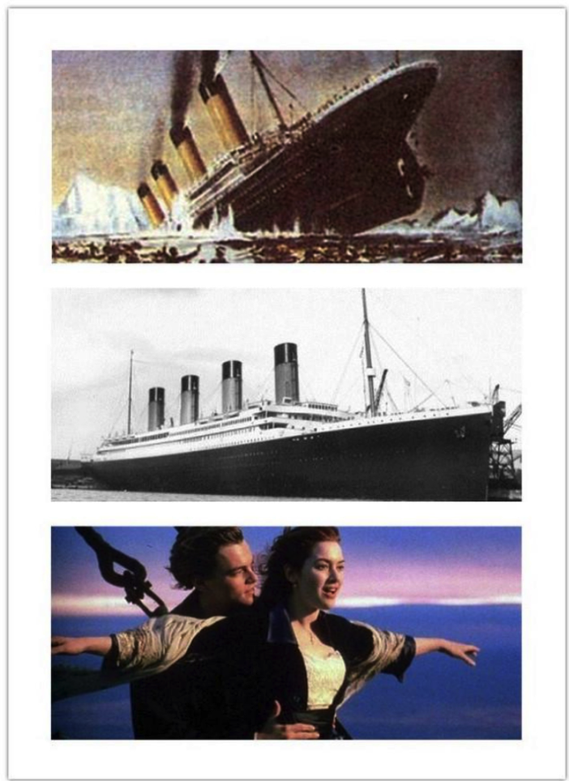
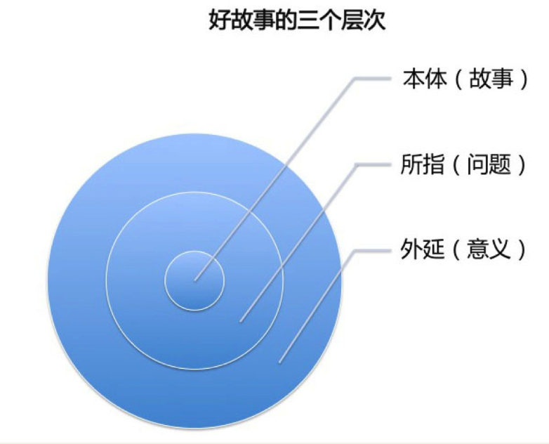
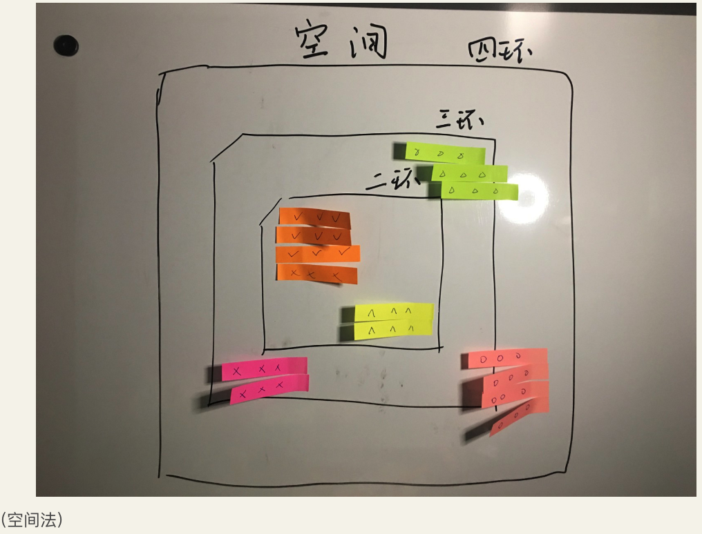
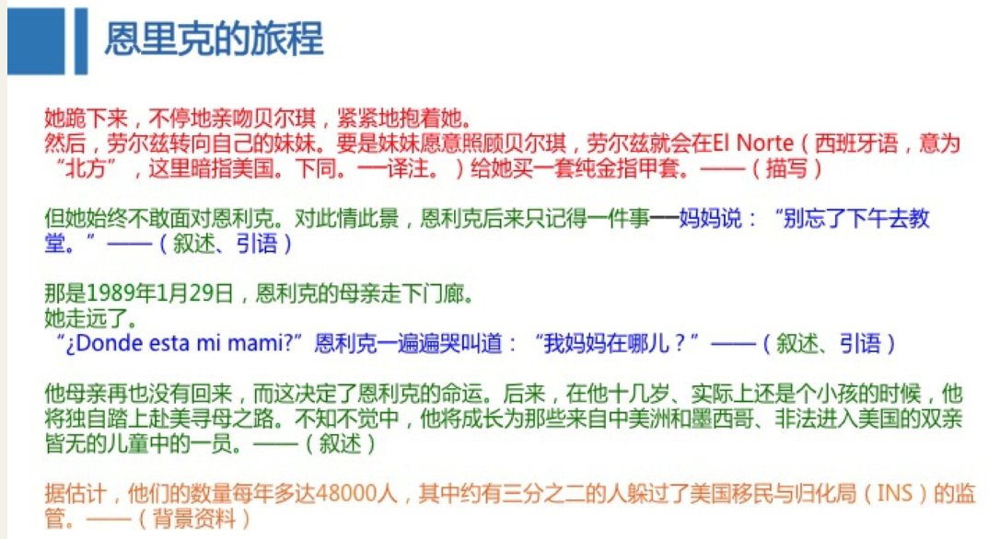

    知乎「一小时」系列
    作者叶伟民
    类别杂志
    提供方知乎
    字数约 47,000 字
    上架时间2017年08月

[豆瓣链接](https://read.douban.com/ebook/38548318/?icn=from-reader-page)

## 第一章找到主题，只需三步
### 1.1 概念之旅：特稿、非虚构、报告文学
首届普利策特稿奖获得者乔恩·富兰克林曾这样定义特稿：特稿是一种非虚构的短故事形式。这传递了两层意思：特稿是非虚构写作的一种形式，且篇幅更短。

特稿是非虚构写作在新闻领域的具体应用。它们遵循着相似的规律。

非虚构写作的边界和定义，可分为「广义」和「狭义」两种。

【广义定义】一切以现实元素为背景的写作行为。

【狭义定义】 真实 + 文学 + 意义

这个定义展示了三个关键词：即故事一定是真实的，用文学的手法来书写，并有深远的意义指向。这个定义背后，会牵出两个基本问题。

【问题 1】如何理解绝对真实——非虚构——虚构之间的关系？

我们可以借助一张图片来形象地解析这个问题。中间是一张历史图片，记录了泰坦尼克号的某个历史瞬间，绝对客观，没有任何感情色彩。最上面的是画家根据真实事件的再创作，有冰山，船在下沉，四周的人在呼号，它不等同于照片，是创作者从他的视角对真实元素的重组和再现。第三个就是电影《泰坦尼克号》里杰克和露丝的爱情故事，很多情节是为影视叙事而设计的，这个就是虚构。

【问题 2】如何理解非虚构——特稿——纪实文学——报告文学之间的关系？

长期以来，这四者的关系对写作者造成不同程度的混淆。前面已经说过，特稿是非虚构在新闻领域的具体的应用。纪实文学，我们也很容易将其区分，它更强调文学性，也允许一定程度的虚构。

比较麻烦的是报告文学。报告文学比较特殊，追本溯源来讲，非虚构和报告文学在概念上并没有太大差异。但是很可惜，报告文学进入中国后，被主流过分高举，承担了过多的宣传功能，文学技巧被过度放大，细节也脱离真实，反过来解构了新闻性和真实性，从而失去文献价值。

### 1.2 好故事都有共同点
一般意义上，好的故事或好的非虚构作品应具备如下四个特点。

1. 真实
    - 书写对象一定是真真切切的正在发生或发生过的事情。真实是非虚构的底线和生命线，细节则是非虚构的基石。诺贝尔文学奖获得者、白俄罗斯作家阿列克谢耶维奇说过：「细节是骗不了人的。」 
1. 亲历
    - 必须从个体（写作者或故事主角）的经历出发，探索人与自己、与世界、与时代、与未来的关系。所有的故事，必须围绕人，也回归到人。在传统报告文学里，个人的彩色并不浓重，更多是集体主义的光辉，强调「伟光正」。但非虚构不是，它所信奉的是人类的内心世界是比宇宙更广阔的地方。
1. 独立性
    - 非虚构一定要秉承怀疑、批判和反思的精神，而非歌颂、赞扬和取悦。
1. 个人视角
    - 强调个体判断，无需照顾或迎合所谓唯一的正确，只需呈现书写者眼中独特的世界。

如果是特稿，则还需着重突出——公共性。

新闻特稿的选题要与公共利益或社会问题相关，展示一种共性的图景，以唤起大众的关注和共鸣。

### 1.3 任何领域都能诞生好题材
#### 1. 海量阅读
海量阅读是保证足够的信息获取的基础手段，但不仅限于报纸、网站、微博、微信的阅读。它们只提供最表层的资讯来源，你看到了人家也看到了，甚至已经做了，创新空间不多。更多富矿隐藏在一些非市场化或非公开发行的刊物中。

例如，你是跑医药、环保、汽车或法治的，那些行业的出版物、通讯、期刊、报告以及政府机关、警方、法院发布的消息，都是很重要的新闻来源。虽然它们翻起来可能并不是那么有趣，但却暗藏着更多的独家线索。

#### 2. 社交
社交不但是新闻记者也是所有写作者该用的基础能力。我们可能都有这样的体验，遇到复杂棘手的问题，最高效的方法不是查资料或翻书，而是请教这个行业最专业的人。

#### 3. 随时随地记录
记录不仅仅只在采访中，还应随时随地进行，一是记录线索，二是记录灵感。

### 1.4 三个同心圆：确定主题的「三部曲」

图中的三个层次，从里到外分为「本体」、「所指」和「外延」，或者对应称为「故事」、「问题」和「意义」。这三层，本质上是一个好故事的内涵和边界。反过来说，如果能最大限度地满足这三个层次的要求，它就是一个值得书写的好故事。

第一层：本体（故事）。即这个特稿必须是一个真实发生、逻辑自洽、冲突集中、细节丰满的故事。

第二层：所指（问题）。我们分两步来认识这一点。首先故事要具备公共性和大的时代背景，其次要指向（或反映）一个具体的问题。对于第一点，社会转型或某个历史阶段的问题、道德危机等，都属于「大的时代背景」；第二点，「问题」必须真实且具象，例如公共治理、治安、食品安全、城乡二元、三农、机器吃人、贫困差距等，这些都是当下非常值得关注的具体问题。

第三层：外延（意义）。这一层比较抽离，也是最高要求，要求通过故事、问题折射出一个相对永恒的东西，或者抵达更终极、更有哲学意味的层次。它们是人类发展和命运的「根问题」。例如人性、善恶、平等、自由、制度、极权、文明冲突、人类命运、伦理等等。

【注意 1】故事的核心：「问题意识」

在上述故事的三个层次中，最核心的是第二层——「所指（问题）」。不是每个故事都能抵达第三层所要求的终极意义，但第二层的「问题」却是刚需。例如很多调查特稿，就是典型的以揭露「问题」为最终目标，同样能产生强大的传播和影响力。
因而，「问题意识」是一篇特稿的绝对中心。只有在这一层立住了，整篇特稿才有筋骨，才有精气神，才能掷地有声和有足够的穿透力。

【注意 2】一定要有人性的闪光

作品一定要有人性的闪光，这一点关乎作品的价值观，关乎能否永恒。无论你讲述的故事多黑暗、多残忍，如果没有人性的闪光，它就只是一个黑暗的故事，一个残忍的故事，而永远不会成为一个伟大的故事。

#### 【案例 1】《举重冠军之死》，李海鹏，发表于《南方周末》

第一篇非常著名，相信这篇文章应该是所有特稿写作者必看的篇目之一。这是李海鹏在《南方周末》早期的一篇作品，也被内部称作南周特稿的开山之作。此篇之后，南周设立「特稿版」，开启了「中国式特稿」的繁荣期。因而此文的分量是非常重的。我们对照「三个同心圆」模型。

故事：一个叫才力的举重冠军死了，很真实客观的一个故事。

问题：中国运动员群体的普遍困境。才力只是一个缩影，背后是更多面临相似命运的中国运动员。常年作为比赛机器的他们，丧失了基本的健康和生存能力，在困顿、病痛中卑微度日，甚至早逝。

意义：表象与问题背后的根源——举国体制。

#### 【案例 2】《系统》，曹筠武，发表于《南方周末》

《系统》是南周特稿的高峰之一。作者曹筠武也凭此获得了 2009 年奈特国际新闻奖（Knight International Journalism Award），是当年获得此奖唯一的中国记者。同样，我们将这一作品与「三个同心圆」模型对照。

故事：一款叫《征途》的网络游戏风靡。

问题：游戏设计者利用人性的弱点奴役和控制玩家。在游戏里，金钱和权力受到推崇，普通玩家若不进贡金钱或服从，等待他的就是被打压、被控制和被奴役。如果你反抗，会被禁言甚至关小黑屋。这款游戏本质上就是鼓吹丛林法则和赤裸裸地出售恃强凌弱的权力。

意义：南周内部曾经评价过这是「《南方周末》最具野心」的一篇特稿，它描述了虚拟世界中通往奴役之路，指向集权资本主义。

## 第二章 预判逻辑：避免你的写作走弯路
### 2.1 采访前，如何收集资料？
#### 【30 万字原则】
资料搜集、阅读多少才叫够呢？在我当记者、编辑的时候，无论自我要求，还是对记者的要求，都是不少于 30 万字。如果选题特别急，也一定要保证 10 万字以上。只有达到这个标准，才能对事件有相对全貌地了解。

拿到这些庞杂又粗糙的材料后，起码要筛选两遍。第一遍泛读，整体淘汰一些质量不高的文章。当然，这些材料里可能有一两句话是有用的，也注意提炼出来；第二遍则要细筛，对第一遍挑选出的文章做精细阅读，像榨油一样，把精华和节点信息悉数提取。

### 2.2 跟警匪片里学做信息拼图
将资料处理从「论述题」变成「填空题」，为后续的采访、写作尽可能扫清障碍。

「世界线」实际上是一个物理学概念，描述物质在时空的运行轨迹和规律。当然这里不会这么复杂，会简化很多。

「世界线」实际上就是「时空线」——时间和空间的线。因而我们可以分两种形式来表述。一个叫时间线，或叫时间法；另一个叫空间线，或叫空间法。

#### 【时间法】以时间为主轴的串联法

按时间线来讲故事非常符合人们的思维习惯。人脑对因果关系有着天然的理解优势。我们在做信息交流的时候也时常遇到这样的请求：你把事情的来龙去脉讲一下。因而，时间轴是帮助我们做信息拼合的天然工具。

上图是按双时间线（文章结构的一种，后面章节会详解）绘出的范例。上面有年份、时刻，还有一些大小纸片。它们之间是什么关系呢？第一步，按时间法整理资料的原则，把重要的故事情节和其发生的时间「对号入座」，并做到轻重、大小有序。

例如，具有阶段性意义的大事件（节点）就写在面积较大的黄色易事贴上，扼要标注内容。大事件（节点）下的小事件则扼要写在小纸条上，还可以用不同的颜色加以区分。（注：图中纸片中的符号只是示范，实际操作中应该写上扼要的事件说明。）

第二步，捋清事件之间的关联和逻辑关系。如果发现人、事相互之间存在逻辑断层和事实断层，就用问号标出来。这些就是接下来的采访环节需要死磕的地方——把「信息坑」填上。

#### 【空间法】以空间为聚合的并联法

虽然时间法这么常用，但仍有很多作品是以空间作为叙事坐标的。这时候就需要用到空间法，它适合事件发生的时间特别短或集中，没有漫长的时间跨度需要理解，是由人和事在空间的分布和变换推动情节发展的情况。

图中所示就是空间法。上面的纸条依然是扼要记录节点事件，但不再与时间相关，而是与发生地点对应。这个地图大概是按北京的环路画的，采访所得的片段、场景、故事，按照方位对号入座，不同区域的事件还可以用不同颜色的纸条区分。这样处理后，信息马上立体起来，仿佛我能以上帝视角俯瞰大地的点滴。（注：图中纸片中的符号只是示范，实际操作中应该写上扼要的事件说明。）

这种全视角除了能帮助写作时驾驭繁杂的细节，还能快速看到某些局部的采访不足或信息断层，从而有目的性地增补。这也是一种将「论述题」变成「填空题」的做法。

## 第三章 采访指南：即使被拒绝也能有收获
【传统定义】采访是代表「背后的观众/读者」，为收集信息而进行的谈话。

【创造性采访】双方以对话的形式来交换信息，以达到任何一方都无法独自达到的知晓程度。

创造性采访的目的是要达到这样的境界：对话双方通过相互碰撞、激发，开拓了各自的认知边界，获取新知、新思路或发现思维死角。

受访者会感到：「这个采访很有深度，很精彩，帮助我重新梳理了知识体系。有些问题我竟然从来没有想过，或许能成为我新的研究方向。我甚至都不愿意结束这次采访了。」

## 第四章 设计文章结构：让文字顶天立地
>「结构是对人物生活故事中一系列事件的选择，这种选择将事件组合成一个具有战略意义的序列，以激发特定而具体的情感，并表达一种特定而具体的人生观。」——罗伯特.麦基，《故事》

这个定义传递出以下内涵。

1. 创作不等于生活
    - 生活是一种漫流，无处不在，浩如烟海，但创作是从里面挑选最精彩的时刻（瞬间、场景、片段、冲突等）组成故事。创作必须是一个再选择的过程。
1. 意义在「有序」里
    - 选出事件后，如何「有战略意义地排序」就显得非常重要。
1. 选择和排序，最终是为激发读者情感、达到共鸣

### 四种常见的特稿结构
#### 模块式
模块式是并列展示相互关联或同一主题下几个并行版块的结构方式。它们虽然在细节上表现不一，但指向同一个中心，相互之间并不存在递进或相互隶属的关系。比较适合描写一个地方（例如城市）或群体等类型的选题。

模块式的重要特点是元素（细节、场景、故事片段等）可以拆解重组，且不会影响文章整体主旨和阅读效果。

时任《南方周末》记者的李海鹏和陈江的《灾后北川残酷一面》就是比较典型的模块式。当时已经震完了，救援进展也比较缓慢，可能明天和今天的情况都差不多，时间线是一条死路。当然，如果你要描写地震发生的过程，那时间线是不二之选，因为每一秒都变化剧烈，都惊天动地，都悲伤四起。

文章的小标题分别为：声音在消失、木头人、你们赶上了好时代、士兵们尽力了。全篇是密集的小场景、小故事通过合理的方式结合在一起，穷尽视觉、味觉、听觉进行全景式展示。从救援进展、幸存者、灾难中的人性等来呈现一个远超普通人想象的灾区景象。

#### 时间线式
即按时间的变化、发展来叙事，又可以分「单时间线」和「双时间线」。

单时间线比较好理解，就是交代清楚事情的来龙去脉。但前提是事件足够重大，情节足够精彩，引发人们强烈的信息饥渴。比如，报道灾难、战争、大赛、丑闻等重大事件。

我的作品《伊力亚的归途》也是比较明显的单时间线，因为它的情节发展足够精彩，背景足够辽阔，按时间线叙述，如顺水推舟般自然。

双时间线也是一种常用的「时间线」结构，李海鹏的《举重冠军之死》就是典型的案例。通过举重冠军才力生命的最后一天，穿插其一生。以一天为明线，一生为暗线，让一个本来相对静态的故事，因为时间维度的跃迁变化，获得动感。

还有普利策特稿奖名篇《策普的最后一站》。一个老兵去华盛顿出庭，记者观察他这一程，穿插讲述他的一生。电影《贫民窟里的百万富翁》也是如此，讲述一场电视智力冲关，每一个问题都「闪回」贫穷少年的一段人生。

#### 多人物/多地理空间式
如果单一人物不足以挑起主题，就需要两个或以上（数量不宜多）来互补。例如双人物式，他们一般有一个共同的起点，走上两条相反的但具有代表性的道路，最终两人的人生还会交汇在一起，凸显命运深重的吊诡感。

多地理空间式也类似，比如在几个命运有重大相关的城市中交叉叙述。好莱坞电影《通天塔》就是典型的此类结构，人与人之间、地与地之间都有潜在关联，但它没有一次性抖出来，而是随着剧情一点点地给，非常到位地把握节奏，从而也把握了观众的情绪。

####  剥洋葱式
顾名思义，剥洋葱式结构是将事实一层一层地揭开，直至真相核心，多用于解释性报道。在 BBC、Discovery 的科学纪录片里，我们常看见这种叙事法。一个困难套着一个困难，用问题、悬念、疑团来推进故事情节，从而推动观众情绪。

但这种方法也有危险性，容易学走样。主要问题是真相和手法的不对等，相当于对读者的承诺落空了。一个很典型的例子就是《走近科学》栏目。一个村子里发现神秘反光，各种铺垫、悬疑、惊悚，最终发现是一面镜子。这就玩过了。

### 写好开头：给读者的合同与邀请
#### 叙述式
>多年以后，面对行刑队，奥雷里亚诺·布恩迪亚上校将会回想起父亲带他去见识冰块的那个遥远的下午。——加西亚·马尔克斯，《百年孤独》

#### 场景描写式
>道路变得曲曲折折的，眼看着就要到天城山的山顶了，正在这么想的时候，阵雨已经把茂密的杉树林笼罩成白花花的一片，以惊人的速度从山脚下向我追来。那年我二十岁……——川端康成，《伊豆的舞女》

#### 细节描写式
>我第一次看见特里·伦诺克斯时，他喝醉了，坐在舞者酒吧露台外的一辆银色劳斯莱斯上。停车场的服务员把车子开出来，一直扶着敞开的车门等着，因为特里·伦诺克斯左脚悬在车外，仿佛已经忘了有这么一条腿。——雷蒙德·钱德勒，《漫长的告别》

#### 引语式
>「他们就这样把我们的斐迪南给杀了。」女佣人人对帅克说。——雅·哈谢克，《好兵帅克》

#### 开门见山式
>张明明决定杀掉他的父母。这个想法在他脑中盘旋了差不多两个月。——林珊珊、尼克、蒋志高，《少年杀母事件》发表于《南方人物周刊》

#### 悬疑式
>哈佛大学的符号学专家罗伯特·兰登在法国巴黎出差期间的一个午夜接到一个紧急电话，得知卢浮宫博物馆年迈的馆长被人杀害在卢浮宫的博物馆里。人们在他的尸体旁边发现了一个难以捉摸的密码。——丹·布朗，《达芬奇密码》

在「写开头」这个问题上，小说家劳伦斯·布洛克在《布洛克的小说学堂》中有过几个忠告，让人相当受益。

#### 开头要让故事动起来
>这个女人的尖叫，让派克惊醒过来，他迅速滚离床铺，就在滚离的瞬间，他听到身后一声消音器手枪的闷响，子弹击穿了枕头，那是他刚刚枕过的位置。——理查德·斯达克，《外装》

#### 设定故事的基调
>这个年轻人一踏出电梯，就发现威尔荪·柯力德的枪口正对着他。——小说《我们的疯狂事业》

#### 点出关键问题
>由于睡眠呼吸暂停综合症，多年受困于贫穷、不良生活习惯，超过 160 公斤体重的才力麻木地呕吐着，毫无尊严地死了。在生前最后四年，他的工作是辽宁省体院的门卫，在他死去的当天，家里只有 300 元钱。——李海鹏，《举重冠军之死》发表于《南方周末》

#### 别在故事开始的地方开始
>喀什北郊，一个昏暗的房间内，17 岁的伊力亚 10年来第一次见到自己的母亲。他已离家流浪 10年了，在这个年龄他本该长成一个强壮俊美的小伙子。但现在，蚯蚓般的伤痕爬满了他的脊梁，一条伤腿正在萎缩。他的阿娜（维语：母亲），37 岁的阿尔孜古丽，因惊恐而捂住嘴巴，在黑暗中「呜呜」地低鸣。——叶伟民，《伊力亚的归途》发表于《南方周末》

## 第五章 写作密码：让文章如乐曲般动人
所有的故事从根本的矛盾双方，可以归为两种基础模式：

1. 「人—事」型故事；
1. 「人—人」型故事。
 
可简化表述为：

**【「人—事」型故事】执念——行动——困难——再行动——结果**

以2017年5月热映的印度电影《摔跤吧，爸爸》为例，可代入分析检验一下各个环节。

- 故事梗概：一个错失世界冠军的印度摔跤运动员，历尽艰辛，被嘲笑、不解、孤立，最终在女儿身上实现了梦想。
- 执念：印度少年珀尕立志要成为世界冠军，在世界赛场上升起印度国旗，奏响印度国歌。
- 行动：他去摔跤了，拿到全国冠军。
- 困难 1：家里没钱了，不能供他去体育大学训练，他被迫放弃了，长成一个大胖子，理想破灭了。
- 再行动 1：他不甘心，训练两个女儿摔跤，让她们夺冠。
- 困难 2：女儿的抵触。
- 再行动 2：和女儿沟通、争取，女儿意外被年幼出嫁的同学感化。
- 困难 3：乡亲们的嘲笑，传统观念的抵触。
- 再行动 3：领女儿参加一场男子摔跤比赛来证明。
- ……（再细列下去，会有更多的「困难」和「再行动」。
- 结果：大女儿成为世界冠军，圆梦。

第二种，「人—人」型故事。基本的表现形式是一个人和另一个人，或多个人形成某种关系所产生的故事。

可简化表述为：

**【「人—人」型故事】人物形象——相识——对立/破裂——和好/相杀**

这种模式里，人与人之间关系的变化，决定了故事情节的走向。

以电影《雨人》为例，我们同样可以代入检验。

- 故事梗概：弟弟为争夺素未谋面的自闭症哥哥的遗产，与其相认并设计骗取，却意外发现哥哥拥有超强记忆力，把其作为赌博工具，导致关系一度破裂，最终被亲情感化，二人和好并成为真情兄弟。
- 人物形象：
    - 弟弟：查理，超帅但心计狠辣。
    - 哥哥：雷蒙，患自闭症，善良且记忆力超群。
- 相识：弟弟查理发现父亲把遗产给了一个从未听过的自闭症哥哥雷蒙，怒不可遏。随后假装接哥哥回来，实际上想骗取遗产。
- 对立/破裂：弟弟查理让哥哥雷蒙用超强记忆力去赌博，把他当作摇钱树。因为太贪婪，让雷蒙遭受很大的痛苦，两人关系濒临破裂。
- 和好/相杀：儿时的隐藏回忆唤起了查理的血缘亲情。最终查理原谅了父亲，接受了哥哥雷蒙。最初那笔遗产，已经不重要了。

### 设计你的故事情节
总的来说，就是顺着上述两种故事的基本模式来推导。以我的特稿作品《伊力亚的归途》 (https://zhuanlan.zhihu.com/p/23527149)为例，这篇是很典型的「人—事」型故事结构。

- 故事梗概：一个被拐骗到内地偷窃但保存善念的新疆流浪儿童伊力亚，突破各种艰险、危机回故土寻找母亲的故事。
- 执念：活着回去寻找母亲。
- 行动：挣脱他父亲的控制。
- 困难 1：被父亲毒打、惩罚。
- 再行动 1：长大一些，开始反抗父亲。
- 困难 2：父亲将他卖给黑社会，伊力亚还被打断了腿。
- 再行动 2：他跟了黑社会大哥，械斗、打杀、谋求生存。
- 困难 3：大哥要追杀他。
- 再行动 3：逃到内地一个城市。
- 困难 4：在异地无身份证，没钱、流浪。
- 再行动 4：和警察陈峰成为朋友，后者帮助并感化了他。
- 结果：回到喀什，找到分别多年的患病母亲，团聚。

在「人—事」模式的基础上，异地遇到警察陈峰的这一段，我穿插使用了「人—人」型模式。因为故事发展到这里，伊力亚的外部环境已趋于平和，不再有追杀、群殴等。此外，他和汉人警察的故事是难得的人性闪光。他们之间关系的变化，对故事也起了非常重要的推动和平衡作用。但总体来说，主要还是以「人—事」模式为主。

### 编排行文的舞步
我在《南方周末》写特稿的时候，接触到一个「笨办法」——庖丁解牛优秀范文，寻找它们节奏铿锵、韵律优美的秘密。当时内部把它形象比喻为「一二三四，二二三四」，意思是像学跳舞一样，先跟着拍子「一二三四，二二三四」地踩准舞步，练多了就会融会贯通。或者像分析音乐家的乐曲，从一个个最基础的音符开始，才能知道作品魔力的来源。

这个「一二三四，二二三四」是个比喻，比喻行文的四个最基础的元素：叙述、描写（场景、细节）、引语（直接、间接）和背景。

叙述就是很正常的陈述句，概述情况、现象；描写，又分场景描写和细节描写，雨后的场景、拳击手被击中后的细节等，都是描写；引语，又分直接引语和间接引语，直接引语就是人物的原话，间接引语是由第三者转述人物的话。

当时我们训练新记者有个做法：把文章打印出来，用不同的颜色对应代表四个元素，例如绿色代表叙述，蓝色代表引语，红色代表描写，黄色代表背景。然后选一篇范文的段落，对应标出不同的元素。分析到一定程度的时候，你会发现文字背后的美妙是有它的舞步的，而且不同的作者会有不同的特点。有些人很善于用引语，所以文章标蓝色的地方多；有些人擅长描写，他的作品标红色的地方多；有些人擅长叙述，标绿色的地方多。但是我相信没有稿子是背景资料居多的，真有的话就是一份材料，是一个失败的故事。

#### 【案例】
我们来按照这个方法分析一下普利策特稿奖作品《恩里克的旅程》开头的一段，看看作者是如何合理运用基本元素并让其配搭得当，像一篇乐章。

通过这种标色练习，能感受到不同风格的作者行文时基本元素的配搭特点。对于缺乏经验的新作者来说，哪怕通过这样的机械模仿，也能写出比原来要好的文章。从模仿到独创，这是一个被反复验证有效的方法。

### 聪明选择引语
- 第一，引语的选择和使用是作品的点睛之笔。节制、精彩的人物引语，其自带形象的力量，胜过万千笔墨。
    - 直接引语的使用一定要遵从节制原则，用其最闪光、压强最大的部分，以突出人物本色、增强人物特点。不怕言语「出位」、「奇葩」，就怕平庸无奇。
- 第二，用直接引语的另一个作用是避免风险。尤其在一些存在争议，既难以证实又难以证伪的地方，准确无误地引用人物引语，能保证媒体的中立和客观，避免偏颇和「站队」，也能给对立双方足够的发声空间，将复杂多面的事实充分展现给读者，交由读者判断。

#### 【案例】
美国乔治城大学缅裔学者斯坦伯格对民盟的「老人政治」也深表担忧。「在一次民盟的高层研讨会上，我见到了一些『大叔』，我可能是会场里最年轻的一位，可我已经 83 岁了。」

民盟也意识到自身的问题。「我们会通过党内民主选举，让年轻人当选。」昂山素季的亲密战友、民盟第二号人物吴温丁说，「我们在努力提携年轻人，但现在肯定还是昂山素季。」——叶伟民，《走出永盛监狱》发表于《南方周末》

间接引语是对人物原话的转述，比直接引语更节制，好处是增强概括性，不拖慢叙事节奏。

#### 【案例】
艾力像拎小鸡一样提起儿子的衣领，用一条浸湿的视频线狠狠抽向他的后背。哥哥热依木在弟弟的嚎叫中屈服了，他摇着爸爸的腿，说愿意为弟弟做一切事情。——叶伟民，《伊力亚的归途》发表于《南方周末》

### 「任何初稿都是狗屎」
一篇好作品，用在修改上的时间很可能是写初稿的数倍。索尼娅说：「有了坚固的故事结构，我就收紧叙事。」例如，二稿的一个段落如下：

>他在河边的流民营出没。最后他就住这儿了。这种营地是移民、蛇头、瘾君子和罪犯的避风港，但却比新拉雷多的其他任何地方都安全，这是个超过 50万人的城市，充斥着移民蛇头和各种警察。如果他因为流浪在城里被抓了，那么，政府会关他两到三天，再把他逐回危地马拉。这比滞留在此更糟，因为又回到了起点。

她的最终稿是这样的：

>他加入的流民营是移民、蛇头、瘾君子和罪犯的避风港，但比新拉雷多的其他任何地方都安全，这是个 50 万人口的城市，充斥着移民中间人（移民蛇头）和各种警察，警察可能抓住并驱逐他。

就这样地毯式修改，一直到 11 稿，修剪臃肿的文字已经很难了。索尼娅说：「我努力用新鲜的眼光看每一个句子，问自己这个真的必要吗？删掉会损失多少？加快叙事节奏会收获多少？如果保留，怎样改进和缩短它？我对每一个词提问。」