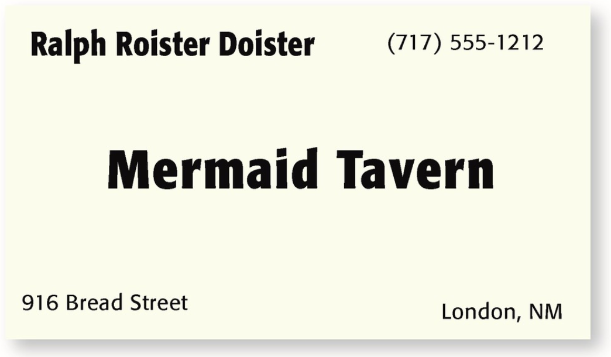
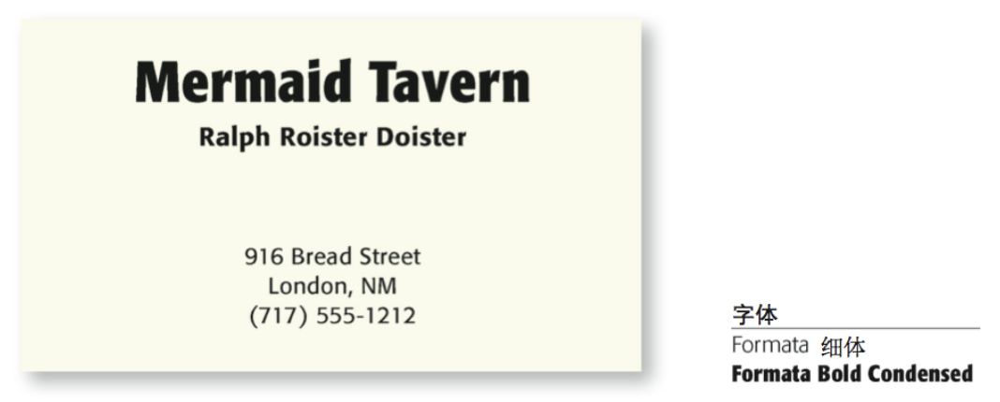

    作者:  [美] Robin Williams 
    出版社: 人民邮电出版社
    原作名: The Non-Designer's Design Book
    译者: 苏金国 / 刘亮 
    出版年: 2009-1
    页数: 210
    定价: 49.00元
    装帧: 平装
    丛书: 图灵交互设计丛书
    ISBN: 9787115188120

[豆瓣链接](https://book.douban.com/subject/3323633/)

# 第一部分 设计原则
## 第1章 约书亚树
### 4大基本原则
以下是对基本设计原则的概述，每一个优秀的设计中都应用了这些设计原则。

1. **对比（Contrast）**-对比的基本思想是，要避免页面上的元素太过相似。如果元素（字体、颜色、大小、线宽、形状、空间等）不相同，那就干脆让它们截然不同。要让页面引人注目，对比通常是最重要的一个因素，正是它能使读者首先看这个页面。
1. **重复（Repetition）**-让设计中的视觉要素在整个作品中重复出现。可以重复颜色、形状、材质、空间关系、线宽、字体、大小和图片，等等。这样一来，既能增加条理性，还可以加强统一性。
1. **对齐（Alignment）**-任何东西都不能在页面上随意安放。每个元素都应当与页面上的另一个元素有某种视觉联系。这样能建立一种清晰、精巧而且清爽的外观。
1. **亲密性（Proximity）**-彼此相关的项应当靠近，归组在一起。如果多个项相互之间存在很近的亲密性，它们就会成为一个视觉单元，而不是多个孤立的元素。这有助于组织信息，减少混乱，为读者提供清晰的结构。

## 第2章 亲密性
Robin亲密性原则是指：将相关的项组织在一起，移动这些项，使它们的物理位置相互靠近，这样一来，相关的项将被看作凝聚为一体的一个组，而不再是一堆彼此无关的片段。

你很清楚后4种花与其他花有所不同，因为它们与列表中的其他项物理上是分开的。这正反映了亲密性的概念，在一个页面上，物理位置的接近就意味存在着关联（实际生活中也是如此）。

来看看下面这个企业名片的布局，这是一种很典型的布局。在这样小的空间里你看到多少个单独的元素？你的眼睛要停下来多少次才能看全这张名片上的所有信息？

>你的眼睛是不是停过5次？当然，这个小小的名片上放置了5项孤立的内容。

>你是从哪里开始的？可能是从中间，因为中间的短句字体最粗。

>接下来看什么？是不是按从左向右的顺序读？（因为这是英语）

>如果已经读到名片的最后（即右下角），你的目光又会移向哪里？

>你是不是还会全盘再巡视一番，确保自己没有遗漏任何角落？

如果再添点乱，情况会怎样呢?

>现在有两个元素都是粗体，你又该从哪里开始呢？从左上角吗？还是从中间开始？

>读完这两项之后，接下来看什么？也许你会在这些粗体词之间看来看去，紧张兮兮地想找出角落里还隐藏着哪些词尚未看到。

>你知道什么时候才算完吗？

>你的朋友是不是也像你这样？他们会不会用不同的方式读这个名片？

如果多个项相互之间有很近的亲密性，它们就会成为一个视觉单元，而不是多个孤立的元素。就像实际生活中一样，**亲密性（即紧密性）意味着存在关联。**

>之前的名片存在这样一个问题：名片上的每一项看上去都与其他任何项没有关联。这样一来，首先不清楚从哪里开始读名片，另外不知道何时才算结束。

>如果对这个企业名片做一点调整——**把相关的元素分在一组，使它们建立更近的亲密性**，看看会发生什么。

>从哪里开始读名片？接下来看什么？什么时候结束？对于这些问题你现在还有疑问吗？

>仅仅利用这样一个简单的概念，现在这个名片不论**从理解上**还是**从视觉上**看都很有条理。而且这样一来，它还能更清楚地表达信息。

