    作者: 刘津 / 李月
    出版社: 人民邮电出版社
    副标题: 用户体验设计师的成长之路
    出版年: 2014-7
    页数: 282
    定价: 69.00
    装帧: 平装
    丛书: 破茧成蝶
    ISBN: 9787115353054

[豆瓣链接](https://book.douban.com/subject/25915629/)

- [第1篇 成为用户体验设计师的信念](#%e7%ac%ac1%e7%af%87-%e6%88%90%e4%b8%ba%e7%94%a8%e6%88%b7%e4%bd%93%e9%aa%8c%e8%ae%be%e8%ae%a1%e5%b8%88%e7%9a%84%e4%bf%a1%e5%bf%b5)
  - [01 什么是用户体验设计](#01-%e4%bb%80%e4%b9%88%e6%98%af%e7%94%a8%e6%88%b7%e4%bd%93%e9%aa%8c%e8%ae%be%e8%ae%a1)
    - [1.1 设计≠艺术](#11-%e8%ae%be%e8%ae%a1%e2%89%a0%e8%89%ba%e6%9c%af)
    - [1.2 邂逅用户体验设计](#12-%e9%82%82%e9%80%85%e7%94%a8%e6%88%b7%e4%bd%93%e9%aa%8c%e8%ae%be%e8%ae%a1)
    - [1.3 用户体验设计的特征](#13-%e7%94%a8%e6%88%b7%e4%bd%93%e9%aa%8c%e8%ae%be%e8%ae%a1%e7%9a%84%e7%89%b9%e5%be%81)
    - [1.4 用户体验设计的精益之道](#14-%e7%94%a8%e6%88%b7%e4%bd%93%e9%aa%8c%e8%ae%be%e8%ae%a1%e7%9a%84%e7%b2%be%e7%9b%8a%e4%b9%8b%e9%81%93)
  - [02 了解用户体验设计师](#02-%e4%ba%86%e8%a7%a3%e7%94%a8%e6%88%b7%e4%bd%93%e9%aa%8c%e8%ae%be%e8%ae%a1%e5%b8%88)
    - [2.1 用户体验相关职位有哪些](#21-%e7%94%a8%e6%88%b7%e4%bd%93%e9%aa%8c%e7%9b%b8%e5%85%b3%e8%81%8c%e4%bd%8d%e6%9c%89%e5%93%aa%e4%ba%9b)
      - [交互设计师](#%e4%ba%a4%e4%ba%92%e8%ae%be%e8%ae%a1%e5%b8%88)
      - [视觉设计师](#%e8%a7%86%e8%a7%89%e8%ae%be%e8%ae%a1%e5%b8%88)
      - [用户研究员](#%e7%94%a8%e6%88%b7%e7%a0%94%e7%a9%b6%e5%91%98)
    - [2.2 用户体验设计师的价值](#22-%e7%94%a8%e6%88%b7%e4%bd%93%e9%aa%8c%e8%ae%be%e8%ae%a1%e5%b8%88%e7%9a%84%e4%bb%b7%e5%80%bc)
      - [用户价值、商业价值](#%e7%94%a8%e6%88%b7%e4%bb%b7%e5%80%bc%e5%95%86%e4%b8%9a%e4%bb%b7%e5%80%bc)
      - [项目价值](#%e9%a1%b9%e7%9b%ae%e4%bb%b7%e5%80%bc)
      - [品牌价值](#%e5%93%81%e7%89%8c%e4%bb%b7%e5%80%bc)
  - [03 设计师的职业困惑](#03-%e8%ae%be%e8%ae%a1%e5%b8%88%e7%9a%84%e8%81%8c%e4%b8%9a%e5%9b%b0%e6%83%91)
    - [3.1 我适合干这行吗](#31-%e6%88%91%e9%80%82%e5%90%88%e5%b9%b2%e8%bf%99%e8%a1%8c%e5%90%97)
    - [3.2 菜鸟怎样入门](#32-%e8%8f%9c%e9%b8%9f%e6%80%8e%e6%a0%b7%e5%85%a5%e9%97%a8)
    - [3.3 去大公司、小公司，还是设计公司](#33-%e5%8e%bb%e5%a4%a7%e5%85%ac%e5%8f%b8%e5%b0%8f%e5%85%ac%e5%8f%b8%e8%bf%98%e6%98%af%e8%ae%be%e8%ae%a1%e5%85%ac%e5%8f%b8)
    - [3.4 什么样的应聘者更容易成功](#34-%e4%bb%80%e4%b9%88%e6%a0%b7%e7%9a%84%e5%ba%94%e8%81%98%e8%80%85%e6%9b%b4%e5%ae%b9%e6%98%93%e6%88%90%e5%8a%9f)
      - [侧重考查设计师什么方面](#%e4%be%a7%e9%87%8d%e8%80%83%e6%9f%a5%e8%ae%be%e8%ae%a1%e5%b8%88%e4%bb%80%e4%b9%88%e6%96%b9%e9%9d%a2)
- [第2篇 修炼用户体验设计师的技能](#%e7%ac%ac2%e7%af%87-%e4%bf%ae%e7%82%bc%e7%94%a8%e6%88%b7%e4%bd%93%e9%aa%8c%e8%ae%be%e8%ae%a1%e5%b8%88%e7%9a%84%e6%8a%80%e8%83%bd)
  - [04 设计流程——设计师具体做什么](#04-%e8%ae%be%e8%ae%a1%e6%b5%81%e7%a8%8b%e8%ae%be%e8%ae%a1%e5%b8%88%e5%85%b7%e4%bd%93%e5%81%9a%e4%bb%80%e4%b9%88)
    - [4.1 设计师如何参与一个具体的项目](#41-%e8%ae%be%e8%ae%a1%e5%b8%88%e5%a6%82%e4%bd%95%e5%8f%82%e4%b8%8e%e4%b8%80%e4%b8%aa%e5%85%b7%e4%bd%93%e7%9a%84%e9%a1%b9%e7%9b%ae)
    - [4.2 在项目中设计师容易遇到的问题](#42-%e5%9c%a8%e9%a1%b9%e7%9b%ae%e4%b8%ad%e8%ae%be%e8%ae%a1%e5%b8%88%e5%ae%b9%e6%98%93%e9%81%87%e5%88%b0%e7%9a%84%e9%97%ae%e9%a2%98)
  - [05 需求分析——拿回产品的主导权](#05-%e9%9c%80%e6%b1%82%e5%88%86%e6%9e%90%e6%8b%bf%e5%9b%9e%e4%ba%a7%e5%93%81%e7%9a%84%e4%b8%bb%e5%af%bc%e6%9d%83)
    - [5.1 和产品经理一起做需求分析](#51-%e5%92%8c%e4%ba%a7%e5%93%81%e7%bb%8f%e7%90%86%e4%b8%80%e8%b5%b7%e5%81%9a%e9%9c%80%e6%b1%82%e5%88%86%e6%9e%90)
      - [5.1.1 不可忽视的产品定位](#511-%e4%b8%8d%e5%8f%af%e5%bf%bd%e8%a7%86%e7%9a%84%e4%ba%a7%e5%93%81%e5%ae%9a%e4%bd%8d)
        - [什么是产品定位？](#%e4%bb%80%e4%b9%88%e6%98%af%e4%ba%a7%e5%93%81%e5%ae%9a%e4%bd%8d)
        - [产品定位的内容](#%e4%ba%a7%e5%93%81%e5%ae%9a%e4%bd%8d%e7%9a%84%e5%86%85%e5%ae%b9)
        - [产品定义](#%e4%ba%a7%e5%93%81%e5%ae%9a%e4%b9%89)
        - [用户需求](#%e7%94%a8%e6%88%b7%e9%9c%80%e6%b1%82)
        - [选择目标用户](#%e9%80%89%e6%8b%a9%e7%9b%ae%e6%a0%87%e7%94%a8%e6%88%b7)
        - [确定产品定位并据此筛选需求](#%e7%a1%ae%e5%ae%9a%e4%ba%a7%e5%93%81%e5%ae%9a%e4%bd%8d%e5%b9%b6%e6%8d%ae%e6%ad%a4%e7%ad%9b%e9%80%89%e9%9c%80%e6%b1%82)
      - [5.1.2 需求从哪儿来](#512-%e9%9c%80%e6%b1%82%e4%bb%8e%e5%93%aa%e5%84%bf%e6%9d%a5)
      - [5.1.3 如何分析与筛选需求](#513-%e5%a6%82%e4%bd%95%e5%88%86%e6%9e%90%e4%b8%8e%e7%ad%9b%e9%80%89%e9%9c%80%e6%b1%82)
        - [如何分析与筛选需求](#%e5%a6%82%e4%bd%95%e5%88%86%e6%9e%90%e4%b8%8e%e7%ad%9b%e9%80%89%e9%9c%80%e6%b1%82)
        - [需求的产生](#%e9%9c%80%e6%b1%82%e7%9a%84%e4%ba%a7%e7%94%9f)
      - [5.1.4 了解需求文档](#514-%e4%ba%86%e8%a7%a3%e9%9c%80%e6%b1%82%e6%96%87%e6%a1%a3)
        - [需求文档应该包含什么内容？](#%e9%9c%80%e6%b1%82%e6%96%87%e6%a1%a3%e5%ba%94%e8%af%a5%e5%8c%85%e5%90%ab%e4%bb%80%e4%b9%88%e5%86%85%e5%ae%b9)
        - [需求文档的后续迭代](#%e9%9c%80%e6%b1%82%e6%96%87%e6%a1%a3%e7%9a%84%e5%90%8e%e7%bb%ad%e8%bf%ad%e4%bb%a3)
    - [5.2 倾听用户的声音](#52-%e5%80%be%e5%90%ac%e7%94%a8%e6%88%b7%e7%9a%84%e5%a3%b0%e9%9f%b3)
      - [5.2.1 拥抱用户](#521-%e6%8b%a5%e6%8a%b1%e7%94%a8%e6%88%b7)
      - [5.2.2 别被用户牵着走](#522-%e5%88%ab%e8%a2%ab%e7%94%a8%e6%88%b7%e7%89%b5%e7%9d%80%e8%b5%b0)
      - [5.2.3 如何对待用户的意见](#523-%e5%a6%82%e4%bd%95%e5%af%b9%e5%be%85%e7%94%a8%e6%88%b7%e7%9a%84%e6%84%8f%e8%a7%81)
    - [5.3 设计师的逆袭](#53-%e8%ae%be%e8%ae%a1%e5%b8%88%e7%9a%84%e9%80%86%e8%a2%ad)
      - [5.3.3 从“功能需求”到“设计需求”](#533-%e4%bb%8e%e5%8a%9f%e8%83%bd%e9%9c%80%e6%b1%82%e5%88%b0%e8%ae%be%e8%ae%a1%e9%9c%80%e6%b1%82)
        - [如何寻找设计目标](#%e5%a6%82%e4%bd%95%e5%af%bb%e6%89%be%e8%ae%be%e8%ae%a1%e7%9b%ae%e6%a0%87)
        - [根据设计目标重新定义需求](#%e6%a0%b9%e6%8d%ae%e8%ae%be%e8%ae%a1%e7%9b%ae%e6%a0%87%e9%87%8d%e6%96%b0%e5%ae%9a%e4%b9%89%e9%9c%80%e6%b1%82)
  - [06 设计规划——从需求到设计草图](#06-%e8%ae%be%e8%ae%a1%e8%a7%84%e5%88%92%e4%bb%8e%e9%9c%80%e6%b1%82%e5%88%b0%e8%ae%be%e8%ae%a1%e8%8d%89%e5%9b%be)
    - [6.1 从需求到界面，隔着一扇门](#61-%e4%bb%8e%e9%9c%80%e6%b1%82%e5%88%b0%e7%95%8c%e9%9d%a2%e9%9a%94%e7%9d%80%e4%b8%80%e6%89%87%e9%97%a8)
      - [6.1.1 如何搞定信息分类](#611-%e5%a6%82%e4%bd%95%e6%90%9e%e5%ae%9a%e4%bf%a1%e6%81%af%e5%88%86%e7%b1%bb)
        - [逻辑归类](#%e9%80%bb%e8%be%91%e5%bd%92%e7%b1%bb)
        - [卡片分类](#%e5%8d%a1%e7%89%87%e5%88%86%e7%b1%bb)
      - [6.1.2 好的导航是成功的一半](#612-%e5%a5%bd%e7%9a%84%e5%af%bc%e8%88%aa%e6%98%af%e6%88%90%e5%8a%9f%e7%9a%84%e4%b8%80%e5%8d%8a)
        - [导航的自我解释](#%e5%af%bc%e8%88%aa%e7%9a%84%e8%87%aa%e6%88%91%e8%a7%a3%e9%87%8a)
        - [深广度平衡](#%e6%b7%b1%e5%b9%bf%e5%ba%a6%e5%b9%b3%e8%a1%a1)
        - [用户所需信息与商业推广信息的平衡](#%e7%94%a8%e6%88%b7%e6%89%80%e9%9c%80%e4%bf%a1%e6%81%af%e4%b8%8e%e5%95%86%e4%b8%9a%e6%8e%a8%e5%b9%bf%e4%bf%a1%e6%81%af%e7%9a%84%e5%b9%b3%e8%a1%a1)
        - [为重要功能和常用功能设置快捷入口](#%e4%b8%ba%e9%87%8d%e8%a6%81%e5%8a%9f%e8%83%bd%e5%92%8c%e5%b8%b8%e7%94%a8%e5%8a%9f%e8%83%bd%e8%ae%be%e7%bd%ae%e5%bf%ab%e6%8d%b7%e5%85%a5%e5%8f%a3)
      - [6.1.3 主要任务与次要任务](#613-%e4%b8%bb%e8%a6%81%e4%bb%bb%e5%8a%a1%e4%b8%8e%e6%ac%a1%e8%a6%81%e4%bb%bb%e5%8a%a1)
        - [说说任务设计](#%e8%af%b4%e8%af%b4%e4%bb%bb%e5%8a%a1%e8%ae%be%e8%ae%a1)
      - [6.1.4 如何突出主要任务](#614-%e5%a6%82%e4%bd%95%e7%aa%81%e5%87%ba%e4%b8%bb%e8%a6%81%e4%bb%bb%e5%8a%a1)
        - [分解用户任务](#%e5%88%86%e8%a7%a3%e7%94%a8%e6%88%b7%e4%bb%bb%e5%8a%a1)
        - [排列任务优先级](#%e6%8e%92%e5%88%97%e4%bb%bb%e5%8a%a1%e4%bc%98%e5%85%88%e7%ba%a7)
        - [组织合并相关任务](#%e7%bb%84%e7%bb%87%e5%90%88%e5%b9%b6%e7%9b%b8%e5%85%b3%e4%bb%bb%e5%8a%a1)
      - [6.1.5 如何引导用户完成任务](#615-%e5%a6%82%e4%bd%95%e5%bc%95%e5%af%bc%e7%94%a8%e6%88%b7%e5%ae%8c%e6%88%90%e4%bb%bb%e5%8a%a1)
        - [相似性引导](#%e7%9b%b8%e4%bc%bc%e6%80%a7%e5%bc%95%e5%af%bc)
        - [方向性引导](#%e6%96%b9%e5%90%91%e6%80%a7%e5%bc%95%e5%af%bc)
        - [运动元素引导](#%e8%bf%90%e5%8a%a8%e5%85%83%e7%b4%a0%e5%bc%95%e5%af%bc)
        - [向导控件](#%e5%90%91%e5%af%bc%e6%8e%a7%e4%bb%b6)
    - [6.2 设计友好而易用的界面](#62-%e8%ae%be%e8%ae%a1%e5%8f%8b%e5%a5%bd%e8%80%8c%e6%98%93%e7%94%a8%e7%9a%84%e7%95%8c%e9%9d%a2)
      - [6.2.1 如何简化复杂的操作](#621-%e5%a6%82%e4%bd%95%e7%ae%80%e5%8c%96%e5%a4%8d%e6%9d%82%e7%9a%84%e6%93%8d%e4%bd%9c)
        - [减少冗余步骤和干扰项](#%e5%87%8f%e5%b0%91%e5%86%97%e4%bd%99%e6%ad%a5%e9%aa%a4%e5%92%8c%e5%b9%b2%e6%89%b0%e9%a1%b9)
        - [将复杂操作转移给系统](#%e5%b0%86%e5%a4%8d%e6%9d%82%e6%93%8d%e4%bd%9c%e8%bd%ac%e7%a7%bb%e7%bb%99%e7%b3%bb%e7%bb%9f)
        - [简化操作方式](#%e7%ae%80%e5%8c%96%e6%93%8d%e4%bd%9c%e6%96%b9%e5%bc%8f)
        - [优化操作过程](#%e4%bc%98%e5%8c%96%e6%93%8d%e4%bd%9c%e8%bf%87%e7%a8%8b)
      - [6.2.2 信息量太大，页面怎么摆](#622-%e4%bf%a1%e6%81%af%e9%87%8f%e5%a4%aa%e5%a4%a7%e9%a1%b5%e9%9d%a2%e6%80%8e%e4%b9%88%e6%91%86)
        - [让页面层次不言而喻](#%e8%ae%a9%e9%a1%b5%e9%9d%a2%e5%b1%82%e6%ac%a1%e4%b8%8d%e8%a8%80%e8%80%8c%e5%96%bb)
        - [让重点信息“跳出来”](#%e8%ae%a9%e9%87%8d%e7%82%b9%e4%bf%a1%e6%81%af%e8%b7%b3%e5%87%ba%e6%9d%a5)
        - [将次要信息“藏起来”](#%e5%b0%86%e6%ac%a1%e8%a6%81%e4%bf%a1%e6%81%af%e8%97%8f%e8%b5%b7%e6%9d%a5)
      - [6.2.3 理性的规划VS感性的界面](#623-%e7%90%86%e6%80%a7%e7%9a%84%e8%a7%84%e5%88%92vs%e6%84%9f%e6%80%a7%e7%9a%84%e7%95%8c%e9%9d%a2)
        - [以人为本的界面设计](#%e4%bb%a5%e4%ba%ba%e4%b8%ba%e6%9c%ac%e7%9a%84%e7%95%8c%e9%9d%a2%e8%ae%be%e8%ae%a1)
        - [帮助用户找到想要的东西](#%e5%b8%ae%e5%8a%a9%e7%94%a8%e6%88%b7%e6%89%be%e5%88%b0%e6%83%b3%e8%a6%81%e7%9a%84%e4%b8%9c%e8%a5%bf)
        - [吸引无目标用户](#%e5%90%b8%e5%bc%95%e6%97%a0%e7%9b%ae%e6%a0%87%e7%94%a8%e6%88%b7)
        - [符合用户心理模型](#%e7%ac%a6%e5%90%88%e7%94%a8%e6%88%b7%e5%bf%83%e7%90%86%e6%a8%a1%e5%9e%8b)
    - [6.3 捕获用户的芳心](#63-%e6%8d%95%e8%8e%b7%e7%94%a8%e6%88%b7%e7%9a%84%e8%8a%b3%e5%bf%83)
      - [6.3.1 来自真实世界的灵感](#631-%e6%9d%a5%e8%87%aa%e7%9c%9f%e5%ae%9e%e4%b8%96%e7%95%8c%e7%9a%84%e7%81%b5%e6%84%9f)
        - [拟物化的视觉](#%e6%8b%9f%e7%89%a9%e5%8c%96%e7%9a%84%e8%a7%86%e8%a7%89)
        - [隐喻化的操作](#%e9%9a%90%e5%96%bb%e5%8c%96%e7%9a%84%e6%93%8d%e4%bd%9c)
      - [6.3.2 贴心的设计惹人爱](#632-%e8%b4%b4%e5%bf%83%e7%9a%84%e8%ae%be%e8%ae%a1%e6%83%b9%e4%ba%ba%e7%88%b1)
        - [可控的感受](#%e5%8f%af%e6%8e%a7%e7%9a%84%e6%84%9f%e5%8f%97)
        - [积极的反馈](#%e7%a7%af%e6%9e%81%e7%9a%84%e5%8f%8d%e9%a6%88)
        - [贴心的提醒](#%e8%b4%b4%e5%bf%83%e7%9a%84%e6%8f%90%e9%86%92)
      - [6.3.3 如何调动用户的情感](#633-%e5%a6%82%e4%bd%95%e8%b0%83%e5%8a%a8%e7%94%a8%e6%88%b7%e7%9a%84%e6%83%85%e6%84%9f)
        - [互动的乐趣](#%e4%ba%92%e5%8a%a8%e7%9a%84%e4%b9%90%e8%b6%a3)
        - [惊喜的力量](#%e6%83%8a%e5%96%9c%e7%9a%84%e5%8a%9b%e9%87%8f)
        - [情境的烘托](#%e6%83%85%e5%a2%83%e7%9a%84%e7%83%98%e6%89%98)
    - [6.4 快速表达我的想法——纸面原型](#64-%e5%bf%ab%e9%80%9f%e8%a1%a8%e8%be%be%e6%88%91%e7%9a%84%e6%83%b3%e6%b3%95%e7%ba%b8%e9%9d%a2%e5%8e%9f%e5%9e%8b)
      - [纸面原型的目的](#%e7%ba%b8%e9%9d%a2%e5%8e%9f%e5%9e%8b%e7%9a%84%e7%9b%ae%e7%9a%84)
      - [使用什么工具？](#%e4%bd%bf%e7%94%a8%e4%bb%80%e4%b9%88%e5%b7%a5%e5%85%b7)
      - [需要表达什么？](#%e9%9c%80%e8%a6%81%e8%a1%a8%e8%be%be%e4%bb%80%e4%b9%88)
  - [07 设计标准——好的设计需要表达](#07-%e8%ae%be%e8%ae%a1%e6%a0%87%e5%87%86%e5%a5%bd%e7%9a%84%e8%ae%be%e8%ae%a1%e9%9c%80%e8%a6%81%e8%a1%a8%e8%be%be)
    - [7.1 什么是原型](#71-%e4%bb%80%e4%b9%88%e6%98%af%e5%8e%9f%e5%9e%8b)
      - [原型的由来——设计方案的表达](#%e5%8e%9f%e5%9e%8b%e7%9a%84%e7%94%b1%e6%9d%a5%e8%ae%be%e8%ae%a1%e6%96%b9%e6%a1%88%e7%9a%84%e8%a1%a8%e8%be%be)
      - [为什么要学习原型制作？](#%e4%b8%ba%e4%bb%80%e4%b9%88%e8%a6%81%e5%ad%a6%e4%b9%a0%e5%8e%9f%e5%9e%8b%e5%88%b6%e4%bd%9c)
      - [低保真原型与高保真原型](#%e4%bd%8e%e4%bf%9d%e7%9c%9f%e5%8e%9f%e5%9e%8b%e4%b8%8e%e9%ab%98%e4%bf%9d%e7%9c%9f%e5%8e%9f%e5%9e%8b)
    - [7.2 标准的原型应该包含什么内容](#72-%e6%a0%87%e5%87%86%e7%9a%84%e5%8e%9f%e5%9e%8b%e5%ba%94%e8%af%a5%e5%8c%85%e5%90%ab%e4%bb%80%e4%b9%88%e5%86%85%e5%ae%b9)
      - [简要说明与信息结构](#%e7%ae%80%e8%a6%81%e8%af%b4%e6%98%8e%e4%b8%8e%e4%bf%a1%e6%81%af%e7%bb%93%e6%9e%84)
      - [任务流程与页面流程](#%e4%bb%bb%e5%8a%a1%e6%b5%81%e7%a8%8b%e4%b8%8e%e9%a1%b5%e9%9d%a2%e6%b5%81%e7%a8%8b)
      - [线框图&交互说明](#%e7%ba%bf%e6%a1%86%e5%9b%be%e4%ba%a4%e4%ba%92%e8%af%b4%e6%98%8e)
    - [7.3 你真的会画线框图吗](#73-%e4%bd%a0%e7%9c%9f%e7%9a%84%e4%bc%9a%e7%94%bb%e7%ba%bf%e6%a1%86%e5%9b%be%e5%90%97)
      - [通过明暗对比表达](#%e9%80%9a%e8%bf%87%e6%98%8e%e6%9a%97%e5%af%b9%e6%af%94%e8%a1%a8%e8%be%be)
      - [不使用截图与颜色](#%e4%b8%8d%e4%bd%bf%e7%94%a8%e6%88%aa%e5%9b%be%e4%b8%8e%e9%a2%9c%e8%89%b2)
      - [合理的布局](#%e5%90%88%e7%90%86%e7%9a%84%e5%b8%83%e5%b1%80)
      - [遵守栅格规范](#%e9%81%b5%e5%ae%88%e6%a0%85%e6%a0%bc%e8%a7%84%e8%8c%83)
      - [标记第一屏高度](#%e6%a0%87%e8%ae%b0%e7%ac%ac%e4%b8%80%e5%b1%8f%e9%ab%98%e5%ba%a6)
      - [表达清楚UI逻辑](#%e8%a1%a8%e8%be%be%e6%b8%85%e6%a5%9aui%e9%80%bb%e8%be%91)
      - [考虑视觉实现后的效果](#%e8%80%83%e8%99%91%e8%a7%86%e8%a7%89%e5%ae%9e%e7%8e%b0%e5%90%8e%e7%9a%84%e6%95%88%e6%9e%9c)
      - [了解视觉趋势](#%e4%ba%86%e8%a7%a3%e8%a7%86%e8%a7%89%e8%b6%8b%e5%8a%bf)
    - [7.4 写交互说明的诀窍](#74-%e5%86%99%e4%ba%a4%e4%ba%92%e8%af%b4%e6%98%8e%e7%9a%84%e8%af%80%e7%aa%8d)
      - [尽量使用真实、符合逻辑的数据内容](#%e5%b0%bd%e9%87%8f%e4%bd%bf%e7%94%a8%e7%9c%9f%e5%ae%9e%e7%ac%a6%e5%90%88%e9%80%bb%e8%be%91%e7%9a%84%e6%95%b0%e6%8d%ae%e5%86%85%e5%ae%b9)
      - [不遗漏特殊状态的描述](#%e4%b8%8d%e9%81%97%e6%bc%8f%e7%89%b9%e6%ae%8a%e7%8a%b6%e6%80%81%e7%9a%84%e6%8f%8f%e8%bf%b0)
      - [避免过长的说明](#%e9%81%bf%e5%85%8d%e8%bf%87%e9%95%bf%e7%9a%84%e8%af%b4%e6%98%8e)
    - [7.5 关于设计规范](#75-%e5%85%b3%e4%ba%8e%e8%ae%be%e8%ae%a1%e8%a7%84%e8%8c%83)
      - [什么是设计规范？](#%e4%bb%80%e4%b9%88%e6%98%af%e8%ae%be%e8%ae%a1%e8%a7%84%e8%8c%83)
      - [没有规范容易出现什么问题？](#%e6%b2%a1%e6%9c%89%e8%a7%84%e8%8c%83%e5%ae%b9%e6%98%93%e5%87%ba%e7%8e%b0%e4%bb%80%e4%b9%88%e9%97%ae%e9%a2%98)
      - [规范解决了什么问题？](#%e8%a7%84%e8%8c%83%e8%a7%a3%e5%86%b3%e4%ba%86%e4%bb%80%e4%b9%88%e9%97%ae%e9%a2%98)

# 第1篇 成为用户体验设计师的信念
## 01 什么是用户体验设计
### 1.1 设计≠艺术
图1-1是艺术大师毕加索的一幅作品。

图1-2是某用户体验设计师的作品，准确地说应该是半成品。内容包含页面草图（线框图）、页面流程、简单的交互说明等。

艺术和设计的区别：艺术是感性的，而设计是相对理性、精密的。艺术所表达的是创作者的个人意识，而设计是为了解决用户具体的问题。

### 1.2 邂逅用户体验设计
用户体验是什么？用一句话概括就是：你在使用一个产品时的主观感受。用户体验设计又是什么呢？是为了提升用户体验而做的设计了。

### 1.3 用户体验设计的特征
总结出如下用户体验设计的一些特征。

- 严谨、理性、创意
  - 用户体验设计充满了理性和严谨，因为它首先关注于解决用户的问题，同时也需要优质的创意，帮助用户获得更好的体验。
- 提供特定问题的解决方案
  - 为了避免把设计当做自己无限发挥创意的舞台，以至于出现糟糕的体验。设计师在设计前，请先问问自己，这次设计的目标是什么？要为什么样的人解决什么样的问题？如何解决？
- 不让用户思考
  - 很多设计师喜欢找这样的借口：我这个设计很有创意，用户第一眼看到的时候不会用没关系，他第二次不就会了吗？可惜的是，用户可不会这么想。他第一次遇到挫折的时候，很可能会头也不回地扬长而去……再也没有第二次的机会了。
- 趣味横生
  - 趣味性可以为你的设计加分，让用户产生难以忘怀的奇妙体验。

### 1.4 用户体验设计的精益之道
- 热爱生活，细心观察，勇于改变
  - 细心观察生活中每一个不如意的地方吧，也许它就是你改变世界的机会。
- 了解人，观察人
  - 做设计是为了解决“人”的问题，是为了让“人”从中获得良好的体验。所以说到底，我们是在做以“人”为中心的设计。那么这就需要了解“人”的想法、行为、习惯等，学会换位思考。
- 理性的思路
  - 遇到问题时，我们该如何思考呢？
- 亲自使用、体验
  - 很多错误的设计之所以频繁出现，就在于设计者自己都很少去使用它，更谈不上发现问题。
- 多听用户的反馈意见
  - 亲自试用并不见得能发现所有问题。毕竟你对这个产品太过熟悉，很多东西已经习以为常，而用户却可能并不了解。
  - 当一个人已经知道某件事时，他就很难想象出自己不知道的话会是一番什么情形。我们可能会嘲笑不会用传真机的博士，却忘记了自己第一次使用时的尴尬场景。
- 留心好的设计，在此基础上优化

## 02 了解用户体验设计师
### 2.1 用户体验相关职位有哪些
国内的设计团队，一般包含`交互设计师`、`视觉设计师`和`用户研究员`3个职位。

如果把产品比做图2-1左侧的这个服务人员，那么这3个职位的作用正如图中所描述的那样。

#### 交互设计师
最开始我会说：“我是一名交互设计师。”然后发现对面的人一头雾水。看来这种解释很失败！

然后我考虑换个说法：“我是设计互联网产品的。”“哦，那不就是产品经理吗？”我的解释再次失败了！

再后来，我又尝试了一种比较委婉的说法：“我是一名建筑设计师，不过我不设计房子，我设计互联网产品，比如产品的结构、信息层级、使用流程等。”对方听得一知半解，也不知道是懂了还是没懂。

现在我会这样说：“你使用一个网站的时候，有没有出现这种情况，某个功能怎么都找不到，或者点了某个按钮一点反应都没有，再或者填写信息时总是无法成功提交……”对方马上来了兴趣，“有啊有啊，这种情况经常发生啊，尤其是那个该死的xxxx网站……”我马上趁势说：“我们的工作就是改善这种情况，让你使用网站时有一个良好的体验。”对方马上就明白了。

`交互设计`就是通过分析用户心理模型、设计任务流程、运用交互知识，把业务逻辑（功能规格或内容需求）以用户能理解的方式表达给用户，最终实现产品战略（公司需求和用户需求的最佳平衡点）的过程。

交互设计师的产出物也比较丰富，有竞品分析文档、用户反馈整理、流程图、设计草图、设计原型，等等。其中最常见的是`设计原型`。设计原型的样式没有固定的标准，手绘、软件绘制都可以，主要是根据各个公司的实际情况而定的，如图2-2、图2-3所示。

图2-3 Axure软件绘制的`线框图`

#### 视觉设计师
视觉设计师也分为很多种，如平面设计师、原画设计师、推广设计师、界面设计师（UI设计师）等。本文中主要指的是UI设计师。

`原画设计师`：要求设计者有很强的手绘能力，作品充满艺术表现力。举一个例子，如图2-4所示。

图2-4 原画场景

`平面设计师`：要求设计者能很好地传达思想，作品有较强的感染力，好的平面作品也不乏艺术感和优秀创意，如图2-5所示。

图2-5 某平面广告

`互联网产品的推广运营设计师`：要求作品能突出重点、快速抓住眼球，内容越直观越好。因为在互联网上看广告的用户可没什么耐心，他们往往是忙碌且急躁的，没有心情去欣赏什么艺术和创意，如图2-6所示。

`界面设计师（UI设计师）`：要求设计者既具备一定的交互知识，也具有良好的审美感觉，作品能很好地引导用户操作，同时令用户感受到作品的美感，下次还愿意光顾你的网站，如图2-7所示。

#### 用户研究员
用户研究员，顾名思义，就是专门研究用户的人。用户研究员简称“用研”，数量不多，一般只有大公司或较大的设计团队才有这个职位，对从业人员的专业背景和各项素质要求都较高。他们在产品设计中有着不可忽视的作用，即通过各种分析和研究，深入地了解用户特征、用户行为习惯等，从而为产品、运营、推广、设计决策等提供必要的方向和支持。

用户研究员日常的工作可能有市场分析、竞品分析、创建人物角色、问卷调查、焦点小组、用户访谈、可用性测试，等等。

举几个例子。比如说最近做了一个促销活动，但是效果很不好，就可以找用户研究员做一些简单的调研，来寻找原因。再如，设计师完成设计原型后，用户研究员可以做可用性测试来排查设计问题。还有，产品人员在考虑产品方向和新功能时，也可以找用户研究员调查，看是否符合目标人群需要，等等。

用户研究员的产出物主要是各种类型的用研报告。它更偏向于比较客观和实际的研究结果。具体要怎么解决问题，需要对报告进行深入解读，用户研究员也应通过自己的理解给出一些建议，如图2-9所示。

### 2.2 用户体验设计师的价值
用户体验设计师具体有什么作用和价值呢？

#### 用户价值、商业价值
对于一个百万级用户的产品，如果用户通过优秀的设计能够更快速地完成目标和任务，那么这个产品为用户、为社会创造的价值有多大？如果通过优秀的设计能让每一个用户感到惊喜和快乐，那么这个产品又为社会创造了多大的价值和财富呢？

#### 项目价值
设计师的创意和想法离不开团队成员的支持，否则再好的想法也难以实施。好的用户体验设计师在项目中具备足够的影响力，能够充分组织、调动、协助好其他角色。他的存在既保证了良好的产品体验，又能使得项目顺利、有序地进行下去，对提升项目质量和效率都起到了极大的作用。

- 通过专业能力节省其他环节的时间。
  - 优秀的交互设计师可以快速判断出设计方案的优劣，更可以凭借经验和专业能力更快速地得出可靠的设计方案。一个好的设计师，能够节省产品人员挠头画原型的时间；能够减少产品人员因不断碰壁而不得不反复改原型的时间；避免了整个项目因为一些明显的错误而导致的不必要的迭代；节省了用户研究员做可用性测试的次数（好的交互设计师凭借经验即可发现大部分问题所在，节约可用性测试的时间和成本）；节省了视觉设计师理解、修复不专业的原型稿的时间；节省了前端揣测不完整的原型说明的时间；减少了开发因为需求或交互反复变动的抱怨……
- 跟进各个环节，保证产出物质量。
  - 产品经理虽然也要负责跟进，但是各种功能、开发问题就已经很让人头大了，如果再负责跟进设计细节，那简直要崩溃了。没关系，交互设计师是你坚强的后盾，他会跟进视觉、前端（当然视觉设计师的跟进也很重要）、开发，保证最后上线的结果和设计稿一致，给产品更好的体验。
- 促进统一化及标准化，提升设计效率。
  - 经过多年的积累和发展，设计行业中已形成了一些较通用的原则和方法。另外，设计师经过一段时间的积累，也会逐渐沉淀出适合项目需要的设计规范或模板。这样既保证了设计质量，又提升了设计效率。由产品人员设计界面，短期来看确实很快捷，但由于没有统一的设计标准，每个人的思考方式又很不一样，不利于项目的长期发展。如果再遇到人员调整，就会出现很多问题。
- 促使项目流程更合理，更有规划。
  - 在一个大型团队中，如果没有交互设计师，或没有懂交互知识的人员，项目流程极容易变得混乱。我们常见到如下情况：需求根本没想清楚；原型粗糙，后续工作难以进行；后续发现问题导致交互更改，大家一起返工；原型说明不全，后面每个环节都按照自己的想法添砖加瓦，导致产品离最初目标越来越远……
  - 而交互设计师的出现在一定程度上可以很好地改善这种局面。一方面，交互设计本身有一定的流程和方法，可以尽量避免大家拍脑子想问题；另外，标准的原型、详尽细致的交互说明减少了团队成员的理解和沟通成本，流程自然更井然有序，返工现象也会大大减少。
- 协助产品经理组织各个环节，是整个项目的有力推动者。
  - 交互设计师分析、重塑需求；与用研配合，了解用户特征与行为；设计结构、流程、界面、动态效果；跟进视觉、前端、开发；及时整理线上问题，准备下次迭代……这个过程几乎贯穿了产品周期的始末，并且交互设计师需要与各个环节打交道，沟通协调，PK想法。所以好的交互设计师相当于一个好管家，协助产品经理组织好各个环节，是整个项目有力的推动者。

#### 品牌价值
设计师其实还有一个非常重要的作用，那就是维护和突出公司的整体品牌形象。统一的设计理念及风格可以更好地增强公司品牌识别度，起到非常好的宣传作用，如图2-12所示。

## 03 设计师的职业困惑
### 3.1 我适合干这行吗
至于适合不适合干这行，我觉得最关键的问题在于是否有兴趣及天分。你可以问问自己下面这些问题。

- 你是否热衷于各种好玩又新奇的产品呢？
- 你平时是否喜欢使用各种各样的产品并研究它是否好用呢？
- 你是否更容易发现使用中的各种问题，并积极想办法解决它呢？
- 你是否充满各种灵感和创意？
- 你是否喜欢思考问题，清晰地罗列各种解决方案并寻找其中的逻辑关系，并且乐此不疲呢？
- 在绘制草图的时候，你是否有一种莫名的兴奋感呢？
- 你喜欢跟人沟通和交流、展示你的想法和创意吗？
- 一般来说，你的想法容易得到别人的认可吗？
- 你会精益求精，总是要求自己超出预期吗？

### 3.2 菜鸟怎样入门
笔试题目很简单：“你认为你的手机有哪个地方设计的不好吗？请提出改善建议”。面试官给每个人发了2张白纸。

不会画线框图的我决定用自己的方式来回答这个问题。我认为设计一定是有理有据的，而不完全是在于表现形式。所以我先陈述了一下手机的一些基本使用情况，比如我认为大部分人都只会用到3个功能——打电话、发短信、闹钟（那是大约2009年的时候）。所以要解决设计问题，应该先重点去排查这3个功能的问题。最后我选择了“发短信”这个功能。我将自己置身于一个真实的使用场景，描述自己完成某一个具体的任务（当然这个任务必须得是合理的、经常发生的）时，会发生的一些情况，而目前的设计如何干扰了我完成这个任务，我觉得应该怎样改善更合理之类的……最后洋洋洒洒地写了两大篇纸。看着自己歪七扭八的一手烂字，再看看旁边3位精美的线框图，当时真是欲哭无泪……

后来我问其中一个面试官，为什么我可以得到这个机会。她说：“我们其实不是很注重表现形式，我们注重的是思维。我觉得你的思维很好。有的人可能确实有经验，但光会画图，缺乏必要的思考也是不行的”。

后来，在实习过程中，我很快就学会了画纸面原型，如图3-1所示。但我们大部分时间的工作依然是思考、分析和整理各种文档等基础工作，画图的时间并不是很多。

图3-1 纸面原型示例

### 3.3 去大公司、小公司，还是设计公司
图3-3所示的是部分知名的用户体验设计公司或大公司中知名的设计团队，可供大家参考。更多内容可查看http：//uedfans.cn/等网站。

### 3.4 什么样的应聘者更容易成功
总体来说，可以把没通过的应聘者归纳成如图3-4所示的3种典型类型。

图3-4 失败应聘者典型的三种类型

#### 侧重考查设计师什么方面
- 对用户体验具备浓厚的兴趣。
  - 要想成为一名优秀的用户体验设计师，首先要对这方面有兴趣，有激情。
- 具备良好的素养。
  - 一个不学无术、不懂礼貌、不尊重他人、反应迟钝、缺乏爱心的人是绝对做不好用户体验的。因为做用户体验设计，就是要把冰冷的界面（互联网产品或软件）塑造成一个可以和用户交流的“人”，这个“人”彬彬有礼、善于沟通、聪明伶俐，想用户之所想，急用户之所急，和他互动过的用户都会产生良好的体验。
- 具备强大的思维能力。
  - 就拿交互设计师来说，他需要把抽象的概念转化为具体的页面。
  - 设计师必须有能力去解决一些更深层次的、抽象的问题。这其实涉及一个思考习惯，就是从整体到局部，再到细节，最后回归整体的思考过程。
- 掌握专业的技能。
  - 如果前三者你全都具备了，那么成为一个优秀的设计师只是时间的问题。
  - 某交互设计师的设计分析，如图3-6所示。某交互设计师的原型截图，如图3-7所示。

# 第2篇 修炼用户体验设计师的技能
## 04 设计流程——设计师具体做什么
### 4.1 设计师如何参与一个具体的项目

图4-1 设计师如何参与一个具体的项目

### 4.2 在项目中设计师容易遇到的问题
上述流程虽看起来很合理，但在执行过程中可能困难重重。我们也许会面临如下的挑战。

- 时间紧张，留给设计师的时间太少。
- 一个设计师负责多个项目，没办法一一跟进到底。
- 和项目成员座位距离太远，沟通不便。
- 产品经理不能够清晰阐述需求。
- 设计师专业能力有限。
- 开发人员能力有限，不按照设计稿做，偷工减料。
- 上层领导干预过多。

概括起来无非在于3方面：

- 团队成员的专业能力
- 外界因素的影响
- 团队凝聚力

遵守设计流程有这么重要吗？如果不遵守的话会出现什么后果呢？它们一般会导致如下问题。

- 由于需求不清晰或来回反复导致效率大大降低。
- 方向不明确导致设计方案被反复推翻，设计效果欠佳。
- 原型粗糙、缺乏规范，开发人员理解设计方案的成本增加。
- 上线效果与设计方案相差甚远，人力遭到浪费。
- 上线后不清楚具体效果，为下一次优化更新造成了障碍。

## 05 需求分析——拿回产品的主导权
### 5.1 和产品经理一起做需求分析
在实际工作中，需要从商业、用户、技术三个角度来平衡考虑需求。缺少了任何一个角度都是十分危险的，项目都有可能以失败告终，如图5-1所示。

图5-1 需求考虑的角度

产品经理应该在初始阶段和设计师一起合作，通过融合各自的专业方法，共同完成需求分析。

#### 5.1.1 不可忽视的产品定位
##### 什么是产品定位？
产品定位是产品设计的方向，也是需求文档和设计产出的判断标准。此外，产品定位也使团队成员形成统一的目标和对产品的认识，使团队更有凝聚力，使得沟通效率、工作效率得到了大大提升。因此在确定具体需求之前，一定要首先考虑产品定位是什么。

##### 产品定位的内容
产品定位实际上就是关于产品的目标、范围、特征等约束条件，它包括两方面的内容：产品定义和用户需求。产品定义主要由产品经理从网站角度考虑，用户需求主要由设计师从用户角度考虑。最终的产品定位应该是综合考虑两者关系的结果。需求定义的内容如图5-2所示。

##### 产品定义
产品定义就是用一句话概括某个产品，比如一款专为摄影初学者使用的简单易用的修图软件。这里使用人群是“摄影初学者”，主要功能是“修图”，产品特色是“简单易用”。

##### 用户需求
用户需求主要包括目标用户、使用场景和用户目标。一条用户需求可看作是“目标用户”在“合理场景”下的“用户目标”，其实就是解决“谁”在“什么环境下”想要“解决什么问题”。用户需求其实就是一个个生动的故事，告诉我们用户的真实境况。我们需要了解这些故事，帮助用户解决问题，并在这个过程中让他们感到愉快。

整理出的用户需求范围如下。

- 目标用户：休闲型/小资型/达人型
- 使用场景：上班路上/工作时/睡觉前……
- 用户目标：快速找到最流行的音乐/需要音质最好/只听某一个类型的音乐……

根据上述内容，我们进一步发散，考虑如何更好地解决用户的问题。考虑的内容包含功能、内容、特色等。

用户需求示意描述如图5-3所示。

图5-3 用户需求示意

##### 选择目标用户
前面我们已经列出了长长的清单，里面有不同的用户类型、使用场景和用户目标，这是一个“放”的过程。接下来我们应该从想象回到现实了，从中筛选出我们需要的内容，这是一个“收”的过程。

在目标用户、使用场景、用户目标3个因素中，目标用户是最关键的。一方面，明确目标人群可以使你更专注于服务某一类特定人群，这样更容易提升这类人群的满意度，你的产品也更容易获得成功；另一方面，目标用户的特征对使用场景和用户目标有较大的影响。因此目标用户的选择是非常关键的。

该选择哪种类型作为产品的目标用户，需要综合权衡用户对公司的价值以及潜在需求量。别忘了，平衡商业价值和用户需求本来就是设计师需要特别关注到的。在一个坐标平面上对潜在用户进行分布罗列，坐标平面的2个坐标轴分别是潜在用户量和商业价值（包含对推广、营销成本的考虑），如图5-4所示。

图5-4 通过权衡用户规模和商业价值选择目标人群

综合考虑，我们最终选择了25-35岁的小资型白领作为最主要的目标用户。这部分人群和公司已有用户类型比较吻合、对公司的商业价值更高、推广成本更低（根据每个公司的自身情况考虑），对听音乐有较大的需求，粘度较高，用户需求较明确；休闲型用户需求度较低，粘度也不是很高，是作为次要考虑的目标用户；达人型用户数目最少（专业型的用户一般来说数目都是最少的），且要求较高，比较难以满足，因此是最不重要的用户类型。

##### 确定产品定位并据此筛选需求
- 目标用户：25～35岁，追求潮流、高端音乐品质的白领
- 主要功能：听音乐
- 产品特色：音质佳、更新速度快
- 使用场景：上班路上/工作学习/睡觉前/运动/休闲放松
- 用户目标：需要音质最好/只听某一个类型的音乐/分享喜欢的歌曲/保存喜欢的歌/想知道某首歌曲的歌名……
- 关键词：高端、时尚、歌曲种类较多、切换方便、夜间模式、睡眠定时、防震、高音质、无损音乐/提供音乐分类、精选集/分享、制作精选集/收藏、下载/听歌识曲……

使用场景、用户目标、关键词的结果依赖于不同的思考、调研方法。例如，这里使用的是头脑风暴的方式，如果使用其他的方式可能会得到其他的结果。它们虽不属于产品定位中最核心的部分，但同样对后续的需求文档撰写、设计方向定位起到非常关键的作用。从关键词中，我们已经可以看到产品需求的雏形了。

在整个过程中我们可以看到，产品经理的决策是至关重要的。为了和设计师一起确定产品定位，产品经理需要事先做更多的准备工作，包括：了解市场调研结果，了解市场上同类产品的情况，了解潜在用户的基本情况，了解自身优势与劣势……如果缺乏了这些必要步骤，设计师再怎么努力也无济于事。

#### 5.1.2 需求从哪儿来
在实际项目中，采集需求的主要方式有用户调研、竞品分析、用户反馈（上线后）、产品数据（上线后）等，如图5-5所示。

图5-5 产品需求的来源

还可以试试百度指数、淘宝指数等工具，它们可以告诉你目前的搜索热词、搜索词对应的用户特征、各项数据指标等，非常实用，如图5-6所示。

#### 5.1.3 如何分析与筛选需求
##### 如何分析与筛选需求

图5-7 如何把用户需求转化为产品需求

##### 需求的产生

图5-8 从产品定位到需求优先级

#### 5.1.4 了解需求文档
##### 需求文档应该包含什么内容？
在常规情况下，需求文档应该包含前面提到的产品定位、需求内容、需求优先级等，以及关于需求的详细描述说明。

- 文档修改与审核记录：需求文档如有修改，需要简要记录，如图5-9所示。
- 目录：如内容过多最好提供目录。
- 背景描述：为什么要做这个产品/模块、市场行情、业务目标、产品定位等。
- 用户类型和特征：简单的描述目标用户情况或现有使用人群的情况。
- 项目时间安排：何时启动，何时完成等。
- 信息结构：这里可简单理解为内容或页面的层级，如图5-10所示。可以由设计师和产品经理配合完成，也可由产品经理独立完成，设计师做参考用。
- 整体业务流程说明：对于涉及操作较多的产品/功能，需要业务流程图，帮助设计师和项目成员理解具体的业务逻辑。比如一个广告投放系统，当广告排期被占用时，用户是否可接受相关位置；如不接受，系统如何处理账户金额，等等，如图5-11所示。
- 需求详细说明：每一条需求的详细说明。一个文档里会有若干条这样的说明，如图5-12所示。

图5-10 信息结构示例

##### 需求文档的后续迭代
一般来说，在完成需求文档后，需要进行需求评审。评审时主要看需求有没有明显的漏洞、不合理的地方，在技术上有没有实现难度，能不能按期完成等。评审过后，产品经理会根据大家的意见重新修改。文档迭代3次以上是很正常的现象。

### 5.2 倾听用户的声音
#### 5.2.1 拥抱用户
有的产品经理和设计师还会把目标用户的特征抽象成具体的人物、制作成卡片，贴在自己的办公桌上，时刻提醒自己，这才是我的目标用户，我做需求、设计决策时要围绕他来考虑。他的使用场景、使用目标是什么？我们希望他如何使用我们的产品，以实现我们的商业价值？如图5-13所示，这是一个虚拟的目标用户形象。

#### 5.2.2 别被用户牵着走
用户没有表达出自己的真实需求：人们所说出来的一般只是表面的想法，不一定能代表他们心中的真实诉求。

该用户不是你的目标用户：提意见的用户并不一定是你的目标用户，他的意见也可能没有太大的参考价值。

用户意见不一定专业：用户不同于设计师，他的很多意见只是一种直观感受，不太可能经过缜密的思考。有的时候用户的要求甚至是不合乎常理的。这就需要设计师经过判断和思考，重新审视用户意见的合理性。

#### 5.2.3 如何对待用户的意见
根据目标用户考虑：提出要求的用户是你的目标用户吗？

比如某杀毒类产品面向的主要目标人群是二、三线城市的打工族，他们普遍受文化教育程度较低，不懂得具体的电脑操作知识。这个时候，如果有用户提出需要设置快捷键等高级操作的要求，就可以不予理会。因为这种高级用户不是我们的目标用户。但如果提这类需求的用户过多，就值得思考了。是不是功能或界面设计得过于复杂，没有吸引原定的目标用户，反而吸引了很多高级用户？还是产品的目标用户定位有问题等？这些都是需要我们去思考的。

根据使用场景考虑：用户提出的这个问题一般发生在什么场景？合乎实际的使用情况吗？

人在不同的场景下会有不同的行为。比如，在室内工作时我们倾向于使用台式机工作，而在地铁或公车上习惯拿出手机来看新闻，在家里我们可能又会拿出平板电脑来看美剧……而用户在提各种问题反馈时，可未必会考虑到不同的使用场景，很可能只是根据他当时的使用场景来提出的。

根据用户目标（真实需求）考虑：用户表达出自己的真实需求了吗？

比如用户反馈说客户端上的虚拟键盘太小了，希望能提供放大键盘的设置。用户为什么会提这个要求呢？因为他总是点不准，经常误操作。所以我们其实要解决的是用户误点击的问题，而不是解决键盘大小的问题（毕竟手机的面积有限）。我们可以考虑多种方案，比如，点击瞬间出现一个放大效果、或者增加键盘的有效触摸面积等。

根据产品定位考虑：用户提出的要求符合产品的定位吗？

比如，某新闻应用给自己的产品特色定位是“快速”，那么当有用户反馈新闻更新速度过慢时，就非常值得关注。反之，如果这个新闻应用给自己的特征定位是“精致”，并且里面的新闻内容都是由编辑精心挑选出来的，并以此作为该产品的一大特色。这个时候，如果有用户反馈新闻更新速度慢，就可以忽略。

根据项目资源考虑：用户提出的这个要求需要多少开发资源？价值有多大？需要立即开发吗？

产品经理和设计师不仅要考虑用户体验，还要在项目中平衡商业价值与用户需求。所以，是否要立刻采纳用户的合理意见，还要看项目的实际运作情况。每一个阶段，产品都需要处理很多需求，开发很多的功能，这就需要给这些功能排列优先级。如果某功能实现起来成本过高，而收益甚小，就有可能延后执行。

### 5.3 设计师的逆袭
#### 5.3.3 从“功能需求”到“设计需求”
下面给出了一个理想的需求分析过程和一个现实的需求分析过程，两者进行对比，如图5-16所示。

##### 如何寻找设计目标
比如，现在要对一款摄影类手机应用做优化，产品经理给你的需求文档包含以下几点功能要求。

- 增加滤镜种类。
- 增加批量修改照片的功能。
- 增加自定义调节功能。
- 为同一款滤镜增加不同强度。
- 增加滤镜叠加功能。

我们现在先不要急着去做设计，而是要思考以下问题。既然是做优化，就说明已经有一定的用户基础了。那是不是可以先查一下目前用户的评论和反馈？是不是可以观察身边的人是如何使用的？以下是较有代表性的用户意见。

- 选择滤镜时总是很纠结，找不到自己喜欢的滤镜。
- 同一款滤镜可不可以分为不同强度，如轻度、中度、强度。
- 希望增加滤镜种类。
- 想为同一组照片加相同的滤镜，却很难找到上一次使用的滤镜。
- 希望增加自定义调节功能，可以分别调节照片的亮度、饱和度、对比度。
- 两款滤镜可不可以叠加。

通过对它们进行简单分析后可以发现：产品已经提供了12款滤镜，但用户还是找不到喜欢的，说明滤镜的品质可能欠佳；用户希望增加滤镜种类，可能是由于滤镜的差异化不大，品质一般，难以满足用户的需要；很难找到上次使用的滤镜，可能是因为滤镜的差异化不大；希望增加自定义调节、同一款滤镜的不同强度、滤镜叠加，这些都是用户对滤镜个性化的需求，如图5-17所示。

我们同样也针对竞品做了简单分析，并查看了用户对竞品的评价，询问了身边用户对竞品的意见，最后得出如下结论。

- 大部分竞品提供了个性化修改图片的方式。
- 用户更乐于分享个性化修改过的图片，因为其能体现出自己的风格。
- 用户会使用竞品A美化照片，再使用竞品B分享给好友，因为竞品A的滤镜效果非常有质感，但是竞品A没有分享功能。

从简单的竞品分析中可以得出结论：我们需要更个性化、品质感更好的滤镜，并且应该突出分享功能。

综上所述，我们最终得到了4个设计目标：提升滤镜品质、增加滤镜间的差异化、增加个性化滤镜；突出分享功能。

##### 根据设计目标重新定义需求
通过和产品经理一起讨论、整理思路，最终大家一致认为：对于用户来说，滤镜的品质是第1位的，如果品质不好，差异化再明显也没有用；其次是滤镜的差异化，让用户容易找到自己喜欢的滤镜；至于个性化功能，排在第3位，因为使用这类功能的用户专业度较高，人数也相对少些；最后是突出分享功能，因为只有前面做好了，用户才愿意分享。

综合前面的所有观点，我们得到如下设计目标/优先级，以及对应的设计需求，如图5-18所示。

## 06 设计规划——从需求到设计草图
对于一个网站来说，信息和任务并不是孤立存在，而是互相关联的。用户来到网站既要获取信息，又要完成任务。完成任务的过程中离不开各种信息的提示，而寻找信息又是为了完成一系列任务，如图6-1所示。

### 6.1 从需求到界面，隔着一扇门
#### 6.1.1 如何搞定信息分类
##### 逻辑归类
我们可以使用人们在生活中熟悉的分类逻辑对内容进行组织。

比如，在生活中，要买一件男士T恤，会首先找到商场卖男装的楼层，再找到店铺中摆放上衣的区域去挑选T恤。在电子商务网站对商品进行组织时，同样采用了这种“男装>上装>T恤”的分类方式，如图6-2所示。如果分类方式改成“上装>男装>T恤”，你会不会觉得怪怪的呢？不符合逻辑习惯的分类很容易把用户弄糊涂。

我们还可以将物品按照生活中常见的用途、品类、形状、颜色、材料、品牌等进行分类，通过数字、字母、时间等进行标识。

比如，一个玩具网站可以从适用年龄、玩具类别、特点、品牌几个方面，对玩具进行组织分类，如图6-3所示。

##### 卡片分类
卡片分类是另一种有效的组织信息的方法，可以设计出符合用户心智模型的信息架构。简单地说，卡片分类就是邀请用户“把类似的东西放在一起”。

卡片分类一般可分为2类：开放式和封闭式。

- `开放式`：开放式的卡片分类会给用户足够的自由度来进行信息归类。设计师将完全打乱的卡片分发给用户，用户可以完全自由地决定把卡片分为几组、每组有多少张卡片。最后再由用户为分好组的卡片命名。开放的方式给了用户极大的发挥空间。设计师可能会得到更加丰富的分类结果，如图6-4所示。
- `封闭式`：设计师首先会将导航的架构设计好，确定出导航的个数和名称，再将属于这些类目的卡片分发给用户，让用户根据自己的期望，把卡片归类在不同的导航分类下。如果有些卡片用户不知道该将它分到哪个类目下，可以将它拿出来，所有卡片不一定要全部分完。封闭式的分类更利于掌控，可以用于对信息设计的结果进行验证的阶段，如图6-5所示。

#### 6.1.2 好的导航是成功的一半
##### 导航的自我解释
成功的导航设计可以自我解释，让用户在导航系统中清楚地认识到信息结构和自己所处的位置，为用户解释“我从哪里来？”、“我现在在哪里？”、“我能去哪里？”的问题。

图6-7所示为eBay女装类目下的页面。界面中的导航设计，通过面包屑与页面元素相呼应的方式，使用户理解产品的信息结构。

面包屑“Home>Fashion>Women’s”记录了用户的访问路径，用户可以通过它回到之前访问过的任一层级的页面。界面中的导航设计元素同样反应出网站的信息结构。左上方的网站Logo告诉用户正在访问eBay的服务。无论什么时候，点击这里，都可以回到网站首页。Logo下面的标题“FASHION”告诉用户整个页面的信息都是属于这个分类下。“FASHION”旁边的导航栏中，“WOMEN”一项高亮显示，标明了用户的准确位置。用户可以选择与“WOMEN”平级的导航，浏览“FASHION”类目下的其他内容，也可以通过“WOMEN”下一层级的子导航，寻找更加细分类目下的女装商品。整个导航系统与面包屑相呼应，清楚地解释了“我从哪里来？”、“我现在在哪里？”、“我能去哪里？”的问题。

##### 深广度平衡
在导航的信息组织中，层级的数目可以称为导航的`深度`，每一层级中包含的菜单项数可以称为导航的`广度`。

过深的层级关系容易令用户迷失方向，如图6-8所示。

一次性展示过多选项会令用户患上“选择恐惧症”，很难从中挑出哪一项才是自己想要的，如图6-9所示。

在选择正确的分组后，逐渐关注其下一层级的内容，一步步接近自己想要寻找的信息，如图6-10所示。

##### 用户所需信息与商业推广信息的平衡
对导航的设计，一方面要了解用户的信息需求；另一方面也要了解网站背后的商业目的。用户目标与商业目标之间肯定存在着矛盾。

当用户进入亚马逊浏览商品类目、购买商品时，并不会一开始就被商业推广所干扰，而是在用户选择的内容附近默默地出现相关的推荐广告，如图6-12所示。这样的推广信息更接近用户目标，也更容易被用户所接受。

#####  为重要功能和常用功能设置快捷入口
以淘宝为例，从逻辑上来说，“购物车”属于“我的淘宝”中的内容。“我的淘宝”页面左侧导航的结构，也体现出了这一点。但无论对于用户的购买目标，还是网站的销售目标，购物车都起到了至关重要的作用。用户需要能方便地找到它，网站也希望用户随时能看到它。所以在首页上方的导航栏上，放置了购物车的快速入口。从这个逻辑上看，“购物车”与“我的淘宝”似乎成了平级关系。但用户在使用时，并不会考虑到产品逻辑，只希望在需要时能立刻找到自己想要的功能。如果仅仅为了完美的逻辑，“购物车”就无法直接显示在首页中了。这是对用户目标和商业目标的双重挑战，如图6-14所示。

为重要功能和常用功能设置快捷入口，就像是在原有产品架构的基础上搭建“快捷通道”。用户可以一步步顺着产品的逻辑来寻找所需功能，也可以通过快捷入口，按照自己的行为习惯，快速找到所需功能，如图6-15所示。

但设置快捷入口也是一个需要权衡的过程。必要的“快捷通道”可以提高使用效率，但如果快捷入口过多，产品会变得混乱复杂。同一个功能入口过多，不仅不会提升使用效率，反而会使用户感到迷茫，如图6-16所示。

#### 6.1.3 主要任务与次要任务
通过设计用户任务，并确定主要任务和次要任务，可以帮助我们快速判断界面上内容的主次关系。

##### 说说任务设计
需求文档中的功能和内容都是比较零散的，我们需要通过一系列界面把它们组织起来。通过梳理信息结构，我们可以把主要的功能、内容组织起来。而通过任务流程，我们则可以把剩余的部分给“拼装”起来。

具体怎么设计任务流程呢？

- 设计主线（主行为流）就是把杂乱无章的功能点根据用户的期望及目标以正确的次序组织起来的过程，告诉用户需要先做什么，再做什么。如果没有任务流程图，就好像把所有路线胡乱组合到一起一样，那么用户可能就永远走不出去了。
- 是否设计支线（次要行为流），要看次要行为流是否能对用户完成主行为流产生必要的帮助。

任务流程确定后，就可以通过一系列草图去把用户完成任务的过程表现出来，这样我们就得到了任务流、页面流设计，然后再去细化具体的界面。

#### 6.1.4 如何突出主要任务
如何抓住用户的注意力，引导用户关注于页面的主要任务呢？我们可以通过分解用户任务、排列任务优先级、组织合并相关任务等方式，使用户可以专注于主要任务。

##### 分解用户任务
要突出页面的主要任务，首先要明确用户使用Web产品时，要完成的任务有哪些，并详尽地分解出这些任务。那么如何进行任务分解呢？我们需要从用户的行为出发，详细描述用户的使用过程，将用户任务分解为具体的行为操作。这些用户行为就可以称作这个任务的子任务。

下面，以在线购买电影票为例进行讲解。此案例中只讨论购票过程，不考虑支付流程。

对于在线购买电影票这个功能来说，主行为流可以是：选择影片→选择电影院→选择观影时间→选择座位→输入接收电子票手机号→确认订单。现在，我们需要通过界面草图把用户完成主行为流的过程表现出来。首先我们需要分解每段任务下的子任务，如图6-21所示。

图6-21 购票任务分解

##### 排列任务优先级
要突出用户的主要任务，就要对这些子任务所对应功能的优先级进行排列。确定优先级不是凭感觉的事，我们要有可以量化的标准来衡量哪些功能优先级高，哪些功能优先级低。大多数用户需要用到的功能和使用频率很高的功能，需要重点突出。对用户目标和商业目标的影响大小，可以表示为此项功能的重要程度。所以，我们可以通过使用人数、使用频率和重要程度这3个维度来排布优先级，如图6-22所示。

图6-22 购票功能优先级

##### 组织合并相关任务
一个简单的在线购票，就包含了15项子任务。如果将这些任务毫无组织地呈现在用户面前，肯定是杂乱无章的。设计师需要将这些任务按一定的意义组织起来，便于用户理解和使用。就像设计一个洗衣机面板。首先要将所有按钮放在一个统一的区域内，再在这个区域内将操作和功能相似的按钮摆放在一起，然后画个圈把它们圈为一组。同样地，我们可以将次序相同、操作类似、界面类似的任务组合起来，合并为同一组模块展现在用户面前。

由于最终要呈现给用户的是界面，我们可以直接将分解出的子任务转化为界面。在这里，只需粗略地想好每个页面的大致设计，只要能表示出这是一个列表页、这是一个选择器就可以了。因为这里的界面模块，主要是为了组织用户任务，如图6-23所示。

图6-23 组织合并相关任务

组织合并之后，15项用户任务转化为了8个界面模块，被规划到3个页面中。下面可以根据这些模块的优先级，将它们排布到页面中去。在页面中，对于不同级别的任务，要有不同的展现形式。一级任务一级展现，二级任务二级展现。我们可以利用人们从左上到右下的阅读规律及自上而下的直线式逻辑，将重要的任务放置在页面的左上部，使用较大的视觉区域进行展示。使用较强烈的对比度突出重要信息和操作，如图6-24所示。

图6-24 不同级别任务的不同展现形式

运用此方法将所有页面进行布局之后，我们可以得到大致的页面原型，如图6-25所示。

#### 6.1.5 如何引导用户完成任务
在Web产品界面设计中，设计师们也可以采用类似的方法进行引导。按照用户的操作逻辑，采用相似性引导、方向性引导、运动元素引导等。

##### 相似性引导
所谓相似性引导就是，如果大小、色彩、形态、视觉元素等因素相似，那么这些相似的因素可以牵引着用户的视觉，引导用户操作，如图6-28所示。

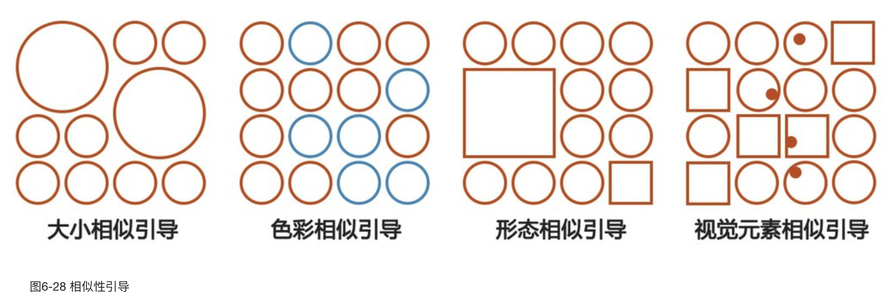

##### 方向性引导
在选定观影日期和影院后，用向下的箭头引导用户去选择具体场次，如图6-30所示。

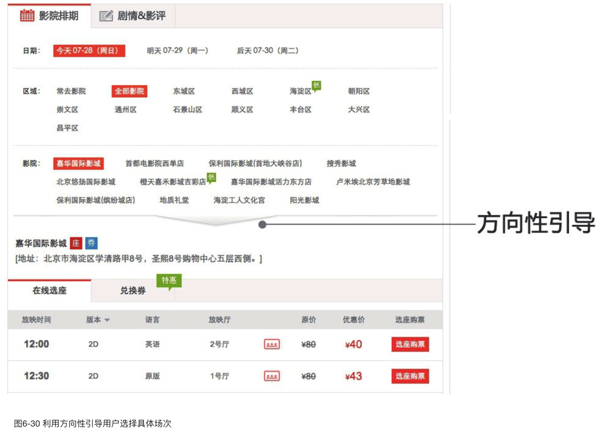

清晰的视觉纵线也可以建立起无形的方向性。图6-31所示为2款博客产品的编辑后台。第1款产品中，所有信息都居左对齐。同一方向上的视觉顺序，使页面向下的逻辑关系很明显。清晰的方向性可以提升用户完成任务的效率。第2款产品的视觉焦点左右跳跃，打乱了用户完成任务的视觉顺序，在方向性的引导上稍显混乱。

图6-31 清晰地视觉纵线可以建立方向性

##### 运动元素引导
运动元素引导，就像是用户的小向导，带领用户找到下一步该往哪走。在设计选座页面时，需要引导用户在页面左侧选择座位，然后到页面右侧区域去确认购票。这时，在用户选座后，所选座位会变成一张电影票的形状，按照图6-32中虚线的运动轨迹，“飞到”右侧订单确认区。用户的视觉马上就会被牵引到页面右侧，去继续下面的操作。

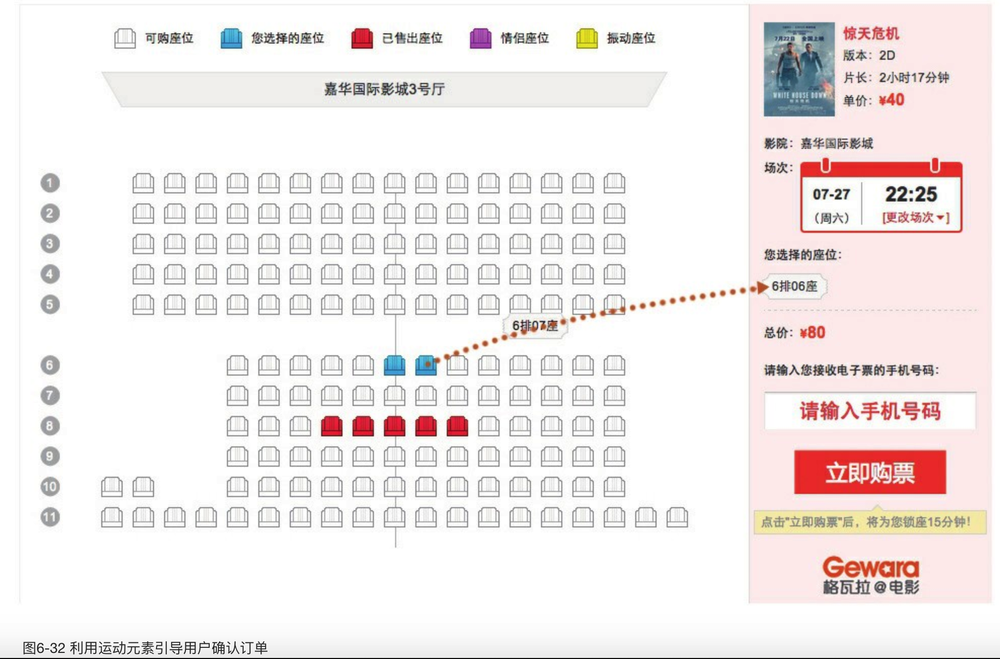

##### 向导控件
向导控件（Wizard）是一种常用的交互方式，用来引导用户完成多步操作。Wizard在英文中是巫师的意思。向导控件就像神奇的巫师，可以在陌生的页面环境下，为用户指引路线。同时，还可以告诉用户，要完成任务一共需要多少步骤，你现在所处的步骤是哪个，还有多少步可以完成任务等。让用户对整个操作有个预期，帮助迷失的人们找到前进的方向。跨越多个页面的购票过程，也可以用向导控件的方式进行引导，如图6-33所示。

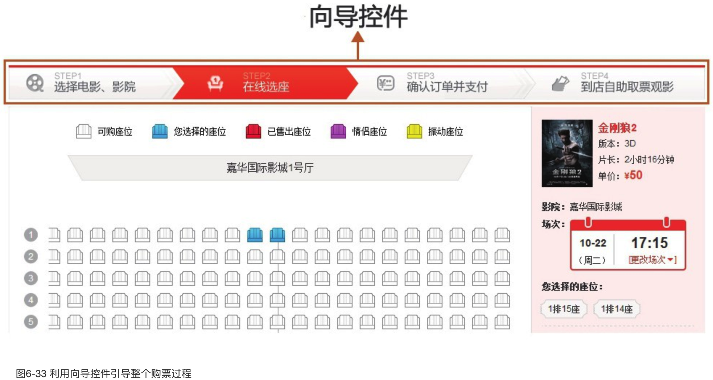

### 6.2 设计友好而易用的界面
#### 6.2.1 如何简化复杂的操作
##### 减少冗余步骤和干扰项
多一次跳转，意味着多一次注意力的转移，多阅读和理解一个页面的信息。减少一个不必要的步骤，会让用户操作起来觉得轻松很多，如图6-34所示。

图6-34 团购导航网站使用流程

##### 将复杂操作转移给系统
每一个过程都有其固有的复杂性。无论在产品开发环节还是在用户与产品的交互环节，这一固有的复杂性都无法依照我们的意愿消失，而只能设法调整、平衡。复杂性存在一个临界点。超过了这个点，过程就无法再简化了。你只能将固有的复杂性从一个地方转移到另一个地方。

在交互设计中，如果已经到了这个临界点怎么办？我们可以将复杂操作从用户转移给系统，让机器代替用户进行操作。

在GoogleMaps中，如果用户想查询路线，就一定要输入起点和终点，这是无法省略的过程。但是在查询路线时， GoogleMaps会利用定位功能自动将起点定位为“我的位置”，减少用户的操作，如图6-36所示。

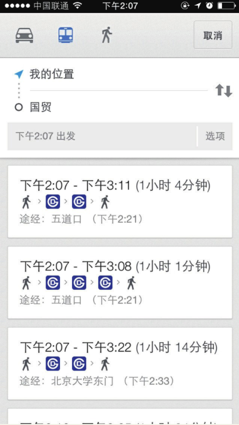

图6-36 GoogleMaps定位“我的位置”

##### 简化操作方式
几年前我们是怎样使用手机的？想要选择一个功能，需要用“方向键”上、下、左、右来回移动。当焦点移动到要选择的功能时，再按下“确认”键。而现在，我们使用智能手机时，想要选择哪个应用，只需直接用手指点击就可以了，操作流程得到了大大简化，如图6-37所示。

以前我们在浏览网页时，看到一个想去了解更多的词会怎么做呢？我在一篇文章中看到一本书，叫做《超级整理术》。我并不清楚这本书讲了什么内容，想去了解一下。于是我选中这几个字，点击鼠标右键复制，在浏览器中新建一个标签页，打开Google，在搜索栏中右键粘贴，点击“搜索”按钮。直到有一天，我在使用Chrome浏览器的时候发现，在复制操作的下方，有一个“用Google搜索‘xxx’”的选项，只需点击这一选项，浏览器就会自动弹出一个标签页，把我要的结果搜索出来。“选中—右键复制—新建窗口—打开网站—粘贴—搜索”这一复杂的过程就变成了“选中—右键点击Google搜索”，只需2步，轻松完成任务，如图6-38所示。

想想安装应用程序时Windows系统是怎么做的？让你去阅读安装许可协议，选择安装在哪个盘中，不停地点击下一步，还有很多高级选项让你去琢磨和修改。而在MacOS系统下，用户仅需要简单地拖拽，将应用图标拖到Application文件夹中即可完成应用程序的安装。

##### 优化操作过程
操作中得不到反馈，发生错误后重新填写，比操作流程的冗余更加可怕。提供合适的首选项、适时帮助、及时反馈、提供合理的默认值，等等，这些细节的优化，可以帮助用户降低出错几率，使他们能够更快、更顺畅地完成任务，如图6-40所示。

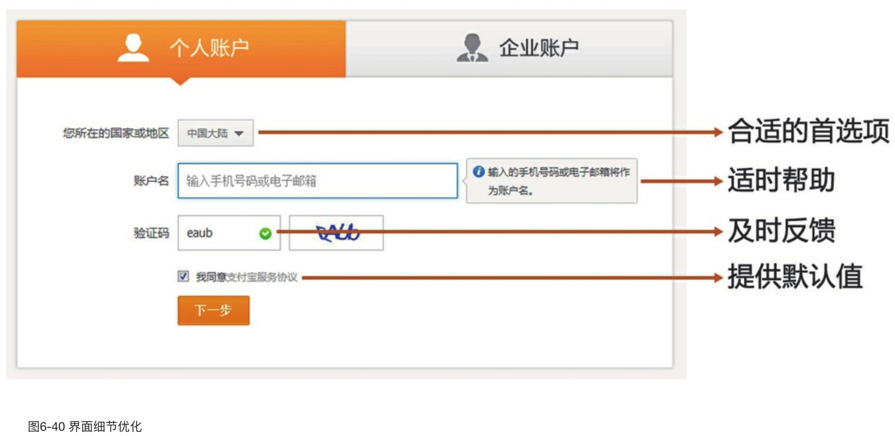

iPad在更新系统时，会提前检测用户的电量。如果电量不足以支撑完成更新，会提示用户将iPad插上电源再来更新。如图6-41所示。

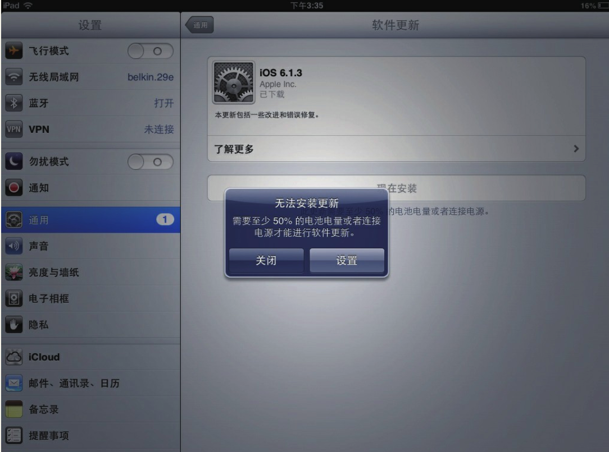

图6-41 iPad更新系统时的提示

#### 6.2.2 信息量太大，页面怎么摆
##### 让页面层次不言而喻
在设计以信息呈现为主的界面的时候，我们可以将要呈现的大段信息分解成易于理解的信息模块，根据“用户想看到什么”和“我们想让用户看到什么”，为内容模块排列优先级。再根据用户的浏览习惯，将不同优先级的信息放置到相应的页面位置。这和分析用户任务（详情参见6.1.4小节）的过程类似，都遵循`“分解—排列—组织”`的原则。

在视觉呈现上，我们要突出信息模块之间的逻辑关系。逻辑相关的信息在视觉上分为一组，内容或重要程度不同的信息在视觉上体现出差异，逻辑上有包含关系的信息在视觉上进行嵌套。

逻辑相关的在视觉上分为一组：让相关的信息在视觉上分为一组。可以利用`“接近原则”`，将相关内容组织到一起，以使页面之间的逻辑关系更清晰。

在设计界面时，将元素分好类后，在模块与模块之间、段落与段落之间、广告与内容之间、标题与正文之间划分几个固定的高度。在为整个页面排版的时候，严格按照这几个间距进行排布，从而形成整个页面模块与模块、内容与内容之间的节奏感。用不同的间距表明界面内容的关系，如图6-43所示。

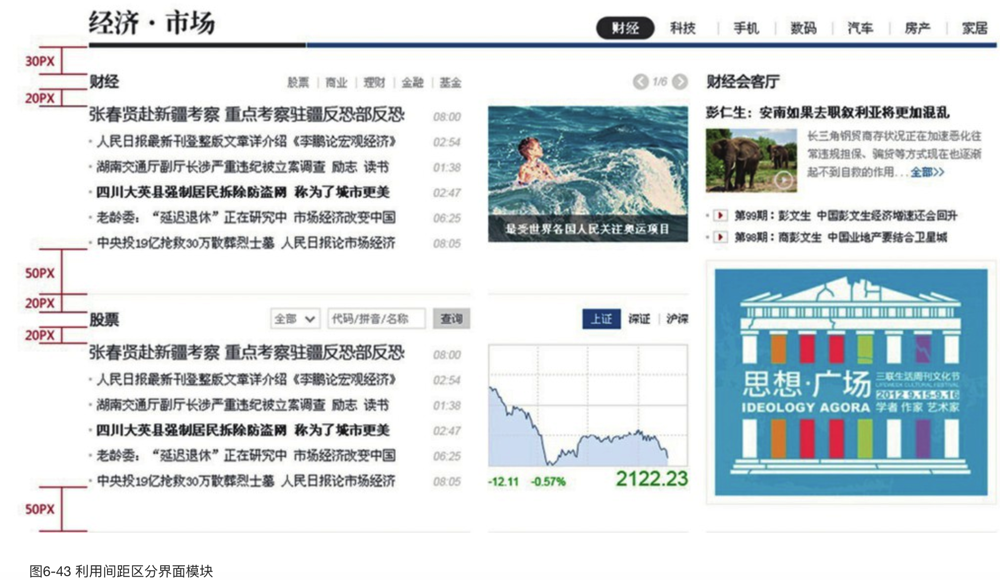

内容或重要程度不同的在视觉上体现出差异：对于同类信息可以使用`“接近原则”`，对于内容或重要程度不同的信息就要使用`“差异原则”`。

例如，在一个资讯类网站中，对于普通的新闻和特色模块采用了差异化的表现形式。普通新闻采用文字列表的形式，特色栏目采用“图片+文字”的形式，使得每个区块之间可以明显区分开来如图6-44所示。

逻辑上有包含关系的在视觉上进行嵌套：逻辑相关的部分，在视觉呈现上也应该是相关的。要让用户一眼就能看出内容之间的关系。

如图6-45所示的界面，通过使用同一白色背景，可以清楚地看出页面的内容包含于上方导航的第一个标签。左侧竖排的标签带有明显的指向性，表明页面中部的大图属于左侧第一个标签。带有反差的紫色区块表明页面的重点，深蓝色背景上的黄色按钮“BuyNow”对比强烈，引导着这个页面的主要操作。界面中不同层级的标题也采用了不同的字号和颜色，层级越高的标题字号越大、颜色对比越强烈，使得标题之间的包含关系不言而喻。

##### 让重点信息“跳出来”
我们可以通过视觉设计的方法，如字体加大加粗、色彩对比、添加背景色、留白等，强调界面的重点元素。而其他非重点的元素应该尽量藏起来，或是显得暗淡些，从而使界面的重点“跳出来”。

图6-46所示是一个电商网站的评论模块。对于商品的评价，用户最先想看到的，是商品的综合评分。然后会扫描每条评论的标题和个人评分。当看到自己感兴趣的标题时，才会仔细查看评论内容。所以此模块的设计，通过字体加粗和色彩对比，突出了综合评分、每条评论的标题和个人评分。而对于大量的评论内容，则显示成灰色的小字，让用户在扫描页面时可以首先看到重要元素。

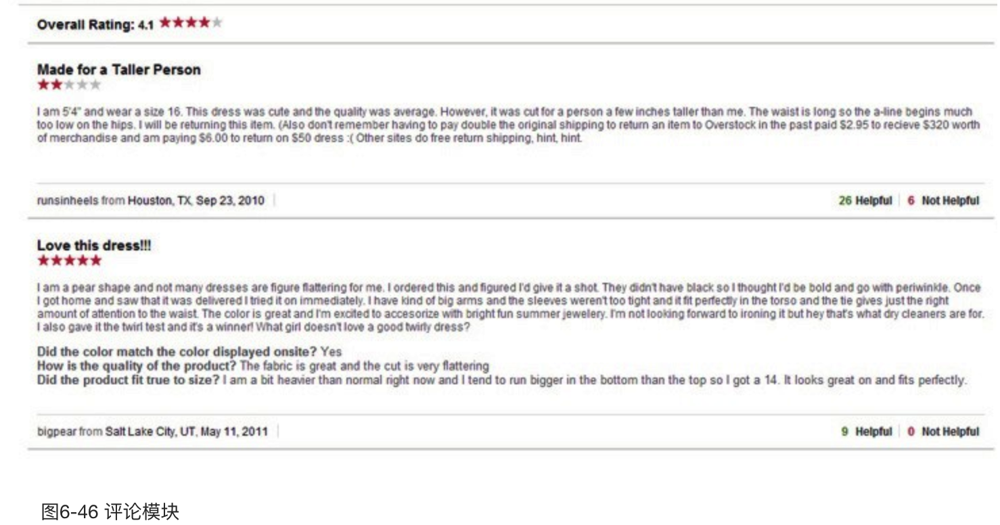

如图6-47所示，Gmail收件箱的界面。对于用户来说，未读邮件是更需要被首先看到的，所以文字和背景色采用了更强的黑白色对比，同时加粗文字用以着重强调。而已读邮件是用户已经阅读过的内容，可以弱化显示，所以采用了较弱的黑灰色对比。

##### 将次要信息“藏起来”
为了不影响新手和中间用户使用，我们应将那些次要的信息“藏起来”，待用户需要时再将它们展示出来。

如图6-48所示的Google首页。将Google的产品分为了3个层级：用户最常用功能放置在导航栏上；使用频率次之的功能放置在“更多”展开的菜单里；在菜单的最后一项还有一个“更多”，点击这里会跳转到Google所有产品的列表页，使用频率最低的功能被放置在这里。有效的隐藏使大多数用户可以快速找到常用功能。在找不到时，会自然地去点击“更多”，从而发现那些高级功能。

Google应用商店也使用了将次要信息“藏起来”的策略，如图6-49所示。当鼠标悬浮到某个应用上时，会显示应用的评分及详情。当用户觉得这就是我想要的时，快速地操作按钮就可以直接将应用添加到Chrome浏览器。隐藏策略不仅可以让界面重点更突出，减少复杂信息对用户的干扰，还可以减少跳转，满足用户的快捷操作。

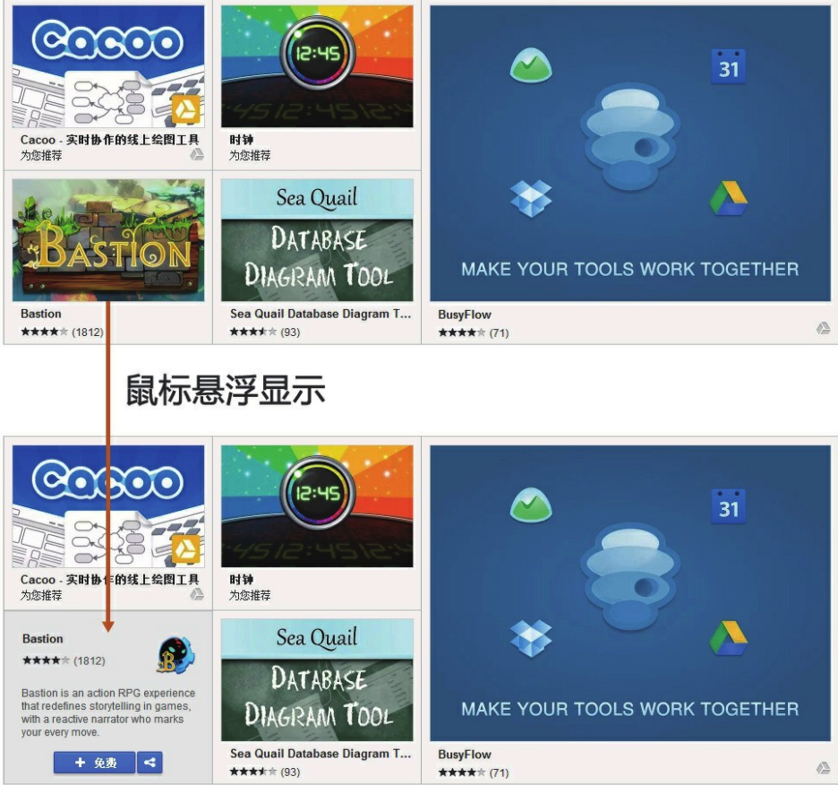

图6-49 Google应用商店

#### 6.2.3 理性的规划VS感性的界面
##### 以人为本的界面设计
目标明确的用户在使用产品时会按照流程一步步完成任务，而对于目标不明确的用户，则需要通过更多的展示内容来吸引他。举个例子，比如淘宝的收藏夹和购物车页面，它们的内容其实是类似的，如图6-50所示。

这正是因为考虑到了用户的使用情境和心理感受。如果用户对商品感兴趣，但又不急于购买，就倾向于把商品放到收藏夹中；如果用户的购买意愿较强，就会倾向于放到购物车中。所以，收藏夹需要适度地突出图片、评论、人气等内容，吸引用户去购买；而购物车则应尽量简洁明了，不过多干扰用户，方便用户迅速下单。

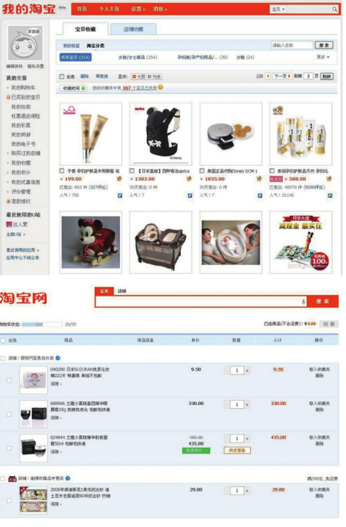

图6-50 淘宝收藏夹与购物车

##### 帮助用户找到想要的东西
信息组织与分类的目的，就是要让信息易于找寻。让有明确目标的用户，能够快速找到所需信息；有不确定目标的用户，通过浏览和寻找，一点点明确自己的需要，最终找到信息；让没有目标的用户在探索中激发需求。所以，互联网产品中信息的组织与分类，要满足这3种情况。

图6-51所示为电子商务网站eBay的首页。明确自己想要买什么的用户，可以通过搜索框快速找到特定商品。对于自己要买的商品有大概目标的用户，可以使用页面左上方的商品分类，在特定的类目中寻找商品。完全没有目标的用户，则可以浏览最近热销或是有折扣的商品，在“闲逛”中激发购买需求。

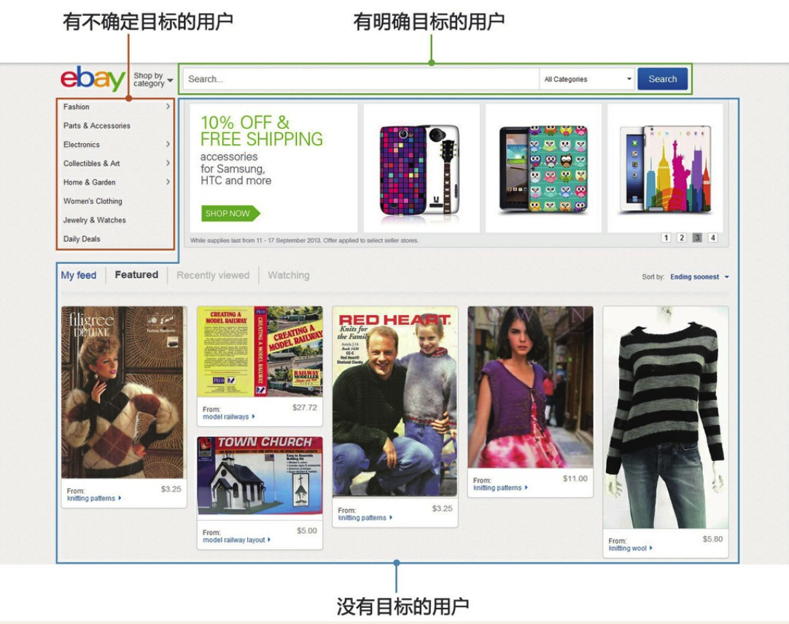

图6-51 eBay的首页

新闻资讯类网站同样如此。图6-52所示为BBC新闻网站的首页。大部分用户浏览新闻资讯类网站并没有明确的目的，只是想知道最近发生的热门事件。页面的大部分内容为这部分用户提供了资讯。希望浏览某一分类下的资讯，或是有明确目标想要查找具体信息的用户，也可以在页面上找到他们想要的信息。

图6-52 BBC首页

##### 吸引无目标用户
图6-53所示为新浪微博登录页面。对于有微博账号，想要登录微博浏览信息的用户，这个页面的逻辑没有任何问题。页面没有太多干扰，用户可以快速找到登录框，完成操作。对于没有账号想要注册的用户，页面也提供了明显的“立即注册”按钮。但对于那些听说过微博，不知道它是做什么的，没有账号，想要了解又懒得注册的“闲逛型”用户来说，这个页面的内容完全无法吸引他们。这部分用户很可能因为无法了解更多而流失掉。

图6-54所示为知乎登录页面，在页面最显眼的地方提供了登录框，页面下方推荐了高质量用户和热门话题的一些问答，让用户在没有注册时，也可以对网站内容略知一二。

图6-55所示为改版前和改版后的Flickr注册页，哪个界面逻辑更清晰呢？显然是改版前。改版前的页面提供了明显的“立即注册”按钮，明确地告诉用户，注册Flickr后可以干些什么——上载、发现和分享照片。但哪个更吸引人呢？肯定是改版后的。高质量的照片墙告诉用户，在这里有最棒的摄影作品。

图6-55 Flickr注册页

##### 符合用户心理模型
图6-56所示为2款天气类应用。从逻辑上看，第1款应用似乎更加清晰，用最大的数字表示今天的天气情况，用列表展示未来几天的天气预报，用户理解起来应该不存在任何问题。但用户在看到这个界面的时候，可以直观出感觉到今天是不是很热，明天会不会更热吗？虽然可以通过温度的数字对比出近几天的温度，但感受上没有那么直接。而第2款应用，通过颜色的变化和数字的高低，让用户直观地感受到天气的变化趋势。仔细观察还可以发现，界面背景会有向下波动的波纹，可以让用户更加贴切地感受到，气温是在下降的。

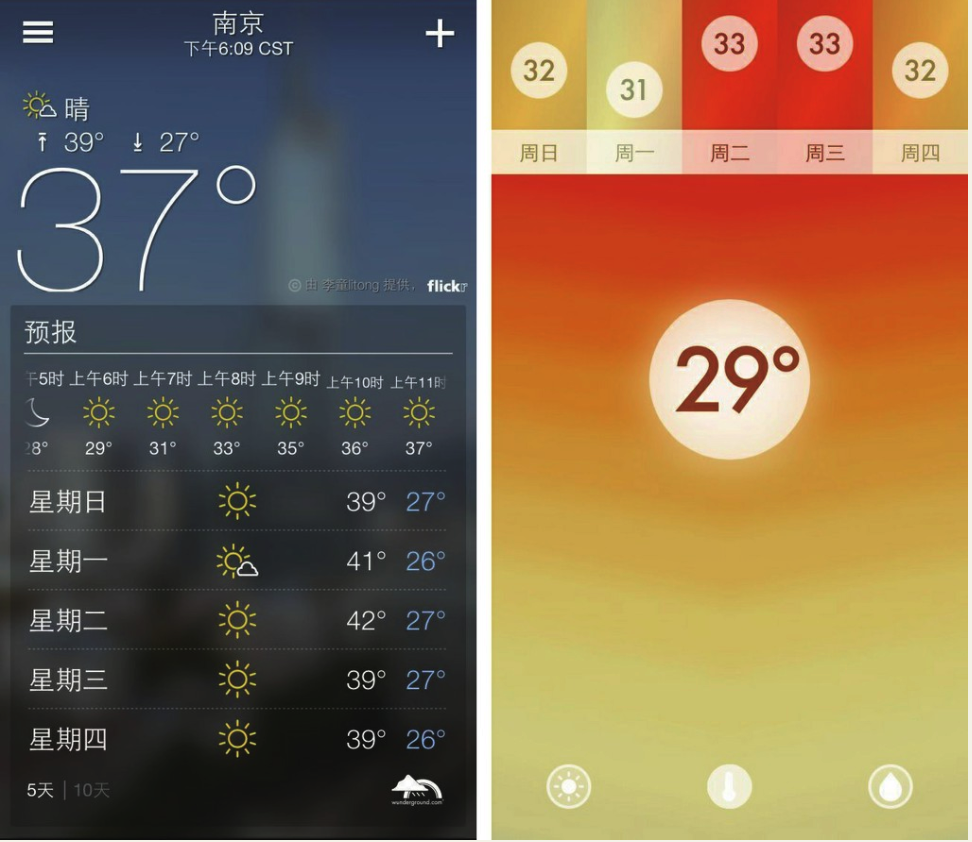

图6-56 2款天气类应用

### 6.3 捕获用户的芳心
#### 6.3.1 来自真实世界的灵感
##### 拟物化的视觉
最直接的借鉴现实世界的设计方式就是拟物化。通过模拟现实中的物体，使用户产生熟悉感，让信息与功能更加易于识别和理解。

如iOS6中备忘录的设计，细腻地模拟了皮革和纸张的材质，光照、边角、装订线、画笔圈出的效果都表现出了真实世界的肌理材质，让用户一看到就有一种亲切感，如图6-57所示。

图6-57 iOS6中备忘录

EvernoteFood是一款帮助用户记录其所钟爱的美食的应用。精致的寿司图标传达出对美食精巧工艺的追求。对食材和餐盘质感上精细的打磨，更加体现出应用追求高品质饮食文化的内涵。Moves是一款记录用户每天运动状况的应用。只要随身携带手机，它就可以自动记录和统计人们每天走路、骑车、跑步的时间、里程和卡路里消耗情况。图标的拟物化设计，传达了应用的使用方式。只需将手机装在口袋里，就能够养成更加健康的生活方式。当人们看到PuddingCam的图标时，不用解释就知道它一定是一款拍照应用。富有光学质感的镜头，已经成了摄影类应用图标的标准配置。这些拟物化设计的图标可以让用户一下子就明白应用的用途，如图6-58所示。

抽象出物体中最有特征的部分，将繁复的视觉元素进行简化处理，一样可以设计出既简约又可以调动起用户情感的产品。

如图6-59所示的两款音频播放类应用，左边Podcast的应用界面模仿了磁带录音机的各个部件，试图最大限度地还原实物的质感，但是视觉元素过于复杂，给用户带来了认知负担。右边网易云音乐的应用界面没有将留声机的所有部件都照搬到界面上，而是提取了最有特征的两个元素：唱片和唱针。在调动起用户复古情怀的同时，也保持了界面的简洁性。

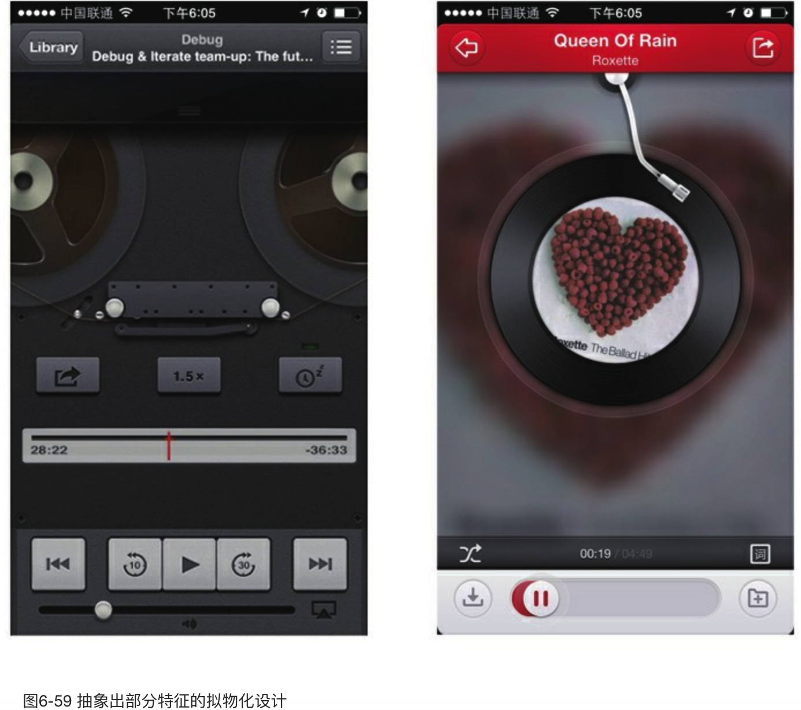

图6-60所示是一款天气类应用Hue。当你第一眼看到它时，一定会觉得它的设计风格是扁平化、简约化的。但是当你仔细看过它后，会发现Hue的设计灵感同样来自真实世界。Hue中不同的天气会有不同的颜色。晴天是橙红色，阴雨天是不同程度的蓝色，与现实中不同天气给人的感觉是一样的。由此看出，拟物化与扁平化并不是完全对立的两种风格。提取天气的色彩特征，其实也是一种拟物化的设计。拟物设计也可以在情感和效率之间达成平衡。

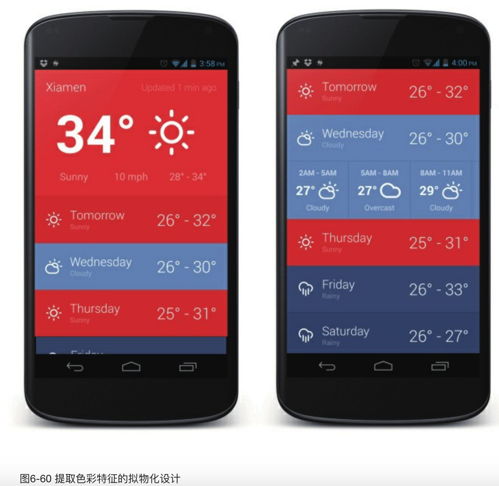

##### 隐喻化的操作
视觉表现难以拟物时，也可以通过模拟现实中的操作，使用隐喻的方式让用户对操作感到熟悉。

比如很多手机应用的设置界面，都设计在主界面的背面。当单击“设置”按钮时，主界面采用翻转的动效，与设置界面形成一种空间关系。这样的行为方式很容易使人们联想到现实生活中对一些机器的设置，如调整闹钟时间的设置开关在闹钟背面、相机的设置按钮也在相机背面。iOS中设置项开关的设计，也模拟了现实世界中电灯开关的操作方式，拨动一下打开，再拨动一下关闭，如图6-61所示。

iOS中的文件夹，就像现实生活中的抽屉，如图6-62所示。当点击文件夹时，展开的动画就像是拉开一个抽屉，用户一看就会明白。关闭和打开文件夹是对称的操作，只需再次点击文件夹即可关闭。这种操作之间的逻辑关系，形成了一种空间感。这种逻辑关系越符合现实，就越容易让用户理解。

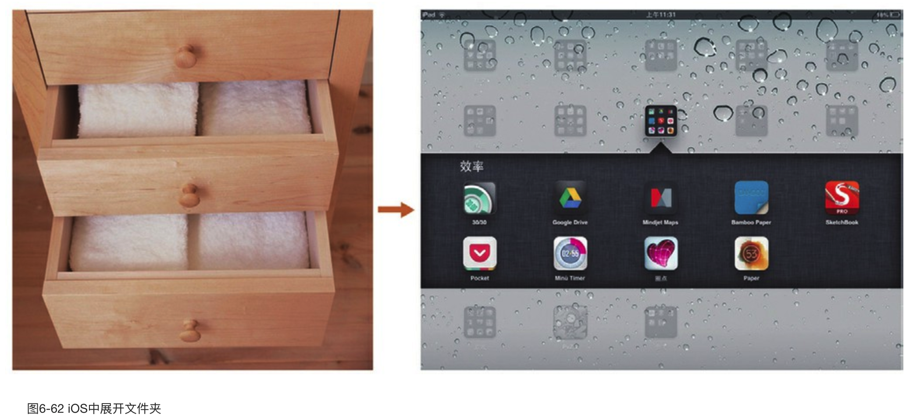

#### 6.3.2 贴心的设计惹人爱
##### 可控的感受
调查表明，如果界面没有任何提示，80%的用户等待超过2秒就会直接关闭窗口。如果界面有提示或是加载状态，用户的离开率就会极大地降低。加载状态提示可以增加用户对界面的可控感，形成操作预期，使用户安心，如图6-64所示。

如果在写笔记时，操作失误，关闭了浏览器窗口，而系统却没有提醒我们，就像是在公路上开车，前面有个坑，却没有任何警告，会令我们措手不及。图6-65所示为Evernote关闭窗口时的确认提醒信息。

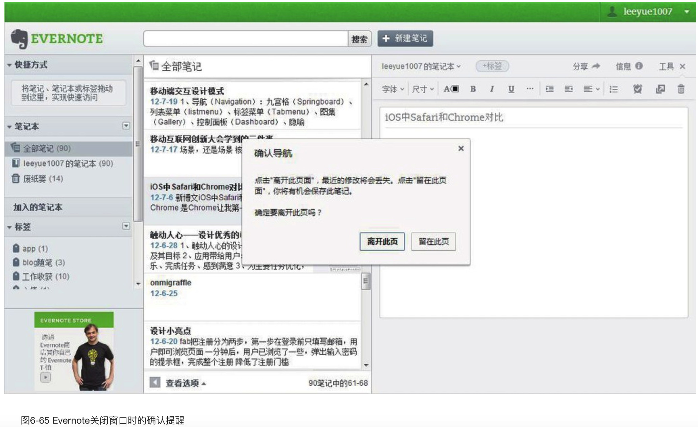

很多即时通信应用都会为用户展示对方的状态，显示对方是否正在输入，或是对方是否已读消息，让用户知道对方的情况，感知到对方的存在。这样的设计可以缓解等待的焦虑感，给用户一种期待，增强用户的可控感，如图6-66所示。

##### 积极的反馈
人们在表达之后，总是希望得到积极的反馈。提供积极反馈是与用户互动的一种方式。

时间管理类应用iHour在用户新建第一个任务后，会奖励用户一个闪闪发亮的奖章，增加用户的成就感。在使用一段时间后，用户还会获得更多的奖章，进而激发起继续使用的兴趣，如图6-67所示。

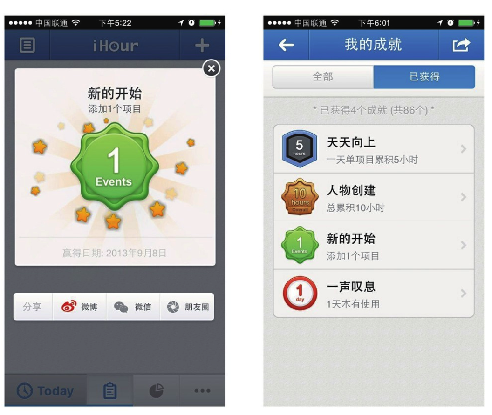

图6-67 鼓励新手用户

Lumosity是一款训练用户记忆力、注意力、应变力等大脑核心能力的移动应用。通过鼓励用户坚持每天完成一系列益智训练的小游戏，帮助用户提升大脑的能力。为了使用户增强信心，坚持每天锻炼，Lumosity在每一个环节都给予用户积极的反馈。在完成游戏的每一个小关卡时，闪动出的绿色对勾会告诉你离成功又近了一步；完成一个游戏时，会有对话框弹出，展示出“你太棒了”或是“继续加油”等鼓励的话语；当用户完成一天的任务时，Lumosity用一个大大的对勾符号祝贺用户完成了训练。这一系列的积极反馈，都让用户感到信心倍增，加快了他们完成任务的速度，如图6-68所示。

##### 贴心的提醒
在使用产品时，用户难免会有遗忘或是疏忽的时候。此时给予用户一些贴心的提醒，可以提升用户对产品的好感。

看看著名的问答网站Quora是如何通过贴心的提醒来解决用户登录问题的。在用户刚刚打开网站准备登录时，在用户的输入框内会提示账号类型是电子邮箱。我们可能会去注册很多网站，每个网站都有不同的用户名，但一般每个用户的常用邮箱数量并不会太多。提示账号类型虽然是个不起眼的小细节，但却可以帮助用户快速试出自己的账号。当输入邮箱后，Quora会及时校验这个邮箱是否曾经注册过。如果邮箱有误，登录框马上会告诉用户此邮箱还没有注册，并提供一个马上注册的链接入口。如果是注册过的邮箱，Quora会在输入框前直接显示出用户头像，以一种可视化的方式，来帮助用户确认信息，并在密码输入框的下方提供找回密码的链接，如图6-69所示。这样，用户在登录时就会很清楚地知道，自己的邮箱是尚未注册，还是注册过但忘记了密码。这样人性化的提醒方式，帮助用户解决了很多登录过程中会遇到的问题。

在发送电子邮件时，忘记添加附件或是忘记写主题是人们常犯的错误。如果是很重要的工作邮件，这样的疏忽也许会造成严重的影响。如今，很多电子邮件系统都可以在用户发送邮件之前发现这样的错误。如果用户在邮件内容中提及了“附件”2个字，却又没有添加附件，邮箱会自动提醒用户“邮件中显示您可能希望发送附件，但实际没有任何附件，您确认继续发送吗？”。对于没有填写主题的邮件，系统同样会弹出确认窗口，如图6-70所示。

图6-70 发现用户可能疏忽时的提醒

除了运用文字直接提醒用户之外，还可以通过界面元素状态的改变给予用户提醒。例如，很多新闻阅读类客户端会改变已读文章的颜色，降低其饱和度，使用户不要过多关注于已经阅读过的内容。在iOS7中，最新更新过的应用名称前方会出现一个小蓝点，提示用户哪些应用是刚更新过的。在电子邮件客户端Seed中，未读邮件会用绿色的竖条和圆点明显标出，提醒用户这些消息是还没有阅读过的，如图6-71所示。

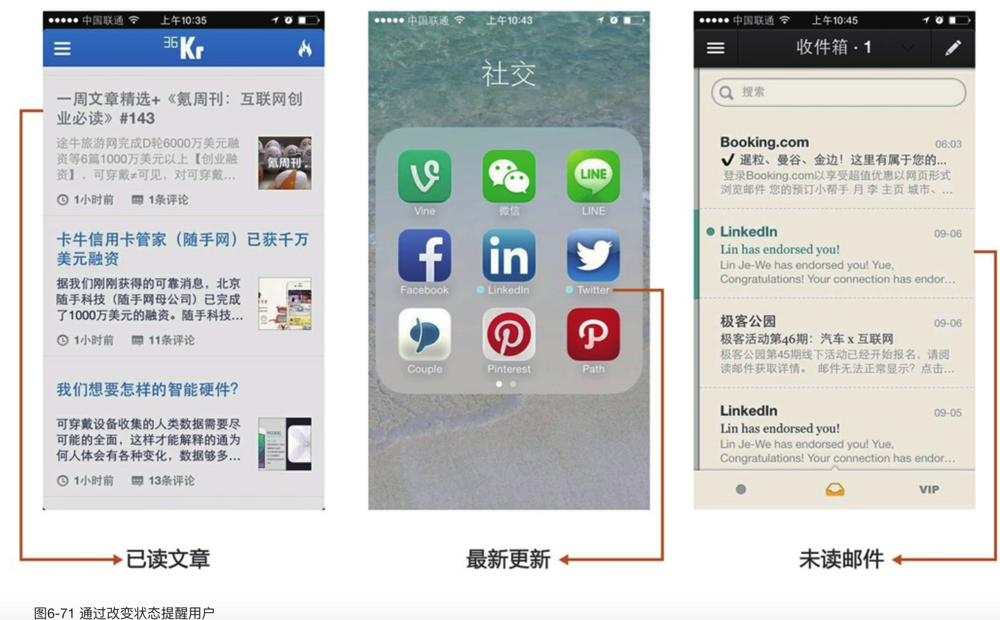

#### 6.3.3 如何调动用户的情感
#####  互动的乐趣
丰富的动效可以使界面更加生动、充满活力，也可以提升产品的品质。在Path2.0刚刚上线的时候，我经常没事就会就打开Path，点击左下角的小加号。新颖的导航形式和动态效果令人爱不释手，总忍不住想多点几下。风靡一时的待办事项类应用Clear，最大的卖点就是自然的手势操作和有趣的交互动效。新建事项时，新的条目会以折纸的方式打开，上、下、左、右滑动和打开捏合的动画效果都十分流畅。虽然待办事项类应用层出不穷，但Clear还是凭借独特的动效和视觉效果赢得了iPhone用户的青睐。像这样具有完美动效的应用还有很多，例如一款名为ARTREE的手机应用。用户可以在屏幕上随意画出树干的形状，在宁静美妙的音乐背景下，你所画的树干上会长出树枝和花朵。富有艺术感的图案配合精致的动效，令用户乐趣倍增，如图6-72所示。

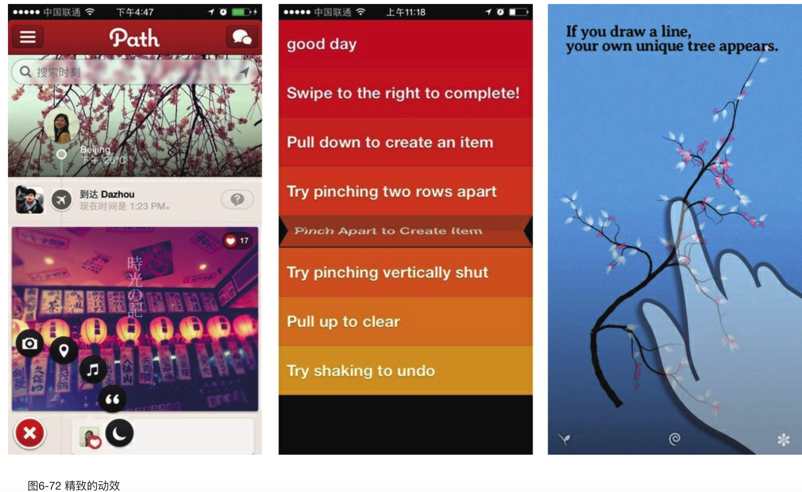

手机应用里各种有创意的闪屏界面、设计得幽默又友好的404页面（见图6-73）、对话框中精细设计过的文案、有问必答的Siri……想想最早的DOS命令界面，再看看如今的界面设计、机器与用户的对话方式更加自然化和情感化了。

在淘宝触屏版中，用户将商品添加到购物车时，点击操作之后会有一个小车子从屏幕右边滑出，将商品运送到界面左下角的“淘+”。随即，“淘”字变为了购物车的图案，还会在屏幕上抖动几下。积极有趣的反馈方式令用户觉得操作得到了充分的响应，希望与界面互动的情感得到了满足，如图6-74所示。

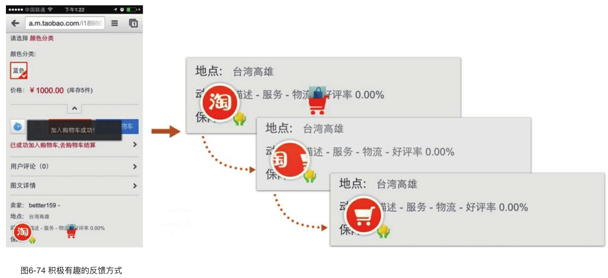

##### 惊喜的力量
微信中有很多让人津津乐道的彩蛋。在聊天时发送特定关键词，会触发一些绚丽的背景特效。这些彩蛋并不是固定的。会在特殊的日子根据特定事件为用户送去新的彩蛋，在不打扰用户的情况下给人们带来一些小惊喜，如图6-75所示。

在某一年的圣诞节，Google也在搜索中隐藏了一些小乐趣。虽然天气不受我们的控制，浪漫的圣诞节不一定能够下雪，但在Google中搜索“Letitsnow”，屏幕上就会飘起雪花，非常有圣诞的气氛。随着越来越多的雪花飘落，屏幕上还会结霜。此时，用户可以用鼠标在屏幕上作画，就像在结了霜的窗户上作画一样，如图6-76所示。

##### 情境的烘托
为产品设计一个故事情节，通过视觉、动画和音效的烘托，把用户带入一个情境中。

QQ便民的充值中心在春节期间设计了一个活动页面，选取了春运、年终奖、打电话拜年等过年时常见的场景，对保险、彩票、充话费等业务进行推广。它希望通过人们熟悉的场景，引起用户的共鸣，将推广活动融入到用户的生活环境中，如图6-77所示。

BenTheBodyguard是一款保护手机隐私数据的iPhone应用。产品设定了一个手机私家保镖Ben的角色，让他时刻保护着手机的安全。这款产品的Web官方介绍页面让这名私家保镖穿梭在黑暗的街道上，他会一边行走一边告诉用户“现在是一个危险的时代”，“如果有一天你的手机被抢了，手机中的秘密将会公之于众”，“我可以保护你，无论是你的照片、密码，还是其他”。随着故事情节的发展，用户不自觉地沉浸其中，慢慢了解起这款应用的功能特色，如图6-78所示。

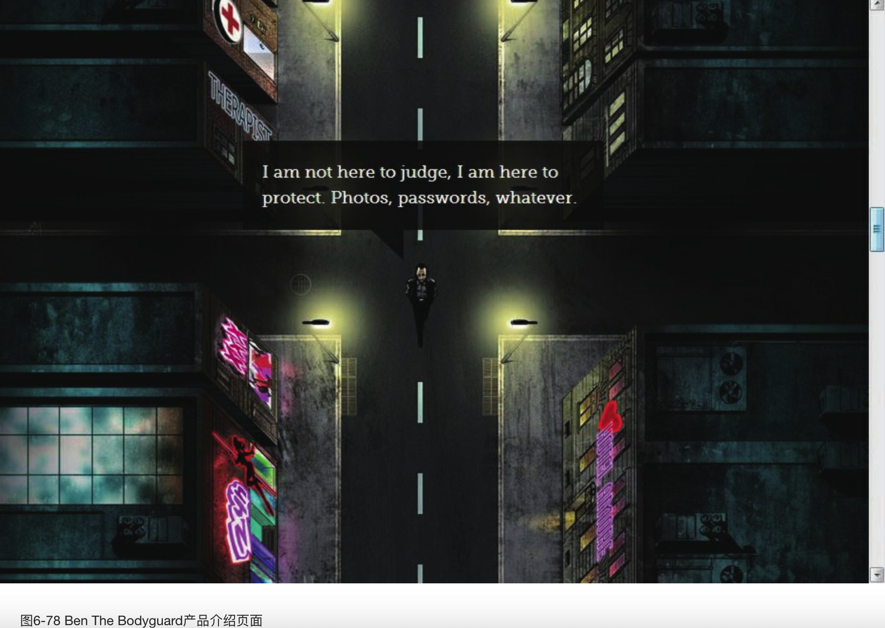

如图6-79所示，在iPhone中使用这款产品时，Ben仍然保持着故事角色中的姿态，用酷酷的口吻告诉用户：“Ben在默默地保护着你的安全。”

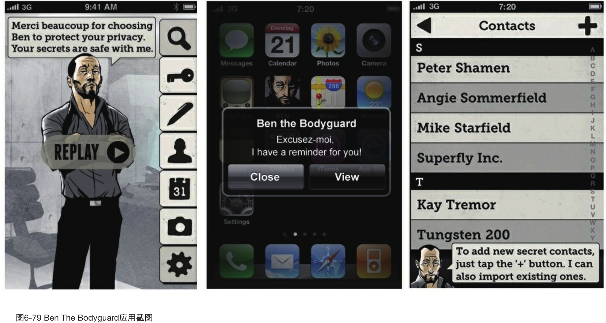

### 6.4 快速表达我的想法——纸面原型
#### 纸面原型的目的
纸面原型的目的不是为了交付，而是为了沟通、测试，尽快地解决那些不确定的问题。纸面原型更具有可塑性，可以快速修改和重建，帮助设计师探索尽可能多的想法并否定掉那些不靠谱的想法。设计师只要有创意，就可以快速画出草图，与项目相关人员沟通。只需要很少的时间就可以收集到反馈，验证设计的可行性。最终确定出最合适的设计方案，再进入下一个设计表现阶段。

使用纸面原型还有一个好处。当我们已经通过纸面原型确定了大致的方案时，也就同时确定了产品的框架、主要流程、基本信息和功能等。

#### 使用什么工具？
纸面原型不需要什么高级的工具和复杂的技巧，可繁可简。可以使用最简单的铅笔和纸张，快速画出草图。如果希望表达出界面的逻辑，可以使用马克笔、双头画笔等，运用粗细不等的线条和阴影关系，画出界面的层次关系。如果希望页面尺寸更准确，还可以使用尺子等工具。如果想表达出交互效果，可以使用便签纸和小卡片，它们可以当作提示气泡、弹出层、模态窗口等，贴在绘图本的任何地方，也可以作为页面标注的工具，说明产品功能。

如果界面上会出现很多可以复用的标准交互组件，而你又不想一次又一次地重复绘制，可以到网上找到标准交互原型组件库，然后将它们打印出来，剪裁成模块贴到页面框架中，与手绘草图配合使用。

如果是团队协作，也可以在白板上进行绘制，便于组织讨论和收集反馈。你可以准备一部相机或带有拍照功能的手机，对白板上的结果进行拍照保存。

由于纸面原型的快速灵活性，有些创业公司甚至已经抛弃了电子版的高保真原型，直接采用纸面原型作为设计师的最后交付物。这对于纸面原型的保真度就有了更高的要求。现在也可以买到成套出售的纸面原型工具，包括绘图模板、设计绘画本、图标模具、标准交互组件等，如图6-80所示。

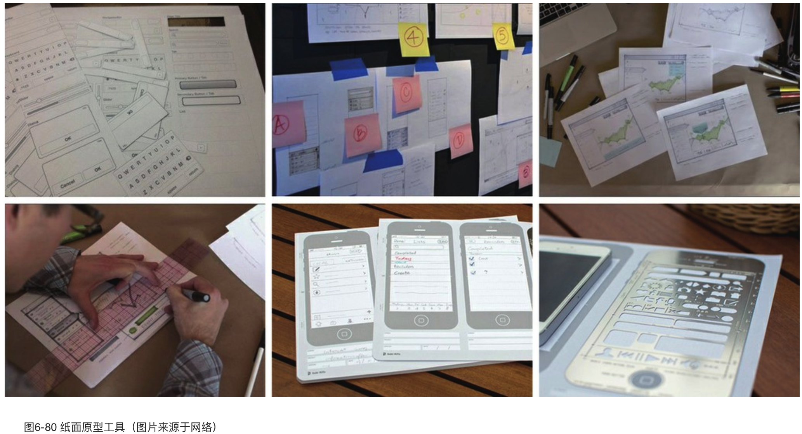

#### 需要表达什么？
纸面原型可以看作是最终设计方案的雏形。其中，最需要关注的是框架、流程、基本功能和内容，可以忽略设计细节。

在前面的章节中，已经对需求、任务、信息、操作等都有了分析，纸面原型需要把这些串联起来。对于界面的逻辑关系，可以用绘制的深浅和颜色来表现。需要注意的是，对于界面上需要特别突出的信息，可以适当添加颜色，但切记不要使用过多，否则有可能会分散注意力，导致无法把精力集中在最重要的关注点上，如图6-81所示。

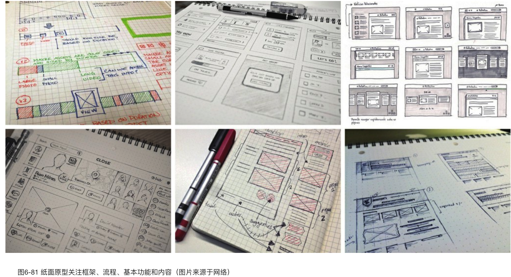

对于移动应用，还可以用纸面原型来表达动效。通过纸张的折叠和左右移动，可以模仿手机中的下拉、滑动分层等各种动效。还可以通过纸张的层叠关系，表现出界面的逻辑，如图6-82所示。

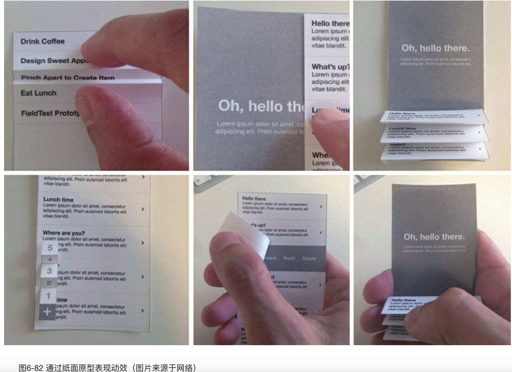

如果你觉得纸面原型难以直观地表现动态效果，你还可以使用“POP-PrototypingonPaper”和“快现”这两款手机应用。设计师只需将纸面原型拍下来，放到这两款应用中，选取特定的区域添加手势操作和链接，就可以实现点击界面后的跳转、切换等效果。这样，设计师就再也不用费力地向项目组成员解释点击这个按钮会跳转到哪里，侧滑这个页面会呼出哪个页面。直观的草图演示可以大大提升沟通效率，如图6-83所示。

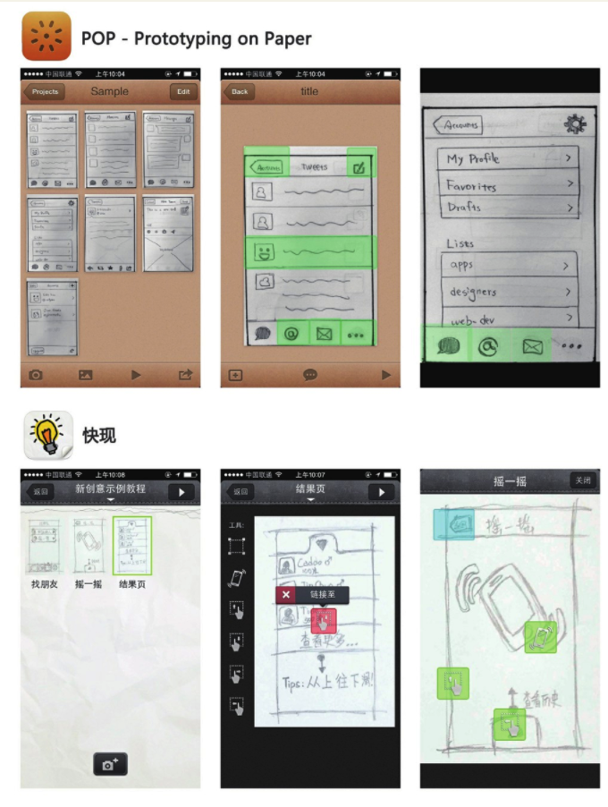

图6-83 制作有动态效果的纸面原型

## 07 设计标准——好的设计需要表达
### 7.1 什么是原型
#### 原型的由来——设计方案的表达
原型是设计方案的表达，是设计师的重要产出物之一，也是项目团队参考、评估的重要依据。它是产品功能与内容的示意图，既包含静态的页面样式（线框图），也包含动态的操作效果（交互说明）。

如果在需求分析前期，产品经理能够和设计师一同确定产品定位，包括目标人群、功能、特色等，后续再根据产品定位、项目资源等情况来筛选不同来源的需求（具体请看第5.1节内容），形成一份能让双方达成共识的文档，那么设计师的工作就会相对简单很多，即通过思考、设计方法等，把需求转化为设计方案，再细化成标准的设计原型。

这就好比产品经理和设计师通过前期的市场分析、竞品分析、用户调研等方式，一致确认市场上最需要橙汁，公司也完全有能力提供，于是产品经理准备好橙子交给设计师，设计师去皮、切片、搅拌，最后榨成了橙汁，如图7-1所示。

就目前的大环境来说，产品经理在项目中还是占绝对主导的地位，设计师更多的是起到辅助作用甚至只是可有可无的角色。产品经理一般来说会按照自己的想法或是仅为完成上级的任务完成需求文档，然后将需求文档交给设计师完成后续的设计工作。这样的需求文档更多的是从商业角度、公司业务、资源限制等方面进行考虑的，对用户的考虑未必周全、也未必正确。

在这种情况下，设计师不应该完全按照需求文档来做设计，而应该在考虑商业性、各种限制的基础上，从用户角度出发，把需求文档“翻译”成设计目标（具体请看第5.3.3小节内容），在一定程度上弥补因流程不合理导致的问题。

这就好比产品经理发现市场上需要果汁，而自己手里刚好有个苹果，于是急忙交给设计师榨苹果汁。可是设计师经过思考、分析，发现用户更爱的是橙汁，如果提供橙汁，用户会更满意，对公司方面也没有不利影响。于是他在产品经理的许可下，把苹果换成了橙子，最终榨出新鲜的橙汁，如图7-2所示。

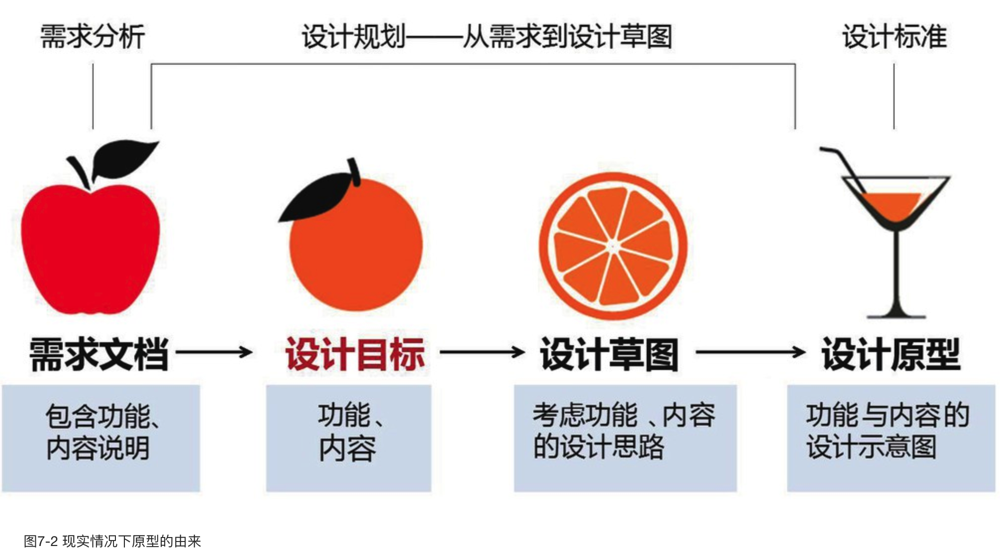

#### 为什么要学习原型制作？
要想成为一个专业的交互设计师，一定要学会产出标准的原型稿。

原型还有一个非常重要的作用：它是项目开发的标准和依据。原型的使用者有`产品经理`、`视觉设计师`、`前端工程师`、`开发工程师`、`测试工程师`，可能还有商务、法务人员等。为了让这么多种不同的角色都能理解你的设计方案，原型务必要表达得清楚、规范。

#### 低保真原型与高保真原型
`低保真原型`：与最终产品不太相似的原型。它可以是纸面原型（草图），也可以是用软件绘制的线框图。

鼓励设计师在设计规划阶段多使用笔纸，快速传达想法。

在比较大型的团队中，设计师最终需要使用专业的软件，比如用Axure、Visio来设计原型，并向团队成员展示设计成果。使用Axure还可以制作一些复杂的动态效果，帮助大家更好地理解，同时也可以使用动态原型做一些简单的可用性测试，帮助发现问题，并快速更改，如图7-4所示。

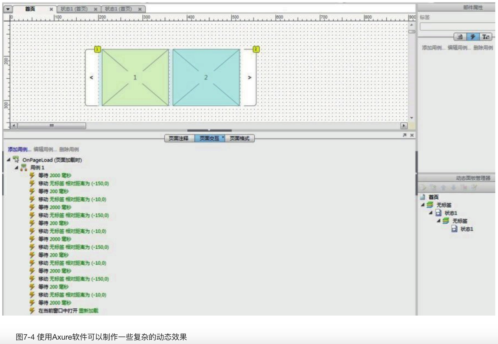

如果是设计移动端产品，推荐使用PowerPoint来绘制原型。PowerPoint里有强大的动画功能，可以演示各种逼真的动态效果，且使用起来非常简单，如图7-5所示。

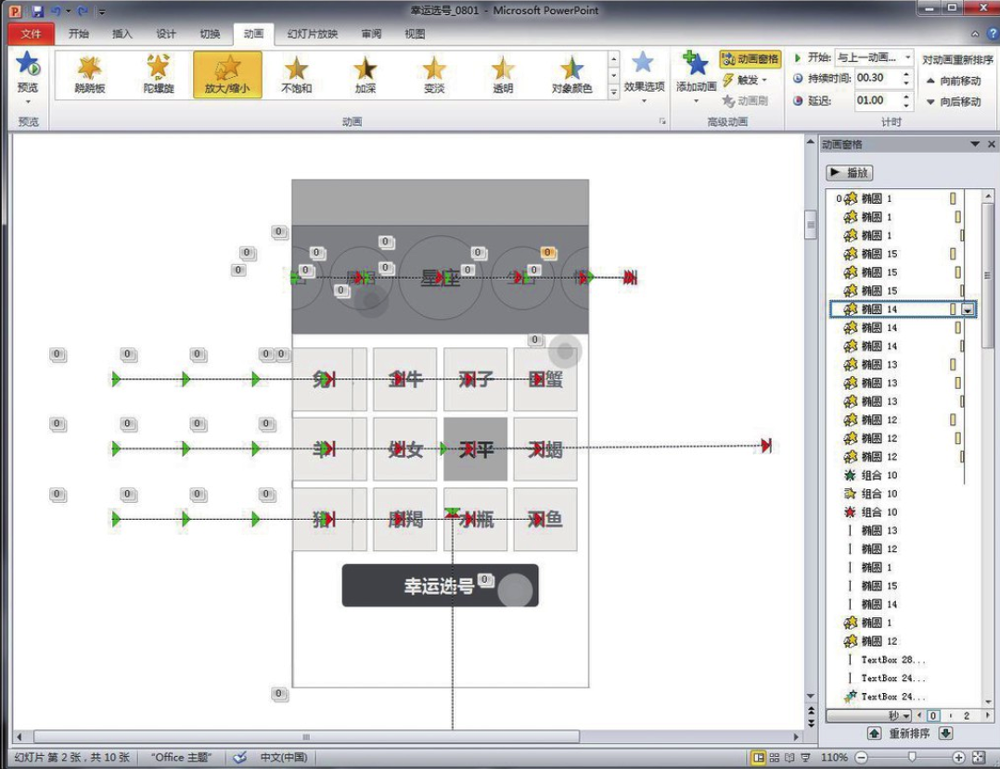

图7-5 PowerPoint强大的动画功能

`高保真原型`：高保真原型在外观、操作上与最终产品基本一致。

### 7.2 标准的原型应该包含什么内容
#### 简要说明与信息结构
`变更日志`：同需求文档一样，原型的设计也不可能一次到位，一般都需要经过沟通、评审后略做调整。

变更日志一般包含日期、变更内容、变更原因、备注等内容，如图7-6所示。

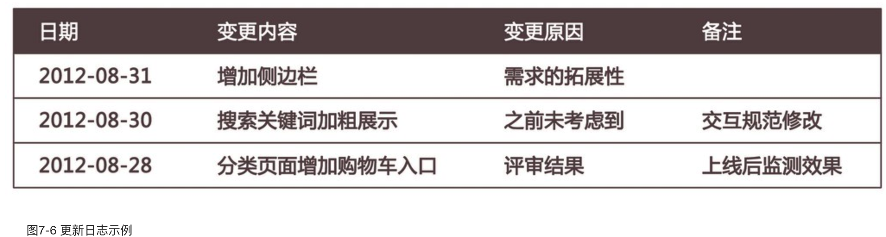

`版本说明`：和更新日志类似，只不过更新日志以天为单位，而版本说明以版本号为单位，适合快速迭代且迭代周期比较固定的项目。比如某产品，每两周固定迭代一次，那么就需要列出版本说明，告诉大家此版本改变了哪些地方，让项目成员一目了然。

版本说明需要包含版本号、日期、更改内容等，如图7-7所示。

`信息结构`：产品内容都有什么，它们是如何组织起来的，页面层级又是如何分布的，等等，这些在信息结构中都有体现。信息结构可以让项目成员快速浏览到产品内容、功能、结构等重要信息，做到一览全貌。

在需求文档阶段，信息结构更多体现了产品的逻辑结构；而原型稿中的信息结构，是被设计加工过的产物，它是综合考虑产品逻辑结构和用户习惯而得到的结果，如图7-8所示。

#### 任务流程与页面流程
`任务流程`：是指用户使用产品时，它的每一步操作会遇到什么结果、系统会如何反馈，等等。

任务流程与需求文档中的业务流程并不一样。虽然它们都是流程图，但业务流程更偏向于业务限制、后台逻辑等，并不过分注重用户的操作逻辑；而任务流程则需要关注用户如何操作、界面如何反馈等，从而引导用户完成用户目标，如图7-9所示。

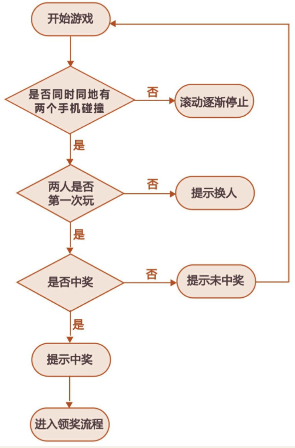

图7-9 用户任务流程示例

`页面流程`：比任务流程图更清晰、具体。通过页面流程图，不仅可以看到具体的页面，还可以看到用户如何通过操作，从一个页面跳转到另一个页面的完整过程。任务流程图是页面流程图的基础和依据，如图7-10所示。

图7-10 页面流程示例

#### 线框图&交互说明
`交互说明`是原型中不可缺少的内容。逻辑严密、内容详细的交互说明会让原型看起来更专业。例如，文字过多怎么显示？操作瞬间会出现什么提示？点击了页面上某部分内容，会出现什么反馈？跳转到哪个页面？……这些都需要设计，并且需要详细的说明，如图7-11所示。

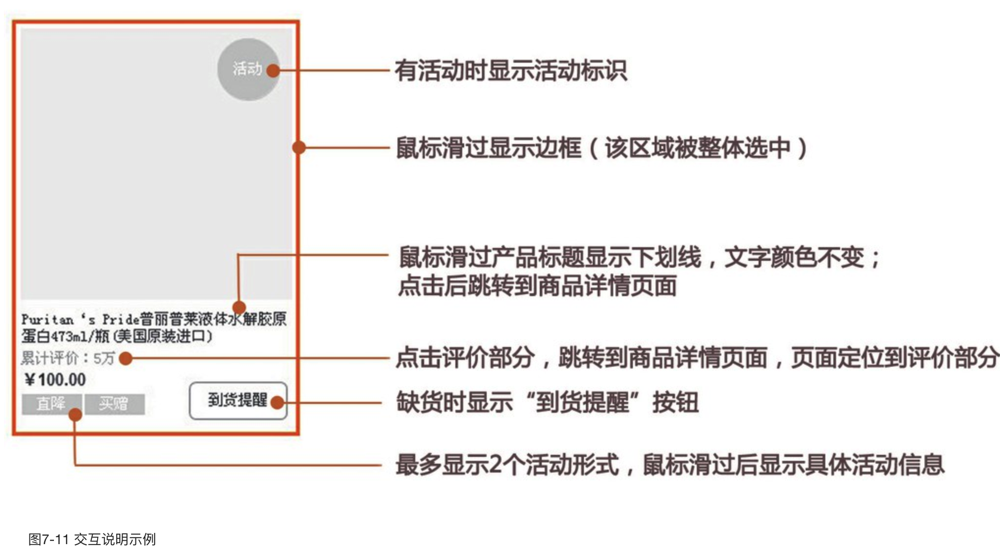

交互说明主要有以下几种类型。

限制：包含范围值、极限值等。

`范围值`主要指数据的取值范围。比如，当你的界面上出现了下拉菜单、筛选按钮、滑块等控件时，你必须标注清楚它们的选择范围，否则开发人员就不清楚该如何设定，如图7-12所示。

`极限值`主要指数据的显示限制。比如，最多应该显示多少字数，超过时如何显示，是否折行等，如图7-13所示。

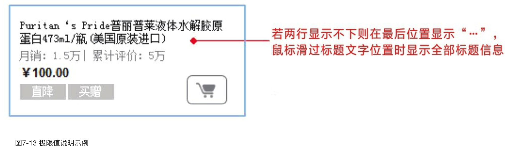

状态：包含默认状态、常见状态、特殊状态等。

`默认状态`主要指默认显示的文字、数据、选项等。这些内容需要注明，否则开发人员可能难以意识到这是用户填完的效果，还是默认就有的，如图7-14、图7-15所示。

`常见状态`主要指针对某一个模块，经常遇到的一些状态。这些状态都需要在原型上表述出来。

比如一个普通的积分模块，一般会出现3种状态：未登录状态、登录后未签到状态、登录后已签到状态，如图7-16所示。

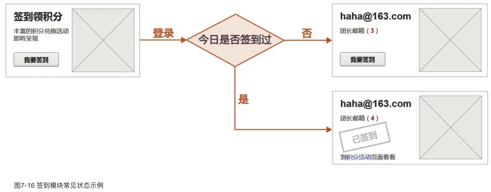

特殊状态一般指非正常情况下的样式、文案、说明等，如图7-17所示。

图7-17 特殊状态说明示例

操作：包含常见操作、特殊操作、误操作、手势操作等。

`常见操作`主要指正常操作时得到的反馈状态。比如一个普通的翻页控件，在经过不同操作后会立即出现如下的状态，如图7-18所示。

图7-18 翻页控件常见操作状态示例

`特殊操作`主要指一些极端情况下的操作。一般，用户不会这么操作，但是一旦遇到极端情况，还是要想好应对措施，因为对于开发人员来说，不管是正常的还是极端的操作情况，他们都要去编写对应的代码。

反馈：用户操作后得到的反馈动作，包含提示、跳转、动画等。

`提示`主要指操作后，系统反馈给用户的文字说明等，如图7-22所示。

`跳转`主要指点击某个链接后，页面跳转到哪里。设计师需要在原型上注明跳转时是“原页面刷新”还是“新页面打开”。

如果是做手机应用的话，需要注明跳转时的转场方式，如图7-23所示。

图7-23 移动应用转场示例

此外还需要注明在界面的不同位置以不同手势操作时，会跳转到哪里，如图7-24所示。

在移动应用中，动画反馈的形式更为常见。因此设计师一定要在原型上表述清楚动画的形式，必要时可以制作一段动画演示效果给开发人员，如图7-25所示。

总而言之，写交互说明时主要应记住2条内容：除静态页面外，还需考虑各种动态情况；除正常情况外，还需考虑特殊和错误情况。

### 7.3 你真的会画线框图吗
#### 通过明暗对比表达
以前，我是这样画线框图的，如图7-26所示，这样能非常清晰地展示各模块元素之间的布局关系。但头疼的是，当界面元素很复杂的时候，视觉设计师就难以将其一一记住了，这个时候就需要反复的沟通。

现在，我这样画线框图，如图7-27所示。

加入了明暗对比之后，界面元素的优先级关系更直观。

但需要注意的是，深色并不意味着比浅色更重要，要看色块之间的对比关系，如图7-28所示。图中的“全部商品分类”是非常重要的，在深色块上用了浅色，是希望把它突出出来，让人更容易注意到，但是视觉设计师有可能会误以为浅色代表不那么重要。这一点一定要提前沟通好。

#### 不使用截图与颜色
很多产品人员为了能更清楚地表达想法，拼凑各种竞品的截图，组成一个页面。这样做一来不规范，二来对视觉设计师也有一定的干扰。另外，不太建议在线框图上使用色彩，否则同样会对视觉设计师造成不必要的干扰。如果真的有一些关于图案的想法，可以告诉视觉设计师需要营造什么样的氛围，达到什么效果，而不是直接告诉他“画几个铜钱飞出来的样子，配一个皇榜……”等过于具体的元素，如图7-29所示。

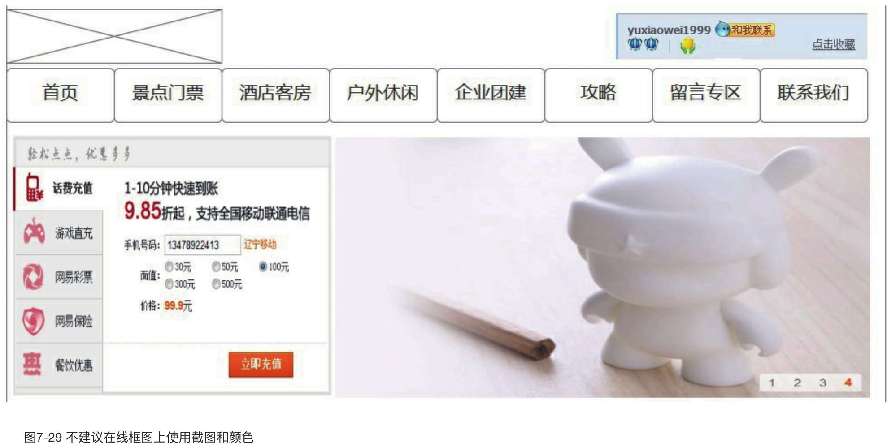

#### 合理的布局
在规划页面布局时，应该尽量保持简单的结构，最好不要出现2列和3列混排的设计，如图7-30所示。

如图7-31所示，又是3栏、又是5栏，文字密密麻麻，排行榜横向排列……这样的布局过于随心所欲，完全不符合正常规则及用户习惯。

#### 遵守栅格规范
`栅格设计系统`，是一种平面设计的方法与风格。运用固定的格子设计版面布局，其风格工整简洁，已成为当今出版物设计的主流风格之一。

栅格原理看起来复杂，但用的时候并不麻烦，只要对照标准的栅格图确定栏宽即可，如图7-32所示。

#### 标记第一屏高度
我们都知道，最重要的内容，尤其是重要的操作按钮一定要在第一屏内完全显示，否则用户第一眼看不到，就有可能放弃这个页面，从而严重影响转化率。

那么第一屏应该多高呢？据统计，有超过40%的用户的屏幕分辨率高度仅为768像素（如大量笔记本用户）。

在1024像素×768像素分辨率下，第一屏高度的极限情况可定为570像素（考虑到不同浏览器的高度不一致）；如果不那么严格的话，第一屏高度也可以定为600像素，在原型稿上标明即可。但不要为了保持第一屏高度而让内容过度拥挤，否则也会给视觉设计师带来不小的麻烦，如图7-33所示。

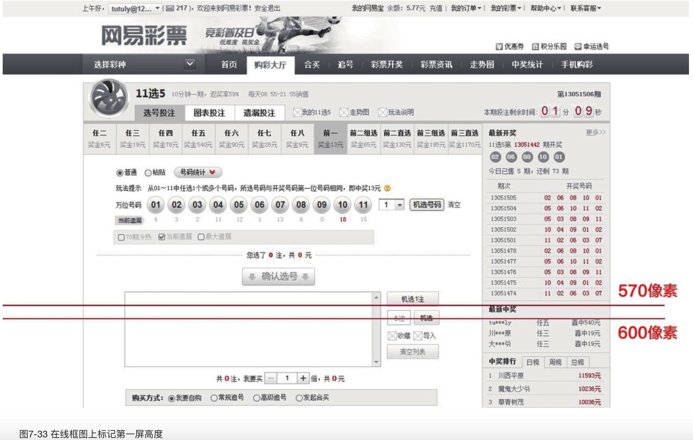

#### 表达清楚UI逻辑
当设计一个内容元素较多、逻辑层级较复杂的页面（如表单）时，为了避免混乱，我们需要提前整理一下这些内容，以保证文字、链接、操作等内容的样式符合它们所代表的重要程度，并把各种复杂的情况归类成有限的几种形式，以给用户一个合理的视觉引导。

我们把通常会遇到的情况都整理出来，并划分类别，标注出优先级，如图7-34所示。这里一共罗列了10种情况，但我们并不需要提供10种样式，否则用户一定会头晕目眩。

一般来说，操作的优先级大于链接，链接的优先级大于文本。最重要的操作一般是用按钮来表现的，比如收藏夹中的“加入购物车”按钮；然后是普通操作，比如“对比”等；最后是消极操作，比如“删除”。我们可以把普通操作和需要重点突出的链接设计成同样的样式。虽然它们的性质不同，但对于用户来说，其优先级程度是类似的，最后整理成如图7-34所示的表格。

图7-34 整理颜色、字号及样式

从图7-34中可以看出，我们通过这种方式，把10种样式缩减为最多7种（包含按钮样式）。我们可以给每一个样式指定一种有代表性的颜色，在画线框图的时候使用它们，以清楚地表达优先级。

这样，我们相当于提前定义好了一套规则，它可以用在不同的表单页面上。通过这个细致的规则，可以保证最终的字号及颜色符合逻辑，减少了视觉设计师的工作成本（视觉考虑更多的是美观，而非令人头疼的逻辑），有效地避免了错误的发生，还有利于帮助视觉设计师完善视觉规范，如图7-35所示。

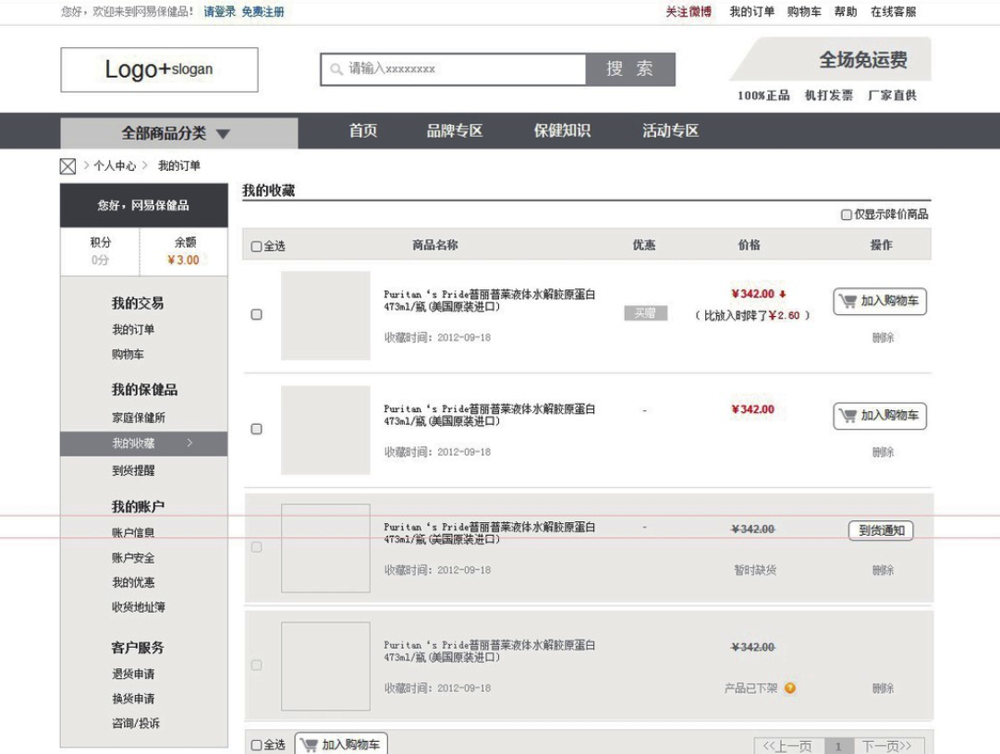

#### 考虑视觉实现后的效果
交互设计师在绘制线框图时，不仅要考虑到清晰的逻辑，还要考虑视觉实现后的效果。

如图7-36所示的例子：交互设计师用2个占位符来表示图片位置，图片上方是标题及3点说明。看起来还是比较清晰的。而视觉设计师按照这个线框图设计完的效果却很让人失望，重要的标题、文字几乎看不到，满眼都是凌乱的视觉元素。

图7-36 “清晰”的交互稿VS混乱的视觉稿

其实这是因为交互设计师在绘制线框图时思考得不够细致，没有考虑到图片对文字的影响。占位符毕竟不是真实的图片，不能真实表现出实际的情况。所以交互设计师在检查自己的设计稿时，不能光看“表面”现象，而要多想一想，视觉设计师按照你的设计方案是否容易设计出很好的效果，会不会给他造成困扰。

#### 了解视觉趋势
时刻关注一些视觉趋势，有助于我们在审美上和视觉设计师站在较为一致的立场，使大家的沟通更加顺畅。

### 7.4 写交互说明的诀窍
#### 尽量使用真实、符合逻辑的数据内容
以前我做交互设计时，更多的是考虑极端情况的展示（如每个数据项里都写尽量大一点的数值），而不注重数据之间的逻辑对应关系，殊不知，这样会给开发人员带来很多困扰。开发人员看了就会产生很多疑问，例如，网易价、优惠金额、积分、小计之间是什么关系？优惠金额和什么有关？而这些问题又和后台算法紧密相关。

#### 不遗漏特殊状态的描述
在写交互说明的时候，很多设计师总是更多地考虑正常情况的状态，却经常忽略了一些特殊状态（用户极少用到）。但对于前端和开发人员来说，各种状态都是不能缺失的，否则会导致工作无法进行。

#### 避免过长的说明
- 流程图代替文字说明。
- 用表格罗列各种状态。
- 巧妙组织文字说明。用“if、else、case”等来组织说明文字也是我喜欢的方式，当然开发人员对此更为喜欢。
- 制作动态效果。

### 7.5 关于设计规范
#### 什么是设计规范？
设计规范包含很多内容，比如交互规范、色彩规范、logo规范、UI图标规范、控件规范，等等。

#### 没有规范容易出现什么问题？
- 不同频道/模块独立设计。
- 同类功能组件存在多种样式。
- 同类元素多样性。
- 设计效率低下。
- 设计质量难以把控。

#### 规范解决了什么问题？
- “一致性”形成鲜明的产品特征，增强用户粘度。
- 提高易用性。
- 满足团队协作需求。

