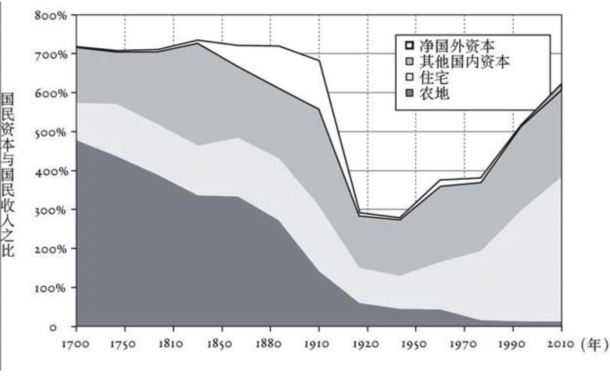
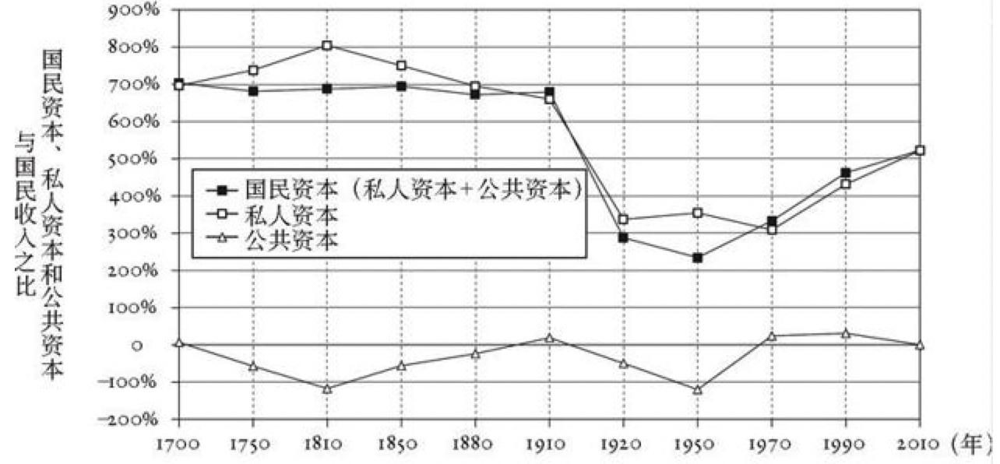
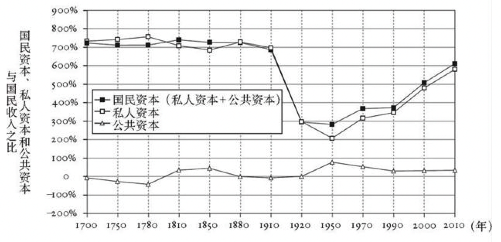
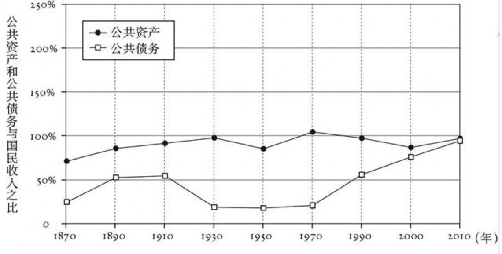
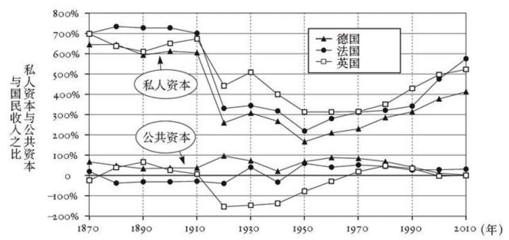
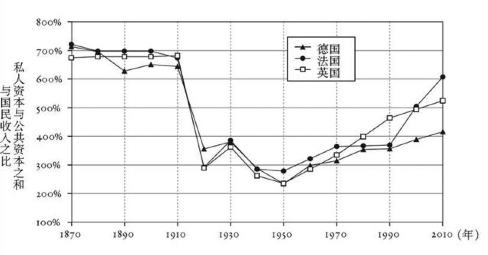
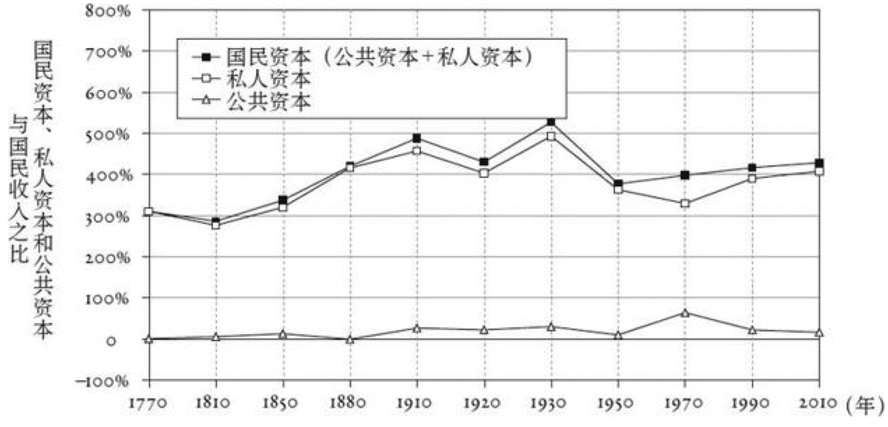
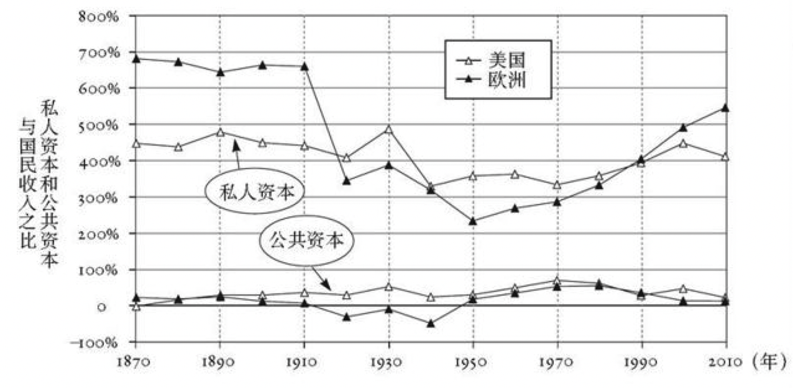
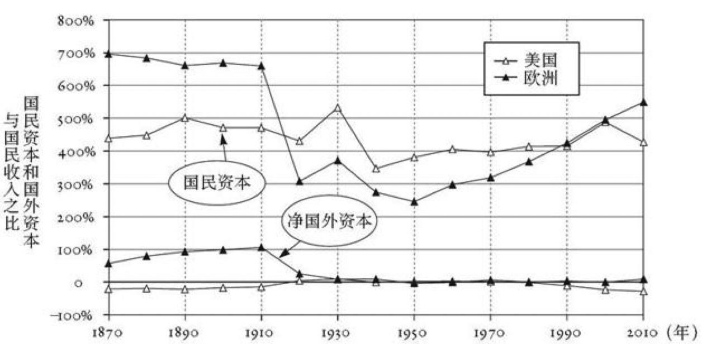
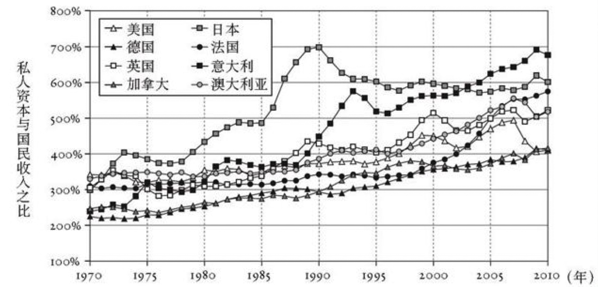

    作者: [法] 托马斯·皮凯蒂（Thomas Piketty） 
    出版社: 中信出版社
    副标题: Capital in the Twenty-First Century
    原作名: Le capital au XXIe siècle
    译者: 巴曙松 等译 
    出版年: 2014-9
    页数: 685
    定价: 98.00元
    装帧: 精装
    ISBN: 9787508647258

[豆瓣链接](https://book.douban.com/subject/25947310/)

- [导论](#%E5%AF%BC%E8%AE%BA)
  - [马尔萨斯、扬和法国大革命](#%E9%A9%AC%E5%B0%94%E8%90%A8%E6%96%AF%E6%89%AC%E5%92%8C%E6%B3%95%E5%9B%BD%E5%A4%A7%E9%9D%A9%E5%91%BD)
  - [李嘉图：稀缺性原则](#%E6%9D%8E%E5%98%89%E5%9B%BE%E7%A8%80%E7%BC%BA%E6%80%A7%E5%8E%9F%E5%88%99)
  - [马克思：无限积累原则](#%E9%A9%AC%E5%85%8B%E6%80%9D%E6%97%A0%E9%99%90%E7%A7%AF%E7%B4%AF%E5%8E%9F%E5%88%99)
  - [从马克思到库兹涅茨，从末日预言到理想主义](#%E4%BB%8E%E9%A9%AC%E5%85%8B%E6%80%9D%E5%88%B0%E5%BA%93%E5%85%B9%E6%B6%85%E8%8C%A8%E4%BB%8E%E6%9C%AB%E6%97%A5%E9%A2%84%E8%A8%80%E5%88%B0%E7%90%86%E6%83%B3%E4%B8%BB%E4%B9%89)
  - [库兹涅茨曲线：冷战期间的福音](#%E5%BA%93%E5%85%B9%E6%B6%85%E8%8C%A8%E6%9B%B2%E7%BA%BF%E5%86%B7%E6%88%98%E6%9C%9F%E9%97%B4%E7%9A%84%E7%A6%8F%E9%9F%B3)
  - [分化的根本力量：r>g](#%E5%88%86%E5%8C%96%E7%9A%84%E6%A0%B9%E6%9C%AC%E5%8A%9B%E9%87%8Frg)
- [第一部分 收入和资本](#%E7%AC%AC%E4%B8%80%E9%83%A8%E5%88%86-%E6%94%B6%E5%85%A5%E5%92%8C%E8%B5%84%E6%9C%AC)
  - [第一章 收入和产出](#%E7%AC%AC%E4%B8%80%E7%AB%A0-%E6%94%B6%E5%85%A5%E5%92%8C%E4%BA%A7%E5%87%BA)
    - [长期资本——劳动划分：并没有那么稳定](#%E9%95%BF%E6%9C%9F%E8%B5%84%E6%9C%AC%E5%8A%B3%E5%8A%A8%E5%88%92%E5%88%86%E5%B9%B6%E6%B2%A1%E6%9C%89%E9%82%A3%E4%B9%88%E7%A8%B3%E5%AE%9A)
    - [国民收入的概念](#%E5%9B%BD%E6%B0%91%E6%94%B6%E5%85%A5%E7%9A%84%E6%A6%82%E5%BF%B5)
    - [什么是资本？](#%E4%BB%80%E4%B9%88%E6%98%AF%E8%B5%84%E6%9C%AC)
    - [资本/收入比](#%E8%B5%84%E6%9C%AC%E6%94%B6%E5%85%A5%E6%AF%94)
    - [资本主义第一基本定律：α=r×β](#%E8%B5%84%E6%9C%AC%E4%B8%BB%E4%B9%89%E7%AC%AC%E4%B8%80%E5%9F%BA%E6%9C%AC%E5%AE%9A%E5%BE%8B%CE%B1r%C3%97%CE%B2)
  - [第二章 增长：幻觉与现实](#%E7%AC%AC%E4%BA%8C%E7%AB%A0-%E5%A2%9E%E9%95%BF%E5%B9%BB%E8%A7%89%E4%B8%8E%E7%8E%B0%E5%AE%9E)
- [第二部分 资本/收入比的动态变化](#%E7%AC%AC%E4%BA%8C%E9%83%A8%E5%88%86-%E8%B5%84%E6%9C%AC%E6%94%B6%E5%85%A5%E6%AF%94%E7%9A%84%E5%8A%A8%E6%80%81%E5%8F%98%E5%8C%96)
  - [第三章](#%E7%AC%AC%E4%B8%89%E7%AB%A0)
    - [财富的本质：从文学到现实](#%E8%B4%A2%E5%AF%8C%E7%9A%84%E6%9C%AC%E8%B4%A8%E4%BB%8E%E6%96%87%E5%AD%A6%E5%88%B0%E7%8E%B0%E5%AE%9E)
    - [英国和法国的资本变迁](#%E8%8B%B1%E5%9B%BD%E5%92%8C%E6%B3%95%E5%9B%BD%E7%9A%84%E8%B5%84%E6%9C%AC%E5%8F%98%E8%BF%81)
    - [国外资本的兴衰](#%E5%9B%BD%E5%A4%96%E8%B5%84%E6%9C%AC%E7%9A%84%E5%85%B4%E8%A1%B0)
    - [收入和财富的数量级](#%E6%94%B6%E5%85%A5%E5%92%8C%E8%B4%A2%E5%AF%8C%E7%9A%84%E6%95%B0%E9%87%8F%E7%BA%A7)
    - [公共财富与私人财富](#%E5%85%AC%E5%85%B1%E8%B4%A2%E5%AF%8C%E4%B8%8E%E7%A7%81%E4%BA%BA%E8%B4%A2%E5%AF%8C)
    - [李嘉图等价的兴衰](#%E6%9D%8E%E5%98%89%E5%9B%BE%E7%AD%89%E4%BB%B7%E7%9A%84%E5%85%B4%E8%A1%B0)
    - [法国：没有资本家的资本主义——战后时期](#%E6%B3%95%E5%9B%BD%E6%B2%A1%E6%9C%89%E8%B5%84%E6%9C%AC%E5%AE%B6%E7%9A%84%E8%B5%84%E6%9C%AC%E4%B8%BB%E4%B9%89%E6%88%98%E5%90%8E%E6%97%B6%E6%9C%9F)
  - [第四章](#%E7%AC%AC%E5%9B%9B%E7%AB%A0)
    - [德国：莱茵资本主义与社会所有制](#%E5%BE%B7%E5%9B%BD%E8%8E%B1%E8%8C%B5%E8%B5%84%E6%9C%AC%E4%B8%BB%E4%B9%89%E4%B8%8E%E7%A4%BE%E4%BC%9A%E6%89%80%E6%9C%89%E5%88%B6)
    - [资本在20世纪遭受的打击](#%E8%B5%84%E6%9C%AC%E5%9C%A820%E4%B8%96%E7%BA%AA%E9%81%AD%E5%8F%97%E7%9A%84%E6%89%93%E5%87%BB)
    - [美国的资本：比欧洲更为稳定](#%E7%BE%8E%E5%9B%BD%E7%9A%84%E8%B5%84%E6%9C%AC%E6%AF%94%E6%AC%A7%E6%B4%B2%E6%9B%B4%E4%B8%BA%E7%A8%B3%E5%AE%9A)
    - [新大陆与国外资本](#%E6%96%B0%E5%A4%A7%E9%99%86%E4%B8%8E%E5%9B%BD%E5%A4%96%E8%B5%84%E6%9C%AC)
    - [加拿大：长期由王室拥有](#%E5%8A%A0%E6%8B%BF%E5%A4%A7%E9%95%BF%E6%9C%9F%E7%94%B1%E7%8E%8B%E5%AE%A4%E6%8B%A5%E6%9C%89)
    - [新大陆与旧世界：奴隶制的重要性](#%E6%96%B0%E5%A4%A7%E9%99%86%E4%B8%8E%E6%97%A7%E4%B8%96%E7%95%8C%E5%A5%B4%E9%9A%B6%E5%88%B6%E7%9A%84%E9%87%8D%E8%A6%81%E6%80%A7)
    - [奴隶资本与人力资本](#%E5%A5%B4%E9%9A%B6%E8%B5%84%E6%9C%AC%E4%B8%8E%E4%BA%BA%E5%8A%9B%E8%B5%84%E6%9C%AC)
  - [第五章](#%E7%AC%AC%E4%BA%94%E7%AB%A0)
    - [一条长期定律](#%E4%B8%80%E6%9D%A1%E9%95%BF%E6%9C%9F%E5%AE%9A%E5%BE%8B)
    - [20世纪70年代以来资本在发达国家的回归](#20%E4%B8%96%E7%BA%AA70%E5%B9%B4%E4%BB%A3%E4%BB%A5%E6%9D%A5%E8%B5%84%E6%9C%AC%E5%9C%A8%E5%8F%91%E8%BE%BE%E5%9B%BD%E5%AE%B6%E7%9A%84%E5%9B%9E%E5%BD%92)
    - [泡沫破灭之后：低增长，高储蓄](#%E6%B3%A1%E6%B2%AB%E7%A0%B4%E7%81%AD%E4%B9%8B%E5%90%8E%E4%BD%8E%E5%A2%9E%E9%95%BF%E9%AB%98%E5%82%A8%E8%93%84)
    - [私人储蓄的两个组成部分](#%E7%A7%81%E4%BA%BA%E5%82%A8%E8%93%84%E7%9A%84%E4%B8%A4%E4%B8%AA%E7%BB%84%E6%88%90%E9%83%A8%E5%88%86)
    - [以可支配收入计量的私人资本数量](#%E4%BB%A5%E5%8F%AF%E6%94%AF%E9%85%8D%E6%94%B6%E5%85%A5%E8%AE%A1%E9%87%8F%E7%9A%84%E7%A7%81%E4%BA%BA%E8%B5%84%E6%9C%AC%E6%95%B0%E9%87%8F)
  - [第六章](#%E7%AC%AC%E5%85%AD%E7%AB%A0)
  - [第七章](#%E7%AC%AC%E4%B8%83%E7%AB%A0)
  - [第八章](#%E7%AC%AC%E5%85%AB%E7%AB%A0)
  - [第九章](#%E7%AC%AC%E4%B9%9D%E7%AB%A0)
  - [第十章](#%E7%AC%AC%E5%8D%81%E7%AB%A0)
  - [第十一章](#%E7%AC%AC%E5%8D%81%E4%B8%80%E7%AB%A0)
  - [第十二章](#%E7%AC%AC%E5%8D%81%E4%BA%8C%E7%AB%A0)
  - [第十三章](#%E7%AC%AC%E5%8D%81%E4%B8%89%E7%AB%A0)
  - [第十四章](#%E7%AC%AC%E5%8D%81%E5%9B%9B%E7%AB%A0)
  - [第十五章](#%E7%AC%AC%E5%8D%81%E4%BA%94%E7%AB%A0)
  - [第十六章](#%E7%AC%AC%E5%8D%81%E5%85%AD%E7%AB%A0)
  - [结论](#%E7%BB%93%E8%AE%BA)

## 导论
- 18、19世纪，收入分配是经济学家最为关注的问题之一。马尔萨斯、李嘉图、马克思等学者都高度关注日益严重的收入不平等问题。
- 20世纪50年代之后，经济学家逐渐认同了`库茨涅茨曲线`，即随着经济增长，收入不平等程度会先升后降，呈现出倒U型曲线。这是对收入分配的长期变化趋势的误读。
- 本书将用各国数据，从大历史的角度审视收入分配的历史变化。导致收入不平等程度扩大的因素超过了缓解收入不平等趋势的因素，21世纪的不平等程度可能赶上甚至超过19世纪。
- 导致收入不平等加剧的最主要因素是从长期看，资本的收益率大于经济增长率，即r>g。

### 马尔萨斯、扬和法国大革命
托马斯·马尔萨斯在1798年发表的《人口原理》中明确指出：人口过剩是影响财富分配的首要因素。

### 李嘉图：稀缺性原则
某商品相对价格的巨大变化可能会导致财富分配的长期严重不均，而供给与需求的相互影响也无法排除这种可能性。这是李嘉图稀缺性原则的主要含义。

### 马克思：无限积累原则
在19世纪40年代资本繁荣发展，工业利润增长，但劳动收入却停滞不前。正是在这种背景下，第一个共产主义和社会主义运动发展起来了。他们的中心论点很简单：如果经过半个世纪的工业发展，人民群众的生活状况还是和之前一样悲惨，而立法者们唯一能做的就是禁止工厂雇佣八岁以下的儿童，那么工业发展的好处在哪里？技术创新、辛苦工作以及人口流动的好处又在哪里？现有的经济和政治体系的破产似乎是显而易见的。因此人们想知道其后的长期演变：你们到底还能说些什么呢？

他的主要结论可以被称为`“无限积累原则”`，即资本将不可逆转地不断积累，并最终掌握在一小部分人手中，是一个没有天然界限的过程。这就是马克思预言资本主义终将灭亡的分析依据：资本收益率稳步降低（这样将遏制资本积累，并导致资本家之间的激烈冲突），或是资本收入在国民收入中的比重无限制地增长（这迟早将变成工人运动的导火索），——不论发生何种情况，社会经济均衡或是政治稳定都将变成奢望。

如他的前辈一样，马克思完全忽视了持久技术进步的可能性以及稳定增长的生产率，这些在一定程度上可以作为平衡私人资本积聚进程的重要因素。

### 从马克思到库兹涅茨，从末日预言到理想主义
库兹涅茨的理论认为，不管经济政策如何选择或者不同国家间的其他差异，收入不平等将在资本主义发展的高级阶段自动降低，并最终稳定在一个可接受的水平上。

### 库兹涅茨曲线：冷战期间的福音
根据该理论，任何情形下的不平等都可以用“钟形曲线”来解释。换句话说，在工业化和经济发展的进程中，收入不平等必然会出现先扩大后缩小的过程。库兹涅茨认为，第一阶段收入不平等的自然增长与工业化的早期阶段相关联（对美国来说大概是19世纪），紧随其后的是一个不平等大幅减少的阶段（对美国来说是从20世纪上半叶开始的）。

### 分化的根本力量：r>g
这个根本性的不平等现象将在这本书中占据一个关键角色，我将它表达为r>g（这里r代表`资本收益率`，包括利润、股利、利息、租金和其他资本收入，以总值的百分比表示；g代表`经济增长率`，即年收入或产出的增长）。在某种意义上，它囊括了我所有结论的整体逻辑。

## 第一部分 收入和资本
### 第一章 收入和产出
- 可能带来社会不稳定的最严重的收入不平等问题是资本和劳动之间的矛盾。
- 国民收入可分为资本收入和劳动收入。劳动收入所占的比例更高，但收入不平等的主要来源不是劳动收入不平等，而是资本收入不平等。
- 资本和财富在本书中是指一个事物。国民财富可分为私人财富和公共财富，绝大部分财富属于私人财富。一国的资本又可以分为国内资本和净海外资本，国内资本占绝大多数比例。
- 衡量资本在收入分配中重要性的主要指标是资本/收入比，即在某个时点一国资本存量与其当年国民收入之比。目前发达国家的资本/收入比大约在5-6左右。这衡量的是到某一个时点，资本不断积累，最终在国民收入中所占的比例。
- 衡量资本在收入分配中重要性的另一个指标是资本收入占国民收入的比例，这衡量的是一年的国民收入如何在资本和劳动之间分配。根据皮克迪所说的资本主义第一基本规律，α=r*b，a是资本在国民收入中的比例，r是资本收益率，b是资本/收入比。这是一个会计恒等式。
- 国家间的收入不平等差距极大。富国的人均月收入可达2500-3000欧元，而撒哈拉以内的非洲国家人均月收入只有150欧元左右。中国恰好在中间水平，全球人均收入大致就是中国的水平，人均月收入为600-800欧元。尽管国家间的收入差距悬殊，但人们感受最紧迫的还是国内的贫富悬殊。收入分配主要是国内政治问题。

财富分配包含两个维度，一是“要素”分配，这里劳动力和资本被当作是“生产要素”，他们被抽象成两个均匀的实体；二是“个体”分配，这会考虑到个体层面上的劳动收入和资本收入的不平等。

#### 长期资本——劳动划分：并没有那么稳定
很长一段时间，大部分经济学家都接受这样一个观点，国民收入中劳动收入和资本收入的相对份额在长期内是非常稳定的，一个普遍接受的数据是劳动收入占2/3，资本收入占1/3。

我们确实发现长期内劳动收入比重存在增长的趋势，但收益涨势相对要慢一些：在21世纪的前几十年，资本收入比重（除去人力资本）比19世纪初时小了一些。今天在发达国家资本之所以重要，主要是由于人口增长和生产率增长减慢，同时政治制度也客观上偏向私人资本。

了解这些变化最有效的办法是分析`资本/收入比`的演变（即资本总量和每年收入流之比），而不是只关注资本——劳动划分（即收入分别分配到资本和劳动的份额）。

#### 国民收入的概念
`国内生产总值`测量的是一年内在一国境内生产的商品和服务的总量。

为了计算国民收入，我们需要从国内生产总值中减去生产所用的资本折旧；换句话说，我们需要减去建筑、基础设施、机械设备、车辆、计算机以及其他物品在这一年的损耗。折旧的数额很大（现今在很多国家，折旧的数额接近国内生产总值的10%），从国内生产总值中减去折旧后，可以得到“`国内生产净值`”，我简单地称其为“国内产出”或者“`国内产值`”，基本上占国内生产总值的90%。

我们需要加上从国外获得的净收入（或减去付给外国人的净收入，视各国情况而定）。

一国的国民收入有可能大于或小于它的国内产值，这取决于国外净收入是正还是负。

    国民收入 = 国内产值 + 国外净收入

在全球层面上，国外获得的收入必须与支付给国外的收入平衡，因此收入可以定义为等于产出：

    全球收入 = 全球产出

#### 什么是资本？
无论是公司账户、国家账户还是全球经济，相应的产出和收入都可以分解为资本收入和劳动收入：

    国民收入 = 资本收入 + 劳动收入

总的来说，假设所有物品都可以在某些市场上交易，我将“`国民财富`”或者“`国民资本`”定义为在某个时点某个国家的居民与政府所拥有的全部物品的市场价值之和。这包括了非金融资产（土地、住宅、企业库存、其他建筑、机器、基础设施、专利以及其他直接所有的专业资产）与金融资产（银行账户、共同基金、债券、股票、所有形式的金融投资、保险、养老基金等）的总和，减去金融负债（债务）的总和。如果我们单从私人的资产和负债来看，得出的结果是私人财富或者私人资本。如果我们考虑政府与其他政府实体（例如城镇、社会保险机构等）的资产和负债，得出的结果是公共财富或者公共资本。按照定义，国民财富是以下两个部分的总和：

    国民财富 = 私人财富 + 公共财富

国民财富总值总是可以分解成国内资本和国外资本。

    国民财富 = 国民资本 = 国内资本 + 净国外资本

国内资本是位于国家边界以内的资本存量（建筑、公司等等）的价值。净国外资本（或净国外资产）衡量了一国在世界其他地方的头寸：更具体地说，是位于世界其他国家的本国国民资产与位于本国的外国国民资产之差。

#### 资本/收入比
资本是存量，它与某个时点上所拥有的财富总额相关，是此前所有年份获得或积累的财富总量。

衡量某个国家资本存量最自然而有效的方法是用这些存量除以每年的收入流量，从而得到`资本/收入比`，用希腊字母β表示。

在如今的发达国家，资本/收入比一般在5~6之间波动，而资本存量几乎完全由私人资本组成。2010年，英国、法国、德国、意大利、美国和日本的人均国民收入大约为3万~3.5万欧元，而人均私人财富（除去债务）大约是15万~20万欧元，是5~6年的国民收入。在欧洲和全世界，各国β值的差异也十分有意思。例如，日本和意大利的β值大于6，而美国和德国的β值则小于5。

#### 资本主义第一基本定律：α=r×β
资本/收入比β与国民收入中资本收入的比重α的关系可用如下公式表示：

    α=r×β

r是资本收益率。

举例来说，如果β=600%，r=5%，那么α=r×β=30%。换句话说，如果国民财富等于6年的国民收入，资本的年收益率为5%，那么资本所创造的收入在国民收入中的比重就是30%。

具体来说，这意味着目前发达国家每年3万欧元左右的人均国民收入可以被拆分为两个部分：每年人均2.1万欧元的劳动收入（70%）以及人均9 000欧元的资本收入（30%）。每个公民平均拥有18万欧元的资本，这些资本带来了9 000欧元的收入，资本年均收益率为5%。

值得强调的是，α=r×β等式没有告诉我们这三个变量是如何决定的，特别是国家的资本/收入比（β）是如何决定的，这个比值在某种意义上也衡量了该国的资本主义程度。为了回答这个问题，我们必须引入更多的概念与关系，特别是储蓄率、投资率与增长率。这将会引出`资本主义第二基本定律`：更高的储蓄率和更低的增长率会带来更高的资本/收入比（β）。这将会在后续的章节里详细阐述；在当前的阶段，α=r×β等式简单地表示，不管是经济、社会和政治中的何种力量决定了资本/收入比（β），资本收入占总收入的比重（α）以及资本收益率（r），这三个变量不是孤立的，而是相互关联的。从概念上讲，其中有两个是自变量，而有一个是因变量。

### 第二章 增长：幻觉与现实
- 经济增长主要来自两个贡献：一是人口的增长，二是人均产出的增长。
- 人类社会直到19世纪才开始出现加速增长，突破了1.5%。20世纪是经济增长的高峰，一度达到4%，但到21世纪全球经济增长率可能会下降。预计21世纪末，全球经济增长率将倒退到19世纪初的水平。
- 全球人口的增长出现在18世纪，到20世纪中期达到峰值，然后开始逐渐下降。从长期来看，到21世纪末，全球人口增长率很可能会降低到接近零的水平。
- 人均产出到19世纪开始缓慢增加。20世纪人均产出的增长达到高峰。在21世纪，全球人均产出的增速很难超过1.5%。
- 高速经济增长不是常态，只是特例。只有在一国出现经济起飞和赶超的阶段，才会有异乎寻常的高速增长。中国经济也会进入低增长的“新常态”。重要的不是增长速度快，而是长期保持稳定的增长。假以时日，由于“复利”的作用，中国经济仍然会不断壮大，人们的生活水平仍然将一代比一代进步。

所谓`“累积增长定律”`（law of cumulative growth）的实际效果。该定律的含义是，很低的年增长率如果持续相当长的时期，会导致巨大的不同。

累积增长定律在本质上等同于`累积收益定律`。累积收益定律的含义是几个百分点的年收益率经过数十年的叠加，会自动引起原始资本数额的巨幅增长。其前提条件是收益不断地用于再投资，或者资本所有者只把一小部分（相对于社会的增长率）收益用于消费。

## 第二部分 资本/收入比的动态变化
### 第三章
- 在英、法两国，资本/收入比例都经历了一个U型曲线。19世纪的时候，两国资本/收入比例都很高，20世纪上半叶出现了急剧下降，但在20世纪后半叶又出现回升。第一次世界大战之前，英国和法国资本/收入比例一直保持在7左右。20世纪上半叶资本/收入比例下跌到2-3的水平。如今，资本/收入比例已经回升到了5-6倍的水平，并有可能进一步提高。
- 资本的构成在过去300年发生了巨大的变化。过去的资本主要包括农田和公债。如今，农田在资本中所占的比例很小，城市的房产取代了农田。各种金融产品，如股票、保险、金融衍生产品等代替了传统的公债。
- 海外资产一度在欧美的资本总额中占有较大比例，但现在已经基本上没有了。
- 政府一方面有公共资产，另一方面大量发行国债借钱，总体来看，政府的净资产很少，甚至可能为负。但通过发行国债，在18-19世纪的英法两国，出现了一个依靠投资公债的食利阶层。
- 购买公债的人和要交税的人很可能不是同一群人，在“新古典”的巴罗模型（李嘉图等价假说）中，至关重要的收入分配问题被完全忽视了。

#### 财富的本质：从文学到现实
在19世纪的经典小说中，财富无处不在，但无论资产多寡及其所有者为何人，通常都仅限于两种形式：土地或者政府债券。

#### 英国和法国的资本变迁
简而言之，我们在刚刚过去的一个世纪看到的是令人印象深刻的U形曲线。资本/收入比在1914~1945年下跌了近2/3，在1945~2012年又翻了一番多。

最终到2010年，资本/收入比已回到“一战”前的水平。

大致来说，是20世纪的战争消灭了资本存量，给人们带来了资本主义出现结构性改变的假象。

_英国在1700年的国民资本相当于7年的国民收入，其中农地为4年的国民收入。_

图3.1 1700~2010年英国的资本状况

_法国在1910年的国民资本几乎相当于7年的国民收入，包括在海外的投资。_

图3.2 1700~2010年法国的资本状况

在资本结构方面，21世纪的资本与18世纪全然不同。这个趋势同样是以英法两国最为典型。简单地说，在一个相当长的时期内，农地逐渐被建筑、产业资本以及投资于企业和政府组织的金融资本所取代，不过以国民收入的倍数来测算的资本总价值却没有太大改变。

国内资本继而可分为三种类别：农地、住宅（包括住宅所附着土地的价值）以及其他国内资本（包括企业和政府组织的资本，如用于商业的建筑物及所在的土地、基础设施、机器、计算机、专利权等）。这些资产以及其他任何资产都以市场价值来评估，例如，发行股票的公司的价值取决于股票的市场价格。因此，国民资本可以用如下的公式来表述

    国民资本 = 农地 + 住宅 + 其他国内资本 + 净国外资本

在18世纪初，农地的总价值约为4~5年的国民收入，或者说占全部国民资本的近2/3。3个世纪之后，英法两国的农地价值已不足国民收入的10%，在全部财富中的比重不足2%。

与农地价值的大幅下跌（相对于国民收入和国民资本）相对应的，一是住宅价值的提升，从18世纪约为1年的国民收入增加到如今的超过3年的国民收入；二是其他国内资本的价值的提升，其涨幅略低于住宅，从18世纪约为1.5年的国民收入增加到如今的略低于3年的国民收入。这个时间跨度极大的结构变化一方面反映了住宅在经济与工业发展过程中的重要性在提高，不但数量有增长，而且质量和价值都在提升；另一方面则表明自工业革命以来，商业建筑、基础设施、机器、库房、办公楼、工具以及其他物质和非物质资本有了巨大积累，所有这些资本都是被企业和政府组织用于生产各种类型的非农业产品和服务。

#### 国外资本的兴衰
拥有国外资产的重要性最早出现在1750~1800年，不过国外资产当时所占的比重还不大，从可考资料看，国外资产仅相当于英国国民收入的10%，或者说约为英国农地总价值（超过3年的国民收入）的1/30。

直至19世纪，英国臣民才开始在世界其他地区积累起可观的财富，其数量前所未有，而且至今也无人超越。到“一战”前夕，英国组建起了世界性的殖民帝国，拥有的国外资产接近2年的国民收入，为英国本土农地总价值（当时已经相当于国民收入的30%）的6倍。

在全球殖民帝国中排名第二的法国同样处在令人艳羡的地位，其积累的国外资产超过1年的国民收入，因此在20世纪头10年，法国的国民收入也比其国内产值要高出约5~6个百分点，这相当于北部和东部各省的全部工业产值。法国国民拥有的国外资产的孳息，以股息、利息、专利费、租金和其他形式源源不断地输送回母国。

在经受两次世界大战、“大萧条”和殖民地独立运动的接连打击之后，到20世纪50年代，英法两国的净国外资产持有量都接近于零。1950~2010年，法国和英国持有的净国外资产从很小的正值变为很小的负值，依然非常接近于零。

最后，如果将18世纪国民资本的结构与今天进行对比，我们会发现净国外资产在两个时期都不算特别重要，**真正长期的结构性变化在于农地逐步被房地产和运营资本替代，而总资本存量占国民收入的比例大致保持稳定**。

#### 收入和财富的数量级
英法两国目前的人均国民收入大约为每年3万欧元，国民资本约为6年的国民收入，也就是每人18万欧元左右。在这两个国家，农地的价值已微乎其微（至多每人几千欧元），国民资本大致说来可以划分为两个规模相近的部分，即平均来说，每位国民拥有9万欧元的住宅（自住或出租给他人）以及9万欧元的其他国内资本，主要是借助各类金融工具投资在企业中的资本。

#### 公共财富与私人财富
具体而言，公共资产有两种形式，可以是非金融资产（主要指公共建筑物，由政府机构使用，或用于提供教育和医疗等公共服务，如中小学、大学和医院等），也可以是金融资产。

目前，英国的公共资产（包括金融资产与非金融资产）的总价值估计约相当于1年的国民收入，法国的水平略低于1.5年。鉴于上述两国的公共债务都大约相当于1年的国民收入，因此净公共财富（或净公共资本）数额很少。根据两国的统计机构和中央银行的最新官方估计，英国的净公共资本几乎为零，法国的则略低于国民年收入的30%，抑或全部国民资本的1/20。

无论如何，毫无疑义的是英法两国的公共财富数量相当少，与私人财富相比显得微不足道。从现有的最新数据上看，2010年，英法两国的私人财富在全部国民财富中占据绝大部分，在英国超过99%，在法国约为95%。至于真实的数据，肯定在90%以上。

_1950年的公共债务超过2年的国民收入，公共资产仅为1年的国民收入。_

图3.3 1700~2010年英国的公共资本状况

_1780年、1880年及2000~2010年，公共债务均约为法国1年的国民收入。_

图3.4 1700~2010年法国的公共资本状况

_英国在1810年的私人资本相当于8年的国民收入，全部国民资本约为7年的国民收入。_

图3.5 1700~2010年英国的私人资本与公共资本状况

_法国在1950年的私人资本相当于2年的国民收入，公共资本约为1年的国民收入。_

图3.6 1700~2010年法国的私人资本与公共资本状况

#### 李嘉图等价的兴衰
大卫·李嘉图在1817年提出了今天被称为`“李嘉图等价”`（Ricardian equivalence）的假说。他认为，在满足某些条件后，公共债务对国民资本的积累不会产生影响。

#### 法国：没有资本家的资本主义——战后时期
我们可以认为英法两国公共资产的总价值长期来看都有所增长，从18世纪和19世纪约占国民收入的50%提升到20世纪末的约100%。

粗略地看，这种增长反映了历史上政府经济职能的持续扩张，尤其是包括医疗和教育领域越来越广泛的公共服务的发展（如提供建筑和设备等必要的重大投资等），以及交通和通信领域的公共或半公共基础设施投资。上述公共服务与基础设施在法国比在英国更为突出，2010年，法国公共资产的总价值接近国民收入的150%，而海峡对岸的英国仅为100%左右。

经济私有化运动，包括产品和服务市场的开放以及金融市场和资本流动的管制解除，在20世纪80年代给世界各国带来了深刻影响。这场运动其实有着复杂多样的源头：“大萧条”及其后续灾难留下的记忆已经消退，20世纪70年代的“滞胀”表明战后的凯恩斯主义共识存在局限性。随着战后重建与“辉煌30年”高增长的结束，人们很自然地会对政府角色的无限膨胀及其在国民产值中所占份额的持续增长提出质疑。放松监管运动则始自美国和英国在1979~1980年的“保守主义革命”，当时这两个国家都日益苦恼于被其他国家赶超。同时，苏联和中国的国家主义经济模式在70年代愈益凸显的失败，促使这两个社会主义阵营的巨人自80年代开始逐步推进经济体制的自由化，引入了新式的私人所有制企业。

### 第四章
- 从总体来看，德国的资本演变也和英法一样，呈现出U型曲线的特征。1870年，德国的资本/收入比例在7左右。第一次世界大战之后，德国的资本/收入比例也出现了急剧下跌。之后，德国的资本/收入比例逐步上升，到21世纪初期已经基本回到第一次世界大战爆发之前的水平。
- 德国的资本主义和英法的资本主义存在着较为明显的差异。德国的资本主义被称为“持筹者资本主义”（stakeholder capitalism），英美的资本主义被称为“持股者资本主义”（shareholder capitalism）。“持股者资本主义”是指企业要为股东的利益服务。“持筹者资本主义”是说，企业要照顾到“持筹者”，即所有和企业利益相关者的要求。
- 20世纪上半叶欧洲的资本比例急剧下降。首先是数量效应，欧洲国家遭到战争破坏，丧失了大片海外殖民地。战争、股灾、革命，使得很多富人的财产灰飞烟灭。其次是价格效应，在这一时期，房价、股票价格都徘徊在极低的水平。数量效应大致能够解释欧洲资本规模下跌的2/3到3/4，价格效应大致能够解释欧洲资本规模下跌的1/4到1/3.
- 美国的资本演变不是U型曲线，没有出现欧洲那样的大起大落。总体来说，美国的资本规模变化较为和缓，没有像欧洲那样经历资本主义带来的动荡不安。托克维尔谈到，美国的民主精神在很大程度上得益于建国之初的收入平等。
- 但美国当年存在着野蛮的奴隶制度。按照市场价格，把奴隶这一“资本”估算在内，则美国在18世纪末的资本规模就会大大增加。美国有北部美国和南部美国两种不同的模式。这两种传统、两个灵魂，直到如今，仍然困扰着美国社会和美国政治。

#### 德国：莱茵资本主义与社会所有制
总体的发展轨迹是类似的：首先，从长期来看，农地资产让位于住宅和商业地产以及工业和金融资本；其次，资本/收入比自“二战”结束以后稳步提高，似乎已经回升到1914~1945年多次冲击之前的水平（见图4.1）。

_德国在1910年的国民资本相当于6.5年的国民收入，其中国外投资相当于0.5年的国民收入。_

图4.1 1870~2010年德国的资本状况

从图4.1与图3.1、图3.2的对比中，我们能一目了然地看到英国、法国和德国自19世纪以来发展轨迹的差别：在某种程度上，它们的相对位置出现了互换。考虑到德国的经常贸易盈余极其巨大，这种位置上的分歧几乎是必然的结果。

德国在公共债务以及公共资本和私人资本结构的演进轨迹方面与法国颇为相近。1930~1950年，德国的年均通货膨胀率接近17%，致使其价格水平上涨了约300倍（法国约为100倍），在20世纪利用通货膨胀来削减公共债务负担的国家之中，德国是做得最过分的一个。

_德国在2010年的公共债务大约相当于1年的国民收入，公共资产也大约相当于1年的国民收入。_

图4.2 1870~2010年德国的公共资本状况

在公共资产的积累方面，德国的情形同样与法国很接近：政府在1950~1980年持有银行和工业部门的很大部分资产，尽管在1980~2000年将其部分出售，但仍保留了相当数量。例如，下萨克森州今天拥有大众汽车这家在欧洲乃至全球知名的企业超过15%的股份（和20%的投票权，尽管遭到欧盟的反对，但上述权利均受法律保护）。

_德国在1970年的私人资本略多于2年的国民收入，公共资本约等于1年的国民收入。_

图4.3 1870~2010年德国的私人资本与公共资本状况

德国私人财富的规模与英法两国相比也有着显著的不同。德国的私人财富自“二战”以后有巨大增长：1950年的水平极低，仅为1.5年的国民收入，而今天已超过4年的国民收入。上述三国私人财富的恢复情况可以很清楚地从图4.4中看到。不过，德国在2010年的私人财富水平依然明显低于英法两国：德国仅为4年的国民收入，而英法两国为5~6年的国民收入，意大利和西班牙都约为6年多的国民收入（本书第五章将有所介绍）。

_欧洲国民资本的长期变动基本上是由于私人资本的变动所致。_

图4.4 1870~2010年欧洲的私人资本与公共资本状况

第一个要考虑的因素是，德国比其他欧洲国家的房地产价格低，原因在于其他国家的房地产价格自1990年后大幅上升，而德国在实现统一后，有大量低成本的住宅进入市场。不过要想解释上述不一致的长期性，我们还需要寻找更为长期的因素，例如德国更为严格的租金管制。

无论如何，德国与英法两国之间的差异大部分并不是因为存量住宅的价值不同，而是其他国内资本的价值差异，尤其是企业资本（见图4.1）。换言之，德国的私人资本水平较低并非因为房地产价值较低，而是由于德国企业的股票市值较低。如果在计算私人财富总额的时候，我们不是参考股票市值，而是采用账面价值（从企业的累计投资价值中减去债务之后的部分），那么上述的德国悖论就不复存在了：其私人财富数量将立刻提升到与英法两国相当的水平，从4年的国民收入增至5~6年的国民收入。

德国企业的市值较低应该反映了所谓`“莱茵资本主义”`（Rhenish capitalism）或者说“利益相关者模式”（stakeholder model）的特点。具体来说，在这种经济模式里，企业不但归股东所有，而且还受其他“利益相关者”的控制，其中包括企业工人的代表（他们在德国企业的董事会有席位，虽然不见得是股东，但不仅能发挥建议作用，而且是决策的积极参与人 )，以及地方政府、消费者协会、环保组织等机构的代表。这里的关键并不是说此类分享式社会所有制模式很完美，它也有其局限性，我们只是想指出此类模式至少能产生与`盎格鲁 – 撒克逊式市场资本主义`（anglo-Saxon market capitalism）或“股东模式”（shareholder model，虽然实际操作中往往较为复杂，但企业的所有决策权至少在理论上都归股东）同样的经营效率，尤其是，利益相关者模式虽然不可避免地会造成企业市场价值被低估，但其社会价值却未必。

#### 资本在20世纪遭受的打击

_欧洲的国民资本（公共资本与私人资本之和）在1950年相当于2~3年的国民收入。_

图4.5 1870~2010年欧洲的国民资本状况

两次世界大战带来的财政和政治冲击对资本的破坏力要远远超过战争本身。除物质上的毁灭外，资本/收入比在1913~1950年急剧下降的主要原因一方面是在外国的投资组合大幅减少，以及储蓄率降至极低水平（这两个因素加上物质破坏可以解释整个降幅的2/3~3/4），另一方面则是在战后实行混合经济与强化监管的政治背景下，资产价格走低（这个因素可以解释整个降幅的1/4~1/3）。

英国、法国和德国的详细数据表明，“二战”后房地产和股票价格的低迷是资本/收入比在1913~1950年下降的不可忽视的原因，但依然只能解释降幅的一小部分，在不同国家约为1/4~1/3。而总量方面的影响，包括国民储蓄率降低、外国资产流失以及战争破坏等，则可以解释降幅的2/3~3/4。

#### 美国的资本：比欧洲更为稳定
美国在取得独立前后（大约1770~1810年）的国民资本仅为3年的国民收入。农地的价值约为1~1.5年的国民收入（见图4.6）。尽管有不确定因素，但北美殖民地的资本/收入比显著低于英法两国是毫无疑问的，当时这两个国家的国民资本约为7年的国民收入，其中农地约为4年的国民收入（见图3.1和图3.2）。

美国在1770年的国民资本相当于3年的国民收入，其中为农地相当于1.5年的国民收入。

图4.6 1770~2010年美国的资本状况

20世纪的冲击对美国的影响远逊于欧洲国家，因此其资本/收入比也显得稳定得多，在1910~2010年，大致为4~5年国民收入（见图4.6），而欧洲国家则从超过7年的国民收入下跌至不足3年的国民收入，然后又反弹到5~6年的国民收入（见图3.1和图3.2）。

美国的财富也受到了1914~1945年危机的冲击。其公共债务由于战争开支（尤其是在“二战”期间）迅速增长，在经济动荡时期影响到了国民储蓄率：20世纪20年代的狂热紧接着30年代的“大萧条”。

在富兰克林·罗斯福时期，美国与欧洲国家一样采取了旨在削弱私人资本影响力的政策，如租金管制。在“二战”后，房地产与股票价格也跌至历史低谷。在累进税制方面，美国比欧洲走得更远——或许也表明其目标主要是缩小收入差距，而非根除私有制。美国没有开展宏大的国有化运动，但在20世纪30~40年代进行了大规模的公共投资，特别是对基础设施的投资。通货膨胀与经济增长最终在20世纪50~60年代使公共债务降至较低水平，美国由此在1970年积累了一定的净公共财富（见图4.7）。最后，美国的私人财富则从1930年约为5年的国民收入减少到1970年的不足3.5年的国民收入，降幅不容忽视（见图4.8）。

美国在1950年的公共债务相当于1年的国民收入，与公共资本大致相等。

图4.7 1770~2010年美国的公共资本状况

20世纪资本/收入比的U形曲线在美国的振幅比欧洲小。以国民收入或产出的倍数计算，美国的资本总量从20世纪初期之后似乎保持了真正的稳定，以至于在美国的（例如保罗·萨缪尔森的）教科书里，稳定的资本/收入比或资本/产出比有时甚至被视为普遍规律。相反，欧洲与资本（尤其是私人资本）的联系在刚过去的20世纪却是出名的混乱。在“美好年代”，资本称王。在“二战”后的岁月，许多人认为资本主义已几乎被摧毁。到21世纪初期，欧洲又似乎回到新的承袭制资本主义的先锋位置，私人财富水平再次超过美国。这完全可以由欧洲相对于美国较低的经济增长率以及更为突出的低人口增长率来解释，它们会很自然地导致过去积累的财富影响力的增加，本书第五章将对此进行更多阐述。总而言之，关键的事实在于美国在20世纪的资本/收入比相对于欧洲国家稳定得多，这或许是美国人比欧洲人对于资本主义更亲近的原因。

美国在2010年的私人资本超过4年的国民收入，公共资本仅相当于国民收入的20%。

图4.8 1770~2010年美国的私人资本与公共资本状况

#### 新大陆与国外资本
在“一战”前夕，美国的国内资本（包括农地、住宅和其他国内资本）相当于国民收入的5倍。其中，外国投资者拥有的资产（扣除美国投资者持有的国外资产后）仅相当于国民收入的10%。因此，美国的国民资本（或净国民财富）相当于其国民收入的490%。换句话说，美国国民资本的98%由本国人持有，2%由外国人持有。国外资产净头寸大致平衡，尤其是相对于欧洲人持有的巨额国外资产而言，例如，法国和英国当时持有的国外资产相当于其1~2年的国民收入，德国也达到了50%。

在两次世界大战之后，美国的净国外资产状况发生了逆转：在1913年是负值，到20世纪20年代变为略有盈余，此后一直持续到20世纪70~80年代。美国为交战国提供资金，从欧洲国家的债务人变成了其债权人。但需要强调的是，美国的净国外资产始终处于较低的水平，仅为国民收入的10%（见图4.6）。

总而言之，美国的净国外资产头寸有时略微为负，有时略微为正，可是与美国国民拥有的资本总量相比，始终处于不那么重要的位置，其比重从未超过5%，大多数情况下不足2%。

#### 加拿大：长期由王室拥有
在19世纪后期到20世纪早期有相当一部分本国资本是被外国投资人（主要是英国人）持有，特别是集中在自然资源部门，如铜矿、锌矿、铝矿以及油气资源等。到1910年，加拿大的本国资本大约相当于5.3年的国民收入，其中，由外国投资者持有的资产（减去加拿大投资者持有的国外资产后）约为1.2年的国民收入，占总数的1/5~1/4，该国的净国民财富则相当于约4.1年的国民收入（见图4.9）。

_加拿大的很大一部分国内资本一直由其他国家的人持有，因此其国民资本始终少于国内资本。_

1950~1990年，加拿大的净外国债务依然相当于国内资本的10%左右。公共债务在这段时期内一直增加，直到1990年后才有所削减。今天加拿大的情形与美国非常相似，国内资本相当于国民收入的4.1倍左右，其中外国投资者拥有的资产（减去加拿大投资者拥有的国外资产）不到国民收入的10%。可以说，加拿大有超过98%是归加拿大人所有，外国人拥有的部分不足2%。

#### 新大陆与旧世界：奴隶制的重要性
奴隶的总市场价值在18世纪后期和19世纪上半叶相当于美国1.5年的国民收入，几乎与农地的总价值相同。如果把奴隶也纳入其他类型的财富之中，我们会看到，美国的财富总量从殖民地时期至今一直维持在相对稳定的水平，约为4.5年的国民收入（见图4.10）。

_美国在1770年左右的奴隶市场价值约为1.5年的国民收入，与土地价值相当。_

图4.10美国的资本与奴隶

_在1770~1810年前后美国南方拥有的土地和奴隶的总价值超过4年的国民收入。_

图4.11 1770~1810年世界和新大陆的资本状况

如果把奴隶的市场价值加入其他所有类型的资本，则南方各州的资本价值总量将超过6年的国民收入，同英法两国资本总量的相对规模接近。相反，在几乎没有奴隶的北方各州，总财富水平要低得多，仅为北方各州3年的国民收入，相当于南方各州或欧洲的一半。

#### 奴隶资本与人力资本
本书第一章介绍的资本主义第一基本定律（β=a/r）。

### 第五章
- 资本/收入比的长期水平是由所谓的资本主义第二基本规律决定的，即：b=s/g，b为资本/收入比，s是储蓄率，g是经济增长率。如果储蓄率高，经济增长率低，那么资本/收入比相对较高。
- 21世纪将是高储蓄、低增长的组合。人口老龄化越是严重，储蓄率相应地也就越高。人口出生率越是低，经济增长率越低。
- 资本主义第二基本规律讲的是长期趋势。短期内的资产价格波动不会影响到这一长期趋势。日本在20世纪80年代出现了严重的股市泡沫和楼市泡沫，资本/收入比例大幅度增加，但泡沫崩溃之后又随之下降，但把这一因素扣除，日本资本/收入比在长期内还是U型曲线。
- 从全球范围内来看，收入分配仍然是一条U型曲线。即19世纪资本/收入比较高，20世纪上半叶下降，20世纪下半叶再度回升。就资本的积累而言，21世纪的全球经济会变得和19世纪的欧洲一样。

_无论对于欧洲还是美国，国民资本在长期的变动主要对应着私人资本的变动。_

图5.1 1870~2010年欧洲与美国的私人资本和公共资本

_在1910年，欧洲的国民资本（包括公共资本和私人资本）相当于6.5年的国民收入，美国的国民资本相当于4.5年的国民收入。_

图5.2 1870~2010年欧洲与美国的国民资本

资本主义第二基本定律：

    β=s/g

例如，假设储蓄率s=12%，增长率g=2%，那么资本/收入比β=s/g=600%。

或者说，假设一个国家每年将12%的国民收入用于储蓄，而国民收入的年增长率等于2%，那么其长期的资本/收入比将等于600%。这个国家积累的资本将相当于6年的国民收入。

资本主义第二基本定律（以下简称“第二定律”）的公式反映了一个浅显但重要的事实：**储蓄较多而增长缓慢的国家将在长期中积累起更大数量的资本（相对于收入而言），而巨额资本反过来会对社会结构和财富分配产生重大影响。**

资本/收入比在21世纪回到结构性的高水平，接近18和19世纪观察到的数值，因此这可以归结为经济增长重新回归缓慢状态。增长（特别是人口增长）放缓是资本的势力卷土重来的根源。

#### 一条长期定律
首先，我们必须清楚资本主义第二定律只有在满足若干关键假设的前提下才能成立。

- 首先，我们需要牢记的一个原则是，财富积累是需要时间的，可能需要数十年的时间才能让第二定律β=s/g生效。
- 其次，只有把考虑的重点放在人类可以积累的资本形式上，第二定律才能成立。如果某个国家的国民资本中有相当部分是纯粹的自然资源（例如，当这些资源的价值与人类的进步和过去的投资无关），那么即使没有储蓄的任何帮助，β依旧能达到很高水平。
- 最后，只有当资产价格的变化与消费者价格指数的变化大体相同时，第二定律才成立。如果房地产或股票价格涨速快于其他价格，那么即使没有任何新增储蓄，β（国民资本的市场价值与国民收入年流量之比）也能达到很高水平。在短期内，相对的资产价格（指资产价格相对于消费品价格）的变化（资本利得或损失）经常会大于资产数量变化造成的影响（即新增储蓄的效应）。但如果我们假设，相对价格变化在长期内保持平衡，那么第二定律就必然成立，与某个国家为什么选择那样的储蓄水平无关。

我想着重指出，第二定律对所有的情况都适用，与一个国家的储蓄率由于何种原因形成无关。

#### 20世纪70年代以来资本在发达国家的回归
可以看出，图5.3展现的是多个国家的资本/收入比在较短时期内年度序列数据的不断变化。不规则变化的原因是房地产价格（包括住宅和商业地产）及金融资产（特别是股票）价格的极度不稳定。给资本定价总是很困难，部分原因在于预测企业的商品和服务或房地产的未来需求客观上存在复杂性，因此难以估算相关资产未来的利润、股票、专利费和租金等带来的收入流量；还有部分原因在于建筑物或企业的当前价值不但取决于这些基本因素，还关系到需求上涨时人们对于出售价格的预期，也就是期望的资本收益或损失的大小。

_发达国家的私人资本在1970年相当于2~3.5年的国民收入，在2010年相当于4~7年的国民收入。_

图5.3 1970~2010年发达国家的私人资本状况

1970~2010年最严重的泡沫当属日本经济在20世纪90年代的泡沫（见图5.3）。在20世纪80年代，日本的私人财富价值从初期的略高于4年的国民收入膨胀到80年代末的近7年。显然，这样急剧的大幅增长部分源自人为因素。随即，私人资本价值在20世纪90年代早期急剧下跌，90年代中期以后稳定在约相当于6年的国民收入。

总体的变迁趋势很清楚：在把泡沫因素排除以后，我们看到的是1970年以来私人财富在发达国家强劲回归，或者说，出现了新型的承袭制资本主义。这一结构性变化可以用三类因素来解释：

1. 长期来看，最重要的因素是增长率放缓（特别是人口增长率），再加上高储蓄率的影响，会自动导致长期资本/收入比的结构性提高——这是第二定律的必然作用。这个机制在很长时期内是决定性的力量；
2. 20世纪70~80年代的渐进式私有化以及将公共财富转移到私人手中的过程；
3. 影响房地产和股票价格的长期赶超现象也在20世纪80~90年代加速。

#### 泡沫破灭之后：低增长，高储蓄
在1970~2010年，欧洲和日本的年均人口增长率不足0.5%，到1990~2010年则更加趋近于零，日本甚至是负增长，而美国、加拿大和澳大利亚的人口增长率为1%~1.5%（见图5.1）。因此，美国和其他两个新大陆国家在1970~2010年的总体增长率显著高于欧洲和日本，前者大约为每年3%甚至更高，而后者仅为2%（在该时期的后半段甚至只有1.5%）。这个差距看似不大，但其影响会在长期大量积累起来，因此事实上是非常显著的。我想在这里强调的新观点是，增长率的这种差异将对资本的长期积累带来巨大影响，并且在很大程度上可以解释为什么欧洲和日本的资本/收入比结构性地高于美国。

表5.1 1970~2010年发达国家的增长率和储蓄率

国家 | 国民收入增长率（%） | 人口增长率（%） | 人均国民收入增长率（%） | 私人储蓄率（扣除折旧）（占国民收入比重，%）
---|------------|----------|--------------|------------
美国 | 2.8 | 1.0 | 1.8 | 7.7
日本 | 2.5 | 0.5 | 2.0 | 14.6
德国 | 2.0 | 0.2 | 1.8 | 12.2
法国 | 2.2 | 0.5 | 1.7 | 11.1
英国 | 2.2 | 0.3 | 1.9 | 7.3
意大利 | 1.9 | 0.3 | 1.6 | 15.0
加拿大 | 2.8 | 1.1 | 1.7 | 12.1
澳大利亚 | 3.2 | 1.4 | 1.7 | 9.9

_注：不同发达国家的储蓄率和人口增长率有很大差别，人均国民收入增长率的差异要小得多。_

下面转向1970~2010年的平均储蓄率，我们再次发现不同国家之间有巨大差别：私人储蓄率通常为国民收入的10%~12%，但在美国和英国仅为7%~8%，而日本和意大利高达14%~15%（见表5.1）。在40年中，这些差距经年累月积累下来导致了很显著的后果。我们还注意到，储蓄最多的往往是那些人口增长停滞、老龄化严重的国家，很自然地为退休和遗赠而存钱。

如果把增长率差异和储蓄率差异结合起来，我们便很容易解释为什么不同国家的资本积累会出现如此大的数量差别，以及资本/收入比为什么会在1970年之后急剧提高。一个特别清晰的案例是日本，其年储蓄率接近15%，增长率略高于2%，因此日本长期积累的资本存量达到6~7年的国民收入并不奇怪。这是动态的资本积累第二定律的自然结果。类似的是，储蓄率更高而增长更快的美国，相比之下有着低得多的资本/收入比并不令人惊讶。

#### 私人储蓄的两个组成部分
私人储蓄包含两个部分：个人的直接储蓄（没有在即期消费的那部分家庭可支配收入）以及企业的储蓄（企业的所有者持有，其中既包括企业自身的直接储蓄，也包括借助金融投资的间接储蓄）。企业储蓄来自企业用于再投资的利润（又称为“留存收益”）。在某些国家，企业储蓄能占到整个私人储蓄的一半左右（见表5.2）。

表5.2 1970~2010年发达国家的私人储蓄

国家 | 私人储蓄率（扣除折旧，占国民收入比重，%） |  其中家庭净储蓄（%） | 其中企业净储蓄（净留存收益，%）
---|------------|--------| ---
美国 | 7.7 | 4.6 | 3.1 |
日本 | 14.6 | 6.8 | 7.8 |
德国 | 12.2 | 9.4 | 2.8 |
法国 | 11.1 | 9.0 | 2.1 |
英国 | 7.4 | 2.8 | 4.6 |
意大利 | 15.0 | 14.6 | 0.4 |
加拿大 | 12.1 | 7.2 | 4.9 |
澳大利亚 | 9.9 | 5.9 | 3.9 |

_注：私人储蓄中有很大一部分（不同国家有差异）来自企业留存收益（未分配利润）。_

表5.3 1970~2010年发达国家的储蓄与净储蓄

国家 | 私人总储蓄（占国民收入比重，%） | 减去：资本折旧（%） | 等于：私人净储蓄（%）
---|------------------|------------|------------
美国 | 18.8 | 11.1 | 7.7
日本 | 33.4 | 18.9 | 14.6
德国 | 28.5 | 16.2 | 12.2
法国 | 22.0 | 10.9 | 11.1
英国 | 19.7 | 12.3 | 7.3
意大利 | 30.1 | 15.1 | 15.0
加拿大 | 24.5 | 12.4 | 12.1
澳大利亚 | 25.1 | 15.2 | 9.9

_注：私人总储蓄中有很大一部分（大致为一半）来自资本折旧，仅用于修复和替换现有资本。_

#### 以可支配收入计量的私人资本数量
TODO

### 第六章
- 从资本所得占国民收入的比例（α）来看，其历史变化也呈现出一条U型曲线。和b的历史变化趋势不同的是，a的变化趋势相对和缓。
- 根据α=r*b，a是由r和b决定的。r和b之间存在着一定的相互影响。如果b较高，那么r就相对较低。也正是由于在r和b之间存在着这种此涨彼落的关系，所以使得a的变化趋势比b的变化趋势显得更加和缓。
- 不同的资产收益率会有很大的差异，但皮克迪衡量的事总的资本收益率，即总的资本收入除以国民资本的存量。从长期看，r的变化相对稳定。
- 资本和劳动存在替代关系，如果资本和劳动的替代弹性小于1，则资本规模（b）扩大之后，资本收益（r）下降的速度更快，结果是a会减少。如果资本和劳动的替代弹性大于1，资本规模（b）增加的速度更快，资本收益（r）下降的速度相对较慢，结果是a会增加。皮克迪认为，资本和劳动的替代弹性是大于1的。
- 假设b在7-8左右，资本的收益率（r）保持在4-5%的水平，那么在21世纪，a为30-40%。这也和18世纪、19世纪的水平旗鼓相当。

### 第七章
- 收入不平等有两种形式，一种是劳动收入的不平等，一种是资本收入的不平等。两种不平等的程度、背后的机制，以及其对社会的影响都是不一样的。劳动收入的不平等程度明显低于资本收入的不平等。资本收入相对来说最平等的社会，其不平等的程度都要甚于劳动收入最不平等的社会。
- 一个社会可以分为收入最低的“50%”，处于中间的“40%”，以及最高的“10%”。收入最高的“10%”中又可以分成“9%”和“1%”。财富的集中主要体现在“1%”。
- 资本收入最低的50%几乎没有任何财富。处于中间的“40%”也基本上依靠劳动收入。收入最高的10%开始越来越多地依靠资本收入，但“9%”不过是拥有房产的中产阶级，只有“1%”之上的阶层才有可能实现资本收入多于劳动收入。越是富有的阶层，房产在资本中所占的比例越低，主要的资本形式是金融资产。
- 基尼系数只用一个指标概括整个社会的不平等状况，但这一指标是有误导的。
- 在两种情况下，一个社会将出现极端的收入不平等。一种情况是“超级拼爹社会”（hyperpatrimonial society），一种情况是“超级精英社会”（hypermeritocratic society）。以后可能出现的最可能情况是，“超级拼爹社会”再度回归，而“超级精英社会”依然故我。这两种可能导致收入不平等的现象将同时发生，甚至互相推动。我们将进入一个日趋不平等的极端年代。

### 第八章
- 在不同的时期，不同的社会，“10%”阶层的内部构成各有差异。一个社会的“10%”是如何构成的，会对其政治走向、经济政策带来很大的影响。
- “超级经理人社会”的出现，主要出现在美国，在美国这也是一种新的现象。过去，美国一直以自己比欧洲国家平等而自豪，如今，美国开始以自己的收入不平等而傲娇。
- 美国大企业高管的薪酬经常会达到天文数字。这种现象很难归结为其勤奋、聪明或具有特殊的天赋。
- 极度的收入不平等，在一定程度上讲，也是金融危机爆发的原因之一。长期积累的收入不平等是美国经济的断层线，经济地震正是沿着这一断层线爆发的。
- 美国国内收入不平等带来的“失衡”，规模相当于其“国际收支失衡”的四倍。美国金融危机的爆发，不能归咎于所谓的“全球失衡”。

### 第九章
- 在传统的教科书中，劳动力的工资是由劳动的边际生产率决定的，从而又是由劳动的供给和需求决定的。从劳动的供给来看，最重要的是教育。从劳动的需求来看，最重要的是技术。教育和技术进步之间存在着一场赛跑。
- 事实上，很难准确地侧度一个员工的边际生产率。导致劳动力收入不平等程度差异如此之大的主要原因是各个国家、各个时期的政策和制度不同。
- 美国的“超级经理人”在20世纪80年代之后突然收入大增，不是因为IT革命，因为IT革命对全球经济都有影响，但“超级经理人”只是一种在美英国家出现的现象。
- “超级经理人”的天价高薪也无法解释“1%”和“9%”之间的巨大鸿沟。“9%”和“1%”这两个阶层的成员，无论从教育程度、专业技能、工作经验，都相差不大。
- 企业的经营业绩的差异跟多地来自于运气因素，即经济到底是处于繁荣时期还是衰退时期，初级产品的价格到底是涨还是跌，汇率有没有变化等，和企业家的个人才能关系不大。天价薪酬反映的是公司治理机制的内在缺陷。

### 第十章
- 贫富差距悬殊主要是因为资本收入的不平等。资本收入不平等会逐渐扩大的根源在于，从长时期来看，r>g，即资本的收益率大于经济增长率。这是一个历史事实，而非从理论推导出来的结论。
- r>g还意味着，市场经济无法自发地调节收入不平等。理论上讲，资本的规模越大，资本的投资收益率将会越低，但这一调整过程非常缓慢。
- 20世纪上半叶的“大冲击”打击了最为富有的阶层，淘汰了世袭制度，导致有史以来，第一次出现了一批“继承中产阶级”，占人口总数将近一半的家庭拥有了自己的财富。
- 19世纪末20世纪初欧洲国家的极度贫富分化，是一两个世纪以来积累的结果。20世纪上半叶的“大冲击”，也势必将影响到几代人。但资本又开始慢慢积累自己的能量了，收入不平等不是快变量，而是慢变量，如果没有适宜的对策，我们还会回到极度贫富分化的时代。

### 第十一章
- 关心收入不平等的最主要原因是因为极度的不平等会威胁到民主政治。如果一个社会的风气不是靠“拼搏”，而是靠“拼爹”，越来越多的人会觉得失望、不满，甚至引发革命。
- “拼爹社会”靠的是财富的代际传递。计算财富继承的公式是：b=μmβ。其中，b代表财产继承和馈赠占国民收入的比例，β是资本/收入比，m是人口死亡率，μ代表在某一时点去世的人拥有的平均财富与在世的人拥有的平均财富的比例。
- β、m和μ的历史变化都大致呈现出U型曲线的特征。人口死亡率未来可能会逐步上升。老龄化社会的收入不平等程度会更高。从1820年到2010年，在绝大部分时期，μ是大于1的，只有在二战之后的一个短暂时期，μ一度小于1。不仅死者比生者的平均财富更多，而且老年人的平均财富比壮年人的平均财富也更多。
- 《高老头》中的拉斯蒂涅生于法国大革命时代，如果他靠“拼搏”，跻身劳动收入最高的“1%”，其收入相当于平均工资的10倍，但如果他“拼爹”，靠裙带关系跻身资本收入最高的“1%”，其收入至少是平均工资的20-30倍。假设他出生于1910-1920年间，他会怎么选择呢？对于这一代人来说，如果跻身资本收入最高的1%，收入相当于普通工人的5倍，如果跻身劳动收入最高的1%，收入相当于普通工人的10-12倍。如果拉斯蒂涅出生于20世纪70年代或80年代，跻身资本收入最高的1%，收入相当于普通工人的12-13倍，如果跻身劳动收入最高的1%，收入相当于普通工人的10-11倍。
- 19世纪，人们之所以能够忍受极度的贫富分化，是因为还没有出现真正的民主制度。在民主社会中，所有的公民都拥有平等的权利，但他们的生活状况却有天壤之别，这形成了鲜明的反差。为了缓解这种矛盾，一定要保证社会的不平等来自理性的、普适的规则。“食租者”（rentier）社会是民主制度的最大敌人。

### 第十二章
- 资本收益率高于经济增长率。与小资本相比，大资本的收益率可能更高。投资收益存在着“规模经济”，资本规模大，则投资机会更多。财富多，则投资更能经受风险、更有耐心。
- 大资本加速积累的结果，是中产阶级的财富比例下降。这将带来中产阶级的相对贫困化和被剥夺感。
- 关于极端富有阶层的数据是不完备、不准确的。《福布斯》排行榜等能够提供的只是些零星片面的描述。
- 不管财富最初的来源是什么，是继承了祖业也好，还是自己白手起家也好，都无关紧要。当财富积累到一定程度之后，它们就会变得一模一样。资本会不断地自我增值，而这将带来“富者愈富、贫者愈贫”的“马太效应”。
- 中国的海外投资规模不大，经济增长速度会逐渐放慢，声称中国将把世界买下来的说法是夸大其词。发达国家对中国的崛起反应激烈，对本国收入不平等的加剧反而漠不关心。中国成了替罪羊。

### 第十三章
- 19世纪末到20世纪初，政府的规模很小，基本上属于“守夜人”政府，到20世纪之后，政府规模急剧膨胀，逐渐演变为“社会国家”，20世纪80年代之后，政府的规模大体处于稳定状态，未再出现大幅度的扩张。
- “社会国家”的主要职能是提供公共服务，尤其是教育和医疗卫生，此外是收入再分配，主要是养老保险、失业救济和对贫困、特殊家庭的救助。
- 19世纪的“守夜人”政府和20世纪的“社会国家”（social state）是政府规模的两个均衡水平，未来不太可能出现政府规模的再一次大跃进。
- 21世纪“社会国家”面临着新的挑战。教育并未使社会流动性提高，反而减小了社会流动性，这会加剧收入不平等程度。
- 随着老龄化社会的到来、经济增长率降低，20世纪建立的养老金体制面临巨大挑战。现收现付制和基金制都无法应对未来的压力。

### 第十四章
- 20世纪税制演变中最大的创新是累进制的所得税和遗产税。在20世纪上半叶，税制的调整在一定程度上有助于缓解收入不平等。对收入征税可以改善关于收入的统计质量，有利于提高经济民主程度。征税对市场竞争的干预程度相对较小，不会造成过度的经济扭曲。
- 20世纪上半叶的累进所得税，到了经济全球化的今天，由于各国间的竞争，已经变得越来越难以执行，很多国家的所得税，从累进制变成了事实上的累退制。
- 尽管在第一次世界大战之前，欧美各国就已经实行了累进的所得税，但激进的累进所得税是在第一次世界大战之后才仓促实行的。这也使得所得税的设计中缺乏周密的考虑，存在着很多缺陷。
- 美国在20世纪初实施的累进所得税最为激进，其在30年代和40年代征收的所得税最高税率带有明显的惩罚性质。直到20世纪60年代，美国所得税的最高税率一直保持在90%以上，然后在80年代一路下降，“里根革命”之后最低达到28%。降低所得税最高税率导致出现了一批拿天价年薪的“超级经理人”。

### 第十五章
- 在全球范围内征收累进的资本税是遏制全球贫富分化的最有效政策。征税意味着会计和统计规则的改变，关于金融的统计会变得更加公开透明，这是民主社会的要求，也是进一步强化金融监管，防范金融危机的有效手段；资本税可以缓解资本的无限制扩张，但同时又保护了私人产权和经济自由，对经济活动带来的扭曲相对较小；资本税有助于巩固社会国家，凝聚社会共识，补偿在经济全球化中受损的弱势群体，有助于维护民主政治和经济全球化。
- 如果，没有办法征收资本税，而贫富矛盾日益突出，政府可能会选择各种保护主义政策，资本管制也是其中的一种选择。资本管制的确在很大程度上帮助中国避免了1997-1998年东亚金融危机、2007-2008年全球金融危机的肆虐，但其对遏制贫富分化到底能够起多大作用，值得进一步讨论。
- 另一种缓解贫富分化的办法是通过移民。美国的收入不平等程度已经高于欧洲国家，但其国内舆论却对收入不平等持更为容忍的态度。这其中的主要原因就在于，很多移民是从相对落后的国家来的，他们到了美国之后，跟自己过去的群体、国家相比，感到收入水平有所提升。

### 第十六章
- 如果在全球范围内无法征收资本税，可以考虑在欧洲范围内先行征收。
- 减少债务负担的三种途径是：增加税收、通货膨胀和减少支出。增加税收最为可取，减少支出危害最大。在经济低迷时期，减少支出将导致经济进一步下滑，财政状况更加困难。
- 以通货膨胀消除债务压力可能导致恶性通货膨胀，并带来严重的收入再分配。当人们普遍预期到通货膨胀之后，再采用通货膨胀方式只会带来工资和物价的螺旋上升。
- 欧洲的联合存在内在的缺陷。仅靠欧洲中央银行无法解决债务问题、防范金融危机，必须配合以欧洲的立法改革、财政联合。
- 民主社会要想控制资本主义，必须正视收入不平等问题。说到底，这是要民主、还是要自由放任的资本主义的选择。

### 结论
- 由于从长期来看，资本收益率大于经济增长率，即r>g，资本集中的程度会日益严重。市场经济无法自发地纠正收入不平等。
- 收入分配不仅仅是经济学问题，它是所有的社会科学都必须关注的问题。
- 必须关注弱势群体在社会中的地位和感受。

