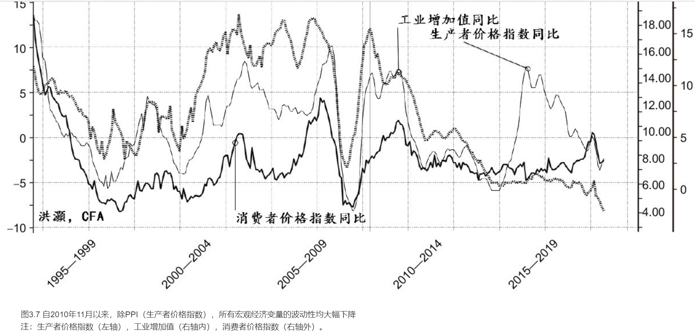
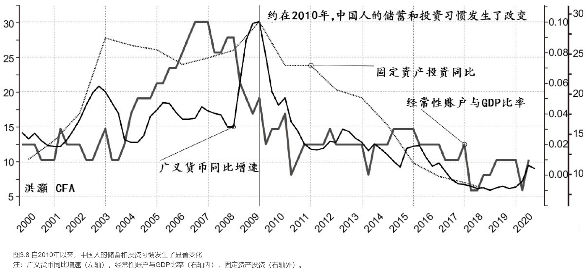
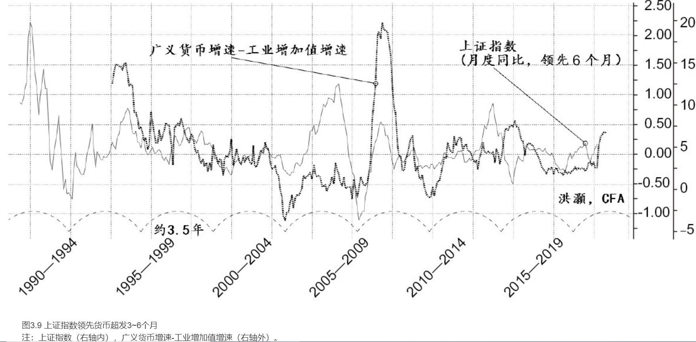
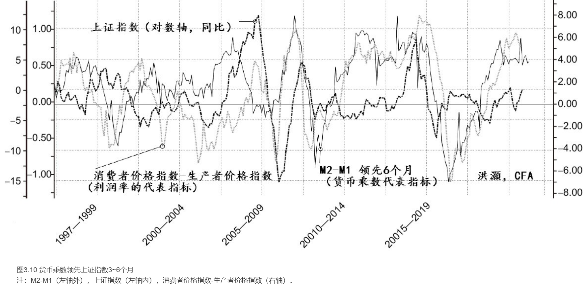

    作者: 洪灝
    出版社: 中信出版集团股份有限公司
    出品方: 中信·灰犀牛
    副标题: 经济、周期与市场泡沫
    出版年: 2020-10
    页数: 304
    定价: 69.00
    装帧: 精装
    ISBN: 9787521722147

[豆瓣链接](https://book.douban.com/subject/35219831/)

- [总论 预测的艺术](#总论-预测的艺术)
  - [宏观的革命](#宏观的革命)
  - [周期的诞生](#周期的诞生)
  - [非理性预期和市场泡沫化](#非理性预期和市场泡沫化)
  - [周期的规律](#周期的规律)
  - [经济周期和市场预测理论](#经济周期和市场预测理论)
  - [社会的不均](#社会的不均)
- [第一章 沉寂的风险](#第一章-沉寂的风险)
  - [美元体系隐忧渐显](#美元体系隐忧渐显)
  - [百年变局](#百年变局)
- [第二章 市场是否可以预测](#第二章-市场是否可以预测)
  - [市场理性还是市场投机？](#市场理性还是市场投机)
  - [结论](#结论)
- [第三章 经济是否可以预测](#第三章-经济是否可以预测)
  - [经济同步指标、领先指标和另类领先指标](#经济同步指标领先指标和另类领先指标)
  - [如何预测中国经济](#如何预测中国经济)
- [第四章 周期是否可以预测](#第四章-周期是否可以预测)

# 总论 预测的艺术
## 宏观的革命
凯恩斯理论的经济分析以有效需求的不足和边际消费倾向递减为出发点，以经济周期、系统不确定性以及社会主义性质的投资取向为主要元素。凯恩斯为政府在波动、混乱的周期性资本主义经济体系里扮演积极的角色奠定了理论基础，并深刻影响了当时罗斯福的新政。凯恩斯的革命性思维认可政府可以用政策干预市场，与当时古典派提倡以自由市场进行资源配置的见解大相径庭。凯恩斯主义的新理念自此一直影响着宏观管理的思维——直至20世纪70年代油价不断攀升，美国经济再次陷入严重衰退，有关的经济管理模式才最终被货币主义所取代。

凯恩斯后期未能完全参与市场诠释他的作品的过程，同时《就业、利息和货币通论》也确实十分晦涩难懂。不久之后，凯恩斯的理论便在新古典货币主义登场、沃尔克实施货币政策实验之后逐步退出经济舞台。

我笼统地把各个经济学派分为`古典主义`、`新古典主义`和`凯恩斯主义`。这些不同的经济学派最根本的区别在于对市场的有效性，以及市场如何最优地分配有限资源的看法。简言之，新古典主义依靠市场，假设市场总是可以通过市场价格的信号重新分配组合资源，重新回到一个所有资源都被最优分配以达到产出最大化的均衡。而凯恩斯主义依靠刺激社会需求来调整市场，促使市场重新回到均衡点，然而这个新的均衡点可能是次优点，同时经济可以有多于一个的均衡点。新古典主义以市场为核心，而凯恩斯主义更多是围绕人性展开讨论的。

## 周期的诞生
古典经济学和新古典经济学有两个重要的基本假设：

1. `萨伊定律`，也就是供给能够产生自己的需求（充分需求）；
2. 社会经济将通过市场价格的自我调整而实现`充分就业`。

在这样一个理想世界里，由于有充分的需求去消化所有的供给，市场供求条件的变化将使市场价格进行自我调整，最终供求曲线将运行到一个一般均衡点上。在这个均衡点上，经济里的资源都通过市场价格的信号被自然地、有效地、充分地分配。这时，社会也达到了一个完全就业的状态。当市场的供给产生变化时，市场价格将再次自动调整，使经济重新回到均衡点上。

2020年新冠肺炎疫情对于经济冲击的严重程度，不亚于20世纪30年代的大萧条。在2020年4月短短的4周内，美国的失业人数就飙升到2000多万。由于新冠肺炎疫情的暴发，供应链产生断裂，许多农场的农产品无法运送到消费者手里。许多农民不得不免费分发，甚至销毁他们的农产品——类似当年大萧条时，奶农把牛奶倾倒进河里的情景。

显然，供给并不总是能产生自己的需求。有效需求是不足的，并且随着时间的推移，这种有效需求不足的情况将越发严重。过去40年的经济历史证明，自从沃尔克以极度紧缩的货币政策制服了通胀后，供给持续大于需求。否则，我们如何解释在过去这么多年里，经济里的通胀压力长期持续地趋势性走低。如果市场价格经常在供给大于需求的时候承压，那么过去40年市场价格的持续下行，明显地显示了实体经济里有效需求的持续不足。在这样的经济条件下，经济里的实际均衡点很可能将离古典经济学里的最优均衡点越来越远——价格越来越低，就业越来越不充分。同时，由于供给相对于需求过剩，工人工资水平增长的速度相对于其劳动生产率水平的提高也越来越慢。

简单地说，按常理一个人是不能把所有收入在当期完全消费掉的。即使在某一个特定的时期，这个人的消费大于收入，或者说这个人是在借钱消费，那么这个人一生的消费和收入在理论上也应该是相等的。因此，一个人的消费倾向（ΔC），也就是他的储蓄（S）倾向的镜像（S=1-ΔC），往往小于1，并且是相对稳定的。甚至，一个人的消费倾向很可能是随着年龄和收入的增加而逐渐减少的。对于整个社会经济来说，产出等于收入，那么收入减去个人消费（C）和政府消费（G）的部分，就是储蓄。同时，这个均衡的关系显示，储蓄等于投资（I），我们也可以用公式来表达这个储蓄等于投资的关系：总产出P=C+G+I；因此，P-C-G=I；所以，S=1-ΔC= I。简言之，当期收入中没有消费的部分形成储蓄，而对于全社会来说，储蓄等于投资。

虽然储蓄等于投资，但是它们各自产生的原因却是不同的。从以上的恒等式来看，储蓄本身和消费倾向有关，本质上是当期消费和未来消费之间的衡量。而衡量当期消费和未来消费的决定性因素则是利率。同时，投资由企业主决定，取决于企业主对未来投资回报的判断，而这个判断更多取决于企业主对于未来的预期和信心。只有当未来投资回报高于利率的时候，企业主才会投资。在过去的40年里，对于整个社会来说，我们看到的利率下降的情况只是一个结果。被剥削的剩余价值的积累，意味着社会贫富分化越来越严重。同时，富人和穷人的消费倾向是不同的：富人的消费相对于其丰厚的收入和大量积累的财富而言只是很小的一部分，而穷人则不得不消费其大部分的收入来维持生计。或者说，富人的消费倾向远远低于穷人。反之，富人的储蓄倾向则远远高于穷人。这种**贫富极端悬殊的现象，直接造成了储蓄过剩，以及有效需求的严重不足，并不断地压低市场利率**。

对于储蓄和投资来说，储蓄产生的资金供给，并不自我产生有效投资资金需求。萨伊定律在这一对供求关系上也不奏效。这个推论不同于古典经济学的表述。古典经济学认为，储蓄产生的资金供应和投资产生的资金需求，可以在一个均衡的市场利率水平上达到平衡。然而，自2009年经济复苏以来，美国公司的投资资本回报率一路走低，同时伴随着资本支出的不断减速，回购股票的力度却越来越大。这种情况表明，企业家对投资的回报预期在不断降低，只能通过不断回购股票来提高股东收益。如上所述，储蓄资金和投资资金的不同决定因素造成了储蓄过剩，这时，即使利率不断下降，也无法补偿企业主迅速崩塌的投资回报预期，投资到实体经济里的生产性资产设备将会越来越少。久而久之，这一系列的连锁反应逐渐形成了贫富悬殊、储蓄过剩、投资不足、消费过低、经济增速不断放缓的经济现状。在这样的经济环境里，即便央行不断印钱放水、宽松货币，也无法唤起企业家投资实体经济的欲望。而讽刺的是，这个负循环，恰恰始于央行打着拯救市场的旗号推出的宽松货币政策。

再回到前述讨论的恒等式P=C+G+I。我们可以看到，消费倾向与个人的收入和财富水平有关。由于收入和财富的变化相对稳定，所以对于整个社会来说，收入和财富的变化往往等于整个社会收入的变化，也大致等比例于经济增速。因此，我们可以推论，消费倾向也是大致稳定的。随着时间的推移和贫富差距的不断扩大，对于整个社会来说，消费倾向会因为收入越来越集中在少数人的手里而越来越小，社会财富分配不均的现象将越发严重。但这些都是长周期的慢变量，我们很难在短时间里观察到本质的改变。然而，如前所述，投资的产生取决于企业主对投资的预期。通过实际观察可知，投资预期这种心理因素是非常易变的，很容易随着一些外界的因素大起大落，譬如股票价格。因此，被预期主导的投资决定也会变得非常容易波动，还会导致经济周期的波动。同时，消费则保持大致的稳定。也就是说，经济结构里最容易波动的部分是投资预期。这种投资预期的波动，就是经济周期产生的根本原因。而在短期消费倾向很难发生根本改变的时候，政府支出在经济衰退时就应该大幅地、逆周期地增加，以抵消投资预期变化带来的经济周期波动。

即便如此，央行的货币政策对投资预期的影响，也只能是间接的。在经济衰退的时候实施宽松货币政策，让实体经济里的资金成本大幅下降，从而让投资回报预期的门槛越来越低，然而，这并不能改变投资回报预期下降的趋势——尤其是在2020年这种迅猛的经济衰退的情况下。这也是为什么自2009年经济复苏以来，以资本开支形式投资生产性资产的增速在不断放缓。由于多年来利率不断走低，经济没有明显的通胀压力，所谓现代货币理论甚嚣尘上，实行负利率的货币政策被广泛而严肃地讨论。然而，如果货币政策并不能直接影响投资回报预期，只能形成投资预期的最低回报率要求，那么当投资回报预期为零的时候，就应该是利率的最后边界。在投资回报归零的这个时刻，再多的投资也不能实现实体经济增长的价值和增加劳动者的收入。同时，如果利率转负，就会变相地惩罚储蓄，干涸未来可能为投资提供资金的储蓄池。

## 非理性预期和市场泡沫化
新古典主义和凯恩斯主义的不同，还体现在对预期是否理性的观点上。新古典主义认为市场总是理性的。以美联储的一系列经济学家为代表，其认为理性预期假设市场的价格瞬间反映了市场里所有的消息和数据，并能够在一瞬间把这些新的消息和数据正确地计入市场价格里。因此，在一个理性预期的市场里，泡沫是很难产生的。即便有泡沫，也是“理性泡沫”，因为市场的价格理性地计入未来经济不断快速增长的预期，央行很难事先准确判断泡沫的形成。毕竟，市场里千千万万的参与者，包括那些受过最好的商学院教育，对上市公司的情况有充分了解，与上市公司的管理层有充分沟通的市场分析师和聪明的投资者，怎么可能一起犯同样的错误呢？因此，央行的首要任务是尽力保持货币政策的适合性，以此为经济增长提供最好的环境，达到充分就业和通胀平稳的双重政策目标。不幸的是，如果市场泡沫最终破灭，那么央行应该采取宽松的货币政策来帮助市场尽快恢复正常，使经济能够快速重回正轨。

显然，央行的这种货币政策选择的回报是非对称的。这种货币政策的选择提倡在通胀压力保持相对稳定的前提下，极力呵护市场上行和经济扩张，在市场暴跌的时候放松货币政策救市。这种货币政策造成了“上不封顶，下有保底”的市场回报分布，也就是市场里俗称的“美联储看跌期权”。这个美联储赐予的免费的看跌期权，与市场参与者手中的股票持仓，组合成了一个类似看涨期权的回报形态。这也是为什么这么多年市场的起伏，使市场参与者谨记着华尔街的那句格言“不要和美联储作对”，以及“逢跌必买，越跌越买”的交易策略。

对于市场泡沫化后的政策处理，理性预期学派和非理性预期学派并没有太大的分歧，两派都主张以宽松的货币政策来应对市场泡沫的破灭。然而，两个学派不一样的地方，是二者对市场泡沫化前的处理方式。理性预期学派选择对泡沫视而不见，掩耳盗铃，打着理性预期理论的旗号为执行宽松的货币政策提供理论基础。在央行官员的眼里，如果市场的预期是理性的，那么不断宽松的货币政策必然也是理性的、正确的。如前所述，执行这样的货币政策带来了贫富差距扩大等负面的社会效应。毕竟，政策都是为统治阶级服务的。在今天的美国社会里，1%的社会顶层人士拥有超过50%的股票和基金，1%~10%的社会上层阶级拥有接近90%的股票和基金。这些人往往是美国的经济精英，直接或间接地决定了社会分配的制度。

## 周期的规律
既然企业主投资预期的变化会引起经济周期的波动，同时央行在理性预期的基础上，试图以宽松货币的形式在市场出现危机时拯救市场、稳定预期，那么逻辑上有两个结论是显而易见的：一是经济周期的起伏与央行的货币政策有关；二是因为央行的货币政策选择是可以预测的，所以周期也是可以预测的。

我的量化研究发现，中美经济运行的短周期为3~3.5年。在周期运行的时候，大量的宏观经济变量同时且有规律地以大致固定的速度向同一个方向运行。因此，在确立周期长度的时候，我们只要找出最关键的一组驱动周期运行的变量，就可以大致推导出其他变量运行的方向和趋势。值得注意的是，在预测的时候，我关心的是经济变量运行的趋势和方向，并不是它们的绝对水平。因此，在本书里讨论的周期，是增长率周期，而不是经济运行的绝对水平周期。其实，日本的所谓“失去的30年”里的经济增速，虽然是在放缓，但是大体上还是保持正增长的。改革开放以来中国经济的持续增长是有目共睹的。因此，我们讨论的中国经济的放缓，严格地说，与西方经济的衰退不一样，虽然表现出来的形式都是经济增长率的放缓。

我的研究发现，中国经济周期的起伏，也就是经济增速的加速和放缓，与中国房地产行业的活跃性密切相关。在分析并拟合了几组房地产及其相关数据，形成了一个中国经济周期领先的指标之后，我们可以看到在过去20多年里，中国的房地产周期驱动中国经济周期以3~3.5年的时间长度向前波动。同时，中国经济周期的大趋势呈现出一个长期下行的状态——每一个经济短周期的高点和低点都越来越低。当然，这种长期下行的状态其实也没什么可大惊小怪的。长期来看，随着中国的经济体量不断增大，经济学里的边际效应递减的规律将会越来越明显，周期的高点和低点，也就是中国经济增速的变化，将会越来越小，而宏观经济里的波动性也将会逐步收敛。

此外，我的研究发现，美国经济的短周期大约是3.5年，其主要的领先指标在于美国在科技研发上的投资，如半导体出货量的变化、公司的资本支出计划的变化，以及其他一些更传统的指标，如新房开工、新房建筑批准、新房贷的申请等经济领先指标。这些指标的变化也呈现出周期波动的特征——同时且有规律地以大概一致的运行速度向同一个方向波动。当中美周期同时进入下行阶段的时候，市场往往会发生大幅动荡，虽然并不一定伴随着经济的衰退，比如2018年第四季度。2018年9月3日，我发表了一篇题为“中美周期的冲突”的论文，以量化模型详细论证了美国经济周期运行的规律，并指出当时中美周期同时下行预示着即将到来的美国市场暴跌。回过头看，这篇论文发表的时间点恰恰在当时美股的顶峰。最终，美国市场开始的一轮波澜壮阔的暴跌，使2018年第四季度成为1929年大萧条以来最差的第四季度。

一般来说，2-3个3.5年基钦库存短周期，镶嵌构成一个7-11年的朱格拉资本置换中周期；5个以上的3.5年基钦库存短周期，镶嵌构成一个17.5年以上的中长周期；最后，10个以上的3.5年基钦库存短周期，镶嵌构成一个35年以上的长周期，也就是现在可能大家都已经耳熟能详的康波周期。值得注意的是，周期运行的时间长度并非一成不变的，特殊的社会、经济事件常常会干扰经济周期的运行。然而，经济周期的运行有其内生的规律，央行的货币政策选择在很大程度上推动了这个规律的形成。因此，即使有无法预计的事件干扰了周期的运行，这些事件也只能改变周期波动的幅度，而不能改变其运行的方向和趋势。

## 经济周期和市场预测理论
我的研究发现，一个3.5年的短周期里大约有850个交易日。每个月平均有20.2个交易日，一年里有242.4个交易日，经过3.5年的时间，进而形成了一个有848.4个交易日的市场周期，也就是上述大约850天的市场周期。以这个850天的时间长度计算出来的、简单的市场价格移动均线，对于预测市场的趋势非常有效。

## 社会的不均
央行明显的货币宽松倾向从格林斯潘就任时就正式开始了，并且一发不可收。美联储坚持的理性预期理论和市场投机理论在市场泡沫破灭后的政策选择都是一致的，也就是要大幅放宽货币政策，帮助市场尽快修复，重新回到上行的趋势。然而，美联储在泡沫产生之前对于资产泡沫的绥靖政策，不仅使泡沫破灭后需要进行的宽松货币政策的力度越来越大，还使经济离最优的均衡点越来越远，在次优的均衡点上则越陷越深。在这个次优的均衡点上，社会资源并没有被充分分配和利用，从而直接导致了消费不足和社会贫富悬殊的现象，并且这种现象不断加剧。

央行的货币政策并不能改变企业家对于实业投资回报的预期，这个预期是由实体经济里的投资机会决定的。央行的货币政策可以做到的，只是要不断降低投资回报的门槛，让很多之前在利率更高的情形下无法投资的低质量的项目可以获得投资，比如美国的页岩气行业。同时，不断下降的市场利率也让很多市场里本应该破产的“僵尸企业”得以苟延残喘，比如在2020年新冠肺炎疫情中暴露出来的一系列不得不动用美联储借款便利的企业。投资于低效甚至是无效的项目，只能维持整个实体经济的规模以资金成本增加的速度扩张，并不能提高生产效率，社会也无法进步。

社会顶层由于资源丰富，可以尽情地享受低利率的优势来积累财富，不断地剥削工人的剩余价值，所以社会越来越分裂。同时，由于社会顶层的消费倾向低于社会中层和底层，也就是说，社会顶层人群的消费相对于他们的收入的占比，比社会中层和底层的人群要小得多。这个现象进一步加剧了有效消费不足的产生。

想象一下，一个实体经济里，90%的底层人群与10%的顶层人群平均分配国民收入——90%的底层人群获得50%的国民收入，同时10%的顶层人群也获得50%的国民收入。这就是美国社会的现状。许多其他国家社会贫富悬殊的现象虽然没有那么严重，但是也和美国类似。对于社会里90%的底层人群来说，**收入的增长持续落后于他们劳动生产率的增长。在这样的经济体里，供给一定是经常过剩的**。这是因为缓慢的收入增长无法刺激需求，同时快速提高的劳动生产率则使供给不断增加。最终，市场商品价格将会下跌。因此，严重并日益恶化的收入不均是全球经济在复苏了近10年之后仍然受到通缩威胁的最主要原因，也是不断实施宽松货币政策的恶果。

能够让美联储有不断实施宽松货币政策的空间，除了不断下行的弱通胀，甚至通缩的压力，还有美元作为全球储备货币的特殊地位。美元作为储备货币的地位让建立在美元债务基础上的货币宽松形成了闭环。理论上，美联储的资产负债表是可以无限扩大的。因此，美国的负债不同于新兴市场的许多国家，是本币美元负债，而非外币负债。只要美元保持储备货币地位，美国的负债能力在理论上就是无限的。这个与许多西方观察家看到中国2009年之后负债的急剧飙升而唱空中国，最终却失败的原因是一样的——中国大部分的负债也是本币负债。只要中国人民银行拥有印发人民币的权力，那么中国的负债能力在理论上也是接近无限的，更遑论中国这么多年以来积累的巨额储蓄了。与日本20世纪90年代之后的状况类似，中国有着丰厚的储蓄和印发本币的能力。

当然，负债也不是毫无成本的。负债不断上升，即使利率不断下降，利息的负担也在不断上升，还有到期的本金。维持负债规模，不让其崩塌，主要是通过增加税收，以及货币贬值和通胀实现的。显然，增加税收虽然是一个可行的解决方案，但它也是最不受欢迎的政策，尤其是对富人征税，这样的政策一定会遭到选民的一致反对。如果当不上总统，即便有增加税收的豪情壮志，也是枉然。所以逻辑上只剩下另一个选择，就是货币贬值和通胀。通胀可以让未来等值的债务的实际负担悄悄减少。因此，一直以来，通过通胀来减轻债务负担都是一剂良方。由于部分美债的持有人是外国主体，美元贬值意味着这些主体手上持有的美债的价值相较于之前有所减少，所以美国政府的债务负担也就由此减轻了。

这个政策选择，只是一种两害相较取其轻的做法，也必将损害美元信用。自从20世纪70年代脱离了金本位制，美元的购买力已经下降超过90%，美元信用其实受到了极大的破坏。欧元的崛起和人民币未来的国际化，都是美元信用下降的折射。从美元自身的周期来看，美元已经开始进入一个走弱的周期，美元开始贬值的趋势随着美联储无底线的印钱越发明显。

# 第一章 沉寂的风险
## 美元体系隐忧渐显
简单地说，如果一个系统只能依赖大量提供美元流动性来缓解经济周期中按照一定频率出现的经济危机和金融危机，那么从长期来看这个系统的美元供应量相对于需求肯定是过剩的。这是因为危机之后，系统多增的美元并没有被回收。这体现在美联储的资产负债表的不断扩大，尤其是在危机时期的剧烈扩大，一如2008年和现在。国际清算银行的数据显示，美元在全球支付系统中所占的百分比并没有下降。但是，美元信用的弱化最直观的体现，是美元汇率长期不断贬值。

美国现在正处于借新债滚旧债的阶段，也就是明斯基定义的信贷周期里借新还旧的第二阶段，并且正在慢慢地向第三阶段庞氏骗局迈进。可以想象，这些新增的、为了应对危机的负债，是很难有生产效率的。或者说，债务的增长并不对应着生产性资产的扩大和社会生产力的提高。显而易见，这样的负债是无效的。它维持下去的唯一逻辑，就是假设美国可以“大而不倒”，归根结底也就是美元信用的问题。

## 百年变局
本章我们讨论了现在全球金融体系价值的锚定——美元，同时它也是这个系统的软肋。长期以来，根据CPI（消费者价格指数）调整后的美元的购买力不断下降，尤其是在1976年，美国终止了国际上黄金与美元的可兑换性，美元和黄金彻底脱钩。在这个以美元为核心的体系里，美国是唯一能够提供所谓安全资产的实体。在全球面临危机之际，美联储作为全球最重要的央行之一，不断提供美元流动性以对抗系统性金融危机。这种宽松的货币政策是为了应对危机而大幅印钞，而不是对应生产力和实体经济体量的扩大而提供更多的美元流动性。这个美元供应过程本身一定会产生过剩。基础经济学告诉我们，当一种商品供给大于需求的时候，其价格会下降。长期来看，美元汇率的长期下行趋势，以及美联储资产负债表在几次危机之后的迅速扩张，符合基础经济学对美元流动性过剩压抑美元汇率的推论。表面上看，只要美元信用还在，非美国家就仍然愿意持有美国国债，那么现有的体系似乎可以违反常理地继续存在一段时间。然而，经济学是一门在有限的条件里资源配置最大化的科学。换句话说，在达到临界点之后，经济里的单位回报将开始小于它相应的风险成本。现在对于系统临界点的思考，应该是美元信用是否可以在空前的量化宽松政策下维持，美联储的资产负债表能够达到一个什么样的规模，以及美国国家的负债极限在哪里。

1929年大崩盘导致的大萧条，到1933年罗斯福实施新政，以及美元贬值40%之后，才得到有效解决。由于突破了金本位制对于货币供应量的束缚，流动性大幅增加，再结合美国政府当时其他的财政扩张措施，美国最终走出了大萧条。当然，也有人会说，是在美国境外发生的第二次世界大战，使全球各国对于美国的出口需求大幅增加，从而刺激了美国经济，才使其最终复苏，并走向繁荣。无论如何，对于1929年大崩盘后的危机，确实是通过改变当时已有的国际货币体系来提供大幅流动性才解决的。

在2020年面对的、堪比1929年大萧条的经济危机里，现有的货币体系也在改变。危机初期，由于非美国家对美元的需求大幅增加，美元汇率在短期内大幅走强，现有的这个系统似乎还是宝刀未老。然而，美联储的资产负债表规模，从2019年第三季度的3.7万亿美元，激增到2020年7月的7万多亿美元。在2020年3月末之后短短的8个星期里，美联储就购买了近1.5万亿美元的美国国债和其他形式的债券。美国财政部计划在2020年发行超过4万亿美元的国债，而2019年全年的发债规模只有1.28万亿美元，2008年金融危机时为了救市才发债6500亿美元。美国政府负债和GDP的比例，很快就要回到第二次世界大战时期的高度。美国政府的财政赤字和GDP的比例，不日也将追赶第二次世界大战时的水平。

在完全抛弃了黄金的价值锚定之后，美联储在放纵美元的路上越走越远。毕竟，在过去一百年的时间里，即便美国肆意印钞，全球的金融系统由于对安全资产的需求，也不得不继续从美联储这一家独大的安全资产生产者那里购买美元资产。以美元为锚的全球货币体系，曾经给国际贸易带来统一的定价标尺和交换媒介，为全球金融系统提供了储蓄价值的工具，还在全球金融危机的时刻为投资者提供了安全资产。然而，现在这个系统崩溃的风险正在快速飙升。虽然这个依赖于美元的系统的风险和回报很难量化，但是一些系统内的变化预示着，随着美元信用不断降低，美元已经运行到了周期性的高点，很快将开始系统性走弱的长期趋势。对于2020年的这次危机，宽松的货币政策既是短期系统性风险的解药，也是长期系统性风险的导火索。宏观变化已经运行到了长期临界点。

2020年5月，市场开始担心由于中美关系不断恶化，中国将抛售价值1.2万亿美元的美国国债。美国的总负债已经达到了25万亿美元，中国的1.2万亿美元的美国国债持仓，已经不如以前在整个美国国债系统里的占比，因此美联储可以很快地接盘。毕竟，3月末之后的8个星期，美联储就购买了近1.5万亿美元的美国国债和其他形式的债券——远远超过了中国对美国国债的总持仓量。同时，3月以来美国财政部新发的国债，也是由美联储购买了绝大多数的。然而，如果中国和其他美国国债持有大户最终选择抛售美国国债持仓，可能就将显示出现有系统里美元信用的崩溃——大客户不再希望持有美元或美元资产。即便美联储可以暂时接盘，平抑短期的价格波动，但是美国国债将变成一项国内资产，只能通过国内债务货币化来消化。同时，由于这些美国国债的发行将用于实体经济的建设，它最终对经济的影响一定是通胀性的。而由于美国政府信用的缺失，对于美国国债的投资，美国国内的投资者也会三思而后行。

# 第二章 市场是否可以预测
## 市场理性还是市场投机？
作为新古典经济学的一种延伸理论，有效市场学派认为，股票的内在价值本质上就是未来预期利润的贴现价值，而市场竞争力量会自动让股票价格回归到与内在价值相等的均衡水平上。不同的是，市场投机理论拒绝接受这个观点。市场投机学派认为，复杂的心理和市场因素会让股票价格突然而剧烈地波动。

基本面估值分析法允许当前股票价格暂时高于或低于其均衡值（股票的内在价值）的水平。研究股票基本面的目的，是让谋求利润最大化的交易者发现股票的内在价值。如果一只股票被发现定价过高，那么那些知道这一信息的人就会从他们的投资组合中卖出这只股票，甚至做空这只股票，直到沽售的压力将这只股票的价格压低到其内在价值水平。相反，如果一只股票被发现定价过低，那么知道这一信息的人就会购买这只股票，直到对于股票的需求将股票价格推高到其内在价值水平。

这是象牙塔里的世界观。有实际市场交易经验的读者都知道，市场价格可以持续偏离价值。同时，做空也是有成本的，并不是每一只股票都能融券做空。对于一些热门的股票来说，融券成本会很高。

根据有效市场假说，股票价格总是等于其内在价值水平，因为市场掌握了决定内在价值的经济基本面的所有信息，而市场会立即将这些信息反映到当前的股票价格上。在这个假说里，股票价格之所以出现变化，是因为市场认识到经济基本面已经发生改变，从而改变了内在价值，并立即将市场价格提高或降低到新的内在价值水平上。然而有趣的是，在1987年股市崩盘之后，一些有效市场假说的支持者试图辩称“理性泡沫”存在的可能性。然而，这么大的市场一天暴跌了近1/4是很难用理性预期去解释的。如果预期是理性的，泡沫破灭前的市场价格永远是对的，那么整个市场单日就不会出现如此幅度的暴跌。

凯恩斯把基本面分析定义为预测长期收益，而把投机定义为预测市场大众的心理。简单地说，市场投机理论对股票定价有三个要素：人性，经济未来固有的不确定性，以及有组织的、交易成本低的现代交易所的制度。

## 结论
市场的可预测性，也是有前提条件的。在正常的情况下，市场往往反映经济的基本面。关于基本面的信息无时不变，并在有组织、有秩序的交易市场里迅速地反映在股票的定价里。由于基本面消息的出现是随机的，因此每天股票价格的波动似乎是无序随机的。对于市场动态交易的预测从来就不是一门精确的科学……市场里的投机大众，在任何一个特定时点都无法定论市场的涨跌，因为每一个价格都有无数的买家及卖家并存”。

也就是说，市场在很短的时间里，几乎是无法预测的。然而，股票市场每天的赢面略高于50%，长期形成了整体市场3/5~2/3的赢面。因此，从长期来看，股票市场的趋势总是向上的。又或者说，股票市场反映了人类社会不断进步的现实。

有效市场学派和市场投机学派之争，主要在于市场定价的方式，也就是泡沫是否可以预测。有效市场学派认为，股票价格反映了经济的基本面。每天关于基本面信息的变化，导致了股票价格的上下波动。如果股票价格明显偏离了其内在价值，市场中套利交易的力量就会进行高卖低买的操作，使市场价格重新回归股票的内在价值。同时，由于这些个股定价出现错误的概率是随机的，所以从市场的整体层面看来，这些定价的错误都会互相抵消，使市场整体的定价呈现出有效性。

市场投机学派则不这么认为。由于人性的贪婪、未来的不确定和市场流动性的偏好，短期的股票价格和基本面根本没有什么关系。基本面的历史数据和现在的信息都无法预测未来，而未来并非历史数据的线性外延。因此，只要市场是有组织、有秩序、有流动性的，那么贪婪的人性和人类自我高估的倾向都会让人们认为自己可以比交易对手更好地预测未来的价格，而低廉的交易成本和市场在正常时期貌似充足的流动性，让投机者误以为可以在市场崩溃之前及时全身而退。然而，在股票价格飙升进入疯狂阶段的时候，任何风吹草动都可以让市场价格瞬间崩溃。这时，整个市场对于流动性同时的挤兑将使流动性突然枯竭，从而套住了市场里几乎所有的投机者。

# 第三章 经济是否可以预测
在中国，市场参与者的博弈情绪非常浓重，往往采取逆向的思维对经济数据进行解读。比如，如果经济数据好于预期，市场往往就会解读为央行实施宽松货币政策的概率在下降，因此股票市场下跌。反之亦然。很明显，在中国市场里，市场的参与者并不那么关心基本面的好坏，而会关心基本面变化对央行实施宽松货币政策概率的影响，进而影响到市场其他参与者对股票定价的预期。在这样的市场里，投机主义占了上风，基本面分析则很难在短期内带来额外的收益。同时，这样的市场往往也容易沉溺于对流动性的臆测而出现波动，并在市场对充足流动性有强烈预期的时候产生泡沫化的趋势。

## 经济同步指标、领先指标和另类领先指标
世界大型企业联合会每月都会公布一组经济领先、同步和滞后指标。顾名思义，那些预测经济未来状况的指标是领先指标，反映经济现状的指标是同步指标，而滞后指标则是那些事后确认经济拐点的指标。

世界大型企业联合会的`经济同步指标`包括非农就业人数、个人收入（除转移支付）、工业产出、制造业和贸易收入。一般来说，这些经济同步指标并不是决定市场走势的关键数据，因为它们只是在告诉市场参与者有关经济现状的信息。

经济同步指标并不会告诉我们经济增长的实际具体水平，而会确认经济运行的方向。对于同步指标这样的解读与我们之前讨论的关于预测的目标是一致的。GDP实际增速变化与经济活动同步指标亦步亦趋的情况。

一般来说，`经济领先指标`里包含了10个领先经济的数据。我们可以把这10个领先数据分为3组：第一组，实体经济数据，包括制造业平均工作时长、每周新增失业保险救济金领取人数、消费品制造新订单、非国防资本耐用品（除飞机）新订单、建筑开工许可数量；第二组，金融市场数据，包括息差、股票价格；第三组，预期数据，包括ISM新订单、领先信贷指数、消费者信心指数。

在使用经济领先指标的时候，经济学家更关心的是指标变化的程度、持续的时间和成分数据之间的一致性或者扩散性，以及经济领先指标的长期趋势。由于指标每月都会发生变化，所以以每月的变化来做出对经济运行的预测，将会使预测结果随时改变。通常的做法是，看经济领先指标的数据在给定的一段时间内有多少次是下行的。然而，如果以连续5个月的领先指标下行作为判断经济衰退将要到来的依据，那么预测将错过始于1988年的衰退；如果以连续7个月的领先指标下行作为判断依据，那么预测将错过1951年、1966年和1984年的经济衰退；如果以连续10个月的领先指标下行作为判断依据，那么预测将错过所有的经济衰退。这些例子告诉我们，如果在经济领先指标持续下行时等待过久，就会错失正确预警经济衰退的时机，增加事后应对经济衰退的成本。

既然我们知道没有一个指标可以完美地预测经济衰退的到来，那么我们可以把预测的目标改为在给定的一段时间内，以有多少个月指标下行作为判断依据，并找出一个最优的组合。比如，我们可以把判断的标准设定为：8个月中有5个月指标下行，或7个月中有4个月指标下行。也就是说，在给定的一段时间里，有超过半数的时间，经济领先指标在下行。如果出现这样的情况，我们就判断经济衰退即将到来。

美国国债收益率曲线被誉为预测经济增长拐点最准确的指标之一。一般来说，在进行预测的时候，交易员可以用美国十年期国债的收益率，减去两年期国债的收益率或三个月国债的收益率，来衡量美国国债收益率曲线的坡度。在正常的情况下，债券的期限越长，其收益率就应该越高，反之亦然。这是因为期限越长，债券持有者被绑定的时间也就越长，就越要牺牲自己资金的短期流动性，并承担更多的不确定性，来获取长期的债券收益率。

然而近几年，随着各国央行逐步进入负利率区间，国债收益率曲线的短端交易变得异常。到了2019年下半年和2020年的第一季度，所有主要西方国家的国债收益率曲线都倒挂了。一条倒挂的收益率曲线往往预示着经济衰退的到来，而收益率曲线出现倒挂的情况，可以领先经济衰退最终的到来最长达18个月。20世纪90年代以来，国债收益率曲线的倒挂，预示了美国经济的每一次衰退。可以说，这个指标预测的历史成绩，几乎是所有领先指标里最好的。收益率曲线倒挂之所以能够预测经济衰退的到来，是有经济基本面原因的。银行是实体经济的心脏和供血器官，银行系统的健康直接反映了整个实体经济的健康。很难想象，一个心脏病患者整体的健康状况会有多好。银行都是在金融市场上开展借短放长的业务的。当市场上的国债收益率曲线倒挂的时候，银行的短期融资成本将高于它放贷产生的利息收入。这时，银行放贷的意愿将下降，而实体经济将因为缺乏流动性而不能正常运转。这是从基本面的角度来解释国债收益率曲线倒挂的现象的。

从交易的角度来看，一条倒挂的收益率曲线显示了市场参与者整体风险厌恶的情绪。在交易员厌恶风险，需要把投资组合的风险降下来的时候，他们往往会把资金从短端挪到国债久期的长端，也就是买长期国债。这是因为美国国债是市场公认的最安全的投资标的，其避险功能甚至比具有两面性风险偏好的黄金还要好。因此，在交易员卖出短端，买入长端国债，并把这个卖短买长的交易策略进行到极致的时候，国债收益率曲线就开始倒挂了，反映了市场极度风险厌恶的情绪。而银行作为交易员的对手盘，其商业模式决定了它天生就是一门卖短买长的生意，对应的是正常时期市场交易员买短卖长的交易策略。然而，当市场上的交易员的交易方向和银行一致的时候，银行的资金来源自然也就出现了问题。

## 如何预测中国经济
如果我们看一下中国宏观经济变量在2010年前后的表现，就会发现这一年是中国宏观经济重要的分水岭。许多重要的宏观经济变量，如GDP增长速度、工业增加值、货币供应、投资增速和价格通胀等的波动性，似乎在2010年之后突然崩塌了，与之前这些变量在20世纪90年代表现出来的巨幅波动大相径庭（见图3.7）。

对于价格通胀波动率的消失，去通胀甚至通缩现象的出现，我认为很大一部分是社会贫富分化导致有效需求的不足造成的。这是一个长期的社会经济现象。回溯历史，我们会发现，2010年正好是2008年全球金融危机之后，中国进行4万亿经济刺激计划，2009年经济开始复苏之后的第一个完整的年份。在这一次开闸放水之后，中国货币政策的有效性开始边际递减，表现为每一个单位的GDP增长，都对应着越来越高的信贷增长，信贷增长的速度远远超过了经济增长的速度。

美国市场里流行的“美联储看跌期权”，就是建立在宏观经济的流动性不断上升、波动性不断下降的基础上的。在这样一个环境里，投资回报形成了一个下面有底、上不封顶的不对称分布。过去10年，美国市场里做空波动性来获得这个不对称回报的交易一直很流行。这个交易的主要逻辑就是基于“美联储的看跌期权”——每当市场陷入困境时，美联储都会出手纾困。由于持续的流动性供应抑制了市场波动，押注波动性会趋势性下降是有利可图的——这个波动性的趋势性下降会持续到2018年1月中美贸易摩擦升级导致的波动性巨震为止。当时，许多之前专注于做空波动性，押注市场波动性长期趋势性下降而获益的基金，一夜之间回吐了多年来积累的几倍的收益。许多做空波动性的ETF的价格暴跌近零，被迫清盘。

2008年果断的宏观救市，最终使“美联储看跌期权”策略登上了对冲策略的王者之巅。然而，当人们认为下行的风险受到政策保护的时候，他们在做投资决策时的风险偏好将被无节制地放大，甚至乐于承担与回报不相称的风险，以达到回报最大化的目的。这就是传说中的市场道德风险——反正爆仓了有央行兜底。这是一种类似于中国市场里刚性兑付的逻辑，比如，过去几年盲目加杠杆去追逐一些回报非常低的地产项目融资。这些鲁莽的行为，都将导致系统不能产生足够的回报来偿还资金成本，最终导致系统崩溃，降临一个`“明斯基时刻”`。

我们还可以从中国人的储蓄和投资习惯的角度，来观察中国宏观经济波动性消失的现象。2010年以来，我们不仅仅观察到宽松货币政策的效应正在边际递减，同时中国人的储蓄和投资习惯也发生了变化。在宏观经济里，广义地说，储蓄等于投资。在2010年左右，我们看到中国的以经常性账户与GDP比率定义的宏观储蓄率达到了一个高点，并开始下降（见图3.8）。

历史上，中美两国经济互补性很强。中国生产，美国消费。在中国出口获得美元之后，中国人民银行从市场上回收了这些美元，形成中国的外汇占款，并在此基础上根据中国经济发展的需要酌情提供货币供应。因此，美国依赖于进口和过度消费导致的经常性账户赤字，曾是中国货币体系流动性的重要来源。2010年之后，由于美国的宏观储蓄率下降，回笼出口美国带来的美元收入对中国货币增长的贡献也就下降了。而中国的宏观储蓄率下降，同步于投资增速放缓的现象。假如我们把中国的经常性账户与GDP的比率看作一个全球化的代理指标，那么可以把2010年看作全球经济一体化的顶峰。

中国宏观经济里的波动性逐步消失，也反映为最近几年中国的GDP增速在图上表现出来基本上就是一条直线。也就是经济学家热议的，中国经济进入了一个“L形”区间。

我认为中国经济的“L形”走势并非如西方观察家所认为的是数据造假的结果，而是由深刻的经济结构变化导致的，尤其是中美两国人民储蓄和投资习惯的变化和中国货币供应的变化。

中国宏观经济波动性的消失是对资产定价的一个重要观察。过去，广义货币供应增长对中国股市的表现至关重要。如果没有它，我们就不会看到4万亿刺激计划之后股市的复苏反弹，以及随后几年随着货币增长放缓而出现的黯淡回报。我们把经济里超额的流动性定义为广义货币增速和工业增加值之差。因为只有超额的流动性，也就是超过了实体经济增长所需要的资金供给，才会导致经济增速超过潜在的增速，并导致通胀过热。我们可以把这个计算超额流动性的指标，和上证指数的回报率做一个比较。我们会发现，上证指数的回报率领先超额流动性3~6个月（见图3.9）。也就是说，虽然超额流动性可以解释经济超潜力增长的情况，但股票市场往往更能提前反映未来。

PPI受货币政策的影响较小，这似乎也是合理的。因为这些政策无法影响大自然和生命中的无常，所以也不会对农作物的收成、矿物的发现和工业大宗商品的生产成本产生太大的影响。如果用CPI和PPI之间的差距来近似衡量企业的利润率，那么我们将立即面临一个难题。社会的分配不平等和中国人的储蓄和投资习惯的变化抑制了CPI的波动，但PPI的波动却仍受其他非政策、非经济变化的影响，反复无常。PPI的波动性大于CPI的波动性说明，企业对上游成本的控制能力低于对下游商品的定价能力。企业的定价权因此不断下降。

如果CPI的涨幅高于PPI，或者说企业的利润率扩大，那么这家企业的股票应该受惠。反之类推。如图3.10所示，我们可以看到CPI和PPI之间的差额（即利润率），M2（广义货币供应量）和M1（狭义货币供应量）之间的差额（即货币乘数），存在着密切的相关性。如果货币环境放松，就像2020年3月新冠肺炎疫情之后那样，那么企业的经营环境应该会有所改善，利润率往往也会改善。然而，鉴于企业在宏观波动性下降的环境中定价权较弱，盈利对相应股票定价的影响将较小，因此，对于观察到的股市波动，其他决定股票回报的非盈利因素肯定在起着更大的作用。

我们将股票回报的来源分解为两部分：盈利增长和估值扩张。如上所述，在新的宏观环境下，企业的定价权正在减弱，盈利增长对股票回报的贡献应该会越来越少。因此，在这样的新的宏观环境下，估值倍数应该是股票回报的更重要的来源。的确，在分解了股市的实际回报率之后我们发现，盈利增长对股票回报的贡献越来越少了。2006年以来，估值的变化决定了绝大部分的股票回报。这个现象在2009年的复苏和2015年的泡沫时期是最明显的。当时，流动性非常宽松，但经济的基本面却非常差。A股可以在一段时间内脱离基本面上涨，直到估值偏离基本面太远，反弹自然就会不负重荷。

对中国宏观经济的预测，也就是对股市未来回报率的预测。由于股市的回报率同广义货币供应的增速，尤其是超额广义货币供应的增速的变化息息相关，所以对中国宏观经济走势的预测，也就是对未来货币政策取向的判断。而未来货币政策的取向，又往往取决于当前所面对的经济形势。这也是为什么与货币政策变化高度相关的股市回报率的变化，往往与当前的经济基本面相悖——毕竟，股市是宏观经济的领先指标。

# 第四章 周期是否可以预测

