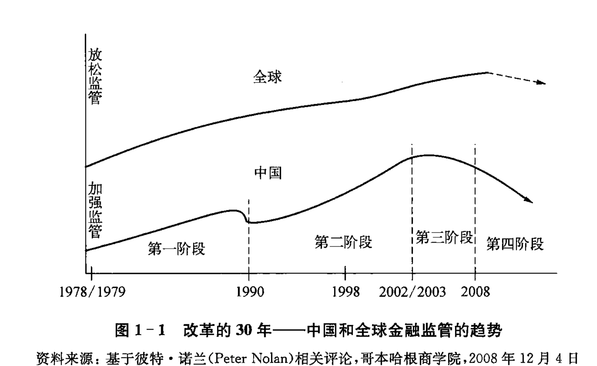
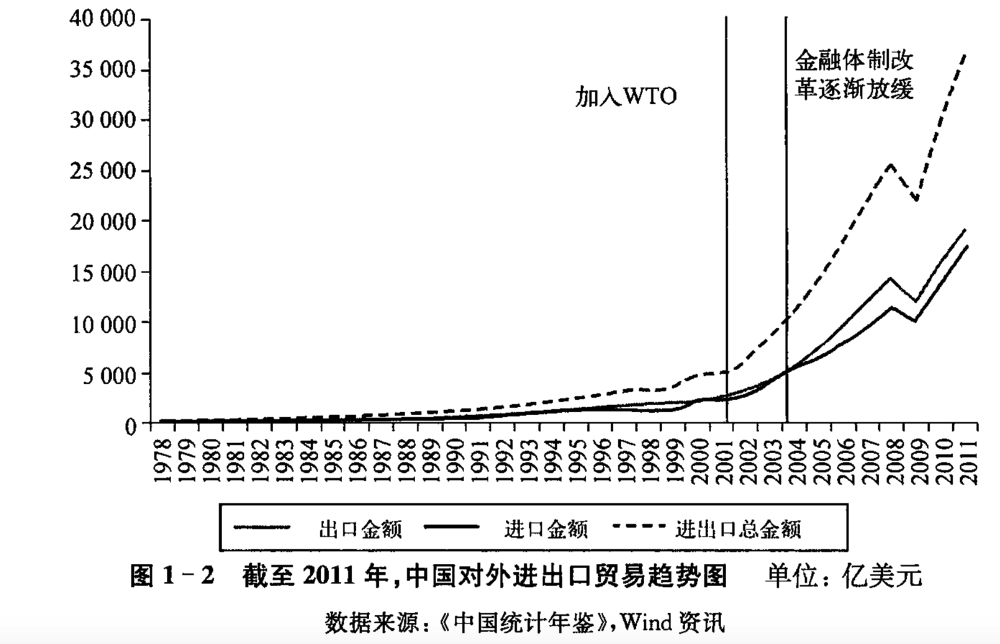
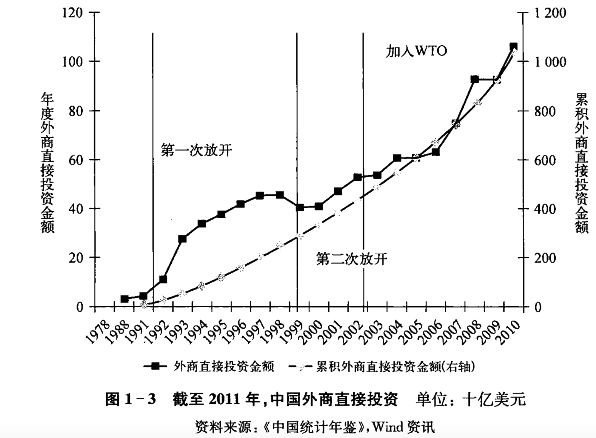
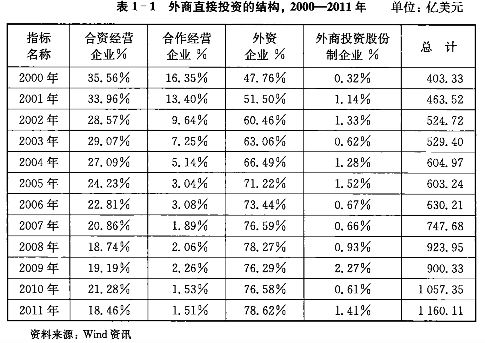

    作者: [美]卡尔·沃尔特(Carl E. Walter) / [美]弗雷泽·豪伊(Fraser J. Howie)
    出版社: 东方出版中心
    副标题: 中国的非凡崛起与脆弱的金融基础
    原作名: Red Capitalism: The Fragile Financial Foundation of China's Extraordinary Rise
    译者: 祝捷 / 刘骏
    出版年: 2013-8-1
    页数: 270
    定价: 38.00元
    装帧: 平装
    ISBN: 9787547306079

[豆瓣链接](https://book.douban.com/subject/25717107/)

## 第一章 中国改革开发政策的回顾

“技术性破产”：类似于美国当年利用重组信托公司（Resolution Trust Coporation, RTC）来解决储蓄与贷款危机的经验，周小川主张建立中国的四个“坏银行”，即用于处理大型国有商业银行不良贷款的四大资产管理公司，每一个公司负责背负一个大型国有银行的“坏账”。从2000年至2003年，中国政府从银行剥离出了价值4000亿美元的“坏账”，并将其转移进四大资产管理公司中。然后重新对各个银行进行注资，并吸引全球首屈一指的金融机构作为银行的战略合作伙伴。在此坚实的基础上，四大国有银行于2005年和2006年相继在上海和中国香港上市，并成功融资400亿美元。

朱镕基认为，WTO能够成为中国经济转型的引擎，并且促进中国的现代化。

中国的年度直接外资投资曾达到了600亿美元，并在2008年的时候增长到920亿美元。那时全球主要企业都承诺将把他们的生产部门放在中国（间图1-3）。

在2009年，有75%的外商企业是全外资企业（见表1-1）。

