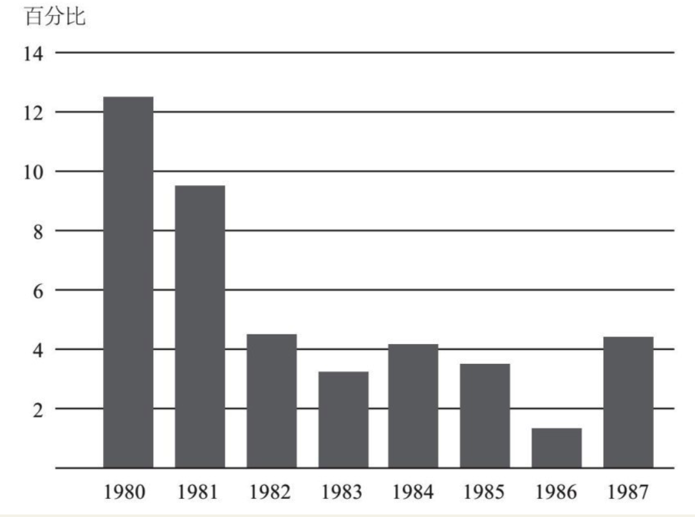
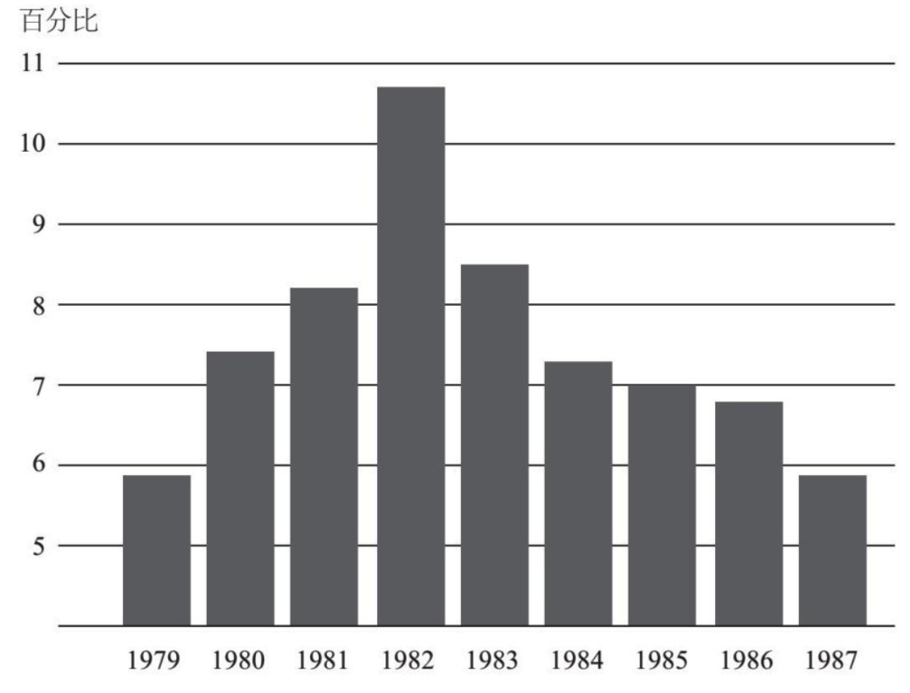
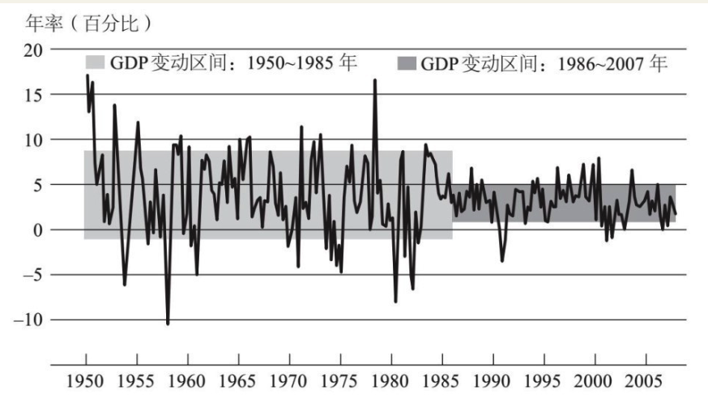
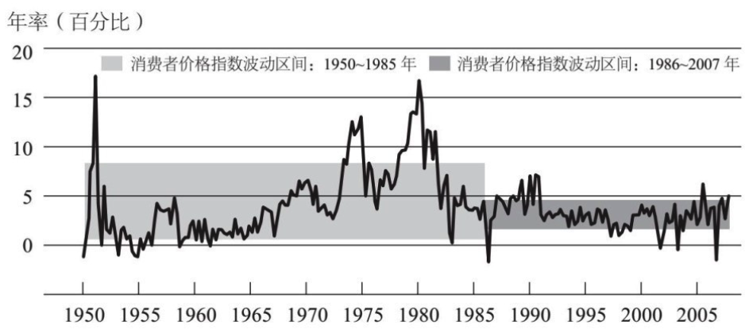
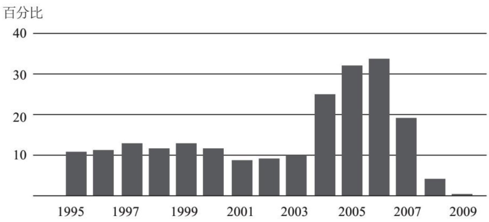
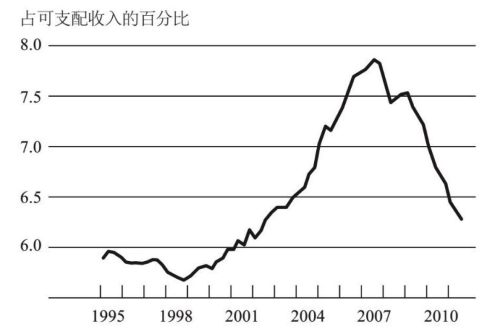
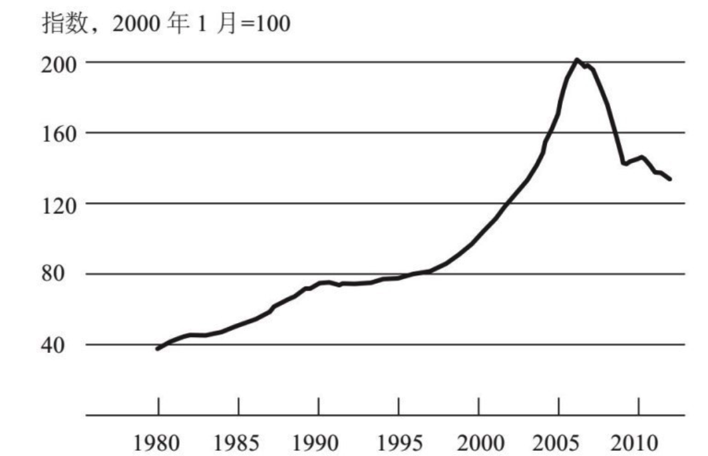

    作者: (美)本·伯南克|译者
    出版社: 中信
    出版年: 2017-05-01
    页数: 354
    定价: 58.0
    ISBN: 9787508673639

[豆瓣链接](https://book.douban.com/subject/27046569/)

- [第一讲 美联储的起源与使命](#%e7%ac%ac%e4%b8%80%e8%ae%b2-%e7%be%8e%e8%81%94%e5%82%a8%e7%9a%84%e8%b5%b7%e6%ba%90%e4%b8%8e%e4%bd%bf%e5%91%bd)
  - [央行是什么？](#%e5%a4%ae%e8%a1%8c%e6%98%af%e4%bb%80%e4%b9%88)
  - [金本位制的利与弊](#%e9%87%91%e6%9c%ac%e4%bd%8d%e5%88%b6%e7%9a%84%e5%88%a9%e4%b8%8e%e5%bc%8a)
  - [美联储的第一次大挑战](#%e7%be%8e%e8%81%94%e5%82%a8%e7%9a%84%e7%ac%ac%e4%b8%80%e6%ac%a1%e5%a4%a7%e6%8c%91%e6%88%98)
- [第二讲 “二战”后的美联储](#%e7%ac%ac%e4%ba%8c%e8%ae%b2-%e4%ba%8c%e6%88%98%e5%90%8e%e7%9a%84%e7%be%8e%e8%81%94%e5%82%a8)
  - [货币政策与通货膨胀](#%e8%b4%a7%e5%b8%81%e6%94%bf%e7%ad%96%e4%b8%8e%e9%80%9a%e8%b4%a7%e8%86%a8%e8%83%80)
  - [经济“大缓和”时期](#%e7%bb%8f%e6%b5%8e%e5%a4%a7%e7%bc%93%e5%92%8c%e6%97%b6%e6%9c%9f)
  - [金融危机的前奏](#%e9%87%91%e8%9e%8d%e5%8d%b1%e6%9c%ba%e7%9a%84%e5%89%8d%e5%a5%8f)
- [第三讲 美联储应对金融危机的政策反应](#%e7%ac%ac%e4%b8%89%e8%ae%b2-%e7%be%8e%e8%81%94%e5%82%a8%e5%ba%94%e5%af%b9%e9%87%91%e8%9e%8d%e5%8d%b1%e6%9c%ba%e7%9a%84%e6%94%bf%e7%ad%96%e5%8f%8d%e5%ba%94)

## 第一讲 美联储的起源与使命
### 央行是什么？
中央银行的职能是什么？

1. 维持宏观经济稳定，即追求经济稳定增长，避免大幅波动（如衰退等），并维持稳定的低通胀，这是中央银行的经济稳定职能。
2. 金融稳定职能。中央银行要尽可能地保证金融系统的正常运作，尤其是要尽可能防止金融恐慌，避免发生金融危机。

要履行这两大职能，中央银行都有哪些工具可用呢？简单地说，主要有两套基本工具。

1. 稳定经济方面的工具主要是货币政策。例如，在通常情况下美联储可以通过在公开市场买卖证券，来降低或提高短期利率。当经济增长过缓或通胀水平过低时，美联储可以通过降息来刺激经济发展。美联储的低利率会传导至其他各种利率，进而刺激房产购置、建筑施工和企业投资等。低利率会创造更多的需求、消费以及投资，从而拉动经济增长。同样，如果经济增长过热或通胀问题严重，那么央行常用的应对措施就是提高利率。提高隔夜拆借利率，也就是提高各银行向美联储借钱的成本，这个利率在美国被称为联邦基金利率。或通胀问题严重，那么央行常用的应对措施就是提高利率。提高隔夜拆借利率，也就是提高各银行向美联储借钱的成本，这个利率在美国被称为联邦基金利率。美联储提高利率将会系统性带动其他利率的上涨，这样就可以通过提高车贷、房贷及其他类型贷款的成本，或是提高生产资料的投资成本，来减轻经济过热的压力，从而抑制经济过快增长。
2. 中央银行用来应对金融恐慌或金融危机的主要工具是流动性供给。出于对金融稳定性的考虑，中央银行会向金融机构提供短期贷款。在金融恐慌或危机期间，向金融机构提供短期信贷能平息市场情绪，有利于维持这些金融机构的稳定性，有助于缓解甚至终结金融危机。央行的上述行为被称作“最后贷款人”工具。如果金融市场崩溃，金融机构又没有其他资金来源，那么中央银行就要随时准备做最后贷款人，通过提供流动性支持来帮助稳定金融系统。
3. 大部分中央银行（包括美联储）还有第三个工具，即金融监管。

### 金本位制的利与弊
它是一种货币体系，在这个体系中，货币的价值以黄金的重量来衡量。

1. 由于金本位制限制了货币供给，央行就不能灵活地调控利率——在经济不景气时期下调利率，在通胀时期提高利率。有人认为这是金本位制有利的一面，这样中央银行就无权自作主张了（对此人们有争议）。
2. 会导致实施金本位制的各国货币之间形成一个固定汇率体系。例如，1900年，美元的价值大约为20美元兑换1盎司黄金，英镑的价值大约是4英镑兑换1盎司黄金，如此一来，20美元就等于4英镑，即1英镑等于5美元。如果两个国家都实行金本位制，那么两国货币间的汇率基本上就固定了。有人认为固定汇率是有利的，但它至少导致了如下问题，即一国货币供应量如果发生变化或受到冲击，或是采取了一系列错误政策，那么通过金本位制与该国货币相关联的其他国家也会受到影响。
3. 金本位制的另一个问题是投机冲击。如果出于某种原因，市场对于央行维持金本位制的意愿和承诺失去了信心，那么其货币就会成为投机冲击的目标。这就是1931年发生在英国的真实情况。当时，由于种种原因，投机者对英镑失去了信心，于是，就像银行挤兑那样，他们带着英镑来到英格兰银行，吵着要兑换成黄金。因为没有足够支持其全部货币供给的黄金储备，没多久，英格兰银行的黄金储备就兑换告罄，这在很大程度上迫使英国宣布放弃金本位制。
4. 人们称金本位制的优点之一是能维持币值的稳定，它能让通货膨胀水平保持稳定——长期来看确实如此。但是短期来看（差不多5年或10年内），你会发现，金本位制下的通货膨胀（物价上涨）或通货紧缩（物价下跌）现象经常发生，因为在金本位制下，经济中的货币总量会随着黄金开采量等因素的变化而变化。举个例子，如果在加州发现了金矿，那么经济中的黄金总量就会上升，从而导致通货膨胀；而如果经济快速增长，黄金就会短缺，从而导致通货紧缩。因此在短期内，实施金本位制的国家会频繁地发生通货膨胀和通货紧缩。

《联邦储备法案》规定，新成立的美联储有两项任务：

1. 行使最后贷款人职能，努力缓解银行体系每隔几年就要经历的恐慌；
2. 管理金本位制，取消金本位制对币值的严格限定，避免利率和其他宏观经济指标的大幅波动。

### 美联储的第一次大挑战

图1–3描述的是美国股市，图左侧的一条垂线表示1929年10月股票价格的一次急剧下跌。

图1-4a 1925~1934年实际GDP

实体经济，即非金融经济，在这次“大萧条”中同样受到了很大冲击。图1–4a反映的是实际GDP的增长情况。

图1-4b 1925~1934年间消费者价格指数

正如图1–4b所示，1931~1932年间，物价下跌了将近10%。

## 第二讲 “二战”后的美联储
### 货币政策与通货膨胀
“二战”期间，美国通过发行大量国债来为战争埋单。美联储和美国财政部合作，利用自身管理利率的职能，使利率保持在低位，从而帮助美国政府以较低的成本来为“二战”筹资。这就是美联储在战争期间所扮演的角色。

战争结束后，债台高筑的美国政府为如何偿还这些高昂的国债利息而忧心忡忡。因此，即使战争已经结束，美联储仍面临着维持低利率的巨大压力。

1951年签署了《美联储—财政部协议》，这一协议具有十分重大的意义，因为这是美国政府第一次明确承认，美联储应被允许独立运行。当今世界，各国已经形成普遍共识：央行独立运行会比由政府主导产生更好的效果。特别是，一个独立运行的央行可以不去理会短期的政治压力，例如为了选举而被迫刺激经济。

20世纪五六十年代，美联储主要关心的是维持宏观经济稳定。

美联储试图遵循所谓的 **“逆风向”货币政策**，这意味着当经济快速（或过快）增长时，美联储采取紧缩的货币政策，试图抑制经济过热；而当经济增长缓慢时，美联储则要降低利率并采用扩张性的刺激手段以避免经济衰退。

为什么20世纪70年代的货币政策会宽松到让通货膨胀成为问题呢？比较专业的解释是：货币政策制定者变得过于乐观，认为经济过热并不会导致通货膨胀。一般来说，失业率维持在3%或4%的低水平。然而**通过保持稍高的通货膨胀率，就业水平会更高**。所以，在经济繁荣的20世纪50年代和60年代初期，美联储开始遵循这一做法。

**试图通过货币政策来维持过低的失业率，最终会引发通货膨胀**。

1979年10月，沃尔克和联邦公开市场委员会，也就是美联储的决策委员会，制定了一系列意在打破既有货币政策的措施，主要内容是允许美联储大幅提高利率。通过提高利率来收缩经济，从而降低通货膨胀压力。

在图2–2中，你可以看到1980~1983年间，通胀率从12%~13%一路下降到3%——通胀率相对快速的下降有效对冲了20世纪70年代末期由高通胀带来的问题。

图2-2 1980-1987年通货膨胀率（根据消费者价格指数计算）

你可以从图2–3中看到这个时期的失业率。较高的利率可以有效地降低通胀率，但同时也导致了非常严重的萧条。1982年将近11%的失业率比最近一次经济萧条的情况更加令人触目惊心。所以，我们不得不说，沃尔克的政策有非常严重的副作用。

图2-3 1979-1987年间失业率

### 经济“大缓和”时期
沃尔克于1987年离任，艾伦·格林斯潘继任美联储主席。从1987年到2006年，他在这个位置上一共干了将近19年。格林斯潘的重要成就之一是他在大部分任期内保持了美国整体的经济稳定。

图2–4显示了实际GDP增长率自1950年以来的变化。图中的曲线为GDP的季度增长率。线的上扬表示GDP增长率上升，下降则表明GDP增长率下降。从中可以看到变动趋势：快速增长期之后是一段缓慢增长期。图的左边阴影部分是一个标准差。从本质上讲，它用来测量1950~1985年间每个季度GDP的平均增长波动率。1986~2007年间GDP波动发生了什么变化。季度间的波动很小，右边的阴影带为这一时期GDP增长率的一个标准差。很明显，在这近20年的时间里，经济一直保持稳定的态势。

图2-4 1950-2010年间实际GDP增长率 注：以上为季度数据。图中阴影区域显示的是样本区间数据平均值的正负一个标准差。

不仅实际GDP在此期间增长稳定，通货膨胀也保持稳定水平，如图2–5所示。位于图中间的垂线将时间分成1986年之前和之后两段。图中显示了根据消费者价格指数来衡量的每一季度的通胀率。同样，图左边的阴影部分显示了1986年以前通货膨胀的一个标准差平均波动率。从中可以看到通货膨胀在20世纪70年代经历了一个高峰期。然而在1986年以后，你看到波动变小了。所以非常明显，经济增长和通货膨胀都更趋于稳定，这也被经济学家频繁地讨论过了。这就是“大缓和”。

图2-5 1950-2010年间通货膨胀率（根据消费者价格指数计算） 注：以上为季度数据。图中阴影区域显示的是样本区间数据平均值的正负一个标准差。

弗里德曼说过，通货膨胀和失业之间不存在永远的此消彼长：想永远通过保持稍高水平的通货膨胀来降低失业率是不可能的。这是事实。但从另一个角度讲，长时间稳定的低通胀会使经济更加稳定，有利于保持健康的增长率和生产率，维持经济活动。

“大缓和”并不完全归因于货币政策，也有其他因素，其中之一便是经济结构的转型。比如，企业在发展过程中学会了如何更加有效地管理自己的库存。即时库存管理是指企业只在生产需要时补充库存，而不是让手头的库存大量堆积。手头没有大量的库存堆积，就减少了经济波动的一个重要来源。

### 金融危机的前奏
图2–6表示的是单个家庭住宅存量价格（将2000年1月的价格指数设定为100）。从20世纪90年代末到2006年初，全美房价上涨了约130%。

图2-6 1980-2005年间单个家庭住房存量价格 注：只包括购买交易。

在21世纪初期之前，购房者通常被要求先交一笔首付，即房价的10%、15%或者20%。另外还要出具详细的财产证明（收入、资产等），以此来说服银行给他们贷款，贷款金额通常是他们年收入的4~5倍。不幸的是，随着房价的上涨，许多银行开始把款贷给资质较差的借款人，也被称为`非优质抵押贷款`。这些抵押贷款通常需要很少甚至不需要首付和财产证明。从本质上讲，抵押贷款发放者正进一步降低信贷门槛，贷款给越来越多的低标准借款人，图2–7a显示了非优质抵押贷款发放的百分比，就是指在新的抵押贷款中低质量抵押贷款（次级、次优级或其他一些低质量抵押贷款）所占的比例。

图2-7a 1995-2009年间非优质抵押贷款发放占全部贷款发放比例

图2-7b 2003-2007年间持有少量或没有财产证明的非优质贷款比例

图2–7b以另一个指标，即较低或无财产证明的非优质抵押贷款的比例，揭示了抵押贷款质量的恶化。

图2–8显示了债务清偿率。随着房价的不断上涨，借款人月收入中花费在住房抵押贷款上的比例也在不断攀升。我们可以看到，偿还抵押贷款成为个人可支配收入中一笔相当大的支出，最终导致购房成本过高，抑制了对新房子的需求。在这之后，债务清偿率下降，基本上是由利率下降所致。最重要的是，抵押贷款的高额支出最终导致不再有新的购房者出现，房地产泡沫因此破灭，房价下跌。图2–9显示了房价的变化，我们可以看到从20世纪90年代后期到2006年房价急剧上升。

图2-8 1995-2009年间抵押贷款清偿率

图2-9 1980-2009年间单一家庭住房存量价格

## 第三讲 美联储应对金融危机的政策反应