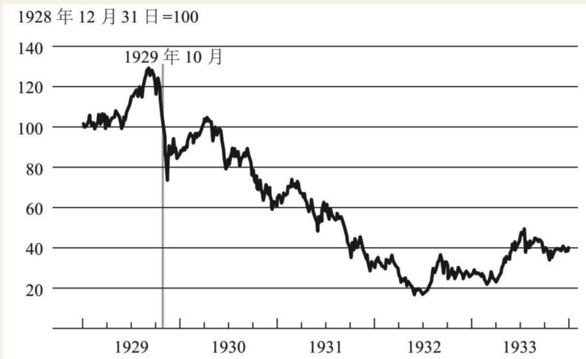
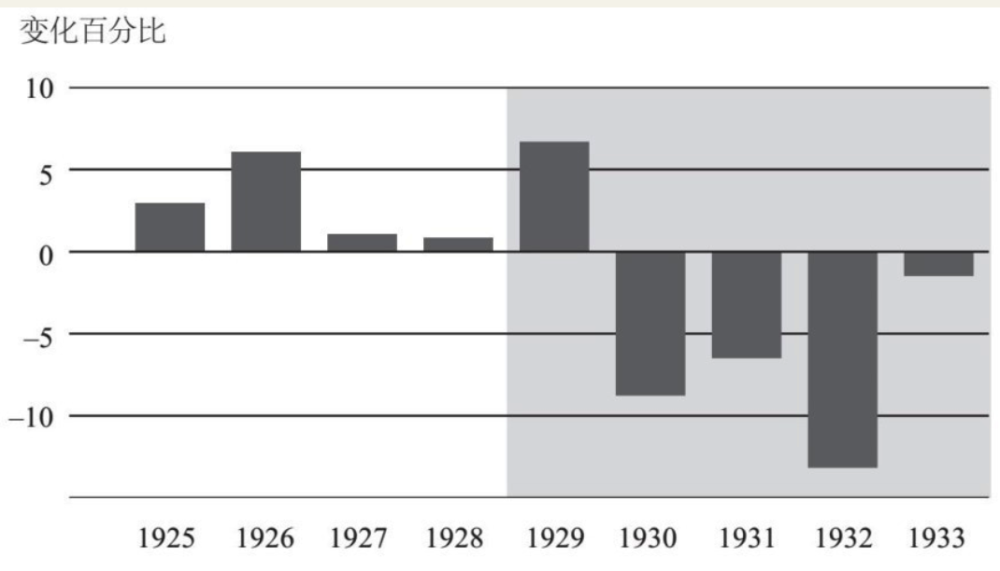
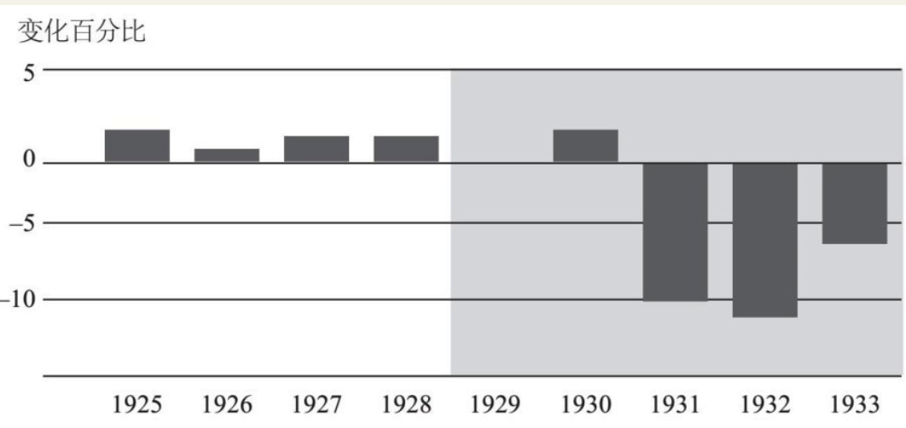

    作者: (美)本·伯南克|译者
    出版社: 中信
    出版年: 2017-05-01
    页数: 354
    定价: 58.0
    ISBN: 9787508673639

[豆瓣链接](https://book.douban.com/subject/27046569/)

- [第一讲 美联储的起源与使命](#%e7%ac%ac%e4%b8%80%e8%ae%b2-%e7%be%8e%e8%81%94%e5%82%a8%e7%9a%84%e8%b5%b7%e6%ba%90%e4%b8%8e%e4%bd%bf%e5%91%bd)
  - [央行是什么？](#%e5%a4%ae%e8%a1%8c%e6%98%af%e4%bb%80%e4%b9%88)
  - [金本位制的利与弊](#%e9%87%91%e6%9c%ac%e4%bd%8d%e5%88%b6%e7%9a%84%e5%88%a9%e4%b8%8e%e5%bc%8a)
  - [美联储的第一次大挑战](#%e7%be%8e%e8%81%94%e5%82%a8%e7%9a%84%e7%ac%ac%e4%b8%80%e6%ac%a1%e5%a4%a7%e6%8c%91%e6%88%98)
- [第二讲 “二战”后的美联储](#%e7%ac%ac%e4%ba%8c%e8%ae%b2-%e4%ba%8c%e6%88%98%e5%90%8e%e7%9a%84%e7%be%8e%e8%81%94%e5%82%a8)

## 第一讲 美联储的起源与使命
### 央行是什么？
中央银行的职能是什么？

1. 维持宏观经济稳定，即追求经济稳定增长，避免大幅波动（如衰退等），并维持稳定的低通胀，这是中央银行的经济稳定职能。
2. 金融稳定职能。中央银行要尽可能地保证金融系统的正常运作，尤其是要尽可能防止金融恐慌，避免发生金融危机。

要履行这两大职能，中央银行都有哪些工具可用呢？简单地说，主要有两套基本工具。

1. 稳定经济方面的工具主要是货币政策。例如，在通常情况下美联储可以通过在公开市场买卖证券，来降低或提高短期利率。当经济增长过缓或通胀水平过低时，美联储可以通过降息来刺激经济发展。美联储的低利率会传导至其他各种利率，进而刺激房产购置、建筑施工和企业投资等。低利率会创造更多的需求、消费以及投资，从而拉动经济增长。同样，如果经济增长过热或通胀问题严重，那么央行常用的应对措施就是提高利率。提高隔夜拆借利率，也就是提高各银行向美联储借钱的成本，这个利率在美国被称为联邦基金利率。或通胀问题严重，那么央行常用的应对措施就是提高利率。提高隔夜拆借利率，也就是提高各银行向美联储借钱的成本，这个利率在美国被称为联邦基金利率。美联储提高利率将会系统性带动其他利率的上涨，这样就可以通过提高车贷、房贷及其他类型贷款的成本，或是提高生产资料的投资成本，来减轻经济过热的压力，从而抑制经济过快增长。
2. 中央银行用来应对金融恐慌或金融危机的主要工具是流动性供给。出于对金融稳定性的考虑，中央银行会向金融机构提供短期贷款。在金融恐慌或危机期间，向金融机构提供短期信贷能平息市场情绪，有利于维持这些金融机构的稳定性，有助于缓解甚至终结金融危机。央行的上述行为被称作“最后贷款人”工具。如果金融市场崩溃，金融机构又没有其他资金来源，那么中央银行就要随时准备做最后贷款人，通过提供流动性支持来帮助稳定金融系统。
3. 大部分中央银行（包括美联储）还有第三个工具，即金融监管。

### 金本位制的利与弊
它是一种货币体系，在这个体系中，货币的价值以黄金的重量来衡量。

1. 由于金本位制限制了货币供给，央行就不能灵活地调控利率——在经济不景气时期下调利率，在通胀时期提高利率。有人认为这是金本位制有利的一面，这样中央银行就无权自作主张了（对此人们有争议）。
2. 会导致实施金本位制的各国货币之间形成一个固定汇率体系。例如，1900年，美元的价值大约为20美元兑换1盎司黄金，英镑的价值大约是4英镑兑换1盎司黄金，如此一来，20美元就等于4英镑，即1英镑等于5美元。如果两个国家都实行金本位制，那么两国货币间的汇率基本上就固定了。有人认为固定汇率是有利的，但它至少导致了如下问题，即一国货币供应量如果发生变化或受到冲击，或是采取了一系列错误政策，那么通过金本位制与该国货币相关联的其他国家也会受到影响。
3. 金本位制的另一个问题是投机冲击。如果出于某种原因，市场对于央行维持金本位制的意愿和承诺失去了信心，那么其货币就会成为投机冲击的目标。这就是1931年发生在英国的真实情况。当时，由于种种原因，投机者对英镑失去了信心，于是，就像银行挤兑那样，他们带着英镑来到英格兰银行，吵着要兑换成黄金。因为没有足够支持其全部货币供给的黄金储备，没多久，英格兰银行的黄金储备就兑换告罄，这在很大程度上迫使英国宣布放弃金本位制。
4. 人们称金本位制的优点之一是能维持币值的稳定，它能让通货膨胀水平保持稳定——长期来看确实如此。但是短期来看（差不多5年或10年内），你会发现，金本位制下的通货膨胀（物价上涨）或通货紧缩（物价下跌）现象经常发生，因为在金本位制下，经济中的货币总量会随着黄金开采量等因素的变化而变化。举个例子，如果在加州发现了金矿，那么经济中的黄金总量就会上升，从而导致通货膨胀；而如果经济快速增长，黄金就会短缺，从而导致通货紧缩。因此在短期内，实施金本位制的国家会频繁地发生通货膨胀和通货紧缩。

《联邦储备法案》规定，新成立的美联储有两项任务：

1. 行使最后贷款人职能，努力缓解银行体系每隔几年就要经历的恐慌；
2. 管理金本位制，取消金本位制对币值的严格限定，避免利率和其他宏观经济指标的大幅波动。

### 美联储的第一次大挑战

图1–3描述的是美国股市，图左侧的一条垂线表示1929年10月股票价格的一次急剧下跌。

图1-4a 1925~1934年实际GDP

实体经济，即非金融经济，在这次“大萧条”中同样受到了很大冲击。图1–4a反映的是实际GDP的增长情况。

图1-4b 1925~1934年间消费者价格指数

正如图1–4b所示，1931~1932年间，物价下跌了将近10%。

## 第二讲 “二战”后的美联储
