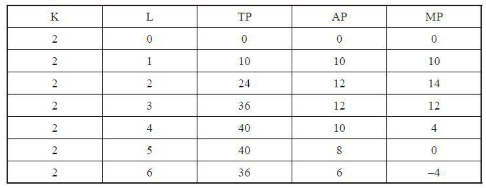
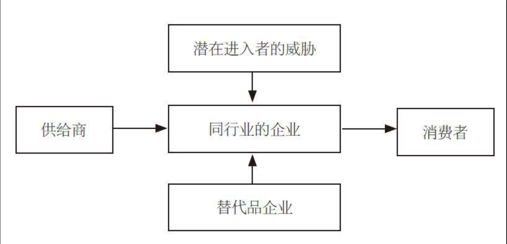
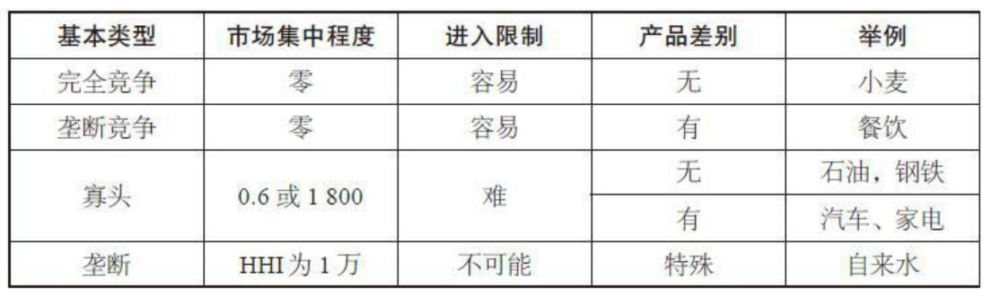
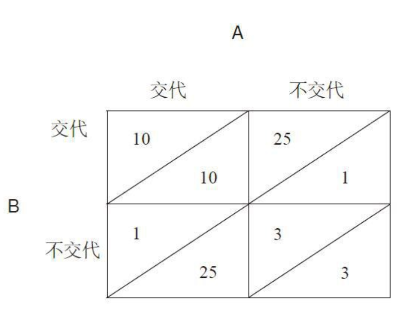
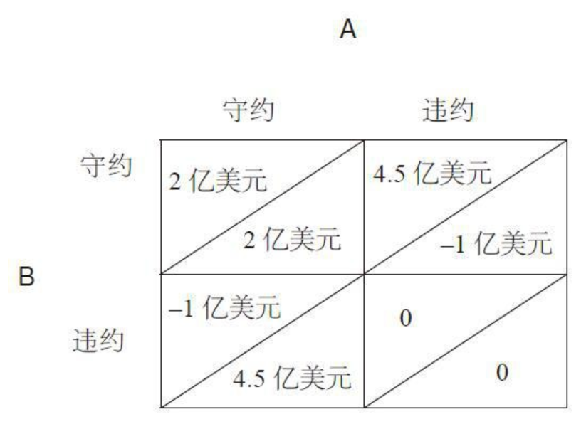
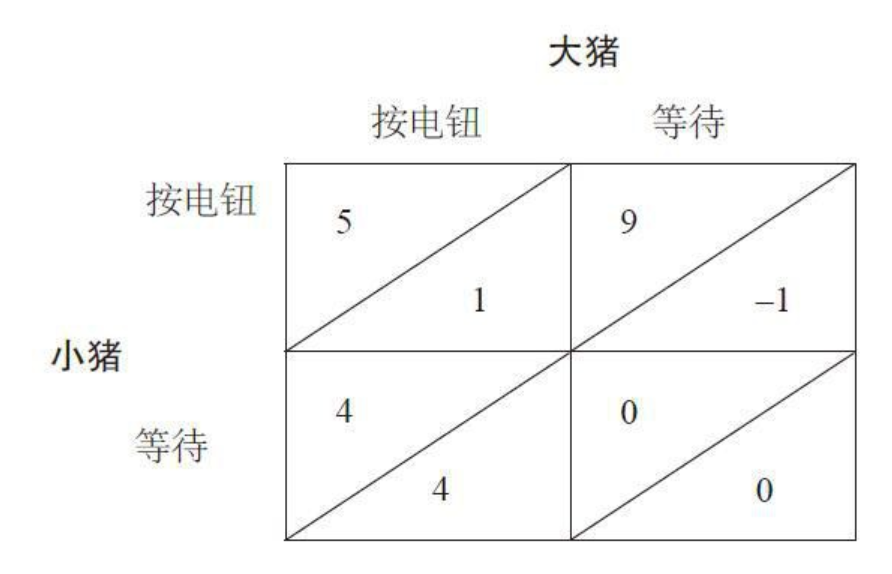
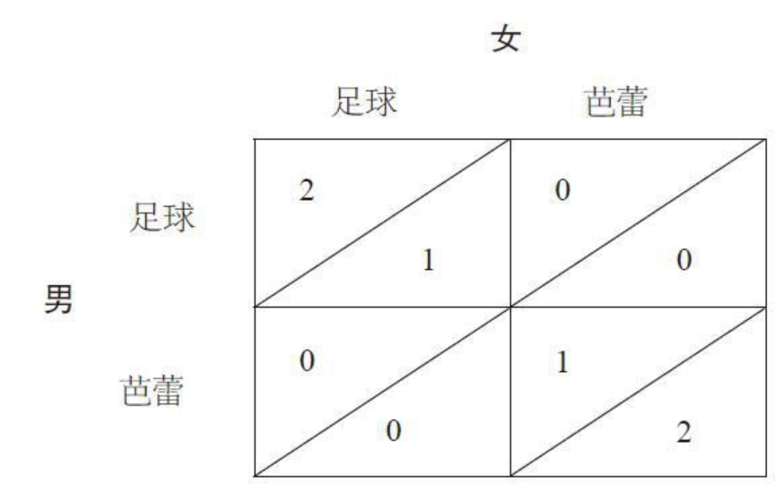

    作者: 梁小民
    出版社: 中信出版社
    出版年: 2016-4
    定价: 56.00元
    装帧: 精装
    ISBN: 9787508658001

[豆瓣链接](https://book.douban.com/subject/26776854/)

- [价格理论：市场经济如何运行](#%e4%bb%b7%e6%a0%bc%e7%90%86%e8%ae%ba%e5%b8%82%e5%9c%ba%e7%bb%8f%e6%b5%8e%e5%a6%82%e4%bd%95%e8%bf%90%e8%a1%8c)
  - [企业家要关心的是什么需求——需求的含义](#%e4%bc%81%e4%b8%9a%e5%ae%b6%e8%a6%81%e5%85%b3%e5%bf%83%e7%9a%84%e6%98%af%e4%bb%80%e4%b9%88%e9%9c%80%e6%b1%82%e9%9c%80%e6%b1%82%e7%9a%84%e5%90%ab%e4%b9%89)
  - [谈谈需求弹性这个概念——需求与价格之一](#%e8%b0%88%e8%b0%88%e9%9c%80%e6%b1%82%e5%bc%b9%e6%80%a7%e8%bf%99%e4%b8%aa%e6%a6%82%e5%bf%b5%e9%9c%80%e6%b1%82%e4%b8%8e%e4%bb%b7%e6%a0%bc%e4%b9%8b%e4%b8%80)
  - [降价并不是唯一的法宝——需求与价格之二](#%e9%99%8d%e4%bb%b7%e5%b9%b6%e4%b8%8d%e6%98%af%e5%94%af%e4%b8%80%e7%9a%84%e6%b3%95%e5%ae%9d%e9%9c%80%e6%b1%82%e4%b8%8e%e4%bb%b7%e6%a0%bc%e4%b9%8b%e4%ba%8c)
  - [《陆犯焉识》如何畅销——相关产品价格与需求](#%e9%99%86%e7%8a%af%e7%84%89%e8%af%86%e5%a6%82%e4%bd%95%e7%95%85%e9%94%80%e7%9b%b8%e5%85%b3%e4%ba%a7%e5%93%81%e4%bb%b7%e6%a0%bc%e4%b8%8e%e9%9c%80%e6%b1%82)
  - [北京的大商场失败在哪里——需求与收入](#%e5%8c%97%e4%ba%ac%e7%9a%84%e5%a4%a7%e5%95%86%e5%9c%ba%e5%a4%b1%e8%b4%a5%e5%9c%a8%e5%93%aa%e9%87%8c%e9%9c%80%e6%b1%82%e4%b8%8e%e6%94%b6%e5%85%a5)
  - [吉芬之谜与爱马仕的高价——需求定理的例外](#%e5%90%89%e8%8a%ac%e4%b9%8b%e8%b0%9c%e4%b8%8e%e7%88%b1%e9%a9%ac%e4%bb%95%e7%9a%84%e9%ab%98%e4%bb%b7%e9%9c%80%e6%b1%82%e5%ae%9a%e7%90%86%e7%9a%84%e4%be%8b%e5%a4%96)
  - [女孩为什么爱换手机——消费时尚与需求](#%e5%a5%b3%e5%ad%a9%e4%b8%ba%e4%bb%80%e4%b9%88%e7%88%b1%e6%8d%a2%e6%89%8b%e6%9c%ba%e6%b6%88%e8%b4%b9%e6%97%b6%e5%b0%9a%e4%b8%8e%e9%9c%80%e6%b1%82)
  - [买涨不买落与持币待购——预期与需求](#%e4%b9%b0%e6%b6%a8%e4%b8%8d%e4%b9%b0%e8%90%bd%e4%b8%8e%e6%8c%81%e5%b8%81%e5%be%85%e8%b4%ad%e9%a2%84%e6%9c%9f%e4%b8%8e%e9%9c%80%e6%b1%82)
  - [莫把需求简单化——影响需求的其他因素](#%e8%8e%ab%e6%8a%8a%e9%9c%80%e6%b1%82%e7%ae%80%e5%8d%95%e5%8c%96%e5%bd%b1%e5%93%8d%e9%9c%80%e6%b1%82%e7%9a%84%e5%85%b6%e4%bb%96%e5%9b%a0%e7%b4%a0)
  - [预测不是算卦——需求预测](#%e9%a2%84%e6%b5%8b%e4%b8%8d%e6%98%af%e7%ae%97%e5%8d%a6%e9%9c%80%e6%b1%82%e9%a2%84%e6%b5%8b)
  - [需求是无限的——开发潜在需求](#%e9%9c%80%e6%b1%82%e6%98%af%e6%97%a0%e9%99%90%e7%9a%84%e5%bc%80%e5%8f%91%e6%bd%9c%e5%9c%a8%e9%9c%80%e6%b1%82)
  - [企业的生产如何决定——供给的含义](#%e4%bc%81%e4%b8%9a%e7%9a%84%e7%94%9f%e4%ba%a7%e5%a6%82%e4%bd%95%e5%86%b3%e5%ae%9a%e4%be%9b%e7%bb%99%e7%9a%84%e5%90%ab%e4%b9%89)
  - [供给也有弹性——供给与价格](#%e4%be%9b%e7%bb%99%e4%b9%9f%e6%9c%89%e5%bc%b9%e6%80%a7%e4%be%9b%e7%bb%99%e4%b8%8e%e4%bb%b7%e6%a0%bc)
  - [看不见的手——价格如何调节经济](#%e7%9c%8b%e4%b8%8d%e8%a7%81%e7%9a%84%e6%89%8b%e4%bb%b7%e6%a0%bc%e5%a6%82%e4%bd%95%e8%b0%83%e8%8a%82%e7%bb%8f%e6%b5%8e)
  - [看不见的手完美吗？——市场经济本身的缺陷](#%e7%9c%8b%e4%b8%8d%e8%a7%81%e7%9a%84%e6%89%8b%e5%ae%8c%e7%be%8e%e5%90%97%e5%b8%82%e5%9c%ba%e7%bb%8f%e6%b5%8e%e6%9c%ac%e8%ba%ab%e7%9a%84%e7%bc%ba%e9%99%b7)
  - [看得见的手——政府在市场经济中的作用](#%e7%9c%8b%e5%be%97%e8%a7%81%e7%9a%84%e6%89%8b%e6%94%bf%e5%ba%9c%e5%9c%a8%e5%b8%82%e5%9c%ba%e7%bb%8f%e6%b5%8e%e4%b8%ad%e7%9a%84%e4%bd%9c%e7%94%a8)
- [产权、制度与效率：管理效率](#%e4%ba%a7%e6%9d%83%e5%88%b6%e5%ba%a6%e4%b8%8e%e6%95%88%e7%8e%87%e7%ae%a1%e7%90%86%e6%95%88%e7%8e%87)
  - [圈地运动是市场经济的起点——产权明晰与管理效率](#%e5%9c%88%e5%9c%b0%e8%bf%90%e5%8a%a8%e6%98%af%e5%b8%82%e5%9c%ba%e7%bb%8f%e6%b5%8e%e7%9a%84%e8%b5%b7%e7%82%b9%e4%ba%a7%e6%9d%83%e6%98%8e%e6%99%b0%e4%b8%8e%e7%ae%a1%e7%90%86%e6%95%88%e7%8e%87)
  - [家族企业如何基业长青——产权的形式与效率](#%e5%ae%b6%e6%97%8f%e4%bc%81%e4%b8%9a%e5%a6%82%e4%bd%95%e5%9f%ba%e4%b8%9a%e9%95%bf%e9%9d%92%e4%ba%a7%e6%9d%83%e7%9a%84%e5%bd%a2%e5%bc%8f%e4%b8%8e%e6%95%88%e7%8e%87)
  - [股份制的生命力何在——股份制的基本特征](#%e8%82%a1%e4%bb%bd%e5%88%b6%e7%9a%84%e7%94%9f%e5%91%bd%e5%8a%9b%e4%bd%95%e5%9c%a8%e8%82%a1%e4%bb%bd%e5%88%b6%e7%9a%84%e5%9f%ba%e6%9c%ac%e7%89%b9%e5%be%81)
  - [独立董事不是花瓶——董事会的组成与作用](#%e7%8b%ac%e7%ab%8b%e8%91%a3%e4%ba%8b%e4%b8%8d%e6%98%af%e8%8a%b1%e7%93%b6%e8%91%a3%e4%ba%8b%e4%bc%9a%e7%9a%84%e7%bb%84%e6%88%90%e4%b8%8e%e4%bd%9c%e7%94%a8)
  - [斯隆如何使通用振兴——公司组织架构](#%e6%96%af%e9%9a%86%e5%a6%82%e4%bd%95%e4%bd%bf%e9%80%9a%e7%94%a8%e6%8c%af%e5%85%b4%e5%85%ac%e5%8f%b8%e7%bb%84%e7%bb%87%e6%9e%b6%e6%9e%84)
  - [文化也是生产力——企业文化](#%e6%96%87%e5%8c%96%e4%b9%9f%e6%98%af%e7%94%9f%e4%ba%a7%e5%8a%9b%e4%bc%81%e4%b8%9a%e6%96%87%e5%8c%96)
  - [有激励才有效率——激励机制的重要性](#%e6%9c%89%e6%bf%80%e5%8a%b1%e6%89%8d%e6%9c%89%e6%95%88%e7%8e%87%e6%bf%80%e5%8a%b1%e6%9c%ba%e5%88%b6%e7%9a%84%e9%87%8d%e8%a6%81%e6%80%a7)
  - [郭士纳的“核动力”——股票期权制](#%e9%83%ad%e5%a3%ab%e7%ba%b3%e7%9a%84%e6%a0%b8%e5%8a%a8%e5%8a%9b%e8%82%a1%e7%a5%a8%e6%9c%9f%e6%9d%83%e5%88%b6)
  - [亨利·福特不是慈善家——效率工资](#%e4%ba%a8%e5%88%a9%e7%a6%8f%e7%89%b9%e4%b8%8d%e6%98%af%e6%85%88%e5%96%84%e5%ae%b6%e6%95%88%e7%8e%87%e5%b7%a5%e8%b5%84)
  - [公正出效率——激励机制中的公正](#%e5%85%ac%e6%ad%a3%e5%87%ba%e6%95%88%e7%8e%87%e6%bf%80%e5%8a%b1%e6%9c%ba%e5%88%b6%e4%b8%ad%e7%9a%84%e5%85%ac%e6%ad%a3)
  - [激励机制不能东施效颦——激励机制要从实际出发](#%e6%bf%80%e5%8a%b1%e6%9c%ba%e5%88%b6%e4%b8%8d%e8%83%bd%e4%b8%9c%e6%96%bd%e6%95%88%e9%a2%a6%e6%bf%80%e5%8a%b1%e6%9c%ba%e5%88%b6%e8%a6%81%e4%bb%8e%e5%ae%9e%e9%99%85%e5%87%ba%e5%8f%91)
- [生产与成本：资源配置效率](#%e7%94%9f%e4%ba%a7%e4%b8%8e%e6%88%90%e6%9c%ac%e8%b5%84%e6%ba%90%e9%85%8d%e7%bd%ae%e6%95%88%e7%8e%87)
  - [机器人能大量代替人吗？——技术效率与经济效率](#%e6%9c%ba%e5%99%a8%e4%ba%ba%e8%83%bd%e5%a4%a7%e9%87%8f%e4%bb%a3%e6%9b%bf%e4%ba%ba%e5%90%97%e6%8a%80%e6%9c%af%e6%95%88%e7%8e%87%e4%b8%8e%e7%bb%8f%e6%b5%8e%e6%95%88%e7%8e%87)
  - [生产函数与技术效率——技术效率研究什么问题](#%e7%94%9f%e4%ba%a7%e5%87%bd%e6%95%b0%e4%b8%8e%e6%8a%80%e6%9c%af%e6%95%88%e7%8e%87%e6%8a%80%e6%9c%af%e6%95%88%e7%8e%87%e7%a0%94%e7%a9%b6%e4%bb%80%e4%b9%88%e9%97%ae%e9%a2%98)
  - [“边际”并不神秘——边际分析法](#%e8%be%b9%e9%99%85%e5%b9%b6%e4%b8%8d%e7%a5%9e%e7%a7%98%e8%be%b9%e9%99%85%e5%88%86%e6%9e%90%e6%b3%95)
  - [密植为什么失败——边际产量递减规律与一种要素的投入](#%e5%af%86%e6%a4%8d%e4%b8%ba%e4%bb%80%e4%b9%88%e5%a4%b1%e8%b4%a5%e8%be%b9%e9%99%85%e4%ba%a7%e9%87%8f%e9%80%92%e5%87%8f%e8%a7%84%e5%be%8b%e4%b8%8e%e4%b8%80%e7%a7%8d%e8%a6%81%e7%b4%a0%e7%9a%84%e6%8a%95%e5%85%a5)
  - [企业做大好，还是做小好——企业规模与效益](#%e4%bc%81%e4%b8%9a%e5%81%9a%e5%a4%a7%e5%a5%bd%e8%bf%98%e6%98%af%e5%81%9a%e5%b0%8f%e5%a5%bd%e4%bc%81%e4%b8%9a%e8%a7%84%e6%a8%a1%e4%b8%8e%e6%95%88%e7%9b%8a)
  - [小的也是美好的——如何做好小企业](#%e5%b0%8f%e7%9a%84%e4%b9%9f%e6%98%af%e7%be%8e%e5%a5%bd%e7%9a%84%e5%a6%82%e4%bd%95%e5%81%9a%e5%a5%bd%e5%b0%8f%e4%bc%81%e4%b8%9a)
  - [中国需要大企业——企业如何做大](#%e4%b8%ad%e5%9b%bd%e9%9c%80%e8%a6%81%e5%a4%a7%e4%bc%81%e4%b8%9a%e4%bc%81%e4%b8%9a%e5%a6%82%e4%bd%95%e5%81%9a%e5%a4%a7)
  - [扎堆办企业——建立产业集群优势](#%e6%89%8e%e5%a0%86%e5%8a%9e%e4%bc%81%e4%b8%9a%e5%bb%ba%e7%ab%8b%e4%ba%a7%e4%b8%9a%e9%9b%86%e7%be%a4%e4%bc%98%e5%8a%bf)
  - [不花钱也有成本——机会成本](#%e4%b8%8d%e8%8a%b1%e9%92%b1%e4%b9%9f%e6%9c%89%e6%88%90%e6%9c%ac%e6%9c%ba%e4%bc%9a%e6%88%90%e6%9c%ac)
  - [亏本就要停止营业吗？——短期成本分析](#%e4%ba%8f%e6%9c%ac%e5%b0%b1%e8%a6%81%e5%81%9c%e6%ad%a2%e8%90%a5%e4%b8%9a%e5%90%97%e7%9f%ad%e6%9c%9f%e6%88%90%e6%9c%ac%e5%88%86%e6%9e%90)
  - [王永庆台塑成功的背后——长期成本分析](#%e7%8e%8b%e6%b0%b8%e5%ba%86%e5%8f%b0%e5%a1%91%e6%88%90%e5%8a%9f%e7%9a%84%e8%83%8c%e5%90%8e%e9%95%bf%e6%9c%9f%e6%88%90%e6%9c%ac%e5%88%86%e6%9e%90)
  - [利润最大化的含义——边际收益与边际成本相等](#%e5%88%a9%e6%b6%a6%e6%9c%80%e5%a4%a7%e5%8c%96%e7%9a%84%e5%90%ab%e4%b9%89%e8%be%b9%e9%99%85%e6%94%b6%e7%9b%8a%e4%b8%8e%e8%be%b9%e9%99%85%e6%88%90%e6%9c%ac%e7%9b%b8%e7%ad%89)
  - [企业家的本质是创新——经济利润的来源](#%e4%bc%81%e4%b8%9a%e5%ae%b6%e7%9a%84%e6%9c%ac%e8%b4%a8%e6%98%af%e5%88%9b%e6%96%b0%e7%bb%8f%e6%b5%8e%e5%88%a9%e6%b6%a6%e7%9a%84%e6%9d%a5%e6%ba%90)
  - [现在的一元钱与未来的一元钱不一样——贴现与利润最大化](#%e7%8e%b0%e5%9c%a8%e7%9a%84%e4%b8%80%e5%85%83%e9%92%b1%e4%b8%8e%e6%9c%aa%e6%9d%a5%e7%9a%84%e4%b8%80%e5%85%83%e9%92%b1%e4%b8%8d%e4%b8%80%e6%a0%b7%e8%b4%b4%e7%8e%b0%e4%b8%8e%e5%88%a9%e6%b6%a6%e6%9c%80%e5%a4%a7%e5%8c%96)
- [市场结构与企业竞争策略：如何制定正确的竞争策略](#%e5%b8%82%e5%9c%ba%e7%bb%93%e6%9e%84%e4%b8%8e%e4%bc%81%e4%b8%9a%e7%ab%9e%e4%ba%89%e7%ad%96%e7%95%a5%e5%a6%82%e4%bd%95%e5%88%b6%e5%ae%9a%e6%ad%a3%e7%a1%ae%e7%9a%84%e7%ab%9e%e4%ba%89%e7%ad%96%e7%95%a5)
  - [根据什么确定企业竞争策略？——市场结构理论之一](#%e6%a0%b9%e6%8d%ae%e4%bb%80%e4%b9%88%e7%a1%ae%e5%ae%9a%e4%bc%81%e4%b8%9a%e7%ab%9e%e4%ba%89%e7%ad%96%e7%95%a5%e5%b8%82%e5%9c%ba%e7%bb%93%e6%9e%84%e7%90%86%e8%ae%ba%e4%b9%8b%e4%b8%80)
  - [有哪些不同的市场结构？——市场结构理论之二](#%e6%9c%89%e5%93%aa%e4%ba%9b%e4%b8%8d%e5%90%8c%e7%9a%84%e5%b8%82%e5%9c%ba%e7%bb%93%e6%9e%84%e5%b8%82%e5%9c%ba%e7%bb%93%e6%9e%84%e7%90%86%e8%ae%ba%e4%b9%8b%e4%ba%8c)
  - [无可奈何的完全竞争——完全竞争市场](#%e6%97%a0%e5%8f%af%e5%a5%88%e4%bd%95%e7%9a%84%e5%ae%8c%e5%85%a8%e7%ab%9e%e4%ba%89%e5%ae%8c%e5%85%a8%e7%ab%9e%e4%ba%89%e5%b8%82%e5%9c%ba)
  - [是是非非话垄断——垄断市场](#%e6%98%af%e6%98%af%e9%9d%9e%e9%9d%9e%e8%af%9d%e5%9e%84%e6%96%ad%e5%9e%84%e6%96%ad%e5%b8%82%e5%9c%ba)
  - [在竞争与垄断之间——垄断竞争与寡头市场](#%e5%9c%a8%e7%ab%9e%e4%ba%89%e4%b8%8e%e5%9e%84%e6%96%ad%e4%b9%8b%e9%97%b4%e5%9e%84%e6%96%ad%e7%ab%9e%e4%ba%89%e4%b8%8e%e5%af%a1%e5%a4%b4%e5%b8%82%e5%9c%ba)
  - [定价是一门艺术——定价策略导言](#%e5%ae%9a%e4%bb%b7%e6%98%af%e4%b8%80%e9%97%a8%e8%89%ba%e6%9c%af%e5%ae%9a%e4%bb%b7%e7%ad%96%e7%95%a5%e5%af%bc%e8%a8%80)
  - [定高价还是定低价，这是一个问题——单一定价的技巧](#%e5%ae%9a%e9%ab%98%e4%bb%b7%e8%bf%98%e6%98%af%e5%ae%9a%e4%bd%8e%e4%bb%b7%e8%bf%99%e6%98%af%e4%b8%80%e4%b8%aa%e9%97%ae%e9%a2%98%e5%8d%95%e4%b8%80%e5%ae%9a%e4%bb%b7%e7%9a%84%e6%8a%80%e5%b7%a7)
  - [歧视价格奥妙无穷——歧视定价](#%e6%ad%a7%e8%a7%86%e4%bb%b7%e6%a0%bc%e5%a5%a5%e5%a6%99%e6%97%a0%e7%a9%b7%e6%ad%a7%e8%a7%86%e5%ae%9a%e4%bb%b7)
  - [未雨绸缪的定价方式——预防式定价](#%e6%9c%aa%e9%9b%a8%e7%bb%b8%e7%bc%aa%e7%9a%84%e5%ae%9a%e4%bb%b7%e6%96%b9%e5%bc%8f%e9%a2%84%e9%98%b2%e5%bc%8f%e5%ae%9a%e4%bb%b7)
  - [树欲静而风不止——掠夺式定价与价格战](#%e6%a0%91%e6%ac%b2%e9%9d%99%e8%80%8c%e9%a3%8e%e4%b8%8d%e6%ad%a2%e6%8e%a0%e5%a4%ba%e5%bc%8f%e5%ae%9a%e4%bb%b7%e4%b8%8e%e4%bb%b7%e6%a0%bc%e6%88%98)
  - [价格战以后如何定价——价格领先制和成本加成法](#%e4%bb%b7%e6%a0%bc%e6%88%98%e4%bb%a5%e5%90%8e%e5%a6%82%e4%bd%95%e5%ae%9a%e4%bb%b7%e4%bb%b7%e6%a0%bc%e9%a2%86%e5%85%88%e5%88%b6%e5%92%8c%e6%88%90%e6%9c%ac%e5%8a%a0%e6%88%90%e6%b3%95)
  - [对微软的诉讼为何不了了之——捆绑定价与转售价格限制](#%e5%af%b9%e5%be%ae%e8%bd%af%e7%9a%84%e8%af%89%e8%ae%bc%e4%b8%ba%e4%bd%95%e4%b8%8d%e4%ba%86%e4%ba%86%e4%b9%8b%e6%8d%86%e7%bb%91%e5%ae%9a%e4%bb%b7%e4%b8%8e%e8%bd%ac%e5%94%ae%e4%bb%b7%e6%a0%bc%e9%99%90%e5%88%b6)
  - [差异化战略——产品差别的含义](#%e5%b7%ae%e5%bc%82%e5%8c%96%e6%88%98%e7%95%a5%e4%ba%a7%e5%93%81%e5%b7%ae%e5%88%ab%e7%9a%84%e5%90%ab%e4%b9%89)
  - [品牌为王——产品差别的核心是品牌](#%e5%93%81%e7%89%8c%e4%b8%ba%e7%8e%8b%e4%ba%a7%e5%93%81%e5%b7%ae%e5%88%ab%e7%9a%84%e6%a0%b8%e5%bf%83%e6%98%af%e5%93%81%e7%89%8c)
  - [走出两难困境——什么是博弈论](#%e8%b5%b0%e5%87%ba%e4%b8%a4%e9%9a%be%e5%9b%b0%e5%a2%83%e4%bb%80%e4%b9%88%e6%98%af%e5%8d%9a%e5%bc%88%e8%ae%ba)
  - [欧佩克为什么失败——价格勾结的博弈分析](#%e6%ac%a7%e4%bd%a9%e5%85%8b%e4%b8%ba%e4%bb%80%e4%b9%88%e5%a4%b1%e8%b4%a5%e4%bb%b7%e6%a0%bc%e5%8b%be%e7%bb%93%e7%9a%84%e5%8d%9a%e5%bc%88%e5%88%86%e6%9e%90)
  - [万燕公司失败的背后——智猪博弈与企业技术创新决策](#%e4%b8%87%e7%87%95%e5%85%ac%e5%8f%b8%e5%a4%b1%e8%b4%a5%e7%9a%84%e8%83%8c%e5%90%8e%e6%99%ba%e7%8c%aa%e5%8d%9a%e5%bc%88%e4%b8%8e%e4%bc%81%e4%b8%9a%e6%8a%80%e6%9c%af%e5%88%9b%e6%96%b0%e5%86%b3%e7%ad%96)
  - [恋爱博弈——合作的双赢](#%e6%81%8b%e7%88%b1%e5%8d%9a%e5%bc%88%e5%90%88%e4%bd%9c%e7%9a%84%e5%8f%8c%e8%b5%a2)
  - [山羊博弈——化解冲突](#%e5%b1%b1%e7%be%8a%e5%8d%9a%e5%bc%88%e5%8c%96%e8%a7%a3%e5%86%b2%e7%aa%81)
- [企业与政府：企业如何得到政府支持](#%e4%bc%81%e4%b8%9a%e4%b8%8e%e6%94%bf%e5%ba%9c%e4%bc%81%e4%b8%9a%e5%a6%82%e4%bd%95%e5%be%97%e5%88%b0%e6%94%bf%e5%ba%9c%e6%94%af%e6%8c%81)
  - [软硬兼施——政府职能的实现](#%e8%bd%af%e7%a1%ac%e5%85%bc%e6%96%bd%e6%94%bf%e5%ba%9c%e8%81%8c%e8%83%bd%e7%9a%84%e5%ae%9e%e7%8e%b0)
  - [在企业和政府之间——行会的作用](#%e5%9c%a8%e4%bc%81%e4%b8%9a%e5%92%8c%e6%94%bf%e5%ba%9c%e4%b9%8b%e9%97%b4%e8%a1%8c%e4%bc%9a%e7%9a%84%e4%bd%9c%e7%94%a8)

## 价格理论：市场经济如何运行
### 企业家要关心的是什么需求——需求的含义
在经济学中，`需求`是消费者在某一时期内，在每一个价格时愿意而且能够购买的某种商品的数量。企业所关心的正是这种意义上的需求。

在需求的定义中，需求的主体是“消费者”。消费者也称家庭，指能做出一致决策的单位。这是经济的基本组成单位之一，也是微观经济分析的基本单位。

我们分析的重点是消费者对消费品（包括产品与劳务）的需求。我们把这种需求称为直接需求，即消费者直接表现在市场上的需求，消费者用货币投票来表示他们的这种需求。

我们把对生产资料的需求称为派生需求或间接需求，即由对消费品的需求所引申或派生出来的需求。这种需求取决于两个因素：消费品的需求量，以及消费品与生产资料之间的技术系数，即生产一单位消费品所需求的生产资料，例如生产一辆汽车需要多少钢材或其他原料等。因此，根据消费品需求就可以推算出对生产资料的需求。

生产生产资料的企业也应该关心消费品需求。

在需求的定义中，有一句最关键的话是“愿意而且能够购买”，换言之，需求是购买欲望和购买能力的统一。需求不等于欲望，仅仅有购买欲望而没有支付能力不能称为需求。

我们对需求的分析是分析影响需求的因素，也就是分析影响购买欲望和购买能力的因素。我们**把这些因素归纳为4类：价格、收入、消费时尚和预期**。这些因素对购买欲望和能力的影响是综合的。

### 谈谈需求弹性这个概念——需求与价格之一
`需求定理`：在影响需求的其他条件不变的情况下，一种物品的价格与其需求量呈反方向变动。其他条件不变是指影响需求的其他因素，如收入、消费时尚，预期不变，仅仅分析需求与价格的关系。

需求的价格弹性又称需求弹性，指一种物品价格变动所引起的需求量变动的大小，或者说某种物品需求量变动对其价格变动的反应程度。其公式为：

```
某种物品的需求弹性=某种物品需求量变动的百分比/某种物品价格变动的百分比
```

如果一种物品的价格既定时，需求量无限，我们称为`需求有无限弹性`。如果一种物品，无论价格如何变，需求量不变，我们称为`需求无弹性`。如果一种物品，价格变动的比率与需求量变动的比率相同，我们称为`需求单位弹性`。

决定某种物品需求弹性的大小主要有三个因素。

1. 消费者的需求强度。一般而言，消费者需求强度越高，需求越缺乏弹性（例如食盐）；消费者需求强度越低，需求越富有弹性（例如冷饮）。由此可以得出，一般来说，生活必需品需求缺乏弹性，而奢侈品需求则富有弹性。
2. 替代品的多少。一种物品的替代品越少，越缺乏弹性（如食盐），而一种物品的替代品越多，越富有弹性（如冷饮）。同样是生活必需品的面粉和食盐，都是需求缺乏弹性，但需求弹性的大小不同。面粉有替代品（大米或其他），食盐几乎没有替代品，所以面粉的需求弹性要大于食盐。
3. 在家庭支出中所占比例的大小。一般而言，一种物品在家庭支出中所占比例越小，需求越缺乏弹性；在家庭支出中所占比例越大，需求越富有弹性。例如，冷饮与彩电都是需求富有弹性的，但冷饮在家庭支出中所占比例远远小于彩电，所以，冷饮的需求弹性就小于彩电。

此外，还要注意两点，一是同一种物品在不同的时间长度中，需求弹性的大小也不同。这就是说，即使同一种物品，其需求弹性也会随着时间的变动而变动。一般说来，当价格发生变动后，时间越短，需求越缺乏弹性。随着时间的延长，需求越来越富有弹性。这是因为人们在长期中可以找到或开发替代品，并减少对稀缺物品的需求。但在短期中需求是刚性的，也难以迅速开发出替代品。例如，石油涨价后，人们难以减少对石油的需求，需求缺乏弹性。但在长期中，人们可以开发出节油型技术（如开发出节油型汽车），用其他物品代替稀缺的物品（如用酒精做燃料代替汽油），从而需求变得富有弹性。

在不同的时期、不同的国家，对不同的人而言，同一种物品的需求弹性并不同。随着时代的发展，原来的奢侈品变成生活必需品，需求弹性就变小了。例如，在“二战”前，乘坐飞机是奢侈的享受，需求极富有弹性；而现在，飞机已成为普遍的交通工具，需求弹性越来越小了。各国经济发展的水平不同，对同种物品的需求弹性也不同。同样的食物，在美国的需求弹性为0.12，而在坦桑尼亚的需求弹性为0.77，尽管都属于需求缺乏弹性，但弹性系数相差6倍多。即使在同一个国家，不同的人的收入不同，对同一种物品的需求弹性也有很大差别。

### 降价并不是唯一的法宝——需求与价格之二
总收益（TR）等于价格（p）乘以需求量（销售量q），即：

```
TR=p·q
```

在商业实践中，对于需求富有弹性的商品可以实行低定价或采用降价策略，这就是薄利多销。“薄利”是价格低，每一单位产品的利润率低，但销量多，利润量大。因此，降价策略适用于这类物品。但是，对于需求缺乏弹性的商品不能实行低定价，也不能降价出售。降价反而使总收益减少，所以现实中很少有食盐这类商品降价促销。而且，对于针对高收入阶层的名牌产品，通常都实行高价，所谓“名牌不打折”正是这个意思。因为这些人对这类产品需求缺乏弹性，无论是出于显示社会身份的刚性需求、自己喜爱的品牌没有替代品，或者在他们的高收入中，价格高昂的产品所占比例并不大。

需求弹性还可以用于分析税收对企业经营的影响，以及企业应该采取的对策。税收分为直接税和间接税。直接税是税收负担由纳税人承担，无法转嫁出去的税收，比如个人所得税、公司所得税等。间接税是税收负担并不一定由纳税人承担，可以全部或部分转嫁出去的税收，如营业税等。这种税收由生产者和消费者分摊。决定分摊比例的一个重要因素就是需求弹性。一般说来，如果需求富有弹性，税收主要由生产者承担。因为如果生产者由于税收而提高价格，销售量就会大大减少，总收益减少（仍然是需求富有弹性，价格上涨，总收益减少）。这时，生产者无法提高价格，或价格的提高小于税收的增加，税收无法转嫁给消费者，只能由生产者承担了。如果需求缺乏弹性，税收主要由消费者承担。因为生产者可以以税收为由提高价格，而价格提高后，销售量减少得并不多，总收益还会增加（仍然是需求缺乏弹性，价格上涨，总收益增加）。这时，生产者提高了价格，价格的提高至少等于税收，甚至还可以小于税收的增加，税收就转嫁给消费者了。

我们还强调了在不同时间范围内，需求弹性的不同。这对企业的经营决策也是相当有意义的。在短期中，许多物品都是需求缺乏弹性的。当供求失衡，供给小于需求时，企业的对策只能是提高价格，价格提高了，需求量并没有减少，企业的利润增加了。但在长期中，几乎任何物品的需求都是富有弹性的，起码也比短期需求中的需求弹性要大。这种情况是由于消费习惯的改变和替代品的开发引起的。因此，当短期中供求失衡时，企业不要只图价格上涨带来的好处，要根据消费者消费行为的改变来开发新产品或开发新的替代品。这方面不努力，只贪图价格上涨带来的一时利益，在长期的竞争中难以成功。

### 《陆犯焉识》如何畅销——相关产品价格与需求
`互补关系`，即两种产品共同使用才能满足同一种欲望。类似这样的关系在现实生活中有很多，比如汽车与汽油、西装与领带等。各种产品的另一种关系是替代关系，即两种产品可以互相代替满足同一种欲望。比如，中式快餐与西式快餐、可口可乐与百事可乐等。

如果两种产品是互补关系，则一种产品价格下降［增强型多媒体盘片系统（EVD）碟价格下降］，则另一种产品（EVD机）需求量增加。这就是说，当电影的票价下降时，看的人就多了，购买其改编依据的小说的人一定会增加，其改编依据的小说的销售量也会增加。反之，一种产品的价格上升，另一种产品的需求量减少。这就是两种互补品的价格与需求量之间呈反方向变动的关系。

如果两种产品是`替代关系`，例如到电影院看电影与在家看录像，则一种产品的价格下降，另一种产品的需求就减少。这是因为当录像降价时，人们更多用录像替代电影院播放的电影，去电影院看电影的需求量当然减少了。反之，一种产品的价格上涨，另一种产品的需求量增加。这就是说，两种替代品的价格与需求量之间呈同方向变动的关系。

我们用一个公式来计算两种物品的需求交叉弹性。以X代表一种物品，以Y代表另一种物品，需求交叉弹性的公式就是：

```
需求的交叉弹性=X物品需求量变动的百分比 / Y物品需求量变动的百分比
```

例如，如果汽油的价格上涨10%，引起汽车需求量减少5%，那么汽油与汽车的需求交叉弹性就是：

```
汽油与汽车的需求交叉弹性=-5%/+10%=-0.5
```

再如，如果可口可乐降价10%，引起百事可乐的需求量减少3%，那么可口可乐与百事可乐的需求交叉弹性就是：

```
可口可乐与百事可乐的需求交叉弹性=-3%/-10%=0.3
```

一般而言，如果两种物品需求交叉弹性为负值，我们就可以判断出它们之间存在互补的关系。如果需求交叉弹性越接近于零，其互补程度越低；如果需求交叉弹性越接近于–3，其互补性就越强；当需求交叉弹性为–1时，这两种产品是完全互补的，即在消费中是固定数量的互补关系。

如果两种物品的需求交叉弹性为正值，我们就可以判断出它们之间存在替代关系。当需求交叉弹性越接近于零，其替代程度越低；当需求交叉弹性越接近于1，其替代性越强；当需求交叉弹性为1时，这两种产品是完全替代的，几乎与同一种产品一样，例如不同品牌的电脑，或者不同品牌的铅笔。

如果需求交叉弹性为零，则这两种产品之间没有任何关系，既不互补又不替代。

### 北京的大商场失败在哪里——需求与收入
无论对于哪一个收入阶层，也无论是哪一种商品，收入变动所引起的需求量的变动是不同的。收入增加会引起各种物品的需求增加，但增加多少是不同的，我们用需求的收入弹性这个概念来表示。需求的收入弹性是收入变动所引起的需求量变动的大小，这种变动是用相对量“比率”来表示，所以需求收入弹性的公式是：

```
需求的收入弹性=某种物品需求量变动的百分比/收入变动的百分比
```

例如，如果收入增加了20%，汽车需求量增加了30%，汽车需求的收入弹性就是：

```
汽车需求的收入弹性=30%/20%=1.5
```

如果一种物品的需求收入弹性为负数，即收入增加，需求量反而减少，我们把这种物品称为`低档物品`。

如果一种物品的需求收入弹性为正数，即收入增加，需求量也增加，我们把这种物品称为`正常物品`。

在正常物品中，如果需求收入弹性小于1，即收入增加的多，而需求量增加的少，或者说收入增加的比率大于需求量增加的比率，我们就把这种物品称为`必需品`。如果需求收入弹性大于1，即收入增加的少，而需求量增加的多，或者说收入增加的比率小于需求量增加的比率，我们就把这种物品称为`奢侈品`。

### 吉芬之谜与爱马仕的高价——需求定理的例外
1845年，爱尔兰发生了大灾荒，马铃薯的价格上升了，需求量却增加了。这种现象与需求定理不一致。经济学家吉芬首先观察到这种现象，因此，这种现象被称为“吉芬之谜”。以后，人们发现在不同时期和国家的灾荒中都发生过这种低档生活必需品与价格呈同方向变动的现象，因此，把具有这种现象的低档物品称为`“吉芬商品”`。

与吉芬之谜类似的现象，也就是与需求定理相反的情况还发生在高档产品身上。经济学家发现，类似名牌包、高档汽车、珠宝这类高档物品，只有价格高才会有人买。如果价格下降，需求量反而会减少。

吉芬之谜的原因是在灾荒这样的特殊时期，面包、肉类、土豆的价格都上升了，但人们的收入大大减少，更买不起面包、肉类，只有以土豆为生，这样对土豆的需求反而增加了。这种现象仅仅发生在经济落后、灾害发生这样的特殊时期，现代社会已经很少见到了。

### 女孩为什么爱换手机——消费时尚与需求
`示范效应`就是个别人的消费方式被其他人模仿，从而形成一种消费时尚。能起到这种示范效应的都是上层人士。所以，消费时尚的形成在国际上是以发达国家（尤其美国）作为榜样，具有示范效应，引导消费时尚。许多消费时尚都是从发达国家向其他国家流行。在国内是上层人物能作为榜样，具有示范效应，引导消费时尚。换言之，消费时尚是由上层人士做榜样，其他人学习而形成的。

需求的广告支出弹性是指广告支出变动所引起的需求量变动的大小，可以用下列公式来计算：

```
需求的广告支出弹性=某种物品需求量变动百分比/某种物品广告支出变动百分比
```

例如，某种品牌汽车的广告支出增加了10%，而需求量增加了12%，则有：

```
某种品牌汽车的广告支出弹性=10%/12%=1.2
```

在一般情况下，需求的广告支出弹性是正数，即广告支出增加，需求量增加。这正是广告支出一直在增加的原因。

### 买涨不买落与持币待购——预期与需求
影响消费者需求的预期是`价格预期`和`收入预期`。

### 莫把需求简单化——影响需求的其他因素
`消费信贷`是用未来的收入购买现在的商品，消费者当然要像一般贷款那样，在偿还贷款之外再加付利息。利率的高低，影响未来支付的多少，从而影响需求。

人们消费的物品可以分为`耐用品`、`非耐用品`和`劳务`。不同因素对这些物品需求的影响是不同的。影响非耐用品和劳务的主要还是价格、收入等因素。但影响耐用品需求的，除了这些常见因素和消费信贷之外，还有一个重要的因素，即耐用消费品的已有存量。耐用消费品的使用时间长，其折旧与更新有较为固定的时期，它的需求不仅有新增加的需求，而且有对已有耐用品的更新。因此，已有耐用消费品的存量，以及折旧期的长短，对这类物品需求的影响相当重要。

消费者有选择自由，政府不会直接干预消费者的这种自由，但任何一个政府都有消费政策，鼓励一些消费，限制一些消费，从而间接地影响消费者的选择，并影响需求。在我们所讲的耐用品存量的影响中，政府政策的影响就相当重要。如果政府出于环保或安全的考虑，规定缩短汽车的报废期，并实行强制报废制度，尽管这种政策的出发点并不是增加汽车需求，但结果必定会增加汽车需求。同样，当政府出于环保目的提高汽车的排放标准，或出于安全的需求，强制增加某些安全设备时，就会提高汽车成本，汽车价格上升，减少需求。

在现代社会中，对相当一部分收入较高的人而言，缺乏的不是购买能力，而是购买欲望。经济学家提出了`“刺激–反应”模式`，就是企业给消费者一种刺激，激起他们的购买愿望，他们就会产生购买的反应。

### 预测不是算卦——需求预测
需求预测有不同的方式，大体上一种是进行市场调查，通过对样本消费者的问卷调查，或者各种实验来归纳出一般性结论，其正确性取决于所选样本的代表性、调查的群体数量与资料整理。这种方法属于经验性的。另一种是运用数学模型。数学模型的运用包括根据理论建立模型、估算参数、代入数据，最后得出结论。

用于需求预测的计量经济模型依据的是需求函数理论。需求函数是表示某种物品需求量与影响需求量的各种因素之间的关系。如果用q^{a}代表a物品的需求量，P代表价格，Y代表收入，A代表消费时尚，E代表消费者的预期，最简单的需求函数形式就是：

$q^a=f(P·Y·A·E)$

### 需求是无限的——开发潜在需求
消费者先有需求，生产者适应消费者的需求进行生产和生产者先生产出来再让消费者有需求，这两者之间是不一样的。我们把前一种情况称为“消费者主权”，即消费者的需求引导生产者的生产；后一种情况称为“生产者主权”，即生产者的生产引导消费者的需求。

需求来自欲望，购买物品进行消费正是为了满足某种欲望，欲望的满足称为效用。

### 企业的生产如何决定——供给的含义
在经济学中，供给是生产者在某一个时期，在每一价格时愿意而且能够提供的某种商品的数量。

我们对供给的分析是分析影响供给的因素，也就是分析影响企业提供商品的愿望和购买的能力。我们把这些因素归纳为4类：`价格`、`资源`、`技术`与`政府政策`。

当我们把供给不足或供给过度作为经济衰退或经济过热的原因时，我们指的是`总供给`。总供给是整个经济社会对所有物品与劳务的供给，也就是我们通常说的`GDP`。当我们把供给不足或供给过剩作为某种物品价格上升或下降的原因时，我们指的是`个量供给`，即某种商品的供给，例如汽车的供给或某种型号手机的供给。个量供给加总在一起就是总供给。但对企业来说，这两者还是有差别的。当总供给不足时，有些商品的供给可能过剩，当总供给过剩时，有些商品的供给可能不足。例如，整个手机市场处于供给过剩状态，但当iPhone6刚刚上市，供给严重不足，这才有人整夜排队购买。这就是总供给不仅有量，还有供给结构，而某种产品的供给只有量，没有结构问题。

### 供给也有弹性——供给与价格
`供给定理`：在影响供给的其他条件不变的情况下，一种物品的价格与其供给量呈反方向变动。

`供给弹性`指的是一种物品价格变动所引起的供给量变动的大小，或者说是某种物品供给量变动所引起的其价格的反应程度。其公式为：

```
某种物品的供给弹性=某种物品供给量百分比/某种物品价格变动百分比
```

如果一种物品的价格既定时，供给量无限，我们称为`供给有无限弹性`。诺贝尔经济学奖获得者刘易斯在分析经济发展时指出，在一些人口众多的国家，由于传统农业部门存在大量隐蔽性失误，当经济开始发展时，工业部门在既定的工资下（即略高于农业部门的收入），劳动的供给就是无限的，这有利于资本积累和经济发展，被称为`人口红利`。当经济发展到一定阶段时，这种状况就会消失，称为人口红利消失。

如果一种物品，无论价格如何上升，供给量都不会增加，我们称为`供给无弹性`。

如果一种物品，价格变动比率与供给量变动的比率相同，我们称为`供给单位弹性`。

如果某种物品的价格变动引起供给量变动的比率大于价格变动的比率，即供给弹性大于1，我们就称这种情况为`供给富有弹性`。如果某种物品的价格变动引起的供给量变动的比率小于价格变动的比率，即供给弹性小于1，我们就称这种情况为`供给缺乏弹性`。

与决定需求弹性的因素不同，决定供给弹性的因素尽管也有资源的可替代性，技术状况以及政府的政策，但最关键的因素还是时间。一般来说，任何物品都是在短期中缺乏弹性，但在长期中富有弹性，也可以说任何一种物品，时间越短，越缺乏弹性，时间越长，越富有弹性。

如果市场机制不能充分发挥作用，经济不能自发实现均衡就属于短期范畴；如果市场机制可以充分发挥作用，使经济自发实现均衡就属于长期范畴。在完全市场经济条件下，让市场机制充分发挥作用使经济自发均衡通常需要3年时间。所以，宏观经济学中把3年作为长短期的分界线。**3年以内为短期分析，分析的中心是经济波动；3年以上为长期分析，分析的中心是经济增长**。

**在微观经济学和管理经济学中，研究的中心是企业，判断的标准是生产要素可否完全调整**。如果企业投入的生产要素，有一部分可以调整，而另一部分不能调整就属于短期，如果企业投入的生产要素完全可以调整，就属于长期。对于不同行业的不同企业而言，调整生产要素所需要的时间不同，因此并没一个统一的区分短期与长期的标准，要根据不同的企业来确定。

在微观经济学和管理经济学中，还有“特长期”与“特短期”的概念。特长期指不仅生产要素可以全部调整，而且生产技术也可以改变；特短期指任何生产要素都不能调整。

### 看不见的手——价格如何调节经济
市场经济的核心是价格配置社会的稀缺资源并调节经济的运行。

在市场经济中，价格是由供求关系决定的，需求与供给共同决定价格。需求由消费者决定，供给由生产者决定，它们各自的决策在市场上相互作用决定了价格。当供求相等时所决定的价格，我们称为`均衡价格`，也就是供求双方成交的价格。这时的需求量与供给量相等，我们称为`均衡数量`。

正因为供求决定价格，所以，供求任何一方的变动都会影响均衡价格与均衡数量的变动。我们可以把这种影响归纳如下：

- 需求增加，均衡价格上升，均衡数量增加。
- 需求减少，均衡价格下降，均衡数量减少。
- 供给增加，均衡价格下降，均衡数量增加。
- 供给减少，均衡价格上升，均衡数量减少。

经济学中把这4点称为`供求定理`。供求定理说明，需求的变动与均衡数量呈同方向变动，供给的变动与均衡价格呈反方向变动，与均衡数量呈同方向变动。供求的变动共同决定了均衡价格与均衡数量的变动。

美国经济学家，诺贝尔经济学奖获得者米尔顿·弗里德曼在《自由选择》一书中指出：“价格在组织经济活动方面起三个作用：

1. 传递情报；
2. 提供一种刺激，促使人们采用最节省成本的生产方法，把可得到的资源用于最有价值的目的；
3. 决定谁可以得到多少产品——即收入分配。这三个作用是密切相关的。”

市场经济由价格的自发调节运行。价格上升传递了需求大于供给的信号，消费者和生产者都对这种信号做出反应，消费者减少自己的消费需求，或用其他价格低的商品代替，生产者扩大生产增加供给，于是社会又实现了供求平衡，资源得到合理的配置。这个过程是自发地进行的。亚当·斯密把价格称为一只“看不见的手”，调节经济，正是这个意思。

这就是古典市场经济理论。

### 看不见的手完美吗？——市场经济本身的缺陷
市场经济要如此完美地运行，至少需要三个条件。

1. 每个人都是理性的经济人，能根据成本–收益做出最有利于自己的决策。
2. 市场是完全竞争，不存在任何垄断。
3. 市场上信息是完全的，即参与市场交易的每个人的信息都是对称的。

1978年诺贝尔经济学奖获得者西蒙证明了，人只有有限理性，不可能有完全理性。以后，行为经济学证明了，人的决策并不仅仅由经济因素决定，而由包括社会与心理因素在内的其他因素决定，并不完全符合理性经济人的假设。

20世纪30年代，美国经济学家张伯伦和英国经济学家琼·罗宾逊证明了，完全竞争与垄断都是市场的极端状态，现实中大量市场处于完全竞争与垄断之间，是竞争和垄断不同程度的结合，即`不完全竞争`。

20世纪80年代以后兴起的信息经济学证明了，获得信息要付出成本，参与市场交易的每个人获得的信息是不安全的、不对称的。

市场经济运行的基本特点是自发性和滞后性。`滞后性`是指市场的调节都是一种事后调节，供求先变动，然后才有价格变动，再调节供求。在不同的市场上，这种时间的延后（即“时滞”）会有多久并不同，但时滞肯定存在。

首先，由于市场的调节是自发的，又是滞后的，因此经济中出现经济过度繁荣和衰退都是必然的，这就使经济出现“过山车”式的过程，不利于整个社会的稳定。

其次，每一家企业都按自己利润最大化的目的运行。但是，企业的经济活动不仅影响自身，还影响与它无关的其他人及整个社会，这就是“外部性”。有些外部性是有利于其他人与社会的（如种花的企业就有利于邻人及社会），称为正外部性，但更多外部性是不利于他人与社会的，称为负外部性。有些外部性可以通过市场来解决，但有些外部性市场解决不了。

再次，有些市场调节的结果，对社会是不利的。

### 看得见的手——政府在市场经济中的作用
政府在市场经济中应该起到什么作用呢？

1. 市场经济应该是一个有序的经济，但市场经济本身并不能提供一个合理的秩序，这就要政府用立法或其他手段来为市场经济的正常运行创造一个良好的社会秩序。
2. 市场经济只能提供私人物品，即有竞争性与排他性的物品，如个人的生活用品、企业的投资等，生产这些私人物品都可以有利可图，市场经济可以充分满足。但一些没有竞争性与排他性的公共物品。如国防、教育、公共图书馆，基础设施，社会安全网体系等，市场无法充分提供，因此就要由政府来提供，政府通过征税来获取收入，并用这些收入来提供公共物品，是任何一个市场经济社会都必不可缺的。
3. 按市场原则进行分配有利于效率提高和资源有效利用与配置，但这种制度又引起巨大的收入差距、贫富悬殊，这种分配不仅有失公正（如前所述，贡献大小不仅与能力和努力相关），而且会引起社会不稳定或动乱。所以，政府必须进行收入再分配，来缩小收入差距，维护社会公正与稳定。如果说按市场原分配是第一次分配，为了实现效率，那么政府通过税收与其他政策来分配就是第二次分配，为了实现公平。
4. 市场调节会引起经济周期，因此就需要政府用宏观经济政策来“熨平周期”，实现经济稳定增长。

市场在经济中是主导，政府起辅助作用。在理论上，经济学家对此都没有什么分歧，但在政府应该做什么、做多少的问题上存在严重分歧。一派认为，政府应该减少在市场经济所做出的行为，管的越少越好，这一派基本坚持了古典学派的观点，被称为`新自由主义`。另一派主张，政府在市场经济中该做的事情还有很多，政府起更多的作用，市场运行才会更好，这就是`凯恩斯主义`或国家干预派。

现代市场经济具有这样一些基本特点。

1. 以产权明晰为基础，即以私有制为基础。各国宪法都有“私有财产神圣不可侵犯”或类似保护私有财产的条款。
2. 企业是独立的主体，作为独立的法人存在，有自己独立的决策权。只要企业的决策不违背法律，政府或其他力量就无权干涉。
3. 价格是决定资源配置的基本方式，也是经济运行的中心。承认价格在经济中的决定性地位是市场经济的要义。
4. 竞争是市场经济活力的源泉，也是市场经济推动社会进步的动力。保护每个人、每个企业平等竞争的权利就是公平。
5. 全球化是当今世界市场化的特征。任何一个市场经济的国家都是开放的，不仅开放贸易，而且开放金融。市场化的各国正是通过开放，形成一个大的世界市场，这就是全球化的含义。
6. 政府在市场经济中起到适当的作用。各国市场化的程度与方式都不同，但作为市场经济都应该具备以上6个特征，否则只是“伪市场经济”。

## 产权、制度与效率：管理效率
### 圈地运动是市场经济的起点——产权明晰与管理效率
`产权（property rights）`是财产权的简称。产权是一种由法律承认并保护的人对物的权力。一个完整的产权应该包括4种权利：

- 占有权：某人排他性地占有某种财产的权利。这种占有权的特征在于具有排他性。这就是说，产权必须有明确的所有者，他在占有某种财产的同时就意味着排除了其他人对这种财产的占有。不具有排他性的占有权，即没有明确的所有者，称为“无主所有”，不具备占有权的本质特征。
- 使用权：所有者可以在法律允许的范围内自主决定财产使用方式的权利，或者说是在财产的多种用途中做出选择的权利。这里所说的“法律允许的范围内”是指财产不能用于法律明文禁止的用途，但可以把财产用于任何法律没有明文禁止的用途。例如，有些国家的法律规定，不经过一定的合法程序不能把农业用地改为非农业用地。因此，土地所有者不能任意把农业用地改为建筑用地，但把土地用于种什么作物则是土地所有者的权利，取决于他个人的自主决策。
- 转让权：又称处置权，即可以在市场上自由地买卖产权。产权也像任何一种商品一样可以自由交易、转让。转让是所有者使用财产的一种形式。因此，可以把转让权作为使用权的延伸或另一种实现形式。
- 受益权：所有者可以获得并占有财产使用和转让所带来的利益，这也称为财产的“剩余索取权”。当然，受益权的含义是双重的，既有权获得正确使用财产带来的利益，同时又要承担错误使用财产所引起的损失。受益与承担责任是统一的，是一枚硬币的两面，缺了任何一个都不是完整的受益权。

这4种权利统一在一个所有者的身上，即某种财产有一个明确的所有者，就称为`产权明晰`。产权明晰解决了有效使用资源的两个关键问题。

1. 实现了使用财产的权责利一致原则。所有者有权决定财产的使用（权），获得并享受这种使用而得到的利益（利），同时就承担了使用不当的损失的责任（责）。当这三种权利集中于所有者一人时，他的利益与财产的使用密切相关，这就激励他把财产用于最有效的用途，并努力实现财产给他带来的利益，避免使用失误所带来的损失。
2. 保证了财产在转让中流动到最有效地使用它的人的手中。财产是在使用和流动中增值的。

产权中的转让权及每个人使用财产的效率不同引起财产流动，流动的最后结果是流到使用财产最有效的人的手中。财产转让的前提是产权明晰，因为每个人只能交易属于自己的东西。

### 家族企业如何基业长青——产权的形式与效率
从法律上说，`合伙制企业`属于无限责任，即共同所有的每一个所有者都要对企业承担完全责任。什么是无限责任？举一个例子来说，4个人共同创建一个合伙制企业，由于经营不善，欠债100万元。其中三个人或自杀，或潜逃，只剩下一个人，这个人就要承担这100万元的债务，法院可以拍卖其所有家产，偿还债务。

合伙制企业，无论每个人出资多少，作为合伙人，每个人在企业内部的权力是平等的。

### 股份制的生命力何在——股份制的基本特征
`股份制`不同于个人所有制，它的所有者不是一个人，而是许多人，从而就可以集无数人的财力把企业无限做大。但是，它又不同于合伙制。从法律上来说，股份制企业的所有者（股东）并不承担无限责任，而是承担有限责任，即责任以其最初所购买的股份为限。例如，一个股份制企业破产了，欠债1000万元。一个在这个企业购买了100股的股东，如果每股100元，共投入1万元，他的损失最多就是这1万元，企业其他的债务与他无关。

每个股东并不是平等的，股东所拥有的股权界定了其权责利。每个股东有多少股权就有多少权利。

同时，每个股东对自己的股权拥有完全处置权，可以在市场上自由买卖。股权的自由买卖就是产权的转让。正是在这种转让的过程中，股份制企业由经营效率最高的人控制，这就使资源流入使用最有效的人的手中。

### 独立董事不是花瓶——董事会的组成与作用
由股东大会选出董事会代表股东行使权力，所以董事会是股东的代表，是公司的法人代表和最高决策机构，它代表所有者和股东做出公司的重大决策。董事会的主要职权是：

- 组织召开股东大会，执行股东大会的决议。
- 制定公司战略、经营目标、重大方针和管理原则。
- 选拔任命高层管理人员，并决定报酬与奖惩。
- 协调公司与股东、管理部门与股东之间的关系。
- 提出盈利分红方案，由股东大会审议。
- 提供公司真实准确的信息。
- 做出公司投资、合并、重组等重大决策。
- 通过审查财务报表监督企业的运营。

董事会的组成包括内部董事和外部董事。内部董事由股东大会选出，根据一股一票的原则，内部董事由相对控股的大股东担任。外部董事中最重要的是独立董事。在董事会中，内部董事可以代表相对控股的大股东的利益，但中小股东无法进入董事会，独立董事就要代表中小股东的利益和意见，从所有股东的利益出发参与公司决策。

独立董事要起到应有的作用，必须既有独立性又“懂事”。这才能保证独立董事在参与董事会决策中的公正性和客观性。保证这种独立性需要三个条件：

- 不拥有本公司的股份，不是本公司的股东。
- 与本公司董事会内部董事和高层管理人员没有亲属关系。
- 与本公司没有业务关系，既不是本公司的供应商、客户，也不是竞争对手。

独立董事参与公司的重大决策，还必须具有参与决策的能力，这包括：

- 财务专家，公司的许多重大决策与财务相关，而且通过财务账目可以掌握公司的运行状况，确保所披露信息的正确性、准确性。
- 有丰富的实践管理经验，是其他不相关行业或已退休的公司高层管理人员。
- 法律、战略或其他企业所需要的专家。

要使独立董事能真正起到应有的作用，还要从制度上使他的权责利一致，真正有职有权，这包括：

- 独立董事有投票权，而且董事会是实行一人一票制，独立董事在董事会中的人数应在1/3以上，这就保证了他们可以行使自己的权利。
- 要承担决策失误的责任，包括法律责任，以及个人的声誉责任。
- 为履行职务，独立董事要保证在公司的一定工作时间（比如，每周至少一天用于公司工作），而且所兼任的独立董事要有限制（比如，我国证监会规定每个人担任独立董事不能超过5家公司，美国的规定更严一些，每个人担任独立董事不能超过3家公司），尤其不能同时在相互竞争的公司中兼任独立董事。
- 领取固定报酬。

独立董事由董事会任命或免职。

### 斯隆如何使通用振兴——公司组织架构
`组织`是为了达到一定目标而结合在一起的，具有正式关系的一群人组成的实体。组织架构是该实体机构的设置与部门的划分，是一个组织活动的基本框架。组织架构包括部门设置的原则、部门之间的分工、部门之间的协作、人员的配置、责任与权力的配置、层级与领导之间关系的确定。组织架构要确定组织内的组合协调方式。组织架构是企业制度运行的基础。组织架构一旦确定，运行与协调方式也就确定了。企业是一个组织，它的制度化、规范化运行需要一个组织架构。一个企业所选择的组织架构取决于它所处的行业、规模、生产技术特点，以及所面临的外部竞争环境等客观条件。一个组织架构不适用、不合理的企业难以有效地运行。

根据美国管理学家钱德勒的概括，企业的组织架构有两种基本类型。一种称为直线职能制，又称`U型结构（Unitary Stracture）`。这是一种集权式组织架构，其结构特征在于将企业按职能的不同分为若干部门，每个部门都由企业的最高层领导，进行垂直式的直接管理。协调的方式是命令式的，由最高层发出指令，以下的各部门执行。

另一种称为事业部制，又称`M型结构（Maltidivisional Stracture）`。这是一种分权式组织架构，其结构特征在于在总公司之下分为各个事业部或分公司，它们是独立的利润中心，有相对独立的决策权，进行二级核算。这种组织架构适用于多元化的大型企业。

### 文化也是生产力——企业文化
`企业文化`是指在一定的社会历史条件下，企业在生产经营和管理活动中所创造出来的具有本企业特色的精神财富。它包括文化观念、价值观念、企业精神、道德规范、行为准则、历史传统、文化环境等。企业文化属于广义的公司治理结构，它也是一种制度。制度包括有形的制度，如法律、机构、组织架构、规章、合约等，也包括无形的制度，如文化、习俗等。企业文化是企业制度的一个重要组成部分，它是精神的，但可以通过物质形态体现出来，如厂容、厂貌、形象符号、娱乐活动等。

### 有激励才有效率——激励机制的重要性
作为一个企业，不能寄希望于员工的无私奉献精神，而是要让员工劳有所获。这就是要有一种制度把员工的个人利益与企业的整体利益统一起来，让员工为个人利益而努力的同时也实现了企业的整体利益。这种制度就是激励机制。

### 郭士纳的“核动力”——股票期权制
`股票期权（stock option）`是公司董事会（委托人）给予某些高层管理人员（代理人）在一定时期内按某种协议价格购买一定量本公司股票的权力。股票期权的内容包括：

- 这是委托人给予代理人的一种支付报酬的方式。这时，委托人给予代理人的不是现金报酬，不是股票本身，而是一种购买股票的权力。
- 股票期权的兑现是有时间限制的，这就是“在一定时期内”的含义。这就是说，在合约规定的时期内的任何一点，获得股票期权的代理人都可以使用这种权力。但是超过这个时限，这种权力就自动作废。当然，如果代理人在合约期内离开了公司或有其他违背合约的行为，这种权力也作废。
- 代理人在兑现股票股权时，无论本公司股票的市场价格是多少，代理人都可以按事先确定的协议价格购买，这种协议价格又称行权价格。这种协议价格是在双方签订股票期权合约时确定的。根据我国证监会的规定，行权价格是在两种价格中任选一种。一种行权前三个月的平均价，另一种是行权前三天的市场收盘价。一旦确定，以后双方都不能改变。
- 代理人能够购买的股票数量也是双方在签订股票期权合约时确定的。
- 这种权力在英文中为“option”，是一种选择权，即获得股票期权的代理人没有义务，有权选择买或不买，并不是必须购买。

### 亨利·福特不是慈善家——效率工资
日薪2.34美元是当时汽车工人的市场工资，即由劳动市场上供求关系自发决定的工资水平。在这种工资水平时，企业可以雇用到自己需要的工人，工人可以找到工作。日薪5美元高于市场工资，称为效率工资，意思是这种高工资能够带来更高的效率。

- 首先，这种工资能吸引最好的工人。职业道德好、技术水平高、身体强壮的工人要求的保留工资要高一些。
- 其次，在这种工资水平时，工人自动消除了怠工，工作勤奋。工人也是理性人，是否怠工同样取决于成本与收益。
- 最后，工人的流动性大大减少。

### 公正出效率——激励机制中的公正
什么是激励机制中的公正呢？

首先要弄清楚，公正并不是收入平等，不是平均主义“大锅饭”。公正是给贡献不同的人以不同的收入，即按贡献分配。

在设计激励机制时，业绩可以用客观标准衡量的，就把业绩数量化，并以此作为付酬的依据。

但是在采用这种分配方法时，还要适当考虑到其他因素的影响，并进行适当的调整。

- 在销售提成制度中，要考虑到不同地区的差别，实现同劳同酬。不同地区的经济发展水平和市场容量不同，两个销售人员同样的努力在不同地区的销售业绩就不同。如果不考虑这种差别，仅仅按销售额提成，同样的努力没有得到同样的报酬，对销售人员来说就是不公正，同时也不利于企业在落后地区开发市场。通常的做法是在不同地区的销售提成有一个加权数。如果根据经验，同样的努力在发达地区的销售额为落后地区的2倍，这个加权数就是2。加权数就体现了销售提成中的公正性。
- 教师授课的班级人数不同（人数多的大班与人数少的小班不同），课程的难度不同（新开课程与旧课备课的难度不同，给不同层次学生讲课难度也不同），教师讲同一门课的效果也不同。在按授课时间付报酬时，要根据这些因素进行调整。
- 不同的企业基础不同、获得的政府支持力度不同、在行业中的垄断程度不同，都会影响企业利润的增长率。因此，以业绩为依据的年薪制也要根据这些因素进行调整。这对不同行业和同一行业不同企业的总经理来说，体现了公正这一原则。
- 即使是最简单的计件工资也要考虑成品率、原材料消耗量等因素。否则，工人只求数量，不顾质量，不计成本，对企业来说会带来不利影响。

在更多的情况下，业绩缺乏一个客观标准，难以衡量，这时公正就应该体现出在以下几个方面：

- 收入与风险相联系。高风险应该有高收入，这正是消防、矿工这类高风险职业工资水平应该高的原因。
- 收入与责任相联系。责任越大，收入应该越高。在企业中，高管对企业成败至关重要，收入应该高。确定收入的原则之一是职务高低。职务是一种责任，因此，把职务作为决定报酬的依据之一是公正的。
- 收入与要素的可替代性相联系。越是不可替代的要素（如核心管理与技术人才）越稀缺，其市场价格越高，因此收入越高。可替代的要素并不稀缺，其收入较低也属正常。
- 收入与贡献相联系。对于无法客观衡量并量化的贡献可以用职务、工龄、技术等级等标准来大致地衡量。

激励机制中的公正在更多的情况下是通过薪酬制度来体现的，所以薪酬制度的设计应该体现出收入差别，但要让这种收入差别保持在一种可接受的范围内。这包括以下几方面：

- 在薪酬制度中，最高收入与最低收入的差距是多大，各级之间的级差就有多大。
- 薪酬中包括工龄工资，体现对老员工的公正。有相当多的老员工终身是普通员工，但他们是企业的主体。他们没有通过职务或技术级别晋升来提高工资的希望，工龄工资体现了对他们默默奉献的肯定，让他们得到公正对待。
- 考虑最底层员工的收入保障，让他们的基本生活需求得到保证。这部分工人应该包括临时工、农民工等处于企业最底层的工人。
- 对死亡员工的抚恤体现了对员工的公平。晋商报酬制度中有死亡员工可以在两个账期之内按原有身股参与分红的规定正体现了这一点。
- 不要过分扩大工资之外的福利待遇差别。尤其是不要让这种福利待遇成为一种歧视。

### 激励机制不能东施效颦——激励机制要从实际出发
激励机制的原则是简单的，即从人利己的本性出发，把个人利益与企业整体利益联系在一起。让个人在为个人利益而努力的同时，也实现了企业整体利益。

在设计激励机制时，我们应该遵循的原则是：一种激励机制好与不好，不取决于在其他国家或企业是否成功，在理论上是否完美，而取决于它在自己的企业中有效还是无效。

## 生产与成本：资源配置效率
### 机器人能大量代替人吗？——技术效率与经济效率
企业资源配置是否有效，可以用两个标准来衡量。一是技术效率，二是经济效率。

`技术效率`是指生产中投入和产出之间的关系。投入是生产中使用的各种生产要素，如劳动、资本、土地等。产出就是用这些生产要素生产出的产品数量。由投入变为产出的过程就是生产。当投入既定、产出最大，或者产出既定、投入最少时，就实现了技术效率。就富士康的例子而言，如果用200个工人一天最多能组装20万台电脑，或者用1台机器人和1个工人，一年最多也能组装20万台电脑。不增加工人或机器人，组装电脑的数量无法增加。这时，就实现了技术效率。这就是说，无论用人工或机器，都能实现技术效率。

`经济效率`是指成本和收益之间的关系。成本是投入乘以投入的价格，收益是产出乘以产出的价格。当成本既定、收益最大，或者收益既定、成本最小时，就定现了经济效率。在我们的例子中，因为产出相同，同时每台电脑的价格（或组装费）相同，所以无论用什么方法组装电脑，收益都是相同的。哪一种方法能实现经济效率，就要看成本了。

这对于企业选择要素配合的方式至关重要。我们生产某种产品，通常既可以多用劳动，少用资本（称为劳动密集型，如人工组装电脑），也可以少用劳动，多用资本（称为资本密集型，如用机器人组装电脑）。如果用哪种方式都可达到相同的收益，那么，用哪一种方式，就取决于要素的价格。企业是用劳动替代机器，还是用机器替代劳动，取决于劳动和资本的价格。一般的规律是，哪一种要素的价格低，就多用哪一种。在发展中国家，劳动力丰富，工资低，机器价格高，因此采用劳动密集型生产方式。在发达国家，劳动力短缺，工资高，机器价格低，因此采用资本密集型生产方式。

### 生产函数与技术效率——技术效率研究什么问题
在管理经济学中，我们用生产函数来表示投入与产出的关系。如果我们用Q代表产出，用L代表劳动，用K代表资本，用N代表自然资源（土地、矿藏、水等），用E代表企业家才能，生产函数就可以写为：

```
Q=f（L，K，N，E）
```

生产函数中，我们用数学方法求Q达到极大值的条件，就可以得出投入多少L、K、N，这些要素按什么比例投入可以得到最大产量Q，即实现技术效率。要进行这种计算，就需要知道各种生产要素的数值。但是，我们发现最重要的生产要素——企业家才能的大小无法用具体数量单位来表示。企业家是人，但不能用人数多少来衡量企业家才能，劳动可以用劳动时间来表示，但企业家无法用劳动时间来表示。因此，我们只好把企业家才能这个生产要素略去。同时，我们知道，在一定时期内，自然资源N是数量不变的，因此也不能略去。这样，我们就得到一个生产函数的简化式：

```
Q=f（L，K）
```

如果要进行实际计算，我们必须计算出f的值是多少。同时，我们也知道劳动L与资本K在生产中的贡献是不同的，我们用α代表劳动对生产的贡献，β代表资本对生产的贡献，那么我们就不能把生产函数的简化式写为：

$Q=f(L^{α}，K^{β})$


美国数学家科布与经济学道格拉斯合作，根据美国的长期资料，计算出f=1.01，α=0.75，β=0.25。这就说明产出Q与生产要素L、K的相关系数是1.01，劳动在生产中的贡献是75%，资本在生产中的贡献是25%。把这些数值代入就可以得出：

$α=1.01(L^{0.75}，K^{0.25})$

我们称这个生产函数为`科布–道格拉斯生产函数`。

### “边际”并不神秘——边际分析法
边际量就是自变量变动所引起的因变量的变动量。我们可以用这种方法来解释以后将会常见的一些边际量。

- 在分析投入（如劳动）与产量之间的关系时，我们把劳动量作为自变量，产量作为因变量。如果劳动量从1增加到2，即劳动量（自变量）增加了1个单位，产量由5个单位增加到10个单位，即产量（因变量）增加了5个单位，这就是边际产量。所以边际产量的定义是，当劳动增加1个单位时所增加的产量。
- 在分析产量与成本之间的关系时，我们把产量作为自变量，把成本作为因变量。如果产量从1个单位增加到2个单位，即产量增加了1个单位，成本由2元增加到4元，增加的2元就是边际成本。所以，边际成本的定义是，当产量增加1个单位时所增加的成本量。
- 在分析产量与收益之间的关系时，我们把产量作为自变量，把收益作为因变量。如果产量从1个单位增加到2个单位，即产量增加了1个单位，收益由3元增加到6元，增加了3元，这3元就是边际收益。所以，边际收益的定义是，当产量增加1个单位时所增加的收益量。

### 密植为什么失败——边际产量递减规律与一种要素的投入
当一种要素资本（K）不能改变时，另一种要素（L）应该投入多少？我们先举一个例子。假设有一个小面包作坊，所使用的要素是烤炉（资本K）和劳动（L），烤炉不能变，劳动不能变。当劳动变动时，总产量（TP），平均产量（AP，即劳动生产率）和边际产量（MP）会如何变动呢？我们用下表来说明：



从上表可以看出，当L增加时，TP、AP、MP都在增加，但增加的情况不同，在L为4时TP最大，为40，从4以后就不增加了。L增加到6时，TP反而从40降为36。AP在L为2和3时，达到最高值12，以后就减少了。MP在L为2时达到最大值14，以后仍在增加，但增加得越来越少。我们先来看MP，先随L增加而增加（0到10，再到14），然后随着L的增加，MP仍在增加，但增加的越来越少（12一直到0），以后L增加到6时，MP为–4。在不同的企业都可以观察到这种现象，经济学家把它总结为`边际产量递减规律`。

在理解这个规律时，我们要注意几点：

- 这个规律只在短期内发生作用。世界上没有放之四海而皆准的规律或真理。任何规律都是有条件的，在一定的条件下，才能发生作用，才是正确的。边际产量递减规律的条件就是“在短期内”。短期有两个含义：一是生产技术不变，以农业为例，就是仍然是以人力、劳力和简单机械为主的传统农业技术，并不存在变为以机械化和自动化为主的现代农业技术；二是其他生产要素都不变，只有一种生产要素在变动。在我们的例子里，土地、人力、水等生产要素都不变，只有种子在增加。在这两个条件之下，边际产量递减规律就会发生作用。
- 这个规律分析的是一种要素量增加所引起的边际产量，即增加的产量的变动，并不是总产量或平均产量的变动。如果这种要素是劳动，边际产量变动的规律是：当劳动量开始增加时，边际产量先递增。例如，在我们的例子中，劳动从0增加的1，MP从0增加到10，劳动从1增加到2，MP从10增加为14。劳动再增加，MP仍在增加，但增加值越来越少，称为递减，如劳动从2增加为3，MP从14变为12，以此类推，最后变为绝对减少，即劳动从5增加为6时，MP变为–4。
- 边际产量递减在农业中表现得最明显，早在18世纪经济学家就发现了这个规律，并通过实验得到证明。但以后证明，这个规律存在于所有生产或其他领域。工业企业中，当生产技术不变和设备不增加时，仅仅增加劳动也会出现边际产量递减。行政部门随着机构增加、人员增加，办事效率降低也是边际产量递减的表现形式。英国社会学家帕金森把这种现象称为“帕金森病”。

### 企业做大好，还是做小好——企业规模与效益
企业规模扩大引起收益递增是由于：

1. 规模大可以使用更大型、更专业化的设备，这些设备可以大大提高效率。规模扩大不是简单量的扩大，而是质的变化。
2. 规模扩大使工人的分工更为精细，分工细有利于工人技术熟练程度的提高，也有助于提高效率。英国古典经济学家亚当·斯密早就注意到分工对提高效率的好处。只有在大企业中，才能把一个复杂的生产过程分解为不同的工序。企业规模越大，分得越细，其技术就越简单，越容易掌握。第三，大企业有能力进行技术创新，既能投入技术创新所需要的大量人力、物力，也能承受创新过程中的风险。应该说收益是价格乘以产量，以上好处不仅可以增加产量而且降低了成本，同时大企业在市场上竞争能力强，也增加了收益。企业扩大过程中由自身内部所引起的好处或效率提高，称为`内在经济`。

`规模收益递减`说明企业规模并不是越大越好。这是因为企业过大引起管理和协调的困难，引起效率下降。大企业管理层次增加，信息传递不够畅通，各部门协调也较为困难，管理费用提高，因此，引起规模收益递减。企业扩大过程中由自身内部所引起的不利之处或效率降低称为内在不经济。这是引起规模收益递减的原因。

### 小的也是美好的——如何做好小企业
小企业固然有小的劣势，却有大企业不具有的优势。

- 首先，小企业的产权形式是单人业主制，即由一个人拥有并经营。所有者与经营者是同一个人，责权利统一在这个人身上。小企业的老板既是所有者（委托人），又是经营者（代理人），一身二任，不存在大企业那种复杂的委托–代理关系，也不会有机会主义行为（正如自己不会偷自己的车子一样）。这种产权形式是效率最高的。
- 其次，小企业内部组织机构简单，管理效率高，从而大大降低了管理成本。
- 最后，小企业船小好掉头，可以迅速适应市场需求的千变万化，经营灵活。

因此，小企业是可以实现高效率的。

### 中国需要大企业——企业如何做大
把企业做大有三条途径：横向合并、纵向合并与跨行业合并。

- `横向合并`是生产同一种产品的企业之间的合并。这种合并的目的是把同一种产品的产量做大，以实现内在经济，并提高效率，降低成本。
- `纵向合并`是实现整个产业链的组合，也称为产业链整合。
- `跨行业合`并又称为多元化经营，是把若干不相关行业的企业合并为一个统一的企业。跨行业合并的确能给企业带来许多好处。
  - 可以使资源得到更充分利用。企业的资源可以分为专用资源，即用于本企业产品的专门设备——如制鞋厂的制鞋流水线设备，以及通用资源，即用于所有生产的设备——如汽车这类运输工具。在一元化经营时，专用设备可以得到充分利用，但通用设备不一定。跨行业合并只增加专用设备，而通用设备或不用增加，或增加不是同比例的，通用资源就得到了更充分的利用。
  - 可以回避由于一个行业意外变动而引起的风险。多元化经营与资产的多元化一样，可以回避风险。
  - 最后，多元化也有利于企业的产品结构调整，当市场需求发生变动，原有的主导产品失去市场时，可以顺利地转向本企业已在生产，但未成为主导产品的产品。

企业做大有两种方法，

1. 把本企业的利润用于投资来做大，马克思称为资本积聚。由于企业的利润有限，用这种方法把企业做大，过程相当漫长。
2. 通过兼并其他企业或企业之间的合并重组把企业做大，马克思称为资本集中。这种方式可以迅速地把企业做大，世界上的大企业都是通过这条途径做大的。

在历史上，使企业迅速做大的杠杆是资本市场。企业做大不能靠自有资本，一定要靠从资本市场上进行融资。市场经济中包括借贷、股票、债券在内的资本市场发展，为企业做大提供了不可缺少的条件。

### 扎堆办企业——建立产业集群优势
什么是`产业集群`？波特指出，产业集群就是在某一地区存在着一群相互关联的公司、供应商、关联产业和专门化的制度和协会。

当一个地区集中了同一行业的许多企业时，即使这些企业本身的规模并没有扩大，也会引起成本节约与效率提高。当一个地区的某一个行业只有一家或少数企业时，不可能有为之提供相关服务的企业，企业不得不大而全，其效率当然是低的。

当这些企业在一个地区时，相互密切相关，这些企业可以组成自己的协会，制定相关的制度，协调相互之间的关系，加强合作，实现共同发展。

更为重要的是，当某个地区形成自己的产业集群优势时，还会形成一种共同的无形资产——集体品牌优势。每一个企业都可以分享这种集体品牌带来的好处。

### 不花钱也有成本——机会成本
`机会成本`是为了得到某种东西，而放弃的其他东西。

做出企业决策时记住以下方程式：

```
会计成本+机会成本=总成本（经济成本）
总收益–会计成本=会计利润
总收益–会计成本–机会成本=总收益–经济成本=经济利润
```

机会成本这个概念的应用也要考虑更多问题。比如：

- 企业有多种投资机会时，尽管都可以赚钱，但放弃了赚钱多的项目，选择了赚钱次多的项目，从机会成本的角度看就亏了。例如，一家手机厂有1000万元，可以用于多元化，生产空调，每年赚100万元，也可以投资于开发研究，生产新型手机，每年赚150万元。这时，从机会成本的角度看，为赚100万元而放弃150万元，就是错误的决策。
- 会计成本折旧与机会成本折旧也不同。会计成本折旧是按使用期分摊成本。如用直线折旧法，一台机器价值为500万元，使用5年，每年折旧为100万元。但考虑机会成本时，是用现值法，比如这台机器的市场价格在下降，购买时每台售价为500万元，但一年后如果再卖出时这台机器只值300万元，这一年的折旧按机会成本计算就是200万元，当然用机会成本的概念考虑折旧时，有时机会成本还会是负的。例如，如果1亿元买一栋办公楼，使用寿命是100年，按直线折旧法每年折旧100万元，但如果这栋楼升值，第二年就可以卖1.2亿元，这时第一年的折旧就是负的200万元，即赚了200万元。这正是房地产投资有利的原因。
- 如果一种资源没有多种用途，只有一种用途，这种资源的使用就没有机会成本。例如，如果企业的资金使用受到限制，只能用于一种用途，这时，这笔资金的使用就没有机会成本。
- 企业的决策还会给社会其他人带来机会成本，即其他人不得不放弃一些东西。污染就属于这类机会成本。当一项投资带来污染，使当地环境受到破坏时，这种环境的损失就是企业投资给社会带来的机会成本。有社会责任的好企业也应该在决策时考虑到这种机会成本。如果企业不考虑这一点，就需要政府来考虑。

### 亏本就要停止营业吗？——短期成本分析
`成本`是投入的生产要素量乘以价格。在分析生产问题时，我们强调了短期与长期。在短期中，投入的生产要素分为固定投入（如机器设备）与可变投入（如劳动）。长期中一切投入都是可以变动的，所以没有这种区分。

`平均成本`是平均固定成本与平均可变成本之和。

`边际成本`，即增加单位产量所增加的成本。平均成本与边际成本的关系是，当边际成本小于平均成本时，平均成本递减，当边际成本大于平均成本时，平均成本递增。当边际成本等于平均成本时，平均成本最小。

`固定成本`又称为不变成本，即它在短期内是固定不变的。或者说，这种成本不随产量的变动而变动。固定成本还称为`沉没成本`。这就是说，固定成本是在一开始时就支出的（或者承诺按期支出的，无论有无收入都要遵守诺言），一旦支出就无法收回，正如沉入水中的东西一样，无法收回了。

`可变成本`随着产量的增加而一直增加，但平均可变成本却与此不同。当产量开始增加时，平均可变成本减少。到某一种产量时，平均可变成本最小。此后，当产量再增加时，平均可变成本就又增加了。

我们在做出短期决策时不用考虑固定成本或平均固定成本，只考虑可变成本与平均可变成本。

当需求不旺时，往往用降价或打折等方法来吸引消费者。平均可变成本的概念也告诉了我们降价的下限是多少，这就是短期中的价格下限是平均可变成本。在正常情况下，无论是进行价格战，或在淡季以折扣吸引消费者，价格不能低于平均可变成本。因为如果低于这一水平，连可变成本都收不回来，企业就无法经营下去。

### 王永庆台塑成功的背后——长期成本分析
在不同的行业中，平均成本变动的规律是不同的，可以分为三种类型。

- 第一种情况是，随着产量的增加，平均成本一直在下降。我们把长期平均成本具有这种特征的行业称为成本递减行业。这种行业的生产技术特点是在开始时需要大量投资，以后产量增加时，每单位产品增加的成本（边际成本）并不多，但最初的投资分摊在越来越多的产品上，从而平均成本越来越少。例如，自来水、电信等行业都具有这种特征。从理论上说，在这种行业只要有一家企业就可以满足全部市场需求，因此就形成自然垄断。
- 第二种情况是，无论产量如何变动，平均成本基本不变。我们把长期平均成本具有这种特征的行业称为成本不变行业。这种行业在经济中都是一些无足轻重的行业，它的市场需求量不大，产量也不大，所用的生产要素并非经济中较为短缺的要素，不与其他行业争夺生产要素，因此即使产量增加，要素价格不会上升，成本也不会增加，而且初始的投资也并不大。这种行业在经济中并不多见，例如钢笔等小物品。
- 真正重要的是第三种情况。随着产量的增加，平均成本先下降；当产量增加到一定数量时，平均成本达到最低；如果产量再增加，平均成本就增加了。换言之，平均成本先随产量的增加而递减，后随产量的增加而递增。我们把长期平均成本具有这种特征的行业称为成本递增行业，现实中绝大多数行业都是这种行业。这主要是因为资源稀缺，当产量增加到一定程度后，需要的资源越来越多，就要与其他行业争夺资源，从而要素价格上升，成本增加。在成本递增行业，在某一产量水平时平均成本达到最低，这时的产量就是适度规模的产量。所以，我们根据平均成本的变动来确定适度规模，这对我们确定企业的适度规模极有意义。

### 利润最大化的含义——边际收益与边际成本相等
我们知道，总收益减去总成本就是利润，如果用TR代表总收益，TC代表总成本，π代表利润，就可以把利润的公式写为：

```
TR–TC=π
```

运用数学中求极值方法我们可以推出，这个公式极大值的条件是MR=MC，即边际收益（MR）等于边际成本（MC），这就是说，当一个企业的产量使边际收益等于边际成本时，它的利润最大化的目标就实现了。

在市场完全竞争的条件下，边际收益等于边际成本也就是平均收益等于平均成本。平均收益乘以总产量是总收益，平均成本乘以总产量是总成本，所以这时总收益等于总成本。这时，经济利润就是零。换言之，**当企业利润最大化时也就是经济利润为零**。

### 企业家的本质是创新——经济利润的来源
**熊彼特认为，创新就是生产要素的重新组合**。他认为，创新可以采用五种形式。

1. 引进新产品，包括给原有产品一种新特色。比如苹果公司创造的iPad和iPhone系列手机。
2. 引用新技术，即采用新的生产方法。如福特公司用自动流水线组装汽车。
3. 开辟新市场。如中国产品出口欧洲市场。
4. 控制原材料的新供应来源。如美国的埃克森公司控制的中东石油。
5. 实现企业的新组织。如用股份制取代家族所有制，把家族企业改造为股份制企业。以后的经济学家把前四种形式称为技术创新，后一种形式称为`制度创新`。

### 现在的一元钱与未来的一元钱不一样——贴现与利润最大化
我们把一笔未来货币现在的价值称为现值，把未来某一年的货币转变为现在货币的价值称为贴现。在影响一笔货币价值的因素中最重要的是通货膨胀率和利率，因为通货膨胀率加实际利率之和称为名义利率，所以我们通常用名义利率来进行贴现。假设名义利率为r，某一年的货币量为$M_n$，货币的现值为$M_0$，n代表第n年的货币量，则贴现的公式是：

$M_0=\frac{M_n}{(1+r)^n}$

例如，未来第一年（从现在说就是一年后）的货币量为110万，利率为10%，则这笔钱的现值为：

$M_0=\frac{110w}{(1+0.1)}=100w$

这就是说，当名义利率为10%时，一年后110万元的现值是100万元，或者说，一年后110万元的实际价值在今年是100万元。

在确定一笔投资是否有利时，我们要比较的不是现在的投资与未来的收益，而是现在的投资与未来收益的现值。这是以利润最大化为目标的企业在决定投资时所采用的思维方式。

如果利率是10%，各年收益的现值如下：

- 第一年（n=1）：20万/$(1+0.1)^1$=18.18万
- 第二年（n=2）：20万/$(1+0.1)^2$=16.53万
- 第三年（n=3）：20万/$(1+0.1)^3$=15万
- 第四年（n=4）：20万/$(1+0.1)^4$=13.66万
- 第五年（n=5）：20万/$(1+0.1)^5$=12.42万
- 第六年（n=6）：20万/$(1+0.1)^6$=11.29万

未来6年中，总收益的现值为：

```
18.18万+16.53万+15万+13.66万+12.42万+11.29万=87.06万
```

如果不进行贴现，总收益为120万，但按10%的利率进行贴现时，这120万的现值为87.06万元。

由以上的分析还可以看出，一笔未来货币现值的大小取决于名义利率。我们假定名义利率为5%时，各年收益的现值如下：

- 第一年（n=1）：20万/$(1+0.05)^1$=19万
- 第二年（n=2）：20万/$(1+0.05)^2$=18.18万
- 第三年（n=3）：20万/$(1+0.05)^3$=17.24万
- 第四年（n=4）：20万/$(1+0.05)^4$=16.52万
- 第五年（n=5）：20万/$(1+0.05)^5$=15.74万
- 第六年（n=6）：20万/$(1+0.05)^6$=15.02万

未来6年中，总收益的现值为：

```
19万+18.18万+17.24万+16.52万+15.74万+15.02万=101.7万元
```

这表示只有在名义利率为5%时，这笔100万元的投资才略有微利（101.7万–100万=1.7万元），才可以去投资。在名义利率为5%以上，这笔投资都是不合适的。

贴现的方法还突出了时间因素在经济学中的重要性。人们对等量货币的现时偏好大于未来，这就体现了时间的作用。经济学家把这种现象称为“时间偏好”。

## 市场结构与企业竞争策略：如何制定正确的竞争策略
### 根据什么确定企业竞争策略？——市场结构理论之一
美国战略竞争权威迈克尔·波特教授把这些制约企业竞争的因素称为竞争的五种力理论，并用下图来表示：



不同的行业或市场最本质的差别是市场垄断与竞争程度的不同，有的市场垄断程度高，有的市场竞争程度高。我们把不同市场的垄断竞争程度称为市场结构。

划分市场结构的标准有三个。第一，`市场集中程度`。市场集中程度就是大企业对市场的控制程度。市场集中程度高，就是大企业对市场的控制程度高，这样的市场当然垄断程度高。市场集中程度低，就没有能控制市场的大企业，这样的市场当然竞争程度就高。通常用两个标准来判断市场集中程度。市场集中程度可以用两个指标来衡量。一个是`四家集中率`，指一个行业4家最大的企业在市场销售总量中所占的份额。

另一个指标是`赫芬达尔–赫希曼指数（HHI）`。这个指数计算一个市场上，排名前50位的企业（如果超过50家，只计算前50家，如果不足50家则全计算）在市场上所占的份额。计算方法是先把每家企业的市场占有份额平分，然后加总求和，用公式来表示，则为：

$HHI=A^{2}_{1}+A^{2}_{2}+A^{2}_{3}…+A^{2}_{50}$

我们可以计算出不同行业的四家集中率和赫芬达尔–赫希曼指数，这两个指数越大则垄断程度越高，这两个指数越小，则竞争程度越高。

划分市场结构的第二个标准是`进入限制`，即进入一个行业的难易程度。一个行业进入越困难，已进入的企业对该行业的垄断程度就越高，一个行业进入越容易，潜在进入者越容易进入，已进入的企业就难以维持其原有的垄断地位，从而竞争程度越高。一个行业的进入难易程度，即进入限制取决于两个因素，一是自然原因，二是立法原因。从自然原因来看，主要是两个因素。一是资源的稀缺与占有情况。如果一个行业的资源稀缺，而且又被少数企业占有，其他企业想进去就很不容易，从而占有这些资源已进入的企业就可以实现垄断。

从立法原因来看，影响一个行业进入难易的立法主要是特许经营法、许可证制度和专利制度。实行这三种法律中任何一种的行业，进入都不容易，从而垄断程度就高。这三种法律都不实施的行业，任何企业的进入都不受法律限制，从而竞争程度就更高。

影响一个行业进入难易程度的因素是一个行业对规模经济的要求。如果一个行业只有做大才能做强，例如制造业与物流业等，那么这个行业进入就不容易，从而垄断程度高。如果一个行业做大、做小都可以做强，例如餐饮业，那么，这个行业进入就容易，从而竞争程度更高。

划分市场结构的第三个标准是`产品差别`。产品差别是美国经济学家张伯伦在《垄断竞争理论》一书中提出的一个极为重要的概念。指同一种产品在质量、外观、包装、品牌、服务等细微方面的差别。经济学家认为，产品差别创造垄断，有差别的产品可以凭借自己的差别，即特色形成对这种差别极为偏好的消费者的垄断。例如，一些时尚消费者喜爱路易威登的包，这样路易威登的包就对这个消费群体形成垄断。所以，有产品差别就会形成垄断，产品差别越大，垄断程度越高，产品差别越小，竞争程度越高。

### 有哪些不同的市场结构？——市场结构理论之二
根据市场集中程度、进入限制和产品差别的大小，我们可以根据市场的垄断和竞争程度把市场结构分为4种基本类型：完全竞争、垄断竞争、寡头和垄断。我们可以用下表来概括这种划分：



### 无可奈何的完全竞争——完全竞争市场
形成这种市场结构的条件包括4个。

1. 市场上有大量企业，而且每个企业的规模都很小，它们的产量在市场上占的比例几乎可以忽略不计。
2. 所有企业生产的产品都是同质的，不存在任何产品差别。
3. 自由进入或退出一个行业。没有任何进入限制，进入与退出都是无成本的。
4. 信息畅通，不存在由于一方垄断信息而引起的信息不对称，及由此产生的垄断。这一点并不是最关键的条件。

各国农民收入提高的唯一道路是城市化，即农民转为产业工人。在这个过程中，农民人数减少，农业生产规模扩大，尽管与整个市场相比仍然微不足道，但其本身规模扩大可以提高效率、增加产量、增加收入（会计利润）。当绝大多数农民转入城市时，也可以通过财政补贴来提高留在农村的极少数农民的收入。

### 是是非非话垄断——垄断市场
`垄断`是一种不存在竞争的极端市场结构。垄断的形成有两个条件：

1. 进入门槛极高，其他任何企业无法进入这个行业；
2. 这个行业的产品特殊，没有相近的替代品。有替代品就仍然有替代品企业的竞争，如铁路和民航等不同行业，如果想要解决交通问题，高铁和民航可以互相代替，因此它们仍存在竞争，并不是垄断。世界上没有相近替代品的行业并不多。

### 在竞争与垄断之间——垄断竞争与寡头市场
`垄断竞争市场`是一种既有竞争又有垄断的市场结构，这就在于它与完全竞争市场有两个共同点：

1. 市场上有许多企业，每个企业的规模不大，它们在市场上的份额也不足以凭数量而形成垄断地位；
2. 进入门槛低，企业可以自由进入或退出这个市场。

这两个特点使它具有竞争性，使它不同于完全竞争的是产品不是同质的，存在产品差别。产品差别是同一种产品在质量、包装、外形、品牌、服务等方面的细微差别。消费者的偏好是多样化的，对于功能相同的同一种产品，在细微方面有自己的要求。具有自己产品差别的产品可以以自己的特色得到一部分消费者的喜爱，从而对这部分消费者形成垄断，可以收取较高的价格。这种垄断不是针对整个市场的垄断，而是针对一部分消费者的垄断，但对一个并不大的企业而言，只要有这种垄断也就足够了。所以，垄断竞争市场形成的关键是这个行业中产品差别的存在。

在经济学中，寡头指少数几家控制的市场结构。寡头与垄断竞争最大的区别在于市场集中程度的不同。区分垄断竞争与寡头的关键是市场集中程度。这就是我们以前所说的四家集中率和赫芬达尔–赫希曼指数。

按照美国的标准，如果一个行业四家集中率在0.6以下，或者赫芬达尔–赫希曼指数在1800以下，这个市场就是垄断竞争的；如果四家集中率在0.6以上，或者赫芬达尔–赫希曼指数在1800以上就是寡头。

寡头市场的显著特征之一是供大于求。由于每家企业都扩大自己的规模，结果整个市场的生产能力大于市场需求。在这种格局之下，价格竞争就成为主要竞争手段。各企业争夺有限的市场，当产品差别并不是关键时，价格竞争就难以避免。所以，寡头市场上企业往往不以利润率为目标，而追求占有更多的市场份额，实现利润最大化。

### 定价是一门艺术——定价策略导言
企业要会运用价格手段，必须有观念转变。这主要包括三个方面。

1. 除少数受政府控制，实行政府指导价或政府定价的产品之外，企业定价的基本依据是供求关系。需求来自消费者，企业不能直接控制需求。但是，企业可以在一定程度上控制供给，这正是企业可以运用价格手段的基础。
2. 价格与劳动价值论无关。劳动价值决定价格的原理在市场经济中是不适用的，包含同样社会必要劳动量的商品价格可以差别很大。例如，用同样的原料、设备和劳动生产出两种式样不同的洋娃娃。一种极受消费者青睐，另一种无人问津。尽管它们的劳动价值相同，但价格差别可以很大。
3. 价格有上限与下限。价格的下限在短期内取决于平均可变成本（可以不考虑固定成本），在长期内取决于平均成本。低于这一价格，企业就会亏损，无法经营下去（当然，有人给钱让你赔又是另一回事）。价格的上限是消费者的心理价位，这种价位由消费者的支付愿望和支付能力决定。只要有人买，价格多高都可以。我们把消费者对物品的评价称为价值。这种价值不是劳动价值论所讲的客观价值，而是主观价值。这种价值取决于消费者的偏好，与生产中消耗了多少社会必要劳动无关。所以，也可以说价格上限是消费者的主观评价或价值。

在市场经济中，合理的价格就是使供求相等的价格。当一种价格使得企业产品可以完全卖出去，而想购买这种产品的消费者都能得到满足时，这种价格无论多高或多低都是合理的。经济学家把这种价格称为`均衡价格`。

### 定高价还是定低价，这是一个问题——单一定价的技巧
当我们对同一种物品向不同消费者收取相同价格时，我们把这种定价方式称为`单一定价`，即一种物品无论卖给谁只有一种价格。

高定价的产品一个显著的特点是价格缺乏弹性，而且供给是极为有限的。以路易威登女式手提包而言，其对象是极少数高收入女性，她们希望以这种包来显示自己的身份，需求强度高，而且类似的替代品并不多。

如果目标客户是广大中低收入者，其市场潜力相当大，采用低定价的策略，以实现低价多销，能够成功。这种产品的需求往往富有弹性而且供给可以无限增加。

高定价还是低定价，首先取决于市场条件：产品缺乏弹性还是富有弹性，目标消费群体是哪个收入阶层。其次取决于企业目标：是利润率最大化还是利润量最大化。一般的规律是：产品缺乏弹性，目标消费群体人数少，但收入高，企业以利润率为目标，就实行高定价；相反，产品富有弹性，目标消费群体人数多，企业以利润量为目标，就实行低定价。

### 歧视价格奥妙无穷——歧视定价
如果同一种商品向不同的消费者收取不同的价格，这就是`歧视定价`。当企业有定价权时，实行歧视定价有助于实现利润最大化。

运用歧视定价有三个不可或缺的条件：

1. 实行歧视价格的商品本身是不能转卖的，谁购买谁消费，不能低价买进再高价卖出去（经济学中称为套利行为）；
2. 要能用一个客观标准对消费者进行细分，即分为需求弹性不同的消费群体。需求缺乏弹性的消费者不在乎高价，而需求富有弹性的消费者对价格斤斤计较。这样一来，前一类消费者购买价格高，需求量减少有限，企业利润增加。后一类消费者购买价格低，需求量大大增加，实现了“多利多销”，总收益增加，利润也增加。
3. 可以找到一个客观标准来区分不同消费者实行歧视定价。

歧视价格也有不同的形式。我们以上所讲的是最一般、最常用的歧视价格，通常称为`三级价格歧视`。此外，还有两种歧视价格的形式。一种是`一级价格歧视`，即对每个消费者都收取不同的价格。对企业而言，最有利的歧视价格是对每一个消费者都收取他愿意而且有能力支付的最高价格。这就要把每个消费者都分开。当然，一般而言，要进行这样的市场细分是极为困难的。但在某些特殊情况下，如果消费是完全分开的，相互不通信息，这种一级价格歧视也是可以实现的。最典型的是在医疗市场上，名牌医生（尤其是外科医生）就可以向每个患者收取他们所愿意支付的最高价。名牌医生处于垄断地位，患者之间并无联系，医生就可以通过分别与每一个患者进行讨价还价的谈判而而收取可能收取的最高价格。大牌律师也可以这样向其委托人收费。

另一种是`二级价格歧视`。即对一定数量的物品收取一种价格，对另外一定数量的同样物品收取另一种价格。例如，某服装公司刚刚推出一款时尚女装，首先把高收入消费作为目标群体，这些人的需求缺乏弹性，就可以对先上市的一批衣服收取高价。这部分人的需求得到满足后，就降低价格，卖给需求富有弹性的一般消费者。在出版界，先推出精装本，再推出简装本，两者的差价远远大于成本差，也属于这种定价方式。

在运用歧视定价时也可以采用两部收费法，又称为俱乐部价格。这种价格包括固定收费（作为会员的会员费，如每年10万元）和可变收费（按消费次数收费，如每次收1000元）。每次到俱乐部享受的服务相同，但来的次数不同，价格不同。如果一年来一次，价格为101000元，每年来10次，价格为110000元。以此类推，来的次数越多，价格越低。许多会员制组织采用这种定价方式。

歧视价格还可以作为政府指导定价的一种方式。例如，为了保证人民生活用水，又节约水资源，可以对不同群体实行不同定价。如对居民用水实行低定价，对洗浴中心、娱乐业、高级饭店或政府限制的制药、造纸等行业实行高定价。这种价格也称为阶梯式定价，是歧视价格的一种形式。这种定价既可以使企业正常经营，又可以起到节约用水、减少污染的作用。运用这种定价方式时，考虑的不是需求弹性，而是政府的目标和整个社会的利益。

### 未雨绸缪的定价方式——预防式定价
`预防式定价`是为了防止潜在进入者进入，也可以称为未雨绸缪的定价方式。预防式定价是对付潜在进入者的，因此，价格定为多高就取决于潜在进入者在进入时遇到的进入门槛的高低。如果某个行业根本无法进入，比如企业垄断了某个行业的资源或者有政府立法的限制，可以不采用预防式定价。如果某个行业根本没有进入门槛，任何企业都可以自由进入，预防式定价就要低一些。进入门槛的高低决定了预防式定价的高低，两者同方向变动。

如果一个行业进入门槛较高，或产品没有什么替代品，预防式价格就不重要，可以按垄断的原则定价。例如，名牌医生、律师、演员，他们的社会知名度是长期形成的，其他人难以有这种知名度，价格就可以定得极高，或实行一级价格歧视。

### 树欲静而风不止——掠夺式定价与价格战
这种`掠夺式定价`和`价格战`通常出现在寡头市场上。在这种市场上，通常由一家实力强大的寡头挑起价格战，以扩大自己的市场份额，其他不甘示弱的寡头起而应战。这是因为寡头市场的基本条件是规模经济，只有当产量达到相当大的规模时，才能实现平均成本最低。这时，每个寡头企业都不是根据市场需求，而是根据规模经济的要求来确定自己的产量水平。每家企业的产量都相当大，市场上供给能力大于需求。面对供大于求的格局，每个企业都想占有更大的市场份额，实现利润量最大化的目标。而且在这种市场上，尽管产品也有差别，但由于相互之间替代性极高，低价格对消费者的吸引力远远大于产品差别。

垄断竞争市场上也存在降价竞争的现象，但不能称为价格战。垄断竞争企业的竞争手段主要是产品差别，价格并非主要手段。当产品差别不大时，也有价格竞争。这类似于完全竞争的情况，而不同于寡头市场的价格战。这是因为垄断竞争市场上，企业的规模并不大，不具有挤垮其他企业，实现一定程度市场控制的能力。它们的价格竞争远远没有寡头市场上那样激烈。在理论上，掠夺式定价在短期中的下限是平均可变成本，在长期中的下限是平均成本。但在现实中，寡头企业为了把竞争对手挤出市场，甚至会把价格降至成本之下。它们或者以自己过去积累的资金为后盾，或者作为一个大集团（像家乐福那样）来支持下面的某一个分公司，或者从银行获得贷款。这些寡头企业有筹资能力，价格就可以低于成本。

### 价格战以后如何定价——价格领先制和成本加成法
在一次价格战之后，如果在若干寡头中产生了一个超级寡头，但它又不能消灭其他寡头一统天下，这时就会采用价格领先制的定价方式。价格领先制是一家寡头率先定价，其他寡头跟从。这家可以率先定价的超级寡头称为价格领袖。

作为价格领袖，它至少应具有以下三种优势中的一种：市场占有份额最大、生产效率最高或者信息最灵通。

当各个寡头力量相当，处于相对平衡的状态时，常用的定价方法之一是成本加成，这就是各个寡头自己定价，但遵循在平均成本之上再加一个行业平均利润的原则。例如，一台彩电的平均成本为2000元，行业平均利润率为10%，即行业平均利润为每台彩电200元，每台彩电的价格就是2200元。这时，由于各个寡头实力相当，生产率相同，所以各企业的平均成本大体相同——如果谁的生产率高，成本低，就可以发动价格战，争当老大；如果谁的生产率低，成本高，就要被淘汰。而且，行业利润率是大家都知道的，所以各企业各自定价的结果，价格基本是相同的。

### 对微软的诉讼为何不了了之——捆绑定价与转售价格限制
捆绑定价又称关联产品定价，指把两种或两种以上功能相关的产品组合在一起，定一个价格。这种定价与销售方式也称为“搭售”。《反垄断法》之所以把这种定价方式界定为垄断行为，是因为它侵犯了消费者自由选择的权利，从而伤害了消费者的利益。消费者喜欢企业的某种产品，但不一定喜欢它生产的另一种关联产品。企业把这两种产品放在一起定一个价格，消费者购买这种喜欢的产品时就不得不购买另一种并不喜欢的产品。这就限制了消费者的选择权，对生产另一种产品的企业也是不公正的。

### 差异化战略——产品差别的含义
不同的包在用料、做工，尤其是品牌方面的差别，我们称为同一种产品在细节上的差别。我们把这种差别称为产品差别。正如以前我们说过的，产品差别是同一种产品的质量、包装、外观、品牌、服务等方面的细微差别。这种产品差别能形成企业在市场上的垄断地位，而且产品差别越大，垄断越高。企业的差异化战略就是创造产品差别。

产品差别之所以重要，是因为消费者购买与消费物品的目的实际上有两种。一是实用的需求，如装东西方便，另一种则是心理的需求，如名牌包可以显示自己的身份。

产品差别的基础是客观差别，但能不能真正成为有商业意义的产品差别还取决于消费者的认知程度。

让消费者认知的基本手段就是做广告。

### 品牌为王——产品差别的核心是品牌
在各种产品差别中，最重要的就是品牌。

- 首先，品牌是一种质量保证，名牌就是高质量的象征。许多产品质量不易于认识、判断，消费者不具备判断产品质量的能力，也不可能自己鉴定每种产品的质量。品牌就成为他们判断产品质量最可靠，而且最简便的方法。
- 其次，品牌是消费者身份的代表。任何一个社会都分为不同的社会阶层，属于一个社会阶层的人要通过消费方式来体现自己对所属阶层的归属感，并与其他社会阶层相区别。这种消费方式就表现为所消费的品牌不同，不同社会阶层的人消费不同品牌的物品已成为一种社会习俗。
- 最后，品牌本身的魅力可以使消费者形成品牌忠诚，即习惯性地使用一个品牌的商品，而无论其理性与否。

中国许多企业为国外生产名牌产品，说明已具备生产高质量产品的能力，但没有能力投入巨资进行广告宣传，只能处于`贴牌生产（OEM）`的状态，绝大部分利润被品牌商拿走。

### 走出两难困境——什么是博弈论
可以有4种结果，我们可以用一个矩阵图来表示这4种可能出现的结果：



这4种结果就是：

- A、B双方都交代，各判10年（左上方）
- A不交代，B交代，A判25年，B判1年（右上方）
- A交代，B不交代，A判1年，B判25年（左下方）
- A、B双方都不交代，各判3年（右下方）

博弈在英语中的单词是game，也可译为“游戏”或“对策”，所以博弈论也有译为“对策论”的。博弈指利益相关的双方独立做出决策的过程。“利益相关”指一方做出的决策会有什么结果还取决于对方的决策。“独立”决策指互不商量，自己做决策。

从“囚犯的两难处境”的例子中，我们可以看出博弈论的基本要点：

- 博弈有两个或两个以上利益相关的参与者。我们这个例子是两人参与的双头博弈，如果多人参与就称为多头博弈。在我们的例子中，A与B并不认识，但当克格勃把他们作为同一案件的嫌疑犯抓起来时，他们就成了利益相关的博弈者。利益相关就在于他们各自会有什么结果（判多少年），不仅取决于自己的决策，而且还取决于对方的决策。在这种情况下，双方的决策过程就是一种博弈过程。
- 双方进行博弈的前提是信息不对称。这就是说，双方并不互相了解，也无法相互沟通信息（分别关押），双方只知道对方有几种决策，而不知道对方会选择哪一种。在这个例子中，A和B并不认识，抓起来后又分别关押，所以双方并不知道对方会做出什么选择。这是信息不对称。
- 博弈双方都以自己赢为目的。这就是说，双方做出决策的原则都是在对方每一种可能选择的情况下，做出对自己最有利的决策，这种原则称为“占优战略”。在这个例子中，各方都要考虑在对方做出不同决策时，自己服刑时期最短，而不会在意对方判多少年。这种博弈称为非合作博弈。
- 本来双方合作，对各自都有利，但在这种规则时，博弈的结果却不利于双方。这种博弈的结果称为“纳什均衡”（由博弈论学者纳什最早提出而命名）。在这个例子中，如果双方合作都不交代，各判3年了事（合作博弈），但由于双方都从自己的利益出发，最后都违心地认罪，则各判了10年。

我们前面举的囚徒困境是单次博弈，如果是重复博弈就会发现：

- 实现合作博弈的条件是存在有效的惩罚。在我们的例子中，要得到对双方都有利的结果（各判3年），就必须存在有效惩罚。例如，如果双方都知道，人们最恨出卖朋友的行为，提前出来者会被作为“犹大”，遭社会抛弃，那就谁也不交代了。在这种同样的博弈多次重复进行的情况下，最有效的惩罚称为“一报还一报”，即这次对方合作，下次自己也合作，如果对方这次不合作，下次自己也不合作。这样的博弈反复进行，不合作的损失变大，从而双方走向自愿合作。

### 欧佩克为什么失败——价格勾结的博弈分析
双方在达成协议之后，仍有守约与违约的选择，在不同的选择时会有4种可能的结果，用博弈矩阵来表示，如下图：



- 当A与B都守约时，各获得2亿美元利润（左上方）
- 当A守约，B违约时，A亏损1亿美元，B获得4.5亿美元（左下方）
- 当A违约，B守约时，A获得4.5亿美元，B亏损1亿美元（右上方）
- 当双方都守约时，双方的经济利润都为零（右下方）

价格勾结在法律上是违法的，协议的实施并没有法律保证。守约与否完全取决于各自的意愿。双方会做出什么选择呢？

我们先来看A的决策过程。A要分析在B的不同选择下，自己的选择会有什么结果。A先假设B是守约的。这时，A选择守约可以赚2亿美元，如果选择不守约可以赚4.5亿美元。两者相比，A选择守约时，B的占优战略是不守约。A再假设B不守约。这时，A选择守约要亏损1亿美元，如果选择不守约，则可以不赔不赚。两者相比，A选择不守约时，B的占优战略是不守约。A的结论是，无论B选择守约还是违约，自己的占优战略都是不守约。B的分析方法和结论与A完全一样。结果，A和B都选择了不守约，价格协议成为废纸，价格勾结没有实现。

如果把上述例子中的两个石油寡头扩大为若干个石油寡头，这就是`欧佩克`。

### 万燕公司失败的背后——智猪博弈与企业技术创新决策
`智猪博弈`是说一大一小两只可以做出理性选择的猪，在同一个食槽进食。游戏规则是，食槽上有一个按钮，每按一次可以出10单位食物，但按电钮要付出2个单位的成本。而且，大猪与小猪吃食的能力不同。两头猪的选择是等待（让对方按电钮）或按钮（自己主动按电钮）。在不同的选择之下，各自的结果不同。

- 如果大猪按电钮，小猪等待，大猪可以吃6单位食物，扣除2单位成本后净得4单位食物。小猪可以吃4单位食物，但没有成本。
- 如果小猪按电钮，大猪等待，大猪可以吃9单位食物，没有成本。小猪只能吃1单位食物，扣除2单位成本后净得–1单位食物。
- 如果双方同时按电钮，大猪可以吃7单位食物，小猪可以吃3单位食物，扣除各自2单位成本后，大猪净得5单位食物，小猪净得1单位食物。
- 如果双方都不按电钮，无食可吃。

可以用博弈矩阵来表示不同选择下的不同结果（表中的数字为扣除成本后的净食物量）。



小猪的决策过程是：如果大猪按电钮，我等待，可得4单位食物；如果大猪按电钮，我也按电钮，可得1单位食物。结论：在大猪按电钮时，小猪的占优战略是等待。如果大猪不按电钮，我按电钮，还要净亏1单位食物；如果大猪不按电钮，我也不按电钮，无非吃不到食物。结论：在大猪不按电钮时，小猪的占优战略也是等待，这就是说，无论在哪一种情况下，小猪的最优决策都是等待。

大猪的决策过程是：如果小猪按电钮，我等待，小猪会吃亏，绝不会按电钮，我吃不到食物；如果小猪按电钮，我也按电钮，我能吃到5单位食物。结论：这时，我按电钮，是有利的。如果小猪不按电钮，由我按电钮，可以吃4单位食物；如果小猪不按电钮，我也不按电钮，我什么也吃不到。结论：这时按电钮，对我是有利的。这就是说，无论在哪一种情况下，大猪的最优决策都是主动按电钮。

智猪博弈是在双方实力不均等的情况下的博弈，结论是实力强的一方采取主动策略，实力弱的一方要采取等待的策略，我们可以用这种博弈来分析企业的技术创新策略。

在一个行业中，大企业相当于大猪，中小企业相当于小猪，按电钮相当于技术创新，所得到的利益就是流出的猪食，付出的成本与可以遇到的风险就是按电钮的成本。智猪博弈得出的大猪按电钮，而小猪等待的结论，运用到这里就是大企业要主动进行技术创新，而小企业则只能等待分享技术创新的好处。大企业的生产能力强、资金雄厚、市场营销能力强，相当于大猪的吃食能力强。它进行技术创新，推出一种新产品，可以大量生产，进行广告宣传，迅速占领市场，获得高回报。这就是大猪按电钮，吃食多。小企业的最优选择则是等待大企业技术创新之后，或为之提供配件，或为之提供服务，分得些许好处，自己不用付出任何代价。

我们知道，在家电行业中，无论从资金、生产能力、市场占有率，还是市场营销能力来看，万燕绝对是一个小猪，大猪是广东那些大家电企业。但是，万燕却去按电钮，即投资开发出了VCD，并通过广告将之推向市场。这种技术创新带来了一个利润丰厚的市场，相当于按电钮后获得食物。但是，万燕是一个吃食能力差的小猪，资金和生产能力有限，无力迅速扩大产量去占领这个市场。广东的家电大企业利用万燕的技术创新打开的这个市场，迅速投资大批量生产，占领市场。而且这些企业规模大，可以大大降低生产成本，万燕却做不到。这样，广东的大企业就用低价格轻易地打败了万燕，获得这项技术创新的好处，最后万燕破产了。因此，万燕失败的背后就是身为小猪却要做大猪的事，“为他人做嫁衣裳”。

### 恋爱博弈——合作的双赢
`恋爱博弈`是说，一男一女处于热恋之中，但他们的爱好并不相同。男的爱看足球，他最愿意女友陪他看足球比赛（哪怕是不精彩的国内各队比赛）。女的爱看芭蕾舞，她最愿意男友陪她看芭蕾舞演出（哪怕是舞蹈学校学生的实习演出）。恰好一场精彩的足球赛和一场同样精彩的芭蕾舞同时进行，如果他们分别去看，都会索然无味。假设男的在女友陪同下看足球赛时，效用最大为2，女的尽管不爱看足球，但有男友在旁边，也可以达到效用为1。反之，女的在男友陪同下看芭蕾舞时，效用最大为2，男的尽管不爱看芭蕾舞，但有女友在旁边，也可以达到效用为1。如果两人分别去看足球赛和芭蕾舞则索然无味，双方的效用都为零。可以用博弈矩阵来表示这种情况：



双方如何实现有利于自己的合作呢？这要看双方的力量对比。

- 如果双方力量不等，一方比另一方有明显的优势，则实力强的一方可以采用有效威胁的策略。比如，男孩英俊潇洒，是许多女孩心中的“白马王子”，而女孩各方面都一般。这时，男孩就可以告诉女孩，你去不去无所谓，有其他人愿意陪我去。这时，女孩就会做出让步，跟男孩去看足球赛。这种策略的关键是只威胁而不去行动，因为威胁不用付出什么代价，而行动是有代价的，要伤害一方或两方。在这个例子中，如果男孩真去找其他女孩，会损害自己的形象，被人认为用情不专、风流浪子，对女孩也会有伤害。二是威胁要可信，如果不信也起不到应有的作用。威胁过轻或过重都会失信。比如，如果男孩说，你不去我就打断你的腿，这当然就不可信了。威胁过轻也会起不到应有的作用。这种方法几乎无代价，而有效。
- 如果双方力量相当，可信的威胁不能采用。这时，双方又有两种选择。一是领先战略，即一方首先采取行动，迫使对方不得不跟从。比如在这个例子中，男孩先买好足球票，做好各种准备工作，这时女孩什么都没准备，也就不争了。另一种是谈判机制，即双方在认识到利益共同的情况下，通过协商达到一致。谈判能成功的基础在于双方如果不在一起，效用为零；但随另一方去看足球比赛或芭蕾舞，尽管未达到自己的最大化目标（效用为2），起码也是次优目标（效用为1）。在这种谈判中，有利的一方应给予另一方以适当的补偿（这种补偿能带来1单位效用，甚至大于1单位效用）。如男孩答应女孩，下次无论是多么精彩的足球赛，哪怕是贝克汉姆来了，也要随女孩去看芭蕾舞——哪怕是舞蹈学校的水平，只要女孩想去自己就会陪着去。

恋爱博弈说明了合作有利于双方，冲突则都受其害的情况下，双方通过什么方法实现合作。这种情况在商业竞争中也经常出现，这时合作重于冲突。例如，某地要发展EVD（增强型多媒体盘片系统）产业，天然的分工是有一个企业要生产EVD机，另一个企业就生产EVD碟。这个行业发展好了，双方都受益。但是，生产EVD机的利润低一些，生产EVD碟的利润高一些。这两个企业应该如何分工，就类似于这里的恋爱博弈。在这时，如果一家企业投资者更有实力，它就可以利用这种实力优势来对对方实行可信的威胁。如果双方同时来投资，实力相当则领先筹备建EVD碟厂的一方就有了领先的优势。当然，也可以谈判，由一家厂给予另一家厂一定的补偿，比如两家厂合并为一个企业，生产这两种互补的产品。在现实中，为了避免难以合作的问题，企业合并是一种好方法，当年通用汽车公司正是通过兼并费雪车体厂而消除了合作过程的矛盾，提高了通用汽车公司在汽车行业中的整体竞争力。当今流行的产业链整合也是同一行业各个上下游企业减少冲突，实现合作的一种好方法。

### 山羊博弈——化解冲突
`山羊博弈`是指两只山羊（A和B）都来到一个只能通过一只羊的独木桥上，谁也不肯相让。每只山羊都有两种选择：退或者进。从而，有了4种可能的结果。双方都进，则会发生冲突，两败俱伤；双方都退，最终还要有一只羊先过；最有利于双方的还是一进一退，无论是A进B退，还是B进A退，都是可以的，但退者有成本（消耗体力或失去面子）。在这种情况下，化解冲突就是要解决谁进谁退的问题。

在化解这种冲突中，重要的是双方要认识到，冲突的结果肯定是双输的。也许在长期的冲突中最后会有一方获胜，但这种胜利是西方所说的“皮洛斯式胜利”。皮洛斯是古罗马时期的一位国王。在一次血战中，他获得了胜利，却损失了大半精锐部队。看着尸横遍野的战场，皮洛斯感慨道：“再来一次这样的胜利，我就完蛋了。”这种代价惨重、得不偿失的胜利实际上有害于双方，即使一方比另一方实力强也是如此。

在化解冲突时，非常重要的是双方的谈判。2005年诺贝尔经济学奖获得者奥曼和谢林就如何通过谈判实现和谐，提出了许多有意义的思想。首先，人们不能合作的原因之一是缺乏共识，互相不信任。奥曼把这种情况归因于各人的行动策略都是相互孤立的，缺乏协调。谢林认为，冲突往往起源于个人之间的缺乏沟通。因此，增加沟通，达成某种共识，有助于谈判的成功。其次，谈判成功的关键在于双方善于妥协和让步。妥协和让步是为化解冲突所付出的代价。在这个过程中，由于弱势的一方反而有优势，因为它的损失往往小于强的一方。所以，强势的一方要做出更多让步。在山羊博弈中，一让一进是最优策略，进的一方应该给弱的一方以补偿。这种补偿最少要等于让的一方的损失，甚至还要略大于退的一方的损失。

最后，在双方冲突中有时还需要外部的第三种力量起到协调、仲裁或强制的作用。这个第三方的力量是十分重要的。在山羊博弈中，如果有一个第三者存在，或者给双方沟通，或者强制，冲突就会更容易解决。

## 企业与政府：企业如何得到政府支持
### 软硬兼施——政府职能的实现
`市场经济`的正常秩序主要是靠立法与执法来维持的。在市场经济国家中，立法的主体是议会，执法的主体是法院。

对市场经济来说最核心的是两类立法。一类是保护私有产权的。“私有财产神圣不可侵犯”是立法的基本原则之一。这种原则就体现在物权法、专利法、版权法等相关的法律条文中。另一类是反垄断保护公平竞争的。立法保护每个人、每个企业在市场上平等竞争的权利。

`管制`是政府用行政手段去干预市场经济的运行，干预个人和企业的决策以达到社会利益的目的。它不同于立法，但管制是根据立法制定的，并由政府实施，也是一种强制性的硬手段。

政府管制大体可以分为4种类型。

1. `价格管制`，即对市场供求关系自发形成的价格进行干预，包括限制最高价格的价格上限，也包括限制价格不能低于一定水平的价格下限。限制房租的价格管制是价格上限，最低工资是价格下限。
2. `进入管制`，即对于进入某一行业的企业进行限制，只有得到政府有关部门的批准，或者领到许可证，才能进入。进入管制有两种方法，一种是资格限制，即只有达到一定资格要求，经过批准才能进入某一行业。例如，建立制药厂、新药上市、从事医生职业，都有这种资格限制，目的是保护消费者，使他们获得合格的产品与劳务。另一种是数量限制，即限制进入的数量。例如，一些城市实行出租车准入制，就是为了限制出租车数量，防止恶性竞争。
3. `环境管制`，即为了保护环境和生态平衡而对企业与个人的活动进行限制。比如，汽车厂生产的汽车必须达到一定的排污标准，或者不许从事猎捕某些动物的禁令。
4. `进出口管制`，这是为了整个经济的均衡或者保护某一行业而进行的管制。通常用的手段有关税和非关税两类，非关税手段包括配额制、自愿限额、反倾销、技术壁垒等。

相对于立法和管制而言，经济政策是一种软约束，它是用经济手段来引导个人和企业的行为，并不具有强制性。经济政策分为微观经济政策和宏观经济政策。这两种政策是不同的。微观经济政策以微观经济理论为基础，目的是实现效率与公正，它是针对个别人、个别企业、个别行业或个别地区的，例如，税收政策、产业政策、地区发展政策等。决定与实施这种政策的可以是中央政府，也可以是地方政府。宏观经济政策以宏观经济理论为基础，目的是实现稳定和增长，它是针对整个经济的，例如，财政政策与货币政策，以及对外经济政策，决定与实施这种政策的只能是中央政府。

### 在企业和政府之间——行会的作用
任何一个行业中都有无数企业，这些企业之间是平等的，力量也是有限的，需要一个自己的组织来为它们服务。行会所提供的服务包括：

- 规范并制定本行业的产品质量与服务标准，为整个行业的利益来监督这些标准的实施。美国期货交易协会及其他协会都在对经纪商的服务进行监督，医师协会也要规范医疗服务标准。
- 协调行业内企业之间的关系，规范行业的竞争秩序。在对外贸易中，我国同一行业的企业往往降价竞争，内部打起价格战，结果洋人得利，而且败坏了我们企业的名声。行业中的某一个企业无力制止这种无秩序竞争，政府也没有精力管，这时实际就需要行会协调，甚至以行会出面与外商进行价格或其他谈判。
- 维护本行业企业的利益。例如，在国际贸易纠纷中作为整个行业的代表与外国相应的行会或政府谈判，也包括应对反倾销诉讼或进行反倾销调查。一个企业的力量有限，难以应对国际贸易中的反倾销诉讼，但行会作为行业的代表，就有这种能力。温州的打火机协会正是代表各企业对欧盟限制中国打火机进入欧盟提起诉讼，并取得成功。在我国与国外贸易纠纷、贸易摩擦日益加剧的情况下，行会的这种作用十分重要。在这些谈判中，第一时间把政府推到前台，对谈判不利。在国外对我们产品提起反倾销诉讼的往往也是行会，而不是政府。
- 代表企业与政府、外国、其他企业与机构进行沟通。一个企业难以直接与政府沟通，它们对政府的意见也难以反映上去。行会作为政府与企业之间的中介，既可以把企业的意见反映给政府，供政府决策参考，也可以把政府的意图告诉企业。通过行会这个中介机构，政府与企业会更好地合作。行会可以代表企业与国外同行业企业、政府及相关行会沟通，也可以代表企业与国内相关行业或其他机构、组织沟通。
- 为本行业的企业提供信息、技术和管理等服务。我们知道，需求弹性、市场预测等信息对企业做出正确决策是极为重要的，但作为一个企业收集与整理这些信息，成本太高。行会为整个行业的各个企业提供信息，实际上就实现了信息收集、分析的规模经济。在技术推动、管理等方面，行会也可以为各个企业提供服务。定期发布各种信息，组织行业内企业之间的交流是行会的重要任务。
