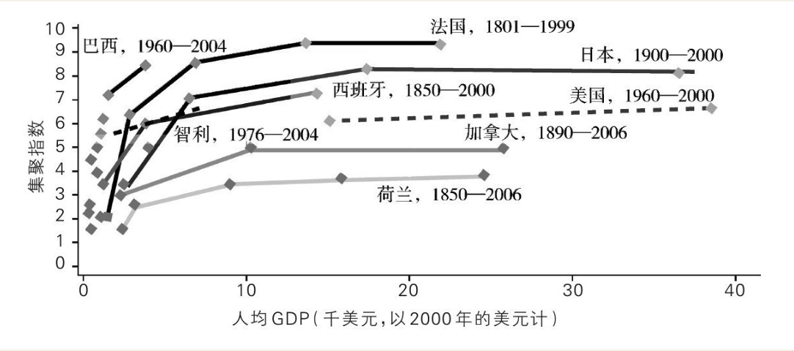

    作者: 陆铭 
    出版社: 上海人民出版社
    副标题: 当代中国的统一、发展与平衡
    出版年: 2016-7-1
    页数: 324
    定价: CNY 42.00
    装帧: 平装
    ISBN: 9787208138636

[豆瓣链接](https://book.douban.com/subject/26824237/)

- [上篇 大国难题](#%E4%B8%8A%E7%AF%87-%E5%A4%A7%E5%9B%BD%E9%9A%BE%E9%A2%98)
  - [第一章 中国经济的欧洲化](#%E7%AC%AC%E4%B8%80%E7%AB%A0-%E4%B8%AD%E5%9B%BD%E7%BB%8F%E6%B5%8E%E7%9A%84%E6%AC%A7%E6%B4%B2%E5%8C%96)
    - [1. 欧洲正经历大考](#1-%E6%AC%A7%E6%B4%B2%E6%AD%A3%E7%BB%8F%E5%8E%86%E5%A4%A7%E8%80%83)
    - [2. 为什么大国梦如此迷人？](#2-%E4%B8%BA%E4%BB%80%E4%B9%88%E5%A4%A7%E5%9B%BD%E6%A2%A6%E5%A6%82%E6%AD%A4%E8%BF%B7%E4%BA%BA)
    - [3. 大国的难题](#3-%E5%A4%A7%E5%9B%BD%E7%9A%84%E9%9A%BE%E9%A2%98)
    - [4. 发展中大国的困境与机遇](#4-%E5%8F%91%E5%B1%95%E4%B8%AD%E5%A4%A7%E5%9B%BD%E7%9A%84%E5%9B%B0%E5%A2%83%E4%B8%8E%E6%9C%BA%E9%81%87)
    - [5. 统一市场符合公共利益](#5-%E7%BB%9F%E4%B8%80%E5%B8%82%E5%9C%BA%E7%AC%A6%E5%90%88%E5%85%AC%E5%85%B1%E5%88%A9%E7%9B%8A)
  - [第二章 在集聚中走向平衡](#%E7%AC%AC%E4%BA%8C%E7%AB%A0-%E5%9C%A8%E9%9B%86%E8%81%9A%E4%B8%AD%E8%B5%B0%E5%90%91%E5%B9%B3%E8%A1%A1)
    - [1. 三个有关空间的误解](#1-%E4%B8%89%E4%B8%AA%E6%9C%89%E5%85%B3%E7%A9%BA%E9%97%B4%E7%9A%84%E8%AF%AF%E8%A7%A3)
    - [2. 自由移民的意义](#2-%E8%87%AA%E7%94%B1%E7%A7%BB%E6%B0%91%E7%9A%84%E6%84%8F%E4%B9%89)
    - [3. 空间的力量：3M与3D](#3-%E7%A9%BA%E9%97%B4%E7%9A%84%E5%8A%9B%E9%87%8F3m%E4%B8%8E3d)
      - [区域经济发展的三个D](#%E5%8C%BA%E5%9F%9F%E7%BB%8F%E6%B5%8E%E5%8F%91%E5%B1%95%E7%9A%84%E4%B8%89%E4%B8%AAd)
    - [4. 城乡和区域发展中的要素流动和政策](#4-%E5%9F%8E%E4%B9%A1%E5%92%8C%E5%8C%BA%E5%9F%9F%E5%8F%91%E5%B1%95%E4%B8%AD%E7%9A%84%E8%A6%81%E7%B4%A0%E6%B5%81%E5%8A%A8%E5%92%8C%E6%94%BF%E7%AD%96)
  - [第三章 打破大国发展的“不可能三角”](#%E7%AC%AC%E4%B8%89%E7%AB%A0-%E6%89%93%E7%A0%B4%E5%A4%A7%E5%9B%BD%E5%8F%91%E5%B1%95%E7%9A%84%E4%B8%8D%E5%8F%AF%E8%83%BD%E4%B8%89%E8%A7%92)

## 上篇 大国难题
### 第一章 中国经济的欧洲化
#### 1. 欧洲正经历大考
从经济逻辑出发，欧洲债务危机的根源是两大因素：一是市场分割，二是统一货币。

先来说市场分割。即使在欧盟内部没有人口流动的制度障碍的情况下，因为欧洲国家多，语言、文字不一样，宗教、文化、饮食也存在很多差异，所以事实上欧洲内部的人口流动仍是不充分、不自由的。经济学最基本的道理告诉我们，如果有人口的自由流动，地区之间的劳动生产率和人均收入就会趋同，否则人口就会持续流动。由于欧洲国家间的人口流动事实上很难做到完全自由，结果形成了国家间的人均GDP差异——法国、德国的人均GDP大约是希腊的两倍。

在这样一个存在市场分割的区域，如果实现货币统一，各个成员国就失去了自己的货币政策的独立性。换句话说，如果在希腊出现经济衰退，那么，它就无法单方面地通过扩张性的货币政策或者本币贬值来刺激经济。特别值得强调的是汇率，从根本上来说，一个国家的汇率由其劳动生产率决定。如果一个国家劳动生产率不断提高但汇率不变的话，这个国家的出口货物就越来越便宜，于是就会产生本币升值的压力，以此来达到贸易的平衡。

有读者会说，汇率有名义汇率和实际汇率之分，如果一个国家的劳动生产率低，其工资也低，那么，这个国家的产品的国际竞争力不会受影响啊。可是，工资是有刚性的，更确切地说，与劳动相关的支出（包括社会保障）往往都是有刚性的，向上调整容易，向下调整难。对此，只要看看电视新闻里希腊人如何上街抗议削减福利开支，就明白了。在经济的上行周期，劳动生产率高，工资上升不难。但是在经济下行时期，劳动生产率增长慢（甚至可能下降），工资却难以灵活调整，这时，如果本币贬值就可以刺激出口，帮助其摆脱困境，而如果本币不能贬值，工资又不能灵活作出调整，那就可能出现政府财政赤字增加、政府偿债能力不足这些问题。

欧元区只有一个汇率，当各个国家的工资无法灵活地适应劳动生产率时，对欧元汇率起决定作用的是欧洲各个国家的平均劳动生产率，结果一定是，最终的汇率对劳动生产率最高的德国、法国是偏低的，而对希腊这样的国家是偏高的，希腊会因为汇率偏高而难以刺激出口。于是相对发达的西欧国家不断增加其贸易盈余，而边缘的南欧国家则不断累积起贸易赤字，这种状况可以说自欧元诞生起就存在，至今愈演愈烈。在出口受限的情况下，边缘国家经济发展受到制约，而人口又没有充分流动起来，国家却要为自己的国民提供社会保障、公共服务，直接途径就是借债。

危机之前全球范围内货币政策都偏松。在融资成本较低的情况下，劳动生产率较高的德国借机扩张生产。而像希腊这样的弱国，宽松的信贷导致危机之前经济过热，债务大规模增长。当全球经济危机来临时，虚假繁荣的经济显得异常脆弱，政府偿债能力立即出现危机。这时，正如前面所说，如果希腊是一个有自己独立货币的国家，当出现债务危机的时候就应该贬值，刺激出口，使经济增长、税收增加，还债能力就会提高。**但在欧元区，各国丧失了独立的货币政策，希腊不能单独让欧元贬值来刺激经济。这就是欧洲债务危机产生的深层经济学道理**。

欧债危机触及了欧元区的深层次矛盾：当结成欧元区的国家存在巨大的发展差距时，统一货币的麻烦在欧债危机中尽显无遗。当各个国家经济形势相异时，欧元区统一的货币政策无法作出迅速反应。但是，有远见的政治家却明白，统一的货币进而统一的政治却有一个好处，那就是**最终实现一个“大国”的规模经济**。

在国际经贸体系里，人们总是愿意持有大国的货币，因为这些国家的经济相对比较稳定，而且与世界上其他国家的贸易量也大。持有大国的货币，既可以带来国际贸易结算的方便，又可以防止经济和币值波动太大带来的风险。而对拥有国际储备货币的欧元区来说，这就意味着在国际上的话语权，以及对持有欧元的国家征收铸币税。

其中的经济学道理却就在身边：在货币一体化的区域（或者国家），人口自由流动是必需的，否则，地区之间的劳动生产率趋同就难以实现。欠发达地区劳动生产率较低，如果人又没有流动起来，社会福利、公共服务的支出却是刚性的，工资调整又面临障碍（如果真让工资与劳动生产率完全对应则引起地区间收入差距），想通过货币政策来促进经济增长也不行，于是，靠举债来弥补收入与支出之间的差额就难以避免。

#### 2. 为什么大国梦如此迷人？
在现代经济里，经济结构以工业和服务业为主，这时，规模的重要性反而比前现代时期更强了。

1. 大国有可能借助规模经济而发展“战略性产业”。例如民用大飞机产业，初始的投入非常大，国内市场规模越大，生产的平均成本越低。如果要保证这个产业实现收支相平衡，就要有一个最低的国内市场规模，以此才能够基本弥补制造这些飞机的成本。
2. 技术创新。中国由于市场规模大，很多细小的技术创新都能在这个市场上得以生存。市场规模有利于创新，这非常重要。中国的市场销售量足够大，足以弥补产品研发阶段的初始投入，也有利于某种细分产品的规模化生产。比如说“汽车安全扣”吧——我猜这是个只有在中国才能买得到的产品。它的作用是将其插入安全带的插口后，一些带有提醒系上安全带功能的汽车就“闭嘴”了。曾经有外国人惊讶于中国居然把这个不安全的东西叫做“汽车安全扣”，同时，他们也惊讶于这样的商品居然有那么多的款式。
3. 公共品提供。在前现代时期，公共品主要是指国防，但到现代，公共品就更多了。比如说卫星导航系统，世界上最早开发并应用卫星导航系统的是美国，西欧和俄罗斯紧随其后。对于中国来讲，由于有规模经济的好处，我们就可以开发自己的卫星导航系统，事实上，中国的“北斗”卫星导航系统已经开始工作。同时，中国已经开始进入全球公共品提供者的行列。比如说亚丁湾的护航和参与抗击埃博拉病毒的医疗援助，这就是国际公共品。
4. 与现代服务业有关了。现在世界上真正有实力的国家，它的竞争力都集中在所谓现代服务业中，而标志一个国家实力的，基本上就是金融、医疗、教育、文化这几个行业。美国的竞争力有三个标志性的来源，一个是华尔街，一个是大学，另一个就是好莱坞。这些现代服务业都需要一定的规模来吸引全世界的一流人才。文化和教育产业特别受益于大国的规模经济，因为这两个行业在国与国之间带有一定的文化壁垒。例如，内地电影明星的身价涨得很快，于是港台地区的影视明星纷纷进入内地拍戏，歌手也竞相参加电视节目，这就与内地市场的规模有关。像湖南卫视“我是歌手”这样的节目之所以有跨国界的号召力，就与其大投入的制作有关；而中国一个省的卫视能够有如此大投入的电视制作，就不能不说与这一市场规模背后的广告收入有关了。教育行业也是一样。商学院能够开出教授“中国经济”的国际MBA项目，相应的，研究中国经济本身能够成为重要的课题，这些如果离开中国经济的规模，恐怕都难成功。

随着一个国家国土面积的增加，该国的人口规模、民族多样性和自然资源等也会增加，这会使该国的治理成本增加。一个国家内部不同民族之间商业往来的交易成本甚至堪比不同国家间贸易的交易成本。因此，一个国家的最优规模取决于国家规模增加带来的收益与治理成本增加之间的权衡。

#### 3. 大国的难题
中国古代的皇帝和地方官追求税收，今天的地方政府也一样，所以地方政府会努力把自己的税基做大。于是，当代中国的分权体制就得分两面看了，它的好处是激励地方政府去发展经济，它的坏处是埋下了市场分割的隐患——每一个地方政府都不愿意其他地方把自己的经济资源给吸纳过去，也不想注册地在“外地”的企业到本地来参与竞争，所以地方政府就要分割市场来保护自己本地的经济。每一个地方都想做些未来可能有大发展的产业，结果弄得全国各地产业同构。

总体来讲**中国的市场还是走向整合的。但是，这里面还是有不和谐的因素，重复建设、市场分割和地方保护主义仍然存在，每个地方都想做大自己的倾向仍然非常明显，这些因素共同抑制着中国发挥大国应有的规模经济**。

我上面讲的是商品市场分割，那么生产要素市场呢？在经济学里最重要的是**三大生产要素：劳动力、土地、资本**。直到今天，中国这三大要素市场其实都是分割的。

- 在劳动力方面，以农民工为主体的城镇非本地户籍人口的社会保障、劳动力市场的公平就业、公共服务的分享都和本地户籍的城市居民不一样。在公共服务方面，尤其是基础教育和医疗，如果没有当地城镇户籍，待遇就很不一样——想上公立的幼儿园都难。越是在流动人口多的大城市和特大城市，外来人口难以享受本地市民待遇的问题就越严重。
- 中国为了保证“粮食安全”，要保持一定数量的耕地，于是就实行了“建设用地指标配给制度”，每一年中央给各个省一个农业用地转为非农业用地开发的总数，然后再由省分配给下面的市和县，不能突破。建设用地指标的分配虽然也要考虑不同地方不同的经济发展需要，但总体上采取了平均主义的方式。特别是在2003年之后，建设用地指标被作为鼓励中西部省份发展当地工业的政策工具，而对于人口流入较多的东部地区，特别是大城市，建设用地指标受到了严格控制。东部的地价、房价涨得这么快，其中有一个政策的原因就在于建设用地供给受到了限制。
- 大家可能会觉得，中国的资本市场是统一的，其实不然。第一，中国的资本市场实际上在被政府的项目审批制度分割着。中国的很多投资项目是需要国家发改委来审批的，因为有鼓励中西部投资的政策倾向，所以，在中西部能够获批的项目在东部就不行。第二，中国存在跨省投资的“市场进入障碍”。我曾经研究了上市公司管理者的政治级别背景对企业跨省投资的影响，发现企业高管拥有的政企纽带能够帮助企业到其他省份去开设下属企业（子公司、联营企业或分公司），但这种影响出现的条件是政企纽带达到省部级，而较低级别的政企纽带不起作用。同时，我们也发现，高管曾在中央政府部门任职也有助于企业异地投资。我们的解释是，有比较高级别的政治纽带就可以帮企业去突破省份之间资本市场的进入壁垒。反过来说，如果不是资本市场存在分割，我们就不会观察到这种现象。第三，地方政府会阻碍资本的流动。比如说，我在调研中曾发现，有地方政府会以调查偷税漏税为威胁，阻碍企业到外省投资。

#### 4. 发展中大国的困境与机遇
中国经济的一系列结构性扭曲现象与阻碍劳动力流动的制度有关。受到户籍、土地和社会保障等制度的影响，中国的城市化进程受阻，并远远落后于由资本积累推动的工业化进程。在工业和服务业已经在GDP中占有90%的时候，城镇人口（包括作为城镇常住人口的外来农民工）才刚刚超过50%。国际上公认的一个事实是，如果按照中国今天已经实现的经济发展水平，中国目前的城市化水平低了10个百分点左右。因为绝大多数的工业和服务业都是在城市生产的，这样，就不难理解为什么中国存在非常高的城乡收入差距了。

与此同时，中国正规金融市场的利率长期处于被压低的状态。与实际经济增长率长期处于接近两位数的水平相比，实际利率（即名义利率减通货膨胀率）长期很低，降低了融资成本，鼓励了投资，加快了资本积累速度，在生产结构上出现多使用资本的倾向，于是，在收入分配方面，大量的国民收入被投资者的资本收益占有，劳动收入占国民收入之比持续下降。劳动收入是中国绝大多数老百姓的可支配收入的主要来源，因此，劳动收入占国民收入之比下降进一步抑制了家庭消费的增长。而与此同时，投资不断高速增长的结果是生产能力不断提升，于是，当家庭消费受到抑制时，持续增长的投资和出口便成了消化产能的出路。

#### 5. 统一市场符合公共利益
很多人都认为，中国政府的统一财政是个“优势”，这可以避免中国出现希腊那样的主权债务危机。可是，凡是将统一财政作为中国“优势”的人们往往忽略了，恰恰是在现行体制下，无论是地方政府、金融机构还是社会公众，都会期待中央救助负债累累的地方。这给中央政府带来了非常尴尬的局面。一方期待中央救助负债累累的地方。这给中央政府带来了非常尴尬的局面。一方面，对于市场上的债务违约，中央当然希望打破“刚性兑付”的预期，以免将什么责任都揽在中央，让人们形成地方债务没有风险的预期；另一方面，面对事实上已经难以偿付的地方债务，最终还是会被认为将由中央政府来兜底，从长期来看，这也恰恰可能造成地方政府不计后果地借债的局面，这就是经济学里典型的“道德风险”问题。

劳动力自由流动，最终实现地区间的劳动生产率和收入均等，是大国发展唯一可行的战略选择。

### 第二章 在集聚中走向平衡
#### 1. 三个有关空间的误解

图2-1 经济发展与集聚的跨国比较 

这张图传递的信息可以用几句话来概括：第一，右上侧的国家，你一看名字就知道，都是发达国家。这意味着什么？越发达的国家，其人口的集聚程度越高。而在左下角，埃塞俄比亚、波茨瓦纳等，都是欠发达国家。欠发达国家人口集聚程度都不高。为什么发达国家的人口在空间上更集聚？因为发达国家的经济结构是以工业和服务业为主，尤其是以现代服务业为主，工业需要集聚，服务业比工业更需要集聚。现代服务业大量以知识、信息和技术为核心竞争力，这些产业更加集聚在城市（特别是大城市），这就导致了发达国家经济集聚程度更高这样的现象。

图2—2显示的是发展阶段与集聚程度之间的关系。其中，横轴是人均GDP，纵轴是一个国家的集聚指数，这张图表明，经济不会无限制地集聚。在发达国家发展过程中，集聚程度不断在提高，提高到一定阶段就稳定了，因为这个时候中心集聚区的生产要素价格太高了，使得生产者觉得没有必要都在纽约和东京这样的大城市附近生产，也会使得一部分老百姓觉得没有必要一定生活在大城市。但是，我必须强调，这张图讲的是，当经济和人口经过一段时间的快速集聚之后，集聚的速度会减缓，但集聚的程度并不会下降。

世界银行作过研究，考察世界上这些国家都是如何实现区域间平衡发展的。他们的基本结论可以总结成两句话：第一句话是，所有实现了地区间平衡发展的国家都是劳动力自由流动的国家；第二句话是，凡是通过经济资源的行政性配置去追求地区间平衡发展的国家没有一个成功的。这里面就蕴含着一个非常基础的经济学原理——**生产要素流动会使得要素回报均等化**。收入就是劳动要素的回报，因此，劳动力的自由流动，最终就将走向收入的均等化。收入的均等化可以发生在城乡间，也可以发生在地区间，只要没有要素流动的障碍。

#### 2. 自由移民的意义
曾经就有同行问我，为什么大家都知道农业应该实现规模经营，但规模经营却迟迟未能实现？答案其实很简单，农村人太多。人多了，协调成本就上升，统一的行动和管理就难出现，生产就难免是小规模而低效率的。

人多的问题还绝不只是增加协调成本。农业生产的低效率与其生产特征有关系，因为农业生产有一种瓶颈资源，那就是土地，土地的数量是有限的，而且土地的产出增长也是有极限的。

自由移民的另一个重要意义在于，从长期来看，只有自由移民才是缩小城乡和地区间收入差距的有效方式。

对一个大国来说，自由移民的重要性远不只是保障人们的权利。更为重要的是，只有当劳动力流动起来的时候，不同地区才能形成相互之间的分工与合作，有的地方造汽车，有的地方搞旅游，有的地方采松茸。地区之间形成经济上的相互依赖，是保持国家统一和市场整合的最有效途径。

劳动力自由流动了，人们就可以选择适合自己的生活方式。在地区之间，人口流动可以形成地区之间的竞争，如果一个地方的公共服务搞不好，企业和人就走了，这就意味着，把钱、事业和潜在的税源全部带走。地方政府为了当地的税收，就必须搞好公共服务。

图2—4是美国各州的GDP份额和人口份额。柱状图是美国各州GDP在全美占据的份额，曲线则是各州人口在全美的份额。尽管两个份额各自的地区间差距很大，但两者之间却高度一致。很简单的算术就可以告诉我们，各州人均GDP几乎是一样的，有的地方集中人口发展工业和服务业，有的地方地广人稀，就搞规模化的农场。美国农民之所以很富，恰恰是因为农民数量少，这样，农场面积才可能大。

图2-4 2009年美国各州GDP份额和人口份额

图2—5是中国各省份的GDP份额和人口份额。中国的政府和民众有一个非常严重的误解，认为中国的区域发展不平衡是由于经济高度向沿海发达地区集聚导致的。这是错的。中国的问题不是经济太集聚了，而是长期以来，人口的集聚未能与经济集聚同步。换句话说，中国真正的问题在于，图中的曲线没有跟上柱子，也就是人口的集聚落后于经济的集聚。

#### 3. 空间的力量：3M与3D
在东京的《2009年世界发展报告》工作会议上，项目负责人吉尔（Indermit Gill）总结道，城市发展的问题核心是解决`“3M”问题`，即分别用`Time`、`Grime`和`Crime`三个词表示的拥挤、污染和犯罪问题。城市经济的发展有其规模经济收益，而“3M”则构成了城市发展的成本。城市发展的政策就是应该不断地通过技术和管理的改进来降低“3M”，释放城市的规模经济效应。

进一步地，报告将地理对于经济发展的影响总结为城市问题、区域问题和国家问题。报告用`三个D`——`Density`（密度）、`Distance`（距离）和`Division`（分割）——来构建自身的整个分析框架。其中，密度带来规模经济，而城市是规模经济的集中体现。距离产生地区间的贸易成本，而基础设施的建设可以降低贸易成本，就好像拉近了地区之间的距离。相应的，区域发展政策的重点就是通过基础设施建设缩小地区间的距离，降低贸易成本。

三个D中，最厉害的是分割，分割体现了政治。此话怎讲？传统的经济学分析通常有两个假设，边际收益递减和生产要素自由流动。有了这两个假定，地区间和国家间的收入水平在长期一定是趋同的。对这个道理最简单的理解是，只要存在收入差距，穷国的居民如果可以自由地转移到富国去，那么，穷国就会不断向富国移民，直到两个国家的收入一样。劳动力不能自由流动也不要紧，只要资本是可以自由流动的效果也一样，如果资本不断投入富国，最终会出现回报下降，这时，就不如向穷国投资反倒可以获得更高的回报，如此直到两个国家之间的投资回报一样。

事实上，现代经济发展并没有实现国家间的收入均等化。原因何在？因为传统经济学的两个假设都不太符合现实。一方面，资本边际收益递减的趋势是可以打破的，如果生产有规模经济性，生产要素的集聚可以使高技术的劳动力和企业产生知识的外溢性，加快技术进步，资本的收益将相应提高。另一方面，就和政治有关了。发达国家是以本国居民的幸福——而不是全人类的幸福——为目标的，因此，他们的国界不会对所有人打开，他们要吸引的移民，或者有钱，或者有技术。于是，高技术的劳动力仍然在源源不断地向发达国家移民，而且主要是向发达国家的少数人口密集区集聚，这些地方对于高技术人才的需求更大。同时，对于低技术的移民，除非特殊原因（比如亲属团聚或者政治避难），发达国家的大门是关闭的。这种分割的局面，就是由国家间政治决定的。

国家间生产要素的流动不自由其实主要就是劳动力流动不自由，资本相对来说是自由流动的，而且国际资本流动越来越自由。由于发达国家的技术创新不断在缓解其资本回报递减的趋势，结果，发达国家反而成了资本流入地。

有一点是可以确定的，中国经济在追赶发达国家的过程中，最为重要的一个优势就是它的大市场。人口规模利用得好，它就不是负担，而是中国企业借助于国内市场实现规模经济效应的优势。城市化进程将带来城乡间和地区间资源的再配置，有利于提高经济资源的使用效率，这将为中国经济实现持续增长注入新的活力。我已经反复提醒，中国要警惕地方利益超越国家利益，市场被零碎分割，每个地方都只想着做大自己，忘记了自由移民才是地区间实际收入水平趋同的实现途径。

到目前为止，我不断地在强化一个观念：规模经济是重要的，而在国家和区域的发展中，规模经济是与空间集聚相伴随的。

##### 区域经济发展的三个D
规模经济体现为三大效应，第一是分享（sharing）——分享固定投入。生产者有固定投入，比如说基础设施，比如说开发区建设，都有大量固定投入。人口越密集，分享基础设施投资的企业和人就越多。从消费者角度来讲，也有固定投入分享，比如说在餐馆吃饭，餐馆客流量越大，平均每个消费者分摊的餐馆投入成本就越低。

第二个效应是劳动力市场的匹配（matching）。作为生产者，要招聘什么样的人在大城市里都能招聘得到，在小城市你就可能招聘不到，因为不够专业化。

随之而来的第三个效应是学习效应（learning）——劳动力专业化以后就越做越好，这叫自己跟自己学，积累经验就是这个意思。

#### 4. 城乡和区域发展中的要素流动和政策
在土地、劳动力和资本三大要素中，土地是不流动的，这是自然属性；高技能劳动力流向他们充裕的地方；资本流向它们稀缺的地方。

诺贝尔奖得主科斯（Ronald Coase）提出的经济学原理告诉我们，初始的产权界定给谁不重要，只要有市场机制，就可以通过交易提高资源利用效率。在建设用地指标（使用权）的交易中，关键是要以农民在城市里有就业和社会保障为前提，并且要基于自愿和合理的价格形成机制，这就不会剥夺农民的利益了。此外，人口流出地的一些以乡镇企业或工业园形式存在的建设用地，其对应的指标也应该可以实现跨地区的流转，这样，经济资源的配置效率就可以极大地得以提高。

上面这些如果总结成政策含义，也相应地可分为城市、地区和国家三个层面。

1. 在城市层面要强调规模经济，要尽量减少三个M的成本，最大化城市发展带来的收益。
2. 在地区之间要着眼于生活标准的均等化，而不是经济规模的均等化，不是经济资源和人口的均匀分布。不同的地区之间要减少交通成本，兴建基础设施，增加互联互通，促进市场整合。当然，不是说财政转移就不要做了。对于人口流出省，有一个问题解决不了，就是公共服务的供给，因为公共服务本身也是有规模经济的，如果人口流出，那么，就会影响到公共服务的供给。这时，就需要通过财政转移帮人口流出地区发展教育和医疗。换句话说，不要通过财政转移去搞当地缺乏比较优势的工业，因为如果没有足够的市场竞争力，最后可能造成的都是资源浪费。与其如此，不如将钱投在人力资本上，在短期内，这可以有助于提高人口流出地的生活质量，从长期来看，教育和健康都可以跟人走，可以在劳动力流动中最大化教育和医疗的投资回报。
3. 国家政策，可以总结为两句话。第一句话是，以国际贸易代替劳动力流动。在低技能劳动力不能跨国自由流动的情况下，发展中国家借助于国际贸易，发挥劳动资源的比较优势，仍然可以致富。第二句话是，由于发达国际贸易，发挥劳动资源的比较优势，仍然可以致富。第二句话是，由于发达国家只要高技能者不要低技能者，所以发展中国家的政策就要对高技能者的流出设置障碍，或者对高技能者的回流提供额外支持。

### 第三章 打破大国发展的“不可能三角”

