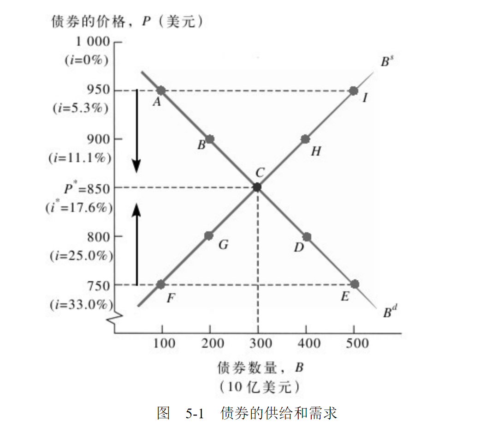
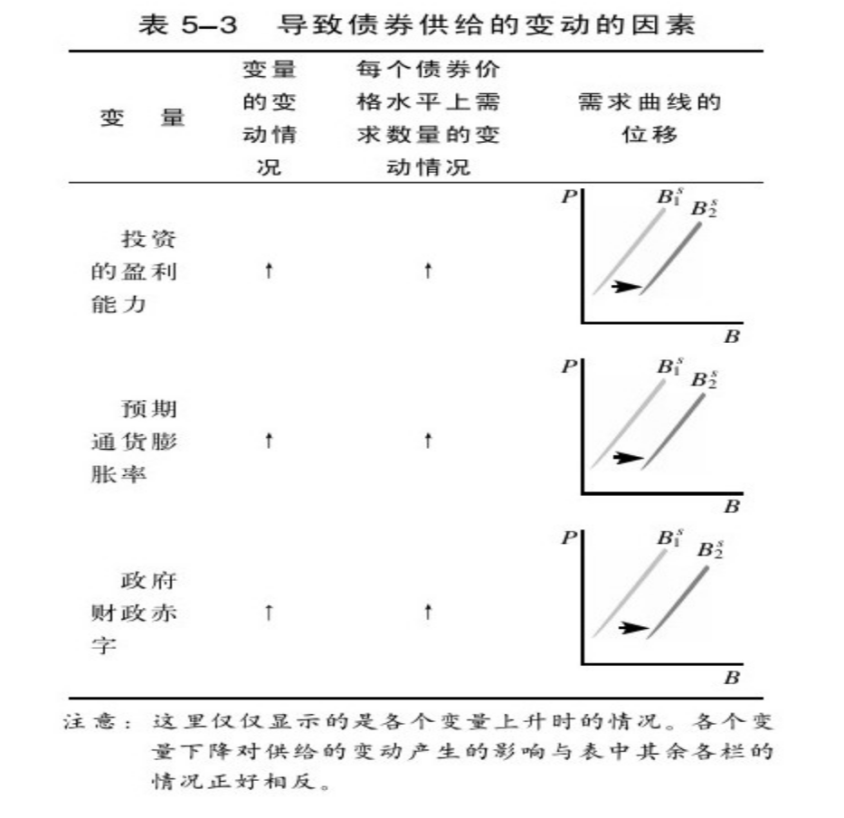

    作者: 弗雷德里克 S.米什金(Frederic S.Mishkin)
    出版社: 机械工业出版社
    译者: 马君潞 / 张庆元 / 刘洪海
    出版年: 2011-6-1
    页数: 520
    定价: 75.00元
    装帧: 平装
    丛书: 华章教材经典译丛
    ISBN: 9787111342618

[豆瓣链接](https://book.douban.com/subject/6516229/)

- [第一篇 导论](#第一篇-导论)
  - [第1章 为什么要研究货币、银行和金融市场](#第1章-为什么要研究货币银行和金融市场)
    - [1.1 研究金融市场的原因](#11-研究金融市场的原因)
      - [1.1.1 债券市场和利率](#111-债券市场和利率)
      - [1.1.2 股票市场](#112-股票市场)
    - [1.2 研究银行和其他金融机构的原因](#12-研究银行和其他金融机构的原因)
      - [1.2.1 金融体系的结构](#121-金融体系的结构)
      - [1.2.2 金融危机](#122-金融危机)
      - [1.2.3 银行与其他金融机构](#123-银行与其他金融机构)
      - [1.2.4 金融创新](#124-金融创新)
    - [1.3 研究货币和货币政策的原因](#13-研究货币和货币政策的原因)
      - [1.3.1 货币与经济周期](#131-货币与经济周期)
      - [1.3.2 货币与通货膨胀](#132-货币与通货膨胀)
      - [1.3.3 货币与利率](#133-货币与利率)
      - [1.3.4 货币政策的执行](#134-货币政策的执行)
      - [1.3.5 财政政策与货币政策](#135-财政政策与货币政策)
    - [1.4 研究国际金融问题的原因](#14-研究国际金融问题的原因)
      - [1.4.1 外汇市场](#141-外汇市场)
      - [1.4.2 国际金融体系](#142-国际金融体系)
    - [1.5 我们在研究货币、银行和金融市场过程中使用的方法](#15-我们在研究货币银行和金融市场过程中使用的方法)
    - [附录1A 对于总产出、总收入、物价水平和通货膨胀率的定义](#附录1a-对于总产出总收入物价水平和通货膨胀率的定义)
      - [1A.1 总产出和总收入](#1a1-总产出和总收入)
      - [1A.2 实际值和名义值的比较](#1a2-实际值和名义值的比较)
      - [1A.3 物价总水平](#1a3-物价总水平)
      - [1A.4 增长率和通货膨胀率](#1a4-增长率和通货膨胀率)
  - [第2章 金融体系概览](#第2章-金融体系概览)
    - [2.1 金融市场的功能](#21-金融市场的功能)
    - [2.2 金融市场的结构](#22-金融市场的结构)
      - [2.2.1 债务市场和股权市场](#221-债务市场和股权市场)
      - [2.2.2 一级市场和二级市场](#222-一级市场和二级市场)
      - [2.2.3 交易所和场外交易市场](#223-交易所和场外交易市场)
      - [2.2.4 货币市场和资本市场](#224-货币市场和资本市场)
    - [2.3 金融市场工具](#23-金融市场工具)
      - [2.3.1 货币市场工具](#231-货币市场工具)
      - [2.3.2 资本市场工具](#232-资本市场工具)
    - [2.4 金融市场的国际化](#24-金融市场的国际化)
      - [2.4.1 国际债券市场、欧洲债券和欧洲货币](#241-国际债券市场欧洲债券和欧洲货币)
      - [2.4.2 世界股票市场](#242-世界股票市场)
    - [2.5 金融中介机构的功能：间接融资](#25-金融中介机构的功能间接融资)
      - [2.5.1 交易成本](#251-交易成本)
      - [2.5.2 风险分担](#252-风险分担)
      - [2.5.3 信息不对称：逆向选择和道德风险](#253-信息不对称逆向选择和道德风险)
    - [2.6 金融中介机构的类型](#26-金融中介机构的类型)
      - [2.6.1 存款机构](#261-存款机构)
      - [2.6.2 契约型储蓄机构](#262-契约型储蓄机构)
      - [2.6.3 投资中介机构](#263-投资中介机构)
    - [2.7 金融体系的监管](#27-金融体系的监管)
      - [2.7.1 帮助投资者获取更多的信息](#271-帮助投资者获取更多的信息)
      - [2.7.2 保障金融中介机构的稳定运行](#272-保障金融中介机构的稳定运行)
  - [第3章 什么是货币](#第3章-什么是货币)
    - [3.1 货币的含义](#31-货币的含义)
    - [3.2 货币的功能](#32-货币的功能)
      - [3.2.1 交易媒介](#321-交易媒介)
      - [3.2.2 记账单位](#322-记账单位)
      - [3.2.3 价值储藏](#323-价值储藏)
    - [3.3 支付体系的演变](#33-支付体系的演变)
      - [3.3.1 商品货币](#331-商品货币)
      - [3.3.2 不兑现纸币](#332-不兑现纸币)
      - [3.3.3 支票](#333-支票)
      - [3.3.4 电子支付](#334-电子支付)
      - [3.3.5 电子货币](#335-电子货币)
    - [3.4 货币的计量](#34-货币的计量)
- [第二篇 金融市场](#第二篇-金融市场)
  - [第4章 理解利率](#第4章-理解利率)
    - [4.1 利率的计量](#41-利率的计量)
      - [4.1.1 现值](#411-现值)
      - [4.1.2 四种信用市场工具](#412-四种信用市场工具)
      - [4.1.3 到期收益率](#413-到期收益率)
    - [4.2 利率和回报率的区别](#42-利率和回报率的区别)
      - [4.2.1 期限与债券回报率：利率风险](#421-期限与债券回报率利率风险)
    - [4.3 实际利率和名义利率的区别](#43-实际利率和名义利率的区别)
  - [第5章 利率行为](#第5章-利率行为)
    - [5.1 资产需求的决定因素](#51-资产需求的决定因素)
    - [5.2 债券市场的供给和需求](#52-债券市场的供给和需求)
      - [5.2.1 需求曲线](#521-需求曲线)
      - [5.2.2 供给曲线](#522-供给曲线)
      - [5.2.3 市场均衡](#523-市场均衡)
    - [5.3 均衡利率的变动情况](#53-均衡利率的变动情况)
      - [5.3.1 债券需求的变动](#531-债券需求的变动)
      - [5.3.2 债券供给的变动](#532-债券供给的变动)
    - [5.4 货币市场的供给和需求：流动性偏好理论](#54-货币市场的供给和需求流动性偏好理论)
    - [5.5 流动性偏好理论中的均衡利率变动](#55-流动性偏好理论中的均衡利率变动)
      - [5.5.1 货币需求的变化](#551-货币需求的变化)
      - [5.5.2 货币供给的变动](#552-货币供给的变动)
  - [第6章 利率的风险和期限结构](#第6章-利率的风险和期限结构)

# 第一篇 导论
## 第1章 为什么要研究货币、银行和金融市场
1. 金融市场中的行为能够直接影响个人的财富状况、企业运营以及整体经济的效率。三种金融市场值得特别关注：债券市场（形成利率的场所）、股票市场（它对于个人的财富状况和企业的投资决策具有重要影响）以及外汇市场（汇率的波动对于美国经济具有重大影响）。
2. 银行和其他金融机构在非生产性资金拥有者和生产性资金拥有者之间建立起一条融通资金的渠道，在提高经济运行效率方面发挥了至关重要的作用。
3. 货币能够对通货膨胀、经济周期和利率产生重要影响。由于这些经济变量对于整体经济的健康平稳运行具有重要意义，因此我们必须对货币政策的制定和执行有所了解。同时，由于政府的财政政策是货币政策执行的重要影响因素之一，我们必须对其进行研究。
4. 本教材强调使用经济学的思维方式研究问题，为了使用一些基本的经济理论对货币、银行和金融市场进行研究，我们发展出一个一般性的分析框架。同时，本教材强调理论分析和实证数据之间的相互印证。

### 1.1 研究金融市场的原因
#### 1.1.1 债券市场和利率
`证券（security）`，又称金融工具，是对于发行者未来收益或者`资产`（asset，财务求偿权或者具有所有权的财产）的一种求偿权。`债券（bond）`是承诺在约定期限内定期偿付的债务证券。`债券市场`能够帮助公司和政府筹集到运营资金，并且能够决定利率，因此它对经济运行具有十分重要的意义。`利率（interest rate）`是借款的成本或者用于偿付资金租费的价格（通常用100美元年租费占100美元的百分率来表示）。在经济运行过程中，存在着多种利率——抵押贷款利率、汽车贷款利率以及各种债券利率等。

#### 1.1.2 股票市场
`普通股（common stock，通常简称为股票（stock））`代表了其持有人对于公司具有一定份额的所有权，代表了对公司的资产和收益具有的求偿权。发行和向公众销售股票是公司为了满足运营需要进行融资的一个重要途径。

### 1.2 研究银行和其他金融机构的原因
#### 1.2.1 金融体系的结构
`金融体系`是一个复杂的系统，它由各种各样的私人金融机构组成，具体包括：`银行`、`保险公司`、`共同基金`、`财务公司`以及`投资银行`等，所有这些金融机构必须接受政府部门的严格监管。

#### 1.2.2 金融危机
金融体系的发展处于停滞状态，并且出现了`金融危机（financial crises）`、资产价格的急剧下跌以及大量金融机构和非金融类企业的破产倒闭，这标志着金融市场出现了十分严重的崩溃现象。

#### 1.2.3 银行与其他金融机构
`银行（banks）`是吸纳存款和发放贷款的金融机构。“银行”一词包括`商业银行`、`储蓄贷款协会`、`互助储蓄银行`以及`信贷协会`等金融机构。事实上，诸如`保险公司`、`财务公司`、`养老基金`、`共同基金`以及`投资银行`等其他类型的金融机构近年来的发展十分迅速，部分取代了银行的地位。

#### 1.2.4 金融创新
金融创新向我们显示了部分金融机构是如何通过创造性思维活动产生更多利润的。

### 1.3 研究货币和货币政策的原因
`货币（money，也指货币供给（money supply））`是指人们广为接受的、用于购买商品和服务的支付活动或者用于偿付债务的任何事物。

#### 1.3.1 货币与经济周期
事实表明，在形成`经济周期（business cycle，导致经济中总产出的上下波动）`的过程中，货币发挥了十分重要的作用。

图1-3显示了1950～2008年货币供给量增长比率的变动情况，其中的阴影部分代表经济衰退（recessions），即总产出的下降阶段。在此，我们发现，每一次经济衰退发生之前，货币供应量增长比率都会下降，这表明货币供应量的变化可能是促使经济周期出现波动的原因之一，然而，并非货币供应量增长比率的每一次下降都会伴随着一次经济衰退。

#### 1.3.2 货币与通货膨胀
经济中商品和服务的平均价格称为`物价总水平（aggregate price level）`，或者简称为物价水平。`通货膨胀（inflation）`是指物价水平的持续上涨，影响着个人、企业和政府的经济活动。

图 1-4 1950～2008年美国的物价总水平和货币供应量

资料来源：www.stls.frb.org/fred/data/gdp/gdpdef；www.federalreserve.gov/releases/h6/hist/h6hist10.txt.

从描绘货币供应量和价格水平变动情况的图1-4中，我们可以发现价格水平和货币供给会一起上涨。这些数据表明，持续增长的货币供给也许是导致物价能够持续上升（这种情况及通货膨胀）的重要原因之一。

#### 1.3.3 货币与利率

图1-6显示了美国政府长期国债的利率和货币供应量增长比率的变动情况。在20世纪六七十年代，当货币供应量增长比率上升的时候，长期国债的利率也随之提高。然而，20世纪80年代以来，货币供应量的增长和利率之间的关系却不那么清晰了。

#### 1.3.4 货币政策的执行
由于许多对于我们的经济福利产生重要作用的经济变量都会受到货币的影响，所以全世界的政治家和决策者们都十分关注`货币政策（monetary policy）`的执行问题，即对于货币和利率的管理。`中央银行（central bank）`负责一个国家货币政策的执行。美国的中央银行是`联邦储备体系（Federal Reserve System，简称为美联储（the Fed））`。

#### 1.3.5 财政政策与货币政策
`财政政策（fiscal policy）`是与政府支出和税收问题相关的决策行为。`预算赤字（budget deficit）`是指在特定的时间范围内（通常为一年）政府支出超过税收收入的差额，而当税收收入超过政府支出的时候，就会出现`预算盈余（budget surplus）`。政府必须通过借款来弥补预算赤字，而预算盈余可以缓解政府的债务负担。

### 1.4 研究国际金融问题的原因
#### 1.4.1 外汇市场
为了实现国家之间的资金转移，人们需要将资金转出国的货币（比如美元）兑换成资金输入国的货币（比如欧元）。`外汇市场（foreign exchange market）`就是完成货币兑换活动的场所，是实现国家间资金转移的机构。外汇市场的重要性还体现在，它是确定汇率（即一个国家货币对于另一个国家货币的价格）的场所。

#### 1.4.2 国际金融体系
将就下列问题进行讨论。

- 一个国家确定与其他国家之间汇率的决策是如何影响到这个国家货币政策的执行的？
- 限制资本跨境流动的资本管制措施对于国内金融体系和整体经济绩效会产生什么影响？
- 在国际金融体系中，诸如国际货币基金组织之类的国际金融组织发挥了什么样的作用？

### 1.5 我们在研究货币、银行和金融市场过程中使用的方法
本教材强调使用经济学的思考方式，通过构建一个一般性的分析框架对货币、银行和金融市场进行研究。这个分析框架使用了一些经济学的基本概念：

- 资产需求分析的简化方法；
- 均衡的概念；
- 用于解释金融市场行为的基本供求分析方法；
- 对利润的追求；
- 基于交易成本和信息不对称理论的市场结构分析方法；
- 总供给-总需求分析方法。

### 附录1A 对于总产出、总收入、物价水平和通货膨胀率的定义
#### 1A.1 总产出和总收入
衡量总产出的最常用指标是`国内生产总值(GDP)`，它是指一个国家在一年内生产的全部最终产品和服务的市场价值总和。

`总收入（aggregate income）`是指一年中一个经济体在生产产品和服务的过程中各种`生产要素（factors of production，包括土地、劳动力和资本）`所获得的收入总和。人们通常认为它与总产出相等。因为购买最终产品和服务所支付的款项必然最终以收入的形式回流到生产要素的所有者手中，所以收入的数额必然等于购买最终产品和服务所支付的数额。举例来说，如果一个经济体的总产出是10万亿美元，那么该经济体的收入总额（总收入）也将是10万亿美元。

#### 1A.2 实际值和名义值的比较
当我们使用当期价格计算最终产品和服务的价值总和时，得出的GDP测量结果是`名义GDP`。`名义`一词的含义是指使用当期价格进行价值核算。

衡量经济产出更为可靠的方法是根据任意一个基年（目前的基年是2000年）的价格来表示价值。使用不变价格计算的GDP称为`实际GDP`，而`实际`一词的含义是指使用不变价格进行价值核算。

举一个简单的例子就可以清楚地显示名义变量和实际变量之间的区别，如果你2010年的名义收入是30000美元，2000年的名义收入是15000美元，而从2000～2010年所有产品和服务的价格上涨两倍，那么你获得的经济福利增加了吗？结论是否定的：虽然你的收入增长了一倍，但是由于价格水平也上涨了一倍，因此你在2010年的30000美元只能购买与2000年15000美元同样数量的产品。实际收入测算的结果表明，通过能够购买的产品数量来衡量，你的收入和过去是一样的。以2000年的价格为基准，2010年30000美元的名义收入换算为实际收入只相当于15000美元。由于你在这两个年份的实际收入是一样的，所以你在2000年和2010年所获得的经济福利水平也相同。

#### 1A.3 物价总水平
在经济数据中，我们通常会遇到三种物价总水平的测量方法。第一种是`GDP平减指数（GDP deflator）`，它等于名义GDP除以实际GDP所得的商。因此，如果2010年的名义GDP是10万亿美元，而按照2000年价格为基期计算的2010年实际GDP为9万亿美元，那么

    GDP平减指数=10万亿美元/9万亿美元=1.11

这一GDP平减指数等式表明，从2000年以来，物价水平平均上涨了11%。我们通常使用物价指数的形式来表示物价水平的测量结果，物价指数将基年的物价水平定为100，因此2010年的GDP平减指数就是111。

另一个物价总水平（美联储官员们经常加以关注）的常用衡量方法是`个人消费支出平减指数（personal consumption expenditures,PCE）`，它与GDP平减指数类似，是名义个人消费支出除以实际个人消费支出所得的商。

在媒体报道中最为常见的物价总水平衡量方法是`消费者物价指数（consumer price index,CPI）`。消费者物价指数通过一个普通城市居民所购买的“一揽子”商品和服务的价格来测定。如果在一年中，购买这一揽子商品和服务的支出由500美元上升到600美元，那么消费者物价指数就上涨了20%。消费者物价指数通常也由基年为100的物价指数形式来表示。

#### 1A.4 增长率和通货膨胀率
`增长率`定义为某一变量变化的百分比，即

增长率$=\frac{x_t-x_{t-1}}{x_{t-1}} \times 100\%$

式中，t代表现在，而t-1代表前一年。

举例来说，如果实际GDP从2010年的9万亿美元增长到2011年的9.5万亿美元，那么2011年GDP的增长率就是5.6%

GDP增长率$=\frac{9.5-9}{9} \times 100 \%=5.6 \%$

`通货膨胀率`定义为物价总水平的增长率。因而，如果GDP平减指数从2010年的111增长到2011年的113，那么使用GDP平减指数表示的通货膨胀率就是1.8%

通货膨胀率$=\frac{113-111}{111} \times 100 \%=1.8 \%$

## 第2章 金融体系概览
1. 金融市场的基本功能就是为资金从拥有富余资金的储蓄者那里转移到资金短缺的消费者手中提供融通渠道。金融市场可以通过借款者发行证券直接从贷款者那里获得融资，也可以通过金融中介机构进行间接融资。这种资金的融通活动可以增加经济生活中每个人的经济福利水平。由于金融市场能够将资金从不具备生产性投资机会的人那里转移到具有这种投资机会的人手中，因此有利于经济效率的提高。此外，这种融资服务可以帮助消费者在最需要进行消费活动的时候购买相应的商品，从而使消费者直接获得好处。
2. 金融市场可以分为债务市场和股权市场、一级市场和二级市场、交易所和场外市场以及货币市场和资本市场等。
3. 主要的货币市场工具（期限短于1年的债务工具），包括美国国库券、可转让银行定期存单、商业票据、回购协议、联邦基金和欧洲美元等。主要的资本市场工具（期限长于1年的债务工具和股权工具），包括股票、抵押贷款、公司债券、美国政府证券、美国政府机构证券、州政府和地方政府债券、消费贷款和银行商业贷款等。
4. 近年来，不断加深的国际化进程成为金融市场的重要发展趋势。欧洲债券是指以发行国以外的货币计价的债券，在当今的国际债券市场中占据着主导地位，超过了美国的公司债券，成为新的资金来源。欧洲美元是指存放在外国银行中的美元，是美国银行的重要资金来源之一。
5. 金融中介机构是通过发行负债工具来筹集资金，并且通过运用这些资金购买证券或者发放贷款来形成资产的金融机构。金融中介机构在金融体系中扮演了重要的角色，它们可以降低交易成本，分担风险，解决逆向选择和道德风险带来的问题。金融中介机构能够让小额储蓄者和借款者从金融市场中受益，从而提高经济运行的效率。
6. 主要的金融中介机构可以分为三种类型：①银行——商业银行、储贷协会、互助储蓄银行以及信用社等；②契约型储蓄机构——人寿保险公司、火灾和意外事故保险公司以及养老基金等；③投资中介机构——财务公司、共同基金以及货币市场共同基金等。
7. 政府对金融市场和金融中介机构实施监管的原因包含两个方面：帮助投资者获得更多的信息并确保金融体系稳定运行。监管措施主要包括向公众披露信息的要求，对金融中介机构设立者的限制，对金融中介机构持有资产种类的限制，提供存款保险服务，限制竞争和利率管制等。

### 2.1 金融市场的功能
`金融市场`的基本经济功能是向居民、企业和政府提供资金融通服务，将资金从收大于支而拥有盈余的经济主体那里转移到收小于支出现短缺的经济主体手中。图2-1形象地描绘出金融市场的`资金融通功能`。图2-1中的箭头显示了资金沿着两条路径从贷款者—储蓄者流向借款者—消费者的过程。

在`直接融资（direct finance，位于图2-1底部的那条路径）`模式下，借款者通过向金融市场里的贷款者出售证券（又称为金融工具），直接从后者手中获取资金，这些证券代表了对借款者未来收益或者资产的求偿权。对其购入者而言，证券是`资产`；而对其出售（发行）者而言，证券是`负债[liabilities，借据（IOU）或者债务]`。

金融市场能够将资金从缺乏生产性投资机会的人那里转移到拥有此类机会的人手中。因此，金融市场的重要意义在于它能够**有效地配置资本（capital，是以实体或者虚拟形式存在的财富，用于创造更多的财富）**，从而提高整体经济的产出水平和效率。

### 2.2 金融市场的结构
#### 2.2.1 债务市场和股权市场
公司或者个人可以通过两条途径从金融市场募集资金。最常见的方法是发行诸如`债券`或者抵押票据等抵押债务工具。它是一种契约协议，由借款者向债券持有人定期支付固定的金额（本金和利息），直到一个特定日期（到期日）支付最后一笔金额为止。债务工具的期限（maturity）就是债务工具（从发行到）最终到期所经历的时间。`短期（short-term）`债务工具的期限短于1年，`长期（long-term）`债务工具的期限达到10年或者10年以上，而期限介于1～10年的，称为`中期（intermediate-term）`债务工具。

第二种资金募集方式是发行`普通股股票`等股权（equities）。股权工具是其持有者按份额拥有的对企业净收益（扣除费用和税收后的收入）和资产的求偿权。如果一家公司发行了100万股普通股股票，而你持有1股股票，那么你就拥有这家公司净收益和资产的百万分之一。股权持有者通常定期获得一定金额的偿付（`红利，dividends`），而且因为股权没有到期日，通常被当做长期证券。此外，持有股票意味着你拥有该公司的一定份额，有权对公司的重大事项和董事长的选举进行投票表决。

与债务工具相比，公司股权的主要缺点是其持有人具有的是`剩余求偿权（residual claimant）`，即公司必须在完成对所有债权人的偿付之后，才能对其股权持有者进行偿付。持有股权的优点在于股权持有者能够从公司利润或者资产价值的增长中直接获益，而债权人则不能。这是因为股权持有人拥有的是公司所有权，而债权人拥有的是获得固定金额偿付的权利。在

#### 2.2.2 一级市场和二级市场
`一级市场（primary market）`是筹集资金的公司或者政府机构将新发行的债券或者股票等出售给最初购买者的金融市场。`二级市场（secondary market）`是已经发行的证券进行转售交易的金融市场。

在一级市场中有一种协助实施证券首次销售的重要金融机构，即`投资银行（investment bank）`。投资银行协助实施证券首次销售的方法是`证券承销（underwriting）`：它为公司证券提供了一个承诺的价格，继而将其向公众发售。

虽然进行大公司和美国政府已发行债券交易的`债券市场`事实上具有更大的交易规模，但是进行已发行`股票交易`的纽约股票交易所和纳斯达克则是公众最为熟知的`二级市场`。其他的二级市场还包括`外汇市场`、`期货市场`和`期权市场`等。证券的经纪人和交易商在二级市场的有效运行过程中发挥着至关重要的作用。`经纪人（brokers）`是投资者的代理人，负责实现证券买卖双方的匹配；`交易商（dealers）`则是通过按照报价买卖证券的活动，将证券的买卖双方联系起来。

公司只有在证券首次发行的一级市场中才能获得新的资金。无论如何，二级市场具有两种重要的功能：

1. 它使得金融工具的变现活动更加迅速和便捷，也就是说，它使金融工具获得更高的`流动性（liquid）`。金融工具的流动性越高，越受公众欢迎，从而使得发行证券的公司在一级市场中的销售活动也更加容易。
2. 二级市场能够圈定发行证券的公司在一级市场中的证券销售价格。在一级市场中投资者支付给发行公司的证券购入价格，不会高于他们在二级市场中购买同一证券的价格。二级市场中的证券价格越高，公司在一级市场中发行新证券的价格也会越高，从而能够获得更高的融资数额。因此，二级市场的状况与发行证券的公司之间具有十分密切的联系。正因为如此，与本书类似的介绍金融市场的书籍都是更加关注二级市场中的市场行为，而非一级市场。

#### 2.2.3 交易所和场外交易市场
二级市场具有两种组织形式：

1. `交易所（exchanges）`，即证券的买卖双方（或者其代理人或者经纪人）在一个集中的地点实施交易活动。进行股票交易活动的纽约证券交易所和进行商品（期货，小麦、玉米、白银以及其他原材料的商品期货）交易活动的芝加哥期货交易所都属于此类有组织的交易所。
2. `场外交易市场（over-the-counter（OTC）market）`，在此市场中，居于分散地点并且持有证券存货的交易商们，随时与那些同他们联系并且愿意接受其报价的客户“在柜台上”进行证券买卖活动。由于实施场外交易的交易商们通过计算机联系，熟悉彼此的报价，所以场外交易市场的竞争十分激烈，与有组织的交易所没有显著的区别。

#### 2.2.4 货币市场和资本市场
根据在市场上所交易证券的不同期限，可以对金融市场进行另一种划分。`货币市场（money market）`是短期债务工具（其原始期限通常短于1年）进行交易的金融市场；而`资本市场（capital market）`是长期债务工具（其原始期限通常在1年或者1年以上）和股权工具进行交易的金融市场。通常，货币市场的证券交易活动比资本市场更加活跃，因此，前者的流动性更高。

### 2.3 金融市场工具
#### 2.3.1 货币市场工具
由于货币市场中金融工具的期限较短，所以这些工具的价格波动幅度最小，是最安全的风险投资工具。

表2-1中分别列出了主要货币市场工具的种类，及其在1980年、1990年、2000年和2008年年末的未偿付余额（amount outstanding）。

在“货币利率”栏中，新闻媒体讨论最多的是四种利率：

1. `优惠利率（prime rate）`：它是企业银行贷款的基准利率，是标识企业从银行借款的成本指标。
1. `联邦基金利率（federal funds rate）`：它是联邦基金市场中隔夜贷款的利率，是标识银行间借款成本和货币政策立场的敏感指标。
1. `国库券利率（treasury bill rate）`：它是美国国库券的利率，是标识基本利率活动的指标。
1. `伦敦同业拆放利率（libor rate）`：它是英国银行业协会给出的伦敦市场中美元存款的银行间平均利率。

`美国国库券`：这些由美国政府发行的短期债务工具为联邦政府提供融资服务，其期限通常为1个月、3个月和6个月。它们在到期日支付确定的金额却不支付利息；实际上，它们是通过折价发行来支付利息的，即按照低于到期日支付金额的价格发行。例如，在2010年5月，你以9000美元的价格购买的一笔6个月期美国国库券，将会在2010年11月以10000美元的价格被赎回。

在所有的货币市场工具中，美国国库券的交易最为活跃，因此其流动性最强。同时，美国国库券还是最安全的货币市场工具，因为它几乎不存在违约风险（default），即债务工具的发行方（在此是联邦政府）不能支付利息或是在债务工具到期时无法偿付本金。由于联邦政府能够增加税收或者增发货币（currency，纸币或者硬币）来偿还债务，所以联邦政府始终能够履行其偿债义务。银行是国库券的主要持有人，而居民、公司和其他金融中介机构持有少量的国库券。

`可转让银行定期存单`：定期存单（certificate of deposit,CD）是由银行向存款人发行的一种债务工具，它每年支付固定金额的利息，并在到期日以初始购置价格还本。可转让定期存单是可以在二级市场上出售的定期存单，当前的未偿付余额约为2.4万亿美元。可转让定期存单是商业银行从公司、货币共同基金、慈善机构和政府机构获取资金的极其重要的渠道。

`商业票据`：商业票据是由大型银行和诸如微软、通用汽车等著名企业发行的短期债务工具。商业票据市场经历了令人瞩目的增长：1980～2008年，商业票据非偿付余额的增长幅度超过了1200%（从1220亿美元上升至17320亿美元）。

`回购协议`：回购协议（repurchase agreement,repos）是一种有效的短期贷款（其期限通常短于2周）。回购协议是将国库券作为抵押品，如果借款者不能够偿付贷款，贷款者可以将国库券收归己有。回购协议的操作程序是：诸如微软等大公司的银行账户上存在闲置资金，如100万美元，该公司愿意将此闲置资金贷出1周。微软公司使用闲置的100万美元从银行购买国库券，而该银行同意在1周后按照略高于微软公司买入价的特定价格回购其卖出的国库券。这种协议的作用在于，微软公司把100万美元贷给银行，同时持有银行价值100万美元的国库券，直到银行回购该笔国库券，清偿贷款为止。目前，回购协议已经成为银行资金的重要来源（超过5000亿美元），而大公司是这个市场中的主要贷款者。

`联邦基金`：这种金融工具通常是在美国联邦储备体系中拥有存款的银行之间的隔夜贷款。联邦基金一词有时会让人们产生误解，因为这种贷款既不是由联邦政府发放的，也不是由联邦储备体系发放的，而是银行之间相互拆放的。银行从联邦基金市场借款的原因之一是，该银行在联邦储备体系账户中的存款余额不能满足监管者的要求。该银行可以从其他银行借款以补充不足的存款余额，通过联邦储备体系的电子支付系统将借入款项转移到借款银行账户中。这个市场对于银行的借贷需求非常敏感，这种贷款的利率被称为`联邦基金利率（federal funds rate）`，它是银行系统中信贷市场松紧情况和货币政策立场的晴雨表。联邦基金利率较高，说明银行系统中的资金紧张；联邦基金利率较低，说明银行的借贷需求较弱。

#### 2.3.2 资本市场工具
表2-2中列出了主要资本市场工具的种类，及其在1980年、1990年、2000年和2008年年末的未偿付余额。

在“债券、利率和收益率”栏中，新闻媒体讨论最多的是五种利率：

1. `30年期抵押贷款利率`：它是30年期固定利息住房抵押贷款的利率，其贷款金额小于417000美元，并且需要获得联邦住宅管理局（FHA）的担保。
1. `大额抵押贷款利率`：它是向重要客户发放的30年期固定利息住房抵押贷款的利率，其贷款金额大于417000美元。
1. `5年可调息抵押贷款利率`：它是向重要客户发放的住房抵押贷款第一个5年的利率，在5年后进行调整。
1. `新车贷款利率`：它是4年期固定利息新车贷款的利率。
1. `10年期国债利率`：期限为10年的美国国债的利率。

`股票`：股票是对公司净收益和资产的权益求偿权。2008年年末的股票市值达到20万亿美元，超过了资本市场中其他种类证券的价值。然而，任何一年新发行股票的金额通常都很小，所占比例不到上市流通股票总市值的1%。大约一半的股票由个人持有，其余由养老基金、共同基金和保险公司等持有。

`抵押贷款`：抵押贷款是向购买房屋、土地或者其他不动产的居民或者企业提供的贷款，将这些不动产或者土地本身作为发放贷款的抵押品。抵押贷款市场是美国规模最大的债务市场，住房抵押贷款（用于购买住宅）的未偿付余额超过了商业和农业抵押贷款未偿付余额总和的四倍。储贷协会和互助储蓄银行一直是住房抵押贷款市场中的主要贷款提供者，但是商业银行也开始积极进入这个市场。商业和农业抵押贷款主要是由商业银行和人寿保险公司发放的。联邦政府通过三个政府代理机构对抵押贷款市场施加影响，它们是联邦国民抵押贷款协会（FNMA，房利美）、政府国民抵押协会（GNMA）以及联邦住房抵押贷款公司（FHLMC，房地美）。这些政府代理机构通过发行债券筹集资金、使用发债募集的资金购买抵押贷款，从而向抵押贷款市场提供融资。

`公司债券`：公司债券是信用评级结果优异的公司发行的长期债券。典型的公司债券每年两次向其持有人支付利息，并在债券到期日偿付本金。某些被称为可转换债券的公司债，是指债券持有人可以在债券到期日前的任一时点将其转换为规定数量的股票。这一特点使得可转换债券比一般的债券更加受到潜在投资者的欢迎，并且可以减少公司的利息支出，因为如果股票价格大幅上涨的话，债券（转换为股票）的价值也会随之提高。由于任何一家公司发行的可转换债券和非可转换债券的未偿付余额都较小，与诸如美国政府债券等其他证券相比，其流动性有较大差距。

`美国政府证券`：它是由美国财政部发行的、为联邦政府赤字提供融资的长期债务工具。因为它是美国市场中交易量最大（日均交易量超过1000亿美元）的债务工具，所以它是资本市场中流动性最强的证券。其主要持有者包括联邦储备体系、银行、居民和外国人。

`美国政府机构证券`：这种长期债券的发行者包括政府国民抵押协会、联邦农业信贷银行（Federal Farm Credit Bank）以及田纳西流域管理局（Tennessee Valley Authority）等各种政府机构，为了抵押贷款、农业贷款以及发电设备等项目提供融资。这类证券多数得到联邦政府的担保，发挥着与美国政府债券类似的作用，持有者也基本相同。

`州和地方政府债券`：州和地方政府债券又称市政债券（municipal bonds），它是州和地方政府发行的长期债务工具，为建设学校、修建公路以及其他大型项目的支出提供融资。这种债券的一个重要特征是购买这种债券的利息收入免征联邦所得税，在发行州通常也免征州税。由于商业银行的所得税税率较高，它们是这种债券的最大购买者，持有其未偿付余额的一半以上。持有量居于次席的是所得税率较高的富人，再次是保险公司。

`消费贷款和银行商业贷款`：这些向消费者和企业提供的贷款主要是由银行发放的，而财务公司也是重要的贷款提供者。

### 2.4 金融市场的国际化
#### 2.4.1 国际债券市场、欧洲债券和欧洲货币
国际债券市场中的传统金融工具是`外国债券（foreign bonds）`。外国债券是在境外发行的、以发行国货币计价的债券。

在国际债券市场中，近期的一个创新是`欧洲债券（Eurobond）`，它是一种以发行国以外的货币计价的债券，欧洲债券的一个变体是欧洲货币（Eurocurrencies），即存放在货币发行国境外银行之中的外汇存款。最主要的欧洲货币是`欧洲美元（Eurodollars）`，即存放在美国境外的外国银行或者美国银行境外分支机构里的美元存款。由于这些短期存款能够获得利息，因此它们类似于短期欧洲债券。美国银行可以从其他银行或者其自己的境外分支机构借入欧洲美元，现在它已经成为美国银行一个重要的资金来源。

值得注意的是，欧元这种新货币会使人们对欧洲债券、欧洲货币和欧洲美元这几个术语产生某些混淆。以欧元计价的债券，只有当它在使用欧元国家的境外发行时，才能成为欧洲债券。

#### 2.4.2 世界股票市场
金融市场的国际化对美国产生了深远的影响。外国投资者特别是日本投资者，不仅向美国的企业提供融资，而且帮助联邦政府筹集资金。

### 2.5 金融中介机构的功能：间接融资
正如图2-1所示，资金可以沿上方的路线从贷款者流向借款者，这一过程称为间接融资的原因在于，在这种融资方式的贷款者—储蓄者和借款者—消费者之间存在着金融中介机构，它能够帮助实现资金在两者之间的转移过程。金融中介机构通过向贷款者—储蓄者借入资金，再使用这些资金向借款者—消费者发放贷款的方式来实现上述资金转移过程。

利用金融中介机构实现的间接融资过程称为`金融中介（financial intermediation）`。它是实现从贷款者向借款者资金转移的主要渠道。

#### 2.5.1 交易成本
`交易成本（transaction cost）`是指在金融交易过程中消耗的时间和金钱，它是计划借出其富余资金的人所面临的主要问题。

由于金融中介机构具备降低交易成本的专业技术，具有庞大的规模，能够实现`规模经济（economies of scale）`，即随着交易规模的扩张，摊抵在每一美元之上的成本也随之降低，所以它们可以大幅度地降低交易成本。举例来说，银行知道如何聘请优秀的律师起草一份严谨的贷款合同，这份合同可以在其后的贷款交易活动中反复使用，从而降低每一笔交易的法律成本。银行不会只花费500美元设计一份贷款合同（这样的合同可能并不完善），它们会支付5000美元聘请一流的律师来设计一份严谨完整的贷款合同，以满足2000笔贷款的需要，因此每笔贷款的成本降到了2.5美元。在每笔贷款的成本只有2.5美元的条件下，由金融中介机构向卡尔发放1000美元贷款就能够获利了。

此外，金融机构低廉的交易成本使它们能够为其客户提供`流动性服务（liquidity services）`，即促使客户交易活动更加便捷的服务。举例来说，客户在银行开立的支票账户能够让客户更加便捷地开展支付活动。

#### 2.5.2 风险分担
金融机构交易成本低廉的另一个优势在于，它们有助于降低投资者面临的`风险（risk）`水平，即投资者从资产中获得收益水平的不确定性。金融中介机构可以通过`风险分担（risk sharing）`过程来实现这一功能。通过创造和出售具有客户能够接受的风险水平的资产，金融中介机构筹集到了资金，它们使用这些资金去购买风险水平更高的资产。低廉的交易成本使得金融中介机构能够以很低的成本分散风险，从而获取利润，这一利润来源于它们从高风险资产上获得的回报和支付已出售资产的成本之间的差额。因为从某种意义来说，投资者的风险资产变得更加安全，所以风险分担过程有时也称为`资产转换（asset transformation）`。

通过帮助居民实现多样化来降低其资产面临的风险水平，金融中介机构也可以实现风险分担功能。`多样化（diversification）`是指投资于一组资产，即`资产组合（portfolio）`，其中各种资产的收益率不会总是发生同样的变化。因此，资产组合的总体风险水平要低于投资于单个资产面临的风险水平（多样化就是谚语“不把所有的鸡蛋放在一个篮子里”的另一种说法）。低廉的交易成本使得金融中介机构能够做到这一点，通过将一系列的资产汇集成一种新的资产，再将之向个人出售来实现。

#### 2.5.3 信息不对称：逆向选择和道德风险
在金融市场中存在的交易成本从一个方面说明了金融中介机构和间接融资在金融市场中占据重要地位的原因。另一个原因在于，金融市场中的交易者往往对交易对手缺乏了解，以致无法做出准确的判断。这种不对等的情况称为`信息不对称（asymmetric information）`。

`逆向选择（adverse selection）`是在交易发生之前由于信息不对称而产生的问题。如果潜在的借款者本身不希望投资活动得到理想的结果（即希望得到逆向结果），拥有不良的信用品质，同时，他们在非常积极地寻求贷款，并且很可能获得贷款资金的话，就会出现金融市场中的逆向选择现象。尽管金融市场中存在着信誉良好的借款人，由于逆向选择使信贷资金面临极大的损失风险，贷款的发放者可能决定不发放任何一笔贷款。

`道德风险（moral hazard）`是在交易发生之后由于信息不对称而产生的问题。金融市场中的道德风险是指从贷款者的角度来看，借款者具有从事不利于贷款者（不道德）活动的风险（危险），这些活动可能使得贷款无法得到偿还。由于道德风险降低了偿还贷款的可能性，所以贷款者也许决定不发放贷款。

### 2.6 金融中介机构的类型
#### 2.6.1 存款机构
存款机构（为简便起见，本教材通篇指的就是“银行”）是从个人和机构手中吸收存款并且发放贷款的金融中介机构。这些机构包括：

1. `商业银行`：这些金融中介机构主要通过发行可开立支票的存款（可以据此签发支票的存款）、储蓄存款（不能据此开立支票的活期存款）以及定期存款（具有固定期限的存款）等金融工具来筹集资金，然后利用这些资金发放商业贷款、消费贷款以及抵押贷款，购买美国政府证券和市政债券，等等。美国商业银行的数量略少于7150家，作为一个群体，它们是规模最大的金融中介机构，资产投资组合的多样化程度最高。
1. `储贷协会和互助储蓄银行`：此类金融中介机构的数量约为1225家，它们主要通过储蓄存款（通常称为股份）、定期存款和可开立支票存款来募集资金。过去，此类金融中介机构的业务活动受到严格限制，大部分资金用于为居民购买提供抵押贷款。近年来，这种限制已经放宽，它们和商业银行之间的区别日益模糊。两者之间相似程度越来越高，相互竞争也更加激烈。
1. `信用社`：此类金融中介机构的数量约为8100家，它们通常是规模很小并且具有合作性质的贷款机构。由诸如工会成员、特定公司职员等的特定群体组织而成。它们通过被称为股份的存款来筹集资金，主要用于发放消费贷款。

#### 2.6.2 契约型储蓄机构
诸如保险公司和养老基金之类的契约型储蓄机构，是指根据契约规定按期获得资金的金融中介机构。由于能够相当精确地预测在未来年度中需要向受益人支付的金额，所以它们不必像存款机构那样担心出现资金迅速流失的情况。因此，资产的流动性对契约型储蓄机构来说不像对存款机构那样重要，它们的资金主要投资于公司债券、股票和抵押贷款等长期证券。

1. `人寿保险公司`：人寿保险公司向人们提供保险以解决由死亡产生的财务损失风险，并且出售年金产品（受益人退休后可以按年获得的收入）。它们的资金来源于投保人为了维持保单有效而支付的保费，主要将资金用于购买公司债券和抵押贷款。人寿保险公司也进行股票投资，但是在数量上存在一定的限制。目前，人寿保险公司的资产总额达到4.8万亿美元，是规模最大的契约型储蓄机构。
1. `火灾和意外伤害保险公司`：这些保险公司向保单持有者提供保险，从而解决由于失窃、火灾以及意外事故形成的风险。它们和人寿保险公司十分相似，都是将出售保单来获取的保费作为主要资金来源。然而，如果发生重大灾难，它们很可能就会损失大量资金。因此，与人寿保险公司相比，它们购置资产的流动性更高。在其持有的资产中，市政债券所占比例最高，此外还有公司债券、股票和美国政府债券等。
1. `养老基金和政府退休基金`：私立养老基金以及州和地方政府养老基金是以年金的形式向参加养老金计划的雇员提供的退休收入。它们的资金主要来源于雇主和雇员缴纳的款项，雇员缴纳的资金可能来自工资中自动扣除的部分，也可以按照个人意愿（超额）缴纳。养老基金持有的资产主要是公司债券和股票。联邦政府积极支持建立养老基金，通过立法方式强制其成立，同时通过税收优惠的方式促进其发展。

#### 2.6.3 投资中介机构
此类金融中介机构包括财务公司、共同基金以及货币市场共同基金等。

1. `财务公司`：财务公司通过出售商业票据（一种短期债务工具），以及发行股票和债券来筹集资金。它们将资金借给那些需要购买家具、汽车和改善住房条件等的消费者以及小型企业。有一些财务公司是由母公司建立的，以便帮助出售母公司的商品。举例来说，福特汽车信贷公司（Ford Motor Credit Company）就是向购买福特公司汽车的消费者提供贷款的财务公司。共同基金这些金融中介机构是通过向个人出售股份来筹集资金的，并且将其资金用于多样化的股票和债券投资。
1. `共同基金`：将其股份持有者的资金汇集起来，形成较大的资金规模，这样在批量购买股票或者债券的时候，具有交易成本低廉的优势。此外，与其他金融中介机构相比，共同基金能够使其股份持有者的投资组合具有更高的多样性。共同基金股份持有者可以随时出售（赎回）其股份，但是出售的价格是由共同基金投资的证券价值来决定的。因为证券价格波动剧烈，共同基金的价值也会随之变化，所以购买共同基金是存在一定风险的。
1. `货币市场`：共同基金这些金融中介机构具有共同基金的特点，同时，由于它们提供存款服务，所以在某些方面具有与存款机构相似的功能。同大多数共同基金相同，货币市场共同基金通过出售股份来筹集资金，但是主要投资于那些安全性和流动性都很高的货币市场工具，其股份持有者将会获得这些资产形成的利息收益。`货币市场共同基金`的一个重要特征是，其股份持有者可以根据所持股份价值开立支票。实际上，货币市场共同基金类似于附带利息的支票存款账户。从1971年问世以来，货币市场共同基金的发展十分迅速，截至2008年，其资产总额达到约3.4万亿美元。
1. `投资银行`：尽管具有“投资银行”的名称，但是它既不是银行，也不属于通常意义的金融中介机构，也就是说，它既不吸收存款也不发放贷款。实际上，投资银行是一种协助公司发行证券的特殊形式的金融中介机构。首先，投资银行向公司提供发行何种证券（股票还是债券）方面的建议，然后，投资银行通过按照事先约定价格购入这些证券，转而在市场中进行销售的方式，帮助公司销售（`承销（underwrite）`）这些证券。通过并购方式帮助客户公司收购其他公司，投资银行还可以成为交易商，并以此获得巨额佣金。

### 2.7 金融体系的监管
#### 2.7.1 帮助投资者获取更多的信息
作为1929年股票市场大崩盘以及随后暴露出来大量欺诈行为的结果，为了适应对金融市场实施监管的政治需求，出台了1933年`《证券法》`，并且在1934年建立了证券交易委员会。证券交易委员会要求，在发行证券时，公司必须向公众披露其销售、资产和收益等方面的信息，并且对公司最大股东（即内部人）的交易行为提出了限制。通过这些信息披露规范，以及限制那些可能操纵证券价格的内幕交易行为，证券交易委员会使投资者能够获得更为充分的信息，防止他们遭受在1933年以前的金融市场中出现的恶性事件的损害。

#### 2.7.2 保障金融中介机构的稳定运行
信息不对称会导致金融中介机构大量倒闭，即出现金融恐慌（financial panic）现象。为了保障公众和整体经济免受金融恐慌的影响，政府采取了下述6种监管措施。

1. `准入限制`：对于金融中介机构的设立，州银行、保险委员会和货币监理署（它是联邦政府的代理机构）都建立了严格的监管制度。如果个人或者机构计划建立诸如银行或者保险公司之类的金融中介机构，就必须从州政府或者联邦政府那里获得执照。只有那些诚实正直、信誉卓著并且拥有大量资本金的公民才能够获得执照。
1. `信息披露`：金融中介机构具有十分严格的信息报告制度。它们的会计簿记方法必须符合某些严格的要求，对其账簿进行定期审查，并且必须向公众披露特定方面的信息。
1. `对于资产和业务活动的限制`：对于金融中介机构的业务活动以及能够保有的资产种类，都存在严格的限制。在你把资金存放到银行或者类似的机构之前，你希望了解自己的资金是安全的，而银行或者其他金融中介机构能够履行对你承诺的义务。实现这一目标的一种方法就是限制金融中介机构的业务活动，禁止它们参与某些高风险的投资活动。1933年通过了银行和证券分业经营的法案（1999年废止），使得银行无法参与那些与证券业相关的高风险投资活动。限制金融中介机构从事高风险投资活动的另一种方法，是限制它们持有某些高风险的资产，或是将高风险资产的数额控制在一个审慎的水平上。举例来说，因为股票价格的波动幅度十分巨大，所以商业银行和其他存款机构不能持有普通股股票。保险公司能够持有普通股股票，但是其数额不能超过资产总额的特定比例。
1. `存款保险`：政府为人们的存款提供了保险服务，如果保有他们存款的金融中介机构倒闭，人们也可以避免遭受巨额的财务损失。提供这类保险服务最重要的机构是联邦存款保险公司（FDIC），它为每一位商业银行或者互助储蓄银行的储户提供存款保险服务，每个账户的保险金额上限为10万美元（临时上限为25万美元）。商业银行和互助储蓄银行都要向联邦存款保险基金缴纳保费，在金融中介机构发生倒闭的时候，用于偿付储户的存款资金。1930～1934年，美国的银行大量倒闭，在这些银行存放资金的众多储户荡然无存，1934年联邦存款保险公司随之建立。对于信用社来说，全国信用社联盟共享保险基金（National Credit Union ShareInsurance Fund）发挥着相同的作用。
1. `对于竞争的限制`：政治家声称，是金融中介机构之间的盲目竞争加剧了其倒闭风险，进而损害公众利益。虽然由竞争造成这种影响的证据十分微弱，但是州政府和联邦政府对于新设分支机构活动进行了众多的限制。过去，不允许银行在其他州开设分支机构，而且在部分州里，银行在州内其他地区开设分支机构也会受到限制。
1. `利率管制`：通过对存款利息设置限制也能够实现对竞争活动的管制。在1933年之后的数十年中，不允许银行向支票账户支付利息。此外，直到1986年，根据《Q条例》（Regulation Q）的规定，联邦储备体系有权设置银行储蓄存款的利率上限。制定这些规则的原因在于，大多数人相信在大萧条时无序的利率竞争对银行倒闭产生了推进作用。随后并没有证据支持这种观点，因此《Q条例》被废止了（不过企业持有的支票账户的利息依然受到严格限制）。

## 第3章 什么是货币
1. 对于经济学家来说，货币的含义不同于收入或者财富。货币是指任何一种在购买商品和服务的支付活动或者债务偿付过程中被普遍接受的物品。
2. 货币具有三种重要功能：交易媒介、记账单位和价值储藏。作为交易媒介，使用货币可以免除物物交换经济中存在的需求双重匹配问题，从而降低了交易成本、促进了专业化和劳动分工的发展；作为记账单位，使用货币能够减少经济运行过程中所需要的价格数量，也能够降低交易成本；货币还可以作为价值储藏工具，但是如果出现由于通货膨胀导致的货币贬值的现象，货币是很难实现这种功能的。
3. 支付体系随着时间而不断演变。直至数百年之前，除了少数最原始的社会外，各种社会的支付体系都建立在贵金属基础之上。使用纸币能够降低货币的运输成本。接下来的一个重大货币发展是支票，它进一步降低了交易成本。现在我们正在向电子支付系统发展，在这种支付体系中，纸质货币将不复存在，而所有的交易活动都将通过计算机来实现。尽管这种支付体系的潜在效率很高，但是向无（纸质）支票社会发展的步伐以及新型电子货币的发展都受到各种阻碍的制约。
4. 联邦储备体系定义了两种不同的货币供应量计量方法——M1和M2。这两个指标之间存在差别，而且运动趋势也不尽相同，因此政策制定者不能将两者混淆使用。获得准确和正确的货币计量方法十分重要，对于货币政策的实施具有重要影响。
5. 货币计量中的另一个问题是，数据并非总是像我们希望的那样精确。需要经常对数据进行重大修正，它表明在表示货币供给短期（如逐月的）变化情况时，基于原始数据的计算结果是不可靠的；而在表示货币供给长期（如1年）变化情况时，这样的计算结果会更加可靠。

### 3.1 货币的含义
经济学家把货币（也称为货币供给）定义为任何一种被普遍接受的、可以用于购买商品和服务支付行为的或者偿付债务的物品。由纸币和硬币组成的通货，显然符合这一定义，是货币的一种类型。人们日常交谈中提到的货币，实际上是指`通货（currency）`——纸币和硬币。

### 3.2 货币的功能
#### 3.2.1 交易媒介
在我们经济运行过程的几乎全部市场交易活动中，以通货或者支票形式体现的货币就是一种`交易媒介（medium of exchange）`，它可以用于购买商品和服务的支付活动。货币作为交易媒介，能够大大节约商品和服务的交易时间，从而提高经济效率。

能够发挥货币功能的商品必须满足以下几个条件：

1. 易于标准化，能够很容易地确定其价值；
2. 被普遍接受；
3. 易于分割，能够很容易地“找零”；
4. 易于携带；
5. 不会很快腐坏变质。

#### 3.2.2 记账单位
货币的第二种功能是`记账单位（unit of account）`，也就是说能够使用货币来衡量经济运行过程中的价值。

#### 3.2.3 价值储藏
货币还具有`价值储藏（store of value）`的功能，即实现购买力的长期储存。价值储藏就是从获得到消耗收入的过程中对其购买力的保存。

货币并不是唯一的价值储藏手段，无论是货币、股票、债券、土地、住宅、艺术品还是珠宝，任何一种资产都具有价值储藏功能。因为这些资产的利息收入通常高于货币，或者能够升值，或者能够提供诸如居住等各项服务功能，所以作为价值储藏手段，大多数资产都比货币更具优越性。既然作为储藏手段，这些资产比货币更加适宜，那么为什么还有人愿意持有货币呢？

这个问题的答案与流动性这个重要的经济概念有关。流动性是指一种资产转换为交易媒介的难易程度和速度。人们非常需要`流动性`。由于货币本身就是交易媒介，无须转换成其他物品就可以直接用于购买活动，所以货币是流动性最高的资产。在其他种类的资产转换为货币的过程中，都会产生`交易成本`。

货币作为价值储存方式的效果取决于物价水平。举例来说，如果全部价格都上涨了一倍，那么货币的价值就下降了一半；反之，如果全部价格都下降了一半，那么货币的价值就上涨了一倍。在通货膨胀期间，由于物价快速上涨、货币迅速贬值，人们就会以货币以外的形式来储藏财富。在月度通货膨胀率大于50%的极端通货膨胀状态，也称为`恶性通货膨胀（hyperinflation）`下，情况尤其如此。

### 3.3 支付体系的演变
#### 3.3.1 商品货币
由贵金属或者其他具有价值的物品构成的货币被称为`商品货币（commodity money）`，除了最原始的社会，从远古时期直到数百年前，商品货币在各种社会中都发挥着交易媒介的功能。单纯以贵金属为基础的支付体系存在的主要问题在于，这种形式的货币过于沉重，异地运输十分困难。

#### 3.3.2 不兑现纸币
纸币逐渐演变为`不兑现纸币（fiat money）`，即政府宣布以纸币作为法偿货币（法律规定能够偿付债务的货币），但是不能兑换为硬币或者贵金属。纸币的优势在于，它比硬币和贵金属轻得多，但是只有在人们能够信任纸币发行当局、纸币印制技术发展到极难伪造的程度之后，纸币才能够作为交易媒介。

#### 3.3.3 支票
支票是你发出的一项指令，要求你的银行在支票持有者将支票存入其账户的时候，将资金从你的账户转移到他（支票持有者）的账户。支票可以使人们无须携带大量通货就能够从事交易活动。支票的发明是提高支付体系效率的一项重要创新。通常来说，支付活动是有来有往的，可以相互抵消。如果没有支票，支付活动就会导致通货的大量转移；如果有了支票，相互抵消的支付活动就可以通过支票的冲销进行结算，无须进行相应的通货转移。因此，使用支票可以降低支付体系的交易成本，从而促进经济效率的提高。支票的另一个优点是，能够在账户余额范围内签发任何金额的支票，从而使大额交易的实施更为便捷。同时，使用支票能够大大降低失窃损失，也能够为购买活动提供便捷的收入（以便记账）。

然而，以支票为基础的支付体系存在两个问题。首先，支票的异地转移需要消耗一定时间，当你使用支票向身处异地、急于收款的人进行偿付时，这个问题就会变得十分突出。此外，如果你拥有一个支票账户，你知道自己把支票存入银行之后，需要经历若干个工作日，你才能够获准使用所存支票中的资金。如果你急需现金，使用支票进行支付活动的这个特点让你感到十分沮丧。其次，纸质支票的处理成本很高，据估计目前美国每年处理已签发支票的费用超过了100亿美元。

#### 3.3.4 电子支付
据估计，与使用支票相比，每笔交易使用电子支付节省的成本可能会超过1美元。

#### 3.3.5 电子货币
电子货币的第一种形式是`借记卡（debit card）`。这种借记卡和信用卡的外形相似，消费者可以用它来购买商品和服务，直接把持卡人银行账户上的资金通过电子支付的方式转移到商户的账户之中。大多数银行以及诸如维萨（Visa）和万事达（MasterCard）等公司都能发行借记卡，你的ATM卡通常具有和借记卡相同的功能。

电子货币的一种高级形式是`储值卡（stored-value card）`。最简单形式的储值卡是消费者先期付款购买的存有一定现值金额的卡片，比如预付费电话卡。比较复杂的储值卡是智能卡（smart card）。它具有一个电子芯片，能在需要的时候把持卡人银行账户中的资金以数字现金的形式存入卡中。

电子货币的第三种形式通常是指`电子现金（e-cash）`，它可以通过互联网购买商品和服务。通过在银行开立一个能够与互联网连接的账户，消费者就能获得电子现金服务，然后把这些电子现金转移到自己的个人计算机之中。

### 3.4 货币的计量
是货币总量（monetary aggregate，见表3-1和金融新闻解读专栏）。

# 第二篇 金融市场
## 第4章 理解利率
1. 到期收益率是反映利率的最精确指标，它是使债务工具未来偿付金额的现值等于其现期购入价格的利率。运用这一原理，我们发现债券价格和利率之间存在负相关关系：当利率上升的时候，债券价格必然会下跌，反之亦然。
2. 通过债券的收益率，我们可以判断出在特定时期持有某种债券能够给你带来的收益情况，它与通过到期收益率表示的利率之间可能会出现很大的差别。在利率出现变化的条件下，长期债券的价格会出现大幅度波动，进而产生利率风险。由于这样会产生大额的资本利得和资本损失，因此，通常认为长期债券并不是获得规定收益率的安全资产选择。
3. 实际利率的定义是名义利率减去预期通货膨胀率的差，在衡量借款和贷款的意愿方面以及信用市场资金松紧程度方面，它是比名义利率更为精确的指标。

### 4.1 利率的计量
#### 4.1.1 现值
`现值（present value`，或者称`折现值（present discounted value）`）的概念来源于一个常识：1年后获得的1美元的价值要低于现在获得的1美元的价值。

让我们考察一下通常称为普通贷款（simple loan）的最为简单的债务工具。这种计算方法就是所谓的`单利率（simple interest rate,i）`即

    i=10美元/100美元=0.10=10%

如果你发放了这笔100美元的贷款，到年末你将得到110美元，这一过程可以重写为：

    100美元×（1+0.10）=110美元

如果你将这110美元再次放贷出去，那么在第2年年末你将得到：

    110美元×（1+0.10）=121美元

或者等于

    100美元×（1+0.10）×（1+0.10）=100美元×（1+0.10）2=121美元

如果继续这样发放贷款，在第3年年末你将得到：

    121美元×（1+0.10）=100美元×（1+0.10）3=133美元

概括来说，我们可以发现在第n年年末，这100美元将变成：

    100美元×（1+1.10）^n

3年后的133美元=100美元×+（1+0.10）^3等于今天的100美元，即

100美元=$\frac{133美元}{(1+0.10)^3}$

我们上面这个计算未来收益现期价值的过程，称为`对未来的贴现（discounting of future）`。我们对这个过程进行一般化处理，用`PV`来表示`今天的（现期）价值`，即前面的100美元；用`CF`来表示未来的`现金流（偿付金额）`，即前面的133美元；用i来表示前面的0.10（10%的`利率`），就可以得到下面的式（4-1）：

$PV=\frac{CF}{(1+i)^n}$ (4-1)

#### 4.1.2 四种信用市场工具
信用市场工具可以划分为四种不同的基本类型。

- `普通贷款`:是由贷款者向借款者提供一笔资金，借款者必须在到期日向贷款者偿付本金以及一定数额的利息。很多货币市场工具都属于这一类型，例如，向工商企业提供的商业贷款等。
- `固定支付贷款（fixed payment loan，也称为分期偿还贷款（fully amortized loan））`：它是由贷款者向借款者提供一笔资金，借款者必须向贷款者在事先约定的若干时期内，每个时期（如一个月）等额偿付包含部分本金和数年内形成的利息的金额。举例来说，如果你按照固定支付贷款借入1000美元，可能要求你在未来的25年内每年偿还126美元。分期贷款（如汽车贷款）和抵押贷款通常属于固定支付贷款的类型。
- `息票债券（coupon bond）`：它是在到期日之前每年向债券持有者偿付固定金额的利息（息票利息），在到期日偿还约定最终金额（债券面值（face value或者par value））的债券。（之所以称为息票债券，原因在于过去息票债券的持有者经常需要从债券上剪下所附息票，交给债券发行者以获得利息偿付。现在，大多数息票债券已经不需要呈递息票来进行付息了。）举例来说，面值为1000美元的息票债券，其发行者可能是在未来的10年内每年向你支付100美元的利息，而在到期日按照债券面值向你偿付1000美元（息票债券的面值一般是以1000美元为计值单位）。
- `贴现发行债券（discount bond，又称为零息债券（zero-coupon bond））`：它是按照低于其票面金额（以一个折扣）折价发行，在到期日按照票面金额进行偿付的债券。与息票债券不同，贴现发行债券并不支付利息，而只是在到期日偿还票面金额。举例来说，我们可以以900美元的价格购买票面金额为1000美元的1年期贴现发行债券，在1年后，债券持有者按照1000美元的票面价值获得偿付。贴现发行债券包括美国国库券、美元储蓄债券以及长期零息债券等。

#### 4.1.3 到期收益率
在计算利率的几个常用方法中，最重要的是`到期收益率（yield to maturity）`，它从债务工具获得现金流收益（利息）的现值折算为与债务工具现值相等的数值。

- 普通贷款
- 固定支付贷款
- 息票债券

### 4.2 利率和回报率的区别
`回报（return）`，或者在术语上更精确的是`回报率（rate of return）`，是精确衡量人们在特定时期持有某种债券或者任何其他种类证券获得回报的指标。

从t到t+1时刻之间，持有债券获得回报率的更一般形式是

$R=\frac{C+P_{t+1}-P_t}{P_t}$(4-7)

式中，R为从t到t+1时刻之间持有债券所获得的回报率；Pt为t时刻的债券价格；Pt+1为t+1时刻的债券价格；C为利息收益。

把式（4-7）分为两个部分，回报率公式可以更简便地写为：

$R=\frac{C}{P_t}+\frac{P_{t+1}-P_t}{P_t}$

第一部分是`当期收益率ic`（利息收益除以购入价格）：

$\frac{C}{P_t}=i_c$

第二部分是`资本利得率（rate of capital gain）`，即债券现期价格相对于其初始购入价格的变化：

$\frac{P_{t+1}-P_t}{P_t}=g$

式中，g是资本利得率。

式（4-7）可以重新写为：

R=ic+g　（4-8）

式（4-8）表明，债券回报率是当期收益率ic和资本利得率g之和。这个重写的公式使我们认识到：即使当期收益率是精确衡量债券到期收益率的指标，但是回报率和利率之间会存在很大的差别，特别是在债券价格出现大幅波动，导致资本利得出现剧烈变化的时候，两者之间的差别更为显著。

#### 4.2.1 期限与债券回报率：利率风险
债券期限越长，其价格变动幅度受到利率的影响会越大。这个发现有助于我们理解债券市场行为中一个重要的事实：长期债券的价格和回报率波动幅度比短期债券要大。

现在我们发现，利率变化能够加大长期债券的投资风险。实际上，由于利率变化导致的资产收益率风险变动问题十分重要，所以使用一个专门的术语——`利率风险（interest-rate risk）`。

### 4.3 实际利率和名义利率的区别
没有考虑到通货膨胀问题，更准确地说，这种利率称为`名义利率（nominal interest rate）`，它与`实际利率（real interest rate）`之间存在区别。实际利率是根据物价水平（通货膨胀）的预期变动进行相应调整的利率，能够更为准确地反映真实的借款成本。

`费雪方程`表明，名义利率i等于实际利率$i_r$与预期通货膨胀率$π^e$之和

$i=i_r+π^e$　（4-9）

重新排列各项，我们发现实际利率就等于名义利率减去预期通货膨胀率：

$i_r=i-π^e$　（4-10）

为了理解这个定义的含义，让我们首先考察下面的情况：你发放了一笔利率为5%（i=5%）的1年期普通贷款，而你预期在这一年中物价水平会上升3%（$π^e$=3%）。发放这笔贷款的结果是，你预期在年底将会多得2%的实际物品（real terms，即你能够购买的实际的商品和服务）。在此情况下，根据实际的商品和服务来计算，你预期得到的利率为2%

$i_r$=5%-3%=2%

`名义收益率`和`实际收益率`之间也存在类似的区别。名义收益率没有考虑到通货膨胀的影响，通常是指我们简称的`“收益率”`。在从名义收益率中剔除通货膨胀的影响之后，我们就得到了实际收益率，即通过持有证券产生的、能够额外购入的商品和服务。

## 第5章 利率行为
1. 资产需求理论表明，一项资产的需求量：
   1. 和财富之间存在正相关关系；
   2. 相对其他可替代性资产，和本项资产的预期收益率之间存在正相关关系；
   3. 相对其他可替代性资产，和本项资产的风险之间存在负相关关系；
   4. 相对其他可替代性资产，和本项资产的流动性之间存在正相关关系。
2. 债券供求理论可以为研究利率的决定机制提供理论解释。该理论认为，在由于收入（或者财富）、预期收益率、风险或者流动性的变化导致的需求变化，或者是由于投资机会的吸引力、借款实际成本或者政府预算的变化导致的供给变化的条件下，利率就会随之发生变化。
3. 流动性偏好理论是解释利率决定机制的另一种理论，关注的是货币的供给和需求。该理论表明，在由于收入或者价格水平的变化导致的货币需求变化，或者是货币供应量变化的条件下，利率就会随之发生变化。
4. 在货币供应量提高的条件下，可能会出现四种情况：流动性效应、收入效应、物价效应以及预期通货膨胀效应。流动性效应表明货币供应量的提高会导致利率的下降；而其他效应的作用方向相反。实际情况似乎表明收入效应、物价效应和预期通货膨胀效应要大于流动性效应的作用结果，因此，增加货币供应量将会提高而非降低利率。

### 5.1 资产需求的决定因素
`资产`是可以作为价值储藏手段的财产，包括货币、债券、股票、艺术品、土地、住宅、农用设备以及机械装备，等等。在面对是否购买某项资产或者在不同种类的资产中如何选择之类的问题时，我们必须要考虑下列因素。

1. 财富，个人拥有的全部资源，包含所有种类的资产。
1. 预期收益率（expected return），即与其他资产相比，某种资产在下一期实现的收益率的预期值。
1. 风险，与其他资产相比，某种资产收益率的不确定性水平。
1. 流动性，与其他资产相比，某种资产变现的速度和难易程度。

### 5.2 债券市场的供给和需求
#### 5.2.1 需求曲线
考察一个1年期贴现发行债券的需求情况。这种债券不用支付利息，只是在1年后按照面值向债券持有者偿付1000美元。这种债券的预期收益率等于其利率i，使用第4章中式（4-6）来表示的结果为：

$i=R^e=\frac{F-P}{P}$

式中，i为利率=到期收益率；$R^e$为预期收益率；F为贴现发行债券的面值；P为贴现发行债券的初始购入价格。

上式说明，每个债券价格都对应着不同的利率取值。如果债券的售价为950美元，那么其利率和预期收益率为：

$\frac{1000美元-950美元}{950美元}=0.053$=5.3%

据此，5.3%的利率和预期收益率对应着950美元的债券价格。假设债券的需求量为1000亿美元，即图5-1中的A点。

在价格为900美元的条件下，其利率和预期收益率为：

$\frac{1000美元-900美元}{900美元}=0.111$=11.1%

资产需求理论表明，在其他经济变量（如其他资产的预期收益率、风险和流动性以及收入等）保持不变的条件下，如果债券的预期收益率越高，那么债券的需求量也越大。图5-1中的B点表明，在价格为900美元的条件下，债券的需求数量提高到2000亿美元。同理，如果债券的价格为850美元（其利率和预期收益率=17.6%），那么这种债券的需求量（C点）将会大于B点上的需求量。同样，当债券价格降至更低的800美元（其利率和预期收益率=25%）和750美元（其利率和预期收益率=33.3%）的时候，债券的需求量会更大（D点和E点）。连接上述各点的曲线Bd就是债券的需求曲线。它通常向下倾斜，表明债券的价格越低（在其他经济变量保持不变的条件下），那么其需求量就会越大。

#### 5.2.2 供给曲线
根据前面的例子，在债券价格为750美元（其利率=33.3%）的时候，F点表明债券的供给量为1000亿美元。如果价格为800美元，那么其利率将会降至25%。由于按照这个较低的利率发行债券来融资的成本较低，公司更愿意通过发行债券的方式借入更多的资金，所以债券的供给量将会上升到2000亿美元这个较高的水平（G点）。850美元这个更高的债券价格对应着17.6%这个更低的利率，导致债券的供应量提高到3000亿美元这个更高的水平（C点），而900美元和950美元这些更加高企的价格将会导致债券供应量的进一步提高（H点和I点）。连接上述各点的曲线Bs就是债券的供给曲线，它通常向上倾斜，表明了随着债券价格的上升（在其他经济变量保持不变的情况下），其供给量也会相应上涨。

#### 5.2.3 市场均衡
在经济学中，`市场均衡（market equilibrium）`是指在给定价格条件下，人们愿意购买（需求）和出售（供给）的数量相等时的状态。在债券市场上，在债券的需求量和供给量相等的时候，就实现了市场均衡：

$B^d=B^s$(5-1)

在图5-1中，市场均衡状态出现在C点，它是供给曲线和需求曲线的交点，在这一点上的债券价格是850美元（利率为17.6%），债券数量是3000亿美元。在债券的需求量和供给量相等的时候，其价格P*=850美元称为`市场均衡价格`或者`市场出清价格`。同样，这一价格对应的利率i*=17.6%称为`市场均衡利率`或者`市场出清利率`。

### 5.3 均衡利率的变动情况
#### 5.3.1 债券需求的变动
1. 财富；
2. 与其他资产相比，债券的预期收益率；
3. 与其他资产相比，债券的风险；
4. 与其他资产相比，债券的流动性。

#### 5.3.2 债券供给的变动
影响债券供给的变动的因素包括：

1. 投资机会的预期盈利能力；
2. 预期通货膨胀率；
3. 政府预算。

### 5.4 货币市场的供给和需求：流动性偏好理论
约翰·梅纳德·凯恩斯创立了`流动性偏好理论模型（liquidity preference framework）`，通过货币市场的供求分析来说明均衡利率的决定机制。

凯恩斯分析的起点是假设人们用于储藏财富的资产主要包括货币和债券。因此，经济运行过程中的财富总量等于债券总量和货币总量之和，即等于债券供应量（$B^s$）加上货币供应量（$M^s$）。由于人们能够购买的资产数量不能超过其可用资源的数量，所以人们希望持有的债券数量（$B^d$）和货币数量（$M^d$），即其需求量也必然等于财富总量。综上所述，我们得出一个结论：债券和货币的供给量必然等于债券和货币的需求量。

$B^s+M^s=B^d+M^d$　（5-2）

将有关债券的各项放在方程的一边，而将有关货币的各项放在方程的另一边，上述公式可以改写为：

$B^s-B^d=M^d-M^s$　（5-3）

通过改写的方程，我们发现如果货币市场处于均衡状态（$M^s=M^d$），那么式（5-3）的右边就等于零，这样就有Bs=Bd，意味着债券市场同样处于均衡状态。

因此，让债券市场的供求相等或者让货币市场的供求相等来确定均衡利率，这两种方法是相同的。从这个角度分析，用于货币市场分析的流动性偏好理论和用于债券市场分析的供求理论是相同的。但是在实际中，这两个理论之间存在差别，因为流动性偏好理论假设只有货币和债券这两种资产，它实际上忽略了汽车或者住宅等实体资产预期收益率的变化对利率产生的影响。但是在大多数情况下，这两个理论得出的预期收益率应该是一致的。

通过运用机会成本的概念，我们发现货币需求量和利率之间存在负相关关系。`机会成本`是指由于没有持有某项可替代性资产（这里指的是债券）所放弃的利息收入（预期收益）。随着债券利率i的上升，持有货币的机会成本也会提高，所以持有货币的意愿降低，货币的需求数量减少。

### 5.5 流动性偏好理论中的均衡利率变动
#### 5.5.1 货币需求的变化
在凯恩斯的流动性偏好理论中，有两个因素会导致货币需求的变化：收入和价格水平。

- `收入效应`。凯恩斯认为，货币需求受到收入因素影响的原因包含两个方面：
  - 在经济扩张和收入增加的条件下，财富增长，人们愿意持有更多的作为价值储藏手段的货币。
  - 在经济扩张和收入增加的条件下，人们愿意使用货币作为交易媒介实现更多的交易，从而导致人们希望持有更多的货币。因此，收入水平的提高将会导致每个利率水平下的货币需求量随之增长，需求曲线向右移动。
- `物价水平效应`。凯恩斯认为，人们关注的是以实际物品形式体现的货币持有数量，即按照实际能够购买的商品和服务的数量来计算的货币数量。在物价水平上涨的时候，同样数量名义货币的价值就会下降，不足以购买和以前相同数量的商品和服务。为了将以实物形式体现的所持有货币数量恢复到以前的水平，人们将会希望持有更多数量的名义货币。因此，物价水平的上升将会导致每个利率水平下的货币需求量随之增长，需求曲线向右移动。

#### 5.5.2 货币供给的变动

诺贝尔经济学奖得主米尔顿·弗里德曼对于货币供应量的上升会降低利率这一结论提出了重要的批判。他承认流动性偏好理论的正确性，并且将货币供应量的提高（在其他经济变量保持不变的条件下）会促使利率下降的这一结论称为流动性效应。然而，他认为流动性效应只反映了货币和利率关系的一部分事实：货币供应量的提高并不能保证“其他经济变量保持不变”，而是会对经济运行过程产生其他的效应，从而导致利率上升。如果这些效应足够大，那么在货币供应量提高的时候，利率完全有可能随之上升。

由于我们已经讨论过收入、物价水平和预期通货膨胀率影响均衡利率的运行机制，所以具备了对这些效应进行分析的基础。

1. `收入效应`。货币供应量的提高会对经济运行产生扩张性影响，从而增加国民收入和财富水平。流动性偏好理论和债券供求理论都认为利率会由此上升。因此，货币供应量提高的收入效应是指收入水平的提高将会导致利率的上升。
1. `物价效应`。货币供应量的提高将会导致整体经济中物价总水平的上升，流动性偏好理论认为这将会提高利率。因此，货币供应量提高的物价效应是指物价水平的提高将会导致利率的上升。
1. `预期通货膨胀效应`。由于货币供应量的提高会导致通货膨胀率的上升，它通过对预期通货膨胀率施加的影响，还能够对利率产生影响。具体来说，货币供应量的提高，使得人们对未来物价水平的预期值相应上升，由此产生了更高的预期通货膨胀率。债券供求理论告诉我们，预期通货膨胀率的提高将会导致利率上升。因此，货币供应量提高的预期通货膨胀效应是指预期通货膨胀率的提高将会导致利率上升。

## 第6章 利率的风险和期限结构

