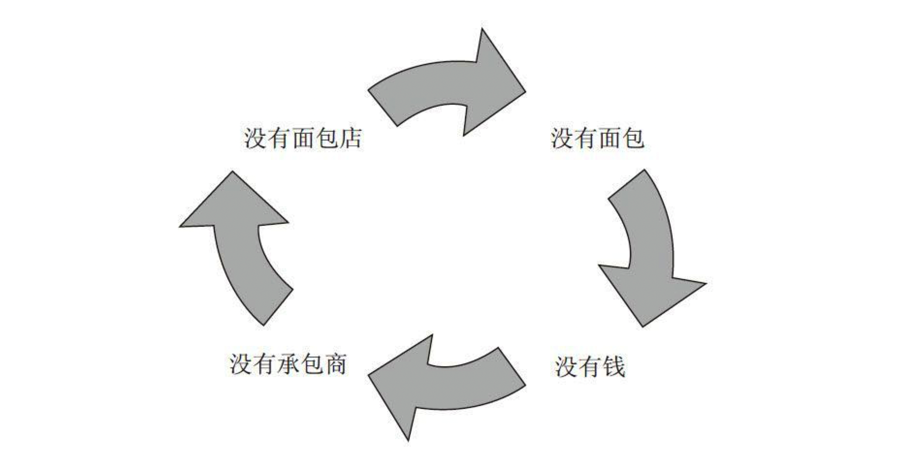
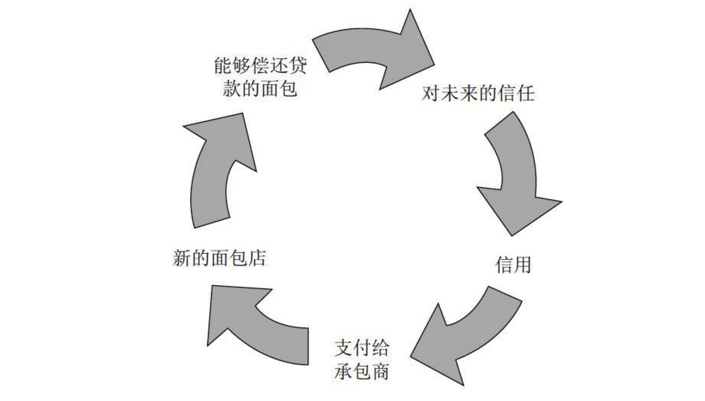
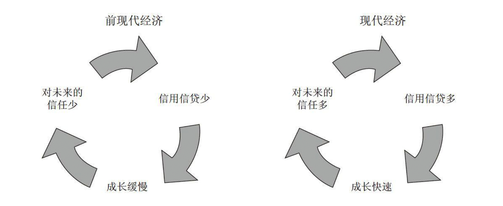

# 人类简史

    作者:  [以色列] 尤瓦尔·赫拉利
    出版社: 中信出版社
    副标题: 从动物到上帝
    原作名: A brief history of humankind
    译者: 林俊宏
    出版年: 2014-11-1
    页数: 440
    定价: CNY 68.00
    装帧: 平装
    丛书: “中信史学大师畅销经典”系列
    ISBN: 9787508647357

[豆瓣链接](https://book.douban.com/subject/25985021/)

## 第一章 人类：一种也没什么特别的动物
在历史的路上，有三大重要革命：大约7万年前，**“认知革命”**（Cognitive Revolution）让历史正式启动。大约12000年前，**“农业革命”**（Agricultural Revolution）让历史加速发展。而到了大约不过是500年前，**“科学革命”**（Scientific Revolution）可以说是让历史画下句点而另创新局。

生物学家把所有生物划分成不同的 **“物种”**。而所谓属于同一物种，就是它们会彼此交配，能够产出下一代。例如马和驴，虽然有共同的祖先，也有许多类似的身体特征，也能够交配，但它们彼此却是缺少性趣，就算刻意让它们交配，产出的下一代会是骡，而不具有生育能力。相较之下，虽然斗牛犬和西班牙猎犬看来天差地别，却属于同一物种，有一样的DNA库。它们很愿意交配，而且它们的小狗长大后也能再和其他狗交配、子孙满堂。

从同一个祖先演化而来的不同物种，会属于同一个 **“属”**（genus）。例如狮子、老虎、豹和美洲豹，虽然是不同物种，但都是“豹属”（Panthera）。

许多属还能再归类为同一**科**（family），例如猫科（狮子、猎豹、家猫）、犬科（狼、狐狸、豺）、象科（大象、长毛象、乳齿象）。同一科的所有成员，都能追溯到某个最早的雄性或雌性祖先。

每当他们抵达一个新地点，当地的原生人类族群很快就会灭绝。现存历史离我们最近的**梭罗人**遗迹，大约是5万年前。**丹尼索瓦人**在那之后不久也已绝迹。至于**尼安德特人**，是在大约3万年前退出了世界舞台。而到了12000年前，像小矮人般的人类也从**弗洛里斯**岛上永远消失。

究竟智人胜出的秘诀为何？目前最可能的解答，正是让人得以辩论的原因：智人之所以能征服世界，是因为有独特的语言。

## 第二章 知善恶树
大约就是在距今7万到3万年前，出现了新的思维和沟通方式，这也正是所谓的**认知革命**。会发生认知革命的原因为何？我们无从得知。得到普遍认可的理论认为，某次偶然的基因突变，改变了智人的大脑内部连接方式，让他们以前所未有的方式来思考，用完全新式的语言来沟通。

最常见的理论，认为人类语言最为灵活。虽然我们只能发出有限的声音，但组合起来却能产生无限多的句子，各有不同的含义。于是，我们就能吸收、储存和沟通惊人的信息量，并了解我们周遭的世界。青猴能够向同伴大叫“小心！有狮子！”，但现代人能够告诉朋友，今天上午，在附近的河湾，她看到有一群狮子正在跟踪一群野牛。而且，她还能确切地描述出位置，或是有哪几条路能够抵达。有了这些信息，她的部落成员就能一起讨论，该怎么逼近河边，把狮子赶走，让野牛成为自己的囊中物。

第二种理论，也同意人类语言是沟通关于世界的信息的方式。然而，最重要的信息不是关于狮子和野牛，而是关于人类自己。我们的语言发展成了一种八卦的工具。根据这一理论，智人主要是一种社会性的动物，社会合作是我们得以生存和繁衍的关键。对于个人来说，光是知道狮子和野牛的下落还不够。更重要的，是要知道自己的部落里谁讨厌谁，谁跟谁在交往，谁很诚实，谁又是骗子。

最有可能的情况是，无论是八卦理论或是“河边有只狮子”的理论，都有部分属于事实。然而，人类语言真正最独特的功能，并不在于能够传达关于人或狮子的信息，而是**能够传达关于一些根本不存在的事物的信息**。据我们所知，只有智人能够表达关于从来没有看过、碰过、耳闻过的事物，而且讲得煞有其事。

在认知革命之后，传说、神话、神以及宗教也应运而生。不论是人类还是许多动物，都能大喊：“小心！有狮子！”但在认知革命之后，智人就能够说出：“狮子是我们部落的守护神。”“讨论虚构的事物”正是智人语言最独特的功能。

**“虚构”这件事的重点不只在于让人类能够拥有想象，更重要的是可以“一起”想象，编织出种种共同的虚构故事**，不管是《圣经》的《创世记》、澳大利亚原住民的“梦世记”（Dreamtime），甚至连现代所谓的国家其实也是种想象。这样的虚构故事赋予智人前所未有的能力，让我们得以集结大批人力、灵活合作。

借由八卦来**维持的最大“自然”团体大约是150人**。只要超过这个数字，大多数人就无法真正深入了解、八卦所有成员的生活情形。

即使到了今天，人类的团体还是继续受到这个神奇的数字影响。只要在150人以下，不论是社群、公司、社会网络还是军事单位，只要靠着大家都认识、彼此互通消息，就能够运作顺畅，而不需要规定出正式的阶层、职称、规范。

无论是现代国家、中世纪的教堂、古老的城市，或者古老的部落，任何大规模人类合作的根基，都在于某种只存在于集体想象中的**虚构故事**。

以上这些东西，其实都只存在人类自己发明并互相讲述的故事里。除了存在于人类共同的想象之外，这个宇宙中根本没有神、没有国家、没有钱、没有人权、没有法律，也没有正义。

要说出有效的故事，其实并不容易。难的点不在于讲故事，而在于要让人相信。于是，历史上也就不断围绕着这个问题打转：究竟某个人是如何说服数百万人去相信神、民族或是有限公司这些故事？然而，只要把故事说得成功，就会让智人拥有巨大的力量，因为这能使得数以百万计的陌生人合力行事，为了共同的目标而努力。

从认知革命以来，智人一直就生活在**一种双重的现实之中**。一方面，我们有像是河流、树木和狮子这种确实存在的客观现实；而另一方面，我们也有像是神、国家和企业这种想象中的现实。

所有动物只有智人能够进行贸易，而所有我们有详细证据证明存在的贸易网络都明显以虚构故事为基础。例如，如果没有信任，就不可能有贸易，而要相信陌生人又是件很困难的事。

## 第五章 史上最大骗局
普遍来说，农民的工作要比采集者更辛苦，而且到头来的饮食还要更糟。农业革命可说是史上最大的一桩骗局。

真正的主要嫌疑人，就是那极少数的植物物种，其中包括小麦、稻米和马铃薯。人类以为自己驯化了植物，但其实是植物驯化了智人。

## 第六章 盖起金字塔
不论是人文科学还是社会科学，人们都已经花了大把精力来解释这些想象建构的秩序会如何融入我们的生活。有三大原因，让人类不会发现组织自己生活的种种秩序其实是想象：

1. 想象建构的秩序深深与真实的世界结合。
1. 想象建构的秩序塑造了我们的欲望。
1. 想象建构的秩序存在于人和人之间思想的连接。
    - **“客观”** 事物的存在，不受人类意识及信念影响。例如“放射线”，就不是一个虚构的故事。早在人类发现放射线之前，放射线就已经存在；而且就算有人不相信有放射线存在，还是会受到它的伤害。像是发现放射线的居里夫人，就没想过多年研究放射性物质会伤害她的身体。虽然她不相信放射线会对她有害，最后她还是死于因为过度暴露于放射性物质而造成的再生障碍性贫血。
    - **“主观”** 事物的存在，靠的是某个单一个人的意识和信念。如果这个人改变了自己的信念，这项主观事物也就不复存在或是跟着改变。像是许多小孩都会想象自己有个只有自己看得到、听得着的朋友。这个想象中的朋友只存在于孩子的主观意识中，等孩子长大、不再相信，这个朋友也就烟消云散。
    - **“主体间”** 事物的存在，靠的是许多个人主观意识之间的连接网络。就算有某个人改变了想法，甚至过世，对这项事物的影响并不大。但如果是这个网络里面的大多数都死亡或是改变了想法，这种“主体间”的事物就会发生改变或是消失。之所以会有事物存在于主体之间，其目的并不是想存心骗人，也不是只想打哈哈敷衍。虽然它们不像放射线会直接造成实质影响，但对世界的影响仍然不容小觑。历史上有许多最重要的驱动因素，都是这种存在于主体之间的概念想法：法律、金钱、神、国家。

## 第十六章 资本主义教条

人类就这样在这种困境里困了几千年，结果就是经济冻结、无力成长。一直要到现代，基于对未来的信任，我们才发展出一套新的系统，才终于有办法跳出这个困境。

现代经济的奇妙循环：

图解世界经济史：

现代资本主义经济的一大重点，就在于出现了一种新的道德标准：应该把利润拿出来，继续投资生产。

资本主义之名正是由此而来。所谓的“资本主义”（Capitalism），认为“资本”（capital）与“财富”（wealth）有所不同。资本指的是投入生产的各种金钱、物品和资源。

资本主义的基本原则在于，因为不论是正义、自由甚至快乐都必须依赖于经济成长，所以可说经济成长就是至善（或至少十分接近）。

## 第十七章 工业的巨轮
工业革命的核心，其实就是能源转换的革命。我们已经一再看到，我们能使用的能源其实无穷无尽。讲得更精确，唯一的限制只在于我们的无知。
