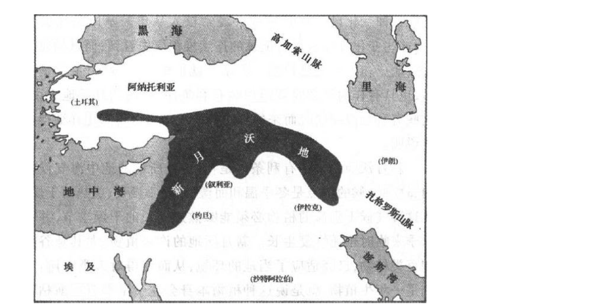
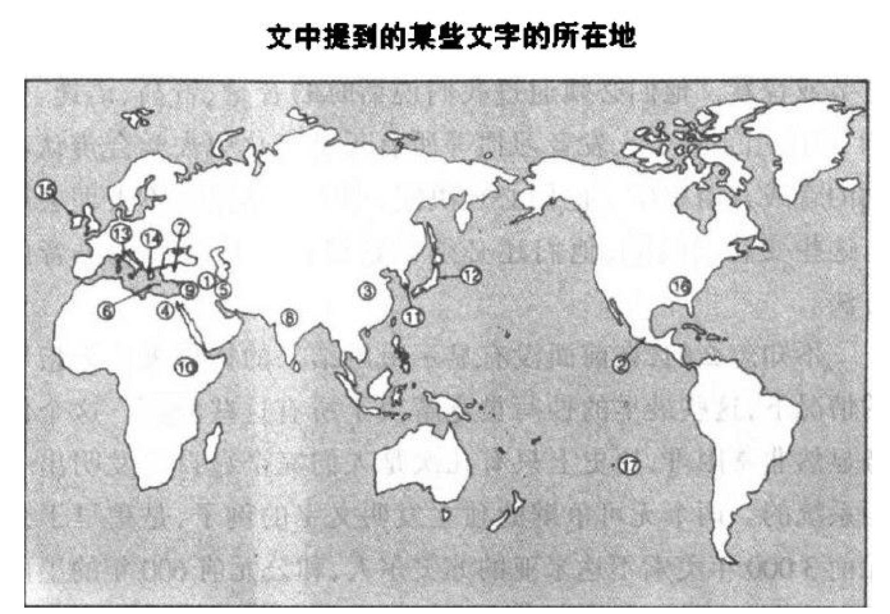
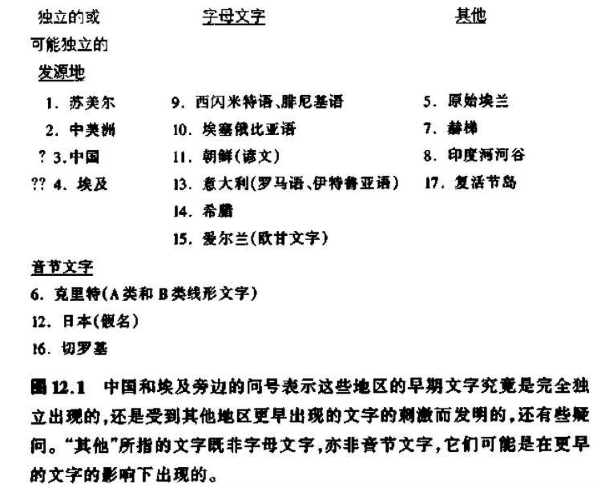
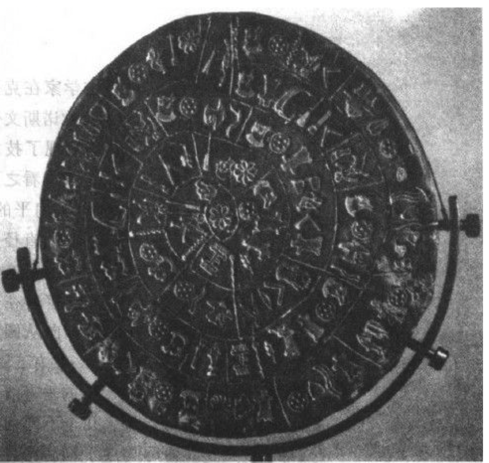

    作者:  [美] 贾雷德·戴蒙德
    出版社: 上海译文出版社
    副标题: 人类社会的命运（修订版）
    原作名: Guns, Germs, and Steel: The Fates of Human Societies
    译者: 谢延光
    出版年: 2014-8
    页数: 493
    定价: 68.00
    装帧: 平装
    丛书: 睿文馆
    ISBN: 9787532765393

[豆瓣链接](https://book.douban.com/subject/25902448/)

- [第一章 走上起跑线](#%e7%ac%ac%e4%b8%80%e7%ab%a0-%e8%b5%b0%e4%b8%8a%e8%b5%b7%e8%b7%91%e7%ba%bf)
- [第二章 历史的自然实验](#%e7%ac%ac%e4%ba%8c%e7%ab%a0-%e5%8e%86%e5%8f%b2%e7%9a%84%e8%87%aa%e7%84%b6%e5%ae%9e%e9%aa%8c)
- [第三章 卡哈马卡的冲突](#%e7%ac%ac%e4%b8%89%e7%ab%a0-%e5%8d%a1%e5%93%88%e9%a9%ac%e5%8d%a1%e7%9a%84%e5%86%b2%e7%aa%81)
- [第四章 农民的力量](#%e7%ac%ac%e5%9b%9b%e7%ab%a0-%e5%86%9c%e6%b0%91%e7%9a%84%e5%8a%9b%e9%87%8f)
- [第六章 种田还是不种田](#%e7%ac%ac%e5%85%ad%e7%ab%a0-%e7%a7%8d%e7%94%b0%e8%bf%98%e6%98%af%e4%b8%8d%e7%a7%8d%e7%94%b0)
- [第七章 怎样识别杏仁](#%e7%ac%ac%e4%b8%83%e7%ab%a0-%e6%80%8e%e6%a0%b7%e8%af%86%e5%88%ab%e6%9d%8f%e4%bb%81)
- [第八章 问题在苹果还是在印第安人](#%e7%ac%ac%e5%85%ab%e7%ab%a0-%e9%97%ae%e9%a2%98%e5%9c%a8%e8%8b%b9%e6%9e%9c%e8%bf%98%e6%98%af%e5%9c%a8%e5%8d%b0%e7%ac%ac%e5%ae%89%e4%ba%ba)
- [第九章 斑马、不幸的婚姻和安娜·卡列尼娜原则](#%e7%ac%ac%e4%b9%9d%e7%ab%a0-%e6%96%91%e9%a9%ac%e4%b8%8d%e5%b9%b8%e7%9a%84%e5%a9%9a%e5%a7%bb%e5%92%8c%e5%ae%89%e5%a8%9c%e5%8d%a1%e5%88%97%e5%b0%bc%e5%a8%9c%e5%8e%9f%e5%88%99)
- [第十章 辽阔的天空与偏斜的轴线](#%e7%ac%ac%e5%8d%81%e7%ab%a0-%e8%be%bd%e9%98%94%e7%9a%84%e5%a4%a9%e7%a9%ba%e4%b8%8e%e5%81%8f%e6%96%9c%e7%9a%84%e8%bd%b4%e7%ba%bf)
- [第十一章 牲畜的致命礼物](#%e7%ac%ac%e5%8d%81%e4%b8%80%e7%ab%a0-%e7%89%b2%e7%95%9c%e7%9a%84%e8%87%b4%e5%91%bd%e7%a4%bc%e7%89%a9)
- [第十二章 蓝图和借用字母](#%e7%ac%ac%e5%8d%81%e4%ba%8c%e7%ab%a0-%e8%93%9d%e5%9b%be%e5%92%8c%e5%80%9f%e7%94%a8%e5%ad%97%e6%af%8d)
- [第十三章 需要之母](#%e7%ac%ac%e5%8d%81%e4%b8%89%e7%ab%a0-%e9%9c%80%e8%a6%81%e4%b9%8b%e6%af%8d)
- [第十四章 从平等主义到盗贼统治](#%e7%ac%ac%e5%8d%81%e5%9b%9b%e7%ab%a0-%e4%bb%8e%e5%b9%b3%e7%ad%89%e4%b8%bb%e4%b9%89%e5%88%b0%e7%9b%97%e8%b4%bc%e7%bb%9f%e6%b2%bb)
- [第十八章 两个半球的碰撞](#%e7%ac%ac%e5%8d%81%e5%85%ab%e7%ab%a0-%e4%b8%a4%e4%b8%aa%e5%8d%8a%e7%90%83%e7%9a%84%e7%a2%b0%e6%92%9e)
- [尾声 人类史作为一门科学的未来](#%e5%b0%be%e5%a3%b0-%e4%ba%ba%e7%b1%bb%e5%8f%b2%e4%bd%9c%e4%b8%ba%e4%b8%80%e9%97%a8%e7%a7%91%e5%ad%a6%e7%9a%84%e6%9c%aa%e6%9d%a5)
- [附录 2003后记：《枪炮、病菌与钢铁》今日谈](#%e9%99%84%e5%bd%95-2003%e5%90%8e%e8%ae%b0%e6%9e%aa%e7%82%ae%e7%97%85%e8%8f%8c%e4%b8%8e%e9%92%a2%e9%93%81%e4%bb%8a%e6%97%a5%e8%b0%88)

## 第一章 走上起跑线
人类的历史与动物的历史分道扬镳，大约在**700万年前开始于非洲**（据估计在500万至900万年之前）。约当此时，非洲猿的一个种群分成了几个种群，其中一支继续演化成现代大猩猩，一支演化成两种现代黑猩猩，还有一支则演化成人类。

一些化石表明，我们的直系祖先到了大约400万年前基本上已能直立，然后在大约250万年前身体开始长高，相对脑容量开始增大。

这说明了50万年前的非洲人和欧洲人的头骨与我们现代人的头骨已相当近似，所以被归入我们智人这一类，而不是归入直立人一类。

从13万到40万年前，欧洲和亚洲西部人口的集中体现是特别众多的骨骼化石，他们被认为是**尼安德特人**，有时被归入一个单独的人种——尼安德特人。尽管尼安德特人在许多漫画里被描绘成住在洞穴里像猿一样的野蛮人，但他们的**脑却比我们的还要稍大一些。有强有力的证据表明，他们还是第一批懂得埋葬死者、照顾病人的人。**

人类历史终于在大约5万年前开始了，也就是在我所说的“大跃进”时期。

在**克罗马努人**的遗物堆积中不仅有石器，而且还有骨器。骨器易于成形（如做成鱼钩）这一点显然是以前的人所没有认识到的。有些工具做成了各种不同的特殊形状，就像现代的工具一样，有针，有锥子，有雕刻工具，还有其他等等，对它们的功用我们全都一目了然。出土的不仅仅是单件工具，如手持的刮削器，出土的还有多件复合工具。在克罗马努人遗址上可以认出来的复合武器包括鱼叉、梭镖投掷器，最后还有弓箭这些能在安全距离内进行捕杀的有效手段可以用来猎取犀牛、大象之类的危险猎物，而发明了用来结网、做钓鱼线和陷阱的绳子，就使我们的饮食又增加了鱼和鸟这样的美味。

房屋和缝制服装的残迹，证明了人类在寒冷气候下生存的能力大大提高了，而残留的首饰和仔细埋葬的骸骨，则表明了革命性的审美观和精神层次上的发展。

在一直保存完好的克罗马努人的物品中，最著名的是他们的艺术作品：壮丽的洞穴壁画、雕像和乐器。

显然，从大约10万年到5万年前，我们祖先的能力发生了某种重大的变化。那次大跃进提出了两个未解决的主要问题，即其触发原因及发生地点问题。至于原因问题，我曾在《第三种黑猩猩》一书中主张，是喉的完善为现代语言提供了解剖学的基础，而发挥人的创造力是要大大依靠语言的。而另外一些人则提出，在当时脑容量不变的情况下脑组织发生的变化，使现代语言成为可能。

大约4万年前，克罗马努人带着他们现代人的体格、优良的武器和其他先进的文化特征进入欧洲。不出几千年，尼安德特人不复存在，虽然几千年来，他们作为欧洲唯一的居民，一直在这块土地上繁衍生息。这个结果有力地表明了，现代的克罗马努人以某种方式利用他们的远为优良的技术和他们的语言技能或智慧，用病菌传染、杀害或取代了尼安德特人，而又很少或根本没有任何证据可以证明尼安德特人和克罗马努人之间的混合现象。

## 第二章 历史的自然实验
莫里奥里人还没有来得及发出那个建议，毛利人已开始了全面进攻。在以后的几天中，他们杀死了数以百计的莫里奥里人，把他们的许多尸体煮来吃，并把其余所有的人变为奴隶，在其后的几年中又把其中大多数人随心所欲地杀死。

毛利人和莫里奥里人的这次冲突使人们了解到一个可怕事实，原来这两个群体是在不到1000年前从同一个老祖宗那里分化出来的。他们都是波利尼西亚人。现代毛利人是公元1000年左右移居新西兰的波利尼西亚农民的后代。在那以后不久，这些毛利人中又有一批移居查塔姆群岛，变成了莫里奥里人。在这两个群体分道扬镳后的几个世纪中，他们各自朝相反的方向演化，北岛毛利人发展出比较复杂的技术和政治组织，而莫里奥里人发展出来的技术和政治组织则比较简单。莫里奥里人回复到以前的狩猎采集生活，而北岛毛利人则转向更集约的农业。

要追溯查塔姆群岛和新西兰的不同环境是如何不同地塑造了莫里奥里人和毛利人的，这容易做到。虽然最早在查塔姆群岛移民的毛利人祖先可能都是农民，但毛利人的热带作物不可能在查塔姆群岛的寒冷气候下生长，所以那些移民别无他法，只得重新回到狩猎采集生活。由于他们以狩猎采集为生，他们不能生产多余的农作物供重新分配和贮藏之用，所以他们无法养活不事狩猎的专门手艺人、军队、行政官员和首领。他们的猎物有海豹、有壳水生动物、巢居海鸟和鱼，这些猎物可以用手或棍棒来捕捉，不需要更复杂的技术。此外，查塔姆群岛都是一些比较小、比较偏远的岛屿，能够养活的总人口只有2000个左右的以狩猎采集为生的人。由于没有其他可以到达的岛屿用来移民，这些莫里奥里人只得留在查塔姆群岛，学会彼此和睦相处。他们通过宣布放弃战争来做到这一点，他们还通过阉割一些男婴来减少人口过剩的潜在冲突。其结果是出现了一个小小的不好战的群体，他们的技术和武器简单粗陋，他们也没有强有力的领导和组织。

相比之下，新西兰的北部（比较温暖）是波利尼西亚的最大岛群，适宜于波利尼西亚的农业。留在新西兰的那些毛利人人数增加了，直到超过10万人。他们在局部地区形成了密集的人口，这些人长期从事与邻近居民的残酷战争。由于他们栽种的农作物有剩余并可用来贮藏，他们养活了一些专门的手艺人、首领和兼职士兵。他们需要并制作了各种各样的工具，有的用来栽种农作物，有的用来打仗，还有的用来搞艺术创作。他们建造了精致的用作举行仪式的建筑物和为数众多的城堡。

## 第三章 卡哈马卡的冲突
皮萨罗俘虏阿塔瓦尔帕这件事，表明了导致欧洲人向新大陆移民而不是美洲土著向欧洲移民的那组近似的因素。皮萨罗成功的直接原因包括：以枪炮、钢铁武器和马匹为基础的军事技术；欧亚大陆的传染性流行病；欧洲的航海技术；欧洲国家集中统一的行政组织和文字。

## 第四章 农民的力量
自从现代人的祖先在大约700万年前从现在的类人猿的祖先分化出来后，地球上的所有人类大部分时间都是靠猎捕野兽和采集野生植物为生，只是在过去的11000年中，有些民族才转向所谓的粮食生产：就是说，驯化野生动植物，以因此而产生的牲畜和农作物为食。

**从间接的意义说，粮食生产是枪炮、病菌和钢铁发展的一个先决条件。**

第一个因果关系是最直接的因果关系：能够获得更多的可消耗的卡路里就意味着会有更多的人。

通过在饲养驯化动物的人类社会中，牲畜在4个不同的方面养活了更多的人：提供肉类、奶脂、肥料以及拉犁。

驯化的大型哺乳动物还在两个方面和驯化的植物相互作用，以增加农作物的产量。首先，现代的园林工人或农民仍然根据经验知道，用动物的粪便做肥料可以提高作物的产量。

此外，最大的驯化哺乳动物与驯化植物相互作用，以增加粮食产量，这表现在它们可以用来拉犁，从而使人们可以去耕种以前如用来耕种则代价太高的土地。

另一个比较间接的因素涉及粮食生产所带来的定居生活方式。许多狩猎采集社会里的人经常跑来跑去寻找野生食物，但农民必须留在他们的田地和果园附近。因此而产生的固定居所由于缩短了生育间隔期而促使人口变得更稠密起来。一个经常变换营地、以狩猎采集为生的母亲只能带一个孩子和很少几件随身物品。在前一个蹒跚学步的孩子能够快步行走，赶上大伙儿而不致成为累赘之前，她是不能生第二个孩子的。事实上，到处流浪的以狩猎采集为生的人通过哺乳期无月经、禁欲、杀婴和堕胎等办法，把孩子出生的间隔安排为大约每4年一个。相比之下，定居的部族由于没有在迁移途中携带小孩这种问题的限制，他们可以多生多养，只要养得活就行。许多农业部族的生育间隔期是两年左右，为狩猎采集部族的一半。

定居生活的另一个结果是人们可以把多余的粮食贮藏起来贮藏的粮食对于养活不生产粮食的专门人材是必不可少的这种专门人材有两类：国王和官员。

通过税收建立剩余粮食储备，除了养活国王和官员外，还能养活其他专职的专门人材。与征服战争关系最直接的是，剩余粮食储备可以用来养活职业军人。

它们还有其他用途，例如帮我们保暖和向我们提供有价值的材料。

大多数重要的植物驯化中心不但培育粮食作物，也培育纤维作物——主要有棉花、亚麻（亚麻布的原料）和大麻。

驯化动物的骨头是冶金术发明前新石器时代各部族用作人工制品的重要原料。

驯化的大型哺乳动物在19世纪铁路发展起来之前成为我们主要的陆路运输手段在征服战争中同样重要的是在驯养动物的社会中演化的病菌。像天花、麻疹和流行性感冒这类传染病作为人类的专化病菌出现了，它们原是动物所感染的十分类似的祖代病菌由于突变而衍生出来的（第十一章）。驯养动物的人成了这些新演化出来的病菌的第一个受害者，而这些人接着又逐步形成了对这些新的疾病的强大的抵抗力。

## 第六章 种田还是不种田
觅食的人和觅食的动物一样，都在不断地按优先顺序来作出分配劳力的决定，哪怕是无意识地也是一样。他们首先集中注意力于最喜欢的食物，或者能够产生最高报偿的食物。如果这些食物无法得到，他们就转向不太喜欢的食物。

在作出这些决定时要考虑许多问题。人们寻找食物是为了充饥果腹。他们也渴望得到一些特别的食物，如富有蛋白质的食物、脂肪、盐、甜水果以及只要吃起来味道好的食物。如果所有其他情况都相同，人们就用一种以最少的时间、最小的努力和最大的把握产生最大的回报的方法去寻找食物，从而追求在卡路里、蛋白质或其他特别的食物品种方面得到最大限度的回报。同时，他们也追求最小限度的风险：同按平均时间计算回报率很高但也很可能饿死的一种变化不定的生活方式相比，适中的然而可靠的回报显得更为可取。

我们必须把粮食生产同狩猎采集看作是相互竞争的供选择的办法。在狩猎采集外再种植某些作物或饲养某些牲口的混合经济，不但在和这两种“纯粹”经济竞争，而且也在和粮食生产比例或高或低的混合经济竞争。尽管如此，在过去的10000年间，普遍的结果一直是从狩猎采集转变为粮食生产。

## 第七章 怎样识别杏仁
和其他所有动物（包括人）一样，植物必须将其子代向它们能够茁壮生长的地区扩散，并传递其亲代的基因。小动物的扩散靠行走或飞翔，但植物没有这样的选择自由，因此它们必须以某种方式沿途搭便车旅行。有几种植物的种子生得便于被风吹走或在水上漂流，而其他许多植物则把种子包在好吃的果子里并用颜色和气味来宣告果子的成熟，从而哄骗动物把种子带走。饥饿的动物把这果子扯下来吃掉，或者走开，或者飞走，然后在远离亲代树的某个地方把种子吐出或随粪便排出。种子可以用这种办法被带到几千英里之外。

草莓并不是有意要在种子准备好撒播的时候去招引鸟儿。鸫也不是有意要去驯化草莓。相反，草莓是通过自然选择来演化的。未成熟草莓的颜色越青和味道越酸，在种子成熟前来吃草莓从而使种子遭到破坏的鸟儿就越少；成熟草莓的味道越甜和颜色越红，来撒播成熟种子的鸟儿就越多。

如果说大小和味道是狩猎采集族群选择野生植物的最明显的标准，那么其他标准则包括果实肉多或无子、种子含油多以及纤维长。

许多植物都有其传播种子的专门机制（从而使人类无法对它们进行有效的采集）。只有由突变产生的缺乏这种结构的种子才会被人收获而成为作物的祖先。一个明显的例子就是豌豆。豌豆的种子（我们吃的豌豆）封闭在豆荚里。

野豌豆要发芽生长，就必须破荚而出。为了做到这一点，豌豆就演化出一种基因，能使豆荚突然破裂，把豌豆弹射到地上。偶然产生突变的豌豆的豆荚不会爆裂。在野外，这种产生突变的豌豆一直到死都是包裹在亲株上的豆荚里面，而只有这种能爆裂的豆荚才把它们的基因传递给后代。但与此相反的是，人类能够收获到的唯一豆荚可能就是留在植株上的那些不爆裂的豆荚。因此，一旦人类开始把野豌豆带回家去吃，立刻就产生了对这种单基因突变的选择。对同样不爆裂突变进行选择的例子还有兵豆、亚麻和罂粟。

野生的小麦和大麦不是封闭在能够爆裂的荚子里，而是长在麦秆的顶端，麦秆能自动脱落，使种子落到能够发芽生长的地面上。一种单基因突变使麦秆不会脱落。在野生状态下，这种突变对植物来说可能是毁灭性的，因为种子不能落地，就无法发芽生根。但这些产生突变的种子省力地留在秆子上可能是在等待人类来收获它们并把它们带回家。当人类接着种下了这些收获来的产生突变的种子后，农民又一次可以从这些种子的后代中得到所有产生突变的种子，收获它们，播种它们，而后代中未产生突变的那些种子就落到地上，而无法得到了。这样，农民就180度地改变了自然选择的方向：原来成功的基因突然变得具有毁灭性了，而毁灭性的突变却变得成功了。

有些植物（如向日葵）由于大得多的种子而得到选择，而另一些植物（如香蕉）则由于种子小或没有种子而得到选择。选择生菜则取其茂盛的叶子而舍其种子或果实；选择小麦和向日葵则取其种子而舍其叶；选择南瓜则取其果实而舍其叶。特别有意思的是，由于不同的目的，对于一种野生植物可以有不同的选择，从而产生了外观十分不同的作物。甜菜在巴比伦时代即已有种植，不过那时种植甜菜是为了它们的叶（如叫做牛皮菜的现代甜菜品种），后来再种植则是为了它们可吃的根，最后（在18世纪）则是为了它们所含的糖分（糖用甜菜）。最早的卷心菜可能原本是为了它们的含油种子而被种植的，后来经过甚至更大的分化，对它们也就有了不同的选择：有的选择了叶（现代的卷心菜和羽衣甘蓝），有的选择了茎（撇蓝），有的选择了芽（抱子甘蓝），有的选择了花芽（花椰菜和花茎甘蓝）。

## 第八章 问题在苹果还是在印第安人
人类历史的主要事实之一，是西南亚的那个叫做**新月沃地的地区**（因其在地图上的新月状高地而得名，见图8.1）在人类发展早期的重要性。那个地区似乎是包括城市、文字、帝国以及我们所说的文明（不论是福是祸）在内的一连串新情况发生的地方。

图8.1 新月沃地，包含有公元前7000年的一些粮食生产地。

而所有这些新情况之所以发生，都是由于有了稠密的人口，有了剩余粮食的贮存，以及可以养活不从事农业的专门人材，凡此种种之所以可能又都是由于出现了以作物栽培和牲口饲养为形式的粮食生产。

## 第九章 斑马、不幸的婚姻和安娜·卡列尼娜原则
驯化动物则可定义为：使某种动物在圈养中通过有选择的交配，使其与野生祖先有所不同，以便为控制其繁殖与饲养的人类所利用。

换句话说，驯化就是把野生动物改变成对人类更有用的东西。真正驯化的动物在许多方面不同于它们的野生祖先。这方面的差异是由两个过程产生的：人类对那些比同种中其他动物个体更有益于人类的动物个体所作出的选择，和动物对在不同于野生环境的人类环境中起作用的自然选择变异力量所作出的自动演化反应。

总之，在全世界作为驯化候补者的148种陆生食草类大型野生哺乳动物中，只有14种通过了试验。为什么其余的134种没有能通过试验呢？

答案来自`安娜·卡列尼娜原则`。要能得到驯化，每一种候补的野生动物都必须具有许多不同的特点。缺少了哪一个必不可少的特点，都会使驯化的努力失败，就像使建立幸福婚姻的努力失败一样。

- **日常食物**。每一次某种动物在吃某种植物或另一种动物时，食物生物量转换为取食者生物量的效率远远低于100%：通常在10%左右。由于这种根本性的缺乏效率，没有一种食肉的哺乳动物为了充当食物而被驯化。
- **生长速度**。为了值得饲养，驯化动物也必须生长迅速。这个要求把大猩猩和大象给排除了
- **圈养中的繁殖问题**。我们人类不喜欢在众目睽睽之下性交；有些具有潜在价值的动物也不喜欢这样做。这就是对陆地上跑得最快的动物猎豹的驯化尝试中途夭折的原因凶险的性情。一个明显的例子是灰熊。另一种本来合适但由于同样明显的原因而被自己取消了驯化候补资格的动物是非洲野牛。
- **容易受惊的倾向**。大多数鹿和羚羊（驯鹿是显著的例外）属于前一种，绵羊和山羊则属于后一种。
- **群居结构**。几乎所有驯化的大型哺乳动物都证明它们的野生祖先具有3个共同的群居特点：它们生活在群体里；它们在群体成员中维持着一种完善的优势等级；这些群体占据重叠的生活范围，而不是相互排斥的领域。这种群居结构对驯化是很理想的，因为人类事实上把这种优势等级照搬了过来。在野生环境中，它们看到的是同种的成员，但在圈养状态下，群体中的幼兽看到的还有身旁的人，于是也就把人牢牢地记住了。这种群居动物适合于放牧。既然它们彼此相安无事，所以就能把它们集中在一起。既然它们本能地跟随一个起支配作用的领袖，而且把人当作那个领袖而牢牢记住，所以它们就乐于接受牧人或牧羊狗的驱赶。相形之下，独居的地盘性的动物就不能把它集中起来放牧。它们彼此不能相容，它们没有把人牢牢地记在心上，它们也不会本能地顺从。

## 第十章 辽阔的天空与偏斜的轴线
轴线走向影响了作物和牲口的传播速度，可能还影响文字、车轮和其他发明的传播速度。

某种作物的迅速传播可能不但抢先阻止了同一植物的野生祖先在其他某个地方的驯化，而且也阻止了有亲缘关系的野生植物的驯化。

例如，今天全世界种植的棉花有95%属于史前时期在中美洲驯化的短绒棉。然而，史前期南美洲农民种植的却是巴巴多斯棉。显然，中美洲的棉花难以到达南美洲，才使它未能在史前时代抢先阻止那里不同品种的棉花得到驯化（反之亦然）。辣椒、南瓜属植物、苋属植物和藜科植物是另一些作物，它们的一些不同的然而有亲缘关系的品种是在中美洲和南美洲驯化的，因为没有一个品种的传播速度能够快到抢先阻止其他品种的驯化。

新月沃地的大多数始祖作物很快就到达了埃及，然后向南传播，直到凉爽的埃塞俄比亚高原地区，它们的传播也就到此为止。南非的地中海型气候对这些作物来说应该是理想的，但在埃塞俄比亚与南非之间的那2000英里的热带环境成了一道不可逾越的障碍。

同样，新月沃地的家畜通过非洲向南的传播也由于气候和疾病（尤其是采采蝇传染的锥虫病）而停止或速度减慢。马匹所到的地方从来没有超过赤道以北的一些西非王国。在2000年中，牛、绵羊和山羊在塞伦格蒂大平原的北缘一直止步不前，而人类的新型经济和牲畜品种却仍在发展。

墨西哥驯养的火鸡和美国东部种植的向日葵本来也是可以在安第斯山脉茁壮生长的，但它们在向南传播时被隔在中间的热带气候区阻挡住了。

## 第十一章 牲畜的致命礼物
关于病菌的历史作用的最令人生畏的例子，来自随同哥伦布1492年的航行而开始的欧洲人对美洲的征服。虽然被那些杀人不眨眼的西班牙征服者杀死的印第安人不计其数，但凶恶的西班牙病菌杀死的印第安人却要多得多。

为什么病菌会演化出杀死宿主这种明显自拆台脚的策略呢？从病菌的角度看，那只是宿主症状促进病菌高效传播的一个无心的附带结果（对我们来说真是一个莫大的安慰！）。是的，一个没有得到治疗的霍乱病人，最后可能因为每天拉稀达几加仑而送命。然而，至少在一段时间里，只要这病人仍然活着，霍乱菌就会由于大量传播进下一个受害者的饮用水源而得到好处。倘若每个受害者因而平均感染一个以上的新的受害者，那么即使第一个宿主碰巧死了，霍乱菌仍然会传播开去。

疾病代表了一步步的演化，而病菌则通过自然选择适应新的宿主和传病媒介。

1519年科尔特斯率领600个西班牙人在墨西哥海岸登陆，去征服拥有好几百万人口的勇猛好战的阿兹特克帝国。科尔特斯到达阿兹特克的首都特诺奇提特兰城，又带着他的“仅仅”损失了三分之二的队伍逃走，并一路打回海岸，这既证明了西班牙人的军事优势，也证明了阿兹特克人开始时的幼稚。但当科尔特斯的第二次袭击来到时，阿兹特克人就不再幼稚，而是极其顽强地展开了巷战。使西班牙人取得决定性优势的是天花。1520年，天花随着一个受到感染的来自西班牙属地古巴的奴隶到达墨西哥。由此而产生的天花流行接着杀死了阿兹特克的近一半人口，包括奎特拉瓦克皇帝。

皮萨罗于1531年率领168个人在秘鲁海岸登陆去征服有几百万人口的印加帝国时，同样带来了一场浩劫。对皮萨罗来说幸运的而对印加人来说不幸的是，天花已在1526年由陆路到达，杀死了印加的很大一部分人口，包括瓦伊纳·卡帕克皇帝和他的指定继承人。

梅毒、淋病、肺结核和流行性感冒于1779年随库克船长到来，接着于1804年又发生了一场斑疹伤寒大流行以及后来的许多“较小的”流行病，把夏威夷的人口从1779年的50万左右减少到1853年的84000人。这一年，天花终于来到了夏威夷，把剩下的人又杀死了1万左右

## 第十二章 蓝图和借用字母
有3个基本策略构成了书写系统的基础。在由一个书写符号代表的言语单位的大小方面，这些策略是不同的：一个基本的音，一个完整的音节，或者一个完整的词。在这些书写系统中，今天大多数民族使用的系统是字母表，而字母表最好要能为语言的每一个基本的音（音素）提供一个独一无二的符号（称为字母）。但实际上，大多数字母表只有20或30个左右的字母，而大多数语言的音素又多于它们的字母表中的字母。因此，大多数用字母书写的语言，包括英语，不得不给同一个字母规定几个不同的音素，并把字母组合来代表某些音素，如英语中的两个字母的组合sh和th（而在俄语和希腊语字母表中，则分别由一个字母代表一个音素）。

第二个策略就是利用所谓语标，就是说用一个书写符号来代表一个完整的词。这是中国文字的许多符号的功能，也是流行的日语书写系统（称为日文汉字）的功能。在字母文字传播以前，大量利用语标的书写系统更为普通，其中包括埃及象形文字、玛雅象形文字和苏美尔楔形文字。

第三个策略是本书大多数读者最不熟悉的，也就是用一个符号代表一个音节。其实大多数这样的书写系统（称为音节文字）就是用不同的符号代表一个辅音和后面的一个元音所构成的音节（如“fa-mi-ly”这个词的音节），并采用各种不同的办法以便借助这些符号来书写其他类型的音节。音节文字在古代是很普通的，如迈锡尼时代希腊的B类线形文字。有些音节文字直到今天仍有人使用，其中最重要的就是日本人用于电报、银行结单和盲人读本的假名。

在公元3000年前的最后几百年中，记账技术、格式和符号的发展迅速导致了第一个书写系统的产生。

1810年左右，塞阔雅决定去为切罗基语设计一种书写系统。他又一次开始画图，但由于画图太复杂，在艺术上要求太高，就放弃了。接下去他为每一个词发明一些单独的符号，但在他创造了几千个符号而仍然不够用时，他又觉得不满意了。

最后，塞阔雅认识到，词是由一些不同的声音组成的，这些声音在许多不同的词里反复出现——这就是我们所说的音节。他开始时设计出200个音节符号，又逐步减少到85个，大多数符号代表一个辅音和一个元音的组合。

塞阔雅发明的代表切罗基语音节的一组符号。

古代苏美尔的国王和祭司们希望文字由专职的文字记录者用来记录应完税缴纳的羊的头数，而不是由平民大众用来写诗和图谋不轨的。

人类学家克洛德·列维——斯特劳斯所说的那样，古代文字的主要功能是“方便对别人的奴役”。

## 第十三章 需要之母
1908年7月3日，一些考古学家在克里特岛上对菲斯托斯的古代弥诺斯文化时期的宫殿进行发掘，无意中发现了技术史上最引人注目的物品之一。它乍看之下似乎貌不惊人，只是一个小小的、扁平的、没有彩绘的圆盘，由黏土烘制而成，直径为6.5英寸。再仔细观察一下，就发现这个圆盘的每一面都布满了文字，文字落在一条曲线上，而曲线则以顺时钟方向从圆盘边缘呈螺旋形通向圆盘中央，一共有5圈。总共241个字母符号由刻出来的垂直线整齐地分成若干组，每组包含几个不同的符号，可能就是这些符号构成了词。

这位印工显然有一套至少45个印章，一个印章印出圆盘上的一个符号。制作这些印章必然要花费大量的劳动，而它们肯定不是仅仅为了印这一个文件而被制造出来的。使用这些印章的人大概有许多东西要写。有了这些印章，印章的主人就可以迅速得多、整齐得多地去进行复制，这是他或她在每一个地方写出每一个文字的复杂符号所无法比拟的。

菲斯托斯双面圆盘的一面

菲斯托斯圆盘开启了人类印刷业的后续努力。

“需要乃发明之母”这个格言所表达的普遍观点。就是说，发明的出现可能是由于社会有一种未得到满足的需要：人们普遍承认，某种技术是不能令人满意的，或是作用有限的。想要做发明家的人为金钱和名誉的前景所驱使，察觉到了这种需要，并努力去予以满足。某个发明家最后想出了一个比现有的不能令人满意的技术高明的解决办法。如果这个解决办法符合社会的价值观，与其他技术也能协调，社会就会予以采纳。

## 第十四章 从平等主义到盗贼统治
从古至今的盗贼统治者混合使用了4种办法：

1. 解除平民的武装，同时武装上层掌权人物。
2. 用通行的方法把得到的财物的很大一部分再分配给群众来博取他们的欢心。这个原则对过去的夏威夷的酋长与对今天的美国政治家同样有效。
3. 利用对武力的绝对控制来维持公共秩序和制止暴力以促进社会幸福。这可能是中央集权的社会对非中央集权的社会的一个巨大的、未得到正确评价的优势。
4. 盗贼统治者为了得到公众支持而使用的最后一个方法，是制造一种为盗贼统治辩护的意识形态或宗教。

## 第十八章 两个半球的碰撞
在帮助欧洲征服美洲的一些直接因素中，可与病菌相提并论的是技术的各方面的差距。这些差距归根到底是由于欧亚大陆有历史悠久得多的依靠粮食生产的人口稠密、经济专业化、政治集中统一、相互作用、相互竞争的社会。有5个技术领域可以挑出来讨论：

- 第一，金属——开始时是铜，后来是青铜，最后是铁——到1492年止已在所有复杂的欧亚大陆社会被用作工具。相比之下，虽然铜、银、金和一些合金已在安第斯山脉地区和美洲的其他一些地方被用作饰物，但石头、木头和骨头在所有印第安社会中仍然是制作工具的主要材料，这些社会只在局部地区有限地利用铜器。
- 第二，欧亚大陆的军事技术比美洲的军事技术要有效能得多。欧洲的兵器是钢刀、长矛和匕首，辅以小型火器和火炮，而护身的盔甲也是由纯钢打就的，或是由锁子甲做成的。印第安人不用钢铁，他们用棍棒、用石制或木制的斧头（在安第斯山脉地区偶尔也有用铜制的）、投石器、弓箭和加软衬料缝制的盔甲，这些东西无论防护还是进攻，效果都差得多。另外，印第安军队没有任何可以与马匹相抗衡的牲口，而马匹在进攻和快速运输方面的价值使欧洲人获得了压倒性的优势，直到有些印第安社会后来也采用了马匹。
- 第三，欧亚大陆社会在利用动力源运转机械方面拥有巨大的优势。超越人力的最早进展是利用动物——牛、马和驴——来拉犁耕地和转动轮子来磨谷、提水、灌溉或排水。水轮在罗马时代就已出现了，后来到了中世纪数量日渐增多，这时又出现了潮汐磨机和风车。这些利用水力和风力的机械和传动轮系统结合起来，不但被用来磨谷和运水，而且还可用于多种多样的制造目的，包括榨糖，为鼓风炉拉风箱，碾碎矿石，造纸，打磨石头，榨油，制盐，织布和锯木。习惯上都是把产业革命武断地定为从18世纪的英国利用蒸汽动力开始，但事实上一种以水力和风力为基础的产业革命在中世纪时就已在欧洲的许多地方开始了。直到1492年，所有这些在欧亚大陆用畜力、水力和风力来做的工作，在美洲仍旧靠人力来做。
- 除了在病菌和技术方面的差异外，欧亚大陆社会和印第安社会在政治组织方面也存在着差异。到中世纪晚期或文艺复兴时期，欧亚大陆的大部分地区已在有组织的国家的统治之下。其中的哈布斯堡王朝、奥斯曼帝国、中国的历代王朝、印度的莫卧儿帝国和13世纪达到全盛时期的蒙古帝国，一开始就是通过征服其他国家而形成的多种语言的民族大融合。因此，它们通常被说成是帝国。许多欧亚大陆国家和帝国都有官方的宗教，用以加强国家的凝聚力，使政治领导合法化和批准对其他民族的战争。美洲有两个帝国：阿兹特克帝国和印加帝国。它们在面积、人口、语言的多种组成、官方宗教和征服小国的策源地等方面，与欧亚大陆的一些帝国相似。在美洲，这两个帝国是仅有的能够以许多欧亚大陆国家的那种规模调动人力物力兴建公共工程或进行战争的两个政治单位，而7个欧洲国家（西班牙、葡萄牙、英国、法国、荷兰、瑞典和丹麦）有能力从1492年到1666年在美洲建立殖民地。在美洲的热带南美地区、阿兹特克帝国统治范围以外的中美洲和美国东南部，也有许多酋长管辖地（其中有些几乎就是小小的国家）。美洲的其余地区只有一些部落和族群组织。
- 最后一个需要予以讨论的直接因素是文字。大多数欧亚大陆国家都有由文化人组成的行政机构，在某些国家里，官员以外的平民大众中也有相当一部分人是有文化的。文字使欧洲社会得到行政管理和经济交换之便，激励与指导探险和征服，并可利用远方和古代的一系列信息和人类经验。相比之下，在美洲，文字只在中美洲很小的一个地区内的上层人士中使用。印加帝国使用了一种以结绳（叫做基普）为基础的会计制度和记忆符号，但作为一种传递详细信息的手段，它还不可能起到文字的作用。

因此，哥伦布时代的欧亚大陆社会，在粮食生产、病菌、技术（包括武器）、政治组织和文字方面，拥有对印第安社会的巨大优势。

## 尾声 人类史作为一门科学的未来
各大陆的环境有无数的不同特点，正是这些不同的特点影响了人类社会的发展轨迹。

在我看来，只有4组差异是最重要的。

- 第一组差异是各大陆在可以用作驯化的起始物种的野生动植物品种方面的差异。这是因为，粮食生产之所以具有决定性的意义，在于它能积累剩余粮食以养活不从事粮食生产的专门人材，同时也在于它能形成众多的人口，从而甚至在发展出任何技术和政治优势之前，仅仅凭借人多就可以拥有军事上的优势。由于这两个原因，从小小的不成熟的酋长管辖地阶段向经济上复杂的、社会上分层次的、政治上集中的社会发展的各个阶段，都是以粮食生产为基础的。但大多数野生的动植物品种证明是不适于驯化的：粮食生产的基础一直是比较少的几种牲畜和作物。原来，各大陆在可以用于驯化的野生动植物的数量方面差异很大，因为各大陆的面积不同，而且在更新世晚期大型哺乳动物灭绝的情况也不同。大型哺乳动物灭绝的情况，在澳大利亚和美洲要比在欧亚大陆或非洲严重得多。因此，就生物物种来说，欧亚大陆最为得天独厚，非洲次之，美洲又次之，而澳大利亚最下，就像耶利的新几内亚那种情况（新几内亚的面积为欧亚大陆的七十分之一，而且其原来的大型哺乳动物在更新世晚期即已灭绝）。
- 第二组因素就是那些影响传播和迁移速度的因素，而这种速度在大陆与大陆之间差异很大。在欧亚大陆速度最快，这是由于它的东西向主轴线和它的相对而言不太大的生态与地理障碍。对于作物和牲畜的传播来说，这个道理是最简单不过的，因为这种传播大大依赖于气候因而也就是大大依赖于纬度。同样的道理也适用于技术的发明，如果不用对特定环境加以改变就能使这些发明得到最充分的利用的话。传播的速度在非洲就比较缓慢了，而在美洲就尤其缓慢，这是由于这两个大陆的南北向主轴线和地理与生态障碍。
- 与影响大陆内部传播的这些因素有关的，是第三组影响大陆之间传播的因素，这些因素也可能有助于积累一批本地的驯化动植物和技术。大陆与大陆之间传播的难易程度是不同的，因为某些大陆比另一些大陆更为孤立。在过去的6000年中，传播最容易的是从欧亚大陆到非洲撒哈拉沙漠以南地区，非洲大部分牲畜就是通过这种传播得到的。但东西两半球之间的传播，则没有对美洲的复杂社会作出过任何贡献，这些社会在低纬度与欧亚大陆隔着宽阔的海洋，而在高纬度又在地形和适合狩猎采集生活的气候方面与欧亚大陆相去甚远。对于原始的澳大利亚来说，由于印度尼西亚群岛的一道道水上障碍把它同欧亚大陆隔开，欧亚大陆对它的唯一的得到证明的贡献就是澳洲野狗。
- 四组也是最后一组因素是各大陆之间在面积和人口总数方面的差异。更大的面积或更多的人口意味着更多的潜在发明者，更多的互相竞争的社会，更多的可以采用的发明创造——以及更大的采用和保有发明创造的压力，因为任何社会如果不这样做就往往会被竞争对手所淘汰。

提起这些环境差异不免会使历史学家们贴上那使人火冒三丈的“地理决定论”的标签。

## 附录 2003后记：《枪炮、病菌与钢铁》今日谈
自从GGS出版后，我交到了微软的朋友，也了解了一些该公司在组织形态上的独特之处。微软有众多业务单元，每个单元大约有5到10人，各单元之间沟通自由，而这些单元的管理并非微观管理——每个单元都有追寻各自想法的充分自由。这种不同寻常的组织形态，实际上是

把组织分解为众多互相竞争的半独立单元，和IBM的组织形态截然相反。后者直到几年前还维持着更为孤立的内部结构，结果丧失了竞争力。之后IBM启用了新的首席执行官，雷厉风行地进行变革，现在IBM的组织形态甚至比微软还微软，据说创新能力也因此得到了提升。

所有这些表明，我们或许可以提炼出关于团体组织的通用原则。如果你的目标是创新和竞争力，那么你并不需要过度的统一或过度的分裂。你会希望国家、产业、工业带和公司分解成彼此竞争的团体，同时维持较为自由的沟通，就像包含了50个互相竞争的州的美国联邦政府体制。
